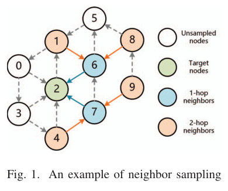
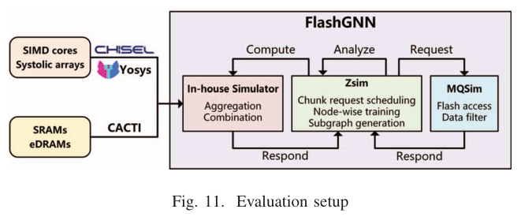
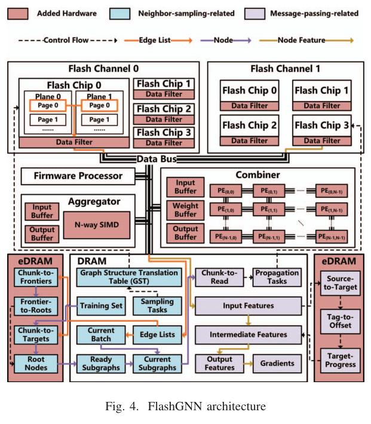
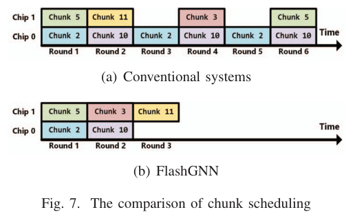
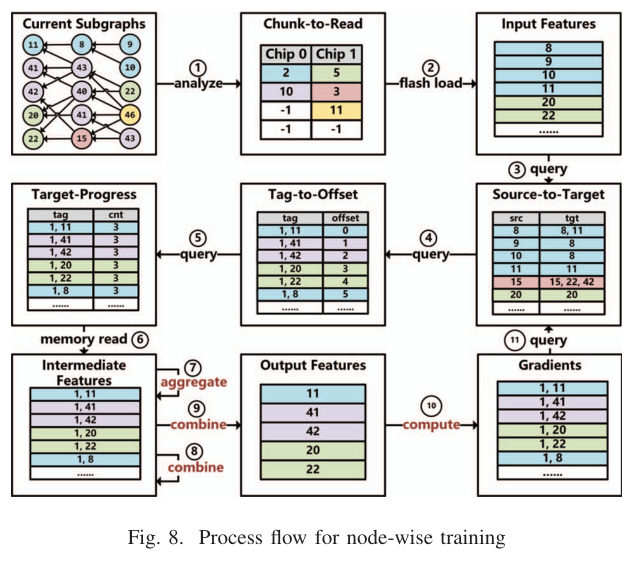
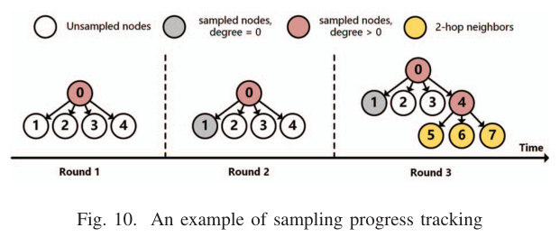
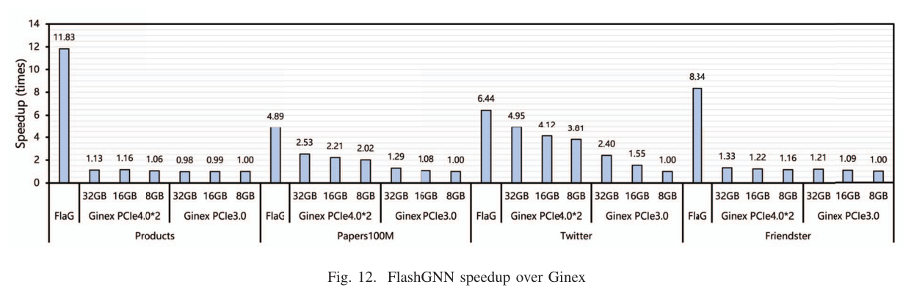
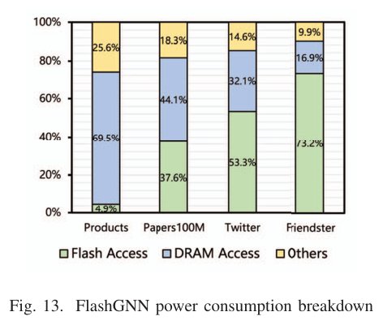
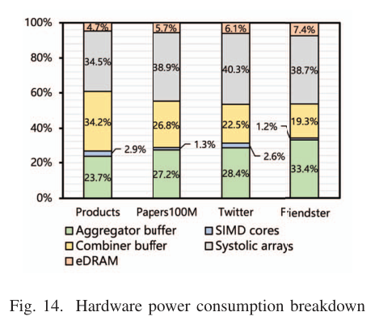
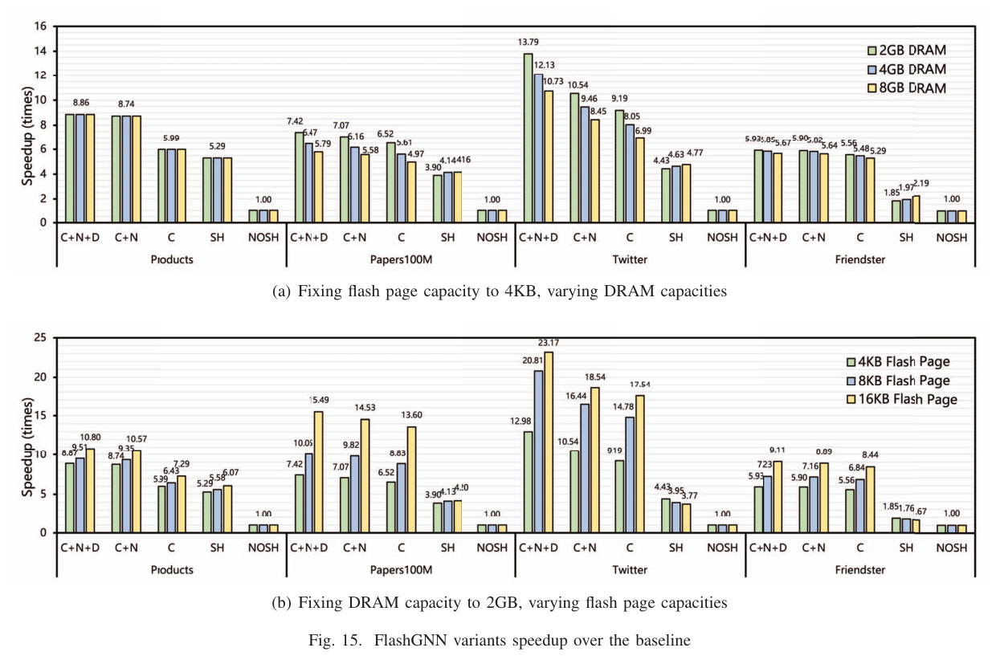

---
tags:
  - papers/computer-architecture
aliases:
  - FlashGNN
  - In-SSD GNN Training
date: 2024
doi: 10.1109/HPCA57654.2024.00035
---

# FlashGNN: An In-SSD Accelerator for GNN Training

## 核心信息
- 标题: FlashGNN: An In-SSD Accelerator for GNN Training
- 标题翻译: FlashGNN：面向图神经网络训练的 SSD 内加速器
- 作者: Fuping Niu, Jianhui Yue, Jiangqiu Shen, Xiaofei Liao, Hai Jin
- 机构: Huazhong University of Science and Technology; Michigan Technological University
- 发表时间: 2024
- 发表渠道: IEEE International Symposium on High-Performance Computer Architecture
- DOI: 10.1109/HPCA57654.2024.00035
- 论文链接: https://doi.org/10.1109/HPCA57654.2024.00035
- 数据 / 资源: ogbn-products, ogbn-papers100M, soc-twitter-mpi-sws, soc-friendster
- 论文类型: 体系结构与系统方法论文

## 原文摘要翻译
近年来，图神经网络已经成为数据分析中的强大工具，并在多种应用中超过传统算法。然而，真实世界数据集规模的增长已经超出集中式处理器或图形处理器系统的能力。为解决这一挑战，已有许多分布式系统被提出，但这些系统由于网络数据交换缓慢而存在硬件利用率低的问题。固态硬盘具有大容量和更好的访问延迟，是一种有前景的替代方案，但单机上的固态硬盘图神经网络训练又受到主机总线数据传输缓慢的限制。实验确认，这一瓶颈会导致处理器和图形处理器利用率偏低。此外，固态硬盘内图神经网络训练的设计还会受到闪存访问缓慢的阻碍。

FlashGNN 是一种用于克服主机总线瓶颈、充分利用闪存芯片输入输出并行性、并最大化已取回闪存块数据复用的图神经网络训练方案。作者通过设计固态硬盘固件来协调数据移动和硬件单元访问。为应对慢速闪存和有限资源带来的设计挑战，论文提出了新的节点级图神经网络训练方法、高效的闪存请求调度算法，以及高性能子图生成方法。实验结果表明，在四个典型真实世界图数据集上，FlashGNN 相比基于固态硬盘的先进训练系统 Ginex 获得 4.89 倍到 11.83 倍的加速，并实现 57.14 倍到 192.66 倍的能耗节省。此外，FlashGNN 相比增强后的存储内加速器 SmartSAGE+ 最高可提升 23.17 倍效率。

## 创新点
1. 论文没有停留在“把计算放进 SSD”这一粗粒度思路，而是把瓶颈拆成 PCIe 数据搬移和闪存内部慢访问两个层次；FlashGNN 同时消除主机往返并调度闪存芯片并行性，因此能解释为什么仅靠主机侧缓存的 Ginex 仍然受限。
2. 闪存块请求调度把一个批次内跨层、跨子图的输入特征依赖合并考虑，按一个块内可服务的源特征数和目标特征数排序，避免按层训练反复读取同一闪存块。
3. node-wise training 用依赖表驱动计算，在目标节点依赖满足后立即推进聚合、组合和反向传播，减少中间状态长期驻留带来的 DRAM 压力，这一点与常规 GPU 训练系统的层同步执行形成明确差异。
4. 数据驱动子图生成利用已经进入片内内存的边表块，主动构造未来批次的部分子图，把原本低利用率的采样访问转化为可复用工作；作者还用进度感知缓存控制主动子图的内存占用。
5. 评估不是只给端到端速度，而是同时报告 Ginex 多种 SSD 与内存配置、SmartSAGE+ 变体、三项优化的消融、功耗和面积开销，使机制与结果之间可以相互校验。

## 一句话总结
FlashGNN 的核心价值是把大规模 GNN 训练中的“从 SSD 取数据再经 PCIe 送往主机”的路径改写为 SSD 内部的采样、消息传递和依赖驱动调度，从而把瓶颈从数据搬移转化为可在闪存并行性和 chunk 复用上优化的局部执行问题。

## 研究问题
大规模图神经网络训练的难点不是单纯算力不足，而是训练样本之间共享邻居和特征，导致采样、聚合和反向传播反复访问大图结构与节点特征。当图规模达到数十亿节点或边时，主存无法容纳完整数据；分布式系统又会引入跨机器通信，造成 CPU 利用率下降和部署成本上升。

基于固态硬盘的训练看似缓解容量问题，但 Ginex 这类系统仍要把批次数据从硬盘经主机总线送到计算端。论文的动机实验显示，Ginex 超过 60% 的训练时间花在数据准备和传输上，这说明瓶颈已经从模型计算转移到存储和数据通路。FlashGNN 因而提出更激进的设定：让硬盘控制器、固件、片内内存、向量聚合单元和脉动阵列组合单元共同承担训练流程。

*论文原图编号：Fig. 1。图意：邻居采样示例。*

> [!figure] Fig. 3 Ginex runtime breakdown
> 建议位置：研究问题
> 放置原因：该图对应作者对 Ginex 数据准备与传输瓶颈的动机分析，可帮助定位 FlashGNN 要解决的具体系统瓶颈。
> 当前状态：候选图未被图表规划选为高优先级插图，正文已用文字保留其关键结论，即 Ginex 超过 60% 时间消耗在数据准备和传输。

## 数据与任务定义
论文评估的是训练任务而非推理任务。模型采用三层 GraphSage，每层采样 10 个邻居；默认特征维度为 256，每个特征为 1KB，批次大小为 1000。GCN 不作为对照项，因为 Ginex 在该设置下受片内内存容量限制。

四个数据集覆盖不同规模和图结构。Products 有 2.5M 个节点和 61.9M 条边，压缩稀疏列存储规模为 307MB，特征规模为 2.4GB。Papers100M 有 111.1M 个节点和 1.6B 条边，图结构规模为 8.0GB，特征规模为 105.9GB。Twitter 有 41.7M 个节点和 1.5B 条边，图结构规模为 7.4GB，特征规模为 39.7GB。Friendster 有 65.6M 个节点和 3.6B 条边，图结构规模为 8.0GB，特征规模为 62.6GB。

对照系统主要有两组。第一组是 Ginex，作者分别评估第三代主机总线单硬盘、双硬盘阵列，以及 8GB、16GB、32GB 主机内存限制。第二组是增强后的 SmartSAGE+，它把组合、前向和反向处理也放入硬盘，并采用 GLIST 的图布局优化；NOSH 表示不共享批次内数据，SH 表示共享数据。

*论文原图编号：Fig. 11。原文标题：Evaluation setup。*

## 方法主线
### 机制流程
1. 输入是当前批次的目标节点、采样得到的子图依赖，以及存放在闪存块中的边表和输入特征；固件先生成子图，并分析每个目标特征依赖哪些源特征。
2. 块调度器将输入特征请求表示为 `(#src, #tgt)`，优先读取能服务更多源特征的块，并用每个芯片的待读队列降低芯片冲突；闪存芯片侧过滤器只把所需特征片段传到通道和片内内存。
3. 节点级训练通过 StoT、Tag-to-Offset 和 Target-Progress 表跟踪依赖，当一个目标特征的所有源特征可用时立即执行聚合和组合，并把结果送往下一层或反向传播。
4. 数据驱动子图生成在边表块已经进入片内内存时，同时为当前批次和未来批次生成按需子图与主动子图；准备好的主动子图进入就绪列表或缓存，最终供后续批次消费。

*论文原图编号：Fig. 4。原文标题：FlashGNN architecture。*

> [!figure] Fig. 2 Supervised GNN training process
> 建议位置：方法主线
> 放置原因：该图用于说明监督式 GNN 训练的前向、损失和反向传播流程，是 node-wise training 所改写的基准执行链。
> 当前状态：候选裁剪包含相邻正文和其他页面元素，存在视觉污染，因此保留占位而不插入真实图片。

### 闪存 chunk 请求调度
传统按层训练会逐层读取输入特征，片内内存容量不足时会把后续层仍需要的特征换出，造成同一闪存块在不同层被重复读取。FlashGNN 的关键变化是把当前批次内所有子图和层的特征依赖一起看待：读取一个块后，取出该块中所有后续会用到的特征。

调度排序中的 `#src` 表示一个块中被需要的源特征数量，`#tgt` 表示依赖这些源特征的目标节点数量。优先更大的 `#src` 可以一次解决更多依赖；同样 `#src` 下优先更小的 `#tgt` 可以更快完成部分目标节点的聚合。论文示例中，传统系统需要 6 轮，FlashGNN 调度后只需 3 轮。

*论文原图编号：Fig. 7。图意：传统调度与 FlashGNN 调度对比。*

> [!figure] Fig. 5 The organization of flash chunks
> 建议位置：方法主线
> 放置原因：该图解释 chunk 由多个 plane 上的页面组成，是理解 multi-plane read 和 chunk 复用的背景图。
> 当前状态：图表规划将其标为低优先级，正文已用文字说明其结构含义。

> [!figure] Fig. 6 An example of efficient chunk request scheduling
> 建议位置：方法主线
> 放置原因：该图给出子图依赖和数据布局示例，是 Fig. 7 调度对比的前置说明。
> 当前状态：图表规划将其标为低优先级，正文保留其核心例子并插入 Fig. 7 作为主要调度图。

### 依赖驱动的 node-wise training
FlashGNN 反对在硬盘内继续照搬按层训练，因为前向与反向传播都需要保存大量中间特征，批次工作集超过片内内存后会不断在闪存和内存之间交换。节点级训练的思想是：只要某个节点的依赖已经满足，就立刻推进该节点的计算，而不是等待整层节点全部完成。

这个机制需要三类表。StoT 记录源特征到目标特征的依赖关系。Tag-to-Offset 把特征标签映射到 Target-Progress 表项。Target-Progress 记录目标特征还缺多少源特征；计数降到零后，目标特征即可进入聚合和组合。反向传播也复用 StoT 追踪梯度依赖。作者特别指出，这种方式在常规图形处理器或专用芯片系统上未必提升吞吐，因为那些系统常受内存访问限制；在 FlashGNN 中，瓶颈是更慢的闪存访问，因此节点级执行更容易提高阵列和内存带宽利用率。

*论文原图编号：Fig. 8。图意：节点级训练流程。*

### 数据驱动子图生成
采样阶段在一些数据集上可超过总运行时间的 30%。普通按需采样只服务当前批次，读取一个边表块后往往只消耗其中少量边表。FlashGNN 的 DSG 在块已加载时额外检查它是否能为未来批次的目标节点或前沿节点服务，从而生成主动子图。

DSG 依赖 GST、TtoC、CtoTs、CtoFs 和 FtoRs 等映射表。
为控制表开销，论文指出训练过程中少于 0.2% 的 CtoTs 和 CtoFs 块会触发超过 4 个节点的采样，因此每个条目采用固定长度为 4 的数组。主动子图并不要求一次完全生成；它们通常作为未来批次的部分子图保存，后续由主动采样补全。缓存替换也按进度区分深子图和浅子图，避免高进度子图被轻易淘汰。

*论文原图编号：Fig. 10。图意：采样进度跟踪示例。*

> [!figure] Fig. 9 An example of data-driven subgraph generation
> 建议位置：方法主线
> 放置原因：该图说明当前 batch 与未来 batch 如何共享已加载 edge-list chunk，是 DSG 的直观机制图。
> 当前状态：图表规划将其标为低优先级，正文已经解释按需子图与主动子图的关系。

> [!figure] Algorithm 1 Proactive Sampling
> 建议位置：方法主线
> 放置原因：该算法给出 proactive sampling 如何更新 CtoTs、CtoFs、FtoRs、Progress 和 Goal。
> 当前状态：自动视觉质量门拒绝该候选图，保留占位；正文已用机制流程概括算法语义。

## 关键结果
### 相对 Ginex 的速度提升
FlashGNN 相对 Ginex 的收益在不同硬盘带宽和主机内存限制下都成立，但幅度随数据集结构变化明显。相对第三代主机总线硬盘且 8GB 内存的 Ginex，四个数据集的加速分别为 11.83、4.89、6.44 和 8.34 倍，平均 7.88 倍。即使对照双硬盘阵列且 32GB 内存的 Ginex，平均加速仍为 5.00 倍。

| 对照 Ginex 配置 | Products | Papers100M | Twitter | Friendster | 平均 |
|---|---:|---:|---:|---:|---:|
| PCIe3.0 SSD, 8GB memory | 11.83x | 4.89x | 6.44x | 8.34x | 7.88x |
| PCIe3.0 SSD, 16GB memory | 11.95x | 4.53x | 4.15x | 7.65x | 7.07x |
| PCIe3.0 SSD, 32GB memory | 12.07x | 3.79x | 2.68x | 6.89x | 6.36x |
| PCIe4.0 x2 RAID0, 8GB memory | 11.16x | 2.42x | 1.69x | 7.19x | 5.62x |
| PCIe4.0 x2 RAID0, 16GB memory | 10.20x | 2.21x | 1.56x | 6.84x | 5.20x |
| PCIe4.0 x2 RAID0, 32GB memory | 10.47x | 1.93x | 1.30x | 6.27x | 5.00x |

*论文原图编号：Fig. 12。原文标题：FlashGNN speedup over Ginex。*

### 能耗与面积
FlashGNN 的总功率在四个数据集上分别为 17.32W、23.03W、28.37W 和 41.13W。相对第三代主机总线硬盘且 8GB 内存的 Ginex，能耗节省分别为 192.66、60.35、64.25 和 57.14 倍，平均 93.60 倍。能耗收益大于速度收益，原因是 FlashGNN 大幅减少主机侧数据搬移，并让闪存与内存访问成为主要功耗来源。

硬件面积方面，FlashGNN 相比无计算能力 SSD 增加 40.84 平方毫米。主要面积来自 systolic arrays 和 eDRAM，分别约占 49.6% 和 49.7%。这意味着论文的收益不是“免费固件优化”，而是以显著片上资源为代价换取训练吞吐和能效。

*论文原图编号：Fig. 13。原文标题：FlashGNN power consumption breakdown。*

*论文原图编号：Fig. 14。原文标题：Hardware power consumption breakdown。*

### 三项优化的消融
论文把 FlashGNN 拆成 CRS、NOD 和 DSG 三项优化。
C 表示只启用块请求调度；C+N 表示增加节点级训练；C+N+D 表示再增加数据驱动子图生成。
固定 4KB 闪存页、2GB 内存时，C 在四个数据集上的加速为 5.99、6.52、9.19、5.56 倍；C+N 提升到 8.74、7.07、10.54、5.90 倍；C+N+D 进一步达到 8.87、7.42、13.79、5.93 倍。

| 变体 | Products | Papers100M | Twitter | Friendster | 条件 |
|---|---:|---:|---:|---:|---|
| C | 5.99x | 6.52x | 9.19x | 5.56x | 2GB DRAM, 4KB page |
| C+N | 8.74x | 7.07x | 10.54x | 5.90x | 2GB DRAM, 4KB page |
| C+N+D | 8.87x | 7.42x | 13.79x | 5.93x | 2GB DRAM, 4KB page |
| C+N+D | 10.80x | 15.49x | 23.17x | 9.11x | 2GB DRAM, 16KB page |

*论文原图编号：Fig. 15。图意：不同 FlashGNN 变体相对基线的加速。*

> [!figure] Fig. 16 Flash traffic reduction with CRS enabled
> 建议位置：关键结果
> 放置原因：该图直接解释 CRS 如何减少 flash page reads 与 channel traffic，是速度提升的机制证据。
> 当前状态：图表规划将其标为低优先级，正文已保留其结论：所需数据少于 2% 却会引起明显 read amplification。

## 深度分析
### 为什么不同数据集上的收益差异很大
FlashGNN 的端到端收益并不随图规模单调变化。Products 较小，内存可以容纳所需数据，因此主机侧系统性能更接近硬盘读取带宽上限；FlashGNN 能利用硬盘内部并行性，所以相对收益很高。
Papers100M 和 Twitter 有明显幂律度分布，Ginex 的邻居缓存与特征缓存能命中热点数据，因此 FlashGNN 相对 Ginex 的速度提升较小。
Friendster 边分布更均匀，Ginex 缓存策略不容易生效，所以 FlashGNN 保持较大优势。

这个解释很重要，因为它把论文结论限定在“图结构影响缓存与 chunk 复用”这一机制上，而不是简单宣称所有大图都会得到同等加速。对于复现实验，应优先检查图的度分布、训练集节点分布和 feature layout，而不是只比较节点数和边数。

> [!figure] Fig. 17 Input node feature distribution in chunks
> 建议位置：深度分析
> 放置原因：该图用于解释不同数据集中一个 chunk 内可复用 feature 数的分布，能支撑 CRS 收益差异。
> 当前状态：图表规划将其标为低优先级，正文已用数据集结构和缓存命中机制解释趋势。

### 三个机制分别解释哪些结果
CRS 解释的是闪存页读取和通道流量的下降。它利用批次内跨层依赖合并读取，一个块进入内存后尽量消费其中所有会被当前批次使用的特征。页容量越大，重复读取代价越高，CRS 的边际收益越明显。

NOD 解释的是脉动阵列利用率提升和内存访问减少。因为它让节点在依赖满足后立即推进，不需要等待整层同步，因此中间特征的驻留时间和工作集压力下降。论文报告表查询延迟平均为数据读取延迟的 55.43%，但可以与闪存和内存访问并行，因而没有成为主要瓶颈。

DSG 解释的是采样阶段瓶颈的缓解，但它高度依赖边表块是否能为未来批次服务。Products 的图结构可以放入内存，主动采样率很高也不会显著提升性能；Papers100M 和 Twitter 采样更容易成为瓶颈，因此 DSG 更有价值；Friendster 虽然采样时间占比可达 43.7%，但均匀边分布让主动采样难以触发足够多的复用。

> [!figure] Fig. 18 Effect of node-wise training
> 建议位置：深度分析
> 放置原因：该图对应 NOD 对 systolic arrays utilization 和 DRAM access 的影响，是 node-wise training 的关键诊断证据。
> 当前状态：图表规划将其标为低优先级，正文已保留其机制结论。

> [!figure] Figure 19 Proactive sampling rate
> 建议位置：深度分析
> 放置原因：该图展示 DSG 产生 proactive sampling 的比例，可解释为什么 DSG 对不同图的收益不同。
> 当前状态：图表规划将其标为低优先级，正文已用 Products、Papers100M、Twitter 和 Friendster 的差异解释其含义。

> [!figure] Fig. 20 FlashGNN runtime breakdown
> 建议位置：深度分析
> 放置原因：该图将训练时间拆成 neighbor sampling 和 message passing，有助于判断 DSG 是否打在真正瓶颈上。
> 当前状态：图表规划将其标为低优先级，正文已提取其关键结论。

### 与已有路线的差异
Ginex 的核心路线是利用主机内存缓存硬盘上的数据，适合热点明显的幂律图，但仍受主机总线和主机侧数据准备限制。SmartSAGE 把部分采样和聚合下沉到硬盘，却没有充分优化慢速闪存访问局部性，也没有完全消除硬盘到主机的数据移动。FlashGNN 更像是把训练执行图、闪存组织和固件调度重新合并设计，因此它的收益来自系统边界重划，而不是单一算子加速。

这也带来复现门槛。论文使用事件驱动微体系结构仿真器、修改后的 MQSim、Zsim、寄存器传输级综合、CACTI 估计，以及自研仿真器。结果更接近体系结构设计空间评估，而不是可以直接在通用 NVMe 硬盘上运行的软件系统评测。

> [!figure] Figure 21 Training time with varying DRAM capacities
> 建议位置：深度分析
> 放置原因：该图用于敏感性分析，说明不同数据集对 DRAM capacity 的依赖不同。
> 当前状态：图表规划将其标为低优先级，正文已保留其结论：Products 基本不敏感，Twitter 与 Papers100M 更受 DRAM 容量影响。

> [!figure] Fig. 22 Training time with varying flash page capacities
> 建议位置：深度分析
> 放置原因：该图用于说明 flash page capacity 改变后，重复读取和 chunk 复用代价如何变化。
> 当前状态：图表规划将其标为低优先级，正文已将其纳入 CRS 对 page size 更敏感的解释。

> [!figure] Fig. 23 Training time with varying feature dimensions
> 建议位置：深度分析
> 放置原因：该图用于说明 feature dimension 改变后训练时间的敏感性。
> 当前状态：图表规划将其标为低优先级，正文已将其作为系统敏感性边界处理。

## 局限
第一，论文的核心证据来自仿真和综合估计，而不是商用 SSD 原型。真实 SSD 中的 FTL、垃圾回收、wear leveling、热限制、固件资源隔离和主机协议栈都可能改变延迟隐藏和并发调度效果。

第二，实验主要围绕三层 GraphSage 和固定采样扇出展开。不同图神经网络模型、更复杂的聚合器、动态图、异构图或更大的特征维度可能改变 StoT、Tprg、子图缓存和片内内存的容量压力。

第三，FlashGNN 的收益依赖图结构。幂律图让 Ginex 缓存更有效，均匀图又可能降低 DSG 的 proactive sampling 触发率。论文展示了这种差异，但还没有给出一个能在新数据集上预测收益的模型。

第四，硬件成本不可忽略。40.84 平方毫米额外面积主要来自 systolic arrays 和 eDRAM，这会影响 SSD 控制器 die size、成本和功耗预算。对存储厂商而言，这不是一个只靠固件升级就能采用的设计。

第五，训练正确性层面，论文没有把重点放在模型精度、收敛曲线或随机采样可重复性上；它主要评估系统性能。若在真实训练框架中复用，需要额外验证采样顺序、batch 形成、缓存替换和主动子图生成是否改变训练统计特性。

## 我的笔记
这篇论文值得保留的地方在于，它把图神经网络训练的系统瓶颈拆得比较干净：容量问题让硬盘必须进入路径，主机总线让主机侧系统受限，闪存介质又让简单的硬盘内下沉计算受限。因此 FlashGNN 的方法不是“多放几个矩阵乘单元”，而是围绕闪存块的数据复用重写训练执行顺序。

复现时我会优先检查三个点。第一，能否在小规模仿真中复现 Fig. 7 的轮数减少和 CRS 的闪存流量下降。第二，能否用依赖图统计量估算 NOD 的 Tprg 表规模和中间特征驻留峰值。第三，能否根据训练节点顺序和图度分布预测 DSG 的主动采样率，而不是只在最终仿真中观察它。

工程启发是：存储内计算设计不能只问“哪些算子可以下沉”，还要问“下沉以后介质访问是否变得更局部”。如果下沉计算后仍以按层方式读取离散特征，瓶颈只是从主机总线移到闪存通道。FlashGNN 的强处正是把训练依赖、块布局、芯片并行性和固件线程调度一起建模。

后续问题包括：真实硬盘固件能否承载如此复杂的训练状态；主动子图缓存是否会与地址转换层缓存和磨损管理冲突；当批次顺序、采样扇出或模型深度变化时，CRS 和 DSG 的收益是否稳定；以及这类专用硬盘在成本上是否比扩展主机内存、图形处理器显存或分布式训练更划算。

## 引用
- Fuping Niu, Jianhui Yue, Jiangqiu Shen, Xiaofei Liao, and Hai Jin. FlashGNN: An In-SSD Accelerator for GNN Training. IEEE International Symposium on High-Performance Computer Architecture, 2024. DOI: 10.1109/HPCA57654.2024.00035.
- 论文主要对照 Ginex：SSD-enabled billion-scale graph neural network training on a single machine via provably optimal in-memory caching。
- 论文主要对照 SmartSAGE：training large-scale graph neural networks using in-storage processing architectures。
