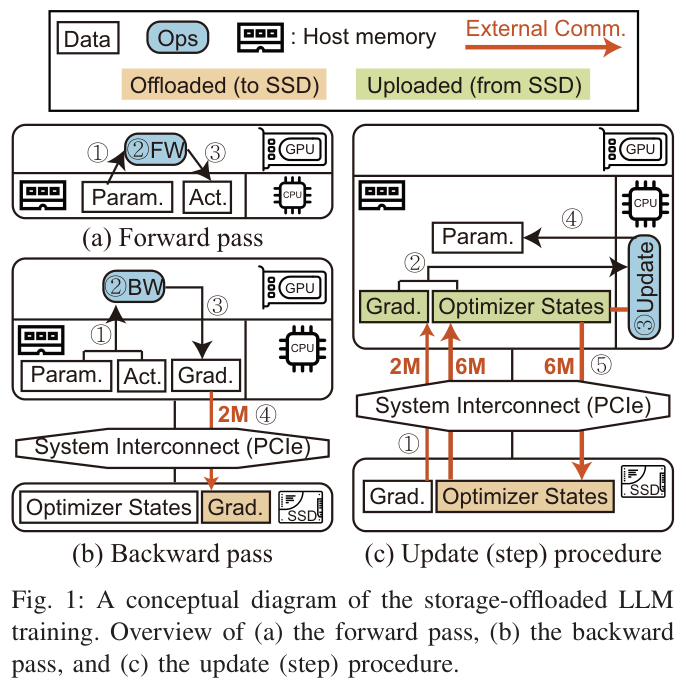
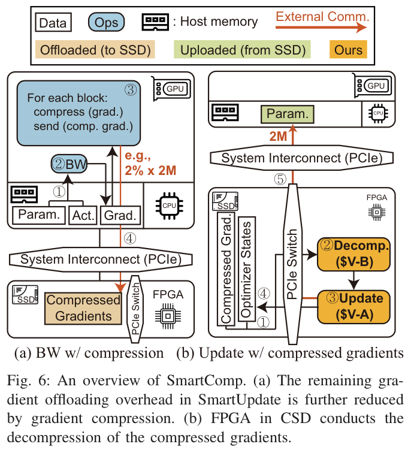
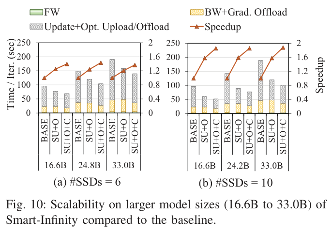
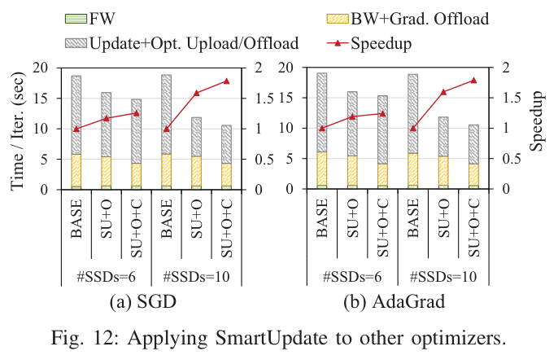
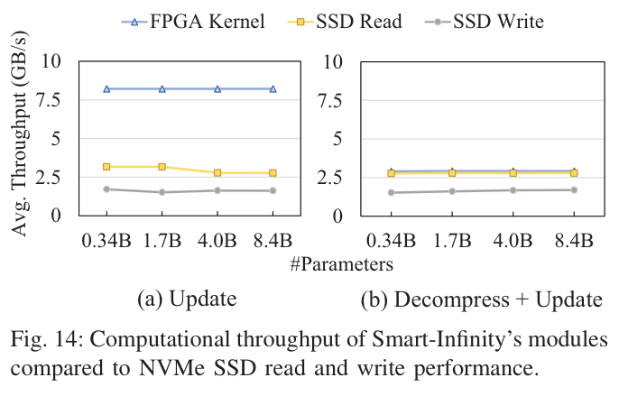
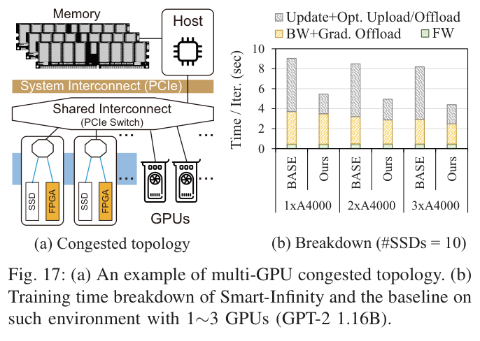

---
tags:
  - papers/systems
aliases:
  - Smart-Infinity
  - Smart-Infinity HPCA 2024
doi: 10.1109/HPCA57654.2024.00034
date: 2024
---

# Smart-Infinity: Fast Large Language Model Training using Near-Storage Processing on a Real System

## 核心信息

- 标题: Smart-Infinity: Fast Large Language Model Training using Near-Storage Processing on a Real System
- 标题翻译: Smart-Infinity：在真实系统上使用近存储处理加速大语言模型训练
- 作者: Hongsun Jang, Jaeyong Song, Jaewon Jung, Jaeyoung Park, Youngsok Kim, Jinho Lee
- 机构: Seoul National University; University of Texas at Austin; Yonsei University
- 发表时间: 2024
- 发表渠道: IEEE International Symposium on High-Performance Computer Architecture
- DOI: 10.1109/HPCA57654.2024.00034
- 论文链接: 本地 PDF
- 代码 / 项目: https://github.com/AIS-SNU/smart-infinity
- 数据 / 资源: Samsung SmartSSD 真实系统，DeepSpeed ZeRO-Infinity 基线，GLUE 微调任务
- 论文类型: 系统与体系结构方法论文

## 原文摘要翻译

大语言模型的近期巨大进展主要由参数数量增长推动。
这带来了很高的内存容量需求，甚至仅为了满足容量就需要使用数十块 GPU。
一个常见解决方案是存储卸载训练，它把主机内存和存储作为扩展的内存层次结构。
然而，这显然会带来存储带宽瓶颈，因为存储设备的带宽比 GPU 设备内存低几个数量级。

本文的 Smart-Infinity 使用真实系统上的近存储处理设备，解决存储卸载式大语言模型训练中的存储带宽瓶颈。
Smart-Infinity 的主要组件是 SmartUpdate，它在定制近存储加速器上执行参数更新。
作者发现，把参数更新移到存储侧可以移除大部分存储流量。
此外，作者提出一种高效的数据传输处理器结构，用来解决 Smart-Infinity 的系统集成问题。
该处理器通过复用设备缓冲区，在固定内存消耗下重叠数据传输。
最后，作者提出加速器辅助的梯度压缩与解压缩，以增强 Smart-Infinity 的可扩展性。
当扩展到多个近存储处理设备时，共享通道上的写流量会成为瓶颈。
为缓解这一问题，作者在 GPU 上压缩梯度，并在加速器上解压缩梯度。
流量降低带来了进一步加速。
因此，与基线相比，Smart-Infinity 获得了显著加速。
尤其重要的是，Smart-Infinity 是一种即用方法，已经在真实系统上完整集成到 PyTorch 中。
Smart-Infinity 的实现可在项目仓库中获得。

## 创新点

1. 论文没有只把存储卸载训练换成更多 SSD，而是把 Adam 等优化器的更新执行位置从 CPU 移到 CSD 内部 FPGA。
这个改变直接瞄准优化器状态在更新阶段造成的主流量，把原本需要穿过主机 PCIe 的优化器状态读写留在 SSD 到 FPGA 的内部路径中。
2. 论文把近存储处理做成真实系统，而不是停留在模拟器。
SmartUpdate 的内部传输处理器预分配设备缓冲区，并把紧急的参数回写和非紧急的动量、方差回写分层调度，从而在有限 FPGA 设备内存下重叠 SSD 到 FPGA 的传输。
3. 论文在 SmartUpdate 之后继续处理新的剩余瓶颈。
SmartComp 在 GPU 上做 Top-K 梯度压缩，在 CSD FPGA 上做解压缩，让原本仍需经过共享互连的梯度写流量从完整梯度降到压缩比例对应的流量。
4. 论文的工程贡献在于 PyTorch 与 DeepSpeed ZeRO-Infinity 集成。
用户侧可以用 DeepSpeed 训练代码启用系统，也可以通过 HLS 模板定制优化器或解压缩模块，这让论文的结果更接近可复现系统而非概念原型。

## 一句话总结

Smart-Infinity 的核心判断是：存储卸载式大模型训练的主要瓶颈不是算力不足，而是优化器状态和梯度反复穿过共享主机互连。
把更新和解压缩移到计算存储设备内部后，训练时间可以随 CSD 数量更好缩放。

## 研究问题

### 为什么存储卸载训练会变慢

LLM 训练在显存不足时会把优化器状态和梯度放到主机内存或 SSD 中。
混合精度训练下，若 FP16 参数规模记为 $M$，Adam 类优化器通常需要 FP32 参数、动量和方差等状态，优化器状态规模可以达到 $6M$，再加上梯度流量，更新阶段会产生大量存储读写。
论文测得，基线中超过 88% 的总训练时间消耗在存储数据传输上，GPT-2 8.4B 且 6 个 SSD 的基线里，更新加优化器状态上传和卸载占 75.57% 的训练时间。

*Fig. 1: A conceptual diagram of the storage-offloaded LLM training. Overview of (a) the forward pass, (b) the backward pass, and (c) the update (step) procedure.*

### 为什么 RAID0 不是充分解法

直觉上可以把多个普通 SSD 做 RAID0 来增加带宽，但论文的动机实验显示，超过四个 SSD 后加速趋于饱和。
原因是普通 SSD 的聚合带宽最后仍要经过主机共享互连。
CPU 的外设通道同时还要服务 GPU、FPGA、NIC 或系统内存。
也就是说，普通 SSD 数量增加的是设备侧带宽，而不是主机共享链路容量。

> [!figure] Fig. 2: CSD 系统环境示意
> 建议位置：研究问题
> 放置原因：该图说明多个 CSD 通过 PCIe switch 连接时，内部 SSD-FPGA 路径和主机共享互连路径的区别。
> 当前状态：没有独立可用图像，保留占位。

## 数据与任务定义

### 系统与硬件

实验最多使用 10 个 Samsung SmartSSD。
每个 SmartSSD 包含 4TB NVMe SSD。
它通过 PCIe Gen3.0 x4 与 FPGA 通信。
该 FPGA 是 Kintex UltraScale+ KU15P。
FPGA 资源约为 522K LUT、984 个 BRAM、1968 个 DSP 和 4GB DDR4 DRAM。
GPU 包括三类设备。
它们是 RTX A5000 24GB、Tesla A100 40GB 和 RTX A4000 16GB。
默认使用 A5000。
系统环境包括 Xeon Gold 6342 和 1TB DDR4-3200 内存。
软件环境包括 Ubuntu 20.04、Python 3.9、PyTorch 1.12.1。
加速栈包括 CUDA 11.6.2、Vitis 2023.1 与 XRT 2.12.427。

### 基线与变量

基线是 DeepSpeed ZeRO-Infinity 加软件 RAID0。
论文把系统拆成四类设置。
BASE 是基线，SU 是 SmartUpdate。
SU+O 是加上内部传输处理器优化后的 SmartUpdate。
SU+O+C 是再叠加 SmartComp 的完整系统。
默认 batch size 是 4，目标是显存受限环境。
默认梯度压缩比例是 2%，即 Top 1% 梯度值加对应索引，总通信量为原始梯度的 2%。

### 模型、任务与指标

主要训练模型包括 GPT-2 和 BERT，用来覆盖 decoder-only 与 encoder-only Transformer。
扩展实验还包括 BLOOM 和 ViT。
性能指标主要是单次迭代时间、相对 speedup、吞吐、每美元 GFLOPS、不同 CSD 数量下的扩展性，以及 GLUE 微调任务上的准确率。
微调实验覆盖 MNLI、QQP、SST-2 和 QNLI，用于检查 SmartComp 的有损压缩是否明显破坏模型质量。

## 方法主线

### 机制流程

1. 输入：ZeRO-Infinity 式存储卸载训练把优化器状态和梯度放在 SSD 中。
操作：基线在更新阶段把梯度和优化器状态上传到主机，由 CPU 更新后再把状态写回 SSD。
输出位置：大量 $6M$ 优化器状态流量和 $2M$ 梯度流量经过主机共享互连。
2. 输入：梯度、参数和优化器状态已经按块或 subgroup 存在 CSD 相关存储中。
操作：SmartUpdate 通过 CSD 内部 P2P 路径把梯度和优化器状态送入 FPGA，在 FPGA 上执行 Adam 等更新。
输出位置：优化器状态写回本地 SSD，更新后的参数以 $2M$ 规模返回主机供后续前向和反向使用。
3. 输入：多个 subgroup 需要在 FPGA 设备内存有限的条件下连续更新。
操作：内部传输处理器预分配最大 subgroup 所需缓冲区，用两个 CPU 管理线程复用缓冲区，并优先回写后续前向反向急需的参数，延后动量和方差等非紧急状态。
输出位置：SSD-FPGA 传输被重叠，设备内存占用保持固定。
4. 输入：SmartUpdate 后仍需把梯度写入对应 CSD，多个 CSD 扩展时这部分写流量成为新瓶颈。
操作：SmartComp 在 GPU 上选取高幅值 Top-K 梯度，向 SSD 写入索引和值，在 FPGA 上解压缩为完整梯度向量后再更新。
输出位置：共享互连上的梯度流量变为 $c\% \times 2M$，其中 $c$ 是压缩比例。

![[.assets/page_004_fig_fig_4.1.png|Fig 4]]
*Fig. 4: Update procedure of the storage-offloaded training with (a) baseline [97] and (b) SmartUpdate.*

*Fig. 6: An overview of SmartComp. (a) The remaining gradient offloading overhead in SmartUpdate is further reduced by gradient compression. (b) FPGA in CSD conducts the decompression of the compressed gradients.*

### SmartUpdate 的流量账

SmartUpdate 的关键不是减少 SSD 内部实际读取的数据总量，而是改变数据穿过哪条路径。
基线需要把梯度和优化器状态上传到主机，再把更新后的优化器状态写回 SSD。
SmartUpdate 让 FPGA 在 CSD 内部读取梯度和状态，执行更新后把状态直接写回本地 SSD。
系统互连侧只保留反向阶段的梯度写入和更新后参数回传。
因此论文把更新相关的主机互连通信从 $(6 + 2)M$ 降到 $2M$，再由 SmartComp 把梯度写入项降到 $c\% \times 2M$。

### FPGA 微架构与可扩展性

Updater 使用多个处理单元并行处理 subgroup。
对于 Adam，核心运算是 AXPBY 类向量组合，它可以表达动量、方差等移动平均更新，所以同一结构也能扩展到 SGD、AdaGrad、AdamW 等优化器。
Decompressor 面向 Top-K 压缩，读取索引和值，把选中的梯度值散射回原始梯度向量，其余位置填零。
论文的资源表显示，Adam updater 与 Top-K decompressor 组合只使用约 34.12% LUT。
同一组合还使用 27.13% BRAM、35.94% URAM 和 11.03% DSP。
这说明轻量 FPGA 上仍留有扩展空间。

> [!figure] Fig. 7: Smart-Infinity microarchitecture
> 建议位置：方法主线
> 放置原因：该图本应说明 updater 与 decompressor 在 FPGA 中如何连接到 P2P handler、SSD 和缓冲区。
> 当前状态：已人工检查候选图，但裁剪只包含微架构底部，无法独立表达完整结构，因此保留占位。

### 多 CSD 的工作分配

Smart-Infinity 把模型参数 flatten 后平均分给多个 CSD，每个 CSD 负责自己持有参数的更新，并在本地保存相应优化器状态。
这个策略依赖优化器更新的逐元素特性，不需要理解具体模型结构，因此对层数、hidden size 或 attention head 数量不敏感。
它也解释了为什么论文认为该方法可迁移到 GPT-2、BERT、BLOOM 和 ViT 等不同 Transformer 模型。

## 关键结果

### 主结果与消融

论文最关键的实验证据来自四组分解对比。
这四组分别是 BASE、SU、优化后的 SU，以及叠加压缩的 SU。
SmartUpdate 单独使用时，6 个 SSD 下带来约 1.18 到 1.24 倍加速，10 个 SSD 下带来约 1.54 到 1.60 倍加速。
加入传输处理器优化后，10 个 SSD 下加速进一步提升到约 1.60 到 1.66 倍。
再加入 SmartComp 后，相对优化 SmartUpdate 又增加约 1.22 到 1.31 倍，整体相对基线达到约 1.85 到 1.98 倍。
A100 设置下，最高报告加速为 2.11 倍。

| 对比项 | 主要结果 | 解释 |
|---|---:|---|
| SU 对 BASE | 6 SSD 为 1.18 到 1.24 倍，10 SSD 为 1.54 到 1.60 倍 | 去掉优化器状态穿过主机互连的主要开销 |
| SU+O 对 SU | 10 SSD 下提升到 1.60 到 1.66 倍 | 缓冲区复用和传输重叠减少真实系统开销 |
| SU+O+C 对 SU+O | 额外 1.22 到 1.31 倍 | 压缩梯度降低剩余写流量 |
| 完整系统对 BASE | 最高 2.11 倍 | 在高端 GPU 或多 CSD 下，通信瓶颈更突出，收益更大 |

### 大模型和设备数量扩展

GPT-2 16.6B 到 33.0B 的扩展实验显示，Smart-Infinity 在更大模型上保持稳定加速。
GPT-2 33.0B 时，6 个 SSD 下为 1.37 倍，10 个 SSD 下为 1.88 倍。
原因是 Transformer 训练中的通信量随参数量增长，基线仍受上传和卸载优化器状态限制，而 Smart-Infinity 的收益也随该瓶颈保持。

*Fig. 10: Scalability on larger model sizes (16.6B to 33.0B) of Smart-Infinity compared to the baseline.*

### 优化器、模型与吞吐

SGD 和 AdaGrad 的实验表明，SmartUpdate 不依赖 Adam 独有结构。
由于 SGD 和 AdaGrad 的优化器状态少于 Adam，加速略低，但趋势一致。
BLOOM 和 ViT 上的结果为 1.32 到 1.85 倍，说明该系统更依赖“参数和状态的逐元素更新及存储流量”这一共性，而不是某个具体模型架构。

*Fig. 12: Applying SmartUpdate to other optimizers.*

*Fig. 14: Computational throughput of Smart-Infinity's modules compared to NVMe SSD read and write performance.*

### 成本、准确率和压缩比例

成本分析里，SmartSSD 约 2400 美元，同容量普通 SSD 约 400 美元，所以 1 到 3 个 CSD 时 每美元 GFLOPS 低于基线。
但超过 4 个设备后，速度收益抵消硬件成本，Smart-Infinity 的成本效率开始优于基线。
微调实验中，SmartUpdate 与基线算法等价，所以准确率相同。
SmartComp 是有损压缩，但在 MNLI、QQP、SST-2 和 QNLI 上保持相近准确率。
压缩比例从 10% 降到 1% 时，速度总体逐步提高，准确率存在小幅权衡。

> [!figure] Fig. 15: Performance per dollar of the baseline and Smart-Infinity
> 建议位置：关键结果
> 放置原因：该图直接承载成本效率结论，说明 SmartSSD 数量增加后完整系统何时超过 ZeRO-Infinity 基线。
> 当前状态：人工检查发现裁剪混入表格和相邻图，保留占位。

> [!figure] Fig. 16: Training time sensitivity on Top-K compression ratio
> 建议位置：关键结果
> 放置原因：该图对应 SmartComp 的速度与压缩比例敏感性，是理解压缩收益和准确率权衡的关键图。
> 当前状态：人工检查发现裁剪含周围正文且图体不完整，保留占位。

## 深度分析

### 为什么这个设计有效

Smart-Infinity 的有效性来自对数据所有权和消费位置的重新匹配。
优化器状态在更新阶段才被使用，且更新是逐元素运算。
把这一步留在 CPU 上，就必须把状态穿过 PCIe 拉到主机再写回 SSD。
把它移到 CSD 内部后，状态的主要移动发生在 SSD 与 FPGA 之间。
由于多个 CSD 的内部路径可以随设备数量聚合，而主机共享互连不能等比例扩展，系统的扩展曲线自然改变。

### 瓶颈迁移而不是瓶颈消失

论文最有价值的地方是它没有声称近存储处理自动解决一切。
SmartUpdate 去掉优化器状态流量后，剩余的梯度写入会成为新瓶颈，因此需要 SmartComp。
SmartComp 之后，更新后参数从 CSD 回传主机又成为仍然存在的上行流量。
讨论部分进一步指出，在多 GPU 拥塞拓扑里，模型和 activation 传输也会和 CSD 共用互连，导致收益低于默认拓扑。

*Fig. 17: (a) An example of multi-GPU congested topology. (b) Training time breakdown of Smart-Infinity and the baseline on such environment with 1-3 GPUs (GPT-2 1.16B).*

### 与相关路线的关系

相对于 ZeRO-Infinity，Smart-Infinity 不是替代存储卸载训练，而是把其最重的更新路径改写到 CSD 内部。
相对于普通 RAID0，它利用的是每个 CSD 内部 SSD-FPGA 通道的聚合，而不是继续挤主机链路。
相对于早期 近数据处理或近存储处理 训练方案，它的重点是商业 CSD、真实系统和 PyTorch 集成，这也是其说服力来源。

### 复现时最该关注的变量

复现这篇论文不能只看 FPGA kernel 吞吐。
关键变量至少包括以下几类。
第一，SSD 与 FPGA 是否支持高效 P2P。
第二，OpenCL buffer 是否能稳定预分配和复用。
第三，SSD 写带宽是否明显低于读带宽。
第四，GPU 与 CSD 是否共享同一 PCIe switch。
第五，DeepSpeed 梯度卸载路径是否能把梯度准确写到 owner CSD。
第六，压缩比例是否和目标任务的精度容忍度匹配。

## 局限

1. 硬件依赖较强。
结果建立在 Samsung SmartSSD、特定 PCIe 扩展和特定 GPU 组合上。
它不应直接外推到所有 NVMe、CSD 或 CXL 存储池。
2. 单 CSD 下可能变慢。论文明确指出，单个 CSD 没有聚合内部带宽收益，却仍有 FPGA 使用开销。
3. 成本收益有门槛。SmartSSD 明显贵于同容量普通 SSD，因此少量设备时成本效率不占优。
4. SmartComp 的准确率证据主要来自微调任务。它说明 Top-K 压缩在这些 GLUE 设置中可用，但没有证明预训练、大规模长训或所有优化器下都稳定。
5. 拓扑敏感性仍然存在。多 GPU 拥塞拓扑下，模型与 activation 传输会与 CSD 共用互连，速度收益下降到 1.66 到 1.86 倍。
6. 更复杂的模型压缩扩展尚未实现。若要让 CSD 执行量化、剪枝或低秩相关逻辑，需要更复杂的 CSD 端压缩和 GPU 端解压缩 kernel。

## 我的笔记

这篇论文值得保留的原因不是“近存储处理可以加速训练”这个宽泛命题，而是它给了一个很清楚的系统设计范式：先用流量账找出哪类状态变量在何时被消费，再把消费位置移到状态所在位置附近。
SmartUpdate 的成功依赖 Adam 更新的逐元素性质，SmartComp 的必要性则说明优化系统时要预期瓶颈迁移。

对工程实践来说，最可复用的检查清单是：

1. 先画出每个训练阶段中参数、梯度、optimizer states、activation 的驻留位置和传输路径。
2. 把每类流量按规模记账，例如 $6M$、$2M$、$c\% \times 2M$，再判断哪条共享链路真正受压。
3. 如果把计算移到设备侧，要同时设计缓冲区生命周期和调度优先级，否则设备内存和 P2P 操作会吞掉理论收益。
4. 压缩应放在瓶颈明确之后使用。SmartComp 不是通用加速器，而是在 SmartUpdate 后剩余梯度写流量成为瓶颈时才最有意义。
5. 评估时必须加入拓扑、成本和准确率。只有速度图不足以说明系统是否值得部署。

后续我会优先追问三个问题。
第一，在 PCIe 5.0 或 CXL 环境下，主机互连瓶颈是否仍足够强。
第二，Top-K 梯度压缩能否支撑预训练而不仅是微调。
第三，若 CSD 价格下降或 GPU 显存继续增长，Smart-Infinity 的经济边界会如何移动。

## 引用

Jang, H., Song, J., Jung, J., Park, J., Kim, Y., and Lee, J. 2024. Smart-Infinity: Fast Large Language Model Training using Near-Storage Processing on a Real System. IEEE International Symposium on High-Performance Computer Architecture. DOI: 10.1109/HPCA57654.2024.00034.

