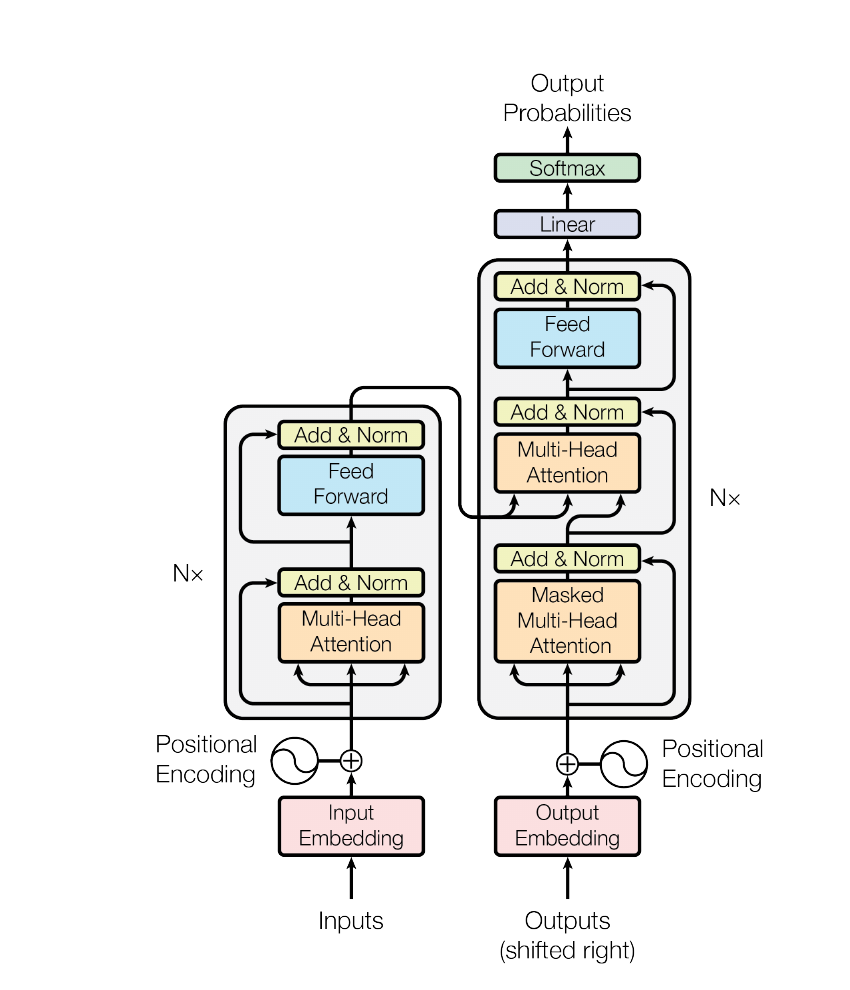
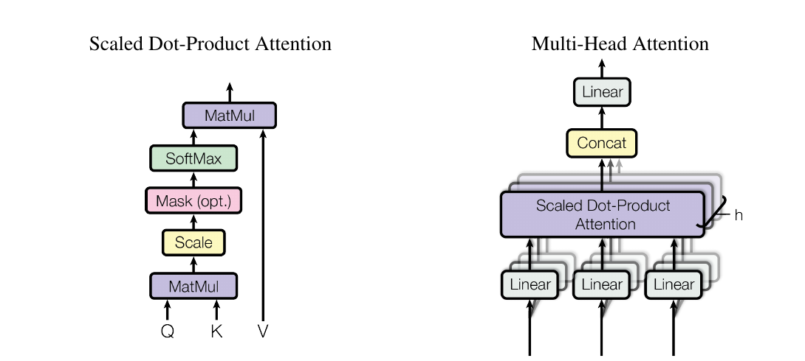
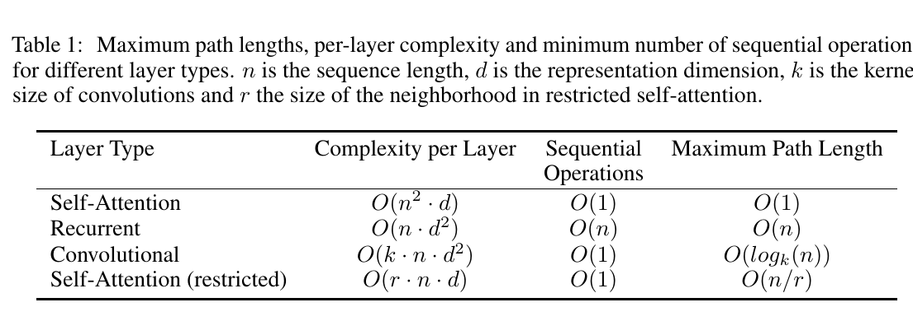
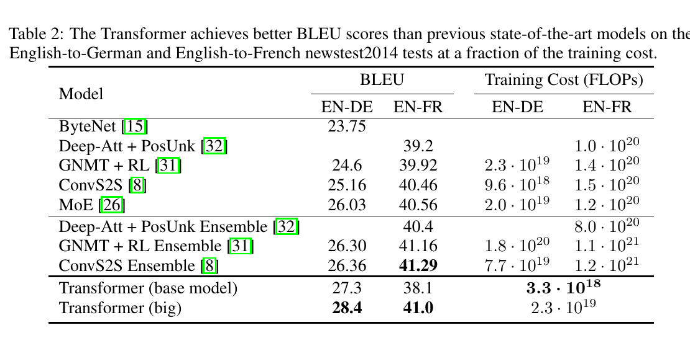
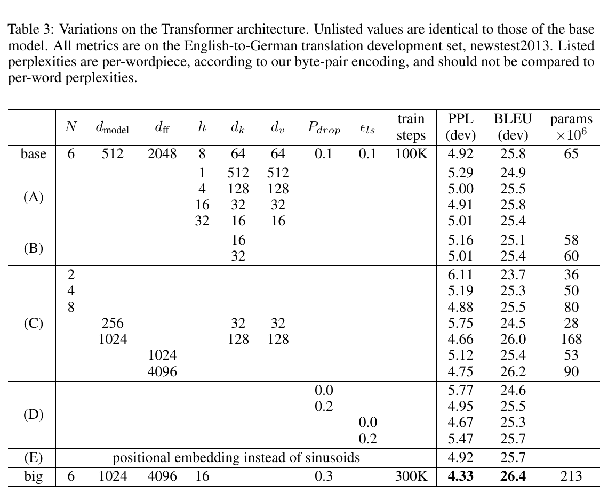

# Attention Is All You Need —— 中文全文翻译

## 文章基本信息

- **论文标题**：Attention Is All You Need
- **中文标题**：注意力就是你所需要的一切
- **期刊/会议名称**：第 31 届神经信息处理系统会议（31st Conference on Neural Information Processing Systems, NIPS 2017）
- **发表时间**：2017 年
- **会议地点**：Long Beach, CA, USA
- **开源资料**：论文中声明用于训练和评估模型的代码可在 `https://github.com/tensorflow/tensor2tensor` 获取
- **作者与机构**：Ashish Vaswani（Google Brain）、Noam Shazeer（Google Brain）、Niki Parmar（Google Research）、Jakob Uszkoreit（Google Research）、Llion Jones（Google Research）、Aidan N. Gomez（University of Toronto）、Łukasz Kaiser（Google Brain）、Illia Polosukhin

---

# Attention Is All You Need

Ashish Vaswani\*  
Google Brain  
avaswani@google.com

Noam Shazeer\*  
Google Brain  
noam@google.com

Niki Parmar\*  
Google Research  
nikip@google.com

Jakob Uszkoreit\*  
Google Research  
usz@google.com

Llion Jones\*  
Google Research  
llion@google.com

Aidan N. Gomez\* †  
University of Toronto  
aidan@cs.toronto.edu

Łukasz Kaiser\*  
Google Brain  
lukaszkaiser@google.com

Illia Polosukhin\* ‡  
illia.polosukhin@gmail.com

## 摘要

占主导地位的序列转导模型基于复杂的循环神经网络或卷积神经网络，并包含一个编码器和一个解码器。表现最好的模型还通过注意力机制连接编码器和解码器。我们提出了一种新的简单网络架构 Transformer，它完全基于注意力机制，彻底摒弃了循环和卷积。在两个机器翻译任务上的实验表明，这些模型在质量上更优，同时更易并行化，并且所需训练时间显著更少。我们的模型在 WMT 2014 英语到德语翻译任务上达到 28.4 BLEU，比包括集成模型在内的现有最佳结果高出 2 个以上 BLEU。在 WMT 2014 英语到法语翻译任务上，我们的模型在 8 个 GPU 上训练 3.5 天后，建立了新的单模型最先进 BLEU 分数 41.0，其训练成本只是文献中最佳模型训练成本的一小部分。

# 1 引言

循环神经网络，特别是长短期记忆网络 [12] 和门控循环神经网络 [7]，已经牢固地确立为序列建模和转导问题（例如语言建模和机器翻译 [29, 2, 5]）中的最先进方法。此后，许多工作持续推动循环语言模型和编码器—解码器架构的边界 [31, 21, 13]。

\* 贡献相同。列名顺序随机。Jakob 提出了用自注意力替代 RNN 的想法，并启动了对这一想法的评估工作。Ashish 与 Illia 设计并实现了第一批 Transformer 模型，并关键性地参与了本工作的每一个方面。Noam 提出了缩放点积注意力、多头注意力和无参数位置表示，并成为另一个几乎参与所有细节的人。Niki 在我们的原始代码库和 tensor2tensor 中设计、实现、调优并评估了无数模型变体。Llion 也尝试了新的模型变体，负责我们的初始代码库、高效推理和可视化。Lukasz 和 Aidan 花费了无数漫长的日子设计并实现 tensor2tensor 的各个部分，替代了我们早期的代码库，极大改善了结果并大幅加速了我们的研究。

† 工作在 Google Brain 期间完成。  
‡ 工作在 Google Research 期间完成。

第 31 届神经信息处理系统会议（NIPS 2017），Long Beach, CA, USA。

循环模型通常沿输入和输出序列的符号位置分解计算。将位置与计算时间中的步骤对齐，它们生成一系列隐藏状态 $h_t$，其中 $h_t$ 是前一个隐藏状态 $h_{t-1}$ 和位置 $t$ 的输入的函数。这种固有的顺序性质阻碍了训练样本内部的并行化；当序列长度较长时，这一点变得尤为关键，因为内存约束限制了跨样本的批处理。近期工作通过分解技巧 [18] 和条件计算 [26] 显著提高了计算效率，并且在后者中也提升了模型性能。然而，顺序计算这一根本限制依然存在。

注意力机制已经成为各种任务中有吸引力的序列建模和转导模型的重要组成部分，它允许对依赖关系进行建模，而不考虑这些依赖在输入或输出序列中的距离 [2, 16]。然而，除少数情况外 [22]，这类注意力机制都与循环网络结合使用。

在本文中，我们提出 Transformer，一种舍弃循环、完全依赖注意力机制来捕获输入与输出之间全局依赖关系的模型架构。Transformer 能够显著提高并行化程度，并且在 8 个 P100 GPU 上训练短短 12 小时后，就可以达到新的最先进翻译质量。

# 2 背景

减少顺序计算的目标同样构成了 Extended Neural GPU [20]、ByteNet [15] 和 ConvS2S [8] 的基础，它们都使用卷积神经网络作为基本构建模块，并为所有输入和输出位置并行计算隐藏表示。在这些模型中，将两个任意输入或输出位置的信号关联起来所需的操作数量会随着位置之间的距离增长：ConvS2S 是线性增长，ByteNet 是对数增长。这使得学习远距离位置之间的依赖关系更加困难 [11]。在 Transformer 中，这被降低为常数数量的操作，尽管代价是由于对注意力加权位置取平均而降低了有效分辨率；我们通过第 3.2 节所述的多头注意力来抵消这一影响。

自注意力（self-attention），有时也称为内部注意力（intra-attention），是一种将单个序列中不同位置相互关联以计算该序列表示的注意力机制。自注意力已经成功应用于多种任务，包括阅读理解、抽象式摘要、文本蕴含以及学习与任务无关的句子表示 [4, 22, 23, 19]。

端到端记忆网络基于循环注意力机制，而不是与序列对齐的循环结构，并且已被证明在简单语言问答和语言建模任务上表现良好 [28]。

据我们所知，Transformer 是第一个完全依赖自注意力来计算其输入和输出表示、而不使用与序列对齐的 RNN 或卷积的转导模型。在接下来的章节中，我们将描述 Transformer，说明自注意力的动机，并讨论其相对于 [14, 15] 和 [8] 等模型的优势。

# 3 模型架构

大多数具有竞争力的神经序列转导模型都具有编码器—解码器结构 [5, 2, 29]。在这里，编码器将符号表示的输入序列 $(x_1, ..., x_n)$ 映射为连续表示序列 $z = (z_1, ..., z_n)$。给定 $z$，解码器随后一次生成一个元素，产生符号的输出序列 $(y_1, ..., y_m)$。在每一步中，模型都是自回归的 [9]，即在生成下一个符号时，会将先前生成的符号作为额外输入。

Transformer 遵循这一整体架构，在编码器和解码器中都使用堆叠的自注意力层和逐位置的全连接层，分别如图 1 的左半部分和右半部分所示。

## 3.1 编码器和解码器堆栈

**编码器：** 编码器由 $N = 6$ 个相同层堆叠而成。每一层有两个子层。第一个子层是多头自注意力机制，第二个子层是一个简单的逐位置全连接前馈网络。我们在两个子层周围都采用残差连接 [10]，随后进行层归一化 [1]。也就是说，每个子层的输出为：

$$
\mathrm{LayerNorm}(x + \mathrm{Sublayer}(x))
$$

其中 $\mathrm{Sublayer}(x)$ 是该子层自身实现的函数。为了便于这些残差连接，模型中的所有子层以及嵌入层都产生维度为 $d_{model} = 512$ 的输出。

**解码器：** 解码器同样由 $N = 6$ 个相同层堆叠而成。除了每个编码器层中的两个子层之外，解码器还插入第三个子层，该子层在编码器堆栈的输出上执行多头注意力。与编码器类似，我们在每个子层周围采用残差连接，随后进行层归一化。我们还修改了解码器堆栈中的自注意力子层，以防止位置关注后续位置。这种掩蔽机制与输出嵌入偏移一个位置这一事实结合起来，确保位置 $i$ 的预测只能依赖于位置小于 $i$ 的已知输出。

**图 1：Transformer——模型架构。**

## 3.2 注意力

注意力函数可以被描述为将一个查询和一组键—值对映射到一个输出，其中查询、键、值和输出都是向量。输出被计算为值的加权和，其中分配给每个值的权重由查询与对应键的兼容性函数计算得到。

### 3.2.1 缩放点积注意力

我们将我们特定的注意力称为“缩放点积注意力”（图 2）。输入由维度为 $d_k$ 的查询和键，以及维度为 $d_v$ 的值组成。我们计算查询与所有键的点积，将每个点积除以 $\sqrt{d_k}$，并应用 softmax 函数以获得值上的权重。

**图 2：（左）缩放点积注意力。（右）多头注意力由多个并行运行的注意力层组成。**

在实践中，我们同时对一组查询计算注意力函数，并将它们打包在矩阵 $Q$ 中。键和值也分别打包在矩阵 $K$ 和 $V$ 中。我们将输出矩阵计算为：

$$
\mathrm{Attention}(Q, K, V) = \mathrm{softmax}\left(\frac{QK^T}{\sqrt{d_k}}\right)V
$$

**（1）**

两种最常用的注意力函数是加性注意力 [2] 和点积（乘性）注意力。点积注意力与我们的算法相同，除了缺少缩放因子 $\frac{1}{\sqrt{d_k}}$。加性注意力使用带有单个隐藏层的前馈网络来计算兼容性函数。虽然二者在理论复杂度上相似，但在实践中，点积注意力速度更快且空间效率更高，因为它可以使用高度优化的矩阵乘法代码来实现。

当 $d_k$ 取较小值时，这两种机制表现相似；但当 $d_k$ 较大时，不带缩放的点积注意力的表现不如加性注意力 [3]。我们怀疑，对于较大的 $d_k$，点积的幅值会变大，将 softmax 函数推入梯度极小的区域。为抵消这一影响，我们将点积按 $\frac{1}{\sqrt{d_k}}$ 缩放。

为说明为什么点积会变大，假设 $q$ 和 $k$ 的分量是均值为 0、方差为 1 的独立随机变量。那么它们的点积：

$$
q \cdot k = \sum_{i=1}^{d_k} q_i k_i
$$

均值为 0，方差为 $d_k$。

### 3.2.2 多头注意力

我们发现，与其使用 $d_{model}$ 维的键、值和查询执行单个注意力函数，不如将查询、键和值分别通过不同的、学习得到的线性投影投影 $h$ 次，投影到 $d_k$、$d_k$ 和 $d_v$ 维。在查询、键和值的每个投影版本上，我们并行执行注意力函数，得到 $d_v$ 维的输出值。然后将这些输出拼接起来，并再次投影，得到最终值，如图 2 所示。

多头注意力使模型能够在不同位置共同关注来自不同表示子空间的信息。若只有单个注意力头，取平均会抑制这种能力。

$$
\mathrm{MultiHead}(Q, K, V) = \mathrm{Concat}(head_1, ..., head_h)W^O
$$

其中：

$$
head_i = \mathrm{Attention}(QW_i^Q, KW_i^K, VW_i^V)
$$

其中投影参数矩阵为：

$$
W_i^Q \in \mathbb{R}^{d_{model} \times d_k}
$$

$$
W_i^K \in \mathbb{R}^{d_{model} \times d_k}
$$

$$
W_i^V \in \mathbb{R}^{d_{model} \times d_v}
$$

以及：

$$
W^O \in \mathbb{R}^{hd_v \times d_{model}}
$$

在本文中，我们采用 $h = 8$ 个并行注意力层，即注意力头。对每个头，我们使用：

$$
d_k = d_v = d_{model}/h = 64
$$

由于每个头的维度降低，总计算成本与使用完整维度的单头注意力相似。

### 3.2.3 注意力在我们模型中的应用

Transformer 以三种不同方式使用多头注意力：

- 在“编码器—解码器注意力”层中，查询来自前一个解码器层，而记忆键和值来自编码器的输出。这使得解码器中的每个位置都能够关注输入序列中的所有位置。这模拟了序列到序列模型（例如 [31, 2, 8]）中典型的编码器—解码器注意力机制。

- 编码器包含自注意力层。在自注意力层中，所有键、值和查询都来自同一位置，在这里即来自编码器中前一层的输出。编码器中的每个位置都可以关注编码器前一层中的所有位置。

- 类似地，解码器中的自注意力层允许解码器中的每个位置关注解码器中截至并包括该位置的所有位置。为了保持自回归性质，我们需要防止解码器中的向左信息流。我们在缩放点积注意力内部实现这一点：将 softmax 输入中所有对应非法连接的值掩蔽掉（设置为 $-\infty$）。见图 2。

## 3.3 逐位置前馈网络

除了注意力子层之外，我们编码器和解码器中的每一层都包含一个全连接前馈网络，该网络被分别且相同地应用于每个位置。它由两个线性变换组成，中间带有 ReLU 激活：

$$
\mathrm{FFN}(x) = \max(0, xW_1 + b_1)W_2 + b_2 	\tag{2}
$$

虽然这些线性变换在不同位置上相同，但它们在不同层之间使用不同参数。另一种描述方式是将其视为两个卷积核大小为 1 的卷积。输入和输出的维度为 $d_{model} = 512$，内部层的维度为 $d_{ff} = 2048$。

## 3.4 嵌入和 Softmax

与其他序列转导模型类似，我们使用学习得到的嵌入将输入词元和输出词元转换为维度为 $d_{model}$ 的向量。我们还使用通常的学习线性变换和 softmax 函数，将解码器输出转换为预测下一个词元的概率。在我们的模型中，我们在两个嵌入层和 softmax 前的线性变换之间共享同一个权重矩阵，类似于 [24]。在嵌入层中，我们将这些权重乘以 $\sqrt{d_{model}}$。

## 3.5 位置编码

由于我们的模型不包含循环和卷积，为了使模型能够利用序列顺序，我们必须向序列中的词元注入某种关于相对或绝对位置的信息。为此，我们在编码器和解码器堆栈底部的输入嵌入中加入“位置编码”。位置编码与嵌入具有相同的维度 $d_{model}$，因此二者可以相加。位置编码有许多选择，包括学习得到的和固定的 [8]。

**表 1：不同层类型的最大路径长度、每层复杂度和最小顺序操作数量。$n$ 是序列长度，$d$ 是表示维度，$k$ 是卷积核大小，$r$ 是受限自注意力中邻域的大小。**

| 层类型 | 每层复杂度 | 顺序操作 | 最大路径长度 |
|---|---:|---:|---:|
| 自注意力 | $O(n^2 \cdot d)$ | $O(1)$ | $O(1)$ |
| 循环 | $O(n \cdot d^2)$ | $O(n)$ | $O(n)$ |
| 卷积 | $O(k \cdot n \cdot d^2)$ | $O(1)$ | $O(\log_k(n))$ |
| 自注意力（受限） | $O(r \cdot n \cdot d)$ | $O(1)$ | $O(n/r)$ |

在本文中，我们使用不同频率的正弦和余弦函数：

$$
PE_{(pos, 2i)} = \sin(pos / 10000^{2i/d_{model}})
$$

$$
PE_{(pos, 2i+1)} = \cos(pos / 10000^{2i/d_{model}})
$$

其中 $pos$ 是位置，$i$ 是维度。也就是说，位置编码的每个维度对应一个正弦曲线。波长形成从 $2\pi$ 到 $10000 \cdot 2\pi$ 的几何级数。我们选择该函数，是因为我们假设它能使模型更容易学习相对位置的关注关系，因为对于任意固定偏移 $k$，$PE_{pos+k}$ 可以表示为 $PE_{pos}$ 的线性函数。

我们也尝试使用学习得到的位置嵌入 [8]，并发现两种版本产生了几乎相同的结果（见表 3 的第 (E) 行）。我们选择正弦版本，是因为它可能允许模型外推到比训练期间遇到的序列长度更长的序列。

# 4 为什么使用自注意力

在本节中，我们将自注意力层与常用于将一个可变长度符号表示序列 $(x_1, ..., x_n)$ 映射为另一个等长序列 $(z_1, ..., z_n)$ 的循环层和卷积层进行比较，其中 $x_i, z_i \in \mathbb{R}^d$，例如典型序列转导编码器或解码器中的隐藏层。为说明我们使用自注意力的动机，我们考虑三个期望性质。

一个是每层的总计算复杂度。另一个是可以并行化的计算量，用所需的最小顺序操作数量来衡量。

第三个是网络中远距离依赖之间的路径长度。学习远距离依赖是许多序列转导任务中的关键挑战。影响学习此类依赖能力的一个关键因素，是前向和反向信号必须在网络中穿越的路径长度。输入和输出序列中任意位置组合之间的路径越短，学习远距离依赖就越容易 [11]。因此，我们也比较由不同层类型组成的网络中，任意两个输入和输出位置之间的最大路径长度。

如表 1 所示，自注意力层用常数数量的顺序执行操作连接所有位置，而循环层需要 $O(n)$ 个顺序操作。就计算复杂度而言，当序列长度 $n$ 小于表示维度 $d$ 时，自注意力层比循环层更快；在最先进机器翻译模型使用的句子表示中，例如 word-piece [31] 和 byte-pair [25] 表示，这通常是事实。为了提高涉及很长序列的任务的计算性能，自注意力可以被限制为只考虑以相应输出位置为中心、大小为 $r$ 的输入序列邻域。这会将最大路径长度增加到 $O(n/r)$。我们计划在未来工作中进一步研究这一方法。

单个卷积层在卷积核宽度 $k < n$ 时并不会连接所有输入和输出位置对。要做到这一点，在连续卷积核的情况下需要堆叠 $O(n/k)$ 个卷积层，在扩张卷积 [15] 的情况下需要堆叠 $O(\log_k(n))$ 个卷积层，这会增加网络中任意两个位置之间最长路径的长度。卷积层通常比循环层更昂贵，倍数为 $k$。然而，可分离卷积 [6] 可以显著降低复杂度，将其降低为：

$$
O(k \cdot n \cdot d + n \cdot d^2)
$$

即使在 $k = n$ 时，可分离卷积的复杂度也等于一个自注意力层和一个逐位置前馈层的组合，而这正是我们模型中采用的方法。

作为一个附带好处，自注意力可以产生更具可解释性的模型。我们检查了模型中的注意力分布，并在附录中展示和讨论了示例。不仅单个注意力头清楚地学会执行不同任务，而且许多注意力头似乎表现出与句子的句法和语义结构相关的行为。

# 5 训练

本节描述我们模型的训练方案。

## 5.1 训练数据和批处理

我们在标准 WMT 2014 英语—德语数据集上训练，该数据集包含约 450 万个句子对。句子使用字节对编码 [3] 进行编码，该编码具有共享的源—目标词汇表，约 37000 个词元。对于英语—法语，我们使用显著更大的 WMT 2014 英语—法语数据集，其中包含 3600 万个句子，并将词元划分为 32000 个 word-piece 词汇 [31]。句子对按近似序列长度组合成批。每个训练批包含一组句子对，其中约有 25000 个源词元和 25000 个目标词元。

## 5.2 硬件和训练计划

我们在一台配有 8 个 NVIDIA P100 GPU 的机器上训练模型。对于使用本文中描述的超参数的基础模型，每个训练步骤约耗时 0.4 秒。我们总共训练基础模型 100,000 步，即 12 小时。对于大模型（见表 3 最后一行描述），每步耗时 1.0 秒。大模型训练了 300,000 步（3.5 天）。

## 5.3 优化器

我们使用 Adam 优化器 [17]，参数为 $\beta_1 = 0.9$、$\beta_2 = 0.98$ 和 $\epsilon = 10^{-9}$。在训练过程中，我们根据以下公式改变学习率：

$$
lrate = d_{model}^{-0.5} \cdot \min(step\_num^{-0.5}, step\_num \cdot warmup\_steps^{-1.5}) 	\tag{3}
$$

这对应于在前 $warmup\_steps$ 个训练步骤中线性增加学习率，并在之后使其按步数倒数平方根成比例地下降。我们使用 $warmup\_steps = 4000$。

## 5.4 正则化

我们在训练期间采用三种类型的正则化：

**残差 Dropout** 我们将 dropout [27] 应用于每个子层的输出，然后再将其加到子层输入并进行归一化。此外，我们还将 dropout 应用于编码器和解码器堆栈中嵌入与位置编码之和。对于基础模型，我们使用的 dropout 比率为 $P_{drop} = 0.1$。

**标签平滑** 在训练期间，我们采用值为 $\epsilon_{ls} = 0.1$ 的标签平滑 [30]。这会损害困惑度，因为模型学会变得更加不确定，但会提高准确率和 BLEU 分数。

# 6 结果

## 6.1 机器翻译

**表 2：Transformer 在 English-to-German 和 English-to-French 的 newstest2014 测试上，以一小部分训练成本取得了比先前最先进模型更好的 BLEU 分数。**

| 模型 | BLEU EN-DE | BLEU EN-FR | 训练成本 EN-DE（FLOPs） | 训练成本 EN-FR（FLOPs） |
|---|---:|---:|---:|---:|
| ByteNet [15] | 23.75 |  |  |  |
| Deep-Att + PosUnk [32] |  | 39.2 |  | $1.0 \cdot 10^{20}$ |
| GNMT + RL [31] | 24.6 | 39.92 | $2.3 \cdot 10^{19}$ | $1.4 \cdot 10^{20}$ |
| ConvS2S [8] | 25.16 | 40.46 | $9.6 \cdot 10^{18}$ | $1.5 \cdot 10^{20}$ |
| MoE [26] | 26.03 | 40.56 | $2.0 \cdot 10^{19}$ | $1.2 \cdot 10^{20}$ |
| Deep-Att + PosUnk Ensemble [32] |  | 40.4 |  | $8.0 \cdot 10^{20}$ |
| GNMT + RL Ensemble [31] | 26.30 | 41.16 | $1.8 \cdot 10^{20}$ | $1.1 \cdot 10^{21}$ |
| ConvS2S Ensemble [8] | 26.36 | 41.29 | $7.7 \cdot 10^{19}$ | $1.2 \cdot 10^{21}$ |
| Transformer（基础模型） | 27.3 | 38.1 | $3.3 \cdot 10^{18}$ |  |
| Transformer（大模型） | 28.4 | 41.0 | $2.3 \cdot 10^{19}$ |  |

在 WMT 2014 英语到德语翻译任务上，大 Transformer 模型（表 2 中的 Transformer (big)）比先前报告的最佳模型（包括集成模型）高出超过 2.0 BLEU，建立了新的最先进 BLEU 分数 28.4。该模型的配置列于表 3 最后一行。训练在 8 个 P100 GPU 上耗时 3.5 天。即使我们的基础模型也超过了所有先前发表的模型和集成模型，而训练成本只是任何竞争模型的一小部分。

在 WMT 2014 英语到法语翻译任务上，我们的大模型达到 BLEU 分数 41.0，超过了所有先前发表的单模型，并且训练成本不到先前最先进模型的 1/4。用于英语到法语的 Transformer（大模型）采用的 dropout 比率为 $P_{drop} = 0.1$，而不是 0.3。

对于基础模型，我们使用通过平均最后 5 个检查点得到的单个模型，这些检查点以 10 分钟为间隔写入。对于大模型，我们平均最后 20 个检查点。我们使用束搜索，束大小为 4，长度惩罚为 $\alpha = 0.6$ [31]。这些超参数是在开发集上实验后选择的。我们在推理期间将最大输出长度设置为输入长度 + 50，但在可能时提前终止 [31]。

表 2 总结了我们的结果，并将我们的翻译质量和训练成本与文献中的其他模型架构进行了比较。我们通过将训练时间、所用 GPU 数量以及每个 GPU 持续单精度浮点能力的估计值相乘，估算训练模型所用的浮点操作数。

我们分别使用 2.8、3.7、6.0 和 9.5 TFLOPS 作为 K80、K40、M40 和 P100 的数值。

## 6.2 模型变体

为了评估 Transformer 不同组件的重要性，我们以不同方式改变基础模型，并测量其在英语—德语翻译开发集 newstest2013 上的性能变化。我们使用上一节所述的束搜索，但不进行检查点平均。我们在表 3 中展示这些结果。

**表 3：Transformer 架构变体。未列出的值与基础模型相同。所有指标均在英语到德语翻译开发集 newstest2013 上。列出的困惑度是根据我们的字节对编码计算的每 wordpiece 困惑度，不应与每词困惑度比较。**

| 配置 | $N$ | $d_{model}$ | $d_{ff}$ | $h$ | $d_k$ | $d_v$ | $P_{drop}$ | $\epsilon_{ls}$ | 训练步数 | PPL（dev） | BLEU（dev） | 参数量 $\times 10^6$ |
|---|---:|---:|---:|---:|---:|---:|---:|---:|---:|---:|---:|---:|
| base | 6 | 512 | 2048 | 8 | 64 | 64 | 0.1 | 0.1 | 100K | 4.92 | 25.8 | 65 |
| (A) |  |  |  | 1 | 512 | 512 |  |  |  | 5.29 | 24.9 |  |
|  |  |  |  | 4 | 128 | 128 |  |  |  | 5.00 | 25.5 |  |
|  |  |  |  | 16 | 32 | 32 |  |  |  | 4.91 | 25.8 |  |
|  |  |  |  | 32 | 16 | 16 |  |  |  | 5.01 | 25.4 |  |
| (B) |  |  |  |  | 16 |  |  |  |  | 5.16 | 25.1 | 58 |
|  |  |  |  |  | 32 |  |  |  |  | 5.01 | 25.4 | 60 |
| (C) | 2 |  |  |  |  |  |  |  |  | 6.11 | 23.7 | 36 |
|  | 4 |  |  |  |  |  |  |  |  | 5.19 | 25.3 | 50 |
|  | 8 |  |  |  |  |  |  |  |  | 4.88 | 25.5 | 80 |
|  |  | 256 |  |  | 32 | 32 |  |  |  | 5.75 | 24.5 | 28 |
|  |  | 1024 |  |  | 128 | 128 |  |  |  | 4.66 | 26.0 | 168 |
|  |  |  | 1024 |  |  |  |  |  |  | 5.12 | 25.4 | 53 |
|  |  |  | 4096 |  |  |  |  |  |  | 4.75 | 26.2 | 90 |
| (D) |  |  |  |  |  |  | 0.0 |  |  | 5.77 | 24.6 |  |
|  |  |  |  |  |  |  | 0.2 |  |  | 4.95 | 25.5 |  |
|  |  |  |  |  |  |  |  | 0.0 |  | 4.67 | 25.3 |  |
|  |  |  |  |  |  |  |  | 0.2 |  | 5.47 | 25.7 |  |
| (E) | 使用位置嵌入替代正弦函数 |  |  |  |  |  |  |  |  | 4.92 | 25.7 |  |
| big | 6 | 1024 | 4096 | 16 |  |  | 0.3 |  | 300K | 4.33 | 26.4 | 213 |

在表 3 的 (A) 行中，我们改变注意力头的数量以及注意力键和值的维度，同时保持计算量不变，如第 3.2.2 节所述。虽然单头注意力比最佳设置低 0.9 BLEU，但注意力头过多时质量也会下降。

在表 3 的 (B) 行中，我们观察到减小注意力键的大小 $d_k$ 会损害模型质量。这表明确定兼容性并不容易，并且比点积更复杂的兼容性函数可能是有益的。我们进一步在 (C) 和 (D) 行中观察到，正如预期，更大的模型更好，而 dropout 对避免过拟合非常有帮助。在 (E) 行中，我们用学习得到的位置嵌入 [8] 替换正弦位置编码，并观察到与基础模型几乎相同的结果。

# 7 结论

在本文中，我们提出了 Transformer，这是第一个完全基于注意力的序列转导模型，它用多头自注意力替代了编码器—解码器架构中最常用的循环层。

对于翻译任务，Transformer 可以比基于循环层或卷积层的架构训练得显著更快。在 WMT 2014 英语到德语和 WMT 2014 英语到法语两个翻译任务上，我们都达到了新的最先进水平。在前一个任务中，我们的最佳模型甚至超过了所有先前报告的集成模型。

我们对基于注意力的模型的未来感到兴奋，并计划将其应用于其他任务。我们计划将 Transformer 扩展到涉及非文本输入和输出模态的问题，并研究局部的、受限的注意力机制，以高效处理大规模输入和输出，例如图像、音频和视频。使生成过程更少顺序化也是我们的另一个研究目标。

我们用于训练和评估模型的代码可在以下地址获得：

`https://github.com/tensorflow/tensor2tensor`

**致谢** 我们感谢 Nal Kalchbrenner 和 Stephan Gouws 提供的富有成效的评论、修正和启发。

# 参考文献

[1] Jimmy Lei Ba, Jamie Ryan Kiros, and Geoffrey E Hinton. Layer normalization. arXiv preprint arXiv:1607.06450, 2016.

[2] Dzmitry Bahdanau, Kyunghyun Cho, and Yoshua Bengio. Neural machine translation by jointly learning to align and translate. CoRR, abs/1409.0473, 2014.

[3] Denny Britz, Anna Goldie, Minh-Thang Luong, and Quoc V. Le. Massive exploration of neural machine translation architectures. CoRR, abs/1703.03906, 2017.

[4] Jianpeng Cheng, Li Dong, and Mirella Lapata. Long short-term memory-networks for machine reading. arXiv preprint arXiv:1601.06733, 2016.

[5] Kyunghyun Cho, Bart van Merrienboer, Caglar Gulcehre, Fethi Bougares, Holger Schwenk, and Yoshua Bengio. Learning phrase representations using rnn encoder-decoder for statistical machine translation. CoRR, abs/1406.1078, 2014.

[6] Francois Chollet. Xception: Deep learning with depthwise separable convolutions. arXiv preprint arXiv:1610.02357, 2016.

[7] Junyoung Chung, Çaglar Gülçehre, Kyunghyun Cho, and Yoshua Bengio. Empirical evaluation of gated recurrent neural networks on sequence modeling. CoRR, abs/1412.3555, 2014.

[8] Jonas Gehring, Michael Auli, David Grangier, Denis Yarats, and Yann N. Dauphin. Convolutional sequence to sequence learning. arXiv preprint arXiv:1705.03122v2, 2017.

[9] Alex Graves. Generating sequences with recurrent neural networks. arXiv preprint arXiv:1308.0850, 2013.

[10] Kaiming He, Xiangyu Zhang, Shaoqing Ren, and Jian Sun. Deep residual learning for image recognition. In Proceedings of the IEEE Conference on Computer Vision and Pattern Recognition, pages 770–778, 2016.

[11] Sepp Hochreiter, Yoshua Bengio, Paolo Frasconi, and Jürgen Schmidhuber. Gradient flow in recurrent nets: the difficulty of learning long-term dependencies, 2001.

[12] Sepp Hochreiter and Jürgen Schmidhuber. Long short-term memory. Neural computation, 9(8):1735–1780, 1997.

[13] Rafal Jozefowicz, Oriol Vinyals, Mike Schuster, Noam Shazeer, and Yonghui Wu. Exploring the limits of language modeling. arXiv preprint arXiv:1602.02410, 2016.

[14] Łukasz Kaiser and Ilya Sutskever. Neural GPUs learn algorithms. In International Conference on Learning Representations (ICLR), 2016.

[15] Nal Kalchbrenner, Lasse Espeholt, Karen Simonyan, Aaron van den Oord, Alex Graves, and Koray Kavukcuoglu. Neural machine translation in linear time. arXiv preprint arXiv:1610.10099v2, 2017.

[16] Yoon Kim, Carl Denton, Luong Hoang, and Alexander M. Rush. Structured attention networks. In International Conference on Learning Representations, 2017.

[17] Diederik Kingma and Jimmy Ba. Adam: A method for stochastic optimization. In ICLR, 2015.

[18] Oleksii Kuchaiev and Boris Ginsburg. Factorization tricks for LSTM networks. arXiv preprint arXiv:1703.10722, 2017.

[19] Zhouhan Lin, Minwei Feng, Cicero Nogueira dos Santos, Mo Yu, Bing Xiang, Bowen Zhou, and Yoshua Bengio. A structured self-attentive sentence embedding. arXiv preprint arXiv:1703.03130, 2017.

[20] Samy Bengio Łukasz Kaiser. Can active memory replace attention? In Advances in Neural Information Processing Systems, (NIPS), 2016.

[21] Minh-Thang Luong, Hieu Pham, and Christopher D Manning. Effective approaches to attention-based neural machine translation. arXiv preprint arXiv:1508.04025, 2015.

[22] Ankur Parikh, Oscar Täckström, Dipanjan Das, and Jakob Uszkoreit. A decomposable attention model. In Empirical Methods in Natural Language Processing, 2016.

[23] Romain Paulus, Caiming Xiong, and Richard Socher. A deep reinforced model for abstractive summarization. arXiv preprint arXiv:1705.04304, 2017.

[24] Ofir Press and Lior Wolf. Using the output embedding to improve language models. arXiv preprint arXiv:1608.05859, 2016.

[25] Rico Sennrich, Barry Haddow, and Alexandra Birch. Neural machine translation of rare words with subword units. arXiv preprint arXiv:1508.07909, 2015.

[26] Noam Shazeer, Azalia Mirhoseini, Krzysztof Maziarz, Andy Davis, Quoc Le, Geoffrey Hinton, and Jeff Dean. Outrageously large neural networks: The sparsely-gated mixture-of-experts layer. arXiv preprint arXiv:1701.06538, 2017.

[27] Nitish Srivastava, Geoffrey E Hinton, Alex Krizhevsky, Ilya Sutskever, and Ruslan Salakhutdinov. Dropout: a simple way to prevent neural networks from overfitting. Journal of Machine Learning Research, 15(1):1929–1958, 2014.

[28] Sainbayar Sukhbaatar, arthur szlam, Jason Weston, and Rob Fergus. End-to-end memory networks. In C. Cortes, N. D. Lawrence, D. D. Lee, M. Sugiyama, and R. Garnett, editors, Advances in Neural Information Processing Systems 28, pages 2440–2448. Curran Associates, Inc., 2015.

[29] Ilya Sutskever, Oriol Vinyals, and Quoc VV Le. Sequence to sequence learning with neural networks. In Advances in Neural Information Processing Systems, pages 3104–3112, 2014.

[30] Christian Szegedy, Vincent Vanhoucke, Sergey Ioffe, Jonathon Shlens, and Zbigniew Wojna. Rethinking the inception architecture for computer vision. CoRR, abs/1512.00567, 2015.

[31] Yonghui Wu, Mike Schuster, Zhifeng Chen, Quoc V Le, Mohammad Norouzi, Wolfgang Macherey, Maxim Krikun, Yuan Cao, Qin Gao, Klaus Macherey, et al. Google’s neural machine translation system: Bridging the gap between human and machine translation. arXiv preprint arXiv:1609.08144, 2016.

[32] Jie Zhou, Ying Cao, Xuguang Wang, Peng Li, and Wei Xu. Deep recurrent models with fast-forward connections for neural machine translation. CoRR, abs/1606.04199, 2016.
