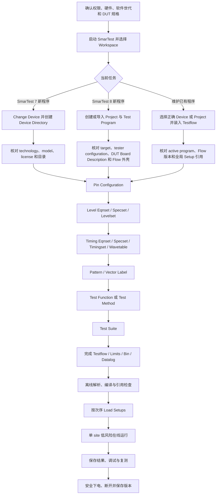

# V93000 一次完整测试流程操作顺序

本章先给出全貌。它分成“开发顺序”和“每次运行顺序”：开发顺序回答文件与设置先做什么，运行顺序回答 DUT 放上机台后先执行什么。两种顺序不能混为一谈。

> [!danger] 操作前提
> 真实机台操作必须由已获授权人员完成，并服从实验室安全规则、DUT 数据手册、当前 TDC 和已经批准的程序。第一次运行使用单 site、受控电流、低风险电平、短 pattern 和明确停止点。

## 1. 一张图看懂完整过程



## 2. 开发顺序

> [!important] 网络资料核对后的结论
> Pin 之前确实少了一层“程序容器和当前设备”操作，但不能笼统写成“先完成 Testflow”。对 **SmarTest 7 新程序**，历史原厂培训手册的章节次序是 Device Directory → Pin → Level → Timing → Vector → Standard Test Function → Testflow；对 **已有程序**，通常先选择 Device、装入 Testflow，再检查它引用的 setup；对 **SmarTest 8 新程序**，官方五天课程先建立 Project、Test Program、DUT Board Description 和 Testflow 外壳，随后才深入 level、timing、pattern 和 method。这里把“建立程序外壳”和“完成 flow 内容”分成两个阶段。

资料依据：[Advantest SmarTest 8 Basic User Training](https://www.advantest.com/en/customer-services/customer-training/onsite-training-na/application-training/v93000-st8-digital-user/)、[[参考资料/官方公开资料/ATK_V93000_SOC_SMT8_Digital_User_Training.pdf|本地官方五天课程议程]]、[Agilent 93000 Part 1 历史原厂培训手册目录](https://www.haolizi.com/example/view_115571.html)、[CIC《Digital Chip Testing with Agilent 93000 SOC Series》公开镜像](https://www.scribd.com/document/645133601/93K-use-pdf)。旧资料只用于解释 SmarTest 7 基本次序，当前菜单、model 和 license 字段以本机 TDC 为准。

### 第 0 步：建立输入资料

#### 0.1 收集文件

- DUT datasheet、封装 pinout、errata；
- DFT/协议说明、scan/MBIST/功能 pattern 说明；
- DUT board 原理图、PCB 版本、socket/probe card 图纸；
- test plan、limit 表、soft/hard bin 表；
- 上电、下电、reset、clock 和模式切换顺序；
- tester configuration、板卡清单、软件版本和许可；
- 已知 golden DUT、已知 fail DUT 和相关性结果。

#### 0.2 建立规格工作表

每一行至少填写：

| 字段 | 说明 |
| --- | --- |
| 名称 | 如 `VDDIO_NOM`、`tSU_CLK_DATA` |
| actual/min/max | 额定、下限和上限 |
| 单位 | V、mA、ns、MHz 等 |
| 条件 | 温度、电源域、输出电流、模式 |
| 来源 | datasheet 表号、图号或已批准文件 |
| 将进入的对象 | Eqnset `SPECS`、limit、pattern 或 Test Method 参数 |
| 未确认项 | 用 `<TBD>` 标记，并写负责人和待确认原因 |

#### 0.3 写出测试顺序

先用自然语言写出每项测试的前置状态、激励、测量、通过条件和结束状态。例如：

```text
continuity：DPS off，数字 pin Hi-Z
power_on：先 VDDIO 后 VDDCORE，每步检查电流
reset_func：保持 reset 两周期，再释放并比较状态
power_off：先停止 pattern，再按 DUT 要求关闭电源
```

#### 0.4 本步输出与通过条件

输出文件：规格工作表、pin 表、测试顺序表、未确认项清单。

通过条件：每个电压、电流、时序、方向和通过条件都有来源；未知项没有被猜测值掩盖；测试顺序包含安全结束状态。

### 第 1 步：确认硬件和软件世代

#### 1.1 记录系统身份

1. 记录 tester/test head 名称和系统序列号；
2. 从 hardware configuration 或维护记录导出板卡槽位；
3. 标出 PS1600、DPS128、HPPMU、utility 和外部仪器；
4. 记录板卡修订版、可用通道、特殊高压通道和 site 分配；
5. 记录 DUT board、socket/probe card 和 handler/prober 版本。

#### 1.2 记录软件条件

1. 记录 SmarTest 主版本和 patch；
2. 确认 SmarTest 7 还是 SmarTest 8；
3. 记录 test method library、编译器和客户框架版本；
4. 确认所需 feature/license 可用；
5. 确认当前校准文件与硬件配置相符。

使用 Eqnset 的项目通常按 SmarTest 7 章节操作；SmarTest 8 使用 Setup 对象和 Java Test Method，不能直接照搬旧 Eqnset 文件。

#### 1.3 打开正确文档

1. `Help > Help Contents` 打开本机 TDC；
2. 按准确板卡名搜索 level/timing/PMU/DPS 字段；
3. 按软件版本搜索 Testflow/Test Method API；
4. 将文档版本号写入项目说明；
5. 若只有旧公开资料，把“需要本机确认”的字段单独列出。

#### 1.4 本步输出与通过条件

输出文件：tester configuration 表、软件/许可/校准记录、文档版本表。

通过条件：每个信号和电源需求都能找到可用资源；不存在“程序按 PS1600 写、机台却装其他板卡”之类的配置不一致。

### 第 2 步：建立当前 Device、Project 和 Test Program

#### 2.1 先判断开发场景

| 场景 | Pin 之前必须完成 | Testflow 在此时的状态 |
| --- | --- | --- |
| SmarTest 7，全新程序 | 建 Device Directory，确认 device technology、tester model、license 和目录 | 可以尚未建立；历史原厂教材是在 setup 与标准测试功能之后才集中建立 Testflow |
| SmarTest 7，维护已有程序 | 切到正确 Device，确认目录与程序版本 | 应装入目标 flow，并先查看它引用了哪些 setup；不要把另一个 device 的 flow 当模板直接修改 |
| SmarTest 8，全新程序 | 建立或导入 Project，选择 target/tester configuration，建立 Test Program 与 DUT Board Description | 通常先有一个可构建的 flow/test-suite 外壳，详细 setup 和执行条件随后补齐 |
| SmarTest 8，维护已有程序 | 导入并激活正确 Project/Test Program，检查依赖与构建配置 | 打开目标 flow，确认所见对象属于当前 active program |

#### 2.2 SmarTest 7：新建 Device Directory

历史原厂实验给出的基本动作是 `Change Device` → 输入 device 名 → `Create` → 在新 device 窗口确认技术和 tester model → `Create Device`。按当前机台操作时应这样执行：

1. 先决定使用 offline 还是 online；只做文件开发时优先 offline，真实下载或测量才使用经批准的 online 环境；
2. 在主窗口点击 `Change Device`；若启动时因为没有有效的最近 device 而自动弹出该窗口，直接从这里继续；
3. 输入项目规定的 device 名，点击 `Create`；名称不得与量产目录或他人正在使用的目录冲突；
4. 在 `Create New Device` 类窗口中选择当前 TDC 要求的 device technology、tester/PPU model 与可选配置；历史练习中的 `cmos`、`act`、`P600` 只是旧培训实例，不能照填到 PS1600 项目；
5. 指定批准的 device path，执行 `Create Device`；
6. 在 Report/Console 确认当前 user、device 名、device directory 和启动状态；
7. 检查目录已生成 `configuration/`、`levels/`、`timing/`、`vectors/`、`testfunc/` 等当前版本需要的子目录；
8. 检查 `.technology`、model 和 license 信息是否与机台配置相符；
9. 若目录已有占用或锁定提示，联系正在使用该项目的人员或管理员处理，不手工删除锁文件；
10. 再次执行 `Change Device` 或查看窗口标题，确认当前 active device 正是刚建立的目录。

> [!note] 为什么 Device 必须先于 Pin
> SmarTest 7 的 Pin、Level、Timing、Vector 和 Testflow 文件都保存在 device directory 的相应位置。没有当前 device，就没有稳定的保存位置、technology/model 上下文和后续 setup 引用。历史原厂教材也明确从创建 Device Directory 进入 Pin Configuration，而不是先完成 Testflow。

#### 2.3 SmarTest 7：选择已有 Device

1. 点击 `Change Device`；
2. 从列表选择目标 device，或用 `Browse/Add Device Directory` 类入口加入已有目录；
3. 核对 device path，不能只看同名的短名称；
4. 查看 Report/Console 中的 device、technology 和启动信息；
5. 记录当前目录的版本、修改状态和占用提示；
6. 在 Data Manager 或 Test Program Explorer 中确认 Pin、Level、Timing、Vector 与 TESTFLOW 对象来自同一 device；
7. 只有这些信息一致后，才装入已有 Testflow 或编辑 Pin。

#### 2.4 SmarTest 8：建立 Project 与 Test Program 外壳

SmarTest 8 不再用旧 Device Directory 窗口概括全部项目对象。不同发行版和客户插件的向导名称会变化，操作顺序保持如下：

1. 在批准的 Workspace 中创建项目，或导入经过确认的项目模板；
2. 选择项目要求的软件 target、tester configuration、Java 与 Test Method Library 版本；
3. 建立或选中 Test Program file，确认它是当前 active program；
4. 建立 DUT Board Description，先录入 site 数、signal 名、方向和连接信息；
5. 建立最小 Testflow/Test Suite 外壳，或打开模板中已有的对象；此时允许只保留清楚命名的占位结构；
6. 执行一次初始构建，先处理项目依赖、版本和重复名称错误；
7. 在 Problems/Console 中确认没有“当前项目或 target 不存在”一类基础错误；
8. 保存项目位置、active program、target、tester configuration 和基准版本。

官方课程把 Project、Test Program、DUT Board Description 和 Testflow/Test Suite 放在基础 setup 课程之前，说明这些容器可以先建立；这不表示未定义 signal、level 或 timing 的 suite 已经可以在线运行。

#### 2.5 本步输出与通过条件

输出对象：SmarTest 7 Device Directory，或 SmarTest 8 Project/Test Program；另附当前环境记录。

通过条件：

- device/project 路径和 active program 清楚；
- technology/model/license 或 target/tester configuration 与实际系统一致；
- 新程序有可保存 setup 的位置；
- 已有程序没有选错同名目录或 flow；
- 项目占用、基础构建和版本问题已处理。

### 第 3 步：按场景建立或装入 Testflow 外壳

#### 3.1 哪些情况需要在 Pin 前打开 Testflow

- **SmarTest 7 新程序**：不是必需前置项。可以先在 Data Manager 的 Setup 页建立 Pin、Level、Timing 和 Vector，最后再建立 flow。
- **SmarTest 7 已有程序**：通常需要。先装入目标 flow，才能看清全局 setup 文件、suite 和程序版本是否匹配；但此时以检查为主。
- **SmarTest 8 新程序**：常先建立可构建的 flow/test-suite 外壳，使 Test Program 对象完整；详细 setup 绑定、条件、bin 和 datalog 仍在后面完成。
- **SmarTest 8 已有程序**：应先打开目标 flow，确认它属于当前 active Test Program，再继续修改底层 setup。

#### 3.2 SmarTest 7 传统 Data Manager

已有 flow：

1. `Select > Program`；
2. 选择 `TESTFLOW` 图标；
3. `File > Load`，选择目标 flow 并确认；
4. 双击 `TESTFLOW` 图标，打开 Testflow Editor；
5. 先记录 flow 文件名与全局 Pin/Level/Timing/Vector 引用；
6. 只有确认这些引用属于当前 device 后，才执行 `File > Load Setups`。

新 flow：

1. `Select > Program`；
2. 双击 `TESTFLOW` 图标，或点击主按钮区 `Testflow`；
3. 只看到 `START` 与插入点属于正常状态；
4. 先保存一个唯一的 flow 文件名；
5. 可以暂时不插入 suite，也不为尚未建立的 setup 猜文件名；
6. 等 Pin、Level、Timing、Vector、method 和 suite 可用后，在第 10 步完成全局 setup 与执行内容。

#### 3.3 Eclipse Workcenter 形式

1. 在 `Test Program Explorer` 展开当前 device/project；
2. 在 `Device Information` 或当前版本的程序树中找到 `Testflow`；
3. 已有 flow 用右键 `Load...` 或当前版本的等效菜单装入；
4. 双击对象或用上下文菜单打开编辑器；
5. 新项目若模板已生成 flow，只保留最小结构并确认名称；
6. 在 Properties/Console 核对 active program、flow 路径和引用；
7. 不要在未核对引用时直接执行 `Load All Setups`。

#### 3.4 Pin 前只做检查，不完成最终 flow

| 此时应完成 | 留到第 10 步 |
| --- | --- |
| active device/project 与 flow 文件名 | 完整 suite 顺序 |
| 新建还是维护已有程序 | pass/fail 分支与 loop |
| 已有 flow 的全局 setup 引用 | limits、test number、bin 和 datalog |
| flow 是否能打开、保存或通过基础解析 | init、abort、power-off 和 disconnect 的最终检查 |
| 是否存在错误路径、旧版本或同名对象 | 全部 setup 与 method 的正式绑定 |

> [!warning] `Load Testflow` 不等于 `Load Setups`
> 历史 SmarTest 7 手册把这两个动作分开。装入 flow 只得到流程内容；执行 `File > Load Setups` 才会按其引用下载设置。新建程序在 Pin 尚未完成时不要强行下载整套 setup。

#### 3.5 本步输出与通过条件

输出对象：已确认的已有 Testflow，或一个能打开并保存的最小 flow 外壳；同时保存全局 setup 引用清单。

通过条件：flow 属于当前 device/project；路径和版本明确；已有 setup 引用没有跨到其他 device；新建 flow 未用猜测的文件名伪装成完整程序。

界面入口和截图见 [[20-界面操作图解与截图索引#3. 启动、Workspace 与 Device]] 与 [[20-界面操作图解与截图索引#4. 打开、加载与运行 Testflow]]。

### 第 4 步：建立 Pin Configuration

#### 4.1 整理逻辑 signal

1. 按 datasheet 录入 pin 名，不自行改写极性；
2. 标注 input、output、bidirectional、DPS、ground、analog、RF、utility；
3. 将总线展开为项目接受的名称，如 `Q0..Q7`；
4. 建立逻辑 group，如 `ALL_INPUTS`、`ALL_OUTPUTS`、`DATA_BUS`；
5. 分开不同电源域，不把 1.8 V 与 3.3 V pin 放入同一个 level group。

#### 4.2 对应物理通道

1. 从 DUT board 图纸追踪 DUT pin → socket/pogo → tester channel；
2. 给每个 site 分配独立通道；
3. 标出宽范围 driver/comparator、PPMU 或 HPPMU 需求；
4. 检查差分 pair、clock group 和高速组；
5. 检查同一物理通道没有被两个不相容 signal 使用。

#### 4.3 在界面建立 setup

1. SmarTest 7 新程序先在 Data Manager 执行 `Select > Setup`，选择 `Config`/Pin Configuration 图标；
2. 若项目有经批准的 package/DUT board 模板，执行 `File > Load` 装入模板；没有模板时按当前版本的新建入口建立文件；
3. 已有程序也可从 Testflow 的全局 Setup dialog 选择 Pin Configuration 行；
4. 输入或选择 pin 文件名，点击 `Edit` 或双击图标打开 Pin Configuration Editor；
5. 进入可编辑模式，建立 signal、group、site 和 channel 表；
6. 保存到当前 device/project 的 pin/configuration 位置；
7. 点击 `Load/Download`；Pin Configuration 必须最先进入 tester；
8. 回到 Data Manager/Test Program Explorer，确认 active pin 文件名与刚保存的文件一致。

#### 4.4 检查

- parser 没有 unknown/duplicate pin；
- site 数和 handler/prober 定义一致；
- 所有 Eqnset/Wavetable/Pattern 将使用的名称已经存在；
- 高压和专用测量 signal 位于正确物理资源；
- 初态、方向和 relay 状态明确。

输出文件：Pin Configuration 和 site-to-channel 表。

通过条件：无重叠通道、无未知 pin、site 与 DUT board 一致、特殊资源位置正确；Download 无错误。

### 第 5 步：建立 Level

#### 5.1 从 DUT 规格准备 Level 数据

1. 为每个电源域提取 `VDD_MIN/NOM/MAX`；
2. 为输入提取 `VIL(max)` 与 `VIH(min)`；
3. 为输出提取 `VOL(max)` 与 `VOH(min)`，连同规定的 `IOL/IOH`；
4. 提取绝对最大电压、允许注入电流和 power-off 条件；
5. 选择 tester driver 值、comparator 门限和保护值；
6. 与 [[12-PS1600硬件参数与配置]]、[[13-DPS128与供电资源配置]] 取共同允许区间。

#### 5.2 打开 Level Equation Editor

1. 在全局 Setup dialog 或 Test Suite dialog 选择 Level setup；
2. 点击 `Edit`，进入 Level Setup Editor；
3. `Select > Edit Equations`；
4. 新建 Eqnset 编号和说明，或复制一个经批准模板；
5. 不直接修改来源不明的旧 Eqnset。

#### 5.3 写 `EQNSET`

Level Eqnset 的顺序与角色：

```text
EQNSET 1 "counter_levels"   # Eqnset 编号与说明
  SPECS                     # 声明会由 Specset 提供的变量
    VDDIO   [V]
    VOL_OUT [V]
    VOH_OUT [V]

  EQUATIONS                 # 从 spec 计算内部变量
    VIL_DRV = 0
    VIH_DRV = VDDIO

  DPSPINS VDD               # 可选：给 DUT 电源资源赋值
    vout   = VDDIO
    ilimit = 50

  LEVELSET 1 "nominal"     # Eqnset 内的第一个 Levelset
    PINS CLK RST_N EN
      vil = VIL_DRV         # tester 驱动低
      vih = VIH_DRV         # tester 驱动高
    PINS Q0 Q1 Q2 Q3 Q4 Q5 Q6 Q7
      vol = VOL_OUT         # DUT 输出低的比较门限
      voh = VOH_OUT         # DUT 输出高的比较门限
```

逐项操作：

1. `EQNSET`：选未冲突的编号，说明写测试目的；
2. `SPECS`：只声明需要在 Spec Tool 中改变或扫描的外部规格，并写单位；
3. `EQUATIONS`：写中间公式，变量名不要与 spec 重名；
4. `DPSPINS`：只在项目结构允许 Level setup 管理 DPS 时使用；
5. `LEVELSET`：建立一个或多个资源设置组合；
6. `PINS`：引用 Pin Configuration 中已存在的 signal/group；
7. `vil/vih` 与 `vol/voh` 分别用于驱动和比较，不能互换；
8. 教学例的 `ilimit=50` 不是可直接上机的安全值，单位和数值必须由实际 DPS 配置确认。

#### 5.4 Download Eqnset

1. 在 Equation Editor 点击 `Download`；
2. 立即查看 Report/Error；
3. 从第一条错误处理 unknown spec、variable、pin 或字段；
4. Download 成功后再进入 Spec Tool；
5. 保存 Eqnset 所在的 level setup 文件。

#### 5.5 建立 Specset

1. Level Setup Editor：`Select > Edit Specifications`；
2. 选择刚刚 Download 成功的 Eqnset；
3. 点击 `Create`，选择未使用的 Specset 编号；
4. 填说明，如 `nominal_1p8V`；
5. 在 Spec Tool 中填写 `SPECS` 变量的 actual 值；
6. characterization 需要时再填 minimum/maximum；
7. 检查单位；
8. 保存 Specset；
9. 即使 Eqnset 没有 `SPECS`，历史 SmarTest 7 也需要建立空 Specset。

教学 Specset：

```text
EQNSET 1 "counter_levels"
SPECSET 1 "nominal_1p8V"
VDDIO    1.80 [V]
VOL_OUT  0.40 [V]
VOH_OUT  1.40 [V]
```

#### 5.6 展开值检查

1. 选 Eqnset 1 + Specset 1 + Levelset 1；
2. 展开 `VIL_DRV/VIH_DRV`；
3. 检查每个 group 的 `vil/vih/vol/voh`；
4. 检查 DPS `vout/current limit`；
5. 检查值在 DUT、PS1600/DPS 和 DUT board 共同允许区间；
6. 为 `vdd_min`、`vdd_max` 建不同 Specset 时，重复展开检查。

输出文件：Level Eqnset、Level Specset、Levelset 和展开值记录。

通过条件：Eqnset Download 无错误；Specset 值和单位完整；每个 pin 的方向、门限和保护正确。完整语法见 [[17-SmarTest-7-Eqnset与Level语法详解]]。

### 第 6 步：建立 Timing 和 Wavetable

#### 6.1 准备 AC 规格

1. 提取 clock period/frequency、high/low pulse width；
2. 提取输入 setup/hold；
3. 提取 clock-to-output、output valid window；
4. 加入 DUT board 路径、tester 精度和批准的预留；
5. 画出一个 cycle 内的有效 clock edge、输入变化和 output strobe。

#### 6.2 打开 Timing Equation Editor

1. 在全局 Setup dialog 或 Test Suite dialog 选择 Timing setup；
2. 点击 `Edit` 进入 Timing Setup；
3. `Select > Edit Equations`；
4. 建 Timing Eqnset 编号与说明。

#### 6.3 写 Timing Eqnset

```text
EQNSET 2 "counter_timing"
  SPECS
    f     [MHz]
    tSU   [ns]
    tH    [ns]
    tCLKH [ns]
    tCO   [ns]

  EQUATIONS
    p       = 1 / f * 1000
    clk_ref = p / 2

  TIMINGSET 1 "functional"
    period = p
    PINS CLK
      d1 = clk_ref
      d2 = clk_ref + tCLKH
    PINS RST_N EN
      d1 = clk_ref - tSU - 2
      d2 = clk_ref - tSU
      d3 = clk_ref + tH
    PINS Q0 Q1 Q2 Q3 Q4 Q5 Q6 Q7
      r1 = clk_ref + tCO
```

逐项操作：

1. `SPECS` 声明频率和来自 DUT 的 AC 参数；
2. `EQUATIONS` 计算 period 和参考 edge；
3. `TIMINGSET` 建立一组实际 edge；
4. `period` 使用计算后的 `p`；
5. `PINS` block 按 driver/compare 动作需要给出 `d1/d2/d3/r1`；
6. 若同一 Eqnset 有 debug/functional 两种结构，使用不同 Timingset 编号；
7. 若只是频率变更，优先建立不同 Specset，不复制公式。

#### 6.4 建立或选择 Wavetable

1. 打开 Wavetable editor；
2. 为每个 pin/group 定义 pattern 字符的物理 waveform index；
3. driver 动作引用 `d1/d2/d3`；
4. compare 动作引用 `r1` 等 receive edge；
5. 双向 pin 明确 drive → Hi-Z → compare 的顺序；
6. Wavetable 的 edge 名必须与 Eqnset 完全一致；
7. break/mask 字符按 pin 类型定义。

教学片段：

```text
PINS CLK
  0    "d1:0 d2:0"
  1    "d1:1 d2:0"

PINS Q0 Q1 Q2 Q3 Q4 Q5 Q6 Q7
  0    "r1:L"
  1    "r1:H"
  2    "r1:X"
```

#### 6.5 Download Timing Eqnset

1. 点击 `Download`；
2. 处理公式、单位、edge 和 pin 错误；
3. 确认 Wavetable 引用的 edge 都已定义；
4. 保存 timing setup。

#### 6.6 建 Timing Specset

1. `Select > Edit Specifications`；
2. 选择 Timing Eqnset 2；
3. 建 Specset 1，例如 `50MHz_nominal`；
4. 填 `f/tSU/tH/tCLKH/tCO` actual/min/max；
5. 关联正确 Wavetable；
6. 保存。

```text
SPECSET 1 "50MHz_nominal"
f      50 [MHz]
tSU     3 [ns]
tH      1 [ns]
tCLKH   5 [ns]
tCO     6 [ns]
```

#### 6.7 手算与展开检查

1. 手算 `p=20 ns`、`clk_ref=10 ns`；
2. 手算每个 `d1/d2/d3/r1`；
3. 在工具中对照实际展开值；
4. 计算 minimum/maximum spec 点，不只检查 nominal；
5. 确认 edge 与 Wavetable 动作一致；
6. 确认 strobe 在 DUT 输出有效区；
7. 确认 Timing setup 成功后再下载 Vector setup。

输出文件：Timing Eqnset、Timing Specset、Timingset、Wavetable 和 edge 计算表。

通过条件：公式与单位正确；所有 edge 可解释；Wavetable 无缺失 edge；Download 无错误。完整语法见 [[18-SmarTest-7-Timing-Eqnset与Wavetable语法]]。

### 第 7 步：建立 Pattern 和 Vector Label

#### 7.1 建逻辑 cycle 表

1. 固定 pin/group 顺序；
2. 写 reset/assert/deassert cycle；
3. 写 mode/enable/clock 输入；
4. 写每个输出的期望低、高或不比较；
5. 标出双向 pin 的方向切换；
6. 人工演算最小序列的 DUT 状态。

#### 7.2 在 Vector/Pattern 工具中建立

1. 创建最小 pattern 文件；
2. 选择与 Timing Specset 关联的 Wavetable；
3. 将逻辑字符转换为正确 waveform index；
4. 建立 label，如 `reset_func`、`counter_func`；
5. 需要时加入 repeat、loop、call/jump 或 break；
6. 对 burst 建 label 清单；
7. 保存 pattern/vector 文件。

#### 7.3 下载与检查

1. 确认 Pin 与 Timing 已加载；
2. 下载 Vector setup；
3. 检查 pin 顺序、waveform index、label 和 memory 报错；
4. 在低速条件展开前几个 cycle；
5. 检查 reset、clock、输入和 compare 的时间关系；
6. 输出周期若不应比较，明确使用 X/mask，不留下默认预期。

输出文件：Pattern/vector 文件、label 表和人工演算表。

通过条件：最小 pattern 可下载；每个 cycle 的物理动作和 DUT 预期都可解释；无未知 label 或 waveform。

### 第 8 步：建立 Test Function/Test Method

#### 8.1 先决定是否需要自定义代码

1. 查标准 Test Function/Test Method 是否已经满足测试；
2. 标准方法能完成时，优先复用经过验证的方法；
3. 只有特殊协议、计算或仪器控制需要时才写自定义方法；
4. 明确 SmarTest 7 C/C++ UTM 与 SmarTest 8 Java 的软件世代。

#### 8.2 定义 method 接口

每个方法先写一张接口表：

| 内容 | 必须说明 |
| --- | --- |
| 输入参数 | 名称、类型、单位、默认值、允许范围 |
| setup 依赖 | pin/level/timing/pattern/instrument |
| 每 site 输入 | active site 与 channel 取得方式 |
| 测量动作 | Force/Measure/functional/计算顺序 |
| 结果 | 名称、单位、每 site 数量 |
| limits | 来源、上下限、失效分类 |
| 异常 | 超时、API 错误、abort 的处理 |
| cleanup | relay、DPS、PMU、pattern 的恢复动作 |

#### 8.3 编写与编译

1. 从当前版本批准模板生成类/函数；
2. 注册输入参数；
3. 获取当前 active sites；
4. 调用当前 TDC 中的 setup/measurement API；
5. 为每个 site 保存结果；
6. 将结果提交给 datalog/limit 系统；
7. 在 `finally`、cleanup 或等效结构中恢复硬件；
8. 编译并修复第一条错误；
9. 用离线 mock/仿真能力验证参数与结果数目；
10. 不在没有当前 API 文档时根据相似类名猜接口。

#### 8.4 本步输出与通过条件

输出文件：Test Method 源码、编译产物、参数表和单元级测试记录。

通过条件：编译成功；参数、结果和单位完整；per-site 数目正确；正常、fail、abort 都能恢复硬件状态。

### 第 9 步：建立 Test Suite

#### 9.1 在 Testflow Editor 插入 suite

1. 选择 insertion point；
2. `Insert > Run Test` 建顺序项，或 `Insert > Run and Branch` 建 pass/fail 项；
3. 填唯一而清楚的 suite 名称；
4. 选择 Test Function/Test Method 模式；
5. 输入或选择 method 名。

#### 9.2 选择 Level 三项

1. 点击 `Level Equation` 字段；
2. 点击 `Select`；
3. 先选 Level Eqnset + Level Specset 组合；
4. 再从该 Eqnset 显示的列表中选 Levelset；
5. 确认 dialog 中三个字段都已填写；
6. 若列表为空，先 Load Level setup，不手输未知编号。

#### 9.3 选择 Timing 三项

1. 点击 `Timing Equation` 字段；
2. 先选 Timing Eqnset + Timing Specset；
3. 再选该 Eqnset 内的 Timingset；
4. 选择匹配的 Wavetable/Vector Label；
5. 检查 `override_tim_equ_set`、`override_timset` 或 GUI 等效项。

#### 9.4 填 Test Method 参数与结果

1. 填所有必需参数；
2. 单位与 method 定义一致；
3. 绑定 limits/test number/test name；
4. 确认 per-site 结果和 datalog 名称；
5. 保存 suite；
6. 需要时在 dialog 中 Load 单个 setup；
7. 使用 `Exec All & Stop Here` 或低风险单 suite 调试。

#### 9.5 本步输出与通过条件

输出对象：可在 Testflow 中执行的 Test Suite。

通过条件：Eqnset、Specset、Set、label、method、limits 和结果全部可解析；展开值与设计记录一致。

### 第 10 步：完成 Testflow

#### 10.1 返回已有外壳或现在新建

1. Data Manager：`Select > Program`；
2. 第 3 步已建立或装入 flow 时，核对文件名后重新打开；
3. SmarTest 7 新程序若此前没有建立 flow，现在选择 TESTFLOW 并打开 Testflow Editor；
4. 新 flow 只有 START 和插入点是正常状态；
5. `Select > Setup` 填全局 Pin/Level/Timing/Vector 等已经存在的文件；
6. 执行 `File > Load Setups`，按 Pin → Level/Timing → Vector 的依赖检查首个错误；
7. SmarTest 8 在当前 Test Program 中打开早期建立的 flow/test-suite 外壳，补齐真实 setup 与 method 引用。

#### 10.2 按测试顺序插入元素

推荐顺序：

```text
connect/contact -> power_on -> DC checks -> reset -> functional
-> characterization（如需要） -> bin -> power_off/disconnect
```

逐项操作：

1. continuity 使用 run and branch；
2. contact fail 进入专用 bin，不继续强制上电；
3. power_on 后立即插入电压/电流检查；
4. DC fail 与 functional fail 使用不同 fail 分类；
5. reset suite 在所有 functional suite 之前；
6. characterization 默认不进入正式量产主路径，除非 test plan 要求；
7. 每条最终路径都经过 power_off/disconnect；
8. 设置 otherwise bin，处理未命中明确 bin 的结束；
9. 设置 init/download/abort suite（若项目使用）；
10. 检查 loop 有退出条件，临时 spec 有恢复动作。

#### 10.3 条件和变量

1. `Select > Variables` 建变量并注明类型；
2. 用 `pass()`、`fail()`、`has_run()` 等函数前确认 suite 名；
3. `tf_result()` 的索引查具体 Test Function 文档；
4. 用 `svlr_level()`、`svlr_timing()` 记录实际 spec；
5. Assign Level/Timing Value 后，在 pass/fail/abort 路径恢复 nominal；
6. 条件表达式先用简单场景验证，不一次加入多层嵌套。

#### 10.4 保存和检查

1. Program 页选 Testflow 图标；
2. 输入正式文件名；
3. 点击 `Save`；
4. Testflow Editor 使用 `File > Save Setups` 保存改变的 setup；
5. 重新 Load 一次，确认不是只保存在临时文件；
6. 检查 flow 中每个元素都可到达；
7. 检查每条路径可到达安全结束动作。

输出文件：Testflow、全局 setup 选择、bin/变量/异常处理定义。

通过条件：flow 可保存和重新加载；所有分支、loop、bin、abort 与安全下电动作正确。详见 [[19-SmarTest-7-Testflow表达式与Test-Suite覆盖项]]。

### 第 11 步：离线检查

#### 11.1 语法与引用

1. Pin、Level、Timing、Wavetable、Vector、Testflow 全部 parser 通过；
2. Test Method 全部编译；
3. 所有 pin/group、Eqnset、Specset、Levelset、Timingset、label 和 method 可找到；
4. 没有重复编号、大小写差异或旧文件引用。

#### 11.2 数值展开

1. 保存每个 suite 的 Level/Timing 实际值；
2. 手算并对照 Eqnset 公式；
3. 检查 nominal/min/max；
4. 检查电压、电流、period、edge 和 current limit；
5. 检查单位换算，特别是 MHz↔ns、A↔mA↔µA。

#### 11.3 Flow 和结果

1. 模拟 pass、各类 fail、abort 和 timeout；
2. 检查每条路径的 bin；
3. 检查每条路径最终关闭电源；
4. 检查 per-site 结果数目；
5. 检查 datalog 的 test name、number、unit、limits；
6. 检查临时 spec 在结束时恢复。

#### 11.4 本步输出与通过条件

输出文件：离线检查记录、展开值表、未确认项清单。

通过条件：软件结构无错误，安全和结果路径完整。离线通过只代表软件结构通过，不代表真实电气通过。

## 3. 启动软件与打开 Testflow

这是一份已有程序的快速操作清单。全新 SmarTest 7 程序应先执行第 2 步创建 Device Directory，再从 Data Manager 的 Setup 页建立 Pin；它不要求先装入 Testflow。

### SmarTest 7 传统 Data Manager

1. 启动 SmarTest，选择正确 Workspace/Device；
2. 核对 device path、technology、model/license 和程序版本；
3. Data Manager：`Select > Program`；
4. 若已有 flow，选 `TESTFLOW` 图标，执行 `File > Load` 并选择文件；
5. 双击 `TESTFLOW` 图标，或点击主按钮区 `Testflow`；
6. Testflow Editor 打开后，先核对全局 setup 引用；
7. 引用无误后执行 `File > Load Setups` 下载所需设置。

### SmarTest Eclipse Workcenter 形式

1. 左侧 `Test Program Explorer` 展开当前 device/project；
2. 核对 active Test Program、target/tester configuration 和项目版本；
3. 在 `Device Information` 或当前程序树中找到 `Testflow`；
4. 右键选择 `Load...`，选定 flow；
5. 根据版本双击对象或使用上下文菜单打开编辑器；
6. 先核对 flow 路径和 setup 引用，再执行 `Load All Setups` 或编辑器中的 `File > Load Setups`；
7. 观察 Console/Error Log。

不同 SmarTest 7 修订版的菜单文字可能不同。截图与详细说明见 [[20-界面操作图解与截图索引#4. 打开、加载与运行 Testflow]]。

## 4. Setup 下载顺序

历史原厂培训手册明确提出两条依赖：

1. **Pin Configuration 永远先下载**；
2. **Timing setup 必须先于 Vector setup 下载**。

推荐完整顺序：

```text
Pin Configuration
-> Levels / DPS
-> Timing / Wavetable
-> Vector / Pattern
-> Test Function/Method 所需设置
-> Testflow
```

每一步都检查 Report/Error 窗口。若前一步失败，不继续用后续错误淹没首个原因。

## 5. 一颗 DUT 的运行顺序

### 运行前

1. 确认正确 device、program、flow 和版本；
2. 检查 Tester State、Operation Control、校准和互锁；
3. 核对 DUT 方向、socket/probe card 和 site；
4. 清理旧 Report，确认 nominal specs 已恢复；
5. 初次运行选择单 site 与短 flow。

### 运行中

#### 5.1 Connect

1. 确认 tester 当前没有遗留运行中的 pattern；
2. 确认 DPS、PPMU/HPPMU 和外部电源为关闭或批准初态；
3. 确认数字 driver 为 Hi-Z 或批准的 power-off level；
4. 执行 connect/relay 动作；
5. 检查 interlock、relay 和系统错误；
6. 任一错误都进入 disconnect，不继续上电。

#### 5.2 Continuity/Contact

1. 选择 continuity suite 使用的 pin group；
2. 确认 Force I、clamp、等待时间和 Measure V limit；
3. 保持 DUT 主电源关闭；
4. 单 site 执行；
5. 保存每 pin 测量值，不只保存 pass/fail；
6. 开路/短路结果进入 contact fail bin；
7. contact fail 时不要通过提高电流反复尝试。

#### 5.3 设置数字 pin 安全状态

1. 选择 power-off Level Eqnset/Specset/Levelset；
2. input/bidirectional pin 使用批准的 Hi-Z 或安全低电平；
3. output pin comparator 不应主动驱动 DUT；
4. utility line、external relay 和上拉/下拉处于批准初态；
5. 检查 DUT 未上电时没有反向供电路径。

#### 5.4 按顺序使能 DPS

对每个电源域重复：

1. 选择正确 DPS channel/group；
2. 设置目标电压、current limit、ramp 和等待时间；
3. 使能该电源域；
4. 读取实际电压和电流；
5. 与 expected/limit 比较；
6. 电压、电流或顺序异常则停止并关闭已经开启的电源；
7. 通过后才使能下一电源域。

#### 5.5 运行 DC 测试

1. leakage：确认 pin 状态、Force V/Measure I 方向和量程；
2. IDD：确认 DUT 模式、pattern 是否停止或按 test plan 运行；
3. VOH/VOL 或 drive-current：确认有源电流条件和 comparator/PMU 资源；
4. 每项结果提交 value、unit、low/high limit 和 site；
5. 超限时区分 DUT fail、接触问题和 instrument range 错误；
6. DC fail 进入专用 fail 路径并安全下电。

#### 5.6 Reset 与初始化

1. 选择 nominal Level Eqnset/Specset/Levelset；
2. 选择低速 Timing Eqnset/Specset/Timingset；
3. 选择 reset Wavetable 和 Vector Label；
4. assert reset 达到规定时间；
5. 设置 mode/enable；
6. deassert reset；
7. 比较一个可预测状态或读取 ID；
8. reset fail 时先检查 pin 方向、level、timing 和 pattern，不直接运行主功能测试。

#### 5.7 低速最小 Functional

1. 保持 nominal level；
2. 使用 relaxed/低速 Timing Specset；
3. 只执行最短 label；
4. 查看 first-fail cycle 和 pin；
5. 展开失败 cycle 的 Wavetable 动作；
6. 确认功能逻辑通过后，再进入额定速度。

#### 5.8 额定速度 Functional

1. 切换到额定 Timing Specset；
2. 再次确认 suite 中 Eqnset/Specset/Timingset 没有选错；
3. 运行完整或分段 label；
4. 保存 first fail、失败 pin、cycle、site 和当前 spec；
5. 固定 level/pattern，一次只改变一个 timing 参数进行定位；
6. functional fail 进入对应 bin，不跳过安全结束动作。

#### 5.9 Margin/Shmoo（仅在需要时）

1. nominal 点先运行并通过；
2. 写明 X/Y 轴 spec、范围、步长和停止条件；
3. 确认扫描值不越过 DUT 与 tester 允许范围；
4. 使用单 site、短 pattern；
5. 每个点保存实际 spec 和结果；
6. 扫描后恢复 nominal；
7. 再运行 nominal 点，确认状态已恢复。

#### 5.10 Datalog 与 first-fail

1. 保存 lot/wafer/坐标或 DUT ID；
2. 保存 tester、site、程序和配置版本；
3. 保存 test number/name、value、unit、limits；
4. 保存 Eqnset/Specset/Set/label；
5. 数字失败保存 first-fail cycle/pin/expected；
6. 系统错误与 DUT 电气 fail 分开记录。

#### 5.11 Bin

1. 根据首个有效失败或批准规则分 soft bin；
2. 根据产品规则转成 hard bin；
3. contact、DC、functional、系统异常使用可区分的分类；
4. 检查多 site 时每个 site 单独分档；
5. 没有命中明确路径时进入 otherwise bin；
6. bin 后仍执行 power-off/disconnect。

#### 5.12 Power-off 与 Disconnect

1. 停止 sequencer/pattern；
2. 数字 pin 回到批准的 power-off Levelset；
3. 关闭 PPMU/HPPMU Force；
4. 按 DUT 要求的反向顺序关闭 DPS；
5. 读取并确认各电源已回到关闭状态；
6. 复位 relay/utility/external instrument；
7. 执行 disconnect；
8. 确认 Tester State 和 Report 没有遗留错误。

### 运行后

- 确认所有电源关闭、数字 pin 和 relay 为安全状态；
- 保存 datalog、Report、错误日志和版本；
- 若修改过 spec，显式恢复 nominal 并重新运行基准点；
- 写清尚未确认的问题，不把暂时 pass 当作问题已解决。

## 6. 第一次在线运行的逐级放开

| 级别 | 允许的内容 | 进入下一级的条件 |
| --- | --- | --- |
| 1 | 无 DUT 的连接和初态检查 | 无异常电压、relay 状态正确 |
| 2 | DUT continuity，低电流 | 接触合理，无明显短路 |
| 3 | 单一电源域，严格 current limit | 电压和电流稳定 |
| 4 | 全电源域，reset 保持 | 上电顺序和静态电流正确 |
| 5 | 极短低速 pattern | reset/ID/基本功能通过 |
| 6 | 额定速度和完整 flow | first fail 与 datalog 可解释 |
| 7 | 多 site、Margin、Shmoo | 单 site 结果稳定且安全 |

任何一级出现异常，都回到上一个已知安全点，不通过放宽门限、提高 current limit 或跳过接触测试强行继续。

## 7. 完整流程的完成条件

- [ ] 已确认是在新建程序还是维护已有程序；
- [ ] 当前 Workspace、Device/Project、active Test Program、Testflow 和版本已经确认；
- [ ] SmarTest 7 的 device path、technology、model/license 已核对，或 SmarTest 8 的 target/tester configuration 已核对；
- [ ] 新程序的 Device Directory/Project 容器已经建立；已有程序的 flow 与全局 setup 引用已经核对；
- [ ] setup 按 Pin → Timing → Vector 的依赖顺序加载；
- [ ] 每个 Test Suite 的 Eqnset/Specset/Set/label 正确；
- [ ] 单 site、低风险条件先通过；
- [ ] pass、fail、abort 都能安全下电；
- [ ] datalog 保存数值、单位、limits、site 和程序版本；
- [ ] 临时 spec 已恢复并复测 nominal 点；
- [ ] 结果与未确认项均已记录。
