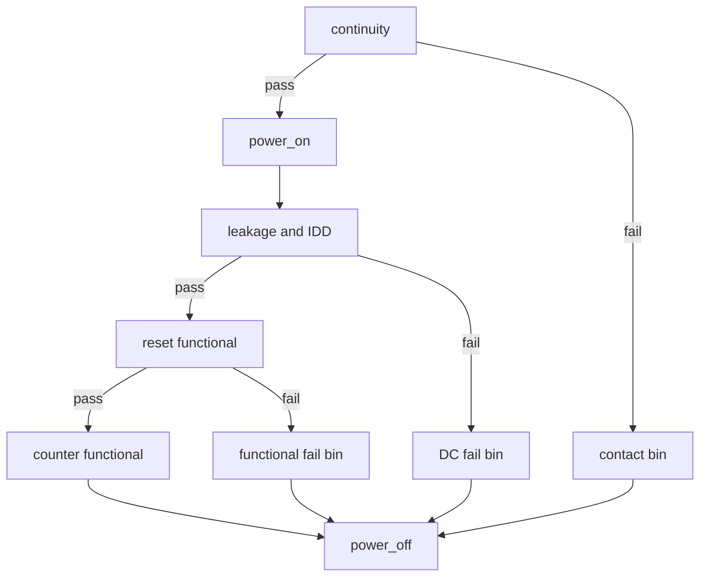

# V93000 综合实验与参考答案

本章把前面内容合成一个离线优先的练习：为 1.8 V、8 位同步计数器设计 pin、level、timing、pattern、Test Suite、Testflow、DC 测试和硬件资源检查。代码沿用 SmarTest 7 Eqnset 教学格式；若项目使用 SmarTest 8，应按本机 TDC 和项目模板建立 Setup 对象。

## 1. 已知条件

| 项目 | 教学值 |
| --- | ---: |
| `VDD` | 1.8 V ±5% |
| `VIL(max)` | 0.35 × VDD |
| `VIH(min)` | 0.65 × VDD |
| `VOL(max)` | 0.4 V |
| `VOH(min)` | 1.4 V |
| `f` | 50 MHz |
| `tSU` | 3 ns |
| `tH` | 1 ns |
| `tCO(max)` | 6 ns |
| 额定静态电流上限 | 20 mA |

## 2. 任务 A：计算规格值

计算 VDD 最小/最大值、输入门限和 period。

> [!note]- 参考答案
> `VDD_MIN=1.71 V`，`VDD_MAX=1.89 V`；在 nominal VDD 下，`VIL(max)=0.63 V`、`VIH(min)=1.17 V`；`period=1/50 MHz=20 ns`。

## 3. 任务 B：资源与 pin 表

为 `VDD/VSS/CLK/RST_N/EN/Q0..Q7` 指定资源类型，指出哪些使用 DPS128、哪些使用 PS1600。

> [!note]- 参考答案
> `VDD` 使用 DPS128，`VSS` 使用批准的地连接；`CLK/RST_N/EN/Q0..Q7` 使用 PS1600 数字通道。若要做单 pin continuity，可调用 PS1600 PPMU。具体 channel 号码必须来自当前 DUT board 图纸。

## 4. 任务 C：Level Eqnset

要求：使用 `SPECS` 保存外部规格，使用 `EQUATIONS` 计算 driver 值，输出使用独立 comparator 门限；代码见 [[17-SmarTest-7-Eqnset与Level语法详解#6. 完整教学例子]]。

通过条件：

- 没有未声明变量；
- `VIL/VIH` 与 `VOL/VOH` 没有混用；
- Eqnset、Specset 和 Levelset 均能被明确选择；
- 展开值落在 DUT 与 PS1600 共同允许区间。

## 5. 任务 D：Timing Eqnset

设有效时钟沿在 period 中点，`CLK` 高电平宽度 5 ns；输入在有效沿前 4 ns 驱动并保持到沿后 2 ns；输出 strobe 放在有效沿后 8 ns。

> [!note]- 参考答案
> `period=20 ns`，有效沿 `10 ns`；`CLK` 第二个 edge 为 `15 ns`；输入 edge 为 `6 ns` 与 `12 ns`；输出 strobe 为 `18 ns`。这些 edge 名称必须与 Wavetable 中的 `d1/d2/d3/r1` 动作一致。

## 6. 任务 E：Pattern

编写最小逻辑序列：

1. `RST_N=0` 保持两个周期；
2. `RST_N=1, EN=0` 保持一个周期；
3. `EN=1` 连续执行四个时钟；
4. 比较 `Q` 从 0 增加到 4；
5. 最后进入已知安全状态。

通过条件：reset、enable 和 compare 的每个周期都能在逻辑表中人工演算；不比较周期明确使用 X/mask 行为。

## 7. 任务 F：Testflow

建立以下顺序：

无论哪条失败路径，都必须到达安全下电动作。

## 8. 任务 G：故障题

### 题 1

所有 site 在第一个 compare 周期 fail high，但低速下也相同。列出前三项检查。

> [!note]- 参考答案
> 检查 output pin 方向和 channel；检查 `VOH` comparator 门限；检查 reset 后第一拍的 pattern 预期值与 Wavetable compare 字符。

### 题 2

只有 site 2 在 100 MHz 失败，50 MHz 通过。下一步怎样做？

> [!note]- 参考答案
> 固定 level 和 pattern，对每个 site 做 strobe 一维扫描；比较 site 2 的 first-fail、路径延迟、接触和校准。不要先放宽所有 site 的 timing。

### 题 3

Shmoo 结束后后面的 functional test 全部失败。

> [!note]- 参考答案
> 优先检查扫描改变的 spec 是否在所有退出路径恢复，并打印当前 Eqnset/Specset 和实际 spec 值。

## 9. 完成记录模板

| 项目 | 记录 |
| --- | --- |
| 软件版本 |  |
| tester class / hardware |  |
| Eqnset / Specset / Set |  |
| DUT board / socket |  |
| 离线解析结果 |  |
| 单 site 在线结果 |  |
| first-fail 记录 |  |
| 安全下电确认 |  |
| 未确认项 |  |

