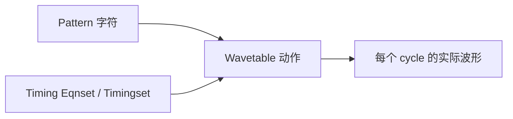

# SmarTest 7 Timing Eqnset 与 Wavetable 语法

Timing Eqnset 计算 period 和每个 edge 的时间；Wavetable 决定这些 edge 到来时 driver/comparator 做什么。Pattern 只给字符，三者缺一不可。

## 1. 三个对象的关系



| 对象 | 主要内容 | 典型错误 |
| --- | --- | --- |
| Timing Eqnset | spec、公式、period、edge 数值 | 公式或单位错误 |
| Wavetable | 字符到 `d1/d2/d3/r1` 动作 | 字符与 pin 类型不一致 |
| Pattern | 每 cycle 使用哪个字符 | reset、方向或预期数据错误 |

## 2. Timing Eqnset 骨架

```text
EQNSET <编号> "<说明>"
  SPECS
    <规格名> [<单位>]

  EQUATIONS
    <中间变量> = <表达式>

  TIMINGSET <编号> "<说明>"
    period = <值或表达式>
    PINS <pin/group>
      <edge 名> = <值或表达式>
```

公开培训材料中使用 `d1/d2/d3` 表示 driver edge，`r1` 表示 receive/compare edge；另一个 IEEE 工作组示例使用 `e1/e2/e4`。edge 名由当前 hardware、Wavetable 类型和项目格式决定，必须让 Eqnset 与 Wavetable 使用同一组名称。[IEEE 1450.4 comparison](https://grouper.ieee.org/groups/1450/dot4/docs_for_wg_meetings/language_spec_category_comparison.pdf)

## 3. 单位换算

若 `f` 的单位是 MHz，period 要以 ns 表示：

```text
p = 1 / f * 1000
```

原因是：

```text
1 MHz = 1 / µs
1 µs = 1000 ns
```

当 `f=50 MHz` 时，`p=20 ns`。若 Spec Tool 已把值换算成其他内部单位，仍以当前 TDC 的单位规则为准。

## 4. 完整 Timing Eqnset 例子

```text
EQNSET 2 "counter_timing"
  SPECS
    f       [MHz]
    tSU     [ns]
    tH      [ns]
    tCLKH   [ns]
    tCO     [ns]

  EQUATIONS
    p          = 1 / f * 1000
    clk_ref    = p / 2
    driveGuard = 2

  TIMINGSET 1 "functional"
    period = p

    PINS CLK
      d1 = clk_ref
      d2 = clk_ref + tCLKH

    PINS RST_N EN
      d1 = clk_ref - tSU - driveGuard
      d2 = clk_ref - tSU
      d3 = clk_ref + tH

    PINS Q0 Q1 Q2 Q3 Q4 Q5 Q6 Q7
      r1 = clk_ref + tCO
```

这个结构来自历史原厂培训中 `p`、参考时钟、`ComplDelay`、`TIMINGSET` 和 `PINS` 的用法，但信号名和数值是本课程重新设计的。

### 4.1 Specset 教学值

```text
EQNSET 2 "counter_timing"
SPECSET 1 "50MHz_nominal"
f      50 [MHz]
tSU     3 [ns]
tH      1 [ns]
tCLKH   5 [ns]
tCO     6 [ns]
```

### 4.2 展开计算

```text
p       = 1 / 50 * 1000 = 20 ns
clk_ref = 20 / 2         = 10 ns
CLK.d1  = 10 ns
CLK.d2  = 15 ns
IN.d1   = 5 ns
IN.d2   = 7 ns
IN.d3   = 11 ns
OUT.r1  = 16 ns
```

`driveGuard=2 ns` 给输入波形内部切换动作留出时间。它不是 DUT 规格，必须按当前 Wavetable 的动作和硬件要求确认。

## 5. Wavetable 骨架

下面是依据公开原厂示例重新整理的教学版：

```text
WAVETBL counter_wtb
  DISPLAY multi
  DCDT .

  PINS CLK
    0    "d1:0 d2:0"
    1    "d1:1 d2:0"
    brk  ""

  PINS RST_N EN
    0    "d1:0"
    1    "d1:1"
    brk  ""

  PINS Q0 Q1 Q2 Q3 Q4 Q5 Q6 Q7
    0    "r1:L"
    1    "r1:H"
    2    "r1:X"
```

### 5.1 怎样读动作字符串

| 片段 | 教学解释 |
| --- | --- |
| `d1:0` | 在 driver edge `d1` 执行动作 0 |
| `d1:1` | 在 `d1` 执行动作 1 |
| `d2:0` | 在第二个 driver edge 返回动作 0 |
| `r1:L` | 在 comparator edge `r1` 期望低 |
| `r1:H` | 在 `r1` 期望高 |
| `r1:X` | 在 `r1` 不作有效逻辑比较 |
| `brk ""` | break 字符不附加波形动作；是否需要由 pin 类型决定 |

左列 `0/1/2` 是物理 waveform index。Pattern 中逻辑字符怎样转成 index，由项目格式和 vector 工具决定。不要仅凭字符外观猜测实际电气动作。

### 5.2 双向 pin

公开原厂示例对双向 pin 使用过 `F00`、`F10`、`F0Z` 和 receive 动作组合，例如：

```text
PINS io_pins
  0    "d1:F00 r1:X"
  1    "d1:F10 r1:X"
  2    "d1:F0Z r1:L"
  3    "d1:F0Z r1:H"
```

这些复合动作涉及 driver 状态、格式和 Hi-Z 转换。必须从当前 TDC 复制适合所装板卡的合法模板，再根据测试目的修改，不能只根据名称推断。

## 6. Timing Specset 与 Wavetable

历史生成规格内容中，Timing Specset 会显式关联 Wavetable：

```text
EQNSET 2 "counter_timing"
WAVETBL "counter_wtb"
CHECK all
SPECSET 1 "50MHz_nominal"
f      50 [MHz]
tSU     3 [ns]
tH      1 [ns]
tCLKH   5 [ns]
tCO     6 [ns]
```

这说明同一个 Timing Eqnset 可能配合不同 Wavetable/Specset。若 Wavetable 需要 `d3`，Eqnset 没有为相关 pin 定义 `d3`，下载或运行就可能失败。

## 7. 多个 Timingset

一个 Eqnset 可以包含多个 `TIMINGSET`：

```text
TIMINGSET 1 "functional"
  period = p
  ...

TIMINGSET 2 "relaxed_debug"
  period = p * 2
  ...
```

适合用 Timingset 表达 waveform 结构相同但 edge 组织不同的情况。若只是频率变化，通常用另一个 Specset 改 `f` 更清楚。

## 8. Test Suite 如何选择

IEEE 工作组公开文档给出 V93000 示例：

```text
override_tim_equ_set = 1
override_timset      = 2
```

前一项选择 Timing Eqnset，后一项选择该 Eqnset 内的 Timingset。Specset 也要在 suite 的 timing 规格选项中选择。具体字段名称和编辑位置以当前 SmarTest 版本为准。

## 9. Parser 与运行检查

### 下载前

- `SPECS` 中单位存在且正确；
- 每个公式引用的变量已经声明或定义；
- 同一 Eqnset 内 `TIMINGSET` 编号不重复；
- Wavetable 使用的每个 edge 在相应 pin block 中有值；
- 所有 pin/group 存在。

### 下载后

- 检查 Report/Error 窗口无错误；
- 在 Timing/Specification 工具中查看实际展开值；
- 确认 suite 选择的 Eqnset、Specset、Timingset 与 Wavetable；
- 用低速、短 pattern 验证基本功能；
- 再用 Timing Debug 查看实际 edge 与 first fail。

## 10. 常见错误

| 现象 | 可能原因 | 检查 |
| --- | --- | --- |
| `period` 数量级错误 | MHz/ns 换算少了或多了 1000 | 手算一个 spec 点 |
| Wavetable 下载失败 | 动作引用的 edge 未定义 | 对照每个 pin block |
| Pattern 0/1 行为相反 | waveform index 与逻辑字符关系理解错误 | 展开一个 cycle 的实际动作 |
| 所有输出 fail | `r1` 太早、门限错误或 compare 字符错误 | 固定 level 后移动单一 strobe |
| 双向 pin 大电流 | Hi-Z 转换动作或 edge 不正确 | driver enable/disable 次序 |
| 改 `f` 后 edge 越过合法区间 | 公式未随 period 成比例或 spec 范围太宽 | 计算 min/max 点全部 edge |
| suite 使用旧 timing | 选错 Eqnset/Specset/Timingset | 打印或查看当前选择 |

## 11. 练习

> [!question] 练习 1
> 将 `f` 改为 100 MHz，其他 spec 不变。计算 `p`、`clk_ref` 和 `OUT.r1`。

> [!note]- 参考答案
> `p=10 ns`，`clk_ref=5 ns`，`OUT.r1=11 ns`。这已晚于一个 10 ns period；是否允许跨周期 edge 取决于当前 timing 模式，不能只看公式通过。应回查 TDC，并重新设计 `tCO` 比较位置或 tester cycle 结构。

> [!question] 练习 2
> Wavetable 对某输入引用 `d3`，但 Eqnset 只定义 `d1/d2`，应该怎样修正？

> [!note]- 参考答案
> 先查 `d3` 在该 waveform 中的动作目的，再在对应 `PINS` block 中定义合法时间；若该动作不需要，则改用经批准的不含 `d3` waveform。不能随意给 `d3=0` 只为消除报错。

## 12. 本章检查

- [ ] 能说明 Pattern、Wavetable 与 Timing Eqnset 的分工；
- [ ] 能手算一个 Specset 的所有主要 edge；
- [ ] Eqnset 与 Wavetable 使用相同 edge 名；
- [ ] 已核对 Eqnset、Specset、Timingset 和 Wavetable 的 suite 选择；
- [ ] min/max 规格点也通过公式与硬件模式检查。

