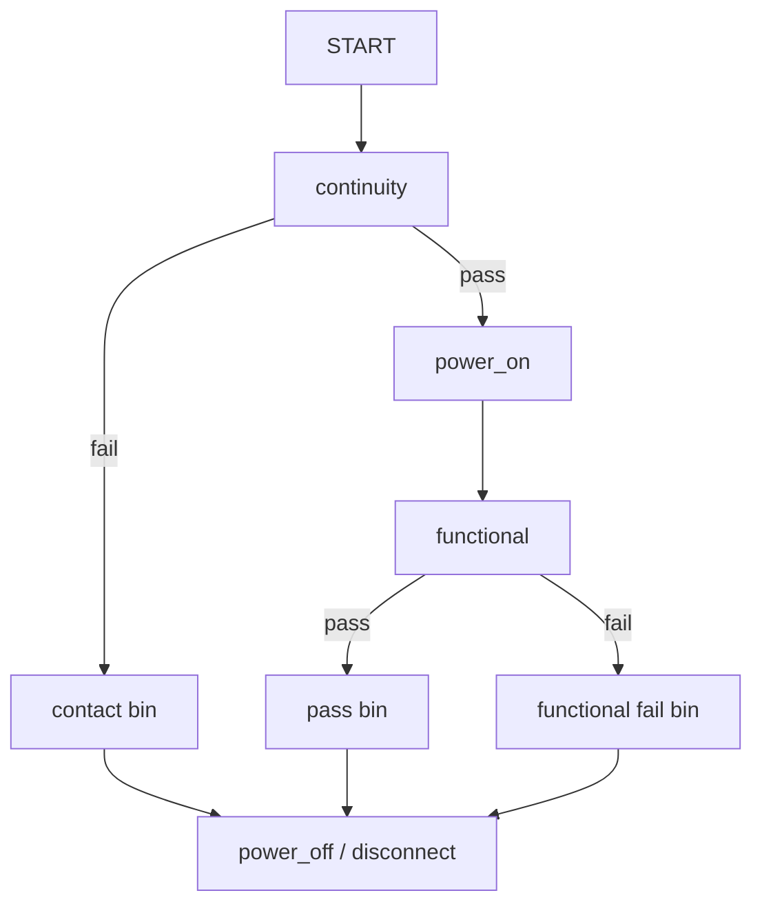

# SmarTest 7 Testflow 表达式与 Test Suite 覆盖项

本章说明 Testflow Editor 中能直接输入的表达式、Test Suite 如何选择 Eqnset/Specset/Set，以及保存、下载、执行和恢复状态的要求。历史 SmarTest 7 通常用图形编辑器生成 Testflow 文件；除非项目规范明确允许，不要把内部生成文件当普通文本手工修改。

## 1. Testflow 的最小结构



一个 `run and branch` 元素通常有 pass 和 fail 两条输出；普通 `run` 只按顺序继续。失败分档不能绕开关闭电源和释放资源的动作。

## 2. 打开 Testflow Editor

历史原厂培训资料给出的步骤是：

1. 在 Data Manager 选择 `Select > Program`；
2. 双击 `TESTFLOW` 图标；
3. 或使用主菜单按钮区的 `Testflow` 按钮；
4. 出现 Testflow Editor；新 flow 初始只有 `START` 和一个插入点。

若要先加载已有 Testflow：

1. 在 Program 页选中 Testflow 图标；
2. `File > Load`；
3. 选文件并点击 `Load`；
4. 再双击 Testflow 图标打开编辑器。

> [!important] Load Testflow 不等于 Load Setups
> 加载 Testflow 文件只把 flow 内容放入当前工作区，不会自动把 pin、level、timing、vector 等 setup 下载到 tester。进入 Testflow Editor 后使用 `File > Load Setups`，或按批准方式执行 flow 触发必要下载。

详细截图见 [[20-界面操作图解与截图索引#4. 打开、加载与运行 Testflow]]。

## 3. 插入与修改 Test Suite

### 新建

1. 选择 flow 上的插入点；
2. `Insert > Run Test`，建立顺序执行项；
3. 或 `Insert > Run and Branch`，建立带 pass/fail 分支的项；
4. 在 Test Suite dialog 中填写名称、setup 选择、vector label 和 Test Function/Test Method；
5. 确认后检查 flow 连线。

### 修改

双击已有 flow 元素，打开其 Test Suite dialog。修改前先记录当前 Eqnset、Specset、Set、label、limits 和 test number。

## 4. Test Suite 的设置选择

对于数字功能测试，至少检查：

| 项目 | 要选择的对象 | 来自哪里 |
| --- | --- | --- |
| Pin configuration | 全局 setup | pin 文件 |
| Level Equation | Level Eqnset | `EQNSET` 编号 |
| Level Specification | Level Specset | Spec Tool |
| Level Set | Eqnset 内 `LEVELSET` | `LEVELSET` 编号 |
| Timing Equation | Timing Eqnset | `EQNSET` 编号 |
| Timing Specification | Timing Specset | Spec Tool |
| Timing Set | Eqnset 内 `TIMINGSET` | `TIMINGSET` 编号 |
| Wavetable / Vector Label | 波形表与 pattern label | timing/vector setup |
| Test Function/Method | 执行逻辑 | 安装库或项目代码 |

IEEE 工作组公开的 V93000 例子展示了下列 suite 覆盖字段：

```text
override_tim_equ_set = 1
override_timset      = 2
```

这表示选择 Timing Eqnset 1 以及其中 Timingset 2。Level/Timing Specset 和其他覆盖字段的准确名称，应从当前版本的 Test Suite dialog 或生成文件中确认，不凭旧例猜测。

## 5. Testflow 变量

历史原厂手册列出四类变量：

| 类型 | 用途 |
| --- | --- |
| Double | 保存数值，例如 Test Suite 结果 |
| Userflag | 整数控制变量，用于条件分支 |
| String | 保存文本，例如要写到 Report 的信息 |
| Implicit | 在 Assign Value 元素中建立，由值决定为数值或字符串 |

打开变量窗口：`Select > Variables`。变量名应表达用途，例如 `retry_count`、`meas_current_uA`，不要使用 `a1`、`tmp2`。

## 6. 条件与循环表达式

公开培训资料展示过比较和逻辑关系，例如：

```text
a == 0 or I_test <= 100
```

教学解释：

- `==`：相等比较，不是赋值；
- `<=`：小于等于；
- `or`：任一条件成立即为真。

其他运算符、优先级和类型转换应查当前 Testflow Editor 帮助。复杂条件建议加括号，并把每个子条件先在变量窗口中验证。

## 7. 常用内建函数

以下函数由历史原厂培训手册直接列出：

| 表达式 | 返回内容 |
| --- | --- |
| `pass(gross_func)` | 指定 suite 在本次 flow 中是否 pass，真为 1 |
| `fail(gross_func)` | 指定 suite 是否 fail，真为 1 |
| `has_run(continuity)` | 指定 suite 是否已经运行 |
| `has_not_run(continuity)` | 指定 suite 是否尚未运行 |
| `tf_result(leakage, 0)` | 读取 suite 使用的 Test Function 结果数组第 0 项 |
| `svlr_timing(2, 1, "f")` | 读取 Timing Eqnset 2、Specset 1 中 spec `f` 的实际值 |
| `svlr_level(1, 1, "VDDIO")` | 读取 Level Eqnset 1、Specset 1 中 `VDDIO` 的实际值 |
| `spst_timing(2, 1)` | 对应 Timing Eqnset/Specset 是否存在 |
| `spst_level(1, 1)` | 对应 Level Eqnset/Specset 是否存在 |

`tf_result` 的索引含义由具体 Test Function 定义，必须查 Standard Test Function Reference 或项目说明。

### 7.1 分支例子

在 Testflow 条件框中可表达：

```text
fail(continuity)
```

用途：continuity 失败时走接触失败路径。

分别验证 reset suite 已运行和已经通过：

```text
has_run(reset_func)
pass(reset_func)
```

如果必须把两个条件写成一个组合表达式，应从当前版本 Testflow Editor 的条件构造器插入逻辑运算符，或查对应版本的 Testflow 手册；不要把其他语言中的 `and`、`&&` 直接复制进项目。公开历史培训资料足以确认上述两个内置函数，但不足以证明所有版本使用同一种逻辑运算符拼写。

### 7.2 读取 spec 例子

```text
current_f = svlr_timing(2, 1, "f")
current_v = svlr_level(1, 1, "VDDIO")
```

可把当前实际值写入 Report，帮助确认 Test Suite 用的不是旧 Specset。

## 8. 临时修改 spec

Testflow Editor 可以插入 `Assign Level Value` 或 `Assign Timing Value`。历史原厂手册强调：新值会立即生效，后续 suite 继续使用该值，界面图标未必显示明显变化。

安全结构：


pass、fail、abort 和异常路径都必须能恢复。若工具支持专门 cleanup/abort suite，应把恢复动作放入统一位置。

## 9. Burst 相关函数

公开手册还列出：

```text
burstfirst("<burstlabel>")
burstnext("<label>")
```

前者取得 burst 的第一个 label，后者取得当前 label 的下一个 label。可在 `for` loop 中逐个执行，定位 burst 内哪个 label 失败。循环必须处理空字符串结束条件，防止无法退出。

## 10. 保存、下载和执行

### 保存 Testflow

在 Data Manager 的 Program 页选中 Testflow 图标，填写名称并 `Save`。编辑器中的临时内容不会自动成为 device directory 中的正式文件。

### 下载 Setups

在 Testflow Editor 中：

1. `Select > Setup` 检查全局 setup 文件；
2. 使用相应 `Load`，或 `File > Load Setups`；
3. 始终先下载 Pin Configuration；
4. 检查 level、timing、vector 与 Test Function 报错；
5. 运行前保存修改。

### 执行

- 全 flow：`File > Execute All`；
- 选定元素：选中 flow 元素后 `File > Execute`；
- 中止：`File > Abort`；
- 调试到某一 suite：使用该 suite dialog 中的 `Exec All & Stop Here`（若版本提供）。

历史界面中，最后一次运行的元素通常以绿色表示 pass/true、红色表示 fail/false、白色表示未运行或无结果。

## 11. Test Method 语言世代

| 软件世代 | 官方培训页面所述主要语言 | 本课程处理方式 |
| --- | --- | --- |
| SmarTest 7 | C/C++ 风格 UTM Test Method | API 名称从当前 TDC 和已批准模板取得 |
| SmarTest 8 | Java Test Method | 结构见 [[08-Test-Method、Test-Suite与Testflow]] |

Advantest 台湾课程页明确区分了 SmarTest 7 的 C/C++ 与 SmarTest 8 的 Java 培训。[V93000 application training list](https://www.advantest.com/en/customer-services/customer-training/onsite-training-tw/application-training/)

不要把 SmarTest 8 Java API 示例放进 SmarTest 7 UTM，也不要只凭类名相似移植。没有当前版本 API 文档时，本课程不虚构可编译的 vendor API。

## 12. 常见失败

| 现象 | 可能原因 | 处理 |
| --- | --- | --- |
| 双击后只看到 START | 新 Testflow 尚未插入元素 | 选择插入点并插入 run/run and branch |
| flow 打开但 setup 未生效 | 只加载 Testflow 文件 | 再执行 Load Setups |
| suite 用错 timing | 覆盖项编号错误 | 对照 Eqnset/Specset/Timingset |
| 修改后执行的是旧内容 | 未保存正式文件或运行进程重新加载旧 setup | 保存并检查文件名/时间 |
| Shmoo 后后续测试变化 | 临时 spec 未恢复 | 在所有退出路径恢复 nominal |
| 条件永远为 false | suite 未运行、名称错误或结果索引错误 | 用 `has_run` 和 Report 分步检查 |

## 13. 本章检查

- [ ] 能区分 Load Testflow 与 Load Setups；
- [ ] 能从 Data Manager 打开 Testflow Editor；
- [ ] 每个 suite 的 Eqnset、Specset、Set 和 label 已核对；
- [ ] 条件表达式和内建函数参数可以解释；
- [ ] 临时 spec 在所有结束路径恢复；
- [ ] 保存、下载、执行和 abort 的行为均已验证。
