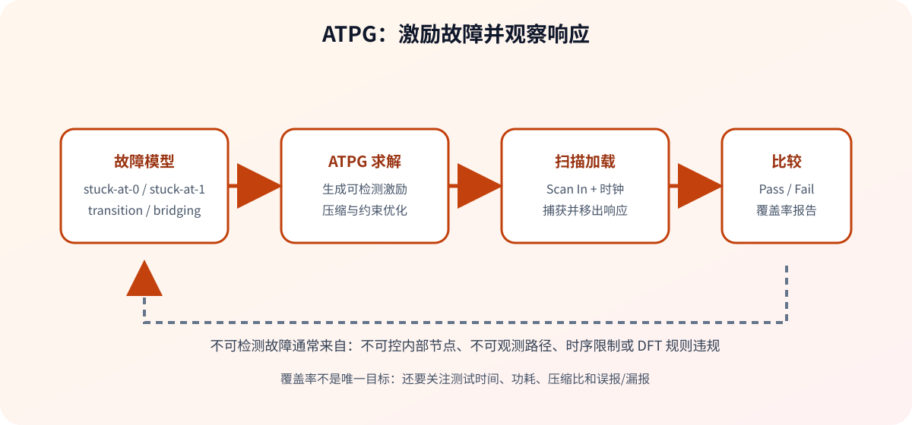

# DFT 学习导航

> 本文档集覆盖数字电路可测性、扫描链、DFT Compiler/DC 命令和实验流程。

术语参照：[[术语与翻译规范]]。

> [!tip] 一体化入门教程
> [[从零开始的DFT Flow搭建]] 从 RTL、工艺库和 SDC 开始，依次讲解综合、扫描、ATPG、MBIST/BISR、LBIST、OCC、JTAG、IJTAG、低功耗测试和物理阶段处理，并提供可复制的示例脚本与逐句说明。

## 一、先建立整体认识

DFT（Design for Test，可测性设计）的核心不是“额外加一些测试逻辑”，而是让芯片内部状态满足两件事：

- **可控性**：测试设备能够把内部节点驱动到需要的值。
- **可观测性**：内部节点的响应能够被传递到芯片输出或扫描输出。

典型数字芯片的 DFT 流程如下：

1. 准备 RTL/网表、工艺库和时序约束。
2. 描述测试时钟、复位、扫描端口和测试模式。
3. 将普通触发器替换为扫描触发器并串成扫描链。
4. 执行 DFT 设计规则检查（DRC），修复不可控或不可观测路径。
5. 运行 ATPG，评估覆盖率、测试时间、功耗和测试数据量。
6. 交付扫描网表、测试协议以及供 ATPG/ATE 使用的测试数据。

## 二、推荐阅读顺序

| 顺序 | 文档 | 重点 |
| --- | --- | --- |
| 1 | [[dc指令/DFT-Compiler基本使用方法]] | 内部扫描、边界扫描、全扫描与基本流程 |
| 2 | [[dc指令/常用synopsys--dc命令详解]] | DC/Tcl 基础命令和报告检查 |
| 3 | [[商业工具实验准备]] | Synopsys `dc_shell V-2023.12-SP3` 的实验入口与当前命令 |
| 4 | [[实验配套资料/README]] | ISCAS89 小型时序电路与 Logic BIST 多扫描链工程；按 Lab 3 至 Lab 9 选用 |
| 5 | [[dc指令/Synopsys-DFTC-Lab]] | DFT Compiler Workshop 的完整目标库实现（Technology Mapping）流程 |
| 6 | [[DC实验手册/DFTC lab3]] | 测试协议、时钟、复位和协议 DRC |
| 7 | [[DC实验手册/DFTC lab4]] | DFT 设计规则检查（DFT DRC）与 ATPG 覆盖率 |
| 8 | [[DC实验手册/DFTC lab5]] | Design Vision 图形化查看和调试 |
| 9 | [[DC实验手册/DFTC lab6]] | DFT 违规定位与修复 |
| 10 | [[DFTC lab7]] | 分层/自顶向下扫描插入 |
| 11 | [[DC实验手册/DFTC lab8]] | 扫描设计交接与测试数据输出 |
| 12 | [[DC实验手册/DFTC lab9]] | 扫描链平衡、容量和运行时间优化 |
| 13 | [[dc指令/Synopsis_DFT_User_Guider (1)]] | 用户指南主题索引与常用检查项 |
| 14 | [[dc指令/syn2（compile的都在这里面）]] | Design Compiler 编译命令与 DFT 接口 |
| 15 | [[开源实验资源/README]] | FAN_ATPG 与 Fault 的补充训练 |
| 16 | [[PDF原件索引]] | 统一存放的教材与命令文档 PDF 原件 |

## 三、必须掌握的结构

### 1. 扫描链

扫描模式下，扫描触发器通过 `SI` 和 `SO` 串联；`Scan Enable=1` 时完成移位，`Scan Enable=0` 时恢复功能模式并捕获组合逻辑结果。

### 2. 边界扫描 / JTAG

JTAG 通过 TAP 控制器和边界扫描寄存器访问芯片 I/O，常用于板级互连测试、调试和 I/O 旁路访问。

### 3. ATPG

ATPG 根据故障模型寻找测试激励，并通过扫描链装载、捕获和移出响应。覆盖率低时，优先检查 DFT 设计规则检查（DFT DRC）、时钟/复位可控性、黑盒和约束，而不是盲目增加测试向量。

## 四、常用检查清单

- [ ] 工艺库中存在目标扫描触发器单元，且没有被误设为 `dont_use`。
- [ ] 测试时钟、扫描时钟、复位和测试模式信号均已定义。
- [ ] 功能模式与测试模式之间的切换条件明确。
- [ ] `check_scan`、DFT 设计规则检查（DFT DRC）和扫描路径报告没有未解释的违规。
- [ ] 扫描链数量、长度和链间电容符合测试时间及功耗预算。
- [ ] ATPG 覆盖率报告中，可检测、不可检测和未覆盖故障均有原因分类。
- [ ] 交付物包含扫描网表、测试协议、约束、报告和版本信息。

## 五、术语速查

| 术语 | 含义 |
| --- | --- |
| DFT | 可测性设计 |
| DFTC | Synopsys DFT Compiler |
| DC | Synopsys Design Compiler |
| Scan FF | 扫描触发器 |
| SI / SO | 扫描输入 / 扫描输出 |
| SE | 扫描使能信号 |
| SPF / STIL | 测试协议/测试接口描述文件格式 |
| ATPG | 自动测试向量生成 |
| DRC | 设计规则检查；在 DFT 中重点检查测试可控性和可观测性 |
| Test Coverage | 测试覆盖率（Test Coverage）；应与故障覆盖率（Fault Coverage）和功能仿真覆盖率区分 |
| Fault Coverage | 故障覆盖率（Fault Coverage） |
