# 实验 3：创建测试协议

原始教材：[DFTC lab3.pdf](<DFTC lab3.pdf>)

> **PDF 对照说明**：原始 PDF 第 1 页是与教材无关的广告页，已过滤；本笔记从 PDF 第 2 页开始，按原教材顺序恢复。每个小节标题中的“PDF 第 N 页”对应原始 PDF 页码。

## PDF 对照表

| PDF 页码 | 教材内容 | 本笔记位置 |
| --- | --- | --- |
| 2 | 实验目标 | 实验目标 |
| 3 | Part A 目录、帮助命令 | Part A 准备 |
| 4–5 | 创建测试协议、问题 1–3 | Part A：创建协议 |
| 6–7 | Part B 目录、ORCA 初始化结构 | Part B：内部测试模式 |
| 8 | 问题 4–7、STIL 初始化向量 | Task 1 |
| 9–10 | 读入映射设计、问题 8–12 | Task 2–3 |
| 11 | 问题 13–14、最终 DRC | 结果分析 |

## PDF 第 2 页｜实验目标

完成本实验后，应能够：

1. 向 DFTC 提供足够的测试特征信息，使工具能够创建测试协议。
2. 验证已经告诉 DFTC 它需要知道的测试信息。
3. 验证测试协议、设计和工艺库之间相互兼容。
4. 验证设计已经正确编译，并且触发器已经替换为扫描触发器。
5. 修改测试协议，为内部测试模式信号加入初始化序列。

**实验时长**：约 60 分钟。

## PDF 第 3 页｜Part A：创建基础测试协议

### 1. 实验目录

Part A 工程目录为 lab3a_protocol：

```
lab3a_protocol/       当前工作目录
├── analyzed/          analyze/read_hdl 产生的中间文件
├── logs/              工具会话日志
├── unmapped/          未映射设计及协议
├── mapped/            门级网表
├── reports/           DFTC 报告
├── scripts/           约束及运行脚本
├── ref/rtl/RISC_CORE/ 设计 RTL
└── ref/lib/           工艺库文件
```

### 2. 查帮助的方法

```
help preview_dft
printvar *scan*
preview_dft -help
man compile
```

交互式工作时不必输入完整命令或选项，可以使用帮助和命令补全。

## PDF 第 4 页｜Task 1：用脚本创建测试协议

### 1. 教材流程

切换到项目目录，并查看 scripts 目录下的脚本：

```
cd lab3a_protocol
```

测试协议创建流程为：

```
在设计上应用测试属性
        ↓
报告测试属性
        ↓
创建测试协议
        ↓
运行 DFT DRC
        ↓
有违规？──是──> 修正属性/设计后重新检查
   │
   否
   ↓
保存测试协议文件
```

### 2. 教材给出的协议属性

| 测试属性 | 教材示例 |
| --- | --- |
| Test Clock Port | Clk |
| Test Clock timing | 100 ns 周期，45 ns 有效时刻，55 ns strobe/结束时刻 |
| Test Mode Port | TST_MODE |
| Reset port | Reset |
| Reset 类型 | 教材示例标注为 active-low；流程图标为 synchronous，报告示例也出现 asynchronous，必须以脚本实际定义为准 |

### 3. 创建脚本

打开 scripts/unmapped.tcl，按流程图将 DFTC 命令写入脚本，然后批量执行并保存日志：

```
dc_shell -f scripts/unmapped.tcl | tee logs/run_unmapped.log
```

教材第 5 页还提示使用 set_app_var 设置系统变量，并可用 suppress_message 忽略已经确认无害的 warning。不要在没有判断原因时直接 suppress 违规。

> [!note] PDF 蓝色批注
> 原页批注分别写着：`set_app_var：设置系统变量`；`suppress_message：忽略不关心或没问题的 warning`。第二条只适用于已经确认原因的提示，不代表可以跳过 DFT DRC。

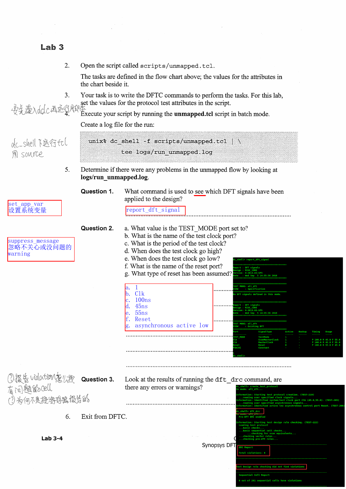

## PDF 第 5 页｜Part A 问题与答案

### 问题 1

**问题**：使用什么命令查看已经应用到设计上的 DFT 信号？

**答案**：

```
report_dft_signal
```

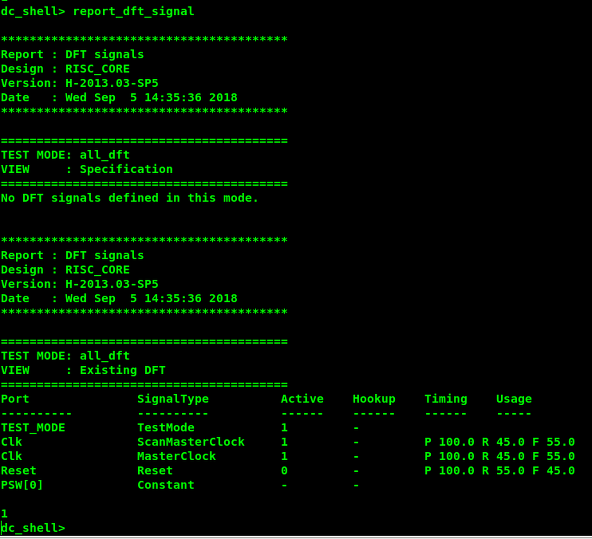

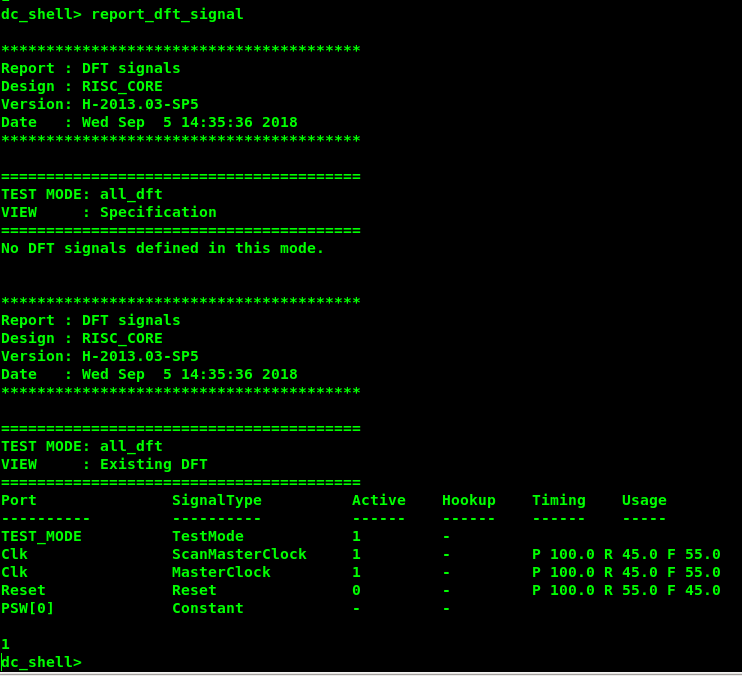

教材页面的 OCR 将该命令混成了 setvar/report_dft_signal，以工具命令 report_dft_signal 为准。

### 问题 2

查看 report_dft_signal 输出并回答：

| 小问 | 问题 | 答案 |
| --- | --- | --- |
| a | TEST_MODE 端口设置为什么值？ | 作为测试模式信号使用，示例为有效高电平 1 |
| b | 测试时钟端口叫什么？ | Clk |
| c | 测试时钟周期是多少？ | 100 ns |
| d | 测试时钟什么时候变高？ | 45 ns |
| e | 测试时钟什么时候变低/进入 strobe？ | 55 ns |
| f | 复位端口叫什么？ | Reset |
| g | 假设的复位类型是什么？ | 教材报告示例为 active-low；脚本若定义为异步，则应显示 asynchronous active-low |

> [!note] PDF 蓝色批注
> 原页手写答案逐项为：`1`、`Clk`、`100ns`、`45ns`、`55ns`、`Reset`、`asynchronous active low`。

### 问题 3

**问题**：运行 dft_drc 后是否有错误或 warning？

**答案**：Part A 的基础协议检查没有发现 DFT DRC 违规。报告最终为：

```
Test design rule checking did not find violations
```

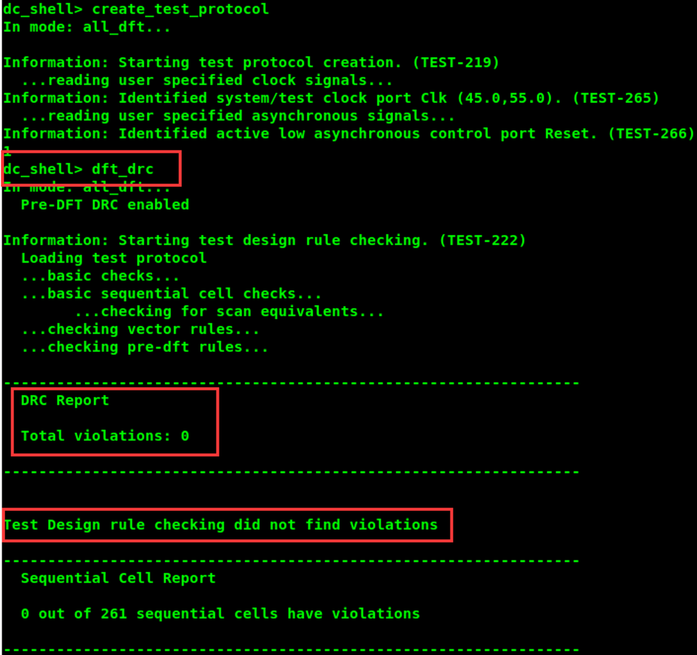

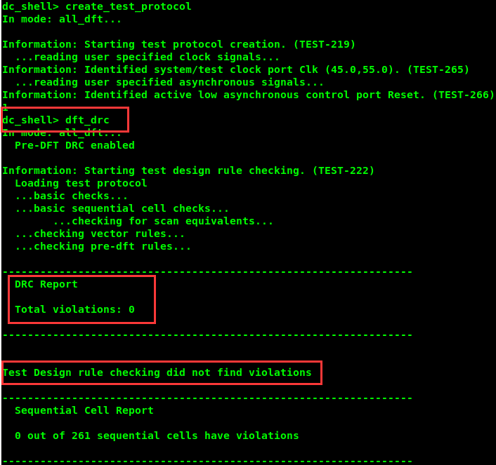

## PDF 第 6 页｜Part B：内部生成的测试模式

### 1. Part B 目录

```
lab3b_init/           当前工作目录
├── analyzed/          中间分析文件
├── logs/              会话日志
├── unmapped/          未映射协议
├── mapped/            门级网表
├── mapped_scan/       扫描门级网表
├── reports/           DFTC 报告
├── tmax/              下游 TetraMAX 文件
├── scripts/           约束和运行脚本
├── rtl/ORCA_init/     ORCA 初始化设计
└── libs/              工艺库
```

## PDF 第 7 页｜ORCA 测试初始化结构

ORCA 的 test_mode 不是直接连接到顶层测试端口，而是由 CONFIG 配置寄存器和 conf_ena、pclk 等信号产生：

```
conf_ena = 1：允许配置寄存器 F1/F2/F3 更新
             ↓ 通过 pclk 脉冲加载配置
内部 test_mode 被置为 1
             ↓
conf_ena = 0：锁住配置寄存器，保持测试模式
```

这类由内部状态机/配置寄存器生成的测试模式，不能只靠 set_dft_signal -type TestMode 自动推导，必须在测试协议的 test_setup 中写初始化向量。

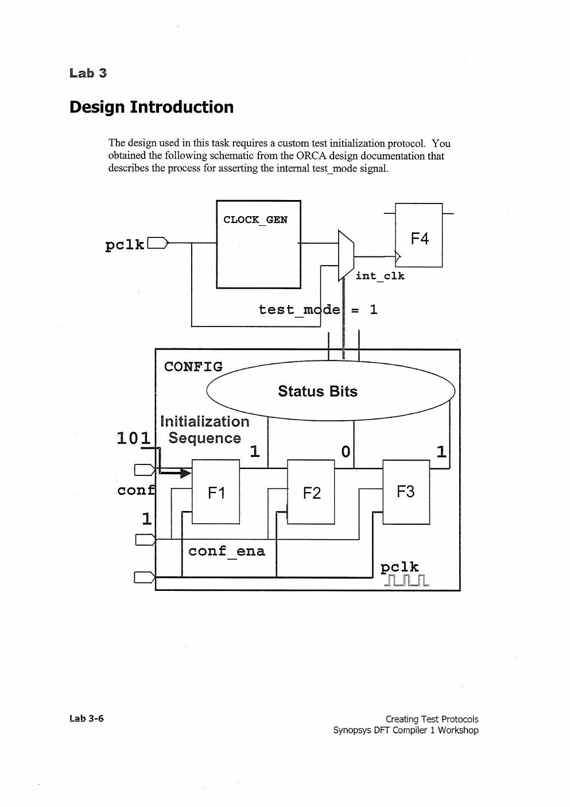


## PDF 第 8 页｜Task 1：内部生成的 test_mode

### 问题 4

**问题**：为了初始化配置寄存器 F1、F2、F3，conf_ena 应该置为什么值？

**答案**：conf_ena = 1，打开配置寄存器的更新通路。

### 问题 5

**问题**：在 test_mode 变为有效之前，需要给 pclk 施加多少个周期？

**答案**：3 个 pclk 周期，对应 F1、F2、F3 三个配置寄存器逐步装载。

### 问题 6

**问题**：test_mode 置位之后的下一个周期，conf_ena 和 pclk 应该是什么值？

**答案**：conf_ena = 0，pclk = 0。这样既停止配置寄存器更新，又避免产生额外时钟动作。

> [!note] PDF 蓝色批注
> 原页答案为 `both 0`，即 `conf_ena=0`、`pclk=0`。

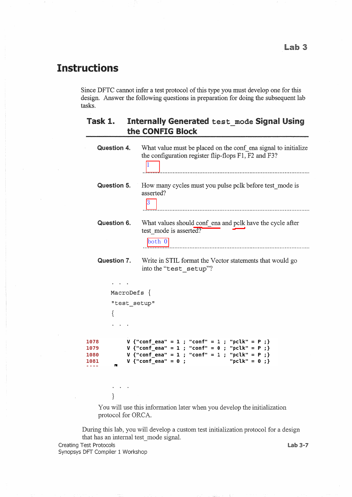

### 问题 7

**问题**：把初始化序列写成 STIL 的 Vector 语句。

**整理后的示例**：

```
MacroDefs {
  "test_setup" {
    V { "conf_ena" = 1; "conf" = 1; "pclk" = P; }
    V { "conf_ena" = 1; "conf" = 0; "pclk" = P; }
    V { "conf_ena" = 1; "conf" = 1; "pclk" = P; }
    V { "conf_ena" = 0; "pclk" = 0; }
  }
}
```

> 原始扫描 PDF 中 conf 的位名和个别标点存在 OCR 误识别；这里保留教材的四拍逻辑：三次 conf_ena=1 的 pclk 脉冲，最后关闭使能并停止时钟。实际工程应以 ORCA RTL 中配置寄存器的真实端口名为准。

## PDF 第 9 页｜Task 2：读入映射设计并创建协议

### 1. 进入工程并读入设计

```
cd lab3b_init
dc_shell
```

教材建议创建一个快捷命令，方便反复 source 脚本：

```
alias s "source -echo -verbose"
```

读入脚本：

```
exec cat scripts/1read_design.tcl
source scripts/1read_design.tcl
```

### 问题 8

**问题**：设计从哪里读入？是 RTL 还是映射后的门级设计？

**答案**：从 mapped/ORCA.ddc 读入，是映射后的门级设计，不是 RTL。

### 2. 保持内部 test_mode

初始化序列使内部 test_mode 置位后，必须让配置寄存器保持当前状态。

### 问题 9

**问题**：初始化完成后，如何让 ORCA 在后续扫描测试中继续保持 test mode？

**答案**：将 conf_ena 固定为 0：

```
set_dft_signal -view existing_dft -type Constant \
    -port conf_ena -active_state 0
```


> [!note] PDF 蓝色批注
> `hold conf_ena at 0`，即在初始化 test_mode 后将 `conf_ena` 保持为 0。

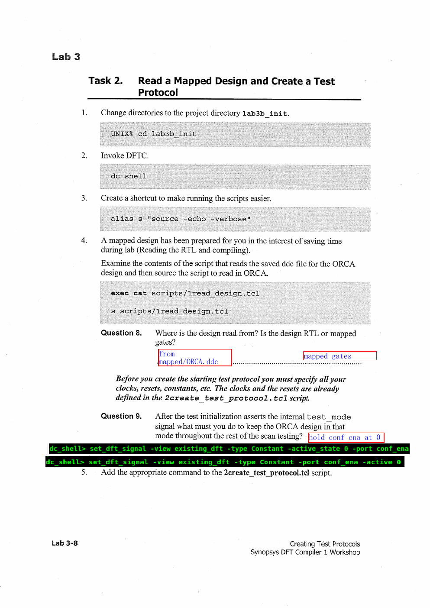

## PDF 第 10 页｜Task 3：创建并修改初始化协议

### 1. 第一次创建协议

```
source scripts/2create_test_protocol.tcl
```

### 问题 10

**问题**：第一次对 ORCA 运行 dft_drc，报告的问题多还是少？

**答案**：问题很多。原因是内部 test_mode 的初始化序列还没有写入测试协议，时钟、复位、三态和配置路径会产生大量 DFT 违规。PDF 终端截图给出的第一次报告为 **4,780** 个违规：

| 类别 | 数量 | 典型报告 |
| --- | ---: | --- |
| MODELING | 13 | Cell has unknown model（TEST-451） |
| TOPOLOGY | 432 | Improperly driven three-state net（TEST-115） |
| PRE-DFT | 4,335 | D1=2,986、D2=26、D3=1,306、D12=6、D16=1、D17=10 |

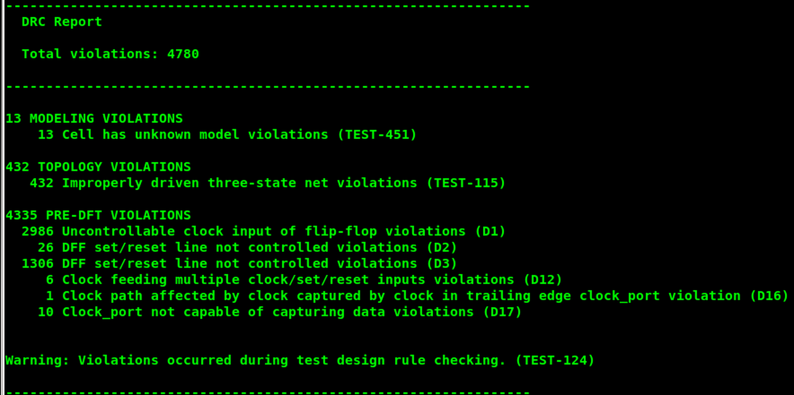

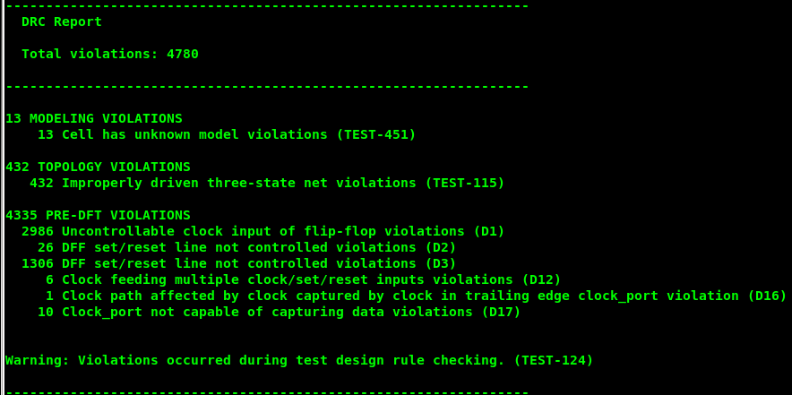

### 2. 保存现有测试协议

```
write_test_protocol -output orca_mapped.spf
```

在协议的 test_setup 部分加入问题 7 的 Vector 语句。

### 问题 11

**问题**：只修改了 STIL/SPF 的 test_setup 部分，应该使用什么命令将其读回 DFTC？

**答案**：

```
read_test_protocol -section test_setup orca_mapped.spf
```

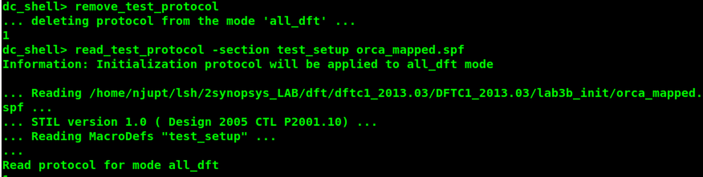


### 问题 12

**问题**：第一次直接把协议读回 DFTC 时会发生什么？

**答案**：当前 all_dft 模式已经存在测试协议，工具会报告协议已存在（TEST-1402）。必须先删除旧协议：

```
remove_test_protocol
read_test_protocol -section test_setup orca_mapped.spf
```

终端截图明确显示：先执行 `remove_test_protocol` 删除 all_dft 中已有的协议，再执行 `read_test_protocol -section test_setup orca_mapped.spf`；否则会得到“protocol already exists”提示。

注意：test_setup/初始化段只是完整测试协议的一部分；重新创建剩余测试协议仍需要执行 create_test_protocol。

## PDF 第 11 页｜结果分析与问题答案

### 1. 重新创建完整协议并检查

```
create_test_protocol
dft_drc
```

### 问题 13

**问题**：加入初始化协议后，dft_drc 与第一次运行相比有什么变化？

**答案**：

- MODELING VIOLATIONS 和 TOPOLOGY VIOLATIONS 基本没有变化。
- PRE-DFT VIOLATIONS 减少。
- 新出现 OTHER VIOLATIONS，典型为 TEST-504、TEST-505，对应被声明为常量的单元/信号。

教材最后示例报告为 **494** 个违规，具体为：

| 类别 | 数量 | 主要内容 |
| --- | ---: | --- |
| MODELING | 13 | unknown model（TEST-451） |
| TOPOLOGY | 432 | improperly driven three-state net（TEST-115） |
| PRE-DFT | 46 | D12=6、D14=20、D17=20 |
| OTHER | 3 | constant 0=1（TEST-504）、constant 1=2（TEST-505） |

顺序单元报告还显示：35/3002 个顺序单元有违规，32 个为 DFT 规则违规、1 个为常量 0、2 个为常量 1；其余 2967 个为有效扫描单元。重点不是追求所有数字为零，而是理解初始化协议消除了哪些前置可测性问题。

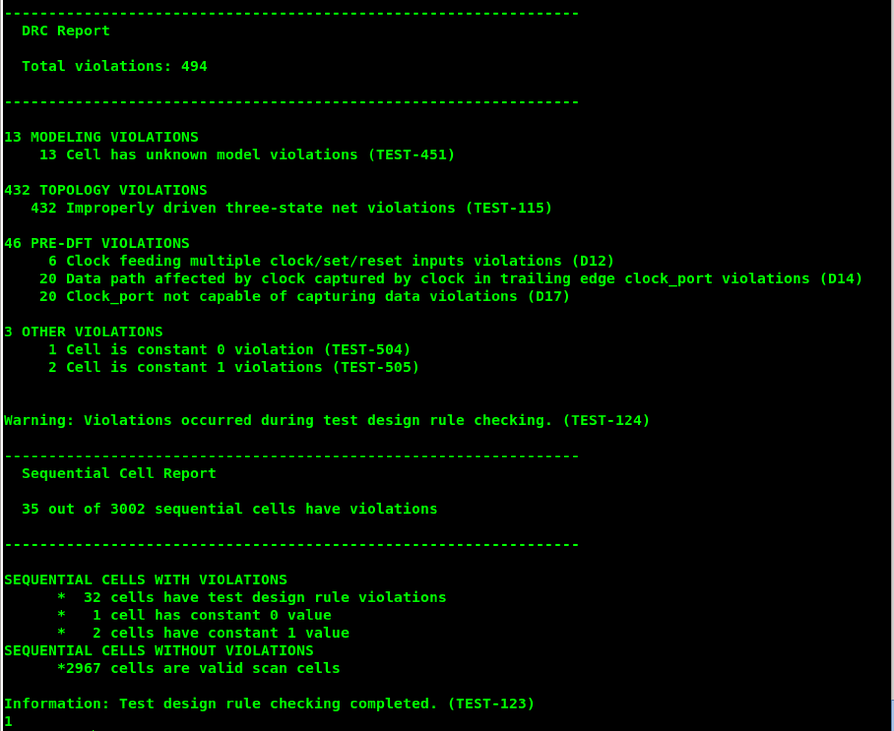


> [!note] PDF 蓝色批注
> 问题 13 的批注为：`MODELING VIOLATIONS & TOPOLOGY VIOLATIONS no changes; fewer PRE-DFT VIOLATIONS; new OTHER VIOLATIONS: TEST-504, TEST-505.` 问题 14 的批注为：`To prevent changing the working state of the chip due to register actions during testing`。

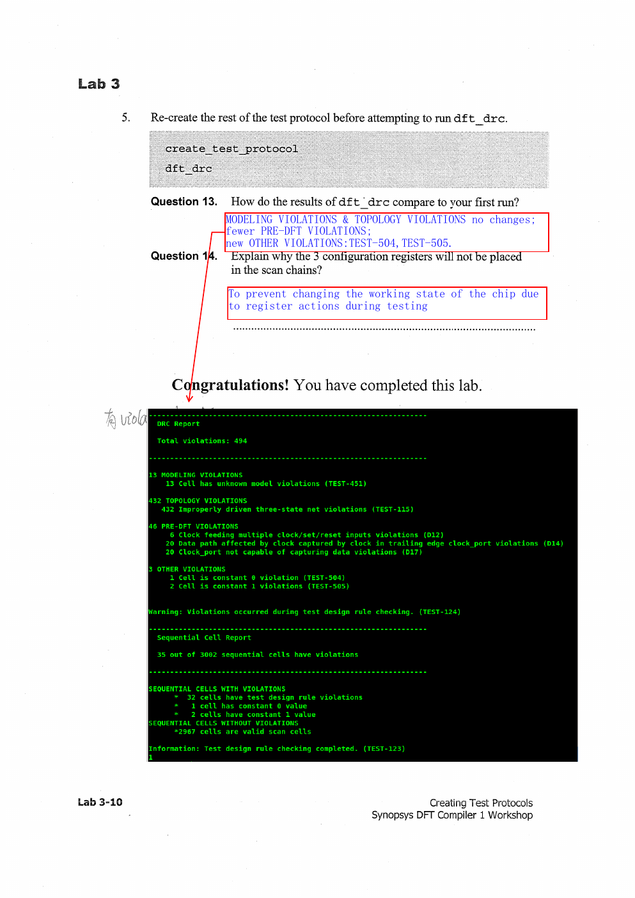

### 问题 14

**问题**：为什么 3 个配置寄存器不应该被放进扫描链？

**答案**：为了避免扫描测试期间对寄存器进行移位或捕获时改变芯片的工作状态。配置寄存器控制内部测试模式，若作为普通扫描单元移位，可能退出测试模式或改变功能配置，因此应通过初始化序列设置并固定，而不是加入普通扫描链。

## 实验结果清单

- [ ] Part A 能报告 Clk、Reset、TEST_MODE 等 DFT 属性。
- [ ] 基础测试协议通过 DFT DRC。
- [ ] 能解释内部生成 test_mode 的三拍初始化序列。
- [ ] 能用 remove_test_protocol + read_test_protocol -section test_setup 更新协议。
- [ ] 能解释初始化后 PRE-DFT 违规减少、常量相关违规出现的原因。
- [ ] 明白配置寄存器为什么不应直接放入扫描链。
