# 实验 4：DFT 设计规则检查与 ATPG 覆盖率

原始教材：[DFTC lab4.pdf](<DFTC lab4.pdf>)

> **PDF 对照说明**：第 1 页为广告页，已排除。下面按 PDF 第 2–8 页还原教材流程、命令、问题和答案。

## PDF 对照表

| PDF 页码 | 内容 |
| --- | --- |
| 2 | 实验目标 |
| 3 | 工程目录与实验说明 |
| 4–5 | Task 1：RTL DFT DRC、问题 1–4 |
| 6 | Task 2：Pre-DFT DRC、问题 5–9 |
| 7–8 | Task 3：Post-DFT DRC、问题 10–15、ATPG 报告 |

## PDF 第 2 页｜实验目标

完成本实验后，应能够：

- 在 RTL、扫描前网表和扫描后网表上执行 DFT DRC。
- 解释 dft_drc 报告。
- 获取 ATPG 测试覆盖率估算。

**实验时长**：约 45 分钟。

## PDF 第 3 页｜工程目录

实验目录为 lab4_arc：

```
lab4_arc/             当前工作目录
├── analyzed/          中间分析文件
├── logs/              会话日志
├── unmapped/          未映射协议
├── mapped/            门级网表
├── mapped_scan/       最终扫描网表
├── reports/           DFTC 报告
├── tmax/              下游工具文件
├── scripts/            约束和运行脚本
├── ref/rtl/RISC_CORE/ 设计 RTL
└── ref/lib/            库数据库文件
```

## PDF 第 4 页｜Task 1：RTL DFT DRC

### 1. 运行准备

```
cd lab4_arc
dc_shell | tee logs/rtl_drc.log
source scripts/task1_setup.tcl
```

Task 1 的目标是：读入 RTL、创建测试协议、检查 RTL 与协议是否兼容，然后分析 DFT DRC。

### 问题 1

**问题**：什么命令验证 RTL 设计与测试协议是否兼容？

**答案**：

```
dft_drc
```

### 问题 2

**问题**：要启用 RTL DFT DRC 的文件名和行号跟踪，需要设置哪个变量？

**答案**：

```
set_app_var hdlin_enable_rtldrc_info true
```

这个变量让 RTL 违规报告能够回溯到源文件和行号，便于定位原始 RTL。

### 问题 3

**问题**：RTL DRC 是否有违规？是什么类型？

**答案**：有。PDF 示例报告出现 PRE-DFT 违规，典型是：

- 不可控时钟输入到触发器（D1）。
- 时钟路径被时钟敏感端口捕获的相关违规。
- 设计中还有未声明 TEST_MODE 导致的测试语义缺失。

放大后的 PDF 报告给出了精确数字：总违规 **401** 个，其中 D1=310、D3=90、D15=1；这三个数字应以截图为准，不能只写成“有一些 DRC 违规”。

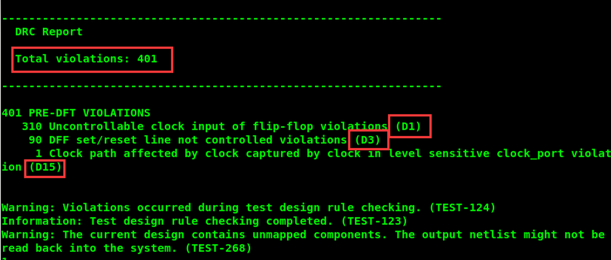


> [!note] PDF 蓝色批注
> 原页批注建议使用 `start_gui` 打开 Design Vision，以 schematic 方式 debug；并提醒此处的 `constant` 与 `testmode` 效果完全相同。后者属于该页学习笔记，实际约束仍应以脚本中的 `set_dft_signal` 为准。

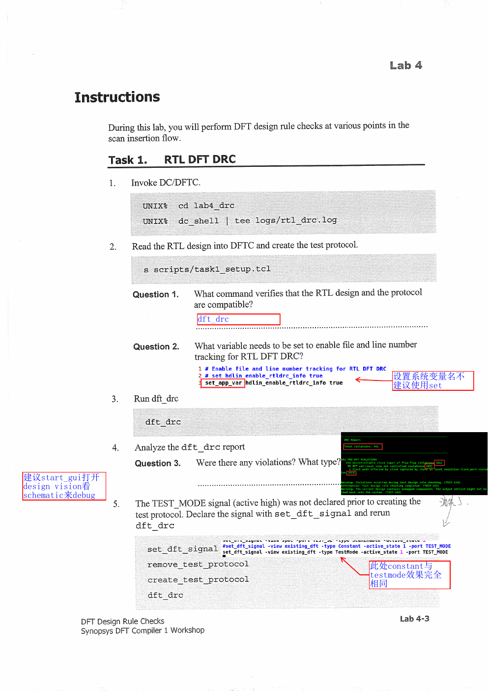

### 2. 补充 TEST_MODE

教材指出：在创建测试协议前，如果 TEST_MODE 没有被声明，工具会把它当作普通/常量语义处理。补充测试模式属性后重新创建协议：

```
set_dft_signal -view existing_dft -type TestMode \
    -active_state 1 -port TEST_MODE
remove_test_protocol
create_test_protocol
dft_drc
```

## PDF 第 5 页｜Task 1 结果

### 问题 4

**问题**：补充 TEST_MODE 后，违规还存在吗？

**答案**：没有。补充 TEST_MODE、删除旧协议并重新创建协议后，PDF 截图显示 `Total violations: 0`。这一步说明 TEST_MODE 的测试语义已经被 DFTC 正确识别；后续门级 Pre-DFT 阶段仍会根据门级结构重新产生顺序单元统计。

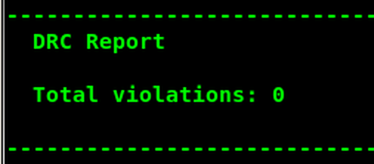


退出当前 shell：

```
exit
```

## PDF 第 6 页｜Task 2：Pre-DFT DRC

### 1. 测试感知编译

```
dc_shell | tee logs/gate_drc.log
source scripts/task2_setup.tcl
```

### 问题 5

**问题**：执行 test-ready compile 使用什么命令？

**答案**：教材示例为：

```
compile_ultra -scan
```

### 问题 6

**问题**：从日志中能否看出是否执行了自动移位寄存器识别？

**答案**：能。日志会出现类似以下信息：

```
Automatic shift-register identification is enabled for scan.
Not all registers will be scan-replaced.
```

这表示工具启用了自动识别，但并不承诺所有寄存器都会被替换为扫描寄存器。

### 问题 7

**问题**：什么命令验证门级设计与测试协议兼容？

**答案**：

```
dft_drc
```

### 问题 8

**问题**：门级设计的 DRC 结果与 RTL 阶段是否相同？报告格式是否相同？

**答案**：不完全相同。门级阶段会有更多顺序单元信息，并出现 Sequential Cell Report；报告可能包含扫描等效单元、有效扫描单元、非扫描单元和违规扫描单元等统计。

PDF 的门级示例报告为 0 个总违规，顺序单元统计为 261 个顺序单元，其中 238 个是有效扫描单元、23 个是非扫描移位寄存器单元。


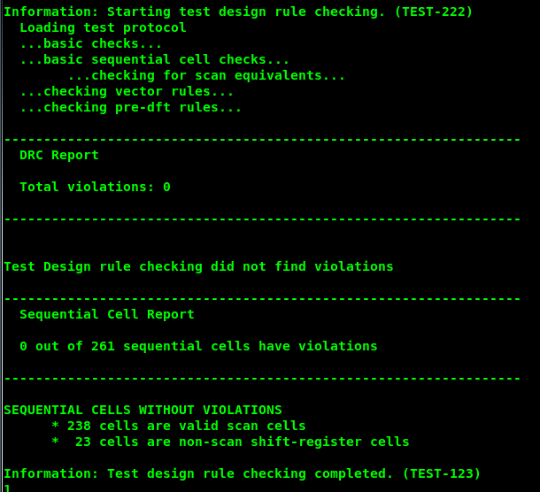

### 问题 9

**问题**：增强版 dft_drc 报告有什么不同？

**答案**：增强报告会以更清晰的汇总形式给出全部 DFT DRC 违规，并补充顺序单元/扫描单元统计。教材示例通过设置测试报告增强选项后重新运行 dft_drc，观察到更详细的 Sequential Cell Report。

```
set_test_disable_enhanced_dft_drc_reporting false
dft_drc
```

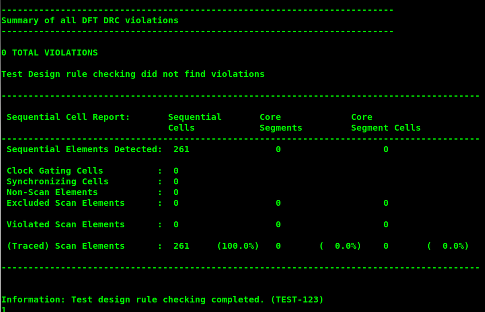

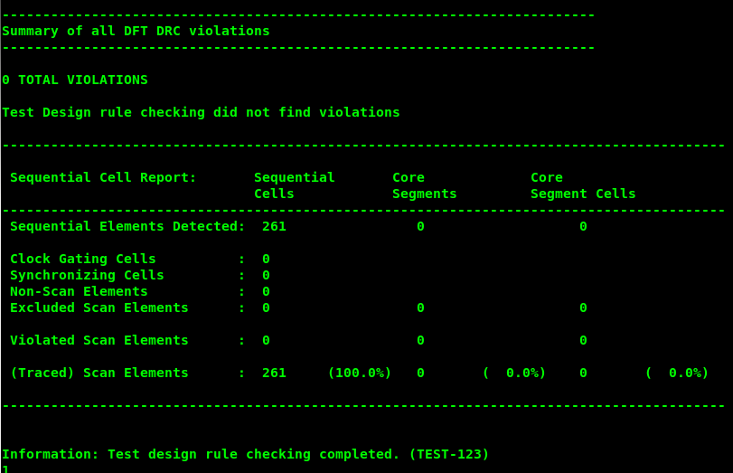

> [!note] PDF 蓝色批注
> 原页批注指出：如果使用 `compile -scan`，日志中的自动移位寄存器识别信息不会以当前形式出现；问题 9 的答案是“列出更清晰、信息更多的报告”。

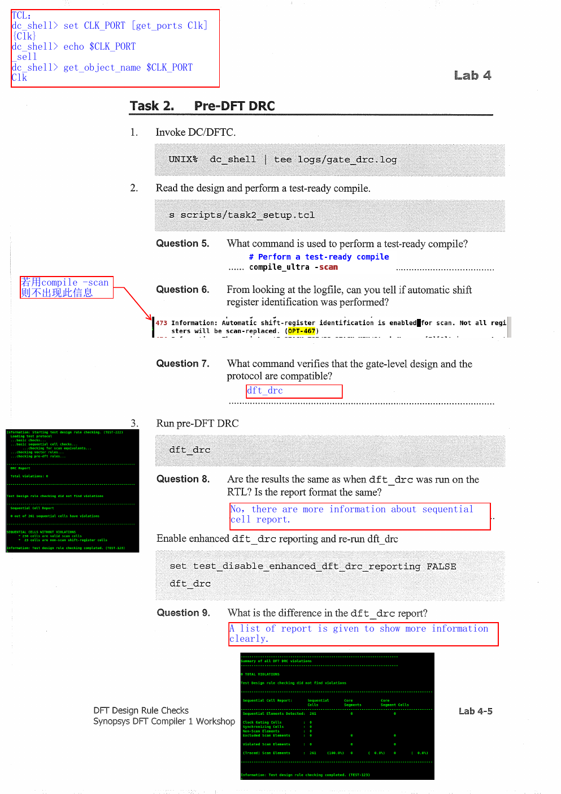

> 不同 DFTC 版本的属性名称可能略有差异；当前版本应先用变量帮助确认。教材要点是打开 enhanced DRC reporting，而不是死记变量拼写。

## PDF 第 7 页｜Task 3：Post-DFT DRC

### 1. 预览扫描架构

```
source scripts/task3_setup.tcl
preview_dft
```

PDF 示例报告包含：

```
Scan methodology: full_scan
Scan style: multiplexed_flip_flop
Clock domain: mix_clocks
Scan enable: TEST_SE
Scan chain (Instrn[0] -> Executing_Instrn[0]) contains 261 cells
```

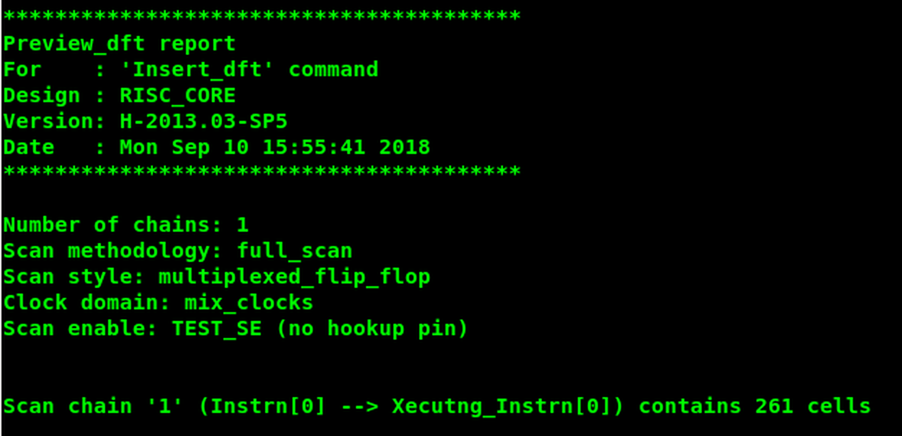


### 问题 10

**问题**：preview_dft 报告将插入多少条扫描链？

**答案**：PDF 示例为 1 条扫描链，链中包含 261 个单元。实际结果以当前设计和脚本生成的 preview_dft 报告为准。

### 2. 插入和检查

```
insert_dft
dft_drc
```

### 问题 11

**问题**：什么命令验证插入后的扫描链遵循 DFT 规则？

**答案**：

```
dft_drc
```

### 问题 12

**问题**：扫描链 1 经过多少个触发器？

**答案**：PDF 示例为 261 个触发器；报告还指出链中包含扫描等效单元。

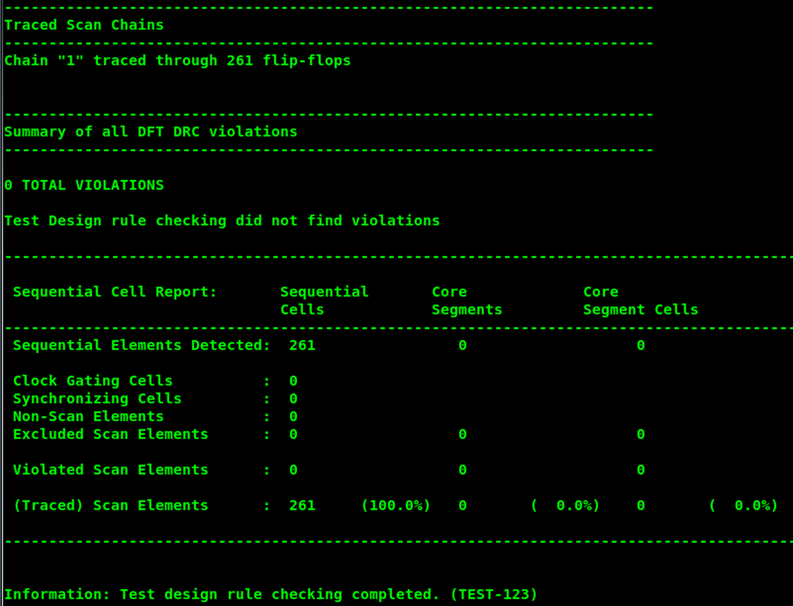


### 问题 13

**问题**：对扫描插入后的网表执行 DRC 时，会新增哪个报告部分？

**答案**：Traced Scan Chains（已追踪扫描链）部分。它会显示每条链经过的触发器/扫描单元、链是否可追踪以及扫描结构状态。

### 问题 14

**问题**：dft_drc 中用于估算 ATPG 测试覆盖率的选项是什么？

**答案**：

```
dft_drc -coverage_estimate
```

可以用以下命令查看选项：

```
dft_drc -help
```


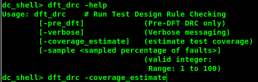

> [!note] PDF 蓝色批注
> 原页蓝色答案为：问题 10 = `1`；问题 12 = `0 total violations`；问题 15 = `99.87%`。这些与绿色终端报告一致。

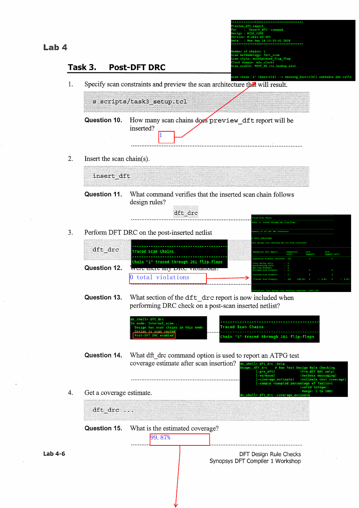

### 问题 15

**问题**：PDF 示例的估算覆盖率是多少？

**答案**：99.87%，更精确的报告值为 99.8731%。

## PDF 第 8 页｜ATPG 覆盖率报告

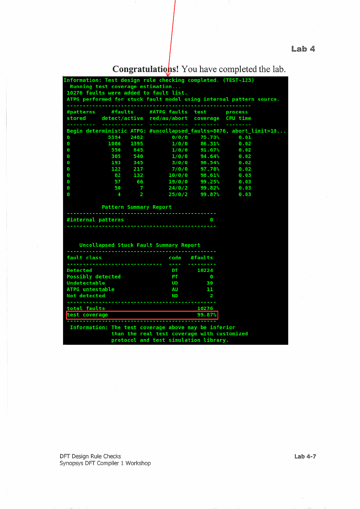

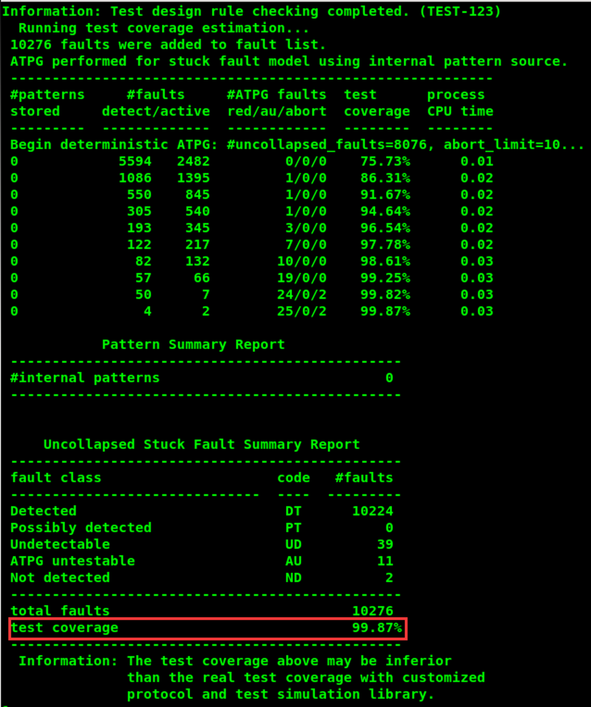


PDF 示例的故障总数为 10,276：

| 故障类别 | 数量 |
| --- | ---: |
| Detected | 10,224 |
| Possibly detected | 0 |
| Undetectable | 39 |
| ATPG untestable | 11 |
| Not detected | 2 |
| Total faults | 10,276 |
| Test coverage | 99.8731% |

报告中的覆盖率是基于当前测试协议、测试模型和内部 pattern source 的估算值；教材特别提醒，使用定制协议和测试仿真库时，真实覆盖率可能不同。

## 实验检查清单

- [ ] RTL、Pre-DFT、Post-DFT 三个阶段都执行了 dft_drc。
- [ ] 知道 hdlin_enable_rtldrc_info 的作用。
- [ ] 能区分普通 compile 与 test-ready compile -scan。
- [ ] 知道扫描后 DRC 会新增 Traced Scan Chains。
- [ ] 能使用 dft_drc -coverage_estimate。
- [ ] 保留 10,276 faults / 99.8731% 的 PDF 示例结果，并区分估算值与实际 ATPG 值。
