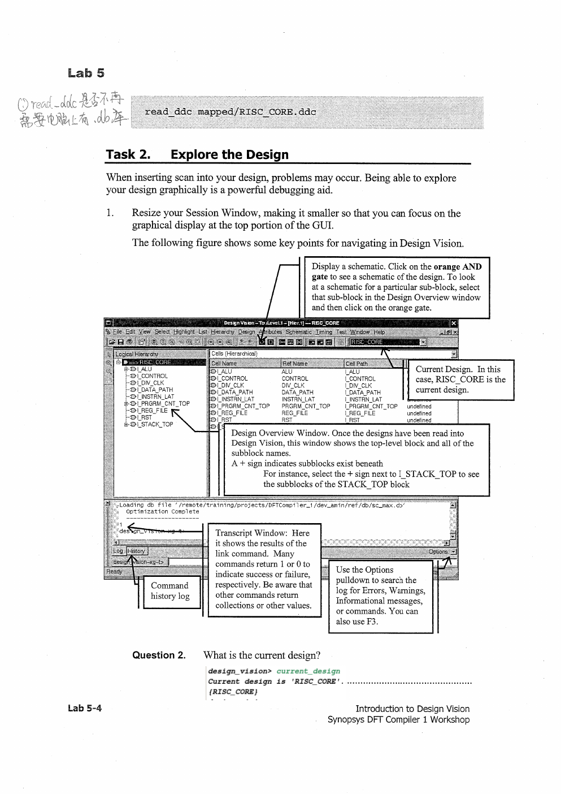
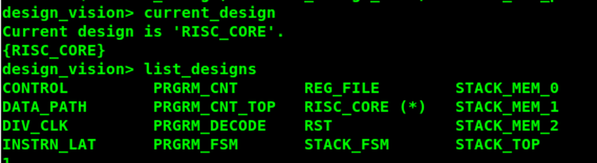
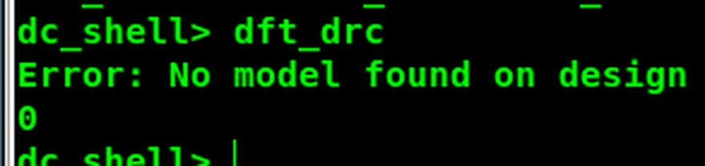
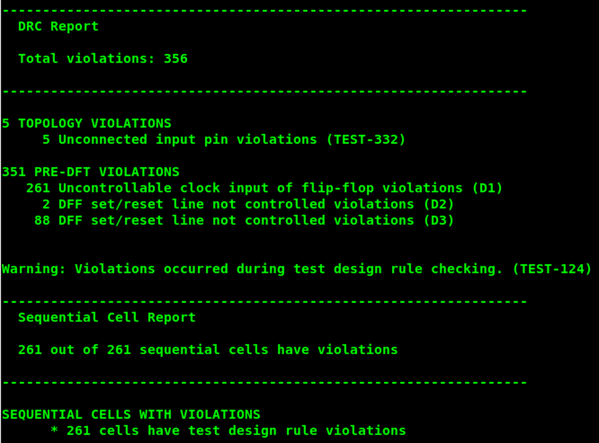
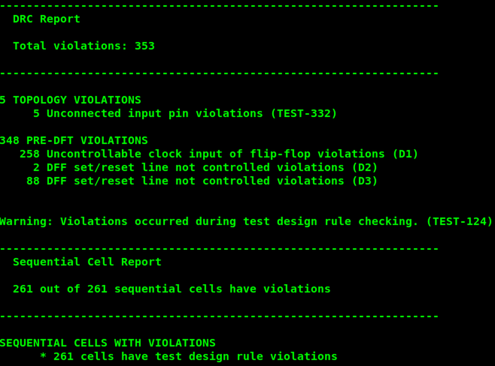
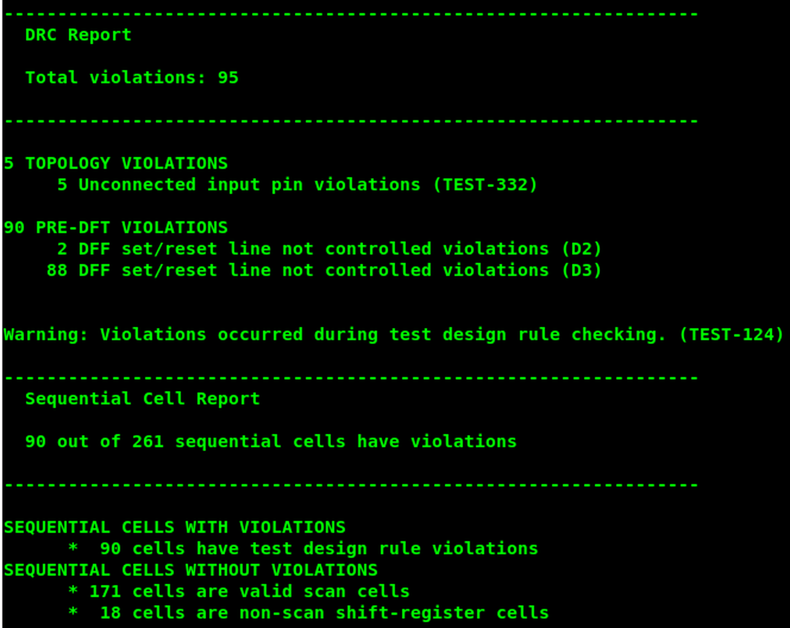
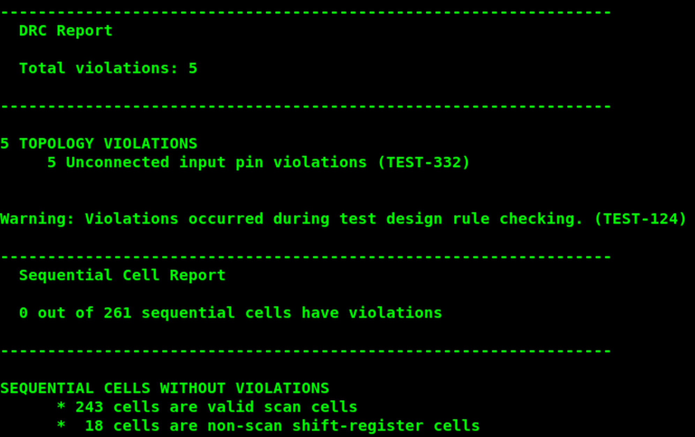

# 实验 5：使用 Design Vision 查看和调试设计

术语参照：[[术语与翻译规范]]。

## 实验目标

完成本实验后，应能够：

1. 将设计及相关文件读入 Design Vision。
2. 编译为 test-ready design。
3. 在 Design Vision 中图形化探索设计。
4. 保存 test-ready design。

**实验时长**：约 30 分钟。

## 工程目录

```
lab5_gui/             当前工作目录
├── analyzed/          中间分析文件
├── logs/              GUI 会话日志
├── unmapped/          扫描前协议
├── mapped/            门级网表
├── mapped_scan/       最终扫描网表
├── reports/           DFTC 报告
├── tmax/              下游工具文件
├── scripts/           约束和运行脚本
├── ref/rtl/RISC_CORE/ 设计 RTL
└── ref/lib/           库数据库文件
```

## 任务 1：读入 Design Vision

### 1. 启动

```
cd lab5_gui
design_vision | tee logs/gui.log
```

### 问题 1

**问题**：Design Vision 和 design vision / dc_shell 的区别是什么？

**答案**：Design Vision 是图形化用户界面，底层仍然使用 DC/DFT Compiler 的设计数据库和 Tcl 命令；dc_shell 是终端命令行模式。两者可以互相配合：GUI 便于图形调试，shell 便于快速、可复现地运行脚本。

> [!note] 提示
> `design_vision = dc_shell -gui`：Design Vision 是图形化用户界面，`dc_shell` 是终端命令行模式。该说明是在提醒两者底层数据库/命令环境相关，但交互入口不同。

### 2. 读入工艺实现设计

```
read_ddc mapped/RISC_CORE.ddc
```

## 任务 2：图形化探索设计



### 1. 窗口和层次

Design Overview Window 显示当前顶层和所有子模块；层次前的加号表示还有下一级。Cell name 是层次中的实例名，reference name 是该实例引用的设计名。

当前设计可用命令查看：

```
current_design
```

### 问题 2

**问题**：当前设计是什么？

**答案**：示例为 RISC_CORE（扫描 中出现的 RISC_CORC/RISC_CORE 为同一设计名的识别误差）。

列出全部设计：

```
list_designs
```

示例设计包括 CONTROL、DATA_PATH、DIV_CLK、INSTRN_LAT、PRGRM_CNT、PRGRM_DECODE、PRGRM_FSM、REG_FILE、RISC_CORE、RST、STACK_FSM、STACK_MEM_0/1/2、STACK_TOP 等。



## 层次、原理图和符号图

### 1. 查看顶层原理图

在层次窗口选中 RISC_CORE，再点击工具栏橙色 AND gate 图标打开 schematic。选择子模块后可以只查看该子模块的局部原理图。

### 2. 缩放和选择

- 使用 Zoom In/Zoom Out 查看局部。
- 中键拖动可以平移。
- ESC 返回 Selection Tool。
- 从 Zoom 模式切换到其他模式前，先切回选择工具。
- 先点击空白区域再缩放，可避免选中已有对象。

### 3. 查看符号图

点击橙色 AND gate 旁边的绿色 IC 图标，查看 RISC_CORE 的输入、输出和端口边界。

## 工艺实现检查

### 1. 检查是否全部工艺实现到工艺门

```
report_hierarchy
```

如果报告中仍然有 gtech 单元，而不是目标工艺库单元，说明设计存在扫描前逻辑或库链接问题。

### 2. 退出

```
exit
```

## 任务 3：使用 GUI 调试 DFT 设计规则检查（DFT DRC）

### 1. 读入并运行 DRC

```
dc_shell -64 | tee logs/debug.log
read_ddc mapped/RISC_CORE.ddc
dft_drc
```

### 问题 3

**问题**：第一次执行 dft_drc 得到什么错误？

**答案**：示例为：

```
Error: No model found on design
```

原因是当前门级设计没有测试协议/测试模型。解决方法是创建测试协议：

```
create_test_protocol
```



### 问题 4

**问题**：重新创建协议后，设计是没有 DFT 问题，还是有很多违规？

**答案**：有很多违规。示例的第一次完整报告为 **356** 个违规：5 个结构连接类（Topology）违规（未连接输入），351 个扫描插入前类（Pre-DFT）违规（D1=261、D2=2、D3=88），并且 261/261 个顺序单元都有违规。用 Test → Browse Violations 打开违规浏览器（Violation Browser），从 Pre-DFT → D1 开始分析。



## 问题 5–10：逐步补充测试属性

### 问题 5

**问题**：第一个 D1 违规的时钟上存在什么逻辑值？

**答案**：示例为逻辑 0（低电平）。

### 问题 6

**问题**：指定该测试时钟需要什么 DFTC 命令？

**答案**：

```
set_dft_signal -view existing_dft -type ScanClock \
    -timing {45 55} -port Clk
```

### 问题 7

**问题**：补充测试时钟后，违规数量是否改变？

**答案**：会改变；时钟相关的 D1 违规应减少或消失，但其他未定义测试信号造成的违规仍然存在。应重新创建协议并在 Violation Browser 中点击 Run DFT DRC。

补充时钟后的阶段性结果为：总违规 **353** 个，其中结构连接类（Topology）=5，扫描插入前类（Pre-DFT）=348（D1=258、D2=2、D3=88）。



### 问题 8

**问题**：TEST_MODE 显示什么值？

**答案**：示例为 0。

### 问题 9

**问题**：指定 TEST_MODE 需要什么命令？

**答案**：

```
set_dft_signal -view existing_dft -type Constant \
    -active_state 1 -port TEST_MODE
```

### 问题 10

**问题**：补充 TEST_MODE 后，违规数量是否改变？

**答案**：会改变；对应测试模式路径的违规会减少，但仍可能有未连接输入以及复位未控制违规。

下一阶段报告为 **95** 个违规：结构连接类（Topology）=5，扫描插入前类（Pre-DFT）=90（D2=2、D3=88）；261 个顺序单元中 90 个仍有违规、171 个为有效扫描单元、18 个为非扫描移位寄存器单元。



## 问题 11–13：补充异步复位

### 问题 11

**问题**：Reset 显示什么值？

**答案**：示例为低电平 0。

### 问题 12

**问题**：指定低有效异步复位需要什么命令？

**答案**：

```
set_dft_signal -view existing_dft -type Reset \
    -active_state 0 -port Reset
```

### 问题 13

**问题**：重新创建协议并运行 DRC 后，违规数量是否改变？

**答案**：会改变。最终结果为 **5** 个结构连接类（Topology）违规（未连接输入），扫描插入前类（Pre-DFT）=0；261 个顺序单元中 0 个有违规，243 个为有效扫描单元，18 个为非扫描移位寄存器单元。未连接输入仍存在，说明声明复位并不能修复真实的网表连接问题。



## GUI 调试结果

使用 GUI 的核心不是“点完按钮”，而是将每个操作还原成可复现的命令：

```
remove_test_protocol
set_dft_signal -view existing_dft -type ScanClock -timing {45 55} -port Clk
set_dft_signal -view existing_dft -type Constant -active_state 1 -port TEST_MODE
set_dft_signal -view existing_dft -type Reset -active_state 0 -port Reset
create_test_protocol
dft_drc
```

- [ ] 能区分 Design Vision 与 dc_shell。
- [ ] 能用 current_design、list_designs、report_hierarchy 探索设计。
- [ ] 能从 Violation Browser 定位 D1/D2/D3。
- [ ] 能按顺序声明时钟、TEST_MODE 和 Reset，并观察违规变化。
