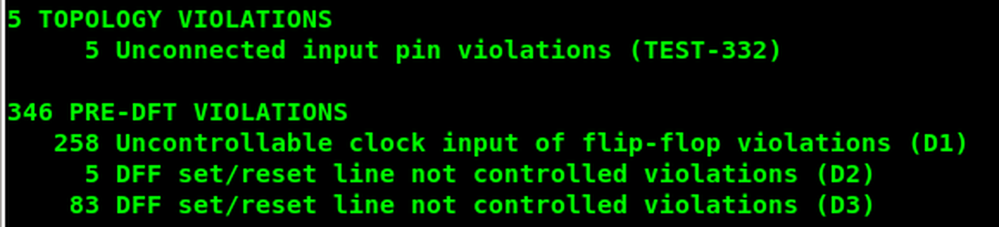
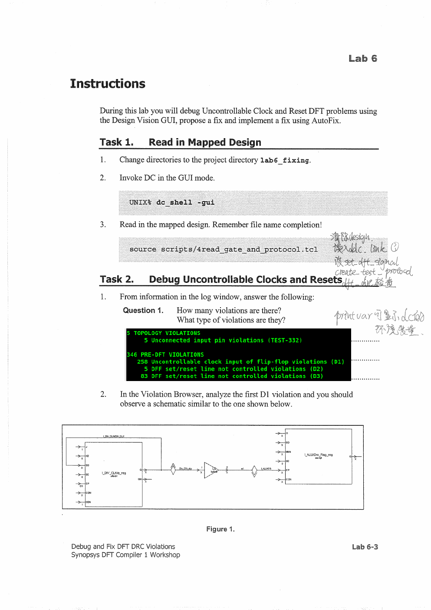
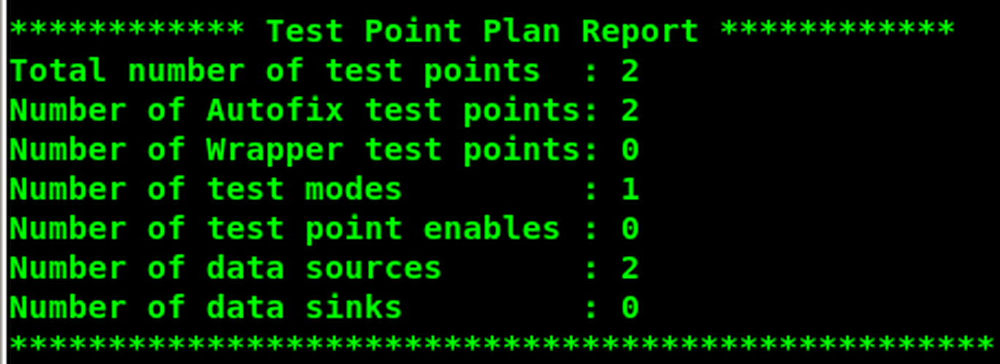
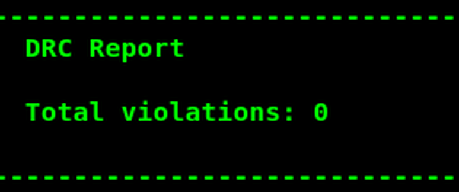
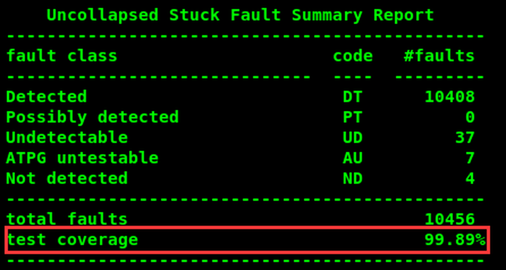
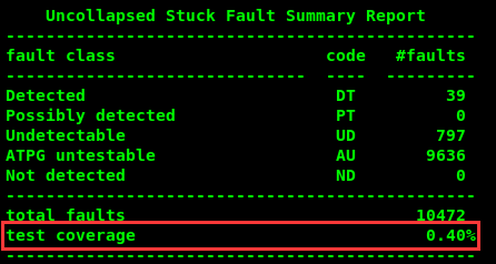

# 实验 6：定位并修复 DFT 设计规则检查（DFT DRC）违规

术语参照：[[术语与翻译规范]]。

## 实验目标

完成本实验后，应能够：

- 调试时钟和复位造成的 DFT 设计规则检查（DFT DRC）问题。
- 提出可以由设计者实现的手工修复。
- 使用 AutoFix 实施修复。

**实验时长**：约 45 分钟。

## 工程目录

```
lab6_fixing/          当前工作目录
├── analyzed/          中间分析文件
├── logs/              会话日志
├── unmapped/          扫描前协议
├── mapped/            门级网表
├── mapped_scan/       扫描后门级网表
├── reports/           DFTC 报告
├── tmax/              下游工具文件
├── scripts/           约束和运行脚本
├── ref/rtl/RISC_CORE_noaft/ 设计 RTL
├── ref/lib/           工艺库
└── solutions/         参考解决方案
```

## 任务 1：读入工艺实现设计

```
cd lab6_fixing
dc_shell -gui
source scripts/4read_gate_and_protocol.tcl
```

### 任务 2：调试不可控时钟和复位

从日志窗口统计违规，并在 Violation Browser 中分析第一个 D1 违规。

### 问题 1

**问题**：一共有多少违规？分别是什么类型？

**答案**：示例为：

| 类别 | 数量 | 类型 |
| --- | ---: | --- |
| 结构连接类（Topology） | 5 | Unconnected input pin（TEST-332） |
| 扫描插入前类（Pre-DFT） | 258 | Uncontrollable clock input of flip-flop（D1） |
| 扫描插入前类（Pre-DFT） | 5 | DFF set/reset line not controlled（D2） |
| 扫描插入前类（Pre-DFT） | 83 | DFF set/reset line not controlled（D3） |

合计 351 个违规。





## D1/D3 违规分析

### 问题 2

**问题**：第一个 D1 违规左侧触发器的网表名称是什么？

**答案**：第一个 D1 违规左侧触发器为 **I_DIV_CLK/q_reg**。不同网表命名约定下，`DIV_CLK/q_reg` 是省略顶层实例前缀的写法。

> [!note] 提示
> 第一个 D1 违规左侧触发器标为 `I_DIV_CLK/q_reg`；修复图中把该触发器输出与 `other flip-flops` 一起送入受 `TEST_MODE` 控制的选择逻辑。

### 问题 3

**问题**：为不可控时钟问题画出“修复”结构。

**参考答案**：将能被测试模式控制的时钟或测试数据通过测试逻辑送到目标扫描触发器的时钟路径，使 DFTC 能在扫描模式下控制该时钟。异常时钟来自 `I_DIV_CLK/q_reg`，与其他触发器输出一起进入由 `TEST_MODE` 控制的选择逻辑；修复时应把测试模式控制接入该时钟路径，而不是仅屏蔽违规。

### 问题 4

**问题**：RISC_CORE 中其他 D1 违规说明了什么？

**答案**：它们基本来自同一类问题。提示为：`All comes from the same problems: Clk should be set_dft_signal ...`，即相关时钟没有用 `set_dft_signal` 明确定义，或者该时钟在测试模式下不可控。不能把每个 D1 当成独立逻辑错误，应先检查公共时钟源和测试属性。

### 问题 5

**问题**：为不可控复位问题画出“修复”结构。

**参考答案**：提示给出的对应关系是：将 `I_DIV_CLK/q_reg` 替换为 `I_RST/q2_reg`，将 `Clk` 信号替换为 `Reset` 信号，并连接到 reset 端。也就是将 D3 违规路径中的 `I_RST/q2_reg` 复位连接纳入测试可控路径，并将低有效复位声明为 DFT Reset，使测试期间复位保持已知且不会意外触发。

### 问题 6

**问题**：RISC_CORE 中其他 D3 违规说明了什么？

**答案**：提示为：`All comes from the same problems: Reset should be set_dft_signal ...`。也就是 Reset 没有用 `set_dft_signal` 定义，或其测试模式下不可控；先统一定义复位定义，再重新运行 DRC。

## 任务 3：AutoFix

### 1. AutoFix 可以解决什么

### 问题 7

**问题**：AutoFix 能解决哪几类 DFT 问题？

**答案**：AutoFix 可处理三类问题：

1. 不可控的时钟、复位和置位信号。
2. 内部三态信号。
3. 双向信号。

> [!note] 提示
> 可处理不可控时钟、复位和置位信号，内部三态信号以及双向信号。

AutoFix 不会替代协议定义，也不应自动修复所有逻辑；必须先理解违规，再限定允许插入的测试结构。

### 2. 配置并预览 AutoFix

修改 `scripts/autofix.tcl`，使 AutoFix 处理不可控时钟、复位和置位信号。相关命令包括：

```
set_autofix_configuration
set_dft_signal
```

预览：

```
source -echo -verbose scripts/5preview_dft.tcl
```

### 问题 8

**问题**：有多少个 AutoFix test point？为什么？

**答案**：示例为 2 个，分别对应不可控时钟和不可控复位问题；报告显示：

```
Test Point Plan Report
Total number of test points: 2
Number of AutoFix test points: 2
Number of Wrapper test points: 0
```



> [!note] 提示
> `2` 个 test point 中，一个来自不可控时钟，另一个来自不可控复位（对应题 3 的分析）。

### 问题 9

**问题**：如果一个寄存器同时有不可控复位和不可控置位，且同一个顶层信号被指定为 TestData，会发生什么？

**答案**：测试数据不能正确移位；同一 TestData 同时服务于冲突的 set/reset 控制会使测试状态不可靠。必须分别分析有效电平、互斥关系和测试期间的稳定条件。

> [!note] 提示
> 答案要点为：`can not shift value correctly`，即不能正确移位数据。

## 插入、覆盖率与对比

执行 AutoFix 和扫描插入：

```
source -echo -verbose scripts/6insert_dft.tcl
dft_drc -coverage_estimate
```

### 问题 10

**问题**：是否还有违规？故障覆盖率是多少？

**答案**：示例显示 DRC 违规为 0，覆盖率约 99.89%：

| 类别 | 数量 |
| --- | ---: |
| Detected | 10,408 |
| Possibly detected | 0 |
| Undetectable | 37 |
| ATPG untestable | 7 |
| Not detected | 4 |
| Total faults | 10,456 |
| Test coverage | 99.89% |





### 问题 11

**问题**：如果不使用 AutoFix，预计会有怎样的故障覆盖率？

**答案**：极低。示例为：

| 类别 | 数量 |
| --- | ---: |
| Detected | 39 |
| Possibly detected | 0 |
| Undetectable | 797 |
| ATPG untestable | 9,636 |
| Not detected | 0 |
| Total faults | 10,472 |
| Test coverage | 0.40% |



原因是大量内部时钟、复位/置位不可控，ATPG 无法把状态机带到目标状态，也无法可靠捕获响应。

## 修复前后结论

| 项目 | 不使用 AutoFix | 使用 AutoFix |
| --- | ---: | ---: |
| 主要问题 | D1/D2/D3 大量违规 | 插入 2 个 AutoFix test point |
| 覆盖率 | 0.40% | 99.89% |
| 工程含义 | 结构不可测 | 测试控制路径被补齐 |

- [ ] 能从 D1/D3 违规追到公共时钟/复位原因。
- [ ] 能解释 AutoFix test point 的来源。
- [ ] 能区分“修复 DRC”与“提高 ATPG 覆盖率”之间的关系。
- [ ] 记录 AutoFix 引入的面积、时序和功耗变化。
