# 实验 7：自顶向下扫描插入

原始教材：[DFTC lab7 update.pdf](<DFTC lab7 update.pdf>)

> **PDF 对照说明**：第 1 页广告已过滤。本文按 PDF 第 2–11 页恢复实验目标、脚本、扫描规格、问题 1–22 和教材示例结果。

## PDF 对照表

| PDF 页码 | 内容 |
| --- | --- |
| 2–4 | 目标、Mapped Flow、目录 |
| 5–6 | 读入门级设计、扫描状态、问题 1–5 |
| 7–8 | 默认扫描架构、问题 6–12 |
| 9 | lock-up latch、链平衡、问题 13–16 |
| 10–11 | 插入、覆盖率、DFT DRC、问题 17–22 |

## PDF 第 2 页｜实验目标

完成本实验后，应能够：

- 使用 preview_dft 比较不同扫描规格，迭代得到平衡的顶层扫描架构。
- 使用 preview_dft 确认扫描信号规格是否被正确应用。

**实验时长**：约 45 分钟。

## PDF 第 3 页｜Unmapped Flow 与 Mapped Flow

### Unmapped Flow

1. 将 RTL 读入 DFTC。
2. 创建并保存测试协议，验证设计与协议兼容。
3. 编译并保存门级设计，退出工具。

### Mapped Flow

4. 将门级设计和测试协议读入 DFTC。
5. 指定扫描约束，并预览应用后的扫描架构。
6. 插入扫描链。
7. 将设计及相关文件交给下游工具。

## PDF 第 4 页｜工程目录

```
lab7_topdown/        当前工作目录
├── analyzed/         中间分析文件
├── logs/             会话日志
├── unmapped/         未映射协议
├── mapped/           门级网表
├── mapped_scan/      扫描门级网表
├── reports/          DFTC 报告
├── tmax/             下游工具文件
├── scripts/          约束和运行脚本
├── ref/rtl/ORCA/     ORCA 设计文件
└── ref/lib/          工艺库
```

## PDF 第 5 页｜Task 1：读入门级设计和测试协议

教材列出 Mapped Flow 脚本：

```
4read_gate_and_protocol.tcl
5preview_dft.tcl
6insert_dft.tcl
7handoff.tcl
```

运行：

```
cd lab7_topdown
dc_shell | tee logs/lab7.log
exec cat scripts/4read_gate_and_protocol.tcl
source scripts/4read_gate_and_protocol.tcl
```

## PDF 第 6 页｜扫描状态与 DRC

### 1. 查看扫描状态

```
report_scan_state
```

### 问题 1

**问题**：如果 Unmapped Flow 以 compile -scan 结束，刚读入的设计应该是什么扫描状态？这是否是设计当前的扫描状态？

**答案**：PDF 示例为 `scan cells replaced with loops`；是，这就是当前设计记录的扫描状态。这里的 “replaced with loops” 是 DFTC 对已被扫描替换/扫描感知综合设计的状态描述。

> [!note] PDF 蓝色批注
> 原页旁的批注确认：`scan cells replaced with loops. yes, that is.`

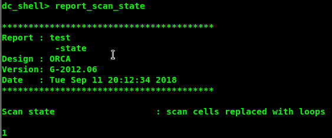


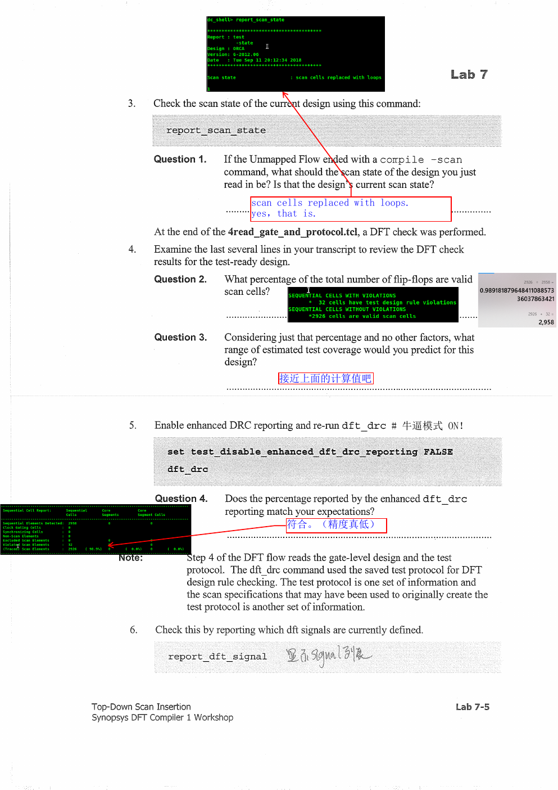

### 问题 2

**问题**：总触发器中有多少比例是有效扫描单元？

**答案**：PDF 示例为 2,926 / 2,958：

```
2926 / 2958 = 98.918%
```

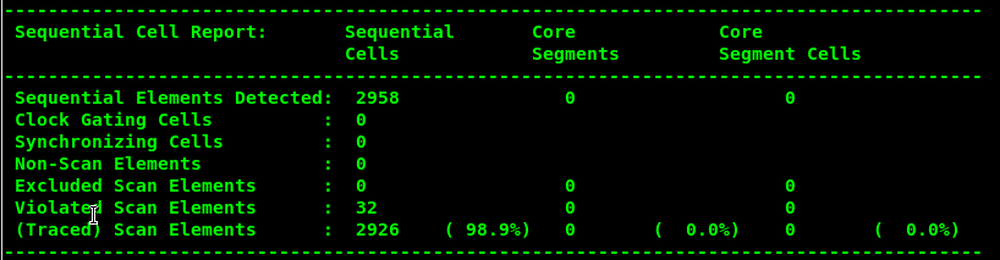


### 问题 3

**问题**：只考虑这个比例，预计测试覆盖率范围是多少？

**答案**：约 98.9% 上下。这个只是基于有效扫描单元比例的粗略预测，实际覆盖率还受到组合可控性、时钟、复位、黑盒和 ATPG 约束影响。

### 问题 4

**问题**：增强版 DFT DRC 报告中的顺序单元统计是否符合预期？

**答案**：符合。报告仍应显示约 2,926 个有效扫描单元、2,958 个顺序单元，总体比例约 98.9%。

### 2. 打开增强报告并查看 DFT 信号

```
set_test_disable_enhanced_dft_drc_reporting false
dft_drc
report_dft_signal
```

## PDF 第 7 页｜Task 2：预览扫描架构

### 问题 5

**问题**：报告了多少个 ScanClock 和 Reset？

**答案**：3 个扫描时钟：sys_clk、sdr_clk、pclk；1 个复位：prst_n。

> [!note] PDF 蓝色批注
> `3 个 scanclocks (sys_clk, sdr_clk, pclk); 1 个 resets (prst_n)`。


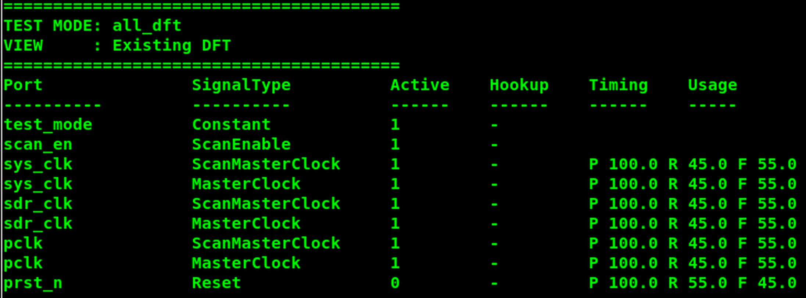

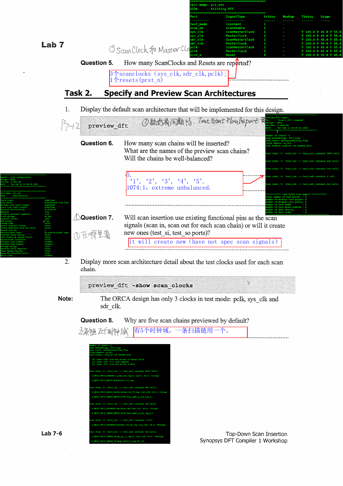


### 1. 查看默认扫描架构

```
preview_dft
```

PDF 示例默认信息：

```
Scan methodology: full_scan
Scan style: multiplexed_flip_flop
```

### 问题 6

**问题**：默认会插入多少条扫描链？链名是什么？是否平衡？

**答案**：PDF 示例预览 5 条链，链名类似 test_si1→test_so1、test_si2→test_so2、test_si3→test_so3、test_si4→test_so4、test_si5→test_so5。长度约为 1,074:1，极不平衡。

> [!note] PDF 蓝色批注
> 原页答案为：`5. '1', '2', '3', '4', '5'. 1074:1, extreme unbalanced.`

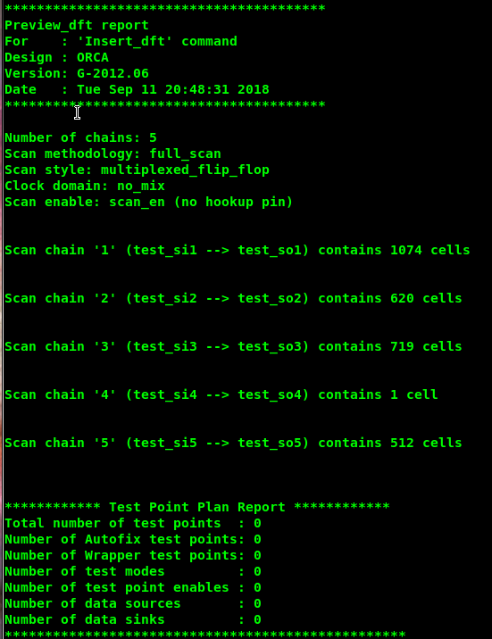


### 问题 7

**问题**：扫描插入使用已有功能引脚作为 scan in、scan out，还是创建专用的新引脚？

**答案**：因为当前没有指定扫描信号，工具会创建新的扫描端口/连接（PDF 标注为 will create new）。若要复用功能引脚，必须用 set_dft_signal 或 set_scan_path 显式指定。

### 2. 查看时钟域

```
preview_dft -show scan_clocks
```

### 问题 8

**问题**：为什么默认预览 5 条扫描链？

**答案**：这是当前工具/实验设置下的默认链数或默认扫描分配策略；工具会按时钟域、扫描段和默认 chain_count 生成多条候选链。不要把 5 当作所有设计的通用默认值，应以 preview_dft 报告和当前版本设置为准。

> [!note] PDF 蓝色批注
> 批注写的是“有 5 个时钟域，一条扫描链用一个”，但这与绿色报告中列出的 `pclk`、`sys_clk`、`sdr_clk` 三类测试时钟并不完全一致；这里保留为原始学习笔记，工程结论仍以报告为准。

## PDF 第 8 页｜比较 clock mixing

### 问题 9

**问题**：scan_clocks 预览中是否有 scan_summary 没有的信息？什么时候使用 scan_summary？

**答案**：有。scan_clocks 会显示每条链涉及的时钟、边沿、代表性单元和时钟域；scan_summary 更紧凑，适合快速查看链数、端点、长度和整体平衡。需要分析多时钟/多边沿问题时使用 scan_clocks，需要快速汇总时使用 scan_summary。

> [!note] PDF 蓝色批注
> 原页批注强调：`scan_clocks` 虽然输出表格更详细，但链很多时，`scan_summary` 更适合快速查看报告的最终信息；批注中“最后一个不带 clock 的 reg 信息”字样不完整，不能据此推导额外规则。

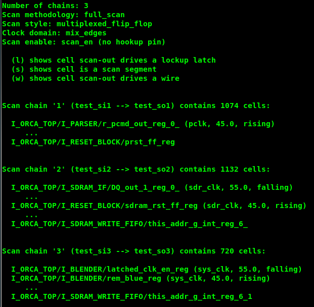

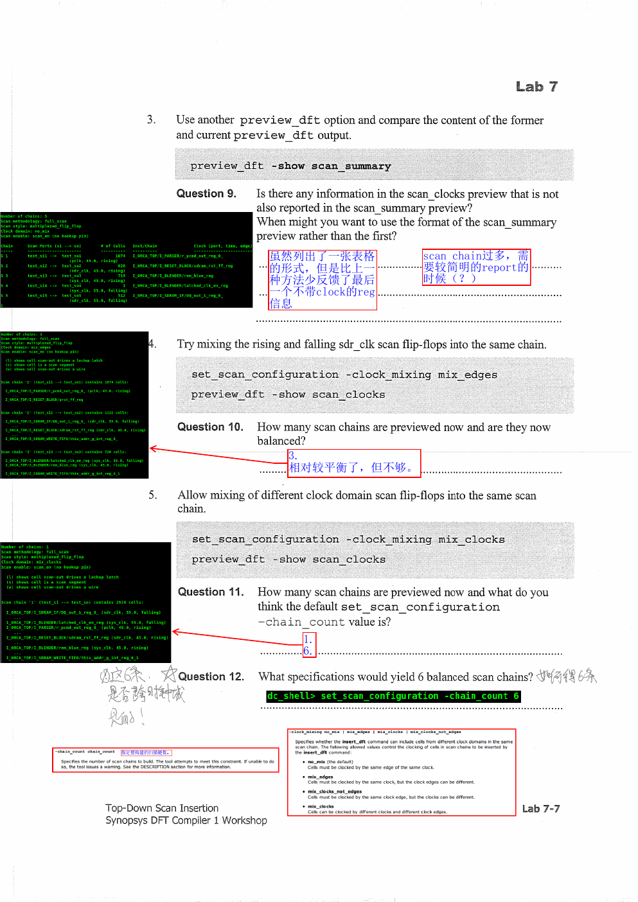

```
preview_dft -show scan_summary
```

### 1. 允许同一时钟的不同边沿混合

```
set_scan_configuration -clock_mixing mix_edges
preview_dft -show scan_clocks
```

### 问题 10

**问题**：现在预览多少条链？是否平衡？

**答案**：PDF 示例显示 3 条链，相比默认结果相对平衡，但仍不够理想。

> [!note] PDF 蓝色批注
> `3. 相对较平衡了，但不够。`

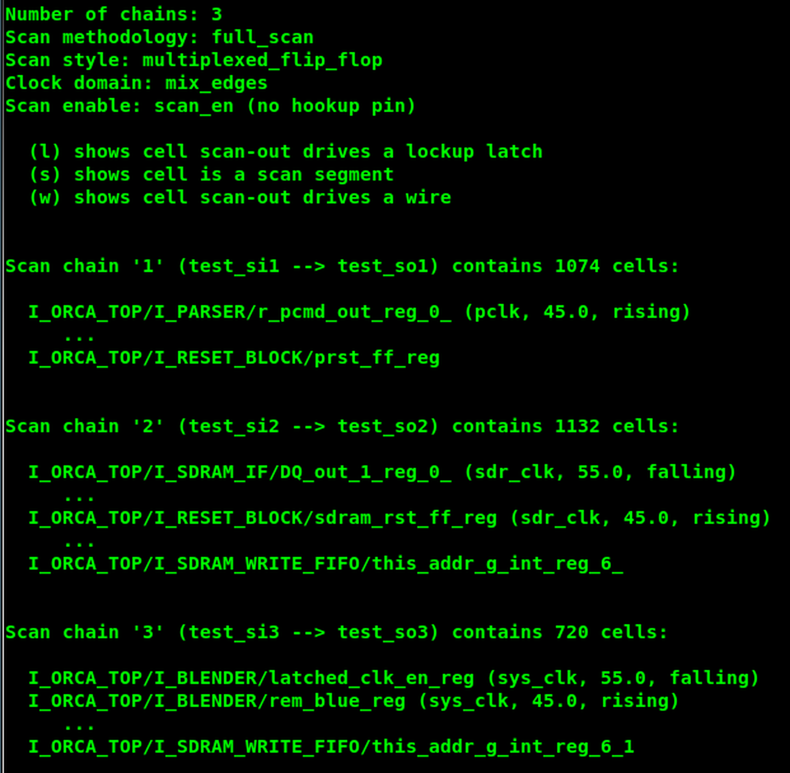

### 2. 允许不同测试时钟混合

```
set_scan_configuration -clock_mixing mix_clocks
preview_dft -show scan_clocks
```

### 问题 11

**问题**：现在预览多少条链？如何理解默认 chain_count？

**答案**：PDF 示例显示 1 条链，包含 2,926 个扫描单元。允许不同测试时钟混合后，工具可以把多个时钟域放入同一链；这也说明仅改变 clock_mixing 会显著改变链数，默认 chain_count 不能脱离时钟混合策略解释。


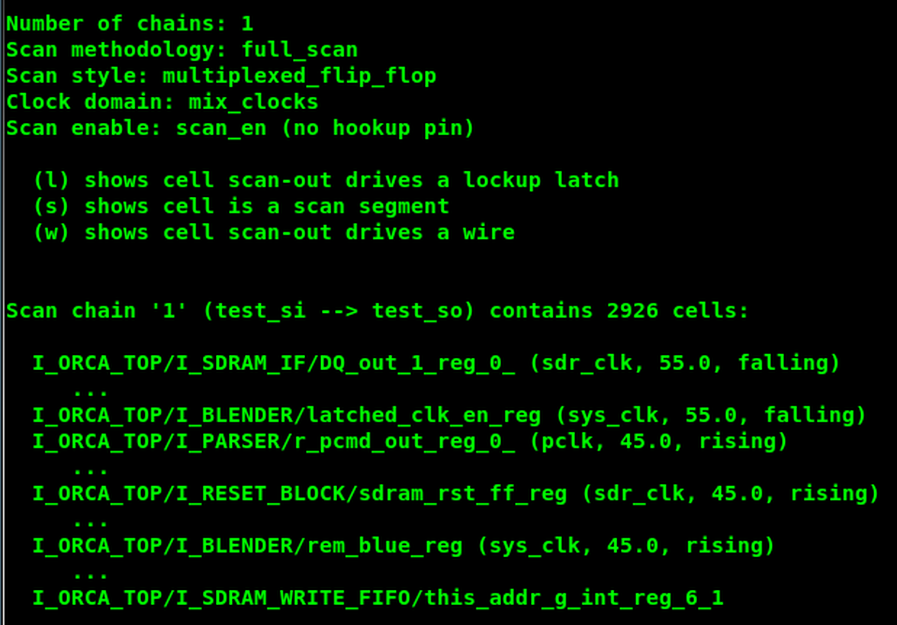

### 问题 12

**问题**：什么规格可以得到 6 条相对平衡的扫描链？

**答案**：设置 chain_count 为 6，并选择适合的 clock_mixing 策略：

```
set_scan_configuration -chain_count 6
preview_dft -show scan_clocks
```


PDF 给出了 clock_mixing 的含义：

| 值 | 含义 |
| --- | --- |
| no_mix | 同一条链只能使用同一时钟、同一边沿 |
| mix_edges | 时钟相同，但允许不同边沿 |
| mix_clocks_not_edges | 边沿相同，但允许不同测试时钟 |
| mix_clocks | 允许不同的时钟和边沿 |

## PDF 第 9 页｜lock-up latch 与链平衡

### 1. 为什么需要 lock-up latch

当一条扫描链跨越不同的时钟边沿或时钟域时，前一级扫描单元的输出可能在后一级采样窗口附近变化。lock-up latch 用于隔离时钟相位/偏斜，保证扫描移位稳定。

### 问题 13

**问题**：当前 6 条链中最长和最短链相差多少？

**答案**：PDF 示例为几乎没有差异；多数链为 488 个单元，最短链为 487 个单元，差异约 1 个扫描单元。

> [!note] PDF 蓝色批注
> `Almost no difference`。

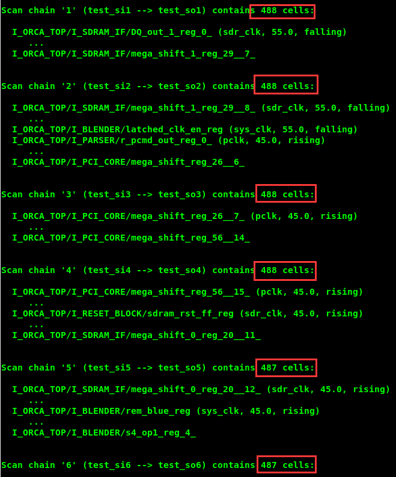


### 问题 14

**问题**：DFTC 是否会插入 lock-up latch？哪些链会包含？

**答案**：会。PDF 蓝色答案写的是：`yes. 2, 4, 5.`，即链 2、4、5 可能包含 lock-up latch；正文曾只列链 4、5，这里按批注补全。最终以 scan_clocks 和插入后网表报告为准。

### 2. 指定功能引脚和链名

```
source scripts/settings_insert_dft.tcl
preview_dft
```

### 问题 15

**问题**：新的扫描链叫什么？什么命令定义了这些名字？为什么要显式命名？

**答案**：PDF 示例链名为 chain0、chain1、chain2、chain3、chain4、chain5。由 set_scan_path 定义：

```
for {set i 0} {$i < 6} {incr i} {
    set_scan_path chain$i -view spec \
        -scan_data_in pad[$i] \
        -scan_data_out sd_A[$i]
}
```

显式命名可以将逻辑链名与实际 pad/scan-out 端口固定绑定，便于 handoff、SCANDEF、ATE 和后端流程引用。

> [!note] PDF 蓝色批注
> `单纯的数字前面多了“chain”；set_scan_path...`，意思是预览报告中的链名被显式改为 `chain0`–`chain5`，而不是只使用数字。

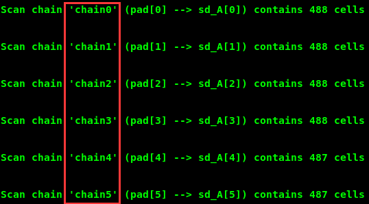

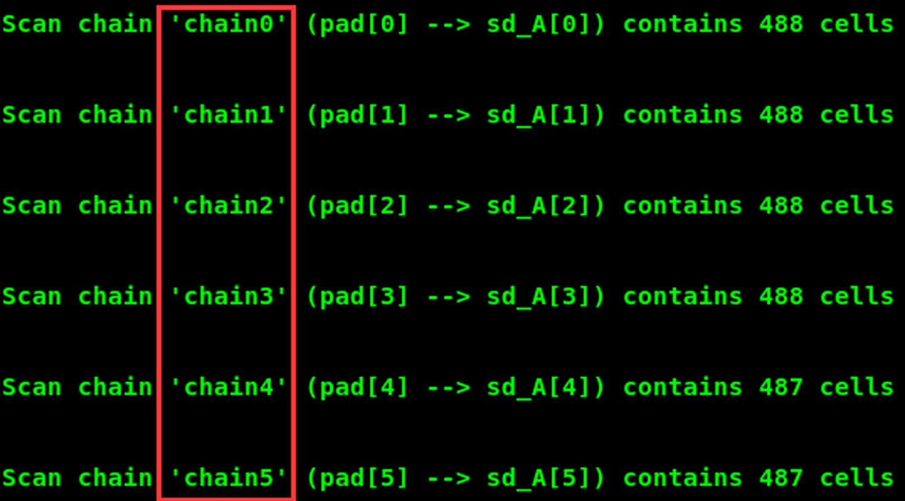

### 问题 16

**问题**：scan in、scan out、scan enable 使用哪些引脚？

**答案**：

- scan in：pad[0] 到 pad[5]。
- scan out：sd_A[0] 到 sd_A[5]。
- scan enable：scan_en。
- 扫描主时钟：sys_clk、sdr_clk、pclk。
- 复位：prst_n。

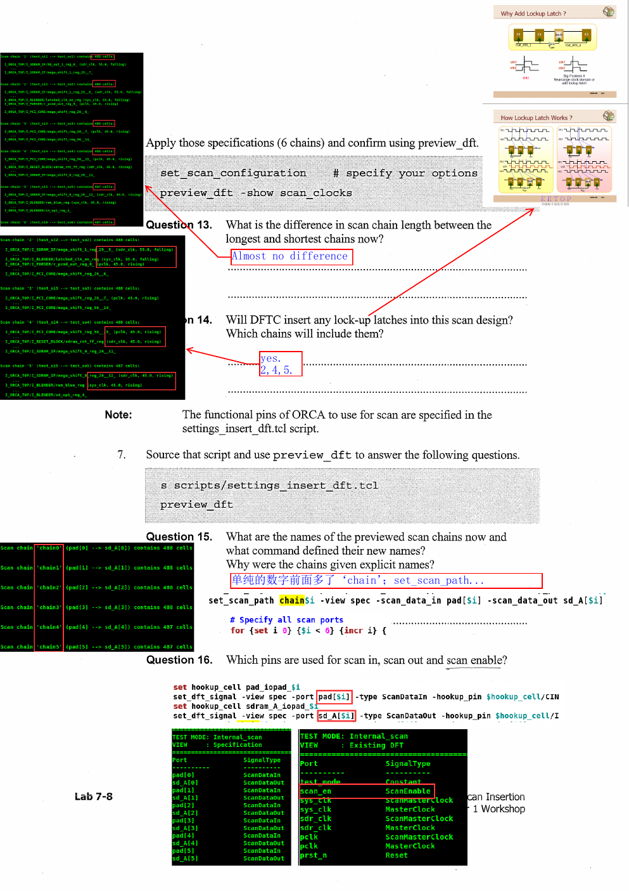

## PDF 第 10 页｜Task 3：插入扫描链并估算覆盖率

### 问题 17

**问题**：哪个命令可以避免插入扫描时所有子设计被重命名？

**答案**：set_dft_insertion_configuration，并设置 preserve_design_name：

```
set_dft_insertion_configuration -preserve_design_name true
```


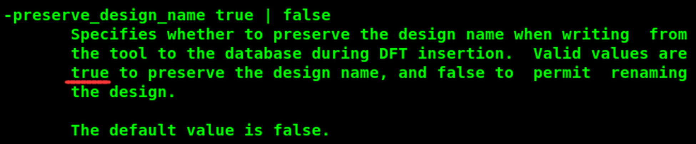

### 问题 18

**问题**：该命令的哪个选项可以关闭插入末期的门级优化？

**答案**：synthesis_optimization none：

```
set_dft_insertion_configuration -synthesis_optimization none
```


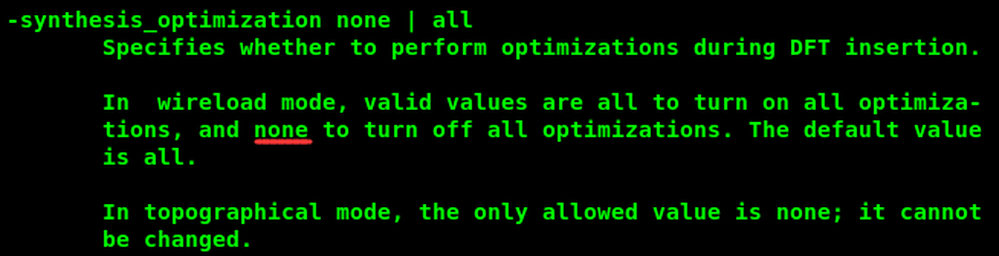

这可以减少 insert_dft 阶段的运行时间和对既有门级设计的改动。

### 2. 插入和覆盖率

```
source scripts/6insert_dft.tcl
dft_drc -coverage_estimate
```

### 问题 19

**问题**：ORCA 扫描设计的估算覆盖率是多少？

**答案**：PDF 示例为 95.28%。


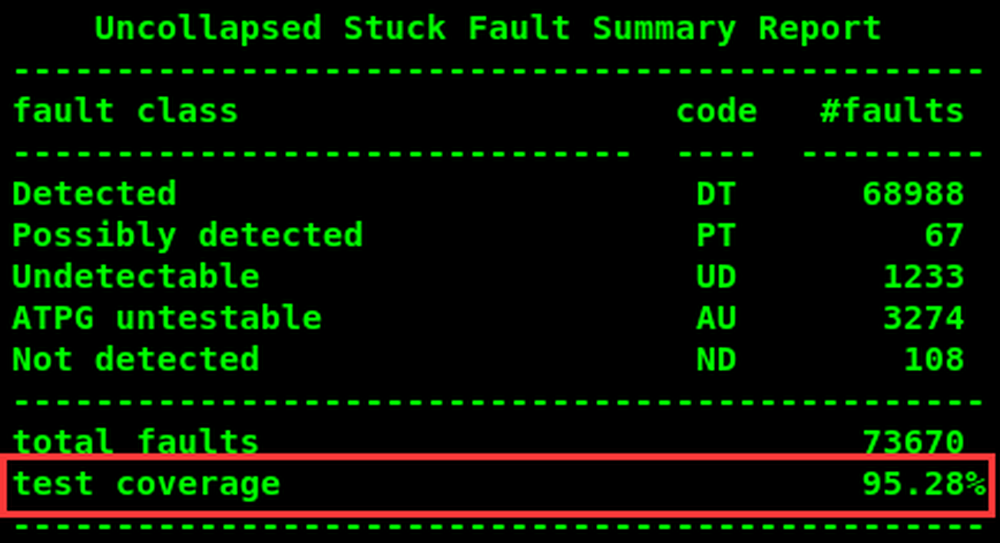

### 问题 20

**问题**：这个估算与前面仅根据有效扫描单元比例的预测相比如何？

**答案**：明显低于约 99% 的早期预测，只有 95.28%。原因是覆盖率还受到 DFT DRC、时钟混合、三态、总线驱动、扫描链结构和 ATPG 可解性的影响。

> [!note] PDF 蓝色批注
> 原页写着：`95.28% 着实比99%低太多了。。` 旁边的长段批注指出，scan chain 中多时钟、lock-up latch 和 DRC violation 都会使 coverage 下降；这部分是学习者对工具报告的解释，不是工具原始输出。

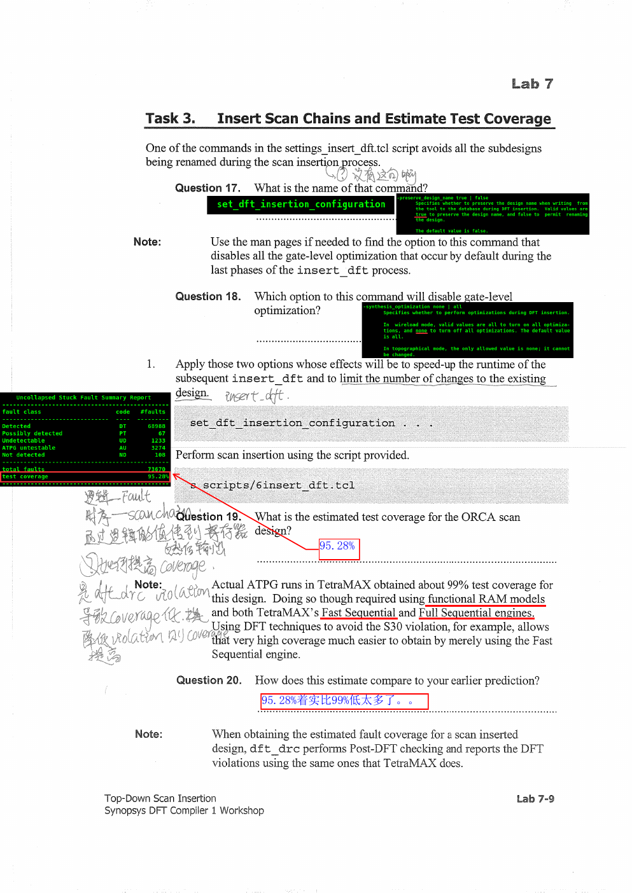

## PDF 第 11 页｜DFT DRC 与扫描规则

PDF 示例报告了会影响 ATPG 覆盖率的违规，例如：

- C17：时钟连接到 primary output。
- S22：一条扫描链由多个时钟移位。
- 与扫描单元 gate 连接的总线驱动器违规。

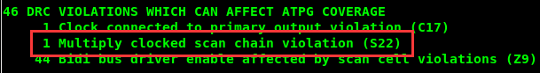

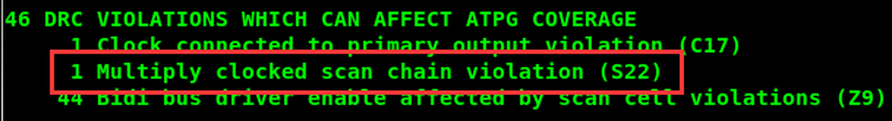

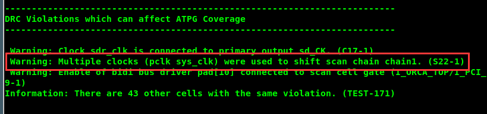


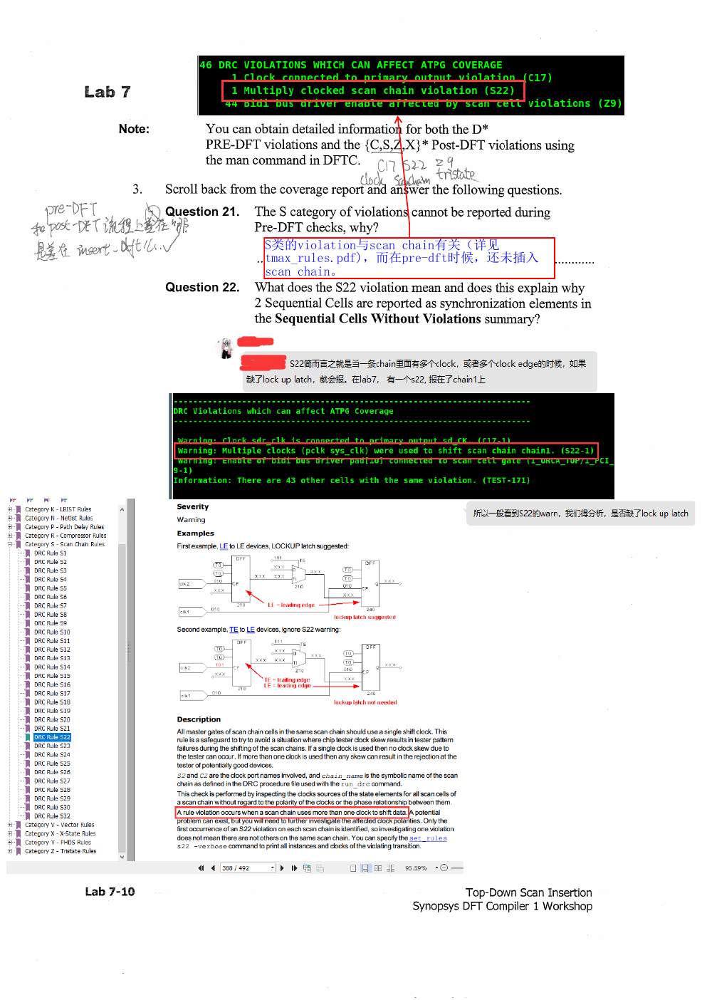

### 问题 21

**问题**：为什么 S 类/扫描链类别违规不能在 Pre-DFT 检查中报告？

**答案**：Pre-DFT 阶段还没有真正插入扫描链，工具没有链拓扑、链名和单元顺序，因此只能检查扫描前的时钟、复位、模型和拓扑问题；扫描链规则必须在 Post-DFT 阶段检查。

### 问题 22

**问题**：S22 违规是什么意思？它是否解释了 Sequential Cells Without Violations 中的 synchronization elements？

**答案**：S22 表示同一条扫描链使用多个移位时钟，或使用同一时钟的不同边沿。这个条件可能在移位时产生时钟偏斜/竞争，因此工具会建议或插入 lock-up latch 作为同步隔离。PDF 示例在 chain1 上出现一个 S22，并提示还有其他同类单元；需要逐条确认是否缺少 lock-up latch，而不能只看 warning 数量。

> [!note] PDF 蓝色批注
> 原始批注解释为：S22 意味着同一条 chain 中有多个 clock，或者有相同 clock 的不同 edge；如果缺少 lock-up latch，就会出现问题。实验页还记录“通常看到 S22 是 warning，需要分析是否需要 lock-up latch”。

## 实验检查清单

- [ ] 能用 report_scan_state 验证扫描状态。
- [ ] 能解释 2,926/2,958 的有效扫描单元比例。
- [ ] 能比较 scan_clocks 和 scan_summary。
- [ ] 能解释 no_mix、mix_edges、mix_clocks。
- [ ] 能用 chain_count 6 获得平衡链。
- [ ] 能解释 lock-up latch 和 S22。
- [ ] 能固定 scan path、scan in/out、scan enable 和设计名。
- [ ] 能解释为什么实际估算覆盖率低于简单的扫描单元比例预测。
