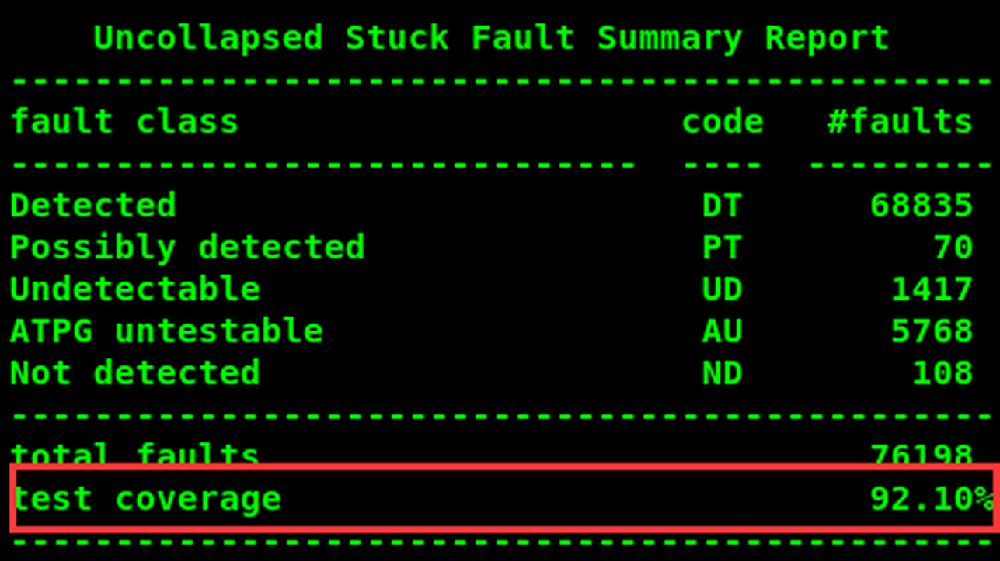
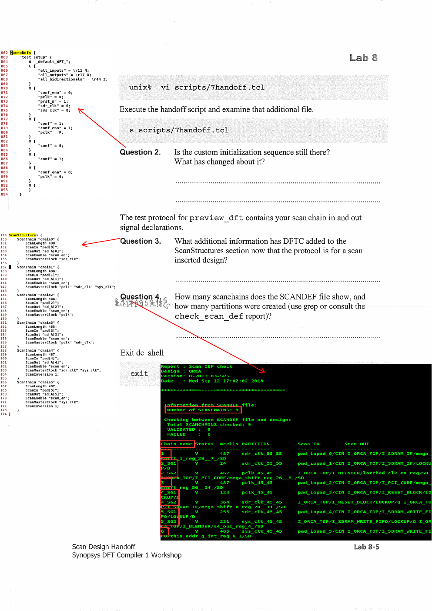
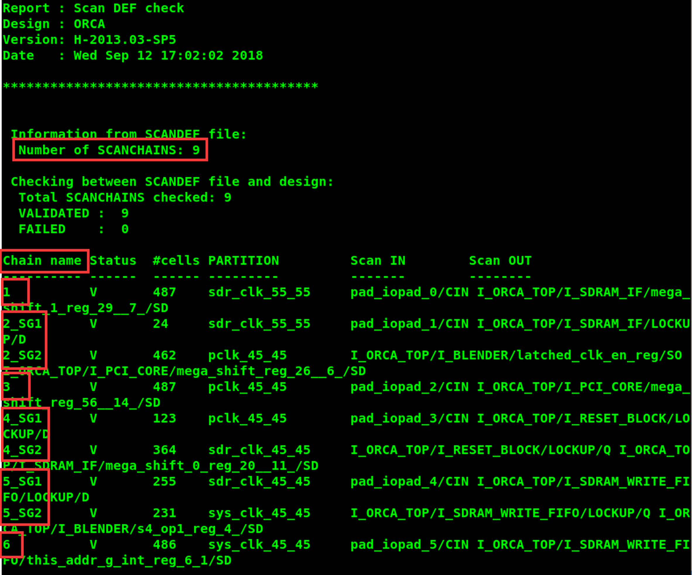
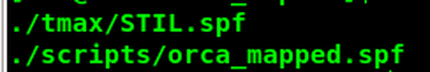

# 实验 8：扫描设计交接

术语参照：[[术语与翻译规范]]。

## 实验目标

完成本实验后，应能够：

1. 说出下游工具进行扫描测试所需的三类 DFTC 输出。
2. 输出最终测试协议和 SCANDEF 文件。

**实验时长**：约 30 分钟。

## 门级流程（Mapped Flow）与目录

Mapped Flow：

1. 将门级设计和测试协议读入 DFTC。
2. 指定扫描约束并预览扫描架构。
3. 插入扫描链。
4. 将设计和相关文件交给下游工具。

```
lab8_export/        当前工作目录
├── analyzed/       中间分析文件
├── logs/           会话日志
├── unmapped/       扫描前协议
├── mapped/         门级网表
├── mapped_scan/    扫描门级网表
├── reports/        DFTC 报告
├── tmax/           下游 TetraMAX 文件
├── scripts/        约束和运行脚本
├── ref/rtl/ORCA_init/
└── libs/           工艺库
```

## 任务 1：执行 Mapped Flow 并导出文件

### 1. 读入、预览、插入

```
cd lab8_export
dc_shell
source scripts/4read_gate_and_protocol.tcl
source scripts/settings_insert_dft.tcl
preview_dft
source scripts/6insert_dft.tcl
```

### 问题 1

**问题**：扫描设计的估算测试覆盖率是多少？

**答案**：示例为 92.10%。



| 故障类别 | 数量 |
| --- | ---: |
| Detected | 68,835 |
| Possibly detected | 70 |
| Undetectable | 1,417 |
| ATPG untestable | 5,768 |
| Not detected | 108 |
| Total faults | 76,198 |
| Test coverage | 92.10% |

### 2. 完成 handoff 脚本

交付脚本应包含以下动作：

```
# 输出给 TetraMAX 的 STIL/SPF 测试协议
write_test_protocol -output ./tmax/STIL.spf

# 输出供物理实现扫描链重排使用的 SCANDEF
write_scan_def -output ./mapped_scan/SCANDEF.scandef

# 检查 SCANDEF 与当前设计的一致性
check_scan_def

# 输出门级网表和 DDC
set_test_stil_netlist_format verilog
write -format verilog -hier -output ./tmax/ORCA_scan.v
write -format ddc -hier -output ./mapped_scan/ORCA.ddc
```

> [!note] 提示
> 交付脚本应包含 `write_test_protocol -output ./tmax/STIL.spf`、`write_scan_def -output ./mapped_scan/SCANDEF.scandef` 与 `check_scan_def`。扫描路径由 `settings_insert_dft.tcl` 中的插入配置定义。

## handoff 结果



### 问题 2

**问题**：自定义初始化序列还在吗？发生了什么变化？

**答案**：还在。handoff 导出的最终测试协议仍保留原有 test_setup 初始化序列；变化是协议新增了扫描输入、扫描输出、扫描使能和扫描链结构信息。

### 问题 3

**问题**：协议变成扫描协议后，ScanStructures 部分新增了什么信息？

**答案**：新增每条扫描链的：

- ScanIn。
- ScanOut。
- ScanEnable。
- ScanMasterClock。
- ScanLength。
- ScanChain 名称。
- 多时钟域和必要的 ScanInversion 信息。

示例：

```
ScanStructures {
  ScanChain "chain1" {
    ScanLength 488;
    ScanIn "pad[0]";
    ScanOut "sd_A[0]";
    ScanEnable "scan_en";
    ScanMasterClock "sdr_clk";
  }
}
```

### 问题 4

**问题**：SCANDEF 文件显示多少条扫描链、创建了多少分区？

**答案**：示例显示：

```
Number of SCANCHAINS: 9
Total SCANCHAINS checked: 9
VALIDATED
FAILED 0
```

因此至少可确认有 9 条扫描链，检查通过且失败为 0。分区数量应以 check_scan_def 的 partition 字段为准；报告表格显示链被分配到多个层次分区，实验记录可按报告逐项填写。



### 3. SCANDEF 校验

```
check_scan_def
```

校验重点：

- 链数量与 scan_path 报告一致。
- 链长度、ScanIn、ScanOut 与网表一致。
- partition 与层次实例一致。
- 时钟、反相和 lock-up latch 信息没有丢失。
- FAILED 为 0。

## 任务 2：在 TetraMAX 验证交付文件

### 1. 检查 TetraMAX 脚本路径

```
cd tmax
vi orca_tmax.tcl
```

确保脚本引用的扫描网表和 SPF 文件，与 handoff 实际输出的文件名一致：

```
read_netlist ORCA_scan.v
run_build
set_rule 65 warning
run_drc
add_faults -all
run_atpg -auto
```

对于 fast sequential ATPG，可增加 capture cycles：

```
set_atpg -capture_cycles <N>
run_atpg -auto
```

### 问题 5

**问题**：TetraMAX 报告的测试覆盖率是多少？

**答案**：示例为 96.72%。

| 项目 | 示例 |
| --- | ---: |
| Total faults | 75,868 |
| Test coverage | 96.72% |
| TetraMAX Total CPU time | 9.82 s |
| GUI 记录的 CPU time | 11.05 s |

### 问题 6

**问题**：TetraMAX 覆盖率与 DFTC 估算相比如何？为什么不同？

**答案**：TetraMAX 的 96.72% 高于 DFTC 的 92.10%。差异与测试协议、STIL/SPF 和 test simulation library 有关；TetraMAX 读入完整交付网表并运行实际 ATPG，而 DFTC 的 coverage estimate 使用内部模式源和当前 DFTC 模型，因此两者的故障分类和可检测性会不同。

> [!note] 提示
> DFTC 的估算不读取 `STIL.spf` 和测试仿真库；TetraMAX 的示例总 CPU 时间为 `11.05 s`。因此两个工具给出的覆盖率不可直接按同一统计方法比较。



## 交接验收清单

- [ ] 输出 STIL/SPF、扫描门级 Verilog、DDC、SCANDEF。
- [ ] handoff 后初始化序列仍在。
- [ ] ScanStructures 包含端口、时钟、长度和链名。
- [ ] SCANDEF 为 9 条链、校验 FAILED 0（示例）。
- [ ] TetraMAX 脚本引用的文件与实际输出一致。
- [ ] 能解释 92.10% 与 96.72% 的差异。
