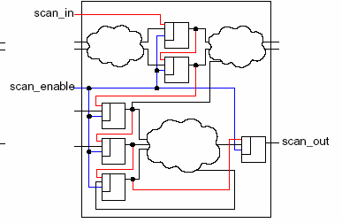
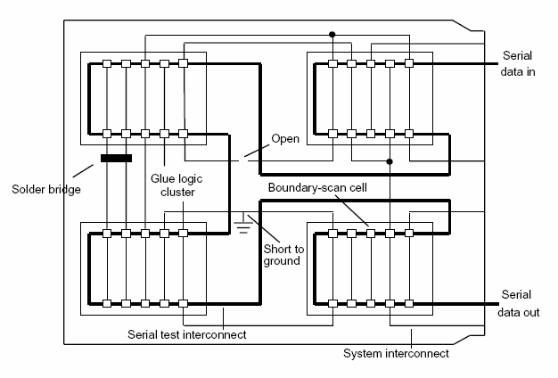
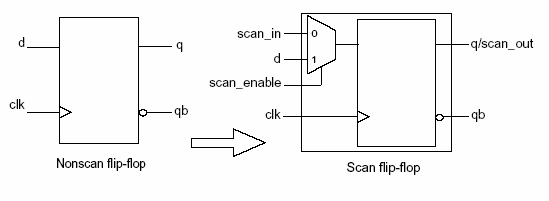
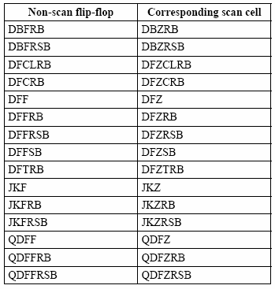
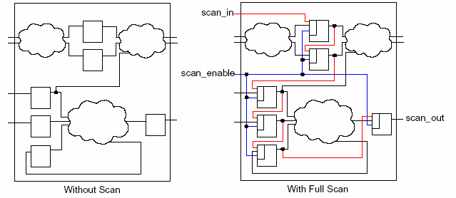
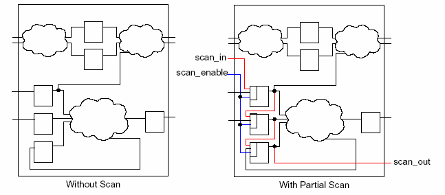
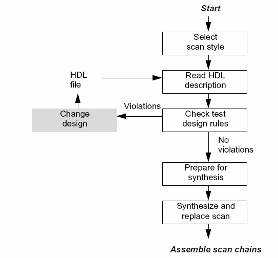
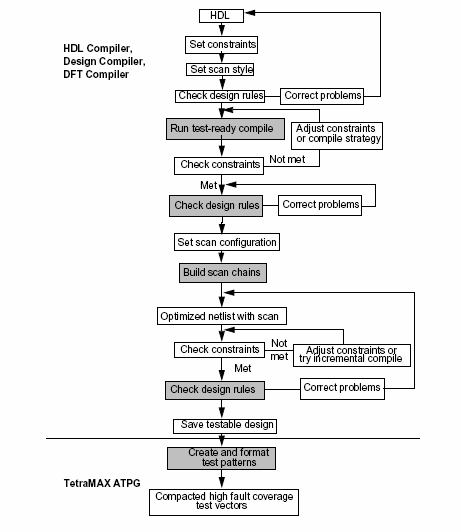
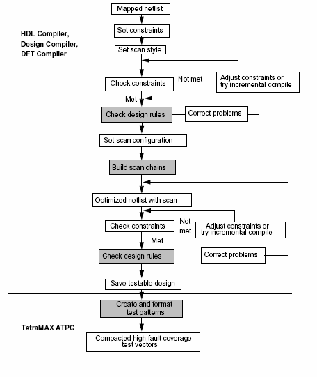

# DFT Compiler 基本使用方法

术语参照：[[术语与翻译规范]]。

## 基本概念

### DFT Compiler

DFT Compiler 是 Synopsys Design Compiler 工具集中的可测性设计工具，用于为采用扫描测试的数字设计自动插入扫描结构。其核心目标是提高时序逻辑的可控性与可观测性。

### 内部扫描

内部扫描在测试模式下将设计中的触发器连接成移位寄存器。测试数据可以串行装载到各个触发器，原有状态和测试响应则可串行移出。该结构能够简化测试向量生成并提高故障覆盖率。



### 边界扫描

边界扫描面向芯片 I/O 与板级互连测试，通常通过 JTAG 接口控制。Synopsys 流程中可由 BSD Compiler 生成相应结构；它与 DFT Compiler 一样依赖 Design Compiler 环境及相应授权。



### 扫描触发器

内部扫描通过使用同类型扫描触发器替换普通触发器实现。目标工艺库必须包含可用的扫描单元，并正确提供功能单元与扫描单元的对应关系。





> [!note] 工艺库要求
> 扫描单元被设为 `dont_use`、扫描风格与库不匹配，或复位/置位极性未正确识别时，扫描替换可能失败。插入前应先检查目标库实现（Technology Mapping）条件和测试单元属性。

### 全扫描与部分扫描

全扫描将大多数或全部时序单元纳入扫描链，通常有利于提高覆盖率；部分扫描只选择部分关键时序单元，以降低面积、时序、功耗和测试时间开销。





## DFT Compiler 流程

### 基本流程

DFT 实施的一般顺序为：读入设计与工艺库、建立约束、定义测试属性、检查扫描可行性、执行扫描综合或插入、复查扫描路径、估算覆盖率并输出交付物。



### 综合阶段扫描插入（Pre-Technology-Mapping Scan Insertion）

该流程在目标库实现前的综合阶段同时考虑扫描结构。它使优化过程能够使用扫描触发器，但需要提前准备扫描库、测试端口定义和测试时序约束。



### 门级网表扫描插入（Post-Technology-Mapping Scan Insertion）

该流程先生成已完成目标库实现的功能网表，再执行扫描触发器替换和扫描链连接。该方法便于隔离功能综合和 DFT 插入阶段，但应重新评估时序、面积和测试规则。



## 完整脚本示例

以下脚本展示一个计数器设计的扫描综合、检查和输出流程。库名、路径、单元名和时序数值需替换为项目实际配置。

```tcl
set WORK_DIR /usr/dc09/dc_scan
set target_library {fsa0a_c_sc_tc.db}
set link_library {* fsa0a_c_sc_tc.db}
set symbol_library {fsa0a_c_sc.sdb}

read_verilog $WORK_DIR/code/counter.v
current_design counter
link

remove_attribute [get_cells fsa0a_c_sc_tc/QDFZRBN] dont_use
remove_attribute [get_cells fsa0a_c_sc_tc/QDFZRBP] dont_use
remove_attribute [get_cells fsa0a_c_sc_tc/QDFZRBS] dont_use
remove_attribute [get_cells fsa0a_c_sc_tc/QDFZRBT] dont_use

set auto_wire_load_selection true
set_max_transition 0.2 counter
set_drive 2 [all_inputs]
#set_driving_cell -lib_cell QDFFRBN -pin Q -library fsa0a_c_sc_tc [get_ports rst_n]
set_fanout_load 3 [all_outputs]

create_clock -name "clk" -period 10 -waveform {0 5} [get_ports clk]
set_clock_uncertainty -setup 0.1 clk
set_clock_uncertainty -hold 0.1 clk
set_input_delay -max 2 -clock clk [all_inputs]
set_input_delay -min 0.1 -clock clk [all_inputs]
set_dont_touch_network [get_clocks clk]

set_dft_configuration -scan_style multiplexed_flip_flop
set_dft_signal -view existing_dft -type ScanClock \
    -port clk -timing {0 5}
set_dft_signal -view existing_dft -type ScanEnable \
    -port scan_enable -active_state 1
set_dft_signal -view existing_dft -type TestMode \
    -port test_mode -active_state 1

create_test_protocol
dft_drc
compile -scan
preview_dft
insert_dft
dft_drc
report_scan_path

write -format verilog -hier -o $WORK_DIR/netlist/counter_scan.v
write_test_protocol -output $WORK_DIR/netlist/counter_scan.spf
```

> [!note] 版本兼容性
> 已确认本机 `dc_shell V-2023.12-SP3` 提供 `set_dft_signal`、`create_test_protocol`、`dft_drc`、`preview_dft`、`insert_dft`、`report_scan_path` 与 `write_test_protocol`。端口名、选项和工艺库必须以当前设计为准；执行前使用 `help <命令>` 或 `man <命令>` 核对语法。参见 [[商业工具实验准备]]。

## 交付与验收

- 扫描网表：确认扫描单元、扫描端口和层次结构正确。
- 测试协议：定义测试模式、扫描时钟、复位、波形和初始化序列。
- 扫描路径报告：确认链数、链长、起止端口、时钟域及 lock-up latch。
- DFT 设计规则检查（DFT DRC）报告：每一项违规均有修复措施或经批准的豁免。
- 覆盖率报告：记录故障模型、检测率、不可测原因、向量数和测试时间。
