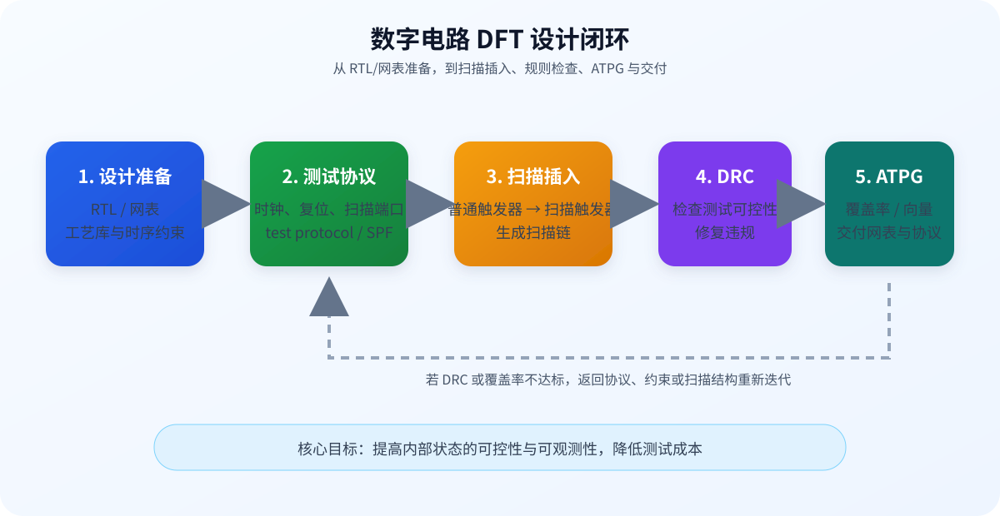
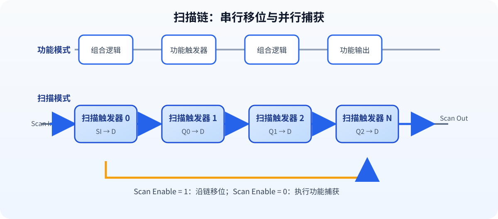

# Synopsys DFT Compiler Workshop 实验手册

术语参照：[[术语与翻译规范]]。

当前工具入口与版本差异见 [[商业工具实验准备]]。

## 使用说明

本文按“概念 → 命令 → 检查 → 交付”的顺序组织 DFT Compiler 实验内容，可配合实验 3–9 使用。工程路径、库名和工具版本必须替换为当前项目配置。

## 1. Workshop 总体结构

| 模块 | 主题 | 产物 |
| --- | --- | --- |
| Lab 1 | 从阅读到接手工具 | DC/DFTC 基本操作和帮助系统 |
| Lab 2 | 设计准备 | 设计读入、链接、约束和检查 |
| Lab 3 | 创建测试协议 | 测试时钟、复位、扫描端口、协议 DRC |
| Lab 4 | DFT 设计规则检查 | DRC 报告和 ATPG 覆盖率估算 |
| Lab 5 | Design Vision | 图形化查看层次、连线、时序和报告 |
| Lab 6 | 修复 DFT 设计规则检查（DFT DRC）违规 | 定位违规、提出手工方案、使用 AutoFix |
| Lab 7 | 自顶向下扫描插入 | 分层设计的扫描配置和交接 |
| Lab 8 | 扫描设计交接 | 输出扫描网表、协议、测试模型和报告 |
| Lab 9 | 运行时间与容量优化 | 链平衡、测试模型、内存和覆盖率分析 |



## 2. 工具接手顺序

进入一个已有 DFT 工程时，建议按以下顺序确认：

```tcl
printvar *library*
printvar *search_path*
current_design
get_designs *
get_cells -hier *
check_design
check_timing
```

如果不清楚命令的完整语法，优先使用工具内帮助：

```tcl
help preview_dft
man compile
preview_dft -help
```

## 3. 测试协议的最小信息

测试协议至少要描述：

- 测试时钟端口、周期、占空比、捕获沿和 strobe 时刻。
- 扫描使能端口及其有效电平。
- 扫描输入/输出端口和扫描链数量。
- 异步/同步复位端口、有效电平及解除复位时序。
- 测试模式信号的初始化序列。
- 双向端口、三态控制和必要的稳定时间。

```tcl
set_dft_configuration -scan_style multiplexed_flip_flop
set_dft_signal -view existing_dft -type ScanEnable \
    -port scan_enable -active_state 1
set_dft_signal -view existing_dft -type ScanClock \
    -port scan_clk -timing {45 55}
set_dft_signal -view existing_dft -type Reset \
    -port reset_n -active_state 0
```

> 本机 `dc_shell V-2023.12-SP3` 使用 `set_dft_signal`。不同 DFTC 版本的命令参数可能不同；以当前版本 `-help` 和用户指南为准。实验要点是先把信号类型、有效电平和时序定义清楚，再执行协议 DRC。

## 4. 扫描插入的关键检查



### 4.1 插入前

```tcl
link
check_design
preview_dft
report_dft_signal
```

确认：

1. 目标库中存在扫描触发器。
2. 功能时钟和测试时钟关系明确。
3. 复位不会在扫描移位期间意外触发。
4. 不可扫描的单元、黑盒和锁存器已有处理策略。

### 4.2 插入后

```tcl
insert_dft
dft_drc
report_scan_path
```

扫描路径报告至少应记录：链编号、起点、终点、单元数量、扫描时钟域和未连接端点。

## 5. DFT 设计规则检查（DFT DRC）的处理方法

不要只看违规编号，要把违规转换成“为什么测试设备无法施加或观察信号”：

| 类型 | 典型原因 | 修复方向 |
| --- | --- | --- |
| 时钟不可控 | clock mux 未定义测试选择、时钟门控无法打开 | 增加测试旁路或补充测试模式约束 |
| 复位冲突 | 扫描期间异步复位有效 | 调整复位初始化和测试时序 |
| 节点不可观测 | 黑盒、三态或组合逻辑阻断路径 | 增加观察点、旁路或模型 |
| 单元不可扫描 | 库中没有匹配 Scan FF | 修正库配置或采用替代扫描结构 |
| 多时钟域问题 | 扫描链跨域且没有正确时钟规则 | 分链、分组并指定扫描时钟 |

## 6. ATPG 与覆盖率


覆盖率报告不要只记录一个百分比，应同时记录：

- 故障模型：固定型、转换型、桥接型等。
- 已检测故障数量和总故障数量。
- 不可检测（可能为冗余逻辑或结构上不可检测）。
- 未覆盖故障（通常仍有测试机会）。
- 测试向量数量、扫描周期、峰值功耗和压缩比。

## 7. 交付文件

```text
deliverables/
├── netlist/top_scan.v       # 扫描网表
├── netlist/top_scan.ddc     # DC 数据库
├── protocol/top.stil        # 测试协议
├── constraints/top.sdc      # 时序约束
├── reports/scan_path.rpt    # 扫描链报告
├── reports/dft_drc.rpt      # DFT DRC 报告
├── reports/coverage.rpt     # 覆盖率报告
└── logs/                    # 工具日志和版本信息
```

交付前要保存工具版本、库版本、脚本提交号和运行日期，否则后续很难复现报告。
