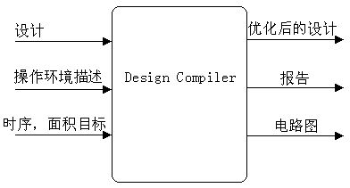
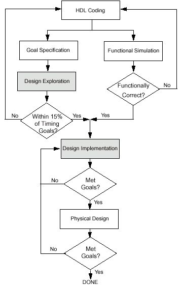
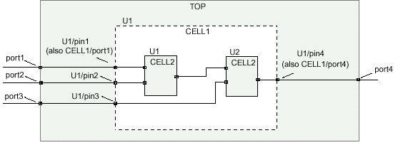
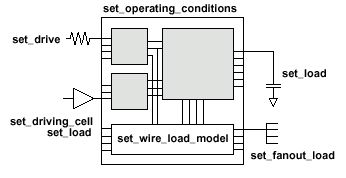
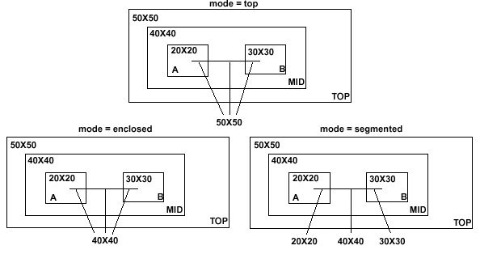
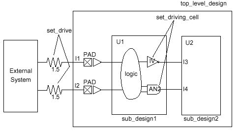

# 常用 Synopsys DC 命令详解

术语参照：[[../术语与翻译规范|术语与翻译规范]]。

> [!note] 使用范围
> 本文用于 Synopsys Design Compiler（DC）的 RTL 综合、约束、报告和设计管理。命令选项受软件版本、许可证和工艺库影响；执行前请使用 `help <命令>`、`man <命令>` 或 `<命令> -help` 核对。

> [!warning] 版本说明
> 本机使用 `dc_shell V-2023.12-SP3`。早期资料中的 `dcsh`、`Design Analyzer` 和部分旧选项仅用于阅读历史脚本；新工程使用 Tcl 与 `Design Vision`。DFT Compiler 的准备说明见 [[../商业工具实验准备|Synopsys DFT 实验准备]]。

## 1. 综合流程

DC 将硬件描述语言（HDL，Hardware Description Language）实现为目标工艺库中的门级网表，并根据时序、面积、功耗和设计规则约束优化电路。

1. 建立工程目录与 `.synopsys_dc.setup`。
2. 设置搜索目录、目标库和链接库。
3. 读入 RTL，设置顶层设计，执行 `link`。
4. 定义时钟、I/O 时序、电容和设计规则约束。
5. 执行 `check_design` 与 `check_timing`。
6. 运行 `compile` 或 `compile_ultra`。
7. 查看报告并导出网表、DDC 和 SDC。

### 1.1 推荐目录

```text
project/
├── rtl/                 # Verilog、SystemVerilog 或 VHDL
├── lib/                 # 工艺库和符号库
├── constraints/         # SDC 与接口约束
├── scripts/             # Tcl 脚本
├── work/                # analyze/elaborate 的工作库
├── reports/             # 报告和日志
└── out/                 # 门级网表、DDC、SDC
```

### 1.2 最小 Tcl 脚本

库文件、顶层名、端口名和数值必须替换为当前工程的实际内容。

```tcl
# scripts/run_dc.tcl
set ROOT [file normalize [file dirname [info script]]/..]
set REPORT_DIR "$ROOT/reports"
set OUT_DIR "$ROOT/out"
file mkdir $REPORT_DIR $OUT_DIR

lappend search_path "$ROOT/rtl" "$ROOT/lib" "$ROOT/constraints"
set target_library [list /path/to/typical.db]
set link_library [concat * $target_library]

read_verilog "$ROOT/rtl/top.sv"
current_design top
link
check_design

create_clock -name CLK -period 10 -waveform {0 5} [get_ports clk]
set_input_delay -max 2.0 -clock CLK [get_ports {data_in[*]}]
set_input_delay -min 0.2 -clock CLK [get_ports {data_in[*]}]
set_output_delay -max 2.0 -clock CLK [get_ports {data_out[*]}]
set_output_delay -min 0.2 -clock CLK [get_ports {data_out[*]}]
set_load 0.05 [get_ports {data_out[*]}]

check_timing
compile_ultra

report_qor > "$REPORT_DIR/qor.rpt"
report_area -hierarchy > "$REPORT_DIR/area.rpt"
report_timing -delay_type max -max_paths 20 -input_pins -transition_time -capacitance > "$REPORT_DIR/timing_max.rpt"
report_timing -delay_type min -max_paths 20 -input_pins -transition_time -capacitance > "$REPORT_DIR/timing_min.rpt"
report_constraint -all_violators > "$REPORT_DIR/constraints.rpt"

write -format verilog -hierarchy -output "$OUT_DIR/top_syn.v"
write -format ddc -hierarchy -output "$OUT_DIR/top_syn.ddc"
write_sdc "$OUT_DIR/top_syn.sdc"
```

```bash
dc_shell -f scripts/run_dc.tcl | tee reports/run_dc.log
```

## 2. 工具界面与脚本

| 入口 | 适用工作 | 说明 |
| --- | --- | --- |
| `dc_shell` | 批处理、脚本执行、日志保存 | 日常综合的首选入口。 |
| `design_vision` | 原理图、层次和对象查看 | 图形界面，可配合 Tcl 命令使用。 |
| `dc_shell -gui` | 图形界面加命令窗口 | 具体可用性以当前安装为准。 |

### 2.1 帮助、脚本和系统命令

```tcl
help compile_ultra
man create_clock
report_timing -help
printvar target_library
printvar *clock*

source scripts/run_dc.tcl
source -echo -verbose scripts/run_dc.tcl

sh pwd
exec ls -la reports
```

`source -echo -verbose` 会在日志中显示每条语句，便于定位脚本问题。新 Tcl 脚本使用 `#` 添加注释。

## 3. 库、配置文件与文件格式

### 3.1 `.synopsys_dc.setup`

DC 会读取安装目录、用户目录和当前工程目录中的 `.synopsys_dc.setup`。工程目录中的设置优先级最高，适合保存项目专用的搜索目录和库文件设置。

```tcl
# .synopsys_dc.setup
set PROJECT_ROOT /path/to/project
lappend search_path $PROJECT_ROOT/rtl
lappend search_path $PROJECT_ROOT/lib

set target_library [list /path/to/lib/typical.db]
set link_library [concat * $target_library]
```

### 3.2 常用库变量

| 变量 | 用途 | 常见设置 |
| --- | --- | --- |
| `target_library` | 编译时可选用的目标工艺库 | 标准单元 `.db` 文件列表。 |
| `link_library` | 解析实例引用时的搜索列表 | 常以 `*` 开头，再加入目标库和宏单元库。 |
| `symbol_library` | 图形界面的符号库 | 仅在图形查看需要时设置。 |
| `synthetic_library` | DesignWare（设计工具库，DesignWare）等综合库 | 取决于许可证和工程要求。 |
| `search_path` | RTL、库、约束和脚本搜索目录 | 使用 `lappend` 增加目录。 |

`*` 表示 `link` 时也搜索内存中的设计。若子模块或宏单元无法解析，优先检查 `link_library`、`search_path` 和源文件读入顺序。

### 3.3 文件与单位

| 类别 | 常见文件 | 说明 |
| --- | --- | --- |
| RTL | `.v`、`.sv`、`.vhd` | 设计源文件。 |
| 工艺库 | `.db`、`.lib` | 单元功能、时序、电容、面积和设计规则。 |
| 设计数据库 | `.ddc`、`.db` | DC 保存的设计数据。 |
| 门级网表 | `.v` | 供仿真、形式检查或下游工具使用。 |
| 约束 | `.sdc` | 时钟、I/O、时序例外和设计规则。 |
| 报告 | `.rpt`、`.log` | 面积、时序、功耗、约束和会话记录。 |

```tcl
list_libs
report_lib
report_lib [get_libs *]
report_design
```

时间、电容、电阻、电压和电流的单位由库文件定义。`set_load`、`set_clock_uncertainty` 等数值必须与库中单位一致。

## 4. 读入、展开与设计对象

### 4.1 读入 RTL

```tcl
read_verilog rtl/alu.sv
read_verilog rtl/control.sv
read_verilog rtl/top.sv
current_design top
link
```

文件较多时，应维护明确的文件列表。不要依赖未声明的自动搜索。

### 4.2 `analyze` 与 `elaborate`

`analyze` 检查 HDL 并写入工作库；`elaborate` 根据已分析模块建立当前设计，适合 VHDL、参数化 Verilog 和需要多次展开的工程。

```tcl
define_design_lib WORK -path ./work
analyze -format sverilog {rtl/pkg.sv rtl/core.sv rtl/top.sv}
elaborate top -library WORK
current_design top
link
```

| 方式 | 适用情况 |
| --- | --- |
| `read_verilog` / `read_file` | 文件较少、读入步骤直接的工程。 |
| `analyze` + `elaborate` | 多次展开、参数覆盖、VHDL 或需要保留工作库的工程。 |

### 4.3 链接、检查与查询

```tcl
link
check_design
check_timing

get_ports {data_in[*]}
get_cells -hier {u_core/*}
get_pins -hier *
get_nets -hier {clk_*}
get_clocks *

all_inputs
all_outputs
all_registers
all_clocks
```

| 对象 | 含义 | 常用查询 |
| --- | --- | --- |
| `design` | 当前模块或子模块 | `current_design`、`get_designs` |
| `cell` | 模块或库单元实例 | `get_cells -hier *` |
| `reference` | 实例引用的设计或库单元 | `report_reference` |
| `port` | 设计端口 | `get_ports *` |
| `pin` | 实例引脚 | `get_pins -hier *` |
| `net` | 连接端口和引脚的连线 | `get_nets -hier *` |
| `clock` | 时钟对象 | `get_clocks *` |

将对象集合用于约束前，先用 `sizeof_collection`、`query_objects` 或报告命令确认选中的对象数量和名称。

### 4.4 层次与属性操作

```tcl
uniquify
ungroup [get_cells u_small_block]
group -design_name ALU_GROUP {u_add u_compare u_shift}
change_link -instance u_core -reference CORE_IMPL

set_attribute [get_cells u_core] dont_touch true
get_attribute [get_cells u_core] dont_touch
remove_attribute [get_cells u_core] dont_touch
```

| 命令 | 说明 |
| --- | --- |
| `uniquify` | 为重复实例建立独立的设计副本，便于施加不同约束。 |
| `ungroup` | 移除指定层次，使编译可跨越原模块边界。 |
| `group` | 将若干对象组织为新的逻辑层次。 |
| `change_link` | 为实例更换引用设计或实现。 |
| `set_attribute` | 为对象设置属性。 |

这些命令会改变设计层次或对象属性。使用后应执行 `link`、`check_design`，并重新查看层次报告。

## 5. 时钟与接口约束

### 5.1 主时钟、生成时钟与 I/O 时序

```tcl
create_clock -name SYS_CLK -period 10 -waveform {0 5} [get_ports sys_clk]
create_generated_clock -name DIV2_CLK -source [get_ports sys_clk] -divide_by 2 [get_pins u_divider/clk_div2]

create_clock -name EXT_CLK -period 8
set_input_delay -max 1.4 -clock EXT_CLK [get_ports {rx_data[*]}]
set_input_delay -min 0.2 -clock EXT_CLK [get_ports {rx_data[*]}]
set_output_delay -max 1.6 -clock EXT_CLK [get_ports {tx_data[*]}]
set_output_delay -min 0.3 -clock EXT_CLK [get_ports {tx_data[*]}]
```

`create_clock` 定义主时钟。分频、倍频或选择后的时钟应按实际结构使用 `create_generated_clock`。虚拟时钟不绑定当前设计的端口或引脚，常用于描述芯片外部发送端和接收端。

输入延时描述外部发送端到芯片输入端口的到达时间；输出延时描述芯片输出端口到外部接收端的要求时间。两者都应同时给出 `-max` 与 `-min`。

### 5.2 时钟不确定度和时序例外

```tcl
set_clock_uncertainty -setup 0.10 [get_clocks SYS_CLK]
set_clock_uncertainty -hold 0.03 [get_clocks SYS_CLK]
set_clock_latency -source 0.20 [get_clocks SYS_CLK]

set_clock_groups -asynchronous -group [get_clocks SYS_CLK] -group [get_clocks AUX_CLK]
set_false_path -from [get_ports debug_*] -to [get_registers *]
set_multicycle_path 2 -setup -from [get_registers src_*] -to [get_registers dst_*]
set_multicycle_path 1 -hold -from [get_registers src_*] -to [get_registers dst_*]
```

只有在功能确认后，才能使用 `set_false_path`、`set_multicycle_path` 和 `set_clock_groups`。时序例外应给出明确的起点、终点、原因和复核记录。

> [!warning] 多周期路径
> 建立检查和保持检查的周期数需要成对考虑。上例的保持周期仅为常见写法之一，实际数值必须依据寄存器间的功能时序确定。

### 5.3 输入驱动、输出电容和设计规则

```tcl
set_driving_cell -lib_cell BUFX4 -pin Z [get_ports {data_in[*]}]
set_input_transition 0.08 [get_ports {cfg_in[*]}]
set_drive 0 [get_ports clk]

set_load 0.05 [get_ports {data_out[*]}]
set_fanout_load 4 [get_ports status_out]

set_max_transition 0.20 [current_design]
set_max_fanout 12 [current_design]
set_max_capacitance 0.08 [current_design]
```

| 命令 | 用途 |
| --- | --- |
| `set_driving_cell` | 用库单元描述输入端口的外部驱动。 |
| `set_input_transition` | 直接定义输入端口的转换时间。 |
| `set_load` | 定义输出端口的电容。 |
| `set_fanout_load` | 定义输出端口的扇出系数。 |
| `set_max_transition` | 限制最大转换时间。 |
| `set_max_fanout` | 限制最大扇出。 |
| `set_max_capacitance` | 限制最大电容。 |

### 5.4 门控时钟与固定对象

```tcl
set_clock_gating_check -setup 0.10 -hold 0.05

set_dont_use [get_lib_cells *CLKBUF_X1]
set_dont_touch [get_cells -hier {u_analog_wrapper u_clock_gen}]
set_dont_touch_network [get_ports reset_n]
```

过度使用 `set_dont_touch` 和 `set_dont_touch_network` 会限制优化空间。每次设置后应检查面积、时序和设计规则报告。

## 6. 编译与设计环境

### 6.1 编译命令

| 命令 | 用途 |
| --- | --- |
| `compile` | 基本逻辑优化和目标库实现（Technology Mapping）。 |
| `compile_ultra` | 使用更强的优化策略；具体选项由许可证决定。 |
| `compile -incremental` | 在既有结果基础上继续优化。 |
| `compile_ultra -scan` | DFT 场景中的 test-ready 编译；须先完成 DFT 信号和协议设置。 |

```tcl
compile
compile -incremental
```

### 6.2 层次策略

| 策略 | 优点 | 注意事项 |
| --- | --- | --- |
| 自顶向下（top-down） | 同时考虑跨模块逻辑、时钟和接口约束。 | 大型设计占用更多内存和运行时间。 |
| 自底向上（bottom-up） | 子模块可独立编译，局部变化影响范围较小。 | 需要维护接口时序预算、子模块网表和约束。 |

### 6.3 工艺、电压、温度与连线估算

```tcl
report_lib [get_libs *]
set_operating_conditions TYPICAL -library typical
report_design

set_wire_load_model "10x10"
set_wire_load_mode enclosed
```

可用操作条件名称由工艺库定义。早期工艺库常提供 wire-load model（连线估算模型，wire-load model）；现代物理相关流程通常以布局、寄生参数和实现工具输出为基础。只有在项目方法明确要求时，才手动设置 wire-load model。

### 6.4 组合路径

```tcl
set_max_delay 4.0 -from [get_ports {async_in[*]}] -to [get_ports {async_out[*]}]
set_min_delay 0.5 -from [get_ports {async_in[*]}] -to [get_ports {async_out[*]}]
```

`set_max_delay` 和 `set_min_delay` 用于定义明确起止点之间的时序要求。不要用时序例外掩盖本应满足的功能路径。

## 7. 报告、检查与调试

### 7.1 编译前后检查

```tcl
check_design
check_timing
report_design
report_hierarchy
report_reference
```

| 命令 | 重点内容 |
| --- | --- |
| `check_design` | 未解析实例、端口连接和设计完整性。 |
| `check_timing` | 时钟、I/O、路径起止点和时序例外。 |
| `report_design` | 当前设计、库、操作条件和约束摘要。 |
| `report_hierarchy` | 模块层次和实例概况。 |
| `report_reference` | 使用的设计引用和库单元引用。 |

### 7.2 面积、功耗与质量

```tcl
report_area
report_area -hierarchy
report_cell [get_cells -hier *]
report_power
report_qor
```

`report_area -hierarchy` 用于找出面积较大的模块；`report_cell` 可查看实例层次的面积信息；`report_qor` 汇总面积、时序和设计规则结果。

### 7.3 建立与保持时序

```tcl
report_timing -delay_type max -max_paths 20 -nworst 1 -path full_clock -input_pins -nets -transition_time -capacitance
report_timing -delay_type min -max_paths 20 -nworst 1 -path full_clock -input_pins -nets -transition_time -capacitance
```

| 报告选项 | 用途 |
| --- | --- |
| `-delay_type max` | 查看建立检查相关路径。 |
| `-delay_type min` | 查看保持检查相关路径。 |
| `-path full_clock` | 显示完整时钟路径。 |
| `-input_pins` | 显示实例引脚。 |
| `-nets` | 显示网络信息。 |
| `-transition_time` | 显示转换时间。 |
| `-capacitance` | 显示电容。 |

### 7.4 约束和网络报告

```tcl
report_constraint -all_violators
report_timing_requirements
report_net -connections [get_nets -hier clk_*]
report_clock -attributes
report_clocks
```

`report_constraint -all_violators` 是定位设计规则和时序违规的首选报告。分析问题时，先确认时钟、I/O 约束和对象选择正确，再修改 RTL 或约束。

### 7.5 常见问题

| 现象 | 优先检查项 |
| --- | --- |
| `link` 报未解析引用 | `link_library`、`search_path`、子模块读入顺序和实例名。 |
| 报告没有时钟 | `create_clock` 的端口或引脚集合是否为空。 |
| 输入或输出未约束 | `set_input_delay`、`set_output_delay` 是否覆盖全部接口。 |
| 面积异常增大 | 层次处理、`dont_touch`、I/O 约束、电容和编译选项。 |
| 建立或保持违规 | 时钟定义、I/O 延时、例外路径、电气约束和 RTL 结构。 |
| 脚本对象为空 | 用 `query_objects`、`sizeof_collection` 或报告命令检查 `get_*` 查询。 |

## 8. 与 DFT Compiler 配合

综合与扫描插入通常分为两个阶段：

1. DC 读入 RTL、设置库和功能时序约束，完成 test-ready 编译。
2. DFT Compiler 定义扫描时钟、扫描使能、测试模式和复位，创建测试协议，进行 DFT 设计规则检查，再插入扫描结构。

```tcl
set_dft_signal -view existing_dft -type ScanClock -port scan_clk -timing {45 55}
set_dft_signal -view existing_dft -type ScanEnable -port scan_enable -active_state 1
create_test_protocol
dft_drc
preview_dft
insert_dft
report_scan_path
```

完整的端口定义、测试协议和扫描插入说明见 [[../商业工具实验准备|Synopsys DFT 实验准备]] 与 DFTC Lab 文档。

## 9. 图示与流程示例

下列插图对应本文的设计输入输出、综合流程、库设置、对象关系和接口建模主题。














