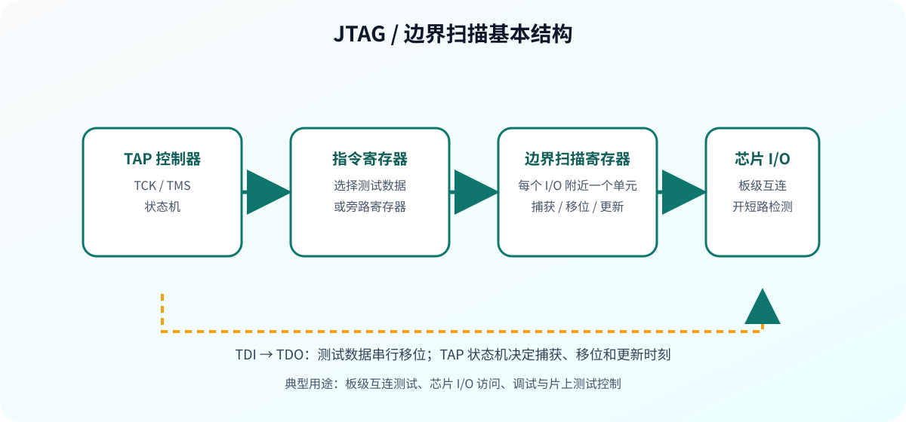

# DFT Compiler 基本使用方法

## 1. DFT 的目标

DFT Compiler 用于在数字设计中自动插入测试结构，最常见的形式是把普通触发器替换成扫描触发器，再将它们连接成扫描链。

DFT 的两个评价维度：

- **可控性**：测试输入能否把待测节点设置为目标值。
- **可观测性**：待测节点的故障效应能否传播到扫描输出或芯片输出。

## 2. 内部扫描与边界扫描

### 2.1 内部扫描

内部扫描把触发器从“只能由功能逻辑驱动”的状态元素，扩展为可以由扫描数据串行加载的测试元素。扫描移位阶段，测试数据逐拍进入；捕获阶段，组合逻辑在测试时钟作用下产生响应；随后响应被移出并与期望值比较。


### 2.2 边界扫描

边界扫描在芯片 I/O 附近放置扫描单元，通过 JTAG/TAP 接口控制捕获、移位和更新。它主要解决板级互连和 I/O 可访问性问题。



## 3. 扫描触发器

扫描触发器通常在功能数据 `D` 和扫描输入 `SI` 之间增加多路选择器：

```text
                Scan Enable
                    │
功能数据 D ───────┐  ▼
                  ├─ MUX ──> 触发器 D 端 ──> Q
扫描数据 SI ─────┘
```

基本行为：

| `Scan Enable` | 触发器采样来源 | 工作阶段 |
| --- | --- | --- |
| `0` | 功能数据 `D` | 正常功能 |
| `1` | 扫描输入 `SI` | 扫描移位 |

使用前提是目标工艺库提供合法的扫描触发器单元，并且该单元的时序、复位极性和库名已正确关联。

## 4. 全扫描与部分扫描

- **全扫描**：设计中的大多数或全部时序单元都加入扫描链，覆盖率和可诊断性较好，面积、功耗和测试时间成本较高。
- **部分扫描**：只选择关键触发器加入扫描链，开销较小，但可能降低可控性、可观测性和 ATPG 覆盖率。

工程上应根据覆盖率目标、面积预算、测试时间和功耗共同决定扫描策略。

## 5. 推荐的 DFT Compiler 流程

```text
读入 RTL/网表与工艺库
        ↓
建立设计、链接并施加时序约束
        ↓
定义扫描风格、时钟、复位和测试端口
        ↓
check_scan / DFT DRC
        ↓
compile -scan 或 insert_scan
        ↓
再次检查扫描结构和扫描路径
        ↓
估算覆盖率并输出扫描网表、测试协议
```

### 5.1 映射前插入

在综合映射阶段同时考虑扫描触发器，工具可以直接使用扫描单元完成优化和替换。优点是综合能考虑扫描结构；缺点是流程依赖更完整的扫描库和约束。

### 5.2 映射后插入

先得到功能网表，再进行扫描触发器替换和扫描链连接。优点是步骤清晰、便于对比功能网表；缺点是替换可能造成时序、面积和链路重新收敛。

## 6. 最小可运行脚本模板

```tcl
set WORK_DIR ./dft_work
set target_library {your_scan_library.db}
set link_library "* $target_library"

read_verilog ./rtl/counter.v
current_design counter
link

create_clock -name clk -period 10 -waveform {0 5} [get_ports clk]
set_clock_uncertainty -setup 0.1 [get_clocks clk]
set_clock_uncertainty -hold  0.1 [get_clocks clk]

set test_default_scan_style multiplexed_flip_flop
set test_default_period 100
set test_default_strobe 90
set test_default_delay 0

check_scan
compile -scan
insert_scan
check_scan
report_test -scan_path
estimate_test_coverage

write -format verilog -hier -output $WORK_DIR/counter_scan.v
write_test_protocol -format stil -output $WORK_DIR/counter_scan.stil
```

## 7. 输出物与验收

- 扫描网表：确认扫描单元已替换且层次完整。
- 扫描路径报告：确认链数、链长、起点、终点和时钟域正确。
- DFT DRC 报告：每个违规都有修复或豁免理由。
- 测试协议：包含端口、时钟、复位、测试模式和波形定义。
- 覆盖率报告：记录故障模型、可检测率、不可检测原因和测试向量数量。

