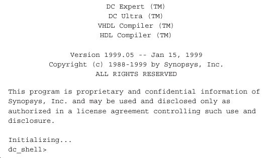
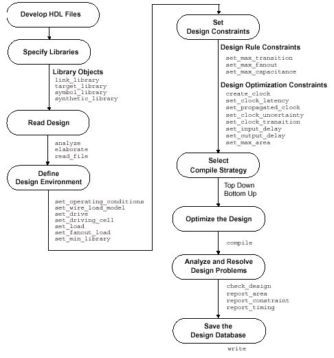
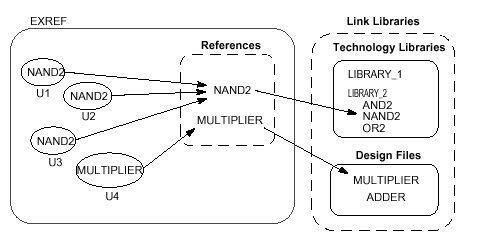

# 常用 Synopsys DC 命令详解

> [!note] 使用建议
> 命令参数会随工具版本、许可和工艺库而变化。本文保留完整的命令知识点与说明；在工程中执行前，请使用 `man`、`help` 或 `-help` 核对当前版本语法。

## 基础概念与常见问题

### 1.1 什么是 DC?

DC(Design Compiler) 是 Synopsys 的 logical synthesis 优化工具 ， 它根据 design
description 和 constraints 自动综合出一个优化了的门级电路。它可以接受多种输入格式，如
硬件描述语言、原理图和 netlist 等，并产生多种性能报告，在缩短设计时间的同时提高读者
设计性能。

### 1.2 DC 能接受多少种输入格式?

支持.db, .v, .vhd , edif, .vgh 等等，以及.lib 等相关格式。

### 1.3 DC 提供多少种输出格式?

提供.db, .v, .vhd, edif, .vgh 等，并可以输出 sdc, .sdf 等相关格式文件。

### 1.4 DC 的主要功能或者主要作用是什么?

DC 是把 HDL 描述的电路综合为跟工艺相关的门级电路。并且根据用户的设计要求，
在 timing 和 area，timing 和 power 上取得最佳的效果。在 floorplanning 和 placement 和插入
时钟树后返回 DC 进行时序验证

### 1.5 如何寻找帮助?

帮助可以用 3 种求助方式：
1. 使用 SOLD，到文档中寻求答案
2. 在命令行中用 man+ DC 命令
3. 在命令行中用 info+ DC 命令

### 1.6 如何找到 SOLD 文档?

SOLD 文档可以在 terminal 中输入 sold&执行。
    $> sold&
或者用命令 which dc_shell 找到 dc 的安装目录。找到 online 目录。

### 1.7 如何配置 DC?

综合设置提供必要的参数给 DC，使工具能够知道进行综合时所需要的必要的信息，即
重要参数：工艺库、目标库、符号库等。要在 `.synopsys_dc.setup` 中设置这些参数。
而.synopsys_dc.setup 要在三个目录下有说明，一个是 synopsys 的安装目录，一个是用户文
件夹，最后一个是工程目录。由后一个设置覆盖前一个文件。
参数包括：search_path, target_library, link_library, symbol_library

### 1.8 target_library 是指什么?

target_library 是在 synthesis 的 map 时需要的实际的工艺库

### 1.9 link_library 如何指定?

链接时需要的库，通常与 library 相同，设置时，需要加“*”，表示内存中的所有库。

### 1.10 search_path 的设置?

该参数指定库的存储位置

### 1.11 DA 和 DC 有什么区别?

DA 是 Design Analyzer 的简称, 它调用 dc 来进行综合. 但是它是图形化的. 可以看逻辑
电路图,当然需要你的库有 symbol 库.

### 1.12 为什么要使用 DA 而不用 shell 接口?

DA 适合查看原理图、层次和对象属性；shell 接口适合批量执行脚本、保存日志和自动化运行。两者使用同一设计数据库，可按调试或批处理需求选择。

### 1.13 SOLD 是什么?

SOLD 是 Synopsys OnLine Document 的简称, 基本包括了 synopsys 公司的所有工具的
文档集合.

### 1.14. translation 这一步是用什么 DC 命令来实现的?

我们知道, DC 综合过程包括 3 个步骤: translation + logic optimization + mapping
translation 对应命令为 `read_verilog`、`read_vhdl` 等读取命令。
logic optimization 和 mapping 对应于 compile

### 1.15. 逻辑优化和工艺实现（logic optimization + mapping）又是用什么 DC 命令来实现的?

逻辑优化和工艺实现均在 compile 命令完成，但是可以指定使用特殊的优化方法：structural
和 flatten

### 1.16. 什么是 DC script?

DC script 是一组 dc 命令的集合. 使得综合可以流程化也易于管理.

### 1.17. 基于路径的综合的意思是什么?

路径（path），是 DC 中的一个重要概念。它包括 4 种路径方式：
a. input 到 FF 的 data 口；
b. FF 的 clk 到另一个 FF 的 D 口；
c. FF 的 clk 到输出端口 DICDER
d. input 到 output
基于路径的综合就是对这四种路径进行加约束，综合电路以满足这些约束条件。

### 1.18 DC 中的各类参数的单位是如何确定的呢?

参数的单位由所使用库文件决定，在读入库之后，可以用 report_lib 去看库的信息，里
边有详细的单位说明

### 1.19 DC 中的对象有哪些?

设计变量：一共有八种：Design, cell, reference, port, pin, net, clock, library。其中 cell 是
子设计的例化，reference 是多个子设计例化的通称，port 是 design 的输入输出，pin 是 cell
的输入输出。

### 1.20 什么叫 start point 和 end point?

这两个概念是 DC 中 path 概念的起始点和终点。
起始点可以是 input 和 FF 的 clk
终点可以是 FF 的 data 和 output。

### 1.21 如何寻找想约束的对象?

一个是全部查找包括：all_inputs , all_outputs, all_clocks, all_registers。一个是根据关键
词进行查找：find_ports()，find(port,’ ‘)。

### 1.22 什么叫一个设计(design) ?

设计是 DC 中的重要对象，你所要综合的东西就叫 design，确切或者说你所要综合模块
的 top 文件。

### 1.23 什么叫 cell ?

在 design 中，instance 的子设计，称为 cell。

### 1.24 reference 是指什么? 和 cell 有什么区别?

当存在一个模块被多次例化，那么该模块就称为 reference

### 1.25 如何读入一个 design?

使用 analyze + elaborate 或者 read_verilog, read_vhdl, read_file 命令。

### 1.26 analyze+ elaborate 和 read 命令有什么区别?

read_file 是可以读取任何 SYNOPSYS 支持格式的；analyze 和 eloborate 只支持 verilog
和 VHDL 两个格式，但是他们支持在中间过程中加入参数而且以便以后可以加快读取过程。

### 1.27 如何处理多个引用的问题?

一个方法是使用 uniquify，就是把引用几次那么就在内存中换名引入多个子设计，适用
于不同时序约束要求；也可以用 dont_touch 命令，先对多个引用的设计进行编译之后，设置
为 dont_touch，适用于基本相同的环境要求；还有一种就是把两个引用进行 flatten，之后进
行综合。

### 1.28 link 的作用是什么?

确定所有文件是否均存在并把它们链接到当前设计。

### 1.29 环境设置是指什么?

是指芯片物理上的参数，比如电压，温度等。

### 1.30 如何设置线载模型?

使用 set_wire_model 命令

### 1.31 如何得知线载模型的种类?

读取库文件到 DC 中，使用 report_lib 看有多少可用的线载模型

### 1.32 如何设置工作环境变量?

使用 set_operating_conditions

### 1.33 工作环境变量的类别可以分为哪几类?

一般可以分为最坏（worst case),典型(typical),最佳（best case)。

### 1.34 为什么要设置工作环境变量?

由于我们要做的是一颗要在实际环境中正常工作的芯片，而在不同的温度和环境下的电
路的性能有很大影响，因此为了近可能地模拟芯片工作，设置合适的工作环境信息是非常必
要的。

### 1.35 read 和 analyze + ealborate 做了哪些工作?

语法检查，建立 GETECH 库。值得注意的是，read 命令不自动执行 link 操作。

### 1.36 getech 库是做何用途的?

GETCH 库是由软宏（soft macros）组成的，是加法器，乘法器之类的东西，这些组件都
是在 DW 里引用的。

### 1.37 调用 getech 库中的加法器之后,如何去自己选择一个设计者需要的加法器?

暂时没有答案

### 1.38 调用了加法器之后在优化阶段还能够掉换不同的加法器么?

暂时没有答案

### 1.39 如何检查 script 文件中有何错误呢?

dc_shell -tcl -f

### 1.40 如果在 dc_shell 启动后, 想修改库,怎么办?

暂时没有答案

### 1.41 如何在 dc_shell 环境下执行 UNIX 命令?

### 1.42 优化分为几个层次？

一个是基于 HDL 的结构优化转化为 GETCH 结构；基于 GTECH 的逻辑优化，包括架构
（strcuture），打平（flatten），转化为优化过的 GETCH；基于 GETCH 的门级优化，主要作
用是工艺实现到实际的工艺库中。

### 1.43 什么是约束？

约束分为 design constraint 和 optimization constraint。design constraint 不由用户确定，已
经由所采用的库确定了，用户只能添加进一步的约束。optimization constraint 分为两个方面，
timing constraint 和 area constraint。timing constraint 又可分为组合电路的约束，时序电路的
约束以及输入输出的约束。

### 1.44 DC Script 支持 TCL 么？

dcsh 和 dc-tcl。前者是 SYNOPSYS 的内部语言，后者是 TOOL COMMAND language（TCL）。

### 1.45 综合时不想使用某些库单元进行 mapping，怎么办？

使用 set_dont_use 命令

## 约束与编译策略

### 2.1 约束一个设计分为几个方面?

总的分为，面积约束和时序约束。

### 2.2 面积约束的命令是什么？

set_max_area

### 2.3 如何对时钟进行约束？

对时钟进行约束是对时钟的周期，波形进行描述。
使用 create_clock 建立时钟约束

### 2.4 如何对 pll 进行约束？

如果存在 PLL，那么首先对输入的初始时钟用 create_clock 进行约束。
再用 create_propagated_clock 对 PLL 输出时钟在基于输入时钟进行约束。

### 2.5 什么叫虚拟时钟约束？

虚拟时钟是指在当前要综合的模块中不存在的物理时钟。比如，设计外的 DFF 的时钟。
建立这样的时钟有益于描述异步电路间的约束关系。

### 2.6 DC 可以对时钟的哪些特性进行约束？

DC 支持对时钟的周期，波形，jitter，skew，latency 描述

### 2.7 如何约束时钟的 jitter？

使用 set_clock_uncertainty -setup(-hold) 约束时钟的 jitter

### 2.8 如何约束时钟的 skew？

使用 set_clock_uncertainty 约束时钟网络的 skew

### 2.9 如何约束时钟的 latency？

使用 set_clock_latency -option ，option is source or network，the default is network。

### 2.10 如何对当前设计的端口外部条件进行约束？

端口的外部条件包括输入驱动大小，输出电容的大小，扇出大小。

### 2.11 输入端口被多大的驱动所驱动？

可以使用 set_dirive 和 set_driving_cell

### 2.12 输出端口要驱动多大的电容？

使用 set_load 对输出电容值进行约束，单位根据工艺库的 define 所定。

### 2.13 DC 是基于 path 的综合，那么在约束时如何体现？

我们知道，基于 path 会有四种路径形式，DC 中提供
create_clock 定义寄存器和寄存器之间的路径；
set_input_delay 定义输入与寄存器之间的路径；
set_output_delay 定义寄存器与输出之间的路径；
set_max_delay 和 set_min_delay 定义输入和输出的组合路径；

### 2.14 set_input_delay 的目的是什么？

定义输入延时，来约束设计中输入逻辑的时序

### 2.15 set_output_delay 的目的是什么？

定义输出延时，来约束设计中的输出逻辑的时序

### 2.16 如何对组合电路进行约束？

组合电路有 set_max_delay 和 set_min_delay 进行约束

### 2.17 如何对电路的速度进行约束？

采用对电路时钟周期的约束的方式来约束电路的速度，使用 create_clock

### 2.18 当一个组合电路超过了时钟周期约束，那么该如何处理？

如果必须要满足时钟周期约束，那必须修改设计，如果不必要严格要求，那么可以
set_false_path 可以躲过 path check。

### 2.19 当出现环路电路时，如何约束电路？

对某一路径使用 set_false_path

### 2.20 如何加强设计规则的约束？

DRC 是电路必须满足的设计规则，使用
set_max_capcitance
set_max_fanout
set_max_tansition

### 2.21 在添加了 4 种路径约束后，如何为某些路径移除约束呢？

使用 set_flase_path 使得某些路径不进行 timing check

### 2.22 对于某些路径需要在固定的几个周期内完成，如何对这些路径进行约束？

使用 set_multicycle_path 对路径进行约束

### 2.23 在添加这些特殊的路径约束，如何恢复原来通用的时序约束？

使用 reset_path

### 2.24 如何对三态门进行约束？

由于综合时，默认三态门是 enable 的，所以对某些路径要设置 set_false_path

### 2.25 如何对门控时钟进行约束，以保证功能正常？

对门控时钟电路进行 setup 和 hold 检查，使用 set_gating_clock_check

### 2.26 设置对某些网络比如时钟或者复位不进行添加 buffer 等操作，应该怎么约束？

使用 set_dont_touch_network
### 2.27 如何修正 hold 时间冲突？

加入 set_fix_hold 约束

/************ Part 3 Compile stategy ******************/
### 3.1 综合时，有多少选择综合策略呢？

可以使用 top-down 和 bottom-top。

### 3.2 top-down 方式有何优点？

仅需提供单一 TOP 的 script
将设计作为一个整体，可得到较好的结果

### 3.3 bottom-up 方式有什么优点？

对多时钟的综合更为适合
每个子模块都有自己的 script，便于管理
当一个模块改变时，不用重新综合所有设计

### 3.4 如何进行 time-budge？

使用 characteristic

### 3.5 top-down 方式有何缺点？

编译时间长
子模块改变则整个设计都要重新综合
对多时钟设计综合效果不好
### 3.6 bottom-up 方式有什么缺点？

需要维护多个 script

### 3.7 编译时的 -incremental 是什么意思？

设计工艺实现为门之后，时序和面积约束可以再定义，incremental 确保维持以前的电路结构，
只作改善时序和性能，不添加不必要的逻辑。
### 3.8 ...

/******* Part 4 Analyze the report ******************/
### 4.1 如何看面积报告?

report_area

### 4.2 如何看时序报告?

report_timing

### 4.3 想对单独的单元看面积报告, 用什么命令?

report_cell 但是缺省的 report_cell 只能看 current_design 下面的一级的 cell 的面积.因此
就有两种方法解决这个问题:
1. 用 report_cell [get_cells -hier *]可以看所有的 cells 面积
2. 用 list_design 列出所有的 design, 然后改变 current_design 到你所想要看的那一级的
cell, 然后直接用 report_cell.

### 4.4 如何看设计环境和线载模型?

report_design

### 4.5 若设计规则和时序违反约束，如何查看？

使用 report_constraint -all_violators

### 4.6 如何查看连线的扇入，扇出，电容，电容和跳变时间？

使用 report_net
### 4.6 如何看整个综合后的网表中使用多少种类型的电路门？

使用 report_hierarchy

### 4.7 如何查看 timing exception 的时序约束？

使用 report_timing_requirements

第二章 Design Compiler 概述
Design Compiler 是 Synopsys 综合软件的核心产品。它提供约束驱动时序最优化，并支
持众多的设计类型，把设计者的 HDL 描述综合成与工艺相关的门级设计；它能够从速度、
面积和功耗等方面来优化组合电路和时序电路设计，并支持平直或层次化设计。

第一节 Design Compiler 入门

### 2-1-1 基本的综合流程

> 图 2.1 中显示了一个简化的综合流程：

> 图 2.1 基本综合流程

Design Compiler 按照所有标准 EDA 格式读写文件，包括 Synopsys 内部数据库（.db）
和方程式（.eqn）格式。除此之外，Design Compiler 还提供与第三方 EDA 工具的链接，比
如布局布线工具。这些链接使得 Design Compiler 和其他工具实现了信息共享。

## Design Compiler 综合操作

### 2-1-2 Design Compiler 的功能

利用 Design Compiler，设计者可以：
 利用用户指定的门阵列、FPGA 或标准单元库，生成高速、面积优化的 ASIC；
 能够在不同工艺技术之间转换设计；
 探索设计的权衡，包括延时、面积和在不同电容、温度、电压情况的功耗等设计约
束条件；
 优化有限状态机的综合，包括状态的自动分配和状态的优化；
 当第三方环境仍支持延时信息和布局布线约束时，可将输入网表和输出网表或电路
图整合在一起输入至第三方环境；
 自动生成和分割层次化电路图

### 2-1-3 支持的文件格式

> 表 2.1 列出了 Design Compiler 所支持的所有的输入输出的设计文件格式：

> 表 2.1 支持的文件格式

数据格式
Netlist EDIF
LSI Logic Corporation netlist format (LSI)
Mentor Intermediate Format (MIF)
Programmable logic array (PLA)
Synopsys equation
Synopsys state table
Synopsys database format (.db)
Tegas Design Language (TDL)
Verilog
VHDL
Timing Standard Delay Format (SDF)
Command Script dcsh, Tcl
Cell Clustering Physical Design Exchange Format (PDEF)
Library Synopsys library source (.lib)
Synopsys database format (.db)
Parasitics dc_shell command scripts

### 2-1-4 设计类型、输入格式和输出格式

设计类型：设计可以是分层的或平直的，时序的或组合的；
输入格式：支持 VHDL 和 Verilog 作为设计描述的输入格式，也支持开编程逻辑阵列
（PLA）和 EDIF 200 格式；
输出格式：除了 Synopsys 二进制格式（.db），还支持 VHDL、Verilog、EDIF 200、方程
式、大规模集成（large-scale integration）、Mentor 图形、PLA、状态表和 Tegas 格式。

### 2-1-5 用户界面

Design Compiler 提供了两种用户界面：
1.命令行界面，称为 dc_shell。该界面同时支持 dsch 和 Tcl。
2.图形用户界面（GUI），称为 Design Analyzer。

#### 2-1-5-1 选择用户界面

你可以选择其中任意一个界面来执行电路的优化工作。如果你愿意，你可以同时使用
两种界面，根据任务的要求在不同的界面间移动。
Design Analyzer 比 dc_shell 更适用于调试阶段。你也可以利用它在综合前后观察电路图。
在其他方面，dc_shell 功能更强、使用更容易。
在学习使用 Design Compiler 时 ， 设计工程师首先使用图形用户界面 ― ― Design
Analyzer。当他们对系统更为熟悉后，设计工程师通常使用 dc_shell 命令和脚本。为了能够
完全利用 Design Compiler 的速度和能力，设计工程师通常需要制定能够同时利用 Design
Compiler 和 dc_shell 的策略。
举个例子，一个设计工程师编写的脚本文件可以在 dc_shell 命令行或者 Design Compiler
命令行窗口执行。工程师可能编写脚本文件，然后在 dc_shll 中重复运行，每一次循环修改
参数值来优化设计。为了显示电路图和生成报告，设计工程师可以定时的从 GUI 窗口而不
是命令行来运行脚本。

#### 2-1-5-2 Design Analyzer 图形界面

Design Analyzer 为绝大多数的命令提供了菜单式界面。然而，有一些 dc_shell 命令并没
有在 Design Analyzer 菜单中提供；你可以在 Design Analyzer 的命令窗口输入这些命令。

#### 2-1-5-3 dc_shell 命令行界面

基于 dc_shell 的命令行界面允许你输入命令去执行电路优化的任务。命令由命令名称、
变量和变量值组成。

第二节 Design Compiler 要素

### 2-2-1 高层设计流程

在一个基本的高层设计流程中，Dseign Compiler 用于设计开发阶段和最后的设计实现
阶段。在开发阶段，利用 Dseign Compiler 进行初步的或默认的综合；在实现阶段，利用 Dseign
Compiler 的全部能力去综合设计。
> 图 2.2 显示了高层设计流程。图中阴影区域标明了在设计流程中何处会进行 Dseign

Compiler 的综合。

> 图 2.2 基本的高层设计流程

根据图 2.2 所示的流程，执行下列步骤：
1.首先，用 HDL 语言描述你的设计；注意采用好的编码习惯以便能更好地运用 Design
Compiler 的综合能力；
2.同时执行设计开发和功能仿真；
a． 在设计开发时，利用 Design Compiler 实现特殊的设计目标（设计规则和优化约束），
执行初步的、默认的综合（只利用 Design Compiler 的默认选项）；
b． 如果设计开发时，有 15％的时序目标未能达到，就得修改你的设计目标和约束，或
者改进你的 HDL 代码；然后重复设计开发和功能仿真步骤；
c． 设计仿真是选择一个合适的仿真工具来验证设计是否实现预期的功能；
d． 如果设计没有实现预期的功能，你必须修改 HDL 代码，然后重复执行设计开发和
设计仿真步骤；
e． 持续的进行设计开发和设计仿真，直到设计能够实现预期的功能，并且时序目标误
差控制在 15％以内；
3.利用 Design Compiler 的全部功能执行设计实现综合，以实现设计目标；在综合生成门级
网表之后，验证设计是否能够实现你的目标；如果设计并没有符合你的目标，生成并分析各
种报告来决定采用何种技术来改正这些问题。
4.当设计符合了功能、时序以及其他设计指标，物理设计可以由自己完成或者用到半导体生

产厂家去完成。利用反标回去的数据对物理设计进行分析，如果结果没有实现目标，还得回
到步骤 3；如果结果实现了目标，你就完成了整个设计循环。

### 2-2-2 运行 Design Compiler

#### 2-2-2-1 利用配置文件

当你启动 Design Compiler 时，它就自动地执行三个配置文件。这些文件都有相同的文
件名：.synopsys_dc.setup，但它们在不同的目录下。文件中包含命令，实现参数和变量的初
始化、声明设计库等等。你可以在.synopsys_dc.setup 文件中用 set_unix_variable 定义系统环
境变量。
按下列次序，Design Compiler 从三个目录中读取三个.synopsys_dc.setup 文件：
1. Synopsys 根目录
这个文件包含 Synopsys 定义的系统变量和一般的 Design Compiler 配置
信息。它影响所有的 Design Compiler 用户。只有系统管理员才能修改这个文件。
2. 你的主目录
这是用户定义的配置文件。文件中的变量说明了你对 Design Compiler 工
作环境的参数选择。该文件中定义的参数将覆盖上面文件里的参数。
3. 当前工作目录
这个文件包含对特殊设计的变量的设置，最后被读入。该文件中的参数将
覆盖上述两个文件中相关的参数。包括链接库、符号库、目标库和综合库，以及其他参数。
下面给出一个.synopsys_dc.setup 的实例：
include -e synopsys_root + "/admin/setup/budget.setup.e"
search_path=" . "
search_path=search_path + " /export/home1/zhou/6502 "
search_path=search_path + " /export/home1/zhou/6502 "
link_library = "typical.db";
target_library = "typical.db";
symbol_library = "tsmc18.sdb";
……

#### 2-2-2-2 运行 Design Compiler

(1)以 dcsh 模式调用 dc_shell，在系统提示符后输入 dc_shell 命令：
    % dc_shell
系统提示符将变为：
    % dc_shell>
你还可以在命令行中包含许多的选项，比如：－checkout 来访问额外的许可；－f 来执
行脚本文件；－x 来包括一个启动时执行的 dc_shell 命令；还有其他的可选项。
启动时，dc_shell 将完成下面的工作：
1. 生成一个命令日志文件；
2. 读入和执行.synopsys_dc.setup 文件；
3. 在命令行格式，分别根据-x 和-f 选项，执行任何脚本文件和指定的命令；
4. 在你调用 Design Compiler 的窗口里，显示程序标题和 dc_shell 提示符。
> 图 2-3 显示了一个程序标题和默认提示符的例子：

> 图 2-3 程序标题和默认提示符

(2)运行 Design Analyzer，在系统提示符后输入 Design Analyzer:
    % Design Analyzer

#### 2-2-2-3 退出 Design Compiler

你可以在任何时候退出 Design Compiler 回到操作系统。
为退出 Design Compiler，执行下列操作之一：
 输入 quit;
 输入 exit;
 如果你是交互式方式运行 Design Compiler 并且工具正在工作，按 Control-d。
当你退出 dc_shell 时，将会显示类似于下列的文字（反映了应用内存和 CPU
的真实情况）：
Memory usage for this session 1373 Kbytes.
CPU usage for this session 4 seconds.
Thank you ...

#### 2-2-2-4 利用脚本文件

通过在文本文件里设置一系列的 dc_shell 命令创建命令脚本文件。任何一个 dc_shell 命
令都能够在脚本文件里执行。
在 dcsh 模式里，注释包含在/*和*/之间，例如：
/* This is a comment */
为执行脚本文件，在 dcsh 模式里，执行 include 命令。当脚本完成处理，如果运行正确
将返回值 1，如果运行失败将返回值 0。

### 2-2-3 基本综合流程

> 图 2-4 显示了基本的综合流程。你可以将其应用于先期提到的高层设计流程中的设计开

发和设计实现阶段。图中所列的基本 dc_shell 命令一般应用于基本流程的每一步。比如，诸

如 analyze,elaborate,和 read_file 用于将设计文件读入内存。图中所示的命令都包含选项，但
未在图中标明。
在选择编译策略时，Top Down and Bottom Up 并不是命令。它们指的是两种一般的旧有
的编译策略，利用不同的命令组合。
下面简单论述组成基本综合流程的每一个步骤。

> 图 2-4 基本综合流程

该基本综合流程包含下列步骤：
(1) 发展 HDL 文件
输入 Design Compiler 的设计文件通常都是用诸如 VHDL 和 Verilog HDL 等
硬件描述语言编写。这些设计描述必须小心地编写以获得可能的最好的综合结果。在编写
HDL 代码时，你需要考虑设计数据的管理、设计划分和 HDL 编码风格。划分和编码风格直
接影响综合和优化过程。

虽然流程中包含该步骤，但实际上它并不是 Design Compiler 的一个步骤。你不能用
Design Compiler 工具来编写 HDL 文件。
(2) 指定库
通过link_,target_,symbol_,和synthetic_library命令为Design Compiler指定链接库、对象库、
符合库和综合库。
链接库和对象库是工艺库，详细说明了半导体厂家提供的单元和相关信息，象单元名称、
单元管脚名称、管脚电容、延迟、设计规则和操作环境等。
符号库定义了设计电路图所调用的符号。如果你想应用Design Analyzer图形用户界面，
就需要这个库。
另外，你必须通过synthetic_library命令来指定任何一种特殊的有许可的设计工具库（你
不需要指定标准设计工具库）。
(3) 读入设计
Design Compiler 使用 HDL Compiler 将 RTL 级设计和门级网表作为设计输
入文件读入。通过 analyze 和 elaborate 命令读入 RTL 级设计，通过 read_file 或 read 命令读
入门级网表。Design Compiler 支持所有主要的门级网表格式。
如果你用 read_file 或 read 命令读入 RTL 设计，等于实现了组合 3analyze 和 elaborate 命令的
功能。
(4) 定义设计环境
Design Compiler 要求设计者模拟出待综合设计的环境。这个模型由外部
的操作环境（制造流程、温度和电压） 、电容、驱动、扇出、连线估算模型等组成。它直接影
响到设计综合和优化的结果。利用图 2-4 中该步骤下所列的一系列命令来定义设计环境。
(5) 设置设计约束
Design Compiler 利用设计规则和最优化约束来控制设计的综合。厂家工
艺库提供设计规则以保证产品符合规格、工作正常。典型的设计规则约束转换时间
（set_max_transition）、扇出条件（set_max_fanout）和电容（set_max_capacitance）。这些规
则指定了要求的工艺，你不能违反。当然，你可以设置更严格的约束。
最优化约束则定义了时序（时钟、时钟错位、输入延时和输出延时）和面积（最大面积）
等设计目标。在最优化过程中，Design Compiler 试图去满足这些目标，但不会去违反任何
设计规则。利用图 2-4 中该步骤下所列的一系列命令来定义这些约束。为能够正确地优化设
计，必须设置更接近现实情况的约束。
你选择的编译策略将影响设计约束的设置。流程中的步骤 5 和步骤 6 是相互依赖的。
(6) 选择编译策略
你可以用来优化层次化设计的两种基本编译策略被称为自顶向下和从下上。
在自顶向下的策略里，顶层设计和它的子设计一起进行编译。所有的环境和约束设置都
根据顶层设计来定义。因此，它会自动的考虑内部模块的依赖性。但对于大型设计，这种方
法并不实用，因为所有的设计必须同时贮存在内存里。
在从下到上的策略里，分别对子设计进行约束和编译。在成功编译后，这些设计都被赋
予一个 dont_touch 参数，防止在随后的编译过程中对它们进行进一步的改变。然后这些编译
过的子设计组合成更高层次的设计，再进行编译。编译过程一直持续到顶层设计被综合。由
于 Design Compiler 不需要同时将所有未编译的子设计装载进内存，这种方法允许你编译大
型设计。然而，在每一个阶段，你必须估计每个内部模块的约束，更有代表性的是，你必须
不停地编译、改进那些估计，直到所有的子设计界面都是稳定的。
每一个策略都有其优点和缺点，这取决于你设计的特殊性和设计目标。你可以选择任意
一个策略来进行整个设计，或者混合使用，对每一个子设计采用最合适的策略。

(7) 优化设计
利用 compiler 命令启动 Design Compiler 的综合和优化进程。有几个可选
的编译选项。特别的，map_effort 选项可以设置为 low、mediu 或 high。
初步编译，如果你想对设计面积和性能有一个快速的概念，将 map_effort 设置为 low；
默认编译，如果你在进行设计开发，将 map_effort 设置为 medium；当在进行最后设计实现
编译时，将 map_effort 设置为 high。通常设置 map_effort 为 medium。
(8) 分析和解决设计问题
通常 Design Compiler 根据设计综合和优化的结果生成众多的报告。你根
据诸如面积、约束和时序报告来分析和解决任何设计问题，或者改进综合结果。你可以用
check 命令来检查综合过的设计，也可用其他的 check_命令。
(9) 保存设计数据
利用 write 命令来保存综合过的设计。Design Compiler 在退出时并不自
动保存设计。
你也可以在一个脚本文件里保存那些综合过程中用过的设计参数和约束。脚本文件是用
来管理设计参数和约束的理想工具。

### 2-2-4 设计实例的脚本文件

下面这个例子是一个简单的脚本，执行了自顶向下的编译过程。脚本中包含注释，标明
流程中的每一个步骤。虽然，脚本中有一些命令选项和变量前面没有解释过，但从先期对基
本综合流程的讨论，你已经可以理解这个例子。在下面的章节中将会对这些命令有一个详细
的解释。
/* specify the libraries */ 指定库
target_library = my_lib.db
symbol_library = my_lib.sdb
link_library = "*" + target_library
/* read the design */ 读入设计文件
read -format verilog Adder16.v
/* define the design environment */ 设置设计环境
set_operating_conditions WCCOM
set_wire_load_model "10x10"
set_load 2.2 sout
set_load 1.5 cout
set_driving_cell -cell FD1 all_inputs()
set_drive 0 clk
/* set the optimization constraints */ 设计最优化约束
create_clock clk -period 10
set_input_delay -max 1.35 -clock clk {ain, bin}
set_input_delay -max 3.5 -clock clk cin
set_output_delay -max 2.4 -clock clk cout
set_max_area 0
/* map and optimize the design */ 工艺实现和优化
uniquify
compile
/* analyze and debug the design */ 分析和除错
report_constraint -all_violators

report_area
/* save the design database */ 保存设计数据
write -format db -hierarchy -output Adder16.db
你可以按下列方式之一执行这个脚本：
（1）进入 dc_shell，然后一行行地输入命令；
（2）进入 dc_shell，利用 include 命令执行脚本文件：
    dc_shell> include run.scr
（3）利用 dc_shell 的选项-f，在 UNIX 命令行执行脚本文件：
    % dc_shell -f run.scr

第三节库

这一部分主要介绍基本的库的信息。Design Compiler 利用工艺、符号和综合或设计工
具库来完成综合，并且显示图形化的综合结果。因此你必须知道如何执行一些简单的库命令，
以使 Design Compiler 能够正确地使用库里的数据。

### 2-3-1 库的要求

Design Compiler 使用三种库：
 工艺库（Technology Library）
 符号库（Symbol Library）
 设计工具库（DesignWare Library）

#### 2-3-1-1 工艺库

工艺库里包含半导体厂家提供的库里的每一个单元的特征和功能信息。工艺库由半导体
厂家提供和维护。
单元特征包含单元名称、管脚名称、面积、延迟和管脚电容等信息。工艺库里也定义了
对于一个功能设计必须符合的条件。这些条件称为设计规则约束。除了单元信息和设计规则
约束，工艺库还详细说明了对于特定工艺的操作环境和连线估算模型。
Design Compiler 要求工艺库的格式为.db。大多数情况，半导体厂家会提供给你.db 格式
的库。
Design Compiler 利用工艺库来实现下列目的：
1）实现设计功能
优化时，Design Compiler 工艺实现的工艺库称为目标库。目标库里包含生成网表所需的单
元和设计操作环境的定义。用来编译设计的目标库变为设计的局部链接库。Design Compiler
使用 local_link_library 属性来保存这些信息。
2）分解参考单元（resolving cell references）
Design Compiler 用来分解参考单元的工艺库称为链接库。除了工艺库，链接库也包含
设计文件。链接库包含工艺实现后网表中的单元描述。
链接库包括局部链接库(local_link_library attribute)和系统链接库(link_library variable)。
3）计算定时数值和路径延迟
链接库定义了延迟模型，用来计算定时数值和路径延迟。
4）计算功耗

#### 2-3-1-2 符号库

符号库定义了图形符号，用来表示设计电路图中的库单元。符号库由半导体厂家提供和
维护。

Design Compiler 用符号库来产生设计电路图，但必须用 Design Analyzer 查看设计电路
图。当生成电路图时，Design Compiler 将网表中的单元与符号库中的单元一一工艺实现。

#### 2-3-1-3 设计工具库

设计工具库是可重复使用的电路设计的自建模块，与Synopsys综合环境紧密结合。
Synopsys提供了许多实现内建HDL算子的设计工具元件。这些算子包括+、-、*、<、>、<=、
>=，通过if和case语句来说明这些算子。
用户自己可以利用设计工具开发器来开发额外的设计工具库，也可以从Synopsys或者第
三方获取。

### 2-3-2 指定库

使用dc_shell变量来指定Design Compiler使用的库。表2.2列出了库的变量名：
> 表2.2 库变量

库类型变量默认值扩展名
目标库 target_library {“your_library.db”} .db
链接库 link_library {“*”,“your_library.db”} .db
符号库 symbol_library {“your_library.sdb”} .sdb
设计工具库 synthetic_library {} .sldb

1)使用库的搜索路径
可以使用完全路径或只是文件名称来指定库的位置。Design Compiler利用search_path变
量中定义的搜索路径来查找库文件。默认情况下，搜索路径包括当前工作目录和
$SYNOPSYS/libraries/syn。Design Compiler从search_path变量定义的最左边的目录开始搜索
库文件，使用它找到的第一个匹配的库文件。
举例，假设你的工艺库叫my_lib.db，在lib目录和vhdl目录下。给定下列的搜索路径：
search_path = {lib vhdl} + search_path
Design Compiler利用lib目录中的my_lib.db文件，因为它首先找到lib目录。
你可以利用which命令来了解Design Compiler找到的库文件（按顺序） ：
    dc_shell> which my_lib.db
{"/usr/lib/my_lib.db", "/usr/vhdl/my_lib.db"}
2）指定工艺库
除了你正在执行工艺转换，否则对目标库和链接库指定相同的值。对于链接库，你也应
该指定星号（*） ，这说明Design Compiler同时在搜索内存中的设计。如果link_library变量没
有星号，那将不搜索内存中的设计。结果导致在链接过程中，可能找不到设计，使设计变得
不可分解。
在指定link_library变量的文件，认为Design Compiler从左到右搜索这些文件，当它找到
一个参考时停止搜索。在下面这个例子里，内存中的设计在lsi_10k库之前被搜索：
link_library = {"*" lsi_10k.db}
3）指定设计工具库
你无需指定标准的综合库（standard.sldb）,它实现了内建的HDL算子。软件自动使用这
个库。如果你要使用额外的设计工具库，你必须使用synthetic_library和link_library变量来指
定这些库。

### 2-3-3 库的装载

Design Compiler使用二进制的库（工艺库为.db格式、符号库为.sdb格式），在需要的时

候自动装载这些库。
如果你的库不是合适的二进制格式，使用read_lib命令来编译这些库原始资料。
想手动的装载一个二进制的库，使用read_file命令：
    dc_shell> read_file my_lib.db
    dc_shell> read_file my_lib.sdb

### 2-3-4 库的列表

Design Compiler根据库的名称来查询装载在内存中的库。库的原始资料中对库的陈述定
义了库的名称。
列出装载在内存中的库的名称，使用list_libs命令：
    dc_shell> list_libs
my_lib my_symbol_lib
1
列出路径和文件名称等信息，使用list -libraries命令：
    dc_shell> list -libraries
Library File Path
------- ---- ----
my_lib my_lib.db /synopsys/libraries
my_symbol_lib my_lib.sdb /synopsys/libraries

### 2-3-5 报告库的内容

使用report_lib命令来报告库中的内容。report_lib命令能够报告下列资料：库单位；操作
条件；连线估算模型和单元。

### 2-3-6 保存库

write_lib命令能够以Synopsys数据库、EDIF和VHDL格式来保存一个编译过的库。

第四节 working with designs in memory

Design Compiler从设计文件中把设计读入内存中。任何时候内存中都有许多设计。当一
个设计被读入后，你能够多次改变它，像分组和取消组等等。

### 2-4-1 术语

不同的公司使用不同的术语，这里主要介绍Synopsys综合工具使用的术语。
1）设计（Designs）
设计是对执行逻辑功能的电路的描述。设计以多种设计格式进行描述，像VHDL、Verilog
HDL、状态机和电子数据交换格式（Electronic Data Interchange Format，EDIF）。
逻辑级设计用一批布尔方程式来表示，门级设计，如网表，用互相连接的单元来表示。
设计可以相互独立的退出和编译，或者在一个更大的设计里用作子设计。设计可以是层
次化的或平直的。
2）层次化设计（Hierarchical Designs）
一个层次化的设计包含一个或更多的设计作为子设计。每一个子设计可以进一步包括子
设计，创造多级的设计层次。包含子设计的设计称为父设计（parent designs）。
3）平直设计（Flat Designs）

平直设计不包含子设计，只有一个结构级。它们只有一个库单元。
4）设计对象（Design Objects）
一个设计由单元、线、端口和管脚组成。它也可包含子设计和库单元。
Synopsys命令、参数和约束都是针对设计对象的。
> 图2.5显示了TOP设计中的设计对象：

> 图2.5 TOP设计中的设计对象

5）当前设计（Current Design）
正在进行工作的设计称为当前设计。大部分的命令都是针对当前设计的，也就是说，它
们根据当前设计的上下文来运转。
6）线（Nets）
连接端口到管脚和管脚和管脚之间的线。
7）端口（Ports）
设计的输入和输出。端口的方向指明为输入、输出和输入输出。
8）管脚（Pins）
设计里的输入和输出单元。子设计的端口是父设计里的管脚。

### 2-4-2 读入设计

Design Compiler提供了两种方式读入设计：
 read_file命令
    dc_shell> read_file -format keyword design_file
 analyze和elaborate命令
    dc_shell> analyze -format keyword design_file
    dc_shell> elaborate design_name
> 表2.3总结了使用read_file命令和analyze和elaborate命令读入设计的不同：

> 表2.3 read_file Versus analyze and elaborate Commands

Comparison read_file command analyze and elaborate commands
Input formats All formats VHDL, Verilog
When to use Netlists, precompiled designs, and so Synthesize VHDL or Verilog
forth
Design libraries Cannot store analyzed results except in Can store analyzed results in
design library WORK specified design libraries (use the
analyze command option -library or
-work)
Generics Cannot pass parameters (must use Allows you to set parameter values

directives in HDL) on
the elaborate command line
Architecture Cannot specify architecture to be Allows you to specify architecture
elaborated to be elaborated
当Design Compiler读入一个设计文件，它以Synopsys内部数据库格式保存在内存中。Design
Compiler的优化过程仅在内存中的设计文件进行工作。
为内存中的设计，Design Compiler使用命名的惯例：path_name / design.db。path_name
变量指的是原始文件所在的目录；design变量指的是设计的名称。如果你稍后读入相同名称
的设计，Design Compiler将覆盖原来的设计。为防止出现这种现象，在read_file命令后加上
-single_file选项。
#### 2-4-2-1 读入.db文件

一个.db文件的版本就是生成它的Design Compiler的版本。要读入一个.db文件，文件必
须与Design Compiler具有相同的版本，或版本早于正在运行的Design Compiler的版本。如果
你试图读入一个由版本稍后的Design Compiler产生的.db文件，那就会出现错误信息。
#### 2-4-2-2 读入HDL文件

利用下列的程序读入HDL设计：
 从下到上分析顶层设计和所有子设计（满足所有从属）
 详细描述顶层设计和任何一个需要对参数进行赋值或覆盖的子设计
1） 分析设计
analyze 命令：读入HDL源文件；检查是否有错；创建一个与HDL独立的中
间格式的HDL库对象；把中间文件存储到你所定义的位置。
如果analyze 命令报错，在HDL源文件里修改错误，然后重新分析。一旦一个设计被分
析，只有在它被改变过，才需要重新分析它。
2） 详细描述设计
elaborate命令根据分析后提供的中间文件创建一个与工艺无关的设计。在
详细描述过程中，你可以违反默认的参数值。elaborate用设计工具元件来取代HDL算术算子，
决定正确的总线宽度。

### 2-4-3 内存中的设计清单

利用list_designs命令来列出装载在内存中的设计的名称：
    dc_shell> list_designs
A (*) B C
1
紧靠设计A的星号（*）表示设计A是当前设计。
利用－show_file选项来列出与设计名称相对应的内存文件名称：
    dc_shell> list_designs -show_file
/user1/designs/design_A/A.db
A (*)
/home/designer/dc/B.db
BC
1
紧靠设计A的星号（*）表示设计A是正在工作的设计。文件B.db包含设计B和C。
利用list_duplicate_designs命令来检查重复的设计：
    dc_shell> list_duplicate_designs

Warning: Multiple designs in memory with the same design
name.
Design File Path
------ ---- ----
seq2 A.db /home/designer/dc
seq2 B.db /home/designer/dc
1

### 2-4-4 设置当前设计

current_design指向当前设计，按下列方式设置：
（1）read_file命令
当一个read_file命令成功完成，它将读入的设计设置为当前设计：
    dc_shell> read_file -format edif MY_DESIGN.edif
Loading edif file ’/designs/ex/MY_DESIGN.edif’
Current design is now ’/designs/ex/
MY_DESIGN.edif:MY_DESIGN’
{"MY_DESIGN"}
（2）current_design命令
利用这个命令可设置任何一个内存中的设计为当前设计：
    dc_shell> current_design ANY_DESIGN
Current design is ’ANY_DESIGN’.
{"ANY_DESIGN"}
显示当前设计的名称，输入：
    dc_shell> list current_design
current_design = "/usr/home/designs/
my_design.db:my_design"
1

### 2-4-5 设计的链接

要完成一个设计，它就必须与涉及到的库元件和设计链接。对于每一个子设计，必然有
一个基准，将子设计或元件与链接库相连。这个过程称为设计链接或基准分解。
Design Compiler执行下列步骤来完成基准分解：
（1）决定当前设计和它的层次引用哪些库元件和子设计；
（2）搜索链接库，查找这些引用；
（3）将设计与查找到的引用链接。
Design Compiler 首先搜索 local_link_library 参数定义的库和设计文件 ， 然后再搜索
link_library变量中定义的库和设计文件。
在一个分层的设计中，Design Compiler只考虑顶层设计的局部链接库，而忽略与子设计
相关的局部链接库。
Design Compiler使用第一找到的基准。如果它查找到了具有相同名称的额外的基准，将
会产生一个警告信息来识别这个忽视的、重复的基准。如果Design Compiler没有找到基准，
警告信息建议该基准不能被分解。

> 图2.6显示了在链接库、单元和基准之间的链接过程，在这个例子里，Design Compiler

在LIBRARY_2工艺库里找到了库元件NAND2；在设计文件里找到了子设计MULTIPLIER。
> 图2.6 分解基准

你可以手动地或自动地进行设计的链接。
（1）手动链接
用link命令来手动地链接设计。在开始链接过程前，link命令移走现有的链接。
（2）自动链接
下列的dc_shell命令自动链接设计：
• compile
• create_schematic
• group
• check_design
• report_timing, report_constraints, and other report_* commands
• compare_design
当执行自动链接时，它并不移走现有的链接。自动链接过程只工作于未链接的元件和子
设计。

### 2-4-6 设计对象的清单

Design Compiler提供命令访问不同的设计对象。这些命令涉及当前设计中的设计对象。
每一个命令执行下列操作之一：
（1） list:提供最小信息的清单
（2） display:提供包括设计对象属性的报告
（3） return：返回一个清单，可用作其他dc_shell命令的输入
> 表2.4列出了命令和它们的操作。

> 表2.4 Commands to Access Design Objects

Object Command Action
Instance list_instances Lists instances and their references.
report_cell Displays information about instances.
Reference report_reference Displays information about references.
Por t report_port Displays information about ports.
report_bus Displays information about bused ports.
all_inputs Returns all input ports.

all_outputs Returns all output ports.
Net report_net Displays information about nets.
report_bus Displays information about bused nets.
Clock report_clock all_clocks Displays information about clocks. Returns all clocks.
Register all_registers Returns all registers.

### 2-4-7 指定设计对象

你可以利用相对路径和绝对路径来指定设计对象。
1）使用相对路径
如果你使用相对路径来指定设计对象，它就必须在当前设计里。指定相对于当前实例的
路径。当前实例是指当前设计里基准的构架。默认情况是，当前实例是当前设计的最高层。
利用current_instance命令改变当前实例。
举个例子，在Count_16设计里U1和U15单元上设置dont_touch参数，可以输入：
    dc_shell> current_design Count_16
Current design is ’Count_16’.
{"Count_16"}
    dc_shell> set_dont_touch U1/U15
or
    dc_shell> current_design Count_16
Current design is ’Count_16’.
{"Count_16"}
    dc_shell> current_instance U1
Current instance is ’/Count_16/U1’.
"/Count_16/U1"
    dc_shell> set_dont_touch U15
2）使用绝对路径
当使用绝对路径来指定设计对象时，对象可以是内存中的任何设计。
语法如下：[ file :] design/object
举个例子，在Count_16设计里U1和U15单元上设置dont_touch参数，可以输入：
    dc_shell> set_dont_touch \
/usr/designs/Count_16.db:Count_16/U1/U5

### 2-4-8 创造设计

create_design命令创造了一个新的设计。内存文件名称为my_design.db，路径为当前工
作目录。
    dc_shell> create_design my_design
Creating design ’my_design’ in file ’my_design.db’.
1
    dc_shell> list_designs -show_file
/designs/A.db
A (*)
/designs/B.db
B
/usr/work/my_design.db
my_design

1
利用适当的create命令（如create_clock，create_cell，create_port）给新的设计增加设计
对象。

### 2-4-9 复制设计

copy_design命令复制内存中的一个设计，并重新命名。新设计与原设计具有相同路径
和内存文件。
    dc_shell> copy_design A A_NEW
Copying design ’A’ to ’A_NEW’
1
    dc_shell> list_designs -show_file
/designs/A.db
A A_NEW
/designs/B.db
B
1
你可以利用copy_design和change_link命令来手动创建唯一的实例。举个例子，假设一个
设计有两个相同的单元，U1和U2，都与COMP链接。输入下列命令来创建唯一的实例：
    dc_shell> copy_design COMP COMP1
Performing copy_design on design ’COMP’.
Copying design ’COMP’ to ’COMP1’
1
    dc_shell> change_link U1 COMP1
Performing change_link on cell ’U1’.
1
    dc_shell> copy_design COMP COMP2
Performing copy_design on design ’COMP’.
Copying design ’COMP’ to ’COMP2’
1
    dc_shell> change_link U2 COMP2
Performing change_link on cell ’U2’.
1

### 2-4-10 重命名设计

rename_design命令对内存中的设计重新命名。
    dc_shell> list_designs -show_file
/designs/X.db
AB
1
    dc_shell> rename_design A A_NEW
Moving design ’A’ to ’A_NEW’
1
    dc_shell> list_designs -show_file
/designs/X.db
A_NEW B

1
注意：重新命名设计可能导致产生链接过程中无法分解的基准。

2-4-11改变设计层次

如果可能，在你的HDL描述反映设计划分。如果你的HDL代码已经编写好，Design
Compiler允许你改变设计层次而不要修改HDL描述。
命令report_hierarchy用来显示设计层次。在做改变和验证层次改变前，利用该命令来了
解当前设计层次。Design Compiler提供下列的层次操作能力：
• 增加层次的级数
• 移走层次
• 从不同的子设计合并单元
#### 2-4-11-1 增加层次级数

增加一级层次称为分组。通过将单元或相关元件分组进子设计，可以创建
一级层次。
1）单元分组形成子设计
命令group将设计中的单元（实例）分组进一个新的子设计，创建了一个新的层次。一
个新的单元取代成组的单元。
新的子设计的端口以设计中与它们相连的线命名。新的子设计的每一个端口的方向由相
应的线的管脚决定。
为利用group命令创建一个新的子设计，在命令行中指定下列的变量和选项：
 象命令行变量，指定新的子设计中包括的单元。所有的单元都必须是当前
实例的孩子。你可以用-except选项从指定列表中排除单元。
 利用-design_name选项指定新的子设计的名称
 利用-cell_name选项指定新的实例名称。如果你没有指定实例名称，Design
Compiler会为你创建一个。创建的实例名称格式为Un，此处n是指未用的单元数目。
举个例子，三个单元分组形成名为sample一个新的子设计，输入：
    dc_shell> group {cell1, cell2, cell3} -design_name sample
2）相关元件分组形成子设计
你也可以利用group命令（但带不同的选项）来分组相关元件，形成子设计。
为分组相关元件，
 利用表2.5中所示的选项之一，指定元件类型。
> 表2.5 Component Grouping Options

Component Options
Bused gates -hdl_bussed
Combinational logic -logic
Finite state machines -fsm
HDL blocks -hdl_all_blocks
-hdl_block block_name
PLA specifications -pla
 利用-design_name选项指定新的子设计的名称
 利用-cell_name选项指定新的实例名称（可选）。如果你没有指定实例名
称，Design Compiler会为你创建一个。创建的实例名称格式为Un，此处n是指未用的单元数
目。

#### 2-4-11-2 移走层次

移走层次称为取消组。取消组移走指定子设计的层次，将子设计与周围的逻辑合并。
有两种方法对设计取消分组：
 利用ungroup命令直接取消设计的分组；
 优化时利用set_ungroup命令或者在运行compiler命令时，利用-ungroup_all选项。
赋予dont_touch属性的设计不能被取消组。
1）直接取消设计分组
命令ungroup直接取消一个或多个设计的分组。
为取消设计的分组，
 象命令行变量，指定取消分组的单元。所有的单元都必须是当前实例的孩
子。为取消当前实例所有子层次的分组，指定-all选项取代提供一个单元列表。默认情况下，
ungroup命令只取消每一个单元的一个层次。指定-flatten选项，实现每一个单元的取消分组
的循环，直到移走所有的层次。
 为取消分组的单元指定前缀（可选的）。如果你不指定前缀，Design Compiler
使用old_cell_name/前缀。如果你用了-flatten选项，就无需指定前缀。如果指定的或默认的前
缀没有创建一个独一无二的名称，Design Compiler将在单元名称后加一个数字使其成为独一
无二的。
举个例子，想对几个单元取消组，输入：
    dc_shell> ungroup {high_decoder_cell, low_decoder_cell}
创建一个新的单元，取消单元U1的组并指定前缀，输入：
    dc_shell> ungroup U1 -prefix "U1_"
为完全地展平当前设计，输入：
    dc_shell> ungroup -all -flatten
2）优化时取消设计分组
优化时要取消所有设计层次，在运行compiler命令时选择-ungroup_all选项：
    dc_shell> compile -ungroup_all
为取消指定单元或设计的分组，在运行compiler命令前使用set_ungroup命令。如果你对
某一单元设置了ungroup参数，那在优化时Design Compiler就取消该单元的组。如果你对某
一设计设置了ungroup参数，那优化时Design Compiler就取消设计中所有引用的单元的组。
举个例子，在优化时取消单元U1的组，输入下列命令：
    dc_shell> set_ungroup U1
    dc_shell> compile
为了解一个对象是否设置了ungroup参数，使用get_attribute命令：
    dc_shell> get_attribute object ungroup
为取消ungroup参数，使用remove_attribute命令或设置ungroup参数为假：
    dc_shell> set_ungroup object false

#### 2-4-11-3 合并来自不同子设计的单元

为合并来自不同子设计的单元形成一个新的子设计，首先将单元分组形成一个新的设
计，然后取消新设计的组。
举个例子，命令顺序创建了一个新设计，alu，包含原先为子设计u_add和u_mult的单元：
    dc_shell> group {u_add, u_mult} -design alu
    dc_shell> current_design = alu
    dc_shell> ungroup -all
    dc_shell> current_design = top_design

### 2-4-12 编辑设计

Design Compiler提供了编辑内存中的设计的命令。这些命令允许你改变网表或编辑设
计。
> 表2.6列出了编辑设计的命令。

> 表2.6 编辑设计的命令

Object Task Command
Cells Create a cell create_cell
Delete a cell remove_cell
Nets Create a net create_net
Connect a net connect_net
Disconnect a net disconnect_net
Delete a net remove_net
Por ts Create a port create_port
Delete a port remove_port
Buses Create a bus create_bus
Delete a bus remove_bus
当链接或断开线时，命令all_connected用来了解与线、端口和管脚相连的对象。举个例
子，dc_shell命令顺序实现了用高功率反相器取代U8的基准：
    dc_shell> find(pin, U8/*)
{"U8/A", "U8/Z"}
    dc_shell> all_connected U8/A
{"n66"}
    dc_shell> all_connected U8/Z
{"OUTBUS[10]"}
    dc_shell> remove_cell U8
Removing cell ’U8’ in design ’top’.
1
    dc_shell> create_cell U8 IVP
Creating cell ’U8’ in design ’top’.
1
    dc_shell> connect_net n66 find(pin,U8/A)
Connecting net ’n66’ to pin ’U8/A’.
1
    dc_shell> connect_net OUTBUS[10] find(pin,U8/Z)
Connecting net ’OUTBUS[10]’ to pin ’U8/Z’.
1

### 2-4-13 不同工艺间的设计转换

translate命令实现了在不同工艺间设计的转换。设计保留原有的门级结构，一个单元一
个单元的从最初的工艺库转换为新的工艺库。翻译程序根据每一个现存单元的功能描述来决
定新的工艺库（目标库）里匹配的元件。对于一个元件，如果不存在精确的替代者，它将从
目标库里重新工艺实现。你可以通过set_prefer、set_dont_use和set_register_type命令来影响替代单
元的选择。用target_library变量指定目标库。
translate命令对于设置了dont_touch参数的单元和设计并不起作用。转换完成后，Design

Compiler报告那些没有成功转换的单元。在验证期间，Design Compiler应用compare_design
脚本。

#### 2-4-13-1 设计转换的程序

下列程序适用于绝大多数设计，但有时对于一些复杂的设计，人为的干涉是必须的。
为进行设计的转换，
1.读入工艺实现过的设计：
    dc_shell> read_file design.db
2.设置新的工艺库为目标库：
    dc_shell> target_library = { target_lib.db }
3.调用translate命令：
    dc_shell> translate
在设计完成转换后，你可以对它进行优化（使用compiler命令），改善新工艺的实现。

#### 2-4-13-2 转换时工艺间的限制

当在两个工艺间进行设计转换时，要紧记这些限制：
 translate命令转换逻辑功能，但不能保留驱动能力。它总是采用最低的驱动能力，这样
可能会产生一个存在有错的网表。
 当你要把CMOS三态单元转换为FPGA，可能不存在这两个工艺间的功能相等物；
 CMOS三态单元驱动的总线必须被全译码（Design Compiler能够假设只有一个总线驱动
在工作 ）。 如果是这种情况 ， 总线驱动被转换为控制逻辑 。 在转换前设置参数
compile_assume_fully_decoded_three_state_buses为真可以实现上述特色。
 如果一个设计里的三态总线与一个或更多的输出端口相连，转换该总线为多元信号，改
变端口功能。因为translate命令不改变端口功能，这种情况被认为是转换错误。

### 2-4-14 从内存中移走设计

命令remove_design从dc_shell内存中移走设计。比如，在编辑工作和保存设计工作完成
后，在读入其他设计前，用remove_design命令来删除内存中的设计。
默认情况下，remove_design命令只移走指定的设计。为移走它的子设计，指定-hierarchy
选项。为移走所有的设计（和库），指定-all选项。
如果你定义了变量用来引用设计对象，当你从内存中移走设计时Design Compiler移走这
些引用。这就防止了对不存在的设计对象进行操作。例如：
    dc_shell> PORTS = all_inputs()
{"A0", "A1", "A2", "A3"}
    dc_shell> list PORTS
PORTS = {"A0", "A1", "A2", "A3"}
    dc_shell> remove_design
Removing design ’top’
1
    dc_shell> list PORTS
PORTS = {}

### 2-4-15 保存设计

你可以在任何时候采用不同的名称和格式保存设计和子设计。当设计被改动后，你应该
人为地保存。在退出之前Design Compiler并不能自动保存设计。

命令write把内存中的设计转换为你指定的格式，然后保存到存储器中。默认情况下，
Design Compiler把设计保存为.db格式的文件design_name.db：
    dc_shell> write
当存为其他格式时，考虑一下目标环境的命名要求。在保存设计前，你需要执行一个或
更多的任务，如下：
 如果目标环境对设计对象名称有限制，使用change_names命令来改变名称；
 如果目标环境对总线分隔符有特别的要求，设置bus_naming_style来满足这些要求；
 如果目标环境要求生成电路图，使用create_schematic命令来生成电路图。
要以其他格式输出，使用-format选项来指定格式：
    dc_shell> write -format output_format
保存一个层次化设计及它的子设计，只需定义它的顶层设计，无需定义所有的设计文件。
默认情况下，Design Compiler保存每一个设计为一个单独的文件。因此，要保存顶层设计相
关的所有子设计，必须利用-hierarchy选项：
    dc_shell> write -hierarchy top_design
保存设计为单一的输出文件，用-output选项指定输出文件：
    dc_shell> write -output file_name design_list
    dc_shell> write -output file_name -hierarchy
将所有修改过的文件存为默认的.db文件，输入：
    dc_shell> write -modified find( design, "*" )
下列是应用中的特殊情况：
 .db格式是唯一的输出格式，可以有设计中有扫描前的综合库单元；
 EDIF、LSI和Mentor格式要求一个工艺实现过的设计；
 方程式格式要求一个组合设计；
 方程式、LSI、PLA、状态表、TDL、Verilog和VHDL格式都忽视电路图；
 Mentor格式要求电路图。

### 2-4-16 属性（attributes）操作

属性描述设计数据库里的对象的逻辑、电气、物理和其他的特性。属性依附于设计对象，
保存在设计数据库里。
Design Compiler在下列类型的对象上使用属性：
 整个设计
 设计对象，如时钟、线、管脚和端口等
 设计中的设计引用和单元实例
 工艺库、库单元和单元管脚
一个属性由名称、类型和数值组成。属性有这几种类型：串型、数字或
逻辑。有些属性是预先定义并经过Design Compiler验证的，另外一些属性是用户自定义的。
有些属性是只读的，Design Compiler设置后你不能修改。其他的属性是可读可写的，你可以
在随时修改这些属性的值。
绝大多数的属性应用于一个对象类型；比如，rise_drive属性只应用于输入和双向端口。
一些属性可应用于几种对象类型；比如，dont_touch属性可以应用于线、单元、端口、引用
或设计。从表2.7中你可以获得详细的关于预先定义的属性应用于每一种对象类型的信息：
> 表2.7 Commands to Get Attribute Descriptions

Object type Command
All man attributes

Designs man design_attributes
Cells man cell_attributes
Clocks man clock_attributes
Nets man net_attributes
Pins man pin_attributes
Ports man port_attributes
Libraries man library_attributes
Library cells man library_cell_attributes
References man reference_attributes

#### 2-4-16-1 设置属性值

设置属性的值，可用：
 属性特殊的命令
一个特殊的命令来设置与它相关的属性的值，比如：
    dc_shell> set_dont_touch U1
 set_attribute命令
用这个命令来设置任何属性的值，或定义一个新的属性并对其赋值。比如，
对设计top设置属性flatten为假：
    dc_shell> set_attribute top flatten false
如果一个属性应用于多个对象类型，Design Compiler搜索数据库，寻找
被命名的对象。如果你对一个基准（子设计或库单元）设置属性，那这个属性设计中所有带
那个基准的单元。当你对一个实例设置属性，它将覆盖从基准继承过来的任何属性。

#### 2-4-16-2 查看属性值

用report_attribute命令来查看一个对象上的所有属性：
    dc_shell> report_attribute -object obj_type
用get_attribute命令来查看一个对象上特殊属性的值。比如，为知道端口OUT7上的最大
扇出值，输入：
    dc_shell> get_attribute OUT7 max_fanout
Performing get_attribute on port ’OUT7’.
{3.000000}

#### 2-4-16-3 保存属性的值

当你退出dc_shell时，Design Compiler不会自动保存属性的值。用write_script命令来生成
一个dc_shell脚本，保存那些属性的值。write_script命令不支持用户定义的属性。默认情况，
write_script输出到屏幕上。利用输出到文件算子（>）将输出输出到文件到文件：
    dc_shell> write_script > attr.scr

#### 2-4-16-4 定义属性

set_attribute命令允许你创建一个新的属性。如果你想要改变属性的数值类型，移走这个
属性，重新创建它存储想要的类型。

#### 2-4-16-5 移走属性

用命令remove_attribute移走一个对象的特定的属性。你不能用remove_attribute移走继承
的属性。比如，dont_touch属性被赋予一个基准，从这个基准移走属性，但不能移走继承单

元的属性。
比如，从端口OUT7移走属性max_fanout，输入：
    dc_shell> remove_attribute OUT7 max_fanout
Performing remove_attribute on port ’OUT7’.
{OUT7}
你可以用remove_*命令来移走经过选择的属性。用reset_design命令移走当前设计的所有
属性：
    dc_shell> reset_design
Resetting current design ’EXAMPLE’.
1
reset_design命令移走所有的设计信息，包括时钟、输入输出延迟、路径组合、操作环境、
延时范围和连线估算模型。使用reset_design命令的结果等同于从起点开始设计过程。

#### 2-4-16-6 对象搜索顺序

当Design Compiler搜索一个对象时，搜索顺序取决于命令。 （对象包括设计、单元、线、
基准和库单元）
如果你没有采用find或get命令，Design Compiler用固有的find来定位对象。能够在一个
或多个对象上设置一个属性的命令采用这个搜索顺序来决定属性应用于哪个对象。比如，
set_dont_touch命令作用于单元、线、基准和库单元。如果你用set_dont_touch命令来定义一
个对象――X，有两个对象都叫X（如设计和单元），Design Compiler将属性应用于首先找到
的对象类型。（在本例中，属性应用于设计，而不是单元）
当找到匹配的对象后，Design Compiler将停止搜索；如果没有找到匹配的对象，它将会
显示一条错误信息。Design Compiler将反映出被设置属性的对象的类型（如果你不想反映，
设置verbose_messages = false） 。
    dc_shell> set_dont_touch X
Performing set_dont_touch on design ’X’.
1
你可以用find 或get_*命令来指定对象而不用考虑默认的搜索顺序。比如，假设当前设
计包含了名为critial的单元和线。第一个命令按默认搜索顺序设置dont_touch属性于单元，第
二个命令设置dont_touch属性于线：
    dc_shell> set_dont_touch critical
Performing set_dont_touch on cell ’critical’.
1
    dc_shell> set_dont_touch find(net, critical)
Performing set_dont_touch on net ’critical’.
1
第五节定义设计环境

在对设计进行最优化前，你必须模拟出设计预期工作的环境。通过指定操作条件、线形
电容模型和系统接口特征来定义环境。
操作条件包括电压、温度和方法变更。连线估算模型预测了线长对设计性能的影响程度。
系统接口特征包括输入驱动、输入和输出电容和扇出条件。环境模型直接影响综合的结果。

在Design Compiler里，通过利用特殊的dc_shell命令来赋予设计一系列的属性和约束来
定义模型。图2.7阐明了用于设计环境的命令：

> 图2.7 Commands Used to Define the Design Environment

这一节包含下列内容：
 定义操作环境
 定义连线估算模型
 系统接口建模

### 2-5-1 定义设计环境

对于绝大多数工艺，操作温度、电压和制造流程的变化将会对电路的性能（速度）有相
当重要的影响。这些因素称为操作环境。
 操作温度的变化
在设计的日常运转中，温度的变化是不可避免的。由温度波动所引起的性
能上的变化通常都被视为线形变化来处理，但在一些亚微米硅制程中要求作非线形的考虑。
 供应电压的变化
在日复一日的运转中，设计的供应电压从确定的理想值变化。经常作一个
复杂的计算（利用带偏移的阈值电压），但也利用线形计量因素来计算逻辑级的性能。
 流程的变化
这个变化说明了半导体制造流程的背离。通常流程的变化在性能计算中按
百分比来处理。
在进行时序分析时，Design Compiler必须根据制程、电压和温度因素预期的变化来考虑
最差和最好的情况。

#### 2-5-1-1 决定可用的操作环境选项

绝大多数工艺库都预先定义了一系列的操作环境。用report_lib命令列出工艺库里定义的
操作环境。在你运行report_lib命令前，库必须已经被装载进内存中。用list_libraries和list_libs
命令来查看内存中有哪些库。
比如，要生成存储在my_lib.db中的库my_lib的报告，输入下列命令：
    dc_shell> read my_lib.db
    dc_shell> report_lib my_lib
下面这个例子显示了操作环境报告结果：
****************************************
Report : library
Library: my_lib
Version: 1999.05
Date : Mon Jan 4 10:56:49 1999

****************************************
...
Operating Conditions:
Name Library Process Temp Volt Interconnect Model
--------------------------------------------------------------------
WCCOM my_lib 1.50 70.00 4.75 worst_case_tree
WCIND my_lib 1.50 85.00 4.75 worst_case_tree
WCMIL my_lib 1.50 125.00 4.50 worst_case_tree
...

#### 2-5-1-2 指定操作环境

如果工艺库里包含操作环境的说明，你可以允许Design Compiler将它们作为默认环境。
当然，你也可以用set_operating_conditions命令来指定外在的操作环境，取代默认的库环境。
比如，对于当前设计，设置操作环境为商业最差，输入：
    dc_shell> set_operating_conditions WCCOM -lib my_lib
利用report_design命令来查看当前设计所定义的操作环境。

### 2-5-2 定义连线估算模型

连线估算模型估计了线长和扇出对于电阻、电容和线的面积的影响程度。Desgin
Compiler利用这些物理值来计算线延迟和电路速度。半导体厂家根据特定生产线的统计信息
开发连线估算模型。这个模型包括面积、电容和电阻每单位长度的系数和一个扇出到长度的
表格，用来估算线长（扇出的数目决定了名义上的长度）。
如果没有后注释的线延迟，Design Compiler用连线估算模型来预测线长和延迟。Desgin
Compiler根据下列因素来决定设计应用哪种连线估算模型（按先后顺序排列）：
1. 用户自定义；
2. 根据设计面积自动选择；
3. 工艺库里的默认值。
如果没有信息存在，Design Compiler将不会用到连线估算模型。如果没有
连线估算模型，Design Compiler就不会对你的目标库的行为信息有一个完全的了解，也不能
计算线的装载和传播时间；因此，你的时序信息将是乐观情况下的。
在一个层次化设计中，Design Compiler也必须决定穿越层次界限的线所采用的线形电容
模型。Design Compiler根据下列因素来决定跨层次的线所采用的连线估算模型（按先后顺序
排列）：
1. 用户自定义
2. 工艺库里的默认值
3. Design Compiler中的默认模型
下面将讨论如何选择线和设计所采用的连线估算模型。

#### 2-5-2-1 理解层次化的连线估算模型

Design Compiler在决定穿越层次界限的线所采用的连线估算模型时支持三种模式：
 顶部
如果设计没有层次，Design Compiler模拟线；采用为层次设计的顶级和
所有设计和子设计中的线所定义的连线估算模型 。 Design Compiler 采用命令
set_wire_load_model来忽视所有对于子设计设置的连线估算模型。
如果你想在布局布线之前，在更高的层次上展平设计，采用顶部模式。

 依附
Design Compiler采用完全围绕着线的最小设计的连线估算模型。如果围
绕着线的设计没有连线估算模型，Design Compiler向上穿越设计层次，直到找到线形电容模
型。当布局布线时同一个设计的单元被放置在一个连续的区域，依附模式比顶部模式更为精
确。
如果设计有相似的逻辑和物理的层次，应采用依附模式。
 分割
Design Compiler根据围绕这一节的设计来决定线的每一节的连线估算模型。穿越层次边
界的线被分割为段。对于每一节，Design Compiler采用包含这一段的设计的连线估算模型。
如果包含一节的设计没有连线估算模型，Design Compiler向上穿越设计层次，直到找到线形
电容模型。
如果你的工艺库里的连线估算模型已经表现了线段的特色，应选用分割模式。
> 图2.8显示了一个带有跨层次的线的简单设计，cross_net。层次的最顶层（设计TOP）有

一个50×50的连线估算模型。下一级（设计MID）有一个40×40的连线估算模型。最底层设
计，A和B，各自由一个20×20和30×30的连线估算模型。
> 图2.8 连线估算模型举例

在顶部模式，Design Compiler根据50×50的连线估算模型来估计cross_net的线长。Design
Compiler忽视设计MID、A和B中的连线估算模型。
在依附模式，Design Compiler根据40×40的连线估算模型来估计cross_net的线长（线
cross_net被设计MID完全围绕）。
在分割模式，Design Compiler为包含在设计A中的线段使用20×20的连线估算模型，为
包含在设计B中的线段使用30×30的连线估算模型，为包含在设计MID中的线段使用40×40
的连线估算模型。

#### 2-5-2-2 决定可用的连线估算模型

绝大多数的工艺库都预先定义了连线估算模型。使用report_lib命令列出工艺库里定义的
连线估算模型。在运行report_lib命令前，库必须被装载进内存中。使用list_libs来查看内存
中转载的库的列表。
线形电容报告包含下列部分：

 连线估算模型部分
这一部分列出了可用的连线估算模型。
 连线估算模型模式部分
这个部分确定了默认的线形电容模式。如果不存在库的默认值，Design
Compiler将选择顶部模式。
 连线估算模型选择部分
这一部分指出库支持自动的基于面积的连线估算模型的选择。
为my_lib库生成一个线形电容报告，输入：
    dc_shell> read my_lib.db
    dc_shell> report_lib my_lib
下面这个例子是一个连线估算模型报告的实例。库my_lib包含三种线
形电容模型：05x05,10x10,和20x20。库没有指定默认的连线估算模型（因此，Design Compiler
用顶部作为默认的连线估算模型），并支持自动的基于面积的连线估算模型的选择。
****************************************
Report : library
Library: my_lib
Version: 1999.05
Date : Mon Jan 4 10:56:49 1999
****************************************
...
Wire Loading Model:
Name : 05x05
Location : my_lib
Resistance : 0
Capacitance : 1
Area : 0
Slope : 0.186
Fanout Length Points Average Cap Std Deviation
--------------------------------------------------------------------
1 0.39
Name : 10x10
Location : my_lib
Resistance : 0
Capacitance : 1
Area : 0
Slope : 0.311
Fanout Length Points Average Cap Std Deviation
--------------------------------------------------------------------
1 0.53
Name : 20x20
Location : my_lib
Resistance : 0
Capacitance : 1
Area : 0

Slope : 0.547
Fanout Length Points Average Cap Std Deviation
--------------------------------------------------------------------
1 0.86
Wire Loading Model Selection Group:
Name : my_lib
Selection Wire load name
min area max area
-------------------------------------------
0.00 1000.00 05x05

1000.00 2000.00 10x10

2000.00 3000.00 20x20

...

#### 2-5-2-3 指定连线估算模型和模式

工艺库里可以定义一个默认的连线估算模型，用于利用该工艺实现的所有设计。库属性
default_wire_load确定了工艺库里的默认的连线估算模型。
一些库支持自动的基于面积的连线估算模型的选择。Design Compiler根据整个单元的面
积，利用库功能wire_load_selection来选择一个连线估算模型。
通过设置auto_wire_load_selection变量为假，你可以关闭连线估算模型的自动选择。比
如，输入：
    dc_shell> auto_wire_load_selection = false
工艺库也可以定义一个默认的线形电容模式。库属性default_wire_load_mode确定了默认
模式。如果当前的库没有定义默认模式，Design Compiler在变量link_library中指定的库里寻
找那个属性。缺少默认的库，Design Compiler假设应用顶部模式。
利用set_wire_load_model和set_wire_load_mode命令来改变工艺库里指定的线形电容模
型或模式。你定义的连线估算模型和模式将覆盖默认的。连线估算模型的明确选择也使设计
丧失了根据面积来选择连线估算模型的能力。
比如，选择10×10的连线估算模型，输入：
    dc_shell> set_wire_load_model "10x10"
选择10×10的连线估算模型并指定依附模式，输入：
    dc_shell> set_wire_load_mode enclosed
你为设计选择连线估算模型依赖于设计如何在芯片中实现。请教你的半导体厂家为你的
设计决定最佳的连线估算模型。

### 2-5-3 系统接口建模

Design Compiler支持下列方法来模拟设计和外部系统的接口：
 对输入端口定义驱动特性
 对输入和输出端口定义电容
 对输出端口定义扇出条件

#### 2-5-3-1 对输入端口定义驱动特性

在弱驱动的情况下，Design Compiler根据驱动能力信息来适当地增加线的缓冲。驱动能
力是输出驱动阻力的倒数，一个输入端口的转换时间延迟是驱动阻力和输入端口的电容
的乘积。默认情况是，Design Compiler假设输入端口的零驱动阻力，意味着无限的驱动能力。

Design Compiler提供了三条命令来覆盖这个不切实际的假设：
• set_driving_cell
• set_drive
• set_input_transition
set_driving_cell和set_input_transition命令影响端口的传输延迟，但它们并不设置设计规
则要求于输入端口，如max_fanout和max_transition。然而，set_driving_cell命令设置设计规
则要求于输入端口，如果驱动单元有DRCs。
重重地装载驱动端口，如时钟线，保持驱动能力设置为0，以致Design Compiler不增加
端口的缓冲。每一个半导体厂家都有不同的方法在硅片上分布这些信号。
最常用的命令享有优先权。比如，用set_drive命令设置端口的驱动阻力将覆盖先期运行
的set_driving_cell命令。
（1）set_driving_cell命令
利用set_driving_cell指定由工艺库里单元驱动的端口的驱动特性。这个命令适用于所有
的延迟模型，包括非线性延迟模型和分段的线形延迟模型。set_driving_cell命令使输入端口
和一个库的管脚联合，使得延迟计算器能够精确地模拟一个外部驱动器的驱动能力。用
set_driving_cell -none命令返回默认的零驱动阻力。
（2）set_drive和set_input_transition命令
当输入端口的驱动能力不能表现出工艺库里单元的特色 ， 使用 set_drive 和
set_input_transition命令对设计的顶层端口设置驱动阻力。
你可以一起用set_drive和set_input_transition命令来表现一个单元的驱动阻力。然而，对
于非线性延迟模型，这些命令并不象set_driving_cell命令那么精确。
> 图2.9显示了一个层次化设计。顶层设计有两个子设计，U1和U2。顶层设计的端口I1和

I2由外部系统驱动，且驱动阻力为1.5。

> 图2.9 Drive Characteristics

按下列步骤为上图设置驱动特性：
1.因为端口I1和I2没有被库单元驱动，使用set_drive命令来定义驱动阻力。输入：
    dc_shell> current_design top_level_design
    dc_shell> set_drive 1.5 {I1 I2}
2.为描述设计sub_design2的端口的驱动能力，将当前设计改变为sub_design2。输入：
    dc_shell> current_design sub_design2
3. IV单元驱动端口I3。使用set_driving_cell命令定义这个驱动阻力。因为IV单元只有一个输

入和输出端口，如下定义驱动能力。输入：
    dc_shell> set_driving_cell -cell IV {I3}
4.AN2单元驱动端口I4。因为单元不同的电弧有不同的转换时间，选择最差情况的电弧来定
义驱动。对于检查建立错误，最差情况的电弧是最慢的；而对于检查保持错误，最差情况的
电弧是最快的。对于上图，假设要检查建立错误。单元AN2上最慢的电弧是B-to-Z电弧，因
此如下定义驱动。输入：
    dc_shell> set_driving_cell -cell AN2 -pin Z \
-from_pin B {I4}

#### 2-5-3-2 定义输入和输出端口的电容

默认情况下，Design Compiler假设输入和输出端口上的零电容。利用set_load命令
设置输入和输出端口的电容值。这个信息帮助Design Compiler选择输出焊盘合适的单元
驱动能力和模拟输入焊盘的传输延迟。
比如，对输出管脚out1设置一个30的电容，输入：
    dc_shell> set_load 30 {out1}
使电容值的单位与目标工艺库一致。如果库以PF为单位来描述电容值，那你用set_load
设置的值也必须以PF为单位。用report_lib列出库的单位。
下例显示了库my_lib的库单位：
****************************************
Report : library
Library: my_lib
Version: 1999.05
Date : Mon Jan 4 10:56:49 1999
****************************************
Library Type : Technology
Tool Created : 1999.05
Date Created : February 7, 1992
Library Version : 1.800000
Time Unit : 1ns
Capacitive Load Unit : 0.100000ff
Pulling Resistance Unit : 1kilo-ohm
Voltage Unit : 1V
Current Unit : 1uA
...

#### 2-5-3-3 设置输出端口的扇出条件

用set_fanout_load命令指定输出端口预期的扇出条件值，你可以模拟外部扇出的影响。
比如，输入：
    dc_shell> set_fanout_load 4 {out1}
Design Compiler试图确保输出端口的扇出条件的总和加上与输出端口驱动器连接的单
元的扇出条件要小于库、库单元和设计的最大扇出限制。
扇出条件不同于电容。扇出条件是一无符号值，给总扇出贡献一个数字。电容是一个电
容值。Design Compiler首先使用扇出条件来测量由每一个输入管脚提出的扇出。一个输入管
脚通常扇出条件为1，但可以有更高的值。

## 图示与流程示例

下列图示用于补充设计输入输出、综合流程、库链接、设计环境与端口驱动建模等概念。

