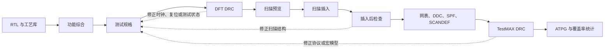
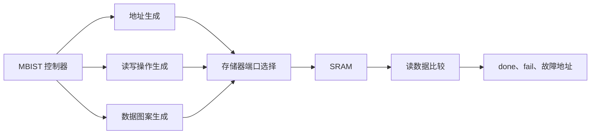

# 从零开始的DFT Flow搭建

本教程从一份 RTL、一个标准单元库和一份基础时序约束开始，逐步建立可重复执行的综合、测试协议和扫描插入流程。DFT（Design for Test，可测性设计）阶段的每一步都给出示例脚本、逐句说明、应检查的报告和动手任务。完成全部章节后，读者可以独立搭建一个小型项目，并知道出现错误时应从哪个输入开始检查。

示例命令以本机 DC（Design Compiler，逻辑综合工具）、DFTC（DFT Compiler，DFT 编译工具）和 TestMAX `V-2023.12-SP3` 为准。库名、端口名、时钟周期和目录名是教学示例，复制到项目时必须换成真实内容。ORCA 课程设计的实际运行数据见 [[实验配套资料/DFTC1_2010.03实验验证记录]]。

## 1. 学完后能够完成什么

读完并完成动手任务后，应能独立完成以下工作：

1. 从 RTL、`.db` 工艺库和 SDC（Synopsys Design Constraints，Synopsys 设计约束）建立 DC 工程。
2. 检查标准单元库、宏模型、顶层和 RTL 文件顺序。
3. 完成 RTL 分析、顶层展开、库链接和基础综合。
4. 定义测试时钟、复位、测试模式、扫描使能、扫描输入和扫描输出。
5. 创建测试协议并运行 DFT DRC，其中 DRC（Design Rule Checking，设计规则检查）用于检查测试时钟、复位、扫描单元和连接关系。
6. 预览扫描结构，插入扫描单元和扫描链，检查插入后的设计。
7. 导出扫描后 Verilog、DDC（Design Compiler Database，DC 设计数据库）、SPF（STIL Protocol File，STIL 协议文件）和 SCANDEF。
8. 使用 TestMAX 执行协议检查和 ATPG（Automatic Test Pattern Generation，自动测试向量生成）。
9. 根据日志、DRC 编号、扫描链报告和 ATPG 统计定位常见问题。
10. 基础流程稳定后，再学习 AutoFix、层次化扫描和 Adaptive Scan（自适应扫描）。

## 2. 先建立完整认识

DFT 的目标是让芯片内部状态更容易由外部控制和观察。扫描设计把普通触发器换成扫描触发器，并在测试模式下把这些触发器串成移位寄存器。测试设备先把激励移入扫描链，再执行捕获，最后把响应移出。



### 2.1 功能模式和扫描模式

| 状态 | `scan_en` | 触发器行为 | 主要用途 |
| --- | ---: | --- | --- |
| 功能模式 | 0 | D 端接收功能逻辑结果 | 正常运行与功能捕获 |
| 扫描移位 | 1 | SI 端接收前一级扫描单元的数据 | 移入激励或移出响应 |
| 捕获 | 0 | 在功能时钟边沿采样组合逻辑结果 | 形成待移出的测试响应 |

一个基本测试过程通常包含四步：

1. 置 `scan_en=1`，连续施加扫描时钟，把初始状态移入。
2. 置 `scan_en=0`，施加一个或多个捕获时钟。
3. 置 `scan_en=1`，把捕获结果移出。
4. 在移出当前响应的同时，可以移入下一组激励。

### 2.2 主要工具各自负责什么

| 工具 | 主要任务 | 不能代替的检查 |
| --- | --- | --- |
| DC | 读 RTL、读库、读 SDC、综合、生成门级设计 | 不能代替 ATPG 对扫描操作的实际检查 |
| DFTC | 定义测试规格、DFT DRC、扫描预览和扫描插入 | 覆盖率估算不等同于完整 ATPG 结果 |
| TestMAX | 读取扫描网表和 SPF、执行 DRC、生成测试向量 | 不能代替功能仿真和物理实现检查 |

> [!important] 三种“完成”不能混为一谈
> 命令正常结束只说明工具执行到了末尾；报告通过说明该项检查满足要求；工程最终确认还需要功能仿真、形式等价检查、时序检查、物理实现和测试团队审阅。

### 2.3 现行 Synopsys 产品如何分工

本教程中的 DC、DFTC 和 TestMAX 命令适用于本机 `V-2023.12-SP3` 环境。Synopsys 当前的公开资料以 TestMAX 产品系列描述更完整的 DFT 流程。两种名称反映的是工具版本和产品配置差异，不应把产品网页上的功能直接当作本机已经取得的许可证。

| 产品 | 适合放入流程的阶段 | 主要工作 |
| --- | --- | --- |
| TestMAX Advisor | RTL 编写与综合前 | 检查 DFT 违规、分析 X 来源、估算 ATPG 覆盖率、选择测试点并检查 DFT 连接 |
| TestMAX Manager | RTL 集成 | 提供 Tcl 框架、RTL 编辑和层次化向量移植 |
| TestMAX DFT | DFT 结构实现 | 插入扫描链、边界扫描、Core Wrapper、测试点和扫描压缩结构 |
| TestMAX ATPG | 扫描结构完成后 | 执行故障建模、故障仿真、测试向量生成和功耗受控的 ATPG |
| TestMAX SMS | 存储器测试与修复 | 生成或集成存储器自测试、诊断和片上修复结构 |
| TestMAX XLBIST | 逻辑片上自测试 | 提供 X-tolerant LBIST、种子控制、响应压缩和片上自测试支持 |
| TestMAX Diagnosis | 芯片测试数据分析 | 根据测试设备的失败记录定位候选缺陷位置 |

这份分工来自 Synopsys 的 [TestMAX 产品系列](https://www.synopsys.com/implementation-and-signoff/test-automation.html)、[TestMAX Advisor](https://www.synopsys.com/implementation-and-signoff/test-automation/testmax-advisor.html)、[TestMAX Manager](https://www.synopsys.com/implementation-and-signoff/test-automation/testmax-manager.html) 和 [TestMAX DFT](https://www.synopsys.com/implementation-and-signoff/rtl-synthesis-test/test-automation/dftmax.html) 公开说明。项目开始时应先执行 `dc_shell -version`、`which dc_shell` 和许可证检查，再决定哪些章节能够使用商业工具自动完成。

## 3. 准备输入文件

### 3.1 最少输入

| 输入 | 常见格式 | 作用 | 缺失时的典型现象 |
| --- | --- | --- | --- |
| RTL | `.v`、`.sv`、`.vhd` | 描述待综合设计 | 无法建立当前设计 |
| 标准单元库 | `.db` | 提供逻辑单元、触发器、时序和功耗信息 | `link` 失败或没有可用扫描单元 |
| DesignWare 库 | `.sldb` | 支持算术和通用综合结构 | 部分算术结构无法正确实现 |
| 宏时序模型 | `.db` | 描述 SRAM（Static Random-Access Memory，静态随机存储器）、ROM（Read-Only Memory，只读存储器）、PLL（Phase-Locked Loop，锁相环）和 I/O（Input/Output，输入输出）等宏 | 黑盒、未知模型或 ATPG 警告 |
| 功能约束 | `.sdc` 或 Tcl | 定义时钟、I/O 时序和例外 | 综合结果没有可解释的时序条件 |
| DFT 规格 | Tcl | 定义测试信号、扫描链和测试模式 | DFT DRC 出现时钟、复位或端口问题 |

### 3.2 先问清楚的设计信息

写脚本前，先形成一张项目表：

| 项目 | 示例 | 说明 |
| --- | --- | --- |
| 顶层名称 | `dft_demo_top` | 必须与 RTL 中的模块名称完全一致 |
| RTL 语言 | SystemVerilog | 决定 `analyze -format` 的写法 |
| 功能时钟 | `clk`，周期 `10 ns` | 用于综合时序分析 |
| 异步复位 | `rst_n`，低有效 | 需要同时写入 SDC 和 DFT 规格 |
| 测试模式 | `test_mode`，高有效 | 使测试期间的功能控制状态确定 |
| 扫描使能 | `scan_en`，高有效 | 在功能采样和扫描移位之间切换 |
| 扫描输入、输出 | `scan_in`、`scan_out` | 测试数据进入和离开芯片的端口 |
| 扫描链数量 | 1 | 小设计先从单链开始 |
| 工艺条件 | 由工艺设计套件指定 | 库文件与工作条件必须相互对应 |

如果这些信息没有确定，脚本即使能够执行，也无法说明结果是否符合设计目标。

## 4. 建立教学工程

### 4.1 目录结构

本教程采用下列目录。原始输入和每次运行产生的文件分开保存，失败的运行不会改写 RTL、库和约束。

```text
dft_demo/
├── .synopsys_dc.setup
├── Makefile
├── config/
│   └── project.tcl
├── rtl/
│   └── dft_demo_top.sv
├── filelist/
│   └── dft_demo_top.f
├── lib/
│   ├── stdcell/
│   └── macro/
├── constraints/
│   └── dft_demo_top_func.sdc
├── scripts/
│   ├── run_dft.tcl
│   ├── 00_preflight.tcl
│   ├── 10_setup_library.tcl
│   ├── 20_read_rtl.tcl
│   ├── 30_apply_constraints.tcl
│   ├── 40_compile.tcl
│   ├── 45_integrate_mbist.tcl  # 使用 MBIST 时提供
│   ├── 46_integrate_bisr.tcl   # 使用 BISR 时提供
│   ├── 47_integrate_lbist.tcl  # 使用 LBIST 时提供
│   ├── 48_integrate_jtag.tcl   # 使用 JTAG 时提供
│   ├── 49_integrate_ijtag.tcl  # 使用 IJTAG 时提供
│   ├── 50_define_dft.tcl
│   ├── 55_define_compression.tcl # 使用扫描压缩时提供
│   ├── 60_insert_dft.tcl
│   ├── 70_report.tcl
│   └── 80_handoff.tcl
└── run/
    └── <run_id>/
        ├── work/
        ├── log/
        ├── report/
        ├── netlist/
        ├── protocol/
        ├── constraint/
        ├── formal/
        └── testmax/
```

### 4.2 为什么要分阶段

| 脚本 | 只负责什么 | 出错时先看什么 |
| --- | --- | --- |
| `00_preflight.tcl` | 检查变量和输入文件 | 顶层、文件列表、SDC、运行目录 |
| `10_setup_library.tcl` | 设置并检查库 | `search_path`、目标库、宏库 |
| `20_read_rtl.tcl` | 读 RTL、展开顶层并链接 | 文件顺序、宏定义、未解析模块 |
| `30_apply_constraints.tcl` | 读 SDC 并检查时序对象 | 时钟、I/O 延迟、例外路径 |
| `40_compile.tcl` | 完成功能综合 | 编译错误、时序、面积和单元统计 |
| `50_define_dft.tcl` | 定义测试信号并创建协议 | 端口名、有效电平和波形时刻 |
| `60_insert_dft.tcl` | 预览并插入扫描 | 扫描链数、链端点和扫描单元数 |
| `70_report.tcl` | 保存 DFT 和综合报告 | DRC 分类、覆盖率估算、扫描路径 |
| `80_handoff.tcl` | 写出交付文件 | 网表、DDC、SPF、SCANDEF |

脚本分开以后，可以在日志中快速判断问题来自库、RTL、SDC、测试协议还是扫描插入。

## 5. 准备一个最小 RTL 例子

下面的设计包含 8 位状态寄存器、同步数据更新和低有效异步复位。`test_mode=1` 时绕过功能使能，使测试捕获不受 `en` 阻止。扫描端口由 DFTC 创建，因此 RTL 中不需要手写扫描多路选择器。

```systemverilog
module dft_demo_top (
    input  logic       clk,
    input  logic       rst_n,
    input  logic       test_mode,
    input  logic       en,
    input  logic [7:0] data_in,
    output logic [7:0] data_out
);

    logic [7:0] state_q;

    always_ff @(posedge clk or negedge rst_n) begin
        if (!rst_n) begin
            state_q <= 8'h00;
        end else if (en || test_mode) begin
            state_q <= data_in;
        end
    end

    assign data_out = state_q;

endmodule
```

### 5.1 逐段理解

| 代码 | 含义 | 与 DFT 的关系 |
| --- | --- | --- |
| `always_ff @(posedge clk or negedge rst_n)` | 寄存器在时钟上升沿更新，复位低有效 | `clk` 要声明为 ScanClock，`rst_n` 要声明为 Reset |
| `state_q <= 8'h00` | 复位后内部状态确定 | ATPG 建模时更容易建立已知状态 |
| `en || test_mode` | 测试模式下强制允许状态更新 | 捕获周期不受功能使能阻止 |
| `data_out = state_q` | 内部寄存器可由功能输出观察 | 扫描模式仍会提供独立的 `scan_out` |

### 5.2 文件列表

`filelist/dft_demo_top.f` 只需要一行：

```text
rtl/dft_demo_top.sv
```

较大设计应遵守以下顺序：package、interface 和宏定义文件在前，被引用模块在中间，顶层放在最后。仿真专用文件、测试平台和旧版本 RTL 不应进入综合文件列表。

### 5.3 本章动手任务

1. 使用任意 RTL 编译器检查示例语法。
2. 把 `test_mode` 从更新条件中删除，思考测试期间 `en` 变化会产生什么影响。
3. 把状态位宽改为 16，预测扫描链长度会怎样变化。

## 6. 建立运行入口

### 6.1 项目设置

`config/project.tcl` 集中保存顶层名称、文件列表、约束和扫描链数量：

```tcl
set TOP         $::env(TOP)
set ROOT        $::env(ROOT)
set RUN_DIR     $::env(RUN_DIR)
set RTL_ROOT    $ROOT/rtl
set FILELIST    $ROOT/filelist/${TOP}.f
set FUNC_SDC    $ROOT/constraints/${TOP}_func.sdc
set CHAIN_COUNT 1
```

| 变量 | 含义 | 为什么集中设置 |
| --- | --- | --- |
| `TOP` | 当前顶层模块 | 所有读入、报告和输出使用同一名称 |
| `ROOT` | 工程根目录 | 子脚本不依赖启动时所在目录 |
| `RUN_DIR` | 本次运行目录 | 不同运行的日志和结果互不覆盖 |
| `FILELIST` | 有序 RTL 文件列表 | 综合、仿真和形式等价检查使用一致输入 |
| `FUNC_SDC` | 功能模式约束 | 综合前统一读入并检查 |
| `CHAIN_COUNT` | 目标扫描链数量 | 扫描计划只在一个位置修改 |

### 6.2 Makefile

下面的 Makefile 为每次运行建立独立目录，并保存 DC 返回码与完整日志：

```makefile
SHELL := /usr/bin/env bash

DC_SHELL ?= dc_shell
TOP      ?= dft_demo_top
ROOT     := $(abspath .)
RUN_ID   ?= $(shell date +%Y%m%d_%H%M%S)
RUN_DIR  := $(ROOT)/run/$(RUN_ID)

export TOP ROOT RUN_DIR

.PHONY: dft
dft:
	mkdir -p $(RUN_DIR)/{work,log,report,netlist,protocol,constraint,formal,testmax}
	set -o pipefail; cd $(ROOT) && $(DC_SHELL) -no_init -f scripts/run_dft.tcl 2>&1 | tee $(RUN_DIR)/log/dc.log; exit $${PIPESTATUS[0]}
```

逐句说明：

| 语句 | 作用 |
| --- | --- |
| `ROOT := $(abspath .)` | 把工程根目录固定为完整路径 |
| `RUN_ID` | 为本次运行生成唯一名称 |
| `export TOP ROOT RUN_DIR` | 让 Tcl 通过 `$::env(...)` 读取这些字段 |
| `mkdir -p` | 创建所有输出目录 |
| `set -o pipefail` | 让管道返回 DC 的失败状态，而不是 `tee` 的成功状态 |
| `tee .../dc.log` | 在终端显示输出，同时保存完整日志 |
| `PIPESTATUS[0]` | 把 DC 的返回码交给 Make |

> [!warning] 日志中的错误仍需检查
> 部分 Synopsys 命令在出现 `Error:` 后仍会继续执行，因此返回码为 0 不能单独证明流程成功。运行结束后还要检索 `Error:`、`Fatal:`、`CMD-005`、stack trace 和 timeout，并检查阶段报告。

### 6.3 总入口脚本

`scripts/run_dft.tcl` 只决定执行顺序：

```tcl
set ROOT    $::env(ROOT)
set RUN_DIR $::env(RUN_DIR)

source $ROOT/.synopsys_dc.setup
source $ROOT/config/project.tcl
source $ROOT/scripts/00_preflight.tcl
source $ROOT/scripts/10_setup_library.tcl
source $ROOT/scripts/20_read_rtl.tcl
source $ROOT/scripts/30_apply_constraints.tcl
source $ROOT/scripts/40_compile.tcl
source $ROOT/scripts/50_define_dft.tcl
source $ROOT/scripts/60_insert_dft.tcl
source $ROOT/scripts/70_report.tcl
source $ROOT/scripts/80_handoff.tcl

quit
```

`source` 按顺序读入每个阶段。前一阶段没有建立正确的设计状态时，后一阶段不应继续。`quit` 使批处理在末尾明确退出。

## 7. 启动文件与预检查

### 7.1 `.synopsys_dc.setup`

项目启动文件负责设置搜索目录。库的具体内容放在独立脚本中，避免启动时悄悄改变项目条件。

```tcl
lappend search_path . ./scripts ./rtl ./constraints ./lib/stdcell ./lib/macro
```

这里最容易遗漏的是 `.`。如果当前目录不在 `search_path` 中，`read_file -format ddc mapped/top.ddc` 可能报 `UID-58`，即使文件就在当前目录下。

### 7.2 `00_preflight.tcl`

```tcl
foreach var_name {TOP ROOT RUN_DIR} {
    if {![info exists ::env($var_name)] || $::env($var_name) eq ""} {
        error "Missing environment variable: $var_name"
    }
}

foreach input_file [list $FILELIST $FUNC_SDC] {
    if {![file isfile $input_file]} {
        error "Required input does not exist: $input_file"
    }
}

foreach output_dir {work log report netlist protocol constraint formal testmax} {
    file mkdir $RUN_DIR/$output_dir
}

puts "INFO: TOP      = $TOP"
puts "INFO: ROOT     = $ROOT"
puts "INFO: FILELIST = $FILELIST"
puts "INFO: FUNC_SDC = $FUNC_SDC"
puts "INFO: RUN_DIR  = $RUN_DIR"
puts "INFO: TOOL     = [version]"
```

逐句说明：

| 语句 | 作用 | 失败意味着什么 |
| --- | --- | --- |
| `info exists ::env(...)` | 检查环境变量是否存在 | Makefile 或启动方式不完整 |
| `file isfile` | 检查文件确实存在 | 文件名、路径或顶层设置错误 |
| `file mkdir` | 建立输出目录 | 目录权限或磁盘空间有问题 |
| `puts` | 把关键输入写入日志 | 后续可确认本次到底用了什么输入 |
| `[version]` | 记录当前工具版本 | 便于解释不同版本的选项差异 |

### 7.3 本章动手任务

1. 故意把 `TOP` 改错，确认预检查或顶层展开会停止。
2. 删除文件列表中的一个路径，观察错误首次出现在哪个阶段。
3. 连续运行两次，确认两个 `RUN_ID` 不会互相覆盖。

## 8. 设置和检查工艺库

### 8.1 三个关键变量

| 变量 | 作用 | 常见错误 |
| --- | --- | --- |
| `search_path` | 指定 DC 查找库、RTL 和脚本的目录 | 只写相对目录，换启动位置后找不到文件 |
| `target_library` | 指定 DC 可用于实现逻辑的标准单元库 | 误用其他工艺、电压或温度条件的库 |
| `link_library` | 指定设计可引用的标准单元和宏模型 | 漏掉 SRAM、PLL 或 I/O 模型，产生黑盒 |

PVT（Process, Voltage and Temperature，工艺、电压与温度）必须与项目规定一致。标准单元库一般进入 `target_library`；已经具有固定实现的 SRAM、ROM、PLL 和 I/O 宏通常只进入 `link_library`。

### 8.2 经典库设置脚本

`scripts/10_setup_library.tcl`：

```tcl
set STD_LIB_ROOT   $ROOT/lib/stdcell
set MACRO_LIB_ROOT $ROOT/lib/macro

set search_path [concat $search_path [list \
    $STD_LIB_ROOT \
    $MACRO_LIB_ROOT]]

set target_library    [list stdcell_ss.db]
set macro_library     [list sram_ss.db pll_ss.db io_ss.db]
set synthetic_library [list dw_foundation.sldb]
set link_library      [concat * $target_library $macro_library $synthetic_library]

set_operating_conditions ss_0p72v_125c \
    -library stdcell_ss

puts "INFO: search_path       = $search_path"
puts "INFO: target_library    = $target_library"
puts "INFO: macro_library     = $macro_library"
puts "INFO: synthetic_library = $synthetic_library"
puts "INFO: link_library      = $link_library"

list_libs
report_lib > $RUN_DIR/report/library.rpt
report_operating_conditions \
    > $RUN_DIR/report/operating_conditions.rpt
```

逐句说明：

| 语句 | 说明 |
| --- | --- |
| `set STD_LIB_ROOT` | 保存标准单元库所在目录 |
| `concat $search_path ...` | 保留已有搜索目录，再追加项目库目录 |
| `target_library` | 指定综合时允许选择的标准单元 `.db` |
| `macro_library` | 保存设计中已经实例化的宏时序模型 |
| `synthetic_library` | 加入 DesignWare 库 |
| `concat * ...` | `*` 表示当前已读入设计，后面依次列出可引用库 |
| `set_operating_conditions` | 选择本次综合使用的库内工作条件 |
| `list_libs` | 列出当前已载入的逻辑库 |
| `report_lib` | 保存库单位、工作条件和单元信息 |

示例库名只是占位符。真实项目必须从 PDK（Process Design Kit，工艺设计套件）说明中取得文件名、库内逻辑名称和工作条件名称，不能只根据文件名猜测。

### 8.3 检查扫描触发器

扫描插入需要库中存在扫描触发器。检查时要确认：

- 普通触发器具有可替换的扫描等价单元。
- 扫描单元具有 SI、SO、SE、时钟和复位相关引脚。
- 目标扫描单元没有被设置为 `dont_use`。
- 功能触发器和扫描触发器使用相同的时钟、复位极性要求。

可以先查看库内的触发器名称，再结合库文档确认扫描属性：

```tcl
set seq_cells [get_lib_cells */* -filter "is_sequential == true"]
query_objects $seq_cells
```

如果当前库不提供 `is_sequential` 属性，应使用 `report_lib` 和库供应方文档检查。不要仅凭单元名中是否含 `SDFF` 判断全部扫描属性。

### 8.4 库阶段的通过条件

- `list_libs` 能看到目标标准单元库和所有必需宏库。
- `report_lib` 中的时间、电容和电压单位符合预期。
- 目标工作条件与当前运行一致。
- 设计会用到的 SRAM、PLL 和 I/O 均有模型或明确的黑盒处理方法。
- 扫描触发器及其扫描引脚可以识别。

## 9. 读取 RTL 并建立当前设计

### 9.1 经典读取脚本

`scripts/20_read_rtl.tcl`：

```tcl
define_design_lib WORK -path $RUN_DIR/work
set_svf $RUN_DIR/formal/${TOP}.svf

analyze -format sverilog -vcs \
    "+define+SYNTHESIS -f $FILELIST"

elaborate $TOP
current_design $TOP
uniquify -force
link

check_design > $RUN_DIR/report/check_design_precompile.rpt
report_design > $RUN_DIR/report/design_precompile.rpt
```

### 9.2 逐句说明

| 语句 | 作用 | 初学者常见误解 |
| --- | --- | --- |
| `define_design_lib WORK` | 指定 RTL 分析结果的工作库 | 它不是工艺标准单元库 |
| `set_svf` | 保存综合变换信息，供形式等价检查使用 | `.svf` 不是门级网表 |
| `analyze` | 解析并编译 RTL | 此时还没有依据顶层参数建立完整设计 |
| `-format sverilog` | 指定输入语言为 SystemVerilog | Verilog 或 VHDL 要使用相应格式 |
| `-vcs "... -f ..."` | 使用 VCS 风格的宏定义和文件列表 | 文件列表顺序仍然必须正确 |
| `elaborate $TOP` | 按顶层和参数建立设计层次 | 顶层名错误会在此处暴露 |
| `current_design $TOP` | 指定后续命令作用的当前设计 | 没有当前设计时，约束和 DFT 命令无目标 |
| `uniquify -force` | 为重复实例建立可独立处理的设计副本 | 可能改变层次名称，应保存 SVF（Synopsys Verification Format，Synopsys 验证格式） |
| `link` | 解析模块和库单元引用 | 宏库缺失时会出现未解析引用 |
| `check_design` | 检查连接和结构问题 | 不能用它代替 DFT DRC |

### 9.3 如果使用 VHDL

部分旧 VHDL 有限状态机与当前工具的默认完整状态假定不一致，可在读 RTL 前设置：

```tcl
set_app_var hdlin_always_fsm_complete false
```

该选项只用于兼容特定 RTL。新设计仍应检查状态定义、复位状态、默认分支和不可达状态。

### 9.4 RTL 阶段的通过条件

- `analyze` 和 `elaborate` 没有语法错误或未定义参数。
- `current_design` 显示正确顶层。
- `link` 后没有未解析模块或库单元。
- `check_design` 中的未连接端口、常量输出、多重驱动和三态结构均有具体原因。
- `report_design` 中的寄存器和层次数量符合 RTL 规模。

## 10. 编写功能 SDC

SDC 描述功能时钟、接口时序、输入驱动、输出端口电容和例外路径。DFT 规格不能代替功能 SDC；两者回答的问题不同。

### 10.1 经典单时钟模板

`constraints/dft_demo_top_func.sdc`：

```tcl
set CLK_PORT       clk
set CLK_NAME       FUNC_CLK
set CLK_PERIOD     10.0
set CLK_UNCERT_S   0.20
set CLK_UNCERT_H   0.10

create_clock -name $CLK_NAME -period $CLK_PERIOD \
    -waveform [list 0.0 [expr {$CLK_PERIOD / 2.0}]] \
    [get_ports $CLK_PORT]

set_clock_uncertainty -setup $CLK_UNCERT_S [get_clocks $CLK_NAME]
set_clock_uncertainty -hold  $CLK_UNCERT_H [get_clocks $CLK_NAME]

set data_inputs [remove_from_collection \
    [all_inputs] [get_ports {clk rst_n test_mode}]]
set data_outputs [all_outputs]

set_input_delay  -clock $CLK_NAME -max 2.0 $data_inputs
set_input_delay  -clock $CLK_NAME -min 0.2 $data_inputs
set_output_delay -clock $CLK_NAME -max 2.0 $data_outputs
set_output_delay -clock $CLK_NAME -min 0.2 $data_outputs

set_driving_cell -lib_cell BUF_X4 -pin Y $data_inputs
set_load 0.020 $data_outputs

set_false_path -from [get_ports rst_n]
```

`BUF_X4`、引脚 `Y` 和 `0.020` 必须换成项目接口条件。若工艺库中没有该缓冲单元，`set_driving_cell` 会失败。

### 10.2 逐句说明

| 语句 | 作用 | 数值从哪里来 |
| --- | --- | --- |
| `create_clock` | 在功能时钟端口建立时钟对象 | 系统频率和占空比 |
| `set_clock_uncertainty` | 为时钟抖动和分析余量留出空间 | 项目时钟计划 |
| `remove_from_collection` | 从数据输入中排除时钟、复位和测试模式 | 顶层接口定义 |
| `set_input_delay -max/-min` | 描述外部数据最晚和最早到达时间 | 上一级模块或芯片接口预算 |
| `set_output_delay -max/-min` | 描述下一级对输出数据的要求 | 下一级模块或芯片接口预算 |
| `set_driving_cell` | 描述输入端口由哪类单元驱动 | 上一级输出能力 |
| `set_load` | 设置输出端口所见电容 | 下一级输入、电路连接和封装条件 |
| `set_false_path` | 排除不按普通同步数据路径分析的异步复位 | 复位结构和项目时序规则 |

### 10.3 读取并检查约束

`scripts/30_apply_constraints.tcl`：

```tcl
source $FUNC_SDC

report_clock > $RUN_DIR/report/clock.rpt
check_timing -verbose > $RUN_DIR/report/check_timing_precompile.rpt
report_constraint -all_violators \
    > $RUN_DIR/report/constraint_precompile.rpt
```

先检查约束，再开始综合。若时钟端口写错、I/O 最小延迟缺失或存在未约束端点，后续面积和时序统计没有明确参考条件。

### 10.4 多时钟设计

多时钟设计需要分别创建每个功能时钟，并明确时钟关系。确实异步的时钟可写为：

```tcl
set_clock_groups -asynchronous \
    -group [get_clocks CLK_A] \
    -group [get_clocks CLK_B]
```

两个频率不同但相位关系已知的时钟不能简单设为异步。分频、倍频或门控产生的时钟应按真实结构定义生成时钟，并结合 CDC（Clock Domain Crossing，时钟域跨越）检查结果审阅跨时钟数据传递。

## 11. 完成功能综合

### 11.1 基础综合脚本

`scripts/40_compile.tcl`：

```tcl
set_fix_multiple_port_nets -all -exclude_clock_network

compile -map_effort medium \
        -area_effort medium \
        -power_effort none

check_design > $RUN_DIR/report/check_design_postcompile.rpt
check_timing -verbose > $RUN_DIR/report/check_timing_postcompile.rpt

write -format ddc -hierarchy \
    -output $RUN_DIR/netlist/${TOP}_functional.ddc
write -format verilog -hierarchy \
    -output $RUN_DIR/netlist/${TOP}_functional.v
write_sdc $RUN_DIR/constraint/${TOP}_functional.sdc
```

### 11.2 逐句说明

| 语句 | 作用 |
| --- | --- |
| `set_fix_multiple_port_nets` | 处理多个输出端口共用网络等 Verilog 写出问题，同时排除时钟网络 |
| `compile` | 优化设计并用目标标准单元实现逻辑 |
| `-map_effort medium` | 使用中等强度的目标单元选择和优化 |
| `-area_effort medium` | 使用中等强度的面积优化 |
| `-power_effort none` | 本教学流程不在该阶段执行功耗优化 |
| `check_design` | 检查编译后的连接和结构 |
| `check_timing` | 检查编译后的时序约束完整性 |
| `write -format ddc` | 保存 DC 内部设计数据库 |
| `write -format verilog` | 保存功能门级网表 |
| `write_sdc` | 保存当前生效的功能约束 |

### 11.3 为什么先保存功能 DDC

功能综合结果是 DFT 阶段的清晰起点。扫描插入出现问题时，可以重新读取 `${TOP}_functional.ddc`，不必每次重新分析全部 RTL。功能 DDC 还能用于对照扫描前后的寄存器数量、面积和时序变化。

当前版本读取 DDC 使用：

```tcl
read_file -format ddc $RUN_DIR/netlist/${TOP}_functional.ddc
current_design $TOP
link
```

### 11.4 功能综合的通过条件

- `check_design_postcompile.rpt` 中没有未解释的错误。
- `check_timing_postcompile.rpt` 中没有未定义时钟或大量未约束端点。
- 功能 DDC、Verilog 和 SDC 均已写出且文件非空。
- `report_qor`、面积、最大延迟和最小延迟报告具有明确工艺条件。
- 形式等价检查所需的 SVF 已保存。

### 11.5 本章动手任务

1. 先只创建时钟，不设置 I/O 延迟，观察 `check_timing` 如何报告问题。
2. 把 `CLK_PERIOD` 从 `10.0` 改为 `5.0`，比较最大延迟报告。
3. 读取刚写出的功能 DDC，确认 `current_design`、`link` 和 `report_design` 正常。

## 12. 制定芯片 DFT 方案

扫描插入只是完整芯片 DFT 的一部分。开始写测试脚本前，应先确认芯片包含哪些逻辑和存储器、测试从哪里进入、使用哪些时钟、需要哪些片上控制单元。

### 12.1 主要 DFT 子流程

本教程覆盖 OCC（On-Chip Clock Controller，片上时钟控制器）、MBIST（Memory Built-In Self-Test，存储器内建自测试）、BISR（Built-In Self-Repair，内建自修复）、LBIST（Logic Built-In Self-Test，逻辑内建自测试）、JTAG（Joint Test Action Group，联合测试行动组）和 IJTAG（IEEE 1687 片上仪器访问方法）。LBIST 中还会使用 PRPG（Pseudo-Random Pattern Generator，伪随机测试向量生成器）和 MISR（Multiple-Input Signature Register，多输入签名寄存器）。

| 子流程 | 主要对象 | 解决的问题 | 主要结果 |
| --- | --- | --- | --- |
| 逻辑扫描 | 普通触发器与组合逻辑 | 从外部控制和观察内部寄存器状态 | 扫描链、扫描网表、ATPG 向量 |
| 扫描压缩 | 大规模扫描链 | 减少外部扫描通道和移位周期 | 解压器、压缩器、内部短链 |
| 测试点 | 难控制或难观察的逻辑节点 | 改善 ATPG 故障覆盖率 | 控制测试点、观察测试点 |
| OCC | 功能时钟与高速测试 | 在芯片内部产生捕获脉冲 | 移位时钟、捕获时钟控制 |
| MBIST | SRAM、ROM 和寄存器文件 | 直接测试存储器阵列故障 | MBIST 控制器、测试状态和故障地址 |
| BISR | 带备用行或备用列的存储器 | 用备用资源替换故障行或故障列 | 修复信息、修复状态、修复后复测 |
| LBIST | 随机测试适用的逻辑区域 | 使用片上激励和响应压缩完成自测试 | PRPG、MISR、签名结果 |
| JTAG 边界扫描 | 芯片引脚和板级互连 | 测试芯片间连接并提供外部测试入口 | 测试访问状态机、指令寄存器、边界扫描寄存器 |
| IEEE 1500 | 可复用内核 | 隔离并访问内核测试接口 | Core Wrapper 和测试访问端口 |
| IJTAG | 片上仪器 | 通过统一网络访问 MBIST、监视器等仪器 | 仪器连接文件、操作过程和片上仪器访问网络 |
| 低功耗测试 | 多电源域和可关断区域 | 确保测试模式下电源、隔离和时钟状态正确 | 测试模式电源控制和功耗限制 |

### 12.2 测试模式控制表

芯片项目应在脚本前先写一张测试模式控制表。下面给出常见例子：

| 模式 | `test_mode` | `scan_en` | 时钟来源 | 存储器端口控制 | 主要输出 |
| --- | ---: | ---: | --- | --- | --- |
| 功能模式 | 0 | 0 | 功能时钟 | 功能逻辑 | 功能输出 |
| 扫描移位 | 1 | 1 | 低速测试时钟 | 功能访问停止 | 扫描输出 |
| 扫描捕获 | 1 | 0 | 功能时钟或 OCC | 功能访问停止 | 捕获到扫描单元 |
| MBIST | 1 | 0 | MBIST 时钟 | MBIST 控制器接管 | `mbist_done`、`mbist_fail` |
| LBIST | 1 | 按控制器状态 | LBIST/OCC 时钟 | 依据区域设置旁路 | MISR 签名 |
| JTAG EXTEST | 1 | 由 TAP 控制 | TCK | 功能逻辑隔离 | TDO |

每个模式都要说明：如何进入、如何退出、复位状态、时钟来源、功能控制是否停止、结果从哪里读出。多个测试模式不能同时接管同一端口。

### 12.3 存储器清单

MBIST 方案依赖准确的存储器清单。每个宏至少记录：

| 字段 | 示例 | 用途 |
| --- | --- | --- |
| 宏类型 | 1RW SRAM | 选择测试算法和端口控制方式 |
| 深度 × 位宽 | `1024 × 32` | 确定地址宽度、数据比较宽度和测试时间 |
| 读写端口 | 单端口、1RW1R、双端口 | 决定并发访问和端口冲突处理 |
| 时钟 | `mem_clk` | 决定 MBIST 时钟和时序要求 |
| 掩码 | 4 位 byte write mask | 决定写入粒度和测试模式 |
| 读延迟 | 1 个周期 | 决定比较时刻 |
| 备用资源 | 1 行、1 列 | 决定 BISR 分析范围 |
| 电源域 | `PD_SRAM` | 决定测试时的供电和隔离状态 |

### 12.4 RTL 的可测性检查

在综合前处理下列问题，通常比扫描插入后增加大量修复逻辑更容易：

| RTL 结构 | 风险 | 建议做法 |
| --- | --- | --- |
| 普通逻辑直接与时钟相与 | 测试模式下时钟可能不可控并产生毛刺 | 使用工艺时钟门控单元，并连接测试使能 |
| 异步复位来自复杂组合逻辑 | 测试时难以保持复位无效 | 提供明确的测试旁路或 AutoFix 控制 |
| 未复位状态进入压缩器 | 产生 X 并污染多个观察通道 | 复位、屏蔽或隔离确定的 X 来源 |
| SRAM 输出直接进入逻辑扫描 | 存储器内容未知时产生 X | 为 SRAM 提供 MBIST、旁路或测试状态 |
| 双向端口使能由内部状态控制 | 扫描移位时可能出现多个驱动 | 在测试模式下固定输出使能 |
| 具有特殊时钟或电源行为的寄存器 | 可能不能使用普通扫描单元 | 建立明确排除清单和专用测试方法 |

工艺时钟门控单元通常具有功能使能和测试使能。下面只是端口关系示意，单元名和引脚名必须按库文档替换：

```systemverilog
ICG_X1 u_icg (
    .CK (clk),
    .E  (func_clk_en),
    .TE (test_mode),
    .Q  (gated_clk)
);
```

`TE=1` 时测试模式能够打开时钟门控，使扫描捕获时钟到达寄存器。不要用普通 `assign gated_clk = clk & enable;` 代替经过工艺检查的门控单元。

## 13. 定义基本扫描测试规格

本章在功能综合后的当前设计中创建 `scan_en`、`scan_in` 和 `scan_out`，并把已有的 `clk`、`rst_n` 和 `test_mode` 声明给 DFTC。

### 13.1 经典测试规格脚本

`scripts/50_define_dft.tcl`：

```tcl
create_port -direction in  scan_en
create_port -direction in  scan_in
create_port -direction out scan_out

set_dft_signal -view existing_dft \
    -type ScanClock -timing {45 55} -port clk

set_dft_signal -view existing_dft \
    -type Reset -active_state 0 -port rst_n

set_dft_signal -view existing_dft \
    -type Constant -active_state 1 -port test_mode

set_dft_signal -view spec \
    -type ScanEnable -active_state 1 -port scan_en

set_dft_signal -view spec \
    -type ScanDataIn -port scan_in

set_dft_signal -view spec \
    -type ScanDataOut -port scan_out

set_scan_path chain0 -view spec \
    -scan_data_in scan_in \
    -scan_data_out scan_out

create_test_protocol
dft_drc > $RUN_DIR/report/dft_drc_preinsert.rpt
write_test_protocol \
    -output $RUN_DIR/protocol/${TOP}_preinsert.spf
```

### 13.2 `existing_dft` 与 `spec`

| 视图 | 何时使用 | 本例 |
| --- | --- | --- |
| `existing_dft` | 设计中已经存在并已连接的测试相关信号 | `clk`、`rst_n`、`test_mode` |
| `spec` | 要求 DFTC 在扫描插入时建立或接入的测试规格 | `scan_en`、`scan_in`、`scan_out`、`chain0` |

如果 `scan_en`、`scan_in` 和 `scan_out` 已经是 RTL 顶层端口，就不应重复执行 `create_port`，但仍要使用 `set_dft_signal` 声明其类型。

### 13.3 逐句说明

| 语句 | 作用 | 重点 |
| --- | --- | --- |
| `create_port` | 在当前设计中创建测试端口 | 方向必须正确，名称不得与已有端口冲突 |
| `ScanClock` | 声明扫描移位和捕获使用的时钟 | 多个时钟要分别写多条命令 |
| `-timing {45 55}` | 指定测试协议周期内的有效边沿位置 | 数值是协议时刻，不是功能 SDC 的周期 |
| `Reset -active_state 0` | 声明低有效复位 | 极性写反会使协议仿真和 DRC 错误 |
| `Constant -active_state 1` | 在测试期间把已有 `test_mode` 固定为 1 | 适用于该端口已控制功能逻辑的情况 |
| `ScanEnable` | 声明扫描移位使能 | 有效电平必须与扫描单元一致 |
| `ScanDataIn/Out` | 指定扫描数据端口 | 端口方向和链端点要一致 |
| `set_scan_path` | 指定扫描链名称和外部端点 | 多链设计为每条链分别定义 |
| `create_test_protocol` | 根据已有信号和规格创建测试协议 | 规格改变后要重建协议 |
| `dft_drc` | 运行扫描插入前 DFT 检查 | 不能只看报告总数，要按编号分析 |
| `write_test_protocol` | 保存 SPF（STIL Protocol File，STIL 协议文件） | 可用于检查初始化和时钟波形 |

### 13.4 多扫描时钟

每个扫描时钟单独声明：

```tcl
set_dft_signal -view existing_dft -type ScanClock \
    -timing {45 55} -port pclk
set_dft_signal -view existing_dft -type ScanClock \
    -timing {45 55} -port sdram_clk
set_dft_signal -view existing_dft -type ScanClock \
    -timing {45 55} -port sys_clk
```

不要把三个端口一起放入一条 `-port` 参数。扫描链是否允许跨越多个时钟，还要在 `set_scan_configuration` 中明确设置。

### 13.5 修改规格后重建协议

`create_test_protocol` 不会自动跟随随后加入的 `-view spec` 信号。规格改变后执行：

```tcl
remove_test_protocol
create_test_protocol
```

如果跳过这一步，`preview_dft` 可能仍使用先前的时钟、复位或测试模式设置。

## 14. 理解和处理 DFT DRC

### 14.1 DRC 的处理次序

1. 先处理未解析模型、被排除扫描的寄存器和阻止插入的用户约束。
2. 再处理扫描时钟、复位、置位、测试模式和扫描端口。
3. 处理三态网络、双向 I/O、RAM、PLL 和跨时钟扫描链。
4. 扫描插入后重新运行 DRC，确认扫描链可以追踪。
5. 最后在 TestMAX 中用导出的 SPF 和完整门级网表再次检查。

### 14.2 常见报告编号

| 报告项 | 常见含义 | 首先检查 |
| --- | --- | --- |
| D1 | 测试模式下时钟不可控 | ScanClock、时钟门控、测试模式 |
| D3 | 复位控制不明确 | Reset 极性、复位来源、测试状态 |
| `TEST-451` | 单元功能模型不完整 | PLL、RAM、I/O 或其他宏模型 |
| `TEST-115` | 三态网络驱动不明确 | 三态使能和测试模式状态 |
| S22 | 一条扫描链经过多个时钟 | `clock_mixing` 和 lock-up latch |
| Z9 | 双向总线使能受扫描单元影响 | I/O 测试控制和三态使能 |

报告中的 Warning 不一定阻止命令继续，但不能因为工具继续运行就忽略。每项保留的问题都要说明影响范围和后续检查方法。

### 14.3 初始化序列

测试模式由内部配置寄存器产生时，单独声明 `TestMode` 不足以建立目标状态。此时需要在测试协议的 `test_setup` 中写入初始化序列。基本处理顺序为：

```tcl
read_test_protocol -section test_setup \
    -input initialization.spf
create_test_protocol
dft_drc
```

初始化序列只负责在测试开始前建立确定状态，不能修复缺失宏模型、错误时钟关系或三态网络控制。

### 14.4 AutoFix

时钟、复位或置位在测试模式下不可控时，可设置 AutoFix。此时下面的 `TestMode` 声明用于替换第 13 章对同一 `test_mode` 端口的 `Constant` 声明，不要让两个不同类型的声明同时描述同一端口。

```tcl
set_dft_configuration \
    -fix_clock enable \
    -fix_reset enable \
    -fix_set enable

set_dft_signal -view spec \
    -type TestMode -active_state 1 -port test_mode

set_dft_signal -view spec \
    -type TestData -port clk
set_autofix_configuration \
    -type clock -control test_mode -test_data clk

set_dft_signal -view spec \
    -type TestData -port rst_n
set_autofix_configuration \
    -type reset -method mux \
    -control test_mode -test_data rst_n

remove_test_protocol
create_test_protocol
preview_dft
```

`preview_dft` 会显示计划加入的 AutoFix test point。AutoFix 加入的多路选择器和控制逻辑需要进入功能仿真、形式等价检查、面积报告和时序报告。

## 15. 规划并插入扫描链

### 15.1 插入脚本

`scripts/60_insert_dft.tcl`：

```tcl
set_dft_insertion_configuration \
    -synthesis none \
    -preserve_design_name true

set_scan_configuration \
    -chain_count $CHAIN_COUNT \
    -add_lockup true \
    -clock_mixing mix_clocks

preview_dft > $RUN_DIR/report/preview_dft.rpt
insert_dft

dft_drc -coverage_estimate \
    > $RUN_DIR/report/dft_drc_postinsert.rpt
report_scan_path \
    > $RUN_DIR/report/scan_path.rpt
```

### 15.2 逐句说明

| 语句 | 作用 | 检查重点 |
| --- | --- | --- |
| `-synthesis none` | 插入阶段不再执行额外综合 | 适用于已经完成目标库实现的设计 |
| `-preserve_design_name true` | 保持已有设计名称 | 便于后续脚本按原顶层名工作 |
| `-chain_count` | 设置目标扫描链数量 | 结合测试通道数、最长链和移位时间选择 |
| `-add_lockup true` | 允许加入 lock-up latch | 多时钟或多边沿扫描时常用 |
| `-clock_mixing mix_clocks` | 允许一条链包含不同扫描时钟区域 | 必须检查 S22 和物理实现条件 |
| `preview_dft` | 在改写设计前预览扫描结构 | 链数量、端点、单元数量、测试点 |
| `insert_dft` | 完成扫描替换和扫描链连接 | 运行后必须重新执行 DRC |
| `dft_drc -coverage_estimate` | 检查插入后设计并估算覆盖率 | 估算值不等同于 TestMAX ATPG 结果 |
| `report_scan_path` | 报告每条扫描链的起点、终点和单元 | 确认所有目标链均能追踪 |

### 15.3 如何选择扫描链数量

扫描链数量受到测试通道数、触发器总数、测试时间、芯片引脚、时钟区域和物理位置影响。初步估算可使用：

```text
平均链长 ≈ 可扫描触发器总数 ÷ 扫描链数量
```

例如 3000 个扫描单元使用 6 条链，平均每条约 500 个单元。真正的链长还会受到时钟区域、lock-up latch、排除单元和层次结构影响，应以 `preview_dft` 与 `report_scan_path` 为准。

### 15.4 VHDL 总线位端口

带方括号的总线位可能采用转义名称。不要直接写 `pad[0]`，应先查看端口集合：

```tcl
query_objects [get_ports {pad*}]
set scan_in_port [index_collection [get_ports {pad*}] 15]
set_dft_signal -view spec \
    -type ScanDataIn -port $scan_in_port
```

索引由当前集合顺序决定，不能复制其他设计中的数字。

### 15.5 插入后的通过条件

- `preview_dft` 中的扫描链数量和端点符合方案。
- `insert_dft` 日志没有 `Error:`、`CMD-005` 或 stack trace。
- `report_scan_path` 能追踪全部预期扫描链。
- 链长差异可以由时钟区域、排除单元或层次连接解释。
- 插入后 DFT DRC 的剩余报告项均有处理方法。

## 16. 保存完整报告

`scripts/70_report.tcl`：

```tcl
report_qor > $RUN_DIR/report/qor_scan.rpt
report_area -hierarchy > $RUN_DIR/report/area_scan.rpt
report_timing -delay max -max_paths 50 \
    > $RUN_DIR/report/timing_setup_scan.rpt
report_timing -delay min -max_paths 50 \
    > $RUN_DIR/report/timing_hold_scan.rpt
report_constraint -all_violators \
    > $RUN_DIR/report/constraint_scan.rpt
report_reference > $RUN_DIR/report/reference_scan.rpt
report_scan_path > $RUN_DIR/report/scan_path_final.rpt
dft_drc -coverage_estimate \
    > $RUN_DIR/report/dft_coverage_estimate.rpt
```

扫描插入会增加扫描多路选择器、扫描端口、lock-up latch 和可能的 AutoFix 逻辑，因此要保存扫描后的面积、时序和单元统计。功能 DDC 与扫描后 DDC 的结果应分别保存。

## 17. 导出 DFTC 交付文件

### 17.1 交付脚本

`scripts/80_handoff.tcl`：

```tcl
write -format verilog -hierarchy \
    -output $RUN_DIR/netlist/${TOP}_scan.v

write -format ddc -hierarchy \
    -output $RUN_DIR/netlist/${TOP}_scan.ddc

write_sdc \
    $RUN_DIR/constraint/${TOP}_scan.sdc

write_test_protocol \
    -output $RUN_DIR/protocol/${TOP}_scan.spf

write_scan_def \
    -output $RUN_DIR/netlist/${TOP}.scandef

check_scan_def \
    > $RUN_DIR/report/check_scandef.rpt
```

### 17.2 文件用途

| 文件 | 全称或含义 | 使用方 | 必做检查 |
| --- | --- | --- | --- |
| `${TOP}_scan.v` | 扫描后门级 Verilog | TestMAX、门级仿真、物理实现 | 语法可读，与 SPF 同一轮生成 |
| `${TOP}_scan.ddc` | DDC（Design Compiler Database，DC 设计数据库） | DC/DFTC 后续会话 | 可重新读取、链接和报告扫描路径 |
| `${TOP}_scan.sdc` | 扫描后时序约束 | 静态时序分析和物理实现 | 模式、时钟和例外明确 |
| `${TOP}_scan.spf` | 测试协议 | TestMAX | 以 0 个语法错误读入 |
| `${TOP}.scandef` | 扫描链物理描述 | 物理实现 | `check_scan_def` 的 `FAILED` 为 0 |
| `.svf` | 综合变换记录 | 形式等价检查 | 与本次 RTL 和网表配套保存 |

### 17.3 SCANDEF 为什么会比逻辑链多

一条逻辑扫描链跨越不同扫描时钟区域或 lock-up latch 时，SCANDEF 可能把它分成多个物理段。因此逻辑链数量和 SCANDEF 条目数不必相同。检查重点是所有条目与当前扫描网表一致，且 `FAILED` 为 0。

## 18. 使用 TestMAX 生成 ATPG 向量

### 18.1 基本 TestMAX 脚本

在 `run/<run_id>/testmax/atpg.tcl` 中写入：

```tcl
set_command noabort
set_messages -log tmax.log -replace -level expert

read_netlist libs.v.gz
read_netlist macros.v
read_netlist ../netlist/dft_demo_top_scan.v

set_rule b5 warning
run_build
run_drc ../protocol/dft_demo_top_scan.spf

add_faults -all
run_atpg -auto

report_summaries
quit -force
```

### 18.2 逐句说明

| 语句 | 作用 |
| --- | --- |
| `set_command noabort` | 某些警告出现时继续执行，便于取得完整报告 |
| `set_messages` | 把 TestMAX 会话保存到 `tmax.log` |
| `read_netlist libs.v.gz` | 读入标准单元的 ATPG 功能模型 |
| `read_netlist macros.v` | 读入 RAM、PLL 或 I/O 等宏模型 |
| `read_netlist *_scan.v` | 读入扫描后完整门级网表 |
| `set_rule b5 warning` | 把未定义模块规则设置为 Warning；仍需说明每个缺失模型 |
| `run_build` | 建立 TestMAX 内部设计模型 |
| `run_drc *.spf` | 读取协议并检查扫描操作、时钟和总线 |
| `add_faults -all` | 加入当前故障模型的全部目标故障 |
| `run_atpg -auto` | 自动生成测试向量 |
| `report_summaries` | 输出故障、向量和覆盖率摘要 |

`libs.v.gz` 和 `macros.v` 不是 DC 的 `.db`。TestMAX 需要能够描述逻辑功能的 Verilog ATPG 模型；文件应由库或测试流程正式提供。

### 18.3 fast sequential ATPG

需要多个捕获周期时，可以在基本 ATPG 后加入：

```tcl
set_atpg -capture_cycles 4
run_atpg -auto
```

`fast sequential ATPG` 可检测部分 basic scan 无法检测的故障，但要求时钟、复位、初始化序列和宏行为更加完整。不能只看覆盖率提升，还要检查新增向量是否能在门级仿真和测试设备时序下执行。

### 18.4 TestMAX 的通过条件

- 标准单元、宏模型和扫描网表均以 0 个语法错误读入。
- `run_build` 没有未解释的未定义模块。
- `run_drc` 成功追踪全部预期扫描链。
- DRC 警告按 S、C、Z、R 等类别记录并说明影响。
- 日志包含故障总数、故障分类、测试覆盖率和向量数量。
- 关键向量完成门级仿真，时钟和扫描使能波形符合协议。

### 18.5 从 basic scan 扩展到高级故障模型

stuck-at fault 是入门起点，但不能代表全部制造缺陷。现行 [TestMAX ATPG](https://www.synopsys.com/implementation-and-signoff/test-automation/testmax-atpg.html) 公开说明列出了 standard transition fault（标准转换故障）、slack-based transition fault（基于时序裕量的转换故障）、cell-aware fault（单元内部故障）、static/dynamic bridging fault（静态/动态桥接故障）、path delay fault（路径延迟故障）和 hold-time fault（保持时间故障）等模型，并支持移位与捕获阶段的功耗控制。

| 模型或方法 | 增加的输入 | 使用前应确认 |
| --- | --- | --- |
| standard transition fault（标准转换故障） | 高速捕获时钟和测试模式时序 | OCC 脉冲、启动方式和捕获周期 |
| slack-based transition fault（基于时序裕量的转换故障） | PrimeTime 提供的时序信息 | SDC 例外、多周期路径和测试模式时序一致 |
| path delay fault、hold-time fault（路径延迟故障、保持时间故障） | 指定路径或时序数据 | 路径选择方法和测试设备时钟能力 |
| cell-aware fault（单元内部故障） | 库供应方提供的单元内部故障模型 | 模型版本与标准单元库版本一致 |
| static/dynamic bridging fault（静态/动态桥接故障） | 网络间短接模型及必要的物理信息 | 模型来源、目标范围和 ATPG 设置 |
| IDDQ test（静态电源电流测试） | 静态电流测试条件和仿真支持 | 静止状态、电流限制和 VCS 仿真方法 |
| power-aware ATPG（功耗感知自动测试向量生成） | 移位、捕获阶段允许的切换活动 | 分区限制、时钟关系和测试设备时序 |

> [!note] 模型越复杂，越依赖准确的库、时序和物理数据
> 不要只修改 ATPG 选项。先确认模型文件、PrimeTime 或 StarRC 数据、OCC 时序和最终网表来自同一次设计发布，再生成用于测试设备的向量。具体命令以当前安装版本的 `help`、`man` 和产品用户指南为准。

## 19. MBIST：存储器内建自测试

逻辑扫描适合触发器和组合逻辑，但不适合逐位访问大容量 SRAM。MBIST 使用片上控制器按规定次序产生地址、读写命令和数据，再比较存储器输出。MBIST 的输入不是普通扫描链，而是存储器清单、宏端口协议、读延迟、写掩码、测试算法和并行执行计划。

### 19.1 MBIST 结构



| 模块 | 作用 | 需要确认的参数 |
| --- | --- | --- |
| MBIST 控制器 | 控制算法阶段和开始、结束状态 | 算法、超时、遇到失败时继续或停止 |
| 地址生成器 | 产生递增、递减或固定地址 | 地址宽度、起始地址、结束地址 |
| 数据图案生成器 | 产生全 0、全 1、棋盘格等数据 | 数据宽度、写掩码 |
| 操作生成器 | 产生读、写和比较次序 | 端口极性、读延迟、写使能极性 |
| 存储器端口选择器 | 在功能访问和 MBIST 访问之间选择 | `mbist_mode` 的进入、退出和互斥条件 |
| 比较器 | 比较实际读数据和期望数据 | X 处理、读数据有效周期 |
| 状态寄存器 | 保存完成、失败、故障地址等结果 | 软件、JTAG 或 IJTAG 的读取方式 |

### 19.2 March C- 算法

March C- 是教学中常见的存储器测试算法。`↑` 表示地址递增，`↓` 表示地址递减，`⇕` 表示地址次序不限；`w0`、`w1` 表示写 0、写 1，`r0`、`r1` 表示读取并期望 0、1。

```text
{ ⇕(w0);
  ↑(r0, w1);
  ↑(r1, w0);
  ↓(r0, w1);
  ↓(r1, w0);
  ⇕(r0) }
```

| 阶段 | 地址方向 | 操作 | 目的 |
| --- | --- | --- | --- |
| 1 | 任意 | `w0` | 把所有单元初始化为 0 |
| 2 | 递增 | `r0, w1` | 检查 0，再写入 1 |
| 3 | 递增 | `r1, w0` | 检查 1，再写回 0 |
| 4 | 递减 | `r0, w1` | 反向检查 0，再写入 1 |
| 5 | 递减 | `r1, w0` | 反向检查 1，再写回 0 |
| 6 | 任意 | `r0` | 检查最终状态为 0 |

March C- 可检查多种固定值、转换和耦合相关故障。具体产品要依据存储器类型、失效模型和测试时间选择算法，不能默认一个算法适用于所有宏。

该写法与 A. J. van de Goor 的原始论文 [Using March Tests to Test SRAMs](https://doi.org/10.1109/54.199799) 使用的 March 测试方法一致。上述六个 March element 共执行 `10N` 次读写操作，其中 `N` 是地址数量；若存储器具有字节写掩码、多端口或特殊读延迟，还要增加数据图案、端口互斥和比较时刻的测试。

### 19.3 存储器端口选择示例

下面示例假定功能访问和 MBIST 使用同一个存储器时钟，只选择地址、写使能、写数据和片选。真实宏的低有效端口名称和极性要按宏文档修改。

```systemverilog
module mbist_port_mux #(
    parameter int AW = 10,
    parameter int DW = 32
) (
    input  logic          mbist_mode,

    input  logic          func_cs_n,
    input  logic          func_we_n,
    input  logic [AW-1:0] func_addr,
    input  logic [DW-1:0] func_wdata,

    input  logic          bist_cs_n,
    input  logic          bist_we_n,
    input  logic [AW-1:0] bist_addr,
    input  logic [DW-1:0] bist_wdata,

    output logic          mem_cs_n,
    output logic          mem_we_n,
    output logic [AW-1:0] mem_addr,
    output logic [DW-1:0] mem_wdata
);

    always_comb begin
        mem_cs_n  = func_cs_n;
        mem_we_n  = func_we_n;
        mem_addr  = func_addr;
        mem_wdata = func_wdata;

        if (mbist_mode) begin
            mem_cs_n  = bist_cs_n;
            mem_we_n  = bist_we_n;
            mem_addr  = bist_addr;
            mem_wdata = bist_wdata;
        end
    end

endmodule
```

逐段说明：

| 代码 | 作用 | 检查重点 |
| --- | --- | --- |
| 默认选择 `func_*` | 功能模式下保持原存储器访问 | 加入 MBIST 后功能行为不变 |
| `if (mbist_mode)` | MBIST 模式接管存储器控制 | 两种控制不能同时有效 |
| 参数 `AW`、`DW` | 适配不同深度和位宽 | 地址宽度要与宏深度一致 |
| 不在本模块选择时钟 | 避免用普通组合逻辑直接切换时钟 | 不同时钟应使用工艺允许的时钟选择单元 |

### 19.4 MBIST 控制器状态

一个便于学习的状态划分如下：

| 状态 | 动作 | 退出条件 |
| --- | --- | --- |
| `IDLE` | 等待 `mbist_start` | 收到开始请求 |
| `WRITE0_UP` | 地址递增写 0 | 到达最后地址 |
| `READ0_WRITE1_UP` | 每个地址先读 0，再写 1 | 到达最后地址 |
| `READ1_WRITE0_UP` | 每个地址先读 1，再写 0 | 到达最后地址 |
| `READ0_WRITE1_DOWN` | 地址递减读 0、写 1 | 到达首地址 |
| `READ1_WRITE0_DOWN` | 地址递减读 1、写 0 | 到达首地址 |
| `READ0_FINAL` | 读取并检查最终 0 | 最后一次比较完成 |
| `DONE` | 置 `mbist_done` | 软件清除或复位 |

读延迟为 1 个周期时，每个读操作至少需要“发出读地址”和“比较返回数据”两个时刻。读延迟为 2 个周期时，比较使能也要相应延后。控制器不能在发出读命令的同一时刻立即比较尚未返回的数据。

### 19.5 MBIST 工程脚本骨架

当前已验证的 `dc_shell V-2023.12-SP3` 负责逻辑扫描，未确认独立商业 MBIST 插入产品及许可证。因此下面只给出不会伪装成可执行命令的工程阶段。具体产品命令必须用已安装工具的 `help`、`man` 和产品用户指南确认。

```tcl
# 1. 读入功能 RTL、存储器宏模型和功能 SDC
source scripts/10_setup_library.tcl
source scripts/20_read_rtl.tcl
source scripts/30_apply_constraints.tcl

# 2. 读入项目生成的 MBIST 控制器和存储器端口选择 RTL
#    这些 RTL 应在正式 filelist 中列出，并参加 lint、仿真和综合。

# 3. 综合后保存 MBIST 结构报告
report_reference > $RUN_DIR/report/mbist_reference.rpt
report_area -hierarchy > $RUN_DIR/report/mbist_area.rpt
report_timing -delay max -max_paths 50 \
    > $RUN_DIR/report/mbist_timing.rpt

# 4. 再执行逻辑扫描，MBIST 控制器中的普通寄存器也应纳入扫描计划。
source scripts/50_define_dft.tcl
source scripts/60_insert_dft.tcl
```

这里的关键次序是：先完成存储器测试结构，再对其控制逻辑执行普通扫描。存储器阵列本身不应被当作触发器集合加入逻辑扫描。

### 19.6 MBIST 验证场景

| 场景 | 激励 | 预期结果 |
| --- | --- | --- |
| 无故障 | 正常 SRAM 模型 | `mbist_done=1`、`mbist_fail=0` |
| 固定为 0 | 在一个地址的一位注入固定 0 | 写 1、读 1 阶段报告失败 |
| 固定为 1 | 在一个地址的一位注入固定 1 | 写 0、读 0 阶段报告失败 |
| 地址错误 | 让两个地址返回同一存储位置 | 地址次序测试报告失败 |
| 读延迟改变 | 宏模型由 1 周期改为 2 周期 | 未修改控制器时比较失败；修正后通过 |
| 功能访问冲突 | MBIST 期间发起功能读写 | 功能访问被阻止或按规格返回忙状态 |
| 中途复位 | 测试进行时拉低复位 | 控制器返回 `IDLE`，存储器端口恢复安全状态 |

### 19.7 MBIST 交付项

- 存储器清单和宏端口说明。
- 选用的算法、地址方向、数据图案和测试周期数。
- MBIST 控制器、端口选择器和状态寄存器 RTL 或插入后网表。
- 无故障与故障注入仿真结果。
- `done`、`fail`、故障地址和软件访问说明。
- 时钟、复位、电源域和并行执行计划。
- 综合、时序、面积和逻辑扫描报告。

### 19.8 教学控制器与商业 MBIST 的差别

前面的 March C- 控制器适合学习地址、读写和比较次序，但完整芯片通常包含许多不同深度、位宽、端口类型和电源域的存储器。商业方案还要处理层次化控制、算法更新、修复、测试设备向量和芯片调试。

Synopsys 的 [TestMAX SMS 数据手册](https://www.synopsys.com/content/dam/synopsys/implementation%26signoff/datasheets/testmax-sms_ds.pdf) 给出了 SMS wrapper（SMS 封装）、SMS processor（SMS 处理器）、server/sub-server（服务器/子服务器）和 MMB（Multi-Memory Bus，多存储器总线）processor 等组成，并说明了可编程测试算法、片上修复、测试设备向量和故障位置分析。可以据此把工程任务分成下列层次：

| 层次 | 教学例子 | 完整芯片需要增加的内容 |
| --- | --- | --- |
| 单个存储器 | 一个 March C- 控制器连接一个 SRAM | 宏端口规则、写掩码、读延迟、多端口冲突和故障注入 |
| 存储器组 | 手工依次启动多个控制器 | 并行分组、功耗限制、共享总线和超时处理 |
| 芯片顶层 | `start`、`done`、`fail` 三类信号 | 层次化访问、JTAG/IJTAG 操作、状态寄存器和测试设备向量 |
| 修复 | 记录一个故障地址 | 多个故障、备用行列选择、eFuse/OTP 编程和修复后复测 |
| 芯片调试 | 仿真波形 | 失败位图、物理坐标、故障类别和不同电压、频率条件下的结果 |

> [!warning] 不要为 TestMAX SMS 猜写命令
> 产品组成可以由公开资料确认，命令、库格式和生成文件则受版本与许可证影响。只有在容器内确认可执行程序、许可证和随软件安装的用户指南后，才能把命令写入正式脚本。

## 20. BISR：存储器自修复

BISR 在 MBIST 发现故障后，使用备用行或备用列替换故障资源。它要求存储器宏本身提供备用资源和修复接口；普通 SRAM 没有这些端口时，加入控制器也不能完成修复。

### 20.1 基本步骤

1. MBIST 执行测试并记录故障地址、位位置和故障类型。
2. 冗余分析单元判断备用行、备用列是否足够。
3. 生成修复内容，例如故障行地址及其备用行编号。
4. 把修复内容写入 eFuse、OTP（One-Time Programmable，一次可编程存储）或项目规定的非易失存储。
5. 上电时把修复内容装入存储器修复寄存器。
6. 再次运行 MBIST，确认修复后的存储器通过。

### 20.2 修复内容示例

```text
memory_id   = SRAM0
repair_type = ROW
fault_addr  = 0x12A
spare_index = 0
valid       = 1
```

这些字段应由项目接口正式定义。若一个故障同时涉及多行、多列或备用资源数量不足，冗余分析必须报告无法修复，不能覆盖原有故障记录。

### 20.3 BISR 检查表

- [ ] 宏文档明确给出备用行、备用列和修复端口。
- [ ] MBIST 能保存足够的故障地址与位信息。
- [ ] 冗余分析能处理多个故障和资源不足。
- [ ] 修复内容具有错误检查方法。
- [ ] 上电装载时序、复位行为和软件读取方式明确。
- [ ] 修复后 MBIST 自动复测。
- [ ] eFuse 或 OTP 未编程、已编程和损坏状态都有仿真场景。

## 21. LBIST：逻辑内建自测试

LBIST 在芯片内部产生测试激励，并把多路响应压缩为最终签名。它适合开机自检、现场测试或减少外部测试向量存储，但会增加逻辑、测试时间和测试功耗。

### 21.1 典型结构


PRPG 通常由 LFSR（Linear Feedback Shift Register，线性反馈移位寄存器）实现。MISR 把多路响应按多项式压缩为一个签名。

### 21.2 16 位 LFSR 教学例子

下面例子使用多项式 `x^16 + x^14 + x^13 + x^11 + 1`。种子不能为全 0，否则状态会一直停留在全 0。

```systemverilog
logic [15:0] lfsr_q;
logic        feedback;

assign feedback = lfsr_q[15] ^ lfsr_q[13] ^
                  lfsr_q[12] ^ lfsr_q[10];

always_ff @(posedge lbist_clk or negedge rst_n) begin
    if (!rst_n) begin
        lfsr_q <= 16'h0001;
    end else if (lbist_seed_load) begin
        lfsr_q <= lbist_seed;
    end else if (lbist_step) begin
        lfsr_q <= {lfsr_q[14:0], feedback};
    end
end
```

| 信号 | 作用 |
| --- | --- |
| `lbist_seed_load` | 装入规定种子 |
| `lbist_seed` | 指定本次 LBIST 的初始状态 |
| `lbist_step` | 每个测试周期推进一次 LFSR |
| `lfsr_q` | 提供伪随机激励源 |

多项式、位序和移位方向必须与签名计算模型一致。不能只从资料中复制多项式，而不验证周期长度和实现方向。

### 21.3 MISR 与未知值

MISR 把多路扫描输出压缩为固定宽度签名。若响应中含 X，X 会扩散到最终签名，使结果无法比较。常用处理包括：

- 在进入 MISR 前屏蔽确定会出现 X 的输出。
- 在测试模式下固定未初始化寄存器、RAM 输出和模拟宏输出。
- 为双向 I/O、三态网络和跨电源域信号定义测试状态。
- 对不能安全参与 LBIST 的模块设置旁路。

X 屏蔽过多会降低故障检测能力，因此每个屏蔽位置都要说明原因和影响。

### 21.4 LBIST 执行步骤

1. 进入 LBIST 模式，停止冲突的功能访问。
2. 复位 LBIST 控制器、PRPG 和 MISR。
3. 装入规定种子。
4. 执行规定数量的移位和捕获周期。
5. 停止时钟，读取 MISR 最终签名。
6. 与无故障仿真得到的黄金签名比较。
7. 退出 LBIST 模式并恢复功能状态。

### 21.5 LBIST 验证场景

- 相同种子、相同周期数得到相同签名。
- 种子为 0 时由硬件拒绝，或替换为规定的非零种子。
- 在被测逻辑中注入故障后，最终签名发生变化。
- 存在 X 的宏输出按规格屏蔽，不使整个签名变为 X。
- LBIST 结束、超时、中断和复位都能返回安全状态。
- 并行翻转活动不超过电源和温度允许范围。

### 21.6 本地学习材料

本地配套资料包含开源 LBIST、MBIST 控制器、8 条扫描链和 SRAM 例子，可用于阅读模块划分和仿真方法：[[实验配套资料/logic_bist/README]]。该开源工程不是当前 Synopsys Lab 的执行证据，商业项目仍需使用项目指定的库、宏模型、工具和验证流程。

### 21.7 X-tolerant LBIST 的工程要求

X-tolerant（X 容忍）LBIST 用于处理测试响应中的未知值。简单 LFSR/MISR 例子假定被测响应完全确定；复杂芯片中的未初始化存储器、模拟宏、跨电源域信号和特殊状态可能产生 X，因此商业 LBIST 还要限制 X 对最终签名的影响。

[TestMAX XLBIST](https://www.synopsys.com/implementation-and-signoff/test-automation/testmax-xlbist.html) 公开说明的主要能力包括 standard/high X-tolerance architecture（标准/高 X 容忍结构）、deterministic compressed patterns（确定性压缩向量）、intelligent re-seeding（智能重设种子）以及基于 MISR signature analysis（MISR 签名分析）的诊断支持。由此可得到以下检查表：

- [ ] 逐一列出进入 MISR 的 X 来源，并说明固定、屏蔽或旁路方法。
- [ ] 固定 PRPG 多项式、种子、位序、移位方向和测试周期数。
- [ ] 分别计算伪随机向量和 deterministic compressed patterns（确定性压缩向量）的覆盖率。
- [ ] 在规定时钟频率、运行时间和功耗限制下达到项目目标。
- [ ] 保存无故障签名、失败签名和故障注入结果。
- [ ] 验证复位、中断、超时和测试结束时的安全状态。

> [!note] X-tolerant 不等于忽略 X
> X 处理结构也可能屏蔽有效故障响应。必须同时检查 X 来源、被屏蔽观察点、故障覆盖率和最终签名重复性。

## 22. 扫描压缩与测试点

### 22.1 为什么需要扫描压缩

普通扫描的外部数据量近似随扫描单元数和向量数增加。大设计若直接把每条内部扫描链接到芯片引脚，会占用过多测试通道。扫描压缩在外部通道和内部扫描链之间加入解压器与响应压缩器。

| 项目 | 普通扫描 | 扫描压缩 |
| --- | --- | --- |
| 外部扫描输入、输出 | 与扫描链数量接近 | 通常少于内部扫描链 |
| 内部扫描链 | 较长 | 数量更多、长度更短 |
| 测试数据 | 由外部直接提供 | 经片上解压后送入内部链 |
| 响应 | 每条链直接移出 | 多条内部响应压缩后移出 |
| 重点问题 | 链平衡和时钟 | X 传播、压缩器规则和通道关系 |

### 22.2 Adaptive Scan 经典设置

下面设置已在 ORCA 压缩实验中使用：

```tcl
set_dft_insertion_configuration \
    -synthesis none \
    -preserve_design_name true

set_scan_configuration \
    -chain_count 5 \
    -add_lockup true \
    -clock_mixing mix_clocks

set_dft_configuration -scan_compression enable
set_scan_compression_configuration -minimum_compression 5

create_port -direction in TM_COMP
set_dft_signal -view spec \
    -type TestMode -port TM_COMP
```

插入后分别检查内部扫描模式和压缩模式：

```tcl
current_test_mode Internal_scan
dft_drc > $RUN_DIR/report/internal_scan_drc.rpt

current_test_mode ScanCompression_mode
dft_drc -coverage_estimate \
    > $RUN_DIR/report/scan_compression_drc.rpt
```

分别导出协议：

```tcl
current_test_mode Internal_scan
write_test_protocol \
    -output $RUN_DIR/protocol/internal_scan.spf

current_test_mode ScanCompression_mode
write_test_protocol \
    -output $RUN_DIR/protocol/scan_compression.spf
```

ORCA 例子设置 5 条外部链，插入后得到 30 条内部链。TestMAX 必须读取压缩模式 SPF，并确认每条内部链均可追踪。

### 22.3 压缩 DRC 的重点

- 解压器输入与外部扫描输入的关系正确。
- 内部扫描链数量和长度符合报告。
- 响应压缩器没有被未知值长期污染。
- 多时钟链具有正确的 lock-up latch。
- 扫描输入、输出和压缩模式端口在顶层可访问。
- SCANDEF、扫描网表和压缩协议来自同一轮插入。

### 22.4 测试点

控制测试点把某个难控制节点置为测试所需状态；观察测试点把难观察节点的值送入可观察寄存器或扫描结构。测试点的目标是减少 ATPG 难度并提高故障覆盖率。

测试点流程包括：

1. 在目标故障模型和测试模式下估算覆盖率。
2. 找出导致大量未检测故障的控制或观察位置。
3. 设置测试点数量、面积和时序限制。
4. 预览测试点位置及其控制信号。
5. 插入后重新运行功能时序、形式等价检查、DFT DRC 和 ATPG。
6. 比较覆盖率、向量数、面积和关键路径变化。

自动测试点命令由具体 TestMAX/DFT 产品和许可证决定。本机当前已确认的是 AutoFix test point 流程；普通覆盖率测试点的命令要用当前产品的 `help` 和用户指南确认后再写入项目脚本。

## 23. OCC 与高速捕获

OCC 在扫描移位时选择低速测试时钟，在捕获阶段产生一个或多个接近功能频率的时钟脉冲。它常用于 transition fault（转换故障）和其他高速测试。

### 23.1 OCC 的基本状态

| 状态 | 时钟来源 | `scan_en` | 行为 |
| --- | --- | ---: | --- |
| 复位 | 无或安全时钟 | 1 | 清除 OCC 控制状态 |
| 扫描移位 | 外部低速测试时钟 | 1 | 移入激励、移出响应 |
| 捕获准备 | 外部控制 | 0 | 停止移位并准备高速脉冲 |
| 高速捕获 | PLL 或功能时钟 | 0 | 产生规定数量的捕获脉冲 |
| 返回移位 | 外部低速测试时钟 | 1 | 恢复扫描移位 |

### 23.2 OCC 设计要求

- 时钟选择必须使用工艺允许的无毛刺时钟选择或门控单元。
- 外部低速时钟和内部高速时钟不能同时驱动同一时钟网络。
- 捕获脉冲数量、间隔和启动条件要固定。
- OCC 的控制寄存器可通过扫描、JTAG 或 IJTAG 设置。
- PLL 未锁定、电源域关闭或复位有效时，OCC 不得发出高速脉冲。
- 静态时序分析要分别检查扫描移位模式和高速捕获模式。

### 23.3 高速 ATPG 流程

1. 以低速扫描时钟移入初始状态。
2. 关闭扫描使能。
3. OCC 发出 launch 和 capture 脉冲。
4. 重新打开扫描使能。
5. 低速移出响应。
6. TestMAX 对 transition fault 或项目指定的高速故障模型生成向量。
7. 门级仿真检查 OCC、扫描使能和功能时钟的相对时刻。

高速测试出现失败时，先检查 OCC 脉冲、时钟门控、模式切换和 SDC，不要只增加 ATPG 向量。

## 24. 层次化 DFT 与 Core Wrapper

### 24.1 自顶向下流程

所有模块完整实现均可见时，在顶层一次定义测试规格并插入扫描：

```tcl
read_file -format ddc [glob mapped/*.ddc]
current_design $TOP
link

source scripts/50_define_dft.tcl
source scripts/60_insert_dft.tcl
```

这种方式容易得到完整门级 ATPG 结果，但大设计会增加内存和运行时间。

### 24.2 bottom-up 流程

每个模块先完成扫描插入，再写出门级网表和测试模型：

```tcl
read_file -format ddc mapped/${design}.ddc
current_design $design
link

source settings_insert_dft.tcl
insert_dft

write_test_model -format ddc \
    -output test_models/${design}.ddc
write -format verilog -hierarchy \
    -output gate/${design}_scan.v
```

顶层读入模块测试模型，完成模块之间的扫描连接。顶层插入若给模块增加测试端口，必须重新写出受影响模块的门级网表；否则顶层 SPF 与模块网表端口不一致。

### 24.3 接口测试模型

当前 `V-2023.12-SP3` 不提供旧资料中的 `create_ilm`。可用 `write_test_model` 和 `read_test_model` 检查模块边界的测试端口和控制：

```tcl
# 模块完成扫描处理后
write_test_model -format ddc \
    -output interface_models/${design}.ddc

# 顶层
read_test_model [glob interface_models/*.ddc]
```

测试模型不包含模块内部完整门级逻辑，因此其覆盖率估算不能作为全芯片 ATPG 结论。完整 ATPG 仍要读取各模块扫描后门级网表和顶层网表。

### 24.4 IEEE 1500 Core Wrapper

[IEEE 1500-2022](https://standards.ieee.org/ieee/1500/7704/) 为 SoC 内的可复用内核定义测试方法，包括硬件结构和 CTL（Core Test Language，内核测试语言）。Core Wrapper 通常包含 WIR（Wrapper Instruction Register，封装指令寄存器）、WBR（Wrapper Boundary Register，封装边界寄存器）和 WBY（Wrapper Bypass Register，封装旁路寄存器）。串行接口使用 WSI（Wrapper Serial Input，封装串行输入）和 WSO（Wrapper Serial Output，封装串行输出）；控制信号通常包含 WRCK（Wrapper Clock，封装时钟）、WRSTN（Wrapper Reset，封装复位）、`SelectWIR`、`ShiftWR`、`CaptureWR` 和 `UpdateWR`。WIR 是寄存器，不是测试端口。

Core Wrapper 的主要模式包括：

- 旁路内核，使顶层测试数据经过较短路径。
- 内核内部测试，把激励送入内核扫描链并读取响应。
- 内核外部测试，检查内核端口到相邻逻辑的连接。
- 隔离内核，使其他区域测试时内核输出保持规定状态。

Wrapper 插入后要检查：封装寄存器数量、内核端口覆盖、内部扫描链连接、旁路路径和顶层访问顺序。

## 25. JTAG 与边界扫描

JTAG 测试访问端口通常遵循 [IEEE 1149.1](https://standards.ieee.org/ieee/1149.1/10977/)。TAP（Test Access Port，测试访问端口）使用 TCK（Test Clock，测试时钟）、TMS（Test Mode Select，测试模式选择）、TDI（Test Data In，测试数据输入）、TDO（Test Data Out，测试数据输出）以及可选的低有效复位端口。IEEE 1149.1 不只规定四线接口，还规定边界扫描寄存器、最低指令要求和 BSDL 描述方法。

### 25.1 TAP 组成

| 组成部分 | 作用 |
| --- | --- |
| TAP 状态机 | 根据 TMS 在 16 个状态之间切换 |
| 指令寄存器 | 选择当前数据寄存器和测试操作 |
| 边界扫描寄存器 | 控制或观察芯片 I/O |
| BYPASS 寄存器 | 用 1 位路径绕过当前芯片 |
| IDCODE 寄存器 | 返回器件标识 |
| TDO 输出逻辑 | 在规定 TCK 边沿移出数据 |

### 25.2 常用指令

| 指令 | 作用 |
| --- | --- |
| `BYPASS` | 缩短多芯片 JTAG 串联路径 |
| `IDCODE` | 读取器件标识 |
| `SAMPLE/PRELOAD` | 采样功能引脚状态，或预装边界扫描数据 |
| `EXTEST` | 驱动芯片输出并观察芯片输入，测试板级互连 |
| `INTEST` | 通过边界扫描单元测试芯片内部逻辑，是否支持取决于设计 |

### 25.3 JTAG 仿真任务

下面的 testbench 任务演示一个 TCK 周期。TDO 的采样边沿应与 TAP RTL 和标准设置一致。

```systemverilog
task automatic jtag_cycle(
    input  logic tms_value,
    input  logic tdi_value,
    output logic tdo_value
);
    tms = tms_value;
    tdi = tdi_value;
    #5ns;
    tck = 1'b1;
    #1ns;
    tdo_value = tdo;
    #4ns;
    tck = 1'b0;
endtask
```

复位 TAP 的经典方法是保持 `TMS=1` 并施加至少 5 个 TCK 周期，使状态机进入 `Test-Logic-Reset`。

### 25.4 边界扫描交付项

- TAP RTL 或插入后网表。
- 指令编码和各数据寄存器长度。
- 边界扫描单元与芯片引脚对应表。
- BSDL（Boundary Scan Description Language，边界扫描描述语言）文件。
- `BYPASS`、`IDCODE`、`SAMPLE/PRELOAD` 和 `EXTEST` 仿真。
- 多芯片串联时的指令长度和数据长度说明。

## 26. IJTAG 与片上仪器

IJTAG 是 [IEEE 1687](https://standards.ieee.org/ieee/1687/10896/) 片上仪器访问方法的常用名称。标准定义仪器访问结构和描述方法，但不规定仪器本身必须实现什么功能。它可以把 MBIST 控制器、温度监视器、PLL 状态、传感器和调试寄存器接入统一访问网络。

### 26.1 两类描述

ICL（Instrument Connectivity Language，仪器连接描述语言）描述仪器端口和访问网络，PDL（Procedural Description Language，过程描述语言）描述仪器操作过程。

| 文件 | 全称 | 内容 |
| --- | --- | --- |
| ICL | Instrument Connectivity Language，仪器连接描述语言 | 仪器端口、选择段和访问网络连接 |
| PDL | Procedural Description Language，过程描述语言 | 如何配置仪器、启动测试和读取结果 |

### 26.2 IJTAG 流程

1. 列出所有片上仪器及其控制、状态和数据寄存器。
2. 定义哪些仪器可以同时访问，哪些必须互斥。
3. 设计选择段，使未使用仪器不增加过多移位长度。
4. 生成并检查 ICL 连接描述。
5. 为 MBIST 启动、状态轮询、结果读取等操作编写 PDL。
6. 从顶层 JTAG 或其他测试入口验证每个仪器可达。
7. 在门级网表和物理结果上再次检查访问网络。

MBIST 与 IJTAG 结合时，PDL 至少应完成：选择目标 MBIST、写入开始位、等待 `done`、读取 `fail` 和故障地址、清除状态。

### 26.3 四项标准不要混用

| 标准 | 主要对象 | 核心内容 | 项目常见文件 |
| --- | --- | --- | --- |
| [IEEE 1149.1](https://standards.ieee.org/ieee/1149.1/10977/) | 芯片测试入口、芯片引脚和板级互连 | TAP、指令寄存器、数据寄存器和边界扫描 | BSDL、TAP RTL、边界扫描单元表 |
| [IEEE 1500-2022](https://standards.ieee.org/ieee/1500/7704/) | SoC 内的可复用内核 | Core Wrapper、内核测试访问和 CTL | CTL、Wrapper RTL、内核向量 |
| [IEEE 1687](https://standards.ieee.org/ieee/1687/10896/) | 芯片内部仪器 | 可变访问结构、ICL 和 PDL | ICL、PDL、仪器寄存器说明 |
| [IEEE 1838-2019](https://standards.ieee.org/ieee/1838/5073/) | 三维堆叠芯片中的裸片 | 裸片内测试、裸片间互连测试以及堆叠前后访问 | 裸片测试接口、堆叠访问说明、互连测试向量 |

IEEE 1687 的访问接口可以放在 IEEE 1149.1 TAP 之下，但两者并不相同；IEEE 1500 解决内核测试封装；IEEE 1838 面向多裸片堆叠。项目文档应写明采用的标准版本，不要只写“支持 JTAG”。

## 27. 低功耗设计中的 DFT

多电源域设计需要同时考虑扫描模式、电源状态、隔离单元、保持寄存器和电平转换单元。UPF（Unified Power Format，统一功耗格式）或项目的电源意图文件必须与 DFT 测试模式一致。

### 27.1 关键问题

| 问题 | 设计要求 |
| --- | --- |
| 可关断区域中的扫描链 | 测试该区域时电源必须开启；关闭时链要旁路或隔离 |
| 跨电源域扫描 | 使用允许的电平转换和隔离状态 |
| 保持寄存器 | 明确功能保存与测试扫描之间的关系 |
| MBIST | 目标 SRAM 所在电源域和时钟必须有效 |
| LBIST | 限制同时翻转区域，避免电流过大 |
| OCC | PLL、电源和隔离均稳定后才能产生高速脉冲 |

### 27.2 功耗控制方法

- 把扫描链按时钟域和电源域分组。
- 在测试向量生成时限制捕获阶段的同时翻转活动。
- 分批运行 MBIST 或 LBIST，不让所有大存储器和逻辑区域同时切换。
- 为关闭区域的输出设置确定隔离值，防止 X 进入压缩器或 MISR。
- 分别检查扫描移位功耗和捕获功耗。

## 28. 物理实现阶段的 DFT

扫描插入后的逻辑顺序通常不是最短物理连接。布局后可根据扫描单元位置重新排列每条扫描链中的单元顺序，以减少连线长度和拥塞。

### 28.1 物理阶段流程

1. 读取扫描后网表、SDC 和 SCANDEF。
2. 完成初始布局并识别扫描单元物理位置。
3. 在不改变每条链外部端点和扫描功能的条件下重排链内单元。
4. 插入时钟树并检查扫描移位、功能捕获和 OCC 时钟。
5. 写出物理阶段网表和更新后的扫描描述。
6. 重新执行扫描链检查、形式等价检查和 TestMAX DRC。
7. 使用最终网表生成或复查 ATPG 向量。

### 28.2 物理阶段重点

- 跨时钟区域的位置是否具有 lock-up latch。
- 扫描使能的扇出、转换时间和布线是否满足要求。
- 扫描输入、输出和测试模式端口位置是否便于顶层连接。
- 重新排列后每条链的单元数量、起点和终点是否保持正确。
- 时钟树、OCC 和测试模式时钟约束是否完整。
- 低功耗隔离和电平转换不会破坏扫描路径。

## 29. 故障模型、向量仿真与测试设备交付

### 29.1 常见故障模型

| 故障模型 | 主要检查对象 | 常见测试方式 |
| --- | --- | --- |
| stuck-at fault | 节点固定为 0 或 1 | basic scan ATPG |
| transition fault | 节点上升或下降转换过慢 | OCC 或功能时钟高速捕获 |
| path delay fault | 指定路径延迟过大 | 路径相关高速 ATPG |
| bridging fault | 两个网络意外短接 | 专用 ATPG 或单元相关模型 |
| cell-aware fault | 标准单元内部缺陷 | 单元供应方故障模型与 ATPG |
| memory fault | 存储器固定值、转换、耦合和地址问题 | MBIST 与存储器 ATPG |

### 29.2 向量验证

ATPG 完成后还要执行：

1. 保存故障分类、覆盖率和向量数量。
2. 导出项目要求的 STIL、WGL（Waveform Generation Language，波形生成语言）或测试设备格式。
3. 对代表性向量执行零延迟门级仿真。
4. 对高速捕获向量执行带时序信息的门级仿真。
5. 检查扫描使能、复位、双向 I/O、OCC 和测试模式波形。
6. 对压缩扫描检查 X 屏蔽和响应压缩结果。
7. 对 MBIST、LBIST 和 JTAG 分别执行启动、完成、失败和退出测试。

### 29.3 测试设备交付信息

- 测试模式进入和退出次序。
- 每个测试时钟的频率、波形和允许范围。
- 扫描通道与芯片引脚对应关系。
- 向量格式、向量数量和预计测试时间。
- 电源、电压、复位、OCC 和 I/O 状态要求。
- MBIST、BISR、LBIST 和 JTAG 的控制寄存器及结果读取方法。
- 已知限制、需屏蔽输出和未检测故障分类。

### 29.4 模拟、混合信号和高速接口测试

数字扫描不能直接测试模拟转换器、高速串并转换接口、PLL、温度传感器和模拟电源监视器。此类模块通常采用 ABIST（Analog Built-In Self-Test，模拟内建自测试）、环回、片上测量或专用测试模式。

| 对象 | 常见方法 | 主要结果 |
| --- | --- | --- |
| PLL | 频率计数、锁定时间检查、分频输出观察 | 频率误差、锁定状态和超时 |
| ADC（Analog-to-Digital Converter，模数转换器） | 已知模拟激励、直方图或正弦波测试 | 偏移、增益、微分非线性、积分非线性和信噪比 |
| DAC（Digital-to-Analog Converter，数模转换器） | 数字码扫描、片上或外部测量 | 偏移、增益、单调性和线性误差 |
| SerDes（Serializer/Deserializer，串并转换接口） | 数字或模拟环回、伪随机二进制序列和误码统计 | 锁定、眼图相关指标和误码率 |
| 温度或电压传感器 | 参考点校准、范围和状态检查 | 测量值、校准值和告警状态 |

DNL（Differential Nonlinearity，微分非线性）、INL（Integral Nonlinearity，积分非线性）、SNR（Signal-to-Noise Ratio，信噪比）、PRBS（Pseudo-Random Binary Sequence，伪随机二进制序列）和 BER（Bit Error Rate，误码率）应按模拟 IP 的正式测试说明计算。

这些测试需要模拟模型、测试接口、电源和测量精度资料。数字门级网表中的黑盒只能说明接口存在，不能证明模拟功能通过。

### 29.5 3D 芯片与 Chiplet 测试

堆叠芯片和 Chiplet 还要检查裸片内部逻辑、裸片间互连以及封装后的访问方法。[IEEE 1838-2019](https://standards.ieee.org/ieee/1838/5073/) 是以裸片为中心的三维堆叠芯片测试访问标准，覆盖堆叠前、部分堆叠、完整堆叠以及封装后的测试条件。

主要阶段包括：

1. 裸片封装前测试，尽早识别故障裸片。
2. 裸片封装后测试，检查堆叠互连和最终芯片功能。
3. 为每个裸片建立 wrapper 和串行测试访问端口。
4. 为垂直互连、微凸点或其他裸片间连接生成互连测试。
5. 保证顶层 JTAG、IEEE 1500 或 IJTAG 可以访问各裸片测试结构。

### 29.6 软件自测试

SBST（Software-Based Self-Test，软件自测试）使用处理器执行专门的指令序列，使运算单元、寄存器、控制逻辑和部分数据路径产生可检查结果。它常用于开机自检和现场周期测试。

SBST 流程包括：

1. 选择目标模块和故障模型。
2. 生成或手工编写能够激活目标逻辑的指令序列。
3. 把结果压缩为寄存器值或内存签名。
4. 在 RTL、门级网表和真实芯片上执行。
5. 统计故障覆盖率、运行时间和软件占用空间。

SBST 不会自动替代扫描、MBIST 或 LBIST。它适合补充芯片运行时能够访问的逻辑，并支持周期性健康检查。

### 29.7 测试访问安全

JTAG、IJTAG、MBIST 和调试端口可能访问芯片内部状态。项目应按生命周期状态明确：

- 开发状态允许哪些调试和测试指令。
- 测试状态如何进行身份检查和访问授权。
- 出厂状态关闭哪些内部扫描、存储器读写和调试能力。
- 现场返回分析如何临时开启受控诊断。
- eFuse、OTP、密钥存储和安全状态不能被普通测试指令意外读取或改写。

安全控制本身也要参加复位、扫描旁路、错误密码、非法指令和状态切换仿真。

### 29.8 从 ATPG 结果进入芯片失效定位

ATPG 回答“哪些向量能够检测目标故障”，芯片失效定位回答“测试设备记录的失败响应最可能来自哪些物理位置”。这两个阶段使用同一版网表、单元库、故障模型和向量时，结果才便于比较。

[TestMAX Diagnosis](https://www.synopsys.com/implementation-and-signoff/test-automation/testmax-diagnosis.html) 公开说明其与 TestMAX ATPG 共用设计数据库，支持物理位置分析、多个失败记录并行处理，以及 transition fault（转换故障）、cell-aware fault（单元内部故障）、bridging fault（桥接故障）、path delay fault（路径延迟故障）和 hold-time fault（保持时间故障）等模型。一个完整的失效定位任务至少保存：

- 测试设备失败记录，包括向量编号、扫描通道、失败周期和期望值、实际值。
- 与芯片测试完全一致的网表、扫描结构、向量和故障模型版本。
- 候选单元、网络、层次位置、物理坐标和候选排序。
- 同一批芯片中重复出现的位置、单元类型和制造层信息。
- 后续物理失效分析的确认结果，以及返回 DFT 或版图修改的原因。

> [!important] 覆盖率高不等于容易定位
> 多个故障可能产生相似的失败响应。除覆盖率外，还要检查诊断分辨率、失败记录完整性和物理数据版本。

## 30. 完整芯片 DFT 的执行顺序

不同项目使用的产品和许可证不同，但阶段之间存在稳定的先后关系。

| 顺序 | 阶段 | 主要输入 | 主要输出 |
| ---: | --- | --- | --- |
| 1 | 输入预检查 | 顶层、RTL、库、SDC、宏模型 | 输入检查日志 |
| 2 | 功能综合 | RTL、库、功能 SDC | 功能 DDC、网表、SVF、报告 |
| 3 | 存储器 DFT | 存储器清单、算法、宏测试接口 | MBIST/BISR 结构和仿真结果 |
| 4 | 测试时钟与访问结构 | OCC、JTAG、IEEE 1500、IJTAG 规格 | 测试访问和时钟控制逻辑 |
| 5 | 逻辑扫描 | 测试协议、扫描端口和扫描计划 | 扫描后设计、SPF、SCANDEF |
| 6 | 扫描压缩与测试点 | 压缩要求、覆盖率目标 | 压缩结构、测试点和报告 |
| 7 | 插入后检查 | 完整扫描后设计 | DFT DRC、扫描链、面积和时序报告 |
| 8 | ATPG | 完整门级网表、SPF、宏 ATPG 模型 | 向量、故障分类和覆盖率统计 |
| 9 | 物理阶段处理 | 扫描后网表、SDC、SCANDEF | 重排后的扫描设计和物理报告 |
| 10 | 最终向量复查 | 最终网表、时序信息和协议 | 门级仿真结果与测试设备文件 |

### 30.1 完整入口骨架

下面的入口展示各阶段位置。MBIST、LBIST、JTAG 和 IJTAG 的具体插入脚本来自项目采用的工具或正式 RTL，不应把占位脚本当作工具命令。

```tcl
set ROOT    $::env(ROOT)
set RUN_DIR $::env(RUN_DIR)

set ENABLE_MBIST  1
set ENABLE_BISR   0
set ENABLE_LBIST  0
set ENABLE_JTAG   1
set ENABLE_IJTAG  0
set ENABLE_COMP   0

source $ROOT/.synopsys_dc.setup
source $ROOT/config/project.tcl
source $ROOT/scripts/00_preflight.tcl
source $ROOT/scripts/10_setup_library.tcl
source $ROOT/scripts/20_read_rtl.tcl
source $ROOT/scripts/30_apply_constraints.tcl
source $ROOT/scripts/40_compile.tcl

if {$ENABLE_MBIST} {
    source $ROOT/scripts/45_integrate_mbist.tcl
}
if {$ENABLE_BISR} {
    source $ROOT/scripts/46_integrate_bisr.tcl
}
if {$ENABLE_LBIST} {
    source $ROOT/scripts/47_integrate_lbist.tcl
}
if {$ENABLE_JTAG} {
    source $ROOT/scripts/48_integrate_jtag.tcl
}
if {$ENABLE_IJTAG} {
    source $ROOT/scripts/49_integrate_ijtag.tcl
}

source $ROOT/scripts/50_define_dft.tcl

if {$ENABLE_COMP} {
    source $ROOT/scripts/55_define_compression.tcl
}

source $ROOT/scripts/60_insert_dft.tcl
source $ROOT/scripts/70_report.tcl
source $ROOT/scripts/80_handoff.tcl

quit
```

开关值必须在日志开头打印。未知开关值应立即停止，避免原本要运行压缩扫描却执行了普通扫描。

### 30.2 一次运行至少留下什么

```text
run/<run_id>/
├── log/
│   ├── dc.log
│   └── testmax.log
├── report/
│   ├── library.rpt
│   ├── check_design_postcompile.rpt
│   ├── check_timing_postcompile.rpt
│   ├── dft_drc_preinsert.rpt
│   ├── preview_dft.rpt
│   ├── dft_drc_postinsert.rpt
│   ├── scan_path_final.rpt
│   └── check_scandef.rpt
├── netlist/
│   ├── <top>_functional.ddc
│   ├── <top>_scan.ddc
│   ├── <top>_scan.v
│   └── <top>.scandef
├── protocol/
│   └── <top>_scan.spf
├── formal/
│   └── <top>.svf
└── testmax/
    ├── atpg.tcl
    └── patterns/
```

## 31. 如何判断一个阶段已经通过

### 31.1 工具执行层

- 批处理返回码为 0。
- 日志中没有 `Error:`、`Fatal:`、`CMD-005`、stack trace 或 timeout。
- 所有预期输出文件存在且非空。

### 31.2 报告层

- 库报告显示正确工艺条件和宏模型。
- `link` 没有未解析引用。
- `check_design` 和 `check_timing` 没有未说明的问题。
- DFT DRC 的每类报告项都有处理说明。
- 扫描链报告中的数量、端点和单元数符合方案。
- `check_scan_def` 为 0 个失败条目。
- TestMAX 能读取 SPF 并追踪全部预期扫描链。
- ATPG 日志给出故障分类、覆盖率和向量数量。

### 31.3 工程确认层

- 功能 RTL 与功能综合网表完成形式等价检查。
- DFT 模式控制、扫描移位、捕获、MBIST、LBIST 和 JTAG 完成仿真。
- 物理阶段的扫描重排不会破坏扫描功能。
- 高速捕获、低功耗状态和宏模型条件完成项目审阅。
- 测试设备能够按规定时钟和引脚执行最终向量。

> [!warning] 当前工具的内部错误
> 任何 `CMD-005` 或 stack trace 都应先按失败处理，确认触发命令并修正后重新运行。若确定为工具内部问题，也必须通过后续网表、协议、DRC、SCANDEF 和 ATPG 检查形成完整记录，不能只依据“输出文件已经生成”判断通过。

## 32. 常见问题速查

| 现象 | 常见原因 | 检查与处理 |
| --- | --- | --- |
| `UID-58` 读取 DDC 失败 | `search_path` 没有 `.` | 加入当前目录，使用 `read_file -format ddc` 或完整路径 |
| `read_ddc` 不存在 | 当前 DC 不提供该命令 | 改用 `read_file -format ddc` |
| 标准单元未找到 | 初始化文件未读入或库路径错误 | 检查 `.synopsys_dc.setup`、`target_library` 和 `link_library` |
| SRAM、PLL 显示黑盒 | 宏模型没有进入 `link_library` | 加入对应 `.db` 和 ATPG 功能模型 |
| `ELAB-1094` | 旧 VHDL 状态机与默认设置不兼容 | 读 RTL 前设置 `hdlin_always_fsm_complete false`，再检查状态定义 |
| 总线位端口找不到 | Tcl 方括号和 VHDL 端口转义形式 | 使用 `query_objects`、`get_ports` 和 `index_collection` |
| 修改 DFT 信号后预览无变化 | 测试协议仍是先前版本 | `remove_test_protocol` 后重新 `create_test_protocol` |
| 大量 D1 | 测试模式下时钟不可控 | 检查 ScanClock、时钟门控、OCC 和 AutoFix |
| 大量 D3 | 复位极性或测试状态不明确 | 检查 Reset、TestMode 和复位 AutoFix |
| 扫描链数量错误 | `chain_count`、时钟区域或排除单元影响 | 查看 `preview_dft` 和 `report_scan_path` |
| S22 | 一条链经过多个时钟 | 检查 `clock_mixing`、分段和 lock-up latch |
| TestMAX 无法追踪扫描链 | SPF 与网表端口或扫描顺序不一致 | 确认两者来自同一轮插入，并检查模块网表是否更新 |
| SCANDEF 有失败条目 | SCANDEF 与当前 DDC 不一致 | 从当前扫描后设计重新写出并立即检查 |
| 压缩模式覆盖率很低 | X 进入响应压缩器或模式错误 | 检查压缩 SPF、R11/R14、宏输出和屏蔽设置 |
| `_snps_array_peek` | 当前压缩插入过程的内部 Tcl 问题 | 记录触发位置，并以 DRC、SCANDEF 和 TestMAX 继续复核；任一后续检查失败即停止 |
| MBIST 第一个地址即失败 | 端口极性、读延迟或期望数据错误 | 对照宏文档检查 `cs`、`we`、地址和比较周期 |
| MBIST 只检查部分数据位 | 写掩码设置不完整 | 检查 byte mask、数据宽度和比较掩码 |
| MBIST 结束但故障地址错误 | 比较结果与地址计数未对齐 | 按读延迟保存发出读命令时的地址 |
| BISR 复测仍失败 | 修复内容未装入或备用资源不足 | 检查修复寄存器、eFuse/OTP 内容和冗余分析 |
| LBIST 签名为 X | 未初始化状态或宏输出进入 MISR | 固定测试状态、设置 X 屏蔽或旁路不适用模块 |
| LBIST 每次签名不同 | 种子、周期数或复位次序不固定 | 固定种子、计数和开始、结束条件 |
| JTAG 读不到 IDCODE | TAP 未复位、指令长度或 TDO 边沿错误 | 用至少 5 个 TCK 的高 TMS 复位，再检查指令寄存器长度和采样边沿 |
| OCC 不产生高速脉冲 | PLL 未锁定、模式不对或门控关闭 | 检查 OCC 状态、PLL 状态和捕获请求 |
| 高速向量仿真失败 | OCC 波形、SDC 或扫描使能切换错误 | 检查 launch/capture 时刻和时钟模式 |
| 扫描移位功耗过高 | 同时翻转扫描单元过多 | 分组扫描链、限制切换活动并调整向量生成设置 |
| 物理重排后 ATPG 失败 | 最终网表、扫描描述和协议不一致 | 使用最终物理网表重新运行扫描检查和 TestMAX DRC |

## 33. 初学者七阶段学习路线

### 阶段一：让工具读到正确设计

- [ ] 建立目录、Makefile 和运行目录。
- [ ] 读入标准单元库、宏库和 DesignWare。
- [ ] 完成 `analyze`、`elaborate`、`current_design`、`link`。
- [ ] 保存 `check_design` 和库报告。

### 阶段二：完成可解释的功能综合

- [ ] 创建功能时钟。
- [ ] 设置 I/O 最小、最大延迟和接口条件。
- [ ] 执行 `check_timing`。
- [ ] 完成 `compile`，保存功能 DDC、Verilog、SDC 和 SVF。

### 阶段三：建立单链扫描

- [ ] 创建 `scan_en`、`scan_in`、`scan_out`。
- [ ] 声明时钟、复位和测试模式。
- [ ] 创建测试协议并运行插入前 DFT DRC。
- [ ] 预览并插入 1 条扫描链。

### 阶段四：完成交付和 ATPG

- [ ] 导出扫描网表、DDC、SPF 和 SCANDEF。
- [ ] 运行 `check_scan_def`。
- [ ] 用 TestMAX 读入完整网表和协议。
- [ ] 完成 stuck-at ATPG 和向量仿真。

### 阶段五：学习复杂逻辑 DFT

- [ ] 建立多扫描链和多时钟方案。
- [ ] 学习 AutoFix、测试点和扫描压缩。
- [ ] 学习 OCC 和 transition fault ATPG。
- [ ] 比较普通扫描和压缩扫描的内部链数量与向量数。

### 阶段六：学习存储器和片上自测试

- [ ] 为每个存储器建立清单。
- [ ] 手工实现小型 March C- MBIST 控制器并执行故障注入。
- [ ] 理解备用行、备用列和 BISR 复测。
- [ ] 实现 16 位 LFSR，建立简单 LBIST 签名实验。

### 阶段七：学习芯片级测试访问

- [ ] 仿真 TAP 复位、IDCODE、BYPASS 和 EXTEST。
- [ ] 理解 IEEE 1500 Core Wrapper。
- [ ] 为一个 MBIST 控制器编写 IJTAG 访问过程。
- [ ] 检查低功耗模式、物理扫描重排和测试设备交付。

## 34. 常用命令速查

| 任务 | 命令 |
| --- | --- |
| 读 SystemVerilog | `analyze -format sverilog` |
| 展开顶层 | `elaborate <top>` |
| 设置当前设计 | `current_design <top>` |
| 链接设计 | `link` |
| 检查设计 | `check_design` |
| 读功能约束 | `source <func.sdc>` |
| 检查时序约束 | `check_timing -verbose` |
| 功能综合 | `compile` 或 `compile_ultra` |
| 读 DDC | `read_file -format ddc <file.ddc>` |
| 声明 DFT 信号 | `set_dft_signal` |
| 创建测试协议 | `create_test_protocol` |
| 删除测试协议 | `remove_test_protocol` |
| DFT 检查 | `dft_drc` |
| 设置扫描结构 | `set_scan_configuration` |
| 预览扫描 | `preview_dft` |
| 插入扫描 | `insert_dft` |
| 报告扫描链 | `report_scan_path` |
| 写 SPF | `write_test_protocol` |
| 写 SCANDEF | `write_scan_def` |
| 检查 SCANDEF | `check_scan_def` |
| 写测试模型 | `write_test_model` |
| 读测试模型 | `read_test_model` |
| TestMAX 建模 | `run_build` |
| TestMAX 协议检查 | `run_drc <file.spf>` |
| 加入故障 | `add_faults -all` |
| 自动生成向量 | `run_atpg -auto` |

## 35. 版本适用范围与延伸阅读

### 35.1 使用范围

- 本教程中的 DC、DFTC 和基础 TestMAX 命令来自本机 `V-2023.12-SP3` 环境；运行结果仍以本机日志和报告为准。
- TestMAX Advisor、Manager、DFT、ATPG、SMS、XLBIST 和 Diagnosis 的职责依据 Synopsys 当前公开资料补充；这些网页不能证明本机具有相应许可证。
- IEEE 1149.1、1500、1687 和 1838 的范围依据 IEEE Standards Association 页面整理；采用项目前应记录标准版本和 IP 提供方要求。
- MBIST、LBIST、JTAG 和 IJTAG 的专用插入命令没有在本机确认时，只保留工具无关的结构、输入、输出和检查方法。

### 35.2 官方资料

- [Synopsys TestMAX 产品系列](https://www.synopsys.com/implementation-and-signoff/test-automation.html)：当前数字逻辑、存储器、自测试和诊断产品总览。
- [TestMAX DFT](https://www.synopsys.com/implementation-and-signoff/rtl-synthesis-test/test-automation/dftmax.html)：扫描、压缩、测试点、边界扫描、IEEE 1500 和 IEEE 1687 支持。
- [TestMAX ATPG](https://www.synopsys.com/implementation-and-signoff/test-automation/testmax-atpg.html)：高级故障模型、功耗控制和相关工具接口。
- [TestMAX SMS 数据手册](https://www.synopsys.com/content/dam/synopsys/implementation%26signoff/datasheets/testmax-sms_ds.pdf)：存储器测试、修复、诊断和层次化组成。
- [TestMAX XLBIST](https://www.synopsys.com/implementation-and-signoff/test-automation/testmax-xlbist.html)：X-tolerant LBIST、确定性补充向量和 MISR 诊断。
- [Synopsys DFT 培训与认证](https://www.synopsys.com/support/training/purple-certification.html)：TestMAX DFT、Advisor 和 ATPG 的官方学习范围。
- [Using March Tests to Test SRAMs](https://doi.org/10.1109/54.199799)：March 测试方法的原始论文。
- [IEEE 1149.1](https://standards.ieee.org/ieee/1149.1/10977/)、[IEEE 1500-2022](https://standards.ieee.org/ieee/1500/7704/)、[IEEE 1687](https://standards.ieee.org/ieee/1687/10896/) 和 [IEEE 1838-2019](https://standards.ieee.org/ieee/1838/5073/)：测试访问相关标准的官方说明。

### 35.3 本地资料

- [[实验配套资料/DFTC1_2010.03实验验证记录]]：当前 DFTC 和 TestMAX 版本下的课程实验记录。
- [[实验配套资料/DFT完整flow总结手册]]：各类扫描流程和问题处理摘要。
- [[后端学习/工业级DC综合流程教学]]：库、RTL、SDC、综合报告和物理实现交接。
- [[DFT-Compiler指令/常用synopsys--dc命令详解]]：DC 与 DFTC 常用命令。
- [[实验配套资料/logic_bist/README]]：开源 MBIST 与 LBIST 学习材料。
- [[术语与翻译规范]]：DFT 术语写法。

> [!summary] 最终目标
> 一个可用的 DFT Flow 不是一段 `insert_dft` 命令，而是一组可重复执行、可检查、可解释的阶段：输入与库正确，功能综合条件明确，测试模式可控，扫描链可追踪，存储器与片上自测试可验证，交付文件相互一致，ATPG 向量能在最终网表和测试时序下执行。
