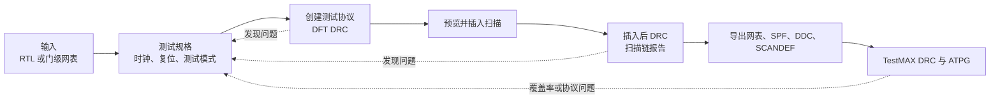

# DFT完整flow总结手册

本手册面向首次使用 Synopsys DFT Compiler（DFTC）和 TestMAX 的数字设计人员，给出从 RTL 或门级网表开始，到扫描插入（Scan Insertion）、ATPG、交付文件检查的可执行步骤。命令以本机已验证的 `V-2023.12-SP3` 为准；实际运行记录、报告位置和 ORCA 例子的数值见 [[DFTC1_2010.03实验验证记录]]。

术语采用“中文（English，缩写）”首次并列的写法；命令、报告编号、端口名和文件名保持工具原文。遇到不熟悉的报告类别，可查阅 [[../术语与翻译规范]]。

## 1. 先确定要走哪一种流程



| 入口条件 | 建议流程 | 核心输出 |
| --- | --- | --- |
| 只有 RTL | RTL 扫描流程 | 扫描后门级网表、测试协议、DFT 报告 |
| 已有综合后的 DDC 或门级网表 | 门级扫描流程 | 扫描后 DDC、网表、SPF、SCANDEF |
| 顶层很大，模块可独立处理 | bottom-up（自底向上）流程 | 模块测试模型、顶层扫描网表、完整 ATPG 结果 |
| 只检查层次边界 | 接口测试模型流程 | 测试模型读入结果、边界扫描链报告 |
| 需要减少外部扫描引脚和移位时间 | Adaptive Scan（自适应扫描）压缩流程 | 压缩扫描网表、两种 SPF、内部扫描链报告 |

> [!important] 最终 ATPG 使用什么网表
> TestMAX 必须读入完整门级网表、测试协议和所需宏模型。接口测试模型只包含边界信息，适合检查端口、时钟和测试控制；其 ATPG 数字不能作为整个芯片的故障覆盖率。

## 2. 开始前必须具备的输入

### 2.1 文件清单

| 类别 | 最少需要的文件 | 用途 |
| --- | --- | --- |
| 设计 | RTL，或综合后的 `.ddc` / 门级 Verilog | 建立当前设计 |
| 工艺库 | 标准单元 `.db`；必要时 I/O、RAM、特殊单元 `.db` | 链接单元、识别扫描触发器 |
| 宏模型 | PLL、RAM、I/O 等可分析模型 | DFT DRC 与 ATPG 分析 |
| 约束 | 时钟、复位、测试模式、端口定义 | 建立测试状态和时钟关系 |
| 初始化序列（可选） | `test_setup` 或相同内容的 SPF/STIL 段 | 在测试开始前设置控制寄存器 |

若库中没有扫描触发器，或者扫描触发器被设置为 `dont_use`，扫描插入不能得到正确结果。先用 `report_lib`、`report_cell` 或库文档确认扫描单元、`SI`、`SO`、`SE` 和时钟引脚。

### 2.2 推荐目录

```text
<project>/
├── .synopsys_dc.setup
├── scripts/
│   ├── 01_read.tcl
│   ├── 02_protocol.tcl
│   ├── 03_insert.tcl
│   └── 04_handoff.tcl
├── rtl/                         # RTL 输入；门级流程可不使用
├── mapped/                      # 原始 DDC 或门级网表
├── mapped_scan/                 # 扫描后 DDC 与 SCANDEF
├── reports/                     # DFTC 报告
├── tmax/                        # TestMAX 网表、SPF 与日志
└── logs/                        # DC 会话完整输出
```

原始输入和扫描后输出要放在不同目录。这样可以清楚确认 ATPG 使用的是扫描后网表，而不是未插入扫描的版本。

### 2.3 启动工具与库

本机的 IC 工具在容器内运行。进入目标目录后，先启动 `dc_shell`，再载入该目录的初始化文件：

```tcl
source .synopsys_dc.setup
```

若使用非交互模式，也要在命令中显式载入初始化文件：

```sh
dc_shell -no_init -x 'source .synopsys_dc.setup; source scripts/01_read.tcl; quit'
```

`-no_init` 只是不读取默认启动文件，不会自动读入项目的 `.synopsys_dc.setup`。遗漏这一步时，常见现象是库未设置、设计不能链接，或 DDC 读取后无法找到单元。

初始化文件至少应让当前目录可被搜索：

```tcl
lappend search_path . ../ref/db ./scripts
set target_library [list sc_max.db]
set link_library   [list * sc_max.db io_max.db rams_max.db special.db]
```

库名需要按项目真实文件替换。`search_path` 中的 `.` 是读取本目录相对 DDC 的必要条件。

## 3. 通用阶段与通过条件

| 阶段 | 常用命令 | 此阶段应确认的内容 |
| --- | --- | --- |
| 读入与链接 | `read_file`、`current_design`、`link` | 设计名、层次、库单元均可识别 |
| 测试规格 | `set_dft_signal`、`create_test_protocol` | 测试时钟、复位、测试模式、扫描端口已声明 |
| 扫描插入前检查 | `dft_drc`、`preview_dft` | 不可控时钟、复位和端口定义已有处理方案 |
| 扫描插入 | `insert_dft`、`report_scan_path` | 扫描链数、链端点、扫描单元数符合设定 |
| 扫描插入后检查 | `dft_drc -coverage_estimate` | 结构性问题与覆盖率估算已记录 |
| 交付 | `write`、`write_test_protocol`、`write_scan_def` | 网表、协议、DDC、SCANDEF 已写出 |
| ATPG | `run_drc`、`run_atpg -auto` | SPF 可读、扫描链可追踪、覆盖率和向量数已保存 |

不要只看 `insert_dft` 的结束信息。至少还要读取 `report_scan_path`、插入后 `dft_drc`、`check_scan_def`（如果导出 SCANDEF）以及 TestMAX 日志。

## 4. 流程 A：从 RTL 到扫描后网表

### 4.1 读 RTL 并链接

旧 VHDL 设计可能需要关闭当前工具对有限状态机的完整性假定：

```tcl
set_app_var hdlin_always_fsm_complete false
```

在 RTL 分析、展开和目标库实现后，确认当前设计：

```tcl
current_design <top_design>
link
check_design
```

`check_design` 报告的未连接输入、黑盒和多重驱动项应先分类。未连接输入不一定阻止扫描插入；时钟、复位、测试模式和扫描端口的 DFT 违规则必须优先处理。

### 4.2 声明测试规格

下面示例使用一个测试模式、三个扫描时钟、低有效复位和一组扫描端口。端口名、波形时刻和有效电平必须与设计一致。

```tcl
set_dft_signal -view existing_dft -type ScanClock -timing {45 55} -port pclk
set_dft_signal -view existing_dft -type ScanClock -timing {45 55} -port sdr_clk
set_dft_signal -view existing_dft -type ScanClock -timing {45 55} -port sys_clk

set_dft_signal -view existing_dft -type Reset -active_state 0 -port reset_n
set_dft_signal -view spec -type TestMode -active_state 1 -port TEST_MODE
set_dft_signal -view spec -type ScanEnable -active_state 1 -port TEST_SE
set_dft_signal -view spec -type ScanDataIn -port test_si
set_dft_signal -view spec -type ScanDataOut -port test_so
```

一个 `set_dft_signal -type ScanClock` 命令只声明一个端口。多个时钟写入同一个 `-port` 参数会使当前版本无法正确识别时钟。

### 4.3 创建协议并执行插入前检查

```tcl
create_test_protocol
dft_drc
```

如果新增或修改了 `-view spec` 的信号，先删除旧协议再创建：

```tcl
remove_test_protocol
create_test_protocol
```

否则 `preview_dft` 可能仍使用改动前的协议。若设计需要特定上电或配置状态，在创建协议前读入 `test_setup`，并检查日志是否显示初始化序列已被接受。

### 4.4 预览、插入与报告

```tcl
set_dft_insertion_configuration -synthesis none -preserve_design_name true
set_scan_configuration -chain_count 1 -add_lockup true -clock_mixing mix_clocks

preview_dft
insert_dft
dft_drc -coverage_estimate
report_scan_path
```

`preview_dft` 用于确认计划插入的扫描链数量、端点和 test point；`insert_dft` 才会改写当前设计。对于多时钟链，`lock-up latch`（锁存隔离单元）可隔离移位时的时钟相位差；是否允许多个时钟混合到同一条链，应由测试时钟方案决定。

### 4.5 RTL 流程的最低通过检查

- `create_test_protocol` 和 `dft_drc` 没有未处理的时钟、复位、测试模式问题。
- `preview_dft` 中的链数、ScanDataIn、ScanDataOut 与预期一致。
- `report_scan_path` 能追踪每条扫描链。
- `dft_drc -coverage_estimate` 的警告已按类别记录。
- 扫描后网表与协议已经由 TestMAX 读入。

## 5. 流程 B：从门级 DDC 开始插入扫描

门级流程通常比 RTL 流程短，但不能省略测试协议和插入后检查。

```tcl
read_file -format ddc mapped/<top_design>.ddc
current_design <top_design>
link

source scripts/02_protocol.tcl
preview_dft
insert_dft
dft_drc -coverage_estimate
report_scan_path
```

### 5.1 `UID-58`：DDC 不能读取

相对路径报 `UID-58` 时，先检查：

```tcl
echo $search_path
```

输出必须包含 `.`。缺少时执行：

```tcl
lappend search_path .
read_file -format ddc mapped/<top_design>.ddc
```

也可以给出完整路径，例如：

```tcl
read_file -format ddc /media/6/Projects/<project>/mapped/<top_design>.ddc
```

旧资料中的 `read_ddc` 在当前 DC 中不可用，应统一写为 `read_file -format ddc`。

### 5.2 VHDL 总线位端口

VHDL 读入后，总线位名称可能采用转义形式。不要把 `pad[0]` 直接写进 Tcl；方括号会被 Tcl 当作命令替换。应先取得端口集合：

```tcl
set scan_in_port  [index_collection [get_ports {pad*}] 15]
set scan_out_port [index_collection [get_ports {sd_A*}] 9]
set_dft_signal -view spec -type ScanDataIn  -port $scan_in_port
set_dft_signal -view spec -type ScanDataOut -port $scan_out_port
```

索引必须通过 `query_objects [get_ports {pad*}]` 确认后再填写。不同位宽和端口排列的设计不能直接复用示例中的数字。

## 6. 流程 C：扫描修复与 AutoFix

时钟、复位或置位在测试模式下不可控时，可先由 AutoFix 处理，再插入扫描。以下是本地 Lab 已验证的基本设置：

```tcl
set_dft_configuration -fix_set enable -fix_reset enable -fix_clock enable
set_dft_signal -view spec -type TestMode -active_state 1 -port TEST_MODE

set_dft_signal -view spec -type TestData -port Clk
set_autofix_configuration -type clock -control TEST_MODE -test_data Clk

set_dft_signal -view spec -type TestData -port Reset
set_autofix_configuration -type reset -method mux -control TEST_MODE -test_data Reset
set_autofix_configuration -type set   -method mux -control TEST_MODE -test_data Reset

remove_test_protocol
create_test_protocol
preview_dft
insert_dft
dft_drc -coverage_estimate
```

AutoFix 会加入测试控制逻辑，因此必须在功能仿真、时钟约束和面积评估中检查这些新增单元。它不能替代对异常时钟结构、异步复位和功能模式切换条件的人工审查。

## 7. 流程 D：交付给 ATPG 和物理实现

在扫描插入后的当前设计中，按下列顺序写出文件：

```tcl
file mkdir mapped_scan
file mkdir tmax

write -format verilog -hierarchy -output tmax/<top_design>_scan.v
write_test_protocol -output tmax/<top_design>_scan.spf
write_scan_def -output mapped_scan/<top_design>.scandef
check_scan_def
write -format ddc -hierarchy -output mapped_scan/<top_design>.ddc
```

| 文件 | 下游用途 | 关键检查 |
| --- | --- | --- |
| `*_scan.v` | TestMAX、门级仿真 | 语法检查、与 SPF 同一轮导出 |
| `*.spf` | TestMAX 的测试协议 | `run_drc` 能以 0 个语法错误读入 |
| `*.ddc` | DFTC 后续会话、层次化处理 | 可通过 `read_file -format ddc` 重读 |
| `*.scandef` | 物理实现中的扫描重排 | `check_scan_def` 的 `FAILED` 必须为 0 |
| `reports/` | 复查扫描链、违规和覆盖率估算 | 记录生成时间与设计版本 |

若 `check_scan_def` 显示失败，常见原因是 SCANDEF 与当前网表不是同一轮扫描插入的产物。重新从当前设计写出 SCANDEF，再立即执行 `check_scan_def`。

## 8. 流程 E：TestMAX DRC 与 ATPG

下面是适用于常规扫描设计的基本 TestMAX 脚本。库和 RAM 文件名按项目替换。

```tcl
set_command noabort
set_messages -log tmax.log -replace -level expert

read_netlist libs.v.gz
read_netlist rams.v
read_netlist <top_design>_scan.v
set_rule b5 warning
run_build

run_drc <top_design>_scan.spf
add_faults -all
run_atpg -auto

set_atpg -capture_cycles 4
run_atpg -auto
quit -force
```

执行顺序不可颠倒：先建模 `run_build`，再读协议并检查 `run_drc`，之后加入故障并运行 ATPG。`fast sequential ATPG` 使用多个捕获周期，可能检测普通 basic scan 未检测到的故障；它需要更完整的时钟、复位和初始化条件。

TestMAX 日志中至少检查：

```sh
rg -n 'End parsing STIL|successfully traced|Design rules checking was successful|test coverage|#internal patterns' tmax.log
```

应关注四项：SPF 是否可读、每条扫描链是否能追踪、DRC 是否完成、故障覆盖率和向量数是多少。DRC 警告不会必然停止 ATPG，但每个警告都应有说明，尤其是时钟、双向 I/O、三态网络、未知值和宏模型相关内容。

## 9. 流程 F：层次化扫描

### 9.1 自顶向下

所有子模块的完整 DDC 或门级网表均可见时，顶层一次完成扫描插入：

```tcl
read_file -format ddc [glob mapped/*.ddc]
current_design ORCA
link
set_scan_configuration -chain_count 6 -add_lockup true -clock_mixing mix_clocks
preview_dft
insert_dft
```

优点是 TestMAX 可直接对完整网表进行 ATPG。ORCA Lab 的实测结果为 6 条链、TestMAX 98.65%。

### 9.2 bottom-up（自底向上）

每个模块先完成扫描插入，再写出测试模型：

```tcl
read_file -format ddc mapped/${design}.ddc
current_design $design
link
source settings_insert_dft.tcl
insert_dft
write_test_model -format ddc -output test_models/${design}.ddc
write -format verilog -hierarchy -output tmax/${design}_gates.v
```

顶层读入模块测试模型，并在需要继续处理的模块处读入完整实现。顶层扫描插入增加端口后，必须重写受影响模块的门级网表和 DDC，否则 SPF 与 TestMAX 网表的端口可能不一致。

ORCA Lab 处理了 13 个模块，最终完整网表的 TestMAX 结果为 98.63%。DFTC 在只看到测试模型时得到的边界覆盖率估算较低，这是可见内部范围不同造成的，不能替代完整网表的 ATPG 结果。

### 9.3 接口测试模型

旧资料常使用接口逻辑模型（ILM，interface logic model）命令。当前 `V-2023.12-SP3` 不提供 `create_ilm`；可使用下列方式检查层次边界：

```tcl
# 模块扫描处理后
write_test_model -format ddc -output dc_ilms/${design}.ddc

# 顶层
read_test_model [glob dc_ilms/*.ddc]
```

该流程用于检查边界端口、测试时钟和扫描控制是否可以相互连接。它不是完整门级 ATPG 的替代品。

## 10. 流程 G：Adaptive Scan 压缩扫描

压缩扫描在测试引脚侧使用较少的扫描输入、输出，在芯片内部使用更多较短的扫描链。以下为 5 条外部链、最小 5 倍压缩的设置：

```tcl
set_dft_insertion_configuration -synthesis none -preserve_design_name true
set_scan_configuration -chain_count 5 -add_lockup true -clock_mixing mix_clocks

set_dft_configuration -scan_compression enable
set_scan_compression_configuration -minimum_compression 5
create_port -direction in TM_COMP
set_dft_signal -view spec -type TestMode -port TM_COMP
```

插入后分别检查两种模式：

```tcl
current_test_mode Internal_scan
dft_drc

current_test_mode ScanCompression_mode
dft_drc -coverage_estimate
```

再为两种模式分别导出协议：

```tcl
current_test_mode Internal_scan
write_test_protocol -output tmax/scan.spf

current_test_mode ScanCompression_mode
write_test_protocol -output tmax/scancompress.spf
```

ORCA Lab 实测为 5 条外部链、30 条内部链，压缩模式的 DFTC 覆盖率估算为 94.93%；TestMAX 读入 `scancompress.spf` 后，30 条内部链均成功追踪，ATPG 为 99.57%、370 个 basic scan 向量。

> [!warning] 当前版本的内部提示
> 此 Lab 的 `insert_dft` 在压缩结构处理末尾显示三条 `unknown command '_snps_array_peek'`。单独复跑确认，该信息不由脚本的实例名前缀或测试模式切换引起。若网表、两份 SPF、DDC、SCANDEF 已写出，`check_scan_def` 为 0 失败且 TestMAX DRC、ATPG 成功，可将其记录为工具内部提示；若任一后续检查失败，则应停止并检查输入库、协议和脚本。

## 11. 常见问题与处理顺序

| 现象 | 首先检查 | 处理方式 |
| --- | --- | --- |
| `UID-58`，无法读 DDC | `search_path` 是否含 `.` | 加入 `.`，使用 `read_file -format ddc`，或给出完整路径 |
| `read_ddc` 不存在 | DC 版本 | 改用 `read_file -format ddc` |
| 库或单元未找到 | 是否已 `source .synopsys_dc.setup` | 检查 `target_library`、`link_library` 和库文件路径 |
| `ELAB-1094` | 是否为旧 VHDL 有限状态机 | RTL 读入前设定 `hdlin_always_fsm_complete false`，再检查状态定义 |
| 总线位端口找不到 | Tcl 方括号与端口转义形式 | 先用 `get_ports`、`query_objects`，再用 `index_collection` |
| 改了 TestMode 或 ScanData 仍无变化 | 测试协议是否仍是旧版本 | `remove_test_protocol` 后重新 `create_test_protocol` |
| D1 时钟问题 | 测试模式下时钟能否控制 | 检查 ScanClock、时钟门控和 AutoFix 设置 |
| D3 复位问题 | 复位极性、测试模式和复位控制 | 正确声明 Reset；必要时设置 reset AutoFix |
| `TEST-451` | PLL、RAM 或 I/O 是否缺少模型 | 提供可分析模型，或明确该宏在测试中的处理方法 |
| `TEST-115` | 三态网络是否有确定驱动 | 检查使能、测试模式和 I/O 定义 |
| `S22` | 一条扫描链是否经过多个时钟 | 检查链分段、`clock_mixing` 和 lock-up latch |
| SPF 与门级网表端口不一致 | 顶层插入后模块网表是否已更新 | 重写受影响模块的门级网表、DDC 和 SPF |
| `check_scan_def` 有失败条目 | SCANDEF 与 DDC 是否同一轮生成 | 从当前扫描后设计重写 SCANDEF 并立即检查 |
| TestMAX 不能执行 | 是否在容器内、是否使用正确二进制 | 在容器中运行 `tmax64`；必要时使用完整二进制路径 |

### 11.1 处理 DRC 的优先级

1. 先处理会阻止扫描插入的建模与用户约束类违规。
2. 再处理测试时钟、复位、测试模式、ScanDataIn、ScanDataOut 和 ScanEnable。
3. 读取 `report_scan_path`，确认扫描链真的建立。
4. 处理黑盒、RAM、三态网络、双向 I/O 与跨时钟扫描链。
5. 最后在 TestMAX 中检查 SPF、链追踪、故障类别和向量数。

覆盖率低时，不要先增加向量数。先确认 DRC 警告、时钟控制、复位状态、初始化序列、宏模型和三态网络是否已经说明清楚。

## 12. 每次运行后的交付检查表

- [ ] 工具初始化文件已经读入，库和设计均链接成功。
- [ ] 测试时钟、复位、测试模式、扫描输入、扫描输出和扫描使能已确认。
- [ ] 修改测试规格后已经重建测试协议。
- [ ] `preview_dft`、`insert_dft`、`report_scan_path` 和插入后 `dft_drc` 已执行。
- [ ] 扫描后 Verilog、SPF、DDC、SCANDEF 和报告均已写出。
- [ ] `check_scan_def` 的 `FAILED` 为 0。
- [ ] TestMAX 成功读入库、网表和 SPF。
- [ ] TestMAX 成功追踪全部预期扫描链，并完成 `run_drc` 与 `run_atpg -auto`。
- [ ] 日志保存了覆盖率、向量数、警告类别和工具版本。
- [ ] 功能仿真、门级仿真、时钟约束和物理实现检查由项目流程继续完成。

## 13. 本机已验证的参考入口

| 目标 | 位置 | 已验证结果 |
| --- | --- | --- |
| 基础协议、AutoFix、顶层扫描 | `DFTC1_2010.03-lab-runtime/lab4a_protocol` 至 `lab8_topdown` | 可在当前 DFTC 版本运行 |
| 交付与 fast sequential ATPG | `DFTC1_2010.03-lab-runtime/lab9_export` | TestMAX 96.39% |
| 自顶向下与 bottom-up | `DFTC1_2010.03-lab-runtime/lab10_hicap` | TestMAX 98.65%、98.63% |
| 压缩扫描 | `DFTC1_2010.03-lab-runtime/lab12_dftmax` | TestMAX 99.57% |
| 实际运行记录 | [[DFTC1_2010.03实验验证记录]] | 脚本修改、报告文件与问题说明 |

> [!tip] 学习顺序
> 先复跑 Lab 4A、Lab 5、Lab 7，掌握协议、单链扫描和 AutoFix；随后学习 Lab 8、Lab 9 的顶层扫描、交付和 TestMAX；最后再进入 Lab 10 的层次化扫描与 Lab 12 的压缩扫描。每次只改变一个因素，并保存前后报告，最容易定位问题。
