# NPU 指令与硬件架构设计 Spec

> [!abstract] 文档目的
> 本文定义面向 Transformer、RNN、GRU 和 LSTM 整数推理的单核 NPU 规格，重点说明 128-bit 指令、模块划分、模块连接、片上存储、模块级接口和功能时序。模型张量只使用 INT8、INT16 和 INT32；复杂数学函数在专用单元内部按照 `INT → FP → INT` 的次序计算。本文可作为 RTL 设计、验证环境、模型编译器、C 驱动、Runtime、固件和 SoC 集成工作的共同输入。

| 项目   | 内容                                                                                     |
| ---- | -------------------------------------------------------------------------------------- |
| 文档状态 | 单核 NPU 目标设计规格                                                              |
| 适用对象 | 架构、RTL、验证、编译器、Runtime、固件、SoC 集成                                                        |
| 基准结构 | 1 个 NPU Core，包含 AXI Slave Frontend、CFE、TaskScheduler、执行单元、L1BUF、MIF、LSC、WDT 和 CRG |
| 参考文档 | [[NPU 设计 spec 总结]]、[[T100 NPU TOP Architecture Spec]]、[[面向Transformer和LSTM加速的NPU设计目标]] |

---

## 1. 文档约定

### 1.1 规范用语

本文使用下列用语表示要求强度：

| 用语    | 含义                                     |
| ----- | -------------------------------------- |
| 必须、不得 | RTL、固件和软件均需遵守的强制要求                     |
| 应     | 默认采用；若改变，需要在设计说明中给出原因和影响               |
| 可     | 可选功能，不影响基础指令的正确执行                      |
| P0    | 首版得到正确计算结果所必需的功能                       |
| P1    | 可由 P0 指令替代，但加入后可减少任务数量、数据搬运量或固定启动周期的功能 |
| P2    | 仅在特定模型、产品或部署场景需要时加入的功能                 |

> [!important] P0 的含义
> P0 不是只处理少量示例的临时版本。P0 必须定义完整的数值规则、数据格式、bias shape、非整 tile 处理、异常状态和测试要求。

### 1.2 缩略语

| 缩略语   | 含义                                           |
| ----- | -------------------------------------------- |
| DSA   | Domain-Specific Accelerator，专用计算加速器          |
| TS    | TaskScheduler，任务调度器                          |
| ME    | Matrix Engine，矩阵计算单元，也称 Tensor               |
| VE    | Vector Engine，向量计算单元，也称 VA                   |
| CME   | Complex Math Engine，完成复杂函数、Softmax、Norm 和按指定维度统计 |
| L1BUF | NPU Core 内的共享片上 SRAM                         |
| MIF   | Core 内部模块到系统总线的 AXI Master 接口桥                    |
| LSC   | 本地系统控制器                                      |
| GADDR | 全局物理地址，用于 DDR 或外设空间                          |
| LADDR | 当前 Core 的 L1BUF 字节地址                         |
| CMD   | 任务命令头                                        |
| TC    | Task Context，发射时由任务表中的指令和提交时基地址快照展开的执行单元任务信息 |

### 1.3 设计范围

本文覆盖：

1. 单个 NPU Core 的顶层接口与内部连接；
2. 外部主控 CPU 经 SoC AXI Fabric 访问 NPU AXI Slave 的命令、控制和 L1BUF 接口；
3. TaskScheduler、DMA、Matrix、Vector、CME、L1BUF、MIF 和 LSC；
4. 由两个 64-bit beat 组成的 128-bit 指令，以及各操作的 80 bit payload；
5. INT8、INT16、INT32 的 GEMM、BMM、逐元素运算、按维度统计、特殊函数和多维 DMA；
6. 单核事件、完成通知和错误传播；
7. 上电、复位、初始化、任务启动、任务完成和低功耗时序；
8. 模块级接口和基础验证要求。

下列物理参数允许不同芯片实现采用不同数值，但必须通过 RTL 参数和只读功能寄存器明确给出。第 2.2 节和第 20 节给出当前 RTL 的固定参考值：

- Matrix 的物理阵列规模、逻辑 tile 大小与标量分支计算速率；
- Vector 标量分支每次处理的元素数与共享 PE 每次请求的乘积数；
- L1BUF 总容量、bank 数和每个 bank 的端口数；
- AXI outstanding 深度；
- 具体工艺下的 SRAM 和乘法器实现；
- P1、P2 功能是否进入具体芯片版本。

多核扩展不属于本版 P0 范围。首版 RTL 不实现多核 Barrier、远端 L1BUF 访问或跨核任务调度；命令头中不包含 `core_id`。

---

## 2. 顶层设计目标与配置参数

### 2.1 顶层设计目标

NPU 子系统必须满足以下要求：

1. Matrix、Vector、CME 和 DMA 通过 L1BUF 交换张量；Matrix、Vector 与 CME 不直接读取 DDR。
2. TaskScheduler 只调度已经由编译器生成的有限长度任务，不解析完整模型图。
3. 每条异步任务都具有命令编号和明确的成功或失败状态；完成事件可选，`signal=8'hff` 时只保留可查询的终态记录。
4. 地址引用、尺寸、数据格式和操作选项由指令直接给出，同一套 RTL 可执行不同 Batch Size、序列长度、Head 数和 Feature 宽度。
5. NPU Core 可独立启动、复位、改变工作频率和关闭电源。
6. 首版任务只在一个 Core 内执行，不依赖其他 Core 的计算结果或片上存储。
7. DDR Channel 选择或交织方式由 SoC 配置决定，NPU 指令不因该配置变化而改变。
8. 地址错误、命令字段错误、数据格式不被接受、依赖任务失败和看门狗超时必须产生可读取的错误状态。
9. DDR 和 L1BUF 中的模型张量只采用 INT8、INT16、INT32；FP32 可以作为只读 scale、$\epsilon$、函数系数或查找表元数据，也可以用于复杂数学函数的内部计算过程，但不能作为软件可见的模型张量格式。
10. Matrix 与 Vector 是两类调度任务，由 `npu_matrix_vector_engine` 统一接收任务。Matrix 内含 Outer context 与 Scalar context：Outer context 使用独立的 16×16 外积 PE 阵列执行整块矩阵乘法；Scalar context 执行逐元素乘加与后处理，并与 Vector 的 MUL/FMA 使用共享多精度 MAC PE。三个 context 通过内部存储通道访问 L1BUF。
11. Generic Core 是 NPU 外部的主控 CPU，不属于 NPU RTL。它通过软件驱动发起 AXI 访问，不使用 NPU 内部取指端口或自定义指令端口。
12. NPU 对外提供 AXI Slave 和 AXI Master：AXI Slave 接收指令、CSR 与 L1BUF 窗口访问；AXI Master 由 DMA/MIF 发起全局内存访问。

### 2.2 基准配置

| 参数             | 符号或 RTL 参数名       |             基准值 | 状态     | 说明                                    |
| -------------- | ----------------- | --------------: | ------ | ------------------------------------- |
| NPU Core 数     | `N_CORE`          |               1 | 本文定义   | 首版只实现单核                               |
| 系统总线数据宽度       | `BUS_DATA_W`      |          64 bit | 用户要求   | AXI 和模块间数据流统一使用                         |
| L1BUF 客户端数据宽度 | `L1_DATA_W`       |          64 bit | 用户要求   | 每个请求 beat 为 8B                        |
| 全局物理地址宽度       | `PA_W`            |          40 bit | 基准定义   | DMA 与 MIF 的系统地址使用                      |
| 指令地址容器宽度       | `GADDR_W`         |          48 bit | 本文定义   | 高于 `PA_W-1` 的 bit必须为 0                 |
| 命令头宽度          | `CMD_W`           |         128 bit | 本文定义   | 在 64-bit 接口上按低 64 bit、再高 64 bit传送 |
| 命令 beat 数       | `CMD_BEATS`       |               2 | 本文定义   | 每个 beat 为 64 bit                         |
| 事件表项数          | `EVENT_NUM`       |             255 | 本文定义   | Event ID 为 0～254；每项含状态与 4-bit 代次      |
| 单 Core 任务槽数   | `TASK_SLOTS`        |              16 | RTL 基准配置 | RTL 按该参数生成任务表、前序位图和逐槽检查器；参数测试覆盖 1、3、5，终态记录在 ACK 前继续占用槽                       |
| CFE FIFO 深度      | `CFE_FIFO_DEPTH`  |               8 | C model 参考配置 | 每项保存一个完整的 128-bit CMD                  |
| 第二 beat 等待上限   | `CFE_BEAT_TIMEOUT` |      32 cycles | C model 参考配置 | 收到低 64 bit 后等待高 64 bit 的最大周期数          |
| DMA 连续复制最大元素数 | `DMA_MAX_COUNT` |         1048575 | 由指令中的字段决定 | COPY 与 FILL 的 20 bit `count` 最大值          |
| DDR 交织粒度       | `DDR_INTLV_BYTES` |            256B | 参考设计确定 | 半静态配置                                 |
| FPGA 目标频率      | `CORE_FMAX`       |          100MHz | 当前实现目标 | `xc7a200tfbg484-3`，时钟周期 10ns             |
| L1BUF 容量       | `L1_BYTES`        |           1 MiB | C model 参考配置 | 每 Core 独立配置                           |
| L1BUF bank 数   | `L1_BANKS`        |              16 | C model 参考配置 | bank 采用 64-bit 单端口 1RW                  |
| L1 SRAM 读延迟    | `L1_RD_LATENCY`   |        2 cycles | C model 参考配置 | 从读请求握手后的下一周期开始计算                     |
| L1 等待计数器 | — | 已实现 | 当前 RTL | 记录 Matrix 请求未被 L1 接收或等待返回的周期 |
| Matrix context 数 | — | 2 | 当前 RTL | context0 是 Outer context并含本地部分和 RAM；context1 是 Scalar context |
| 共享 PE group 数 | — | 4 | 当前 RTL | 每组 16 个 4×4 基础乘法器，Matrix 与 Vector MUL/FMA 共用 |
| Matrix-Vector 旁路缓存项数 | `BYPASS_ENTRIES` | 2 | 单核顶层配置 | 每项保存一个 64-bit beat 的地址标签、数据和逐字节有效位 |
| Matrix-Vector L1 请求 FIFO | — | 2 项 × 93 bit | 当前 RTL | 非直通；保存 write、20-bit addr、64-bit wdata 和 8-bit wstrb |
| Outer PE 阵列 | `PE_M×PE_N` | `16×16` | 当前 RTL | 256 个 PE；INT8 每个 PE 每拍完成 4 个 8×8 乘法并按 INT24 保存局部和，INT16 使用 INT48 局部和 |
| Matrix B tile | `MT×KT×NT` | `8×16×8` | 当前格式配置 | 当前 Outer 分支按行组、列组和 K 小段推进；B 以 `16×8` 小块保存 |
| Matrix 临时累加宽度 | `accum_q`        |          64 bit | 当前 RTL | signed32 乘积经符号扩展后加入 signed64 累加寄存器 |
| Matrix Scalar context 计算速率 | — | 1 个乘积/计算步骤 | 当前 RTL | context1 每次向共享 PE 提交一个逐元素乘法请求 |
| Vector 标量分支处理数 | — | 1 个元素/计算步骤 | 当前 RTL | 每个源读请求和目的写请求均等待对应响应 |
| Vector 连续 MUL 每次请求的乘积数 | — | INT16 为 1、INT8 为 4 | 当前 RTL | 使用共享 PE；INT16、INT8 对同一个输入 beat分别提交 4、2 次请求 |
| CME 同时接受数学请求数 | — | 1 | 当前 RTL | 共享数学单元完成当前请求后再接受下一项 |
| CME 私有 FP32 数组 | — | 0 | 当前 RTL | 当前使用标量和每行统计寄存器，不包含 4096 项暂存数组 |
| DMA 未完成存储请求数 | `DMA_OUTSTANDING` |           1 | 当前 RTL | DMA 等待当前 L1BUF 或 MIF 响应后再发下一项请求 |
| MIF 未完成事务数 | `MIF_OUTSTANDING` |           1 | 当前 RTL | MIF 完成当前 AXI 事务后再接收下一项请求 |
| MIF AXI burst 长度 | `MIF_AXI_BURST_BEATS` | 读 1～16 beat，写 1 beat | 当前 RTL | 正常 DMA 指令的一次对齐读最多 8 beat；模块级 Task Context 可给出 1～16 beat |
| 模型张量格式集合       | `MODEL_DTYPE_SET` | INT8、INT16、INT32 | 当前设计   | DMA、L1BUF、Matrix 和 Vector 的软件可见张量格式   |
| Matrix 部分和格式 | `MAT_PARTIAL_DTYPE` | INT32 | 用户要求 | `GEMM_ACCUM`、`GEMM_ZERO` 的 L1 C 和 Outer context 本地部分和 RAM 使用 INT32；计算阶段使用 signed64 |
| 内部浮点工作格式       | `CME_FP_DTYPE`    |            FP32 | 本文基准定义 | 当前只存在于 Complex Math Engine 的状态和统计寄存器 |

> [!note] 参数化要求
> `L1_BYTES`、`L1_BANKS`、`MT`、`KT`、`NT`、共享 PE group 数、Vector 连续 MUL 每次请求的乘积数和 CME 数学请求数
> 不得由软件写死。软件通过只读功能寄存器取得这些数值，再选择 tile 和任务拆分方式。

> [!note] `TASK_SLOTS` 的当前使用范围
> `TASK_SLOTS` 是 RTL 构建参数，当前软件接口与基准单核配置固定使用 16 个任务槽。1、3、5 槽配置用于验证计数器回绕和逐槽检查逻辑，不表示软件可以在运行期间改变任务槽数。若产品需要提供其他任务槽数，应先增加只读能力寄存器，再让驱动根据读取值决定每批可提交的任务数。

> [!note] C model 参考配置的作用
> 表中的 C model 参考值用于当前软件模型、测试向量和简单周期模型。后续 RTL 可以通过只读功能寄存器公布不同物理值，但不得改变指令中各字段的解释、整数结果或 ready/valid 规则。C model 分别由 Core tick 与 NoC tick 推进；常规回归默认按 `core_clk:noc_clk=1:1` 调用，也支持两者采用不同的整数 tick 节奏。DDR 读请求到首个返回 beat 的固定延迟为 20 个 NoC 存储目标 tick，连续返回时每个 NoC tick 最多一个 beat；写请求在最后一个数据 beat 握手后 12 个 NoC 存储目标 tick 返回响应。

> [!important] 64-bit 总线要求
> 所有软件可见总线均以 64 bit 为一个 beat。一条指令固定使用两个 beat，传送顺序为低 64 bit在前、高 64 bit在后。Scalar 与 Vector 的乘法使用共享 MAC PE；Outer 使用独立 PE 阵列。当前 RTL 的 Outer、Scalar 和 Vector 通过合并单元访问一组 64-bit L1 请求端口，端口前设置深度为 2 的寄存请求 FIFO。

> [!warning] 大矩阵吞吐率的当前限制与后续硬件要求
> `tvm_large_matrix` 的 RTL 统计表明，当前 TVM 程序的矩阵任务全部进入 Scalar context，Outer PE 阵列计数为 0。因此该用例只能证明 TVM 到 RTL 的结果正确，不能证明 Outer PE 的利用率。
>
> 对 64×64×1024 的 INT8 MatMul，16×16 阵列每拍可完成 `16×16×4=1024` 个乘积。即使 A、B 面板已经完整复用，读取 A 与 B 共需 131072 B；单个 64-bit L1 读端口每拍提供 8 B，理论上限为 `4194304 / (131072 / 8) = 256` 个乘积每拍，即 PE 时间利用率不超过 25%。当前控制器逐元素经过 A 请求、A 返回、B 请求、B 返回阶段，实际供数占比远低于该上限。
>
> 因而，85% 的端到端 PE 时间利用率不是当前单请求 L1 接口可以达到的指标。后续硬件必须在保持外部 AXI 64-bit 的前提下，提供至少 4 个并行的 64-bit Matrix 面板读端口、独立的结果写回端口、双缓冲 A/B 面板和跨 M/N tile 的面板复用。编译器还必须按 bank 分配 A、B、C 的 L1 地址，避免同拍访问同一 bank。上述内部接口尚未进入当前 RTL，不能写为已实现功能。

### 2.3 整数推理与内部浮点计算

#### 2.3.1 软件可见的数据格式

模型输入、权重、bias、中间张量、KV Cache 和模型输出只允许以下三种整数格式：

| 格式 | 数值范围 | 典型用途 | 存储方式 |
| --- | ---: | --- | --- |
| INT8 | $[-128,127]$ | 激活、权重、门值、Softmax 或 Norm 的整数输出 | 每个元素一个字节 |
| INT16 | $[-32768,32767]$ | 回归输入、回归权重、需要更细数值间隔的中间张量或输出 | 每个元素两个字节，低地址保存低 8 bit |
| INT32 | $[-2^{31},2^{31}-1]$ | Matrix 累加结果、bias、需要较大数值范围的中间结果 | 每个元素四个字节 |

P0 采用有符号二进制补码。INT16 和 INT32 均按小端字节次序保存。例如，INT16 数值 `0x1234` 在较低地址保存 `0x34`，在下一地址保存 `0x12`。

> [!important] 数据格式编码 0 的处理
> 指令中的 2-bit 数据格式编码保持 `1=INT8`、`2=INT32`、`3=INT16`。编码 0 为保留值，不能作为任何有效输入、权重、中间张量或输出的数据格式。编译器和驱动不得生成编码 0。正常指令入口在内联解码时拒绝该编码并建立 `BAD_DESC` 终态；模块级 Task Context 直接把编码 0 送入执行单元时返回 `DTYPE_UNSUPPORTED`。

> [!important] FP 不是模型张量格式
> FP32 中间结果只允许存在于 Complex Engine 的状态寄存器、标量寄存器或后续设计明确增加的内部暂存区。当前 RTL 使用状态寄存器和每行统计寄存器，不实现 FP32 暂存数组。FP32 scale、$\epsilon$、函数系数和查找表可以由指令中的字段确定，或保存在任务指定的 L1BUF 参数区，但不能被选择为模型输入、权重、中间张量、KV Cache 或模型输出的数据格式。指令中的张量 dtype 不得选择任何浮点格式。

#### 2.3.2 整数值所表示的实数

设整数张量中的元素为 $q$，缩放系数为 $s>0$，zero point 为 $z$，则它所表示的实数为：

$$
x_{\mathrm{fp}}=(q-z)s.
$$

各符号含义如下：

| 符号 | 含义 |
| --- | --- |
| $q$ | INT8、INT16 或 INT32 的存储值 |
| $z$ | 与 $q$ 使用相同数值范围的整数 zero point |
| $s$ | FP32 缩放系数；它由指令中的字段或任务拥有的 L1BUF 参数区提供，不是模型张量 |
| $x_{\mathrm{fp}}$ | 专用单元内部使用的 FP32 数值 |

P0 Matrix 输入采用对称形式，即 $z=0$。激活函数、Softmax 和 Norm 的参数由指令中的字段或 L1BUF 参数区提供；若当前 RTL 只接受 $z=0$，收到非零 zero point 时必须返回 `BAD_DESC`，不得静默忽略。

#### 2.3.3 `INT → FP → INT` 计算次序

Sigmoid、Tanh、GELU、SiLU、Exp、Reciprocal、ReciprocalSqrt、Softmax、LayerNorm 和 RMSNorm 按以下次序处理：

1. 从 L1BUF 读取 INT8、INT16 或 INT32。
2. 执行符号扩展，得到 INT32。
3. 根据输入 $s_x,z_x$ 转为内部 FP32：

   $$
   x_{\mathrm{fp}}=(q_x-z_x)s_x.
   $$

4. 在 FP32 流水中执行指定数学函数。
5. 使用输出 $s_y,z_y$ 转回整数：

   $$
   q_y=
   \operatorname{clip}_{[q_{\min},q_{\max}]}
   \left(
   \operatorname{round}\left(\frac{y_{\mathrm{fp}}}{s_y}\right)+z_y
   \right).
   $$

6. 将 INT8、INT16 或 INT32 结果写回 L1BUF。

其中 `round_mode` 必须明确选择最接近偶数、向零、向正无穷或向负无穷；P0 默认使用最接近偶数。`clip` 把结果限制在目的整数格式的数值范围内。

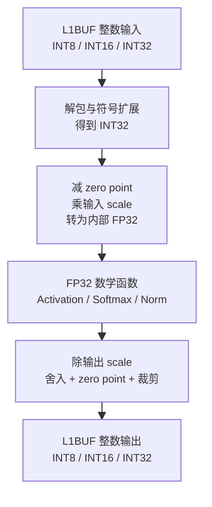
```mermaid
%%{init: {"flowchart": {"useMaxWidth": true, "nodeSpacing": 12, "rankSpacing": 18}, "themeVariables": {"fontSize": "11px"}}}%%
flowchart TB
    I["L1BUF 整数输入<br/>INT8 / INT16 / INT32"]
    EXT["解包与符号扩展<br/>得到 INT32"]
    I2F["减 zero point<br/>乘输入 scale<br/>转为内部 FP32"]
    FUNC["FP32 数学函数<br/>Activation / Softmax / Norm"]
    F2I["除输出 scale<br/>舍入 + zero point + 裁剪"]
    O["L1BUF 整数输出<br/>INT8 / INT16 / INT32"]

    I --> EXT --> I2F --> FUNC --> F2I --> O
```

#### 2.3.4 Matrix 的整数计算

Matrix 子系统支持 INT8 和 INT16 输入。A 与 B 必须使用相同的数据格式。完整 16×16 输出 tile 的普通 `GEMM` 由 Outer 的独立 PE 阵列执行；未满足该条件的 Matrix 任务由 Scalar context 通过共享 MAC PE 执行。两种路径都先对输入元素进行符号扩展，再执行有符号乘法。Scalar 的乘积加入 signed 64-bit 临时累加寄存器；Outer 在阵列中保留 INT8 的 signed24 或 INT16 的 signed48 临时累加值，随后扩展为写回使用的 INT32 结果。先定义不含 bias 的乘累加结果：

$$
p_{m,n}
=\sum_{k=0}^{K-1}
q^A_{m,k}q^W_{k,n}.
$$

各符号含义如下：

| 符号 | 含义 |
| --- | --- |
| \(m\) | 输出行编号，范围为 \(0\) 到 \(M-1\) |
| \(n\) | 输出列编号，范围为 \(0\) 到 \(N-1\) |
| \(k\) | 乘累加方向的编号，范围为 \(0\) 到 \(K-1\) |
| \(q^A_{m,k}\) | A 矩阵第 \(m\) 行、第 \(k\) 列的有符号整数 |
| \(q^W_{k,n}\) | B 或权重矩阵第 \(k\) 行、第 \(n\) 列的有符号整数 |
| \(p_{m,n}\) | 尚未加入 bias 的临时累加结果 |

当前 Matrix 整数路径要求输入 zero point 为 0，因此公式中不再写减 zero point。`GEMM` 可以加入形状为 \([N]\) 的 INT32 bias：

$$
a_{m,n}=p_{m,n}+b^{\mathrm{acc}}_n.
$$

这里的 \(b^{\mathrm{acc}}_n\) 是 bias 数组的第 \(n\) 个 INT32 元素。同一个值会加到第 \(n\) 列的每一行，也就是 \(a_{0,n},a_{1,n},\ldots,a_{M-1,n}\)。它不会加到其他列。`BMM` 指令没有 bias 字段；BMM 需要 bias 时，编译器必须在 BMM 后安排 Vector 或 CME 任务。

若模型中的实数 bias 为 $b_n$，则编译器预先计算：

$$
b_n^{\mathrm{acc}}
=
\operatorname{round}
\left(
\frac{b_n}{s_As_{W,n}}
\right).
$$

因此第 $n$ 个 INT32 bias 与第 $n$ 个输出通道的累加值使用相同的实数单位。

公开指令有两种写回方式：

1. 目的格式为 INT32 时，执行饱和后写回 \(a_{m,n}\)。
2. 目的格式为 INT8 或 INT16 时，使用指令中的 5-bit `requant_shift`。公开指令固定乘数为 1、整数 zero point 为 0，并使用最接近且中点取偶数的舍入方式。

令 \(r=\texttt{requant\_shift}\)，其范围为 0～31，则非 INT32 输出为：

$$
q^Y_{m,n}
=
\operatorname{clip}_{D}
\left(
\operatorname{round\_shift}(a_{m,n},r)
\right).
$$

\(D\) 表示目的整数格式。`clip` 把结果限制在该格式的数值范围内，例如 INT8 的范围是 \([-128,127]\)。当 \(r=0\) 时不移动数值；当 \(r>0\) 时，相当于除以 \(2^r\) 后舍入。

当 \(r>0\) 时，对最接近且中点取偶数的方式，先令：

$$
u=|v|,\qquad
q=\left\lfloor\frac{u}{2^r}\right\rfloor,\qquad
d=u-q2^r.
$$

\(v\) 是移位前的 signed 64-bit 值，\(u\) 是它的非负幅值，\(q\) 是除法得到的整数部分，\(d\) 是被移除部分形成的余数。若 \(d>2^{r-1}\)，则把 \(q\) 加 1；若 \(d=2^{r-1}\) 且 \(q\) 为奇数，也把 \(q\) 加 1；其他情况保持 \(q\)。最后恢复 \(v\) 的正负号。例如，\(13/2=6.5\) 得到 6，\(15/2=7.5\) 得到 8。

这里的 $u$ 必须用无符号幅值表示。若 $v$ 是 64-bit 二进制补码，C model 使用：

```text
v >= 0: u = uint64(v)
v <  0: u = (~uint64(v)) + 1
```

因此 `v=INT64_MIN` 时仍可得到 \(u=2^{63}\)，不会触发 C 语言的有符号溢出。

设 A、B 和输出的实数缩放系数分别为 \(s_A\)、\(s_W\) 和 \(s_Y\)。公开指令只能直接表示：

$$
\frac{s_As_W}{s_Y}\approx2^{-r}.
$$

若模型需要任意整数乘数、按输出列分别使用参数、负移位、非零输出 zero point 或其他舍入方式，编译器不能假定 Matrix 指令能够直接完成。它必须调整前后张量的缩放系数，或安排后续 Vector/CME 任务。

> [!note] 模块级直接 Task Context 的测试能力
> `npu_matrix_scalar_engine` 内部仍保留从 L1BUF 读取整数参数表的接口，模块级测试可以覆盖按列乘数、signed 8-bit shift 和四种舍入方式。这些字段没有对应的公开指令位段，常规指令解码固定生成乘数 1、shift 0～31、zero point 0 和最接近且中点取偶数。编译器与驱动只能依照公开指令能力生成程序。

> [!important] Matrix 内没有 FP32 数据通路
> \(s_A\)、\(s_W\) 和 \(s_Y\) 只供编译器分析数值范围。Matrix 运行时只做整数乘法、整数累加、整数右移、舍入与裁剪。需要复杂函数或两个不同 scale 张量相加时，编译器发射 CME 任务。

#### 2.3.5 复杂函数不得拆成软件可见的 FP 张量

`I2F` 和 `F2I` 是执行单元内部步骤，不设置“把 FP 张量写入 L1BUF”的独立 P0 指令。例如 Softmax 不能先把 Exp 的 FP32 结果写回 L1BUF，再由另一条任务读取；它应由一条行级任务完成多遍整数读取和内部 FP32 统计：

1. 第一遍读取整数输入并计算行最大值；
2. 第二遍重新读取整数输入，计算 $\exp(x_i-m)$ 并累加分母；
3. 第三遍再次读取整数输入，重新计算指数、除以分母并转换为整数输出。

该方法增加 L1BUF 读取次数，但保证软件可见张量始终是 INT8、INT16 或 INT32。若后续芯片增加足够大的 CME 私有暂存区，可缓存第二遍的 FP32 指数结果，以减少第三次读取；接口行为不变。

---

## 3. 整体架构与模块连接

### 3.1 单核 NPU 子系统结构

Generic Core 是 SoC 中的外部主控 CPU，不包含在 NPU 子系统内。CPU 上运行的模型 Runtime 和 C 驱动负责配置寄存器、装载数据、提交指令、等待完成状态以及执行需要软件处理的模型操作。CPU 与 NPU 都连接 SoC AXI Fabric：CPU 从 Master 端口发起访问；NPU 的控制前端作为 Slave 接收访问；NPU 的 MIF 作为 Master 发起 DMA 全局内存访问。DDR 也是 SoC AXI Fabric 上的存储目标。

下图采用纵向排列。每条连线都连接到明确端口；图中的 SoC AXI Fabric 是 CPU、NPU 和 DDR 之间的系统互连。

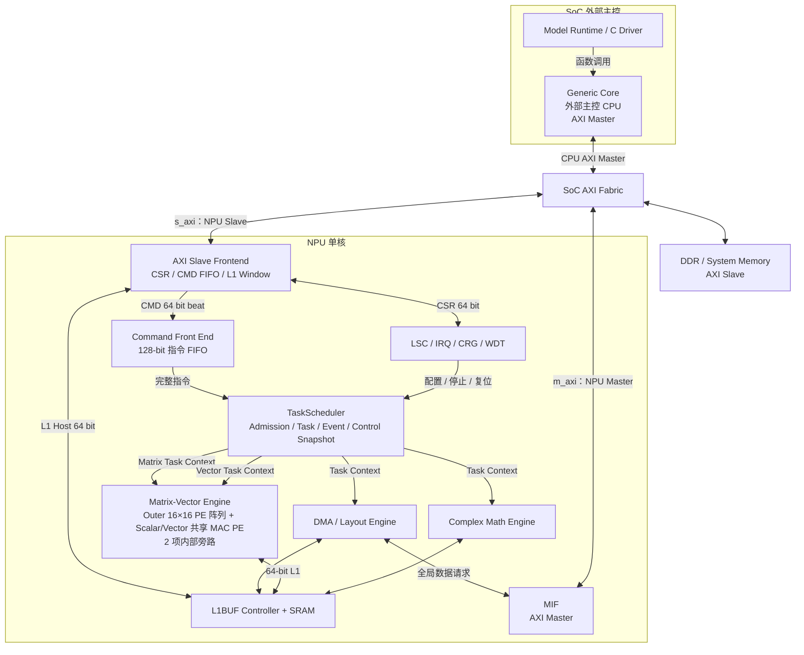
```mermaid
%%{init: {"flowchart": {"useMaxWidth": true, "nodeSpacing": 18, "rankSpacing": 24}, "themeVariables": {"fontSize": "13px"}}}%%
flowchart TB
    subgraph HOST["SoC 外部主控"]
        direction TB
        SW["Model Runtime / C Driver"]
        CPU["Generic Core<br/>外部主控 CPU<br/>AXI Master"]
        SW -->|"函数调用"| CPU
    end

    FABRIC["SoC AXI Fabric"]
    DDR["DDR / System Memory<br/>AXI Slave"]

    subgraph SUB["NPU 单核"]
        direction TB
        AXIS0["AXI Slave Frontend<br/>CSR / CMD FIFO / L1 Window"]
        LSC0["LSC / IRQ / CRG / WDT"]
        CFE0["Command Front End<br/>128-bit 指令 FIFO"]
        TS0["TaskScheduler<br/>Admission / Task / Event / Control Snapshot"]
        MVE0["Matrix-Vector Engine<br/>Outer 16×16 PE 阵列 + Scalar/Vector 共享 MAC PE<br/>2 项内部旁路"]
        CE0["Complex Math Engine"]
        DMA0["DMA / Layout Engine"]
        L10["L1BUF Controller + SRAM"]
        MIF0["MIF<br/>AXI Master"]

        AXIS0 -->|"CMD 64 bit beat"| CFE0
        AXIS0 <-->|"CSR 64 bit"| LSC0
        AXIS0 <-->|"L1 Host 64 bit"| L10
        CFE0 -->|"完整指令"| TS0
        LSC0 -->|"配置 / 停止 / 复位"| TS0
        TS0 -->|"Task Context"| DMA0
        TS0 -->|"Matrix Task Context"| MVE0
        TS0 -->|"Vector Task Context"| MVE0
        TS0 -->|"Task Context"| CE0
        DMA0 <--> L10
        MVE0 <-->|"64-bit L1"| L10
        CE0 <--> L10
        DMA0 <-->|"全局数据请求"| MIF0
    end

    CPU <-->|"CPU AXI Master"| FABRIC
    FABRIC <-->|"s_axi：NPU Slave"| AXIS0
    MIF0 <-->|"m_axi：NPU Master"| FABRIC
    FABRIC <--> DDR
```

系统连接必须遵守以下规则：

- Generic Core 属于 SoC 主控系统，不属于 NPU 顶层，也不出现在 NPU RTL 端口中。
- Generic Core 通过 SoC AXI Fabric 访问 NPU 的 `s_axi_*`。命令、CSR 和 L1BUF 外部窗口共用该 AXI Slave 接口。
- 指令写入固定 CMD FIFO 地址，采用 64 bit FIXED burst；主控先写低 word，再写高 word。
- NPU 的 `m_axi_*` 由 MIF 驱动，经 SoC AXI Fabric 访问 DDR 或系统允许的其他存储目标。
- DMA 是 NPU 发起全局内存访问的执行单元。
- Matrix-Vector Engine 和 CME 的张量操作数均从当前 Core 的 L1BUF 读取。
- TaskScheduler 直接解码指令，并在片上生成内部 Task Context；MIF 不读取外部任务参数块。
- Matrix-Vector Engine 和 Complex Math Engine 不连接 MIF。
- 首版不提供多核 Barrier 或远端 L1BUF 数据通路。

### 3.2 单 Core 内部结构

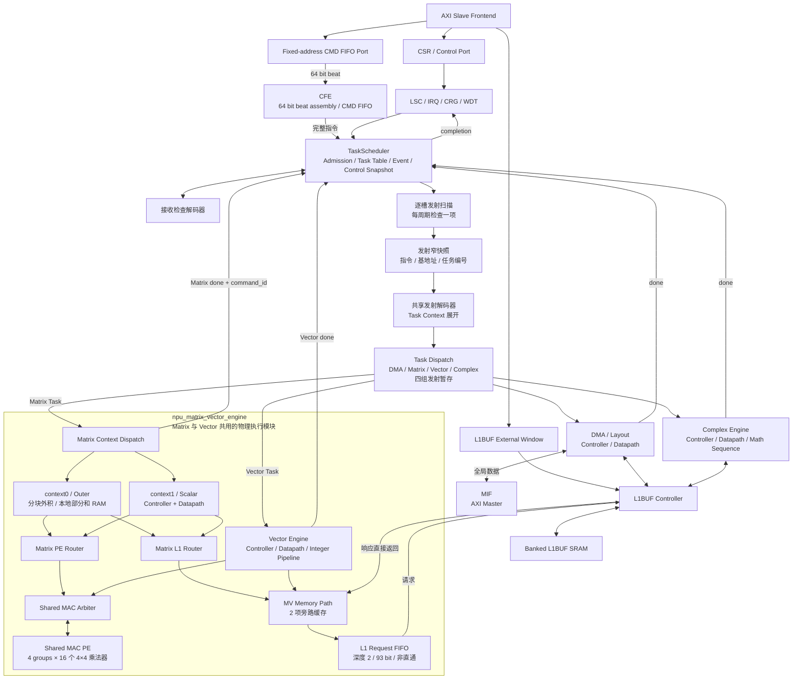
```mermaid
%%{init: {"flowchart": {"useMaxWidth": true, "nodeSpacing": 18, "rankSpacing": 24}, "themeVariables": {"fontSize": "13px"}}}%%
flowchart TB
    AXIS["AXI Slave Frontend"]
    CSR["CSR / Control Port"]
    CMD["Fixed-address CMD FIFO Port"]
    HOSTL1["L1BUF External Window"]
    CFE["CFE<br/>64 bit beat assembly / CMD FIFO"]
    TS["TaskScheduler<br/>Admission / Task Table / Event / Control Snapshot"]
    CHECK["接收检查解码器"]
    SCAN["逐槽发射扫描<br/>每周期检查一项"]
    SNAP["发射窄快照<br/>指令 / 基地址 / 任务编号"]
    DEC["共享发射解码器<br/>Task Context 展开"]
    DISP["Task Dispatch<br/>DMA / Matrix / Vector / Complex<br/>四组发射暂存"]
    DMA["DMA / Layout<br/>Controller / Datapath"]
    CME["Complex Engine<br/>Controller / Datapath / Math Sequence"]
    L1C["L1BUF Controller"]
    SRAM["Banked L1BUF SRAM"]
    MIF["MIF<br/>AXI Master"]
    LSC["LSC / IRQ / CRG / WDT"]

    subgraph MVE["npu_matrix_vector_engine<br/>Matrix 与 Vector 共用的物理执行模块"]
        direction TB
        MDISP["Matrix Context Dispatch"]
        C0["context0 / Outer<br/>分块外积 / 本地部分和 RAM"]
        C1["context1 / Scalar<br/>Controller + Datapath"]
        MPR["Matrix PE Router"]
        MLR["Matrix L1 Router"]
        VEC["Vector Engine<br/>Controller / Datapath / Integer Pipeline"]
        SHMAC["Shared MAC Arbiter"]
        MVPE["Shared MAC PE<br/>4 groups × 16 个 4×4 乘法器"]
        MVMEM["MV Memory Path<br/>2 项旁路缓存"]
        REQF["L1 Request FIFO<br/>深度 2 / 93 bit / 非直通"]

        MDISP --> C0
        MDISP --> C1
        C0 --> MPR
        C1 --> MPR
        MPR --> SHMAC
        VEC --> SHMAC
        SHMAC <--> MVPE
        C0 --> MLR
        C1 --> MLR
        MLR --> MVMEM
        VEC --> MVMEM
        MVMEM --> REQF
    end

    AXIS --> CSR --> LSC
    AXIS --> CMD -->|"64 bit beat"| CFE
    AXIS --> HOSTL1 --> L1C
    CFE -->|"完整指令"| TS
    TS <--> CHECK
    TS --> SCAN
    SCAN --> SNAP
    SNAP --> DEC
    DEC --> DISP
    DISP --> DMA
    DISP -->|"Matrix Task"| MDISP
    DISP -->|"Vector Task"| VEC
    DISP --> CME
    DMA <--> L1C
    REQF -->|"请求"| L1C
    L1C -->|"响应直接返回"| MVMEM
    CME <--> L1C
    L1C <--> SRAM
    DMA <-->|"全局数据"| MIF
    DMA -->|"done"| TS
    MDISP -->|"Matrix done + command_id"| TS
    VEC -->|"Vector done"| TS
    CME -->|"done"| TS
    TS -->|"completion"| LSC
    LSC --> TS
```

图中 DMA、Matrix-Vector Engine 和 Complex Math Engine 是三个物理执行模块。TaskScheduler 仍保留 DMA、Matrix、Vector 和 Complex 四类任务接口；其中 Matrix 与 Vector 两类任务都进入 Matrix-Vector Engine，但使用彼此独立的任务握手、发射暂存、active 记录和完成接口。

### 3.3 模块职责

| 模块                       | 输入                      | 输出                               | 主要动作                                                 |
| ------------------------ | ----------------------- | -------------------------------- | ---------------------------------------------------- |
| AXI Slave Frontend       | 外部主控发起的 `s_axi_*` AW/W/B/AR/R | CSR 请求、CMD beat、L1 Host 请求、AXI 响应 | 检查 AXI 属性，接收固定地址 CMD burst，处理 CSR 和 L1BUF 外部窗口 |
| Command Front End        | 64-bit 指令 beat、Task 表编号查询结果 | 完整指令、每条命令的接收响应 | 组合低高两个 word，检查操作码和重复 `command_id`，保存完整指令 |
| Command FIFO             | 完整指令             | 排队后的完整指令                       | 吸收前端突发提交，维持接收顺序                                      |
| Command Admission        | CFE 队首指令、当前基地址、Event Table 和任务状态 | 一项接纳寄存记录 | 保存检查结果、事件引用、前序任务位图、目标槽、完整指令和基地址；下一周期写任务表 |
| Event Table / Scoreboard | CMD 中的依赖事件、各单元完成消息      | 可发射任务、事件状态、错误状态                  | 检查依赖、保存任务状态、传播错误                                     |
| Inline Decode            | 指令、任务表保存的基地址快照       | 接收检查结果或内部展开的 Task Context | 接收检查实例判断字段是否合法；共享发射实例根据窄快照生成 Task Context，均不访问全局内存 |
| Task Decode / Dispatch   | 任务表中的指令与基地址快照   | 各执行单元任务 | 每周期检查一个非 Control 任务槽；轮末复查后保存发射窄快照。Control 获胜项保存槽号和提交序号，下一周期复查并执行 |
| Matrix-Vector Engine 顶层 | Matrix 与 Vector Task Context、L1BUF 数据 | 矩阵和向量结果、两组完成消息 | `npu_matrix_vector_engine` 是物理集成层，连接双 Matrix context、Vector 顶层、共享多精度 MAC PE、内部存储通道和旁路缓存；不保存逐元素操作数、乘加值或结果 RAM |
| Matrix Dual Context      | Matrix 任务、MAC PE 和 L1 返回 | Matrix PE/L1 请求、带 `command_id` 的完成消息 | `npu_matrix_dual_context` 连接任务分配器、Outer、Scalar、PE 路由和 L1 请求级；任务分配器按操作码、Outer 支持状态和本地部分和状态选择 context，数值计算留在两个 context 的数据通路中 |
| Matrix Multi-Dtype Outer 顶层 | Outer Task Context、L1 返回、直接 PE 阵列或共享 MAC PE 返回 | L1/PE 请求、完成消息 | `npu_matrix_multi_dtype_outer_engine` 只连接 Outer 控制器与数据通路，传递任务、存储和 PE 接口；完整 16×16 的普通 `GEMM` 使用直接 PE 阵列，其他 Outer 可接受任务使用共享 MAC PE；顶层不保存操作数、部分和或输出值 |
| Matrix Multi-Dtype Outer 控制器 | Outer Task Context、L1/PE ready/valid、数据通路进度 | 数据通路配置和操作信号、请求阶段、完成消息 | `npu_matrix_multi_dtype_outer_controller` 负责任务接收、描述符检查、tile 与 K 步调度、L1 请求发起和完成状态、ready/valid 握手、地址范围检查、PE 发射次序、错误处理及 done/status |
| Matrix Multi-Dtype Outer 数据通路 | 控制器配置与操作信号、L1 读返回、直接 PE 阵列或共享 MAC PE 返回 | PE 操作数、读写地址与数据字段、部分和及写回数据 | `npu_matrix_multi_dtype_outer_datapath` 生成 A/B/C 地址，保存读缓存、操作数和结果寄存器；完整 16×16 tile 送往直接 PE 阵列，其他形状或需要本地部分和保存的任务使用共享 MAC PE；数据通路维护本地部分和 RAM、累加 bank 和输出级，并形成 L1BUF 写数据与 byte strobe |
| Matrix Scalar 控制器     | Scalar Task Context、L1 与共享 PE ready/valid | 数据通路操作信号、请求阶段、完成消息 | `npu_matrix_scalar_engine` 的控制层入口保存任务状态、描述符检查、矩阵游标、地址游标和完成状态，推进源读、PE 请求、后处理与写回阶段 |
| Matrix Scalar 数据通路   | 控制器操作信号、L1 读数据、共享 PE 返回 | PE 操作数、部分和、写数据与写 strobe | `npu_matrix_scalar_datapath` 保存 A/B 操作数、整数累加值、局部部分和 RAM、后处理寄存器和写回数据，完成整数乘加、局部部分和读写与结果格式化 |
| Matrix-Vector L1 请求 FIFO | 内部存储通道输出的 L1 请求 | 排队后的 L1 请求 | 保存两项 93-bit 请求，按接收次序送到 L1BUF；响应不经过该 FIFO |
| Shared MAC 顶层          | Matrix 与 Vector PE 请求 | Matrix 与 Vector PE 返回、计数器 | `npu_mv_shared_mac` 只连接仲裁控制器与计算数据通路；顶层不保存客户端操作数和乘法结果 |
| Shared MAC 控制器        | Matrix/Vector 请求 valid、数据通路 ready | 客户端 ready、发射许可、请求所有者、计数器 | `npu_mv_shared_mac_controller` 负责轮转选择、发射间隔、ready/valid 握手和 Matrix/Vector 等待及授予计数 |
| Shared MAC 数据通路      | 控制器发射许可与所有者、Matrix/Vector 操作数 | 分段贡献值或逐元素 INT32 乘积 | `npu_mv_shared_mac_datapath` 选择请求、保存并传递 client tag、组织操作数字段，接收 PE 返回后按请求方拆分并整理结果 |
| Shared MAC PE 阵列       | 数据通路给出的 tag、数据格式、group 使能与操作数 | 原始乘法结果 | PE 阵列以及基础乘法、精度组合、求和树和结果寄存器是 Shared MAC 数据通路的子模块；四个 group 共 64 个内部 4×4 基础乘法器，组合成 INT8 或 INT16 乘法，不构成软件可选的数据格式 |
| Vector 顶层              | Vector Task Context、L1 返回、共享 PE 返回 | L1/PE 请求、完成消息 | `npu_vector_engine` 只连接 Vector 控制器、数据通路和整数流水级，保持外部接口；顶层不保存源操作数、mask 或运算结果 |
| Vector 控制器            | Vector Task Context、L1 请求/返回状态、共享 PE ready/valid | 数据通路控制信号、完成消息 | 锁存并检查任务字段，推进读源、计算、写回和完成状态；保存元素游标与 L1 地址游标 |
| Vector 数据通路          | 控制器操作信号、L1 读数据、共享 PE 返回 | 共享 PE 请求、L1 写数据与写 strobe、计算状态 | 保存源操作数、mask、结果、快速 MUL beat 和乘法累加值；接收逐元素流水级结果，形成 MUL/FMA 返回处理和写回数据 |
| Vector 整数流水级        | 操作码、源操作数、标量与数据格式 | 逐元素整数结果与数值错误标志 | ADD、SUB、MAX、MIN、CMP、SELECT、CLAMP 和 ReLU 使用两级寄存流水；MUL/FMA 的乘法部分才送入共享 PE |
| Complex 顶层          | Complex Task Context、L1 返回 | L1 请求、完成消息 | `npu_complex_engine` 只连接 Complex 控制器和数据通路；顶层不保存行级源值、函数中间值或 FP32 数学状态 |
| Complex 控制器        | Complex Task Context、L1 请求/返回状态、数学单元 ready/valid | 数据通路控制信号、完成消息 | `npu_complex_controller` 锁存并检查任务字段，推进按行统计、读源、数学操作、写回和完成状态；保存行列游标、统计控制值和数学动作编号 |
| Complex 数据通路      | 控制器访存和数学动作信号、L1 读数据 | L1 写数据与写 strobe、数学请求/返回、源操作数 | `npu_complex_datapath` 格式化 L1BUF 访问，保存源操作数和 mask，解析读返回，并连接 `npu_complex_math_seq` 的请求和返回接口 |
| CME 数学序列与算术单元 | 数据通路给出的 FP32 标量请求 | 函数结果 | `npu_complex_math_seq` 与 `npu_fp32_alu_seq` 只由 Complex 数据通路使用，顺序执行 Exp、Reciprocal、ReciprocalSqrt、Sigmoid、Tanh、GELU、SiLU；Exp 用五个状态完成范围整数舍入 |
| DMA 顶层                 | DMA Task Context、L1BUF/AXI 返回 | L1BUF/AXI 请求、完成消息 | `npu_dma_engine` 只连接 DMA 控制器和数据通路；顶层不保存传输游标、读返回值或写数据 |
| DMA 控制器               | DMA Task Context、L1BUF/AXI ready/valid 与返回状态 | 数据通路操作信号、存储请求、完成消息 | `npu_dma_controller` 锁存并检查任务字段，推进形状检查、读写请求、响应、错误处理和完成状态；它控制 L1BUF 与 AXI 的 valid/ready 握手和请求次序 |
| DMA 数据通路             | 控制器操作信号、读返回数据与 Task Context | 当前地址、区域检查结果、写数据与写 strobe、进度 | `npu_dma_datapath` 保存形状和地址游标，执行形状位串计算、类型转换、RMW 数据合并和快速传输计数；L1BUF/AXI 访问的地址、写数据和 byte strobe 在此处形成 |
| L1BUF Controller         | 各客户端读写请求                | 读返回、写完成                          | 轮询仲裁，请求先寄存再访问 bank，逐客户端保存响应                   |
| MIF                      | DMA 物理地址请求              | `m_axi_*` 请求与返回                  | 物理地址范围检查、AXI 请求生成、返回状态处理                                |
| LSC                      | 配置访问、中断状态、各模块状态         | 控制信号、中断                          | 启停、基地址、功能查询、错误记录、性能计数                                |

#### 3.3.1 执行单元的控制通路、数据通路与功能时序

Vector、Matrix Multi-Dtype Outer、Shared MAC、Complex 和 DMA 都采用顶层、控制器、数据通路三层组织。具备独立顶层的 `*_engine` 模块只完成端口连接以及控制器和数据通路之间的信号传递；顶层不新增任务状态机、操作数或结果寄存器、算术单元或本地 RAM 状态。为保留既有模块名，`npu_matrix_scalar_engine` 作为 Scalar 的控制层入口，数值处理和局部 RAM 读写由 `npu_matrix_scalar_datapath` 承担。

控制通路负责接收任务、保存任务状态、检查描述符、管理 ready/valid 握手、安排读写和计算阶段、记录错误并提交完成消息。数据通路负责操作数和结果寄存器、地址计算、数据整理、算术、结果格式化以及本地 RAM 与 L1BUF 访问的数据字段。PE 阵列、整数流水级、部分和流水、FP32 数学序列和各类算术叶模块均属于数据通路；它们不接收 Task Context，也不独立产生完成消息。

| 阶段 | 控制通路 | 数据通路 | 进入下一阶段的条件 |
| --- | --- | --- | --- |
| 任务接收 | 以 `task_valid/task_ready` 接收任务，保存描述符和任务状态，完成初始检查并选择执行阶段 | 初始化操作数、结果和局部 RAM 的工作寄存器；装载数据格式和固定参数 | 任务字段有效，或控制器已形成错误完成状态 |
| 请求发出 | 选择 L1BUF 读写、AXI 读写、共享 PE 或数学单元请求，维持 valid 直到对方接受 | 根据游标给出地址、读写数据、byte strobe、PE 操作数、tag 和数据格式 | 请求 ready/valid 握手完成，或地址检查失败 |
| 返回捕获 | 检查返回状态和 tag，决定重试、错误处理或下一状态 | 保存读返回值，提取元素或 mask，更新操作数、部分和或结果寄存器 | 返回 valid 被接收且状态正确，或转入错误完成状态 |
| 计算 | 安排 PE、整数流水级或数学序列的发射次序，并等待对应返回 | 执行乘加、逐元素运算、部分和累加、函数计算和结果格式化 | 当前计算结果有效，且所需流水级或 PE 返回已经捕获 |
| 写回与完成 | 发出写请求，等待写确认，更新进度并在全部元素完成后提交 `done_valid` | 形成写数据与 byte strobe，写入本地部分和 RAM 或输出数据字段 | 最后一项写确认完成，或任务不需要写回 |

### 3.4 主要数据路径

| 数据路径 | 发起模块 | 经过模块 | 目的模块 | 用途 |
| --- | --- | --- | --- | --- |
| 命令提交 | 外部主控 CPU | SoC AXI Fabric、AXI Slave Frontend、CFE | TaskScheduler | 向固定 CMD FIFO 地址提交 128-bit 指令 |
| 配置与状态 | 外部主控 CPU | SoC AXI Fabric、AXI Slave Frontend | LSC | 写配置、读取状态、查询完成和 ACK |
| L1BUF 外部访问 | 外部主控 CPU | SoC AXI Fabric、AXI Slave Frontend、L1 Host 端口 | L1BUF | 装载输入与权重，读取输出或调试数据 |
| 激活/权重加载 | DMA | MIF、SoC AXI Fabric、L1BUF Controller | L1BUF | 计算前预取 |
| Matrix 请求 | Matrix-Vector Engine | Matrix context 路由、MV Memory Path、L1 Request FIFO、L1BUF Controller | L1BUF bank | 读取 A、B、bias、旧 C 和 residual，或写回 Matrix 结果 |
| Vector 请求 | Matrix-Vector Engine | MV Memory Path、L1 Request FIFO、L1BUF Controller | L1BUF bank | 读取逐元素或行级输入，或写回 Vector 结果；旁路命中时不提交 L1 请求 |
| Matrix / Vector 响应 | L1BUF Controller | MV Memory Path；Matrix 响应还经过 Matrix context 路由 | Matrix-Vector Engine | 响应不经过 L1 Request FIFO，返回原请求方 |
| CME 请求与响应 | CME | CME L1 端口、L1BUF Controller | L1BUF bank | 读取行级输入并写回结果 |
| DDR 输出 | DMA | L1BUF Controller、MIF、SoC AXI Fabric | DDR | 回写最终结果 |
| 完成通知 | 三个物理执行模块的四类完成接口 | Event Table、LSC | 外部主控 CPU | 更新事件、产生中断 |

### 3.5 模块连接与位宽

| 发送模块 | 接收模块 | 接口 | 数据位宽 | 控制方式 |
| --- | --- | --- | ---: | --- |
| 外部主控 CPU | SoC AXI Fabric | CPU AXI Master | 64 bit | 主控发起 NPU 与系统内存访问 |
| SoC AXI Fabric | AXI Slave Frontend | `s_axi_*` | 64 bit | AW/W/B/AR/R；CMD 使用 FIXED burst |
| AXI Slave Frontend | CFE | CMD beat | 64 bit | 每对 beat 依次携带低 word 和高 word，并产生内部 `first/last` |
| CFE | TaskScheduler | 完整 CMD | 128 bit | ready/valid |
| TaskScheduler | DMA / Matrix-Vector Engine / CME | Task Context | 2048 bit | ready/valid；Matrix 与 Vector 保留两组任务接口，该宽总线只存在于 NPU 内部 |
| DMA / Matrix-Vector Engine / CME | TaskScheduler | 完成字段 | status 8 bit、fault address 48 bit、progress 64 bit；Matrix 另返回 command ID 12 bit | ready/valid；执行时间和完成等待时间随任务变化 |
| DMA | MIF | global memory data | 64 bit | 物理地址 request/response |
| DMA / Matrix-Vector Engine / CME | L1BUF Controller | L1 read/write | 每端口 64 bit | ready/valid；Matrix 与 Vector 在合并单元外共用一组客户端端口 |
| MIF | SoC AXI Fabric | `m_axi_*` AXI4 Master | 64 bit | AW/W/B/AR/R |
| AXI Slave Frontend | LSC | register | 64 bit | request/response |
| AXI Slave Frontend | L1BUF Controller | L1 Host read/write | 64 bit | request/response |

64 bit 是每个 AXI 和 L1 端口的单 beat 数据宽度。当前 DMA、Matrix-Vector Engine 和 CME 各使用一组 64-bit L1 请求与响应端口，并在时间上复用该端口完成各类读写。Matrix-Vector Engine 内部先在 Outer 与 Scalar 之间选择 Matrix 请求，再在 Matrix 与 Vector 之间选择请求；请求随后进入深度为 2 的寄存 FIFO。owner 信息在内部存储通道接受请求时已经记录，FIFO 只保存读写标志、地址、写数据和写 strobe。L1 响应直接返回内部存储通道，并由 owner FIFO 送给原请求方。外部主控在 AXI W 通道先发送 `CMD[63:0]`，再发送 `CMD[127:64]`；AXI Slave Frontend 为这两个 beat 产生内部 `first/last` 标志，CFE 组合出完整指令后再交给 TaskScheduler。

---

## 4. 接口通用规则

### 4.1 时钟、复位与信号命名

| 项目 | 规则 |
| --- | --- |
| 主时钟 | 当前 CFE、TS、DMA、Matrix-Vector Engine、CME、L1BUF、MIF 和 LSC 都使用 `core_clk_i`；`noc_clk_i` 只进入 CRG |
| 主复位 | CRG 从外部 `reset_n` 产生 `core_reset_n_o` 和 `noc_reset_n_o`。AXI Slave Frontend、CFE、TS、三个物理执行模块、L1BUF 和 MIF 使用由 `core_reset_n_o` 与内部软复位脉冲组合得到的 `functional_reset_n`；LSC 与 WDT 使用 `core_reset_n_o` |
| ready/valid | 发送端驱动 `valid` 和 payload，接收端驱动 `ready` |
| 传输发生条件 | 某周期上升沿同时采样到 `valid=1` 且 `ready=1` |
| payload 保持 | `valid=1` 且 `ready=0` 时，发送端必须保持 payload 不变 |
| ID | 带 ID 的接口必须按 ID 对应请求与返回；当前 DMA 到 MIF 的内部接口不携带 ID |
| 字节地址 | 所有地址、stride 和长度都以字节为单位，只有 shape 以元素个数表示 |
| 保留位 | 发送端写 0；指令与 Task Context 中要求写 0 的位若非零，接收端拒绝该请求；CSR 保留位按各寄存器表规定处理 |
| 跨时钟域 | 必须经过异步 FIFO、握手同步器或经验证的 CDC 组件 |

> [!warning] 不允许组合回授
> `valid` 不得组合依赖同一接口的 `ready`。`ready` 可以由接收端资源状态产生，但不得经过对端 `valid` 再直接返回，以免形成组合回授。

> [!note] 复位信号后缀
> `_n` 只表示低有效，不表示端口方向。当前顶层使用低有效复位输入 `reset_n`；CRG 输出名为 `core_reset_n_o` 和 `noc_reset_n_o`。AXI Slave Frontend、CFE、TS、DMA、Matrix-Vector Engine、CME、L1BUF 和 MIF 使用 `functional_reset_n`，LSC 与 WDT 使用 `core_reset_n_o`。LSC 在自身 RESET 状态机中处理软复位期间的错误记录与状态清理。每个端口的 Input 或 Output 方向由接口表单独规定。

### 4.2 ready/valid 基本时序

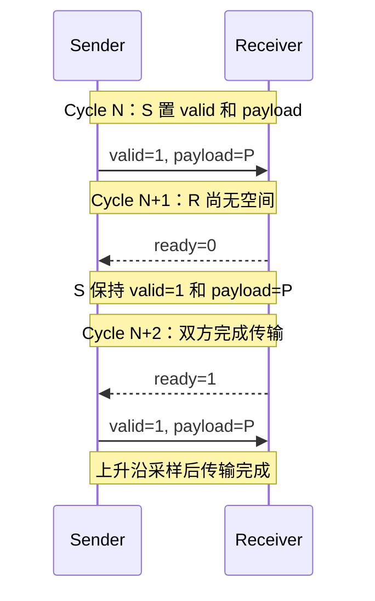
```mermaid
%%{init: {"sequence": {"useMaxWidth": true, "actorMargin": 14, "width": 82, "messageMargin": 10, "noteMargin": 6}, "themeVariables": {"fontSize": "11px"}}}%%
sequenceDiagram
    participant S as Sender
    participant R as Receiver
    Note over S,R: Cycle N：S 置 valid 和 payload
    S->>R: valid=1, payload=P
    Note over S,R: Cycle N+1：R 尚无空间
    R-->>S: ready=0
    Note over S,R: S 保持 valid=1 和 payload=P
    Note over S,R: Cycle N+2：双方完成传输
    R-->>S: ready=1
    S->>R: valid=1, payload=P
    Note over S,R: 上升沿采样后传输完成
```

### 4.3 错误状态编码

所有模块的完成接口使用统一的 8-bit `status`：

| 编码 | 名称 | 含义 |
| ---: | --- | --- |
| `0x00` | `SUCCESS` | 任务正确完成 |
| `0x01` | `ILLEGAL_OPCODE` | opcode 未实现或当前功能位为 0 |
| `0x02` | `BAD_DESC` | 指令中的字段、字段组合或内部 Task Context 非法 |
| `0x03` | `BAD_SHAPE` | shape、stride 或有效长度非法 |
| `0x04` | `ADDR_FAULT` | 物理地址非法或访问超出允许范围 |
| `0x05` | `BUS_DECERR` | AXI 返回 DECERR |
| `0x06` | `BUS_SLVERR` | AXI 返回 SLVERR |
| `0x07` | `DTYPE_UNSUPPORTED` | 数据格式组合未实现 |
| `0x08` | `DEPENDENCY_FAILED` | 依赖事件处于失败终态 |
| `0x09` | `TIMEOUT` | 看门狗或任务周期上限触发 |
| `0x0A` | `ABORTED` | 软件复位或取消请求终止任务 |
| `0x0B` | `L1_ECC_UNCORRECTABLE` | L1BUF 检测到不可修正 ECC 错误 |
| `0x0C` | `NUMERIC_EXCEPTION` | 命令要求遇到指定数值异常时停止 |
| `0x0D` | `ADDR_OVERLAP` | 当前 opcode 不允许源和目的地址范围重叠 |
| `0x81` | `NOT_FOUND` | WAIT 或 QUERY 指定的 Event、任务编号不存在；该状态用于控制请求结果，不作为执行单元 done 状态 |

当前执行单元在 `status != SUCCESS` 时同时返回 48-bit `fault_addr` 和 64-bit `progress`。执行单元 done 接口只允许 `0x00～0x0D`；`NOT_FOUND` 由 TaskScheduler 的 WAIT 或 QUERY 控制请求产生。TaskScheduler 根据任务状态生成内部 `error_info[31:0]`，该字段供任务查询使用，不属于执行单元 done 接口。

---

## 5. NPU 顶层接口定义

### 5.1 顶层时钟、复位、电源和中断

下表的方向以当前 RTL 顶层 `npu_single_core_top` 为参照。Generic Core 是外部主控 CPU，因此它的取指、数据 Cache、WFI 和 CPU 流水控制信号不属于 NPU 顶层端口。

| 信号 | 方向 | 位宽 | 复位值 | 说明 |
| --- | --- | ---: | ---: | --- |
| `core_clk_i` | Input | 1 | — | CFE、TaskScheduler、执行单元、L1BUF 和 LSC 使用的时钟 |
| `noc_clk_i` | Input | 1 | — | 送入 CRG 产生 NoC 域门控与复位观测信号；当前 MIF 使用 `core_clk_i` |
| `reset_n` | Input | 1 | 0 | 顶层低有效复位；内部 CRG 分别产生计算域和 NoC 域复位 |
| `dvfs_prepare_req_i` | Input | 1 | 0 | SoC 请求改变计算时钟频率 |
| `dvfs_prepare_ack_o` | Output | 1 | 0 | DVFS 请求有效，且 NPU 与两个 AXI 接口都空闲 |
| `soft_reset_req_i` | Input | 1 | 0 | 请求受控软复位 |
| `soft_reset_done_o` | Output | 1 | 0 | 排空请求并完成模块复位后置 1 |
| `power_down_req_i` | Input | 1 | 0 | 请求进入断电准备状态 |
| `power_down_ack_o` | Output | 1 | 0 | NPU 已满足断电条件 |
| `accept_new_cmd_o` | Output | 1 | 0 | LSC 已启动且未停止时为 1；AXI Slave Frontend 还要同时检查 FIFO 空间 |
| `core_idle_o` | Output | 1 | 1 | 命令队列、执行单元、L1 写队列和 AXI 请求均为空 |
| `module_clk_active_o` | Output | 8 | `8'hFF` | CRG 当前计算出的模块时钟使能状态 |
| `irq_done_o` | Output | 1 | 0 | 完成中断，高电平保持到软件清除 |
| `irq_exception_o` | Output | 1 | 0 | 数值异常或任务超时中断 |
| `irq_error_o` | Output | 1 | 0 | 地址、协议、ECC 或命令字段错误中断 |
| `wdt_reset_req_o` | Output | 1 | 0 | 看门狗复位请求 |

外部主控停止提交命令时，不需要控制 CPU 取指。软件先停止调用 `npu_drv_submit()` 或 `npu_drv_submit_batch()`，再写 `CORE_CONTROL.stop`，随后等待 `core_idle_o` 或 `CORE_STATUS.idle`。`accept_new_cmd_o=0` 后，AXI Slave Frontend 不再接受新的 CMD burst，但已经接收的命令继续执行或按软复位规则结束。

`soft_reset_req_i/soft_reset_done_o` 与 `power_down_req_i/power_down_ack_o` 均采用请求与确认握手，详细次序见第 15.8、15.9 节。`power_down_ack_o` 只能在 `core_idle_o=1`、MIF 无未完成事务且 LSC 已进入停止状态后置 1。外部主控 CPU 自身的运行状态由 SoC 电源管理单元处理，不计入 NPU 的 `core_idle_o`。

周期 C model 由调用者显式调用 `npu_single_core_cycle_core_tick()` 和 `npu_single_core_cycle_noc_tick()` 表示两个时钟域的上升沿。测试环境只需驱动 NPU 顶层端口和 AXI 事务，不模拟外部 CPU 的取指过程。

### 5.2 64-bit AXI4 Master 接口

NPU 顶层提供一组 `m_axi_*` AXI4 Master，由 MIF 驱动并连接 SoC AXI Fabric。DMA 通过该接口按物理地址访问 DDR 或 SoC 允许访问的其他存储目标。DDR 不直接连接 NPU，而是作为 SoC AXI Fabric 上的 AXI Slave 接收访问。

| 信号 | 方向 | 位宽 | 说明 |
| --- | --- | ---: | --- |
| `m_axi_awid` | Output | 8 | 写事务 ID |
| `m_axi_awaddr` | Output | 40 | MIF 检查后的物理字节地址 |
| `m_axi_awlen` | Output | 8 | 当前 RTL 固定为 0，每次写一个 64-bit beat |
| `m_axi_awsize` | Output | 3 | 每个 beat 的字节数；64-bit 满 beat 时为 3 |
| `m_axi_awburst` | Output | 2 | P0 仅使用 INCR |
| `m_axi_awlock` | Output | 1 | P0 固定为 0，不产生独占访问 |
| `m_axi_awcache` | Output | 4 | 写事务存储属性，默认值见下文 |
| `m_axi_awprot` | Output | 3 | 权限和指令/数据属性 |
| `m_axi_awqos` | Output | 4 | 服务质量值，P0 默认 0 |
| `m_axi_awvalid` | Output | 1 | 写地址有效 |
| `m_axi_awready` | Input | 1 | 接收方可接收写地址 |
| `m_axi_wdata` | Output | 64 | 写数据 |
| `m_axi_wstrb` | Output | 8 | 每个字节一个有效位 |
| `m_axi_wlast` | Output | 1 | 当前 burst 的最后一个 beat |
| `m_axi_wvalid` | Output | 1 | 写数据有效 |
| `m_axi_wready` | Input | 1 | 接收方可接收写数据 |
| `m_axi_bid` | Input | 8 | 写响应 ID |
| `m_axi_bresp` | Input | 2 | `OKAY`、`SLVERR` 或 `DECERR` |
| `m_axi_bvalid` | Input | 1 | 写响应有效 |
| `m_axi_bready` | Output | 1 | NPU 可接收写响应 |
| `m_axi_arid` | Output | 8 | 读事务 ID |
| `m_axi_araddr` | Output | 40 | MIF 检查后的物理字节地址 |
| `m_axi_arlen` | Output | 8 | 读 burst 的 beat 数减 1；当前 RTL 支持 0～15 |
| `m_axi_arsize` | Output | 3 | 每个 beat 的字节数 |
| `m_axi_arburst` | Output | 2 | P0 仅使用 INCR |
| `m_axi_arlock` | Output | 1 | P0 固定为 0，不产生独占访问 |
| `m_axi_arcache` | Output | 4 | 读事务存储属性，默认值见下文 |
| `m_axi_arprot` | Output | 3 | 权限和指令/数据属性 |
| `m_axi_arqos` | Output | 4 | 服务质量值，P0 默认 0 |
| `m_axi_arvalid` | Output | 1 | 读地址有效 |
| `m_axi_arready` | Input | 1 | 接收方可接收读地址 |
| `m_axi_rid` | Input | 8 | 读返回 ID |
| `m_axi_rdata` | Input | 64 | 读返回数据 |
| `m_axi_rresp` | Input | 2 | 读返回状态 |
| `m_axi_rlast` | Input | 1 | 当前 burst 的最后一个 beat |
| `m_axi_rvalid` | Input | 1 | 读返回有效 |
| `m_axi_rready` | Output | 1 | NPU 可接收读返回 |

AXI 接口必须满足：

1. 读事务使用 `ARLEN=req_burst_len_i`，支持 1～16 个 64-bit beat；写事务固定 `AWLEN=0`。`AWSIZE=ARSIZE=3`，`AWBURST=ARBURST=INCR`。
2. 读 burst 的首地址必须按 8B 对齐，首 beat 与末 beat 的起始地址都必须位于允许的地址范围内，并且整个 burst 不得跨越 4KiB 段。写请求同样按 8B 对齐。
3. 写入一个 beat 中的部分字节时使用 `WSTRB`；读取普通元素时，DMA 根据原始字节地址和数据格式选择有效部分。对齐整 beat COPY 直接传送全部 64 bit。
4. `AWLOCK=ARLOCK=0`，`AWQOS=ARQOS=0`；当前 RTL 的 `AWCACHE/ARCACHE=4'b0011`，`AWPROT/ARPROT=3'b000`。
5. 当前 RTL 使用 AXI ID 0，并对每个 R beat 检查 `RID=0`。仅在剩余 beat 数为 1 时要求 `RLAST=1`，其他 beat 要求 `RLAST=0`；写响应检查 `BID=0`。
6. 每个 R beat 分别形成一次 DMA 内部响应。该响应被 DMA 接收后，MIF 才重新进入读数据状态接收下一 beat。
7. 对写任务，收到对应 `BVALID` 之前不得报告任务成功；`WLAST` 固定为 1。
8. `RRESP` 或 `BRESP` 不是 `OKAY` 时，DMA 保存首次错误。多 beat 读已经开始后，DMA 继续接收并丢弃剩余返回，再结束当前任务。
9. MIF 保存首次错误的请求地址和内部存储状态，直到软件清除。

#### 5.2.1 外部主控 CPU 的总线位置

Generic Core 的取指、Cache 和通用数据访问由 SoC CPU 子系统处理，不经过 NPU，也不属于 `npu_single_core_top`。NPU 规格不定义 `m_axi_gc_*`、I-cache/D-cache 请求端口或 CPU AXI Adapter。

Generic Core 与 NPU 的关系只有两类：

1. Generic Core 作为 AXI Master，经 SoC AXI Fabric 访问 NPU 的 `s_axi_*`；
2. NPU 的 `irq_done_o`、`irq_exception_o` 和 `irq_error_o` 经 SoC 中断控制器送到 Generic Core。

因此，NPU 的 `core_idle_o`、软复位和断电确认只检查 NPU 内部模块及 NPU `m_axi_*` 的未完成事务，不检查外部 CPU 的取指或 Cache 状态。Generic Core 是否继续运行、进入 WFI 或关闭时钟，由 SoC CPU 和电源管理模块自行处理。

### 5.3 64-bit AXI4 Slave 接口

`s_axi_*` 是 NPU 面向 SoC AXI Fabric 的 Slave 接口。外部 Generic Core 或其他获准主控通过该接口提交指令、访问 LSC CSR、发起 WAIT/QUERY/FENCE 控制请求，并访问 L1BUF 外部窗口。地址宽度为 24 bit，数据宽度为 64 bit，信号组与标准 AXI4 一致。

| 信号 | 方向 | 位宽 | 说明 |
| --- | --- | ---: | --- |
| `s_axi_awid` | Input | 8 | 写事务 ID |
| `s_axi_awaddr` | Input | 24 | 本地字节地址 |
| `s_axi_awlen` | Input | 8 | burst beat 数减 1 |
| `s_axi_awsize` | Input | 3 | 每个 beat 的字节数 |
| `s_axi_awburst` | Input | 2 | CMD FIFO 接受 FIXED；CSR、控制和 L1BUF 接受 INCR |
| `s_axi_awlock` | Input | 1 | 独占属性；P0 只接受 0 |
| `s_axi_awcache` | Input | 4 | 存储属性；当前 Frontend 不使用该字段 |
| `s_axi_awprot` | Input | 3 | 权限属性；当前 Frontend 不使用该字段 |
| `s_axi_awqos` | Input | 4 | 服务质量值；当前 Frontend 不使用该字段 |
| `s_axi_awvalid` | Input | 1 | 写地址有效 |
| `s_axi_awready` | Output | 1 | NPU 可接收写地址 |
| `s_axi_wdata` | Input | 64 | 写数据 |
| `s_axi_wstrb` | Input | 8 | 每个字节一个写使能 |
| `s_axi_wlast` | Input | 1 | 当前 burst 最后一拍 |
| `s_axi_wvalid` | Input | 1 | 写数据有效 |
| `s_axi_wready` | Output | 1 | NPU 可接收写数据 |
| `s_axi_bid` | Output | 8 | 写响应 ID |
| `s_axi_bresp` | Output | 2 | OKAY 或 SLVERR |
| `s_axi_bvalid` | Output | 1 | 写响应有效 |
| `s_axi_bready` | Input | 1 | 发起方可接收写响应 |
| `s_axi_arid` | Input | 8 | 读事务 ID |
| `s_axi_araddr` | Input | 24 | 本地字节地址 |
| `s_axi_arlen` | Input | 8 | burst beat 数减 1 |
| `s_axi_arsize` | Input | 3 | 每个 beat 的字节数 |
| `s_axi_arburst` | Input | 2 | P0 接受 INCR |
| `s_axi_arlock` | Input | 1 | 独占属性；P0 只接受 0 |
| `s_axi_arcache` | Input | 4 | 存储属性；当前 Frontend 不使用该字段 |
| `s_axi_arprot` | Input | 3 | 权限属性；当前 Frontend 不使用该字段 |
| `s_axi_arqos` | Input | 4 | 服务质量值；当前 Frontend 不使用该字段 |
| `s_axi_arvalid` | Input | 1 | 读地址有效 |
| `s_axi_arready` | Output | 1 | NPU 可接收读地址 |
| `s_axi_rid` | Output | 8 | 读返回 ID |
| `s_axi_rdata` | Output | 64 | 读返回数据 |
| `s_axi_rresp` | Output | 2 | OKAY 或 SLVERR |
| `s_axi_rlast` | Output | 1 | 当前 burst 最后一拍 |
| `s_axi_rvalid` | Output | 1 | 读返回有效 |
| `s_axi_rready` | Input | 1 | 发起方可接收读返回 |

| 访问对象 | 地址区段 | 访问宽度 | 行为 |
| --- | --- | --- | --- |
| LSC CSR | `0x000000～0x00FFFF` | 8、16、32 或 64 bit | 对齐的单 beat访问；支持读写、W1C 和只读属性 |
| Debug / Performance | `0x010000～0x01FFFF` | 8、16、32 或 64 bit | 对齐的单 beat访问；有意义的读要求 Core 空闲或调试数据已冻结 |
| CMD FIFO 数据 | `0x020000` | 64 bit × 2～16 beat | FIXED burst；每两个 beat 组成一条 128-bit 指令 |
| CMD 接收响应 | `0x020008` | 64 bit | 读取 `command_id`、接收状态和 FIFO 剩余项数 |
| CMD FIFO 状态 | `0x020010` | 64 bit | 读取接收端状态 |
| 控制参数 0 | `0x020020` | 64 bit | WAIT/QUERY/FENCE 的第一个参数 |
| 控制参数 1 | `0x020028` | 64 bit | WAIT/QUERY/FENCE 的第二个参数 |
| 控制启动 | `0x020030` | 64 bit | 启动一次控制请求 |
| 控制状态 | `0x020038` | 64 bit | 读取 busy、done 和前端完成状态 |
| 控制结果 | `0x020040` | 64 bit | 读取控制请求返回值 |
| 控制取消 | `0x020048` | 64 bit | 取消正在等待的 WAIT 或 FENCE |
| L1BUF 外部窗口 | `0x100000～0x1FFFFF` | 8、16、32 或 64 bit | `L1_HOST_ACCESS_ENABLE=1` 时访问 |

保留地址返回 `SLVERR`，不得把无效写入当成成功。NPU 忙时访问受限制的调试寄存器，或在授权位为 0 时访问 L1BUF 外部窗口，也返回 `SLVERR`。

当前 AXI Slave Frontend 不使用 `AWCACHE/ARCACHE`、`AWPROT/ARPROT` 或 `AWQOS/ARQOS`，这些输入不改变目标选择、返回数据或响应状态。特权级、安全域和设备访问许可由 SoC 总线访问控制单元检查。`AWLOCK/ARLOCK` 不属于这组忽略字段：当前实现要求它们为 0，否则格式检查失败并返回 `SLVERR`。L1BUF 外部访问还必须通过本 NPU 内部的 `L1_HOST_ACCESS_ENABLE` 检查。

LSC CSR 与 Debug / Performance 区域只接受对齐的 1B、2B、4B 或 8B 单 beat事务。CMD 响应、CMD 状态和控制寄存器只接受 8B 单 beat事务。CMD FIFO 数据地址只接受 2～16 个 beat 的 FIXED 写 burst，beat 数必须为偶数。L1BUF 外部窗口可接受 INCR burst，但一次 burst 不得跨越 4KiB 地址区段或 L1BUF 末地址。

P0 对窄访问和 burst 使用以下固定规则：

- `AWSIZE/ARSIZE=0、1、2、3` 分别表示 1B、2B、4B、8B；CSR 与 Debug / Performance 只允许单 beat，且访问必须按所选宽度对齐；
- 多 beat L1BUF 访问必须满足 `AWSIZE=ARSIZE=3`，内部地址每个 beat 增加 8；
- 窄写把 AXI 地址向下对齐到 8B，并使用 `WSTRB` 选择实际字节；
- 窄读同样读取对齐后的完整 64-bit word，再按照 AXI 地址低 3 bit 把所需字节放到规定的数据 lane；未选中的 `RDATA` lane 固定返回 0；
- 不支持的 size、未按所选 2B/4B/8B 宽度对齐的访问或窄 burst 返回 `SLVERR`，不产生内部请求。

> [!note] 为什么地址是 24 bit
> NPU Slave 本地空间使用低 24 bit地址。SoC 集成时，系统地址译码根据分配给 NPU 的物理地址选择该 Slave，并向前端提供低 24 bit本地地址；NPU 的 MIF 不参与外部主控到 `s_axi_*` 的访问。

#### 5.3.1 AXI Slave Frontend

AXI Slave Frontend 终止 `s_axi_*`，并产生 LSC 寄存器请求、CMD beat、控制请求或 L1BUF Host 请求。当前 RTL 分别使用 `wr_state_q` 和 `rd_state_q` 保存写事务与读事务状态，但接收条件会检查另一个方向是否空闲：读事务或未接收的 R response 存在时不接收新的 AW，写事务或未接收的 B response 存在时不接收新的 AR；AW 和 AR 同时有效时写地址优先。由此，两个方向各有自己的状态寄存器，却不会同时推进两个 AXI 事务。写通道先接收 AW，随后才对对应的 W 数据拉高 `s_axi_wready`；Frontend 固定接收 `AWLEN+1` 个 W beat，全部内部处理完成后产生一次 B response。

当前 `s_axi_idle_o` 的逻辑为

```text
(wr_state_q == WR_IDLE) && !s_axi_bvalid_o
&& (rd_state_q == RD_IDLE) && !s_axi_rvalid_o
```

它只描述外部 AXI 读写事务状态，不包含内部 CMD 入口占用数、命令响应 FIFO占用数、CFE 处理状态或控制端 `busy/pending/inflight`。需要判断正常停止或软复位条件时，必须与 `cmd_ingress_idle_o`、CFE 和 TS 的状态信号分别配合。

Frontend 还接收以下控制输入：

| 信号 | Frontend 方向 | 位宽 | 说明 |
| --- | --- | ---: | --- |
| `core_idle_i` | Input | 1 | 顶层 NPU 空闲状态 |
| `debug_frozen_i` | Input | 1 | 性能计数器已经冻结，可稳定读取调试快照 |
| `l1_host_access_enable_i` | Input | 1 | LSC 对 L1BUF 外部窗口的授权位 |
| `cmd_accept_enable_i` | Input | 1 | LSC 允许接收新 CMD |

Debug / Performance 读访问要求 `core_idle_i=1` 或 `debug_frozen_i=1`。当前 RTL 没有可写的 Debug / Performance 寄存器；格式正确的写请求仍可到达 LSC，但不修改调试状态。L1BUF 外部访问要求 `l1_host_access_enable_i=1`。为了避免软件与执行单元同时修改同一存储区，驱动在装载权重、写输入或读取最终输出前应停止相关任务；硬件仍通过 L1BUF Controller 的正常仲裁处理 Host 请求。

`core_idle_i` 必须由本周期开始时的 AXI 命令接收、CFE、TS、四类任务接口、三个物理执行模块、L1BUF 和 MIF 状态产生，不能使用上一周期保存的 `core_idle_o`。若本周期接收新的 CMD burst，则本周期的受限制 Debug 请求按忙状态检查。

地址选择规则如下：

| `s_axi` 地址 | 内部目的 | 内部地址或处理 |
| --- | --- | --- |
| `0x000000～0x00FFFF` | LSC CSR | `reg_req_space=0`，`reg_req_addr=s_axi_addr[15:0]` |
| `0x010000～0x01FFFF` | Debug / Performance | `reg_req_space=1`，`reg_req_addr=s_axi_addr[15:0]` |
| `0x020000` | CMD FIFO 数据 | 把偶数个 W beat 依次送到 CFE |
| `0x020008` | CMD 接收响应 | 读出一条 CFE 接收响应 |
| `0x020010` | CMD FIFO 状态 | 返回接收端忙状态和可用项数 |
| `0x020020～0x020048` | WAIT/QUERY/FENCE 控制端口 | 保存参数、启动请求、读取状态和结果、取消等待 |
| `0x100000～0x1FFFFF` | L1BUF Host 端口 | `laddr=s_axi_addr-0x100000` |

`reg_req_space` 必须随寄存器请求一起锁存并保持到响应完成。没有该选择位时，`0x000000` 与 `0x010000` 会产生相同的 16-bit 内部地址，LSC 无法判断应访问普通 CSR 还是调试寄存器组。

AXI Slave Frontend 到 LSC 的对应端口名为 `reg_req_space_o`，位宽为 1；它与第 15.2 节的 `reg_req_space_i` 直接连接，并与 `reg_req_valid`、地址、写数据和 strobe 在同一周期完成请求握手。对 1B、2B 或 4B 的寄存器访问，`reg_req_addr_o` 必须向下对齐到 8B；`reg_req_wdata_o` 和 `reg_req_wstrb_o` 保留 AXI 原始 lane 位置，LSC 按 strobe 更新对应字节。

当前 L1BUF 外部窗口大小为 1MiB，与 `L1_BYTES=1MiB` 一致。若具体芯片采用更大的 L1BUF，必须增加窗口高位选择寄存器，不能截断高地址位。

Frontend 到 L1BUF Controller 的 Host 接口保持 64 bit：

| 信号 | Frontend 方向 | 位宽 | 说明 |
| --- | --- | ---: | --- |
| `l1_req_valid_o` | Output | 1 | Host 请求有效 |
| `l1_req_ready_i` | Input | 1 | L1BUF Controller 可接收 |
| `l1_req_write_o` | Output | 1 | 0 为读，1 为写 |
| `l1_req_addr_o` | Output | 20 | L1BUF 字节地址 |
| `l1_req_wdata_o` | Output | 64 | 写数据 |
| `l1_req_wstrb_o` | Output | 8 | 写字节使能 |
| `l1_rsp_valid_i` | Input | 1 | 读返回或写完成有效 |
| `l1_rsp_ready_o` | Output | 1 | Frontend 可接收 |
| `l1_rsp_rdata_i` | Input | 64 | 读数据 |
| `l1_rsp_status_i` | Input | 3 | 正常、ECC 状态或访问失败 |

授权位为 0 时，Frontend 不向 L1BUF 发请求，直接返回 `SLVERR`。

AXI Slave Frontend 的功能时序：

| 阶段 | 读事务 | 写事务 |
| --- | --- | --- |
| T0 | 接收 AR，检查格式并保存 ID、地址、长度和读宽度 | 接收 AW，检查格式并保存 ID、地址和长度 |
| T1 | 译码到 LSC、CMD/控制端口或 L1BUF Host 端口 | 仅在 AW 已锁存后接收第一拍 W |
| T2～ | 逐拍发内部 64-bit 请求并等待返回 | 逐拍处理 W，检查地址类型、beat 数、WSTRB 和 WLAST |
| Tend | 生成 RDATA/RRESP，末拍设置 RLAST | 全部内部写完成后生成一次 BRESP |

L1BUF 满宽 burst 在内部拆成单 beat `l1_req_*` 请求，内部地址每拍增加 8。窄访问只有一拍，内部请求地址向下对齐到 8B。任一内部请求失败时，Frontend 停止发出新的 L1 请求，完成已经接受的请求后返回 `SLVERR`。

`WLAST` 的检查以 `AWLEN+1` 为准：若 `WLAST` 在较早 beat 置 1，或在最后一个预期 beat 仍为 0，Frontend 记录协议错误并最终返回 `SLVERR`。发现错误后不再产生新的内部写请求，但仍继续接收直到第 `AWLEN+1` 个 W beat，避免写通道永久停住；已经握手的内部请求必须等待响应。B response 的 ID 使用已锁存的 `AWID`。

#### 5.3.2 CMD FIFO、接收响应和控制端口

CMD FIFO 写 burst 必须同时满足：

1. `AWADDR=0x020000`、`AWSIZE=3`、`AWBURST=FIXED`、`AWLOCK=0`；
2. `AWLEN+1` 为 2～16 范围内的偶数；
3. 每个 W beat 的 `WSTRB=8'hff`；
4. `WLAST` 只在声明的最后一个 beat 置 1；
5. Frontend 的 ingress buffer 能保存整个 burst；
6. `cmd_accept_enable_i=1`。

Frontend 先接收并检查完整 burst，再按低 word、高 word的次序把每条指令送入 CFE。若 AXI 属性或 W 通道格式错误，整个 burst 返回 `SLVERR`，并且不得向 CFE提交其中的任何命令。若 burst格式正确，AXI B response 返回 `OKAY`；每条命令的操作码、`command_id` 和任务字段检查结果由 CMD 接收响应 FIFO分别返回。

每条命令的 64 bit接收响应格式如下：

| bit | 字段 | 说明 |
| ---: | --- | --- |
| `[11:0]` | `command_id` | 低 10 bit有效，高 2 bit为 0 |
| `[19:12]` | `status` | `SUCCESS` 表示命令通过 CFE 的 opcode 与重复编号检查并进入 CFE FIFO；TaskScheduler 后续发现 payload 或事件错误时，该接收状态仍保持 `SUCCESS` |
| `[27:20]` | `fifo_free` | 产生该响应时 CFE FIFO 的剩余项数 |
| `[63:28]` | 保留 | 读出为 0 |

主控提交 $N$ 条命令后，必须从 `0x020008` 读取 $N$ 条响应。AXI B response 只说明 burst传输完成，不能替代逐命令接收响应。驱动还要核对返回的 `command_id` 是否与提交次序一致。

WAIT、QUERY 和 FENCE 使用控制参数与控制启动寄存器，不使用 CPU 自定义指令。控制启动值为：

| `CTL_START[1:0]` | 操作 | 参数 |
| ---: | --- | --- |
| `1` | WAIT | `ARG0[7:0]` 为 Event ID，`ARG1[31:0]` 为最大等待周期 |
| `2` | QUERY | `ARG0[9:0]` 为 `command_id`，`ARG0[63:10]` 必须为 0，`ARG1[2:0]` 为查询 selector |
| `3` | FENCE | `ARG0[3:0]` 为执行单元选择，`ARG1[31:0]` 为最大等待周期 |

写 `CTL_START` 时高 62 bit必须为 0，并且当前控制端口不能处于 busy。Frontend 将参数和操作码通过 `ctl_req_*` ready/valid 接口送到 TaskScheduler。正常返回到达后，`CTL_STATUS.done=1`，`CTL_STATUS[15:8]` 写入 `SUCCESS`，完整的 64-bit 操作结果写入 `CTL_RESULT`。WAIT、QUERY 和 FENCE 的任务状态、事件状态或失败信息均按各自结果格式从 `CTL_RESULT` 读取。Frontend 本地处理取消请求时，`CTL_STATUS[15:8]` 写入 `8'h0a`。

写 `CTL_CANCEL=1` 可以取消正在等待的 WAIT 或 FENCE。QUERY 不接受取消。取消只结束本次同步控制请求，不修改被查询任务、Event Table 或已经产生的张量数据。

### 5.4 外部 Generic Core 与软件调用方式

Generic Core 是外部主控 CPU。NPU 不定义 RISC-V `custom-0` 指令，不包含 Issue Adapter，也没有 `issue_*`、`gc_cmd_*`、`gc_ctl_*` 或 CPU 寄存器写回端口。CPU 通过普通 C 函数调用驱动；驱动把函数调用转换成 AXI Slave 访问。

驱动对上层软件提供以下主要函数：

| C 函数 | 作用 | NPU 侧访问 |
| --- | --- | --- |
| `npu_drv_init()` | 保存平台访问函数并初始化驱动对象 | 不产生 NPU 访问 |
| `npu_drv_set_base()` | 配置 INPUT、WEIGHT、WORK、OUTPUT 或 KV 物理基地址 | 写 LSC CSR |
| `npu_drv_set_timeout()` | 为 C model 或后续硬件配置任务周期上限 | 当前 RTL 对应地址为保留区，不形成硬件任务超时 |
| `npu_drv_start()` | 允许 NPU 接收新命令 | 写 `CORE_CONTROL.start` |
| `npu_drv_stop()` | 停止接收新命令并等待排空 | 写 `CORE_CONTROL.stop`，随后读状态 |
| `npu_drv_submit()` | 提交一条 128-bit 指令 | 向 `0x020000` 写 2-beat FIXED burst，再读一条接收响应 |
| `npu_drv_submit_batch()` | 提交 1～8 条指令 | 向 `0x020000` 写 2～16 beat FIXED burst，再逐条读取接收响应 |
| `npu_drv_query_status()` | 查询任务状态 | 通过控制参数、QUERY 和控制结果寄存器完成 |
| `npu_drv_wait_task()` | 轮询任务直到终态或达到软件循环上限 | 重复 QUERY；可在循环中调用平台 `relax()` |
| `npu_drv_ack_task()` | 释放终态 Task 表项和 `command_id` | 发起 QUERY selector `ACK` |
| `npu_drv_wait_event()` | 等待 Event 进入成功或失败状态 | 发起 WAIT 控制请求 |
| `npu_drv_fence_mask()` | 等待选定执行单元中更早提交的任务结束 | 发起 FENCE 控制请求 |
| `npu_drv_sync_for_device()` | 使 CPU 写入的输入和权重对 NPU 可见 | 调用平台 cache clean 与写屏障 |
| `npu_drv_sync_for_cpu()` | 使 CPU 读取到 NPU 写回的结果 | 调用平台 cache invalidate 与读屏障 |

平台相关操作由 `npu_drv_platform_ops_t` 提供：

| 回调 | 用途 |
| --- | --- |
| `mmio_read64` | 读取 CSR、CMD 状态、控制状态或控制结果 |
| `mmio_write64` | 写 CSR 和控制寄存器 |
| `submit_fixed_burst` | 向 CMD FIFO 固定地址发送一组 64 bit W beat |
| `submit_response` | 从 CMD 接收响应 FIFO 读取一条结果 |
| `control_request` | 发起 WAIT、QUERY 或 FENCE；平台可用第 5.3.2 节的 MMIO 控制端口实现 |
| `write_barrier`、`read_barrier` | 保证 CPU、互连和 NPU 观察到规定的访问次序 |
| `cache_clean`、`cache_invalidate` | 维护非一致 Cache 系统中的输入、权重和输出数据 |
| `relax` | 轮询期间让出 CPU 执行资源或降低总线访问频率 |

`control_request` 是驱动平台抽象，不表示 CPU 自定义指令。MMIO 平台按以下顺序完成一次控制请求：

```text
写 CTL_ARG0
→ 写 CTL_ARG1
→ 写 CTL_START
→ 轮询 CTL_STATUS.done
→ 读取 CTL_RESULT
```

#### 5.4.1 指令提交时序

提交一批命令前，驱动必须完成以下软件操作：

1. 确认每个 `command_id` 不与尚未 ACK 的任务重复。
2. 确认生成配置、五组基地址和 DMA 全局地址引用给出的都是 SoC 物理地址，且高于 `PA_W-1` 的 bit为 0。
3. 对 NPU 将要读取的 CPU Cache 区域执行 `npu_drv_sync_for_device()`。
4. 执行写屏障，保证基地址 CSR、输入和权重先于 CMD burst 对 NPU 可见。
5. 按命令顺序把 `lo`、`hi` 依次放入 beat 数组。
6. 调用 `submit_fixed_burst()`。
7. 为每条命令调用 `submit_response()`，核对 `command_id` 和接收状态。

一次提交 2 条命令时，软件与硬件的顺序为：

```text
CPU: write barrier
CPU: AWADDR=CMD_FIFO, AWLEN=3, AWSIZE=3, AWBURST=FIXED
CPU: WDATA=CMD0.lo, WLAST=0
CPU: WDATA=CMD0.hi, WLAST=0
CPU: WDATA=CMD1.lo, WLAST=0
CPU: WDATA=CMD1.hi, WLAST=1
NPU: B response
CPU: 读取 CMD0 接收响应
CPU: 读取 CMD1 接收响应
```

AXI B response 为 `OKAY` 只表示 burst格式和传输被接受。每条 CMD 的 CFE 检查结果必须从 CMD 接收响应 FIFO 读取。若某条命令返回非 `SUCCESS`，该命令没有进入 TaskScheduler，驱动应报告对应数组下标。

#### 5.4.2 查询、等待、FENCE 与 ACK

QUERY selector 定义如下：

| Selector | 名称 | 64 bit结果 |
| ---: | --- | --- |
| 0 | `STATUS` | `[3:0]` 任务状态，`[11:4]` 完成 status，`[23:12]` 为零扩展后的 `command_id` |
| 1 | `TAG_EVENT` | `[31:0]` 内部任务标记，`[43:32]` 完成事件引用 |
| 2 | `FAULT_ADDR` | `[47:0]` 第一个错误地址 |
| 3 | `PROGRESS` | 64 bit进度值 |
| 4 | `ACK` | `0=ACKED`、`1=NOT_TERMINAL`、`2=NOT_FOUND` |
| 5 | `ERROR_INFO` | `[31:0]` 错误附加信息 |
| 6 | `DONE_FLAGS` | `[15:0]` 完成标志 |
| 7 | `RESERVED` | 返回 `BAD_DESC`，不修改任务 |

Selector 0～3、5 和 6 只读取状态。Selector 4 只有在任务已经进入终态时才能成功；ACK 响应完成后，TaskScheduler 释放 Task 表项和 `command_id`。ACK 不清除 Event Table 项。

WAIT 的最大等待周期为 0 时检查一次；最大等待周期为 $L>0$ 时，硬件最多等待 $L$ 个周期。目标在超时检查所在周期进入终态时，目标结果优先于 `TIMEOUT`。达到上限只结束本次控制请求，不自动取消正在执行的 NPU 任务。

FENCE 在控制请求握手时保存当时被执行单元选择值选中的全部任务槽、每个任务的 `submit_seq`，以及当时已经终止任务的 status。随后每周期检查一个任务槽，16 槽配置的一轮检查需要 16 个周期；握手后提交的新任务不加入本次 FENCE。仍有未终止目标时，每周期检查最大等待周期；全部目标已经终止时，扫描器继续读取尚未处理的 status，再返回最终结果。

---

## 6. 指令体系

### 6.1 执行模型

软件可见指令固定为 128 bit。每条指令由 48 bit 公共命令头和 80 bit 操作专有载荷组成。执行所需的地址引用、尺寸、数据格式、等待事件、完成事件和操作选项都直接放在指令中，不再使用外部任务参数块。

一条命令的处理过程如下：

1. 外部主控 CPU 作为 AXI Master，把命令写入 NPU AXI Slave 的固定 CMD FIFO 地址。
2. AXI Slave 前端把连续两个 64 bit beat 组成一条完整指令，低 64 bit先到，高 64 bit后到。
3. Command Front End 检查操作码、命令编号和两拍格式。检查通过后，完整命令进入命令 FIFO。
4. TaskScheduler 在 CFE 握手周期完成字段检查，读取 Event Table 的当前事件代次，并把命令中的 8 bit Event ID 扩展成内部事件引用。
5. 第一个时钟沿把检查结果、事件引用、前序任务位图、目标 FREE 槽、完整指令、五个 48 bit基地址和 20 bit L1 参数区基址保存到命令接纳寄存级；下一个时钟沿再写任务表并分配 `submit_seq`。
6. WAIT_EVENT 检查器每周期读取一个任务槽的两个事件引用并寄存结果；下一周期复查任务状态和 `submit_seq` 后，依赖失败的任务进入错误终态，依赖成功且前序任务位图不再指向运行中任务的项目进入 READY。发射扫描器每周期检查一个非 Control 任务槽，在 `TASK_SLOTS` 项检查中保存 `submit_seq` 最小的可发射候选；最后一项检查结束时复查候选状态和目标执行单元，再把获胜任务的指令、提交时基地址和任务编号保存到发射窄快照寄存器。
7. 共享发射解码器解释 `payload[79:0]`，生成内部 Task Context并写入目标执行单元的发射暂存；发射暂存从下一周期给出任务，执行单元接收后开始运行。
8. 执行单元完成后返回状态；TaskScheduler 保存终态，普通 signal Event 经发布暂存写入 Event Table，再把完成持有槽中的稳定终态送到 LSC，由 LSC 按指令选项产生中断。

RTL 中的 `desc_flat[2047:0]` 是模块内部使用的展开 Task Context。它由指令在片上组合生成，不是软件接口的一部分，不占用 DDR 空间，也不会经 MIF 读取。编译器和驱动只需要产生指令数组、权重数组和 C 配置数据。

> [!note] 为什么仍保留内部 Task Context
> DMA、Matrix、IVE 和 CME 接口需要较多展开字段，例如实际地址、行字节数、tile 尾部尺寸和内部函数参数。发射前把 80 bit载荷展开成固定的内部 Task Context，可以让各执行单元使用清晰的模块接口，同时不要求软件创建外部参数块。任务表不为每项保存 2048 bit展开结果；该结果只保存在对应发射暂存和接收任务后的执行单元内部。

DMA、Matrix-Vector Engine 和 CME 可以同时工作。Matrix 与 Vector 任务也可以同时处于运行状态，但它们在 Matrix-Vector Engine 内共用 PE 和 L1 端口。普通任务由 `wait0`、`wait1` 和 `signal` 表达数据先后关系；需要严格顺序的任务使用 `ordered`。Matrix 子系统还要保证分块乘累加、部分和读取与结果写回的先后关系。

### 6.2 64 bit AXI 上的提交方式

NPU 命令接收端是 AXI Slave。主控 CPU 必须向相对 NPU AXI Slave 基地址的 `0x0002_0000` 写入命令，写事务采用以下固定属性：

| AXI 属性 | 要求 |
| --- | --- |
| `AWADDR` | 固定为 CMD FIFO 地址 `0x0002_0000` |
| `AWSIZE` | `3`，每个 beat 为 8B |
| `AWBURST` | `FIXED` |
| `AWLEN` | `1、3、5、…、15`，对应 2～16 个 beat |
| `WSTRB` | 每个 beat 都为 `8'hff` |
| `WLAST` | 只在整个 burst 的最后一个 beat 置 1 |
| beat 数 | 必须是 2～16 范围内的偶数，一次可提交 1～8 条命令 |

CMD FIFO 使用固定地址 burst，因此每个 beat 的地址保持不变。一次 burst 中，第 `2i` 个 beat 是第 `i` 条命令的 `CMD[63:0]`，第 `2i+1` 个 beat 是该命令的 `CMD[127:64]`。例如，一次提交 3 条命令时，`AWLEN=5`，W 通道次序为：

| W beat 序号 | 数据 |
| ---: | --- |
| 0 | `CMD0[63:0]` |
| 1 | `CMD0[127:64]` |
| 2 | `CMD1[63:0]` |
| 3 | `CMD1[127:64]` |
| 4 | `CMD2[63:0]` |
| 5 | `CMD2[127:64]`，同时 `WLAST=1` |

AXI Slave 前端会为每对 beat 产生内部 `first/last` 标志：低 word 对应 `first=1,last=0`，高 word 对应 `first=0,last=1`。这些标志是 NPU 内部信号，不需要主控 CPU 额外发送。

接收端只在 burst 的地址、属性、beat 数、`WSTRB` 和 `WLAST` 全部正确时提交其中的命令。beat 数为奇数、低高 word 次序错误、`AWBURST` 不是 `FIXED`、FIFO 空间不足或高 word 等待超时，都必须返回错误，并且不能把不完整命令交给 TaskScheduler。

> [!note] 字节顺序与发送顺序
> 命令数组按 little-endian 保存。内存中最低地址处是 `CMD[7:0]`。驱动提交一条命令时先发送结构体的 `lo`，再发送 `hi`。这里的“低 word 先发送”是总线协议要求，不能根据 CPU 的打印顺序自行交换。

### 6.3 指令公共位段

| CMD bit | 字段 | 位宽 | 说明 |
| ---: | --- | ---: | --- |
| `[127:122]` | `opcode` | 6 | 软件可见操作码，当前定义 0～34 |
| `[121:112]` | `command_id` | 10 | 命令编号，取值 0～1023 |
| `[111:104]` | `wait0` | 8 | 第一个等待 Event ID，`8'hff` 表示不用 |
| `[103:96]` | `wait1` | 8 | 第二个等待 Event ID，`8'hff` 表示不用 |
| `[95:88]` | `signal` | 8 | 任务终态时更新的 Event ID，`8'hff` 表示不用 |
| `[87]` | `irq_success` | 1 | 任务成功时请求完成中断 |
| `[86]` | `irq_error` | 1 | 任务失败时请求错误中断 |
| `[85]` | `strict_numeric` | 1 | CME 遇到规定的数值异常时返回任务错误 |
| `[84]` | `ordered` | 1 | 把该任务作为顺序点处理 |
| `[83:82]` | `timeout_class` | 2 | 选择 4 组任务超时配置之一 |
| `[81:80]` | `dtype` | 2 | 该操作的公共输入数据格式 |
| `[79:0]` | `payload` | 80 | 操作专有参数 |

`opcode` 使用最高 6 bit，其中包含 bit 127。bit 127 不是保留位。命令头不再单独保存 `engine`、命令头版本或外部参数地址；目标执行单元由 `opcode` 得出。

`dtype` 的编码如下。该编码在 CMD、编译器、驱动、CModel 和 RTL 中保持一致：

| 编码 | 数据格式 | 每个元素的有效位数 | 常规字节存储 |
| ---: | --- | ---: | --- |
| `0` | 保留 | — | 正常指令入口返回 `BAD_DESC`；执行单元直接接口返回 `DTYPE_UNSUPPORTED` |
| `1` | INT8 | 8 | 1B |
| `2` | INT32 | 32 | 4B |
| `3` | INT16 | 16 | 2B |

`command_id` 从命令被 CFE 接收开始占用，直到软件对终态任务执行 ACK 后释放。所有尚未 ACK 的 Task 表项以及 CFE 中等待进入 TaskScheduler 的命令都不能使用相同编号。发现重复编号时，CFE 返回 `BAD_DESC`，且不创建任务。

Event ID 的有效值为 0～254，`8'hff` 表示该字段不用。指令中不直接保存 generation。TaskScheduler 接收命令时读取 Event Table 中的当前 generation，并把 `{generation,event_id}` 分别保存到任务表的 `wait0`、`wait1` 和 `signal` 字段。因此，在命令已经接收后执行 `EVENT_REARM`，不会改变该命令已经保存的事件代次。

`payload[79:0]` 的含义由 `opcode` 决定。没有被当前操作使用的 payload 位必须为 0。发送任意值会使严格字段检查失去作用，也会影响后续增加功能时的软件兼容性。

### 6.4 命令头标志、超时和事件规则

| 字段               | 置 1 后的处理                                                                    |
| ---------------- | --------------------------------------------------------------------------- |
| `irq_success`    | 任务进入 `SUCCESS` 终态时产生一次完成中断请求；失败时不产生该类中断                                     |
| `irq_error`      | 任务进入任意非 `SUCCESS` 终态时产生一次错误中断请求                                             |
| `strict_numeric` | 当前 RTL 只在任务表中保存该位，尚未把它送入 CME 或整数执行单元，因此不会改变数值处理，也不会主动产生 `NUMERIC_EXCEPTION` |
| `ordered`        | 该任务等待全部较小 `submit_seq` 的任务进入终态；在它进入终态前，较大的 `submit_seq` 任务也不能越过它            |

`timeout_class` 位段可选择 4 个编号。当前 RTL 会保存该字段，但 LSC 没有 `TIMEOUT_CLASS` CSR，TaskScheduler 也没有按任务计数器，因此该字段不触发硬件任务超时。第 20.1 节的周期上限只用于 C model 和测试；后续若加入硬件任务超时，需要定义寄存器、起算时刻、排空方式和完成状态，并增加 RTL 验证。当前硬件停滞检测使用第 15.6 节的 WDT。

等待事件的处理规则如下：

1. `wait0` 或 `wait1` 为 `8'hff` 时，该输入视为已经满足。
2. 指定的等待事件必须已经由更早的任务预留；引用 `FREE` 事件会使命令字段检查失败。
3. 普通任务与 `EVENT_JOIN(join_mode=0)` 要求两个等待事件都成功；任一有效等待事件进入 `ERROR` 时，尚未开始的任务进入 `DEPENDENCY_FAILED`。
4. `EVENT_JOIN(join_mode=1)` 在任一等待事件成功后即可继续；只有两个有效等待事件都进入 `ERROR` 时才返回 `DEPENDENCY_FAILED`，其中一个失败而另一个仍在等待时保持等待状态。
5. `signal` 指定的事件必须处于 `FREE`，并且不能与 `wait0` 或 `wait1` 相同。
6. 任务成功时把 `signal` 事件置为 `SUCCESS`；任务失败时把它置为 `ERROR` 并保存失败状态。
7. `strict_numeric` 和 `timeout_class` 在当前 RTL 中均为已保存但未执行的控制信息；软件不得依赖这两个字段停止任务。

### 6.5 地址引用格式

80 bit payload 无法为每个输入保存完整 48 bit 地址，因此指令使用几种地址引用格式。地址引用不是指针压缩后的软件对象；它是命令位段中的整数，RTL 根据格式直接得到 L1 地址或“物理基地址寄存器加偏移”形式的全局物理地址。

#### 6.5.1 `AREF28`

DMA 使用 28 bit `AREF28`：

| `AREF28` bit | 字段 | 说明 |
| ---: | --- | --- |
| `[27]` | `space` | `0` 表示 L1BUF，`1` 表示全局内存 |
| `[26:24]` | `base_select` | 全局物理地址基址选择；L1BUF 地址必须写 0 |
| `[23:0]` | `offset` | 字节偏移 |

当 `space=0` 时，`base_select` 和 `offset[23:20]` 必须为 0，实际 L1 字节地址为 `offset[19:0]`。当 `space=1` 时，实际全局物理字节地址为：

$$
\mathrm{global\_addr}
=
\mathrm{BASE}[\mathrm{base\_select}]
+
\mathrm{offset}
$$

式中，`BASE[base_select]` 是 LSC 保存的 48 bit物理基地址，`offset` 是无符号 24 bit字节偏移。相加结果高于 `PA_W-1` 的 bit必须为 0。各选择值如下：

| `base_select` | 基地址 |
| ---: | --- |
| `0` | 0 |
| `1` | `INPUT_BASE` |
| `2` | `WEIGHT_BASE` |
| `3` | `WORK_BASE` |
| `4` | `OUTPUT_BASE` |
| `5` | `KV_BASE` |
| `6、7` | 非法 |

48 bit加法产生进位、高于 `PA_W-1` 的 bit非零或访问超出 MIF 允许物理地址范围时，地址非法。DMA 在开始访问前还必须检查完整源区和目标区。

#### 6.5.2 `LREF14`、`LREF12` 与 `LREF16`

Matrix、IVE 和 CME 只访问 L1BUF，使用带固定对齐要求的 L1 引用：

| 格式 | 位宽 | 实际地址 | 对齐 | 可表示的 L1 地址 |
| --- | ---: | --- | ---: | --- |
| `LREF14` | 14 | `field << 6` | 64B | `0x00000`～`0xfffc0` |
| `LREF12` | 12 | `field << 6` | 64B | `0x00000`～`0x3ffc0` |
| `LREF16` | 16 | `field << 4` | 16B | `0x00000`～`0xffff0` |

GEMM 的 A、B 和 C 使用 `LREF14`；bias 使用 `LREF12`。在 GEMM 中，bias 字段为 0 表示不使用 bias，因此需要 bias 时不能把 bias 放在 L1 地址 0。IVE 与 CME 使用 `LREF16`。

> [!example] `LREF16` 示例
> `LREF16=16'h0012` 表示 L1 字节地址 `0x0012 << 4 = 0x0120`。该字段表示字节地址，不表示第 18 个元素；元素编号还要结合数据格式和张量形状计算。

### 6.6 指令总表

指令中的 `opcode` 是 `CMD[127:122]` 中的软件可见 6 bit 数值。执行单元继续使用 8 bit内部操作码；内联解码器根据 6 bit 数值产生目标执行单元和内部操作码。软件不得把内部操作码直接写入 `CMD[127:122]`。

| `opcode` | 内部操作码 | 指令 | 执行单元 | 实现状态 | 指令中的字段 | 功能与限制 |
| ---: | ---: | --- | --- | --- | --- | --- |
| `0` | `0x00` | `NOP` | Control | 已实现 | `payload=0`；三个 Event 字段均为 none | 创建占位任务，不读写数据。 |
| `1` | `0x01` | `EVENT_SIGNAL` | Control | 已实现 | `signal`；`payload=0` | 主动把指定 Event 置为成功，不启动执行单元。 |
| `2` | `0x02` | `EVENT_REARM` | Control | 已实现 | `signal`；`payload=0` | 旧 Event 已结束且没有等待者时，使该 Event 进入下一代。 |
| `3` | `0x03` | `EVENT_JOIN` | Control | 已实现 | `wait0`、`wait1`、`signal`、`join_mode` | 合并两个前置 Event；可选择“两个都成功”或“至少一个成功”。 |
| `4` | `0x04` | `GLOBAL_FENCE` | Control | 已实现 | `engine_mask` | 等待所选执行单元中更早提交的任务结束。 |
| `5` | `0x20` | `DMA_COPY_1D` | DMA | 已实现 | `src_aref`、`dst_aref`、`count`、源/目标 dtype、两个必须为 0 的保留位 | 连续复制元素并执行整数位宽转换；支持 INT8、INT16 和 INT32。 |
| `6` | `0x21` | `DMA_COPY_ND` | DMA | 已实现 | 与 `DMA_COPY_1D` 相同 | 复制连续存储区。带步长的多维访问由编译器拆成多条命令，或组合 PACK、SPLIT、TRANSPOSE。 |
| `7` | `0x22` | `DMA_FILL` | DMA | 已实现 | `dst_aref`、`count`、`fill_value`、目标 dtype | 用一个立即数连续填充目标元素。 |
| `8` | `0x23` | `DMA_TRANSPOSE_2D` | DMA | 已实现 | `src_aref`、`dst_aref`、`rows`、`columns`、dtype、两个必须为 0 的保留位 | 转置连续行优先二维数组，不包含行步长字段。 |
| `9` | `0x24` | `DMA_PACK` | DMA | 已实现 | `src_aref`、`dst_aref`、`segment_count`、`segment_bytes`、`segment_stride` | 从等间隔数据段读取并连续写入。 |
| `10` | `0x25` | `DMA_SPLIT` | DMA | 已实现 | 与 PACK 相同 | 从连续数据区读取并按固定间隔写入。 |
| `11` | `0x28` | `DMA_GATHER_ND` | DMA | 编码已分配，功能关闭 | 全局源 `AREF28`、索引表 `LREF16`、目标 `LREF16`、块数、每块字节数 | 根据 L1 中的 UINT32 索引读取全局内存数据块；当前返回 `ILLEGAL_OPCODE`。 |
| `12` | `0x40` | `GEMM` | Matrix | 已实现 | A/B/C `LREF14`、bias `LREF12`、M/N/K、保留位、C dtype、右移位数 | 矩阵乘法后可加 INT32 bias；B 使用 `KT×NT` tile 存储，保留位必须为 0。 |
| `13` | `0x41` | `BMM` | Matrix | 已实现 | A/B/C `LREF14`、batch、M/N/K、保留位、C dtype、右移位数 | 连续保存的多组矩阵乘法，不带 bias，保留位必须为 0。 |
| `14` | `0x42` | `GEMM_ACCUM` | Matrix | 已实现 | A/B/C `LREF14`、M/N/K、保留位 | 把新的乘加结果加入原 C；C 必须为 INT32，bias、保留位和右移位数必须为 0。 |
| `15` | `0x43` | `GEMM_ZERO` | Matrix | 已实现 | C `LREF14`、M/N | 清零 C 指向的 INT32 部分和区域，为后续 `GEMM_ACCUM` 准备初值。 |
| `16` | `0x60` | `VECTOR_ADD` | IVE | 已实现 | `src0`、`src1`、`dst`、rows、length、广播方式 | 逐元素相加，输出数据格式与公共输入格式相同。 |
| `17` | `0x61` | `VECTOR_SUB` | IVE | 已实现 | 与 ADD 相同 | 逐元素相减。 |
| `18` | `0x62` | `VECTOR_MUL` | IVE | 已实现 | 与 ADD 相同 | 逐元素相乘，结果写为 INT32。 |
| `19` | `0x63` | `VECTOR_FMA` | IVE | 已实现 | `src0`、`src1`、`src2`、`dst`、rows、length、三路广播方式 | 计算 `src0 × src1 + src2`，其中 `src2` 和结果为 INT32。 |
| `20` | `0x64` | `VECTOR_MAX` | IVE | 已实现 | 与 ADD 相同 | 写入逐元素较大值。 |
| `21` | `0x65` | `VECTOR_MIN` | IVE | 已实现 | 与 ADD 相同 | 写入逐元素较小值。 |
| `22` | `0x66` | `VECTOR_CMP`（`VCMP_I`） | IVE | 已实现 | `src0`、`src1`、比较类型、`dst`、rows、length、前两路广播方式 | 支持 EQ、NE、LT、LE、GT、GE；每个 INT8 mask 元素中，真写 1，假写 0。 |
| `23` | `0x67` | `VECTOR_SELECT` | IVE | 已实现 | `src0`、`src1`、INT8 mask、`dst`、rows、length、前两路广播方式 | mask 为零时选 `src0`，mask 非零时选 `src1`。 |
| `24` | `0x68` | `VECTOR_CLAMP` | IVE | 已实现 | `src0`、signed16 下限、signed16 上限、`dst`、rows、length | 把每个元素限制在给定最小值和最大值之间。 |
| `25` | `0x69` | `VECTOR_RELU` | IVE | 已实现 | `src0`、`dst`、rows、length | 计算 `max(src0,0)`，未使用输入字段必须为 0。 |
| `26` | `0x80` | `COMPLEX_ACT` | CME | 已实现 | `src0`、`dst`、rows、length、函数、scale 指数、目标 dtype、输入限制区间 | 执行 Sigmoid、Tanh、GELU 或 SiLU，内部计算使用 FP32。 |
| `27` | `0x81` | `COMPLEX_SOFTMAX` | CME | 已实现 | `src0`、可选 `aux`、`dst`、rows、length、mask 模式、scale 指数、目标 dtype | 逐行 Softmax，支持 boolean mask 和 valid length；causal 模式当前返回 `BAD_DESC`。 |
| `28` | `0x82` | `COMPLEX_NORM` | CME | 已实现 | `src0`、gamma/beta 参数区、`dst`、rows、length、Norm 类型、epsilon、scale 指数、目标 dtype | 执行 LayerNorm 或 RMSNorm。 |
| `29` | `0x83` | `COMPLEX_ROPE` | CME | 编码已分配，功能关闭 | 操作码位置已分配 | 当前返回 `ILLEGAL_OPCODE`，不得启动 CME 或写目标张量。 |
| `30` | `0x84` | `COMPLEX_STAT` | CME | 已实现 | `src0`、`dst`、rows、length、统计方式 | 按行计算 SUM、MAX 或 SUMSQ，每行写一个 INT32。 |
| `31` | `0x85` | `COMPLEX_RECIP` | CME | 编码已分配，功能关闭 | 操作码位置已分配 | 当前返回 `ILLEGAL_OPCODE`，不得启动 CME 或写目标张量。 |
| `32` | `0x86` | `COMPLEX_ADD_RESCALE` | CME | 已实现 | `src0`、第二输入、`dst`、rows、length、三个 scale 指数、目标 dtype | 按两个输入 scale 相加，再按目标 scale 写回整数结果。 |
| `33` | `0x44` | `GEMM_ZERO_LOCAL` | Matrix | 已实现 | C `LREF14`、M/N；其余计算字段必须为 0 | 在 Outer context 建立本地部分和区域并清除有效数据状态，不读取或写回 L1 中的 C。 |
| `34` | `0x45` | `GEMM_ACCUM_HOLD` | Matrix | 已实现 | 与 `GEMM_ACCUM` 相同 | 把新的乘加结果保存到 Outer context 本地部分和 RAM，不提交最终 C。 |

数值 35～63 当前没有定义，必须返回 `ILLEGAL_OPCODE`。`DMA_GATHER_ND`、`COMPLEX_ROPE` 和 `COMPLEX_RECIP` 只有在功能寄存器声明支持后才能执行。

### 6.7 操作专有 payload 位段

#### 6.7.1 Control

| payload bit | 字段 |
| ---: | --- |
| `[79:76]` | `engine_mask` |
| `[75]` | `join_mode` |
| `[74:0]` | 必须为 0 |

`engine_mask[3:0]` 依次选择 DMA、Matrix、IVE 和 CME，只供 `GLOBAL_FENCE` 使用，且至少有一位为 1。`join_mode` 只供 `EVENT_JOIN` 使用：0 表示两个等待事件都成功时 JOIN 才成功；1 表示至少一个等待事件成功时 JOIN 成功，只有两个都失败时 JOIN 才失败。

`NOP` 要求三个 Event 字段都是 `8'hff`。`EVENT_SIGNAL` 和 `EVENT_REARM` 要求 `signal` 有效。`EVENT_JOIN` 要求 `wait0`、`wait1` 和 `signal` 都有效，且 `wait0` 与 `wait1` 不同。

#### 6.7.2 DMA

`DMA_COPY_1D` 和 `DMA_COPY_ND`：

| payload bit | 字段 |
| ---: | --- |
| `[79:52]` | `src_aref` |
| `[51:24]` | `dst_aref` |
| `[23:4]` | `count`，元素数，范围 1～1048575 |
| `[3:2]` | `dst_dtype` |
| `[1]` | 保留位，必须为 0 |
| `[0]` | 保留位，必须为 0 |

命令头 `dtype` 是源数据格式。源和目标格式相同时原样复制；目标更宽时执行符号扩展；目标缩窄到 INT8 或 INT16 时执行饱和处理。`DMA_COPY_ND` 当前也表示连续区域，不直接携带 rank、shape 或 stride。编码 0 或任一非零保留位都会使指令被拒绝。

`DMA_FILL`：

| payload bit | 字段 |
| ---: | --- |
| `[79:52]` | `dst_aref` |
| `[51:32]` | `count`，元素数，范围 1～1048575 |
| `[31:0]` | `fill_value` |

命令头 `dtype` 是目标数据格式。硬件对 INT8、INT16、INT32 分别取 `fill_value` 的低 8、16、32 bit，并对每个目标元素重复写入。编码 0 会使指令被拒绝。

`DMA_TRANSPOSE_2D`：

| payload bit | 字段 |
| ---: | --- |
| `[79:52]` | `src_aref` |
| `[51:24]` | `dst_aref` |
| `[23:16]` | `rows`，范围 1～255 |
| `[15:8]` | `columns`，范围 1～255 |
| `[7:6]` | `dst_dtype` |
| `[5]` | 保留位，必须为 0 |
| `[4]` | 保留位，必须为 0 |
| `[3:0]` | 必须为 0 |

输入按 `[rows][columns]` 连续行优先保存，输出按 `[columns][rows]` 连续行优先保存。源和目标数据格式必须相同。

`DMA_PACK` 和 `DMA_SPLIT`：

| payload bit | 字段 |
| ---: | --- |
| `[79:52]` | `src_aref` |
| `[51:24]` | `dst_aref` |
| `[23:16]` | `segment_count`，范围 1～255 |
| `[15:8]` | `segment_bytes`，范围 1～255 |
| `[7:0]` | `segment_stride`，范围 1～255 |

`segment_stride` 必须大于或等于 `segment_bytes`。PACK 从 `src + i × segment_stride` 读取第 `i` 段，并连续写到 `dst + i × segment_bytes`。SPLIT 从连续源区读取第 `i` 段，并写到 `dst + i × segment_stride`。

`DMA_GATHER_ND`：

| payload bit | 字段 |
| ---: | --- |
| `[79:52]` | 全局源区起始 `src_aref` |
| `[51:36]` | L1 中 UINT32 索引表 `index_lref` |
| `[35:20]` | L1 连续目标区 `dst_lref` |
| `[19:12]` | `block_count - 1`，实际范围 1～256 |
| `[11:0]` | `block_bytes - 1`，实际范围 1～4096 |

该操作的位段已经分配，但当前功能关闭。收到该操作码时必须返回 `ILLEGAL_OPCODE`，不能读取索引表或修改 L1BUF。

#### 6.7.3 Matrix

`GEMM`、`GEMM_ACCUM`、`GEMM_ZERO`、`GEMM_ZERO_LOCAL` 和 `GEMM_ACCUM_HOLD`：

| payload bit | 字段 |
| ---: | --- |
| `[79:66]` | A 的 `LREF14` |
| `[65:52]` | B 的 `LREF14` |
| `[51:38]` | C 的 `LREF14` |
| `[37:26]` | bias 的 `LREF12`，0 表示不使用 |
| `[25:20]` | `M - 1`，实际范围 1～64 |
| `[19:14]` | `N - 1`，实际范围 1～64 |
| `[13:8]` | `K - 1`，实际范围 1～64 |
| `[7]` | 保留位，必须为 0 |
| `[6:5]` | `C_dtype` |
| `[4:0]` | `requant_shift`，范围 0～31 |

命令头 `dtype` 是 A 和 B 的数据格式，只允许 INT8 或 INT16。A 按 `[M][K]` 连续行优先保存；B 按 `KT=16、NT=8` 的 tile 顺序保存；C 按 `[M][N]` 连续行优先保存。编码 0 或非零保留位都会使指令被拒绝。

`GEMM_ACCUM` 要求 C 为 INT32、bias 为 0、保留位为 0、`requant_shift=0`，并把新结果加到原 C。`GEMM_ZERO` 要求 A、B、bias、保留位和 `requant_shift` 都为 0，`C_dtype=INT32`，编码的 K 字段为 0；该操作不执行 K 方向计算，只清零 `[M][N]` 的 INT32 C 区域。

`GEMM_ZERO_LOCAL` 使用与 `GEMM_ZERO` 相同的字段限制，但不访问 L1 中的 C。它在 Outer context 保存 C 基地址、M、N 和行步长等元数据，清除对应本地部分和有效状态，为后续 `GEMM_ACCUM_HOLD` 建立初值。`GEMM_ACCUM_HOLD` 使用与 `GEMM_ACCUM` 相同的字段限制，把新结果加入 Outer context 的本地部分和 RAM，并保持本地状态，不写最终 C。后续 `GEMM_ACCUM` 读取匹配的本地状态、加入最后一段结果并写回 C，完成后清除该本地状态。`GEMM_ZERO_LOCAL` 和 `GEMM_ACCUM_HOLD` 固定由 Outer context 执行；`GEMM_ACCUM` 在 Outer 支持当前任务或本地部分和状态有效时也由 Outer context 执行，否则交给 Scalar context。

`BMM`：

| payload bit | 字段 |
| ---: | --- |
| `[79:66]` | A 的 `LREF14` |
| `[65:52]` | B 的 `LREF14` |
| `[51:38]` | C 的 `LREF14` |
| `[37:32]` | `batch - 1`，实际范围 1～64 |
| `[31:26]` | `M - 1` |
| `[25:20]` | `N - 1` |
| `[19:14]` | `K - 1` |
| `[13]` | 保留位，必须为 0 |
| `[12:11]` | `C_dtype` |
| `[10:6]` | `requant_shift` |
| `[5:0]` | 必须为 0 |

BMM 的每组 A、B、C 在 L1 中依次连续保存。每组 B 都使用相同的 tile 存储顺序。BMM 不含 bias 字段。

#### 6.7.4 Integer Vector

IVE 公共 payload：

| payload bit | 字段 |
| ---: | --- |
| `[79:64]` | `src0` 的 `LREF16` |
| `[63:48]` | `src1` 的 `LREF16`，CLAMP 时为 signed16 下限 |
| `[47:32]` | `src2` 的 `LREF16`、mask、比较类型或 signed16 上限 |
| `[31:16]` | `dst` 的 `LREF16` |
| `[15:11]` | `rows - 1`，实际范围 1～32 |
| `[10:6]` | `length - 1`，实际范围 1～32 |
| `[5:4]` | `broadcast0` |
| `[3:2]` | `broadcast1` |
| `[1:0]` | `broadcast2` |

广播编码为：0 表示输入形状为 `[rows][length]`；1 表示一个 scalar 用于全部输出位置；2 表示输入形状为 `[rows][1]`；3 表示输入形状为 `[1][length]`。

`VECTOR_CMP` 使用 `src2[15:13]` 保存比较类型，0～5 依次表示 EQ、NE、LT、LE、GT、GE，`src2[12:0]` 必须为 0。输出是与比较位置一一对应的 INT8 mask，条件成立写 1，否则写 0。`VECTOR_SELECT` 的 `src2` 指向该 mask；mask 为零时选择 `src0`，mask 非零时选择 `src1`。

`VECTOR_CLAMP` 的 `src1` 和 `src2` 是 signed16 立即数，不是 L1 地址。下限不得大于上限。`VECTOR_RELU` 要求 `src1=0`、`src2=0`，且未使用的广播位为 0。

#### 6.7.5 Complex Math

CME 公共 payload：

| payload bit | 字段 |
| ---: | --- |
| `[79:64]` | `src0` 的 `LREF16` |
| `[63:48]` | `aux` 的 `LREF16` |
| `[47:32]` | `dst` 的 `LREF16` |
| `[31:27]` | `rows - 1`，实际范围 1～32 |
| `[26:19]` | `length - 1`，实际范围 1～256 |
| `[18:0]` | `meta19` |

命令头 `dtype` 是 `src0` 和常规 `aux` 输入的数据格式。scale 指数是 signed4，实际 scale 为 $2^e$，其中 $e$ 是带符号指数。不同操作的 `meta19` 定义如下：

| 操作 | `meta19` 位段 |
| --- | --- |
| `COMPLEX_ACT` | `[18:17] function`，`[16:13] src_scale_exp`，`[12:9] dst_scale_exp`，`[8:7] dst_dtype`，`[6:5] clip_profile`，`[4:0]=0` |
| `COMPLEX_SOFTMAX` | `[18:17] mask_mode`，`[16] all_mask_mode`，`[15:12] src_scale_exp`，`[11:8] dst_scale_exp`，`[7:6] dst_dtype`，`[5:0]=0` |
| `COMPLEX_NORM` | `[18] norm_type`，`[17:16] epsilon_profile`，`[15:12] src_scale_exp`，`[11:8] parameter_scale_exp`，`[7:4] dst_scale_exp`，`[3:2] dst_dtype`，`[1:0]=0` |
| `COMPLEX_STAT` | `[18:17] stat_mode`，`[16:0]=0` |
| `COMPLEX_ADD_RESCALE` | `[18:15] src0_scale_exp`，`[14:11] src1_scale_exp`，`[10:7] dst_scale_exp`，`[6:5] dst_dtype`，`[4:0]=0` |

ACT 的 `function` 为 0、1、2、3 时分别选择 Sigmoid、Tanh、GELU、SiLU。`clip_profile` 为 0、1、2、3 时分别把输入限制到 `[-16,16]`、`[-8,8]`、`[-4,4]`、`[-2,2]`。

SOFTMAX 的 `mask_mode` 为 0、1、2、3 时分别表示无 mask、boolean mask、causal mask、每行有效长度。当前不支持 causal，编码 2 返回 `BAD_DESC`。boolean mask 的 `aux` 指向同形状 INT8 数据；每行有效长度模式的 `aux` 指向每行一个 INT32 长度值。

NORM 的 `norm_type=0` 表示 LayerNorm，`norm_type=1` 表示 RMSNorm。`epsilon_profile` 为 0、1、2、3 时分别选择 $10^{-5}$、$10^{-6}$、$10^{-3}$、$10^{-4}$。`aux` 指向 gamma；LayerNorm 的 beta 紧随对齐后的 gamma 区域，RMSNorm 不读取 beta。

STAT 的 `stat_mode` 为 0、1、2 时分别计算 SUM、MAX、SUMSQ，编码 3 非法。每行写一个 INT32 结果。

### 6.8 字段检查和错误处理

命令在启动执行单元前按两个阶段检查。CFE 只检查 beat 组合、6-bit opcode 和重复命令编号；TaskScheduler 的内联解码器检查事件资源、操作专有字段和可以从指令直接确定的地址信息。执行单元在形成具体访问地址时继续检查实际地址和响应状态。检查项目如下：

1. `opcode` 是否已定义并且功能寄存器允许执行。
2. `command_id` 是否与尚未 ACK 的任务重复。
3. Event ID 是否有效，等待事件和完成事件的状态是否允许本次使用。
4. 未使用位是否全部为 0。
5. 地址引用格式、对齐和加法是否有效。
6. 数据格式组合是否受该操作支持。
7. `count`、M/N/K、rows、length、segment 等尺寸字段是否在允许范围。
8. 数据格式编码 0 是否被拒绝，DMA 的两个保留位和 Matrix 的保留位是否保持为 0；任一保留位非零时是否返回正确错误。
9. DMA 在任务开始时检查可预先计算的完整源区和目标区；Matrix 与 IVE 还会在逐项访问时检查计算所得地址是否仍位于 20-bit L1 地址空间。当前 CME 在任务开始时检查各基址的高位，逐项访问时检查元素是否跨越 8B beat，但没有再次检查行、列步长计算所得地址的高位；因此软件和编译器必须保证 CME 的全部实际访问地址都小于 `0x100000`。
10. 源区与目标区重叠时，该操作是否明确允许重叠；DMA 在硬件中检查，连续 Vector MUL 由编译器保证 src0、src1、dst 两两不相交。

公共检查失败时不得启动执行单元。CFE 已经接收成功但在 TaskScheduler 内联解码时失败的命令，会建立一个 `BAD_DESC` 终态任务并等待软件查询与 ACK；它不会回写或修改较早产生的 CFE 接收结果。当前内联解码器只输出合法标志，没有独立的错误状态端口，因此其所有字段检查失败都记录为 `BAD_DESC`。执行单元启动后的尺寸、数据格式、访问地址与总线错误仍按各模块的状态返回。错误状态按下表选择：

| 错误 | 返回状态 |
| --- | --- |
| CFE 发现未定义或关闭的操作码 | `ILLEGAL_OPCODE` |
| TaskScheduler 内联解码发现未使用位、事件、尺寸、地址引用、数据格式或操作选项组合错误 | `BAD_DESC` |
| 执行单元发现任务尺寸不合法 | `BAD_SHAPE` |
| 执行单元形成访问地址后发现地址不可用 | `ADDR_FAULT` |
| 执行单元发现数据格式组合不受支持 | `DTYPE_UNSUPPORTED` |
| 执行单元发现不允许的源目标区域重叠 | `ADDR_OVERLAP` |

直接保存元素数的 DMA `count` 字段不能为 0。Matrix、IVE 和 CME 的尺寸字段采用“实际值减 1”编码，因此软件不能用全 0 位段表达零尺寸；全 0 表示实际尺寸 1。上层编译器遇到零元素张量时，应删除该任务或用控制任务保持事件关系，不能把零尺寸误写成 1。

### 6.9 完整编码示例：两行四列的 INT8 ReLU

假设要执行以下操作：

- 输入位于 L1 地址 `0x0100`。
- 输出位于 L1 地址 `0x0200`。
- 张量形状是 `[rows=2][length=4]`。
- 数据格式为 INT8。
- `command_id=37`。
- 不等待 Event，也不产生 Event。
- 成功时产生完成中断。
- 使用 `timeout_class=1`。

该操作使用 `VECTOR_RELU`，所以软件可见 `opcode=25`，内部操作码为 `0x69`。L1 地址使用 `LREF16`：

$$
\begin{aligned}
\mathrm{src0\_ref} &= 0x0100 \div 16 = 0x0010,\\
\mathrm{dst\_ref}  &= 0x0200 \div 16 = 0x0020.
\end{aligned}
$$

IVE 把 rows 和 length 保存为“实际值减 1”，因此：

$$
\mathrm{rows\_field}=2-1=1,\qquad
\mathrm{length\_field}=4-1=3.
$$

RELU 的 payload 为：

$$
\begin{aligned}
\mathrm{payload}
={}&(0x0010 \ll 64)
\;|\;(0x0020 \ll 16)\\
&|\;(1 \ll 11)
\;|\;(3 \ll 6)\\
={}&0x0010\_0000\_0000\_0020\_08c0.
\end{aligned}
$$

式中，`<<` 表示左移，`|` 表示按位或。`src1`、`src2` 和全部广播字段未使用，所以都为 0。

命令头各字段为：

| 字段 | 数值 |
| --- | --- |
| `opcode` | 25 |
| `command_id` | 37，即 `10'h025` |
| `wait0` | `8'hff` |
| `wait1` | `8'hff` |
| `signal` | `8'hff` |
| `irq_success` | 1 |
| `irq_error` | 0 |
| `strict_numeric` | 0 |
| `ordered` | 0 |
| `timeout_class` | 1 |
| `dtype` | 1，即 INT8 |

最终命令为：

```text
CMD[127:0] = 0x6425_ffff_ff85_0010_0000_0000_0020_08c0
CMD[ 63:0] = 0x0000_0000_0020_08c0   // 第一个 AXI W beat
CMD[127:64] = 0x6425_ffff_ff85_0010   // 第二个 AXI W beat
```

TaskScheduler 解码后得到 Vector Engine 和内部操作码 `0x69`，把输入地址展开为 `0x0100`，把输出地址展开为 `0x0200`，把实际形状展开为 `rows=2,length=4`。执行单元对 8 个 INT8 元素分别计算 `max(x,0)`。

### 6.10 为什么不使用 64 bit 指令加共享 CSR

单条 64 bit 指令无法同时保存地址、尺寸、两个等待事件、一个完成事件、数据格式、操作选项和足够的操作专有参数。把其余字段放入共享 CSR 会产生以下问题：

- 每条任务提交前需要多次寄存器写入，增加 AXI 事务、写响应等待和设备写屏障。
- 多个线程或进程同时提交时需要互斥，否则一条命令可能读取到另一个提交者刚写入的参数。
- CFE 必须在接收命令时复制全部相关 CSR；否则随后发生的 CSR 写入会改变队列中旧任务的含义。
- 允许多个执行单元同时工作时，每个未完成任务仍要保存自己的 CSR 快照，Task 表存储并不会因此减少。
- 配置写与命令写之间需要严格排序，错误恢复时也要区分哪些配置已经生效。

一条指令由两个 64 bit FIXED beat 传输。CFE 只在两拍完整后创建命令，因此每条任务的控制信息随命令一起保存，不读取会被其他提交者修改的共享配置。与“多次 CSR 写入后再提交一条命令”相比，两次连续 W beat 还能减少控制事务数量，并允许一次 burst 提交最多 8 条命令。

---

## 7. Command Front End

### 7.1 位置与职责

Command Front End（CFE）实例名为 `npu_cmd_frontend`。它只接收 AXI Slave Frontend 已经提交到内部命令入口的 64-bit beat，不直接连接外部 CPU，也不拥有 AXI AW、W、B、AR 或 R 通道。

CFE 执行以下动作：

1. 接收低 64 bit和高 64 bit两个 beat，并检查内部 `first/last` 标志；
2. 在高 beat 到达后组合出完整指令 `{high_word,low_word}`；
3. 检查第 6 章定义的 6-bit opcode 是否有效；
4. 检查 `command_id[9:0]` 是否与 CFE FIFO、TaskScheduler 任务表或 TaskScheduler 命令接纳寄存级中的未释放任务重复；
5. 把通过检查的完整指令写入深度为 `FIFO_DEPTH` 的 128-bit FIFO，基准深度为 8，并用 128-bit 队首输出寄存器隔离 FIFO 存储与 TS 接口；
6. 向 AXI Slave Frontend 返回一项 64-bit命令接收结果；
7. 通过 128-bit ready/valid 接口把 FIFO 队首命令交给 TaskScheduler。

CFE 不读取全局内存，不发起 MIF 请求，也不读取软件提供的任务参数块。操作所需参数均来自指令；TaskScheduler 保存完整指令和提交时的基地址快照，READY 任务经过逐槽扫描并通过结束时复查后，再为对应执行单元生成内部 Task Context。

### 7.2 模块级信号

下表方向以 `npu_cmd_frontend` 为参照。

| 信号 | 方向 | 位宽 | 说明 |
| --- | --- | ---: | --- |
| `clk_i` | Input | 1 | Core 时钟 |
| `reset_n` | Input | 1 | 低有效复位 |
| `quiesce_i` | Input | 1 | 为 1 时停止接收新的低、高 beat；FIFO 中的完整指令仍可送往 TS |
| `axi_cmd_valid_i` | Input | 1 | AXI Slave Frontend 提供的当前内部 CMD beat 有效 |
| `axi_cmd_ready_o` | Output | 1 | CFE 可以接收当前 beat |
| `axi_cmd_data_i` | Input | 64 | 当前 CMD beat |
| `axi_cmd_first_i` | Input | 1 | 当前 beat 为 CMD 低 64 bit |
| `axi_cmd_last_i` | Input | 1 | 当前 beat 为 CMD 高 64 bit |
| `axi_cmd_rsp_valid_o` | Output | 1 | 当前命令接收结果有效 |
| `axi_cmd_rsp_ready_i` | Input | 1 | AXI Slave Frontend 可以接收命令结果 |
| `axi_cmd_rsp_data_o` | Output | 64 | 命令编号、接收状态和 CFE FIFO 剩余项数 |
| `ts_cmd_valid_o` | Output | 1 | FIFO 队首完整指令有效 |
| `ts_cmd_ready_i` | Input | 1 | TaskScheduler 可以接收完整指令 |
| `ts_cmd_o` | Output | 128 | 128-bit 队首输出寄存器中的完整指令 |
| `cmd_id_lookup_valid_o` | Output | 1 | 请求 TS 查询一个 10-bit命令编号 |
| `cmd_id_lookup_ready_i` | Input | 1 | TS 接受本次编号查询 |
| `cmd_id_lookup_id_o` | Output | 10 | 待查询的 `command_id[9:0]` |
| `cmd_id_lookup_rsp_valid_i` | Input | 1 | TS 编号查询结果有效 |
| `cmd_id_busy_i` | Input | 1 | 查询编号仍被 TS 任务表占用 |
| `cfe_idle_o` | Output | 1 | 状态机处于 `CFE_IDLE` 且 CMD FIFO 占用数为 0 |
| `cfe_error_o` | Output | 1 | 本周期形成一项 CFE 接收错误 |
| `cmd_accepted_o` | Output | 1 | 本周期有一条完整指令成功写入 CFE FIFO |

`axi_cmd_*` 前缀表示 CFE 与 AXI Slave Frontend 之间的内部接口，不是 NPU 顶层 AXI 端口。外部主控只驱动 `s_axi_*`；`first/last` 由 AXI Slave Frontend按照每两个 W beat 自动产生。

### 7.3 命令组合与检查

CFE 只在 `CFE_IDLE` 接受 `first=1,last=0` 的低 beat。低 beat 握手后保存到 `low_word_q` 并进入 `CFE_WAIT_HIGH`。该状态只接受 `first=0,last=1` 的高 beat；高 beat 握手后保存到 `high_word_q`，候选命令固定为 `{high_word_q,low_word_q}`。

高 beat 等待上限由 `WAIT_HIGH_TIMEOUT` 给出，基准值为 32。每个没有完成高 beat 握手的周期把计数加 1；最后允许周期内若高 beat完成握手，则握手优先。达到上限仍未收到高 beat时，CFE 丢弃低 beat并返回 `TIMEOUT`。错误的 `first/last` 组合返回 `BAD_DESC`。

固定字段检查使用第 6 章的指令定义：

- `opcode=0～34` 中已经启用的值可以继续处理；
- 未启用的 11、29、31 返回 `ILLEGAL_OPCODE`；
- `opcode=35～63` 返回 `ILLEGAL_OPCODE`；
- `command_id` 只取 CMD bit `[121:112]`，范围为 0～1023；
- CFE 先检查本地 FIFO 中的相同编号，再通过查询接口检查 TS 中所有未 ACK 的任务以及已经离开 CFE、尚未写入任务表的命令接纳项。该接纳项也占用 `command_id`，因此 FIFO 出队与任务表写入之间不会出现重复编号检查空档。

CFE 不在本章重复检查每个 opcode 的 80-bit payload。payload、事件资源、地址引用、shape、dtype 和保留位由 TaskScheduler 内的 `npu_inline_desc_decode` 与事件检查逻辑处理。这样 CFE 固定字段检查和执行参数检查各自只有一个负责模块。

### 7.4 状态机

| 状态 | 主要动作 | 离开条件 |
| --- | --- | --- |
| `CFE_IDLE` | 等待低 beat | 正确低 beat握手后进入 `CFE_WAIT_HIGH`；标志错误进入 `CFE_RESPOND` |
| `CFE_WAIT_HIGH` | 等待高 beat并计数 | 正确高 beat握手后进入 `CFE_CHECK`；标志错误或超时进入 `CFE_RESPOND` |
| `CFE_CHECK` | 组合完整指令，检查 opcode 和 CFE FIFO 内重复编号 | 合法时进入 `CFE_LOOKUP`，失败时进入 `CFE_RESPOND` |
| `CFE_LOOKUP` | 向 TS 发出 10-bit编号查询并等待结果 | 编号空闲且 FIFO 有空间时进入 `CFE_ENQUEUE`，否则进入 `CFE_RESPOND` |
| `CFE_ENQUEUE` | 把完整指令写入 FIFO，产生 `cmd_accepted_o` | 下一周期进入 `CFE_RESPOND` |
| `CFE_RESPOND` | 保持 64-bit命令结果 | 与 AXI Slave Frontend 完成响应握手后回到 `CFE_IDLE` |

CFE 使用 `output_cmd_q[127:0]` 保存当前队首指令。FIFO 从空变为非空时，新写入指令同时装入该寄存器；队首完成握手且 FIFO 仍有后续项时，下一项在时钟沿装入该寄存器。TS 接口因而只读取寄存后的队首值，不从 FIFO 数组经过组合选择直接到达 `ts_cmd_o`。

`FIFO_DEPTH=8` 表示最多保存 8 条完整指令，`output_cmd_q` 是队首项的寄存副本，不把容量增加到 9。CFE FIFO 的写入和向 TS 的读出可以在同一周期发生；此时占用数不变。FIFO 原本已满时，只要该周期队首同时完成输出握手，编号查询阶段仍可接受候选命令，释放出的槽供随后写入。FIFO 只有一项且同周期发生出队与入队时，输出寄存器直接装入新命令，既不产生空拍，也不会重复发送旧命令。

`ts_cmd_valid_o=1` 且 `ts_cmd_ready_i=0` 时，`output_cmd_q` 不更新，所以 `ts_cmd_o` 保持不变。只有完整的 128-bit FIFO 项能够出现在 TS 接口，低 beat单独存在时 `ts_cmd_valid_o` 必须为 0。

### 7.5 命令结果与 AXI 可见寄存器

`axi_cmd_rsp_data_o` 固定使用以下格式：

| Bit | 字段 | 说明 |
| ---: | --- | --- |
| `[11:0]` | `command_id` | `{2'b00,CMD[121:112]}` |
| `[19:12]` | `status` | `SUCCESS`、`ILLEGAL_OPCODE`、`BAD_DESC` 或 `TIMEOUT` |
| `[27:20]` | `fifo_free_entries` | 产生响应时 CFE FIFO 的剩余项数 |
| `[63:28]` | 保留 | 固定为 0 |

AXI Slave Frontend 把每项 CFE 结果写入自己的响应 FIFO。软件从相对 NPU Slave 基地址的 `0x0002_0008` 读取一项结果；响应 FIFO 暂时为空时，该 AXI 读事务等待下一项结果。`0x0002_0010` 返回命令入口和响应 FIFO 状态：

| Bit | 字段 |
| ---: | --- |
| `[7:0]` | 内部命令入口剩余 beat 数 |
| `[15:8]` | 命令响应 FIFO 占用数 |
| `[16]` | 当前 CMD burst 已收到奇数个 beat |
| `[17]` | 内部命令入口已满 |
| `[18]` | 命令响应 FIFO 已满 |
| `[19]` | AXI Slave Frontend 已保存协议错误 |
| `[63:20]` | 固定为 0 |

CMD burst 的 AXI `BRESP` 只报告地址、burst 属性、beat 数、`WSTRB` 和 `WLAST` 等传输检查结果。Slave Frontend 在完整 burst检查通过后一次性把全部 beat写入内部入口并返回 `OKAY`；检查失败时不提交任何 beat并返回 `SLVERR`。CFE 对每条指令的检查结果通过 `0x0002_0008` 单独读取，因此命令接收失败不会追溯修改已经返回的 burst级 `BRESP`。

进入 `CFE_RESPOND` 前，CFE 把 status、`command_id` 和当时的 FIFO 剩余项数保存到响应寄存器。若 AXI Slave Frontend 的命令响应 FIFO 已满，`axi_cmd_rsp_ready_i=0`，CFE 将保持 `axi_cmd_rsp_valid_o=1` 以及全部 64-bit 响应字段，直到完成握手；暂停期间不会用后续 FIFO 出队造成的新剩余项数改写该响应。CFE 在此期间不接收下一条低 beat，但完整指令 FIFO 仍可继续向 TS 输出，因此响应暂停不会破坏已经排队命令的次序。

### 7.6 功能时序

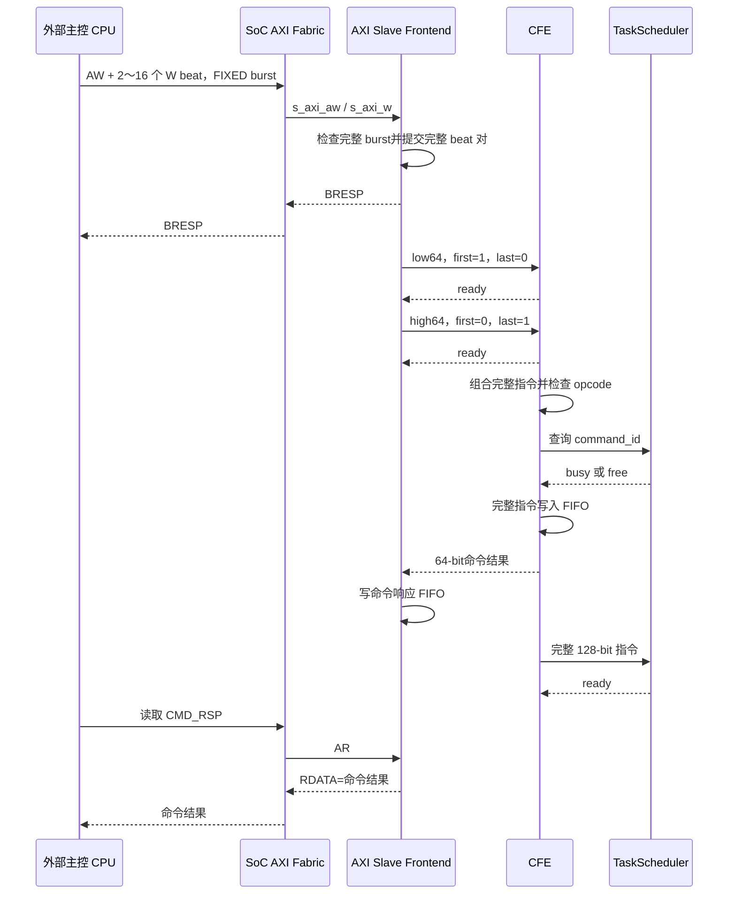
```mermaid
%%{init: {"sequence": {"useMaxWidth": true, "actorMargin": 14, "width": 92, "messageMargin": 10, "noteMargin": 6}, "themeVariables": {"fontSize": "11px"}}}%%
sequenceDiagram
    participant CPU as 外部主控 CPU
    participant FAB as SoC AXI Fabric
    participant ASF as AXI Slave Frontend
    participant CFE
    participant TS as TaskScheduler

    CPU->>FAB: AW + 2～16 个 W beat，FIXED burst
    FAB->>ASF: s_axi_aw / s_axi_w
    ASF->>ASF: 检查完整 burst并提交完整 beat 对
    ASF-->>FAB: BRESP
    FAB-->>CPU: BRESP
    ASF->>CFE: low64，first=1，last=0
    CFE-->>ASF: ready
    ASF->>CFE: high64，first=0，last=1
    CFE-->>ASF: ready
    CFE->>CFE: 组合完整指令并检查 opcode
    CFE->>TS: 查询 command_id
    TS-->>CFE: busy 或 free
    CFE->>CFE: 完整指令写入 FIFO
    CFE-->>ASF: 64-bit命令结果
    ASF->>ASF: 写命令响应 FIFO
    CFE->>TS: 完整 128-bit 指令
    TS-->>CFE: ready
    CPU->>FAB: 读取 CMD_RSP
    FAB->>ASF: AR
    ASF-->>FAB: RDATA=命令结果
    FAB-->>CPU: 命令结果
```

无暂停时，CFE 在接收高 beat后依次执行固定字段检查、编号查询、FIFO 写入和结果返回。任一 ready/valid 接口暂停时，发送方必须保持 valid、data 及相关控制字段不变。TS 暂停时，队首输出寄存器保存完整指令；命令响应暂停时，响应寄存器保存 status、编号和剩余项数。CFE 产生 `cmd_accepted_o` 的时刻是完整指令写入本地 FIFO的周期，不是 AXI W beat进入 Slave Frontend 的周期，也不是任务开始执行的周期。

### 7.7 复位、停止与错误要求

- 复位清空低、高 beat寄存器、CFE FIFO、指针、占用数和待返回状态；
- `quiesce_i=1` 时停止接收新的内部 CMD beat，已经进入 CFE FIFO 的完整指令继续送往 TS；
- 正常 stop 时，LSC 先禁止 AXI Slave 接受新的 CMD burst，等 `cmd_ingress_idle_i=1` 后才置 CFE quiesce，因此已进入命令入口的完整 beat 对会先送完；软复位则立即置 quiesce，尚未送完的 beat 与 `CFE_WAIT_HIGH` 中的低 beat由随后的功能复位清除；
- 错误命令不得进入 CFE FIFO，不得产生 `cmd_accepted_o`，也不得出现在 TS 的完整 CMD接口；
- CFE 只产生片上控制访问，不得因为任何命令检查动作发起 NPU `m_axi_*` 请求。

---

## 8. TaskScheduler 与内联解码

### 8.1 组成与职责

`npu_task_scheduler` 接收 CFE 提供的完整指令，在同一 Core 时钟域完成字段检查、事件处理、任务保存、发射解码、完成记录和软件查询。模块由以下部分组成：

- 完整 128-bit 指令输入接口；
- 一项命令接纳寄存级，保存接收检查结果、事件引用、前序任务位图、目标槽号、完整指令和提交时基地址；
- 任务表，基准为 16 项；
- Event Table，包含 255 个可用 Event ID；
- 一组接收检查解码器；
- 一组 WAIT_EVENT 逐槽检查寄存器和一项检查结果寄存器；
- 一组逐槽发射扫描寄存器；
- 一组发射窄快照寄存器和一组共享发射解码器；
- DMA、Matrix、Vector、Complex 各自使用的一组 2048 bit发射暂存；
- DMA、Matrix、Vector、Complex 四组任务发射与完成接口；
- 两项 Matrix active 记录，以及 DMA、Vector、Complex 各一项 active 记录；
- 一组由 Control 操作、普通 signal Event 和完成通知共用的逐槽选择寄存器；
- 一项 Control 执行快照，保存轮末获胜的任务槽号和 `submit_seq`；
- 普通 signal Event 发布暂存和完成通知持有槽寄存器；
- AXI Slave Frontend 控制请求接口；
- 任务查询和 ACK 接口。

接收检查解码器读取 CFE 提供的完整指令和 LSC 当前基地址，用 `valid_o`、`engine_o` 与 `opcode_o` 完成接收阶段检查，但它的 `desc_flat_o` 在该实例中没有接入任务表。CFE 与 TS 完成握手时，TS 先把检查结果、当前 Event generation、前序任务位图、目标 FREE 槽、完整指令、五个 48 bit基地址和 20 bit L1 参数区基址保存到一项命令接纳寄存级；下一时钟周期只读取这些寄存值写任务表。任务表不保存 2048 bit展开结果。

WAIT_EVENT 任务使用独立的逐槽检查器。检查器每周期只读取一个任务槽的 `wait0`、`wait1`，并以两个索引读取 Event Table；普通任务与 `EVENT_JOIN(join_mode=0)` 对两个结果执行 AND 条件，`EVENT_JOIN(join_mode=1)` 执行 OR 条件。事件检查结果、槽号和该槽当前的 `submit_seq` 在时钟沿写入结果寄存器，下一周期只有在任务仍为 WAIT_EVENT 且 `submit_seq` 未变时，才把任务改为 READY 或 `DEPENDENCY_FAILED`。前序任务仍未结束时，即使事件条件已经满足，任务也继续处于 WAIT_EVENT，后续扫描再次检查。Event 发布暂存即将在当前时钟沿写入的 SUCCESS 或 ERROR 会直接转发给本周期的两个 Event Table 读取，避免等待任务因读到旧状态而多等一整轮。基准 16 项任务表从某个事件可见到对应任务更新，最迟经过 16 个时钟周期。

等待事件成功并且 `predecessor_mask & task_live_mask` 为 0 时，任务才从 WAIT_EVENT 进入 READY。DMA、Matrix、Vector 和 Complex 的 READY 任务共同参加发射扫描。发射扫描器每周期读取一个任务槽；候选必须仍为 READY、上述按位与结果仍为 0、对应发射暂存的 `valid` 为 0，并且目标执行单元仍有接收容量。DMA、Vector 和 Complex 要求其 active 位为 0；Matrix 允许两项 active，只要至少存在一个空项，或本周期有可正确匹配的 Matrix 完成消息释放一项即可继续接收。扫描器每周期只进行一次 64-bit `submit_seq` 比较，用于保留当前最早候选。检查完 `TASK_SLOTS` 个槽后，组合逻辑重新检查已保存候选和最后一个槽，只在获胜任务仍满足条件时写入发射窄快照；基准配置为 16 个槽。如果没有候选，本轮结束且不写快照，后续周期从槽 0 开始下一轮。

Control 执行、普通 signal Event 发布和完成通知使用另一组逐槽选择寄存器。三类选择共用一个连续递增的任务槽计数器，并在同一周期检查同一个槽；每一类分别保存本轮候选位图、变化标志、最早候选槽号和 64-bit `submit_seq`。一轮开始时保存三类候选位图，随后用 `TASK_SLOTS` 个周期逐项检查；基准配置为 16 个周期。最后一个槽检查结束时，各类分别复查本轮位图是否保持不变、获胜项是否仍符合要求以及 `submit_seq` 是否一致。某一类的候选位图在本轮发生变化时，只取消该类本轮的选择脉冲，下一轮从槽 0 重新检查；另外两类不受影响。三类选择可在同一轮末尾各产生一个脉冲。

Control 获胜脉冲不直接修改 Event Table 或任务表。时钟沿先把获胜槽号和 `submit_seq` 写入 `control_exec_slot_q`、`control_exec_seq_q`，下一周期重新检查该槽仍为 READY Control 任务、提交序号一致且没有前序任务阻塞，检查通过后才执行 EVENT_REARM、EVENT_JOIN 或 GLOBAL_FENCE。正在执行的 Control 槽不再参加同轮候选集合。TS 在 `control_exec_valid_q=1` 时拉低 `cfe_cmd_ready_o`，防止 EVENT_REARM 修改 generation 的周期同时接收一条等待该 Event 的新命令。若执行快照形成前一个周期已经保存了一项命令接纳记录，EVENT_REARM 还会检查该接纳项的 `wait0` 和 `wait1`；任一引用等于待重置事件时，EVENT_REARM 返回 `BAD_DESC` 并保持 Event Table 不变。Control 任务不使用发射扫描器和共享发射解码器。

被选任务先在时钟沿写入 `decode_pending_*`：其中保存目标执行单元、任务表项编号、操作码、命令编号、128 bit指令、五个 48 bit基地址快照和 20 bit L1 参数区基址。下一周期，`u_task_desc_decode` 根据这组稳定快照组合产生 `decode_pending_desc_flat[2047:0]`；再下一个时钟沿把展开结果和任务信息写入目标执行单元的发射暂存。本文把发射接口上的 2048 bit片上数据称为 Task Context。它不是软件数组，不位于 DDR，也不会引起 MIF 访问。

共享解码器每次处理一个待展开任务。`decode_pending_valid_q=1` 时，TS 先处理已有窄快照并停止扫描；没有待处理快照时，扫描器从槽 0 到槽 `TASK_SLOTS-1` 每周期检查一项，共用 `TASK_SLOTS` 个周期完成一轮，基准配置为 16 个周期。已有快照在写入任务发射暂存前，会再次检查任务仍为 READY、任务表中的执行类别字段未变且前序任务条件仍满足。目标任务接口暂时不可接收新任务时，快照保持有效；任务本身不再满足条件时，快照被丢弃。任务通常持续多个周期，这一级按次序展开不会阻止已经取得任务的 DMA、Matrix、Vector 和 Complex 同时运行。Matrix 与 Vector 同处于 Matrix-Vector Engine，运行时仍要经过该模块内部的 PE 与 L1 仲裁。四组发射暂存彼此独立，可分别保持 `valid` 并承受不同长度的反压。

### 8.2 CFE 输入与编号查询接口

TS 的时钟、运行控制、配置和状态信号如下：

| 信号 | TS 方向 | 位宽 | 说明 |
| --- | --- | ---: | --- |
| `clk_i` | Input | 1 | Core 时钟 |
| `reset_n` | Input | 1 | 低有效异步置位复位；系统在 Core 时钟域同步释放 |
| `enable_i` | Input | 1 | 允许接收 CFE 已保存的完整指令；顶层在停止接收新 AXI 命令后仍可用该信号排空 CFE |
| `quiesce_i` | Input | 1 | 停止接收新指令，已保存任务继续推进 |
| `abort_i` | Input | 1 | 把非终态任务置为 `ABORTED` |
| `input_base_i` | Input | 48 | `INPUT_BASE` |
| `weight_base_i` | Input | 48 | `WEIGHT_BASE` |
| `work_base_i` | Input | 48 | `WORK_BASE` |
| `output_base_i` | Input | 48 | `OUTPUT_BASE` |
| `kv_base_i` | Input | 48 | `KV_BASE` |
| `param_l1_base_i` | Input | 20 | L1 参数区起始地址 |
| `scheduler_idle_o` | Output | 1 | 没有命令接纳项、任务表占用项和活动执行单元 |
| `scheduler_quiescent_o` | Output | 1 | 没有接纳、WAIT_EVENT 任务、解码、发射、活动执行、Control、Event 发布、完成持有或 AXI 控制请求；不要求终态任务表项已经 ACK |
| `task_occupancy_o` | Output | 16 | 当前非 FREE 任务表项数加命令接纳项数 |

| 信号 | TS 方向 | 位宽 | 说明 |
| --- | --- | ---: | --- |
| `cfe_cmd_valid_i` | Input | 1 | CFE 队首完整指令有效 |
| `cfe_cmd_ready_o` | Output | 1 | TS 可以把一条完整指令保存到命令接纳寄存级 |
| `cfe_cmd_i` | Input | 128 | 完整 128-bit 指令 |
| `cmd_id_lookup_valid_i` | Input | 1 | CFE 请求查询命令编号 |
| `cmd_id_lookup_ready_o` | Output | 1 | TS 接受查询，现有 RTL 固定为 1 |
| `cmd_id_lookup_id_i` | Input | 10 | `command_id[9:0]` |
| `cmd_id_lookup_rsp_valid_o` | Output | 1 | 查询握手后的下一周期产生一个周期脉冲 |
| `cmd_id_busy_o` | Output | 1 | 任一非 FREE 任务表项或有效命令接纳项使用该编号 |

`cfe_cmd_ready_o` 只在 `enable_i=1`、`quiesce_i=0`、`abort_i=0`、任务表存在 FREE 项、命令接纳寄存级为空并且没有待执行 Control 快照时为 1。完整命令握手后，TS 在第一个时钟沿保存以下接纳字段：

| 接纳字段 | 作用 |
| --- | --- |
| `cmd_admit_slot_q` | 本次选中的 FREE 任务槽 |
| `cmd_admit_command_id_q`、`cmd_admit_engine_q`、`cmd_admit_opcode_q`、`cmd_admit_header_flags_q` | 编号、目标执行单元、操作码和公共选项 |
| `cmd_admit_wait0_q`、`cmd_admit_wait1_q` | 使用握手周期 Event generation 得到的内部等待事件引用 |
| `cmd_admit_signal_q` | 使用握手周期 Event generation 得到的 signal 引用；无论整条命令的接收检查是否通过，都保存已经处理的引用 |
| `cmd_admit_static_valid_q`、`cmd_admit_is_inline_rearm_q` | 接收检查结果和 EVENT_REARM 标志 |
| `cmd_admit_predecessor_mask_q` | 握手周期看到的较早活动任务集合 |
| `cmd_admit_cmd_q` | 完整 128-bit 指令 |
| 六项基地址寄存器 | 五个 48 bit物理基地址和 20 bit L1 参数区基址 |

下一个时钟沿把该接纳项写入任务表，并在此时分配 64 bit `submit_seq`、更新 Event PENDING 状态以及增加全局提交序号。命令接纳寄存级有效时，TS 暂停接收下一条 CFE 命令，因此当前接收速率上限为每两个 TS 时钟周期一条完整指令。CFE 组合一条指令本身需要两个 64-bit beat，执行单元任务持续时间通常更长；软件仍须按 ready/valid 处理，不能假定每周期都能提交一条完整指令。任务表满时，TS 同样对 CFE施加反压。

单核顶层把 `enable_i` 连接为 `accept_new_cmd_o || !cfe_idle`。正常运行时，`accept_new_cmd_o=1` 允许 CFE 队首进入 TS；软件请求停止后，AXI 命令入口先停止接收新的 CMD burst，但只要 CFE 仍有完整指令，`!cfe_idle` 便继续保持 TS 接纳能力。这样，已经到达 CFE 的命令不会因为 start 清零而滞留。等命令入口和 CFE 依次排空后，LSC 才令 `ts_quiesce_o=1`，此后 TS 不再接收新的 CFE 队首，任务表内已有任务仍可继续发射和完成。

保留接纳握手时的基地址是必要的：一条任务可能在命令接纳寄存级、WAIT_EVENT 或 READY 状态停留多个周期，软件也可能在此期间改写 LSC 基地址寄存器。任务表写入和发射解码器必须继续使用握手时保存的五个基地址和 L1 参数区基址，使已经接收的任务不受后续寄存器写入影响。

signal 引用的保存与整条命令的接收检查结果分开处理。Event ID 为 `8'hff` 时保存 `NPU_EVENT_NONE`；其他 Event ID 与握手周期读出的 generation 组合成 12-bit引用，并直接写入 `cmd_admit_signal_q`。因此，`cmd_admit_signal_q` 的输入不需要再经过由 `cmd_static_valid` 控制的 12-bit选择器。接收检查失败的命令仍把该引用写入任务表，便于查询任务记录；但该任务建立时把 `event_published` 置 1，也不会把 Event Table 表项写为 PENDING，所以它既不占用 signal Event，也不会在终态发布 Event。

CFE 的编号查询覆盖命令接纳项以及等待、就绪、运行和等待 ACK 的终态任务。查询握手发生时，组合检查同时比较 `cmd_admit_command_id_q` 和全部非 FREE 任务表项，查询结果在下一周期由 `cmd_id_lookup_rsp_valid_o` 给出。终态项只有在 ACK 完成后才变为 FREE，因此相同 `command_id` 在 ACK 前始终返回 busy。内部任务编号和完成端口为 12 bit，指令中的 10-bit编号按 `{2'b00,command_id[9:0]}` 零扩展。

> [!important] 编号查询与任务表写入
> 若命令 A 已经从 CFE 出队并位于命令接纳寄存级，而命令 B 随后查询相同 `command_id`，查询必须返回 busy。命令 A 写入任务表的时钟沿会清除接纳 valid，同时把相同编号写入非 FREE 任务槽，所以编号在两个存储位置之间转移时始终被占用。

### 8.3 内联解码接口与规则

`npu_inline_desc_decode` 是组合模块，接口如下：

| 信号 | 方向 | 位宽 | 说明 |
| --- | --- | ---: | --- |
| `cmd_i` | Input | 128 | 当前完整 128-bit 指令 |
| `input_base_i` | Input | 48 | `INPUT_BASE` |
| `weight_base_i` | Input | 48 | `WEIGHT_BASE` |
| `work_base_i` | Input | 48 | `WORK_BASE` |
| `output_base_i` | Input | 48 | `OUTPUT_BASE` |
| `kv_base_i` | Input | 48 | `KV_BASE` |
| `param_l1_base_i` | Input | 20 | L1 参数区起始地址 |
| `valid_o` | Output | 1 | opcode、payload、地址引用和固定字段组合合法 |
| `engine_o` | Output | 4 | Control、DMA、Matrix、Vector 或 Complex |
| `opcode_o` | Output | 8 | 执行单元使用的展开 opcode |
| `desc_flat_o` | Output | 2048 | 组合展开的内部 Task Context；接收检查实例不保存该输出，共享发射实例把当前结果写入目标发射暂存 |

解码器直接解释第 6.7 节的 80-bit payload。DMA 的 `AREF28` 根据 `space`、`base_select` 和 offset 形成 L1 地址或 48-bit全局地址；Matrix、IVE 和 CME 的 `LREF` 按第 6.5 节的固定单位形成 L1 字节地址。加法溢出、非法基址选择、保留位非零、不接受的操作组合、零长度和不接受的 dtype 组合使 `valid_o=0`。

`engine_o` 和 `opcode_o` 由指令 bit `[127:122]` 得到。发射时生成的 Task Context包含执行单元所需的地址、尺寸、dtype、内部控制字段和检查结果，其中实际地址使用任务表保存的提交时基地址快照计算。Task Context 中不包含需要从系统存储补读的地址指针；DMA 只有在实际搬运任务执行时才通过 MIF访问全局数据。

事件 generation 不依赖 2048 bit展开结果。TS 在命令接收阶段把 Event ID 与 Event Table 当前 generation 组合，并分别保存到任务表的 `wait0`、`wait1` 和 `signal` 字段。`EVENT_REARM` 执行时读取任务表中保存的 `signal` 引用，再把该事件的 generation 加 1。

### 8.4 任务表

每个任务表项至少保存：

| 字段 | 位宽 | 说明 |
| --- | ---: | --- |
| `state` | 4 | FREE、WAIT_EVENT、READY、RUNNING、SUCCESS 或 ERROR |
| `command_id` | 12 | `{2'b00,CMD[121:112]}` |
| `engine` | 4 | 目标执行单元 |
| `opcode` | 8 | 展开后的执行单元 opcode |
| `header_flags` | 12 | IRQ、严格数值检查、顺序标志和超时类别 |
| `wait0`、`wait1` | 各 12 | `{generation,event_id}` 或 `12'hfff` |
| `signal` | 12 | `{generation,event_id}` 或 `12'hfff`；接收检查失败的任务也保留握手周期已经处理的引用，但不会修改或发布对应 Event |
| `submit_seq` | 64 | 全局提交顺序号 |
| `predecessor_mask` | `TASK_SLOTS`，基准为 16 | `task_predecessor_mask_q`；每个 bit 对应一个任务槽，1 表示本任务仍需等待该槽中的较早任务 |
| `cmd` | 128 | 接收的完整指令，RTL 中保存为 `task_cmd_q` |
| `input_base`、`weight_base`、`work_base`、`output_base`、`kv_base` | 各 48 | 命令提交时五个 LSC 基地址寄存器的快照，分别对应 `task_input_base_q`、`task_weight_base_q`、`task_work_base_q`、`task_output_base_q` 和 `task_kv_base_q` |
| `param_l1_base` | 20 | 命令提交时 L1 参数区基址的快照，对应 `task_param_l1_base_q` |
| `status` | 8 | 当前或终态状态码 |
| `fault_addr` | 48 | 第一个任务错误地址 |
| `progress` | 64 | 执行单元报告的进度 |
| `error_info` | 32 | 错误阶段、状态和 opcode |
| `done_flags` | 16 | 完成附加标志 |
| `notify` | 1 | 终态通知尚未被下游接收 |
| `event_published` | 1 | 本任务所需的普通 signal Event 已写入 Event Table；无 signal、接收检查失败或 `EVENT_REARM` 任务在建立任务表项时直接置 1 |

`error_info[31:0]` 的现有格式为：`[31:28]` 保存阶段，`[27:24]` 固定为 0，`[23:16]` 保存任务 status，`[15:8]` 固定为 `8'hff`，`[7:0]` 保存展开 opcode。阶段 4 表示执行或 Control 处理，阶段 5 表示 abort，阶段 6 表示调度器检查。

命令接纳寄存级位于 CFE 接口和任务表之间，不是新的软件可见任务状态。它有效时，`task_occupancy_o` 已把该命令计为一项，但 AXI QUERY 尚不能从任务表读取它；CFE 的重复编号查询则必须把它视为 busy。接纳项在下一周期写入任务表后，任务状态按以下次序变化：

```text
FREE
→ WAIT_EVENT
→ READY
→ RUNNING
→ SUCCESS 或 ERROR
→ 软件 ACK
→ FREE
```

任务表不保存 `desc_flat[2047:0]`。Control 任务不经过外部执行单元，满足等待和顺序条件后由 TS 内部完成。静态字段或事件资源检查失败时，命令仍建立一项 ERROR 终态记录，`status=BAD_DESC`，并产生完成通知；它不会发给任何执行单元。该记录可以保留接收时形成的 signal 引用，但 `event_published=1`，Event Table 保持不变。

TS 在接收一条合法任务时生成 `predecessor_mask`，不再为每个等待任务反复比较两项 64-bit `submit_seq`。若新任务设置 `ordered=1`，掩码记录当时全部非 FREE 且未进入终态的较早任务。每条后续合法任务也记录当时仍未进入终态的较早 ordered 任务，因此不能越过这些任务。`GLOBAL_FENCE` 还会按照第 6.7.1 节的 `engine_mask`，记录被选执行单元中仍未进入终态的较早任务；它和其他合法任务一样，也要等待较早的 ordered 任务。

`task_live_mask` 的每个 bit 表示对应槽当前为非 FREE 且非终态。`order_blocked` 直接由 `predecessor_mask & task_live_mask` 的结果是否非零得到。较早任务进入 SUCCESS 或 ERROR 后，其 bit 立即不再产生阻塞。软件直接 ACK 或通过 AXI ACK 释放槽时，`released_slots_d` 在释放当拍生效，`released_slots_q` 在下一拍继续保留该信息；两者共同从全部任务保存的 `predecessor_mask` 中删除被释放槽的 bit，并在新任务写入时做相同过滤，避免槽号立即复用后恢复旧等待关系。WAIT_EVENT 检查结果除保存槽号外还保存检查时的 `submit_seq`；应用结果前同时复查状态和提交序号，因此旧槽已经 ACK 并被新任务复用时，先前保存的检查结果不能修改新任务。静态检查失败的任务仍保存接纳时取得的掩码，但任务直接进入 ERROR，因此不参加调度。abort 会清除全部前序任务掩码和待应用的 WAIT_EVENT 检查结果。GLOBAL_FENCE 在等待条件满足后返回 `SUCCESS`，不复制较早任务的失败状态。软件经 AXI 控制端口发出的 FENCE 不同：它保存请求开始时所选任务的快照，并返回其中提交顺序最早的失败状态。

### 8.5 Event Table

每个 Event Table 表项保存：

| 字段 | 位宽 | 说明 |
| --- | ---: | --- |
| `state` | 3 | FREE、PENDING、SUCCESS 或 ERROR |
| `generation` | 4 | 当前代次，按模 16 增加 |
| `producer_command_id` | 12 | 产生该事件的内部任务编号 |

CMD 中的 Event ID 为 8 bit，0～254有效，`8'hff` 表示不用。TS 接收命令时读取表项当前 generation，并形成内部 12-bit引用 `{generation,event_id}`；命令进入任务表后，Event Table generation 的改变不会修改已经保存的引用。

事件处理规则如下：

1. `wait0` 或 `wait1` 为 `8'hff` 时，该输入已经满足；
2. 等待事件必须不是 FREE，否则命令以 `BAD_DESC` 结束；
3. 普通任务和 `EVENT_JOIN(join_mode=0)` 在两个有效等待事件都为 SUCCESS 后满足事件依赖条件；此时前序任务位图按位与结果为 0 才进入 READY，否则继续处于 WAIT_EVENT。任一有效等待事件为 ERROR 时以 `DEPENDENCY_FAILED` 结束；
4. `EVENT_JOIN(join_mode=1)` 在任一等待事件为 SUCCESS 后满足事件依赖条件；此时前序任务位图按位与结果为 0 才进入 READY。两个有效等待事件都为 ERROR 时以 `DEPENDENCY_FAILED` 结束；一个失败而另一个仍为 PENDING 时继续等待；
5. 通过接收检查的普通任务，其 `signal` 必须指向 FREE 表项，任务表提交时将其置为 PENDING并保存生产者编号；接收检查失败的任务不修改 Event Table，即使其任务记录中的 `signal` 不是 `12'hfff` 也不例外；
6. 普通任务形成完整终态记录后先置位 `notify`。带有效 signal、尚未发布并且不在发布暂存中的任务进入 Event 发布候选位图；`EVENT_REARM` 不进入该位图；
7. Event 发布选择与 Control、完成通知共用任务槽计数器。扫描轮开始时保存 Event 发布候选位图，之后每周期检查一个槽，并单独保存 `submit_seq` 最小的 Event 候选；
8. 最后一个槽检查结束时，如果当前 Event 候选位图与本轮保存值不同，则本轮不产生 Event 选择脉冲，下一轮重新检查。如果位图未变，则再次检查获胜任务仍符合要求且 `submit_seq` 未变，检查通过后把任务表项编号写入 `event_publish_pending_slot_q`；
9. `event_publish_pending_valid_q=1` 的周期，TS 根据该任务的 status 把 signal Event 写为 SUCCESS 或 ERROR，并置位对应的 `task_event_published_q`。同一周期若得到新的 Event 选择脉冲，可用新槽号继续保持发布暂存有效；
10. 多个任务等待发布时，Event 按 `submit_seq` 从小到大依次可见。每个扫描轮最多选择一个普通任务的终态 Event；候选变化引起重试时，该轮不选择 Event；
11. 每个普通任务的 signal Event 只写入一次。已经位于发布暂存中的任务不会再次成为候选，`task_event_published_q=1` 的任务也不会再次写入；
12. `EVENT_REARM` 只接受已经终止且没有活动等待者的事件，把 generation 加 1 并把状态恢复为 FREE。该操作由 Control 处理逻辑直接修改 Event Table，不经过普通任务的发布暂存；
13. 逐槽选择器只把 EVENT_REARM 候选的槽号和 `submit_seq` 保存到 Control 执行快照。下一周期复查通过后才修改 Event Table；该周期 `cfe_cmd_ready_o=0`，因此新命令不能在 generation 改变的同一时钟沿取得旧事件引用。已经位于命令接纳寄存级的有效命令若等待该事件，本次 EVENT_REARM 返回 `BAD_DESC`，事件保持原代次。修改成功后的下一周期恢复 CFE 接纳，新命令将读取新的 generation。

TS 通过扫描非 FREE 且未终止的任务表项判断一个事件是否仍有活动等待者，不设置独立 waiter 计数器。

WAIT_EVENT 检查与 Event 发布选择使用不同的逐槽计数器。前者每周期对当前任务槽的两个事件引用各读取一个 Event Table 表项，并把分类结果寄存；后者负责从待发布任务中选择最早项。若发布暂存在当前周期给某个事件写入终态，前者对相同事件引用优先使用待写入状态。这样既保留同周期可见性，也把 Event Table 读取、事件分类与任务状态写控制分到相邻时钟周期。

> [!note] Event 可见时间
> 执行单元的 done 握手只表示 TS 已经取得终态数据。带普通 signal Event 的任务还要等待逐槽选择轮结束，再经过发布暂存写入 Event Table。任务在扫描轮中途成为候选时，候选位图变化会使该轮重试，因此不能把 done 到 Event 可见之间的时间假定为固定两拍。若较早提交的多个任务同时等待发布，后提交任务还要等待前面的 Event 逐项写入。依赖该 Event 的任务和 AXI `CTL WAIT` 都以 Event Table 中实际可见的状态为准。

### 8.6 任务类别与完成接口

TaskScheduler 使用 DMA、Matrix、Vector 和 Complex 四类任务接口。它们不对应四个物理执行模块：DMA 连接 DMA / Layout Engine，Complex 连接 CME，Matrix 与 Vector 都连接 `npu_matrix_vector_engine`。Matrix 与 Vector 仍使用不同的接口前缀、发射暂存、active 记录和完成握手。下表中的前缀分别替换为 `dma`、`matrix`、`vector` 或 `complex`。

| 信号 | TS 方向 | 位宽 | 说明 |
| --- | --- | ---: | --- |
| `<eng>_task_valid_o` | Output | 1 | TS 提供一项任务 |
| `<eng>_task_ready_i` | Input | 1 | 执行单元可以接收 |
| `<eng>_task_opcode_o` | Output | 8 | 展开后的执行单元 opcode |
| `<eng>_task_command_id_o` | Output | 12 | 零扩展后的命令编号 |
| `<eng>_task_desc_flat_o` | Output | 2048 | 对应执行单元发射暂存中的 Task Context |
| `<eng>_done_valid_i` | Input | 1 | 执行单元完成结果有效 |
| `<eng>_done_ready_o` | Output | 1 | TS 可以接收完成结果 |
| `<eng>_done_command_id_i` | Input | 12 | 完成任务编号；Matrix 由 `npu_matrix_context_dispatch` 返回所选 context 保存的编号，其他执行单元由其活动任务记录提供 |
| `<eng>_done_status_i` | Input | 8 | 第 4.3 节状态 |
| `<eng>_done_fault_addr_i` | Input | 48 | 第一个错误地址，无错误时为 0 |
| `<eng>_done_progress_i` | Input | 64 | 已完成字节数或元素数 |

DMA、Vector 和 Complex 同时最多各有一个 RUNNING 任务；Matrix 最多有两个 RUNNING 任务。TS 为四类任务分别设置 `*_dispatch_valid_q`、`*_dispatch_slot_q`、`*_dispatch_opcode_q`、`*_dispatch_command_id_q` 和 `*_dispatch_desc_q`，并为 Matrix 设置两项 `matrix_active_valid_q` 与 `matrix_active_slot_q`。READY 任务先经过 16 周期逐槽扫描；最后一个槽完成检查时，`submit_seq` 最小且仍可发射的候选写入 `decode_pending_*` 窄快照。下一拍共享解码器产生 Task Context；若目标任务接口仍可发射，则在拍末写入对应发射暂存，随后 `<eng>_task_valid_o` 才为 1。任务 valid等待 ready 时，对应暂存保持 opcode、command ID和 Task Context不变。

四组发射暂存相互独立。某个执行单元令 `task_ready=0` 时，只会使该单元的暂存保持有效并阻止新的同类任务取得选择条件；其他暂存仍可保持或完成握手，其他执行单元也可继续运行。共享解码器每次只能向一组暂存写入新的 Task Context，因此“暂存可独立握手”和“任务展开按次序进行”是两个不同的控制层次。

TS 接受 done 时检查 command ID 和 status。DMA、Vector 和 Complex 的编号必须与各自 active 任务相同。Matrix 在两项 active 记录中比较 `matrix_done_command_id_i`：恰有一项匹配时，清除该项并更新对应任务；没有匹配项或两项同时匹配时，仍接收完成消息以免阻塞执行单元，同时置起 `matrix_done_protocol_error_o`，但不释放任何 Matrix active 记录，也不修改无关任务。合法 `SUCCESS` 进入 SUCCESS，其余合法状态进入 ERROR。TS 同时保存 fault address 和 progress，生成 `error_info`，清除匹配的 active 状态并置位终态通知。

Matrix 完成与新 Matrix 任务接收可以发生在同一周期。两项 active 都有效时，只有当前完成编号能正确匹配一项，`matrix_active_accept_capacity` 才允许新任务握手；新任务占用本周期释放的记录。这样既保持两项任务容量，也不会让未知完成编号错误腾出位置。

### 8.7 完成通知、查询和 ACK

TS 通过以下接口向 LSC 发送完整终态通知：

| 信号 | TS 方向 | 位宽 | 说明 |
| --- | --- | ---: | --- |
| `completion_valid_o` | Output | 1 | 当前终态通知有效 |
| `completion_ready_i` | Input | 1 | LSC 可以接收 |
| `completion_command_id_o` | Output | 12 | 内部任务编号 |
| `completion_engine_o` | Output | 4 | 任务执行单元 |
| `completion_opcode_o` | Output | 8 | 展开 opcode |
| `completion_status_o` | Output | 8 | 终态状态 |
| `completion_fault_addr_o` | Output | 48 | 第一个错误地址 |
| `completion_progress_o` | Output | 64 | 执行进度 |
| `completion_irq_success_o` | Output | 1 | CMD 请求成功中断且任务成功 |
| `completion_irq_error_o` | Output | 1 | CMD 请求失败中断且任务失败 |

完成通知使用 `completion_hold_valid_q` 和 `completion_hold_slot_q` 保存当前通知的任务表项编号。所有 `notify=1` 的任务组成完成候选位图。完成选择与 Event 发布、Control 共用任务槽计数器，但拥有自己的候选位图快照、变化标志、最早候选槽号和 `submit_seq`。最后一个槽检查结束时，只有本轮完成候选位图未变化、获胜任务仍为候选并且 `submit_seq` 一致，才产生完成选择脉冲。候选位图发生变化时，本轮不产生该脉冲，下一轮重新检查。

持有槽为空且完成选择脉冲有效时，只有最早候选任务的 `task_event_published_q=1`，TS 才把其编号装入持有槽。这样，带普通 signal Event 的任务一定先让 Event Table 状态可见，随后才可以向 LSC 发送完成通知。无 signal、接收检查失败和 `EVENT_REARM` 任务不需要等待普通 Event 发布步骤。

`completion_valid_o` 直接取自持有槽 valid，所有完成字段都用持有槽中的任务表项编号读取。`completion_valid_o=1` 且 `completion_ready_i=0` 时，持有槽编号和全部完成字段保持不变，即使这段时间出现了更早或更晚的其他终态任务，也不能替换当前通知。握手时，TS 清除持有槽 valid 和对应表项的 `notify`；握手不释放任务编号，软件 ACK 后表项才回到 FREE。

如果多个任务同时形成终态，普通 Event 发布选择和完成通知选择都按 `submit_seq` 从小到大处理。完成选择先考察最早的 `notify` 项；该项的 Event 尚未发布时，不会绕过它发送后提交任务的完成通知。扫描期间新增或移除候选时，对应类别等待下一轮重新选择，避免扫描早期遗漏刚出现的更早任务。

TS 还提供组合查询和 ACK 端口：

| 信号组 | 说明 |
| --- | --- |
| `event_query_valid_i`、`event_query_ref_i[11:0]` | 查询一个内部 Event 引用 |
| `event_query_found_o`、`event_query_state_o[2:0]`、`event_query_producer_command_id_o[11:0]` | Event 查询结果 |
| `task_query_valid_i`、`task_query_command_id_i[11:0]` | 查询一个任务编号 |
| `task_query_found_o`、`task_query_state_o[3:0]`、`task_query_status_o[7:0]` | 任务存在、软件可见状态和状态码 |
| `task_query_fault_addr_o[47:0]`、`task_query_progress_o[63:0]` | 错误地址和进度 |
| `task_query_user_tag_o[31:0]` | 现有 RTL 名称；指令没有独立 user tag，该字段返回 `task_cmd_q[121:112]` 的零扩展值 |
| `task_query_signal_event_o[11:0]`、`task_query_error_info_o[31:0]`、`task_query_done_flags_o[15:0]` | 事件引用和诊断信息 |
| `task_ack_valid_i`、`task_ack_command_id_i[11:0]`、`task_ack_ready_o` | ACK 一个已经终止且通知已送出的任务 |

单核顶层把直接 `task_query_*` 和 `task_ack_*` 请求输入固定为 0，软件查询由下一节的 AXI控制寄存器完成。

### 8.8 AXI Slave控制请求

AXI Slave Frontend 通过 `axi_ctl_*` 向 TS 发出同步管理请求。该接口只属于 NPU AXI Slave寄存器访问，不属于处理器内部端口。

| 信号 | TS 方向 | 位宽 | 说明 |
| --- | --- | ---: | --- |
| `axi_ctl_valid_i` | Input | 1 | 控制请求有效 |
| `axi_ctl_ready_o` | Output | 1 | TS 可以接收一项控制请求 |
| `axi_ctl_op_i` | Input | 2 | `1=WAIT`、`2=QUERY`、`3=FENCE` |
| `axi_ctl_arg0_i` | Input | 64 | 第一参数 |
| `axi_ctl_arg1_i` | Input | 64 | 第二参数 |
| `axi_ctl_cancel_i` | Input | 1 | 取消已经接受的 WAIT 或 FENCE |
| `axi_ctl_rsp_valid_o` | Output | 1 | 控制结果有效 |
| `axi_ctl_rsp_ready_i` | Input | 1 | AXI Slave Frontend 可以接收结果 |
| `axi_ctl_rsp_data_o` | Output | 64 | 控制结果 |

`axi_ctl_ready_o` 只在没有活动控制请求、没有等待接收的控制响应并且命令接纳寄存级为空时为 1。命令已经位于接纳寄存级时，WAIT、QUERY 和 FENCE 都要等该命令写入任务表后再握手。这样，控制请求读取的任务状态与 FENCE 保存的目标集合都来自已经完成任务表写入的项目。

AXI Slave寄存器地址如下：

| 相对地址 | 名称 | 访问 | 作用 |
| ---: | --- | --- | --- |
| `0x0002_0020` | `CTL_ARG0` | RW | 保存 `arg0` |
| `0x0002_0028` | `CTL_ARG1` | RW | 保存 `arg1` |
| `0x0002_0030` | `CTL_START` | WO | bit `[1:0]` 写入非零操作码并启动请求 |
| `0x0002_0038` | `CTL_STAT` | RO | bit 0 为 busy，bit 1 为 done，bit `[15:8]` 为前端状态 |
| `0x0002_0040` | `CTL_RESULT` | RO | 最近一项控制结果 |
| `0x0002_0048` | `CTL_CANCEL` | WO | 写 1 取消 WAIT 或 FENCE |

同一时刻最多有一项控制请求。WAIT 的 `arg0[7:0]` 是 Event ID，`arg0[63:8]` 必须为 0，`arg1[31:0]` 是最大等待周期；TS 在接受 WAIT 时读取该 Event 的当前 generation，并把 `{generation,event_id}` 保存到控制请求状态中，因此事件随后经过 REARM 后不会被一次较早的 WAIT 错认。WAIT 只读取 Event Table，任务 done 到 Event 发布之间的暂存周期以及前面其他 Event 的排队周期都计入最大等待周期；设置超时值时必须包含这段时间。QUERY 的 `arg0[9:0]` 是命令编号，`arg0[63:10]` 必须为 0，`arg1[2:0]` 是 selector；FENCE 的 `arg0[3:0]` 是 Engine mask，`arg1[31:0]` 是最大等待周期。异步任务顺序控制使用第 6 章的 `GLOBAL_FENCE` 指令，AXI FENCE 用于软件发起一次同步管理等待。

TS 接受 FENCE 时按 Engine mask 保存每个已占用目标槽的有效 bit、`submit_seq`、是否已经终止以及已终止任务的 status。扫描器从槽 0 开始，每周期读取一个槽：

1. 请求开始时已经终止的目标使用保存的 status，不再依赖任务表中的当前内容；
2. 请求开始时尚未终止的目标同时比较槽状态和保存的 `submit_seq`，任务进入终态后读取当前 status；
3. 目标尚未终止时保留其有效 bit，下一轮再次检查；目标在本轮已经检查过以后才完成时，将在下一轮检查到；
4. 目标终止后清除其有效 bit；所有 bit 清零时返回已保存结果；
5. 多个目标失败时，每周期只比较当前目标与已保存失败任务的 `submit_seq`，最终返回提交时间最早的失败 status。

FENCE 扫描期间，直接任务 ACK 对尚未检查完成的目标槽返回未就绪，防止任务完成后被释放并由新任务复用。扫描器读取终态结果并清除该目标 bit 后，直接 ACK 才能继续。若 FENCE 接收与一个终态任务的直接 ACK 发生在同一时钟沿，请求接收阶段保存的终态标志、status 和 `submit_seq` 仍可供后续扫描使用，因此不会漏掉该任务。AXI QUERY selector 4 与 AXI FENCE 不能同时被接受，因为控制端一次只保存一项请求，并且上一项响应被接收以前 `axi_ctl_ready_o` 保持为 0。

命令接纳和控制请求在同一时钟沿出现时遵循以下规则：

1. 若上一周期命令接纳寄存级已经有效，`axi_ctl_ready_o=0`，因此 FENCE 或 QUERY 不能与任务表提交发生在同一时钟沿；
2. 若命令接纳寄存级原本为空，CFE 完整命令和 AXI 控制请求可以在同一时钟沿分别完成握手。该控制请求读取的是该时钟沿到来前的任务表；同一时钟沿刚由 CFE 保存到命令接纳寄存级的命令不属于本次 FENCE 目标，QUERY 也不会把它当成已经建立的任务；
3. 时钟沿之后，接纳项立即计入 `task_occupancy_o`，其 `command_id` 立即参与 CFE 编号查询。下一周期控制请求暂停，接纳项写入任务表后才允许后续控制请求；
4. CFE 本地 FIFO 在出队时钟沿到来前仍保存即将被 TS 接纳的命令。若 CFE 同时检查另一条相同编号的命令，本地 FIFO 检查会报告重复；若查询发生在接纳项已经有效的周期，TS 的编号查询会报告 busy。两项检查共同覆盖同一时钟沿的 FIFO 出队和后续接纳周期。

> [!example] FENCE 与新命令同时到达
> 设任务表中已有 DMA 任务 A，CFE 队首为 DMA 任务 B，软件同一时刻启动选择 DMA 的 AXI FENCE。若 B 与 FENCE 在时钟沿 \(t_0\) 同时握手，FENCE 只保存 A；B 在 \(t_0\) 后位于命令接纳寄存级，在 \(t_1\) 写入任务表。该 FENCE 等待 A，不等待 B。若软件希望等待 B，必须先确认 B 的命令接收结果，再发起新的 FENCE。

FENCE 的等待计数包含逐槽检查周期。只要仍有未终止目标，硬件每周期比较等待计数和 `arg1[31:0]`；`arg1=0` 时在第一次检查发现未终止目标便返回 `TIMEOUT`。若当前检查确认最后一个目标已经终止，任务结果优先于 `TIMEOUT`。所有目标终止后不再触发超时，扫描器最多再用 `TASK_SLOTS-1` 个周期读取其余保存结果。`abort_i` 把尚未终止的目标任务改为 `ABORTED`，FENCE 继续扫描并按提交先后选择返回状态。`axi_ctl_cancel_i` 结束扫描并清除目标记录，不修改任务。复位清除扫描槽号、目标 bit、保存的终态标志和失败记录。

控制响应有效且 `axi_ctl_rsp_ready_i=0` 时，TS 保持 `axi_ctl_rsp_valid_o` 与 `axi_ctl_rsp_data_o` 不变，同时拉低 `axi_ctl_ready_o`。因此等待软件接收的 QUERY 结果不会被后来的 FENCE 请求改写。

QUERY selector 定义如下：

| Selector | `CTL_RESULT` |
| ---: | --- |
| 0 | bit `[3:0]` 为软件任务状态，`[11:4]` 为 status，`[23:12]` 为命令编号 |
| 1 | bit `[31:0]` 为任务表中完整指令的零扩展命令编号，`[43:32]` 为 signal Event 引用 |
| 2 | bit `[47:0]` 为第一个错误地址 |
| 3 | bit `[63:0]` 为 progress |
| 4 | ACK 结果：0 表示释放成功，1 表示任务未终止或通知未送出，2 表示没有该任务 |
| 5 | bit `[31:0]` 为 `error_info` |
| 6 | bit `[15:0]` 为 `done_flags` |
| 7 | 保留，返回 `BAD_DESC` |

QUERY selector 4 只有在任务已经终止且 `notify=0` 时释放任务表项。读取状态、中断清除和其他 selector 均不释放任务编号。WAIT 或 FENCE 取消只结束本次控制请求，不修改任务表、Event Table 或任务执行状态。

### 8.9 调度与完成时序

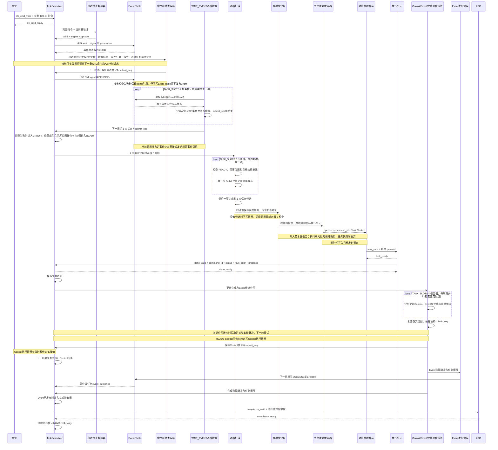
```mermaid
%%{init: {"sequence": {"useMaxWidth": true, "actorMargin": 14, "width": 90, "messageMargin": 10, "noteMargin": 6}, "themeVariables": {"fontSize": "11px"}}}%%
sequenceDiagram
    participant CFE
    participant TS as TaskScheduler
    participant CHECK as 接收检查解码器
    participant EVT as Event Table
    participant ADMIT as 命令接纳寄存级
    participant WSCAN as WAIT_EVENT逐槽检查
    participant SCAN as 逐槽扫描
    participant SNAP as 发射窄快照
    participant DEC as 共享发射解码器
    participant STG as 对应发射暂存
    participant ENG as 执行单元
    participant SEL as Control/Event/完成逐槽选择
    participant PUB as Event发布暂存
    participant LSC

    CFE->>TS: cfe_cmd_valid + 完整 128-bit 指令
    TS-->>CFE: cfe_cmd_ready
    TS->>CHECK: 完整指令 + 当前基地址
    CHECK-->>TS: valid + engine + opcode
    TS->>EVT: 读取 wait、signal 的 generation
    EVT-->>TS: 事件状态与内部引用
    TS->>ADMIT: 接收时钟沿保存FREE槽、检查结果、事件引用、指令、基地址和前序位图
    Note over CFE,ADMIT: 接纳项有效期间暂停下一条CFE命令和AXI控制请求
    ADMIT->>TS: 下一时钟沿写任务表并分配submit_seq
    TS->>EVT: 合法普通signal写PENDING
    Note over ADMIT,EVT: 接收检查失败时保留signal引用，但不写Event Table且不发布Event
    loop TASK_SLOTS个任务槽，每周期检查一项
        WSCAN->>EVT: 读取当前槽的wait0和wait1
        EVT-->>WSCAN: 两个事件的代次与状态
        WSCAN->>WSCAN: 分类AND或OR条件并寄存槽号、submit_seq和结果
    end
    WSCAN->>TS: 下一周期复查状态与submit_seq
    TS->>TS: 依赖失败则进入ERROR；依赖成功且前序位图按位与为0则进入READY
    Note over EVT,WSCAN: 当前周期发布的事件终态直接转发给相同事件引用
    TS->>SCAN: 无待展开快照时从槽 0 开始
    loop TASK_SLOTS个任务槽，每周期检查一项
        SCAN->>SCAN: 检查 READY、前序位图和目标执行单元
        SCAN->>SCAN: 用一次 64-bit 比较更新最早候选
    end
    SCAN->>SCAN: 最后一项完成时复查保存候选
    SCAN->>SNAP: 时钟沿保存获胜任务、指令和基地址
    Note over SCAN,SNAP: 没有候选时不写快照，后续周期重新从槽 0 检查
    SNAP->>DEC: 稳定的指令、基地址和目标执行单元
    DEC-->>STG: opcode + command_id + Task Context
    Note over SNAP,STG: 写入前复查任务；执行单元忙时保持快照，任务失效时丢弃
    Note over DEC,STG: 时钟沿写入目标发射暂存
    STG->>ENG: task_valid + 稳定 payload
    ENG-->>STG: task_ready
    ENG->>TS: done_valid + command_id + status + fault_addr + progress
    TS-->>ENG: done_ready
    TS->>TS: 保存完整终态
    TS->>SEL: 更新完成与Event候选位图
    loop TASK_SLOTS个任务槽，每周期并行检查三类候选
        SEL->>SEL: 分别更新Control、Event和完成的最早候选
    end
    SEL->>SEL: 复查各类位图、获胜项和submit_seq
    Note over TS,SEL: 某类位图改变时只取消该类本轮脉冲，下一轮重试
    Note over TS,SEL: READY Control任务在轮末写Control执行快照
    SEL->>TS: 保存Control槽号与submit_seq
    Note over CFE,TS: Control执行快照有效时暂停CFE接纳
    TS->>TS: 下一周期复查并执行Control任务
    SEL->>PUB: Event选择脉冲与任务槽号
    PUB->>EVT: 下一周期写SUCCESS或ERROR
    EVT-->>TS: 置位该任务event_published
    SEL->>TS: 完成选择脉冲与任务槽号
    TS->>TS: Event已发布时装入完成持有槽
    TS->>LSC: completion_valid + 持有槽对应字段
    LSC-->>TS: completion_ready
    TS->>TS: 清除持有槽valid与该任务notify
```

命令握手周期内，接收检查解码器组合产生 engine、opcode 和 `valid`，Event 逻辑形成内部事件引用与 `predecessor_mask`。第一个时钟沿只把这些结果、目标 FREE 槽、完整指令和基地址保存到命令接纳寄存级；第二个时钟沿才用保存值写任务表并分配 `submit_seq`。保存值写入任务表前会删除 `released_slots_q | released_slots_d` 指出的槽 bit。静态检查失败的任务直接建立 ERROR 终态，仍可保存接纳时取得的掩码，但终态任务不参加调度；合法任务先进入 WAIT_EVENT。独立检查器每周期读取一个槽和两个 Event Table 表项，时钟沿保存检查结果、槽号与 `submit_seq`；下一周期复查任务身份后，依赖失败的任务进入 ERROR，依赖成功且 `predecessor_mask & task_live_mask` 为 0 的任务进入 READY。该阶段不把 2048 bit展开结果写入任务表。

没有待展开快照时，TS 启动或继续逐槽扫描。任务表包含 `TASK_SLOTS` 项，基准值为 16；扫描器每周期检查一项。候选必须为非 Control 的 READY 任务、前序任务条件已满足、发射暂存为空，并且目标执行单元存在接收容量。Matrix 的容量为两项 active，其他执行单元为一项。扫描保存当前 `submit_seq` 最小的候选，并在最后一个槽完成检查时复查获胜项。复查通过后，时钟沿保存窄快照；没有候选时不写快照。

共享发射解码器在窄快照有效的周期组合产生 Task Context。TS 写入发射暂存前再次检查任务仍为 READY、执行单元字段一致且前序任务条件仍满足；检查失败时清除该快照，目标执行单元暂时不可接收新任务时则保持快照。写入暂存后任务接口置 `valid`。ready/valid 握手后，TS 记录暂存中的任务表项编号并把任务置为 RUNNING。某一发射暂存因 `ready=0` 保持时，不妨碍其他执行单元继续运行或完成已有暂存的任务握手，但新的 Task Context 仍由共享解码器依次生成。

Control 执行、普通 signal Event 发布和完成通知共用一组连续逐槽选择寄存器。每轮开始分别保存三类候选位图，在 `TASK_SLOTS` 个周期内对同一槽并行完成三类候选比较，并分别保留最小 `submit_seq`；基准配置为 16 个周期。轮末分别复查候选位图、获胜项和提交序号；某一类位图发生变化时只取消该类选择脉冲，下一轮重新检查。三类选择因此保持相互独立，但不再各自形成一次覆盖全部任务槽的组合比较。Control 获胜项还要先写入由槽号和 `submit_seq` 组成的执行快照，下一周期复查 READY 状态、执行单元类型、提交序号与前序任务条件后才更新 Control 任务和 Event 状态。快照有效周期暂停 CFE 命令接纳，避免 EVENT_REARM 和新等待者同时读取、修改同一 Event generation。

执行单元完成接口握手后，TS 保存 status、fault address和 progress，并把匹配任务记录为终态。Matrix 按返回的 `command_id` 在两项 active 中查找目标，因此两个 Matrix context 可以按不同于提交次序的先后完成。普通 signal Event 在共享扫描轮末获得选择脉冲后先写入发布暂存，下一周期才更新 Event Table；每轮最多选择一个待发布 Event。对应 `event_published` 置位后，最早的完成候选才可以进入完成持有槽。持有槽等待 LSC ready 时保持全部完成字段不变。软件读取需要的信息并完成 ACK 后，任务表项和 `command_id` 才能复用。

### 8.10 停止、复位与错误处理

- `quiesce_i=1` 阻止 TS 接收新的完整指令，不取消已保存任务；
- `abort_i=1` 丢弃尚未写入任务表的命令接纳项，把所有非终态任务改为 `ABORTED`，清零错误地址和 progress，并设置 `done_flags[2]`；同时清除 WAIT_EVENT 检查结果、Control 执行快照、四组发射暂存的 valid、待展开快照、发射扫描状态、Control/Event/完成共用扫描器、完成持有槽、Event 发布暂存、AXI 控制请求及其待接收响应，以及全部 `predecessor_mask`。这些终态记录随后由功能复位直接清除，不要求先发送完成通知或由软件 ACK。该输入不直接清除两项 Matrix active 与其他三项 active 记录；已有执行任务返回 done 时清除对应记录，功能复位则清除全部 active 记录；
- `reset_n` 低电平异步使复位状态生效，系统在 Core 时钟域同步释放复位；
- 复位把任务表全部置为 FREE，把每项 `predecessor_mask` 清零，把 Event Table 置为 `FREE,generation=0`，并把提交序号清零；
- 复位清除命令接纳 valid、WAIT_EVENT 检查结果 valid、Control 执行快照 valid、两项 Matrix active、其他三项 active 和发射暂存 valid，清除 `decode_pending_valid_q`、`decode_scan_active_q`、`decode_scan_best_valid_q`、`completion_hold_valid_q`、`event_publish_pending_valid_q`、查询响应与控制请求；WAIT_EVENT 检查槽号、发射扫描槽号、Control/Event/完成共用扫描槽号、三类候选位图、变化标志、候选槽号和候选提交序号恢复为 0；AXI FENCE 的扫描槽号、目标 bit、任务序号副本、终态副本和失败记录同时清零；
- 任一执行单元返回错误编号或未定义 status 时，TS 使用 `BAD_DESC` 形成稳定终态，不用错误字段访问其他任务表项；
- `scheduler_idle_o` 只有在命令接纳项无效、任务表占用数为 0 且四类任务均无 active记录时为 1；等待 ACK 的终态任务会使其保持为 0；
- `scheduler_quiescent_o` 检查命令接纳、WAIT_EVENT 任务、待解码快照、逐槽发射、四组发射暂存、两项 Matrix active、其他三项 active、Control 执行快照、Event 发布暂存、完成持有槽以及 AXI 控制请求和响应。任一任务仍为 WAIT_EVENT 时该信号保持 0；它不检查任务表占用数，因此只留下等待 ACK 的终态项时可以为 1；
- 内联解码不得访问 NPU `m_axi_*`；只有实际 DMA任务可通过 MIF访问全局数据。

复位会清零任务状态、任务编号、执行单元、操作码、事件引用、`submit_seq`、`predecessor_mask`、状态记录和通知控制字段。命令接纳项和 Control 执行快照的 payload 不要求清零，只需清除对应 valid；任务表中的 128 bit指令和基地址快照、`decode_pending_*` payload、四组 2048 bit发射 payload、完成持有槽编号或 Event 发布暂存编号也不要求清零。任务状态以及各级 valid 已经把这些内容标为无效；重新使用前，RTL 会由新任务完整覆盖。这样可以减少宽数据寄存器的复位负载，同时保持复位后的所有任务请求 valid 为 0。

---

## 9. DMA / Layout Engine

### 9.1 模块组成与功能

`npu_dma_engine` 是 DMA 的顶层集成模块，外部端口保持 TaskScheduler、L1BUF 和 MIF 的既有定义。`npu_dma_controller` 保存任务状态，检查 Task Context，并发射或接收 L1BUF、MIF 事务；`npu_dma_datapath` 保存形状计算寄存器、地址游标、快速传输计数、类型转换数据、RMW beat 和进度计数。顶层在两者之间传递状态、操作脉冲、当前地址、检查结果和写数据。

DMA / Layout Engine 在 L1BUF 与全局存储之间搬运数据，也可以在 L1BUF 内或全局存储内复制数据。当前 RTL 包含 Task Context 锁存器、字段检查器、元素地址生成器、整数格式转换器、二维转置地址生成器、PACK/SPLIT 地址生成器、对齐整 beat 快速复制单元、L1BUF 请求端口、MIF 请求端口、错误记录和进度计数器。

当前实现一次执行一条 DMA 任务。普通路径一次处理一个元素，完成“源读取、可选格式转换、目的写入”后才处理下一个元素。对齐整 beat 快速路径一次处理一个或多个 64-bit beat，省去逐元素选择与合并。多 beat AXI 读只用于 GADDR→L1BUF；L1BUF→GADDR、L1BUF→L1BUF 和 GADDR→GADDR 的快速复制每次仍处理一个 beat。MIF 同时保留一个 AXI 事务，DMA 用 `fast_beats_remaining_q` 跟踪已经发出的多 beat 读。

快速路径必须同时满足：

- 操作为 `DMA_COPY_1D` 或 `DMA_COPY_ND`；
- `convert_mode=0`，且源、目的 dtype 相同；
- 源、目的当前地址均按 8B 对齐；
- 当前内层至少剩余一个完整 beat 的元素；
- 源、目的当前区域都至少剩余 8B。

一个 64-bit beat 可保存 8 个 INT8、4 个 INT16 或 2 个 INT32 元素。GADDR→L1BUF 的本次读 beat 数取以下四者的最小值：当前内层剩余的完整 beat 数、源和目的区域剩余的完整 beat 数、`burst_beats_minus1+1`，以及从当前 AXI 地址到本 4KiB 段末尾可容纳的完整 beat 数。

地址生成使用递增游标，不在每个元素上重新求多维线性编号。DMA 保存五个维度的 `index_q`、源和目的外层累计偏移、内层起点、当前源地址和当前目的地址。连续内层元素按数据格式对应的元素字节数递增。外层维度通过 stride 增加起点，在某一维结束时减去该维已经累计的偏移，再继续处理更外层维度。

任务开始时，DMA 还要检查 shape 各维乘积。该检查采用 128×32 bit串行乘法：每个维度先装入 32-bit shape，随后每周期根据乘数最低位选择是否执行一次 128-bit 加法，并把乘数右移、被乘数左移。一个维度固定处理 32 个乘法位，因此不会在组合数据通路中串接多个宽乘法器。PACK 和 SPLIT 使用段计数，不进入 shape 乘法状态。

DMA 不执行带 scale 的数值调整。若两个张量的实数单位不同，编译器应安排 Integer Vector Engine 或 Complex Math Engine 处理。DMA 的格式转换规则只有以下几类：

- 位宽相同：保持整数值；
- 目的位宽更大：执行符号扩展；
- 目的位宽更小：执行饱和处理。

> [!note] “搬运”不等于简单复制字节
> 例如 INT8 数值 `-3` 的存储字节是 `0xfd`。把它搬到 INT16 时，DMA 先按 INT8 解释为有符号整数 `-3`，再写成 INT16 二进制补码 `0xfffd`，低地址保存 `0xfd`，下一地址保存 `0xff`。只有源、目的 dtype 相同时，搬运结果才与逐字节复制相同。

### 9.2 模块级信号

下表使用当前 `npu_dma_engine` 端口名。TaskScheduler 把内联解码得到的 Task Context 连同内部操作码交给 DMA；DMA 的完成信息由 TaskScheduler 补上 `command_id` 后写入任务表。

| 信号 | DMA 方向 | 位宽 | 说明 |
| --- | --- | ---: | --- |
| `clk_i` | Input | 1 | 计算域时钟 |
| `reset_n` | Input | 1 | 低有效异步进入复位；系统在计算时钟域同步释放 |
| `task_valid_i` | Input | 1 | 当前任务有效 |
| `task_ready_o` | Output | 1 | DMA 处于 `ST_IDLE`，可接收任务 |
| `opcode_i` | Input | 8 | 内部 DMA 操作码 `0x20～0x25` |
| `command_id_i` | Input | 12 | 低 10 bit 来自指令，高 2 bit为 0 |
| `desc_i` | Input | 2048 | 片上生成的 Task Context，不是软件提供的内存对象 |
| `done_valid_o` | Output | 1 | 完成状态有效 |
| `done_ready_i` | Input | 1 | TaskScheduler 可接收完成状态 |
| `done_status_o` | Output | 8 | 统一任务状态 |
| `done_fault_addr_o` | Output | 48 | 第一个失败地址；无地址错误时为 0 |
| `done_progress_o` | Output | 64 | 已得到目的端写完成响应的数据量 |

L1BUF 请求与响应端口如下：

| 信号 | DMA 方向 | 位宽 | 说明 |
| --- | --- | ---: | --- |
| `l1_req_valid_o` | Output | 1 | L1BUF 请求有效 |
| `l1_req_ready_i` | Input | 1 | L1BUF Controller 可接收请求 |
| `l1_req_write_o` | Output | 1 | 0 为读，1 为写 |
| `l1_req_addr_o` | Output | 20 | 8B 对齐的 L1BUF 字节地址 |
| `l1_req_wdata_o` | Output | 64 | 写数据 |
| `l1_req_wstrb_o` | Output | 8 | 每个字节一个写使能位 |
| `l1_rsp_valid_i` | Input | 1 | 读返回或写完成有效 |
| `l1_rsp_ready_o` | Output | 1 | DMA 可接收响应 |
| `l1_rsp_rdata_i` | Input | 64 | 读返回数据 |
| `l1_rsp_status_i` | Input | 3 | L1BUF 访问状态 |

MIF 请求与响应端口如下：

| 信号 | DMA 方向 | 位宽 | 说明 |
| --- | --- | ---: | --- |
| `mif_req_valid_o` | Output | 1 | 全局存储请求有效 |
| `mif_req_ready_i` | Input | 1 | MIF 可接收请求 |
| `mif_req_write_o` | Output | 1 | 0 为读，1 为写 |
| `mif_req_addr_o` | Output | 48 | 8B 对齐的全局物理字节地址；高于 `PA_W-1` 的 bit为 0 |
| `mif_req_wdata_o` | Output | 64 | 写数据 |
| `mif_req_wstrb_o` | Output | 8 | 每个字节一个写使能位 |
| `mif_req_burst_len_o` | Output | 8 | 读请求的 beat 数减 1；普通请求和全部写请求为 0 |
| `mif_rsp_valid_i` | Input | 1 | 读返回或写完成有效 |
| `mif_rsp_ready_o` | Output | 1 | DMA 可接收响应 |
| `mif_rsp_rdata_i` | Input | 64 | 读返回数据 |
| `mif_rsp_status_i` | Input | 3 | MIF 返回的存储状态 |

所有请求端口都遵守 ready/valid 规则。请求握手后，DMA 必须等待对应响应；响应暂停时，接收方必须保持 `valid`、数据和状态不变。接口没有 tag，因为 DMA 和 MIF 都只保留一个活动事务。多 beat 读的每个返回 beat 都形成一次内部响应，DMA 与 MIF 分别保存剩余 beat 数。

### 9.3 指令展开得到的 DMA Task Context

软件只填写第 6.7.2 节定义的指令位段。TaskScheduler 接收任务时保存指令与提交时基地址快照；DMA READY 任务在逐槽扫描中获胜并通过结束时复查后，共享发射解码器根据操作码、地址引用、该任务的基地址快照和数据格式生成下表中的 Task Context，并写入 DMA 发射暂存。下表用于说明 DMA 内部如何接收任务以及波形中各字段的来源，不是任务表字段，也不是软件需要分配的参数结构。

| Byte Offset | 字段 | 位宽 | 说明 |
| ---: | --- | ---: | --- |
| `0x40` | `rank` | 8 | COPY、FILL、PACK、SPLIT 为 1；TRANSPOSE 为 2 |
| `0x41` | `src_space` | 8 | L1BUF 或 GADDR |
| `0x42` | `dst_space` | 8 | L1BUF 或 GADDR |
| `0x43` | `convert_mode` | 8 | 不转换、符号扩展或饱和处理 |
| `0x44` | `burst_beats_minus1` | 8 | 当前由内联解码器写 7；GADDR→L1BUF 对齐 COPY 用它限制一次 AXI 读的长度 |
| `0x45` | `max_outstanding` | 8 | 当前由内联解码器写 1；允许值为 1～16，当前数据通路不使用它增加活动事务数 |
| `0x46` | `reserved0` | 8 | 内联解码器写 0；执行单元收到非零值时返回 `BAD_DESC` |
| `0x47` | `reserved1` | 8 | 内联解码器写 0；执行单元收到非零值时返回 `BAD_DESC` |
| `0x48` | `shape[0]` | 32 | 第 0 维元素数 |
| `0x4C` | `shape[1]` | 32 | 第 1 维元素数 |
| `0x50` | `shape[2]` | 32 | 第 2 维元素数 |
| `0x54` | `shape[3]` | 32 | 第 3 维元素数 |
| `0x58` | `shape[4]` | 32 | 第 4 维元素数 |
| `0x60` | `src_stride_bytes[0..4]` | 5×32 | 源张量外层步长 |
| `0x78` | `dst_stride_bytes[0..4]` | 5×32 | 目的张量外层步长 |
| `0x90` | `fill_value` | 32 | `DMA_FILL` 使用 |
| `0x98` | `src_region_bytes` | 64 | 从 `src0_addr` 起允许读取的字节数 |
| `0xA0` | `dst_region_bytes` | 64 | 从 `dst_addr` 起允许写入的字节数 |
| `0xA8` | `segment_count` | 16 | PACK/SPLIT 的段数 |
| `0xAA` | `segment_bytes` | 16 | 每段连续字节数 |
| `0xAC` | `segment_stride` | 32 | 相邻段起点间隔 |
| `0xB0～0xFF` | `reserved` | — | 内联解码器写 0 |

`0x5C～0x5F`、`0x74～0x77` 和 `0x8C～0x8F` 是内部对齐填充字节，内联解码器写 0。

`src_space` 和 `dst_space` 使用 `0=L1BUF`、`1=GADDR`，其他编码非法。`convert_mode` 使用：

| 编码 | 名称 | 行为 |
| ---: | --- | --- |
| 0 | `NONE` | 按原始位模式搬运，src/dst dtype 必须相同 |
| 1 | `SIGN_EXTEND` | INT8→INT16/INT32 或 INT16→INT32 |
| 2 | `SATURATE_NARROW` | INT32→INT16/INT8 或 INT16→INT8，超出目的格式范围时裁剪 |
| 3～255 | `RESERVED` | 返回 `BAD_DESC` |

各 DMA 指令展开后的内部值如下：

| Opcode | rank 与 shape | `convert_mode` | 专有字段 |
| --- | --- | --- | --- |
| `DMA_COPY_1D` | `rank=1`，`shape[0]` 是元素数 | 允许 0～2 | stride、fill 和 segment 字段写 0 |
| `DMA_COPY_ND` | `rank=1`，`shape[0]` 是元素数 | 允许 0～2 | 当前指令表示连续存储区；带步长操作由编译器拆分 |
| `DMA_FILL` | `rank=1`，`shape[0]` 是元素数 | 必须为 NONE | 使用 `fill_value`；源地址和 `src_region_bytes` 为 0 |
| `DMA_TRANSPOSE_2D` | `rank=2`，`shape[0]=rows`、`shape[1]=cols` | 必须为 NONE | 源、目的 dtype 必须相同；只使用第 0 个行 stride |
| `DMA_PACK` | `rank=1`，`shape[0]=segment_count` | 必须为 NONE | 使用 segment 三字段，全部多维 stride 写 0 |
| `DMA_SPLIT` | `rank=1`，`shape[0]=segment_count` | 必须为 NONE | 使用 segment 三字段，全部多维 stride 写 0 |

`DMA_PACK` 和 `DMA_SPLIT` 要求 `segment_count>0`、`segment_bytes>0` 且 `segment_stride>=segment_bytes`。该限制保证相邻的间隔段不互相覆盖；一个段结束后可以紧接下一个段，也可以留出空隙。它们按字节原样复制，不执行数值格式转换。`shape[0]` 等于 `segment_count`；段计数或段字节数为 0、stride 小于段字节数等字段错误返回 `BAD_DESC`。

当前 COPY 指令处理连续的一维元素序列。INT8、INT16 和 INT32 按元素字节数递增。TRANSPOSE 的行间隔由解码器依据行长度和数据格式计算，PACK/SPLIT 的段间隔直接来自指令中的 `segment_stride`。

指令中的 stride 是无符号字节数，不接受负值。反向序列读取由软件把起始地址设为最后一个时间步，并拆成多条正向 DMA 任务。

`DMA_FILL` 把 `fill_value` 解释为一个整数标量并重复写到全部有效元素：INT8 取低 8 bit，INT16 取低 16 bit，INT32 取低 32 bit。该标量按目的 dtype 的二进制补码解释。

当前内联解码器把内部 `burst_beats_minus1` 写为 7，把 `max_outstanding` 写为 1。DMA 检查 `burst_beats_minus1<=15`，并在 GADDR→L1BUF 对齐 COPY 中用该值限制 AXI 读长度，因此正常指令最多发出 8 beat 读；模块级 Task Context 可以测试 1～16 beat。`max_outstanding` 仍只参加合法性检查。

### 9.4 地址计算

对 COPY 指令，令当前元素编号为 $t$，满足 $0\le t<\text{count}$。INT8、INT16 或 INT32 的源、目的元素字节数分别记作 $e_s$ 和 $e_d$，则：

$$
\operatorname{src\_addr}(t)=s_0+t e_s,
$$

$$
\operatorname{dst\_addr}(t)=d_0+t e_d.
$$

其中 $s_0$ 和 $d_0$ 是内联解码后得到的实际字节地址。格式转换分别按照源和目的元素大小前进，因此第 $t$ 个源元素与第 $t$ 个目的元素保持对应，但源、目的字节偏移可以不同。

每次访问前，DMA 检查当前元素的起始地址和结束地址均位于 `src_region_bytes` 或 `dst_region_bytes` 所限定的范围内。地址加法回绕或超出范围时返回 `ADDR_FAULT`，`done_fault_addr_o` 保存本次失败的当前元素字节地址。

上述公式定义每个元素应访问的位置，不表示 RTL 每次都执行宽乘法。普通 COPY/FILL 数据通路保存 `current_src_addr_q` 和 `current_dst_addr_q`；最内层直接递增，外层使用 `src_stride_at()`、`dst_stride_at()` 和每维累计偏移推进。TRANSPOSE 另外保存行、列、源行起点和目的内层起点；PACK/SPLIT 保存段编号、段内字节编号和源、目的段起点。逐元素地址推进只使用比较和加减。

DMA Task Context 可以表示 rank 1～5。当前软件可见 COPY 指令仍展开为连续的一维任务，TRANSPOSE 展开为二维任务；更高 rank 的 stride 游标主要供模块级接口验证和后续指令扩展使用。文档中的当前指令能力不得由这一内部字段误推为任意多维 COPY。

COPY、TRANSPOSE、PACK 和 SPLIT 不允许源、目的存储范围重叠。两者处于相同地址空间且范围相交时，DMA 在写入目的数据前返回 `ADDR_OVERLAP`。软件需要处理重叠区域时，应先复制到临时 L1BUF 区域。

`DMA_PACK` 和 `DMA_SPLIT` 只处理“连续段与等距段”之间的整理。第 $i$ 段满足 $0\le i<\operatorname{segment\_count}$：

$$
\begin{aligned}
\text{PACK:}\quad
&s_i=s_0+i\cdot\operatorname{segment\_stride},&
&d_i=d_0+i\cdot\operatorname{segment\_bytes},\\
\text{SPLIT:}\quad
&s_i=s_0+i\cdot\operatorname{segment\_bytes},&
&d_i=d_0+i\cdot\operatorname{segment\_stride}.
\end{aligned}
$$

每段内部连续复制 `segment_bytes` 字节。任意长度或任意地址的数据段列表不能由一条指令表示，软件应拆成多条 `DMA_COPY_1D`。这三个字段也不能在一次任务中把逐行交错的 Q、K、V 整理为三个完整连续张量；该情况使用三条连续复制指令，或者先转置再复制。

对 `DMA_TRANSPOSE_2D`，内联解码器令 `shape[0]=rows`、`shape[1]=columns`，并根据连续行优先存储计算源行字节数和目的行字节数。源、目的 dtype 必须相同。设元素字节数为 $e$：

$$
\operatorname{src}(i,j)=s_0+i\,s_{\mathrm{row}}+j\,e,
$$

$$
\operatorname{dst}(j,i)=d_0+j\,d_{\mathrm{row}}+i\,e,
$$

其中 $0\le i<rows$，$0\le j<columns$，$s_{\mathrm{row}}=columns\times e$，$d_{\mathrm{row}}=rows\times e$。

> [!example] 2×3 INT8 转置
> 输入连续保存为 `[1,2,3,4,5,6]`，形状为 `[2][3]`，也就是第一行 `[1,2,3]`、第二行 `[4,5,6]`。转置输出形状为 `[3][2]`，连续字节次序是 `[1,4,2,5,3,6]`。当处理输入位置 $(i=1,j=2)$ 时，源偏移为 $1\times3+2=5$，读到数值 6；目的位置是 $(j=2,i=1)$，目的偏移为 $2\times2+1=5$，仍写到输出第 5 个元素。

### 9.5 DMA 状态机

| 状态 | 动作 |
| --- | --- |
| `ST_IDLE` | `task_ready_o=1`；握手后锁存操作码和 Task Context |
| `ST_CHECK` | 检查操作码、内部固定值、dtype 组合、rank、地址空间、转换方式以及操作专有字段 |
| `ST_SHAPE_LOAD` | 把当前累计 shape 乘积和一个维度的 32-bit shape 装入串行乘法寄存器 |
| `ST_SHAPE_MUL` | 每周期处理一个乘数 bit；完成当前维后处理下一维，最后检查零维和 64-bit 元素总数溢出 |
| `ST_REGION_CHECK` | 检查源、目的区域字节数以及同地址空间的区域重叠；FILL 不检查源区域 |
| `ST_CURSOR_INIT` | 清零多维索引与累计偏移，装入当前地址、段游标和转置行列游标 |
| `ST_PREP` | 检查源、目的元素范围和跨 beat 条件，同时判断是否满足整 beat 快速复制要求并计算本次 beat 数 |
| `ST_READ_REQ` | 向 L1BUF 或 MIF 发送读请求；GADDR 快速读把 `fast_beats_remaining_q-1` 送给 MIF |
| `ST_READ_RSP` | 普通路径选择一个元素；快速同空间复制保存完整 beat；GADDR→L1BUF 直接以当前 MIF 返回数据形成 L1 满 strobe 写请求；L1BUF→GADDR 直接以 L1 返回数据形成 MIF 写请求 |
| `ST_CONVERT` | 执行符号扩展或饱和处理 |
| `ST_WRITE_REQ` | 形成 64-bit 写数据和 8-bit `WSTRB`，向 L1BUF 或 MIF 发请求 |
| `ST_WRITE_RSP` | 接收写完成状态；普通路径按实际目的字节数增加进度，快速路径增加 8B，并推进地址、索引和 burst 计数 |
| `ST_BURST_DRAIN` | GADDR 多 beat 读中途发生 MIF 或 L1 错误时保存首次错误，接收并丢弃剩余 MIF 返回，然后进入完成状态 |
| `ST_ADVANCE` | 推进连续元素、外层维度、转置行列或 PACK/SPLIT 段游标；全部元素结束时完成任务 |
| `ST_DONE` | 保持完成状态，直到与 TaskScheduler 握手，然后回到 `ST_IDLE` |

非 PACK/SPLIT 任务在 `ST_CHECK` 后进入 shape 乘法。任一有效维度为 0 时，乘法检查完成后直接返回成功且不访问存储。shape 乘积高 64 bit非零，或低 64 bit为 `64'hffff_ffff_ffff_ffff` 时返回 `BAD_SHAPE`。正常任务经 `ST_REGION_CHECK` 和 `ST_CURSOR_INIT` 后进入处理循环。符合快速要求的 COPY 每次推进一个或多个完整 beat；其他任务进入普通元素数据通路。

DMA 的异步复位只把 `state_q` 置为 `ST_IDLE`。因此复位后 `l1_req_valid_o`、`mif_req_valid_o` 和 `done_valid_o` 均为 0，模块可以在复位释放后接收新任务。Task Context、地址、数据、shape 乘法和进度相关寄存器不依赖复位清零：`ST_IDLE` 接收任务时装入新的 Task Context，`ST_CURSOR_INIT` 初始化地址与游标，其他寄存器在进入使用它们的状态前赋值。

`done_progress_o` 统计已经获得目的端写完成响应的数据量。INT8、INT16 和 INT32 分别按每个元素 1B、2B 和 4B 增加；PACK/SPLIT 成功时等于 `segment_count×segment_bytes`。错误发生后，进度保留此前已经完成的目的写入量。

### 9.6 DDR 到 L1BUF 时序

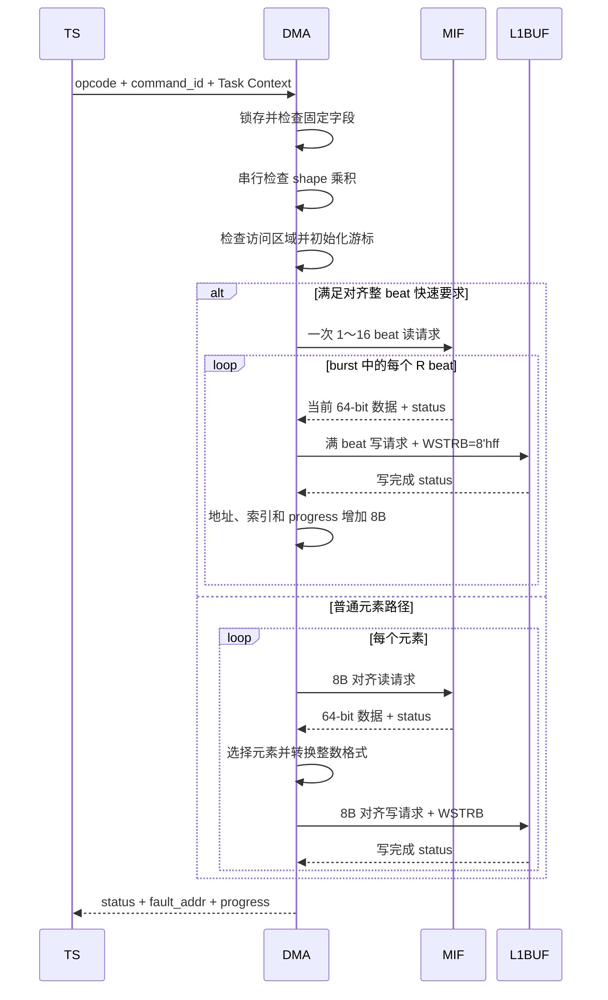
```mermaid
%%{init: {"sequence": {"useMaxWidth": true, "actorMargin": 14, "width": 82, "messageMargin": 10, "noteMargin": 6}, "themeVariables": {"fontSize": "11px"}}}%%
sequenceDiagram
    participant TS
    participant DMA
    participant MIF
    participant L1 as L1BUF

    TS->>DMA: opcode + command_id + Task Context
    DMA->>DMA: 锁存并检查固定字段
    DMA->>DMA: 串行检查 shape 乘积
    DMA->>DMA: 检查访问区域并初始化游标
    alt 满足对齐整 beat 快速要求
        DMA->>MIF: 一次 1～16 beat 读请求
        loop burst 中的每个 R beat
            MIF-->>DMA: 当前 64-bit 数据 + status
            DMA->>L1: 满 beat 写请求 + WSTRB=8'hff
            L1-->>DMA: 写完成 status
            DMA->>DMA: 地址、索引和 progress 增加 8B
        end
    else 普通元素路径
        loop 每个元素
            DMA->>MIF: 8B 对齐读请求
            MIF-->>DMA: 64-bit 数据 + status
            DMA->>DMA: 选择元素并转换整数格式
            DMA->>L1: 8B 对齐写请求 + WSTRB
            L1-->>DMA: 写完成 status
        end
    end
    DMA-->>TS: status + fault_addr + progress
```

成功条件必须同时满足：

1. 每个 MIF 读请求都收到成功响应；
2. 每个目的元素都完成 L1BUF 写请求握手；
3. 最后一个 L1BUF 写请求收到成功响应；
4. `done_progress_o` 等于目的张量实际占用的字节数；
5. TaskScheduler 接收完成状态。

MIF 的 AXI 事务在 DMA 与 MIF 的内部接口之后完成。DMA 只依据 `mif_rsp_status_i` 判断本次全局访问是否成功，不直接观察 AXI 的 `AR/R` 信号。快速读只发出一次 MIF 请求；每个 R beat 形成一次内部响应，该响应与 L1 满 beat 写请求握手后，DMA 等待对应 L1 写响应，再接收下一个 MIF 返回。MIF 在内部响应等待期间令 `RREADY=0`，所以 AXI R 数据不会连续无停顿地写入 L1BUF。MIF 对每个 beat 检查 `RID=0`、期望的 `RLAST` 和 `RRESP=OKAY`，再形成 3-bit 内部状态。

### 9.7 L1BUF 到 DDR 时序

1. DMA 向 L1BUF 发出 8B 对齐读请求。
2. L1BUF 返回完整 64-bit beat。普通路径根据元素地址低位和 dtype 取得一个元素；满足快速要求时保留全部 64 bit。
3. 普通数据通路执行可选的符号扩展或饱和处理；快速数据通路不改变数据。
4. DMA 向 MIF 发出 8B 对齐写请求。普通数据通路使用 `WSTRB` 选择目的字节；快速数据通路使用完整数据和 `WSTRB=8'hff`。
5. 当前 MIF 的 AXI 写固定为一个 beat，因此快速路径也为每个 L1 beat 分别发出一次 AXI 写。
6. MIF 检查物理地址并完成 AXI 写事务，只有在 `BID=0` 且 `BRESP=OKAY` 时返回成功。
7. DMA 收到写完成响应后增加 `progress`。处理完最后一个元素后向 TaskScheduler 报告成功。

当前一次只保留一个请求，因此不存在两个元素的返回次序问题。若后续增加并发请求，必须为每个请求保存元素编号、源或目的类型和字节 lane，并保证最终整数结果与本节定义相同。

---

## 10. L1BUF 与 L1BUF Controller

### 10.1 当前 RTL 的职责

L1BUF 是单核 NPU 内部的共享片上存储。当前 RTL 由 `/home/etc/FPGA/Transformer_NPU/rtl/memory/npu_l1buf.sv` 实现，文件中包含两个模块：

- `npu_l1buf_bank`：一组 64-bit 同步 SRAM，支持逐字节写使能；
- `npu_l1buf`：完成客户端仲裁、请求寄存、地址检查、bank 与 row 计算、读请求流水、写入控制和逐客户端响应保持。

本文把 `npu_l1buf` 中的控制逻辑称为 L1BUF Controller，但它不是另一个 RTL 模块。当前实现每次请求只访问一个 64-bit beat，不含多 beat 请求、请求 tag、ECC 检查、参数区写保护或客户端专用读写端口。所有客户端共用一组请求接口，Controller 每周期最多接受一个客户端请求。握手后的请求先保存到 `request_*_q` 寄存级，下一拍才驱动 SRAM bank 或产生地址错误响应，因此执行单元到 bank 的地址和写数据路径经过寄存器。

> [!note] 为什么必须按当前接口理解
> Matrix、DMA、Vector、Complex 和 AXI Slave 前端虽然可能连续访问很多元素，但每个 `req_valid/req_ready` 握手都只代表一次 8B 访问。执行单元负责把张量操作拆成一系列单 beat 请求，L1BUF 不会根据张量形状自动产生后续地址。

### 10.2 参数、容量与基本存储单位

| 参数或常量 | 默认值 | 说明 |
| --- | ---: | --- |
| `CLIENTS` | 6 | 客户端槽数量 |
| `L1_BYTES` | $2^{20}$ B | L1BUF 总容量，即 1 MiB |
| `BANKS` | 16 | SRAM bank 数量，必须是 2 的幂 |
| 本地地址宽度 | 20 bit | 可表示 `0x00000`～`0xfffff` |
| 一个 word | 8B | 与 64-bit 数据总线一致 |
| `WORDS` | `L1_BYTES / 8` | 默认 131072 个 word |
| `ROWS` | `WORDS / BANKS` | 默认每个 bank 8192 行 |

`L1_BYTES` 必须是 8 的整数倍，不能超过 20-bit 本地地址可表示的容量；`BANKS` 必须能够整除 word 总数。当前默认配置满足：

$$
\mathrm{WORDS}=\frac{1048576}{8}=131072,
\qquad
\mathrm{ROWS}=\frac{131072}{16}=8192.
$$

一个 64-bit beat 可容纳的整数元素数量如下：

| 数据格式 | 每个元素占用 | 每个 64-bit beat 的元素数 |
| --- | ---: | ---: |
| INT8 | 1B | 8 |
| INT16 | 2B | 4 |
| INT32 | 4B | 2 |

INT16 和 INT32 使用小端字节次序。例如，INT16 数值 `16'h1234` 在相邻两个地址中保存为 `8'h34, 8'h12`。

### 10.3 bank 和 row 的选择

设客户端给出的 20-bit 字节地址为 $A$，则：

$$
\mathrm{word\_index}=\left\lfloor\frac{A}{8}\right\rfloor,
$$

$$
\mathrm{bank}=\mathrm{word\_index}\bmod \mathrm{BANKS},
$$

$$
\mathrm{row}=\left\lfloor\frac{\mathrm{word\_index}}{\mathrm{BANKS}}\right\rfloor.
$$

默认 16 bank 配置下，连续 word 先依次落入 bank 0～15，再进入下一行：

| 字节地址 | word 编号 | bank | row |
| ---: | ---: | ---: | ---: |
| `0x00000` | 0 | 0 | 0 |
| `0x00008` | 1 | 1 | 0 |
| `0x00010` | 2 | 2 | 0 |
| `0x00078` | 15 | 15 | 0 |
| `0x00080` | 16 | 0 | 1 |
| `0x00088` | 17 | 1 | 1 |

一个 word 内，第 $j$ 个字节对应 `memory_q[row][8j +: 8]`，其中 $j=0,\ldots,7$。写请求的 `wstrb_i[j]` 为 1 时，只更新地址 $A+j$ 对应的字节；其余字节保持原值。

> [!important] bank 数不等于当前每周期并发请求数
> SRAM 被分成多个 bank，但 `npu_l1buf` 目前只有一个全局 grant。一个周期内只有一个 `bank_enable` 位可能为 1，因此不能在同一周期接受两个来自不同客户端的请求。bank 划分主要用于明确物理存储排列并便于综合为多个 SRAM 实例。

### 10.4 顶层客户端编号

`npu_single_core_top.sv` 把四个客户端槽按以下顺序接入 L1BUF：

| 客户端编号 | 顶层来源 | 用途 |
| ---: | --- | --- |
| 0 | AXI Slave 前端 | 外部主控访问片上 Buffer |
| 1 | DMA Engine | L1BUF 与系统内存之间的数据搬运 |
| 2 | Matrix-Vector Engine | A、B、旧部分和、bias、C 与整数逐元素访问 |
| 3 | Complex Engine | 激活函数、Softmax、Norm 等操作 |

Matrix-Vector Engine 没有 A、B、bias、C 和各 Vector 源的多组独立 L1 物理端口。Outer 与 Scalar 先通过 Matrix L1 路由，随后 Matrix 与 Vector 再通过内部存储通道；排队后的请求由深度为 2 的寄存 FIFO送到客户端 2，L1 响应直接返回内部存储通道。

### 10.5 模块级信号

以下方向均以 `npu_l1buf` 为参照：

| 信号 | 方向 | 位宽 | 作用 |
| --- | --- | ---: | --- |
| `clk_i` | Input | 1 | L1BUF 工作时钟 |
| `reset_n` | Input | 1 | 低有效异步复位，只清控制状态 |
| `req_valid_i` | Input | `CLIENTS` | 各客户端请求有效 |
| `req_ready_o` | Output | `CLIENTS` | 对应客户端本周期可完成请求握手 |
| `req_write_i` | Input | `CLIENTS` | 1 为写，0 为读 |
| `req_addr_i` | Input | `CLIENTS × 20` | 每个客户端一组 20-bit 字节地址 |
| `req_wdata_i` | Input | `CLIENTS × 64` | 每个客户端的写数据 |
| `req_wstrb_i` | Input | `CLIENTS × 8` | 每个客户端的逐字节写使能 |
| `rsp_valid_o` | Output | `CLIENTS` | 各客户端响应有效 |
| `rsp_ready_i` | Input | `CLIENTS` | 客户端可接收响应 |
| `rsp_rdata_o` | Output | `CLIENTS × 64` | 读数据；写响应和错误响应返回 0 |
| `rsp_status_o` | Output | `CLIENTS × 3` | 每个客户端的 L1 状态 |
| `l1_idle_o` | Output | 1 | 请求寄存级为空、没有待读结果，也没有尚未接收的响应 |

扁平总线中，第 $i$ 个客户端使用下列切片：

$$
\mathrm{addr}_i=\texttt{req\_addr\_i}[20i +: 20],
$$

$$
\mathrm{wdata}_i=\texttt{req\_wdata\_i}[64i +: 64],
\qquad
\mathrm{wstrb}_i=\texttt{req\_wstrb\_i}[8i +: 8].
$$

请求只在 `req_valid_i[i] && req_ready_o[i]` 为 1 的时钟沿被接受。响应只在 `rsp_valid_o[i] && rsp_ready_i[i]` 为 1 的时钟沿被客户端接收。客户端必须在请求等待期间保持地址、读写方向、写数据和写使能稳定；Controller 必须在响应等待期间保持数据和状态稳定。

### 10.6 仲裁与响应槽

Controller 使用 `rr_client_q` 保存下一次搜索的起始客户端。组合仲裁先检查编号大于或等于 `rr_client_q` 的客户端，再从编号 0 检查到起始编号之前。一次握手完成后，起始编号更新为本次获选客户端的下一个编号，最后一个客户端之后回到 0。

客户端满足以下条件时才可参加本周期仲裁：

1. `req_valid_i[i]=1`；
2. 该客户端的响应槽为空，或者旧响应会在本周期被接收；
3. 请求寄存级中没有该客户端的请求；
4. 全局读等待寄存器中没有一个即将返回给该客户端的请求。

每个客户端有一个响应槽，保存 `valid`、64-bit 数据和 3-bit 状态。若客户端令 `rsp_ready_i=0`，该槽保持不变，来自同一客户端的新请求不能覆盖它。其他客户端仍可继续参加仲裁。

请求握手时，Controller 把客户端编号、读写方向、20-bit地址、64-bit写数据、8-bit strobe以及对齐和地址范围检查结果保存到请求寄存级。下一周期，若请求有效且地址正确，`request_bank` 与 `request_row` 驱动对应 SRAM；若地址错误，则不使能任何 bank。请求寄存级每拍都可装入刚完成握手的新请求，因此不同客户端可以连续拍被接受。仲裁会阻止同一客户端在它仍处于请求寄存级、读等待或响应待取阶段时再次握手，避免该客户端的返回被覆盖。

RTL 为每个客户端生成一段固定归属的响应寄存逻辑，而不是用运行时客户端编号去选择某一组响应寄存器。组合逻辑先生成以下逐客户端信号：

| 信号 | 为 1 的条件 |
| --- | --- |
| `request_complete_oh[i]` | 请求寄存级有效，保存的客户端编号为 \(i\) |
| `read_return_oh[i]` | 同步 SRAM 读结果待返回，保存的读客户端编号为 \(i\) |

`request_complete_oh` 和 `read_return_oh` 都是 one-hot 信号。第 \(i\) 个生成块只写 `rsp_valid_q[i]`、`rsp_data_q[i]` 和 `rsp_status_q[i]`，按“旧响应握手清除、读返回写入、请求寄存级中的写请求或错误响应写入”的次序处理。同一客户端在请求寄存、待读返回或响应待取期间不能获得新 grant，因此读返回不会与该客户端的新请求响应互相覆盖。不同客户端的响应寄存器在结构上彼此独立，客户端编号选择只出现在 one-hot 生成逻辑和读返回数据选择中。

> [!note] 为什么采用固定归属的响应寄存器
> 这种写法使每个响应寄存器的写入条件都直接来自本客户端的 one-hot 信号，综合工具无需从一个可变客户端编号展开多组宽写入选择。接口行为不变：每周期仍最多接受一个请求，每个客户端仍只有一个响应槽，暂停期间仍保持响应字段。

当前设计还有一个全局 `read_pending_q`，用于保存同步 SRAM 读出的客户端编号和 bank 编号。请求寄存级在本周期驱动一次读 bank 的同时，仲裁器可以把另一个客户端的新请求保存到请求寄存级；交付前一次读结果时，也可以继续处理不同客户端的后续请求。因此不同客户端可形成连续请求流，但每周期仍只接受一个新请求。

### 10.7 地址检查、状态与复位

请求必须满足 8B 对齐：

$$
A[2:0]=0.
$$

完整 8B 还必须位于 L1BUF 容量内：

$$
A\le \mathrm{L1\_BYTES}-8.
$$

检查结果如下：

| 条件 | `rsp_status` | SRAM 是否被访问 |
| --- | ---: | --- |
| 地址正确 | `NPU_L1_OK = 0` | 是 |
| 地址不是 8B 对齐 | `NPU_L1_PROTOCOL_ERROR = 3` | 否 |
| 地址超过允许范围 | `NPU_L1_ADDR_FAULT = 4` | 否 |

公共状态定义中还保留 ECC 相关编码 1 和 2，但 `npu_l1buf.sv` 当前不计算或保存 ECC，因此不会产生这两种状态。写请求即使 `wstrb_i=0` 也会得到成功响应，此时 SRAM 内容不变。

`reset_n=0` 时会清除轮询起点、请求寄存级 valid、读等待状态、所有响应有效位、响应数据和响应状态。`npu_l1buf_bank` 的 SRAM 数组没有复位，原有数据不保证被清零。复位释放后，软件或 DMA 必须先写入将要使用的区域。

`l1_idle_o` 的当前定义是：

$$
\texttt{l1\_idle\_o}
=
\left(\texttt{rsp\_valid\_q}=0\right)
\land
\neg\texttt{request\_valid\_q}
\land
\neg\texttt{read\_pending\_q}.
$$

该信号表示 Controller 内部没有未完成工作；尚未获得 `req_ready` 的外部 `req_valid` 不计入该信号。

### 10.8 读功能时序

在没有其他客户端占用 grant、响应槽可用且客户端持续 `rsp_ready=1` 时，一次读访问按下表进行：

| 时段 | Controller 与 SRAM 的动作 |
| --- | --- |
| T0 | 客户端给出 `req_valid=1`、`req_write=0` 和 8B 对齐地址 |
| T0→T1 | 仲裁选中该客户端，`req_ready=1` |
| T1 上升沿 | 请求握手；Controller 把客户端、地址、读写方向和检查结果保存到请求寄存级 |
| T1→T2 | 请求寄存级计算 bank 与 row，并对目标 bank给出 `enable=1` |
| T2 上升沿 | bank 接收 row并启动同步读；Controller 把客户端与 bank保存到 `read_pending_q/read_client_q/read_bank_q` |
| T2→T3 | SRAM 的 64-bit读数据稳定在所选 bank输出 |
| T3 上升沿 | `read_return_oh[client]=1`，对应客户端的固定响应寄存逻辑保存 bank 数据并置 `rsp_valid=1` |
| T3→T4 | 客户端看到稳定的 `rsp_rdata` 与 `rsp_status` |
| T4 上升沿 | `rsp_valid && rsp_ready`，响应完成 |

若 T0 没有获得 grant，客户端继续保持请求。若客户端暂停接收，T3 之后的响应会一直保留。地址错误不启动 SRAM 读；错误请求同样先进入请求寄存级，再在 T2 上升沿把错误状态写入客户端响应槽。请求寄存级使读响应相对于请求握手多经过一拍请求准备时间。

```text
req_valid  ────────┐
req_ready      ┌───┘
request        ↑ T1
request register [T1..T2]
bank read               [T2..T3]
rsp_valid                    ┌──────┐
rsp_ready                    ────────
response                     ↑ T4
```

### 10.9 写功能时序

写访问也只处理一个 64-bit beat：

| 时段 | Controller 与 SRAM 的动作 |
| --- | --- |
| T0 | 客户端给出 `req_valid=1`、`req_write=1`、地址、`req_wdata` 和 `req_wstrb` |
| T0→T1 | 仲裁选中该客户端，`req_ready=1` |
| T1 上升沿 | 请求握手；Controller 把客户端、地址、写数据、strobe 和检查结果保存到请求寄存级 |
| T1→T2 | 请求寄存级计算 bank 与 row，并把保存的写数据和 strobe送到目标 bank |
| T2 上升沿 | 被 strobe选中的字节写入 bank；`request_complete_oh[client]=1`，对应客户端的固定响应寄存逻辑把响应槽置为成功 |
| T2→T3 | `rsp_valid=1`，写响应数据为 0 |
| T3 上升沿 | `rsp_valid && rsp_ready`，响应完成 |

地址不对齐或超过允许范围时，T2 不使能任何 bank，只产生错误响应。写请求与错误请求都先经过请求寄存级，所以写响应相对于请求握手也多经过一拍请求准备时间。由于每个写请求都需要响应，执行单元在看到写响应之前不能把该元素计为已经写回。

### 10.10 当前实现对执行单元的影响

- 多个执行单元可以同时提出 `req_valid`，但 L1BUF 每周期只选择一个请求。
- 获选请求先进入请求寄存级，下一拍才访问 bank；执行单元计算得到的地址、写数据和 strobe不直接进入 SRAM 输入。
- 同一客户端在请求寄存级、读等待或响应待取期间不能再次被接受；旧响应本周期会被客户端接收时，该客户端可重新参加仲裁。
- 不同客户端可以连续拍完成请求握手，请求寄存级、读等待和逐客户端响应槽按时钟向前推进。
- 连续地址通常依次访问不同 bank，但当前 Controller 不利用这一点同时服务多个客户端。
- 读写同一地址不会在同一周期被 Controller 接受，因为全局 grant 只有一个。
- 请求没有 tag；每个客户端必须按照“一个响应槽可用”的限制管理未完成访问。
- Matrix-Vector Engine 内部允许 Outer、Scalar 和 Vector 同时提出请求，但经两级仲裁和深度为 2 的请求 FIFO后，每周期最多向 L1BUF 提交一个请求，不能按多端口 SRAM 的吞吐估算当前 RTL 性能。
- 请求 FIFO不是直通结构。空 FIFO在某个时钟沿接受请求后，最早从下一周期拉高输出 valid；FIFO 已满时，即使同周期 L1 接受队首，请求侧 ready 仍保持为 0。

---

## 11. Matrix-Vector Engine：Matrix 子系统

### 11.1 当前执行结构

Matrix 和 Integer Vector 在物理结构中属于 `npu_matrix_vector_engine`。该模块保留 Matrix、Vector 两组任务接口，但只例化一套 `npu_shared_mac_pe_array` 和一组 64-bit L1 客户端端口。任务接口分开是为了保持操作码分类、TaskScheduler 发射暂存、active 记录和完成处理不变，不表示 Matrix 与 Vector 各自拥有一个物理执行模块。

Matrix 子系统包含两个物理 context，但不复制两套 Matrix 顶层控制器：

- context0 直接例化 `npu_matrix_multi_dtype_outer_engine`，下文称为 Outer context。它执行多数据类型分块外积，并配置 `LOCAL_PSUM_ENABLE=1`，因此包含 4096×32 bit 本地部分和 RAM；
- context1 直接例化 `npu_matrix_scalar_engine`，下文称为 Scalar context。它逐元素处理 M、N、K，支持 bias、旧部分和、整数重缩放、ReLU 和多种输出格式；
- `GEMM_ZERO_LOCAL`（0x44）和 `GEMM_ACCUM_HOLD`（0x45）固定进入 Outer context；
- `GEMM_ACCUM`（0x42）在 Outer 能处理当前任务或 Outer 本地部分和状态有效时进入 Outer context，否则进入 Scalar context；
- 普通 `GEMM`（0x40）被 Outer 接受且 Outer 没有待提交的本地部分和时，Outer 与 Scalar 都可以执行。两者都空闲时按轮转状态选择；其他普通 `GEMM`、`BMM`（0x41）、`GEMM_ZERO`（0x43）由 Scalar context执行；
- Outer 保存本地部分和并处理后续累加任务时，Scalar 可以同时推进另一个普通 `GEMM`。Outer 的完整 16×16 tile 使用独立 PE 阵列；其余乘法请求与 Scalar/Vector 共用 MAC PE，所有任务仍竞争 L1 访问资源。

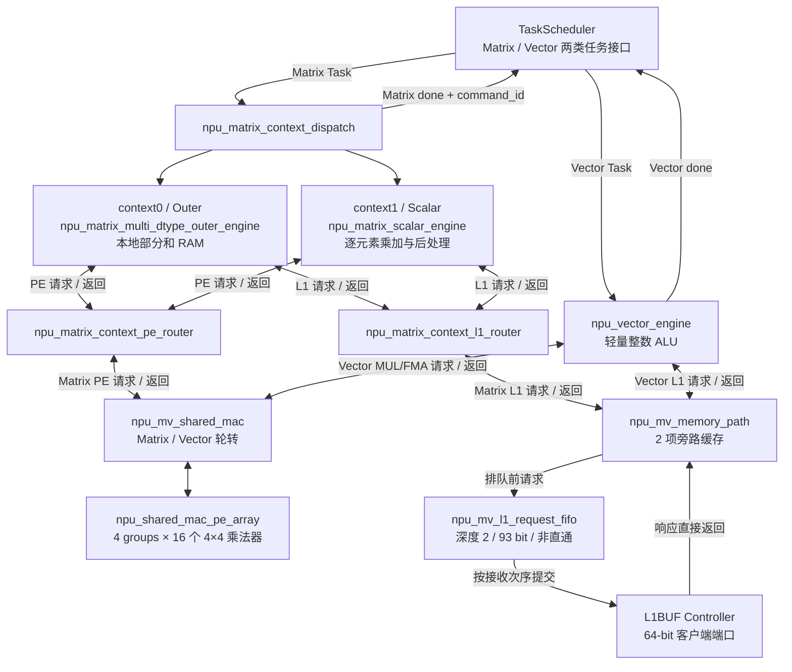
```mermaid
%%{init: {"flowchart": {"useMaxWidth": true, "nodeSpacing": 16, "rankSpacing": 20}, "themeVariables": {"fontSize": "13px"}}}%%
flowchart TB
    TS["TaskScheduler<br/>Matrix / Vector 两类任务接口"]
    DISP["npu_matrix_context_dispatch"]
    C0["context0 / Outer<br/>npu_matrix_multi_dtype_outer_engine<br/>本地部分和 RAM"]
    C1["context1 / Scalar<br/>npu_matrix_scalar_engine<br/>逐元素乘加与后处理"]
    PR["npu_matrix_context_pe_router"]
    LR["npu_matrix_context_l1_router"]
    VEC["npu_vector_engine<br/>轻量整数 ALU"]
    MVPE["npu_mv_shared_mac<br/>Matrix / Vector 轮转"]
    PE["npu_shared_mac_pe_array<br/>4 groups × 16 个 4×4 乘法器"]
    MEM["npu_mv_memory_path<br/>2 项旁路缓存"]
    RF["npu_mv_l1_request_fifo<br/>深度 2 / 93 bit / 非直通"]
    L1["L1BUF Controller<br/>64-bit 客户端端口"]

    TS -->|"Matrix Task"| DISP
    TS -->|"Vector Task"| VEC
    DISP --> C0
    DISP --> C1
    C0 <-->|"PE 请求 / 返回"| PR
    C1 <-->|"PE 请求 / 返回"| PR
    PR <-->|"Matrix PE 请求 / 返回"| MVPE
    VEC <-->|"Vector MUL/FMA 请求 / 返回"| MVPE
    MVPE <--> PE
    C0 <-->|"L1 请求 / 返回"| LR
    C1 <-->|"L1 请求 / 返回"| LR
    LR <-->|"Matrix L1 请求 / 返回"| MEM
    VEC <-->|"Vector L1 请求 / 返回"| MEM
    MEM -->|"排队前请求"| RF
    RF -->|"按接收次序提交"| L1
    L1 -->|"响应直接返回"| MEM
    DISP -->|"Matrix done + command_id"| TS
    VEC -->|"Vector done"| TS
```

| RTL 文件 | 功能 |
| --- | --- |
| `engines/npu_matrix_vector_engine.sv` | 合并执行单元顶层；连接双 Matrix context、Vector 控制器、共享 PE、内部旁路和外部 L1 端口 |
| `engines/npu_matrix_dual_context.sv` | 直接例化 Outer context 与 Scalar context，并组合任务分配、完成选择、PE 路由和 L1 路由 |
| `engines/npu_matrix_context_dispatch.sv` | 保存两个 context 的 active 状态和 `command_id`；依据操作码、`outer_task_supported_i` 和 `outer_local_psum_valid_i` 选择目标 context |
| `engines/npu_matrix_context_pe_router.sv` | 使用共享 MAC PE 的 Matrix 请求选择；owner FIFO 把返回送回原 context。直接 Outer PE 阵列不经过该模块 |
| `engines/npu_matrix_context_l1_router.sv` | 两个 Matrix context 的 L1 请求轮转选择；owner FIFO 按请求次序分发 L1 返回 |
| `engines/npu_matrix_multi_dtype_outer_engine.sv` | Outer context；执行多数据类型分块外积、部分和更新、本地部分和保存和最终 C 写回 |
| `engines/npu_matrix_scalar_engine.sv` | Scalar context；支持较广的 M/N/K、bias、旧部分和、整数重缩放、ReLU 和多种输出格式；标量乘法也经共享 PE |
| `engines/npu_matrix_psum_pipeline.sv` | 保存一项未返回 PE 请求的 tag 与末次 K 标志；返回到达时更新四组分段累加值并释放请求槽 |
| `engines/npu_matrix_segmented_adder64.sv` | 根据 INT16 或 INT8 分段宽度完成部分和相加，各段之间不传递进位 |
| `engines/npu_mv_shared_mac.sv` | 在 Matrix 与 Vector 乘法请求之间轮转，加入 owner 标签并统计授予、等待、冲突和空闲周期 |
| `engines/npu_shared_mac_pe_array.sv` | 四个多精度 group 的公共 PE 阵列，返回分段贡献值或逐元素 INT32 乘积 |
| `engines/npu_shared_mac_group.sv` | 每组使用 16 个 4×4 基础乘法器，按数据格式组合逻辑乘积和 64-bit 局部贡献 |
| `engines/npu_vector_engine.sv` | 执行 Vector 指令；ADD 等操作使用轻量整数 ALU，MUL/FMA 申请共享 PE |
| `engines/npu_mv_memory_path.sv` | 组合 L1 仲裁、Matrix 写回元数据、Vector 本地返回和旁路缓存控制 |
| `engines/npu_mv_l1_arbiter.sv` | 在 Matrix 与 Vector L1 请求之间轮转，并依据 owner FIFO 分发 L1 返回 |
| `engines/npu_mv_l1_request_fifo.sv` | 保存两项寄存请求；每项由 write、20-bit地址、64-bit写数据和 8-bit strobe组成，共 93 bit |
| `engines/npu_mv_bypass_cache.sv` | 保存 Matrix 已成功写回的 64-bit beat；单核顶层配置为 2 项，逐字节维护有效状态 |

`npu_matrix_dual_context` 把当前操作码和 Task Context 同时提供给两个控制器。Outer context 的 `task_supported_o` 表明分块外积分支是否能执行当前任务，`local_psum_valid_o` 表明是否存在由本地累加序列保存且尚未最终提交的状态。任务分配器结合这两个信号与操作码决定 Outer 是否必须接收、Outer 是否可以接收以及 Scalar 是否可以接收。

共享 PE 包含四个 group，每个 group 使用 16 个内部 4×4 基础乘法器。一个 group 可以组成 1 个 INT16×INT16 或 4 个 INT8×INT8 逻辑乘法。每个 group 的 64-bit 局部贡献按 1×64 bit 或 2×32 bit 保存；四个 group 的贡献值由 Matrix 的分段加法器继续累加。Vector 的 MUL/FMA 请求使用逐元素返回方式，PE 返回每个逻辑乘积的 signed32 结果。4×4 乘法器是组成较宽乘法的内部计算单元，不是软件可选的数据格式。

Scalar 与 Vector 通过 `npu_mv_shared_mac` 使用同一组 MAC PE，并按轮转方式选择请求。Scalar 请求握手时把来源写入 owner FIFO；返回时按 FIFO 头部选择请求方。Matrix 与 Vector 的来源位位于 PE client tag 最高位，返回阶段按该位选择 Matrix 或 Vector。Outer 的完整 16×16 普通 `GEMM` 直接驱动专用 PE 阵列，不进入该仲裁。

Outer 与 Scalar 的 L1 请求先进入 `npu_matrix_context_l1_router`，然后与 Vector 请求一起进入 `npu_mv_memory_path`。两级 L1 选择都使用 owner FIFO。`npu_mv_memory_path` 的请求输出还要进入 `npu_mv_l1_request_fifo`，再送到 L1BUF。这样，Outer 可以在更新或写回部分和时保留 active，Scalar 同时执行普通 GEMM 的地址准备、A/B 读取或 PE 请求；两者在申请同一资源时按轮转结果推进。

Scalar context 的 `batch_q`、`row_q`、`col_q`、`k_q` 逐个输出元素推进。固定常量 `MATRIX_MT=8`、`MATRIX_KT=16`、`MATRIX_NT=8` 用于检查末尾 tile 的有效尺寸，并决定 B 的 tile 存储排列，不表示 Scalar 每周期并行计算 $8\times8$ 个输出。Scalar 在 `ST_MAC_MUL` 发出一个逐元素 PE 请求，收到 signed32 乘积后在后续状态中把它符号扩展并加入 signed64 累加值。Outer 不包含这套逐元素状态机。

整数重缩放的 signed64 输入记为 \(x\)，32-bit 非负乘数记为 \(m\)。硬件把输入拆为 signed 高 32 bit和 unsigned 低 32 bit：

$$
h=\operatorname{signed}(x[63:32]),\qquad
\ell=\operatorname{unsigned}(x[31:0]).
$$

`ST_EP_MUL` 的第一个周期并行计算：

$$
H=h\times \operatorname{zero\_extend}_{33}(m),\qquad
L=\ell\times m,
$$

其中 \(H\) 是 signed32 与零扩展后 33-bit 非负乘数的乘积，保存为 signed65；\(L\) 是两个 unsigned32 数的乘积，保存为 unsigned64。第二个周期计算：

$$
U=H+\operatorname{zero\_extend}_{65}(L[63:32]),
$$

再形成完整乘积：

$$
P=\operatorname{sign\_extend}_{128}\left(\{U,L[31:0]\}\right)=x\times m.
$$

式中，`x[63:32]` 和 `x[31:0]` 分别表示 \(x\) 的高、低 32 个 bit；\(\operatorname{signed}(\cdot)\) 按二进制补码解释，\(\operatorname{unsigned}(\cdot)\) 按非负整数解释；\(\operatorname{zero\_extend}_{65}(\cdot)\) 在高位补 0 直到 65 bit；花括号表示把左侧 bit 放在高位、右侧 bit 放在低位进行拼接；\(\operatorname{sign\_extend}_{128}(\cdot)\) 复制最高符号 bit直到 128 bit。上述拆分没有改变数学结果，只改变计算在时钟周期中的安排。

因此第二个周期的主要加法宽度为 65 bit，不在一个周期内完成 signed64×unsigned32 的全部计算。随后，`ST_EP_ABS` 保存正负号、绝对值、移位量和舍入方式，`ST_EP_SHIFT` 完成可变移位，正右移再依次经过舍入决定、加一和符号恢复，最后执行 signed64 限制、zero point 相加以及目标格式检查。乘法高低两段、128-bit 移位、128-bit 加法、符号处理、signed64 限制和目标格式检查分布在相邻寄存阶段。

支持的输入组合为：

| A 数据格式 | B 数据格式 | 说明 |
| --- | --- | --- |
| INT8 | INT8 | 常规整数矩阵乘法 |
| INT16 | INT16 | 两路都按 16-bit 有符号数读取 |

A 为 INT32、编码 0，或者 A 与 B 使用不同数据格式时，任务返回 `DTYPE_UNSUPPORTED`。最终 GEMM/BMM 输出可选择 INT8、INT16 或 INT32；`GEMM_ACCUM` 和 `GEMM_ZERO` 的 C 必须是 INT32。

### 11.2 模块级信号

`npu_matrix_vector_engine` 的构建参数如下：

| 参数 | 单核值 | 作用 |
| --- | ---: | --- |
| `RESPONSE_TAG_DEPTH` | 8 | Matrix/Vector 到外部 L1 客户端端口的返回 owner FIFO 深度 |
| `BYPASS_ENTRIES` | 2 | Matrix 到 Vector 内部旁路缓存项数 |
| `PE_ISSUE_INTERVAL` | 1 | 共享 PE 两次可接收请求之间的最小周期距离 |
| L1 请求 FIFO 深度 | 2 | `npu_matrix_vector_engine` 当前例化值；该 FIFO不增加响应存储 |

| 信号 | 方向 | 位宽 | 作用 |
| --- | --- | ---: | --- |
| `clk_i` | Input | 1 | 合并执行单元工作时钟 |
| `reset_n` | Input | 1 | 低有效异步复位 |
| `matrix_task_valid_i` | Input | 1 | TaskScheduler 提交 Matrix 任务 |
| `matrix_task_ready_o` | Output | 1 | 至少一个符合任务类型的 Matrix context 可以接收任务 |
| `matrix_opcode_i` | Input | 8 | 片上展开后的 Matrix 操作码 |
| `matrix_command_id_i` | Input | 12 | 调度器提供的任务编号 |
| `matrix_desc_i` | Input | 2048 | `npu_inline_desc_decode` 生成的片上 Task Context |
| `matrix_done_valid_o` | Output | 1 | Matrix 完成信息有效 |
| `matrix_done_ready_i` | Input | 1 | TaskScheduler 可以接收 Matrix 完成信息 |
| `matrix_done_command_id_o` | Output | 12 | 完成消息所属任务的编号 |
| `matrix_done_status_o` | Output | 8 | 成功或错误状态 |
| `matrix_done_fault_addr_o` | Output | 48 | 运行阶段访问错误对应的地址；启动检查发现基地址高位非零时返回 0 |
| `matrix_done_progress_o` | Output | 64 | 已成功写回的输出元素数量 |
| `vector_task_valid_i` | Input | 1 | TaskScheduler 提交 Vector 任务 |
| `vector_task_ready_o` | Output | 1 | Vector 控制器可以接收任务 |
| `vector_opcode_i` | Input | 8 | 片上展开后的 Vector 操作码 |
| `vector_command_id_i` | Input | 12 | 调度器提供的 Vector 任务编号 |
| `vector_desc_i` | Input | 2048 | Vector Task Context |
| `vector_done_valid_o` | Output | 1 | Vector 完成信息有效 |
| `vector_done_ready_i` | Input | 1 | TaskScheduler 可以接收 Vector 完成信息 |
| `vector_done_status_o` | Output | 8 | Vector 成功或错误状态 |
| `vector_done_fault_addr_o` | Output | 48 | Vector 运行阶段的第一个错误地址 |
| `vector_done_progress_o` | Output | 64 | Vector 已成功写回的元素数量 |
| `l1_req_valid_o` | Output | 1 | 单 beat L1 请求有效 |
| `l1_req_ready_i` | Input | 1 | L1BUF 接受请求 |
| `l1_req_write_o` | Output | 1 | 1 为写，0 为读；该端口承载 Matrix 与 Vector 请求 |
| `l1_req_addr_o` | Output | 20 | 8B 对齐的 L1 字节地址 |
| `l1_req_wdata_o` | Output | 64 | Matrix 或 Vector 写数据 |
| `l1_req_wstrb_o` | Output | 8 | 逐字节写使能 |
| `l1_rsp_valid_i` | Input | 1 | L1 响应有效 |
| `l1_rsp_ready_o` | Output | 1 | owner FIFO 指定的内部接收方可以接收响应 |
| `l1_rsp_rdata_i` | Input | 64 | L1 读数据 |
| `l1_rsp_status_i` | Input | 3 | L1 访问状态 |
| `protocol_error_clear_i` | Input | 1 | 清除 context PE/L1 路由和合并存储通道的保持型协议错误 |
| `bypass_clear_i` | Input | 1 | 清除 2 项旁路缓存的全部有效状态 |
| `external_write_valid_i` | Input | 1 | DMA、CME 或 L1 外部窗口已经接受一次写请求 |
| `external_write_addr_i` | Input | 20 | 外部写请求的 L1 字节地址 |
| `external_write_byte_mask_i` | Input | 8 | 外部写请求修改的字节位置 |
| `external_write_hazard_valid_i` | Input | 1 | 顶层当前存在可能与 Vector 读冲突的外部写 |
| `external_write_hazard_addr_i` | Input | 20 | 外部写风险对应的 L1 beat 地址 |
| `bypass_hit_count_o` | Output | 32 | Vector 读由内部旁路直接返回的次数 |
| `vector_l1_count_o` | Output | 32 | Vector 请求实际送往 L1BUF 的次数 |
| `l1_outstanding_o` | Output | 4 | 单核配置下已由内部存储通道送入请求 FIFO、但响应尚未完成的请求数，范围 0～8 |
| `bypass_occupancy_o` | Output | 2 | 2 项旁路缓存中当前有效项数，范围 0～2 |
| `matrix_pe_grant_count_o` | Output | 32 | Scalar Matrix 请求被共享 PE 接收的次数；Outer 的直接阵列发射不计入该值 |
| `vector_pe_grant_count_o` | Output | 32 | Vector 请求被共享 PE 接收的次数 |
| `matrix_pe_wait_cycle_count_o` | Output | 32 | Scalar Matrix 请求等待共享 PE 的周期数；Outer 的直接阵列不等待共享 MAC PE |
| `vector_pe_wait_cycle_count_o` | Output | 32 | Vector 请求等待共享 PE 的周期数 |
| `pe_conflict_cycle_count_o` | Output | 32 | Scalar Matrix 与 Vector 同周期申请共享 PE 的周期数 |
| `pe_idle_cycle_count_o` | Output | 32 | 共享 PE 本周期没有接收新请求的周期数 |
| `protocol_error_o` | Output | 1 | context 路由、L1 路由或内部返回次序错误 |

当 `matrix_task_valid_i && matrix_task_ready_o` 为 1 时，`npu_matrix_context_dispatch` 依据本节的操作码规则选择 Outer 或 Scalar，并把操作码、编号和 Task Context 送给被选控制器。两个控制器都是直接例化的执行模块，不再经过按任务选择 Scalar/Outer 分支的 Matrix 包装层。被选控制器的 `done_valid` 保持到完成握手；任务分配器在两个完成输入之间选择一项，并把该 context 保存的 `command_id` 一同返回 TaskScheduler。一个 context 正在执行时，另一个 context 仍可接收符合自身条件的 Matrix 任务。

`reset_n=0` 时，两个 context 的 active 状态、PE/L1 owner FIFO、共享 PE valid、L1 请求 FIFO计数、内部旁路有效位和完成 valid 全部清零。本地部分和 RAM 内容不要求清零，但 Outer 的元数据和有效状态清零，因此复位前内容不能被新任务使用。复位期间 L1 请求 valid 和 done valid 均为 0。

#### 11.2.1 Matrix context 分配与完成时序

`npu_matrix_context_dispatch` 保存两组 active 位和 12-bit `command_id`。组合选择规则如下：

| 操作码与运行状态 | Outer context | Scalar context | 选择方式 |
| --- | --- | --- | --- |
| `GEMM_ZERO_LOCAL`（0x44）或 `GEMM_ACCUM_HOLD`（0x45） | 必须使用 | 不可使用 | 等待 Outer 空闲并 ready |
| `GEMM_ACCUM`（0x42），且 `outer_task_supported_i=1` 或 `outer_local_psum_valid_i=1` | 必须使用 | 不可使用 | 等待 Outer 空闲并 ready |
| `GEMM_ACCUM`（0x42），且上述两个信号均为 0 | 不可使用 | 可以使用 | 等待 Scalar 空闲并 ready |
| 普通 `GEMM`（0x40），Outer 支持且没有本地部分和状态 | 可以使用 | 可以使用 | 两者都空闲并 ready 时由 `next_task_context_q` 轮转；否则选择可以立即接收的一侧 |
| 其他普通 `GEMM`、`BMM`（0x41）或 `GEMM_ZERO`（0x43） | 不可使用 | 可以使用 | 等待 Scalar 空闲并 ready |

任务握手的同一时钟沿写 active 位与编号。Outer 接收任务后，下一个双可选普通 GEMM优先 Scalar；Scalar 接收任务后，下一个双可选普通 GEMM优先 Outer。

两个 context 的 done 同时有效时，`next_done_context_q` 选择一项；只有被选项得到 `done_ready`。完成握手时清除对应 active 位，并把下一次同时完成的优先 context 切到另一侧。输出 `matrix_done_command_id_o`、status、fault address 和 progress 均来自同一被选 context。

#### 11.2.2 Matrix context PE 路由

`npu_matrix_context_pe_router` 的请求 payload 包含本地 tag 11 bit、逐元素标志 1 bit、两个 dtype 各 2 bit、group 使能 4 bit以及两组 256-bit 操作数。对当前 RTL，Scalar 的流式 Matrix 请求通过该模块送往共享 MAC PE；若日后启用更多共享 MAC 的 Matrix context，两侧同时 valid 时按轮转状态选择。外部 PE 完成请求握手后，来源写入默认深度为 8 的 owner FIFO。PE 返回不带 context 位，路由器读取 FIFO 头部并只向对应 context 拉高返回 valid。返回有效但 FIFO 为空时置起保持型协议错误。

直接 Outer 阵列在 `npu_matrix_multi_dtype_outer_datapath` 内部接收行、列操作数并保留本地累加值，不生成经过该路由器的 PE 请求。Scalar 生成逐元素乘积请求；路由器不重新解释计算内容，只保存请求来源并保持全部 payload 字段。

#### 11.2.3 Matrix context L1 路由

`npu_matrix_context_l1_router` 接收 Outer 与 Scalar 的两组 20-bit 地址、64-bit 写数据、8-bit strobe 和读写标志，输出一组 Matrix L1 请求。请求握手时把 context 来源写入默认深度为 8 的 owner FIFO。L1 返回到达时，FIFO头部属于 Outer 就采用 Outer 的响应 ready，属于 Scalar 就采用 Scalar 的响应 ready；只有返回握手后才弹出 owner。该规则允许两个 context 保留多个已接收请求的来源次序。

#### 11.2.4 Matrix 与 Vector 公共 PE

`npu_mv_shared_mac` 在合并后的 Matrix 请求与 Vector MUL/FMA 请求之间轮转。请求标签扩展为 12 bit，其中最高位表示 Matrix 或 Vector，低 11 bit保留请求方编号。`ISSUE_INTERVAL=1` 时，只要 PE 接收端允许，连续周期都可接收请求。`npu_shared_mac_pe_array` 的四个 group 共使用 64 个内部 4×4 基础乘法器，支持 INT16×INT16 和 INT8×INT8。返回最高 owner 位选择 Matrix 或 Vector；Matrix 返回随后还要经过 context PE 路由。

共享 MAC PE 能够连续接收来自不同客户端的请求，不代表每个客户端都能连续提交。使用共享 MAC PE 的流式 Outer 分支中的 `npu_matrix_psum_pipeline` 只保存一项未返回请求：请求握手后 `request_outstanding_q=1`，`request_slot_ready_o` 保持为 0；匹配的 PE 返回到达时，模块在时钟沿更新四组 64-bit 分段部分和并清除未返回标志，下一周期才允许该分支发出下一项请求。Scalar Matrix 和 Vector 控制器也按各自状态机等待所需返回。直接 Outer 阵列在 `ST_CORE_ISSUE` 期间不经过共享 MAC PE。

#### 11.2.5 合并单元内部存储通道

`npu_mv_memory_path` 在 Matrix 与 Vector 请求之间轮转，并用默认深度为 8 的 owner FIFO分发 L1 返回。请求在该模块与后级 FIFO完成输入握手时，来源 owner 和 Matrix 写回元数据已经写入各自队列。后级 `npu_mv_l1_request_fifo` 只保存请求 payload：

$$
1\text{ bit write}+20\text{ bit addr}+64\text{ bit wdata}+8\text{ bit wstrb}=93\text{ bit}.
$$

该 FIFO深度为 2，使用寄存的 head、tail 和 count，按输入握手次序向 L1BUF 提交。`s_ready_o` 只由寄存占用数决定，`m_valid_o` 只在 FIFO已有项目时为 1，因此它不是直通结构。FIFO满时，即使同周期 `m_valid_o && m_ready_i` 弹出队首，输入侧也要到下一周期才恢复 ready。输出暂停时，队首 write、addr、wdata 和 wstrb保持不变。

L1 响应不进入请求 FIFO，而是直接送回 `npu_mv_memory_path`。L1 按请求接受次序返回响应，内部 owner FIFO据此选择 Matrix 或 Vector；Matrix L1 路由再把返回送给 Outer 或 Scalar。`npu_mv_memory_path` 还保存 Matrix 写请求的地址、数据与 strobe，只有对应 L1 写响应握手且 status 为成功时才更新内部旁路缓存。请求只是进入 FIFO、等待 L1 接受或等待写响应时，均不得提前填充旁路。单核顶层把 `BYPASS_ENTRIES` 设置为 2，因此缓存包含 2 项，每项保存一个对齐 64-bit beat 的地址标签、数据和 8-bit逐字节有效状态。

请求 FIFO的内部信号如下。`s_*` 位于内部存储通道一侧，`m_*` 位于 L1BUF 客户端一侧：

| 信号 | 方向 | 位宽 | 作用 |
| --- | --- | ---: | --- |
| `s_valid_i` | Input | 1 | 内部存储通道给出的请求有效 |
| `s_ready_o` | Output | 1 | FIFO占用数小于 2，可以在当前时钟沿保存请求 |
| `s_write_i` | Input | 1 | 1 表示写请求，0 表示读请求 |
| `s_addr_i` | Input | 20 | 8B 对齐的 L1 字节地址 |
| `s_wdata_i` | Input | 64 | 写数据；读请求中该字段不参与存储操作 |
| `s_wstrb_i` | Input | 8 | 逐字节写使能；读请求中该字段不参与存储操作 |
| `m_valid_o` | Output | 1 | 队首请求有效 |
| `m_ready_i` | Input | 1 | L1BUF 可以接受队首请求 |
| `m_write_o` | Output | 1 | 队首读写标志 |
| `m_addr_o` | Output | 20 | 队首地址 |
| `m_wdata_o` | Output | 64 | 队首写数据 |
| `m_wstrb_o` | Output | 8 | 队首逐字节写使能 |

从空 FIFO开始的一次请求时序为：

1. T0 组合阶段，内部存储通道给出 `s_valid_i=1` 及 93-bit payload，FIFO给出 `s_ready_o=1`。Matrix/Vector owner 与 Matrix 写回元数据在这次输入握手对应的时钟沿记录。
2. T0 时钟沿，请求写入 tail，计数从 0 变为 1。由于输出只读取已寄存项目，T0 组合阶段不会把该请求直接送到 `m_*`。
3. T1 组合阶段，`m_valid_o=1`，输出 head对应的完整 payload。若 `m_ready_i=0`，这些输出逐周期保持。
4. 某一时钟沿出现 `m_valid_o && m_ready_i` 后，队首从请求 FIFO弹出；后续响应不回到该 FIFO。
5. L1 响应到达时直接与 `npu_mv_memory_path` 握手。owner FIFO头部决定响应目标；成功的 Matrix 写响应还触发旁路填充，失败响应只报告状态并禁止填充。

Vector 读只有在该 beat 的八个字节全部有效时才由内部寄存响应返回，未命中时进入 L1 仲裁。存在较早已送往 L1 但尚未返回的 Vector 请求、当前 Matrix 对同一 beat 的待接收写请求，或顶层报告同地址外部写风险时，Vector 读不能采用旁路。Matrix 较新写请求、Vector 写和顶层报告的 DMA、CME、外部 L1 窗口写会使同 beat中相应字节失效。

#### 11.2.6 Matrix 乘法与本地部分和任务同时推进

TaskScheduler 可保存两项 Matrix active 记录，`npu_matrix_context_dispatch` 也可同时保持两个 context 为 active。典型安排是 Outer 执行 `GEMM_ACCUM_HOLD` 或使用本地状态的 `GEMM_ACCUM`，Scalar 执行另一个普通 `GEMM`。此时：

1. Outer 可以访问本地部分和 RAM、准备 A/B 地址、等待 L1 返回或写回最终 C；
2. Scalar 可以准备另一个 GEMM 的地址、读取 A/B 或申请共享 PE；
3. 两个 context 同周期申请 Matrix PE 时，`npu_matrix_context_pe_router` 选择一项；
4. 选出的 Matrix 请求还要与 Vector MUL/FMA 在 `npu_mv_shared_mac` 中进行选择；
5. 两个 context 同周期申请 L1 时，`npu_matrix_context_l1_router` 选择一项，之后还要与 Vector 请求在 `npu_mv_memory_path` 中进行选择；被接受请求进入深度为 2 的请求 FIFO。

因此，矩阵乘法任务和部分和累加任务可以在控制、地址准备、L1 访问、本地 RAM 访问、PE 等待和写回等阶段交错运行。完整 16×16 Outer tile 使用独立 PE 阵列；不满足直接阵列条件的请求与 Vector MUL/FMA 共用 MAC PE，每周期至多接收一项请求。Outer 本地部分和 RAM 与 Scalar 普通 GEMM 的寄存状态彼此独立，所以一个任务等待存储响应时，另一个任务仍可推进不冲突的阶段。特别是 `outer_local_psum_valid_i=1` 时，普通 GEMM不再进入 Outer，仍可由空闲 Scalar 接收；这保证本地累加序列与普通 GEMM可以同时处于活动状态。

### 11.3 从指令到片上 Task Context

主控提交 128-bit 指令后，TaskScheduler 先保存完整指令、提交时基地址快照以及任务状态。任务进入 READY 后参加逐槽扫描；扫描结束时仍满足前序任务条件、Matrix active 记录存在空项或本周期可释放一项，并且 Matrix 发射暂存为空的最早候选，才会写入发射窄快照。共享发射解码器随后组合生成 Task Context，并把结果写入 Matrix 发射暂存。Matrix 任务的数据处理过程是：

```text
指令 → TaskScheduler 任务表 → 发射窄快照 → 共享发射解码器 → Matrix 发射暂存 → Matrix
```

`GEMM`、`GEMM_ACCUM`、`GEMM_ZERO`、`GEMM_ZERO_LOCAL` 和 `GEMM_ACCUM_HOLD` 使用同一组指令字段：

| 指令中的字段 | 位宽 | Matrix 用途 |
| --- | ---: | --- |
| A 的 `LREF14` | 14 | A 基地址，实际地址为字段值左移 6 bit |
| B 的 `LREF14` | 14 | B 基地址，实际地址为字段值左移 6 bit |
| C 的 `LREF14` | 14 | C 基地址，实际地址为字段值左移 6 bit |
| bias 的 `LREF12` | 12 | GEMM 的 INT32 bias 基地址；0 表示不使用 |
| `M-1`、`N-1`、`K-1` | 各 6 | 解码后得到 1～64 的 M、N、K |
| 保留位 | 1 | 必须为 0；非零时拒绝指令 |
| `C_dtype` | 2 | C 的数据格式 |
| `requant_shift` | 5 | 非 INT32 输出的整数右移位数 |

`GEMM_ZERO_LOCAL` 采用 `GEMM_ZERO` 的字段限制，建立 Outer context 本地部分和状态但不清零 L1 中的 C。`GEMM_ACCUM_HOLD` 采用 `GEMM_ACCUM` 的字段限制，把本次结果保存在 Outer 本地部分和 RAM 中但不写最终 C。

`BMM` 使用 A、B、C 三个 `LREF14`，并直接携带 `batch-1`、`M-1`、`N-1`、`K-1`、1-bit 保留位、`C_dtype` 和 `requant_shift`。BMM 指令没有 bias 字段，保留位必须为 0。

解码器根据这些直接字段生成 Matrix 所需的派生信息：

| Task Context 内容 | 生成方法 |
| --- | --- |
| `a_base`、`b_base`、`c_base` | `LREF14 << 6` |
| `bias_base` | `LREF12 << 6` |
| `src2_base` | `GEMM_ACCUM` 或 `GEMM_ACCUM_HOLD` 时取 C 地址，其他 Matrix 指令为 0 |
| A/B/C 数据格式 | A 与 B 使用指令头数据格式，C 使用 `C_dtype`；Matrix 输入只接受 INT8 或 INT16 |
| `batch_count` | GEMM 类操作为 1；BMM 为指令中的 batch |
| `last_valid_m/n/k` | 分别由 M 对 8、N 对 8、K 对 16 的余数得到，整除时取 tile 大小 |
| `lda_bytes` | 一行 K 个 A 元素占用的字节数 |
| `ldb_bytes` | 一行 N 个 B 元素占用的字节数；tile B 的地址函数不使用该值 |
| `ldc_bytes` | 一行 N 个 C 元素占用的字节数 |
| A/B/C batch stride | 由形状、数据格式和 B tile 补齐尺寸计算 |
| A/B/C 存储格式编号 | 根据数据格式自动选择 |
| bias 数量与步长 | GEMM 启用 bias 时为 N 和 4B |
| inline integer shift | 非 INT32 输出使用乘数 1 和指令中的 `requant_shift` |

任务表不保存 2048 bit Task Context。发射暂存从写入后的下一周期置 `task_valid`，Task Context 在 Matrix 接收任务时整体锁存到 `desc_q`。状态机随后直接进入 `ST_CHECK`，不会先访问任何参数存储。

> [!note] bias 地址为 0 的特殊含义
> GEMM 中 bias 的 `LREF12=0` 表示关闭 bias。因此，需要 bias 时不能把 bias 数组放在 L1 地址 `0x00000`；应选择另一个 64B 对齐地址。

### 11.4 指令限制与启动检查

Matrix 在任何 A、B 或 C 访问之前完成以下检查：

1. 操作码必须是 `GEMM`、`BMM`、`GEMM_ACCUM`、`GEMM_ZERO`、`GEMM_ZERO_LOCAL` 或 `GEMM_ACCUM_HOLD`。
2. Task Context 的内部类型标记和字节数必须由 Matrix 解码路径产生。
3. A、B、C 以及启用的旧部分和和 bias 基地址的 `[63:20]` 必须为 0。
4. `batch_count` 必须非零；GEMM 为 1，BMM 可以大于 1。
5. M、N、K 的末尾 tile 有效尺寸必须与固定的 8、8、16 配置一致。
6. A/B 数据格式组合必须属于第 11.1 节的支持表。
7. A、B、C 的存储格式编号必须与各自数据格式一致。
8. tile 格式的 B 不允许再启用逻辑转置；当前指令解码也不会启用 A 或 B 转置。
9. 输出整数 zero point 固定为 0。
10. `GEMM_ACCUM` 必须处理 INT32 部分和并写 INT32 C；Outer 本地部分和有效时由 Outer 读取本地 RAM并完成最终提交；Outer 不支持当前任务且没有本地状态时，Scalar 读取旧 INT32 C；不能启用 bias、ReLU 或整数右移。
11. `GEMM_ZERO` 必须写 INT32，不能读取 A、B、旧 C 或 bias。
12. 非 INT32 最终输出必须启用解码器生成的整数右移配置；INT32 输出不能启用该步骤。
13. 启用 bias 时，bias 元素数量必须为 N，步长必须是大于或等于 4 的 4B 整数倍；指令解码固定生成 4B。
14. `GEMM_ZERO_LOCAL` 与 `GEMM_ACCUM_HOLD` 固定进入 Outer；`GEMM_ACCUM` 在 Outer 支持当前任务或本地状态有效时进入 Outer，否则进入 Scalar。
15. `BMM`、`GEMM_ZERO`、带 bias 的 GEMM以及不符合 Outer 条件的普通 GEMM由 Scalar 执行。Outer 支持且没有本地状态的普通 GEMM可由 Outer 或 Scalar 执行。

字段或组合不合法时返回 `BAD_DESC` 或 `BAD_SHAPE`；数据格式组合不支持时返回 `DTYPE_UNSUPPORTED`；基地址高位非零时返回 `ADDR_FAULT`。检查失败后不写 C。

> [!important] 最终元素地址在发请求前检查
> 两个分支都会在启动时检查各基地址的 `[63:20]`。外积分支还在每次请求前检查行基址和读写游标。标量分支不会把未经检查的地址截成 20 bit 后发往 L1：C、旧部分和、bias 和外部整数重缩放项使用三拍输出地址生成，A/B 使用三拍操作数地址生成；最后一拍保存完整地址和对应 valid。完整地址高于 `0xfffff`、INT16 或 INT32 元素跨越 8B beat，或外部整数重缩放项没有按 8B 对齐时，valid 为 0。各请求状态先检查 valid，组合输出的 `l1_req_valid_o` 也受同一 valid 控制，因此无效地址只形成 `ADDR_FAULT`，不会产生 L1 请求握手。模型编译器仍应检查整个数组的地址范围，以便在提交前报告模型配置错误。

### 11.5 A、B、C 与 bias 的存储排列

#### 11.5.1 格式编号

| 编号 | 名称 | 物理保存方式 |
| ---: | --- | --- |
| 0 | `ROW_MAJOR_INT8` | 行优先，每个元素 1B |
| 1 | `RESERVED` | 保留编号，收到时返回 `BAD_DESC` |
| 2 | `B_KN_TILE_INT8` | B 按 `KT=16`、`NT=8` 分块，每个元素 1B |
| 3 | `RESERVED` | 保留编号，收到时返回 `BAD_DESC` |
| 4 | `C_ROW_INT32` | C 行优先，每个元素 4B |
| 5 | `ROW_MAJOR_INT16` | 行优先，每个元素 2B |
| 6 | `B_KN_TILE_INT16` | B 按相同 tile 次序保存，每个元素 2B |

A 使用编号 0、5 分别表示 INT8、INT16。B 使用编号 2、6 分别表示 tile INT8、INT16。C 使用编号 0、5、4 分别表示 INT8、INT16、INT32。编号 1 和 3 不参与任何有效任务。

#### 11.5.2 A 的行优先地址

逻辑 A 的形状为 `[M,K]`。第 $(m,k)$ 个元素相对 A 基地址的字节偏移为：

$$
\operatorname{A\_offset}(m,k)
=
m\cdot\operatorname{lda\_bytes}
+
\begin{cases}
k,&\text{A 为 INT8},\\
2k,&\text{A 为 INT16}.
\end{cases}
$$

读取后统一执行有符号扩展，再送入乘法器。

#### 11.5.3 B 的 `16×8` tile 地址

逻辑 B 的形状为 `[K,N]`。定义：

$$
k_o=\left\lfloor\frac{k}{16}\right\rfloor,\quad
n_o=\left\lfloor\frac{n}{8}\right\rfloor,\quad
k_i=k\bmod16,\quad
n_i=n\bmod8,
$$

$$
N_T=\left\lceil\frac{N}{8}\right\rceil.
$$

元素在线性 tile 数组中的编号为：

$$
e_B=
\left(
\left(k_oN_T+n_o\right)\cdot16+k_i
\right)\cdot8+n_i.
$$

因此，INT8、INT16 的字节偏移分别为：

$$
\operatorname{B\_offset}_{\mathrm{INT8}}=e_B,
\qquad
\operatorname{B\_offset}_{\mathrm{INT16}}=2e_B.
$$

tile 中超出 K 或 N 的位置由模型编译器填 0。一个完整 `16×8` tile 含 128 个逻辑位置，因此 INT8、INT16 分别占 128B、256B。

标量分支在 `ST_CHECK` 计算一次

$$
\texttt{b\_n\_tiles\_q}=\left\lceil\frac{N}{8}\right\rceil
=\frac{N+7}{8}
$$

的整数结果。处理每个 K 项之前，`ST_ADDR_PREP` 根据当前 `batch_q`、`row_q`、`col_q`、`k_q` 和保存的 tile 数分三拍生成 A/B 地址：先保存元素偏移和 Batch 偏移，再形成相对地址，最后加入基地址并保存 `a_addr_q`、`b_addr_q` 及对应 valid。后续 `ST_A_REQ/RSP` 与 `ST_B_REQ/RSP` 只使用这些寄存值。即使 A 请求在 L1BUF 仲裁中等待，B 的 tile 地址也不会随着组合乘除运算或计数器状态变化。

> [!example] \(N=9,K=2\) 时跨两个 N tile
> 取 INT8 B，基地址为 `0x0520`，\(N_T=\lceil9/8\rceil=2\)。输出列 \(n=0\ldots7\) 位于第 0 个 N tile：\(B[0,n]\) 的相对偏移为 \(0\ldots7\)，\(B[1,n]\) 的相对偏移为 \(8\ldots15\)。输出列 \(n=8\) 位于第 1 个 N tile：\(B[0,8]\) 的 \(e_B=128\)，地址为 `0x05a0`；\(B[1,8]\) 的 \(e_B=136\)，地址为 `0x05a8`。令 A 的一行是 `[2,-3]`，令 \(B[0,n]=n+1\)、\(B[1,n]=2n-4\)，则
> $$
> C[0,n]=2(n+1)-3(2n-4)=14-4n,
> $$
> 9 个输出依次为 `[14,10,6,2,-2,-6,-10,-14,-18]`。该任务的格式或选项不满足 Outer 要求，因此进入 Scalar context，并同时检查列 8 的两个 B 地址确实来自第 1 个 N tile。

#### 11.5.4 C 的行优先地址

逻辑 C 的形状为 `[M,N]`。第 $(m,n)$ 个元素的字节偏移为：

$$
\operatorname{C\_offset}(m,n)
=
m\cdot\operatorname{ldc\_bytes}
+
\begin{cases}
n,&\text{C 为 INT8},\\
2n,&\text{C 为 INT16},\\
4n,&\text{C 为 INT32}.
\end{cases}
$$

处理每个输出元素前，`ST_START_OUTPUT` 用 `output_addr_phase_q` 分三拍生成地址。第 1 拍保存 C、旧部分和、bias、整数重缩放项的元素偏移与 Batch 偏移；第 2 拍分别形成“Batch 偏移加元素偏移”的相对地址；第 3 拍把相对地址与基地址相加，保存 `c_addr_q`、`src2_addr_q`、`bias_addr_q`、`requant_addr_q` 以及各自的 valid。随后 `ST_OUTPUT_CHECK` 先检查 C valid，并根据操作码、K、旧部分和、bias 与整数重缩放配置选择后续状态。A/B、src2、bias、整数重缩放参数和 C 的 L1 请求都在该检查之后发出，等待请求或响应时继续使用保存的地址。

每个 K 位置的 A/B 地址也分三拍生成。第 1 拍保存元素偏移和 Batch 偏移；第 2 拍形成相对地址；第 3 拍加入基地址并保存完整 A/B 地址与 valid。地址检查和 L1 请求不在同一拍组合贯通，L1 暂停时完整地址和 valid 均保持不变。

#### 11.5.5 bias 的形状和地址

GEMM 的 bias 是一个 INT32 一维数组：

$$
\mathbf b\in\mathbb Z^{N}.
$$

它在 L1 中占用 $4N$ 字节，第 $n$ 个元素的地址为：

$$
\operatorname{bias\_addr}(n)=B_{\mathrm{bias}}+4n.
$$

`b[0]` 只用于输出列 0，`b[1]` 只用于输出列 1，依此类推。对固定列 $n$，同一个 `b[n]` 会加到所有 M 个输出行，即位置 `(0,n)`、`(1,n)`、…、`(M-1,n)`。它不会加到其他列，也不是一个 `[M,N]` 数组。BMM 指令没有 bias。

#### 11.5.6 一个 `2×3` 乘 `3×2` 的地址例子

设 A、B、C 和 bias 都为 INT8 输入、INT32 输出，基地址分别为 `0x1000`、`0x2000`、`0x3000`、`0x4000`：

$$
A=
\begin{bmatrix}
1&2&3\\
4&5&6
\end{bmatrix},
\qquad
B=
\begin{bmatrix}
7&8\\
9&10\\
11&12
\end{bmatrix}.
$$

A 是连续行优先数据，`0x1000`～`0x1005` 依次保存 `1,2,3,4,5,6`。B 使用 `16×8` tile：`B[0,0]`、`B[0,1]` 位于线性编号 0、1；`B[1,0]`、`B[1,1]` 位于编号 8、9；`B[2,0]`、`B[2,1]` 位于编号 16、17。因此相对 `0x2000` 的偏移 `0,1,8,9,16,17` 分别保存 `7,8,9,10,11,12`，其余 tile 位置填 0。

C 为 INT32 行优先数据，四个元素的地址依次是 `0x3000`、`0x3004`、`0x3008`、`0x300c`。bias 的两个 INT32 元素位于 `0x4000` 和 `0x4004`。Matrix 每次向 L1BUF 发出对齐后的 8B 地址，再用地址低 3 bit 从返回 beat 中选出所需元素。

### 11.6 四条 Matrix 指令的计算公式

下面使用 $t$ 表示 Batch 编号，$m$ 表示输出行，$n$ 表示输出列，$k$ 表示公共维度位置。所有输入元素先按其整数格式读取并扩展到 signed16。乘法得到 signed32 结果并保存一拍，随后符号扩展到 signed64并加入累加寄存器。因此，下列公式与普通整数矩阵乘法一致，但 RTL 中乘法和累加位于两个相邻状态。

#### 11.6.1 GEMM

不带 bias 时：

$$
P_{m,n}
=
\sum_{k=0}^{K-1}A_{m,k}B_{k,n}.
$$

带 bias 时：

$$
S_{m,n}
=
\sum_{k=0}^{K-1}A_{m,k}B_{k,n}
+
b_n.
$$

注意 $b_n$ 的下标只有 $n$，没有 $m$。因此同一个 $b_n$ 用于同一输出列的所有行：

$$
C_{0,n},C_{1,n},\ldots,C_{M-1,n}.
$$

#### 11.6.2 BMM

BMM 对每个 Batch 独立计算：

$$
P_{t,m,n}
=
\sum_{k=0}^{K-1}A_{t,m,k}B_{t,k,n},
\qquad
t=0,\ldots,\mathrm{batch}-1.
$$

各 Batch 的 A、B、C 起点分别使用自动生成的 batch stride 前进。BMM 不读取 bias，也不会在 Batch 之间共享累加值。

#### 11.6.3 GEMM_ACCUM

`GEMM_ACCUM` 把 C 所在区域同时作为旧部分和输入与新部分和输出：

$$
C^{\mathrm{new}}_{m,n}
=
C^{\mathrm{old}}_{m,n}
+
\sum_{k=0}^{K-1}A_{m,k}B_{k,n}.
$$

旧 C 和新 C 都是 INT32。该操作不加 bias，不执行整数右移，也不改变数据格式。状态机先完成当前 $(m,n)$ 的 K 次乘加，再读取旧 `C[m,n]`，相加后写回同一位置。

#### 11.6.4 GEMM_ZERO

`GEMM_ZERO` 不读取 A 或 B。对指定的 `[M,N]` INT32 C 区域执行：

$$
C_{m,n}=0,
\qquad
0\le m<M,\quad0\le n<N.
$$

该操作常用于在多条 `GEMM_ACCUM` 之前建立全零初值。清零任务仍然逐元素写回，并且每个成功写回的元素都会使 `done_progress_o` 增加 1。

#### 11.6.5 GEMM_ZERO_LOCAL

`GEMM_ZERO_LOCAL` 不逐项清零 RAM，也不访问 L1 中的 C。它保存 M、N、C 基地址和 C 行步长等元数据，把本地状态标记为有效，并把 `has_data` 清为 0。后续计算按逻辑零值开始：

$$
P^{\mathrm{local}}_{m,n}=0.
$$

RAM 中复位前或较早任务留下的 bit可以保持不变，因为 `has_data=0` 时后续 `GEMM_ACCUM_HOLD` 不读取这些 bit。只有 M、N、C 地址和行步长与保存元数据一致的后续任务才能使用该状态。

#### 11.6.6 GEMM_ACCUM_HOLD 与最终提交

第一个 `GEMM_ACCUM_HOLD` 在 `has_data=0` 时计算：

$$
P^{\mathrm{local,new}}_{m,n}
=
\sum_{k=0}^{K-1}A_{m,k}B_{k,n}.
$$

后续 `GEMM_ACCUM_HOLD` 先读本地 INT32 值，再计算：

$$
P^{\mathrm{local,new}}_{m,n}
=
P^{\mathrm{local,old}}_{m,n}
+
\sum_{k=0}^{K-1}A_{m,k}B_{k,n}.
$$

结果限制到 INT32 后写回 Outer context 本地 RAM，不写 L1 中的 C。最后一条 `GEMM_ACCUM` 读取匹配的本地值并加入最后一段矩阵乘法结果：

$$
C_{m,n}
=
P^{\mathrm{local}}_{m,n}
+
\sum_{k=0}^{K-1}A_{m,k}B_{k,n}.
$$

最终 C 写响应全部成功后，本地有效状态和 `has_data` 清除。上述本地部分和任务由 Outer context执行，因此这份本地 RAM不会被 Scalar 修改。

### 11.7 具体数值例子

#### 11.7.1 GEMM 与 bias

继续使用第 11.5.6 节的 A 和 B，并令：

$$
b=
\begin{bmatrix}
100&-50
\end{bmatrix}.
$$

先计算矩阵乘法：

$$
AB=
\begin{bmatrix}
1\cdot7+2\cdot9+3\cdot11&
1\cdot8+2\cdot10+3\cdot12\\
4\cdot7+5\cdot9+6\cdot11&
4\cdot8+5\cdot10+6\cdot12
\end{bmatrix}
=
\begin{bmatrix}
58&64\\
139&154
\end{bmatrix}.
$$

然后按列加 bias：

$$
C=
\begin{bmatrix}
58+100&64-50\\
139+100&154-50
\end{bmatrix}
=
\begin{bmatrix}
158&14\\
239&104
\end{bmatrix}.
$$

这里 `b[0]=100` 加到 `(0,0)` 和 `(1,0)`；`b[1]=-50` 加到 `(0,1)` 和 `(1,1)`。bias 数组只有两个 INT32 元素，不需要保存四个值。

#### 11.7.2 BMM

设 batch 为 2，每组计算一个 `[1,2]` 乘 `[2,1]`：

$$
A_0=\begin{bmatrix}1&2\end{bmatrix},
\quad
B_0=\begin{bmatrix}3\\4\end{bmatrix},
$$

$$
A_1=\begin{bmatrix}-1&5\end{bmatrix},
\quad
B_1=\begin{bmatrix}2\\3\end{bmatrix}.
$$

则：

$$
C_0=1\cdot3+2\cdot4=11,
\qquad
C_1=(-1)\cdot2+5\cdot3=13.
$$

若数据格式为 INT8 且 C 为 INT32，A 的 batch stride 是 2B，C 的 batch stride 是 4B。B 仍按完整 `16×8` tile 保存，所以每组 B 占 128B；只有 tile 中对应的两个位置保存 3、4 或 2、3，其余位置填 0。

#### 11.7.3 GEMM_ACCUM

设：

$$
A=
\begin{bmatrix}
1&2\\
3&4
\end{bmatrix},
\qquad
B=
\begin{bmatrix}
5&6\\
7&8
\end{bmatrix},
$$

$$
C^{\mathrm{old}}=
\begin{bmatrix}
10&20\\
30&40
\end{bmatrix}.
$$

乘法结果为：

$$
AB=
\begin{bmatrix}
19&22\\
43&50
\end{bmatrix}.
$$

`GEMM_ACCUM` 写回：

$$
C^{\mathrm{new}}=
\begin{bmatrix}
10+19&20+22\\
30+43&40+50
\end{bmatrix}
=
\begin{bmatrix}
29&42\\
73&90
\end{bmatrix}.
$$

#### 11.7.4 GEMM_ZERO

若 C 原来是：

$$
C=
\begin{bmatrix}
29&42\\
73&90
\end{bmatrix},
$$

执行 `GEMM_ZERO` 后得到：

$$
C=
\begin{bmatrix}
0&0\\
0&0
\end{bmatrix}.
$$

该例产生四次成功写响应，因此完成时 `done_progress_o=4`。

### 11.8 整数右移、饱和与写回

#### 11.8.1 INT32 输出

INT32 输出不使用 `requant_shift`。Matrix 将 signed 64-bit 临时结果限制到 INT32 可表示区间：

$$
-2^{31}\le C_{m,n}\le2^{31}-1.
$$

指令解码生成的溢出处理方式是饱和：过大的正数写为 $2^{31}-1$，过小的负数写为 $-2^{31}$。

#### 11.8.2 INT8 和 INT16 输出

非 INT32 输出使用指令中的 `requant_shift=r`，内部乘数固定为 1，整数 zero point 固定为 0：

$$
Q_{m,n}
=
\operatorname{clip}_{D}
\left(
\operatorname{round\_shift}(S_{m,n},r)
\right),
$$

其中 $D$ 是目标 INT8 或 INT16 格式。当前解码数据通路使用最接近且中点取偶数的舍入方式。例如，$13/2=6.5$ 写为 6，$15/2=7.5$ 写为 8。舍入完成后再按目标格式的最小值和最大值进行饱和。

### 11.9 状态机

`npu_matrix_context_dispatch` 在任务握手前选择 Outer 或 Scalar；被选控制器直接接收操作码与 Task Context，并进入自身状态机。两个控制器之间没有任务分类包装状态。Outer 和 Scalar 各自保持 done，任务分配器完成返回选择和 `command_id` 补充。

多数据类型外积分支的状态及功能如下：

| 状态 | 功能 |
| --- | --- |
| `ST_IDLE` | 接收 Task Context并检查任务；`GEMM_ZERO_LOCAL` 在此保存 M、N、C 地址和行步长，清除 `has_data` 后直接完成 |
| `ST_START_TILE` | 根据剩余 M、N 和数据类型选择行并行数、列组数和当前输出块有效范围；必要时转入本地部分和读取 |
| `ST_PSUM_LOAD_REQ/ST_PSUM_LOAD_CAPTURE` | Outer 从本地部分和 RAM逐项读取当前输出块的 INT32 值，并符号扩展到 64-bit 输出累加寄存器 |
| `ST_START_K_BLOCK` | 清零当前 16 个 K 元素块的分段累加状态 |
| `ST_START_K_STEP` | 计算本次 PE 请求的有效 K 数，清理 A/B 小缓存并初始化装载游标 |
| `ST_A_REQ/ST_A_RSP` | 从 L1 读取当前行组和 K 小段的 A 元素，写入 `a_local_q` |
| `ST_B_REQ/ST_B_RSP` | 从 L1 读取当前 K 小段和列组的 B 元素，写入 `b_local_q` |
| `ST_CORE_ISSUE` | 对完整 16×16 普通 `GEMM`，把 A/B 操作数送入直接 Outer PE 阵列并在该拍执行一次 K 小段；其他 Outer 任务把操作数打包为共享 MAC PE 请求 |
| `ST_CORE_DRAIN` | 仅共享 MAC PE 分支使用；等待 `npu_matrix_psum_pipeline` 完成当前 K 小段的贡献值更新。直接阵列在 `ST_CORE_ISSUE` 后立即开始下一 K 小段或输出阶段 |
| `ST_C_REQ/ST_C_RSP` | 最终提交需要旧 INT32 C 时读取 C，并与当前输出累加值相加 |
| `ST_C_PACK` | 按输出数据类型选择结果并形成 64-bit 写数据与 strobe |
| `ST_C_WRITE_REQ/ST_C_WRITE_RSP` | 写 C 并等待 L1 成功响应，推进当前输出块内的行列游标 |
| `ST_PSUM_STORE` | `GEMM_ACCUM_HOLD` 把当前输出逐项限制到 INT32 后写入 Outer 的本地部分和 RAM |
| `ST_NEXT_TILE` | 推进输出块的行、列位置，并开始下一块或完成任务 |
| `ST_DONE` | 保持 status、fault address 和 progress，直到 TaskScheduler 接收 |

外积分支的主要状态次序为：

```text
IDLE → START_TILE
  → 可选 PSUM_LOAD_REQ / PSUM_LOAD_CAPTURE
  → START_K_BLOCK
  → (START_K_STEP → A_REQ/RSP → B_REQ/RSP → CORE_ISSUE → CORE_DRAIN) × K 小段
  → 可选 C_REQ / C_RSP
  → C_PACK → C_WRITE_REQ / C_WRITE_RSP
  → 或 PSUM_STORE
  → NEXT_TILE → 下一输出块，或 DONE
```

标量执行分支的状态及功能如下：

| 状态 | 功能 |
| --- | --- |
| `ST_IDLE` | `task_ready_o=1`；接收操作码与片上 Task Context |
| `ST_CHECK` | 检查操作、形状、数据格式、存储格式和地址 |
| `ST_START_OUTPUT` | 用 `output_addr_phase_q` 分三拍生成当前 `(batch,row,col)` 的 C、src2、bias 和整数重缩放参数完整地址：依次保存各类偏移、形成相对地址、加入基地址并保存 valid；第 1 拍同时清零 K 计数与累加值 |
| `ST_OUTPUT_CHECK` | 使用保存的 C 地址检查元素是否跨越 64-bit beat，并根据操作码、K 和后处理配置选择 A/B 读取、src2、bias、整数重缩放或后处理阶段 |
| `ST_ADDR_PREP` | 用 `operand_addr_phase_q` 分三拍生成 A/B 完整字节地址：依次保存元素与 Batch 偏移、形成相对地址、加入基地址并保存 valid |
| `ST_A_REQ` | 发出当前 `A[m,k]` 所在 8B beat 的读请求 |
| `ST_A_RSP` | 等待 A 读响应并提取、符号扩展一个元素 |
| `ST_B_REQ` | 发出当前 `B[k,n]` 所在 8B beat 的读请求 |
| `ST_B_RSP` | 等待 B 读响应并提取、符号扩展一个元素 |
| `ST_MAC_MUL` | 把当前 A/B 标量打包为逐元素请求并等待共享 PE 接收，同时保存本次请求的数据类型 |
| `ST_MAC_ACC` | 等待共享 PE 返回并检查 tag、数据类型、group 使能和结果数量；把 signed32 乘积符号扩展到 signed64并加入 `accum_q` |
| `ST_SRC2_REQ` | `GEMM_ACCUM` 读取旧 C；内部 residual 功能也共用此状态 |
| `ST_SRC2_RSP` | 接收旧 C 并加入累加值 |
| `ST_BIAS_REQ` | 读取当前输出列的一个 INT32 bias |
| `ST_BIAS_RSP` | 接收 bias 并加入累加值 |
| `ST_REQUANT_REQ` | 当前指令使用片上 shift，直接装入乘数 1 和移位量 |
| `ST_REQUANT_RSP` | 保留给通过 L1 读取整数缩放项的内部路径；当前指令不会进入 |
| `ST_EPILOGUE` | 选择零值或累加值，按配置执行 ReLU，并保存后处理输入 |
| `ST_EP_MUL` | 持续两个周期。第一个周期并行保存 signed32 与 33-bit 非负乘数的 signed65 高半乘积，以及 unsigned32×unsigned32 的 unsigned64 低半乘积；第二个周期用 65-bit 加法合并高部，拼接低 32 bit并符号扩展为 signed128 完整乘积 |
| `ST_EP_ABS` | 保存乘积正负号、signed128 绝对值、signed 8-bit shift 和舍入方式 |
| `ST_EP_SHIFT` | 执行 signed128 可变移位；正 shift 产生商、余数和中点，零 shift 保留乘积，负 shift 执行左移 |
| `ST_EP_ROUND` | 正右移时根据舍入方式、余数、中点、商最低位和正负号决定是否加一 |
| `ST_EP_INCREMENT` | 把舍入加一标志加入 128-bit 商 |
| `ST_EP_SIGN` | 按保存的正负号恢复 signed128 结果 |
| `ST_EP_NARROW` | 检查高 64 bit是否等于 bit 63 的符号扩展；超出 signed64 范围时限制到最小值或最大值 |
| `ST_EP_ZERO_POINT` | 将 signed32 `output_zero_point` 符号扩展后加入 signed64 结果 |
| `ST_EP_CLIP` | 检查目标数据格式范围；按配置报告数值错误、保留低位或执行饱和 |
| `ST_WRITE_REQ` | 发送一个 C 元素对应的单 beat 写请求 |
| `ST_WRITE_RSP` | 等待写响应，增加进度并推进 col、row、batch |
| `ST_DONE` | 保持完成状态，直到 TaskScheduler 接收 |

主要状态次序为：

```text
IDLE
  → CHECK
  → START_OUTPUT × 3
  → OUTPUT_CHECK
  → (ADDR_PREP × 3 → A_REQ → A_RSP → B_REQ → B_RSP → MAC_MUL 请求 → MAC_ACC 等待与累加) × K
  → 可选 SRC2_REQ → SRC2_RSP
  → 可选 BIAS_REQ → BIAS_RSP
  → 可选 REQUANT_REQ
  → EPILOGUE
  → 启用整数重缩放时执行 EP_MUL × 2 → EP_ABS → EP_SHIFT
  → 正右移时执行 EP_ROUND → EP_INCREMENT → EP_SIGN
  → EP_NARROW → EP_ZERO_POINT
  → EP_CLIP
  → WRITE_REQ → WRITE_RSP
  → 下一个 col / row / batch，或 DONE
```

两个控制器都不存在从片外读取任务参数的状态。任务接收后，检查直接使用已经锁存的片上 Task Context。Outer 与 Scalar 的乘法都通过 PE ready/valid 接口完成，控制器内部不再例化活动乘法器。

### 11.10 功能时序

#### 11.10.1 多数据类型分块外积任务

以 INT8 的一个输出块为例，处理次序如下：

1. `npu_matrix_context_dispatch` 根据操作码、`outer_task_supported_i` 与 `outer_local_psum_valid_i` 把适合分块外积的任务交给空闲 Outer。Outer 保存 Task Context，并进入自身的输出块处理状态。
2. `ST_START_TILE` 根据剩余 M 和 N 选择 group 在行、列方向的分配。对 INT8，一个 group 每次形成 4 个逻辑乘积并产生 2×32 bit 局部贡献；四个 group 按当前输出块的行数选择 4 行×1 列组、2 行×2 列组或 1 行×4 列组。
3. 每个 16 元素 K 块从 `ST_START_K_BLOCK` 开始。控制器按 K 小段读取 A 与 B，分别保存在 `a_local_q` 和 `b_local_q`。
4. 对完整 16×16 普通 `GEMM`，`ST_CORE_ISSUE` 将本 K 小段的 A 行数据广播到 16 行 PE，将 B 列数据广播到 16 列 PE。每个 PE 同拍完成 INT16 的一个乘积，或 INT8 的四个乘积，并更新本 PE 的局部累加寄存器。
5. 直接阵列的 INT8 局部累加寄存器为 signed24，INT16 局部累加寄存器为 signed48。为了避免 INT8 局部值超出可表示范围，当前直接阵列只接收 `K≤512` 的普通 `GEMM`；较长 K 或带局部部分和保存的任务改走共享 MAC PE 的流式分支。
6. 使用共享 MAC PE 的流式分支中，`npu_matrix_psum_pipeline` 检查返回 tag、数据类型和 group 使能，把四个 group 的贡献值加入当前分段累加值。请求槽在返回更新的时钟沿释放，下一周期才允许该分支发出下一项请求。
7. 16 元素 K 块结束时，流式分支的分段贡献值符号扩展后加入当前输出块的 signed64 `output_accum_q`。直接阵列在最后一个 K 小段后逐个读取 PE 局部累加值，并进入输出阶段。K 仍有剩余时开始下一 K 块。
8. 最后一个 K 块结束后，普通 GEMM 进入 C 打包和写回；`GEMM_ACCUM` 根据本地状态读取本地部分和或旧 C；`GEMM_ACCUM_HOLD` 把当前 INT32 部分和写入 Outer 的本地 RAM。
9. 每次 C 写响应成功后增加 `done_progress_o`。当前输出块完成后进入 `ST_NEXT_TILE`，直到处理完 M×N。

INT16、INT8 分别令每组一次处理 1、4 个逻辑乘积。局部贡献在一个 16 元素 K 块内维持 1×64 bit 或 2×32 bit 的分段形式，K 块完成后再加入 signed64 输出累加寄存器。尾部 M、N 或 K 不足完整块时，只装入有效元素，其余操作数位置写零。

#### 11.10.2 标量 GEMM 的一个输出元素

以 `C[m,n]` 为例，在没有 L1 仲裁等待时：

| 阶段 | 动作 |
| --- | --- |
| 1 | `ST_START_OUTPUT` 第 1 拍把 `accum_q` 和 `k_q` 清零，保存 C、src2、bias、整数重缩放项的各类偏移 |
| 2 | `ST_START_OUTPUT` 第 2 拍把 Batch 偏移与元素偏移相加，保存四类相对地址 |
| 3 | `ST_START_OUTPUT` 第 3 拍加入各自基地址，保存四类完整地址与 valid |
| 4 | `ST_OUTPUT_CHECK` 检查 C valid并选择后续阶段 |
| 5 | `ST_ADDR_PREP` 用三拍依次保存 `A[m,0]`、`B[0,n]` 的各类偏移，形成相对地址，再加入基地址并保存完整地址和 valid |
| 6 | `ST_A_REQ/RSP` 使用保存且有效的 A 地址读取 `A[m,0]` |
| 7 | `ST_B_REQ/RSP` 使用保存且有效的 B 地址读取 `B[0,n]` |
| 8 | `ST_MAC_MUL` 把 A/B 标量打包后向共享 PE 发出逐元素乘法请求 |
| 9 | `ST_MAC_ACC` 等待共享 PE 返回，检查 tag 和格式，并把 signed32 结果加入 signed64 `accum_q` |
| 10 | 对 `k=1` 到 `K-1` 重复三拍地址生成、A 读、B 读、共享 PE 请求和累加 |
| 11 | 若启用 bias，先检查保存的 `bias_addr_valid_q`，再读取 `b[n]` 并加入累加值 |
| 12 | 若 C 不是 INT32，装入指令给出的右移位数 |
| 13 | `ST_EPILOGUE` 选择累加值并完成 ReLU，保存 signed64 后处理输入 |
| 14a | `ST_EP_MUL` 第一个周期把 signed64 后处理输入拆成高、低 32 bit，并行保存 signed65 高半乘积与 unsigned64 低半乘积 |
| 14b | `ST_EP_MUL` 第二个周期完成 65-bit 高部加法，拼接低 32 bit并保存 signed128 完整乘积 |
| 15 | `ST_EP_ABS` 保存乘积正负号、绝对值、shift 和舍入方式 |
| 16 | `ST_EP_SHIFT` 执行可变移位；正右移保存商、余数和中点，零 shift 或负 shift 直接形成 signed128 移位结果 |
| 17 | 正右移时，`ST_EP_ROUND` 决定是否加一 |
| 18 | 正右移时，`ST_EP_INCREMENT` 把加一标志加入 128-bit 商 |
| 19 | 正右移时，`ST_EP_SIGN` 恢复结果正负号 |
| 20 | `ST_EP_NARROW` 把超出 signed64 范围的结果限制到 signed64 最小值或最大值 |
| 21 | `ST_EP_ZERO_POINT` 加入符号扩展后的输出 zero point |
| 22 | `ST_EP_CLIP` 检查目标格式范围，并按 `overflow_mode` 形成写回整数或报告错误 |
| 23 | 使用保存且有效的 C 地址写回并等待写响应 |
| 24 | `done_progress_o` 增加 1，状态机推进到下一个输出位置 |

A 和 B 不能并行读取。即使多个相邻元素位于同一个 64-bit beat，当前 Matrix 也会为每个元素重新发送一次读请求。

正 shift 表示右移，其完整后处理次序为：

```text
EPILOGUE → EP_MUL → EP_ABS → EP_SHIFT → EP_ROUND → EP_INCREMENT
  → EP_SIGN → EP_NARROW → EP_ZERO_POINT → EP_CLIP
```

shift 为 0 或负数时，`ST_EP_SHIFT` 已经得到带符号结果，因此跳过 `ST_EP_ROUND`、`ST_EP_INCREMENT` 和 `ST_EP_SIGN`，直接进入 `ST_EP_NARROW`。负 shift 的绝对值表示左移位数。无论采用哪条分支，zero point 都在 signed64 限制之后加入，目标 INT8、INT16 或 INT32 范围只在 `ST_EP_CLIP` 检查。

> [!example] 正右移的逐拍计算
> 设后处理输入为 \(-13\)，乘数为 1，shift 为 1，舍入方式为最接近且中点取偶数，输出 zero point 为 3，目标格式为 INT8。`ST_EP_MUL` 第一个周期分别保存高半乘积 \((-1)\times1=-1\) 和低半乘积 \(4294967283\times1\)，第二个周期把低半乘积的高 32 bit加到高半乘积，再拼接低 32 bit，所得 signed128 完整乘积仍为 \(-13\)。`ST_EP_ABS` 保存负号和绝对值 13；`ST_EP_SHIFT` 得到商 6、余数 1、中点 1；`ST_EP_ROUND` 发现结果位于中点且商为偶数，因此加一标志为 0；`ST_EP_INCREMENT` 仍得到 6；`ST_EP_SIGN` 恢复为 \(-6\)；`ST_EP_NARROW` 得到 signed64 的 \(-6\)；`ST_EP_ZERO_POINT` 得到 \(-3\)；`ST_EP_CLIP` 确认 \(-3\) 可由 INT8 表示，最终写回 `0xfd`。

#### 11.10.3 GEMM_ACCUM

`GEMM_ACCUM` 完成 K 次乘加后增加一次旧 C 读取：

```text
K 次 A/B 读取和 MAC → 读取旧 C[m,n] → 相加 → 写回新 C[m,n]
```

写响应返回之前，状态机不会开始下一个输出元素。旧 C 与新 C 使用同一 L1 地址，但读和写由状态先后分开。

Outer 中存在已经由 `GEMM_ZERO_LOCAL` 建立且与当前 M、N、C 地址、C 行步长一致的本地状态时，`GEMM_ACCUM` 固定进入 Outer，不读取旧 L1 C，而是在 `ST_START_TILE` 后逐项读取本地部分和 RAM。当前 K 段完成后把新贡献加入这些值，再由 C 写回状态提交最终结果。完成后本地有效状态清除。Outer 不支持当前 `GEMM_ACCUM` 且没有本地状态时，任务进入 Scalar，由 Scalar 读取旧 INT32 C。

`GEMM_ACCUM_HOLD` 的处理次序为：

```text
可选读取本地部分和 → A/B 装载 → 共享 MAC PE → 部分和更新
  → ST_PSUM_STORE 写本地 RAM → 下一个输出块 → done
```

它不把中间 C 写到 L1BUF。第一次 HOLD 在 `has_data=0` 时把本地旧值视为 0，后续 HOLD 先读取 RAM再累加。Outer 执行该序列时，Scalar 可以接收普通 GEMM；两个 context 通过 PE 和 L1 路由轮转使用公共资源。

#### 11.10.4 GEMM_ZERO

`GEMM_ZERO` 在 `ST_START_OUTPUT` 的三拍中保存各类偏移、形成相对地址，再加入 C 基地址并保存完整输出地址与 valid。经过 `ST_OUTPUT_CHECK` 完成 C 元素检查后进入 `ST_EPILOGUE`，保存固定值 0，再由 `ST_EP_CLIP` 生成 INT32 写回值。它不进入 A、B、旧 C、bias、重缩放乘法或移位状态。

#### 11.10.5 BMM

BMM 先完成当前 Batch 的全部 M×N 个输出，再把 `batch_q` 加 1，并使用 A/B/C batch stride 计算下一组起点。最后一个 Batch 的最后一个写响应返回后进入 `ST_DONE`。

### 11.11 访问次数、完成条件与错误处理

标量分支的一个普通 GEMM 输出元素需要：

$$
N_{\mathrm{read}}
=
2K
+
\begin{cases}
1,&\text{启用 bias},\\
0,&\text{未启用 bias},
\end{cases}
$$

以及一次 C 写请求。`GEMM_ACCUM` 每个输出再增加一次旧 C 读取。非 INT32 输出的右移参数由 Task Context 直接提供，不增加 L1 读取。

多数据类型外积分支按当前行组、列组和 K 小段装载 A/B。A 小缓存最多保存 4×4 个 signed16 位置，B 小缓存最多保存 4×16 个 signed16 位置；尾部不足的元素写零。四个 PE group 在当前 K 小段内共用已经装入的 A 行值和 B 列值，因此同一操作数可参与多个输出贡献。B 采用 `KT=16、NT=8` tile 格式时，具体读 beat 数由 tile 中的物理位置、数据类型和尾部有效数量决定。

Matrix 只在以下条件都满足后报告成功：

1. 最后一个 Batch、最后一行、最后一列已经完成写请求；
2. L1BUF 已返回该写请求的成功响应；
3. `done_progress_o` 已等于成功写回的输出元素总数。

任一 L1 响应非零时，Matrix 将其转换成任务错误并进入 `ST_DONE`。元素跨越单个 8B beat 或输出按配置处理失败时，`done_fault_addr_o` 保存对应地址；启动检查发现基地址高位非零时，该信号为 0。已经完成的输出不会回退，`done_progress_o` 保留错误发生前的成功写回数量。

> [!important] 当前吞吐特征
> Matrix 子系统保存两个任务 context。完整 16×16 Outer tile 使用独立 PE 阵列，Scalar 与 Vector 共用可配置 MAC PE；三个任务都使用一组 64-bit L1 客户端端口。一个 context 更新本地部分和或写 C 时，另一个 context 可以执行地址准备、A/B 读取或申请计算资源；同一任务内，下一 K 小段的装载与上一次 MAC 返回的部分和更新也可以同时发生。共享 MAC PE 和 L1 每次仍只接收一个请求，因此性能估算必须结合两级轮转、PE 等待、L1 等待和实际数据类型计算。

---

## 12. Matrix-Vector Engine：Integer Vector 子系统

### 12.1 定位与片上任务展开

Integer Vector 子系统执行有符号整数逐元素运算。当前 RTL 包含连续 MUL 快速分支和通用标量分支：符合连续访问条件的 INT8 或 INT16 MUL 每次各读取一个 64-bit src0 beat和一个 64-bit src1 beat，并向 Matrix-Vector 公共 PE 提交整拍乘法请求；广播、mask、FMA、非乘法操作、未对齐地址和其他步长组合继续逐元素执行。通用分支中的 MUL 和 FMA 也向公共 PE 提交单元素请求，ADD、SUB、MAX、MIN、CMP、SELECT、CLAMP 和 ReLU 则由 Vector 控制器内的轻量整数 ALU 计算。

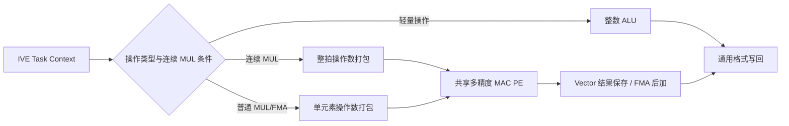
```mermaid
flowchart LR
    TASK["IVE Task Context"] --> CHECK{"操作类型与连续 MUL 条件"}
    CHECK -->|"连续 MUL"| FAST["整拍操作数打包"]
    CHECK -->|"普通 MUL/FMA"| ELEM["单元素操作数打包"]
    CHECK -->|"轻量操作"| ALU["整数 ALU"]
    FAST --> PE["共享多精度 MAC PE"]
    ELEM --> PE
    PE --> POST["Vector 结果保存 / FMA 后加"]
    ALU --> WB["通用格式写回"]
    POST --> WB
```

通用共享 MAC PE 的每个 group 包含 16 个 4×4 基础乘法器；Vector 逐元素模式按输入格式选择 group 数和返回元素数：

| 输入格式 | 一次请求的逻辑结果 | 一个 64-bit 输入 beat需要的请求组数 | 整个输入 beat的元素数 |
| --- | ---: | ---: | ---: |
| INT16 | 1 个 16×16 | 4 | 4 |
| INT8 | 4 个 8×8 | 2 | 8 |

`npu_shared_mac_pe_array` 以三段寄存标签跟随 PE 结果。每个 `npu_shared_mac_group` 先保存 16 个内部 4×4 基础乘积，再保存重组后的逻辑乘积，最后形成逐元素 signed32 结果或 Matrix 使用的分段贡献值。Vector 请求设置 `elementwise=1`，返回 `element_count` 和最多 4 个有效 signed32 结果。INT8 与 INT16 共用这些基础乘法器，不为 Vector 另放一套乘法阵列。

快速分支的使用条件如下：

- 操作为 `VECTOR_MUL`，src0 与 src1 的格式相同且为 INT8 或 INT16，目的格式为 INT32；
- 不启用 mask、广播、立即数输入或其他 vector flag；
- src0、src1、dst 基地址均按 8B 对齐，输入元素步长分别为 0、1 或 2B，目的元素步长为 4B；
- 多行任务的输入行距等于该行实际字节数，目的行距等于 `length×4`，并且三组行距均满足 8B 请求要求。

快速 MUL 不在 IVE 内计算 src0、src1 与 dst 的完整存储区域是否相交。上层编译器必须根据 rows、length、各行步长和元素字节数计算三组占用区域，并把 src0、src1、dst 安排为两两不相交的 L1 区域；不满足该条件时不得生成快速 MUL 可接受的 Task Context。特别是 dst 为 INT32，写入字节数大于 INT8 输入，把 dst 放在任一输入起点附近可能在后续输入 beat读取前覆盖源数据。

> [!example] 为什么快速 MUL 的目的区要避开输入区
> 一行 16 个 INT8 输入只占 16B，而 16 个 INT32 输出占 64B。若 src0 从 `0x100` 开始，dst 也从 `0x100` 开始，首个结果 beat会改写 src0 的前 8B，后续结果还会覆盖 src0 的第二个输入 beat。当前快速分支不会为此返回 `ADDR_OVERLAP`，所以编译器必须在提交前改用另一段 L1 空间。

每对输入 beat只读取一次。INT16 和 INT8 在已保存的 beat上依次切换 4 组或 2 组；结果缓存随后每次取相邻两个 INT32 元素组成一个 64-bit 写请求。地址使用行基址和当前 beat游标递增，L1 请求不经过 `row×stride+col×stride` 的当拍宽乘法。末拍不足完整输入 beat时只写 `valid_length` 指定的有效结果。

外部 Generic Core 是 SoC 主控 CPU，不属于 NPU RTL，也不直接连接 IVE。它通过 NPU 的 64 bit AXI Slave 提交指令；Command Front End 把完整指令交给 TaskScheduler。TaskScheduler 任务表保存指令、提交时基地址快照、事件和状态字段，不为每个等待任务保存 2048 bit Task Context。IVE READY 任务在逐槽扫描中获胜并通过结束时复查后，TS 保存发射窄快照，共享发射解码器随后产生展开数据并写入 IVE 发射暂存；下一周期 IVE 接收到 `opcode_i`、`command_id_i` 和 `desc_i[2047:0]`。


```mermaid
flowchart LR
    GC["Generic Core<br/>外部主控 CPU"]
    AXIS["NPU 64 bit AXI Slave"]
    CFE["Command Front End"]
    TS["TaskScheduler<br/>指令 / 基地址快照 / 状态"]
    SNAP["发射窄快照"]
    DEC["共享发射解码器<br/>指令字段展开"]
    STG["IVE 发射暂存<br/>opcode / id / Task Context"]
    IVE["Matrix-Vector Engine<br/>Vector 控制器 / 共享 PE"]
    MVP["MV Memory Path"]
    RF["L1 Request FIFO<br/>2 项 / 非直通"]
    L1C["L1BUF Controller"]
    L1["L1BUF SRAM"]

    GC -->|"两个 64 bit beat"| AXIS
    AXIS --> CFE
    CFE --> TS
    TS -->|"逐槽扫描获胜任务"| SNAP
    SNAP -->|"稳定指令 + 基地址快照"| DEC
    DEC -->|"时钟沿装入"| STG
    STG -->|"下一周期 task ready/valid"| IVE
    IVE -->|"64-bit 请求"| MVP
    MVP -->|"93-bit 请求"| RF
    RF -->|"64-bit L1 请求"| L1C
    L1C -->|"64-bit 响应，绕过请求 FIFO"| MVP
    MVP -->|"返回原请求方"| IVE
    L1C <--> L1
    IVE -->|"status / fault / progress"| TS
```

IVE 不读取外部任务参数，不经过 MIF 取得执行字段，也没有任务开始阶段的参数装载状态。地址、shape、广播方式、立即数和内部控制值都由共享发射解码器产生，并在发射暂存与 IVE 完成 ready/valid 握手后由 IVE 锁存。

### 12.2 模块级信号

`npu_vector_engine` 的当前端口如下。所有 ready/valid payload 在 `valid=1` 且 `ready=0` 时保持不变。

| 信号 | 方向 | 位宽 | 作用 |
| --- | --- | ---: | --- |
| `clk_i` | Input | 1 | Core 时钟 |
| `reset_n` | Input | 1 | 低有效异步复位 |
| `task_valid_i` | Input | 1 | TaskScheduler 给出任务 |
| `task_ready_o` | Output | 1 | 仅 `ST_IDLE` 为 1 |
| `opcode_i` | Input | 8 | 展开后的内部操作码 `0x60～0x69` |
| `command_id_i` | Input | 12 | 内部任务编号；任务关联由 TaskScheduler 保存 |
| `desc_i` | Input | 2048 | IVE 发射暂存提供的当前任务 Task Context |
| `done_valid_o` | Output | 1 | 仅 `ST_DONE` 为 1，并保持到握手 |
| `done_ready_i` | Input | 1 | TaskScheduler 接收完成状态 |
| `done_status_o` | Output | 8 | `SUCCESS` 或首个失败状态 |
| `done_fault_addr_o` | Output | 48 | 发生字段、地址、L1 或数值错误时的相关地址 |
| `done_progress_o` | Output | 64 | 已收到成功写响应的目的元素数 |
| `l1_req_valid_o` | Output | 1 | L1 请求有效 |
| `l1_req_ready_i` | Input | 1 | L1 接收请求 |
| `l1_req_write_o` | Output | 1 | 0 为读，1 为写 |
| `l1_req_addr_o` | Output | 20 | 向下对齐到 8B 的 L1 字节地址 |
| `l1_req_wdata_o` | Output | 64 | 写数据 |
| `l1_req_wstrb_o` | Output | 8 | 每字节写使能 |
| `l1_rsp_valid_i` | Input | 1 | L1 返回有效 |
| `l1_rsp_ready_o` | Output | 1 | IVE 正在等待返回 |
| `l1_rsp_rdata_i` | Input | 64 | 读数据 |
| `l1_rsp_status_i` | Input | 3 | L1 返回状态 |
| `pe_req_valid_o` / `pe_req_ready_i` | Output / Input | 1 | MUL/FMA 乘法请求握手 |
| `pe_req_local_tag_o` | Output | 11 | Vector 控制器内部请求编号 |
| `pe_req_elementwise_o` | Output | 1 | Vector 固定为 1，要求逐元素结果 |
| `pe_req_dtype_a_o` / `pe_req_dtype_b_o` | Output | 各 2 | 两个乘数的数据类型 |
| `pe_req_group_enable_o` | Output | 4 | 本次使用的 PE group |
| `pe_req_operand_a_o` / `pe_req_operand_b_o` | Output | 各 256 | 四组 64-bit 打包操作数 |
| `pe_rsp_valid_i` | Input | 1 | 共享 PE 返回有效 |
| `pe_rsp_local_tag_i` | Input | 11 | 返回的 Vector 内部请求编号 |
| `pe_rsp_element_count_i` | Input | 5 | 返回的 signed32 结果数量 |
| `pe_rsp_elements_i` | Input | 512 | 最多 16 个 signed32 逻辑乘积 |

Vector 控制器只有这一组内部 L1 请求和响应信号。src0、src1、src2、mask、目的旧值和目的写入在时间上共用它，不存在四组同时工作的源读端口。该内部端口先进入 `npu_mv_memory_path`。未命中旁路的请求与 Matrix 请求完成选择后，进入深度为 2 的 `npu_mv_l1_request_fifo`，随后提交给 L1BUF。L1 响应不经过请求 FIFO，而是直接返回 `npu_mv_memory_path`，再送给 Vector 或 Matrix 请求方。Matrix 写回后的完整 64-bit beat 命中内部旁路时，Vector 读响应可由合并单元内部产生。

`reset_n=0` 时，IVE 把 `state_q` 置为 `ST_IDLE`，并清除 status、fault address、progress、快速分支活动标志和 PE 未完成记录；公共 PE 清除三级 valid。Task Context、地址、循环计数器、输入 beat、乘积数组、结果及写回数据属于 payload 寄存器，不使用复位清零；新任务在进入相应状态前覆盖将要使用的字段。状态回到 `ST_IDLE` 后，L1 请求 valid、PE 请求 valid 和 done valid 均为 0，因此复位后的无效 payload 不会被使用。

### 12.3 指令展开得到的 IVE Task Context

软件只填写第 6.7.4 节中的指令位段。IVE READY 任务在逐槽扫描中获胜并通过结束时复查后，TaskScheduler 保存发射窄快照；共享发射解码器根据该任务保存的指令、提交时基地址快照、操作码和公共 dtype 组合出下表字段，并在解码周期末写入 IVE 发射暂存。这些字段用于说明模块接口和波形，不是任务表字段，也不是软件表。

| Byte Offset | 内部字段 | 位宽 | 当前指令展开值或作用 |
| ---: | --- | ---: | --- |
| `0x00` | 结构编号 | 8 | `1` |
| `0x01` | 执行单元类型 | 8 | `3`，表示 IVE |
| `0x02` | 有效字节数 | 16 | `192` |
| `0x08` | `src0_base` | 64 | `src0 LREF16 << 4` |
| `0x10` | `src1_base` | 64 | `src1 LREF16 << 4`；CLAMP、RELU 不使用 |
| `0x18` | `src2_base` | 64 | FMA 的 INT32 输入；其他普通操作不使用 |
| `0x20` | `dst_base` | 64 | `dst LREF16 << 4` |
| `0x28` | `mask_base` | 64 | SELECT 时由指令中的 `src2` 产生 |
| `0x38` | `numeric_cfg` | 32 | `[1:0] src0 dtype`、`[3:2] src1 dtype`、`[5:4] src2 dtype`、`[7:6] dst dtype` |
| `0x40` | `rows` | 32 | 指令中的 `rows_minus1 + 1`，范围 1～32 |
| `0x44` | `length` | 32 | 指令中的 `length_minus1 + 1`，范围 1～32 |
| `0x48` | `valid_length` | 32 | 当前固定等于 `length` |
| `0x4C` | `vector_flags` | 32 | SELECT 时 bit 0 为 1；其他当前指令写 0 |
| `0x50/0x54` | `src0_elem_stride/row_stride` | 各 32 | 连续元素大小与按广播方式得到的行字节数 |
| `0x58/0x5C` | `src1_elem_stride/row_stride` | 各 32 | 同上 |
| `0x60/0x64` | `src2_elem_stride/row_stride` | 各 32 | 同上 |
| `0x68/0x6C` | `dst_elem_stride/row_stride` | 各 32 | 连续输出元素大小与一行占用字节数 |
| `0x70` | `scalar0` | 32 | CLAMP 的 signed16 下限经符号扩展得到 |
| `0x74` | `scalar1` | 32 | CLAMP 的 signed16 上限经符号扩展得到 |
| `0x78` | `broadcast_mode` | 8 | `[1:0] src0`、`[3:2] src1`、`[5:4] src2` |
| `0x79` | `compare_mode` | 8 | CMP 的 EQ、NE、LT、LE、GT、GE 编码 |
| `0x7A` | `overflow_mode` | 8 | 当前指令展开固定为 0，即饱和 |
| `0x7B` | `mask_mode` | 8 | SELECT 为 1，其他当前指令为 0 |
| `0x7C～0x7F` | 保留字节 | 各 8 | 当前指令展开均为 0；非零时返回 `BAD_DESC` |
| `0x90` | `mask_elem_stride` | 32 | SELECT 固定为 1B |
| `0x94` | `mask_row_stride` | 32 | SELECT 固定为 `length` |

`vector_flags` 的 RTL 定义还包含 bit 1 `mask_false_keep_dst`、bit 2 `src1_from_scalar0` 和 bit 3 `src2_from_scalar1`。当前内联指令不产生这三种设置；它们只用于直接驱动引擎的模块级验证。正常指令路径中，SELECT 使用 bit 0，其余操作四个 bit 都为 0。

当前指令展开后的数据格式组合如下。

| 指令 | src0 | src1 | src2 或 mask | dst |
| --- | --- | --- | --- | --- |
| ADD、SUB、MAX、MIN | 公共 dtype | 与 src0 相同 | 不使用 | 与 src0 相同 |
| MUL | 公共 dtype，不能为 INT32 | 与 src0 相同 | 不使用 | INT32 |
| FMA | 公共 dtype，不能为 INT32 | 与 src0 相同 | INT32 | INT32 |
| CMP | 公共 dtype | 与 src0 相同 | 指令中保存比较类型 | INT8，元素只能为 0 或 1 |
| SELECT | 公共 dtype | 与 src0 相同 | 同 shape INT8 mask | 与 src0 相同 |
| CLAMP | 公共 dtype | signed16 下限立即数 | signed16 上限立即数 | 与 src0 相同 |
| RELU | 公共 dtype | 不使用 | 不使用 | 与 src0 相同 |

公共 dtype 可以是 INT8、INT16 或 INT32。MUL 和 FMA 只接受 INT8 或 INT16 乘数；乘积和 FMA 结果写 INT32。编码 0 作为公共 dtype 时返回 `DTYPE_UNSUPPORTED`。

### 12.4 Shape、整数格式与广播

当前指令不能编码零尺寸，也不编码尾行缩短，因此有效元素数固定为

$$
E=R\,N,
$$

其中 $R=\texttt{rows}$，$N=\texttt{length}$。Task Context 内部保留 `valid_length`，引擎直接验证时可令最后一行只有 `valid_length` 个元素；正常指令展开令它等于 $N$。

IVE 从 64 bit L1 返回中按 little-endian 次序取元素，并把全部输入符号扩展为 signed 64 bit。

| dtype | 编码 | 数值范围 | 连续存储 |
| --- | ---: | ---: | --- |
| 保留 | 0 | — | 不能用于有效输入或输出 |
| INT8 | 1 | `[-128,127]` | 1B/元素 |
| INT32 | 2 | `[-2147483648,2147483647]` | 4B/元素 |
| INT16 | 3 | `[-32768,32767]` | 2B/元素 |

INT16 或 INT32 元素不得跨越一个 64 bit beat。元素首字节在 beat 内的位置分别不能大于 6 或 4；否则返回 `ADDR_FAULT`。当前指令给出的 LREF16 基地址按 16B 对齐，连续步长也与元素大小一致，因而正常连续张量满足该条件。

对任一输入 $x$，设基地址为 $a_0$，输出坐标为 $(r,c)$，元素步长为 $s_e$，行步长为 $s_r$，则四种广播方式的字节地址为

$$
\begin{aligned}
B=0:\quad &a(r,c)=a_0+r\,s_r+c\,s_e,\\
B=1:\quad &a(r,c)=a_0,\\
B=2:\quad &a(r,c)=a_0+r\,s_r,\\
B=3:\quad &a(r,c)=a_0+c\,s_e.
\end{aligned}
$$

其中 $B=0,1,2,3$ 分别表示输入 shape 为 `[R][N]`、`[1][1]`、`[R][1]`、`[1][N]`。目的张量不使用广播。

### 12.5 运算、CMP mask 与 SELECT

设当前位置符号扩展后的输入为 $a$、$b$、$c$，CLAMP 下限和上限为 $l$、$h$，输出写入前的 signed 64 bit 数学结果为 $t$。IVE 计算

$$
\begin{aligned}
\operatorname{ADD}:&\quad t=a+b,\\
\operatorname{SUB}:&\quad t=a-b,\\
\operatorname{MUL}:&\quad t=a\,b,\\
\operatorname{FMA}:&\quad t=a\,b+c,\\
\operatorname{MAX}:&\quad t=\max(a,b),\\
\operatorname{MIN}:&\quad t=\min(a,b),\\
\operatorname{CLAMP}:&\quad t=\min(\max(a,l),h),\\
\operatorname{RELU}:&\quad t=\max(a,0).
\end{aligned}
$$

这里的 FMA 是整数乘法后加法，不是 FP32 fused multiply-add。FMA 与未进入快速分支的 MUL 在 `ST_MUL` 向共享 PE 发出一个逐元素请求；FMA 的第三输入为 signed32。RTL 在 `ST_MUL_POST` 等待返回，检查 tag、数据类型、group 使能、错误标志和结果数量，再把 signed32 乘积扩展到 signed64、执行可选加法并处理输出范围。连续 MUL 快速分支不改变数学公式：共享 PE 把每个有符号整数拆成 4-bit 基 16 数位，用基础乘积和位移重新得到相同的 signed32 结果。专项测试必须逐项比较快速分支与直接有符号乘法，并覆盖 INT8、INT16 的最小值、最大值、负数和零。CLAMP 要求 $l\le h$。

CMP 根据 `compare_mode` 计算

$$
m=
\begin{cases}
1,&a\ \mathcal{C}\ b,\\
0,&\text{其他情况},
\end{cases}
$$

其中 $\mathcal{C}$ 依次可选 `==`、`!=`、`<`、`<=`、`>`、`>=`。$m$ 作为 INT8 字节写到目的张量，它可以直接供后续 SELECT 使用。

SELECT 从单独的 INT8 mask 地址读取字节 $m$，并执行

$$
y=
\begin{cases}
b,&m\ne0,\\
a,&m=0.
\end{cases}
$$

因此，mask 非零时选择 src1，mask 为 0 时选择 src0。指令中的 `src2` 在片上展开为 `mask_base`，不作为第三个算术输入。

> [!example] CMP 产生 mask，再由 SELECT 使用
> 令 src0 为 `[1,2,-3,4]`，src1 为 `[5,-2,7,8]`。CMP 选择 LT 后写出 `[1,0,1,1]`，因为 `1<5`、`-3<7` 和 `4<8` 成立。若另一个 SELECT mask 为 `[0,1,0,1]`，SELECT 输出 `[1,-2,-3,8]`：第 0、2 项取 src0，第 1、3 项取 src1。该结果与 `tb_npu_vector_engine` 的选择方向一致。

> [!example] 整数 FMA
> 令 $a=[1,2,-3,4]$，$b=[5,-2,7,8]$，$c=[10,20,30,40]$，则 $a\,b+c=[15,16,9,72]$，输出为 INT32。

引擎计算 $t$ 后与目的 dtype 的最小值和最大值比较。内部 `overflow_mode` 支持 0 饱和、1 返回 `NUMERIC_EXCEPTION`、2 保留目的位宽低位后按二进制补码解释；当前软件指令固定选择 0。普通 IVE 指令不携带 scale 或 zero point，IVE 也不比较 FP32 scale。两个张量代表的实数单位不同时，应使用 CME 的 `COMPLEX_ADD_RESCALE`。

### 12.6 控制状态与功能时序

IVE 的主控制状态与 RTL 枚举一致：

| 状态 | 动作 |
| --- | --- |
| `ST_IDLE` | `task_ready_o=1`；与 IVE 发射暂存握手后锁存操作码和完整 Task Context |
| `ST_CHECK` | 检查结构编号、执行单元类型、有效字节数、dtype、shape、mask、地址和操作组合；初始化行列游标以及快速分支的行基址、当前行元素数和末行标志 |
| `ST_ADDR_PREP` | 通用分支保存当前元素的五组行偏移 |
| `ST_ADDR_ROW_ADD` | 分别计算 src0、src1、src2、mask、dst 的基址加行偏移，同时保存五组列偏移 |
| `ST_ADDR_FINAL` | 在前一拍结果上加入列偏移，形成五组完整字节地址 |
| `ST_ADDR_CHECK` | 检查五组地址是否位于 20-bit L1 地址范围，并检查各数据元素是否跨越 8B beat；检查结果写入专用 valid 寄存器 |
| `ST_MASK_REQ/RSP` | SELECT 读取一个 INT8 mask 字节 |
| `ST_SRC0_REQ/RSP` | 读取并符号扩展 src0 |
| `ST_SRC1_REQ/RSP` | 需要时读取并符号扩展 src1 |
| `ST_SRC2_REQ/RSP` | FMA 读取 INT32 src2 |
| `ST_KEEP_REQ/RSP` | 直接引擎测试中的 mask-false 保持模式读取旧目的值 |
| `ST_EXEC` | 执行 ADD、SUB、MAX、MIN、CMP、SELECT、CLAMP 或 RELU，并完成范围处理 |
| `ST_MUL` | 把一个元素的两个乘数打包，向共享 PE 发出请求，并保存 tag、数据类型、group 使能和预期结果数 |
| `ST_MUL_POST` | 等待共享 PE 返回并检查保存的请求信息；把 signed32 乘积扩展到 signed64，执行可选 FMA 加法、范围处理和写回状态选择 |
| `ST_FAST_ADDR_CHECK` | 快速分支检查当前 src0、src1 地址是否位于 20-bit L1 地址范围且按 8B 对齐 |
| `ST_FAST_SRC0_REQ/RSP` | 快速分支读取并保存一个 64-bit src0 beat |
| `ST_FAST_SRC1_REQ/RSP` | 快速分支读取并保存一个 64-bit src1 beat |
| `ST_FAST_MUL_REQ` | 向共享 PE 提交当前输入格式、group 使能和整拍操作数 |
| `ST_FAST_MUL_WAIT` | 等待共享 PE 返回，检查 tag 和结果数，按 INT16 或 INT8 的组内位置保存 signed32 结果 |
| `ST_FAST_WRITE_PREP` | 保存当前输出对的 48-bit地址、64-bit写数据和 8-bit strobe；末尾剩一个结果时高 32 bit写 0，并把 strobe 设为 `8'h0f` |
| `ST_FAST_WRITE_CHECK` | 检查 `ST_FAST_WRITE_PREP` 保存的目的地址是否位于 20-bit L1 地址范围且按 8B 对齐 |
| `ST_FAST_WRITE_REQ` | 只用快速写寄存器和地址检查寄存器发出请求；请求握手时保存本次进度增量和写响应后的动作 |
| `ST_FAST_WRITE_RSP` | 等待写响应；成功时使用保存的进度和动作进入下一输出对、下一输入 beat、下一行或完成状态 |
| `ST_WRITE_REQ/RSP` | 发出带 `WSTRB` 的目的写，并等待写完成状态 |
| `ST_DONE` | 保持完成 payload，直到 `done_ready_i=1` |

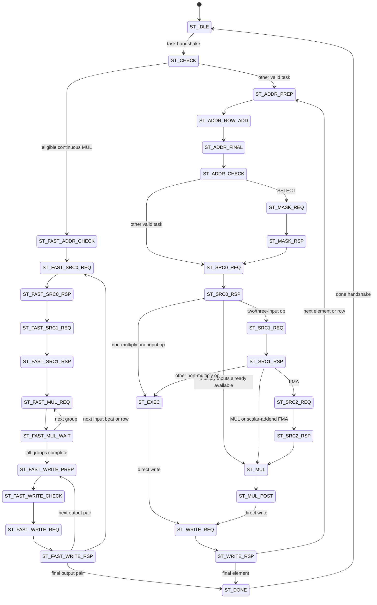
```mermaid
stateDiagram-v2
    [*] --> ST_IDLE
    ST_IDLE --> ST_CHECK: task handshake
    ST_CHECK --> ST_FAST_ADDR_CHECK: eligible continuous MUL
    ST_CHECK --> ST_ADDR_PREP: other valid task
    ST_ADDR_PREP --> ST_ADDR_ROW_ADD
    ST_ADDR_ROW_ADD --> ST_ADDR_FINAL
    ST_ADDR_FINAL --> ST_ADDR_CHECK
    ST_ADDR_CHECK --> ST_MASK_REQ: SELECT
    ST_ADDR_CHECK --> ST_SRC0_REQ: other valid task
    ST_FAST_ADDR_CHECK --> ST_FAST_SRC0_REQ
    ST_FAST_SRC0_REQ --> ST_FAST_SRC0_RSP
    ST_FAST_SRC0_RSP --> ST_FAST_SRC1_REQ
    ST_FAST_SRC1_REQ --> ST_FAST_SRC1_RSP
    ST_FAST_SRC1_RSP --> ST_FAST_MUL_REQ
    ST_FAST_MUL_REQ --> ST_FAST_MUL_WAIT
    ST_FAST_MUL_WAIT --> ST_FAST_MUL_REQ: next group
    ST_FAST_MUL_WAIT --> ST_FAST_WRITE_PREP: all groups complete
    ST_FAST_WRITE_PREP --> ST_FAST_WRITE_CHECK
    ST_FAST_WRITE_CHECK --> ST_FAST_WRITE_REQ
    ST_FAST_WRITE_REQ --> ST_FAST_WRITE_RSP
    ST_FAST_WRITE_RSP --> ST_FAST_WRITE_PREP: next output pair
    ST_FAST_WRITE_RSP --> ST_FAST_SRC0_REQ: next input beat or row
    ST_FAST_WRITE_RSP --> ST_DONE: final output pair
    ST_MASK_REQ --> ST_MASK_RSP
    ST_MASK_RSP --> ST_SRC0_REQ
    ST_SRC0_REQ --> ST_SRC0_RSP
    ST_SRC0_RSP --> ST_SRC1_REQ: two/three-input op
    ST_SRC0_RSP --> ST_EXEC: non-multiply one-input op
    ST_SRC0_RSP --> ST_MUL: multiply inputs already available
    ST_SRC1_REQ --> ST_SRC1_RSP
    ST_SRC1_RSP --> ST_SRC2_REQ: FMA
    ST_SRC1_RSP --> ST_MUL: MUL or scalar-addend FMA
    ST_SRC1_RSP --> ST_EXEC: other non-multiply op
    ST_SRC2_REQ --> ST_SRC2_RSP
    ST_SRC2_RSP --> ST_MUL
    ST_EXEC --> ST_WRITE_REQ: direct write
    ST_MUL --> ST_MUL_POST
    ST_MUL_POST --> ST_WRITE_REQ: direct write
    ST_WRITE_REQ --> ST_WRITE_RSP
    ST_WRITE_RSP --> ST_ADDR_PREP: next element or row
    ST_WRITE_RSP --> ST_DONE: final element
    ST_DONE --> ST_IDLE: done handshake
```

通用标量分支中，每个元素依次经过 `ST_ADDR_PREP → ST_ADDR_ROW_ADD → ST_ADDR_FINAL → ST_ADDR_CHECK`。第一拍保存行偏移，第二拍执行基址加行偏移并保存列偏移，第三拍加入列偏移，第四拍检查完整地址和跨 beat 条件。后续请求、响应、计算与写回状态都读取 `element_src0_addr_q`、`element_src1_addr_q`、`element_src2_addr_q`、`element_mask_addr_q`、`element_dst_addr_q` 和地址 valid 寄存器。写响应成功后先更新行列游标，再返回 `ST_ADDR_PREP`，因此下一元素的行步长、列步长与广播地址运算不会串接到当前写响应的状态选择中。

一个没有 mask 的双输入非乘法元素至少包含四个地址处理周期、两次读请求/响应、一个 `ST_EXEC` 周期和一次写请求/响应。未进入快速分支的 MUL 在两次输入读取后还经过 `ST_MUL` 和 `ST_MUL_POST`；FMA 额外读取一次 src2，再经过相同的两个计算状态。SELECT 额外读取一次 mask。实际周期数还包含 L1 的 `ready` 等待和响应延迟。

连续 MUL 快速分支按输入 beat工作：每个 beat有两次 L1 读请求，INT16、INT8 分别发出 4、2 次共享 PE 请求，然后发出 2、4 次写请求；每个 64-bit 写 beat携带两个 INT32，末尾只剩一个有效元素时仅使用低 4B。全部 PE 结果保存后，首个输出对先进入 `ST_FAST_WRITE_PREP`；后续每个 `NEXT_PAIR` 也先返回该状态。该状态把 `fast_dst_write_addr`、当前两个结果组成的 64-bit数据和 strobe 分别保存到 `fast_write_addr_q`、`fast_write_data_q` 与 `fast_write_strb_q`。`ST_FAST_WRITE_REQ` 的 L1 地址、数据和 strobe 只读取这些寄存值，因此请求暂停时三项保持不变。`ST_CHECK` 保存首行元素数和是否为末行；每次进入新行时，`ST_FAST_WRITE_RSP` 提前保存下一行的元素数和末行标志，最后一行使用 `valid_length`，其他行使用 `length`。

在 `ST_FAST_WRITE_REQ` 与 L1 完成请求握手时，IVE 根据当前写下标、当前输入 beat有效元素数、当前列位置、当前行元素数和末行标志，把以下两项写入寄存器：

| 寄存值 | 可能值 | 作用 |
| --- | --- | --- |
| `fast_write_progress_q` | 1 或 2 | 本次成功写回的 INT32 元素数 |
| `fast_write_action_q` | `NEXT_PAIR`、`NEXT_BEAT`、`NEXT_ROW`、`DONE` | 写响应成功后要执行的游标更新 |

`ST_FAST_WRITE_RSP` 收到成功响应后只增加保存的进度，并按保存的动作更新游标。`NEXT_PAIR` 把写下标增加 2；`NEXT_BEAT` 把输入地址各增加 8B并把目的地址增加一个输入 beat对应的 INT32 字节数；`NEXT_ROW` 装入下一行基址并更新当前行元素数；`DONE` 进入完成状态。响应周期不再重新计算“是否末对、末 beat、末行”，L1 返回状态和后续控制选择之间只经过窄寄存字段。该分支在完成当前输入 beat的全部结果写入后才读取下一 beat，尚未把 L1 访问与共享 PE 请求或写回交叠。周期估算必须依据数据格式、PE 请求数、输出写 beat数、Matrix 竞争和 L1 等待时间计算。

> [!example] 快速写后动作
> 对一行 9 个 INT8 元素，首个输入 beat包含 8 个有效元素，快速分支产生 4 个 64-bit目的写请求。每个输出对都先在 `ST_FAST_WRITE_PREP` 保存地址、两个 INT32 结果和 `8'hff` strobe，再进入请求状态。前三次请求分别保存 `NEXT_PAIR`，第 4 次保存 `NEXT_BEAT`；对应写响应成功后才把输入地址各增加 8B并开始读取最后 1 个元素。末拍的准备状态把最后一个结果放在低 32 bit、高 32 bit写 0，并保存 `8'h0f` strobe；请求握手时 `fast_write_progress_q=1`。若这是最后一行，动作保存为 `DONE`；若后面还有一行，则保存为 `NEXT_ROW`。因此完成进度最终增加 \(8+1=9\)。

标量分支每个目的写响应成功后，`done_progress_o` 增加 1。连续 MUL 分支按本次写 beat中的有效 INT32 元素数增加 2 或 1。若第 $k$ 个元素失败，进度保留此前已经成功写完的元素数，`done_fault_addr_o` 保存当前相关地址。L1 status 1、2 分别转换成 `BUS_SLVERR`、`BUS_DECERR`，其他非零编码转换成 `ADDR_FAULT`。

Vector 与 Matrix 同周期申请共享 PE 时，`npu_mv_shared_mac` 按轮转状态选择一方。未获选择的 Vector 状态保持在 `ST_MUL` 或 `ST_FAST_MUL_REQ`，操作数、tag、数据类型和 group 使能保持不变。请求被接收后才进入等待状态。ADD、SUB、MAX、MIN、CMP、SELECT、CLAMP 和 ReLU 不经过该选择，因此可在 Matrix 使用 PE 时继续计算；它们仍可能因内部 L1 端口竞争而等待。

Matrix 成功写回的 64-bit beat会在 `npu_mv_memory_path` 中保存写元数据，并在 L1 成功响应后更新 2 项内部旁路缓存。Vector 读命中且该 beat 的八个字节全部有效时，合并单元直接产生 Vector 响应；未命中、部分字节无效、存在同地址待写请求或早先 Vector L1 读尚未返回时，仍通过 L1BUF 读取。Vector、DMA、CME 或外部 L1 窗口写同一 beat时，对应缓存字节失效。

---

## 13. Complex Math Engine

### 13.1 定位与内部结构

Complex Math Engine（CME）接收整数张量，把元素转换成内部 IEEE 754 binary32，执行激活函数、Softmax、Norm 或不同 scale 加法，再转换回 INT8、INT16 或 INT32。FP32 只存在于 CME 寄存器和共享数学单元内，不写成软件可见张量。

当前 CME 不是四 lane 连续发射结构。`npu_complex_engine` 逐元素控制 L1 访问；`npu_complex_math_seq` 一次只接受一个数学请求；其中所有 FP32 加、减、乘又共用一个 `npu_fp32_alu_seq`。复合函数由显式微状态依次调用 Exp、Reciprocal、ReciprocalSqrt 和基础 ALU 运算。

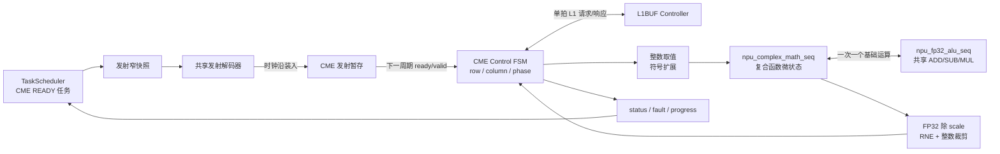
```mermaid
flowchart LR
    TS["TaskScheduler<br/>CME READY 任务"]
    SNAP["发射窄快照"]
    DEC["共享发射解码器"]
    STG["CME 发射暂存"]
    CFSM["CME Control FSM<br/>row / column / phase"]
    L1C["L1BUF Controller"]
    CONV["整数取值<br/>符号扩展"]
    MSEQ["npu_complex_math_seq<br/>复合函数微状态"]
    ALU["npu_fp32_alu_seq<br/>共享 ADD/SUB/MUL"]
    OUT["FP32 除 scale<br/>RNE + 整数裁剪"]
    DONE["status / fault / progress"]

    TS --> SNAP
    SNAP --> DEC
    DEC -->|"时钟沿装入"| STG
    STG -->|"下一周期 ready/valid"| CFSM
    CFSM <-->|"单拍 L1 请求/响应"| L1C
    CFSM --> CONV
    CONV --> MSEQ
    MSEQ <-->|"一次一个基础运算"| ALU
    MSEQ --> OUT
    OUT --> CFSM
    CFSM --> DONE
    DONE --> TS
```

将基础 FP32 运算拆成寄存器状态后，加减对消后的规格化和次正规乘数的规格化都按每周期左移 1 bit 进行，避免在一个周期内形成很深的前导零处理组合逻辑。代价是请求延迟随输入位模式变化，且当前不能每周期接收新元素。

### 13.2 模块级信号

`npu_complex_engine` 与 IVE 使用相同形态的任务、完成和单拍 L1 接口：

| 信号 | 方向 | 位宽 | 作用 |
| --- | --- | ---: | --- |
| `clk_i`、`reset_n` | Input | 各 1 | Core 时钟与低有效异步复位 |
| `task_valid_i`、`task_ready_o` | Input/Output | 各 1 | 任务握手；ready 仅在 `ST_IDLE` 为 1 |
| `opcode_i` | Input | 8 | `0x80`、`0x81`、`0x82`、`0x84` 或 `0x86` |
| `command_id_i` | Input | 12 | 内部任务编号 |
| `desc_i` | Input | 2048 | CME 发射暂存提供的当前任务 Task Context |
| `done_valid_o`、`done_ready_i` | Output/Input | 各 1 | 完成握手 |
| `done_status_o` | Output | 8 | 任务状态 |
| `done_fault_addr_o` | Output | 48 | 首个失败相关地址 |
| `done_progress_o` | Output | 64 | 已成功写完的输出元素数 |
| `l1_req_valid_o`、`l1_req_ready_i` | Output/Input | 各 1 | L1 请求握手 |
| `l1_req_write_o` | Output | 1 | 读写方向 |
| `l1_req_addr_o` | Output | 20 | 8B 对齐的 L1 地址 |
| `l1_req_wdata_o` | Output | 64 | 写数据 |
| `l1_req_wstrb_o` | Output | 8 | 字节写使能 |
| `l1_rsp_valid_i`、`l1_rsp_ready_o` | Input/Output | 各 1 | L1 响应握手 |
| `l1_rsp_rdata_i` | Input | 64 | L1 读数据 |
| `l1_rsp_status_i` | Input | 3 | L1 状态 |

模块没有独立的 `busy`、I2F active、FP active、F2I active 或 numeric flag 输出。忙闲可以由任务握手和完成握手观察；内部数学阶段需要通过状态寄存器或验证探针观察。

`npu_complex_engine` 的复位清除主状态、phase、status、fault address 和 progress。Task Context、行列计数、输入值、统计值、FP32 工作值、数学请求 payload 和写回数据寄存器不依赖复位清零。新任务在 `ST_IDLE` 锁存 Task Context，每行在 `ST_ROW_INIT` 初始化该行所需统计寄存器，数学状态在发出请求前装入操作数。主状态回到 `ST_IDLE` 后，L1 请求 valid 和 done valid 均为 0。

### 13.3 指令展开得到的 CME Task Context

CME READY 任务在逐槽扫描中获胜并通过结束时复查后，TaskScheduler 保存发射窄快照；共享发射解码器读取该任务保存的指令和提交时基地址快照，把第 6.7.5 节的指令位段展开为以下内部字段，并在解码周期末写入 CME 发射暂存。任务表不保存这些 2048 bit展开字段。正常指令的 `rows` 范围为 1～32，`length` 范围为 1～256，`valid_length` 固定等于 `length`。

| Byte Offset | 内部字段 | 位宽 | 作用 |
| ---: | --- | ---: | --- |
| `0x00` | 结构编号 | 8 | `1` |
| `0x01` | 执行单元类型 | 8 | `4`，表示 CME |
| `0x02` | 有效字节数 | 16 | `256` |
| `0x08` | `src0_base` | 64 | 主输入 L1 地址 |
| `0x10` | `src1_base` | 64 | ADD_RESCALE 第二输入或 Norm gamma |
| `0x18` | `src2_base` | 64 | LayerNorm beta；其他当前操作为 0 |
| `0x20` | `dst_base` | 64 | 输出地址 |
| `0x38` | `numeric_cfg` | 32 | 四路 dtype、RNE、per-tensor scale、内部 FP32 使能 |
| `0x40` | `rows` | 32 | 行数 |
| `0x44` | `length` | 32 | 每行元素数 |
| `0x48` | `valid_length` | 32 | 当前等于 `length` |
| `0x4C` | `function_mode` | 32 | 0～3 激活、4 Softmax、5 LayerNorm、6 RMSNorm、7～9统计、12不同 scale 加法 |
| `0x50` | `src0_row_stride` | 32 | 主输入连续一行的字节数 |
| `0x54` | `src1_row_stride` | 32 | ADD_RESCALE 为连续一行字节数；Norm 参数为 0 |
| `0x58` | `src2_row_stride` | 32 | 当前为 0 |
| `0x5C` | `dst_row_stride` | 32 | 普通输出为连续一行字节数；统计为 4 |
| `0x60` | `mask_base` | 64 | Softmax boolean mask |
| `0x68` | `mask_row_stride` | 32 | boolean mask 固定为 `length` |
| `0x6C` | `mask_mode` | 32 | 0 none、1 boolean、3 每行有效长度 |
| `0x70` | `src0_scale_bits` | 32 | 主输入 scale 的 FP32 位模式 |
| `0x74` | `src1_scale_bits` | 32 | 第二输入或 gamma scale |
| `0x78` | `src2_scale_bits` | 32 | beta scale；Norm 中与 gamma scale 相同 |
| `0x7C` | `dst_scale_bits` | 32 | 输出 scale |
| `0x80～0x8C` | 四个 zero point | 各 32 | 当前全部为 0 |
| `0x90` | `epsilon_bits` | 32 | Norm 使用的正 FP32 $\epsilon$ |
| `0x94/0x98` | 输入限制最小值/最大值 | 各 32 | ACT 的 profile 范围；Softmax 固定 `[-16,16]` |
| `0x9C` | `approx_mode` | 8 | 当前为 0 |
| `0x9D` | `overflow_mode` | 8 | 普通 CME 指令固定为 0；统计也由当前指令固定为 0 |
| `0x9E` | `all_mask_mode` | 8 | Softmax 全无效行写 0 或报数值错误 |
| `0x9F` | `stats_mode` | 8 | 当前指令固定为 0，即 LayerNorm 两次统计扫描 |
| `0xB0` | `scratch_request_elems` | 32 | Softmax 和 Norm 为 `length`；其他为 0 |
| `0xB4` | `query_position_base` | 32 | 引擎内部 causal Softmax 的首行 query 位置；正常指令入口不启用 causal |
| `0xB8` | `key_position_base` | 32 | 引擎内部 causal Softmax 的第 0 列 key 位置；正常指令入口不启用 causal |
| `0xBC` | `query_position_step` | 32 | 引擎内部 causal Softmax 每增加一行时 query 位置的增量；正常指令入口不启用 causal |
| `0xC0` | `valid_length_base` | 64 | Softmax 每行有效长度数组地址 |
| `0xC8` | `valid_length_stride` | 32 | 该模式固定为 4B |

公共 dtype 和各操作专有字段展开如下：

| 指令 | src0 | 辅助输入 | dst | scale 与参数 |
| --- | --- | --- | --- | --- |
| ACT | 公共 dtype | 无 | 指令选择 INT8、INT16 或 INT32 | src、dst 各一个 signed4 指数；函数与 clip profile 来自指令 |
| SOFTMAX | 公共 dtype | boolean mask 或逐行 INT32 长度 | 指令选择 INT8、INT16 或 INT32 | src、dst 各一个 signed4 指数 |
| NORM | 公共 dtype | gamma 与可选 beta 都使用公共 dtype | 指令选择 INT8、INT16 或 INT32 | src、参数、dst 各一个 signed4 指数；epsilon 使用 profile |
| STAT | 公共 dtype | 无 | INT32，每行一个 | 不使用 FP32 scale |
| ADD_RESCALE | 公共 dtype | 第二输入也使用公共 dtype | 指令选择 INT8、INT16 或 INT32 | src0、src1、dst 各一个 signed4 指数 |

signed4 指数 $e\in[-8,7]$ 展开成精确 FP32 幂

$$
s=2^e.
$$

因此正常指令只产生有限且大于 0 的 per-tensor scale。当前 zero point 固定为 0，普通 CME 指令固定使用 round-to-nearest-even、饱和写回和内部 FP32。命令头中的 `strict_numeric` 没有进入 `npu_complex_engine` 的任务端口或 Task Context，当前 CME RTL 不依据该 bit 改变数学单元结果。

Norm 的 `aux` 指向 gamma。设 $H=\texttt{length}$，参数 dtype 为 $D_p$，gamma 占用字节数为 $B_\gamma=\operatorname{storage\_bytes}(H,D_p)$，则 LayerNorm beta 起点为

$$
a_\beta=a_\gamma+\operatorname{align\_up}(B_\gamma,64).
$$

gamma 和 beta 都作为 `[H]` 数组供全部行重复使用。RMSNorm 不读取 beta。

### 13.4 整数与 FP32 转换及共享顺序数据通路

对任一整数输入 $q$，当前 zero point 为 0，输入实际值为

$$
x=\operatorname{FP32}(q)\otimes s,
$$

其中 $s$ 是该输入的 FP32 scale，$\operatorname{FP32}(q)$ 表示带最近偶数舍入的整数到 binary32 转换，$\otimes$ 表示经共享 FP32 乘法器并在该次乘法后舍入。

数学函数得到 FP32 值 $y$ 后，输出转换为

$$
\widehat{q}=\operatorname{RNE}\!\left(y\otimes\operatorname{Reciprocal}(s_y)\right),
\qquad
q_y=\operatorname{clip}_{D_y}(\widehat{q}),
$$

其中 $s_y$ 是输出 scale，$D_y$ 是输出 dtype，$\operatorname{RNE}$ 是最近偶数整数舍入，$\operatorname{clip}_{D_y}$ 把结果限制到目标整数范围。这里的除法由三轮 Newton Reciprocal 后乘法实现，不是单周期硬件除法。

`npu_complex_math_seq` 支持以下请求：

| operation | 动作 |
| ---: | --- |
| 0～3 | Sigmoid、Tanh、GELU、SiLU |
| 4 | Exp |
| 5 | ReciprocalSqrt |
| 6 | 乘 |
| 7、12 | 先求分母 Reciprocal，再与分子相乘 |
| 8、9 | 加、减 |
| 10 | Reciprocal |
| 11 | signed32 转 FP32 后乘 scale |

数学单元有一个 4 项返回栈，使 GELU→Tanh→Exp/Reciprocal、SiLU→Sigmoid→Exp/Reciprocal 等调用能复用同一套微状态。所有基础加、减、乘都经同一个 FP32 ALU，运算之间没有 FMA 合并。

FP32 ALU 对正常结果使用最近偶数舍入，支持正规数和次正规数，NaN 输入产生 canonical quiet NaN；有限结果溢出时产生带符号 Inf。加减流程是准备、指数对齐、尾数合并、逐 bit 规格化和舍入；乘法流程是两个尾数逐 bit 规格化、24×24 乘积和舍入。响应在调用方接收前保持有效。

### 13.5 激活函数

ACT 先把 $x$ 限制到指令所选 profile：`[-16,16]`、`[-8,8]`、`[-4,4]` 或 `[-2,2]`，然后计算

$$
\sigma(x)=\frac{1}{1+e^{-x}},
$$

$$
\tanh(x)=\frac{e^x-e^{-x}}{e^x+e^{-x}},
$$

$$
\operatorname{SiLU}(x)=x\,\sigma(x),
$$

$$
\operatorname{GELU}(x)=\frac{x}{2}\left[1+\tanh\!\left(\sqrt{\frac{2}{\pi}}\left(x+0.044715x^3\right)\right)\right].
$$

式中 $x$ 是输入整数乘输入 scale 后的 FP32 值，函数输出再按第 13.4 节除以 $s_y$ 并写成整数。

当前近似实现使用以下固定步骤：

- Exp 把小于 -16 的输入置 0，把大于 16 的输入限制为 16，经 $\ln2$ 范围缩小和六次 Horner 乘加步骤得到结果，每一步乘和加都单独舍入。
- Sigmoid 计算 $a=\exp(-|x|)$，$x\ge0$ 时返回 $1/(1+a)$，$x<0$ 时返回 $a/(1+a)$；超过正负 16 时直接返回 1 或 0。
- Tanh 在 $|x|<0.25$ 时使用 $x(1-x^2/3+2x^4/15-17x^6/315)$，其他输入使用带符号的 $(1-e^{-2|x|})/(1+e^{-2|x|})$；$|x|>8$ 时直接返回带符号的 1。
- GELU 在 $x>8$ 时返回 $x$，在 $x<-8$ 时返回 0；SiLU 在 $x>16$ 时返回 $x$，在 $x<-16$ 时返回 0。

Exp 的范围缩小先计算

$$
t=x\log_2 e,\qquad
k=\operatorname{roundEven}(t),
$$

再计算

$$
r=x-k\ln2_{\mathrm{hi}}-k\ln2_{\mathrm{lo}},
\qquad
e^x\approx2^kP(r),
$$

其中 `roundEven` 表示舍入到最近整数，正好位于两个整数中间时选择偶数；\(P(r)\) 是后续 Horner 状态计算的多项式。输入已限制到 \([-16,16]\)，所以 \(|t|<24\)，可达的 \(k\) 只有 \(-23\ldots23\)。RTL 不需要通用 64-bit FP32 转整数电路，而是使用 7-bit幅值和下列五个寄存状态：

| 状态 | 保存或计算的内容 |
| --- | --- |
| `ST_EXP_RANGE_ROUND` | 从 FP32 \(t\) 保存正负号、8-bit偏置指数和带隐藏位的 24-bit有效数字 |
| `ST_EXP_RANGE_SHIFT` | 根据偏置指数 126～131 提取 7-bit整数部分、24-bit余数和中点值；较小数值的整数部分为 0 |
| `ST_EXP_RANGE_INCREMENT` | 当余数大于中点，或余数等于中点且整数部分为奇数时，把幅值增加 1 |
| `ST_EXP_RANGE_COMMIT` | 恢复正负号并把 \(-23\ldots23\) 保存到 `exponent_q` |
| `ST_EXP_RANGE_FROM_INT` | 从小整数 FP32 表取得 \(k\) 的精确 FP32 编码，供后续两次 \(k\ln2\) 乘法使用 |

五个状态各自只完成字段保存、移位、7-bit加一、符号恢复或查表中的一项。偏置指数选择、舍入进位和符号处理不会与 FP32 乘法串在一个周期。

`fp32_from_exp_integer(sign,magnitude)` 保存 \(0\ldots23\) 的精确 FP32 编码。下表给出非负值；负数 \(1\ldots23\) 只需把 bit 31 置 1，幅值为 0 时固定返回 `+0`：

| 十进制整数 | FP32 十六进制 | 十进制整数 | FP32 十六进制 | 十进制整数 | FP32 十六进制 |
| ---: | ---: | ---: | ---: | ---: | ---: |
| 0 | `00000000` | 8 | `41000000` | 16 | `41800000` |
| 1 | `3f800000` | 9 | `41100000` | 17 | `41880000` |
| 2 | `40000000` | 10 | `41200000` | 18 | `41900000` |
| 3 | `40400000` | 11 | `41300000` | 19 | `41980000` |
| 4 | `40800000` | 12 | `41400000` | 20 | `41a00000` |
| 5 | `40a00000` | 13 | `41500000` | 21 | `41a80000` |
| 6 | `40c00000` | 14 | `41600000` | 22 | `41b00000` |
| 7 | `40e00000` | 15 | `41700000` | 23 | `41b80000` |

> [!example] Exp 范围整数的最近偶数舍入
> 若 \(t=6.5\)，`ST_EXP_RANGE_SHIFT` 得到整数部分 6，余数等于中点；6 为偶数，所以 `ST_EXP_RANGE_INCREMENT` 不增加幅值，最终 \(k=6\)，查表得到 `FP32 0x40c00000`。若 \(t=7.5\)，整数部分 7 为奇数，幅值增加到 8，查表得到 `0x41000000`。负数使用同一幅值规则，最后在 `ST_EXP_RANGE_COMMIT` 恢复负号。

> [!example] INT8 Sigmoid
> 输入整数为 `[-2,0,2]`，$s_x=1$，$s_y=0.25$。Sigmoid 约为 `[0.1192,0.5,0.8808]`，除以 0.25 并最近偶数舍入后写成 `[0,2,4]`。这是 `tb_npu_complex_engine` 检查的结果。

### 13.6 Softmax

对一行中有效位置集合 $\mathcal{V}$，CME 计算

$$
m=\max_{i\in\mathcal{V}}x_i,
$$

$$
e_i=\exp\!\left(\max(x_i-m,-16)\right),
\qquad
S=\sum_{i\in\mathcal{V}}e_i,
$$

$$
y_i=
\begin{cases}
e_i/S,&i\in\mathcal{V},\\
0,&i\notin\mathcal{V}.
\end{cases}
$$

其中 $x_i=q_i s_x$，输出 $y_i$ 再按第 13.4 节转换成目标整数。减去行最大值后，Exp 输入上限固定为 0，下限固定为 -16。

有效位置由 `mask_mode` 决定：

| 模式 | $\mathcal{V}$ |
| --- | --- |
| 0，none | 全部 $0\le i<H$ |
| 1，boolean | mask 字节非 0 的位置 |
| 3，每行有效长度 | $0\le i<L_r$，$L_r$ 从该行的 INT32 长度项读取并检查 `0≤L_r≤H` |

引擎内部支持 causal 位置比较。第 \(r\) 行开始时，`ST_ROW_INIT` 先把该行 query 位置寄存为

$$
q_r=\texttt{query\_position\_base}
    +r\cdot\texttt{query\_position\_step}.
$$

第 \(c\) 列的 key 位置为

$$
k_c=\texttt{key\_position\_base}+c.
$$

当 `mask_mode=2` 时，只有 \(k_c\le q_r\) 的位置有效。行内每次检查都读取已经保存的 `causal_query_position_q`，不会把行号乘法放到列级有效条件中。

正常指令入口目前不提供这项功能。`COMPLEX_SOFTMAX` 的 `mask_mode=2` 会在 `npu_inline_desc_decode` 中使 `valid_o=0`，TaskScheduler 建立 `BAD_DESC` 终态，并且不会把任务发给 CME。上述三个位置字段也没有可用的正常指令位段，只能在 CME 模块级直接 Task Context 测试中设置。软件可用的模式仍为 0、1 和 3。

Softmax 每行使用三个阶段：

1. `PH_SOFT_MAX` 逐元素转换为 FP32并求 $m$。
2. `PH_SOFT_SUM` 重新读取有效元素，计算 $e_i$，按列号低 2 bit 分配到四个 FP32 部分和寄存器，行末两两相加后求 $1/S$。
3. `PH_SOFT_OUT` 第三次读取有效元素，重新计算 $e_i$，乘 $1/S$，转换成整数并写回；无效位置直接写整数 0。

四个部分和寄存器只是降低串行相加依赖，不表示四个元素并行。每一时刻仍只有一个元素向共享数学单元发请求。

若一行没有有效元素，`all_mask_mode=0` 时该行全部写 0；`all_mask_mode=1` 时在写该行之前返回 `NUMERIC_EXCEPTION`。boolean mask 在三个阶段中都逐元素重读；每行有效长度只在该行开始时读取一次。

> [!example] 两元素 Softmax
> 输入 `[0,0]`、$s_x=1$ 时，$m=0$、$S=2$、输出为 `[0.5,0.5]`。若 $s_y=0.25$，整数结果为 `[2,2]`，与 RTL 测试一致。

### 13.7 LayerNorm 与 RMSNorm

令一行长度为 $H$，主输入为 $x_j=q_{x,j}s_x$，gamma 为 $g_j=q_{g,j}s_g$，beta 为 $b_j=q_{b,j}s_b$，$\epsilon$ 是指令 profile 展开的正 FP32 常数。

LayerNorm 计算

$$
\mu=\frac{1}{H}\sum_{j=0}^{H-1}x_j,
\qquad
v=\frac{1}{H}\sum_{j=0}^{H-1}(x_j-\mu)^2,
$$

$$
y_j=g_j(x_j-\mu)\frac{1}{\sqrt{v+\epsilon}}+b_j.
$$

当前指令固定使用两次统计扫描：`PH_NORM_ACC` 求和并得到 $\mu$，`PH_NORM_VAR` 重读主输入并累计中心化平方，随后计算 ReciprocalSqrt，`PH_NORM_OUT` 再读主输入、gamma 和 beta 并写输出。引擎内部还保留 `stats_mode=1` 的 Welford 状态序列，但当前内联解码器不产生该选择。

RMSNorm 计算

$$
u=\frac{1}{H}\sum_{j=0}^{H-1}x_j^2,
$$

$$
y_j=g_jx_j\frac{1}{\sqrt{u+\epsilon}}.
$$

它在 `PH_NORM_ACC` 扫描平方和，在 `PH_NORM_OUT` 重读主输入和 gamma；不读取 beta。LayerNorm 和 RMSNorm 都使用四个按 `j mod 4` 交错的 FP32 部分和寄存器，行末通过三次 FP32 加法合成总和。

> [!example] 两元素 LayerNorm
> 令输入为 `[-1,1]`，$s_x=1$，gamma 为 `[1,1]` 且 $s_g=1$，beta 为 `[0,0]`，$s_b=1$，$\epsilon=10^{-4}$，输出 scale 为 1。此时 $\mu=0$、$v=1$，整数写回为 `[-1,1]`，与 RTL 测试一致。

### 13.8 统计与不同 scale 加法

STAT 不进入 FP32 数学单元。对每行 signed 整数 $q_j$，三种模式为

$$
\operatorname{SUM}=\sum_{j=0}^{H-1}q_j,
$$

$$
\operatorname{MAX}=\max_{0\le j<H}q_j,
$$

$$
\operatorname{SUMSQ}=\sum_{j=0}^{H-1}q_j^2.
$$

当前 RTL 的 sum、max 和 sumsq 状态寄存器都是 signed 64 bit。行结束后结果写一个 INT32；正常指令固定饱和到 INT32 范围。引擎内部还实现错误和低位保留两种 `overflow_mode`，但当前统计指令不提供该选项。

STAT 每行产生一个 INT32 结果。第 $r$ 行的目的地址仍满足

$$
\operatorname{stat\_dst\_addr}(r)
=
B_{\mathrm{dst}}+r\cdot\operatorname{dst\_row\_stride}.
$$

RTL 不在每行的 `ST_ROW_INIT` 重新计算上式。任务通过 `ST_CHECK` 后先把 `dst_base[47:0]` 保存到 `stat_dst_addr_q`，第 0 行直接使用该基址；一行的统计结果写响应成功后，若还有下一行，就执行

$$
\texttt{stat\_dst\_addr\_q}
\leftarrow
\texttt{stat\_dst\_addr\_q}
+\texttt{dst\_row\_stride}.
$$

因此行地址通过“基址寄存后逐行增加 stride”得到。本行结束后的 SUM、MAX 和 SUMSQ 范围检查、L1 写请求及错误地址都使用 `stat_dst_addr_q`，不再依赖随后变化的行列游标。

SUM 和 MAX 在 `ST_COMPUTE` 更新 signed64 统计值。SUMSQ 把乘法与累加分开：`ST_STAT_SQUARE` 将当前 `src0_value_q[31:0]` 作为 signed32，计算 signed64 平方并保存行末标志和溢出方式；`ST_STAT_ACCUM` 在下一拍把平方加入 signed64 `stat_sumsq_q`，再决定推进到下一元素或形成该行的 INT32 输出。这样避免 signed32 平方后在同一周期继续经过 signed64 加法和输出范围处理。

> [!example] 行统计
> 输入 `[-2,3]` 的 SUM、MAX、SUMSQ 分别为 1、3、13。每种任务只写一个 INT32，因此该行完成后 `done_progress_o` 增加 1。

ADD_RESCALE 用于两个输入 scale 不同的逐元素加法。设输入整数为 $q_0,q_1$，scale 为 $s_0,s_1$，输出 scale 为 $s_y$，则

$$
x_0=q_0s_0,
\qquad
x_1=q_1s_1,
$$

$$
q_y=\operatorname{clip}_{D_y}\!\left(\operatorname{RNE}\!\left((x_0+x_1)\operatorname{Reciprocal}(s_y)\right)\right).
$$

当前指令令两个输入使用相同 dtype，但允许 $s_0\ne s_1$，目标 dtype 可独立选择。例如 $q_0=1$、$s_0=1$、$q_1=2$、$s_1=1$、$s_y=1$ 时写出 3；若 $s_0=0.5$、$s_1=0.25$、$s_y=0.25$，则实数和为 1，写出整数 4。

### 13.9 CME 主状态、数学微状态与时序

CME 外层状态机与当前 RTL 枚举一致：

| 状态 | 动作 |
| --- | --- |
| `ST_IDLE` | 等待任务，与 CME 发射暂存握手后锁存操作码与 Task Context |
| `ST_CHECK` | 检查操作、内部字段、dtype、shape、scale、mask、地址和函数组合 |
| `ST_ROW_INIT` | 清零当前行的统计寄存器，寄存 causal query 位置，并选择初始 phase；STAT 目的地址已在任务检查结束时保存，后续在每行写成功后增加 stride |
| `ST_VLEN_CHECK` | 每行有效长度模式下，检查当前 INT32 长度元素是否跨越 8B beat；通过后才能发出读取请求 |
| `ST_VLEN_REQ/RSP` | Softmax 读取当前行有效长度 |
| `ST_ELEMENT_BEGIN` | 保存当前 src0、src1、src2、dst、mask 地址和派生 mask 结果 |
| `ST_ADDR_PREP` | 根据 mask 模式和派生 mask 决定读取 boolean mask、跳过当前项、写零或读取 src0；同时检查 src0 元素是否跨越 8B beat |
| `ST_MASK_REQ/RSP` | 读取 boolean mask |
| `ST_SRC0_REQ/RSP` | 读取主输入 |
| `ST_SRC1_REQ/RSP` | 读取第二输入或 gamma |
| `ST_SRC2_REQ/RSP` | LayerNorm 读取 beta |
| `ST_COMPUTE` | STAT SUM/MAX 更新 signed64 统计值；SUMSQ 转到平方状态；其他操作发起 I2F 请求 |
| `ST_STAT_SQUARE` | 对当前 signed32 输入执行平方，保存 signed64 乘积、行末标志和溢出方式 |
| `ST_STAT_ACCUM` | 把平方加入 signed64 平方和，推进元素或形成当前行的 INT32 统计输出 |
| `ST_MATH_REQ/RSP` | 与共享数学单元完成一次请求和响应握手；`MA_F2I` 响应在此拆解 FP32，并保存商、余数、中点、正负号、特殊值标志和输出控制字段 |
| `ST_F2I_ROUND` | 根据保存的舍入方式、余数、中点、商最低位和正负号，寄存是否加一 |
| `ST_F2I_MAG` | 把加一标志加入 64-bit 商；Inf 或指数过大时选择 signed64 限制值对应的幅值 |
| `ST_F2I_SIGN` | 恢复正负号，并把超出 signed64 范围的结果限制到 signed64 最小值或最大值 |
| `ST_F2I_OFFSET` | 把保存的 signed32 目标 zero point 符号扩展并加入 signed64 整数 |
| `ST_F2I_FINISH` | 检查目标数据格式范围，形成裁剪后的写回值和对应字节写使能 |
| `ST_ADVANCE` | 推进列、合成行统计量或切换 phase |
| `ST_WRITE_REQ/RSP` | 写一个输出元素并等待完成状态 |
| `ST_DONE` | 保持完成状态直到 TaskScheduler 接收 |

外层 phase 的用途如下：

| phase | 用途 |
| --- | --- |
| `PH_ELEMENT` | ACT 或 ADD_RESCALE 单遍逐元素输出 |
| `PH_SOFT_MAX` | Softmax 行最大值 |
| `PH_SOFT_SUM` | Softmax 指数和 |
| `PH_SOFT_OUT` | Softmax 最终输出 |
| `PH_NORM_ACC` | LayerNorm 求和或 RMSNorm 平方和 |
| `PH_NORM_VAR` | LayerNorm 中心化平方和 |
| `PH_NORM_OUT` | Norm 最终输出 |
| `PH_STAT_ACC` | 整数行统计 |
| `PH_STAT_OUT` | 每行一个 INT32 统计结果 |

`npu_complex_math_seq` 的控制可分为以下状态组：

| 状态组 | 作用 |
| --- | --- |
| `ST_IDLE`、`ST_RESPONSE` | 接受一个请求；保持一个响应 |
| `ST_ALU_REQ`、`ST_ALU_RSP` | 调用共享 FP32 ADD/SUB/MUL，并返回保存的继续状态 |
| `ST_I2F_*` | signed32 转 FP32 后乘 scale |
| `ST_EXP_ENTRY`、`ST_EXP_RANGE_MUL_START` | 限制输入到 `[-16,16]`，计算 \(t=x\log_2e\) |
| `ST_EXP_RANGE_ROUND/SHIFT/INCREMENT/COMMIT/FROM_INT` | 用五个寄存状态完成最近偶数整数舍入、保存 \(k\) 并取得精确的小整数 FP32 值 |
| 其他 `ST_EXP_*` | 用高低两项 \(\ln2\) 形成余数，执行 Horner 多项式并乘 \(2^k\) |
| `ST_RECIP_*` | 尾数规格化、线性初值、三轮 Newton 和指数恢复 |
| `ST_RSQRT_*` | 尾数与奇偶指数处理、位级初值、三轮 Newton 和指数恢复 |
| `ST_SIG_*`、`ST_TANH_*`、`ST_GELU_*`、`ST_SILU_*` | 复合激活函数 |
| `ST_SCALE_*` | 用一个或多个 $2^k$ 乘法处理较大指数调整 |

共享 FP32 ALU 状态为：

| 操作 | 状态次序 |
| --- | --- |
| ADD/SUB | `ST_IDLE → ST_ADD_PREPARE → ST_ADD_ALIGN → ST_ADD_COMBINE → ST_ADD_NORMALIZE* → ST_ADD_ROUND → ST_RESPONSE` |
| MUL | `ST_IDLE → ST_MUL_NORMALIZE* → ST_MUL_PRODUCT → ST_MUL_ROUND → ST_RESPONSE` |

星号状态可重复。ADD/SUB 在相减后每个周期最多左移 1 bit；MUL 对两个次正规输入的尾数也每周期最多左移 1 bit。因此基础运算不是固定单周期，复合函数总周期又等于其顺序调用的基础运算周期与微状态周期之和。

`npu_fp32_alu_seq` 的异步复位只把状态置为 `ST_IDLE`，因此复位后请求端 ready 为 1、响应 valid 为 0。结果寄存器和 ADD/SUB/MUL 中间寄存器不清零；它们只在相应状态有效时使用，并在每次新请求的处理过程中重新赋值。响应进入 `ST_RESPONSE` 后保持稳定，直到调用方完成响应握手。

输出 F2I 不再把 FP32 拆解、舍入、符号恢复、zero point 相加和目标格式裁剪放在一个周期。`MA_F2I` 的数学响应握手先保存本次输出所需的中间值和控制字段，然后依次执行五个寄存状态：

```text
ST_MATH_RSP(MA_F2I)
  → ST_F2I_ROUND
  → ST_F2I_MAG
  → ST_F2I_SIGN
  → ST_F2I_OFFSET
  → ST_F2I_FINISH
  → ST_WRITE_REQ
```

从数学响应握手到写请求状态之间固定经过上述五个状态，因此每个产生输出的 F2I 操作包含额外 5 个时钟周期。舍入方式、目标数据格式、异常标志、溢出处理方式、phase 和目标地址都在数学响应时保存，后续状态只读取这些寄存值。这样，即使目标 L1 端口暂停或完成接口暂停，本次输出的控制信息也不会被下一元素改写。

> [!example] F2I 的五个寄存周期
> 假设数学单元返回 FP32 的 \(1.5\)，舍入方式为最接近且中点取偶数，目标 zero point 为 0，目标格式为 INT8。数学响应周期保存商 1、余数、中点和正号；`ST_F2I_ROUND` 得到加一标志 1；`ST_F2I_MAG` 得到幅值 2；`ST_F2I_SIGN` 得到 signed64 整数 2；`ST_F2I_OFFSET` 加入 0 后仍为 2；`ST_F2I_FINISH` 确认结果位于 INT8 范围内，随后写出 `0x02`。当前公开指令和 CME 启动检查要求目标 zero point 为 0，但保留独立加法阶段可以避免该加法与舍入、符号恢复和格式检查串接。

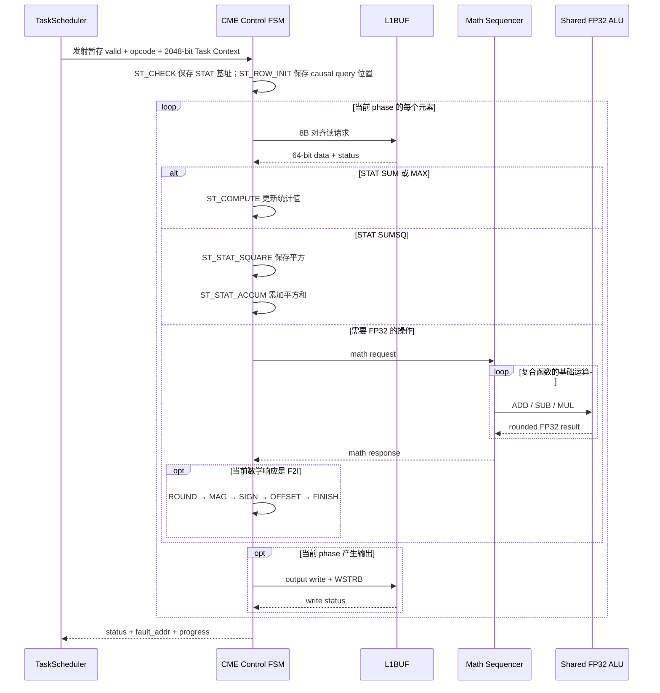
```mermaid
sequenceDiagram
    participant TS as TaskScheduler
    participant CME as CME Control FSM
    participant L1 as L1BUF
    participant MS as Math Sequencer
    participant FA as Shared FP32 ALU

    TS->>CME: 发射暂存 valid + opcode + 2048-bit Task Context
    CME->>CME: ST_CHECK 保存 STAT 基址；ST_ROW_INIT 保存 causal query 位置
    loop 当前 phase 的每个元素
        CME->>L1: 8B 对齐读请求
        L1-->>CME: 64-bit data + status
        alt STAT SUM 或 MAX
            CME->>CME: ST_COMPUTE 更新统计值
        else STAT SUMSQ
            CME->>CME: ST_STAT_SQUARE 保存平方
            CME->>CME: ST_STAT_ACCUM 累加平方和
        else 需要 FP32 的操作
            CME->>MS: math request
            loop 复合函数的基础运算
                MS->>FA: ADD / SUB / MUL
                FA-->>MS: rounded FP32 result
            end
            MS-->>CME: math response
            opt 当前数学响应是 F2I
                CME->>CME: ROUND → MAG → SIGN → OFFSET → FINISH
            end
        end
        opt 当前 phase 产生输出
            CME->>L1: output write + WSTRB
            L1-->>CME: write status
        end
    end
    CME-->>TS: status + fault_addr + progress
```

该图对多遍操作按 phase 重复读取。当前模块在等待数学响应时不发起下一元素读取，在等待 L1 返回时也不推进数学微状态，所以 L1、I2F、函数运算和 F2I 不构成跨元素重叠流水。

无 mask 时，各操作每个输出位置的主数据读取次数为：

| 操作 | 主输入与参数读取 | 输出写入 |
| --- | --- | --- |
| ACT | src0 一次 | 每元素一次 |
| ADD_RESCALE | src0、src1 各一次 | 每元素一次 |
| SOFTMAX | 每个有效 src0 在 MAX、SUM、OUT 各一次 | 每元素一次，包括 mask 无效位置写 0 |
| LayerNorm | src0 在 ACC、VAR、OUT 各一次；OUT 再读 gamma、beta | 每元素一次 |
| RMSNorm | src0 在 ACC、OUT 各一次；OUT 再读 gamma | 每元素一次 |
| STAT | src0 每元素一次 | 每行一次 |

含有至少一个有效位置的 boolean Softmax 还会在三个 phase 各读取一次 mask 字节；全无效行跳过 SUM，因此只在 MAX 和 OUT 读取。有效长度模式每行额外读取一个 INT32。

普通逐元素、Softmax 和 Norm 每次成功目的写响应使 `done_progress_o` 增加 1，成功任务最终为 $R\,H$；STAT 每行只写一个值，成功任务最终为 $R$。出现字段、地址、L1 或数值错误时立即转到 `ST_DONE`，已成功写完的进度不回退。完成响应在 `done_ready_i=0` 时保持不变。

当前指令固定使用正的 2 的整数次幂 scale，因此输出除 scale 不会遇到零分母。数学单元对 NaN、Inf、Reciprocal 零输入和 ReciprocalSqrt 非正输入有确定的位级结果，但当前 CME 模块没有接收命令头 `strict_numeric` 的端口；正常指令路径主要依靠字段检查、输入限制、正 $\epsilon$ 和饱和写回来约束输出。

### 13.10 数学函数的适用范围与误差要求

当前指令解码固定生成 `approx_mode=0`。该模式使用第 13.4～13.9 节所述的顺序 FP32 运算，函数适用范围和验证要求如下：

| 函数 | 重点验证的输入范围 | 结果要求 |
| --- | --- | --- |
| Exp | 独立调用为 `[-16,16]`；Softmax 内部为 `[-16,0]` | 与高精度参考值相比，最大相对误差不超过 \(2^{-10}\) |
| Reciprocal | 非零有限值；指数至少覆盖 `-12～12` | 最大相对误差不超过 \(2^{-10}\) |
| ReciprocalSqrt | 正有限值；指数至少覆盖 `-12～12` | 最大相对误差不超过 \(2^{-10}\) |
| Sigmoid | `[-16,16]` | 最大绝对误差不超过 \(2^{-12}\) |
| Tanh | `[-8,8]` | 最大绝对误差不超过 \(2^{-12}\) |
| GELU | `[-8,8]` | 最大绝对误差不超过 \(2^{-10}\) |
| SiLU | `[-16,16]` | 最大绝对误差不超过 \(2^{-10}\) |

表中的误差针对 CME 内部 FP32 函数结果。完整张量任务还必须逐项核对 `INT→FP32→INT` 的最终整数输出，包括 scale、最近偶数舍入和目的格式裁剪。NaN、Inf、0、负数输入 ReciprocalSqrt 以及除数为 0 的处理应由模块专项测试覆盖，并检查返回状态或 IEEE 754 特殊值是否与 RTL 定义一致。

函数延迟不是固定常数。输入含次正规数、加减结果需要多次左移规格化，或复合函数调用多个基础运算时，周期数都会增加。验证环境必须等待 ready/valid 握手，不得按固定拍数直接取得结果。

> [!note] 增加近似模式时需要同步提供的内容
> 若后续加入新的 `approx_mode`，每个模式都要给出十六进制 FP32 系数表、运算次序、输入限制、误差限制和周期测量结果；在这些内容齐全之前，软件只能生成 `approx_mode=0`。

---

## 14. MIF 与 AXI Master

### 14.1 数据通路与地址规定

MIF 接收 DMA 发出的物理地址请求，并通过顶层 `m_axi_*` AXI Master 访问 SoC AXI Fabric。系统存储和其他允许访问的 AXI Slave 都接在 Fabric 上，NPU 不为 DDR 设置专用直连端口。


```mermaid
flowchart LR
    DMA["DMA<br/>物理地址请求"] --> MIF["MIF<br/>检查、请求寄存器与状态机"]
    MIF --> AXI["AXI Master<br/>64-bit data"]
    AXI --> FAB["SoC AXI Fabric"]
    FAB --> MEM["DDR / 系统存储"]
```

软件、编译器、Runtime 和驱动提供给 NPU 的所有全局地址都是物理字节地址。`INPUT_BASE`、`WEIGHT_BASE`、`WORK_BASE`、`OUTPUT_BASE`、`KV_BASE`、DMA 指令中的全局地址引用、运行元数据中的输入输出地址和权重地址都遵守这一规定。MIF 不进行地址重写，检查通过后直接把物理地址低 `PA_W` 位送入 AXI `ARADDR` 或 `AWADDR`。

指令和内部接口保留 48-bit 地址容器，顶层 AXI 地址宽度为 40 bit。因此提交给 MIF 的地址必须满足：

$$
p[47:40]=0.
$$

若后续 SoC 采用其他 `PA_W`，则地址高于 `PA_W-1` 的全部 bit必须为 0。MIF 还使用 LSC 配置的物理地址允许范围检查访问；软件必须先配置该范围，再提交 DMA 任务。

当前 MIF 同时处理一个内部请求和一个 AXI 事务。读请求支持 1～16 个 64-bit beat，`ARLEN=req_burst_len_i`；写请求固定为一个 beat，`AWLEN=0`、`WLAST=1`。读写都使用 `ARSIZE=AWSIZE=3`、`ARBURST=AWBURST=INCR`，AXI ID 固定为 0。DMA 对齐快速路径直接给出读长度，MIF 不再自行合并相邻请求。

### 14.2 DMA 到 MIF 的内部接口

| 信号 | MIF 方向 | 位宽 | 说明 |
| --- | --- | ---: | --- |
| `req_valid_i` | Input | 1 | DMA 请求有效 |
| `req_ready_o` | Output | 1 | MIF 可以接收请求 |
| `req_write_i` | Input | 1 | 0 为读，1 为写 |
| `req_addr_i` | Input | 48 | 8B 对齐的物理字节地址 |
| `req_wdata_i` | Input | 64 | 写数据；读请求忽略 |
| `req_wstrb_i` | Input | 8 | 每个 bit 控制一个写字节 |
| `req_burst_len_i` | Input | 8 | beat 数减 1；读请求使用，写请求必须为 0 |
| `rsp_valid_o` | Output | 1 | 内部响应有效 |
| `rsp_ready_i` | Input | 1 | DMA 可以接收响应 |
| `rsp_rdata_o` | Output | 64 | 读数据；写完成时为 0 |
| `rsp_status_o` | Output | 3 | `NPU_MEM_*` 状态 |
| `addr_base_i` | Input | 48 | 允许访问的第一个物理 beat 起始地址 |
| `addr_limit_i` | Input | 48 | 允许访问的最后一个物理 beat 起始地址 |

`req_valid_i && req_ready_o` 时，MIF 保存请求地址、读写方向、写数据、写使能和读长度。请求一旦保存，`req_ready_o` 保持为 0，直到整个 AXI 事务结束并回到 `MIF_IDLE`。接口不携带请求 tag或任务编号；内部响应没有 last 信号，MIF 与 DMA 分别保存剩余 beat 数。

请求 valid等待 ready 时，DMA 必须保持地址、读写方向、写数据和写使能不变。响应 valid等待 ready 时，MIF 必须保持读数据和 status 不变。

### 14.3 物理地址检查

令首 beat 起始地址为 \(p_0\)，读请求长度字段为 \(L=req\_burst\_len_i\)，则末 beat 起始地址为：

$$
p_{\mathrm{last}}=p_0+8L.
$$

MIF 在发出 AXI 请求前依次检查：

1. `req_addr_i[2:0]=0`，即首地址按 8B 对齐；
2. 首地址与末 beat 起始地址都能由 AXI 地址宽度表示；
3. `p_0+8L` 的 48-bit 加法不发生回绕；
4. `addr_base_i <= p_0` 且 `p_last <= addr_limit_i`；
5. `addr_limit_i` 不小于 `addr_base_i`；
6. 读请求最后一个 beat 的末字节不越过当前 4KiB 段；
7. 写请求的 `req_burst_len_i` 必须为 0。

`addr_limit_i` 表示最后允许的 beat 起始地址，不是最后允许的字节地址。检查失败时，MIF 不发出 AXI 请求，直接生成 `NPU_MEM_ADDR` 响应并保存出错的物理地址。系统顶层由 DMA 保证 `req_burst_len_i<=15`；当前 MIF 独立模块未另设大于 15 的检查，因此模块级调用方也必须遵守该限制。

> [!note] 检查发生的时刻
> 指令中的全局地址先由 TaskScheduler 展开并交给 DMA。`PA_W=40` 的高位检查和 `M_AXI_ADDR_BASE/LIMIT` 检查由 MIF 在每个内部请求握手后、发出 AXI 地址前完成，不属于 CFE 接收结果，也不保证在 DMA 任务刚启动时已经完成。软件必须等待任务终态后再认定全部物理地址有效。

例如 `base=0x1000`、`limit=0x1018` 时，允许的单 beat 起始地址为 `0x1000`、`0x1008`、`0x1010` 和 `0x1018`。若从 `0x1000` 发起 4 beat 读，则 `L=3`、`p_last=0x1018`，请求合法；若从 `0x1008` 发起相同读，则末 beat 起始地址为 `0x1020`，请求被拒绝。地址 `0x1004` 也因未按 8B 对齐而被拒绝。

### 14.4 状态机

| 状态 | 主要动作 | 离开条件 |
| --- | --- | --- |
| `MIF_IDLE` | 等待并保存一个 DMA 请求，同时完成地址检查 | 检查失败进入内部响应；读请求进入读地址状态；写请求进入写发出状态 |
| `MIF_READ_ADDR` | 保持 AXI AR 通道字段 | AR 握手 |
| `MIF_READ_DATA` | 等待当前 R beat | R 握手并检查 RID、期望的 RLAST 和 RRESP，随后进入内部响应 |
| `MIF_WRITE_ISSUE` | 独立保持 AWVALID 和 WVALID | AW 与 W 都完成握手 |
| `MIF_WRITE_RESP` | 等待 B response | B 握手并检查 BID、BRESP |
| `MIF_INTERNAL_RESP` | 保持当前 DMA 响应和首错信息 | 响应握手后，读事务还有 beat 时把请求地址增加 8 并返回 `MIF_READ_DATA`，否则回到 `MIF_IDLE` |

AW 与 W 可以在不同周期握手。`aw_done_q` 和 `w_done_q` 分别记录两个通道是否已经完成；只有二者都完成后才进入 `MIF_WRITE_RESP`。任一通道暂停时，已完成的通道不会重复发出请求，未完成通道的 valid 与 payload 保持不变。

### 14.5 读请求功能时序

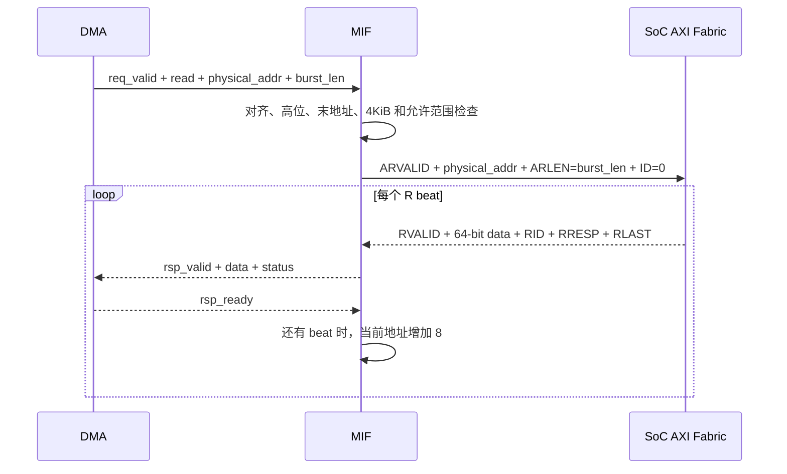
```mermaid
sequenceDiagram
    participant DMA
    participant MIF
    participant AXI as SoC AXI Fabric

    DMA->>MIF: req_valid + read + physical_addr + burst_len
    MIF->>MIF: 对齐、高位、末地址、4KiB 和允许范围检查
    MIF->>AXI: ARVALID + physical_addr + ARLEN=burst_len + ID=0
    loop 每个 R beat
        AXI-->>MIF: RVALID + 64-bit data + RID + RRESP + RLAST
        MIF-->>DMA: rsp_valid + data + status
        DMA-->>MIF: rsp_ready
        MIF->>MIF: 还有 beat 时，当前地址增加 8
    end
```

每个读返回都要求 `RID=0`，并检查：

```text
m_axi_rlast_i == (read_beats_remaining_q == 1)
```

条件不满足时，MIF 返回 `NPU_MEM_PROTOCOL`。`RRESP=OKAY` 返回 OK；`SLVERR` 与 `DECERR` 分别转成对应的内部状态，其他响应编码返回协议错误。出错后 MIF 不自行提前终止已经发出的 AXI 事务，DMA 使用 `ST_BURST_DRAIN` 接收剩余内部响应。

当 `ARREADY=0` 时，MIF 保持 `ARVALID`、地址和 AXI 属性。当当前 R beat 已经形成内部响应但 DMA 尚未接收时，MIF 令 `RREADY=0` 并保持响应数据与状态。内部响应握手后，还有 beat 时 `req_addr_q` 增加 8，再返回 `MIF_READ_DATA`。

### 14.6 写请求功能时序

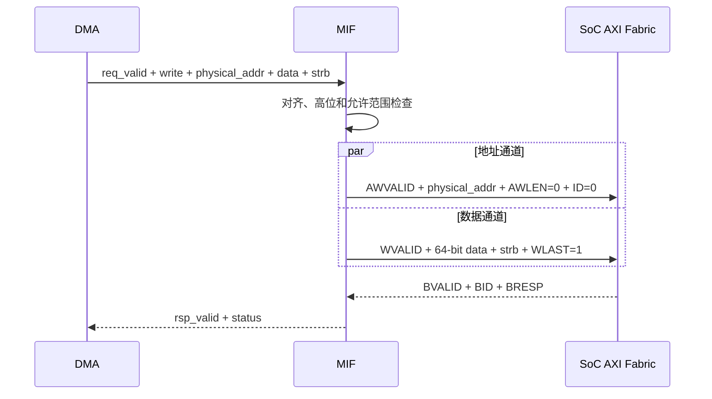
```mermaid
sequenceDiagram
    participant DMA
    participant MIF
    participant AXI as SoC AXI Fabric

    DMA->>MIF: req_valid + write + physical_addr + data + strb
    MIF->>MIF: 对齐、高位和允许范围检查
    par 地址通道
        MIF->>AXI: AWVALID + physical_addr + AWLEN=0 + ID=0
    and 数据通道
        MIF->>AXI: WVALID + 64-bit data + strb + WLAST=1
    end
    AXI-->>MIF: BVALID + BID + BRESP
    MIF-->>DMA: rsp_valid + status
```

写响应要求 `BID=0`。BID 不符时返回 `NPU_MEM_PROTOCOL`；BRESP 按与读响应相同的方法处理。任务成功必须晚于 B response 成功握手，不能把 AW 或 W 握手当作写完成。

当 `AWREADY=0` 或 `WREADY=0` 时，对应通道保持 valid 与 payload。两个通道分别握手后，MIF 只等待 B response，不得再次发出相同 AW 或 W。

### 14.7 错误保存、空闲与复位

`mif_idle_o` 只在 `state_q=MIF_IDLE` 且没有待返回响应时为 1。MIF 在内部响应状态发现 status 非 OK 时保存 `error_valid_o`、48-bit 物理地址和 3-bit status，并保持到 `error_clear_i=1`。清除旧错误与保存新错误同周期发生时，新错误优先保留。顶层把该错误送入 LSC 的汇总接口错误输入。

地址类错误保存原始物理地址。AXI 写错误保存对应事务的物理起始地址；AXI 读错误保存发生错误的当前 R beat 地址，因为 `req_addr_q` 会在每个内部响应握手后增加 8。软件读取故障地址时得到物理地址，因此可以直接与生成配置和 SoC 地址表比较。

MIF 的 `reset_n` 复位状态机、请求 valid、AW/W 完成位、响应 valid 和错误 valid，并回到 `MIF_IDLE`。复位不要求清零地址、写数据和读数据 payload；相关 valid 为 0 时这些值无效。受控软复位必须先等待 `mif_idle_o=1`，再清除控制状态，避免遗留 AXI 返回被后续任务接收。

### 14.8 后续吞吐率扩展参考

> [!warning] 以下内容不属于当前 RTL
> DMA 到 MIF 的请求队列与 MIF 返回队列、Core/NoC 跨时钟队列、多个 outstanding、写 burst 和多个 AXI ID 属于后续功能。Matrix-Vector Engine 内深度为 2 的 L1 请求 FIFO 已在当前 RTL 中实现，不属于本节所列项目。多 beat 读已经包含在当前 MIF RTL 中。

后续 MIF 仍直接接收物理地址，不增加其他地址形式。可增加的结构包括：

1. DMA 请求 FIFO 和返回 FIFO；
2. 多个读写事务表项及 AXI ID 分配器；
3. 连续物理写地址的 burst 合并；
4. 为写请求提供不跨 4KiB 地址段且不超过允许物理地址范围的 burst 拆分；
5. Core 时钟域与 NoC 时钟域之间的异步 FIFO；
6. 复位期间对已发出 AXI 事务的排空与旧返回丢弃记录。

未来的多个活动事务接口还可增加以下字段；当前已有的 `req_burst_len_i` 保持读 beat 数减 1 的定义：

| 字段                                 |     位宽 | 说明               |
| ---------------------------------- | -----: | ---------------- |
| `req_valid`、`req_ready`            |    各 1 | 请求握手             |
| `req_write`                        |      1 | 读写方向             |
| `req_addr`                         | `PA_W` | 第一个 beat 的物理字节地址 |
| `req_beats`                        |      8 | beat 数减 1        |
| `req_tag`                          |     12 | 发起端请求编号          |
| `req_task_id`                      |     12 | 用于错误归属的任务编号      |
| `req_attr`                         |      8 | cache、保护属性和 QoS  |
| `wdata`、`wstrb`、`wlast`            | 64、8、1 | 写数据              |
| `rsp_data`、`rsp_status`、`rsp_last` | 64、8、1 | 返回数据、状态和末拍       |

MIF 接收请求时必须检查整个物理地址范围。若起始地址为 $p_0$，beat 数为 $n+1$，最后一个 beat 的起始地址为：

$$
p_{\mathrm{last}}=p_0+8n.
$$

$p_0$ 和 $p_{\mathrm{last}}$ 都必须位于允许物理地址范围内，计算不得发生无符号溢出。一个内部请求被拆成多个 AXI burst 后，读请求仍应按原次序返回全部 beat，写请求应在所有子事务的 B response 成功后产生一次完成消息。

后续多个 outstanding 实现需要为每个表项保存物理起始地址、当前物理地址、读写方向、预期 beat 数、已完成 beat 数、AXI ID、内部 tag、任务编号和首个错误。旧事务收到最后一个 R beat 或 B response 前不得复用 AXI ID。错误接口保存物理地址，不引入其他地址编号方式。

## 15. LSC、CRG 与 WDT

### 15.1 LSC 功能

LSC 保存：

- 版本和功能寄存器；
- NPU 启停与软复位控制；
- DDR、输入、权重、工作区、输出和 KV Cache 基地址；
- MIF 物理地址允许范围；
- 命令、任务和执行单元状态；
- 中断状态、mask 和清除位；
- 第一个错误命令、地址和错误码；
- AXI Slave 前端、CFE 和 MIF 汇总后的接口错误；
- L1BUF 只读参数区的起点、末地址和锁定状态；
- 性能计数器；
- 时钟门控与断电准备状态。

### 15.2 LSC 内部寄存器接口

| 信号 | LSC 方向 | 位宽 | 说明 |
| --- | --- | ---: | --- |
| `reg_req_valid_i` | Input | 1 | 寄存器请求有效 |
| `reg_req_ready_o` | Output | 1 | LSC 可接收 |
| `reg_req_write_i` | Input | 1 | 0 读、1 写 |
| `reg_req_space_i` | Input | 1 | `0=LSC CSR`，`1=Debug / Performance` |
| `reg_req_addr_i` | Input | 16 | LSC 内字节地址，必须 8B 对齐 |
| `reg_req_wdata_i` | Input | 64 | 写数据；窄写保持 AXI lane 位置 |
| `reg_req_wstrb_i` | Input | 8 | 每个字节一个写使能 |
| `reg_rsp_valid_o` | Output | 1 | 读返回或写完成有效 |
| `reg_rsp_ready_i` | Input | 1 | 总线适配器可接收 |
| `reg_rsp_rdata_o` | Output | 64 | 读数据 |
| `reg_rsp_status_o` | Output | 2 | OKAY 或 SLVERR |

LSC 最多保存一个未完成寄存器请求。T0 周期 `reg_req_valid_i && reg_req_ready_o` 时锁存全部请求字段；最早在 T1 周期拉高 `reg_rsp_valid_o`。响应等待 `reg_rsp_ready_i` 时，`reg_rsp_valid_o`、`reg_rsp_rdata_o` 和 `reg_rsp_status_o` 必须保持不变，同时 `reg_req_ready_o=0`。只读寄存器写入返回 `SLVERR`；保留地址读 0、写入返回 OKAY 且不改变状态。

#### 15.2.1 运行状态、停止与参数保护接口

下表方向以 LSC 为参照：

| 信号 | 方向 | 位宽 | 说明 |
| --- | --- | ---: | --- |
| `cmd_ingress_idle_i` | Input | 1 | AXI Slave 命令入口没有未完成的双 beat 指令或待送命令 |
| `cfe_quiesce_o` | Output | 1 | 停止 CFE 接收新的内部 CMD beat；正常 stop 在命令入口排空后置 1，软复位排空阶段立即置 1 |
| `cfe_idle_i` | Input | 1 | 当前命令寄存器和 FIFO 均为空 |
| `ts_quiesce_o` | Output | 1 | 停止 TS 接收新的 CFE 队首；正常 stop 在命令入口和 CFE 排空后置 1，任务表内已有任务仍继续推进 |
| `ts_idle_i` | Input | 1 | TS 没有命令接纳项、任务表占用项或活动执行单元；等待 ACK 的终态表项会使其为 0 |
| `ts_quiescent_i` | Input | 1 | TS 没有接纳、解码、发射、活动执行、Control、Event 发布、完成持有或 AXI 控制请求；当前顶层连接 `scheduler_quiescent_o`，不要求终态表项已经 ACK |
| `eng_abort_o` | Output | 4 | 软复位排空阶段四位同时为 1；当前顶层取或后连接 TS 的 `abort_i` |
| `eng_quiescent_i` | Input | 4 | DMA、Matrix、Vector、Complex 四类任务接口已回到可接收状态；Matrix 与 Vector 两位来自同一物理模块的两组 `task_ready_o` |
| `l1_idle_i` | Input | 1 | L1BUF Controller 请求寄存级、读等待和逐客户端响应槽均为空 |
| `l1_write_idle_i` | Input | 1 | L1BUF 不存在待处理写请求；设置参数锁和内部复位时使用 |
| `mif_idle_i` | Input | 1 | MIF 没有未完成的请求或 AXI 事务 |
| `s_axi_idle_i` | Input | 1 | AXI Slave 的读写事务状态均为空，且 B/R valid 均为 0；当前实现不检查内部 CMD 入口、命令响应 FIFO或控制端 busy |
| `soft_reset_req_i` | Input | 1 | 外部受控软复位请求 |
| `internal_soft_reset_done_i` | Input | 1 | 计算域内部复位和 MIF 控制复位均已完成 |
| `soft_reset_done_o` | Output | 1 | 排空和内部复位完成；保持到请求撤销 |
| `power_down_req_i` | Input | 1 | PMU 请求进入断电准备 |
| `power_down_ack_o` | Output | 1 | 断电条件满足；保持到请求撤销 |
| `accept_new_cmd_o` | Output | 1 | start 有效、stop 无效且没有复位或断电请求时允许接收新命令 |
| `single_step_pulse_o` | Output | 1 | 软件写 `SINGLE_STEP=1` 后产生一个周期脉冲 |
| `internal_soft_reset_pulse_o` | Output | 1 | 排空完成后产生一个周期的内部同步复位脉冲 |
| `core_idle_o` | Output | 1 | 下式给出的顶层空闲状态 |
| `param_l1_base_o` | Output | 20 | 参数区起始 LADDR |
| `param_l1_limit_o` | Output | 20 | 参数区末地址，不包含该地址 |
| `param_lock_o` | Output | 1 | 参数区写保护已经启用 |
| `l1_host_access_enable_o` | Output | 1 | 允许外部主控访问 L1BUF 窗口 |
| `module_clk_enable_o` | Output | 8 | CFE、TS、DMA、ME、IVE、CME、L1 和 MIF 的软件时钟使能 |

顶层空闲信号必须按下式产生：

```text
core_idle_o =
    cmd_ingress_idle_i
  & cfe_idle_i
  & ts_idle_i
  & (&eng_quiescent_i)
  & l1_idle_i
  & mif_idle_i
  & s_axi_idle_i;
```

每个 idle 输出只代表其明确定义的状态集合。特别是，`s_axi_idle_i` 不能替代 `cmd_ingress_idle_i`，`ts_quiescent_i` 也不能替代 `ts_idle_i`：前者允许终态任务表项继续等待 ACK，后者要求任务表全部 FREE。

正常 stop 与断电准备采用分阶段停止接收。请求生效后，LSC 先令 `accept_new_cmd_o=0`，AXI Slave 不再接受新的 CMD burst；已保存的命令入口继续向 CFE 送 beat。`cmd_ingress_idle_i=1` 后，LSC 才令 `cfe_quiesce_o=1`；CFE FIFO 继续向 TS 输出。等 `cmd_ingress_idle_i=1` 且 `cfe_idle_i=1` 后，LSC 再令 `ts_quiesce_o=1`。顶层还把 TS 的 `enable_i` 接为 `accept_new_cmd_o || !cfe_idle`，所以 start 清零后，只要 CFE 尚未排空，TS 仍能接收其队首。TS 已保存的任务继续发射、执行、发布完成状态并等待软件 ACK。

软复位进入 `RESET_DRAIN` 后立即令 CFE 与 TS quiesce，并向 TS 发出 abort。该流程有意不等待 `cmd_ingress_idle_i`、`cfe_idle_i` 或终态任务表项 ACK；它等待 `ts_quiescent_i`、四类任务接口、三个物理执行模块、L1BUF、MIF 和 `s_axi_idle_i`，随后用内部功能复位清除 AXI Slave 的命令入口与命令响应 FIFO、CFE FIFO、任务表和 Event Table。因而软复位请求前尚未取得命令接收结果或任务查询结果的软件请求可能被丢弃，软件必须把对应提交视为未完成。

#### 15.2.2 任务终态、中断与配置输出接口

TaskScheduler 只有在完整终态记录和普通 signal Event 都已发布后，才把任务表项编号装入完成持有槽并向 LSC 置位 `task_terminal_valid_i`。该 valid 保持到 LSC 完成 ready/valid 握手，不限定为一个周期。下表方向以 LSC 为参照：

| 信号 | 方向 | 位宽 | 说明 |
| --- | --- | ---: | --- |
| `task_terminal_valid_i` | Input | 1 | 一条任务的终态通知 |
| `task_terminal_ready_o` | Output | 1 | LSC 可接收终态；当前实现固定为 1 |
| `task_command_id_i` | Input | 12 | 软件命令编号 |
| `task_status_i` | Input | 8 | 第 4.3 节定义的终态 status |
| `task_engine_i` | Input | 4 | 产生终态的执行单元 |
| `task_opcode_i` | Input | 8 | CMD 直接携带的完整 opcode |
| `task_fault_addr_i` | Input | 48 | 第一个错误地址；无地址时为 0 |
| `task_irq_on_success_i` | Input | 1 | 任务 CMD 的 `IRQ_ON_SUCCESS` |
| `task_irq_on_error_i` | Input | 1 | 任务 CMD 的 `IRQ_ON_ERROR` |
| `wdt_timeout_i` | Input | 1 | WDT 超时脉冲 |
| `irq_done_o` | Output | 1 | 未屏蔽的成功中断 |
| `irq_exception_o` | Output | 1 | 未屏蔽的数值异常或任务超时中断 |
| `irq_error_o` | Output | 1 | 未屏蔽的指令字段、地址、总线、ECC 或 WDT 错误中断 |

配置寄存器通过以下持续有效信号送往使用模块：

| 信号组 | 位宽 | 使用模块 |
| --- | ---: | --- |
| `input_base_o`、`weight_base_o`、`work_base_o`、`output_base_o`、`kv_base_o` | 各 48 | TaskScheduler 发射解码和执行单元地址生成 |
| `m_axi_addr_base_o`、`m_axi_addr_limit_o` | 各 48 | MIF 物理地址允许范围检查 |
| `wdt_enable_o`、`wdt_timeout_cycles_o`、`wdt_kick_o` | 1、32、1 | WDT 配置与喂狗 |

任务终态在 `task_terminal_valid_i && task_terminal_ready_o` 时采样。任务失败且
首错寄存器为空时，LSC 保存命令编号、执行单元、opcode、status 和 48-bit
错误地址。任务成功或失败是否设置中断状态，由对应的 CMD 中断选项决定。

#### 15.2.3 非任务错误输入与清除接口

顶层先把 AXI Slave 协议错误、MIF 错误和 CFE 错误按固定次序合成一组接口错误，再送入 LSC。当前模块级信号如下：

| 信号 | LSC 方向 | 位宽 | 说明 |
| --- | --- | ---: | --- |
| `interface_error_valid_i` | Input | 1 | 汇总接口错误有效 |
| `interface_error_status_i` | Input | 8 | 第 4.3 节定义的非成功 status |
| `interface_error_addr_i` | Input | 48 | 第一个相关地址；没有可用地址时为 0 |
| `interface_error_clear_o` | Output | 1 | 软件写 `FAULT_CLEAR.bit0=1` 后产生一个周期脉冲 |

顶层的接口错误选择次序为 AXI Slave 协议错误、MIF 错误、CFE 错误。AXI
Slave 协议错误和 CFE 错误使用 `BAD_DESC`；MIF 错误通过
`npu_mem_to_task_status()` 转换为任务 status，并保留 MIF 提供的 48-bit
地址。`interface_error_clear_o` 同时送到 AXI Slave 前端和 MIF，用于清除它们
保存的错误状态。

LSC 只保存复位或上次 `FAULT_CLEAR` 之后的第一条错误。当前优先处理顺序由
RTL 的条件分支直接确定：

1. 本周期握手的任务终态；
2. 汇总接口错误；
3. WDT timeout。

任务终态分支被选中后，本周期不再采样接口错误或 WDT；如果该终态为
`SUCCESS`，它不会写入 `FAULT_*`。因此，需要可靠保留的接口错误必须让
`interface_error_valid_i` 持续有效，直到 `interface_error_clear_o`，避免只出现
一个周期而恰好与任务终态同时发生。

接口错误写入 `FAULT_*` 时固定使用 `command_id=0xFFF`、`engine=0` 和
`opcode=0`，并保存输入的 status 与 48-bit 地址；WDT 错误同样使用
`command_id=0xFFF`，status 为 `TIMEOUT`，地址为 0。接口错误与 WDT 都会设置
`IRQ_STATUS.ERROR`，不检查任务 CMD 的中断选项。已有首错不会被后续错误覆盖。

软件写 `FAULT_CLEAR.bit0=1` 时，LSC 清除 `FAULT_*`，并拉高一个周期的
`interface_error_clear_o`。产生模块应在清除后撤销旧错误；若清除期间发现新错误，
应继续保持错误有效，使 LSC 在后续周期保存新记录。

### 15.3 CSR 表

| Offset | 名称 | 属性 | 主要字段 |
| ---: | --- | --- | --- |
| `0x0000` | `NPU_VERSION` | RO | 主版本、次版本、RTL build |
| `0x0008` | `ISA_FEATURE` | RO | P0/P1 opcode 功能位 |
| `0x0010` | `BUS_CONFIG` | RO | `BUS_DATA_W=64`、地址宽度、AXI ID 位宽 |
| `0x0018` | `L1_CONFIG` | RO | 容量、bank 数、读延迟 |
| `0x0020` | `MATRIX_CONFIG` | RO | `MT`、`KT`、`NT`、可接受的整数格式 |
| `0x0028` | `VECTOR_CONFIG` | RO | 标量处理数、连续 MUL 每次 PE 请求的乘积数和整数操作功能位 |
| `0x0030` | `CME_CONFIG` | RO | 同时接受的数学请求数、函数和 `approx_mode` |
| `0x0040` | `CORE_CONTROL` | RW | start、stop、soft reset、single step |
| `0x0048` | `CORE_STATUS` | RO | idle、busy、accept new command、error、power ready、soft reset busy |
| `0x0050` | `RESERVED_PC_BASE` | — | 读取返回 0；写入返回 OKAY 且不改变状态；NPU 不包含 Generic Core 取指单元 |
| `0x0058` | `INPUT_BASE` | RW idle-only | 输入区基地址 |
| `0x0060` | `WEIGHT_BASE` | RW idle-only | 权重区基地址 |
| `0x0068` | `WORK_BASE` | RW idle-only | 中间数据区基地址 |
| `0x0070` | `OUTPUT_BASE` | RW idle-only | 输出区基地址 |
| `0x0078` | `KV_BASE` | RW idle-only | KV Cache 区基地址 |
| `0x0080` | `M_AXI_ADDR_BASE` | RW idle-only | AXI Master 允许访问的第一个物理 beat 起始地址 |
| `0x0088` | `M_AXI_ADDR_LIMIT` | RW idle-only | AXI Master 允许访问的最后一个物理 beat 起始地址 |
| `0x0090` | `RESERVED` | — | 读取返回 0；写入返回 OKAY 且不改变状态 |
| `0x00A0` | `IRQ_STATUS` | W1C | done、exception、error |
| `0x00A8` | `IRQ_MASK` | RW | 中断屏蔽 |
| `0x00B0` | `FAULT_CMD` | RO | 已知任务身份时保存真实 `command_id`，否则为 `0xFFF` |
| `0x00B8` | `FAULT_ADDR` | RO | 第一个错误地址 |
| `0x00C0` | `FAULT_INFO` | RO | status、engine 和 opcode |
| `0x00C8` | `FAULT_CLEAR` | WO | 写 1 清除错误记录 |
| `0x00D0` | `PARAM_L1_BASE` | RW idle-only | L1BUF 参数区起始地址，8B 对齐 |
| `0x00D8` | `PARAM_L1_LIMIT` | RW idle-only | L1BUF 参数区末地址，8B 对齐且不包含该地址 |
| `0x00E0` | `PARAM_LOCK` | RW1S | bit 0 写 1 后锁定参数区，复位清 0 |
| `0x00E8` | `RESET_REASON` | RO | 外部、软件或 WDT 复位原因 |
| `0x00F0` | `L1_HOST_ACCESS_ENABLE` | RW | bit 0 允许外部主控访问 L1BUF 窗口 |
| `0x00F8～0x02B8` | `RESERVED` | — | 读取返回 0；写入返回 OKAY 且不改变状态 |
| `0x02C0` | `WDT_CONTROL` | RW | bit 0 使能 WDT，bit 1 写 1 产生喂狗脉冲 |
| `0x02C8` | `WDT_TIMEOUT_CYCLES` | RW | WDT 的 32-bit 超时周期数 |
| `0x02D0` | `MODULE_CLK_ENABLE` | RW | 低 8 bit 控制八个模块的时钟使能 |

`idle-only` 寄存器在命令入口、CFE、TS、执行单元、L1BUF 或 MIF 忙时写入必须返回 `SLVERR`，原值保持不变。检查该属性时不计入正在处理本次寄存器访问的 AXI Slave 事务，否则每次配置写入都会被自身造成的 `s_axi_idle_i=0` 拒绝。用于复位、断电和状态查询的 `core_idle_o` 仍包含 `s_axi_idle_i`，必须等 AXI Slave 的外部读写事务以及 B/R response处理完毕后才能置 1；命令响应 FIFO是否为空要由软件另外确认。
复位后 `M_AXI_ADDR_BASE=0`，`M_AXI_ADDR_LIMIT=0x00FF_FFFF_FFF8`，对应 40-bit 物理地址空间中最后一个 8B 对齐的 beat 起始地址。软件可在启动 NPU 前缩小该允许访问范围。

`NPU_VERSION` 位段固定如下：

| Bit | 字段 | 含义 |
| ---: | --- | --- |
| 15:0 | `VERSION_MAJOR` | 不兼容接口修改时增加 |
| 31:16 | `VERSION_MINOR` | 向后兼容功能增加时更新 |
| 63:32 | `RTL_BUILD` | RTL 或 C model 构建编号 |

`VERSION_MAJOR` 标识整套设备接口版本。软件先识别 `VERSION_MAJOR`，再按
第 6 章生成对应的指令字段；当前指令没有独立的命令头版本字段。不接受的设备
主版本必须在提交任务前由软件报错。

`ISA_FEATURE` 只报告可选功能。第 6.6 节的全部 P0 opcode 是 V1.1 的固定能力，
不占用该寄存器位。位定义如下：

| Bit | 名称 | 为 1 时的能力 |
| ---: | --- | --- |
| 0 | `DMA_GATHER_ND` | 接受 DMA opcode `0x28` |
| 1 | `VROPE_I` | 接受 Complex opcode `0x83` |
| 2 | `VRECIP_I` | 接受 Complex opcode `0x85` |
| 3 | `CAUSAL_SOFTMAX` | 接受 `VSOFTMAX_I` 的 `mask_mode=CAUSAL` |
| 63:4 | `RESERVED` | 固定读 0 |

软件发射上述可选 opcode 前必须检查对应位。位为 0 时，opcode 返回
`ILLEGAL_OPCODE`。当前 RTL 的 `ISA_FEATURE=0`，与第 20 节全部可选功能均
关闭的配置一致；不得再用未说明的低 16 bit 全 1 值代替功能表。当前指令没有
外部任务参数 CRC 开关；相应功能若后续加入，需要另行分配功能位和指令字段。

`BUS_CONFIG` 位段固定如下：

| Bit | 字段 | V1.1 值 | 含义 |
| ---: | --- | ---: | --- |
| 7:0 | `BUS_DATA_BITS` | 64 | AXI 与内部数据端口的单 beat 位宽 |
| 15:8 | `GADDR_CONTAINER_BITS` | 48 | 指令和内部接口的物理地址容器宽度 |
| 23:16 | `PA_BITS` | 40 | AXI 物理地址位数 |
| 31:24 | `AXI_ID_BITS` | 8 | AXI ID 位数 |
| 63:32 | `RESERVED` | 0 | 固定读 0 |

`L1_CONFIG` 位段固定如下：

| Bit | 字段 | V1.1 值 | 含义 |
| ---: | --- | ---: | --- |
| 31:0 | `L1_BYTES` | 1048576 | L1BUF 字节容量 |
| 39:32 | `L1_BANKS` | 16 | SRAM bank 数 |
| 47:40 | `L1_READ_LATENCY` | 2 | 请求执行到返回可见的固定周期数 |
| 63:48 | `RESERVED` | 0 | 固定读 0 |

`MATRIX_CONFIG` 位段固定如下：

| Bit | 字段 | V1.1 值 | 含义 |
| ---: | --- | ---: | --- |
| 7:0 | `MT` | 8 | M 方向 tile 大小 |
| 15:8 | `KT` | 16 | K 方向 tile 大小 |
| 23:16 | `NT` | 8 | N 方向 tile 大小 |
| 27:24 | `DTYPE_MASK` | `0b1110` | bit 0 对应保留编码 0，固定为 0；bit 1～3 分别表示 INT8、INT32、INT16 |
| 63:28 | `RESERVED` | 0 | 固定读 0 |

`VECTOR_CONFIG` 位段固定如下：

| Bit | 字段 | V1.1 值 | 含义 |
| ---: | --- | ---: | --- |
| 7:0 | `ELEMENTS_PER_STEP` | 8 | 当前 LSC 读回值 |
| 17:8 | `OPCODE_MASK` | `0x3FF` | bit 0～9 依次对应 opcode `0x60～0x69` |
| 63:18 | `RESERVED` | 0 | 固定读 0 |

`CME_CONFIG` 位段固定如下：

| Bit | 字段 | V1.1 值 | 含义 |
| ---: | --- | ---: | --- |
| 7:0 | `MATH_REQUESTS` | 4 | 当前 LSC 读回值 |
| 20:8 | `FUNCTION_MASK` | `0x1FFF` | bit 0～12 依次对应 `function_mode=0～12` |
| 24:21 | `APPROX_MODE_MASK` | `0x1` | bit n 表示支持 `approx_mode=n` |
| 31:25 | `RESERVED0` | 0 | 固定读 0 |
| 47:32 | `SCRATCH_ELEMS` | 4096 | 当前 LSC 读回值 |
| 63:48 | `RESERVED1` | 0 | 固定读 0 |

> [!warning] 当前能力寄存器与执行单元存在差异
> IVE 每次实际处理 1 个元素，而
> `VECTOR_CONFIG` 读回 8；CME 每次实际接受 1 个数学请求且没有 FP32 暂存数组，
> 而 `CME_CONFIG` 读回 4 和 4096。这些 CSR 常量需要在 RTL 中修正。修正前，
> 编译器和验证环境应采用第 2.2 节与第 20 节记录的实际执行能力，不能根据这些
> 偏大的读回值发出并行请求或分配 CME 内部暂存。

软件必须先读取功能字段，再生成 tile、每步元素数、暂存需求和函数选择参数；
同时需要拒绝与已知 RTL 构建不一致的能力组合。未知保留位即使在后续版本读到 1，
也不能由 V1.1 软件自行解释。

`CORE_CONTROL` 位定义如下。复位值为 `0x2`，即 start 为 0、stop 为 1。

| Bit | 名称 | 属性 | 行为 |
| ---: | --- | --- | --- |
| 0 | `START` | RW | 写 1 设置 start 并清 stop；软复位或断电请求有效时 `accept_new_cmd_o` 仍保持 0 |
| 1 | `STOP` | RW | 写 1 清 start 并设置 stop |
| 2 | `SOFT_RESET` | WO pulse | 写 1启动第 15.8 节时序，读回为 0 |
| 3 | `SINGLE_STEP` | WO pulse | stop=1 且 core idle 时写 1，产生一个周期脉冲；条件不满足时不产生脉冲 |
| 63:4 | `RESERVED` | — | 写 1 返回 `SLVERR`，读 0 |

同一次写入不能同时设置 `START` 和 `STOP`。只写 0 不改变 start/stop 状态。

`CORE_STATUS` 位定义如下：

| Bit | 名称 | 为 1 的条件 |
| ---: | --- | --- |
| 0 | `IDLE` | `core_idle_o=1` |
| 1 | `BUSY` | `core_idle_o=0` |
| 2 | `ACCEPT_NEW_CMD` | `accept_new_cmd_o=1` |
| 3 | `ERROR` | `FAULT_*` 中存在有效记录 |
| 4 | `POWER_READY` | core idle 且 stop=1 |
| 5 | `SOFT_RESET_BUSY` | 受控软复位处于排空或完成保持阶段 |
| 63:6 | `RESERVED` | 恒为 0 |

`IRQ_STATUS` 与 `IRQ_MASK` 使用相同的三个位：

| Bit | 名称 | 对应输出 |
| ---: | --- | --- |
| 0 | `DONE` | `irq_done_o` |
| 1 | `EXCEPTION` | `irq_exception_o` |
| 2 | `ERROR` | `irq_error_o` |

`IRQ_STATUS` 为 W1C，复位值为 0。`IRQ_MASK` 中 1 表示屏蔽、0 表示允许输出，复位值为 `0x7`；屏蔽只影响中断引脚，不阻止 `IRQ_STATUS` 置位。bit 63:3 必须写 0。

`FAULT_INFO` 编码如下：

| Bit | 字段 | 说明 |
| ---: | --- | --- |
| 7:0 | `status` | 第 4.3 节 status |
| 11:8 | `engine` | 已知任务身份时保存 CMD engine 的零扩展值，否则写 0 |
| 19:12 | `opcode` | 已知任务身份时保存任务内部 opcode，否则写 0 |
| 63:20 | `RESERVED` | 读 0 |

没有有效错误记录时，`FAULT_CMD`、`FAULT_ADDR` 和 `FAULT_INFO` 全部读 0。
`FAULT_CMD[11:0]` 保存 `command_id`，其余位读 0；接口错误和 WDT 错误读回
`0xFFF`。`FAULT_CLEAR` 清除首错记录，同时按第 15.2.3 节产生
`interface_error_clear_o`。

`RESET_REASON` 为粘滞状态：bit 0 为外部复位，bit 1 为受控软复位，bit 2 为 WDT；一次受控软复位只增加 bit 1，不清除较早原因。外部复位后该寄存器为 `0x1`。

`L1_HOST_ACCESS_ENABLE.bit0` 控制 AXI Slave 前端是否接受 L1BUF 窗口访问。
bit 63:1 必须写 0；外部复位和受控软复位均清 0。

`WDT_CONTROL.bit0` 是 WDT 使能，bit 1 写 1 产生一个周期的喂狗脉冲；
`WDT_TIMEOUT_CYCLES` 使用低 32 bit。`MODULE_CLK_ENABLE` 使用低 8 bit，依次
对应 CFE、TS、DMA、ME、IVE、CME、L1 和 MIF。

`0x00F8～0x02B8` 当前作为保留地址。软件不得在该地址段保存任务事件或选项；
读取返回 0，写入返回 OKAY 且不改变状态。性能计数器和任务超时类别属于后续
可增加的功能，不是当前 LSC RTL 接口。

`INPUT_BASE`、`WEIGHT_BASE`、`WORK_BASE`、`OUTPUT_BASE` 和 `KV_BASE` 使用
低 48 bit，bit 63:48 必须为 0，并要求 8B 对齐。这些寄存器保存物理字节
地址；在当前 `PA_BITS=40` 的配置中，bit 47:40 也必须为 0。

`M_AXI_ADDR_BASE` 与 `M_AXI_ADDR_LIMIT` 使用低 48 bit并要求 8B 对齐，在当前
配置中 bit 47:40 必须为 0。MIF 把 limit 解释为最后一个允许的 64-bit beat
物理起始地址：

$$
\texttt{M\_AXI\_ADDR\_BASE}
\le p
\le \texttt{M\_AXI\_ADDR\_LIMIT}.
$$

两者在每次写入后都必须满足 base 不大于 limit，否则写入返回 `SLVERR` 且原值不变。复位值分别为 0 和 `0x00FF_FFFF_FFF8`；配置较小范围时，软件先写新 base，再写不小于该 base 的新 limit。若修改后的 base 或 limit 会暂时破坏二者关系，软件必须先更新另一项。每个请求的 64-bit beat 起始地址都必须位于该范围内；当起始地址等于 limit 时，该 beat 还会访问 limit 后面的 7 个字节。

`PARAM_L1_BASE` 和 `PARAM_L1_LIMIT` 使用低 20 bit并要求 8B 对齐。LSC 保证
base 不大于 limit；从复位值 0 配置非空范围时，应先写 limit，再写 base。
`PARAM_LOCK` 是写 1 置位寄存器，只有 `l1_write_idle_i=1` 时才能设置，受控
软复位或外部复位清 0。

> [!warning] 当前参数锁只保存控制状态
> 当前顶层没有把 `param_l1_base_o`、`param_l1_limit_o` 和 `param_lock_o`
> 连接到 DMA、Matrix、IVE、CME 或 L1BUF，三者只进入未使用配置汇总。因此
> `PARAM_LOCK=1` 目前不会阻止任何 L1BUF 写访问。执行单元写保护、Host 写保护
> 和相应错误返回属于后续功能；在 RTL 接线与验证完成前，软件不能依赖该寄存器
> 保护参数数据。

### 15.4 中断接口与时序

执行单元不直接产生软件中断。TaskScheduler 先完成以下动作：

1. 在执行单元的 done ready/valid 接口上接收 command ID、status、48-bit 错误地址和 64-bit progress；
2. 检查 command ID 与 status，并更新任务表中的终态记录；
3. Control、普通 signal Event 和完成通知共用一个连续递增的任务槽计数器；三类分别保存扫描轮开始时的候选位图，并在 `TASK_SLOTS` 个周期内各自保留 `submit_seq` 最小的候选，基准配置为 16 个周期；
4. 扫描轮末分别复查三类候选位图、获胜项和提交序号。某一类位图发生变化时，该类等待下一轮重新选择；
5. Event 选择脉冲把任务表项编号写入发布暂存；下一周期把该 Event 写为 SUCCESS 或 ERROR，并置位对应任务的 `event_published`；
6. 完成选择脉冲有效、完成持有槽为空且获胜任务的 Event 已发布时，把该任务表项编号装入完成持有槽；
7. 通过 `completion_*` ready/valid 接口向 LSC 发送持有槽对应的终态；
8. LSC 根据 status 和 CMD 中断选项更新 `IRQ_STATUS`，并在任务失败且首错寄存器为空时保存 `FAULT_*`。

执行单元 done 和 TS 到 LSC 的终态通知都是一次 ready/valid 事务，没有固定拍数。
`completion_valid_o` 等待 `completion_ready_i` 时，TS 必须保持全部终态字段不变。
Event Table 的 SUCCESS 或 ERROR 不得早于任务表终态记录完成；完成通知又不得
早于该任务的普通 signal Event 发布。这样软件观察到事件终态后，可以继续查询
对应任务的错误地址和 progress。多个任务同时结束时，普通 Event 每个扫描轮最多
选择一个，并按提交次序可见；完成持有槽也不允许绕过 Event 尚未发布的较早任务。

随后 LSC 根据 `IRQ_MASK` 产生 `irq_done_o`、`irq_exception_o` 或 `irq_error_o`。软件通过 W1C 清除中断位；清除中断不自动清除 `FAULT_*`。

中断分类固定如下：

| 任务或模块状态 | 中断类别 |
| --- | --- |
| `SUCCESS` 且任务 CMD 设置 `IRQ_ON_SUCCESS` | `irq_done_o` |
| `NUMERIC_EXCEPTION`、任务 `TIMEOUT`，且任务 CMD 设置 `IRQ_ON_ERROR` | `irq_exception_o` |
| `ILLEGAL_OPCODE`、`BAD_DESC`、`BAD_SHAPE`、`ADDR_FAULT`、`ADDR_OVERLAP`、`DTYPE_UNSUPPORTED`、AXI 错误、不可修正 ECC、`DEPENDENCY_FAILED`、`ABORTED`，且任务 CMD 设置 `IRQ_ON_ERROR` | `irq_error_o` |
| AXI Slave 协议错误、MIF 错误或 CFE 错误 | `irq_error_o`，不检查任务 CMD 中的选项 |
| WDT timeout | `irq_error_o`，并按 WDT 配置产生 `wdt_reset_req_o` |

任务失败时，无论 `IRQ_ON_ERROR` 是否设置，LSC 都要按先到先保存规则更新 `FAULT_*`；该标志只决定是否设置 `IRQ_STATUS.EXCEPTION/ERROR`。WDT 不属于 CMD，因此不受 `IRQ_ON_ERROR` 控制。
第 15.2.3 节的汇总接口错误同样不受任务 CMD 中的选项控制。

`IRQ_STATUS` 的设置优先于同周期 W1C 清除。某位在同一周期既有新事件又被软件写 1 清除时，该位在周期结束后保持 1。

`FAULT_*` 只保存复位或上次 `FAULT_CLEAR` 之后的第一条错误；寄存器有效期间的
后续错误不覆盖旧记录，当前 LSC 也没有对应的错误次数计数器。同周期多个来源按
第 15.2.3 节的固定次序选择。

当前 RTL 在处理 `FAULT_CLEAR` 时仍使用周期开始处的 `fault_valid_q` 判断是否
能保存新错误。如果原来已有首错，清除请求与一个周期的任务错误或 WDT 脉冲同时
发生时，新错误不会写入 `FAULT_*`；保持型接口错误可以在下一周期再次被采样。
软件应避免在错误源仍可能产生单周期事件时清除首错。清除中断位不修改
`FAULT_*`，清除 `FAULT_*` 也不修改已经置位的中断状态。

### 15.5 CRG 模块级信号

| 信号 | CRG 方向 | 位宽 | 说明 |
| --- | --- | ---: | --- |
| `core_clk_i` | Input | 1 | SoC 已选择频点的计算域原始时钟 |
| `noc_clk_i` | Input | 1 | SoC 提供的 NoC 原始时钟 |
| `reset_n` | Input | 1 | CRG 的低有效异步复位输入 |
| `dvfs_prepare_req_i` | Input | 1 | SoC 请求 NPU 为改变输入频率做准备 |
| `dvfs_prepare_ack_o` | Output | 1 | NPU 空闲，可由 SoC 改变 `core_clk_i` 频率 |
| `core_idle_i` | Input | 1 | 顶层当前空闲状态 |
| `axi_idle_i` | Input | 1 | NPU AXI Slave 与 MIF 均无未完成事务 |
| `module_clk_en_i` | Input | 8 | CFE、TS、DMA、ME、IVE、CME、L1、MIF 时钟开关 |
| `module_idle_i` | Input | 8 | 与八个模块一一对应的空闲指示 |
| `module_clk_active_o` | Output | 8 | 忙模块强制开启后实际采用的时钟使能 |
| `core_clk_gated_o` | Output | 1 | 送往计算模块的门控时钟 |
| `noc_clk_gated_o` | Output | 1 | 供后续 NoC 侧模块使用的门控时钟 |
| `core_reset_n_o` | Output | 1 | 同步释放后的计算域低有效复位 |
| `noc_reset_n_o` | Output | 1 | 同步释放后的 NoC 域低有效复位 |

外部 `reset_n` 置 0 时，两个两级同步寄存器异步清零；`reset_n` 置 1 后，
`core_reset_n_o` 在 `core_clk_i` 域同步释放，`noc_reset_n_o` 在 `noc_clk_i`
域同步释放。计算模块使用同步后的低有效复位。

改变频点前，SoC 拉高 `dvfs_prepare_req_i`。只有 `core_idle_o=1` 且 AXI outstanding 为 0 时，CRG 才拉高 `dvfs_prepare_ack_o`。SoC 随后暂停并改变 `core_clk_i`，待新频率稳定后撤销请求。首版只在 idle 时改变频点。

当前 CRG 只根据 `dvfs_prepare_req_i && core_idle_i && axi_idle_i` 产生
`dvfs_prepare_ack_o`，并不直接阻止命令入口。软件或 SoC 控制程序必须先设置
stop，等待 NPU 和两个 AXI 接口空闲，再发出 DVFS 准备请求。

`module_clk_en_i[7:0]` 依次对应 CFE、TS、DMA、ME、IVE、CME、L1 和 MIF。
当前 CRG 对每一位计算
`module_clk_active_o = module_clk_en_i | ~module_idle_i`，因此模块忙时不会
因软件清除 enable bit 而在 `module_clk_active_o` 中显示为关闭。

Core 域门控请求由 bit 0～6 的或值产生，NoC 域门控请求由 bit 7 产生。两个
门控使能都在相应输入时钟的下降沿更新，使 enable 在时钟高电平期间保持不变。
当前 `npu_single_core_top` 的功能模块仍直接连接 `core_clk_i`，
`core_clk_gated_o`、`noc_clk_gated_o` 和 `module_clk_active_o` 作为顶层输出，
没有在本模块内部回接到功能模块时钟端。若 SoC 后续接入实际 ICG，需要在顶层
集成时验证无毛刺门控和复位释放时序。

### 15.6 WDT 模块级信号

| 信号 | WDT 方向 | 位宽 | 说明 |
| --- | --- | ---: | --- |
| `reset_n` | Input | 1 | Core 域低有效同步复位 |
| `wdt_enable_i` | Input | 1 | 看门狗使能 |
| `wdt_timeout_cycles_i` | Input | 32 | 超时周期数 |
| `wdt_kick_i` | Input | 1 | 软件或调度器喂狗 |
| `wdt_core_progress_i` | Input | 1 | 命令完成、AXI 返回或有效计算产生进展 |
| `wdt_timeout_o` | Output | 1 | 看门狗超时保持电平；超时后保持为 1，直到喂狗、关闭 WDT 或复位 |
| `wdt_reset_req_o` | Output | 1 | 请求复位 NPU Core；保持条件与 `wdt_timeout_o` 相同 |

`wdt_core_progress_i` 只能在可观察到任务推进时置 1，不能简单地在 `core_busy=1` 时持续置 1。以下任一事件在本周期出现时都属于有效推进：

- AXI Slave 前端接受一条完整指令；
- TS 与 LSC 完成一条终态通知握手；
- DMA 与 MIF 完成请求或返回握手；
- 任一执行单元与 L1BUF 完成请求握手。

valid 保持但没有 ready 的等待周期不属于有效推进；同样，单纯处于 busy 状态也不能清除 WDT 计数。

当前顶层把 WDT 的保持电平 `wdt_timeout_o` 直接接到 LSC 的 `wdt_timeout_i`，没有增加上升变化检测。LSC 在 `wdt_timeout_i=1` 且首错寄存器为空时记录 WDT 错误。软件清除 `FAULT_*` 后，如果 WDT 超时电平仍为 1，LSC 会在后续周期再次记录该错误；软件若要结束本次超时状态，应先喂狗、关闭 WDT 或复位，使 `wdt_timeout_o` 回到 0。

### 15.7 上电与初始化时序

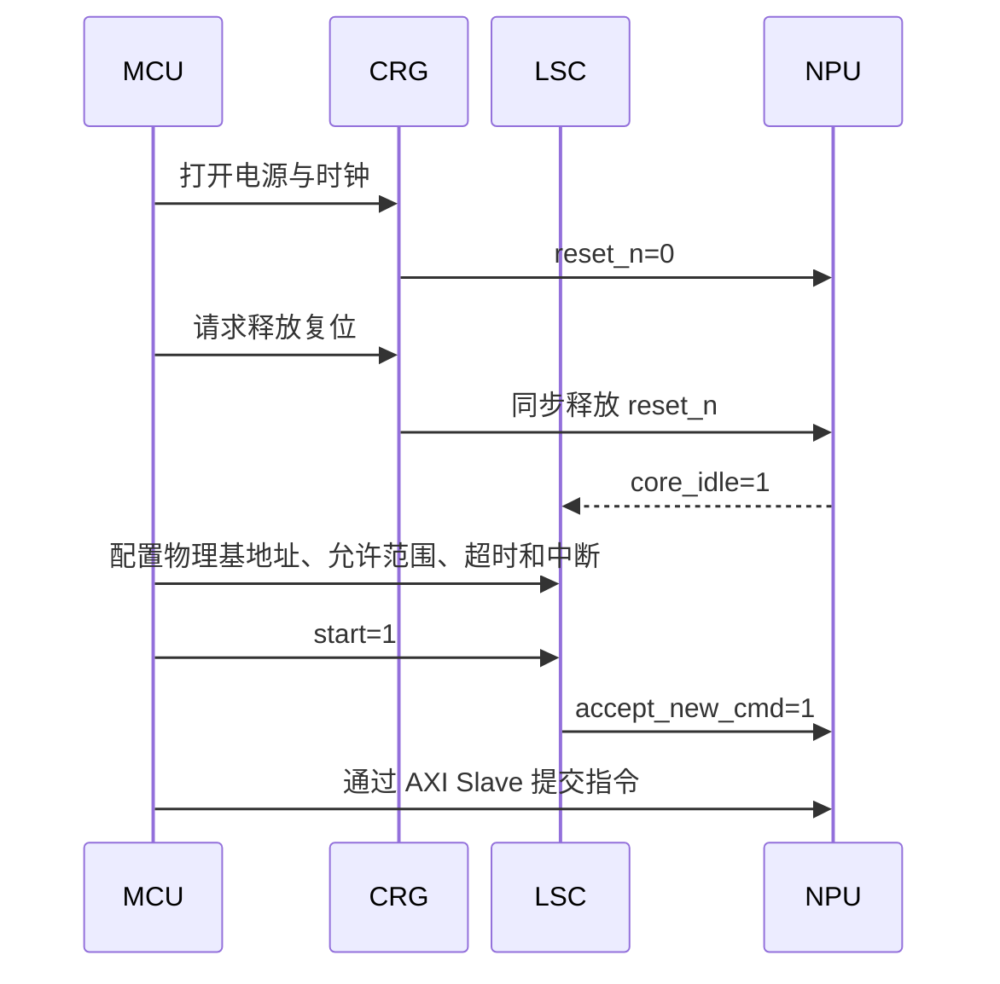
```mermaid
%%{init: {"sequence": {"useMaxWidth": true, "actorMargin": 14, "width": 82, "messageMargin": 10, "noteMargin": 6}, "themeVariables": {"fontSize": "11px"}}}%%
sequenceDiagram
    participant MCU
    participant CRG
    participant LSC
    participant NPU

    MCU->>CRG: 打开电源与时钟
    CRG->>NPU: reset_n=0
    MCU->>CRG: 请求释放复位
    CRG->>NPU: 同步释放 reset_n
    NPU-->>LSC: core_idle=1
    MCU->>LSC: 配置物理基地址、允许范围、超时和中断
    MCU->>LSC: start=1
    LSC->>NPU: accept_new_cmd=1
    MCU->>NPU: 通过 AXI Slave 提交指令
```

Generic Core 的取指和运行状态由 SoC CPU 子系统管理，不受 NPU LSC 控制。
NPU 配置完成前，LSC 的 stop 复位值为 1，`accept_new_cmd_o=0`。软件写完物理
基地址、MIF 允许范围、WDT 和中断寄存器后，可以执行寄存器读回检查，再设置 start。
事件和任务选项由模型编译器直接写入每条 128-bit 指令。

### 15.8 受控软复位时序

`soft_reset_req_i` 与 `soft_reset_done_o` 使用四阶段电平握手：请求方保持 `soft_reset_req_i=1`，直到看到 `soft_reset_done_o=1`；随后请求方撤销请求，NPU 再撤销完成信号。

受控软复位按以下次序执行：

1. LSC 清除 start、设置 stop，使 `accept_new_cmd_o=0`，状态从 `RESET_IDLE` 进入 `RESET_DRAIN`。
2. `cfe_quiesce_o`、`ts_quiesce_o` 和四位 `eng_abort_o` 立即有效。四位分别对应 DMA、Matrix、Vector、Complex 任务类别；当前顶层把它们取或后送到 TS 的 `abort_i`，不直接连接三个物理执行模块。
3. TS 丢弃命令接纳项，清除待解码快照、四组发射暂存、Control 执行快照、Event 发布暂存、完成持有槽以及 AXI 控制请求状态，并把全部非终态任务记录为 `ABORTED`。等待 ACK 的原有终态项和新形成的 `ABORTED` 项都不阻止 `scheduler_quiescent_o`。
4. 已经取得任务的执行单元继续运行到 done并回到 `task_ready_o=1`；L1BUF 和 MIF 完成各自已经接受的请求。TS 的 active 标志在对应 done 到达后清除。AXI Slave 完成当前读写事务，使 `wr_state_q`、`rd_state_q`、B valid 和 R valid回到空闲状态。
5. CFE quiesce 会阻止命令入口继续向 CFE 送 beat，TS quiesce也会阻止 CFE 队首进入任务表。LSC 的软复位等待条件不包含 `cmd_ingress_idle_i` 和 `cfe_idle_i`，所以命令入口中的 beat、CFE 中的半条或完整指令以及尚未读取的命令响应都可以保留到内部复位脉冲，再由复位清除。
6. 当 `ts_quiescent_i`、四位 `eng_quiescent_i`、`l1_idle_i`、`mif_idle_i` 和 `s_axi_idle_i` 全部为 1 时，LSC 产生一个周期的 `internal_soft_reset_pulse_o`。这里使用 `scheduler_quiescent_o`，不使用要求任务表为空的 `scheduler_idle_o`，所以不等待软件 ACK 终态表项。
7. 内部复位脉冲清除 AXI Slave 命令入口和命令响应 FIFO、CFE 半命令与完整指令 FIFO、任务表、Event Table、发射暂存以及 DMA、Matrix-Vector Engine、CME 的控制状态。LSC 同时清除 `IRQ_STATUS`、`PARAM_LOCK` 和 `L1_HOST_ACCESS_ENABLE`，并记录软件复位原因。
8. 顶层在内部复位执行完成后拉高 `internal_soft_reset_done_i`。LSC 进入 `RESET_DONE`，拉高 `soft_reset_done_o` 并保持到外部请求撤销。
9. 请求撤销后，LSC 返回 `RESET_IDLE`，撤销 abort、quiesce 和完成信号；start 仍为 0、stop 仍为 1，软件重新配置或确认状态后再启动。

> [!warning] 软复位会放弃前端待处理命令
> 软件发出软复位请求后，不能再假定已经得到 AXI `BRESP=OKAY`、但尚未读取 CFE 接收响应的命令会进入任务表。命令入口、CFE FIFO、命令响应 FIFO和等待 ACK 的终态记录都可能在内部复位时清除。软件应在请求前读取仍需保存的终态信息；请求发出后，把没有获得最终查询结果的任务视为已取消。

> [!warning] 外部 AXI 事务必须能够结束
> LSC 虽然不等待命令入口和 CFE 为空，但仍等待 `s_axi_idle_i=1`。主控必须接收已经置位的 B/R response，也不应在发出软复位请求的同时保留一项等待空命令响应 FIFO 的读事务；这类读事务可能因 CFE 已被 quiesce而得不到新数据，使复位停留在 `RESET_DRAIN`。驱动应先结束当前 MMIO 访问，再发起软复位电平握手。

复位发生时，部分目的数据可能已经写入。软件在复位后必须重新加载受影响的输入、权重 tile 和状态。内部复位清除任务表后，软件不能再用 `NPU_QUERY` 读取这些任务；查询旧 `command_id` 返回 NOT_FOUND。

受控软复位保留只读功能寄存器、五组任务物理基地址、`M_AXI_ADDR_BASE/LIMIT`、
参数区 base/limit、WDT 配置、模块时钟使能、`FAULT_*` 和已有
`RESET_REASON`；随后在 `RESET_REASON` 中设置 software bit。保留参数区地址
但清除 `PARAM_LOCK`，使软件可以重新加载参数。
外部 Core 复位使用第 15.10 节的上电复位值，不采用这组保留规则。

当前顶层在产生 `internal_soft_reset_pulse_o` 前等待 `mif_idle_i=1`，因此不会
在 MIF 仍有 AXI 请求时清除其状态。如果 SoC 使用外部 `reset_n` 突然复位 NPU，
系统集成必须同时处理仍在总线上的旧事务，不能让复位后的 NPU 把旧 R/B 返回当成
新请求的响应。

### 15.9 断电准备时序

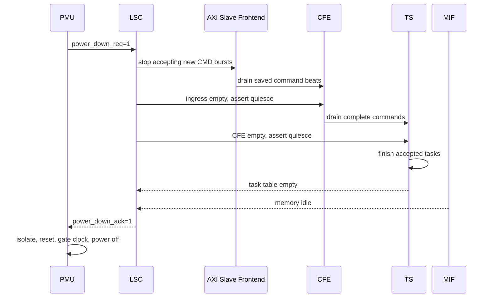
```mermaid
%%{init: {"sequence": {"useMaxWidth": true, "actorMargin": 14, "width": 82, "messageMargin": 10, "noteMargin": 6}, "themeVariables": {"fontSize": "11px"}}}%%
sequenceDiagram
    participant PMU
    participant LSC
    participant ASF as AXI Slave Frontend
    participant CFE
    participant TS
    participant MIF

    PMU->>LSC: power_down_req=1
    LSC->>ASF: stop accepting new CMD bursts
    ASF->>CFE: drain saved command beats
    LSC->>CFE: ingress empty, assert quiesce
    CFE->>TS: drain complete commands
    LSC->>TS: CFE empty, assert quiesce
    TS->>TS: finish accepted tasks
    TS-->>LSC: task table empty
    MIF-->>LSC: memory idle
    LSC-->>PMU: power_down_ack=1
    PMU->>PMU: isolate, reset, gate clock, power off
```

`power_down_req_i` 与 `power_down_ack_o` 使用四阶段电平握手。断电准备不主动终止任务，而是停止接收新 CMD，并让全部已接受任务进入终态。若软件不希望等待长任务，应先执行受控软复位。

请求有效时，LSC 使 `accept_new_cmd_o=0`，并拉高 CFE 与 TS 的 quiesce。
AXI Slave 前端仍要完成已经握手的总线请求；命令入口中尚未送完的 beat会使
`cmd_ingress_idle_i` 保持为 0，活动读写事务或未接收的 B/R response会使
`s_axi_idle_i` 保持为 0，从而阻止 `core_idle_o` 置 1。
当前 `s_axi_idle_i` 不检查命令响应 FIFO；软件在断电前仍应读完全部命令接收
结果，因为硬件的断电确认不会等待该 FIFO 变空。

LSC 只有在以下条件全部满足时才能拉高 `power_down_ack_o`：

1. 软件已经设置 stop；
2. `core_idle_o=1`，即命令入口、CFE、TS、四类任务接口、三个物理执行模块、L1BUF、MIF 和 AXI Slave 前端全部空闲；
3. `power_down_req_i=1` 仍保持有效。

PMU 看到 `power_down_ack_o=1` 后，依次执行输出隔离、内部复位置位、时钟停止和电源关闭。断电后的 L1BUF、任务表和 Event Table 内容全部无效。重新上电后必须从第 15.7 节的初始化流程开始。

PMU 撤销 `power_down_req_i` 后，LSC 立即撤销 `power_down_ack_o`，同时解除由该
请求产生的 CFE 与 TS quiesce。若请求在 ack 产生前撤销，NPU 可以继续接收和
调度任务，但仍受 start、stop 和软复位状态控制。

终态任务表项在软件 ACK 前仍使 `ts_idle_i=0`。因此正常断电前，软件必须读取需要的终态信息，并对所有已完成任务执行 `NPU_QUERY(selector=ACK)`；受控软复位可以直接清除这些记录。

### 15.10 各模块复位状态

| 模块 | 复位后的状态 |
| --- | --- |
| CFE | 低 beat 保存寄存器无效，128-bit CMD FIFO 空，`ready=0` 直到复位释放 |
| TaskScheduler | 命令接纳 valid、WAIT_EVENT 检查结果 valid 和 Control 执行快照 valid 为 0；`wait_scan_slot_q` 为 0，任务表和 Event Table 为 FREE，全部 `predecessor_mask` 为 0，发射与选择扫描候选无效，`decode_pending_valid_q=0`，四组发射暂存 valid 为 0，`completion_hold_valid_q=0`，`event_publish_pending_valid_q=0`，四类任务请求 valid 为 0 |
| DMA | `state_q=ST_IDLE`，MIF、L1 请求 valid 和 done valid 为 0；Task Context、游标、shape 乘法和数据寄存器的旧值无效 |
| Matrix-Vector Engine | Outer、Scalar 与 Vector 控制器回到 `ST_IDLE`，context active、PE/L1 owner FIFO、共享 PE valid、L1 请求 FIFO计数、内部旁路有效位、L1 请求 valid和两组 done valid均为 0；Outer 本地部分和 RAM不清零，但元数据和有效状态清零 |
| CME | 主状态为 `ST_IDLE`，数学单元状态为 `ST_IDLE`，L1 请求 valid、数学响应 valid 和 done valid 为 0；行统计与 FP32 工作寄存器在新任务中重新赋值 |
| L1BUF Controller | 请求寄存级、读等待和逐客户端响应 valid 均清零；SRAM 数据内容不保证为 0 |
| MIF | 回到 `MIF_IDLE`，AXI 各通道 valid 为 0；当前实现没有内部 tag 表 |
| LSC | 版本和功能寄存器可读，start=0，stop=1，`PARAM_LOCK=0`，中断状态清零，复位原因有效 |
| WDT | 默认关闭，计数器清零 |

L1BUF 在复位后不自动全区清零。任何任务读取一个 L1 地址前，软件必须保证已有 DMA、Matrix、IVE 或 CME 任务写入该区域。

计算模块的低有效复位用于使状态、valid 和控制记录立即失效，不要求清零宽 Task Context、地址、运算数据或 SRAM 内容。复位释放后，模块只有在接收新任务并完成对应初始化状态后才使用这些寄存器。验证环境应检查复位期间不产生 L1、MIF 或执行单元请求，并检查新任务不会读取复位前遗留的无效 payload。

---

## 16. 完整任务功能时序

### 16.1 一条任务从提交到完成

| 阶段 | 模块 | 开始条件 | 完成条件 |
| --- | --- | --- | --- |
| 1. 提交指令 | Generic Core / AXI Slave | 指令低 64 bit与高 64 bit准备完成 | 固定地址 FIXED burst 的两个 beat 被前端接收 |
| 2. CFE 排队 | CFE | 两个 beat 已组成完整指令 | 操作码和命令编号检查通过，128 bit指令进入 CFE FIFO |
| 3. TS 命令接纳 | TS / 接收检查解码器 / Event Table | CFE 队首有效、任务表存在 FREE 项且接纳寄存级为空 | 保存目标槽、检查结果、指令、五个 48 bit基地址、20 bit L1 参数区基址、事件引用和 `predecessor_mask`；暂停下一条 CFE 命令与 AXI 控制请求 |
| 4. 写入任务表 | TS / 命令接纳寄存级 | 命令接纳 valid 为 1 且 `abort_i=0` | 只使用接纳寄存值建立任务表项、分配 `submit_seq`、更新合法 signal Event并清除接纳 valid |
| 5. 等待事件与前序任务 | TS / Event Table | 合法任务进入 WAIT_EVENT | WAIT_EVENT 检查器每周期读取一个槽的两个事件引用并寄存检查结果、槽号和 `submit_seq`；下一周期复查任务身份，依赖失败时形成错误终态，依赖成功且 `predecessor_mask & task_live_mask` 为 0 时进入 READY，其余情况继续等待 |
| 6. 逐槽扫描 | TS / 扫描寄存器 | `abort_i=0` 且没有待展开快照 | 从槽 0 到槽 `TASK_SLOTS-1` 每周期检查一项；非 Control 任务必须为 READY、前序条件满足、目标执行单元没有 RUNNING 任务且对应发射暂存 valid 为 0，扫描器用一次 64-bit 比较保留 `submit_seq` 最小的候选 |
| 7. 保存窄快照 | TS | 最后一个槽完成检查且复查后的候选仍有效 | 时钟沿保存目标执行单元、任务编号、操作码、完整指令和提交时基地址；没有候选时结束本轮但不写快照 |
| 8. 共享展开 | TS / 共享发射解码器 | `decode_pending_valid_q=1` | 复查任务状态、执行单元字段和前序条件；任务失效时丢弃快照，目标执行单元暂时不可接收时保持快照，否则组合产生 2048 bit Task Context并在时钟沿写入目标发射暂存 |
| 9. 任务握手 | TS / Engine | 发射暂存置 `task_valid` | `task_valid && task_ready`，任务转为 RUNNING |
| 10. 执行与排空 | Engine / L1BUF / MIF | 执行单元取得任务 | 结果全部产生，所有相关写响应返回 |
| 11. 保存终态 | TS | 完成一次 done ready/valid 握手 | 保存状态、错误地址和进度，任务进入终态并置位 `notify` |
| 12. 发布普通 Event | TS / 共用逐槽选择寄存器 / Event Table | 终态任务带有尚未发布的普通 signal Event | 扫描轮开始时保存 Event 候选位图，每周期检查一个槽并保留最小 `submit_seq`；轮末位图未变化且获胜项复查通过时写入发布暂存，下一周期写 Event Table 并置位 `event_published` |
| 13. 装入完成持有槽 | TS / 共用逐槽选择寄存器 | 任务已经置位 `notify` | 扫描轮开始时保存完成候选位图，每周期检查一个槽并保留最小 `submit_seq`；轮末位图未变化、获胜项复查通过、完成持有槽为空且该任务 Event 已发布时，保存表项编号并置位 `completion_hold_valid_q` |
| 14. 通知与释放 | TS / LSC / 软件 | 完成持有槽有效 | 完成通知握手后清除 `notify`；软件查询后 ACK，任务表项回到 FREE |

阶段 3 保存的是接纳握手时的基地址，阶段 4 只把这些寄存值复制到任务表；两个阶段都不保存每任务一份 2048 bit展开结果。这样，已经进入命令接纳、WAIT_EVENT 或 READY 的任务不会因软件后续改写基地址寄存器而改变实际访问地址。新任务设置 ordered 时，`predecessor_mask` 记录全部仍未进入终态的较早任务；每条合法新任务记录仍未进入终态的较早 ordered 任务；GLOBAL_FENCE 还按照 `engine_mask` 记录所选执行单元中的较早任务。较早任务进入终态后，`task_live_mask` 使对应 bit 立即停止阻塞；槽经直接 ACK 或 AXI ACK 释放时，`released_slots_d` 和 `released_slots_q` 从全部保存值中删除该槽 bit，并过滤释放同拍及下一拍写入的新任务。

阶段 5 的 WAIT_EVENT 检查器在槽 `TASK_SLOTS-1` 后回到槽 0，基准 16 槽配置从事件可见到对应任务状态更新最多需要 16 个周期。阶段 6 的一轮发射扫描检查 `TASK_SLOTS` 个槽。扫描结束时没有候选，则后续周期从槽 0 开始新一轮。Control 任务不经过阶段 6～9；它在依赖与前序任务条件满足后进入 Control 候选位图，由 Control、Event 和完成共用的连续逐槽扫描器选择，轮末复查通过后先保存槽号和 `submit_seq`，下一周期再次复查并由 TS 内部完成。阶段 7 的窄快照和阶段 8 的发射解码器由四类任务共享；阶段 8 的输出写入四组独立发射暂存中的一组。某类任务接口暂停接收时，其他任务接口仍可继续运行或完成已有暂存的握手，但新的 Task Context 按最早任务次序逐项展开。

阶段 12 的 Event 发布、阶段 13 的完成通知以及 Control 执行共用一个任务槽计数器，同一周期对同一个槽并行检查三类条件；三类各自保存候选位图、变化标志和最早候选记录。某一类候选位图在扫描期间发生变化时，只取消该类本轮选择，下一轮从槽 0 重新检查。每轮最多选择一个待发布 Event 和一个待发送完成通知。完成持有槽一旦有效，在 LSC 接收前不会换成其他任务。AXI `CTL WAIT` 的周期计数不会暂停，配置的最大等待周期必须覆盖逐槽选择、候选变化后的重试、Event 发布暂存和前面候选等待所用的周期。

> [!important] 结果可见点
> 执行单元内部得到最后一个计算结果不等于任务完成。只有最后一个目的写请求收到完成响应，任务才可以进入成功终态。

### 16.2 GEMM 后接复杂激活

下面的 E0～E4 是单核 Event Table 中的事件引用：

| 命令 | 等待 | 产生 | 动作 |
| --- | --- | --- | --- |
| C0 | 无 | E0 | DMA 把输入 X 搬到 L1BUF |
| C1 | 无 | E1 | DMA 把权重 W、INT32 bias、Matrix 整数重缩放表和 CME scale 元数据搬到 L1BUF |
| C2 | E0、E1 | E2 | Matrix 执行 GEMM，输出整数张量 |
| C3 | E2 | E3 | CME 执行 GELU 或 SiLU，内部使用 FP32 |
| C4 | E3 | E4 | DMA 把整数输出写回 DDR |

C0 与 C1 可以同时执行。C2 只有在 E0、E1 都成功后才发射。若 C1 失败，C2 进入 `DEPENDENCY_FAILED`，E2 也进入失败终态；C3、C4 依次退出，不会读取无效结果。

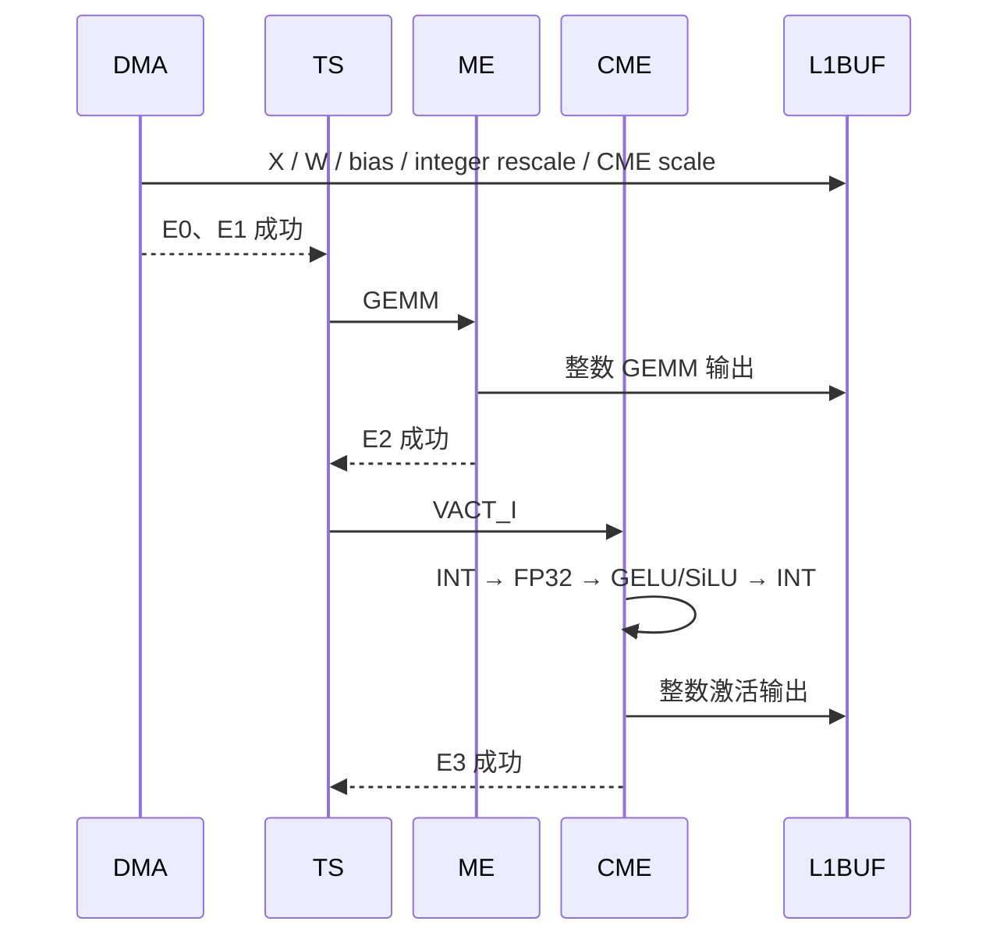
```mermaid
%%{init: {"sequence": {"useMaxWidth": true, "actorMargin": 14, "width": 82, "messageMargin": 10, "noteMargin": 6}, "themeVariables": {"fontSize": "11px"}}}%%
sequenceDiagram
    participant DMA
    participant TS
    participant ME
    participant CME
    participant L1 as L1BUF

    DMA->>L1: X / W / bias / integer rescale / CME scale
    DMA-->>TS: E0、E1 成功
    TS->>ME: GEMM
    ME->>L1: 整数 GEMM 输出
    ME-->>TS: E2 成功
    TS->>CME: VACT_I
    CME->>CME: INT → FP32 → GELU/SiLU → INT
    CME->>L1: 整数激活输出
    CME-->>TS: E3 成功
```

### 16.3 Transformer Attention

以整数 Q、K、V 为例：

1. DMA 把输入和 QKV 权重搬入 L1BUF。
2. Matrix 执行融合 QKV GEMM。
3. 三条 `DMA_COPY_ND` 分别取出 Q、K、V；需要改变维度次序时再发射 `DMA_TRANSPOSE_2D`。现有 `DMA_SPLIT` 只处理一组连续段与等距段，不能在一条任务中完成整张交错 QKV 的重新排列。
4. 若模型使用 RoPE，CME 执行 `VROPE_I`，内部把 Q/K 转为 FP32 做二维旋转，再写回整数 Q/K。
5. Matrix 执行 $QK^{\mathsf T}$，得到整数分数。
6. CME 执行缩放、mask 和 `VSOFTMAX_I`。
7. Matrix 执行整数 Softmax 权重与 V 的 BMM。
8. Matrix 执行输出投影，IVE 或 CME 完成 residual add。

`VSOFTMAX_I` 的输出 scale 必须与后续 BMM 的左输入 scale 一致。Softmax 结果通常使用 INT8；需要更细数值间隔时可以使用 INT16，并检查它与后续 BMM 输入格式和 scale 是否一致。

### 16.4 LSTM 单时间步

设输入为 $x_t\in\mathbb Z^{B\times I}$，上一步隐藏状态为 $h_{t-1}\in\mathbb Z^{B\times H}$。编译器先把二者按 Feature 方向拼成 `[B,I+H]`，Matrix 计算四门：

$$
G_t=
[x_t,h_{t-1}]W+b,
$$

其中：

$$
W\in\mathbb Z^{(I+H)\times4H},
\qquad
b\in\mathbb Z^{4H}.
$$

同一组 $4H$ 个 bias 加到全部 $B$ 行；每一行依次包含输入门、遗忘门、候选值和输出门四段，每段长度为 $H$。

内部所表示的实数公式为：

$$
i_t=\operatorname{sigmoid}(G_i),
\quad
f_t=\operatorname{sigmoid}(G_f),
\quad
g_t=\operatorname{tanh}(G_g),
\quad
o_t=\operatorname{sigmoid}(G_o),
$$

$$
c_t=f_t\odot c_{t-1}+i_t\odot g_t,
$$

$$
h_t=o_t\odot\operatorname{tanh}(c_t).
$$

硬件任务次序：

| 步骤 | 单元 | 整数与内部 FP 处理 |
| ---: | --- | --- |
| 1 | DMA / IVE | 准备 `[x_t,h_{t-1}]` |
| 2 | Matrix | INT8 或 INT16 GEMM，INT32 累加，产生四门整数仿射结果 |
| 3 | CME | 三段 Sigmoid、一段 Tanh；每段执行 INT→FP32→INT |
| 4 | IVE | 分别计算 $f_t\odot c_{t-1}$ 与 $i_t\odot g_t$ 的 INT32 乘法结果 |
| 5 | CME | 使用 `VADD_RESCALE_I` 合成 $c_t$，写成指定 INT8 或 INT32 scale |
| 6 | CME | 对 $c_t$ 执行 Tanh |
| 7 | IVE / CME | 计算 $o_t$ 与 Tanh 结果的乘法，并转换为 $h_t$ scale |
| 8 | L1BUF | 将 $h_t,c_t$ 写入下一状态槽 |

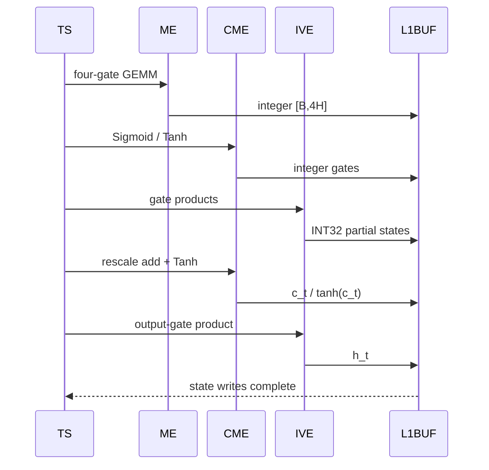
```mermaid
%%{init: {"sequence": {"useMaxWidth": true, "actorMargin": 14, "width": 82, "messageMargin": 10, "noteMargin": 6}, "themeVariables": {"fontSize": "11px"}}}%%
sequenceDiagram
    participant TS
    participant ME
    participant CME
    participant IVE
    participant L1 as L1BUF

    TS->>ME: four-gate GEMM
    ME->>L1: integer [B,4H]
    TS->>CME: Sigmoid / Tanh
    CME->>L1: integer gates
    TS->>IVE: gate products
    IVE->>L1: INT32 partial states
    TS->>CME: rescale add + Tanh
    CME->>L1: c_t / tanh(c_t)
    TS->>IVE: output-gate product
    IVE->>L1: h_t
    L1-->>TS: state writes complete
```

时间步 $t+1$ 只能在 $h_t$ 和 $c_t$ 的最后一个写响应返回后开始。为减少等待，DMA 可以提前把 $x_{t+1}$ 和下一组权重 tile 搬到另一组 L1BUF 区域，但不得覆盖当前时间步仍在读取的数据。

### 16.5 GRU 与普通 RNN

GRU 保存一个 $h_t$ 状态。设输入 $x_t\in\mathbb Z^{B\times I}$，上一步隐藏状态 $h_{t-1}\in\mathbb Z^{B\times H}$。$B$ 是 Batch Size，$I$ 是输入 Feature 数，$H$ 是隐藏 Feature 数。

P0 支持常见的 reset-after 次序：

$$
r_t=
\operatorname{sigmoid}
\left(
x_tW_{ir}+b_{ir}
+h_{t-1}W_{hr}+b_{hr}
\right),
$$

$$
z_t=
\operatorname{sigmoid}
\left(
x_tW_{iz}+b_{iz}
+h_{t-1}W_{hz}+b_{hz}
\right),
$$

$$
n_t=
\operatorname{tanh}
\left(
x_tW_{in}+b_{in}
+r_t\odot
\left(h_{t-1}W_{hn}+b_{hn}\right)
\right),
$$

$$
h_t=(1-z_t)\odot n_t+z_t\odot h_{t-1}.
$$

$r_t$ 是 reset gate，$z_t$ 是 update gate，$n_t$ 是候选隐藏状态，$\odot$ 表示相同位置元素相乘。输入权重可以拼成：

$$
W_i=[W_{ir},W_{iz},W_{in}]
\in\mathbb Z^{I\times3H},
$$

状态权重可以拼成：

$$
W_h=[W_{hr},W_{hz},W_{hn}]
\in\mathbb Z^{H\times3H}.
$$

输入侧 bias $b_i=[b_{ir},b_{iz},b_{in}]$ 和状态侧 bias $b_h=[b_{hr},b_{hz},b_{hn}]$ 的 shape 都是 `[3H]`。Matrix 读取每组 bias 时，三个长度为 $H$ 的片段分别加到三段输出；同一组 `[3H]` bias 对全部 $B$ 行重复使用。

PyTorch 的两组 GRU bias 可以分别保留为上述 $b_i,b_h$。Keras `reset_after=True` 常把两组 bias 保存为逻辑 shape `[2,3H]`，编译器拆成两个连续 `[3H]` 数组。门的实际存储次序可能是 R/Z/N 或 Z/R/N，编译器必须按模型框架的定义整理成生成指令和权重数组时使用的次序。

若模型使用 reset-before 公式：

$$
n_t=
\operatorname{tanh}
\left(
x_tW_{in}+b_{in}
+(r_t\odot h_{t-1})W_{hn}+b_{hn}
\right),
$$

编译器先由 IVE 计算 $r_t\odot h_{t-1}$，再发射候选状态的 Matrix 任务。两种次序不能只靠交换参数得到相同结果，必须生成不同任务序列。

GRU 单时间步的硬件任务如下：

| 步骤 | 单元 | 动作 |
| ---: | --- | --- |
| 1 | Matrix | 计算输入侧 `[B,I]×[I,3H]`，加 `[3H]` INT32 bias |
| 2 | Matrix | 计算状态侧 `[B,H]×[H,3H]`，加 `[3H]` INT32 bias |
| 3 | CME | 对 reset/update 两段执行不同 scale 加法与 Sigmoid |
| 4 | IVE / CME | 按 reset-after 或 reset-before 次序计算候选状态输入 |
| 5 | CME | 对候选状态执行 Tanh |
| 6 | IVE | 计算 $(1-z_t)\odot n_t$ 和 $z_t\odot h_{t-1}$ 的 INT32 乘积 |
| 7 | CME | 用 `VADD_RESCALE_I` 合成并转换为 $h_t$ 的整数 scale |
| 8 | L1BUF | 最后一个 $h_t$ 写响应返回后，允许时间步 $t+1$ 开始 |

单核 Matrix 子系统具有两个任务 context，步骤 1 和步骤 2 可以同时处于活动状态。两项 GEMM 共用 PE 和 L1 端口：一个任务进行地址准备、L1 读取或写回时，另一个任务可以推进其他阶段；两项同周期申请同一资源时由轮转逻辑选择。

普通 RNN 每个时间步执行：

$$
h_t=
\phi
\left(
x_tW_x+h_{t-1}W_h+b
\right),
$$

其中：

$$
W_x\in\mathbb Z^{I\times H},
\qquad
W_h\in\mathbb Z^{H\times H},
\qquad
b\in\mathbb Z^H.
$$

同一组 $H$ 个 bias 加到全部 $B$ 行；第 $j$ 个 bias 只加到每行第 $j$ 个隐藏 Feature。$\phi$ 为 Tanh 或 ReLU。Matrix 分别计算输入项和状态项；相同 scale 时由 IVE 相加，不同 scale 时由 CME `VADD_RESCALE_I` 相加。Tanh 由 CME 执行 `INT→FP32→INT`；ReLU 可由 IVE 直接执行整数比较和选择。

### 16.6 错误传播时序

```mermaid
%%{init: {"sequence": {"useMaxWidth": true, "actorMargin": 14, "width": 82, "messageMargin": 10, "noteMargin": 6}, "themeVariables": {"fontSize": "11px"}}}%%
sequenceDiagram
    participant E0 as Producer
    participant TS
    participant E1 as Consumer
    participant LSC

    E0-->>TS: done = ADDR_FAULT
    TS->>TS: E0 event = ERROR
    TS->>TS: Consumer = DEPENDENCY_FAILED
    TS->>TS: Consumer signal event = ERROR
    TS->>LSC: 保存首个错误命令和地址
    LSC-->>LSC: irq_error=1
    Note over E1,TS: Consumer 不读取输入，也不发给执行单元
```

发生执行错误后：

1. 执行单元停止产生新请求；
2. 已发出的 AXI 和 L1BUF 请求必须排空；
3. 若已经写入部分目的数据，软件根据非成功 status 和 progress 把整个目的张量视为无效；
4. 目的张量整体视为无效；
5. 依赖任务进入失败终态并继续传播；
6. 事件等待者不能永久停住。

AXI Slave 协议错误、MIF 错误和 CFE 错误由顶层按固定次序合成
`interface_error_*`，再送入 LSC。LSC 设置 `IRQ_STATUS.ERROR`，并在首错寄存器
为空时保存 status 与 48-bit 地址。接口错误没有任务身份，因此 `FAULT_CMD`
固定记录 `0xFFF`。软件读取 `FAULT_*` 后写 `FAULT_CLEAR`，LSC 产生
`interface_error_clear_o`，清除 AXI Slave 前端和 MIF 保存的错误状态。

---

## 17. 存储顺序与张量布局

### 17.1 字节顺序

所有多字节整数和 FP32 元数据使用 little-endian。对 64-bit 总线：

- `data[7:0]` 对应最低字节地址；
- `data[63:56]` 对应最高字节地址；
- `strb[i]` 控制 `data[8i+7:8i]`。

### 17.2 二维行优先张量

对 INT8、INT16 或 INT32 的 `[R,C]`：

$$
\operatorname{addr}(r,c)
=
\operatorname{base}
+r\cdot\operatorname{row\_stride}
+c\cdot\operatorname{elem\_bytes}.
$$

其中 `elem_bytes` 对 INT8、INT16、INT32 分别为 1、2、4。`row_stride` 以字节为单位，可以等于一行的连续字节数，也可以包含行末填充。

### 17.3 GEMM 输入、Kernel 与输出

逻辑 shape：

| 对象 | 逻辑 shape | 连续方向 |
| --- | --- | --- |
| 输入 A | `[M,K]` | K |
| Kernel B | `[K,N]` | N 或硬件规定的 `KT×NT` tile 内层 |
| 输出 C | `[M,N]` | N |
| Bias | `[N]` | N |

Kernel 在 DDR 中可以先保存为普通 `[K,N]` 行优先格式。编译器或离线工具根据 `b_pack_format` 把它整理成 Matrix tile 格式，再由 DMA 原样搬入 L1BUF。Matrix 不在运行时猜测 Kernel 的排列。

> [!note] Bias 加到哪些位置
> Bias 只有 $N$ 个元素。$b_n$ 加到输出第 $n$ 列的全部 $M$ 行，即 $C_{0,n}$ 到 $C_{M-1,n}$。它不会加到其他输出列。BMM 指令不读取 bias；需要 bias 时，编译器在 BMM 后安排 Vector 或 CME 任务。

> [!note] Matrix 内部参数表
> 标量 Matrix 模块的直接 Task Context 测试可以提供形状为 `[1]` 或 `[N]` 的整数参数表，每项含 INT32 multiplier 和 signed 8-bit shift。公开指令没有该参数表的地址字段，只能使用乘数 1 和 0～31 的右移位数。

### 17.4 Transformer 布局

P0 接受以下两种逻辑布局：

| 名称 | shape | 最内层连续维度 |
| --- | --- | --- |
| BSH | `[Batch,Sequence,Hidden]` | Hidden |
| BHSD | `[Batch,Head,Sequence,HeadFeature]` | HeadFeature |

QKV 融合 GEMM 输出 BSH `[B,S,3H]`。由于 Q、K、V 在每个 token 的最后一维中交错成三段，P0 使用三条 `DMA_COPY_ND` 分别生成 `[B,S,H]` 的 Q、K、V；需要改变维度次序时再使用 `DMA_TRANSPOSE_2D` 整理为 `[B,h,S,D]`。其中 $H=hD$。`DMA_SPLIT` 只适用于第 9.4 节定义的“连续源段写到等距目的位置”，不能用一个目的基地址表示三个独立输出张量。

所有 stride 都由指令字段展开到片上 Task Context。硬件不假设 Batch Size、
序列长度或 Head 数为固定值。

### 17.5 循环层布局

| 对象 | shape | 说明 |
| --- | --- | --- |
| 时间步输入 | `[B,I]` | I 连续 |
| 隐藏状态 | `[B,H]` | H 连续 |
| LSTM 记忆状态 | `[B,H]` | H 连续 |
| LSTM 四门结果 | `[B,4H]` | 四段连续，每段 H |
| GRU 三门结果 | `[B,3H]` | 三段连续，每段 H |

LSTM/GRU 状态使用两个 L1BUF 区域轮换：

```text
time t:     read state_A, write state_B
time t + 1: read state_B, write state_A
```

事件必须保证写入完成后再交换两个区域的用途。

### 17.6 Scale 与函数参数区

FP32 scale、$\epsilon$ 和函数系数是 CME 的只读元数据，不是模型张量。公开 Matrix 指令直接携带 0～31 的右移位数，不从 L1BUF 读取整数参数表。CME 参数区要求：

- 起始地址至少 4B 对齐；
- CME 每 Feature scale 表的 shape 为 `[length]`；
- Norm 的 $\gamma,\beta$ 是 INT8、INT16 或 INT32 模型参数，各自具有 scale；
- 参数区在所有读取它的任务进入终态前不得修改；
- DMA 可以搬运参数区的原始字节，但不得把 FP32 选作模型张量 dtype。

DMA 搬运 FP32 元数据表时使用“raw 32-bit copy”模式，数据通路按 INT32 宽度原样复制位模式，不执行整数算术或 scale 处理。

当前 RTL 可以保存 `PARAM_L1_BASE`、`PARAM_L1_LIMIT` 和 `PARAM_LOCK`，但这些
输出尚未连接到执行单元或 L1BUF 写检查。软件应按以下方式自行避免参数被覆盖：

1. 设置参数区地址并用 DMA 写入所需元数据；
2. 等待 DMA 完成；
3. 在所有读取参数的任务结束前，不向该地址范围提交任何写任务；
4. 用事件约束参数装载与使用任务的先后次序。

硬件强制写保护属于后续功能。接入后可以让软件在装载完成后设置
`PARAM_LOCK=1`，并由 L1BUF 对相交的写请求返回错误；当前 RTL 不能保证这一行为。

`PARAM_L1_LIMIT` 是末地址的下一个字节，因此参数区为：

$$
[\operatorname{PARAM\_L1\_BASE},\operatorname{PARAM\_L1\_LIMIT}).
$$

`PARAM_L1_BASE=PARAM_L1_LIMIT` 表示记录的参数区为空；设置 `PARAM_LOCK=1`
在 LSC 寄存器层仍合法。

---

## 18. 软件与硬件分工

| 工作 | 编译器 / Runtime / 固件 | NPU 硬件 |
| --- | --- | --- |
| 模型解析 | 读取模型并生成整数张量、scale 和 zero point | 不解析模型文件 |
| 指令选择 | 选择 P0/P1 opcode，把完整 opcode、事件和选项写入 128-bit CMD | 检查两个 beat、保存完整 CMD 并执行任务 |
| tile 选择 | 读取功能寄存器，选择 Matrix 和 Vector tile | 按指令展开得到的 Task Context执行 |
| Kernel 整理 | 生成指定 `pack_format` | 按该格式读取 |
| L1BUF 分配 | 为输入、权重、临时值和输出分配不冲突区域；连续 Vector MUL 的 src0、src1、dst 两两不相交 | 按 LADDR 访问；当前 IVE 不检查快速 MUL 的三组区域是否相交 |
| Scale 管理 | 为 CME 生成 FP32 元数据；为 Matrix 选择乘数 1、0～31 右移可表示的张量 scale，其他情况安排 Vector/CME 任务 | CME 执行 I2F/F2I；Matrix 执行整数右移、最近偶数舍入和裁剪 |
| 激活函数 | 选择函数和输入输出 scale | CME 执行 INT→FP32→INT |
| Softmax / Norm | 生成行数、行长度、mask 和参数 | CME 多遍读取并写整数输出 |
| 任务依赖 | 为生产者和消费者分配事件，把引用直接写入 CMD | Event Table 检查成功或失败终态 |
| Matrix 执行 | 安排 GEMM、GEMM_ACCUM、GEMM_ACCUM_HOLD 和清零任务的次序与 L1 区域 | 完整 16×16 Outer GEMM使用独立 PE 阵列；本地部分和序列与不规则形状使用 Scalar 的共享 MAC PE，普通 GEMM可在条件满足时轮转选择 Outer 或 Scalar |
| 系统内存地址配置 | Python 编译器只分配存储区编号和 24-bit 区内偏移；C 工程在构建模型程序时给出各存储区物理基址和允许访问范围，驱动写入 LSC | 用提交时保存的基址加区内偏移形成物理地址；MIF 检查范围并发起 AXI 访问 |
| 错误处理 | 读取错误状态，决定重试、复位或停止 | 停止新请求、排空并报告 |

> [!important] 软件地址要求
> Python 编译器不得决定 SoC 物理基址。它只把 `base_select` 和 24-bit `byte_offset` 写入指令，并在清单中给出各存储区的已用字节数。生成的 C 头文件允许模型工程通过内存配置头或编译宏给出 `INPUT_BASE`、`WEIGHT_BASE`、`WORK_BASE`、`OUTPUT_BASE`、`KV_BASE`、`M_AXI_ADDR_BASE` 和 `M_AXI_ADDR_LIMIT`。这些值在编译 C 程序时确定。驱动必须检查 8B 对齐、40-bit 地址范围、区间容量和允许访问范围，再写入 LSC；不得把 CPU 普通指针值直接写入 NPU 地址寄存器。

### 18.1 上层模型编译器与低层汇编器

软件工具分为两个独立的阶段，即编译和汇编：

| 阶段 | 参考程序 | 输入 | 主要工作 |
| --- | --- | --- | --- |
| 上层编译 | `/home/etc/FPGA/Transformer_NPU/compiler/npu_model_compiler.py` | Keras、PyTorch、TFLite、ONNX 或高层 JSON | 前端导入、图检查、稳定拓扑排序、shape 推导、常量处理、算子拆分、张量布局、存储分配、任务依赖生成和 C 包生成 |
| 低层汇编 | `/home/etc/FPGA/Transformer_NPU/compiler/npu_assembler.py` | 规范化低层 JSON IR | 指令字段检查、事件字段检查、128-bit 指令编码、命令镜像和摘要生成 |

高层模型图只描述下列内容：

- 模型名称、输入、输出和常量；
- 张量名称、逻辑 shape 和整数 dtype；
- 常量数值或常量文件；
- `MatMul`、`Add`、`Softmax`、`LayerNorm`、`GELU`、`Reshape`、
  `Transpose`、`Concat`、`MultiHeadAttention` 和 `Conv2D` 等模型层级算子；
- 头数、轴、$\epsilon$、stride、dilation 和 padding 等算子属性。

高层模型图不得填写 L1/DDR 地址、`command_id`、Event ID、执行单元、硬件
opcode、burst 参数、字节步长或显式 DMA/PACK/SPLIT。`MT/KT/NT`、L1 容量
及 DDR 可用范围属于目标配置，由命令行或单独的目标文件提供，不属于模型计算
定义。Keras、PyTorch、TFLite 和 ONNX 前端先把框架张量和节点转换成同一种
高层图，再进入后续步骤；前端遇到尚未支持的层、动态 shape 或属性组合时必须
明确报错，不能猜测执行方式。

上层编译阶段依次完成：

1. 检查重复名称、未知张量、重复生产者和不支持的算子；
2. 从节点输入输出关系建立有向图，执行稳定拓扑排序并拒绝有环图；
3. 推导所有中间张量的 shape 和 dtype，检查矩阵维度、轴、排列、广播方式及
   Reshape 元素数；
4. 把复合算子拆成 Matrix、Vector、Complex 和 DMA 任务；
5. 把普通行主序权重整理成 Matrix 单元要求的 tile 存储形式；
6. 依据张量使用区间分配 L1 地址，并在 input、weight、work、output、kv 五类系统存储区内分别分配 24-bit 字节偏移，保证同时有效的数据区域不会互相覆盖；若 Vector MUL 可能进入连续快速分支，还要强制 src0、src1 和 INT32 dst 三组区域两两不相交；
7. 自动加入输入 DDR→L1、常量 DDR→L1 和输出 L1→DDR 任务；
8. 根据实际数据关系生成任务依赖；三个以上前置任务使用 `EVENT_JOIN` 树，
   不能简单地把互不相关的分支全部串行化；
9. 在内存中生成低层 JSON IR并调用低层汇编器；
10. 默认生成 C 头文件、C 源文件和清单；使用 `--emit-raw` 时再输出低层 JSON IR、命令镜像、常量镜像和运行元数据；
11. `--check` 在内存中重新执行全部阶段并逐字节比较已有文件，不改写文件。

`MultiHeadAttention` 在高层图中是一个节点。编译器负责生成 Q/K/V 投影、
按 Head 整理数据、K 转置、$QK^T$、Softmax、注意力乘 V、Head 合并和输出
投影。模型作者不应手工填写这些任务的地址、事件或 DMA 参数。

本版本没有卷积执行单元，也没有卷积 opcode。高层 `Conv2D` 采用
`im2col + GEMM`：

1. 输入采用 NHWC，kernel 采用 $[KH,KW,C_{in},C_{out}]$；
2. 根据 stride、dilation 和 padding 推导输出高、宽；
3. 需要补零时先用 DMA FILL 建立补零输入；
4. 对每个 kernel 位置生成规则的 DMA COPY_ND，把输入窗口写入
   $[N H_o W_o,\;KH KW C_{in}]$ 的 `im2col` 张量；
5. 编译期把 kernel 整理成
   $[KH KW C_{in},\;C_{out}]$ 的 Matrix B tile 格式；
6. Matrix GEMM 产生按 NHWC 线性次序保存的输出。

首版 `Conv2D` 只接受 `groups=1`。不支持的 groups、dtype、padding 组合或
内存需求必须在编译期报错，不能生成不存在的硬件指令。

默认编译结果直接面向 C 工程：

| 文件 | 内容 | 使用方 |
| --- | --- | --- |
| `<model>_model.h` | C 类型、数组声明、模型配置、存储区编号与大小、可由模型工程覆盖的物理基址宏 | 固件、Runtime、C 测试 |
| `<model>_model.c` | 128-bit 指令数组、权重与常量数组、存储区编号加区内偏移、提交批次和由 C 宏形成的设备地址配置 | 固件、Runtime、C 测试 |
| `<model>.manifest.json` | 输入摘要、高层算子、低层任务、提交批次、目标信息和文件摘要 | 构建工具、测试程序 |

使用 `--emit-raw` 时额外生成：

| 文件 | 内容 | 使用方 |
| --- | --- | --- |
| `<model>.npuasm.json` | 自动生成的低层 JSON IR，可单独交给汇编器复查 | 汇编器、调试工具 |
| `<model>.cmd.bin` | 连续的 128-bit 指令，每项 16B，低 64 bit在前 | 调试工具、二进制装载程序 |
| `<model>.const.bin` | 已按设备存储形式整理的权重和常量 | 调试工具、二进制装载程序 |
| `<model>.runtime.json` | 输入输出信息、常量地址、提交批次和内存计划 | Runtime、测试程序 |

当前指令已经包含执行参数，编译器不生成 `.desc.bin`，生成的 C 包也没有外部
任务参数数组。上层编译器在内存中调用低层汇编器；用
`--emit-raw` 保存低层 JSON IR后，再单独调用 `npu_assembler.py`，所得命令
镜像必须与 C 包中的指令数组逐字节一致。C 程序应从生成配置读取命令数、任务
编号、存储区编号、区内偏移、输入输出大小、权重位置和提交批次，不允许再次手工排列权重或填写内部张量地址。若系统内存位置发生变化，只需用新的 C 内存配置重新构建模型程序，不应重新运行 Python 编译器。

### 18.2 C 驱动的职责和文件划分要求

C 驱动使用 C11，并且不依赖某一种操作系统。公共头文件只公开稳定类型和函数；
寄存器访问、指令提交、运行控制和缓存同步分别放在独立源文件中。仅供驱动内部
共享的检查函数放在私有头文件，应用程序不得包含该私有头文件。

参考驱动位于 `/home/etc/FPGA/Transformer_NPU/driver`，内部按下表拆分：

| 文件 | 主要职责 | 不应承担的工作 |
| --- | --- | --- |
| `npu_driver_device.c` | 初始化平台回调、配置寄存器、启动、停止、中断和故障处理 | 不生成模型算子 |
| `npu_driver_command.c` | payload 与 128-bit 指令编解码、FIXED burst 提交和 CFE 响应检查 | 不读取模型权重 |
| `npu_driver_runtime.c` | WAIT、QUERY、FENCE、轮询终态和 ACK | 不修改权重或输入 |
| `npu_driver_memory.c` | 权重、输入和输出的缓存同步与内存屏障 | 不解释算子功能 |
| `npu_driver_internal.h` | 仅供上述源文件共享的私有定义 | 不允许应用程序包含 |
| `npu_driver.h` | 公共函数、类型、寄存器、操作码和指令字段 | 不包含私有头文件 |

公共 API 需要保持平台无关。Linux 用户态、内核驱动、裸机固件和 C model
测试后端都通过 `npu_drv_platform_ops_t` 提供实际访问函数。平台回调返回错误
时，驱动应停止当前调用并把错误返回给上层，不能继续发送剩余 beat。

驱动回归至少使用 GCC 和 Clang，并分别启用 ASan 与 UBSan。测试需要覆盖四种
整数 dtype、Matrix payload 配置、指令编解码、FIXED burst、MMIO、
QUERY/WAIT/ACK/FENCE 和缓存维护。公共头中的函数声明必须与静态库导出的公共
定义一致，且不能存在重复定义。

### 18.3 从编译结果到任务完成的软件时序

一组模型任务的推荐软件次序如下：

1. 读取清单并核对生成的 C 源文件、指令、权重和参数摘要；
2. 按生成配置分配设备内存，把模型输入、权重和参数放到指定地址；
3. 对非一致缓存执行 `cache_clean`，再执行设备写屏障；
4. 对第 $i$ 条命令读取 `cmd[16i:16i+15]`；
5. 通过 `submit_beat(low,first=1,last=0)` 发送低 word；
6. 通过 `submit_beat(high,first=0,last=1)` 发送高 word；
7. 读取 CFE 接收响应；只有 `ACCEPTED` 才能处理下一条命令；
8. 使用 QUERY、WAIT 或中断等待任务终态；
9. 对输出执行 `cache_invalidate`，再由 CPU 读取；
10. 保存任务状态后执行 ACK，释放任务表项和 `command_id`。

一条 128-bit 指令的两个 beat 不能与另一条指令交错。若低 word 已经发送，而高
word 因平台错误无法发送，平台需要按第 7.4 节等待 CFE 超时或执行受控复位，
不能直接把下一条 CMD 的低 word 当作当前命令的高 word。

### 18.4 Transformer 端到端部署参考

可执行参考程序位于 `/home/etc/FPGA/Transformer_NPU/cmodel/examples/transformer`。`build_model.py` 在
`tf_2_18` 环境训练一个英文房间设备命令分类模型并保存 `.keras` 文件。模型
输入固定容纳 8 个 token，每个 token 有 32 个特征；网络含两个 Transformer
Encoder，每个 Encoder 使用 4 个注意力 head、宽度 32、前馈层宽度 48，末尾
用 4 个线性分数区分开灯、关灯、开风扇和关风扇。测试使用 INT8 Q5 张量，
Complex Engine 在 Softmax、LayerNorm 和 GELU 内部执行 INT→FP32→INT。

编译器从 `.keras` 导入 2 个 `MultiHeadAttention`、4 个 `LayerNorm`、5 个
`MatMul`、10 个 `Add`、2 个 `GELU` 和 10 个 `Reshape` 高层算子，并拆成
GEMM、BMM、Softmax、Norm、激活、逐元素加法、PACK、SPLIT、转置、复制、
`EVENT_JOIN` 和 `EVENT_REARM`。当前固定生成物每条语句含 366 条指令和 48 个
提交批次，每批最多 8 条指令。

C 测试程序包含编译器生成的 `keras_transformer_model.h/.c`。指令数组、权重、
输入输出地址、任务组和同步标志都来自生成配置。每个要求主机同步的提交组按
以下次序运行：

```text
提交全部指令
    → wait 每个 command_id
    → query 状态与进度
    → ACK 释放任务项
```

测试保留第一 Encoder、第二 Encoder 和最终分类分数三个输出，便于定位数值差异。
24 条留出语句的固定结果为 Keras 24/24 分类正确、CModel 24/24 分类正确，二者
类别选择 24/24 相同。输出没有顶在 INT8 两端值；runner 还检查每个探针的最大
误差、平均绝对误差、均方误差、数值范围、标准差和不同整数值数量。

运行命令如下：

```bash
cd "/home/etc/FPGA/Transformer_NPU/cmodel/examples/transformer"
make clean
make test
make regress
```

`make model` 只完成训练与 Keras 文件导出，`make compile` 生成 C 模型包和
manifest，`make check` 重新运行编译并比较文件摘要，`make test` 运行 24 条
留出语句，`make regress` 依次使用 GCC、Clang 和 Sanitizer。

### 18.5 大参数 Transformer 端到端测试

大参数测试位于 `/home/etc/FPGA/Transformer_NPU/cmodel/examples/large_transformer`。模型输入为 `[1,4,64]`，包含一个 Transformer Encoder、4 个注意力 head、每个 head 宽度 16、FFN 宽度 1664，并为每个 token 输出 16 个词表分数。模型含 230672 个参数，估算执行 923648 次 MAC。输入、权重、中间结果与输出使用 INT8 Q5，矩阵部分和使用 INT32，LayerNorm、Softmax 和 GELU 中的复杂函数按 INT8→FP32→INT8 处理。

主要矩阵如下，其中 \(C_{M\times N}=A_{M\times K}B_{K\times N}\)：

| 计算 | 实例数 | M | N | K |
| --- | ---: | ---: | ---: | ---: |
| Q、K、V、注意力输出投影 | 4 | 4 | 64 | 64 |
| 每个 head 的注意力分数 | 4 | 4 | 4 | 16 |
| 每个 head 的注意力乘 V | 4 | 4 | 16 | 4 |
| FFN 扩展 | 1 | 4 | 1664 | 64 |
| FFN 压回 | 1 | 4 | 64 | 1664 |
| 词表投影 | 1 | 4 | 16 | 64 |

FFN 扩展的 N 轴分为 26 块，FFN 压回的 K 轴分为 26 块。K 分块先产生 INT32 部分和，全部 K 块完成后再写回 INT8 Q5 结果。底层 B 数据继续使用 `MT=8、KT=16、NT=8` 的硬件存储排列。该用例同时检查 N 分块、K 分块、部分和累加、结果重缩放、大权重数组和接近 10-bit命令编号容量的程序。

固定编译结果包含 1003 条指令、126 个提交组和 230976 字节权重。模型参数数目为 230672，而生成权重数组多出 304 字节，是因为部分矩阵需要按 `KT=16、NT=8` 补齐末尾 tile，并按 8B 地址要求放置；这些填充值不属于可训练参数。CModel 执行 213881 个周期。编码器探针含 256 个 INT8 元素，其中 93 个元素与 Keras 参考完全相同，全部元素误差不超过 3 LSB，平均绝对误差为 0.86328125 LSB；词表输出含 64 个 INT8 元素，其中 24 个元素完全相同，全部元素误差不超过 2 LSB，平均绝对误差为 0.765625 LSB。两个输出均未出现 `-128` 或 `127`。

RTL/Verilator 测试使用 1 MiB L1BUF 和 2 MiB 系统内存，按 126 个提交组执行全部 1003 条指令。测试输入、指令、权重、编码器输出和词表输出都带有 FNV-1a 摘要；加载前还检查命令编号连续、批次总数、opcode、8B 对齐、各系统存储区域互不重叠以及地址容量。RTL 对 256 字节编码器探针和 64 字节词表输出逐字节比较，不以少数采样点代替完整输出。

当前 RTL 结果为 21181577 个周期、231232 次 AXI Master 读传输和 320 次写传输。全部 320 个输出字节与 CModel 完全相同；编码器输出摘要为 `212a0c90fedc1667`，词表输出摘要为 `51497d8a773dcb50`。测试结束标志为 `TB_LARGE_TRANSFORMER_E2E_PASS`。

> [!note] 两种周期数不能直接比较
> CModel 的 213881 个周期来自软件模型内部的任务与存储计数，主要用于同一软件模型前后版本的比较；RTL 的 21181577 个周期来自逐时钟 Verilator 仿真，包含 TaskScheduler 逐槽检查、L1 请求与响应、标量 Matrix 的逐元素乘加、AXI 传输和提交组之间的软件控制等待。两者对输出数据的要求相同，但计数层次不同，因此不能用二者相除得到硬件加速比。

运行命令如下：

```bash
cd /home/etc/FPGA/Transformer_NPU/cmodel/examples/large_transformer
make clean
make test

cd /home/etc/FPGA/Transformer_NPU/rtl
make large-transformer-e2e
```

> [!important] 通过条件
> CModel 测试必须同时满足完整输出误差、非零元素数、不同整数值数量、输出能量和无两端饱和值要求。RTL 测试必须接收全部 1003 条指令、执行全部 126 个提交组、完成 231232 次 AXI 读与 320 次 AXI 写，并确认 320 个输出字节及两个摘要与 CModel 一致。只有终端出现 `LARGE_TRANSFORMER_E2E_PASS` 和 `TB_LARGE_TRANSFORMER_E2E_PASS`，才表示软件参考与 RTL 两级测试全部通过。

---

## 19. 验证与验收要求

### 19.1 模块接口检查

每个 ready/valid 接口至少检查：

1. `valid=1,ready=0` 时 payload 保持不变；
2. 对带 `first`、`last` 的多拍接口检查标志次序；CMD 的低、高两个 beat 都必须检查；
3. 若接口带 tag，旧请求完成前不得重复使用；
4. 若接口带 tag，返回 tag 必须对应仍在途的请求；
5. 写完成前不产生任务成功；
6. 复位期间不发新 AXI 或 L1BUF 请求；
7. `core_idle_o` 必须等于第 15.2.1 节给出的输入组合；命令响应 FIFO不在当前 `s_axi_idle_i` 中，验证不能额外假定 `core_idle_o=1` 就表示该 FIFO 为空；
8. AXI Slave 对齐的 1B、2B、4B、8B CSR 与 Debug / Performance 单 beat访问分别检查地址 lane、读数据掩码和写 strobe；读写状态分别保存但必须互相限制，同时到达的 AW 与 AR 由 AW 先接受；
9. 改变 `AWCACHE/ARCACHE`、`AWPROT/ARPROT` 和 `AWQOS/ARQOS` 不得改变当前返回；`AWLOCK/ARLOCK=1` 必须使格式检查失败。

### 19.2 指令字段与内联解码测试

每种 opcode 至少覆盖：

- 6-bit软件操作码与内部 engine、8-bit执行单元 opcode 的解码关系；
- 软件操作码 33、34 分别展开为 Matrix 内部操作码 `0x44`、`0x45`，并分别执行 `GEMM_ZERO_LOCAL`、`GEMM_ACCUM_HOLD`；35～63 必须返回 `ILLEGAL_OPCODE`；
- `opcode[5:0]`、`command_id[9:0]`、三个 Event ID、任务选项、dtype 和 80-bit payload 的位段位置；
- 三个事件字段、四个 1-bit任务选项、超时类别和 dtype；
- CMD 低、高两拍的 `first/last` 次序、独立暂停和数据保持；
- 只收到低 beat 时的 32 周期超时、错误第二拍和复位清除；
- CFE 队首必须来自 128-bit `output_cmd_q`；TS 暂停时队首保持，FIFO 满且队首同拍出队时允许后续命令进入，单项 FIFO 同拍入出时不得重复或丢失；
- CFE 响应暂停时，status、`command_id` 和 `fifo_free_entries` 保持不变；`FIFO_DEPTH=8` 时最多保存 8 条完整指令，队首寄存副本不增加容量；
- 当前未定义的 6-bit opcode，以及各操作要求写 0 的 payload 位；
- INT8、INT16、INT32 的所有合法输入输出组合；编码 0 出现在正常指令的数据格式字段时必须形成 `BAD_DESC` 终态，直接送入执行单元的 Task Context 使用编码 0 时必须返回 `DTYPE_UNSUPPORTED`；
- `rows/length/M/N/K` 为 0、1、tile 减 1、tile、tile 加 1 和较大值；
- 非整 64-bit beat 尾部；
- 1B、2B、4B 元素在非整 64-bit beat 尾部的地址、写数据和字节写使能；
- 最大正数、最小负数、0 和重复值；
- 物理地址对齐错误、高于 `PA_W-1` 的 bit非零、地址加法溢出、允许范围超限和非法重叠；
- payload 保留位非零和不被接受的 dtype；
- 前置事件成功、失败和代次错误；
- L1BUF 暂停、AXI 各通道暂停、R response 延迟和 B response 延迟；当前 MIF 只有一个未完成事务，不要求构造返回交错。
- CFE 握手后第一周期只产生有效命令接纳项，下一周期才写任务表；接纳有效期间 `cfe_cmd_ready_o=0`、`axi_ctl_ready_o=0`；
- 命令接纳项必须计入 `task_occupancy_o` 和 `command_id` busy 查询，`abort_i` 必须丢弃尚未提交的接纳项；
- CFE 命令与 AXI FENCE 同时握手时，FENCE 只保存握手前已经位于任务表中的目标；命令提交周期不能再接受 FENCE 或 QUERY；
- Control 逐槽获胜项先写槽号与 `submit_seq` 快照，下一周期复查后执行；EVENT_REARM 执行周期必须暂停 CFE 接纳，下一周期的新等待任务必须取得更新后的 generation；若已有命令接纳项等待该事件，EVENT_REARM 必须返回 `BAD_DESC` 且不修改 generation。
- 构造带有效 signal Event ID 但接收检查失败的命令，检查 `cmd_admit_signal_q` 和任务表 `signal` 保留握手周期形成的 12-bit引用，任务直接进入 `BAD_DESC` 终态且 `event_published=1`；Event Table 的状态、generation 和生产者编号必须保持不变，也不得出现该任务的 Event 发布。

### 19.3 整数 Matrix 测试

Matrix 结果与逐元素整数参考模型对比：

$$
a_{m,n}
=
\sum_kq^A_{m,k}q^W_{k,n}
+b_n^{\mathrm{acc}}.
$$

必须分别测试：

- INT8×INT8；
- INT16×INT16；
- INT32 累加；
- A/B/C 的 64 组 dtype 配置，其中 A/B 同为 INT8 或同为 INT16、C 为 INT8、INT16 或 INT32 的 6 组必须成功，其余组合必须返回
  `DTYPE_UNSUPPORTED`；
- 公开指令的乘数 1、右移 0、1、31、最接近且中点取偶数，以及 INT8、INT16 目的范围裁剪；
- 标量 Matrix 模块直接 Task Context 测试中的 `[1]`、`[N]` 参数表、正/零/负 shift 与四种舍入方式；这些组合不作为公开指令编码能力；
- 使用乘数 `32'hffff_ffff`，覆盖高 32 bit非零的正、负 signed64 累加值、零值、单位值和 32 组固定种子随机输入；
- bias shape `[N]` 在全部 M 行上的使用；
- BMM 外层计数；
- `last_tile_valid_m/last_tile_valid_n/last_tile_valid_k`；
- `RESIDUAL_ENABLE` 与 `ACCUM_FROM_SRC2` 非法同时设置；
- `GEMM_ZERO`、中间 `GEMM_ACCUM` 和最终 `GEMM` 的 L1BUF 部分和次序；
- 标量分支每个 K 位置都按 `ST_MAC_MUL` 发出共享 PE 请求，再由 `ST_MAC_ACC` 等待返回、检查 tag 和格式并累加 signed32 乘积；PE 等待期间操作数和请求字段保持不变；
- 每个 K 位置在 `ST_ADDR_PREP` 中依次经过偏移保存、相对地址形成和基地址相加三拍；A/B 请求、响应和错误地址必须使用保存的完整地址与 valid，L1 暂停期间这些寄存值保持不变；
- 每个输出元素在 `ST_START_OUTPUT` 中用三拍生成 C、src2、bias 和整数重缩放参数完整地址及 valid，再由 `ST_OUTPUT_CHECK` 检查 C valid并选择后续阶段；相关请求、响应、错误地址和写回必须使用保存值；
- 构造 A、B、C、src2、bias 和外部整数重缩放项的高位越界、跨 8B beat及重缩放地址未对齐情况，确认对应 valid 为 0、任务返回 `ADDR_FAULT`，并且错误地址不会产生 L1 请求握手；
- 使用 INT8 的 \(M=1,N=9,K=2\) tile B 检查第 0～7 列和第 8 列分别来自两个 N tile，输出必须为 `[14,10,6,2,-2,-6,-10,-14,-18]`；
- 启用整数重缩放时，`ST_EP_MUL` 必须连续经历两个周期：第一周期保存 `requant_high_product_q` 和 `requant_low_product_q`，第二周期完成 65-bit 高部加法并保存 `requant_product_q`；所得 signed128 结果必须逐 bit 等于软件计算的 signed64×unsigned32 结果，两个乘法周期结束前不得进入 `ST_EP_ABS` 或发出写请求；
- `ST_EP_ABS → ST_EP_SHIFT` 保存正负号、绝对值、shift 和舍入方式；正右移继续按 `ST_EP_ROUND → ST_EP_INCREMENT → ST_EP_SIGN` 处理，零 shift 和负 shift 必须直接进入 `ST_EP_NARROW`；
- `ST_EP_NARROW` 的 signed64 最小值与最大值限制、`ST_EP_ZERO_POINT` 的 signed32 符号扩展加法以及 `ST_EP_CLIP` 的 INT8、INT16、INT32 检查必须分别与软件参考一致；
- 128-bit 可变移位、舍入决定、128-bit 加一、符号恢复、signed64 限制和目标格式检查必须在对应寄存状态逐拍完成，验证探针不得观察到跳过必需状态或提前发出写请求；
- Outer 的 INT16、INT8 结果逐元素与 signed64 软件参考一致，并通过 context 接收探针确认任务进入 Outer；
- 正常指令生成的两种 `KT=16、NT=8` B tile 格式，以及模块级直接 Task Context 使用的 B 行优先格式；
- `npu_shared_mac_pe_array` 的两种输入组合：INT16×INT16、INT8×INT8；检查每个 group 的 16 个内部 4×4 基础乘积、重组后的逻辑乘积、1×64 bit或 2×32 bit贡献值，以及逐元素 signed32 返回；
- 四个 group 同时启用时，dtype、group 使能、client tag 和 valid 与返回保持一致；Matrix 与 Vector 请求交错时返回 owner 正确；
- `npu_matrix_psum_pipeline` 检查 tag、dtype、`elementwise=0`、`group_enable=4'b1111` 和 pair valid；错误返回必须结束当前计算并形成任务错误；一项请求未返回时 `request_slot_ready_o` 必须保持为 0；
- 同一任务内，下一 K 小段 A/B 装载与上一次 PE 返回的部分和更新必须出现可观测的同时活动周期；请求未完成时不得覆盖保存的 tag 和末步标志；
- `GEMM_ZERO_LOCAL → GEMM_ACCUM_HOLD → GEMM_ACCUM_HOLD → GEMM_ACCUM`，检查中间结果只写 Outer 的本地部分和 RAM，最终任务才提交 C；
- 本地部分和 RAM的 M、N、C 地址或 C 行步长不一致时返回 `BAD_DESC` 并清除本地有效状态；
- `npu_matrix_dual_context` 直接例化一个 Outer 控制器和一个 Scalar 控制器；检查不存在第二份 Outer 控制器，也不存在 Scalar/Outer 二次分类包装层；
- 0x44 和 0x45 固定进入 Outer；0x42 在 Outer 支持或本地状态有效时进入 Outer，否则进入 Scalar；0x41、0x43 和其他任务进入 Scalar；
- Outer 支持且没有本地状态的普通 0x40 在两个 context 都空闲时交替选择 Outer 与 Scalar；只有一侧可立即接收时选择该侧；
- Outer 本地状态有效时，普通 GEMM仍可由 Scalar 接收；普通 GEMM与本地部分和任务同时处于活动状态时，两个 Matrix context 的 PE 请求和 L1 请求在持续冲突下都能得到服务；
- 深度为 2 的 L1 请求 FIFO按输入握手次序输出；空 FIFO输入握手周期不得同时在输出侧直通，输出暂停时 93-bit payload保持；
- FIFO满且同周期弹出队首时，输入侧 ready到下一周期才恢复；复位后占用数、head 与 tail回到空状态；
- owner 必须在请求进入 FIFO的输入握手时写入内部 owner FIFO，L1 响应直接返回内部存储通道并送给匹配的 Matrix/Vector 及 Outer/Scalar 请求方；
- Matrix 写请求进入请求 FIFO或由 L1 接受后，旁路缓存不得提前出现新数据；只有成功写响应完成握手后才允许填充，错误写响应不得填充；
- 两个 Matrix 任务按不同于提交次序的先后完成，TaskScheduler 必须依据返回 `command_id` 更新正确任务；未知或重复编号置起协议错误，不能释放无关 active 记录；
- 两项 Matrix active 都占用时阻止第三项握手；完成正确匹配一项的同周期允许接收新 Matrix 任务并复用该 active 项；
- 外积分支读写地址游标越过 20-bit L1 地址范围时返回 `ADDR_FAULT`，不得只截取低位继续访问；
- L1 请求或响应暂停时，当前 A、B、旧部分和、bias 和写回字段保持稳定；
- 当前输出元素写响应返回后才推进到下一个列、行或 Batch；
- `ORDERED=1`、事件等待和 Fence 禁止不符合先后要求的并行；
- 任务完成事件和终态只能在最后一个写响应返回后更新；
- C model 的 `npu_perf_t` 按第 19.7 节所列事件增加；当前 LSC RTL 不提供这些性能 CSR；
- 公开指令的 SATURATE，以及模块级直接 Task Context 的 ERROR 和 WRAP。

#### 19.3.1 已执行的 TVM 到 RTL 回归

2026-08-01 已在 `verif/` 完成 Transformer、RNN、GRU、LSTM、CNN 的 TVM 到 RTL UVM 回归。五个用例均生成 TVM fixture，由 RTL 执行 TVM 划分出的固定权重 MatMul；DPI 使用 RTL 写回的 MatMul 结果继续完成未下放的 Add、激活、循环状态、注意力 Softmax 或卷积计算。每个用例都要求 `TVM_MODEL_RELAX_ADD_DPI_PASS`、`TVM_MODEL_CPU_DPI_PASS` 和 `MODEL_E2E_PASS` 同时出现，UVM 的 ERROR、FATAL 均为 0。

大型 `tvm_large_matrix` 用例进一步验证了 `[64,1024]×[1024,64]` 的 INT8 MatMul：共提交 2342 条指令、294 个批次，RTL 执行 68102772 个周期。16384 B 编码输出与 512 B logits 的 FNV 摘要均与参考文件一致；DPI 预检 8 个位置，并对 64 个位置比较独立计算结果与 DDR 输出。性能数据保存在 `Transformer_NPU/.work/rtl_verilator/tvm_large_matrix_e2e/performance.json`。

> [!note] 当前回归覆盖范围
> 上述模型回归验证了 TVM 生成的数据、指令、DMA、标量 Matrix 路径和 RTL 结果的配合。注意力 Softmax、循环门控、状态更新与 Conv2D 仍由 CPU/DPI 完成；不得把该结果描述为所有模型算子均在 NPU 内执行。

> [!warning] Outer PE 的验收要求
> 大型 TVM 用例的 `outer_path`、`pe_array_compute`、`active_pe_slots` 都为 0，原因是当前编译器对 K 分块生成 `GEMM_ZERO_LOCAL`、`GEMM_ACCUM_HOLD`、`GEMM_ACCUM`，这些任务进入 Scalar context。Outer PE 的功能和空间占用须另行使用 16×16 直接 GEMM、INT8/INT16、尾 tile、L1 暂停和本地部分和序列测试；端到端时间利用率须使用实现新的多端口 Matrix 面板接口后的大矩阵用例重新测量。

#### 19.3.2 直接 Outer PE 的任务级测量

`tb_npu_matrix_multi_dtype_outer_engine` 已增加完整 16×16、INT8、`K=512` 的直接阵列测试。该任务不经过 TaskScheduler，因此其 `task_cycles` 尚未包含指令接收、任务表选择和 Event 操作；它已经包含 Outer 控制器、单端口 L1 请求/响应、直接阵列发射和 C 写回的全部周期。结果如下：

| 用例 | `task_cycles` | `array_compute_window_cycles` | 阵列时间利用率 | 阵列空间利用率 |
| --- | ---: | ---: | ---: | ---: |
| INT8，16×16×64 | 3,497 | 16 | 0.458% | 100% |
| INT8，16×16×512 | 20,773 | 128 | 0.616% | 100% |

阵列时间利用率按下式计算：

$$
U_{\mathrm{time}}
=
\frac{\texttt{array\_compute\_window\_cycles}}
     {\texttt{task\_cycles}}
\times100\%.
$$

每个直接阵列计算拍中，16×16 个 PE 都被使能，所以空间利用率为 100%。但控制器仍按 A 读、A 返回、B 读、B 返回的次序装载每一个元素；在此期间阵列没有计算。因此，当前结构远未达到 85% 的任务级目标。即使不计 TaskScheduler，`K=512` 用例已有 99.384% 的任务周期不在阵列计算窗口内；加入完整指令调度后只会进一步降低该比例。

要使该指标达到目标，必须把按元素读取改为面板预取：至少同时读取 4 个独立 64-bit Matrix bank，使用 A/B 双缓冲，并在当前 K 小段执行时装入下一 K 小段。编译器须按 bank 放置 A、B、C；L1 仲裁器须允许 Matrix 面板读与结果写回同时进行。该表记录的是当前测量结果，不表示这些硬件已经完成。

### 19.4 Integer Vector 测试

IVE 除原有逐元素操作外，还必须验证连续 MUL 快速分支：

- INT16 两行输入，覆盖 `-32768`、`32767`、负数和 0，每个 64-bit 输入 beat执行 4 个组；
- INT8 两行输入，覆盖 `-128`、`127`、负数和 0，每个输入 beat执行 2 个组；
- 每个输出逐项等于 signed32 的 `src0×src1`，并检查末尾不足完整 beat时只写有效元素；
- 检查 src0/src1 各自的 L1 读请求数、INT32 写请求数和 `done_progress_o`；
- 检查快速分支命中计数或内部活动状态，避免数值测试实际只经过标量分支；
- 未对齐地址、广播、mask、不同输入格式、FMA 和非连续行距必须回到标量分支；
- 共享 PE 的三段 valid、dtype、group、Vector 本地 tag 与结果保持同步，暂停写响应时结果缓存不得被覆盖；
- 通用 MUL 与 FMA 都必须向共享 PE 发出逐元素请求；FMA 的 INT32 `src2` 在 PE 返回后由 Vector 后处理相加；
- ADD、SUB、MAX、MIN、CMP、SELECT、CLAMP 和 ReLU 不得申请共享 PE；Matrix 持续申请 PE 时，这些轻量操作仍能进入 `ST_EXEC`，但允许等待内部 L1 端口；
- Matrix GEMM 与 Vector MUL/FMA 同时申请 PE时检查轮转次序、两方 tag、两方等待计数和结果；持续冲突下两方都必须得到服务；
- 通用分支每个元素依次经过 `ST_ADDR_PREP`、`ST_ADDR_ROW_ADD`、`ST_ADDR_FINAL` 和 `ST_ADDR_CHECK`，五组地址和五组 valid 在全部请求和响应等待周期保持不变；
- 通用分支按 INT8、INT16 或 INT32 目的格式生成字节写使能；测试预置同一 64-bit beat 中未选中的字节为非零值，确认部分写不会修改这些字节；模块级 `mask_false_keep_dst` 通过 `ST_KEEP_REQ/RSP` 取得旧 beat；
- 连续 MUL 每次读取前必须经过 `ST_FAST_ADDR_CHECK`；每个输出对必须依次经过 `ST_FAST_WRITE_PREP` 和 `ST_FAST_WRITE_CHECK`，并检查保存的 48-bit地址、地址 valid、64-bit数据和 8-bit strobe；`ST_FAST_WRITE_REQ` 暂停期间这些寄存值保持不变，末尾单元素写的高 32 bit为 0 且 strobe 为 `8'h0f`；
- 快速写请求握手时保存 1 或 2 的进度增量以及 `NEXT_PAIR/NEXT_BEAT/NEXT_ROW/DONE` 动作，写响应暂停时两项寄存值保持不变，成功响应后只能执行保存的动作；
- 使用长度 9 的 INT8 快速 MUL 覆盖 8 元素首拍、1 元素末拍和行切换，最终进度必须为 9；
- 编译器端到端测试必须检查连续 MUL 的 src0、src1、dst 占用区域两两不相交；构造相交分配时，编译器应在生成 Task Context 前报错，因为当前 IVE 不产生相应的 `ADDR_OVERLAP`；
- 快速分支与标量分支在复位、L1 错误和最后写响应后的完成时刻保持相同的软件可见规则。
- Matrix 成功写回完整 64-bit beat后，Vector 对同地址的读取命中内部旁路；部分字节有效、较新 Matrix 写、Vector 写、DMA 写、CME 写和外部 L1 窗口写必须阻止旧数据命中；
- 开启和清除内部旁路后的最终 Vector 结果逐字节一致，旁路命中只减少 L1 请求，不改变 Event 等待关系。

### 19.5 Complex Engine 测试

验证分两层进行：

1. FP32 内部函数与高精度数学参考结果比较；
2. 完整 INT→FP32→INT 输出与软件整数推理结果比较。

每个函数必须规定：

| 项目 | 要求 |
| --- | --- |
| 输入实数范围 | 按第 13.10 节各函数表 |
| 最大绝对误差 | Sigmoid/Tanh 为 $2^{-12}$，SiLU/GELU 为 $2^{-10}$ |
| 最大相对误差 | Exp、Reciprocal、ReciprocalSqrt 为 $2^{-10}$ |
| 输出整数逐 bit 相同要求 | 舍入、zero point 和裁剪必须逐 bit 相同 |
| Exp 处理范围 | `[-16,16]`；Softmax 内部为 `[-16,0]` |
| mode 0 中间检查 | 范围缩小后的 $k,r$、Newton 最后一轮结果和 F2I 输入逐 bit 相同 |
| 全 mask Softmax | 输出整数 0 对应值，并增加计数 |
| Norm 测试 | 不同 Batch Size、行长度、$\gamma/\beta$ scale 和 $\epsilon$ |

F2I 还必须检查以下状态和数值：

- `MA_F2I` 数学响应保存商、余数、中点、正负号、NaN/Inf 标志、舍入方式、目标格式、溢出处理方式、phase 和目标地址；
- 每个输出依次经过 `ST_F2I_ROUND`、`ST_F2I_MAG`、`ST_F2I_SIGN`、`ST_F2I_OFFSET` 和 `ST_F2I_FINISH`，从数学响应握手到写请求状态包含额外 5 个时钟周期；
- 使用 \(+0.5\)、\(-0.5\)、\(+1.5\) 和 \(-1.5\) 检查四种舍入方式，并覆盖商最低位为 0 和 1 的中点情况；
- 覆盖正负溢出、INT8、INT16、INT32 最小值与最大值、NaN、正负 Inf、次正规数和极小非零数；
- `done_ready_i=0` 时完成状态、错误地址和进度保持不变，F2I 中间寄存值不能引起重复写回。
- STAT 在任务检查结束时把 `dst_base[47:0]` 保存到 `stat_dst_addr_q`；每行写响应成功后只在还有下一行时把该寄存器增加 `dst_row_stride`。SUM、MAX、SUMSQ 写请求、地址检查和错误报告都使用该寄存器，`ST_ROW_INIT` 与 `ST_STAT_SQUARE` 不重新计算或改写当前行地址。
- 正常指令入口提交 `COMPLEX_SOFTMAX mask_mode=2` 时，内联解码必须返回无效，TS 建立 `BAD_DESC` 终态且 CME 不接收任务；CME 模块级直接 Task Context 测试要覆盖 `query_position_base`、`key_position_base` 和 `query_position_step`，确认每行先保存 `causal_query_position_q`，并按 `key_position_base+col_q <= causal_query_position_q` 选择有效位置。
- 每行有效长度模式必须先进入 `ST_VLEN_CHECK`；INT32 长度元素跨越 8B beat时返回 `ADDR_FAULT`，通过检查后才能进入 `ST_VLEN_REQ/RSP`。
- 每个元素必须先在 `ST_ELEMENT_BEGIN` 保存五组地址和派生 mask，再由 `ST_ADDR_PREP` 决定读取 boolean mask、跳过、写零或读取 src0；请求暂停时只能使用这些保存值，不能重新读取已经变化的行列游标。
- 分别构造派生 mask 无效且处于 `PH_SOFT_OUT`、派生 mask 无效且处于统计阶段、boolean mask 和普通有效元素四类情况，检查 `ST_ADDR_PREP` 的后续状态、写零行为和 `done_progress_o`。

Exp 范围整数处理还必须检查：

- `ST_EXP_RANGE_ROUND → ST_EXP_RANGE_SHIFT → ST_EXP_RANGE_INCREMENT → ST_EXP_RANGE_COMMIT → ST_EXP_RANGE_FROM_INT` 的固定次序，不允许跳过中间状态；
- \(t=6.5,7.5,-6.5,-7.5\) 的最近偶数舍入结果分别为 \(6,8,-6,-8\)；
- \(-23\ldots23\) 的 `exponent_q` 和小整数 FP32 表逐项正确，正负值除符号 bit外其余 31 bit相同，幅值 0 固定产生 `+0`；
- Exp 输入限制后的最小值、最大值及其邻近值不会产生超出 7-bit幅值能力的 \(k\)。

C model 的函数误差测试必须覆盖完整支持区间，不能只检查少数整数输入点。
`Exp`、`Sigmoid`、`Tanh`、`SiLU` 和 `GELU` 至少使用 65537 个等距输入；
`Reciprocal` 与 `ReciprocalSqrt` 至少覆盖指数 $-12～12$，并在每个二进制
指数区间内检查不少于 2048 个尾数取值。测试程序可以使用宿主 `double`
数学库产生高精度参考值，但 `libnpu_cmodel.a` 本身不得依赖 `libm`。

### 19.6 功能时序检查

验证环境应随机暂停：

- 外部 AXI Master 到 NPU AXI Slave 的指令低 beat和高 beat；
- CFE 到 TS；
- DMA 到 MIF；
- TS 到执行单元；
- 使用共享 MAC PE 的 Outer 流式分支、Scalar 与 Vector 到共享 MAC PE；直接 Outer PE 阵列的行/列操作数发射；
- Outer 与 Scalar 到 Matrix L1 路由、Matrix 与 Vector 到内部存储通道、内部存储通道到 L1 请求 FIFO以及 FIFO到 L1BUF；
- 每个 L1BUF 读写端口；
- AXI AW、W、B、AR、R；
- 执行单元 done 接口。

L1BUF 响应结构还要逐客户端检查 `request_complete_oh` 与 `read_return_oh` 的 one-hot 属性。每次请求握手后的下一拍才允许请求寄存级使能 bank；第 \(i\) 个客户端的响应只允许由第 \(i\) 个固定响应寄存块写入。请求寄存级、读等待或响应待取阶段必须阻止同一客户端再次握手，不同客户端则应能连续拍被接受。某客户端暂停接收时，其他客户端仍可得到各自响应，读返回不能写入错误客户端，地址错误不能使能 SRAM bank。读响应和写响应都要包含请求寄存级带来的一拍准备时间。

暂停期间必须保持数据和控制字段不变。AXI Slave 指令入口暂停时，当前 64-bit
beat 的 data 和 AXI 控制字段必须保持；CFE 到 TS 暂停时，完整 128-bit 指令
必须保持。任务成功点必须晚于最后一个写完成响应。

TaskScheduler 的 Event 发布和完成持有槽至少检查：

1. WAIT_EVENT 检查器每周期只检查一个任务槽并只读取该槽的两个 Event Table 表项；AND 与 OR 两种 Event 组合必须得到正确结果；
2. WAIT_EVENT 检查结果必须先保存槽号、`submit_seq`、成功标志和失败标志，下一周期复查任务仍为 WAIT_EVENT 且 `submit_seq` 未变后才能修改状态；
3. Event 发布暂存与当前 WAIT_EVENT 检查引用相同时，检查器必须采用本周期即将发布的 SUCCESS 或 ERROR；普通依赖失败、`EVENT_JOIN` 的 AND/OR 组合和 generation 不同均须覆盖；
4. 已经寄存成功结果后拉高 abort 时，任务必须进入 `ABORTED`，旧检查结果不得把任务改为 READY；槽被释放并由新任务复用时，旧结果也不得修改新任务的状态、status 或 `submit_seq`；
5. 一个带普通 signal Event 的任务完成后，先保存终态，再把表项编号写入 `event_publish_pending_slot_q`，下一周期才修改 Event Table；
6. Control、Event 发布和完成通知共用一个连续任务槽计数器，三类在同一周期检查同一个槽，并各自保存候选位图、变化标志和最早候选；
7. 扫描轮中途新增较早候选，或任何候选被移除时，对应类别在轮末不得产生选择脉冲，下一轮重新检查；
8. 扫描轮末产生选择脉冲前，必须再次检查获胜项仍符合要求，并检查其 `submit_seq` 与扫描保存值一致；
9. 多个任务形成终态时，Event 按 `submit_seq` 从小到大可见，每个扫描轮最多选择一个；
10. 每个普通 signal Event 恰好发布一次，处于发布暂存或 `event_published=1` 的任务不会再次写入；
11. `EVENT_REARM` 直接完成 generation 更新，不占用普通 Event 发布暂存；
12. 最早 `notify` 任务的 Event 尚未发布时，不得发送后提交任务的完成通知；
13. `completion_valid_o=1 && completion_ready_i=0` 时，持有槽编号、command ID、engine、opcode、status、错误地址、progress 和中断请求字段逐周期保持不变；
14. 完成握手清除持有槽 valid 与对应 `notify`，但任务表项在软件 ACK 前仍不可复用；
15. `CTL WAIT` 的超时计数覆盖逐槽选择、候选变化后的重试、Event 发布暂存和前面候选等待所用的周期，并在 Event 终态可见时优先返回事件结果；
16. 外部复位和受控软复位都清除 WAIT_EVENT 检查结果、共用扫描器状态、`completion_hold_valid_q` 与 `event_publish_pending_valid_q`，复位后不得出现旧状态更新、旧选择脉冲、旧完成通知或旧 Event 写入；
17. 正常 stop 先关闭 AXI CMD 接收，再依次等待命令入口和 CFE 排空；检查 TS 的 `enable_i=accept_new_cmd_o || !cfe_idle` 能把停止请求前已经进入 CFE 的命令全部写入任务表；
18. 受控软复位在命令入口与 CFE 都非空时仍可完成，内部复位后这些前端命令和响应必须消失；构造未 ACK 的终态任务时，`scheduler_idle_o` 保持 0 而 `scheduler_quiescent_o` 可以为 1，`soft_reset_done_o` 不得等待该 ACK；
19. 任一任务仍为 WAIT_EVENT 时，`scheduler_quiescent_o` 必须保持 0。
20. Matrix 允许两项 active；两个任务完成次序交换时，必须按 `matrix_done_command_id_i` 分别更新正确任务表项；
21. Matrix 完成编号没有匹配项或同时匹配两项时，`matrix_done_protocol_error_o` 必须置 1，两个 active 记录和无关任务状态保持不变；
22. Matrix 完成与新任务接收同周期发生时，只有完成编号正确匹配时才允许复用释放的 active 项；
23. Matrix context PE/L1 owner FIFO 在请求握手时写入来源，返回握手时弹出；FIFO 满且同周期弹出时仍可接收新请求；
24. PE 或 L1 在 owner FIFO 为空时给出返回，必须置起对应协议错误，不得把返回送给任一活动 context。
25. `npu_mv_l1_request_fifo` 从空状态接受请求时，输出 valid最早在下一周期出现；输出暂停期间 write、20-bit addr、64-bit wdata 和 8-bit wstrb保持不变；
26. L1 请求 FIFO深度为 2，连续接受两项后必须按相同次序输出；满状态同周期弹出时输入 ready仍为 0，下一周期才允许再次输入；
27. Matrix/Vector owner 在请求 FIFO输入握手时记录；请求在 FIFO中等待期间，即使后续有其他请求提出，也不得改变既有 owner 次序；
28. L1 响应不经过请求 FIFO，必须直接返回内部存储通道；成功 Matrix 写响应后才填充旁路缓存，写请求入队、L1 请求握手或失败响应均不得填充；
29. `reset_n=0` 清空 L1 请求 FIFO及 owner FIFO；复位释放后不得输出复位前保存的请求或返回来源。

TaskScheduler 参数测试必须执行 `make scheduler-param-test`，分别以 `TASK_SLOTS=1`、`3`、`5` 编译并运行 RTL。每种配置至少检查任务接纳、终态 Event 使等待者继续执行、等待任务禁止 `scheduler_quiescent_o` 置位，以及槽号在 `TASK_SLOTS-1` 后回到 0。基准 16 槽测试还要检查 Event 发布与槽 0 检查发生在同一周期时的结果前递，以及从槽 0 到槽 15 的 15 个扫描间隔。

大参数 Transformer 验证必须执行第 18.5 节的 CModel 与 RTL 两级测试。固定用例至少包含 230672 个参数、`[4,64]×[64,1664]` 与 `[4,1664]×[1664,64]` 两类大矩阵、1003 条指令和 126 个提交组；RTL 必须逐字节比较全部 320 个输出元素，并核对指令、权重、输入、输出摘要及 AXI 读写次数。

L1BUF 当前使用一次请求加一次响应的单 beat 接口。验证环境应随机暂停请求和响应，
并检查：

1. 每次请求握手只产生一次响应；
2. 每周期最多接受一个客户端请求；
3. 请求握手时只写请求寄存级，下一拍才允许使能 bank或形成错误响应；
4. 同一客户端在请求寄存、读等待或响应待取期间不能再次握手，不同客户端可以连续拍完成握手；
5. 响应等待 ready 时，valid、64-bit 数据和 3-bit status 保持不变；
6. 写请求只修改 `WSTRB` 选择的字节；
7. 未对齐地址返回协议错误，超出 L1 容量的地址返回地址错误，且两类错误都不能使能 bank；
8. 复位清除请求寄存级、读等待和响应 valid，但不清除 SRAM 数据。

### 19.7 后续性能计数器设计

当前 `npu_lsc.sv` 把 `0x00F8～0x02B8` 作为保留地址，没有
`PERF_COUNTER`、`PERF_CONTROL` 或 `perf_increment_i` 端口。下表是后续可以
增加的计数项目，不属于当前 RTL 验收项：

| 计数器 | 位宽 | 说明 |
| --- | ---: | --- |
| `core_active_cycles` | 64 | NPU 非空闲周期 |
| `cmd_accepted` | 64 | CFE 接收命令数 |
| `task_success` | 64 | 成功任务数 |
| `task_failed` | 64 | 失败任务数 |
| `dma_read_bytes` | 64 | DMA 从 GADDR 读取的源有效数据字节，不含 stride 间隔 |
| `dma_write_bytes` | 64 | DMA 向 GADDR 写入并获得确认的目的有效数据字节，不含 stride 间隔 |
| `dma_stall_cycles` | 64 | DMA 等待 AXI 或 L1BUF 的周期 |
| `l1_bank_stall_cycles` | 64 | 至少一个具备访问条件的 SRAM 操作因同 bank 竞争等待的周期；同周期只增加 1 |
| `matrix_mac_active_cycles` | 64 | Matrix 有效乘累加周期 |
| `matrix_operand_stall_cycles` | 64 | Matrix 等待 A/B 周期 |
| `ive_active_cycles` | 64 | Integer Vector 有效周期 |
| `cme_fp_active_cycles` | 64 | CME FP32 函数有效周期 |
| `cme_l1_stall_cycles` | 64 | CME 等待 L1BUF 周期 |
| `int_saturate_count` | 64 | 整数裁剪次数 |
| `all_mask_row_count` | 64 | Softmax 全 mask 行数 |
| `ecc_corrected_count` | 64 | 已修正 ECC 次数 |

后续若实现 `PERF_COUNTER[0～15]`，可按上表顺序分配。`npu_matrix_vector_engine` 当前已经输出 Matrix/Vector PE 授予次数、两方 PE 等待周期、请求冲突周期和 PE 空闲周期；`npu_matrix_dual_context` 还输出两个 context 的 active、PE/L1 请求与接收状态和 owner FIFO 占用数。这些信号目前用于验证观察，尚未连接到 LSC 的软件可见地址。

后续加入硬件计数器时，需要同时增加 LSC 寄存器、计数增量端口、freeze/clear
控制和逐项验证；在此之前，软件读取上述保留地址只能得到 0。

---

## 20. 当前 RTL 参考配置与后续参数

下表列出当前执行单元 RTL 的固定能力。Matrix 双任务 context、Outer 的独立 PE 阵列、Scalar/Vector 共享 MAC PE、内部旁路和深度为 2 的 L1 请求 FIFO已经进入 RTL；C model 的周期参数仍需与实际 ready/valid、L1 等待和 PE 仲裁结果分别比较。第 15.3 节还列出了 LSC 能力寄存器常量与执行单元之间的已知差异；完成修正前，RTL 验证必须以实际状态机和端口为准。

功能级调度器提供 `npu_estimate_task_cycles()` 作为可重复的参考周期数。周期数
包含内联任务展开、固定检查、输入与输出 beat、L1 或 DDR 参考延迟、逐元素
执行时间以及末次写响应等待。所有中间加法和乘法都使用 64-bit
无符号上限计算；结果超出可表示范围时返回 `UINT64_MAX`，不得回绕成较小值。
`UINT64_MAX` 表示参考计数范围不足，不表示硬件恰好执行这些周期。

在 C model 内部，控制侧组合 `npu_core_top_cycle_init()` 和完整单核组合
`npu_single_core_cycle_init()` 初始化时，`npu_config_t`、
`npu_wire_limits_t` 和 `npu_lsc_cycle_config_t` 描述的是同一套硬件能力，
三者不能各自给出不同数值。两种初始化函数都在修改目标实例前检查 L1BUF
容量、bank 数、读延迟、任务表项数、CFE FIFO 深度、DMA
outstanding 与 burst、`MT/KT/NT`、IVE 每步元素数、CME 数学请求数与暂存容量、
超时复位值，以及只读功能寄存器中的对应字段。任一项不一致都返回
`BAD_DESC`，目标实例保持原值。这里描述的是 C model 自身的一致性检查，不说明
其并行度和周期参数已经与当前 RTL 相同。

初始化还必须满足以下关系：

1. `npu_wire_limits_t.gaddr_limit` 不得大于功能模型提供的 DDR 数组字节数；
2. `npu_lsc_cycle_config_t.isa_feature` 不得设置当前周期模型尚未支持的位；
3. `BUS_CONFIG`、`L1_CONFIG`、`MATRIX_CONFIG`、`VECTOR_CONFIG` 和
   `CME_CONFIG` 中未定义的位必须为零。

调用者没有提供 `npu_wire_limits_t` 时，组合模型从参考配置开始，并把
`gaddr_limit` 缩小为功能模型实际提供的 DDR 数组字节数。

完整单核组合还会检查具体 L1BUF 与 MIF 模块采用的固定容量、bank 数、延迟、
仲裁等待上限和未完成事务数量。控制侧组合不包含这两个数据模块，因此测试可
采用较小的 L1BUF 数组；但三处相关配置仍须一致。测试可以修改 `MT/KT/NT`
等可配置值，但必须同时修改三处相关配置。完整单核中由静态数组尺寸确定的
参数仍须等于本节给出的 V1.1 数值。

完整单核初始化还需要先对四组 `npu_engine_data_workspace_t` 做只读检查。
每组 workspace 的读写 entry 指针、哈希指针和容量都必须有效；哈希槽数必须
是 2 的幂，并且不得小于对应 entry 容量。该检查不能清除哈希数组，也不能
改写 entry。只有四组 workspace 全部通过后，初始化函数才可改动 `top`、
L1 ECC 数组及 workspace 数组。任意一组失败时返回 `BAD_DESC`，调用前的
上述内容保持不变。

| 参数                  |          当前 RTL V1.1 | 后续设计关注项                    |
| ------------------- | -------------------: | -------------------------- |
| L1BUF 容量            |                1 MiB | 目标模型 tile 与片上 SRAM 资源      |
| L1BUF bank 数        |                   16 | Matrix、IVE、CME、DMA 同时访问    |
| bank 端口             |              单端口 1RW | SRAM 宏类型                   |
| L1 SRAM 读延迟         |             2 cycles | SRAM 宏实际延迟                 |
| 每客户端端口未完成 L1 请求数    |                    1 | 返回队列资源                     |
| L1 长等待提升计数器         |                  未实现 | 当前使用逐请求轮询；后续可增加等待周期提升      |
| Matrix `MT/KT/NT`   |             `8/16/8` | 64-bit 操作数供数速度             |
| Matrix context 数 | 2 | context0 为 Outer；context1 为 Scalar；普通 Outer 可执行 GEMM在两者均空闲时轮转选择 |
| 共享 PE group | 4 | 每组 16 个 4×4 基础乘法器；Matrix 与 Vector MUL/FMA 共用 |
| PE 数据类型组合 | INT16×INT16、INT8×INT8 | 逐元素乘积或分段贡献值 |
| 本地部分和 RAM | Outer 为 4096×32 bit；Scalar 不包含 | `GEMM_ZERO_LOCAL`、`GEMM_ACCUM_HOLD` 和最终提交 |
| Matrix-Vector 旁路缓存 | 2 项 × 64 bit beat | 保存地址标签、数据和逐字节有效状态 |
| Matrix-Vector L1 请求 FIFO | 2 项 × 93 bit | 非直通；按接收次序保存 write、addr、wdata 和 wstrb |
| Matrix 临时累加宽度       |             signed64 | 最大 K、bias 和 residual 测试    |
| IVE 通用标量分支         |                    1 元素 | 广播、mask、FMA 和非乘法操作 |
| IVE 连续 MUL 每次 PE 请求 | INT16 1 个、INT8 4 个 | 一个输入 beat分别需要 4、2 次请求 |
| CME 同时接受数学请求数       |                    1 | 后续增加数学单元副本时的函数周期数          |
| CME FP32 暂存数组       |                    0 | 后续可为 Softmax 或 Norm 增加片内暂存 |
| CME 最大 `length`     |                  256 | 长序列通过多条任务拆分                |
| `STAT_SUMSQ` 临时宽度   |             signed64 | signed32 平方与多元素累加的溢出测试     |
| DMA 单任务 outstanding |                    1 | 后续增加请求队列时的 DDR 返回次序        |
| MIF outstanding 总数  |                    1 | 后续增加 AXI ID 资源             |
| AXI burst             | 读 1～16 beat，写 1 beat | 后续可增加连续写合并                |
| Task 表项数            |                   16 | 终态 ACK 速度                  |
| 外部任务参数槽数            |                    0 | 当前任务参数直接来自指令和片上展开          |
| CFE FIFO 深度         |                8 CMD | 外部主控 CPU 连续提交              |
| CMD 宽度与传送           |              128 bit | 64-bit 接口上的低、高两个 beat      |
| CFE 第二 beat 等待上限    |            32 cycles | 超时后丢弃半命令并返回 `TIMEOUT`      |
| MIF 功能时钟            |         `core_clk_i` | 后续分到 `noc_clk_i` 时需增加 CDC  |
| DDR 读首拍延迟           |            20 cycles | 后续 beat 每周期一个              |
| DDR 写响应延迟           |            12 cycles | 从最后一个 W beat 握手后计数         |
| 外部任务参数 CRC          |                  不适用 | 当前执行参数位于指令和片上 Task Context |
| L1 ECC              |           当前 RTL 未实现 | 后续增加 ECC 数据与错误注入测试         |
| 数据格式编码 0 | 保留并拒绝 | 编译器、驱动、CModel 和 RTL 保持一致检查 |
| INT16 输入、权重和输出      |                   启用 | 回归模型精度与额外带宽开销测试            |
| `VROPE_I`           |            P1，功能位为 0 | 公式和模型需求确定后启用               |
| `VRECIP_I`          |            P1，功能位为 0 | 软件可见接口完成验收后启用              |
| CAUSAL Softmax      |            P1，功能位为 0 | P0 由软件生成 BOOLEAN mask      |
| `DMA_GATHER_ND`     |            P1，功能位为 0 | 索引格式确定后启用                  |

### 20.1 64-bit AXI4 存储目标参考时序

C model 提供 `npu_axi_mem_target_cycle`，用于给 NPU MIF 或测试环境中的外部
CPU Master 连接一个可重复运行的存储目标。该模型只描述 AXI 目标设备的总线
行为，不代替 NPU MIF 或 SoC CPU。NPU RTL 只有 MIF AXI Master；外部
CPU Master 只是测试平台对象。模型提供以下信号转换函数：

- `npu_axi_mem_master_from_mif()`：把 MIF Master 输出复制到共用 Master
  信号结构；
- `npu_axi_mem_target_to_mif()`：把存储目标输出复制到 MIF 输入；
- `npu_axi_mem_master_from_gc()`：把测试平台中的外部 CPU Master 输出复制到
  共用 Master 信号结构；
- `npu_axi_mem_target_to_gc()`：把存储目标输出复制到外部 CPU 测试对象输入。

后两个函数名中的 `gc` 只表示 C model 测试平台里的 CPU 对象，不能据此在 NPU
RTL 中增加 CPU AXI Adapter。

目标模型的固定能力如下：

| 项目 | 参考值或行为 |
| --- | --- |
| 数据宽度 | 64 bit，即每个 beat 为 8B |
| AXI ID | 8 bit，R 和 B 返回原事务 ID |
| burst | 只接受 INCR，长度为 1～16 beat |
| 读事务容量 | 最多 16 个 |
| 写事务容量 | 最多 16 个 |
| 通道关系 | AW、W、B、AR、R 分别握手；读写可同时推进 |
| W 次序 | 严格遵循已接受 AW 的次序，因为 AXI4 W 通道没有 WID |
| 连续 R 吞吐 | 第一个 beat 到期后，目标设备最多每周期提供一个 beat |
| 写字节使能 | `WSTRB[7:0]` 的每一位控制 `WDATA` 中对应的一个字节 |
| 动态暂停 | 可分别禁止 AWREADY、WREADY、ARREADY，也可由 Master 暂停 R/B |
| 内存所有权 | 存储数组由调用者分配并在模型整个使用期间保持有效 |

本小节公式中的“周期”是对应存储目标的 `step` 次数。MIF 的 DDR/EXT
MIF 目标随 NoC tick 推进，外部 CPU 测试目标随 Core tick 推进。因此改变
Core 与 NoC 的调用比例不会改变每个目标按自身时钟计数的响应延迟。

读延迟从 AR 握手所在周期之后开始计数。若 AR 在周期 $t_\text{AR}$ 完成握手，
配置的读延迟为 $L_R$，注错规则给出的附加等待为 $E_R$，则第一个 R beat
最早在以下周期出现：

$$
t_\text{R-first}=t_\text{AR}+L_R+E_R+1
$$

其中 $L_R=20$ 时，AR 握手后先经过 20 个完整周期，第 21 个后续周期才允许
`RVALID=1`。第一个 beat 被接受后，若 `RREADY` 一直为 1，后续 beat 可连续
每周期返回一个。若 `RREADY=0`，目标设备必须保持 `RVALID`、`RID`、
`RDATA`、`RRESP` 和 `RLAST` 不变，直到该 beat 完成握手。

写响应延迟从最后一个 W beat 握手所在周期之后开始计数。若最后一个 W beat
在周期 $t_\text{W-last}$ 完成握手，配置的写延迟为 $L_B$，附加等待为
$E_B$，则 B response 最早在以下周期出现：

$$
t_\text{B}=t_\text{W-last}+L_B+E_B+1
$$

其中 $L_B=12$ 时，最后一个 W beat 握手后先经过 12 个完整周期，第 13 个
后续周期才允许 `BVALID=1`。若 `BREADY=0`，目标设备必须保持 `BVALID`、
`BID` 和 `BRESP` 不变。写入存储数组时，`WSTRB[k]=1` 才改写地址
`AWADDR+8i+k` 处的字节；这里 $i$ 是当前 W beat 编号，$k$ 的取值为
0～7。未选中的字节保留原值。

模型接收 AR 或 AW 时检查以下条件：

1. `ARSIZE` 或 `AWSIZE` 必须为 3，表示每个 beat 为 8B；
2. `ARBURST` 或 `AWBURST` 必须为 INCR；
3. 起始地址必须按 8B 对齐；
4. burst 长度必须为 1～16 beat；
5. burst 不得跨过 4KiB 地址段；
6. burst 的全部字节必须落在调用者给出的存储地址范围内。

任一条件不满足时，读事务仍返回声明数量的 R beat，`RRESP=DECERR` 且数据为
0；写事务仍接收声明数量的 W beat，最终返回 `BRESP=DECERR`，但不改写存储
数组。实际 `WLAST` 与 AWLEN 指定的最后一个 beat 不一致时，模型保存协议
错误的 AXI ID；原事务地址有效时返回 `SLVERR`，原事务已经确定为地址错误时
保留 `DECERR`。发现错误的 beat 以及后续 beat 不再改写存储数组；如果更早的
W beat 已经完成握手，它们按当时的 `WSTRB` 保留写入结果。

注错数组最多保存 32 条规则。每条规则按读写类型、起始地址以及可选 AXI ID
选择事务，并指定 `OKAY`、`EXOKAY`、`SLVERR` 或 `DECERR` 以及附加等待周期。
多个不同 ID 的事务到期次序不同时，R 事务与 B response 均可按到期时间换序；
同一 ID 的事务保持请求次序，同一读 burst 内部的 beat 也不换序。这样可以
检查 MIF 和外部 CPU 测试对象是否按返回 ID 查找正确的未完成事务，而不是假定
响应与请求顺序相同。

`npu_axi_mem_target_cycle_reset()` 清除已经接收但尚未完成的读写事务、R/B
保持寄存器、写次序 FIFO、周期计数和协议错误记录。调用者提供的存储数组、
基地址、配置值与注错规则均保留。模型内部不调用动态内存分配函数，因此测试
环境可以明确控制存储容量和对象生存期。

参考测试 `test_axi_mem_target_cycle.c` 检查精确的 20/12 周期等待、1～16 beat
burst、尾部 `WSTRB`、R/B 暂停时的信号稳定性、不同 ID 的响应换序、4KiB
地址段错误、未对齐和越出存储地址范围、`WLAST` 错误、复位期间事务清除以及
固定随机种子的 AW/W/B/AR/R 暂停组合。

`test_single_core_axi_target.c` 把测试平台中的 CPU Master 和 NPU C model
连接到 AXI 存储目标，适合验证存储目标自身的握手、响应延迟和返回 ID 处理，
但不作为当前 `npu_single_core_top` RTL 架构验收项。当前 RTL 的任务参数直接
位于 128-bit 指令中，外部 CPU 通过 AXI Slave 提交低、高两个 64-bit beat；
NPU MIF 只为 DMA 全局物理地址访问发起 AXI Master 请求。

以下 `TIMEOUT_CLASS[0～15]` 只属于 C model 的任务周期测试配置。当前 LSC
没有这些 CSR，软件不能在当前 RTL 上读写它们：

| Class | 周期数 | 用途说明 |
| ---: | ---: | --- |
| 0 | 0 | 关闭任务计时 |
| 1 | 1024 | 很短的 Control 或 Vector 任务 |
| 2 | 4096 | 小型 DMA 或 Vector 任务 |
| 3 | 16384 | 小型 Matrix 或激活任务 |
| 4 | 65536 | 中型 tile |
| 5 | 262144 | 较大 Matrix、Norm 或 Softmax |
| 6 | 1048576 | 长序列任务 |
| 7 | 4194304 | 多遍大张量任务 |
| 8 | 16777216 | 大型 DMA |
| 9 | 67108864 | 系统压力测试 |
| 10 | 268435456 | 很长任务 |
| 11 | 1073741824 | 调试 |
| 12 | `0xFFFFFFFF` | 32-bit 最大周期值 |
| 13～15 | 0 | 保留，复位后关闭 |

### 20.2 Keras layer 与整数网络测试参数

#### 20.2.1 两层 MLP

C model 附带一个不依赖外部数据集的 `4→8→3` Keras MLP 测试。Keras 在
`tf_2_18` conda 环境中训练两层 Dense 网络；第一层使用 ReLU，第二层输出三个 logits。训练完成后，脚本把输入和权重转换为 INT8，把 bias 转换为 INT32，并生成 C 测试头文件。该测试直接构造 C model 的 Matrix 描述信息，用两层 `GEMM` 核对 Matrix 数值、bias、ReLU、内部整数参数表和 B 张量 tile 存储次序。它不是公开指令编码测试；公开指令仍固定使用乘数 1 和 0～31 的右移位数。

测试采用以下固定参数：

| 参数 | 数值 |
| --- | ---: |
| 输入特征数 | 4 |
| 隐藏特征数 | 8 |
| 输出类别数 | 3 |
| 固定测试样本数 | 72，每类 24 个 |
| 输入与权重 dtype | INT8 |
| bias dtype | INT32 |
| 第一层输出 dtype | INT8 |
| 第二层输出 dtype | INT32 logits |
| Matrix tile | `MT/KT/NT=8/16/8` |
| 第一层重缩放 | multiplier `6520393`，right shift `31` |
| 舍入方式 | `RNE`，即最近偶数 |

第一层按照以下整数次序执行：

$$
a_1=x_qW_{1q}+b_{1q}
$$

$$
h_q=\operatorname{sat}_{\mathrm{INT8}}
\left(\operatorname{RNE}
\left(\frac{\max(a_1,0)\times 6520393}{2^{31}}\right)\right)
$$

第二层按照以下次序执行：

$$
z_q=h_qW_{2q}+b_{2q}
$$

$z_q$ 保留为三个 INT32 logits，分类结果为最大 logit 的下标；出现相同最大值时选择最小下标。权重 B 使用第 11.5.3 节的 tile 存储次序，超出真实 `K×N` shape 的 tile 元素必须写 0。

`test_keras_mlp_inference.c` 必须逐个核对第一层 576 个 INT8 输出、第二层
216 个 INT32 logits 和 72 个分类结果。当前固定向量要求整数网络至少正确
65 个样本，并且至少有 65 个样本与 Keras 分类相同；当前生成结果分别为
72 和 71。`make keras-e2e` 会重新训练、生成测试向量并运行全部 C 测试。
普通 C 回归使用已经保存的生成头文件，不要求测试机器安装 TensorFlow。

#### 20.2.2 Transformer、SimpleRNN、GRU 与 LSTM

`tools/export_keras_sequence_fixtures.py` 在 `tf_2_18` 中建立并训练四个
固定的小型应用网络。每个网络使用确定的初始权重、输入和目标数据，通过 Keras
`compile()` 与 `train_on_batch()` 执行 240 次 SGD 更新。Transformer 用于
客户短文本分类；SimpleRNN、GRU 和 LSTM 用于设备遥测数据的带时间依赖回归。
这样既能核对各个 layer 的整数结果，也能检查完整网络是否完成明确的应用任务。

##### 20.2.2.1 Transformer 客户短文本分类

Transformer 把最多 4 个 token 的客户短文本分成以下三类：

| 类别编号 | 类别名称 | 含义 |
| ---: | --- | --- |
| 0 | `positive_review` | 正面评价 |
| 1 | `negative_review` | 负面评价 |
| 2 | `information_request` | 信息询问 |

词表包含 `pad`、`good`、`great`、`bad`、`awful`、`what`、`status` 和
`now`，其中 `pad` 的编号为 0，用于补足不足 4 个 token 的输入。训练集合共有
12 条文本，每类 4 条。网络结构为 token embedding、位置 embedding、单头
注意力、两次残差相加、两层 FFN、平均池化和三分类 Dense。训练损失使用
稀疏类别交叉熵。

这个简化模型没有使用 padding mask。编号 0 只是为较短文本补足输入长度；
`pad` 对应的 embedding 仍会参与 Q、K、V 计算、注意力和最后的平均池化，
不能把补足位置当成自动忽略的元素。若后续模型需要忽略这些位置，必须显式增加
padding mask，并为 mask 参与注意力分数计算的过程补充测试。

先由三个 logits 计算类别概率：

$$
p_{i,c}
=
\frac{\exp(z_{i,c})}
{\displaystyle\sum_{j=0}^{C-1}\exp(z_{i,j})},
$$

再计算损失：

$$
\mathcal L_{\mathrm{CE}}
=
-\frac{1}{N}
\sum_{i=0}^{N-1}
\ln p_{i,y_i}.
$$

式中，$N=12$ 是训练文本数；$C=3$ 是类别数；$i$ 表示第 $i$ 条文本；
$c$ 和 $j$ 表示类别编号；$z_{i,c}$ 是网络为第 $i$ 条文本输出的第 $c$ 个
logit；$y_i$ 是这条文本的真实类别；$p_{i,c}$ 是对应类别的 Softmax 概率；
$\exp(\cdot)$ 是以自然常数 $e$ 为底的指数函数；$\ln(\cdot)$ 是自然对数。
训练前后的交叉熵与准确率如下：

| 项目 | 数值 |
| --- | ---: |
| 训练前交叉熵 | 1.102776885 |
| 训练后交叉熵 | 0.3232301772 |
| 12 条训练文本准确率 | 1.0 |
| 2 条固定文本准确率 | 1.0 |

两条固定文本的确切词序没有出现在 12 条训练文本中，用来检查网络能否根据已学
词义处理新的同类短句。它们只检查类别 0 和类别 2，不代表固定 C 输入已经覆盖
全部三个类别：

| 固定输入 | 真实类别 | Keras 预测类别 |
| --- | ---: | ---: |
| `great good good` | 0 | 0 |
| `status status what now` | 2 | 2 |

C 测试从整数分类层得到三个 logits，并按下式选择类别：

$$
\hat y=\underset{0\le c<C}{\operatorname{argmax}}\ z_c.
$$

$\operatorname{argmax}$ 返回数值最大的 logit 所在的类别编号。C 测试要求两条
固定文本的 $\hat y$ 同时等于真实类别和 Keras 预测类别，即结果必须为
`[0, 2]`。

##### 20.2.2.2 设备遥测的带时间依赖回归

三个循环网络读取 4 个时间步，每个时间步包含三个输入值：

| 符号 | 输入含义 | 数值说明 |
| --- | --- | --- |
| $T_t$ | 当前温度的归一化数值 | 实际温度为 $60+20T_t$ ℃ |
| $L_t$ | 当前负载的归一化数值 | 实际负载为 $50+50L_t$ % |
| $P_t$ | 每日运行周期的正弦值 | 用于表示周期所处阶段 |

SimpleRNN、GRU 和 LSTM 的 hidden Feature 数均为 3。每个时间步的三个
hidden 输出依次作为下一时刻的平滑温度、平滑负载和温度变化趋势。目标数据
不是只由当前输入决定，而是按照下列公式逐步计算：

$$
\hat T_{t+1}
=
0.52\hat T_t
+0.30T_t
+0.12L_t
+0.06P_t,
$$

$$
\hat L_{t+1}
=
0.48\hat L_t
+0.38L_t
+0.14P_t,
$$

$$
D_{t+1}
=
0.55D_t
+0.45\left(\hat T_{t+1}-\hat T_t\right).
$$

式中，$t$ 是输入时间步编号；$T_t$、$L_t$ 和 $P_t$ 是当前输入；
$\hat T_t$ 是前一时间步保存的平滑温度；$\hat L_t$ 是前一时间步保存的
平滑负载；$D_t$ 是前一时间步保存的温度变化趋势。每条序列开始时使用
$\hat T_0=\hat L_0=D_0=0$。输入时间步 $t$ 对应的目标依次为
$[\hat T_{t+1},\hat L_{t+1},D_{t+1}]$。因此，即使两条序列的当前输入相同，
先前各时间步不同也可能产生不同结果。

训练只使用 32 条由公式确定生成的设备序列。另设两条独立测试序列，它们不参与
训练。每个矩阵的一行表示一个时间步，三列依次为 $T_t$、$L_t$ 和 $P_t$：

$$
X^{(0)}
=
\begin{bmatrix}
 0.53 &  0.31 &  0.24 \\
 0.00 & -0.19 & -0.45 \\
-0.53 & -0.57 & -0.92 \\
 0.30 &  0.20 &  0.25
\end{bmatrix},
$$

$$
X^{(1)}
=
\begin{bmatrix}
-0.44 & -0.04 & -0.70 \\
 0.11 &  0.45 & -0.06 \\
 0.63 &  0.76 &  0.60 \\
 0.30 &  0.20 &  0.25
\end{bmatrix}.
$$

两条序列的最后一个输入均为 `[0.30, 0.20, 0.25]`，也就是温度 66 ℃、
负载 60% 和周期正弦值 0.25，但先前三个时间步明显不同。按照上述递推公式，
两个末步目标分别为
`[-0.00180586148, -0.0691984445, 0.0305751935]` 和
`[0.2908346355, 0.3148880005, 0.0798725784]`。这个例子直接说明循环状态
必须保留历史信息，不能只处理最后一次测量。

三个循环网络都使用均方误差训练：

$$
\operatorname{MSE}
=
\frac{1}{B S H}
\sum_{b=0}^{B-1}
\sum_{t=0}^{S-1}
\sum_{h=0}^{H-1}
\left(\hat y_{b,t,h}-y_{b,t,h}\right)^2.
$$

式中，$B$ 是序列数量；$S=4$ 是每条序列的时间步数；$H=3$ 是每个时间步
的输出 Feature 数；$b$、$t$ 和 $h$ 分别是序列、时间步和输出 Feature 的
编号；$\hat y_{b,t,h}$ 是网络预测值；$y_{b,t,h}$ 是目标值。训练集合上的
损失、两条独立测试序列的完整输出 MSE 和末步 MSE 如下：

| 网络 | Keras 结构 | 训练前 MSE | 训练后 MSE | 完整测试 MSE | 末步 MSE |
| --- | --- | ---: | ---: | ---: | ---: |
| SimpleRNN | 每步执行 `tanh(xW_x+hW_h+b)` | 0.0414074771 | 0.00277871406 | 0.00415767729 | 0.00645086681 |
| GRU | update、reset、candidate 三组门，`reset_after=True` | 0.0943286568 | 0.00495296204 | 0.00498581165 | 0.00178855180 |
| LSTM | input、forget、candidate、output 四组门 | 0.1001281890 | 0.0320885554 | 0.0179846659 | 0.0135771688 |

完整输出使用“沿用前一目标”的简单基准：第一个时间步输出全 0，后续时间步
直接使用前一个时间步的目标值。两条独立测试序列上的基准 MSE 为
0.0391055681，表中三个网络的完整测试 MSE 都必须小于这个数值。

由于两个末步具有完全相同的当前输入，只看当前输入的方法只能为它们给出同一个
输出。使两个末步目标总体误差最小的共享输出，是两个目标向量的逐元素平均值；
它的 MSE 为 0.0196325909。表中三个网络的末步 MSE 都必须小于这个共享输出
基准。

为了直接检查网络确实使用了历史信息，Keras、TFLite 和 C 整数网络的末步输出
都必须满足以下三项要求。设两条序列的预测向量为
$\hat{\mathbf y}^{(0)}$、$\hat{\mathbf y}^{(1)}$，对应目标为
$\mathbf y^{(0)}$、$\mathbf y^{(1)}$：

1. 两个预测向量至少有一个分量的差值绝对值大于 0.005：

   $$
   \max_h
   \left|
   \hat y_h^{(0)}-\hat y_h^{(1)}
   \right|
   >0.005.
   $$

2. 预测与各自历史正确配对时的误差，必须小于交换两个目标后的误差：

   $$
   E_{\mathrm{own}}
   =
   \frac{1}{6}
   \sum_{b=0}^{1}
   \left\|
   \hat{\mathbf y}^{(b)}-\mathbf y^{(b)}
   \right\|_2^2
   <
   \frac{1}{6}
   \sum_{b=0}^{1}
   \left\|
   \hat{\mathbf y}^{(b)}-\mathbf y^{(1-b)}
   \right\|_2^2
   =
   E_{\mathrm{swap}}.
   $$

3. $E_{\mathrm{own}}$ 也就是末步 MSE，它必须小于共享输出基准
   0.0196325909。

式中，$h$ 是三个输出 Feature 的编号；$\|\mathbf v\|_2^2$ 表示向量
$\mathbf v$ 的三个分量平方后相加；分母 6 来自 2 条序列和每条序列的
3 个输出 Feature。C 测试还会用整数网络的完整输出重新计算 MSE，并要求它
小于 0.0391055681。

##### 20.2.2.3 整数中间结果与 TensorFlow Lite 检查

训练脚本导出训练后的权重、bias、FP32 参考张量、对称 INT8 张量、INT32
累加值和整数重缩放参数。Transformer 的 C 测试逐项检查 Q、K、V、注意力
输出、FFN 两层和分类层共 7 个 Dense 投影，并继续检查 BMM 注意力分数、
Softmax、上下文、残差、平均池化与最终 logits。SimpleRNN、GRU 和 LSTM
分别检查每个时间步的输入投影、循环投影、激活函数、门乘法、状态更新与最终
hidden。投影由 Matrix 执行，`sigmoid`、`tanh` 和 `softmax` 由 CME
按 `INT→FP32→INT` 次序执行，逐元素相乘和状态更新由 IVE 与
`ADD_RESCALE` 完成。

TensorFlow Lite 检查用于记录框架对整数转换的支持情况。Transformer 必须能
使用内置整数算子完成严格转换。TensorFlow 2.18 导出的 SimpleRNN、GRU 和
LSTM 图仍包含 TensorList；严格的内置整数算子转换失败后，脚本使用
Select TF Ops 生成可执行模型，并把两次尝试的状态写入测试头文件。这个框架
限制不降低 C model 的整数检查要求，三个循环网络仍需逐层核对 Matrix 的
INT32 累加值和 INT8 输出。

转换成功后，脚本必须用 TFLite Interpreter 运行完整测试输入。输入按照模型
声明的 dtype、scale 和 zero point 准备，整数输出按自身参数还原为 FP32，
然后逐项计算相对训练后 Keras 输出的最大绝对误差。当前固定测试值如下：

| 网络 | 状态 | 整数张量数 | FP 张量数 | 最大绝对误差 | 允许上限 |
| --- | ---: | ---: | ---: | ---: | ---: |
| Transformer | 1 | 35 | 1 | 0.01355886459 | 0.01499999966 |
| SimpleRNN | 2 | 6 | 7 | 0.00579634309 | 0.00609999988 |
| GRU | 2 | 6 | 7 | 0.00422267057 | 0.00449999981 |
| LSTM | 2 | 6 | 8 | 0.00316065270 | 0.00340000005 |

状态 1 表示严格的内置整数算子转换成功；状态 2 表示严格转换未完成，随后使用
内置算子或 Select TF Ops 生成了可执行模型。最大绝对误差定义为所有输出
元素中 TFLite 结果与 Keras 结果差值绝对值的最大值：

$$
E_{\max}
=
\max_k
\left|y_k^{\mathrm{TFLite}}-y_k^{\mathrm{Keras}}\right|.
$$

式中，$k$ 依次编号完整输出张量中的全部元素；$y_k^{\mathrm{TFLite}}$ 是
TFLite Interpreter 运行后的结果；$y_k^{\mathrm{Keras}}$ 是训练后 Keras
模型的参考结果。

误差不是有限数、误差小于 0、上限不大于 0，或误差超过上限时，生成脚本必须
失败。测试头文件保存误差与上限的精确 FP32 bit；普通 C 回归必须再次检查
这些值，防止跳过 TFLite 运行结果。

当前生成文件
`tests/generated/keras_sequence_fixtures.h` 的 SHA-256 是
`f93790bf9b901b5c8c2ee9eecfd5f60fde490242f6f739a840e1ec740357b3d8`。
`make keras-e2e` 必须重新训练 MLP 与四个序列网络、重建两份测试头文件并
运行全部 C 回归；普通 C 回归使用仓库中保存的头文件，不依赖 TensorFlow。

CME 数学单元 `approx_mode=0` 的函数范围、误差要求和可变延迟规则见第 13.10 节。若后续加入新的 `approx_mode`，必须为每个模式增加独立的十六进制 FP32 系数表、操作次序、误差限制和周期测量结果。

### 20.3 2026-08-01 综合后记录

本次综合使用 Vivado 2024.2、器件 `xc7a200tfbg484-3`、10.000ns 时钟周期和 OOC 顶层 `npu_single_core_top`。命令如下：

```bash
cd /home/etc/FPGA/Transformer_NPU/rtl/syn/vivado_100mhz
make synth-only \
  BUILD_DIR=/home/etc/FPGA/Transformer_NPU/.work/vivado_counter_width_synth \
  JOBS=1
```

构建目录的 `summary_post_synth.txt`、`utilization_post_synth.rpt` 和 `utilization_hierarchical_post_synth.rpt` 是下表的来源。该次运行于统一 Outer PE 累加寄存器改动之前启动，因此只能用于定位面积和时序热点；后续 RTL 改动必须重新执行综合和布局布线。

| 项目 | 综合后结果 |
| --- | ---: |
| Slice LUT | 208,757 / 134,600（155.09%） |
| Slice Register | 49,532 / 269,200（18.40%） |
| RAMB36 / RAMB18 | 267 / 4 |
| DSP48E1 | 18 / 740 |
| setup WNS / TNS | +0.053ns / 0ns |
| setup 失败端点数 | 0 |
| hold WHS / THS | -0.019ns / -1.481ns |
| hold 失败端点数 | 162 |
| 最差 setup 数据路径 | 9.641ns，10 级逻辑 |
| 最差 setup 起点 | `u_task_scheduler/u_task_cmd_mem/memory_q_reg_0/CLKARDCLK` |
| 最差 setup 终点 | `u_task_scheduler/complex_dispatch_desc_q_reg[1095]/D` |

L1BUF 检查通过：256 个 RAMB36、0 个 RAMB18、0 个 LUTRAM，且以 `memory_q` 命名的触发器数为 0。这个结果证明大容量 L1 数组仍由同步 BRAM 实现。

层级资源报告中的主要热点如下：

| 模块 | LUT | FF | RAMB36 | DSP |
| --- | ---: | ---: | ---: | ---: |
| Matrix-Vector Engine | 189,074 | 37,190 | 8 | 8 |
| Matrix Engine | 180,122 | 31,288 | 8 | 8 |
| Multi-Dtype Outer Engine | 175,278 | 27,715 | 4 | 0 |
| Outer 控制器 | 82,488 | 671 | 0 | 0 |
| Outer 数据通路 | 92,790 | 27,044 | 4 | 0 |
| 16×16 Outer PE 阵列 | 65,360 | 18,432 | 0 | 0 |
| Complex Engine | 6,002 | 3,395 | 0 | 6 |

40,000 LUT 目标在该配置下未达到，且综合后 LUT 已超过目标器件容量。仅 16×16 阵列中的 256 个 PE 就使用 65,360 LUT；每个 PE 同时保留四个 8×8 乘法器。这说明在保持“256 个 PE、每个 PE 四个 8×8 乘法器”的前提下，不能把完整设计压到 40,000 LUT。后续面积工作应优先去除 Outer 中未被直接阵列使用的流式计算和部分和数据通路，再重新测量；若仍要求 40,000 LUT，需要改变 PE 数量、每 PE 的乘法器数量，或改用更多 DSP48E1。这三种选择都会改变计算资源配置，不能在未确认前替代当前结构。

100MHz 的 setup 在综合后暂时通过，但裕量只有 0.053ns，不能作为布局布线完成后的结论；hold 仍有 162 个失败端点。最差 setup 从任务命令 BRAM 到 Complex 描述符寄存器，说明描述符解码和描述符暂存之间仍应增加寄存级。后续应先把解码结果分段暂存，再执行 `place_design`、`phys_opt_design` 和 `route_design`，以布局布线后的 setup 与 hold 报告作为验收依据。

> [!summary] 首版硬件实现范围
> 单核首版由 64-bit AXI/MIF、64-bit L1BUF 客户端接口、Command Front End、TaskScheduler、DMA、Matrix-Vector Engine、Complex Math、L1BUF、LSC、CRG 和 WDT 组成。每条 128-bit CMD 在 64-bit 接口上使用低、高两个 beat；事件和任务选项直接位于 CMD。TaskScheduler 使用命令接纳寄存级、WAIT_EVENT 逐槽检查及结果寄存、接收检查解码器、Control 执行快照、发射窄快照、共享发射解码器和四组发射暂存；Matrix 使用两项 active 记录并按完成 `command_id` 查找任务。Matrix-Vector Engine 是 Matrix 与 Vector 共用的物理执行模块，包含 Outer context、Scalar context、Vector 控制器、一套 16×16 Outer PE 阵列、一套 Scalar/Vector 可配置多精度 MAC PE、内部 L1 仲裁、深度为 2 的 L1 请求 FIFO和 2 项 Matrix 到 Vector 旁路缓存。Outer 执行分块外积并保存本地部分和 RAM，Scalar 执行逐元素乘加和后处理。完整 16×16 Matrix tile由 Outer PE 阵列计算；其余 Matrix 乘法与 Vector MUL/FMA 使用共享 MAC PE，Vector 的其他逐元素操作使用轻量整数 ALU。模型张量只采用 INT8、INT16、INT32；共享 MAC PE 的内部 4×4 基础乘法器用于组成 INT8 和 INT16 乘法，不构成软件可选的数据格式；CME 的 SUMSQ 分成平方与累加状态，Exp 的范围整数使用五个寄存状态完成最近偶数舍入，复杂函数在 CME 内部执行 `INT→FP32→INT`，F2I 在数学响应后经过五个寄存状态。软件通过指令和 C 配置给出物理地址、shape、stride、scale 和 zero point，硬件按模块接口与功能时序完成任务。
