# NPU 指令与硬件架构设计 Spec

> [!abstract] 文档目的
> 本文定义面向 Transformer、RNN、GRU 和 LSTM 整数推理的单核 NPU 规格，重点说明指令格式、任务描述符、模块划分、模块连接、片上存储、模块级接口和功能时序。模型张量只使用 INT4、INT8、INT16 和 INT32；复杂数学函数在专用单元内部按照 `INT → FP32 → INT` 的次序计算。本文可作为 RTL 设计、验证环境、模型编译器、C 驱动、Runtime、固件和 SoC 集成工作的共同输入。

| 项目   | 内容                                                                                     |
| ---- | -------------------------------------------------------------------------------------- |
| 文档状态 | 与单核 C 语言参考模型、模型编译器和 C 驱动同步的设计稿                                                        |
| 版本   | V1.1                                                                                   |
| 适用对象 | 架构、RTL、验证、编译器、Runtime、固件、SoC 集成                                                        |
| 基准结构 | 1 个 NPU Core，包含 AXI Slave Front End、CFE、TS、执行单元、L1BUF、MIF、LSC、TBU、WDT 和 CRG；Generic Core 位于 NPU 外部 |
| 参考文档 | [[NPU 设计 spec 总结]]、[[T100 NPU TOP Architecture Spec]]、[[面向Transformer和LSTM加速的NPU设计目标]] |

---

## 1. 文档约定

### 1.1 规范用语

本文使用下列用语表示要求强度：

| 用语    | 含义                                     |
| ----- | -------------------------------------- |
| 必须、不得 | RTL、固件和软件均需遵守的强制要求                     |
| 应     | 默认采用；若改变，需要在设计说明中给出原因和影响               |
| 可     | 可选功能，不影响基础指令的正确执行                      |
| P0    | 第一版得到正确计算结果所必需的功能                       |
| P1    | 可由 P0 指令替代，但加入后可减少任务数量、数据搬运量或固定启动周期的功能 |
| P2    | 仅在特定模型、产品或部署场景需要时加入的功能                 |

> [!important] P0 的含义
> P0 不是只处理少量示例的临时版本。P0 必须定义完整的数值语义、数据格式、bias shape、非整 tile 处理、异常状态和测试要求。

### 1.2 缩略语

| 缩略语   | 含义                                                                                        |
| ----- | ----------------------------------------------------------------------------------------- |
| DSA   | Domain-Specific Accelerator，专用计算加速器                                                       |
| CFE   | Command Front End，命令前端                                                                    |
| TS    | TaskScheduler，任务调度器                                                                       |
| DFU   | Descriptor Fetch Unit，描述符读取单元                                                             |
| DMA   | Direct Memory Access / Layout Engine，全局内存与 L1BUF 搬运及数据整理单元                                |
| ME    | Matrix Engine，矩阵计算单元                                                                      |
| IVE   | Integer Vector Engine，整数向量计算单元                                                            |
| VE    | Vector Engine，向量计算单元；本文具体实现为 IVE                                                          |
| CME   | Complex Math Engine，复杂数学计算单元                                                              |
| SU    | Statistics Unit，按指定维度求和、求最大值或求平方和的单元                                                      |
| SFU   | Special Function Unit，特殊函数单元                                                              |
| L1BUF | NPU Core 内的共享片上 SRAM                                                                      |
| L0BUF | Matrix Engine 内部的操作数或部分和缓存                                                                |
| MIF   | Memory Interface，处理 DFU/DMA 的全局内存请求，并通过一组 64-bit AXI Master 接口接入系统互连 |
| TBU   | Translation Buffer Unit，地址转换缓冲单元；向 MIF 返回虚拟地址到物理地址的转换结果与状态                                |
| LSC   | 本地系统控制器                                                                                   |
| GVA   | Global Virtual Address，48-bit 全局虚拟字节地址                                                    |
| PA    | Physical Address，40-bit 物理字节地址                                                            |
| GADDR | 描述符中的全局地址字段；V1.1 只使用低 48 bit，并按 GVA 解释                                                    |
| LADDR | 当前 Core 的 L1BUF 字节地址                                                                      |
| CMD   | 任务命令头                                                                                     |
| DESC  | 任务描述符                                                                                     |

> [!note] C 语言参考模型与模型专用 C 源码包
> 本文中的“C 语言参考模型”是用于功能、周期与接口检查的宿主 C 实现。编译器产生的 `.c`、`.h`、CMD128、Descriptor 和常量数组统称“模型专用 C 源码包”；二者用途不同，不能混称。

### 1.3 设计范围

本文覆盖：

1. 单个 NPU Core 的顶层接口与内部连接；
2. 外部 Generic Core 通过系统总线访问 NPU AXI Slave 的命令、控制寄存器和 L1BUF 窗口；
3. TaskScheduler、DMA、Matrix、Vector、Statistics、SFU、L1BUF、MIF、TBU 和 LSC；
4. 由两个 64-bit beat 组成的 128-bit 命令头，以及各类任务描述符；
5. INT4、INT8、INT16、INT32 的 GEMM、BMM、逐元素运算、按维度统计、特殊函数和多维 DMA；
6. 单核事件、完成通知和错误传播；
7. 上电、复位、初始化、任务启动、任务完成和低功耗时序；
8. 模块级接口和基础验证要求。

下列物理参数允许不同芯片实现采用不同数值，但必须通过 RTL 参数和只读功能寄存器明确给出。第 2.2 节和第 20 节给出当前 C 语言参考模型的固定参考值：

- Matrix 阵列的行列数；
- Vector lane 数；
- L1BUF 总容量、bank 数和每个 bank 的端口数；
- AXI outstanding 深度；
- 具体工艺下的 SRAM 和乘法器实现；
- P1、P2 功能是否进入具体芯片版本。

多核扩展不属于本版 P0 范围。第一版 RTL 不实现多核 Barrier、远端 L1BUF 访问或跨核任务调度；命令头中不包含 `core_id`。

---

## 2. 顶层设计目标与配置参数

### 2.1 顶层设计目标

NPU 子系统必须满足以下要求：

1. Matrix、Vector、Statistics、SFU 和 DMA 通过 L1BUF 交换张量；Matrix 与 Vector 不直接读取 DDR。
2. TaskScheduler 只调度已经由编译器生成的有限长度任务，不解析完整模型图。
3. 每条异步任务都具有命令编号和明确的成功或失败状态；完成事件可选，`signal_event=0xFFF` 时只保留可由 `npu_drv_query_status()` 读取的终态记录。
4. shape、stride、数据格式和尾部有效长度由描述符给出，同一套 RTL 可执行不同 Batch Size、序列长度、Head 数和 Feature 宽度。
5. NPU Core 可独立启动、复位、改变工作频率和关闭电源。
6. 第一版任务只在一个 Core 内执行，不依赖其他 Core 的计算结果或片上存储。
7. DDR Channel 选择或交织方式由 SoC 配置决定，NPU 指令不因该配置变化而改变。
8. 地址错误、描述符错误、数据格式不被接受、依赖任务失败和看门狗超时必须产生可读取的错误状态。
9. DDR 和 L1BUF 中的模型张量只采用 INT4、INT8、INT16、INT32；FP32 可以作为只读 scale、$\epsilon$、函数系数或查找表元数据，也可以用于复杂数学函数的内部计算过程，但不能作为软件可见的模型张量格式。
10. Matrix Engine 必须把乘累加阶段与部分和读取、相加和写回阶段设计成可独立推进的流水段；地址关系允许时，后一块矩阵乘可以与前一块的部分和处理同时工作。
11. Generic Core 是 SoC 中的外部主控 CPU，不属于 NPU Core。它运行 C 驱动并以 AXI Master 身份主动提交任务。
12. NPU 命令端口、LSC 控制寄存器端口和 L1BUF 外部访问窗口均通过 64-bit AXI Slave 接入系统总线。CFE 只接收并解析命令，不发起 AXI 请求。
13. MIF 负责主动读取 Descriptor、权重和输入数据，并写回输出。MIF 将 GVA 提交给 TBU；只有收到有效 PA 后才在 `m_axi_*` 上发出 AXI 请求。`m_axi_*` 接入 SoC 系统 AXI 互连，由系统互连根据 PA 选择 DDR Controller、共享存储或其他允许访问的 Slave。TBU 只提供地址转换与状态返回，不发出 AXI 事务。

### 2.2 基准配置

| 参数             | 符号或 RTL 参数名       |             基准值 | 状态     | 说明                                    |
| -------------- | ----------------- | --------------: | ------ | ------------------------------------- |
| NPU Core 数     | `N_CORE`          |               1 | 本文定义   | 第一版只实现单核                               |
| 系统总线数据宽度       | `BUS_DATA_W`      |          64 bit | 用户要求   | AXI、描述符读取和模块间数据流统一使用                  |
| L1BUF 客户端数据宽度 | `L1_DATA_W`       |          64 bit | 用户要求   | 每个请求 beat 为 8B                        |
| 全局虚拟地址宽度       | `GVA_W`           |          48 bit | 基准定义   | DMA 描述符使用                             |
| 全局物理地址宽度       | `PA_W`            |          40 bit | 基准定义   | TBU 输出到 MIF                           |
| 命令头宽度          | `CMD_W`           |         128 bit | 本文定义   | 在 64-bit 接口上按低 64 bit、再高 64 bit传送 |
| 命令 beat 数       | `CMD_BEATS`       |               2 | 本文定义   | 每个 beat 为 64 bit                         |
| 描述符对齐          | `DESC_ALIGN`      |             64B | 本文定义   | 描述符长度为 64B 的整数倍                       |
| 事件表项数          | `EVENT_NUM`       |             255 | 本文定义   | Event ID 为 0～254；每项含状态与 4-bit 代次      |
| 单 Core 在途任务数   | `TASK_NUM`        |              32 | C 语言参考模型配置 | 终态记录在 ACK 前继续占用表项                       |
| Descriptor SRAM 槽数 | `DESC_SLOT_NUM`   |              32 | C 语言参考模型配置 | 与任务表项数相同                                |
| CFE FIFO 深度      | `CFE_FIFO_DEPTH`  |               8 | C 语言参考模型配置 | 每项保存一个完整的 128-bit CMD                  |
| 命令 ingress 容量 | `CMD_INGRESS_BEATS` | 16 beats | 本文定义 | 可保存 8 条完整 CMD128 |
| 命令响应 FIFO 深度 | `CMD_RSP_DEPTH` | 8 | 本文定义 | 可保存一次最大 burst 对应的全部接收响应 |
| 命令 burst 最大长度 | `CMD_MAX_BURST_BEATS` | 16 beats | 本文定义 | 仅接受 2～16 个偶数 beat |
| P0 DMA 最大 rank | `DMA_MAX_RANK`    |               5 | 本文定义   | 可描述 Batch、Head、序列、Feature 和块编号        |
| DDR 交织粒度       | `DDR_INTLV_BYTES` |            256B | 参考设计确定 | 半静态配置                                 |
| Core 最高频点      | `CORE_FMAX`       |          1.2GHz | 参考设计目标 | 实际频点由芯片实现结果确定                         |
| L1BUF 容量       | `L1_BYTES`        |           1 MiB | C 语言参考模型配置 | 每 Core 独立配置                           |
| L1BUF bank 数   | `L1_BANKS`        |              16 | C 语言参考模型配置 | bank 采用 64-bit 单端口 1RW                  |
| L1 SRAM 读延迟    | `L1_RD_LATENCY`   |        2 cycles | C 语言参考模型配置 | 从读请求握手后的下一周期开始计算                     |
| L1 等待提升周期     | `L1_STARVE_LIMIT` |       64 cycles | C 语言参考模型配置 | 超过该值后临时提升请求优先度                        |
| Matrix tile    | `MT×KT×NT`        |         `8×16×8` | C 语言参考模型配置 | 64 个输出乘累加位置并行工作                       |
| Matrix 临时累加宽度 | `ME_ACC_W`        |          48 bit | C 语言参考模型配置 | 用于精确检测 INT32 范围外结果                    |
| Vector lane 数  | `VLANES`          |               8 | C 语言参考模型配置 | INT32 吞吐还受每端口 64-bit 供数限制              |
| CME FP32 lane 数 | `CME_FP32_LANES` |               4 | C 语言参考模型配置 | 函数流水充满后每周期最多接收 4 个元素                 |
| CME 私有暂存容量    | `CME_SCRATCH_ELEMS` |            4096 | C 语言参考模型配置 | 共 16 KiB，只保存内部 FP32 值                   |
| DMA 单任务 outstanding | `DMA_OUTSTANDING` |          16 | C 语言参考模型配置 | 描述符允许的单任务请求上限；实际可接受数量还受 `MIF_OUTSTANDING` 限制，且与 DFU 共用 |
| MIF outstanding 总数 | `MIF_OUTSTANDING` |           16 | C 语言参考模型配置 | DFU 与 DMA 共用                               |
| AXI 最大 burst   | `AXI_MAX_BURST_BEATS` |         16 beats | C 语言参考模型配置 | 每个 beat 为 8B；仍需按 4KiB 地址段拆分           |
| 模型张量格式集合       | `MODEL_DTYPE_SET` | INT4、INT8、INT16、INT32 | 用户要求   | 软件可见张量的可选格式；每条指令实际支持的格式以对应 opcode 表为准   |
| Matrix 累加格式    | `MAT_ACC_DTYPE`   |           INT32 | 用户要求   | INT4、INT8 或 INT16 乘法结果累加到 INT32        |
| 内部浮点工作格式       | `CME_FP_DTYPE`    |            FP32 | 本文基准定义 | 只存在于 Complex Math Engine 的寄存器和私有暂存区 |

> [!note] 参数化要求
> `L1_BYTES`、`L1_BANKS`、`MT`、`KT`、`NT` 和 `VLANES` 不得写死在指令编码中。软件通过只读功能寄存器取得这些数值，再选择 tile 和任务拆分方式。

> [!note] C 语言参考模型配置的作用
> 表中的参考值用于当前软件模型、测试向量和简单周期模型。后续 RTL 可以通过只读功能寄存器公布不同物理值，但不得改变指令字段、描述符语义、整数结果或 ready/valid 规则。C 语言参考模型分别由 Core tick 与 NoC tick 推进；常规回归默认按 `core_clk:noc_clk=1:1` 调用，也支持两者采用不同的整数 tick 节奏。DDR 读请求到首个返回 beat 的固定延迟为 20 个 NoC 存储目标 tick，连续返回时每个 NoC tick 最多一个 beat；写请求在最后一个数据 beat 握手后 12 个 NoC 存储目标 tick 返回响应。外部 Generic Core 及系统 AXI 互连由 SoC 环境提供，不计入 NPU C 语言参考模型的内部模块。

> [!note] 当前 RTL 原型参数
> 当前 `npu_single_core_top.sv` 默认使用 `TASK_SLOTS=16`、
> `EVENT_COUNT=255`、1 MiB L1BUF 和 16 个 bank；TaskScheduler 在每个任务
> 表项内保存取回的 2048-bit Descriptor，尚未拆出 32 项的独立 Descriptor
> SRAM。表中的 `TASK_NUM=32` 和 `DESC_SLOT_NUM=32` 仍是完整设计要求，当前
> 16 项原型只用于 RTL 与 Verilator 对照，不降低该要求。

> [!important] 64-bit 总线要求
> 软件可见的 AXI Slave、AXI Master、L1BUF 数据端口和按 beat 传输的数据接口均以 64 bit 为一个 beat。一个 128-bit CMD 在外部 AXI Slave 上固定使用两个 beat，传送顺序为低 64 bit在前、高 64 bit在后；64B 描述符需要八个存储传输 beat。CFE 完成组包后，以一组 128-bit ready/valid 信号把完整 CMD 交给 TaskScheduler；这一内部命令信号不改变外部总线位宽。Matrix 阵列内部可并行计算多个乘法，但阵列内部 lane 信号不属于软件可见总线。

### 2.3 整数推理与内部浮点计算

#### 2.3.1 软件可见的数据格式

模型输入、权重、bias、中间张量、KV Cache 和模型输出只允许以下四种整数格式：

| 格式 | 数值范围 | 典型用途 | 存储方式 |
| --- | ---: | --- | --- |
| INT4 | $[-8,7]$ | 权重、经过误差测试的激活或 KV Cache | 两个元素放入一个字节 |
| INT8 | $[-128,127]$ | 激活、权重、门值、Softmax 或 Norm 的整数输出 | 每个元素一个字节 |
| INT16 | $[-32768,32767]$ | 回归输入、回归权重、需要更细数值间隔的中间张量或输出 | 每个元素两个字节，低地址保存低 8 bit |
| INT32 | $[-2^{31},2^{31}-1]$ | Matrix 累加结果、bias、需要较大数值范围的中间结果 | 每个元素四个字节 |

P0 采用有符号二进制补码。INT4 的第 $2i$ 个元素放在字节 $i$ 的低 4 bit，第 $2i+1$ 个元素放在高 4 bit；读取后必须执行符号扩展。奇数个 INT4 元素的最后一个高 4 bit 写 0，读取端不得把它当作有效元素。INT16 和 INT32 均按小端字节次序保存。例如，INT16 数值 `0x1234` 在较低地址保存 `0x34`，在下一地址保存 `0x12`。

> [!important] FP 不是模型张量格式
> FP32 中间结果只允许存在于 Complex Engine 的流水寄存器、标量寄存器或私有暂存区。FP32 scale、$\epsilon$、函数系数和查找表可以作为只读元数据保存在描述符或 L1BUF 参数区，但不能被选择为模型输入、权重、中间张量、KV Cache 或模型输出的数据格式。DMA 描述符、Matrix 输入输出描述符以及软件可见的张量描述符不得把任何浮点格式选作张量 dtype。

#### 2.3.2 整数值所表示的实数

设整数张量中的元素为 $q$，缩放系数为 $s>0$，zero point 为 $z$，则它所表示的实数为：

$$
x_{\mathrm{fp}}=(q-z)s.
$$

各符号含义如下：

| 符号 | 含义 |
| --- | --- |
| $q$ | INT4、INT8、INT16 或 INT32 的存储值 |
| $z$ | 与 $q$ 使用相同数值范围的整数 zero point |
| $s$ | FP32 缩放系数；它属于描述符元数据，不是模型张量 |
| $x_{\mathrm{fp}}$ | 专用单元内部使用的 FP32 数值 |

P0 Matrix 输入采用对称形式，即 $z=0$。激活函数、Softmax 和 Norm 描述符仍保留输入、输出 zero point 字段；若第一版 RTL 只接受 $z=0$，收到非零值时必须返回 `BAD_DESC`，不得静默忽略。

#### 2.3.3 `INT → FP → INT` 计算次序

Sigmoid、Tanh、GELU、SiLU、Exp、Reciprocal、ReciprocalSqrt、Softmax、LayerNorm 和 RMSNorm 按以下次序处理：

1. 从 L1BUF 读取 INT4、INT8、INT16 或 INT32。
2. 执行符号扩展，得到 INT32。
3. 根据输入 $s_x,z_x$ 转为内部 FP32：

   $$
   x_{\mathrm{fp}}=(q_x-z_x)s_x.
   $$

4. 在 FP32 流水中执行指定数学函数。
5. 使用输出 $s_y,z_y$ 转回整数：

   $$
   q_y=
   \operatorname{clip}_{[q_{\min},q_{\max}]}
   \left(
   \operatorname{round}\left(\frac{y_{\mathrm{fp}}}{s_y}\right)+z_y
   \right).
   $$

6. 将 INT4、INT8、INT16 或 INT32 结果写回 L1BUF。

其中 `round_mode` 必须明确选择最接近偶数、向零、向正无穷或向负无穷；P0 默认使用最接近偶数。`clip` 把结果限制在目的整数格式的数值范围内。

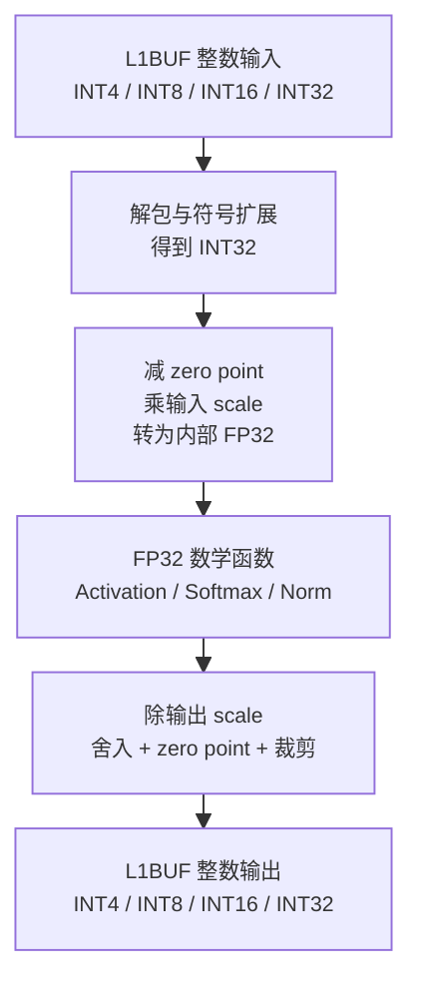
```mermaid
%%{init: {"flowchart": {"useMaxWidth": true, "nodeSpacing": 12, "rankSpacing": 18}, "themeVariables": {"fontSize": "11px"}}}%%
flowchart TB
    I["L1BUF 整数输入<br/>INT4 / INT8 / INT16 / INT32"]
    UNPACK["解包与符号扩展<br/>得到 INT32"]
    I2F["减 zero point<br/>乘输入 scale<br/>转为内部 FP32"]
    FUNC["FP32 数学函数<br/>Activation / Softmax / Norm"]
    F2I["除输出 scale<br/>舍入 + zero point + 裁剪"]
    O["L1BUF 整数输出<br/>INT4 / INT8 / INT16 / INT32"]

    I --> UNPACK --> I2F --> FUNC --> F2I --> O
```

#### 2.3.4 Matrix 的整数计算

Matrix Engine P0 接受 INT4×INT4、INT8×INT8、INT8×INT4 和 INT16×INT16 四种输入组合；每个乘法结果累加到 INT32。先定义不含 bias 的乘累加结果：

$$
p_{m,n}
=\sum_{k=0}^{K-1}
\left(q^A_{m,k}-z_A\right)
\left(q^W_{k,n}-z_{W,n}\right).
$$

随后加 INT32 bias：

$$
a_{m,n}=p_{m,n}+b^{\mathrm{acc}}_n.
$$

P0 要求 $z_A=0$ 且 $z_{W,n}=0$，因此硬件主数据路径可简化为有符号乘累加。$b^{\mathrm{acc}}\in\mathbb Z^{N}$，形状为 $[N]$；同一个 $b^{\mathrm{acc}}_n$ 加到输出第 $n$ 列的全部 $M$ 行。若任务具有 BMM 外层维度，同一组 $N$ 个 bias 默认用于全部 Batch 项，除非描述符给出独立的 Batch stride。

若模型中的实数 bias 为 $b_n$，则编译器预先计算：

$$
b_n^{\mathrm{acc}}
=
\operatorname{round}
\left(
\frac{b_n}{s_As_{W,n}}
\right).
$$

因此第 $n$ 个 INT32 bias 与第 $n$ 个输出通道的累加值使用相同的实数单位。

若输出直接保存为 INT32，则 Matrix 写回 $a_{m,n}$。若输出为 INT8、INT4 或 INT16，编译器先在软件中计算实数比例：

$$
\rho_n=\frac{s_As_{W,n}}{s_Y}.
$$

$s_A$ 是输入缩放系数，$s_{W,n}$ 是第 $n$ 个输出通道的权重缩放系数，$s_Y$ 和 $z_Y$ 是输出参数。$s_{W,n}$ 可按输出通道独立设置。编译器为每个输出通道选择正 INT32 乘数 $R_n$ 和有符号移位量 $r_n$，使：

$$
\rho_n\approx R_n2^{-r_n}.
$$

Matrix 只接收 $R_n$ 与 $r_n$，不接收上述 FP32 scale。硬件先产生 64-bit 整数乘积，再执行带舍入的移位：

$$
t_{m,n}=a_{m,n}R_n,
$$

$$
q^Y_{m,n}
=
\operatorname{clip}_{[q_{\min},q_{\max}]}
\left(
\operatorname{round\_shift}(t_{m,n},r_n)+z_Y
\right).
$$

`round_shift(v,r)` 的定义为：$r>0$ 时把 $v$ 除以 $2^r$ 并按 `round_mode` 舍入；$r=0$ 时保持 $v$；$r<0$ 时左移 $-r$ 位。左移和加 zero point 使用保护位，最终由目的 INT4、INT8 或 INT16 的数值范围裁剪。64-bit 乘积寄存器只是 Matrix 内部整数电路，不是新的模型张量格式。

P0 接受 $-31\le r_n\le63$。对默认的“最接近偶数”模式，$r>0$ 时先令：

$$
u=|v|,\qquad
q=\left\lfloor\frac{u}{2^r}\right\rfloor,\qquad
d=u-q2^r.
$$

$d$ 是被移除的低位所表示的非负余数。若 $d>2^{r-1}$，令 $q\leftarrow q+1$；若 $d=2^{r-1}$ 且 $q$ 为奇数，也令 $q\leftarrow q+1$；其他情况保持 $q$。最后恢复 $v$ 的符号。这样正负数在恰好位于两个整数中间时都取偶数结果。

对四种 `round_mode`，先使用同一组 $u,q,d$，再按下表调整 $q$：

| `round_mode` | $v\ge0$ 时 | $v<0$ 时 |
| --- | --- | --- |
| 最近偶数 | $d>2^{r-1}$，或 $d=2^{r-1}$ 且 $q$ 为奇数时加 1 | 对幅值执行同一规则，再恢复负号 |
| 向零 | 不调整 | 不调整，随后恢复负号 |
| 向正无穷 | $d\ne0$ 时加 1 | 不调整，随后恢复负号 |
| 向负无穷 | 不调整 | $d\ne0$ 时加 1，随后恢复负号 |

这里的 $u$ 必须用无符号幅值表示。若 $v$ 是 64-bit 二进制补码，C 语言参考模型使用：

```text
v >= 0: u = uint64(v)
v <  0: u = (~uint64(v)) + 1
```

因此 `v=INT64_MIN` 时得到 $u=2^{63}$，不会执行有符号的 `-v`，也不会触发 C 语言的有符号溢出。恢复负号时同样先在无符号域形成二进制补码，再按目标有符号宽度解释。

当 $r<0$ 时不执行舍入。设左移量为 $l=-r$。硬件可使用最多 95-bit 的临时整数，也可在移位前比较幅值与目的格式可表示的上限：若左移后必然超过目的范围，直接输出相应的最大值或最小值；否则再执行左移。C 语言参考模型不得直接对负有符号数使用 C 语言左移，也不得让移位位数达到或超过承载类型的位宽。两种实现必须得到相同的 INT4、INT8 或 INT16 输出。

P0 的整数重缩放表还必须满足：

- `multiplier` 位于 `1～0x7FFFFFFF`；
- `shift` 位于 `-31～63`；
- `shift<0` 时先完成上述范围检查；
- 加 `output_zero_point` 前使用至少 96-bit 的概念临时值，或使用等价的提前裁剪检测；
- Matrix 输出 INT4、INT8 或 INT16 时 `numeric_cfg.saturate_enable` 必须为 1。

> [!important] Matrix 内没有 FP32 数据通路
> $s_A$、$s_{W,n}$、$s_Y$ 和 $\rho_n$ 只用于编译器生成整数重缩放参数。Matrix 运行时只做整数乘法、整数累加、整数移位、舍入与裁剪。需要复杂函数或两个不同 scale 张量相加时，编译器发射 CME 任务。

#### 2.3.5 复杂函数不得拆成软件可见的 FP 张量

`I2F`、`F2I`、Exp、Reciprocal 和 ReciprocalSqrt 都是 CME 内部步骤，不设置“把 FP32 张量写入 L1BUF”的独立 P0 指令。例如 Softmax 不能先把 Exp 的 FP32 结果写回 L1BUF，再由另一条任务读取；它必须由一条 `VSOFTMAX_I` 行级任务完成多遍整数读取和内部 FP32 统计：

1. 第一遍读取整数输入并计算行最大值；
2. 第二遍重新读取整数输入，计算 $\exp(x_i-m)$ 并累加分母；
3. 第三遍再次读取整数输入，重新计算指数、除以分母并转换为整数输出。

该方法增加 L1BUF 读取次数，但保证软件可见张量始终是 INT4、INT8、INT16 或 INT32。若后续芯片增加足够大的 CME 私有暂存区，可缓存第二遍的 FP32 指数结果，以减少第三次读取；接口语义不变。

---

## 3. 整体架构与模块连接

### 3.1 单核 NPU 子系统结构

下图采用纵向排列，以便在竖版页面中阅读。

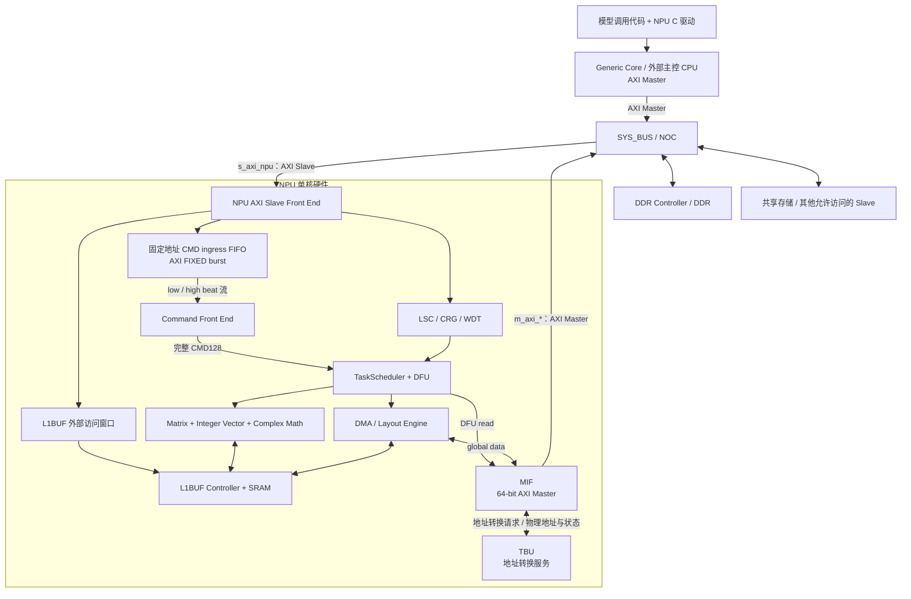
```mermaid
%%{init: {"flowchart": {"useMaxWidth": true, "nodeSpacing": 14, "rankSpacing": 20}, "themeVariables": {"fontSize": "11px"}}}%%
flowchart TB
    GC["Generic Core / 外部主控 CPU<br/>AXI Master"]
    SW["模型调用代码 + NPU C 驱动"]
    NOC["SYS_BUS / NOC"]
    DDR["DDR Controller / DDR"]
    OTHER["共享存储 / 其他允许访问的 Slave"]

    subgraph SUB["NPU 单核硬件"]
        direction TB
        SSA0["NPU AXI Slave Front End"]
        CMD0["固定地址 CMD ingress FIFO<br/>AXI FIXED burst"]
        LSC0["LSC / CRG / WDT"]
        L1WIN0["L1BUF 外部访问窗口"]
        CFE0["Command Front End"]
        TS0["TaskScheduler + DFU"]
        CALC0["Matrix + Integer Vector + Complex Math"]
        DMA0["DMA / Layout Engine"]
        L10["L1BUF Controller + SRAM"]
        MIF0["MIF<br/>64-bit AXI Master"]
        TBU0["TBU<br/>地址转换服务"]

        SSA0 --> CMD0 -->|"low / high beat 流"| CFE0 -->|"完整 CMD128"| TS0
        SSA0 --> LSC0
        SSA0 --> L1WIN0 --> L10
        TS0 --> CALC0
        TS0 --> DMA0
        CALC0 <--> L10
        DMA0 <--> L10
        TS0 -->|"DFU read"| MIF0
        DMA0 <-->|"global data"| MIF0
        MIF0 <-->|"地址转换请求 / 物理地址与状态"| TBU0
        LSC0 --> TS0
    end

    SW --> GC
    GC -->|"AXI Master"| NOC
    NOC -->|"s_axi_npu：AXI Slave"| SSA0
    MIF0 -->|"m_axi_*：AXI Master"| NOC
    NOC <--> DDR
    NOC <--> OTHER
```

系统连接必须遵守以下规则：

- Generic Core 位于 NPU 之外，由 SoC 集成并作为 AXI Master 运行 C 驱动。NPU 顶层只提供面向系统互连的 AXI Slave、存储侧 AXI Master、中断、时钟和复位接口，不接收 CPU 专用提交端口。
- `s_axi_npu_*` 是 NPU 的 64-bit AXI Slave。命令通过固定地址
  `CMD_FIFO_DATA` 的 FIXED burst 进入 ingress FIFO；控制寄存器和 L1BUF
  外部窗口仍按各自地址访问。
- L1BUF 外部窗口提供统一地址空间中的片上数据访问。访问权限、允许时刻和与执行单元的仲裁规则由第 5.3 节和第 10 节定义。
- `m_axi_*` 是 MIF 的 64-bit AXI Master 接口。MIF 仅在 TBU 返回有效 PA 后发出请求；SoC 系统 AXI 互连根据 PA 选择 DDR Controller、共享存储或其他允许访问的 Slave。MIF 不具有 DDR 专用接口，TBU 本身也不发出 AXI 事务。
- DMA 是 DSA Core 的主要全局内存请求方；MIF 代表 NPU 向系统 AXI 发出相应事务。
- Matrix、Vector、Statistics 和 SFU 的张量操作数均从当前 Core 的 L1BUF 读取。
- TaskScheduler 内的 DFU 通过 MIF 和 TBU 读取描述符；TS 的其他部分不直接访问 MIF。
- Matrix、Integer Vector 和 Complex Math Engine 不连接 MIF。
- 第一版不提供多核 Barrier 或远端 L1BUF 数据通路。

### 3.2 单 Core 内部结构

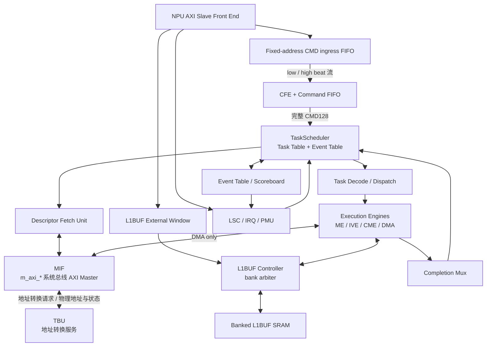
```mermaid
%%{init: {"flowchart": {"useMaxWidth": true, "nodeSpacing": 12, "rankSpacing": 18}, "themeVariables": {"fontSize": "11px"}}}%%
flowchart TB
    AXIS["NPU AXI Slave Front End"]
    CMDW["Fixed-address CMD ingress FIFO"]
    CFE["CFE + Command FIFO"]
    TS["TaskScheduler<br/>Task Table + Event Table"]
    EVT["Event Table / Scoreboard"]
    DFU["Descriptor Fetch Unit"]
    DISP["Task Decode / Dispatch"]
    ENGS["Execution Engines<br/>ME / IVE / CME / DMA"]
    ARB["L1BUF Controller<br/>bank arbiter"]
    SRAM["Banked L1BUF SRAM"]
    MIF["MIF<br/>m_axi_* 系统总线 AXI Master"]
    TBU["TBU<br/>地址转换服务"]
    LSC["LSC / IRQ / PMU"]
    L1WIN["L1BUF External Window"]
    DONE["Completion Mux"]

    AXIS --> CMDW -->|"low / high beat 流"| CFE -->|"完整 CMD128"| TS
    AXIS --> LSC
    AXIS --> L1WIN --> ARB
    TS <--> EVT
    TS --> DFU
    DFU <--> MIF
    TS --> DISP --> ENGS
    ENGS <--> ARB
    ARB <--> SRAM
    ENGS <-->|"DMA only"| MIF
    MIF <-->|"地址转换请求 / 物理地址与状态"| TBU
    ENGS --> DONE --> TS
    EVT --> LSC
    LSC --> TS
```

### 3.3 模块职责

| 模块 | 输入 | 输出 | 主要动作 |
| --- | --- | --- | --- |
| NPU AXI Slave Front End | 外部 CPU 发起的 `s_axi_npu_*` 访问 | CMD beat、LSC 请求、L1BUF 外部窗口请求 | 解析本地地址并返回 AXI 响应 |
| 固定地址 CMD ingress FIFO | 2～16 beat 的 AXI FIXED burst | 带 `first/last` 的内部命令 beat | 每两个相邻 beat 组成一条 CMD128；合法 burst 整体提交 |
| L1BUF External Window | AXI Slave Front End 发来的窗口请求 | L1BUF 外部客户端读写请求 | 提供外部 CPU 对允许片上区域的按地址访问 |
| Command FIFO | 128-bit CMD | 排队后的完整 CMD | 吸收前端突发提交，维持提交顺序 |
| Event Table / Scoreboard | CMD 中的依赖事件、各单元完成消息 | 可发射任务、事件状态、错误状态 | 检查依赖、保存任务状态、传播错误 |
| Descriptor Fetch Unit | `desc_addr` 和读取请求 | 描述符缓存项 | 经 TBU/MIF 读取、校验并保存描述符 |
| Task Decode / Dispatch | CMD 与描述符 | 各执行单元任务 | 检查 opcode、字段和功能寄存器后分发 |
| Matrix Engine | GEMM/BMM 任务、L1BUF 数据 | 矩阵结果、完成消息 | tile 读取、乘累加、部分和处理、Epilogue、写回；支持两个内部阶段交叠 |
| Vector Engine | 逐元素任务、L1BUF 数据 | 向量结果、完成消息 | 算术、比较、选择、格式转换和门控更新 |
| Statistics Unit | 行或向量段 | 和、最大值、平方和 | 分 lane 计算局部结果，再合并为每行统计结果 |
| SFU | 向量输入 | 函数结果 | Exp、Reciprocal、ReciprocalSqrt、Sigmoid、Tanh、GELU、SiLU |
| DMA / Layout Engine | 多维搬运描述符 | L1BUF 或全局内存写入、完成消息 | 连续和多维搬运、转置、pack、split、fill |
| L1BUF Controller | 各客户端读写请求 | 读返回、写完成 | bank 选择、仲裁、冲突停顿、错误检查 |
| MIF | DFU/DMA 全局内存请求、TBU 返回 | 存储侧 AXI 请求与返回、DFU/DMA 返回 | 管理请求表、向 TBU 请求地址转换、分配 AXI ID、生成与接收 AXI 事务 |
| TBU | MIF 地址转换请求 | 物理地址或转换错误 | 按 stream ID、substream ID 与访问类型执行地址转换和权限检查；不发出 AXI 事务 |
| LSC | 配置访问、中断状态、各模块状态 | 控制信号、中断 | 启停、基地址、功能查询、错误记录、性能计数 |

### 3.4 主要数据路径

| 数据路径 | 发起模块 | 经过模块 | 目的模块 | 用途 |
| --- | --- | --- | --- | --- |
| 命令提交 | 外部 Generic Core | 系统 AXI、NPU AXI Slave、固定地址 CMD FIFO、CFE | TaskScheduler | C 驱动用 FIXED burst 主动提交异步任务 |
| 控制与状态 | 外部 Generic Core | 系统 AXI、NPU AXI Slave | LSC | 配置设备、查询状态和清除中断 |
| L1BUF 外部访问 | 外部 Generic Core | 系统 AXI、NPU AXI Slave、L1BUF 外部窗口 | L1BUF bank | 输入准备、结果读取或调试 |
| 描述符读取 | Descriptor Fetch Unit | MIF（向 TBU 发出地址转换请求）、系统 NoC | DDR | 读取任务参数 |
| 激活/权重加载 | DMA | MIF（向 TBU 发出地址转换请求）、系统 NoC、L1BUF Controller | L1BUF | 计算前预取 |
| Matrix 读取 | Matrix Engine | L1BUF Controller | L1BUF bank | 读取 A、B、bias 和 residual |
| Vector 读取 | Vector/Statistics/SFU | L1BUF Controller | L1BUF bank | 读取逐元素或行级输入 |
| 结果写回 | Matrix/Vector/Statistics/SFU | L1BUF Controller | L1BUF bank | 保存片上结果 |
| DDR 输出 | DMA | L1BUF Controller、MIF（向 TBU 发出地址转换请求）、系统 NoC | DDR | 回写最终结果 |
| 完成通知 | 各执行单元 | Event Table、LSC | 外部 Generic Core 或 MCU | 更新事件、产生中断 |

### 3.5 模块连接与位宽

| 发送模块 | 接收模块 | 接口 | 数据位宽 | 控制方式 |
| --- | --- | --- | ---: | --- |
| 外部 Generic Core | NPU AXI Slave Front End | AXI4 Slave | 64 bit | CPU 是 Master，NPU 是 Slave |
| NPU AXI Slave Front End | CMD ingress FIFO / CFE | CMD stream | 64 bit | 每两个相邻 beat 组成完整 CMD |
| CFE | TaskScheduler | complete CMD stream | 128 bit | 一个 ready/valid 握手传送一条完整 CMD |
| TaskScheduler | DMA / ME / IVE / CME | task metadata | opcode、command_id 和 2048-bit Descriptor | ready/valid；各字段分别连接 |
| DMA / ME / IVE / CME | TaskScheduler | done metadata | command_id、status、fault address 和 64-bit progress | ready/valid；各字段分别连接 |
| Descriptor SRAM | 各执行单元 | descriptor read | 64 bit | request/response |
| DFU | MIF | descriptor memory read | 64 bit | request/response |
| DMA | MIF | global memory data | 64 bit | request/response |
| MIF | TBU | address translation request/response | GVA 48 bit、PA 40 bit | ready/valid；TBU 返回 PA 或错误状态 |
| DMA / ME / IVE / CME | L1BUF Controller | L1 read/write | 每端口 64 bit | ready/valid |
| MIF | SoC AXI interconnect | AXI4 Master | 64 bit | AW/W/B/AR/R |
| NPU AXI Slave Front End | LSC | register | 64 bit | request/response |
| NPU AXI Slave Front End | L1BUF External Window | window request | 64 bit | 单项 request/response |
| L1BUF External Window | L1BUF Controller | external read/write | 64 bit | 分离 ready/valid 通道 |

64 bit 是软件可见数据端口的单个 beat 宽度。Matrix 可设置多个独立 L1 读端口，每个端口仍为 64 bit；不能把多个端口拼成一个更宽的软件可见事务。
外部 CPU 不提供 `first/last` 信号，只把低、高 word 依次写到同一个 AXI 固定
地址。NPU AXI Slave Front End 在完整 FIXED burst 通过检查并整体进入 ingress
FIFO 后，按 beat 位置向 CFE 生成内部 `first/last`：低 word 为
`first=1,last=0`，高 word 为 `first=0,last=1`。CFE 检查并组合这两个
64-bit beat，再把完整 128-bit CMD 保存到命令 FIFO。CFE 到 TaskScheduler
使用 `valid`、`ready` 和 `cmd[127:0]`，一条 CMD 只进行一次握手；暂停期间
`cmd[127:0]` 必须保持不变。

---

## 4. 接口通用规则

### 4.1 时钟、复位与信号命名

| 项目 | 规则 |
| --- | --- |
| 主时钟 | 单核计算使用 `core_clk`；MIF 可使用独立 `noc_clk` |
| 主复位 | 计算模块使用 `core_reset_n`，MIF/TBU 使用 `noc_reset_n`；二者均为低有效同步释放信号 |
| ready/valid | 发送端驱动 `valid` 和 payload，接收端驱动 `ready` |
| 传输发生条件 | 某周期上升沿同时采样到 `valid=1` 且 `ready=1` |
| payload 保持 | `valid=1` 且 `ready=0` 时，发送端必须保持 payload 不变 |
| ID | 请求和返回均携带 ID；允许返回乱序的接口必须按 ID 对应 |
| 字节地址 | 所有地址、stride 和长度都以字节为单位，只有 shape 以元素个数表示 |
| 保留位 | 发送端写 0；接收端忽略，但可在严格检查模式下报告非零 |
| 跨时钟域 | 必须经过异步 FIFO、握手同步器或经验证的 CDC 组件 |

> [!warning] 不允许组合回授
> `valid` 不得组合依赖同一接口的 `ready`。`ready` 可以由接收端资源状态产生，但不得经过对端 `valid` 再直接返回，以免形成组合回授。

> [!note] 复位信号后缀
> `_n` 只表示低有效，不表示端口方向。外部异步复位是顶层输入，因此使用 `core_rst_ni` 和 `noc_rst_ni`；CRG 同步释放后送往内部模块的复位统一使用 `core_reset_n` 和 `noc_reset_n`。每个端口的 Input 或 Output 方向由接口表单独规定。

### 4.2 ready/valid 基本时序

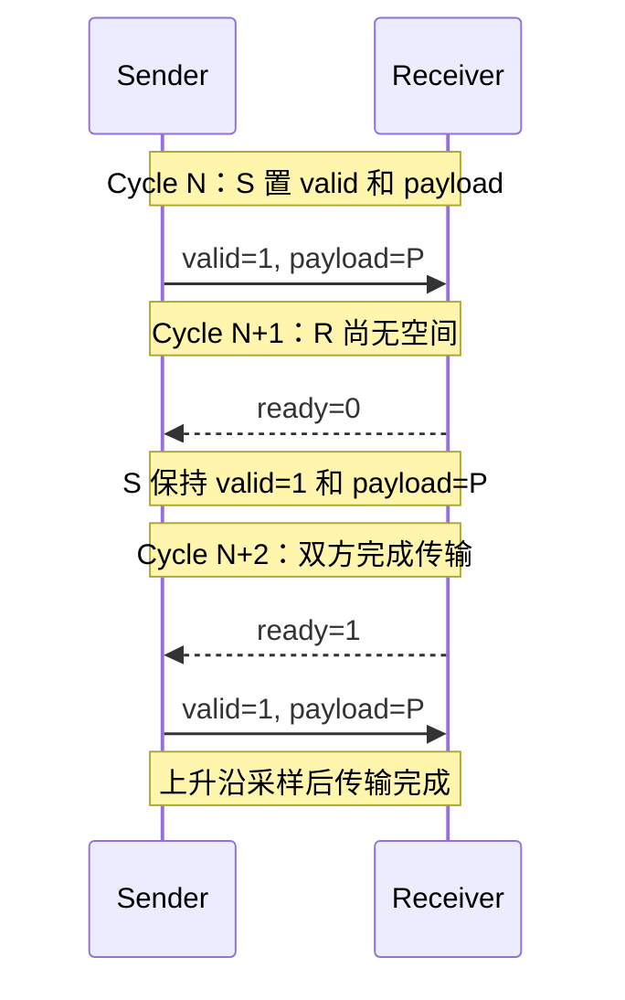
```mermaid
%%{init: {"sequence": {"useMaxWidth": true, "actorMargin": 14, "width": 82, "messageMargin": 10, "noteMargin": 6}, "themeVariables": {"fontSize": "11px"}}}%%
sequenceDiagram
    participant S as Sender
    participant R as Receiver
    Note over S,R: Cycle N：S 置 valid 和 payload
    S->>R: valid=1, payload=P
    Note over S,R: Cycle N+1：R 尚无空间
    R-->>S: ready=0
    Note over S,R: S 保持 valid=1 和 payload=P
    Note over S,R: Cycle N+2：双方完成传输
    R-->>S: ready=1
    S->>R: valid=1, payload=P
    Note over S,R: 上升沿采样后传输完成
```

### 4.3 错误状态编码

所有模块的完成接口使用统一的 8-bit `status`：

| 编码 | 名称 | 含义 |
| ---: | --- | --- |
| `0x00` | `SUCCESS` | 任务正确完成 |
| `0x01` | `ILLEGAL_OPCODE` | opcode 未实现或当前功能位为 0 |
| `0x02` | `BAD_DESC` | 描述符版本、长度、对齐或字段非法 |
| `0x03` | `BAD_SHAPE` | shape、stride 或有效长度非法 |
| `0x04` | `ADDR_FAULT` | 地址转换失败或访问超出已分配范围 |
| `0x05` | `BUS_DECERR` | AXI 返回 DECERR |
| `0x06` | `BUS_SLVERR` | AXI 返回 SLVERR |
| `0x07` | `DTYPE_UNSUPPORTED` | 数据格式组合未实现 |
| `0x08` | `DEPENDENCY_FAILED` | 依赖事件处于失败终态 |
| `0x09` | `TIMEOUT` | 看门狗或任务周期上限触发 |
| `0x0A` | `ABORTED` | 软件复位或取消请求终止任务 |
| `0x0B` | `L1_ECC_UNCORRECTABLE` | L1BUF 检测到不可修正 ECC 错误 |
| `0x0C` | `NUMERIC_EXCEPTION` | 描述符要求遇到指定数值异常时停止 |
| `0x0D` | `ADDR_OVERLAP` | 当前 opcode 不允许源和目的地址范围重叠 |

`status != SUCCESS` 时，模块还必须返回 `error_info[31:0]`。该字段可保存出错字段编号、AXI response、地址低位、异常 opcode 或上游 `command_id`。

---

## 5. NPU 顶层接口定义

### 5.1 顶层时钟、复位、电源和中断

下表的方向以 `npu_core_top` 为参照。

| 信号 | 方向 | 位宽 | 复位值 | 说明 |
| --- | --- | ---: | ---: | --- |
| `core_clk_i` | Input | 1 | — | SoC 提供的计算域原始时钟，先进入 CRG |
| `core_rst_ni` | Input | 1 | 0 | SoC 提供的计算域低有效复位，先进入 CRG |
| `noc_clk_i` | Input | 1 | — | SoC 提供的 MIF/TBU 原始时钟，先进入 CRG |
| `noc_rst_ni` | Input | 1 | 0 | SoC 提供的 NoC 侧低有效复位 |
| `scan_mode_i` | Input | 1 | 0 | 测试模式；功能模式必须为 0 |
| `module_clk_en_i` | Input | 8 | `0xFF` | 八个模块的请求时钟使能 |
| `module_clk_active_o` | Output | 8 | `0xFF` | CRG 实际采用的模块时钟使能 |
| `dvfs_prepare_req_i` | Input | 1 | 0 | SoC 请求改变计算时钟频率 |
| `dvfs_prepare_ack_o` | Output | 1 | 0 | NPU 已停止接收新工作且满足改频条件 |
| `accept_new_cmd_o` | Output | 1 | 0 | NPU AXI Slave 当前允许接收新的 CMD128 |
| `soft_reset_req_i` | Input | 1 | 0 | 请求受控软复位 |
| `soft_reset_done_o` | Output | 1 | 0 | 排空请求并完成模块复位后置 1 |
| `clk_req_o` | Output | 1 | 1 | NPU 仍需要 `core_clk_i` |
| `clk_ack_i` | Input | 1 | 0 | SoC 时钟控制模块确认时钟可用 |
| `power_down_req_i` | Input | 1 | 0 | 请求进入断电准备状态 |
| `power_down_ack_o` | Output | 1 | 0 | NPU 已满足断电条件 |
| `wdt_enable_i` | Input | 1 | 0 | 使能 Core 看门狗 |
| `wdt_timeout_cycles_i` | Input | 32 | 0 | 无进展超时周期数；0 表示不计时 |
| `wdt_kick_i` | Input | 1 | 0 | 软件或调度器喂狗脉冲 |
| `core_idle_o` | Output | 1 | 1 | 命令队列、执行单元、L1 写队列和 AXI 请求均为空 |
| `irq_done_o` | Output | 1 | 0 | 完成中断，高电平保持到软件清除 |
| `irq_exception_o` | Output | 1 | 0 | 数值异常或任务超时中断 |
| `irq_error_o` | Output | 1 | 0 | 地址、协议、ECC 或描述符错误中断 |
| `wdt_reset_req_o` | Output | 1 | 0 | 看门狗复位请求 |

当前 `npu_single_core_top.sv` 原型直接提供 `core_clk_i`、`noc_clk_i` 和共同的
低有效 `reset_n`，尚未把 `core_rst_ni/noc_rst_ni`、`scan_mode_i`、
`module_clk_en_i`、`clk_req_o/clk_ack_i` 或 WDT 配置输入引出为顶层端口。
当前 WDT 和模块时钟使能由 LSC CSR 产生。上表保留完整 SoC 集成接口要求；
Verilator 完整单核测试按当前原型端口驱动，不应据此删除后续的独立复位、扫描
和时钟请求接口。

`accept_new_cmd_o` 只有在复位已经释放、LSC `start=1`、`stop=0`、未进入改频或断电准备状态且命令接收资源可用时才能置 1。该信号可供集成验证使用；软件以 AXI 写响应和提交状态为准。

`soft_reset_req_i/soft_reset_done_o` 与 `power_down_req_i/power_down_ack_o` 均采用四阶段电平握手，详细次序见第 15.8、15.9 节。`power_down_ack_o` 只能在 `core_idle_o=1`、NPU AXI Slave 没有未完成响应、MIF 没有 outstanding 请求且完成状态已经写入保持供电寄存器后置 1。

`clk_req_o/clk_ack_i` 的功能模式时序固定如下：

1. 外部复位有效时 `clk_req_o=1`，请求 SoC 提供 `core_clk_i`；
2. SoC 确认计算时钟已经可用后置 `clk_ack_i=1`，随后才允许撤销 `core_rst_ni`；
3. NPU 运行期间保持 `clk_req_o=1`；`clk_ack_i` 只表示 SoC 时钟控制状态，不参与已经到达的时钟沿上的模块状态更新；
4. `power_down_ack_o=1` 后，功能模式下 NPU 撤销 `clk_req_o`；SoC 看到该值后停止时钟并撤销 `clk_ack_i`；
5. `scan_mode_i=1` 时强制 `clk_req_o=1`，并强制八个模块时钟使能为 1。功能验证和软件运行必须把 `scan_mode_i` 保持为 0。

周期 C 语言参考模型由调用者显式调用 `npu_single_core_cycle_core_tick()` 表示一个真实的
`core_clk_i` 上升沿。因此 `clk_ack_i` 不会取消一次已经调用的 tick；调用者必须
只在 SoC 实际提供计算时钟时调用该函数。该参考模型另行输出
`accept_new_cmd_o`，供测试环境判断 NPU AXI Slave 是否还能接收新的 CMD128。

### 5.2 64-bit AXI4 Master 接口

单核当前由 MIF 提供一组 64-bit AXI4 Master，统一命名为 `m_axi_*`。
MIF 接收 DFU/DMA 的全局内存请求，向 TBU 提交 GVA，并仅在获得有效 PA 后发出
AXI 读写事务。该接口连接 SoC 系统 AXI 互连；DDR Controller、共享存储和其他
允许访问的 Slave 均由系统互连根据 PA 选择，MIF 内部不再保存目标端口选择值。
TBU 只返回地址转换结果和状态，不驱动 AXI 通道。

下表定义 `m_axi_*` 接口的全部通道信号。

| 信号 | 方向 | 位宽 | 说明 |
| --- | --- | ---: | --- |
| `m_axi_awid` | Output | 8 | 写事务 ID |
| `m_axi_awaddr` | Output | 40 | TBU 转换后的物理字节地址 |
| `m_axi_awlen` | Output | 8 | burst beat 数减 1 |
| `m_axi_awsize` | Output | 3 | 每个 beat 的字节数；64-bit 满 beat 时为 3 |
| `m_axi_awburst` | Output | 2 | P0 仅使用 INCR |
| `m_axi_awlock` | Output | 1 | P0 固定为 0，不产生独占访问 |
| `m_axi_awcache` | Output | 4 | 写事务存储属性，默认值见下文 |
| `m_axi_awprot` | Output | 3 | 权限和指令/数据属性 |
| `m_axi_awqos` | Output | 4 | 服务质量值，P0 默认 0 |
| `m_axi_awvalid` | Output | 1 | 写地址有效 |
| `m_axi_awready` | Input | 1 | 接收方可接收写地址 |
| `m_axi_wdata` | Output | 64 | 写数据 |
| `m_axi_wstrb` | Output | 8 | 每个字节一个有效位 |
| `m_axi_wlast` | Output | 1 | 当前 burst 的最后一个 beat |
| `m_axi_wvalid` | Output | 1 | 写数据有效 |
| `m_axi_wready` | Input | 1 | 接收方可接收写数据 |
| `m_axi_bid` | Input | 8 | 写响应 ID |
| `m_axi_bresp` | Input | 2 | `OKAY`、`SLVERR` 或 `DECERR` |
| `m_axi_bvalid` | Input | 1 | 写响应有效 |
| `m_axi_bready` | Output | 1 | NPU 可接收写响应 |
| `m_axi_arid` | Output | 8 | 读事务 ID |
| `m_axi_araddr` | Output | 40 | TBU 转换后的物理字节地址 |
| `m_axi_arlen` | Output | 8 | burst beat 数减 1 |
| `m_axi_arsize` | Output | 3 | 每个 beat 的字节数 |
| `m_axi_arburst` | Output | 2 | P0 仅使用 INCR |
| `m_axi_arlock` | Output | 1 | P0 固定为 0，不产生独占访问 |
| `m_axi_arcache` | Output | 4 | 读事务存储属性，默认值见下文 |
| `m_axi_arprot` | Output | 3 | 权限和指令/数据属性 |
| `m_axi_arqos` | Output | 4 | 服务质量值，P0 默认 0 |
| `m_axi_arvalid` | Output | 1 | 读地址有效 |
| `m_axi_arready` | Input | 1 | 接收方可接收读地址 |
| `m_axi_rid` | Input | 8 | 读返回 ID |
| `m_axi_rdata` | Input | 64 | 读返回数据 |
| `m_axi_rresp` | Input | 2 | 读返回状态 |
| `m_axi_rlast` | Input | 1 | 当前 burst 的最后一个 beat |
| `m_axi_rvalid` | Input | 1 | 读返回有效 |
| `m_axi_rready` | Output | 1 | NPU 可接收读返回 |

AXI 接口必须满足：

1. 单个 burst 不跨越 4KiB 地址区段。
2. DSA MIF 固定设置 `AWSIZE=ARSIZE=3`，发出的 AXI 地址向下对齐到 8B。
3. 写入首 beat 或末 beat 的部分字节时使用 `WSTRB`；读取首 beat或末 beat 时，DMA 根据原始逻辑地址和长度丢弃无效字节。
4. `AWLOCK=ARLOCK=0`，`AWQOS=ARQOS=0`；`AWCACHE/ARCACHE` 和 `AWPROT/ARPROT` 从 MIF 请求属性产生，未指定时分别使用 SoC 集成阶段确定的 `AXI_CACHE_DEFAULT` 和 `AXI_PROT_DEFAULT`。
5. 同一个 AXI ID 内保持返回次序；不同 ID 可以交错返回。
6. 对写任务，收到对应 `BVALID` 之前不得报告任务成功。
7. `RRESP` 或 `BRESP` 不是 `OKAY` 时，DMA 停止生成新请求，接收完已经发出的事务后报告错误。
8. MIF 必须保存第一个错误地址、AXI ID、response 和 `command_id`。

#### 5.2.1 外部 Generic Core 的接口归属

Generic Core 是 SoC 中的外部 AXI Master，其取指、缓存、地址转换和 CPU 侧 AXI Adapter 均由 SoC 负责，不属于 `npu_core_top`。本 Spec 不定义 CPU 内部接口，也不为特定 CPU ISA 增加专用提交端口。

Generic Core 上的应用读取生成的 C 模型配置，并调用通用 NPU C 驱动。它通过系统 AXI 互连访问第 5.3 节的 `s_axi_npu_*`，并接收 `irq_done_o`、`irq_exception_o` 和 `irq_error_o`。SoC 需要保证 CPU、NPU 和 DDR 的缓存一致性；若系统不提供硬件一致性，驱动必须在提交前清理 Descriptor、权重和输入数据对应的 CPU Cache，在读取结果前使输出对应的 CPU Cache 数据失效。

### 5.3 64-bit AXI4 Slave 接口

`s_axi_npu_*` 是 NPU 面向外部 Generic Core 或 MCU 的 64-bit AXI4 Slave。它接收 CMD128 提交、控制寄存器访问和 L1BUF 外部窗口访问。地址宽度为 24 bit，数据宽度为 64 bit，信号组与标准 AXI4 一致。外部 CPU 是 Master，NPU 是 Slave。

| 信号 | 方向 | 位宽 | 说明 |
| --- | --- | ---: | --- |
| `s_axi_awid` | Input | 8 | 写事务 ID |
| `s_axi_awaddr` | Input | 24 | 本地字节地址 |
| `s_axi_awlen` | Input | 8 | burst beat 数减 1 |
| `s_axi_awsize` | Input | 3 | 每个 beat 的字节数 |
| `s_axi_awburst` | Input | 2 | 命令 FIFO 数据端口要求 FIXED；其他写访问要求 INCR |
| `s_axi_awlock` | Input | 1 | 独占属性；P0 只接受 0 |
| `s_axi_awcache` | Input | 4 | 存储属性；Adapter 锁存但不据此改变 CSR 语义 |
| `s_axi_awprot` | Input | 3 | 权限属性；P0 锁存该字段，但不在 Adapter 内解释 |
| `s_axi_awqos` | Input | 4 | 服务质量值；P0 可忽略 |
| `s_axi_awvalid` | Input | 1 | 写地址有效 |
| `s_axi_awready` | Output | 1 | NPU 可接收写地址 |
| `s_axi_wdata` | Input | 64 | 写数据 |
| `s_axi_wstrb` | Input | 8 | 每个字节一个写使能 |
| `s_axi_wlast` | Input | 1 | 当前 burst 最后一拍 |
| `s_axi_wvalid` | Input | 1 | 写数据有效 |
| `s_axi_wready` | Output | 1 | NPU 可接收写数据 |
| `s_axi_bid` | Output | 8 | 写响应 ID |
| `s_axi_bresp` | Output | 2 | OKAY 或 SLVERR |
| `s_axi_bvalid` | Output | 1 | 写响应有效 |
| `s_axi_bready` | Input | 1 | 发起方可接收写响应 |
| `s_axi_arid` | Input | 8 | 读事务 ID |
| `s_axi_araddr` | Input | 24 | 本地字节地址 |
| `s_axi_arlen` | Input | 8 | burst beat 数减 1 |
| `s_axi_arsize` | Input | 3 | 每个 beat 的字节数 |
| `s_axi_arburst` | Input | 2 | P0 读访问要求 INCR |
| `s_axi_arlock` | Input | 1 | 独占属性；P0 只接受 0 |
| `s_axi_arcache` | Input | 4 | 存储属性；Adapter 锁存但不据此改变 CSR 语义 |
| `s_axi_arprot` | Input | 3 | 权限属性；P0 锁存该字段，但不在 Adapter 内解释 |
| `s_axi_arqos` | Input | 4 | 服务质量值；P0 可忽略 |
| `s_axi_arvalid` | Input | 1 | 读地址有效 |
| `s_axi_arready` | Output | 1 | NPU 可接收读地址 |
| `s_axi_rid` | Output | 8 | 读返回 ID |
| `s_axi_rdata` | Output | 64 | 读返回数据 |
| `s_axi_rresp` | Output | 2 | OKAY 或 SLVERR |
| `s_axi_rlast` | Output | 1 | 当前 burst 最后一拍 |
| `s_axi_rvalid` | Output | 1 | 读返回有效 |
| `s_axi_rready` | Input | 1 | 发起方可接收读返回 |

| 访问对象 | 地址区段 | 访问宽度 | 行为 |
| --- | --- | --- | --- |
| LSC CSR | `0x000000～0x00FFFF` | 32 或 64 bit | 支持读写、W1C 和只读属性 |
| Debug / Performance | `0x010000～0x01FFFF` | 64 bit | 空闲或冻结后读取 |
| CMD FIFO 与控制请求窗口 | `0x020000～0x02FFFF` | 64 bit | 固定地址写入 CMD beat，读取接收响应，并提供查询、等待和 ACK |
| L1BUF 外部访问窗口 | `0x100000～0x1FFFFF` | 8、16、32 或 64 bit | `L1_HOST_ACCESS_CONTROL.ENABLE=1` 时按 LADDR 访问 1 MiB L1BUF；由 L1BUF Controller 与内部客户端仲裁 |

保留地址读 0、写无效。NPU 忙时访问受限制的调试寄存器返回 `SLVERR`。L1BUF 外部窗口可以在 NPU 运行期间完成总线级访问。硬件只对外部端口与内部端口的请求进行仲裁，不跟踪某个 LADDR 是否仍被任务读取或写入；软件在读取或写入仍可能被任务访问的 LADDR 前，必须等待相关事件或任务栅栏完成。

P0 不使用 `AWPROT/ARPROT` 判断发起方权限。特权级、安全域和设备访问许可由 SoC 总线访问控制单元检查；NPU AXI Slave Front End 仍需锁存 `AWPROT/ARPROT`，便于后续版本扩展和波形调试。

LSC CSR、Debug / Performance、命令响应 FIFO、命令状态寄存器和控制请求寄存器
只接受单 beat 事务。命令数据端口位于固定地址 `0x020000`，只接受
`AWSIZE=3`、`AWBURST=FIXED`、`WSTRB=0xFF` 的 2、4、6、…、16 beat 写
burst；相邻的低、高两个 beat 组成一条 CMD128，因此一次 burst 可以提交
1～8 条完整命令。L1BUF 外部窗口可接受 INCR burst，但单个 burst 不得跨越
4KiB 地址区段或 L1BUF 末地址。

P0 对窄访问和 burst 使用以下固定规则：

- `AWSIZE/ARSIZE=0、1、2` 分别表示 1B、2B、4B，只允许单 beat，且访问不得跨越一个 8B word；
- 命令数据端口以外的多 beat 访问只允许用于 L1BUF 窗口，必须满足
  `AWSIZE=ARSIZE=3`，内部地址每个 beat 增加 8；
- 窄写把 AXI 地址向下对齐到 8B，并使用 `WSTRB` 选择实际字节；
- 窄读同样读取对齐后的完整 64-bit word，再按照 AXI 地址低 3 bit 把所需字节放到规定的数据 lane；未选中的 `RDATA` lane 固定返回 0；
- 不支持的 size、未对齐的 2B/4B 访问或窄 burst 返回 `SLVERR`，不产生内部请求。

> [!note] 为什么地址是 24 bit
> 本地 slave 空间最大为 16MiB，因此保留低 24 bit 即可。SoC 给 NPU 分配的系统基地址需要 16MiB 对齐，MIF 在进入本地 slave 前去掉系统高位。

#### 5.3.1 NPU AXI Slave Front End

NPU AXI Slave Front End 终止 `s_axi_npu_*`，并产生 CMD FIFO 写入、LSC
寄存器请求或 L1BUF 外部窗口请求。P0 每个方向最多保留一个未完成事务。写通道
必须先接收 AW，随后才对对应的 W 数据拉高 `s_axi_wready`；Front End 固定
接收 `AWLEN+1` 个 W beat，全部内部写完成后产生一次 B response。

命令入口包含一个 burst 暂存区和一个按 beat 计数的 ingress FIFO。收到命令
AW 时，Front End 只有在可用位置不少于 `AWLEN+1` 时才拉高
`s_axi_awready`，并为整个 burst 预留空间。W 阶段先写入预留位置但不对 CFE
可见；最后一拍确认长度、`WSTRB` 和 `WLAST` 全部正确后，才一次提交整个
burst。任一检查失败时丢弃该 burst 并返回 `SLVERR`，其中的任何 CMD 都不能
进入 CFE。P0 ingress FIFO 至少容纳 16 个 64-bit beat。

Adapter 还接收以下控制输入：

| 信号 | Adapter 方向 | 位宽 | 说明 |
| --- | --- | ---: | --- |
| `core_idle_i` | Input | 1 | 顶层 NPU 空闲状态 |
| `debug_frozen_i` | Input | 1 | 性能计数器已经冻结，可稳定读取调试快照 |
| `l1_host_access_enable_i` | Input | 1 | LSC 对 L1BUF 主控访问窗口的总使能位 |

Debug / Performance 读访问要求 `core_idle_i=1` 或 `debug_frozen_i=1`。对该区域的写访问只允许写文档明确标为可写的控制寄存器；其余写入按寄存器属性处理。L1BUF 外部访问要求 `l1_host_access_enable_i=1`；硬件只执行端口仲裁，驱动必须在访问可能仍被任务读写的 LADDR 前等待相应事件或任务栅栏完成。

`core_idle_i` 必须由本周期开始时的 AXI 命令接收状态、CFE、TS、四个执行单元、L1BUF 和 MIF/CDC 状态直接组合得到，不能使用上一周期保存的 `core_idle_o`。若本周期同时接收一条新 CMD128，则本周期受限制的 Debug 请求按忙状态检查。

地址选择规则如下：

| `s_axi_npu` 地址 | 内部目的 | 内部地址 |
| --- | --- | --- |
| `0x000000～0x00FFFF` | LSC CSR | `reg_req_space=0`，`reg_req_addr=s_axi_addr[15:0]` |
| `0x010000～0x01FFFF` | Debug / Performance | `reg_req_space=1`，`reg_req_addr=s_axi_addr[15:0]` |
| `0x020000` | CMD FIFO 数据端口 | 固定地址 64-bit beat 流 |
| `0x020008` | CMD 接收响应 FIFO | 每次成功读出并删除一条 64-bit 响应 |
| `0x020010` | CMD FIFO 状态 | ingress 可用位置数、响应数量和错误状态 |
| `0x020020～0x020048` | WAIT / QUERY / FENCE 控制请求 | 控制参数、启动、状态、结果和取消 |
| `0x100000～0x1FFFFF` | L1BUF 外部端口 | `laddr=s_axi_addr-0x100000` |

`reg_req_space` 必须随寄存器请求一起锁存并保持到响应完成。没有该选择位时，`0x000000` 与 `0x010000` 会产生相同的 16-bit 内部地址，LSC 无法判断应访问普通 CSR 还是调试寄存器组。

NPU AXI Slave Front End 到 LSC 的对应端口名为 `reg_req_space_o`，位宽为 1；它与第 15.2 节的 `reg_req_space_i` 直接连接，并与 `reg_req_valid`、地址、写数据和 strobe 在同一周期完成请求握手。对 1B、2B 或 4B 的寄存器访问，`reg_req_addr_o` 必须向下对齐到 8B；`reg_req_wdata_o` 和 `reg_req_wstrb_o` 保留 AXI 原始 lane 位置，LSC 按 strobe 更新对应字节。

L1BUF 外部窗口 P0 固定覆盖 1 MiB。若具体芯片的 L1BUF 更大，必须使用窗口页选择寄存器，不能截断高地址位。

Front End 与 CFE 之间的命令接口如下。方向以 NPU AXI Slave Front End 为
参照；`first/last` 由 Front End 根据已经整体提交的 burst 位置产生，不是
AXI 输入信号。

| 信号 | Front End 方向 | 位宽 | 说明 |
| --- | --- | ---: | --- |
| `cmd_valid_o` | Output | 1 | ingress FIFO 当前命令 beat 有效 |
| `cmd_ready_i` | Input | 1 | CFE 可接收当前 beat |
| `cmd_data_o` | Output | 64 | 当前低 word 或高 word |
| `cmd_first_o` | Output | 1 | 当前为一条 CMD 的低 word |
| `cmd_last_o` | Output | 1 | 当前为一条 CMD 的高 word |
| `cmd_rsp_valid_i` | Input | 1 | CFE 对当前完整 CMD 的接收响应有效 |
| `cmd_rsp_ready_o` | Output | 1 | 命令响应 FIFO 有可用位置 |
| `cmd_rsp_data_i` | Input | 64 | `command_id`、接收状态和 CFE FIFO 可用项数 |
| `cmd_ingress_idle_o` | Output | 1 | burst 暂存区、ingress FIFO 和待响应 CMD 均空；已经排入响应 FIFO 的项不影响该信号 |

Front End 先发送低 word，再发送高 word。高 word 完成握手后，该 CMD 保留在
ingress FIFO 头部，直到 `cmd_rsp_valid_i && cmd_rsp_ready_o`；随后 Front End
把响应写入命令响应 FIFO，并删除该 CMD。这样响应顺序与 burst 内的命令次序
完全相同，响应 FIFO 满时也不会丢失接收结果。

Front End 到 L1BUF Controller 的外部窗口接口保持 64 bit：

| 信号 | Front End 方向 | 位宽 | 说明 |
| --- | --- | ---: | --- |
| `axi_l1_req_valid_o` | Output | 1 | 外部窗口请求有效 |
| `axi_l1_req_ready_i` | Input | 1 | 外部访问桥可接收 |
| `axi_l1_req_write_o` | Output | 1 | 0 为读，1 为写 |
| `axi_l1_req_addr_o` | Output | 24 | L1BUF 字节地址 |
| `axi_l1_req_wdata_o` | Output | 64 | 写数据 |
| `axi_l1_req_wstrb_o` | Output | 8 | 写字节使能 |
| `axi_l1_rsp_valid_i` | Input | 1 | 读返回或写完成有效 |
| `axi_l1_rsp_ready_o` | Output | 1 | Front End 可接收 |
| `axi_l1_rsp_rdata_i` | Input | 64 | 读数据 |
| `axi_l1_rsp_status_i` | Input | 3 | 正常、ECC 状态或访问失败 |

外部窗口总使能位为 0 时，Front End 不向 L1BUF 发请求，直接返回 `SLVERR`。

NPU AXI Slave Front End 的功能时序：

| 阶段 | 读事务 | 写事务 |
| --- | --- | --- |
| T0 | 接收 AR，锁存 ID、地址、长度和属性 | 接收 AW，锁存 ID、地址、长度和属性 |
| T1 | 译码到响应 FIFO、LSC 或 L1BUF 外部端口 | 仅在 AW 已锁存并完成所需 FIFO 空间预留后接收第一拍 W |
| T2～ | 逐拍发内部 64-bit 请求并等待返回 | 命令 burst 写入预留位置；其他目标逐拍发内部写请求 |
| Tend | 生成 RDATA/RRESP，末拍设置 RLAST | 命令 burst 通过检查后整体提交；其他目标完成内部写；随后生成一次 BRESP |

L1BUF 外部窗口的满宽 burst 在内部拆成单 beat `axi_l1_req_*` 请求，内部地址每拍增加 8。窄访问只有一拍，内部请求地址向下对齐到 8B。任一内部请求失败时，Front End 停止发出新的窗口请求，完成已经接受的内部请求后返回 `SLVERR`。

`WLAST` 的检查以 `AWLEN+1` 为准：若 `WLAST` 在较早 beat 置 1，或在最后一个
预期 beat 仍为 0，Adapter 记录协议错误并最终返回 `SLVERR`。命令 burst
发生该错误时，已暂存的 beat 全部丢弃。其他目标发现错误后不再产生新的内部
写请求，但仍继续接收直到第 `AWLEN+1` 个 W beat，避免写通道永久停住；已经
握手的内部请求必须等待响应。B response 的 ID 使用已锁存的 `AWID`。

#### 5.3.2 L1BUF 外部访问桥

NPU AXI Slave Front End 的 `axi_l1_*` 是统一的单项请求/响应接口，而第 10 节
L1BUF external client 使用分开的读请求、读返回、写请求、写数据和写完成接口。
两者之间必须放置 L1BUF 外部访问桥，不能把字段直接相连。

外部访问桥同时最多保存一项上游请求。读操作顺序为：

```text
上游请求握手
→ L1 external 读请求握手
→ L1 external 读返回握手
→ 上游响应握手
```

写操作顺序为：

```text
上游请求握手
→ L1 external 写请求握手
→ L1 external 写数据握手
→ L1 external 写完成握手
→ 上游响应握手
```

写请求和写数据是两个独立 ready/valid 通道，任一通道暂停时，另一通道已经
完成的握手不得重复。外部访问桥给每项下游请求分配内部 tag，并检查读返回或写
完成的 tag、`last` 和 status。tag 不符、读返回缺少 `last`、保留 status
或上游地址没有按 8B 对齐时，桥返回
`PORT_PROTOCOL_ERROR`；地址非法的上游请求不进入 L1BUF Controller。

上游响应暂停期间，`axi_l1_rsp_valid_i` 对应的 data 和 status 必须保持
不变。桥完成上游响应握手后才允许接收下一项请求。该串行结构不限制
NPU AXI Slave Front End 接收 AXI burst；Front End 仍按上一小节规定把 burst
逐项送入外部访问桥。

外部访问桥还保存复位或上次清除后的第一项失败。该记录不是单周期脉冲，其模块级信号如下：

| 信号 | 方向 | 位宽 | 说明 |
| --- | --- | ---: | --- |
| `interface_error_clear_i` | Input | 1 | 清除已经保存的窗口访问失败 |
| `sys_l1_interface_error_valid_o` | Output | 1 | 已保存一项失败 |
| `sys_l1_interface_error_status_o` | Output | 8 | 转换后的统一任务 status |
| `sys_l1_interface_error_addr_o` | Output | 24 | 原始窗口请求的 LADDR |
| `sys_l1_interface_error_detail_o` | Output | 3 | L1BUF 本地 status；桥自身发现的格式错误使用 `PORT_PROTOCOL_ERROR` |
| `sys_l1_interface_error_write_o` | Output | 1 | `0` 为读，`1` 为写 |

地址未按 8B 对齐、地址高位非 0、读返回 tag/last/status 非法，以及 L1BUF 返回 `ECC_UNCORRECTABLE`、`PORT_PROTOCOL_ERROR` 或 `ADDR_FAULT`，都可产生该记录。`ECC_CORRECTED` 仍作为成功响应返回，不产生失败记录。本地 status 按第 15.2.3 节转换成 8-bit status。`valid=1` 后，status、地址、detail 和读写方向保持不变，直到采样到 `interface_error_clear_i=1`。清除和新失败发生在同一拍时，新失败直接写入记录。

当前 RTL 尚未拆出上述带 detail 的访问桥错误端口；`npu_axi_slave_frontend.sv`
先以 `protocol_error_o` 保存前端协议错误，顶层再转换为 LSC 的
`interface_error_*` 输入。上表是保留详细 L1BUF 窗口失败信息的后续要求。

### 5.4 C 驱动函数与 AXI 控制窗口

应用从模型专用 C 源码包的配置结构体读取数组地址、有效长度和命令提交批次，再调用通用
C 驱动；外部 Generic Core 通过标准 AXI Master 读写第 5.3 节的 NPU AXI
Slave。该调用方式不依赖 CPU ISA。

第一版提供四类软件函数：

| C API | 主要参数 | 返回内容 | 作用 |
| --- | --- | --- | --- |
| `npu_drv_submit()` | 一条 CMD128 | 接收状态 | 按低、高两个 64-bit word 提交异步任务 |
| `npu_drv_submit_batch()` | 1～8 条 CMD128 | 每条命令的接收状态、已读取响应数和首个失败位置 | 使用一次 2～16 beat FIXED burst 批量提交 |
| `npu_drv_wait_event()` | 事件引用、超时周期数 | 事件终态 | 等待事件成功或失败 |
| `npu_drv_query_status()` / `npu_drv_ack_task()` | `command_id` | 当前任务信息 / ACK 结果 | 查询状态、错误或进度，并在读取结果后释放任务表项 |
| `npu_drv_fence()` | 最大等待周期 | 完成状态 | 等待此前提交的任务结束 |

这些名称是 C 函数，不占用 CPU 指令编码。函数通过以下 64-bit 寄存器完成访问；表中 offset 相对于 `0x020000`：

| Offset | 名称 | 属性 | 说明 |
| ---: | --- | --- | --- |
| `0x0000` | `CMD_FIFO_DATA` | WO | 固定地址命令数据端口；仅接受 2～16 个偶数 beat 的 AXI FIXED burst |
| `0x0008` | `CMD_RSP_FIFO` | RO | 每次成功读出并删除一条 CFE 接收响应 |
| `0x0010` | `CMD_FIFO_STATUS` | RO | ingress 可用位置数、响应数量、满状态和已保存的协议错误 |
| `0x0018` | `RESERVED` | — | 读 0，写无效 |
| `0x0020` | `CTL_ARG0` | RW | WAIT 的事件引用、QUERY 的 `command_id` 或 FENCE 的 Engine mask |
| `0x0028` | `CTL_ARG1` | RW | 超时周期数或 QUERY selector |
| `0x0030` | `CTL_START` | WO | `0` 保留、`1=WAIT`、`2=QUERY`、`3=FENCE`；写入后向 TS 发控制请求 |
| `0x0038` | `CTL_STATUS` | RO | `busy`、`done` 和 8-bit 完成 status |
| `0x0040` | `CTL_RESULT` | RO | 控制请求的 64-bit 结果 |
| `0x0048` | `CTL_CANCEL` | WO | bit 0 写 1 仅取消正在等待的 WAIT/FENCE，不取消 NPU 任务 |

驱动把一条或多条 CMD128 排成
`low0, high0, low1, high1, ...`，再对 `CMD_FIFO_DATA` 发出一次
`AWBURST=FIXED` 写 burst。`AWSIZE` 固定为 3，`AWLEN+1` 必须为 2～16
之间的偶数，所有 W beat 的 `WSTRB` 必须为 `0xFF`。AXI `BRESP` 只说明
burst 格式正确且全部 beat 已整体提交到 ingress FIFO，不代表 CFE 已接受每条
命令。CFE 对每条 CMD 产生一条响应，驱动必须从 `CMD_RSP_FIFO` 读取与本次
burst 命令数相同的响应。

每条 CFE 接收响应固定为：

| Bit | 字段 | 说明 |
| ---: | --- | --- |
| `[11:0]` | `command_id` | CMD 中的软件命令编号 |
| `[19:12]` | `status` | CFE 对命令头、opcode、事件字段和重复编号的接收结果 |
| `[27:20]` | `fifo_free_entries` | 产生响应时 CFE CMD FIFO 的可用项数 |
| `[63:28]` | `reserved` | 固定为 0 |

该响应不包含描述符检查结果。因而，命令头合法但描述符内含保留 Matrix pack
编码 7 时，CFE 仍返回 `SUCCESS`；任务随后在 Matrix 描述符检查阶段以
`BAD_DESC` 进入终态。

`CMD_FIFO_STATUS[7:0]` 保存 ingress 可用 beat 数，`[15:8]` 保存响应 FIFO
已有项数，bit 16 表示内部正等待一条 CMD 的高 beat，bit 17 表示 ingress
已满，bit 18 表示响应 FIFO 已满，bit 19 保存最近一次命令 burst 协议错误；
`[63:20]` 写 0。bit 19 通过受控软复位或写 LSC `FAULT_CLEAR` 清零。响应 FIFO
至少保存 8 项；从空状态开始时，它能保存一个最大长度命令 burst 的全部响应。
若其中已有旧响应，CFE 在 FIFO 满时暂停，当前 CMD 继续留在 ingress FIFO，
直到主控读走至少一项响应。

读取空的 `CMD_RSP_FIFO` 时，Front End 已接受的 AR 保持等待，直到 CFE 产生
一条响应后再给出 `RVALID`；不会返回伪造数据。驱动通常先按已提交 CMD 数量
读取，不依赖该阻塞行为。若软件无法确定响应数量，应先读取
`CMD_FIFO_STATUS[15:8]`，避免留下一个长期等待的 AXI 读事务。

等待周期为 0 表示只查询一次。等待超过给定周期时，控制请求返回 `TIMEOUT`，但不会自动取消被等待的 NPU 任务。目标在最后一个允许周期进入终态时，目标结果优先于 `TIMEOUT`。

QUERY selector 定义：

| Selector | 名称 | `CTL_RESULT[63:0]` |
| ---: | --- | --- |
| 0 | `STATUS` | `[3:0]` 任务状态，`[11:4]` 完成 status，`[23:12]` `command_id`，其余位写 0 |
| 1 | `TAG_EVENT` | `[31:0]` `user_tag`，`[43:32]` `signal_event`，其余位写 0 |
| 2 | `FAULT_ADDR` | `[47:0]` 第一个错误地址，其余位写 0；地址类型由 `DONE_FLAGS` 给出 |
| 3 | `PROGRESS` | 完成消息中的 64-bit `progress` |
| 4 | `ACK` | `[7:0]` 返回 `0=ACKED`、`1=NOT_TERMINAL`、`2=NOT_FOUND`，其余位写 0 |
| 5 | `ERROR_INFO` | `[31:0]` 返回第 8.5 节的 `error_info`，其余位写 0 |
| 6 | `DONE_FLAGS` | `[15:0]` 返回完成标志，其余位写 0 |
| 7 | `RESERVED` | 返回 `BAD_DESC`，不修改任务；无论 `command_id` 是否存在都先按保留 selector 处理 |

Selector 0～3、5 和 6 是只读查询，不修改任务状态。Selector 4 只有在任务已经进入终态时才能成功；TS 在 ACK 响应完成握手后释放任务表项和 `command_id`。ACK 不自动重新启用或清除 Event Table 项。

#### 5.4.1 AXI 控制窗口到 CFE / TS 的内部接口

命令 ingress FIFO 到 CFE 的端口如下：

| 信号 | 方向 | 位宽 | 说明 |
| --- | --- | ---: | --- |
| `axi_cmd_valid_o` | Output | 1 | 当前 CMD beat 有效 |
| `axi_cmd_ready_i` | Input | 1 | CFE 可以接收当前 beat |
| `axi_cmd_data_o` | Output | 64 | 当前 CMD beat；先输出 low word，再输出 high word |
| `axi_cmd_first_o` | Output | 1 | 低 64 bit为 1，高 64 bit为 0 |
| `axi_cmd_last_o` | Output | 1 | 低 64 bit为 0，高 64 bit为 1 |
| `axi_cmd_rsp_valid_i` | Input | 1 | CFE 接收状态有效 |
| `axi_cmd_rsp_ready_o` | Output | 1 | AXI 控制窗口可以接收 CFE 状态 |
| `axi_cmd_rsp_data_i` | Input | 64 | CFE 返回并写入 `CMD_RSP_FIFO` 的状态 |

WAIT、QUERY 和 FENCE 通过 AXI 控制窗口到 TaskScheduler 的独立端口传输：

| 信号 | 方向 | 位宽 | 说明 |
| --- | --- | ---: | --- |
| `axi_ctl_valid_o` | Output | 1 | 控制请求有效 |
| `axi_ctl_ready_i` | Input | 1 | TaskScheduler 可接收 |
| `axi_ctl_op_o` | Output | 2 | `0` 保留、`1=WAIT`、`2=QUERY`、`3=FENCE` |
| `axi_ctl_arg0_o` | Output | 64 | `CTL_ARG0` 的稳定副本 |
| `axi_ctl_arg1_o` | Output | 64 | `CTL_ARG1` 的稳定副本 |
| `axi_ctl_cancel_o` | Output | 1 | 写 `CTL_CANCEL.bit0=1` 时取消已提交的 WAIT 或 FENCE |
| `axi_ctl_rsp_valid_i` | Input | 1 | 控制响应有效 |
| `axi_ctl_rsp_ready_o` | Output | 1 | AXI 控制窗口可接收 |
| `axi_ctl_rsp_data_i` | Input | 64 | 保存到 `CTL_RESULT` 的结果 |

控制请求完成握手后，窗口设置 `CTL_STATUS.busy=1`，直到 TS 返回响应。写 `CTL_CANCEL.bit0=1` 只取消当前同步等待，不修改任务表、Event Table、任务执行状态或任务数据。QUERY 不接受取消。FENCE 在请求握手时记录当前全局 `submit_seq`，只等待编号不大于该快照且被 Engine mask 选中的任务。

#### 5.4.2 AXI 提交与控制时序

包含两条 CMD128 的四 beat 提交时序为：

```text
CPU 准备 [cmd0.low, cmd0.high, cmd1.low, cmd1.high]
→ AWADDR=0x020000，AWLEN=3，AWSIZE=3，AWBURST=FIXED
→ W beat 0～3 连续写入同一地址，只有 beat 3 设置 WLAST
→ NPU 检查全部 WSTRB、beat 数和 WLAST
→ 整个 burst 一次进入 ingress FIFO，AXI 返回 OKAY
→ Front End 依次向 CFE 发送 cmd0.low / cmd0.high / cmd1.low / cmd1.high
→ CFE 为 cmd0 和 cmd1 分别生成一条接收响应
→ CPU 从 CMD_RSP_FIFO 读取两条响应
```

任一 CMD beat 出现 `valid=1` 且 `ready=0` 时，`axi_cmd_data_o`、
`axi_cmd_first_o` 和 `axi_cmd_last_o` 必须保持不变。低 beat 完成握手后才能
转入同一条命令的高 beat；高 beat完成后才读取下一条命令。CFE 响应端暂停时，
`axi_cmd_rsp_valid_i` 和 `axi_cmd_rsp_data_i` 必须保持不变，直到响应 FIFO
接收。软复位或断电准备期间不接受新的命令 AW；尚未整体提交的 burst 全部
丢弃，不能把其中的前半部分留到复位后继续使用。

WAIT、QUERY 或 FENCE 的控制时序为：

```text
CPU 写 CTL_ARG0 与 CTL_ARG1
→ CPU 执行设备写屏障
→ CPU 写 CTL_START
→ 发送 axi_ctl_op_o、axi_ctl_arg0_o、axi_ctl_arg1_o
→ 等待 TaskScheduler 响应
→ 更新 CTL_STATUS 与 CTL_RESULT
→ CPU 轮询 CTL_STATUS 或等待 NPU 中断
```

控制请求暂停时，`axi_ctl_op_o`、`axi_ctl_arg0_o` 和 `axi_ctl_arg1_o` 必须保持不变。操作编码为 `WAIT=1`、`QUERY=2`、`FENCE=3`，编码 0 保留。超时计数、事件状态检查和 FENCE 的 `submit_seq` 快照由 TaskScheduler 完成，AXI 控制窗口不重复这些状态。

当前 `npu_axi_slave_frontend.sv` 对编码 0 的 `CTL_START` 直接返回
`SLVERR`，并使用上述 1、2、3 编码。TS 正常响应到达时，当前 Front End 把
`CTL_STATUS.status` 写成 `SUCCESS`，WAIT/FENCE 或非法参数的语义状态位于
`CTL_RESULT[7:0]`；尚未握手或已经送入 TS 的 WAIT/FENCE 被取消时，当前
Front End 都立即把 `CTL_STATUS.status` 和 `CTL_RESULT[7:0]` 写成
`ABORTED`。完整设计仍须按下述取消次序等待已经送入 TS 的请求结束，并把最终
控制状态送入 `CTL_STATUS.status`；当前原型行为不能替代该要求。

`WAIT` 或 `FENCE` 的取消分为两种情况：

- 控制请求尚未完成内部握手：窗口清除待发请求并设置 `CTL_STATUS.done=1`、`status=ABORTED`；
- 控制请求已经完成内部握手：窗口把 `axi_ctl_cancel_o` 拉高一个周期，并等待 TS 返回最终控制响应。

如果 `axi_ctl_rsp_valid_i` 与 `CTL_CANCEL` 写入在同一周期到达，已经返回的响应优先，窗口保存正常响应，不产生取消脉冲。SUBMIT 和 QUERY 不受 `CTL_CANCEL` 影响。

---

## 6. 指令体系

### 6.1 执行模型

指令采用“128-bit CMD + 固定版本描述符”的形式：

- CMD 直接给出描述符地址、软件命令编号、执行单元、完整 8-bit opcode、两个等待事件、一个完成事件、任务选项、超时类别和命令头版本。
- CMD 在 64-bit 接口上用两个 beat 传送；低 64 bit必须先于高 64 bit。
- 事件与任务选项随 CMD 一起保存，不依赖可被其他软件改写的配置寄存器。
- 描述符保存地址、shape、stride、整数格式、scale、zero point 和算子专有参数。
- 描述符按 64B 对齐，长度为 64B 的整数倍。
- 描述符从命令被接收到任务进入成功或失败终态期间必须保持不变。
- 执行单元可同时工作，任务先后次序由事件和有序标志明确指定。
- TaskScheduler 检查事件依赖；Matrix 内部还检查乘累加阶段与部分和阶段之间的 L1 地址关系。

### 6.2 128-bit CMD 格式

CMD 由低、高两个 64-bit word 组成。驱动把它们作为相邻的两个 beat 写入固定
地址 `CMD_FIFO_DATA`；同一个 FIXED burst 还可以继续放入其他 CMD 的低、高
word。NPU AXI Slave Front End 从 ingress FIFO 取出 beat，并按偶数、奇数
位置产生 `first/last` 标记后送往 CFE。

#### 6.2.1 低 64 bit：地址、编号和执行单元

| CMD Bit   | 字段           |  位宽 | 说明                       |
| --------- | ------------ | --: | ------------------------ |
| `[47:0]`  | `desc_addr`  |  48 | 描述符全局虚拟字节地址；低 6 bit必须为 0 |
| `[59:48]` | `command_id` |  12 | 软件命令编号；未 ACK 的任务之间不得重复   |
| `[63:60]` | `engine`     |   4 | 目标执行单元                   |

`desc_addr` 不再省略低 6 bit。硬件必须直接检查
`desc_addr[5:0]==0`，不满足时返回 `BAD_DESC`。这样做保留了完整的 48-bit
地址含义，也使驱动、编译器和波形中的地址能够直接对照。

`engine` 编码如下：

| 编码 | 执行单元 |
| ---: | --- |
| `0x0` | Control |
| `0x1` | DMA / Layout |
| `0x2` | Matrix |
| `0x3` | Integer Vector |
| `0x4` | Complex Math，包含 Statistics、I2F、FP32 Function 和 F2I |
| `0x5～0xF` | 保留 |

#### 6.2.2 高 64 bit：操作、事件和版本

| CMD Bit | 字段 | 位宽 | 说明 |
| --- | --- | ---: | --- |
| `[71:64]` | `opcode` | 8 | 完整的单元内操作编码，即高 word 的 `[7:0]` |
| `[83:72]` | `header_flags` | 12 | 任务选项与超时类别，即高 word 的 `[19:8]` |
| `[95:84]` | `wait_event_0` | 12 | 第一个依赖事件，即高 word 的 `[31:20]` |
| `[107:96]` | `wait_event_1` | 12 | 第二个依赖事件，即高 word 的 `[43:32]` |
| `[119:108]` | `signal_event` | 12 | 可选终态事件，即高 word 的 `[55:44]` |
| `[127:120]` | `header_version` | 8 | V1.1 固定为 `0x01`，即高 word 的 `[63:56]` |

`opcode` 直接保存第 6.4 节表中的 8-bit 值。例如，Matrix
`GEMM_ACCUM` 保存 `0x42`，不再由 `engine` 与较短的子字段重新组成。CFE
必须检查 `engine` 与 `opcode` 所属类别一致；类别不符或操作未实现时返回
`ILLEGAL_OPCODE`。

事件引用的 `[7:0]` 是 `event_id`，`[11:8]` 是 `generation`。有效 Event ID
为 0～254；`event_id=0xFF` 的其他组合保留，只有 `0xFFF` 表示“无事件”。
generation 用于区分同一 Event ID 的不同使用轮次。

`wait_event_0` 与 `wait_event_1` 中值为 `0xFFF` 的字段不参与等待。其余事件引用必须已存在且 generation 相同；全部此类事件成功后，任务才可进入 `READY`。任一此类事件失败时，任务不得发给执行单元，并以 `DEPENDENCY_FAILED` 进入终态。

`header_flags` 定义如下：

| 高 word Bit | CMD Bit | 字段 | 含义 |
| ---: | ---: | --- | --- |
| 8 | 72 | `IRQ_ON_SUCCESS` | 成功后产生完成中断 |
| 9 | 73 | `IRQ_ON_ERROR` | 失败后产生错误中断 |
| 10 | 74 | `STRICT_NUMERIC` | 特殊数值输入按严格规则返回 `NUMERIC_EXCEPTION` |
| 11 | 75 | `TRACE_ENABLE` | 记录接收、开始和结束时间戳 |
| 12 | 76 | `ORDERED` | 等待全部较小 `submit_seq` 的任务进入终态，并暂停较大序号任务的发射 |
| 13 | 77 | `DESC_CRC_ENABLE` | 检查描述符 CRC32C |
| `[17:14]` | `[81:78]` | `TIMEOUT_CLASS` | 选择 `TIMEOUT_CLASS[0～15]` |
| `[19:18]` | `[83:82]` | `RESERVED` | 必须为 0 |

`header_version` 是命令头自身的版本检查。V1.1 编译器必须写 1，CFE、TS 和
线格式解析器收到其他值时返回 `BAD_DESC`。`NPU_VERSION.VERSION_MAJOR`
仍用于软件确认整套设备接口版本；两处检查都必须通过。

#### 6.2.3 Front End 到 CFE 的内部两拍协议

本小节的 `first/last` 是 NPU 内部信号，不出现在 AXI 接口上。Front End
只会把已经整体接收且格式正确的 FIXED burst 送入 ingress FIFO，再按 burst
中的偶数、奇数 beat 位置产生下表标记。

| 次序 | `data` | `first` | `last` |
| ---: | --- | ---: | ---: |
| 0 | `CMD[63:0]` | 1 | 0 |
| 1 | `CMD[127:64]` | 0 | 1 |

下列组合均为协议错误：

- 第一拍不是 `first=1,last=0`；
- 已保存第一拍后，第二拍不是 `first=0,last=1`；
- 尚未收到第二拍时又收到新的第一拍；
- 任一拍暂停期间改变 `data`、`first` 或 `last`。

前三种错误使本次提交返回 `BAD_DESC`，不得向 TS 产生完整 CMD。
暂停期间改变字段属于接口协议错误，验证环境必须直接报错。复位或受控停止清除
已经保存但未组成完整 CMD 的第一拍。

> [!note] 为什么不使用 64 bit + CSR 方案
> 64-bit CMD 无法同时直接保存 48-bit 描述符地址、12-bit `command_id`、完整 opcode、三个事件引用和任务选项，因此还需要先把缺少的字段写入一组 CSR，再让 CMD 指定其中一项。该方案会为每次更换事件或任务选项增加寄存器写入、写响应等待和设备写屏障；多个提交者还需要用锁保护同一组 CSR，并约定何时可以安全复用。采用 128-bit CMD 后，单条命令所需字段都随命令一起进入 CFE，不读取共享提交配置。物理总线仍为 64 bit，每条 CMD 固定使用两个 beat，因此不要求增加总线数据位宽。

### 6.3 描述符公共 64B 前缀

所有描述符先放置下列 64B 公共前缀：

| Byte Offset | 字段             |  位宽 | 说明                   |
| ----------: | -------------- | --: | -------------------- |
|      `0x00` | `desc_version` |   8 | P0 固定为 `0x01`        |
|      `0x01` | `desc_type`    |   8 | 必须与 CMD 的 engine 一致  |
|      `0x02` | `desc_bytes`   |  16 | 描述符总字节数              |
|      `0x04` | `op_flags`     |  32 | 算子专有开关               |
|      `0x08` | `src0_addr`    |  64 | 第一个输入地址              |
|      `0x10` | `src1_addr`    |  64 | 第二个输入地址              |
|      `0x18` | `src2_addr`    |  64 | 第三个输入地址              |
|      `0x20` | `dst_addr`     |  64 | 输出地址                 |
|      `0x28` | `aux0_addr`    |  64 | bias、scale 或 mask 地址 |
|      `0x30` | `aux1_addr`    |  64 | 第二组辅助参数地址            |
|      `0x38` | `numeric_cfg`  |  32 | dtype、舍入、裁剪和内部 FP 模式 |
|      `0x3C` | `user_tag`     |  32 | 软件标记，完成状态原样返回        |

地址字段均为 64 bit。LADDR 只使用低 24 bit，其余位写 0；GADDR 使用低 48 bit，其余位写 0。`op_flags` 指明每个地址属于 LADDR 还是 GADDR，逐 bit 定义见 8.2.2 节。`desc_type[3:0]` 必须等于零扩展后的 `{1'b0,CMD.engine}`，`desc_type[7:4]` 必须为 0。

`numeric_cfg` 使用以下编码：

| Bit | 字段 | 含义 |
| --- | --- | --- |
| `[1:0]` | `src0_dtype` | `0=INT4`，`1=INT8`，`2=INT32`，`3=INT16` |
| `[3:2]` | `src1_dtype` | 同上 |
| `[5:4]` | `src2_dtype` | 同上 |
| `[7:6]` | `dst_dtype` | 同上 |
| `[9:8]` | `acc_dtype` | P0 只接受 INT32 |
| `[11:10]` | `round_mode` | 最近偶数、向零、向正无穷、向负无穷 |
| `[12]` | `saturate_enable` | 目的格式溢出时是否裁剪 |
| `[14:13]` | `scale_mode` | 无、每张量、每行、每输出通道 |
| `[15]` | `zero_point_enable` | 是否使用 zero point |
| `[16]` | `internal_fp32_enable` | CME 中需要 FP32 的模式为 1；`VSTAT_I` 和其他执行单元任务为 0 |
| `[31:17]` | `reserved` | 必须为 0 |

`scale_mode` 编码为：`0=NONE`、`1=PER_TENSOR`、`2=PER_ROW`、`3=PER_FEATURE`。该字段用于 CME 的 FP32 scale 元数据。Matrix 任务必须把它写为 `NONE`，并通过 `requant_mode` 与整数 multiplier/shift 表选择每张量或每输出通道的整数重缩放。

各 dtype 子字段使用 `0=INT4`、`1=INT8`、`2=INT32`、`3=INT16`；
`acc_dtype` 是专用字段，仍使用 `0=INT32`，其余编码保留。`round_mode` 使用
`0=最近偶数`、`1=向零`、`2=向正无穷`、`3=向负无穷`。

当前 opcode 未使用的输入 dtype、地址、stride、zero point 和 scale 字段必须写 0，不能保留任意值。各描述符字段表没有列出的对齐填充字节也必须写 0。这样 RTL 的严格字段检查、软件参考模型和后续描述符版本可以得到一致结果。

P0 同时要求 `desc_bytes` 与描述符类型严格对应：

| `desc_type` | 描述符 | `desc_version` | `desc_bytes` |
| ---: | --- | ---: | ---: |
| `0x0` | `CONTROL_DESC` | `0x01` | 64 |
| `0x1` | `DMA_DESC` | `0x01` | 256 |
| `0x2` | `MATRIX_DESC` | `0x01` | 256 |
| `0x3` | `VECTOR_DESC` | `0x01` | 192 |
| `0x4` | `COMPLEX_DESC` | `0x01` | 256 |

长度只要与表中数值不同就返回 `BAD_DESC`，不能仅检查它是否为 64B 的整数倍。

### 6.4 指令总表

表中的 P0 表示单核第一版必须实现并通过验收的功能；P1 表示编码已经预留、可在后续版本实现的可选功能。软件必须读取 `ISA_FEATURE`，只有对应功能位为 1 时才能发射 P1 指令；否则硬件返回 `ILLEGAL_OPCODE`。

下表的 Opcode 是 CMD、TS 和执行单元共同使用的完整 8-bit 值。编译器直接把
表中数值写入 `CMD[71:64]`，并把 Engine 列对应编码写入 `CMD[63:60]`。

| Engine | Opcode | 指令 | 阶段 | 数据格式 | 正式语义 |
| --- | ---: | --- | --- | --- | --- |
| Control | `0x00` | `NOP` | P0 | 无 | 不读取数据、不修改事件；两个 `wait_event` 和 `signal_event` 均必须为 `0xFFF`，任务立即成功。 |
| Control | `0x01` | `EVENT_SIGNAL` | P0 | 无 | 将 CMD 已预留且与 `event_out` 相同的事件置为 `SUCCESS`。 |
| Control | `0x02` | `EVENT_REARM` | P0 | 无 | 仅当旧事件已进入终态且 `waiter_count=0` 时，将同一 Event ID 的 generation 按模 16 加 1，并将新代次置为 `FREE`。 |
| Control | `0x03` | `EVENT_JOIN` | P0 | 无 | 按 `join_mode` 等待两个不同输入事件，并以规定的成功或失败状态更新 `event_out`。 |
| Control | `0x04` | `GLOBAL_FENCE` | P0 | 无 | 接收 CMD 时记录 `submit_seq` 较小且命中 Engine mask 的任务；等待其全部进入终态，失败时返回其中最小 `submit_seq` 的失败状态。 |
| Control | `0x05` | `RESERVED` | — | 无 | P0 不接受；停止提交使用 LSC stop 与 `npu_drv_fence()`。 |
| DMA | `0x20` | `DMA_COPY_1D` | P0 | INT4/8/16/32 | 按逻辑元素次序复制 `rank=1` 的连续区域；可按 `convert_mode` 执行允许的整数格式转换。 |
| DMA | `0x21` | `DMA_COPY_ND` | P0 | INT4/8/16/32 | 按 `rank=1～5` 的 shape 与 stride 逐元素复制多维区域；最后一维按逻辑元素连续前进。 |
| DMA | `0x22` | `DMA_FILL` | P0 | INT4/8/16/32 | 向全部有效目的元素写入按目的 dtype 解释的 `fill_value` 标量；不读取源数据。 |
| DMA | `0x23` | `DMA_TRANSPOSE_2D` | P0 | INT4/8/16/32 | 对 `rank=2` 的同 dtype 张量执行 `dst[j,i]=src[i,j]`；不允许格式转换或源目的区域重叠。 |
| DMA | `0x24` | `DMA_PACK` | P0 | INT4/8/16/32 | 将 `segment_count` 个等距源段依次紧凑写入目的区域；每段复制 `segment_bytes` 字节。 |
| DMA | `0x25` | `DMA_SPLIT` | P0 | INT4/8/16/32 | 将连续源区域中的等长段依次写入等距目的区域；每段复制 `segment_bytes` 字节。 |
| DMA | `0x28` | `DMA_GATHER_ND` | P1 | INT4/8/16/32 | 按索引表指定的源块读取并写入目的区域；未置相应功能位时返回 `ILLEGAL_OPCODE`。 |
| Matrix | `0x40` | `GEMM` | P0 | INT4×INT4、INT8×INT8、INT8×INT4、INT16×INT16 → INT32/16/8/4 | `batch_count=1` 时计算 `[M,K]×[K,N]`；`FINAL_OUTPUT=1` 时可执行 bias、同实数单位 residual、ReLU 与整数重缩放后写 C。 |
| Matrix | `0x41` | `BMM` | P0 | INT4×INT4、INT8×INT8、INT8×INT4、INT16×INT16 → INT32/16/8/4 | 对每个 `batch_stride` 指定的 A、B 起点分别计算 `[M,K]×[K,N]`，并写入对应 C 区域；输出处理规则与 GEMM 相同。 |
| Matrix | `0x42` | `GEMM_ACCUM` | P0 | INT4×INT4、INT8×INT8、INT8×INT4、INT16×INT16 → INT32 | 读取 `src2` 的 INT32 旧部分和，加上当前 K 区段的整数乘累加结果后写入 `dst`；要求 `ACCUM_FROM_SRC2=1`、`FINAL_OUTPUT=0`，不执行 bias、ReLU 或整数重缩放。 |
| Matrix | `0x43` | `GEMM_ZERO` | P0 | INT32 | 将 `dst` 指向的 `[M,N]` INT32 部分和区域写为 0；不读取 A 或 B。 |
| Vector | `0x60` | `VADD_I` | P0 | INT4/8/16/32 | `y=x0+x1`。 |
| Vector | `0x61` | `VSUB_I` | P0 | INT4/8/16/32 | `y=x0-x1`。 |
| Vector | `0x62` | `VMUL_I` | P0 | INT4/8/16→INT32 | `y=x0×x1`，并写 INT32。 |
| Vector | `0x63` | `VFMA_I` | P0 | INT4/8/16 与 INT32→INT32 | `y=x0×x1+x2`，并写 INT32。 |
| Vector | `0x64` | `VMAX_I` | P0 | INT4/8/16/32 | `y=max(x0,x1)`。 |
| Vector | `0x65` | `VMIN_I` | P0 | INT4/8/16/32 | `y=min(x0,x1)`。 |
| Vector | `0x66` | `VCMP_I` | P0 | INT4/8/16/32→INT8 | 按 `compare_mode` 比较 `x0` 与 `x1`；true 写 INT8 1，false 写 INT8 0。 |
| Vector | `0x67` | `VSEL_I` | P0 | INT4/8/16/32 | 读取 INT8 mask；`mask=0` 时写 `src0`，mask 非 0 时写 `src1`。 |
| Vector | `0x68` | `VCLAMP_I` | P0 | INT4/8/16/32 | `y=min(max(x0,scalar0),scalar1)`，两个端点均包含在允许范围内。 |
| Vector | `0x69` | `VRELU_I` | P0 | INT4/8/16/32 | `y=max(0,x0)`；P0 要求 zero point 为 0。 |
| Complex | `0x80` | `VACT_I` | P0 | INT4/8/16/32 → FP32（仅 CME 内部）→ INT4/8/16/32 | 按 `function_mode` 对每个有效元素执行 Sigmoid、Tanh、GELU 或 SiLU；整数输入和输出之间的 FP32 值只在 CME 内部存在。 |
| Complex | `0x81` | `VSOFTMAX_I` | P0 | INT4/8/16/32 → FP32（仅 CME 内部）→ INT4/8/16/32 | 对每一行的有效元素计算 Softmax；无效 mask 位置写输出 zero point，全 mask 行按 `all_mask_mode` 处理。 |
| Complex | `0x82` | `VNORM_I` | P0 | INT4/8/16/32 → FP32（仅 CME 内部）→ INT4/8/16/32 | 对每行执行 LayerNorm 或 RMSNorm；LayerNorm 使用 gamma、beta，RMSNorm 仅使用 gamma。 |
| Complex | `0x83` | `VROPE_I` | P1 | INT4/8/16/32 → FP32（仅 CME 内部）→ INT4/8/16/32 | 按 `rotary_dim`、位置参数与 cos/sin 表对成对特征执行旋转。 |
| Complex | `0x84` | `VSTAT_I` | P0 | INT4/8/16/32 → INT32 | 对每行计算 `STAT_SUM`、`STAT_MAX` 或 `STAT_SUMSQ`；仅使用整数数据通路并写 INT32。 |
| Complex | `0x85` | `VRECIP_I` | P1 | INT4/8/16/32 → FP32（仅 CME 内部）→ INT4/8/16/32 | 按 `function_mode` 执行倒数或平方根倒数；整数输入和输出之间的 FP32 值只在 CME 内部存在。 |
| Complex | `0x86` | `VADD_RESCALE_I` | P0 | INT4/8/16/32 → FP32（仅 CME 内部）→ INT4/8/16/32 | 将两个输入按各自 scale 转为 CME 内部 FP32，求和后按目的 scale 写整数输出。 |

Vector 行中的 `x0`、`x1`、`x2` 表示经过广播取得的当前有效整数元素；mask、有效长度和溢出处理分别遵循第 12.3 节与第 12.5 节。Exp 不是独立 CMD 指令，只作为 `VSOFTMAX_I` 的内部 FP32 步骤。I2F、F2I，以及 Softmax/Norm 内部使用的 Reciprocal 和 ReciprocalSqrt 同样不是独立 P0 任务；`VRECIP_I` 是可选的 P1 任务。

### 6.5 描述符尺寸

| 描述符 | 固定尺寸 | 64-bit beat 数 | 说明 |
| --- | ---: | ---: | --- |
| `CONTROL_DESC` | 64B | 8 | 事件和 Fence |
| `DMA_DESC` | 256B | 32 | 最多 5 维 shape 与两组 stride |
| `MATRIX_DESC` | 256B | 32 | GEMM/BMM、pack 和 Epilogue |
| `VECTOR_DESC` | 192B | 24 | 三个输入及二维 stride |
| `COMPLEX_DESC` | 256B | 32 | scale、zero point、函数、Norm 或 Softmax 参数 |

硬件必须先读取前八个 beat，检查公共前缀后再读取专有字段。如果公共前缀非法，Descriptor Fetch Unit 不再读取后续 beat，并使任务进入失败终态。

CMD 的 `header_flags.DESC_CRC_ENABLE=1` 时，描述符最后 4B 保存 CRC32C，
CRC 计算范围为此前全部描述符字节。每种描述符的 `reserved` 区域相应减少
最后 4B。P0 可以不实现 CRC；此时功能寄存器中的 CRC 位为 0，CMD 中的该
开关必须为 0。

`CONTROL_DESC` 的最后 4B 已由公共前缀中的 `user_tag` 使用，因此 Control
任务的 `DESC_CRC_ENABLE` 必须为 0。需要 Control 描述符 CRC 的后续版本应
先增加 `CONTROL_DESC` 长度，不能覆盖 `user_tag`。

### 6.6 零尺寸和非法字段

| 指令类型 | 零尺寸处理 |
| --- | --- |
| DMA、Vector、逐元素 Complex | `rows=0` 或元素数为 0 时不读写数据并成功结束 |
| Softmax、Norm、Statistics | `rows=0` 时成功；`rows>0,length=0` 时返回 `BAD_SHAPE` |
| GEMM/BMM | `M=0` 或 `N=0` 时不读写数据并成功结束 |
| GEMM/BMM | `K=0` 时不读取 A、B，只执行 bias、residual 和输出转换 |

在执行单元读取算子输入前，TaskScheduler 必须检查：

1. `NPU_VERSION` 主版本和描述符版本；
2. CMD 的 engine 与描述符中的 engine 是否相同；
3. 描述符地址和长度；
4. opcode 与 INT4、INT8、INT16、INT32 的组合；
5. shape、stride 和有效长度；
6. 地址加法、乘法是否溢出；
7. 访问是否位于软件配置的地址范围；
8. INT4 奇数尾部的有效元素数；
9. CME 和 IVE 描述符中已启用的 scale 是否大于 0 且为有限 FP32；Matrix 改为检查整数重缩放表；
10. P0 对称整数模式下 zero point 是否为 0；
11. 保留位是否全部为 0；
12. `internal_fp32_enable` 在激活、Softmax、Norm、RoPE、Reciprocal 和带 scale 加法中是否为 1，在 `VSTAT_I` 及其他执行单元任务中是否为 0。

---

## 7. Command Front End

### 7.1 功能

Command Front End（CFE）位于 NPU AXI Slave 的命令 ingress FIFO 与
TaskScheduler 之间，执行以下动作：

1. 接收 ingress FIFO 依次产生的低、高两个 64-bit CMD beat；
2. 检查两个 beat 的 `first/last` 次序；低 beat 握手后最多等待 32 个完整 `core_clk` 周期接收合法高 beat；
3. 组合并解析 128-bit CMD，检查 `header_version`、`engine`、`opcode`、事件编码、保留位和重复 `command_id`；
4. 把合法 CMD 作为一个 128-bit 项写入命令 FIFO；
5. 向 NPU AXI Slave 的命令响应 FIFO 返回“已接收”或“拒绝”状态；
6. 从 FIFO 向 TaskScheduler 发送一条完整的 128-bit CMD。

“已接收”只表示 CMD 已进入 FIFO，不表示执行完成。

### 7.2 模块级信号

下表方向以 `npu_cmd_frontend` 为参照：

| 信号 | 方向 | 位宽 | 说明 |
| --- | --- | ---: | --- |
| `axi_cmd_valid_i` | Input | 1 | 当前 64-bit CMD beat 有效 |
| `axi_cmd_ready_o` | Output | 1 | CFE 可接收当前 beat |
| `axi_cmd_data_i` | Input | 64 | 当前 CMD beat |
| `axi_cmd_first_i` | Input | 1 | 当前 beat 是低 64 bit |
| `axi_cmd_last_i` | Input | 1 | 当前 beat 是高 64 bit |
| `axi_cmd_rsp_valid_o` | Output | 1 | 接收响应有效 |
| `axi_cmd_rsp_ready_i` | Input | 1 | NPU AXI Slave 的响应 FIFO 可接收 |
| `axi_cmd_rsp_data_o` | Output | 64 | `command_id`、接收状态和 FIFO 剩余项数 |
| `ts_cmd_valid_o` | Output | 1 | 送往 TaskScheduler 的完整 CMD 有效 |
| `ts_cmd_ready_i` | Input | 1 | TaskScheduler 可接收完整 CMD |
| `ts_cmd_o` | Output | 128 | `{high_word, low_word}` |
| `cmd_id_lookup_valid_o` | Output | 1 | 请求查询一个命令编号 |
| `cmd_id_lookup_id_o` | Output | 12 | 当前待查询的 `command_id` |
| `cmd_id_lookup_ready_i` | Input | 1 | TaskScheduler 接受查询 |
| `cmd_id_lookup_rsp_valid_i` | Input | 1 | 查询结果有效 |
| `cmd_id_busy_i` | Input | 1 | 查询编号已存在于 TaskScheduler |
| `cfe_idle_o` | Output | 1 | 当前命令寄存器和命令 FIFO 均为空 |
| `cfe_error_o` | Output | 1 | 检测到指令协议错误 |
| `cmd_accepted_o` | Output | 1 | 合法 CMD 写入 CFE FIFO 后产生一个周期脉冲 |

`IDLE` 状态只接受 `first=1,last=0` 的低 beat。低 beat 握手后，CFE 保存
`axi_cmd_data_i` 并进入 `WAIT_HI`。`WAIT_HI` 只接受
`first=0,last=1` 的高 beat；第二拍握手后才拥有完整 CMD。若收到错误标记，
CFE 返回 `BAD_DESC` 且不写 FIFO。

低 beat 握手后的每个完整 `core_clk` 周期，若高 beat 尚未握手，CFE 的等待计数
增加 1。计数达到 32 后，下一周期不再接受高 beat，CFE 返回 `TIMEOUT`、清除已保存
的低 beat 并进入 `RESP_ERR`。高 beat 因 ready/valid 反压暂时未握手时，Front End
必须保持高 beat 的数据与标记；若在等待上限内完成握手，CFE 清零等待计数并继续检查。

CFE 在 `CHECK` 通过后拉高 `cmd_id_lookup_valid_o`，并保持 `cmd_id_lookup_id_o` 不变，直到查询握手。TS 在查询握手后的下一周期拉高 `cmd_id_lookup_rsp_valid_i`，此时 `cmd_id_busy_i` 有效；CFE 处于 `LOOKUP_ID` 时始终可以接收该响应。CFE 还必须检查自身 CMD FIFO 中尚未送入 TS 的 `command_id`。只有 CFE FIFO 和 TS 任务表都没有相同编号时，新 CMD 才能进入 FIFO。

`cmd_accepted_o` 只在 `ENQUEUE` 成功写入 FIFO 后产生一次脉冲。TS 暂停读取
FIFO 时不得重复产生该脉冲；格式错误、重复编号和 FIFO 已满均不产生该脉冲。
`cmd_accepted` 性能计数器只根据这个脉冲增加。命令响应 FIFO把
`axi_cmd_rsp_data_o[11:0]` 的 `command_id`、`[19:12]` 的接收状态和
`[27:20]` 的 CFE FIFO 剩余项数保存为一项 64-bit 响应，`[63:28]` 写 0。

### 7.3 状态机

| 状态 | 动作 | 转移条件 |
| --- | --- | --- |
| `IDLE` | 等待低 64 bit | `first=1,last=0` 的 beat 握手后进入 `WAIT_HI` |
| `WAIT_HI` | 等待高 64 bit | `first=0,last=1` 的 beat 握手后进入 `CHECK`；标记错误时进入 `RESP_ERR`；等待 32 个完整周期后下一周期以 `TIMEOUT` 进入 `RESP_ERR` |
| `CHECK` | 组合并检查完整 CMD 固定字段 | 合法时进入 `LOOKUP_ID`，否则进入 `RESP_ERR` |
| `LOOKUP_ID` | 查询 CFE FIFO 和 TS 任务表并等待响应 | `cmd_id_lookup_rsp_valid_i=1` 时，编号空闲则进入 `ENQUEUE`，已占用则进入 `RESP_ERR` |
| `ENQUEUE` | 把 `{high_word, low_word}` 写入一个 128-bit FIFO 项 | FIFO 写入完成后进入 `RESP_OK` |
| `RESP_OK` | 返回已接收 | 响应握手后回到 `IDLE` |
| `RESP_ERR` | 返回错误码 | 响应握手后回到 `IDLE` |

### 7.4 功能时序

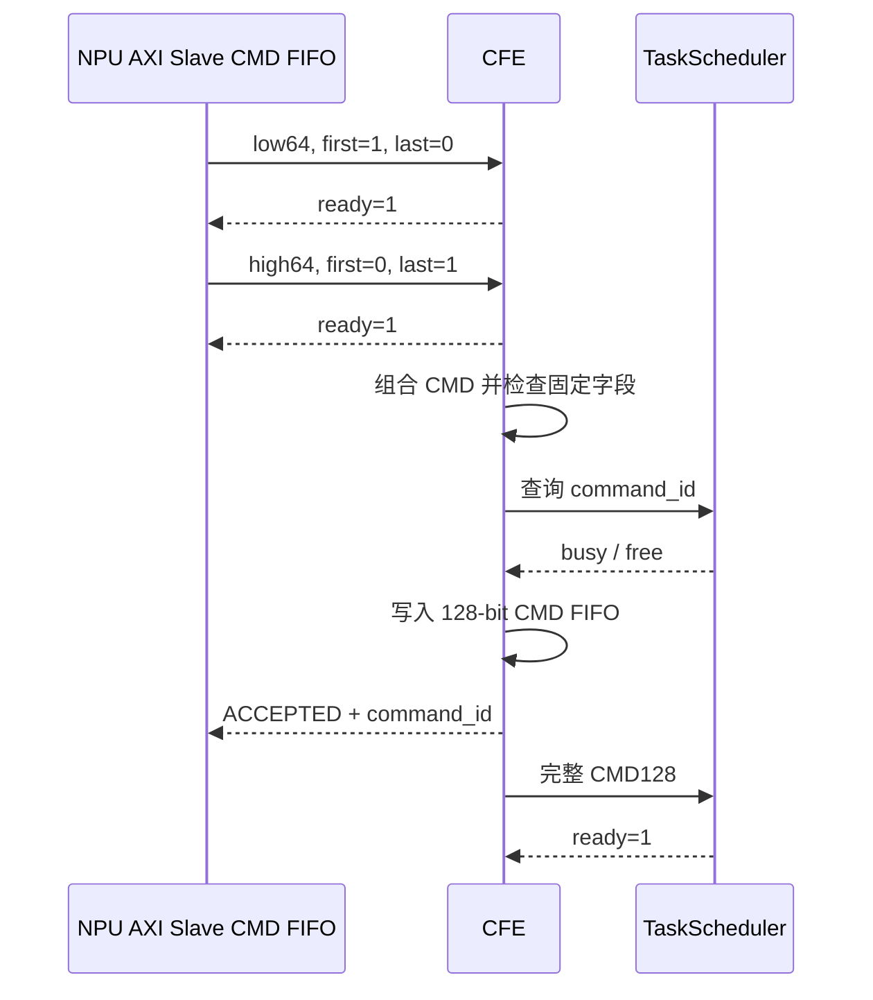
```mermaid
%%{init: {"sequence": {"useMaxWidth": true, "actorMargin": 14, "width": 82, "messageMargin": 10, "noteMargin": 6}, "themeVariables": {"fontSize": "11px"}}}%%
sequenceDiagram
    participant AXIS as NPU AXI Slave CMD FIFO
    participant CFE
    participant TS as TaskScheduler

    AXIS->>CFE: low64, first=1, last=0
    CFE-->>AXIS: ready=1
    AXIS->>CFE: high64, first=0, last=1
    CFE-->>AXIS: ready=1
    CFE->>CFE: 组合 CMD 并检查固定字段
    CFE->>TS: 查询 command_id
    TS-->>CFE: busy / free
    CFE->>CFE: 写入 128-bit CMD FIFO
    CFE-->>AXIS: ACCEPTED + command_id
    CFE->>TS: 完整 CMD128
    TS-->>CFE: ready=1
```

无停顿时，两拍接收后依次完成固定字段检查、编号查询和 FIFO 写入。若
TaskScheduler 暂停接收，当前完整 CMD 保留在 CFE FIFO 读出端；
`ts_cmd_valid_o=1` 且 `ts_cmd_ready_i=0` 时，`ts_cmd_o[127:0]` 必须保持
不变。完整 CMD 完成握手后才能删除该 FIFO 项。

### 7.5 外部 Generic Core 与驱动集成要求

Generic Core 可以是 RV64、Arm64 或其他具有 64-bit AXI Master 访问能力的主控 CPU，NPU 不依赖 CPU ISA。C 驱动必须：

1. 把每条 CMD128 的 low、high word 放在相邻位置，再对 `CMD_FIFO_DATA`
   发出 2～16 beat 的 FIXED burst；
2. 检查 AXI `BRESP`，随后从 `CMD_RSP_FIFO` 读取与提交命令数相同的响应；
3. 通过 `CTL_ARG0/1`、`CTL_START`、`CTL_STATUS` 和 `CTL_RESULT` 完成等待、查询、FENCE 和 ACK；
4. 复位期间不写命令 FIFO；NPU 返回不支持或设备停止状态时，把错误传给上层应用；
5. 使用中断或轮询等待完成，并允许软件超时后写 `CTL_CANCEL` 结束同步等待。

Descriptor 位于可缓存内存时，软件在提交前必须执行 Store Release，并按 SoC 一致性规则把 Descriptor 和输入数据写到 NPU 可见的存储层级。NPU 写完输出后，软件在读取输出前执行 Load Acquire，并在非一致缓存系统中使对应 CPU Cache 数据失效。

`npu_drv_fence()` 只保证 NPU 任务和 NPU 内存写入的先后次序，不自动执行 CPU Cache clean 或 invalidate。

---

## 8. TaskScheduler 与 Descriptor Fetch Unit

### 8.1 功能划分

TaskScheduler（TS）包含：

- CMD 输入 FIFO；
- 任务状态表；
- Event Table；
- Descriptor Fetch Unit（DFU）；
- Descriptor SRAM；
- 静态字段检查器；
- 每个执行单元的待发队列；
- 完成消息接收器；
- 超时计数器。

Control Engine 不设置独立算术模块。`NOP`、`EVENT_SIGNAL`、`EVENT_REARM`、`EVENT_JOIN` 和 `GLOBAL_FENCE` 由 TS 内部的 Control Queue 执行；这类任务不占用 DMA、Matrix、IVE 或 CME。

P0 只定义一个全局提交序列，不定义多个软件 Queue。TS 在一条 128-bit CMD
完成 `cfe_cmd_valid_i && cfe_cmd_ready_o` 握手时分配一个 64-bit
`submit_seq`，复位后从 0 开始，每接受一条完整 CMD 加 1。外部低、高 beat
已由 CFE 组合，TS 不再观察 beat 次序。现有 opcode 名称按以下方式解释：

- `GLOBAL_FENCE` 等待其 CMD 接受时已经存在且被 Engine mask 选中的任务；
- `ORDERED=1` 的任务等待所有较小 `submit_seq` 的任务进入终态；
- `ORDERED=1` 的任务结束前，较大 `submit_seq` 的任务不得发射；
- 等待关系使用 `submit_seq`，不能使用可能被软件复用的 `command_id` 比较先后。

停止接收新 CMD 使用 LSC `CORE_CONTROL.stop`；软件随后调用 `npu_drv_fence()` 等待已提交任务。P0 不提供异步 HALT opcode。

任务状态按下列次序变化：

```text
FREE
→ FETCH_DESC
→ CHECK_DESC
→ WAIT_EVENT
→ READY
→ RUNNING
→ COMMIT
→ SUCCESS / ERROR / DEPENDENCY_FAILED / TIMEOUT
```

状态只能向右变化。进入终态后，该任务不得再次发射。

终态任务表项继续保存 `status`、`user_tag`、`signal_event`、第一个错误地址、`progress`、`error_info` 和 `done_flags`，直到软件调用 `npu_drv_ack_task()`。ACK 响应完成 `axi_ctl_rsp_valid_o && axi_ctl_rsp_ready_i` 握手后，TS 才释放任务表项和 `command_id`；此前 CFE 编号查询必须返回 busy。STATUS、TAG_EVENT、FAULT_ADDR、PROGRESS、ERROR_INFO、DONE_FLAGS、`npu_drv_wait_event()` 和中断清除都不释放终态记录。描述符槽可在终态信息完整复制到任务表后提前释放。

软件必须及时 ACK 已处理的终态记录；终态记录占满任务表时，TS 暂停接受新 CMD。受控软复位和外部 Core 复位会清除全部任务表项，无需逐项 ACK。

### 8.2 CFE 到 TS 的信号

| 信号 | TS 方向 | 位宽 | 说明 |
| --- | --- | ---: | --- |
| `cfe_cmd_valid_i` | Input | 1 | 当前完整 CMD 有效 |
| `cfe_cmd_ready_o` | Output | 1 | TS 有空闲任务表项并可接收 CMD |
| `cfe_cmd_i` | Input | 128 | `{high_word, low_word}` |
| `cmd_id_lookup_valid_i` | Input | 1 | CFE 请求查询编号 |
| `cmd_id_lookup_id_i` | Input | 12 | 待查询的 `command_id` |
| `cmd_id_lookup_ready_o` | Output | 1 | TS 接受查询 |
| `cmd_id_lookup_rsp_valid_o` | Output | 1 | 查询握手后一周期结果有效 |
| `cmd_id_busy_o` | Output | 1 | 查询编号已存在 |

TS 只有在任务表存在空项时才接收完整 CMD。握手时分配任务表项并读取
`desc_addr`、`command_id`、`engine`、`opcode`、事件和选项字段；固定字段
有效时直接进入 `FETCH_DESC`，否则以 `BAD_DESC` 进入终态。CFE 已负责外部
低、高两个 beat 的顺序和超时检查，TS 不保存半条命令。

`cfe_cmd_valid_i=1` 且 `cfe_cmd_ready_o=0` 时，`cfe_cmd_i[127:0]` 必须保持
不变。受控停止或复位期间，TS 不接受新的完整 CMD。

`cmd_id_lookup_rsp_valid_o` 没有对应的 ready 信号。查询请求握手后的下一周期，
TS 产生一个周期的响应脉冲，CFE 必须无条件接收
`cmd_id_busy_o`，不能对该响应施加暂停。

#### 8.2.1 AXI 控制窗口请求接口

WAIT、QUERY 和 FENCE 使用下列 TS 端口：

| 信号 | TS 方向 | 位宽 | 说明 |
| --- | --- | ---: | --- |
| `axi_ctl_valid_i` | Input | 1 | 控制请求有效 |
| `axi_ctl_ready_o` | Output | 1 | TS 可接收 |
| `axi_ctl_op_i` | Input | 2 | WAIT、QUERY 或 FENCE |
| `axi_ctl_arg0_i` | Input | 64 | `CTL_ARG0` 的稳定副本 |
| `axi_ctl_arg1_i` | Input | 64 | `CTL_ARG1` 的稳定副本 |
| `axi_ctl_cancel_i` | Input | 1 | 取消当前控制等待 |
| `axi_ctl_rsp_valid_o` | Output | 1 | 控制响应有效 |
| `axi_ctl_rsp_ready_i` | Input | 1 | AXI 控制窗口可接收 |
| `axi_ctl_rsp_data_o` | Output | 64 | 写入 `CTL_RESULT` 的结果 |

P0 同时最多保留一条未完成控制请求。`axi_ctl_valid_i=1` 且 `axi_ctl_ready_o=0` 时，请求字段必须保持不变；响应暂停时，`axi_ctl_rsp_data_o` 必须保持不变。

`axi_ctl_op_i` 的 RTL 常量固定为 `NPU_CTL_WAIT=2'd1`、
`NPU_CTL_QUERY=2'd2`、`NPU_CTL_FENCE=2'd3`；`2'd0` 为非法请求并返回
`BAD_DESC`。AXI 控制窗口的 `CTL_START[1:0]` 使用相同编码。

`axi_ctl_cancel_i` 只作用于已经握手但尚未响应的 WAIT 或 FENCE。TS 收到取消后释放控制请求状态，不修改任务表、Event Table 或全局提交序列；QUERY 在固定短延迟内返回，不接受取消。

#### 8.2.2 公共 `op_flags` 位定义

所有非 Control 描述符的公共 `op_flags[31:0]` 使用相同定义：

| Bit | 字段 | 含义 |
| ---: | --- | --- |
| 0 | `src0_is_gaddr` | 1 表示 `src0_addr` 为 GADDR，0 表示 LADDR |
| 1 | `src1_is_gaddr` | 1 表示 `src1_addr` 为 GADDR，0 表示 LADDR |
| 2 | `src2_is_gaddr` | 1 表示 `src2_addr` 为 GADDR，0 表示 LADDR |
| 3 | `dst_is_gaddr` | 1 表示 `dst_addr` 为 GADDR，0 表示 LADDR |
| 4 | `aux0_is_gaddr` | 1 表示 `aux0_addr` 为 GADDR，0 表示 LADDR |
| 5 | `aux1_is_gaddr` | 1 表示 `aux1_addr` 为 GADDR，0 表示 LADDR |
| 6 | `allow_inplace` | 允许符合当前 opcode 规则的原地址写回 |
| 7 | `allow_partial_dest` | 失败时允许目的区域已有部分数据被写入 |
| 31:8 | `reserved` | P0 必须写 0 |

Matrix、IVE 和 CME 的所有张量地址必须使用 LADDR，因此它们的地址类型位必须为 0。DMA 可以按 `src_space`、`dst_space` 使用 LADDR 或 GADDR，但公共地址类型位必须与专有字段一致。`desc_type[3:0]` 必须等于零扩展后的 `{1'b0,CMD.engine}`，`desc_type[7:4]` 必须为 0。

### 8.3 DFU 到 MIF 的 64-bit 接口

| 信号 | DFU 方向 | 位宽 | 说明 |
| --- | --- | ---: | --- |
| `df_mem_req_valid_o` | Output | 1 | 描述符读请求有效 |
| `df_mem_req_ready_i` | Input | 1 | MIF 可接收 |
| `df_mem_req_addr_o` | Output | 48 | 描述符虚拟字节地址 |
| `df_mem_req_beats_o` | Output | 8 | 64-bit beat 数减 1 |
| `df_mem_req_tag_o` | Output | 12 | 对应 `command_id` |
| `df_mem_req_task_id_o` | Output | 12 | 产生本次读取的 `command_id` |
| `df_mem_req_attr_o` | Output | 8 | cache、读取权限、QOS 和 TBU bypass 属性 |
| `df_mem_rsp_valid_i` | Input | 1 | 返回 beat 有效 |
| `df_mem_rsp_ready_o` | Output | 1 | DFU 可接收 |
| `df_mem_rsp_data_i` | Input | 64 | 描述符数据 |
| `df_mem_rsp_tag_i` | Input | 12 | 对应命令 |
| `df_mem_rsp_last_i` | Input | 1 | 最后一个 beat |
| `df_mem_rsp_status_i` | Input | 8 | 地址转换或 AXI 状态 |

64B 公共前缀先读取八拍。若检查通过，DFU 按 `desc_bytes` 继续读取剩余描述符；若检查失败，不再发出后续读请求。

`df_mem_rsp_status_i` 直接使用第 4.3 节的 8-bit 任务 status 编码：
成功 beat 为 `SUCCESS`，地址转换失败、AXI 失败和协议错误分别使用对应
status。P0 DFU 同时只保留一个活动描述符读取，先完成公共前缀，再读取剩余
部分；两个描述符的返回 beat 不允许交错。`df_mem_rsp_tag_i` 或
`df_mem_rsp_last_i` 与活动事务不符时，当前任务返回 `BAD_DESC`。

`df_mem_rsp_status_i` 只接受第 4.3 节表中 `0x00～0x0D` 的任务状态。
其余编码均视为 DFU 返回接口错误。TS 仍须完成该返回 beat 的握手，把当前
任务状态设为 `BAD_DESC`，并在 `error_info` 的 `stage=DESC_PORT`、
`detail` 字段保存收到的原始 8-bit 编码。非法编码不得写入任务状态、
事件状态或终态通知。

### 8.4 Descriptor SRAM 读取接口

每个执行单元各有一组只读端口：

| 信号 | 执行单元方向 | 位宽 | 说明 |
| --- | --- | ---: | --- |
| `desc_rd_req_valid_o` | Output | 1 | 读取描述符 word |
| `desc_rd_req_ready_i` | Input | 1 | SRAM 端口可接收 |
| `desc_rd_slot_o` | Output | 8 | 描述符槽号 |
| `desc_rd_word_o` | Output | 6 | 64-bit word 编号 |
| `desc_rd_req_tag_o` | Output | 4 | 当前端口的读取编号 |
| `desc_rd_rsp_valid_i` | Input | 1 | 返回有效 |
| `desc_rd_rsp_ready_o` | Output | 1 | 执行单元可接收 |
| `desc_rd_rsp_data_i` | Input | 64 | 描述符数据 |
| `desc_rd_rsp_tag_i` | Input | 4 | 对应读取编号 |
| `desc_rd_rsp_status_i` | Input | 3 | 正常、已修正 ECC 或不可修正 ECC |

描述符槽从任务进入 `FETCH_DESC` 时分配，到任务进入终态且完成消息被记录后释放。

同一执行单元端口最多保留 16 个未完成读取，并且在旧响应握手前不得复用相同 tag。不可修正 ECC 使任务返回 `BAD_DESC`，不得把错误数据送入执行单元译码器。

`desc_rd_rsp_status_i[2:0]` 固定编码如下：

| 编码 | 名称 | 行为 |
| ---: | --- | --- |
| `0` | `OK` | 接收数据 |
| `1` | `ECC_CORRECTED` | 接收已修正数据，并增加 `ecc_corrected_count` |
| `2` | `ECC_UNCORRECTABLE` | 丢弃数据，任务返回 `BAD_DESC` |
| `3～7` | `PORT_PROTOCOL_ERROR` | 丢弃数据，任务返回 `BAD_DESC` |

请求握手后，返回延迟至少为一个周期且可以变化；不同 tag 的响应允许改变先后次序。执行单元必须用 `desc_rd_rsp_tag_i` 放回对应 word，不能依靠响应次序。若具体 Descriptor SRAM 固定在请求后一周期返回，则该实现会自然按请求次序响应，但接口语义仍以 tag 为准。

Descriptor SRAM 即使发现不可修正 ECC，也要完成一次响应握手：
`desc_rd_rsp_valid_i=1`、`desc_rd_rsp_status_i=2`、`desc_rd_rsp_data_i=0`，
并返回原请求 tag。执行单元依据 status 丢弃 data。非法 slot、word、tag
复用或所属执行单元不符的请求也必须被端口接收并返回
`PORT_PROTOCOL_ERROR`，不能通过永久拉低 `desc_rd_req_ready_i` 隐藏错误。

### 8.5 TS 到执行单元的任务接口

DMA、Matrix、Vector 和 Complex Engine 各有一组相同接口：

| 信号 | 执行单元方向 | 位宽 | 说明 |
| --- | --- | ---: | --- |
| `eng_req_valid_i` | Input | 1 | 任务元数据有效 |
| `eng_req_ready_o` | Output | 1 | 执行单元可接收 |
| `eng_req_data_i` | Input | 64 | 任务元数据 |
| `eng_done_valid_o` | Output | 1 | 完成消息 beat 有效 |
| `eng_done_ready_i` | Input | 1 | TS 可接收 |
| `eng_done_data_o` | Output | 64 | 固定三拍完成消息 |
| `eng_done_first_o` | Output | 1 | 完成消息第一拍 |
| `eng_done_last_o` | Output | 1 | 完成消息第三拍 |
| `eng_cancel_valid_i` | Input | 1 | TS 请求终止当前活动任务 |
| `eng_cancel_ready_o` | Output | 1 | 执行单元接受本次终止原因 |
| `eng_cancel_status_i` | Input | 8 | P0 只允许 `TIMEOUT` 或 `ABORTED` |
| `eng_abort_i` | Input | 1 | 受控复位时停止产生新请求 |
| `param_l1_base_i` | Input | 24 | 当前参数区起始 LADDR，8B 对齐 |
| `param_l1_limit_i` | Input | 24 | 当前参数区末地址的下一个字节，8B 对齐 |
| `param_lock_i` | Input | 1 | 参数区写保护已经启用 |
| `eng_quiescent_o` | Output | 1 | 单元无新请求、无未完成读写且内部流水为空 |

`eng_req_data_i` 定义：

| Bit | 字段 | 含义 |
| --- | --- | --- |
| `[11:0]` | `task_id` | 等于 CMD 的 `command_id` |
| `[19:12]` | `opcode` | 当前执行单元 opcode |
| `[27:20]` | `desc_slot` | Descriptor SRAM 槽号 |
| `[39:28]` | `task_flags` | `[5:0]` 依次保存 CMD `header_flags` 中的 IRQ 成功、IRQ 失败、STRICT、TRACE、ORDERED、DESC_CRC，`[11:6]` 写 0 |
| `[43:40]` | `timeout_class` | 保存 CMD `header_flags[9:6]`，选择一个 32-bit `TIMEOUT_CLASS[n]` CSR |
| `[63:44]` | `reserved` | 必须为 0 |

这组元数据没有重复携带 engine 字段，因为 DMA、ME、IVE、CME 使用四组物理独立端口，端口实例已经确定 engine。执行单元仍必须检查 opcode 属于本实例，并在描述符读取完成后检查 `desc_type` 与本实例一致。

完成消息字段如下：

| Beat | Bit | 字段 |
| ---: | --- | --- |
| 0 | `[11:0]` | `task_id` |
| 0 | `[19:12]` | `status` |
| 0 | `[51:20]` | `error_info` |
| 0 | `[63:52]` | `done_flags`，包含 `PARTIAL_DEST` |
| 1 | `[47:0]` | 第一个错误虚拟地址；无错误时为 0 |
| 1 | `[51:48]` | `engine` |
| 1 | `[59:52]` | `opcode` |
| 1 | `[63:60]` | 保留，写 0 |
| 2 | `[63:0]` | `progress`，DMA 表示已确认字节数，计算单元表示已写回元素数 |

即使任务失败，也必须发送完整三拍。`eng_done_first_o` 只在 Beat 0 为 1，`eng_done_last_o` 只在 Beat 2 为 1。

`error_info[31:0]` 使用统一诊断格式：

| Bit | 字段 | 说明 |
| ---: | --- | --- |
| 31:28 | `stage` | `0=NONE`、`1=METADATA`、`2=DESC_PORT`、`3=DESC_DECODE`、`4=EXECUTE`、`5=ABORT`、`6=TASK_SCHEDULER` |
| 27:16 | `detail` | P0 使用低 8 bit；元数据原因、端口状态或任务 status |
| 15:8 | `desc_word` | 出错的 64-bit 描述符 word；不适用时为 `0xFF` |
| 7:0 | `opcode` | 当前任务 opcode |

`stage=METADATA` 时，`detail` 为 `1=RESERVED_NONZERO`、`2=TASK_FLAGS_INVALID`、`3=DESC_SLOT_INVALID`、`4=OPCODE_INVALID`、`5=DESC_CRC_UNSUPPORTED`。`stage=DESC_PORT` 时，`detail` 保存 `desc_rd_rsp_status_i`。`stage=DESC_DECODE`、`EXECUTE` 或 `TASK_SCHEDULER` 时，`detail` 保存第 7.4 节 status。SUCCESS 时 `error_info=0`。

TS 自身产生的非成功终态必须带有非零 `error_info`。受控复位产生的
`ABORTED` 使用 `stage=ABORT`；CMD 结构错误、事件资源错误、依赖失败、
Control 任务错误以及其他由 TS 确定的失败使用 `stage=TASK_SCHEDULER`，
`detail=status`、`desc_word=0xFF`、`opcode=原任务 opcode`。

若执行单元的 done Beat 0 给出合法的非成功 status，却把 `error_info` 写成
0，TS 记录一次 done 端口协议错误，并按 `TASK_SCHEDULER` 格式补出诊断字段；
已经收到的合法 status 保持不变。若 Beat 0 的 status 编码本身非法，则按
`BAD_DESC` 完成并生成对应的 `TASK_SCHEDULER` 诊断字段。

`done_flags[11:0]` 使用以下编码：

| Bit | 名称 | 含义 |
| ---: | --- | --- |
| 0 | `PARTIAL_DEST` | 任务失败前至少一个目的字节已经获得写完成响应 |
| 1 | `FAULT_ADDR_IS_L1` | Beat 1 的错误地址是 LADDR；为 0 时按 GVA 解释 |
| 2 | `ABORT_DRAINED` | 任务因受控复位终止，且已发请求已经排空 |
| 11:3 | `RESERVED` | 必须写 0 |

所有描述符、shape、静态地址范围和已知重叠错误必须在首笔目的写请求前检查，因此这类错误的 `PARTIAL_DEST=0`。AXI 后期错误、L1BUF 错误、任务超时或复位可能发生在部分写完成之后；即使公共 `allow_partial_dest=0`，硬件也不能撤销已经完成的写入，此时仍必须设置 `PARTIAL_DEST=1`，软件应把整个目的张量视为无效。`allow_partial_dest=1` 只表示软件已经准备好接收流式任务的部分写报告，不表示失败时的目的数据可继续使用。

Beat 1 必须保存本任务最先发现的无效字节地址。例如，一个从地址
`0x0FFF` 开始的 2B 访问中，`0x0FFF` 有效而 `0x1000` 无效时，返回地址是
`0x1000`，不能只返回描述符中的起始地址 `0x0FFF`。若失败来自张量声明的
`region_bytes`，返回第一个超出该区域的绝对字节地址；若失败来自实际 L1BUF
或 DDR 容量，返回对应存储空间的第一个不存在的字节地址。

`eng_abort_i` 是电平信号。执行单元看到它为 1 后停止生成新请求，处理或丢弃尚未提交的数据，并等待已发出的 Descriptor SRAM、L1BUF 或 MIF 请求返回；完成这些动作后拉高 `eng_quiescent_o`。在 `eng_abort_i` 撤销前，单元不得接受新的任务元数据。

`eng_cancel_*` 是单个活动任务的 ready/valid 接口。TS 发现执行超时后保持
`eng_cancel_valid_i=1` 和 `eng_cancel_status_i=TIMEOUT`，直到
`eng_cancel_ready_o=1` 完成握手。终止请求暂停期间，TS 仍保持
`eng_done_ready_i=1`，任务仍为 RUNNING，不能提前写终态或释放对应 Engine。
执行单元只有在存在活动任务、尚未锁定其他完成原因且 status 合法时才能拉高
`eng_cancel_ready_o`。

终止请求握手后，执行单元撤销尚未握手的描述符和数据请求；已经握手的
Descriptor SRAM、L1BUF 或 MIF 请求必须继续接收并排空。若终止请求与一个
描述符请求在同一周期握手，该描述符请求属于已发请求，也必须等待其响应。
全部已发请求返回后，执行单元发送 status 等于终止原因的完整三拍 done。
TIMEOUT 使用 `stage=EXECUTE`、`detail=TIMEOUT`、`desc_word=0xFF`；
ABORTED 使用 `stage=ABORT`，并设置 `ABORT_DRAINED`。

若 `eng_req_valid_i` 已置 1但尚未握手，TS 只在 `eng_abort_i` 置位时撤销该请求，并直接把仍处于 READY 的任务写成 `ABORTED`，执行单元不得为它再发送第二份终态。与此不同，执行单元在 abort 到来前已经拉高的 `desc_rd_req_valid_o` 是向 Descriptor SRAM 发出的请求，必须保持到握手，随后把该请求纳入排空计数。这样既不会重复终止同一任务，也不会遗留没有接收者的描述符响应。

#### 8.5.1 `CONTROL_DESC`

`CONTROL_DESC` 固定为 64B，因此直接复用公共前缀中的字段，不增加后续字节。Control 任务不发起内存访问，所有地址字段的未使用高位必须为 0，`numeric_cfg` 必须为 0，`op_flags[7:0]` 必须为 0。Control 任务 CMD 中的 `DESC_CRC_ENABLE` 必须为 0；否则 CRC32C 会占用 `0x3C～0x3F` 并覆盖 `user_tag`，TS 必须返回 `BAD_DESC`。

| 公共字段 | Control 含义 |
| --- | --- |
| `src0_addr[11:0]` | `event_a` |
| `src1_addr[11:0]` | `event_b` |
| `dst_addr[11:0]` | `event_out` |
| `aux0_addr[3:0]` | Engine mask：DMA、ME、IVE、CME |
| `aux1_addr` | 未使用，必须写 0；超时类别来自 CMD `header_flags.TIMEOUT_CLASS` |
| `op_flags[9:8]` | `join_mode`：`0=ALL_SUCCESS`、`1=ANY_SUCCESS`、`2=ALL_TERMINAL`、`3` 保留 |
| `user_tag` | 完成消息原样返回的软件标记 |

各 Control opcode 使用字段如下：

| Opcode | 必需字段 | 行为 |
| --- | --- | --- |
| `NOP` | 无 | 不修改事件 |
| `EVENT_SIGNAL` | `event_out` | 将已经保留且 generation 相同的事件设为 SUCCESS |
| `EVENT_REARM` | `event_a`、`event_out` | 两者 Event ID 相同，`event_out.generation=(event_a.generation+1) mod 16` |
| `EVENT_JOIN` | `event_a`、`event_b`、`event_out`、`join_mode` | 按模式等待两个输入事件并写输出事件 |
| `GLOBAL_FENCE` | Engine mask、CMD 中的 `TIMEOUT_CLASS` | 按全局 `submit_seq` 快照等待所选单元 |

Control 描述符中未使用的地址字段和位必须为 0。`EVENT_REARM` 不按普通任务规则提前保留 `event_out`；它只有在旧事件已经进入终态且 `waiter_count=0` 时，才把同一 Event ID 的 generation 按模 16 加 1，并把状态改为 FREE。条件不满足时返回 `BAD_DESC`。

`EVENT_JOIN` 不使用普通任务的“任一依赖失败立即进入 DEPENDENCY_FAILED”规则，而是按下表处理：

| `join_mode` | 完成条件 | 输出状态 |
| --- | --- | --- |
| ALL_SUCCESS | 两者成功，或任一输入失败 | 两者成功时 SUCCESS；失败时返回先观察到的失败 |
| ANY_SUCCESS | 任一输入成功，或两者都失败 | 有成功输入时 SUCCESS；两者失败时优先保存 `event_a` 的错误 |
| ALL_TERMINAL | 两者都进入终态 | 两者成功时 SUCCESS；否则优先保存 `event_a` 的错误 |

`event_a` 与 `event_b` 必须是不同事件引用。`GLOBAL_FENCE` 的自身 `submit_seq` 记为 $s_f$，只检查 `submit_seq<s_f` 且被 mask 选中的任务，不等待 Fence 自身；Engine mask 为 0 时立即成功。若被检查的任务中存在失败，Fence 返回最小 `submit_seq` 对应的失败状态，否则返回 SUCCESS。

`EVENT_SIGNAL` 和 `EVENT_JOIN` 要求 CMD 的 `signal_event` 等于描述符
`event_out`，由普通接收流程先保留该事件。`EVENT_JOIN` 还要求 CMD 的
`wait_event_0=event_a`、`wait_event_1=event_b`。`EVENT_REARM` 要求 CMD 的
`signal_event=0xFFF`，避免接收阶段提前占用新 generation。`GLOBAL_FENCE`
若需要异步完成事件，直接使用 CMD 的 `signal_event`，描述符 `event_out`
必须写 0。

TS 在 Fence CMD 单拍握手时保存当时全部较小 `submit_seq` 的 Engine 任务；Control 描述符检查成功后，再用 `engine_mask` 选出实际等待项。这样，即使某个较早任务在描述符读取期间结束，它的状态仍保留在 Fence 的目标记录中。Fence CMD 之后提交的任务不加入这份记录，即使它使用同一个 Engine 也不会延迟当前 Fence。一个 Engine 任务只有在三拍完成消息全部接收并进入终态后，才算满足 Fence 的等待条件；只接收 Beat 0 或 Beat 0、Beat 1 时仍继续等待。

若多个目标任务失败，Fence 按最小 `submit_seq` 选择状态，选择结果与各任务完成的先后次序无关。Fence 的 `signal_event` 在 CMD 接收时进入 RESERVED；Fence 成功进入终态后改为 SUCCESS，失败或超时进入终态后改为 ERROR，并把 Fence 的最终状态写入 `error_status`。

### 8.6 Event Table

每个事件表项保存：

| 字段 | 位宽 | 含义 |
| --- | ---: | --- |
| `state` | 3 | FREE、RESERVED、SUCCESS、ERROR |
| `generation` | 4 | 当前代次 |
| `producer_task_id` | 12 | 产生该事件的任务 |
| `error_status` | 8 | 生产者失败原因 |
| `waiter_count` | 8 | 尚未离开等待状态的任务数 |

`producer_task_id` 是 12-bit 字段，因此保留事件时只接受
`0x000～0xFFF`。超过该范围时返回 `BAD_DESC`，Event Table 不发生改变。
事件终态只接受本 Spec 第 4.3 节定义的 `SUCCESS` 到 `ADDR_OVERLAP`：
`SUCCESS` 写成 SUCCESS，其余值写成 ERROR 并保存到 `error_status`。
未定义的 8-bit 状态码、`BUSY` 和 `NOT_FOUND` 均返回 `BAD_DESC`，原来的
RESERVED 表项保持不变。

复位后 255 个 Event Table 表项全部为 `state=FREE`、`generation=0`、`producer_task_id=0`、`error_status=0`、`waiter_count=0`。首次使用某 Event ID 时，CMD 必须引用 generation 0。后续 generation 只能由 `EVENT_REARM` 在旧事件已进入终态且 `waiter_count=0` 时增加。

任务接收时，只有 `signal_event!=0xFFF` 才保留输出事件。消费者引用的生产者事件必须已经存在或已经进入终态，从而避免形成循环等待。事件只有在进入终态且 `waiter_count=0` 后才能通过 `EVENT_REARM` 换用下一代次。

任务的执行超时从 `eng_req_valid && eng_req_ready` 的下一周期开始，到 done Beat 0 完成 `eng_done_valid && eng_done_ready` 握手时停止；`WAIT_EVENT`、`ORDERED` 等待时间和 Beat 1/2 的接口暂停时间不计入该执行超时。Beat 0 已经给出不可修改的 status，因此不能在 Beat 0 握手后再把任务改成 TIMEOUT。`GLOBAL_FENCE` 使用自身 `timeout_class` 从进入 Control Queue 可执行状态的下一周期开始计时。

`TIMEOUT_CLASS[n]=0` 表示关闭该任务计时。若上限为 $L>0$，发射后的第一个完整执行周期把计数器记为 1；硬件允许任务使用 $L$ 个完整周期，在下一周期更新时仍未接收 done Beat 0 才通过 `eng_cancel_*` 请求 `TIMEOUT`。若 Beat 0 握手与超时检查发生在同一周期，done 优先，TS 不产生终止请求。超时请求握手后，执行单元按第 8.5 节规定排空已发请求，再发送 status 为 TIMEOUT 的完整完成消息；TS 收齐三拍后才写入终态。

Beat 0 握手后，TS 进入固定的 `COLLECT_DONE` 状态并只接受同一任务的 Beat 1、Beat 2。执行单元必须在接口恢复 ready 后继续发送，且暂停期间保持数据与 first/last 不变；缺拍、重复 first、提前 last、task ID 改变或保留位非零均属于端口协议错误，由验证环境报告，不能改写已经握手的 Beat 0 status。

软件必须按生产者先于消费者的次序提交任务。事件引用的 generation 与表项不一致时，任务返回 `BAD_DESC`。保留 `signal_event`、增加依赖事件的 `waiter_count` 和分配任务表项必须在同一次 TS 状态更新中完成；任一资源不足时均不得只更新其中一部分。

若任一依赖事件失败：

1. 消费者不得发给执行单元；
2. 消费者进入 `DEPENDENCY_FAILED`；
3. 消费者自己的 `signal_event` 也进入失败终态；
4. 后续任务可以继续退出等待状态，不会永久停住。

### 8.7 TS 功能时序

| 周期或阶段 | 条件 | 动作 |
| --- | --- | --- |
| T0 | `cfe_cmd_valid_i && cfe_cmd_ready_o`，完整 CMD128 握手 | 分配任务表项和 `submit_seq`，保存命令字段；固定字段合法时进入 `FETCH_DESC` |
| T1 | 任务处于 `FETCH_DESC` 且 DFU 可接收 | DFU 发出公共前缀读取请求 |
| T2～Tn | 64-bit 数据返回 | 写 Descriptor SRAM |
| Tn+1 | 公共前缀完整 | 检查版本、长度、engine 和 dtype |
| Tn+2～Tm | 需要专有字段 | 继续读取描述符 |
| Tm+1 | 全部字段合法 | 进入 `WAIT_EVENT` 或 `READY` |
| Tk | 依赖成功且单元 ready | `eng_req_valid && eng_req_ready` |
| Td | 收到三拍完成消息 | 把 status、`user_tag`、错误地址、`progress` 和时间戳写入终态记录 |
| Td+1 | 终态记录完整 | 更新任务状态、Event Table 和性能计数器 |
| Td+2 | 需要中断 | 更新 LSC `IRQ_STATUS` |

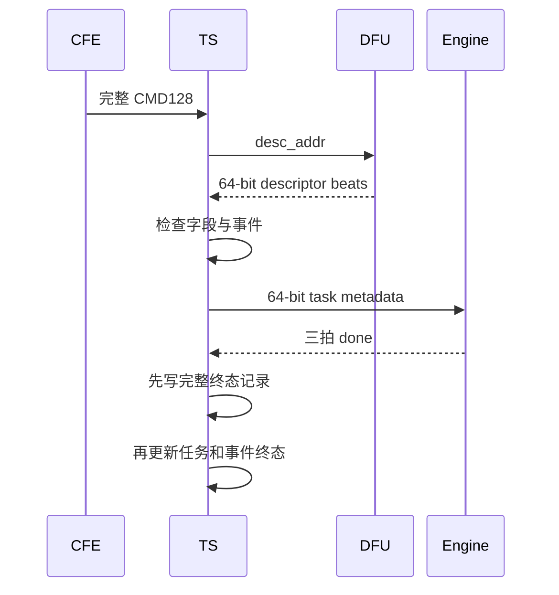
```mermaid
%%{init: {"sequence": {"useMaxWidth": true, "actorMargin": 14, "width": 82, "messageMargin": 10, "noteMargin": 6}, "themeVariables": {"fontSize": "11px"}}}%%
sequenceDiagram
    participant CFE
    participant TS
    participant DFU
    participant ENG as Engine

    CFE->>TS: 完整 CMD128
    TS->>DFU: desc_addr
    DFU-->>TS: 64-bit descriptor beats
    TS->>TS: 检查字段与事件
    TS->>ENG: 64-bit task metadata
    ENG-->>TS: 三拍 done
    TS->>TS: 先写完整终态记录
    TS->>TS: 再更新任务和事件终态
```

任务成功只能在所有结果写请求获得完成响应后产生。Matrix 的最后一次乘加结束、DMA 的最后一个读数据 beat 到达或 Complex Engine 的最后一个函数结果生成，都不是任务成功点。

---

## 9. DMA / Layout Engine

### 9.1 模块组成与功能

DMA 包含：

- 1～5 维地址生成器；
- 64-bit 全局内存请求生成器；
- 内部请求 tag 与未完成请求表；
- 读返回 FIFO 和写数据 FIFO；
- INT4 解包和打包器；
- INT4、INT8、INT16、INT32 之间按 `convert_mode` 执行的整数格式转换单元；
- 二维转置、pack 和 split 数据整理单元；
- L1BUF 读写请求器；
- 错误记录和进度计数器。

DMA 不执行 scale、zero point、乘法或 `round_mode` 指定的舍入。需要改变 scale 的数据必须交给 Vector 或 Complex Engine。`NONE` 只允许源、目的 dtype 相同；`SIGN_EXTEND` 保持整数值；`SATURATE_NARROW` 将范围外结果写为目的格式端点；`PACK_INT4` 在写入前检查每个源元素属于 `[-8,7]`。

### 9.2 模块级信号

任务和描述符端口采用第 8.4、8.5 节定义。DMA 新增下列接口：

| 信号 | DMA 方向 | 位宽 | 说明 |
| --- | --- | ---: | --- |
| `dma_mem_cmd_valid_o` | Output | 1 | 全局内存请求有效 |
| `dma_mem_cmd_ready_i` | Input | 1 | MIF 可接收 |
| `dma_mem_cmd_write_o` | Output | 1 | 0 为读，1 为写 |
| `dma_mem_cmd_addr_o` | Output | 48 | 全局虚拟字节地址 |
| `dma_mem_cmd_beats_o` | Output | 8 | 64-bit beat 数减 1 |
| `dma_mem_cmd_tag_o` | Output | 12 | DMA 内部请求 tag |
| `dma_mem_cmd_task_id_o` | Output | 12 | 当前 DMA 任务的 `command_id` |
| `dma_mem_cmd_attr_o` | Output | 8 | cache、权限、QOS 和 TBU bypass 属性 |
| `dma_mem_wvalid_o` | Output | 1 | 写数据有效 |
| `dma_mem_wready_i` | Input | 1 | MIF 可接收写数据 |
| `dma_mem_wdata_o` | Output | 64 | 写数据 |
| `dma_mem_wstrb_o` | Output | 8 | 写字节有效位 |
| `dma_mem_wlast_o` | Output | 1 | 当前请求最后一拍 |
| `dma_mem_wtag_o` | Output | 12 | 写数据所属的内部请求 tag |
| `dma_mem_rsp_valid_i` | Input | 1 | 读返回或写完成有效 |
| `dma_mem_rsp_ready_o` | Output | 1 | DMA 可接收 |
| `dma_mem_rsp_data_i` | Input | 64 | 读返回数据；写完成时忽略 |
| `dma_mem_rsp_tag_i` | Input | 12 | 对应请求 tag |
| `dma_mem_rsp_last_i` | Input | 1 | 原始内部读请求的最后一拍 |
| `dma_mem_rsp_is_write_i` | Input | 1 | 0 为读返回，1 为写完成 |
| `dma_mem_rsp_status_i` | Input | 8 | 成功、地址错误或 AXI 错误 |
| `dma_idle_o` | Output | 1 | 无任务、无内存请求、无 L1 请求且内部 FIFO 为空 |
| `dma_busy_o` | Output | 1 | 已接收任务且尚未发送完整完成消息 |

DMA 的 L1BUF 侧不另定义简化接口，而是直接使用第 10.3 节和第 10.4 节的完整通用接口：

| 接口前缀 | 接口类型 | 单拍数据位宽 | 用途 |
| --- | --- | ---: | --- |
| `dma_l1_rd_*` | 通用 L1 读接口 | 64 | L1BUF 到全局内存、格式整理或转置的源数据 |
| `dma_l1_wr_*` | 通用 L1 写接口 | 64 | 全局内存到 L1BUF、格式整理或转置的目的数据 |

因此 DMA 读请求明确携带起始地址、`beats` 和 tag，读返回明确携带 tag、`last` 和状态；DMA 写操作由写请求、64-bit 写数据流和整段完成响应三个通道组成。

### 9.3 `DMA_DESC` 专有字段

公共前缀占 `0x00～0x3F`，专有字段如下：

| Byte Offset | 字段 | 位宽 | 说明 |
| ---: | --- | ---: | --- |
| `0x40` | `rank` | 8 | P0 为 1～5 |
| `0x41` | `src_space` | 8 | L1BUF 或 GADDR |
| `0x42` | `dst_space` | 8 | L1BUF 或 GADDR |
| `0x43` | `convert_mode` | 8 | 不转换、符号扩展、裁剪或 INT4 打包 |
| `0x44` | `burst_beats_minus1` | 8 | 请求的最大 64-bit beat 数减 1；实际值还受 `AXI_MAX_BURST_BEATS=16` 限制 |
| `0x45` | `max_outstanding` | 8 | 当前任务可使用的 AXI ID 数；C 语言参考模型为 1～16 |
| `0x46` | `src_nibble` | 1 | INT4 起始元素位于低半字节或高半字节；该字节 `[7:1]` 写 0 |
| `0x47` | `dst_nibble` | 1 | P0 必须为 0；该字节 `[7:1]` 写 0 |
| `0x48` | `shape[0]` | 32 | 第 0 维元素数 |
| `0x4C` | `shape[1]` | 32 | 第 1 维元素数 |
| `0x50` | `shape[2]` | 32 | 第 2 维元素数 |
| `0x54` | `shape[3]` | 32 | 第 3 维元素数 |
| `0x58` | `shape[4]` | 32 | 第 4 维元素数 |
| `0x60` | `src_stride_bytes[0..4]` | 5×32 | 源张量外层步长 |
| `0x78` | `dst_stride_bytes[0..4]` | 5×32 | 目的张量外层步长 |
| `0x90` | `fill_value` | 64 | `DMA_FILL` 使用 |
| `0x98` | `src_region_bytes` | 64 | 从 `src0_addr` 起允许读取的字节数 |
| `0xA0` | `dst_region_bytes` | 64 | 从 `dst_addr` 起允许写入的字节数 |
| `0xA8` | `segment_count` | 16 | PACK/SPLIT 的段数 |
| `0xAA` | `segment_bytes` | 16 | 每段连续字节数 |
| `0xAC` | `segment_stride` | 32 | 相邻段起点间隔 |
| `0xB0～0xFF` | `reserved` | — | 必须写 0 |

`0x5C～0x5F`、`0x74～0x77` 和 `0x8C～0x8F` 是对齐填充字节，P0 必须全部写 0。

`src_space` 和 `dst_space` 使用 `0=L1BUF`、`1=GADDR`，其他编码非法。`convert_mode` 使用：

| 编码 | 名称 | 行为 |
| ---: | --- | --- |
| 0 | `NONE` | 源、目的 dtype 必须相同，按原始整数位模式复制 |
| 1 | `SIGN_EXTEND` | 源位宽必须小于目的位宽：INT4→INT8/INT16/INT32、INT8→INT16/INT32 或 INT16→INT32 |
| 2 | `SATURATE_NARROW` | 源位宽必须大于目的位宽：INT32→INT16/INT8/INT4、INT16→INT8/INT4 或 INT8→INT4；范围外结果裁剪 |
| 3 | `PACK_INT4` | INT8、INT16 或 INT32→INT4；先检查全部源元素，任一元素不在 `[-8,7]` 时返回 `NUMERIC_EXCEPTION`，不写目的元素 |
| 4～255 | `RESERVED` | 返回 `BAD_DESC` |

`SATURATE_NARROW` 与 `PACK_INT4` 的差别是：前者在缩窄时裁剪，后者要求源整数已经位于 INT4 范围内。两者写 INT4 时都按照低半字节在前的次序打包，奇数个元素的末字节高半部写 0。

各 P0 DMA opcode 的字段使用要求如下：

| Opcode | rank 与 shape | `convert_mode` | 专有字段 |
| --- | --- | --- | --- |
| `DMA_COPY_1D` | `rank=1`，`shape[0]` 是元素数 | 允许 0～3 | stride、fill 和 segment 字段写 0 |
| `DMA_COPY_ND` | `rank=1～5`，使用前 rank 个 shape | 允许 0～3 | 未使用 shape 和 stride 写 0 |
| `DMA_FILL` | `rank=1～5`，使用前 rank 个 shape | 必须为 NONE | 使用 `fill_value`；全部源地址、源 stride 和 `src_region_bytes` 写 0 |
| `DMA_TRANSPOSE_2D` | `rank=2`，`shape[0]=rows`、`shape[1]=cols` | 必须为 NONE | 源、目的 dtype 必须相同；只使用第 0 个行 stride |
| `DMA_PACK` | `rank=1`，`shape[0]=segment_count` | 必须为 NONE | 使用 segment 三字段，全部多维 stride 写 0 |
| `DMA_SPLIT` | `rank=1`，`shape[0]=segment_count` | 必须为 NONE | 使用 segment 三字段，全部多维 stride 写 0 |

`DMA_PACK` 和 `DMA_SPLIT` 要求 `segment_count>0`、`segment_bytes>0`、
`segment_stride>=segment_bytes`，且源、目的 dtype 相同。该 stride 限制保证
相邻的间隔段不互相覆盖；一个段结束后可以紧接下一个段，也可以留出空隙。
它们按字节原样复制，不执行 `PACK_INT4` 数值格式处理。`shape[0]` 必须等于
`segment_count`；两者不相等时返回 `BAD_SHAPE`。段计数或段字节数为 0、
stride 小于段字节数等字段错误返回 `BAD_DESC`。

P0 要求最后一维连续。INT8、INT16 和 INT32 的最后一维按元素字节数递增；INT4 的最后一维按半字节递增，`src_nibble` 和 `dst_nibble` 给出第一个元素的位置。其他维度的 stride 仍以字节为单位。

P0 允许 INT4 源从高半字节开始，但 INT4 目的必须从一个字节的低半字节开始，并拥有首字节和末字节。若元素数为奇数，最后一个字节的高半字节写 0。这样 8-bit `WSTRB` 足以表示写入，无需在 DMA 或 L1BUF 中对单个半字节执行读后合并。需要保留相邻半字节的模型数据时，软件先将它整理到独立字节区域。

P0 stride 字段是无符号字节数，不接受负值。对任一外层维度，若 `shape[d]>1`，对应源和目的 stride 必须大于 0；零 stride 只允许未使用维度。反向序列读取由软件把初始地址设为最后一个时间步并拆成多条正向 DMA 任务，P0 地址生成器不执行负 stride。

`DMA_FILL` 将 `fill_value` 解释为一个目的 dtype 的有符号整数标量并写入全部有效元素：INT4 取低 4 bit，INT8 取低 8 bit，INT16 取低 16 bit，INT32 取低 32 bit。该标量按目的 dtype 的二进制补码解释。INT4 仍按两个元素一个字节打包，奇数尾部的高半字节写 0。

描述符中的 `burst_beats_minus1` 表示软件期望的上限，实际 AXI burst beat 数为请求值、到 4KiB 地址段末尾的剩余 beat 数和 `AXI_MAX_BURST_BEATS=16` 三者中的最小值。`max_outstanding=0` 或大于 16 时返回 `BAD_DESC`。

### 9.4 多维地址计算

对 rank 为 $R$ 的 INT8、INT16 或 INT32 张量，源和目的元素字节数分别记作 $e_s$ 和 $e_d$：

$$
\operatorname{src\_addr}(\mathbf i)
=s_0+\sum_{d=0}^{R-2}i_d s_d^{\mathrm{stride}}
+i_{R-1}e_s,
$$

$$
\operatorname{dst\_addr}(\mathbf i)
=d_0+\sum_{d=0}^{R-2}i_d d_d^{\mathrm{stride}}
+i_{R-1}e_d.
$$

其中 $0\le i_d<\operatorname{shape}[d]$。因此 INT8→INT16 或 INT16→INT32 等转换会分别按照源和目的元素大小前进。INT4 的源和目的分别使用自己的起始半字节计算：

$$
n_{\mathrm{half},s}
=\operatorname{src\_nibble}+i_{R-1},
\qquad
n_{\mathrm{half},d}
=\operatorname{dst\_nibble}+i_{R-1},
$$

$$
\operatorname{byte\_offset}_{s/d}
=\left\lfloor\frac{n_{\mathrm{half},s/d}}{2}\right\rfloor,
\qquad
\operatorname{nibble\_select}_{s/d}
=n_{\mathrm{half},s/d}\bmod2.
$$

DMA 发出第一个数据请求前，使用不小于 65 bit 的内部整数检查所有地址乘加。发生溢出、超出 `src_region_bytes` 或超出 `dst_region_bytes` 时返回 `ADDR_FAULT`。

P0 `DMA_COPY_1D`、`DMA_COPY_ND`、`DMA_TRANSPOSE_2D`、`DMA_PACK` 和 `DMA_SPLIT` 不允许源、目的字节范围重叠。检测到重叠时，在写入任何目的字节前返回 `ADDR_OVERLAP`。软件需要重叠复制时先分配临时 L1BUF 区域。

`DMA_PACK` 和 `DMA_SPLIT` 只处理“连续段与等距段”之间的整理。第 $i$ 段满足 $0\le i<\operatorname{segment\_count}$：

$$
\begin{aligned}
\text{PACK:}\quad
&s_i=s_0+i\cdot\operatorname{segment\_stride},&
&d_i=d_0+i\cdot\operatorname{segment\_bytes},\\
\text{SPLIT:}\quad
&s_i=s_0+i\cdot\operatorname{segment\_bytes},&
&d_i=d_0+i\cdot\operatorname{segment\_stride}.
\end{aligned}
$$

每段内部连续复制 `segment_bytes` 字节。任意长度或任意地址的数据段列表不由一条 P0 指令表示，软件应拆成多条 `DMA_COPY_1D`。现有三字段也不能在一次任务中把逐行交错的 Q、K、V 整理为三个完整连续张量；该情况使用三条 `DMA_COPY_ND`，或者先转置再复制。

对 `DMA_TRANSPOSE_2D`，`shape[0]=rows`、`shape[1]=cols`，其余 shape 和 stride 字段必须写 0。P0 要求 `convert_mode=NONE` 且源、目的 dtype 相同。设元素字节数为 $e$：

$$
\operatorname{src}(i,j)=s_0+i\,s_{\mathrm{row}}+j\,e,
$$

$$
\operatorname{dst}(j,i)=d_0+j\,d_{\mathrm{row}}+i\,e,
$$

其中 $0\le i<rows$，$0\le j<cols$。INT4 使用同样的逻辑元素次序，但地址生成器以半字节编号计算源位置，并按低半字节起始规则打包目的数据。

### 9.5 DMA 状态机

| 状态 | 动作 |
| --- | --- |
| `IDLE` | 等待任务 |
| `LOAD_DESC` | 从 Descriptor SRAM 读取专有字段 |
| `CHECK` | 检查 rank、shape、stride、地址范围和转换模式 |
| `GEN_ADDR` | 产生当前数据块地址并按 4KiB 地址区段拆分 burst |
| `READ_SRC` | 从 GADDR 或 L1BUF 读取 |
| `FORMAT` | 执行 INT4 打包、符号扩展、裁剪或转置 |
| `WRITE_DST` | 写入 GADDR 或 L1BUF |
| `DRAIN` | 等待全部 AXI 和 L1BUF 完成响应 |
| `DONE` | 发送三拍完成消息 |
| `ERROR_DRAIN` | 停止新请求，等待已发请求返回后报告失败 |

DMA 完成消息的 `progress` 统计已经获得目的端写完成确认的有效数据字节，不统计 stride 形成的未访问间隔，也不使用“最后地址减起始地址”的跨度值。INT8、INT16、INT32 按实际写入字节数计算；INT4 按实际占用的目的字节数计算，两个完整 INT4 元素计 1B，奇数尾行最后一个元素仍计 1B。PACK/SPLIT 成功时为 `segment_count×segment_bytes`。发生后期错误时，`progress` 保留错误前已经确认的字节数。

性能计数器 `dma_read_bytes` 和 `dma_write_bytes` 只统计 GADDR 侧源、目的有效数据字节，不包含 L1BUF 侧流量、多维 stride 间隔和 pack/split 段间间隔。地址合法性检查仍使用覆盖首末访问地址的完整跨度；“检查跨度”和“数据字节计数”是两个不同数值。若需要统计 AXI 对齐填充带来的总线流量，应由 MIF 另设按 AR/R/AW/W beat 计数的性能寄存器。

任务异常结束时，两个计数器保留停止前已经完成的 GADDR 有效数据字节。
`PACK_INT4` 在发现源元素不属于 `[-8,7]` 时，触发错误的那个源元素已经完成读取，
因此它的字节数计入 `dma_read_bytes`；目的数据尚未写入时
`dma_write_bytes` 不增加。

### 9.6 DDR 到 L1BUF 时序

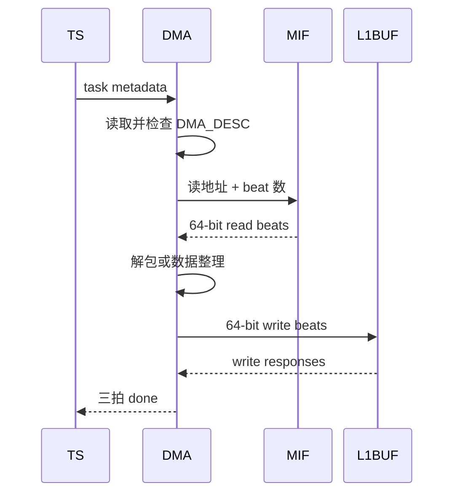
```mermaid
%%{init: {"sequence": {"useMaxWidth": true, "actorMargin": 14, "width": 82, "messageMargin": 10, "noteMargin": 6}, "themeVariables": {"fontSize": "11px"}}}%%
sequenceDiagram
    participant TS
    participant DMA
    participant MIF
    participant L1 as L1BUF

    TS->>DMA: task metadata
    DMA->>DMA: 读取并检查 DMA_DESC
    DMA->>MIF: 读地址 + beat 数
    MIF-->>DMA: 64-bit read beats
    DMA->>DMA: 解包或数据整理
    DMA->>L1: 64-bit write beats
    L1-->>DMA: write responses
    DMA-->>TS: 三拍 done
```

成功条件必须同时满足：

1. 最后一个 AXI 读 burst 已收到 `RLAST`；
2. 全部读 response 为 `OKAY`；
3. DMA 返回 FIFO 为空；
4. 全部 L1BUF 写 beat 已完成握手；
5. 全部 L1BUF 写请求都收到完成响应。

### 9.7 L1BUF 到 DDR 时序

1. DMA 先从 L1BUF 读取 64-bit beat；
2. 数据进入写 FIFO；
3. MIF 接受 AW 后，DMA 发送对应 W beat；
4. 最后一拍设置 `WLAST`；
5. 收到 `BRESP=OKAY` 后增加已完成字节数；
6. 最后一个 B response 返回且 outstanding 为 0 后报告成功。

---

## 10. L1BUF 与 L1BUF Controller

### 10.1 结构

L1BUF 是单核内部共享 SRAM。DMA、Matrix、Vector 和 Complex Engine 只通过 L1BUF Controller 访问各 bank。

一个 64-bit beat 可保存：

| 格式 | 每 beat 元素数 |
| --- | ---: |
| INT4 | 16 |
| INT8 | 8 |
| INT16 | 4 |
| INT32 | 2 |

L1BUF 容量和 bank 数为参数。每个 bank 的最小读写单元为 64 bit；小于 8B 的写操作通过 8-bit byte enable 控制。

`L1_ECC_ENABLE` 为实现参数。启用时，每个 64-bit word 使用 SECDED 或等效保护：单 bit 错误在返回前修正并增加计数；不可修正错误使当前任务失败。关闭时，`*_rsp_status` 始终返回正常。

L1BUF Controller 还接收 LSC 提供的参数区保护信号：

| 信号 | 方向 | 位宽 | 说明 |
| --- | --- | ---: | --- |
| `reset_n` | Input | 1 | 低有效的 Controller 同步复位 |
| `param_l1_base_i` | Input | 24 | 受保护参数区起始 LADDR，8B 对齐 |
| `param_l1_limit_i` | Input | 24 | 受保护参数区末地址的下一个字节，8B 对齐 |
| `param_lock_i` | Input | 1 | 为 1 时拒绝任何客户端向该区写入 |
| `param_write_allow_i[4:0]` | Input | 5 | 未锁定时各写端口的参数区写许可；bit 0～4 依次为 DMA、ME、IVE、CME、Debug |
| `external_error_clear_i` | Input | 1 | 清除已经保存的不可修正 ECC 首错 |
| `l1_idle_o` | Output | 1 | 所有请求队列、返回队列和 SRAM 操作均为空 |
| `l1_write_idle_o` | Output | 1 | 所有写请求、写数据、待发写完成和暂停中的写响应均为空 |
| `l1_bank_stall_o` | Output | 1 | 本周期至少有一个具备访问条件的 SRAM 操作因同 bank 竞争而未执行 |
| `l1_read_bank_stall_mask_o` | Output | 13 | 每一位对应一个读端口；该端口本周期因同 bank 竞争等待时置 1 |
| `l1_write_bank_stall_mask_o` | Output | 5 | 每一位对应一个写端口；该端口本周期因同 bank 竞争等待时置 1 |
| `ecc_corrected_pulse_o` | Output | 1 | 某个读返回首次可见且已修正 ECC 时置 1 一个周期 |
| `ecc_uncorrectable_pulse_o` | Output | 1 | 某个读返回首次可见且 ECC 不可修正时置 1 一个周期 |
| `ecc_corrected_events_o` | Output | 4 | 本周期首次可见的已修正 ECC 返回数量，范围为 0～13 |
| `ecc_uncorrectable_events_o` | Output | 4 | 本周期首次可见的不可修正 ECC 返回数量，范围为 0～13 |
| `l1_ecc_error_valid_o` | Output | 1 | 已保存一项不可修正 ECC 错误 |
| `l1_ecc_error_status_o` | Output | 3 | 产生错误的 L1BUF 本地 status |
| `l1_ecc_error_addr_o` | Output | 24 | 发生错误的 word LADDR |
| `l1_ecc_error_port_o` | Output | 4 | 发起该次读取的客户端读端口编号 |
| `l1_ecc_error_bank_o` | Output | $\lceil\log_2(L1\_BANKS)\rceil$ | SRAM bank 编号 |
| `l1_ecc_error_write_o` | Output | 1 | 读写方向；第一版 ECC 只在读出时检查，因此固定为 0 |

若 `param_lock_i=1`，任何写请求只要与 `[param_l1_base_i,param_l1_limit_i)` 相交，整个请求都不写 SRAM，并以 `ADDR_FAULT` 状态返回。`param_lock_i=0` 时，相交请求还必须满足对应的 `param_write_allow_i` 位为 1，否则同样不写 SRAM 并返回 `ADDR_FAULT`。读请求不受此锁影响。

V1.1 只有已经通过描述符检查的 `DMA_COPY_1D` 或 `DMA_COPY_ND` 且
`convert_mode=NONE` 的任务可使 `param_write_allow_i[0]=1`；其余四位固定为 0。
允许位随当前任务有效，不是软件寄存器。L1BUF Controller 在每个写请求握手时
再次检查该位，防止客户端类型或任务属性与请求不一致。

`param_l1_base_i`、`param_l1_limit_i`、`param_lock_i` 和
`param_write_allow_i` 是持续有效输入。
Controller 在写请求握手时直接使用当拍值检查整个请求，不保存另一份可由软件
接口单独修改的参数区配置。LSC 只允许在规定的空闲条件下修改这些值，因此
一个已经接受的写请求不会在传输中途遇到配置变化。

`reset_n=0` 时，Controller 清除请求状态、读流水、待发响应、等待计数和 ECC
事件计数；SRAM 数据和每个 word 的 ECC 状态存储保持不变。复位周期
`l1_idle_o=1`、`l1_write_idle_o=1`，所有客户端 ready/valid 输出均为 0。

L1BUF 端口的 3-bit status 使用 `0=OK`、`1=ECC_CORRECTED`、`2=ECC_UNCORRECTABLE`、`3=PORT_PROTOCOL_ERROR`、`4=ADDR_FAULT`，`5～7` 保留。客户端把本地 status 转成第 4.3 节的任务 status：2 转成 `L1_ECC_UNCORRECTABLE`，3 转成 `BAD_DESC` 并记录接口子码，4 转成 `ADDR_FAULT`。`ECC_CORRECTED` 不使任务失败，但必须增加计数。

ECC 脉冲在对应读返回第一次出现在接口上的周期产生，与客户端是否同周期
拉高 `_rd_rsp_ready` 无关。若客户端暂停接收，返回 payload 继续保持，
ECC 脉冲不得在后续周期重复。多个端口同周期产生同类事件时，公共脉冲仍只
为 1；`ecc_corrected_events_o` 和 `ecc_uncorrectable_events_o` 给出当拍的
实际事件数量，各事件的累计数量由内部计数器分别增加。

不可修正 ECC 还必须写入上述持续首错记录。Controller 在读出 word 并完成 ECC 检查时保存本地 status、LADDR、读端口、bank 和读写方向。`l1_ecc_error_valid_o=1` 后，其余字段保持不变；后续错误只增加计数，不替换已保存内容。`external_error_clear_i=1` 清除旧记录。清除与新的不可修正 ECC 同拍发生时，新记录优先。多个读端口同拍发现不可修正 ECC 时，固定保存端口编号最小的一项，使 C 语言参考模型、RTL 和验证环境得到相同结果。

### 10.2 客户端端口数量

| 客户端 | 读端口 | 写端口 | 典型用途 |
| --- | ---: | ---: | --- |
| DMA | 1 | 1 | L1BUF 与全局内存之间搬运 |
| Matrix | 3 | 1 | A、B、bias/residual 读取和 C 写回 |
| Vector | 4 | 1 | 三个算术输入、独立 mask 读取和整数输出 |
| Complex | 4 | 1 | 三个算术或参数输入、独立 mask 读取和整数输出 |
| 外部窗口 / Debug Slave | 1 | 1 | 运行期间由 `L1_HOST_ACCESS_CONTROL.ENABLE` 与软件等待规则约束的外部访问或诊断访问 |

### 10.3 通用 L1 读接口

每个读端口使用相同信号，前缀由客户端和端口编号组成：

| 信号后缀 | 客户端方向 | 位宽 | 说明 |
| --- | --- | ---: | --- |
| `_rd_req_valid` | Output | 1 | 读请求有效 |
| `_rd_req_ready` | Input | 1 | Controller 可接收 |
| `_rd_req_addr` | Output | 24 | 字节地址，必须 8B 对齐 |
| `_rd_req_beats` | Output | 8 | 连续 beat 数减 1 |
| `_rd_req_tag` | Output | 12 | 客户端请求编号 |
| `_rd_rsp_valid` | Input | 1 | 返回有效 |
| `_rd_rsp_ready` | Output | 1 | 客户端可接收 |
| `_rd_rsp_data` | Input | 64 | 返回数据 |
| `_rd_rsp_tag` | Input | 12 | 对应请求编号 |
| `_rd_rsp_last` | Input | 1 | 当前请求最后一拍 |
| `_rd_rsp_status` | Input | 3 | 正常、已修正 ECC、不可修正 ECC |

`_rd_req_ready` 只由该读端口的请求槽和内部队列可用状态产生，不得组合依赖
同一端口的 `_rd_req_valid`、地址、beat 数或 tag。请求槽空闲时，即使
`_rd_req_valid=0`，Controller 也应拉高 `_rd_req_ready`。因此，采用
“先观察 ready，再置 valid”方式的客户端也能正常发送请求。

请求握手后，Controller 把地址、beat 数和 tag 保存到对应端口的请求槽。
bank 当周期繁忙不会撤销已经完成的请求握手；该请求留在槽中，等待后续
SRAM 访问机会。一个端口的请求槽未释放前，该端口
`_rd_req_ready=0`。

### 10.4 通用 L1 写接口

| 信号后缀 | 客户端方向 | 位宽 | 说明 |
| --- | --- | ---: | --- |
| `_wr_req_valid` | Output | 1 | 整段写请求有效 |
| `_wr_req_ready` | Input | 1 | Controller 可接收写请求 |
| `_wr_req_addr` | Output | 24 | 起始字节地址，必须 8B 对齐 |
| `_wr_req_beats` | Output | 8 | 连续 64-bit beat 数减 1 |
| `_wr_req_tag` | Output | 12 | 整段写请求编号 |
| `_wr_data_valid` | Output | 1 | 当前 64-bit 写数据有效 |
| `_wr_data_ready` | Input | 1 | Controller 可接收当前写数据 |
| `_wr_data` | Output | 64 | 写数据 |
| `_wr_strb` | Output | 8 | 每个字节一个写使能 |
| `_wr_last` | Output | 1 | 仅在第 `wr_req_beats+1` 个数据 beat 为 1 |
| `_wr_rsp_valid` | Input | 1 | 写完成有效 |
| `_wr_rsp_ready` | Output | 1 | 客户端可接收 |
| `_wr_rsp_tag` | Input | 12 | 对应请求 |
| `_wr_rsp_status` | Input | 3 | 写完成状态 |

每个写请求只返回一次响应。Controller 接受写请求后，按照起始地址依次把后续数据 beat 写到 `addr+8i`；同一客户端不得交错发送两条写数据流。最后一个 SRAM 写入和对应 ECC 更新完成后，Controller 才能返回响应。同一客户端收到响应前不得复用该写 tag。

每个写端口具有一个可直通的写数据暂存槽。写请求已接受且暂存槽为空时，
`_wr_data_ready=1`，其取值不得组合依赖同一端口的 `_wr_data_valid`、数据、
字节使能或 `last`。若当拍写数据取得 SRAM 使用机会，数据可直接写入；若
对应 bank 正忙，Controller 仍可完成数据握手并把这一拍保存在暂存槽中。
暂存槽中的数据写入 SRAM 前，Controller 必须保持数据、字节使能和 `last`
不变。旧数据写入后若本次请求仍需要后续 beat，同一周期可以接收下一拍，
从而在没有 bank 竞争时保持每周期一拍的写入速度。

不同 tag 的读返回可交错，同一 tag 内按地址递增返回。同一读端口可以配置为一个或多个未完成请求；实际深度由 `L1_CONFIG` 给出。

模块向 L1BUF Controller 提交的地址必须 8B 对齐。描述符中的逻辑张量起点若位于一个 beat 内部，执行单元先把请求地址向下对齐到 8B，再依据逻辑字节偏移和 INT4 nibble 字段选择有效元素。读接口总是返回完整 64-bit 数据，首尾无效字节由客户端丢弃。Matrix tile 起点必须直接满足 8B 对齐要求。

> [!note] 为什么读接口没有 byte keep
> L1BUF 的每次 SRAM 读取都是完整 8B。请求地址也总是 8B 对齐，因此 Controller 不需要猜测哪些字节属于逻辑张量。执行单元已经知道张量起点偏移和元素个数，应由执行单元选择首 beat 与末 beat 中的有效元素。

### 10.5 bank 选择与仲裁

设一个 bank beat 为 8B，则：

$$
\operatorname{bank\_id}
=
\left\lfloor\frac{\operatorname{laddr}}{8}\right\rfloor
\bmod \operatorname{L1\_BANKS}.
$$

同一周期多个已保存请求或新握手请求访问同一单端口 bank 时，该 bank 只执行一个 64-bit SRAM 操作。未取得 SRAM 访问机会的请求保存在各自端口槽内，不要求客户端在请求握手后继续保持 `valid`。默认仲裁顺序为：

1. Matrix 结果写回；
2. Complex 结果写回；
3. Matrix 操作数读取；
4. Vector 读写；
5. DMA；
6. Debug。

仲裁器必须为每个等待请求维护等待周期计数。某请求超过 `L1_STARVE_LIMIT` 后临时提升优先度，直到成功传输一个 beat。

某个 bank 没有候选请求时，不执行 SRAM 操作，也不增加任何请求的等待
周期。P0 使用固定优先度和等待周期提升方式，不设置空闲时自行转动的
bank owner 选择指针；下一次出现候选请求时重新按上述规则选择。这样，
空闲周期不会改变随后请求的优先次序。

`l1_bank_stall_o` 及两个端口 mask 只统计已经具备 SRAM 访问条件、但因同一 bank 在该周期只能执行一次访问而等待的候选操作。以下情况不属于 bank 竞争：客户端尚未给出有效请求或写数据、读返回流水没有空位、客户端暂停接收返回、请求槽已满、无效地址直接返回错误。一个周期中无论多少端口因竞争等待，`l1_bank_stall_cycles` 都只增加 1；端口 mask 用于定位具体等待端口。

### 10.6 读写冲突规则

| 同周期访问 | 行为 |
| --- | --- |
| 两个读访问同一地址 | 可共享一次 SRAM 读返回，也可顺序处理 |
| 读和写访问同一地址 | 接受写请求，读请求暂停一个周期后重新读取新值 |
| 两个写访问同一地址 | 固定优先度只接受一个，另一个保持 valid 并等待 |
| Debug 与执行单元访问同一 bank | 执行单元优先，Debug 暂停 |

Controller 不依赖 SRAM 宏自身未明确规定的 read-during-write 行为。同周期读写同一地址时，P0 采用“写接受、读暂停并在下一周期重新发起”的固定方式。

TaskScheduler 使用事件管理一般任务的先后关系。Matrix Engine 还必须在内部对
同时驻留的乘累加任务与部分和任务检查 L1 地址区段；第 11.9 节列出的 RAW、
WAR 和 WAW 情况必须暂停后一任务。DMA、IVE、CME 与 Matrix 之间的关系仍由
编译器通过事件指定，软件必须保证 DMA 不会提前覆盖仍在使用的 tile。

### 10.7 L1BUF 读时序

| 周期 | 动作 |
| --- | --- |
| T0 | 客户端置 `rd_req_valid`、地址、beat 数和 tag |
| T1 | `rd_req_valid && rd_req_ready`，Controller 锁存请求；若 bank 可用，可在同一拍送入读流水 |
| T1～Tk | bank 忙时，请求保存在端口槽中，直到取得 SRAM 访问机会 |
| T2～Tn | SRAM 按 `L1_RD_LATENCY` 返回 64-bit beat |
| Tn+1 | Controller 附加 tag、last 和 ECC 状态 |
| Tn+2 | `rd_rsp_valid && rd_rsp_ready`，客户端接收 |

若客户端暂停接收，Controller 必须保持返回数据、tag、last 和 status 不变。

### 10.8 L1BUF 写时序

| 周期 | 动作 |
| --- | --- |
| T0 | 客户端置 `wr_req_valid`、起始地址、beat 数和 tag |
| T1 | `wr_req_valid && wr_req_ready`，Controller 锁存整段请求 |
| T2～Tn | 客户端逐拍发送 `wr_data`、`wr_strb`；数据可直通 SRAM，也可在 bank 正忙时保存到单拍暂存槽 |
| Tn | 最后一个数据 beat 握手，`wr_last=1` |
| Tn 或更晚 | 最后一个数据 beat 取得 SRAM 使用机会，完成最后一个 word 写入和 ECC 更新 |
| 写入完成后第 2 个周期 | Controller 返回一次 `wr_rsp_valid`、tag 和 status |

`wr_last` 提前、缺失，或实际数据 beat 数与请求不符时，Controller 返回协议错误。写任务只有收到全部写请求的整段完成响应后才能向 TaskScheduler 报告成功。

---

## 11. Matrix Engine

### 11.1 模块组成

Matrix Engine（ME）包含：

- A tile 双缓冲；
- B tile 双缓冲；
- INT4/INT8/INT16 解包、读取和符号扩展单元；
- 整数乘法阵列；
- 带溢出检测的 INT32 累加器；
- C/L0BUF；
- bias 与 residual 读取器；
- 32×32-bit 整数乘法器、64-bit 乘积寄存器、有符号移位器和舍入器；
- INT4/INT8/INT16 打包器；
- L1BUF 写回单元。

P0 接受 `INT4×INT4`、`INT8×INT8`、`INT8×INT4` 和 `INT16×INT16`。乘法
结果累加到 INT32。INT16 主要用于回归模型，以及需要较细数值间隔的输入、
权重和输出。Matrix 不接受 FP 张量，不执行 FP Matrix 乘法，也没有 FP32
Epilogue。

`FINAL_OUTPUT=1` 时，上述四种输入组合都可选择 INT4、INT8、INT16 或 INT32
输出。INT4、INT8、INT16 输出必须启用整数重缩放；INT32 输出不得启用该步骤。
`FINAL_OUTPUT=0` 时只允许 INT32 部分和。C 语言参考模型的组合测试因此检查
全部 16 组 A/B dtype 取值与 4 种输出 dtype，共 64 组配置；其中 16 组为
合法组合，其余组合必须返回 `DTYPE_UNSUPPORTED`。

### 11.2 模块级信号

任务和 Descriptor SRAM 端口采用第 8.4、8.5 节定义。L1BUF 侧使用以下前缀：

| 端口 | 主要信号 | 数据宽度 | 用途 |
| --- | --- | ---: | --- |
| `me_a_rd_*` | 通用 L1 读接口 | 64 | 读取 A tile |
| `me_b_rd_*` | 通用 L1 读接口 | 64 | 读取 B tile |
| `me_aux_rd_*` | 通用 L1 读接口 | 64 | 读取 INT32 bias、整数重缩放表、residual 或旧 C |
| `me_c_wr_*` | 通用 L1 写接口 | 64 | 写回 C tile |

ME 内部还输出：

| 信号 | 方向 | 位宽 | 说明 |
| --- | --- | ---: | --- |
| `me_busy_o` | Output | 1 | 已取得任务且尚未完成 |
| `me_mac_active_o` | Output | 1 | 乘法阵列本周期执行有效计算 |
| `me_accum_active_o` | Output | 1 | 部分和读取、相加、Epilogue 或写回阶段正在工作 |
| `me_overlap_active_o` | Output | 1 | 乘累加阶段与部分和阶段本周期同时工作 |
| `me_operand_stall_o` | Output | 1 | 等待 A/B 数据 |
| `me_hazard_stall_o` | Output | 1 | 候选 MAC 因活动写区段与其输入区段相交而暂停 |
| `me_write_stall_o` | Output | 1 | C 写队列无法继续 |
| `me_acc_overflow_o` | Output | 1 | 当前任务出现 INT32 范围外的数学结果 |

`me_acc_overflow_o` 以数学累加结果为准。SATURATE、ERROR 或 WRAP
处理均不改变该信号的置位条件；从首次超出 INT32 范围到当前任务离开 ME
期间保持为 1。

`me_mac_active_o` 和 `me_operand_stall_o` 连接第 19.6 节固定 P0 计数器。
`me_accum_active_o`、`me_overlap_active_o` 和 `me_hazard_stall_o` 是 Matrix
模块的调试与性能分析输出，C 语言参考模型在 `npu_perf_t` 中累计对应数值。本文 V1.1
没有为这三项分配通用 LSC CSR；SoC 若把它们接入额外调试寄存器，需要在平台
驱动中单独说明地址，不能把它们当作固定 P0 CSR。上述信号均不直接产生软件
中断。

### 11.3 `MATRIX_DESC` 专有字段

| Byte Offset | 字段 | 位宽 | 说明 |
| ---: | --- | ---: | --- |
| `0x40` | `M` | 32 | 输出行数 |
| `0x44` | `N` | 32 | 输出列数 |
| `0x48` | `K` | 32 | 公共维度长度 |
| `0x4C` | `batch_count` | 32 | GEMM 为 1，BMM 可大于 1 |
| `0x50` | `last_tile_valid_m` | 32 | M 方向最后一个 tile 的有效行数 |
| `0x54` | `last_tile_valid_n` | 32 | N 方向最后一个 tile 的有效列数 |
| `0x58` | `last_tile_valid_k` | 32 | K 方向最后一个 tile 的有效长度 |
| `0x5C` | `matrix_flags` | 32 | 按下表逐 bit 定义 |
| `0x60` | `lda_bytes` | 32 | A 相邻逻辑行的字节间隔 |
| `0x64` | `ldb_bytes` | 32 | B 相邻逻辑行的字节间隔 |
| `0x68` | `ldc_bytes` | 32 | C 相邻逻辑行的字节间隔 |
| `0x6C` | `bias_stride_bytes` | 32 | 默认等于 bias 元素字节数 |
| `0x70` | `a_batch_stride` | 64 | 相邻 Batch 的 A 起点间隔 |
| `0x78` | `b_batch_stride` | 64 | 相邻 Batch 的 B 起点间隔 |
| `0x80` | `c_batch_stride` | 64 | 相邻 Batch 的 C 起点间隔 |
| `0x88` | `src2_batch_stride` | 64 | 相邻 Batch 的 residual 或 INT32 部分和间隔 |
| `0x90` | `a_pack_format` | 8 | A 的物理格式编号 |
| `0x91` | `b_pack_format` | 8 | B 的物理格式编号 |
| `0x92` | `c_pack_format` | 8 | C 的物理格式编号 |
| `0x93` | `pack_version` | 8 | 格式版本 |
| `0x94` | `overflow_mode` | 8 | SATURATE、ERROR 或 WRAP |
| `0x95` | `activation_mode` | 8 | P0 为 NONE 或 RELU |
| `0x98` | `output_zero_point` | 32 | 输出整数 zero point；P0 必须为 0 |
| `0x9C` | `requant_count` | 32 | 输出 INT32 时为 0；输出 INT4/INT8/INT16 时为 1 或 $N$ |
| `0xA0` | `bias_count` | 32 | 未启用 bias 时为 0；启用时必须为 $N$ |
| `0xA4` | `requant_mode` | 8 | `0=NONE`、`1=PER_TENSOR`、`2=PER_OUTPUT_CHANNEL` |
| `0xA5` | `residual_mode` | 8 | `0=NONE`、`1=ACC_INT32`；其他编码非法 |
| `0xA6` | `requant_entry_bytes` | 8 | P0 必须为 8 |
| `0xA7` | `reserved0` | 8 | 必须写 0 |
| `0xA8` | `requant_region_bytes` | 32 | 从 `aux1_addr` 起可读取的最大字节数 |
| `0xAC` | `reserved1` | 32 | 必须写 0 |
| `0xB0～0xFF` | `reserved` | — | 必须写 0 |

`0x96～0x97` 是对齐填充字节，P0 必须写 0。

`matrix_flags` 定义：

| Bit | 名称 | 含义 |
| ---: | --- | --- |
| 0 | `A_TRANSPOSE_LOGICAL` | 按逻辑转置后的 A 解释 shape 与 stride |
| 1 | `B_TRANSPOSE_LOGICAL` | 按逻辑转置后的 B 解释 shape 与 stride |
| 2 | `BIAS_ENABLE` | 从 `aux0_addr` 读取 `[N]` INT32 bias |
| 3 | `RESIDUAL_ENABLE` | 从 `src2_addr` 读取同实数单位的 INT32 residual |
| 4 | `RELU_ENABLE` | 在整数重缩放前执行 ReLU |
| 5 | `REQUANT_ENABLE` | 输出 INT4/INT8/INT16 时必须为 1，输出 INT32 时必须为 0 |
| 6 | `ACCUM_FROM_SRC2` | 从 `src2_addr` 读取 INT32 部分和并加入当前 MAC 结果 |
| 7 | `FINAL_OUTPUT` | 1 表示允许 bias、ReLU 和整数重缩放；0 表示写 INT32 部分和 |
| 31:8 | `RESERVED` | 必须写 0 |

`RESIDUAL_ENABLE` 与 `ACCUM_FROM_SRC2` 不能同时为 1，因为二者都使用 `src2_addr`。`FINAL_OUTPUT=0` 时，`BIAS_ENABLE`、`RESIDUAL_ENABLE`、`RELU_ENABLE` 和 `REQUANT_ENABLE` 必须为 0，目的 dtype 必须为 INT32。

`overflow_mode` 使用 `0=SATURATE`、`1=ERROR`、`2=WRAP`；`activation_mode` 使用 `0=NONE`、`1=RELU`。`activation_mode=RELU` 必须与 `matrix_flags.RELU_ENABLE=1` 同时出现，其他组合返回 `BAD_DESC`。

`A_TRANSPOSE_LOGICAL` 和 `B_TRANSPOSE_LOGICAL` 只改变逻辑索引对物理 stride 的解释，不在 Matrix 内生成完整转置副本。B 使用 `B_KN_TILE_*` 格式时，编译器必须先按最终逻辑 K×N 次序打包，`B_TRANSPOSE_LOGICAL` 必须为 0。

公共前缀中的地址含义：

| 地址字段 | Matrix 用途 |
| --- | --- |
| `src0_addr` | A 的 LADDR |
| `src1_addr` | B 的 LADDR |
| `src2_addr` | residual 或旧 C 的 LADDR |
| `dst_addr` | C 的 LADDR |
| `aux0_addr` | INT32 bias 的 LADDR |
| `aux1_addr` | 整数重缩放表的 LADDR；输出 INT32 时写 0 |

整数重缩放表的每项固定为 8B，并按输出通道编号递增：

| 项内 Byte Offset | 字段 | 位宽 | 说明 |
| ---: | --- | ---: | --- |
| `0x0` | `multiplier` | 32 | 正 INT32 乘数 $R_n$ |
| `0x4` | `shift` | 8 | 有符号移位量 $r_n$ |
| `0x5` | `reserved` | 24 | 必须写 0 |

`requant_mode=PER_TENSOR` 时只读取第 0 项，并把它用于全部 $N$ 个输出通道；`PER_OUTPUT_CHANNEL` 时第 $n$ 项用于输出列 $n$。必须满足 `requant_region_bytes >= requant_count × 8`。表项全部是整数，不属于 CME 使用的 FP32 元数据。

Matrix 不保留跨命令的隐藏部分和：

- `GEMM_ZERO` 把 `dst_addr` 指向的 `[M,N]` INT32 L1BUF 区域写 0；
- `GEMM_ACCUM` 要求 `ACCUM_FROM_SRC2=1`、`FINAL_OUTPUT=0`，从 `src2_addr` 读取旧部分和，加上本次 K 区段的整数 MAC 结果，再把 INT32 写到 `dst_addr`；
- 最后一个 K 区段使用 `GEMM`，可设置 `ACCUM_FROM_SRC2=1` 和 `FINAL_OUTPUT=1`，随后执行 bias、ReLU 与整数重缩放；
- 复位、任务失败或任务结束后，L0BUF 内容都不能由下一条命令继续使用。

### 11.4 计算语义

对输出 $[M,N]$：

$$
p_{m,n}
=
\sum_{k=0}^{K-1}
q^A_{m,k}q^W_{k,n},
\qquad
a_{m,n}=p_{m,n}+b^{\mathrm{acc}}_n.
$$

$q^A$ 和 $q^W$ 是 INT4、INT8 或 INT16；$p_{m,n}$、$a_{m,n}$ 和
$b_n^{\mathrm{acc}}$ 是 INT32。P0 zero point 为 0。

Bias shape 为：

$$
b^{\mathrm{acc}}\in\mathbb Z^{N}.
$$

固定输出列 $n$ 后，同一个 $b_n^{\mathrm{acc}}$ 加到：

$$
a_{0,n},a_{1,n},\ldots,a_{M-1,n}.
$$

Bias 不会沿 $N$ 维重复；每个输出列使用自己的一个 bias。BMM 默认对全部 Batch 共用同一组 $N$ 个 bias；需要每个 Batch 独立 bias 时，编译器必须拆成多条 GEMM，或使用后续版本增加的 `bias_batch_stride` 功能位。

INT32 bias 必须与累加值使用相同的实数单位：

$$
b_n^{\mathrm{acc}}
=
\operatorname{round}
\left(
\frac{b_n}{s_As_{W,n}}
\right).
$$

若 `residual_mode=ACC_INT32`，`src2_addr` 必须指向 INT32 residual。编译器必须保证 residual 与 $a_{m,n}$ 使用相同的实数单位，并在整数重缩放前执行：

$$
\hat a_{m,n}=a_{m,n}+q^R_{m,n}.
$$

若二者的 scale 不同，Matrix 不允许融合；编译器先写回 Matrix 结果，再发射 `VADD_RESCALE_I`。Matrix 不检查任何 FP32 scale 关系。

若输出为 INT32，ME 直接写回 $\hat a_{m,n}$；未启用 residual 时令
$\hat a_{m,n}=a_{m,n}$。若输出为 INT4、INT8 或 INT16，则使用整数重缩放表。
若启用 ReLU，先计算：

$$
\tilde a_{m,n}=\max(0,\hat a_{m,n}).
$$

未启用 ReLU 时令 $\tilde a_{m,n}=\hat a_{m,n}$。输出为 INT4、INT8 或 INT16
时，第 $n$ 个重缩放表项给出 $R_n,r_n$：

$$
t_{m,n}=\operatorname{int64}(\tilde a_{m,n})\operatorname{int64}(R_n),
$$

$$
q^Y_{m,n}
=
\operatorname{clip}_{[q_{\min},q_{\max}]}
\left(
\operatorname{round\_shift}(t_{m,n},r_n)+z_Y
\right).
$$

`round_shift` 的精确定义见 2.3.4 节。Matrix 的输出处理次序固定为：

1. 完成全部 K 项整数乘累加；
2. 加 INT32 bias；
3. 可选地加同实数单位的 INT32 residual；
4. 可选整数 ReLU；
5. 输出 INT4/INT8/INT16 时执行 32×32-bit 整数乘法；
6. 执行有符号移位与 `round_mode` 指定的舍入；
7. 加整数 zero point 并按目的格式裁剪；
8. 打包为 INT4、INT8、INT16 或 INT32。

GELU、SiLU、Sigmoid、Tanh 和不同 scale 的 residual 加法不在 Matrix Epilogue 中执行；编译器在 GEMM 后发射相应 CME 任务。

### 11.5 INT32 溢出

P0 Matrix 使用 48-bit 有符号临时值依次完成全部 MAC、可选旧部分和、bias 和 residual 加法，再判断最终整数是否超出 INT32。不得在每个 K 项之后提前裁剪到 INT32，因为逐项裁剪与完成全部加法后统一处理可能产生不同结果。进入 ReLU 或整数重缩放前按 `overflow_mode` 处理：

| 模式 | 行为 |
| --- | --- |
| `SATURATE` | 大于 $2^{31}-1$ 时写 $2^{31}-1$；小于 $-2^{31}$ 时写 $-2^{31}$ |
| `ERROR` | 任务进入 `NUMERIC_EXCEPTION`，目的 tile 视为无效 |
| `WRAP` | 保留低 32 bit；仅用于与指定参考实现逐 bit 对比 |

P0 默认 `SATURATE`。编译器应根据 $K$、输入范围和模型 scale 估计最大累加值，避免依靠饱和维持正常结果。

### 11.6 物理排列

逻辑矩阵分别为：

- A：`[M,K]`
- B：`[K,N]`
- C：`[M,N]`

P0 至少定义：

| 格式编号 | 名称 | 说明 |
| ---: | --- | --- |
| 0 | `ROW_MAJOR_INT8` | 每个 64-bit beat 保存同一行连续 8 个 INT8 |
| 1 | `ROW_MAJOR_INT4` | 每个 beat 保存同一行连续 16 个 INT4 |
| 2 | `B_KN_TILE_INT8` | 按 `KT×NT` tile 保存 B，tile 内 K 先、N 后 |
| 3 | `B_KN_TILE_INT4` | 与编号 2 相同，但每字节保存两个权重 |
| 4 | `C_ROW_INT32` | 每个 beat 保存同一行连续 2 个 INT32 |
| 5 | `ROW_MAJOR_INT16` | 每个 beat 保存同一行连续 4 个 INT16，小端字节次序 |
| 6 | `B_KN_TILE_INT16` | 与编号 2 的 tile 次序相同，每个权重占 2B |
| 7 | `RESERVED` | P0 收到该编码时返回 `BAD_DESC` |

`a_pack_format` 在 INT8、INT4、INT16 时分别使用 0、1、5。
`b_pack_format` 可以使用普通行优先或 B tile：INT8 使用 0 或 2，INT4 使用
1 或 3，INT16 使用 5 或 6；编号 5 表示普通行优先 INT16，编号 6 只用于
INT16 B tile。`c_pack_format` 在输出 INT8、INT4、INT32、INT16 时分别使用
0、1、4、5。编号 7 为保留值，Matrix 必须在任何 L1BUF 请求前以
`BAD_DESC` 结束任务，且 `progress=0`。`pack_version=0` 对应本节公式；
其他版本只有在 `MATRIX_CONFIG` 公布支持时才能使用。

具体 `MT`、`KT`、`NT` 由功能寄存器给出。三个最后 tile 有效长度必须满足：

$$
\operatorname{last\_tile\_valid\_m}=
\begin{cases}
M\bmod MT,&M\bmod MT\ne0,\\
MT,&M\bmod MT=0,
\end{cases}
$$

N 和 K 方向使用相同定义。`last_tile_valid_k` 以外的输入对部分和贡献为 0；`last_tile_valid_m` 或 `last_tile_valid_n` 以外的输出不得写 L1BUF。硬件应根据 M、N、K 重新计算并检查三个字段，不一致时返回 `BAD_SHAPE`。

上式只用于对应维度大于 0 的情况。若 `M=0`、`N=0` 或 `K=0`，对应的 `last_tile_valid_m`、`last_tile_valid_n` 或 `last_tile_valid_k` 必须为 0。特别是 `K=0` 时不能因为 $0\bmod KT=0$ 而把有效长度写成 `KT`。

对 A 的普通行优先格式，逻辑元素地址为：

$$
\operatorname{A\_addr}(m,k)
=A_{\mathrm{base}}+m\cdot\operatorname{lda\_bytes}
+\left\lfloor\frac{k\,w_A}{8}\right\rfloor,
$$

其中 $w_A$ 为 4、8 或 16；INT4 时 $k$ 为奇数选择该字节高半部，偶数选择
低半部；INT16 时每个元素占两个连续字节，较低地址保存低 8 bit。

对 B 的普通行优先格式，未设置 `TRANSPOSE_B` 时使用
`B_base+k·ldb_bytes+element_offset(n)`；设置 `TRANSPOSE_B` 时交换行列索引。
对 B 的 tile 格式，先定义：

$$
k_o=\left\lfloor\frac{k}{KT}\right\rfloor,\quad
n_o=\left\lfloor\frac{n}{NT}\right\rfloor,\quad
k_i=k\bmod KT,\quad
n_i=n\bmod NT.
$$

tile 按 `[k_outer][n_outer][k_inner][n_inner]` 保存。设 $N_T=\lceil N/NT\rceil$，则元素线性编号为：

$$
e_B=
\left(
\left(k_oN_T+n_o\right)KT+k_i
\right)NT+n_i.
$$

INT8 的字节地址为 $B_{\mathrm{base}}+e_B$；INT4 的字节地址为
$B_{\mathrm{base}}+\lfloor e_B/2\rfloor$，$e_B$ 为偶数时选择低半部，
否则选择高半部；INT16 的字节地址为 $B_{\mathrm{base}}+2e_B$。最后 tile 的无效位置必须填 0，使硬件即使整拍读取也不会
增加部分和。

对普通行优先 C：

$$
\operatorname{C\_addr}(m,n)
=C_{\mathrm{base}}+m\cdot\operatorname{ldc\_bytes}
+\left\lfloor\frac{n\,w_C}{8}\right\rfloor,
$$

其中 $w_C$ 为 4、8、16 或 32。INT4 输出的每行起点必须位于低半字节；
行内奇数个元素时，末字节高半部写 0。INT16 行起点、元素步长和行步长都
必须为 2B 的整数倍。

### 11.7 ME 状态机

ME 固定保留一个 `MAC_CTX`（乘累加上下文）和一个 `ACCUM_CTX`（部分和与输出处理上下文）。`MAC_CTX` 保存当前 Matrix 任务的描述符、A/B 双缓冲状态及整数乘累加结果；该阶段不向软件可见的 L1BUF 地址写数据。`ACCUM_CTX` 保存已完成乘累加、但尚未结束的前一任务状态；它读取旧部分和、bias、residual 或整数重缩放表，完成输出处理并写 C。

任一时刻，ME 最多在 `MAC_CTX` 中保留一个任务、在 `ACCUM_CTX` 中保留一个任务。两者是同一 Matrix Engine 内的两个流水阶段，不表示存在两套矩阵乘法阵列。任务只有在 `ACCUM_CTX` 收到该任务全部 C 写响应后，才能进入成功终态并更新完成事件。

两个上下文的状态如下：

| 上下文 | 状态 | 动作 |
| --- | --- | --- |
| `MAC_CTX` | `IDLE` | 可以接收一个新的 Matrix 任务 |
| `MAC_CTX` | `LOAD_DESC` | 读取并保存 `MATRIX_DESC` |
| `MAC_CTX` | `CHECK` | 检查 shape、pack、dtype、整数重缩放参数和地址 |
| `MAC_CTX` | `LOAD_AB0/1` | 使用 A/B 双缓冲读取当前或下一 tile |
| `MAC_CTX` | `COMPUTE` | 执行当前 K tile 的整数乘累加 |
| `MAC_CTX` | `WAIT_ACCUM_CTX` | 计算完成，但 `ACCUM_CTX` 尚未空闲 |
| `ACCUM_CTX` | `IDLE` | 可以接收 `MAC_CTX` 的结果和任务身份 |
| `ACCUM_CTX` | `READ_PSUM_AUX` | 读取旧部分和、bias、residual 或整数重缩放表 |
| `ACCUM_CTX` | `EPILOGUE` | 完成部分和相加、ReLU 和整数输出转换 |
| `ACCUM_CTX` | `WRITE_C` | 按 64-bit beat 写 C |
| `ACCUM_CTX` | `DRAIN` | 等待全部 L1 写响应 |
| `ACCUM_CTX` | `DONE` | 发送三拍完成消息并释放上下文 |

`MAC_CTX` 把结果移交给空闲的 `ACCUM_CTX` 后，可在下一周期接受新的 Matrix
任务。若 `ACCUM_CTX` 忙，`MAC_CTX` 保持计算结果、任务编号、异常状态和全部
描述符字段，不得覆盖或重新执行最后一个 tile。

### 11.8 GEMM 功能时序

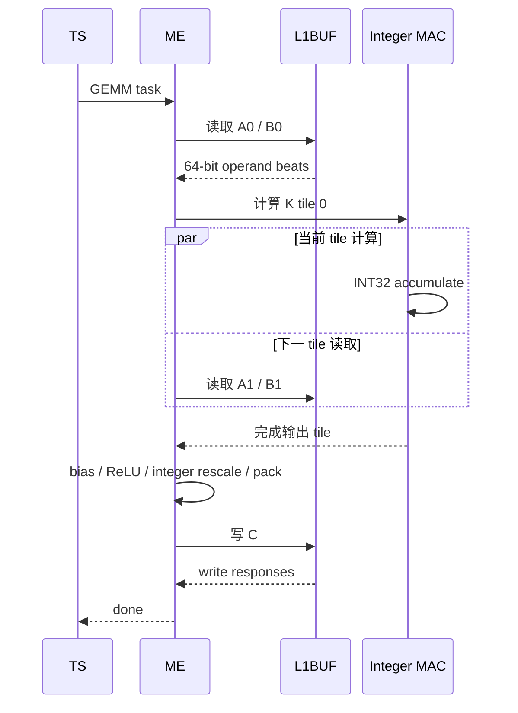
```mermaid
%%{init: {"sequence": {"useMaxWidth": true, "actorMargin": 14, "width": 82, "messageMargin": 10, "noteMargin": 6}, "themeVariables": {"fontSize": "11px"}}}%%
sequenceDiagram
    participant TS
    participant ME
    participant L1 as L1BUF
    participant MAC as Integer MAC

    TS->>ME: GEMM task
    ME->>L1: 读取 A0 / B0
    L1-->>ME: 64-bit operand beats
    ME->>MAC: 计算 K tile 0
    par 当前 tile 计算
        MAC->>MAC: INT32 accumulate
    and 下一 tile 读取
        ME->>L1: 读取 A1 / B1
    end
    MAC-->>ME: 完成输出 tile
    ME->>ME: bias / ReLU / integer rescale / pack
    ME->>L1: 写 C
    L1-->>ME: write responses
    ME-->>TS: done
```

设当前 tile 为 $M_t\times K_t$ 乘 $K_t\times N_t$，输入位宽分别为 $w_A,w_B$，则仅从 L1BUF 读取操作数所需的最少 64-bit beat 数为：

$$
N_A=
\left\lceil\frac{M_tK_tw_A}{64}\right\rceil,
\qquad
N_B=
\left\lceil\frac{K_tN_tw_B}{64}\right\rceil.
$$

INT32 输出 tile 的最少写 beat 数为：

$$
N_C=
\left\lceil\frac{M_tN_t\times32}{64}\right\rceil.
$$

双缓冲用于隐藏同一任务内下一 tile 的部分读取时间；两个任务上下文则用于隐藏
前一任务的部分和处理和写回时间。若 L1BUF 冲突使操作数读取慢于 MAC 计算，
ME 必须拉高 `me_operand_stall_o` 并暂停阵列，不得重复使用旧操作数。

### 11.9 分块 GEMM 与部分和处理并行

#### 11.9.1 目标

分块矩阵乘常按以下固定次序重复：

```text
读取 A/B → 乘累加 → 读取旧部分和 → 相加 → 写新部分和
```

若所有动作共用一个任务槽，写部分和时乘法阵列空闲。ME 使用
`MAC_CTX + ACCUM_CTX` 后，可以让任务 $i+1$ 的 A/B 读取与乘累加同任务 $i$
的部分和读取、相加和写回同时进行。允许并行不表示忽略数据关系；只有地址和
事件都允许时才能这样发射。

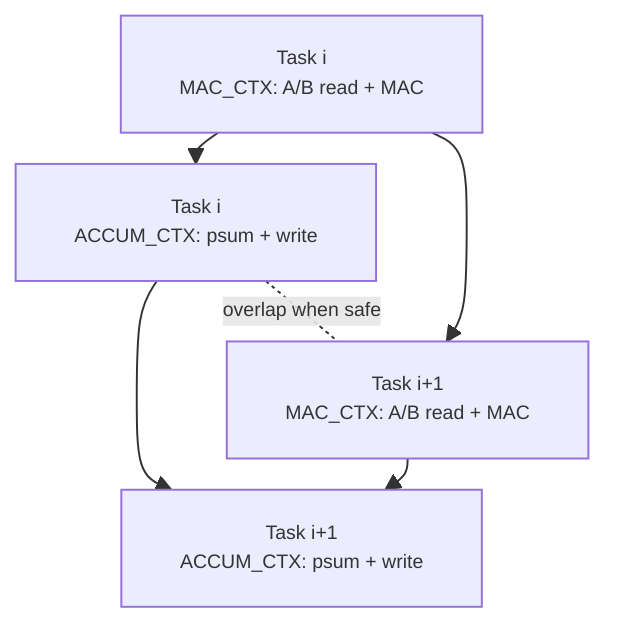
```mermaid
%%{init: {"flowchart": {"useMaxWidth": true, "nodeSpacing": 12, "rankSpacing": 16}, "themeVariables": {"fontSize": "10px"}}}%%
flowchart TB
    T0["Task i<br/>MAC_CTX: A/B read + MAC"]
    X0["Task i<br/>ACCUM_CTX: psum + write"]
    T1["Task i+1<br/>MAC_CTX: A/B read + MAC"]
    X1["Task i+1<br/>ACCUM_CTX: psum + write"]
    T0 --> X0 --> X1
    T0 --> T1 --> X1
    X0 -. "overlap when safe" .- T1
```

#### 11.9.2 阶段级地址检查

每个驻留任务保存若干半开地址区段 `[start,end)`。两个区段满足
`start_a < end_b && start_b < end_a` 时相交。长度计算必须包含
`start_nibble`、最后一个元素、行步长、外层计数步长和 tile 补齐空间；地址
加法溢出时任务返回 `ADDR_FAULT`，不能继续发射。

`ACCUM_CTX` 的访问集合为：

| 集合 | 内容 |
| --- | --- |
| 读 | `src2` 旧部分和或 residual、INT32 bias、整数重缩放表 |
| 写 | `dst` 输出或新部分和 |

候选 `MAC_CTX` 的访问集合为：

| 集合 | 内容 |
| --- | --- |
| 读 | A、B tile |
| 写 | 无软件可见 L1 写入 |

并行许可规则如下：

| 情况 | 类型 | 行为 |
| --- | --- | --- |
| `ACCUM_CTX.dst` 与候选 A 或 B 相交 | RAW：后一任务要读取前一任务正在写的数据 | 候选任务暂停，直到写响应全部返回 |
| `ACCUM_CTX` 的只读区段与候选 A/B 相交 | 读/读 | 允许并行，实际吞吐由 L1 bank 仲裁决定 |
| 候选任务的未来 `dst` 与当前 `ACCUM_CTX.dst` 相交 | WAW，但两个写阶段不会同时活动 | 可先执行候选 MAC；移交到 `ACCUM_CTX` 前必须等待当前写阶段完成 |
| 候选任务的未来 `dst` 与当前 `ACCUM_CTX` 读区段相交 | WAR，但候选写阶段尚未开始 | 可先执行候选 MAC；进入写阶段前当前读必须完成 |
| 任一关系无法由合法描述符计算 | 未知 | 不允许并行，并记录调度暂停原因 |

由于 P0 只有一个 `ACCUM_CTX`，两个 L1 写阶段不会同时活动。上表仍明确列出
WAR 和 WAW，便于后续增加多个部分和上下文时保持相同语义。

上述地址检查只比较 ME 内的 `MAC_CTX` 与 `ACCUM_CTX`。DMA、IVE、CME 或 L1BUF 外部窗口若要复用 A、B、部分和或 C 区域，软件必须通过事件保证先后次序；ME 不替这些单元建立依赖。

#### 11.9.3 事件与地址检查的分工

- 同一输出 tile 的连续 K 区段必须通过事件按先后次序执行，因为后一任务读取前一任务写出的部分和。
- 不同输出 tile 使用独立部分和区段时，可以不在相邻两个 MAC 任务之间增加直接等待事件。
- DMA 覆盖 A、B 或部分和缓存前，必须等待最后一个使用者的完成事件。
- 地址检查是 ME 的硬件保护；编译器仍应预先安排不会反复暂停的缓冲地址和事件。
- `ORDERED=1`、全局 Fence 或失败的等待事件仍可禁止发射，即使地址允许。

推荐使用 A/B 双缓冲和部分和双缓冲。例如，偶数 tile 使用 `PSUM0`，奇数
tile 使用 `PSUM1`。编译器只有在某个缓存即将再次使用时，才等待上一次写该
缓存的事件。

#### 11.9.4 周期示例

下例假设两个任务的 A/B 与输出区段互不相交，并省略 L1 bank 暂停：

| 周期 | `MAC_CTX` | `ACCUM_CTX` | 说明 |
| ---: | --- | --- | --- |
| T0 | 接收任务 0 | 空闲 | 保存任务 0 描述符 |
| T1～T8 | 任务 0 乘累加 | 空闲 | 产生 tile 0 的整数结果 |
| T9 | 接收任务 1 | 接收任务 0 结果 | 两个上下文开始独立推进 |
| T10～T17 | 任务 1 乘累加 | 任务 0 读旧部分和并相加 | `me_overlap_active_o=1` |
| T18～T21 | 等待或接收任务 2 | 任务 0 写回并等待响应 | 若任务 2 地址安全，可继续使用乘法阵列 |
| T22 | 保持当前 MAC 工作 | 任务 0 完成，接收任务 1 结果 | 任务 0 此时才写完成事件 |

任务的 `signal_event`、成功状态和 `end_cycle` 只能在 `ACCUM_CTX` 收到最后一个
写响应后更新，不能在乘累加结束时提前更新。任务超时从 `start_cycle` 起连续
计数，任务位于任一上下文或在两个上下文之间等待时都不能暂停计时。

#### 11.9.5 发射利用率与性能计数

至少提供以下计数：

| 名称 | 增加条件 |
| --- | --- |
| `matrix_mac_active_cycles` | `MAC_CTX` 本周期执行有效读取或乘累加 |
| `matrix_accum_active_cycles` | `ACCUM_CTX` 本周期读取辅助数据、处理部分和或写回 |
| `matrix_overlap_cycles` | 上述两个条件在同一周期都成立 |
| `matrix_operand_stall_cycles` | `MAC_CTX` 因 A/B 数据或 L1 bank 等待而暂停 |
| `matrix_hazard_stall_cycles` | 候选 MAC 因本节地址关系而未发射 |

软件可计算：

$$
U_{\mathrm{MAC}}
=
\frac{C_{\mathrm{MAC}}}{C_{\mathrm{core}}},
\qquad
U_{\mathrm{overlap}}
=
\frac{C_{\mathrm{overlap}}}
{\min(C_{\mathrm{MAC}},C_{\mathrm{accum}})}.
$$

$C_{\mathrm{core}}$ 是 Core 工作周期数，$C_{\mathrm{MAC}}$ 是乘累加活动周期数，
$C_{\mathrm{accum}}$ 是部分和阶段活动周期数，$C_{\mathrm{overlap}}$ 是两者同时
活动的周期数。第二个比值的分母为 0 时，软件报告 0。

---

## 12. Integer Vector Engine

### 12.1 功能

Integer Vector Engine（IVE）执行不需要复杂数学函数的整数逐元素运算：

- 加、减、乘和乘加；
- 最大值、最小值、比较和选择；
- ReLU 与整数裁剪；
- INT4 解包和打包；
- INT4、INT8、INT16、INT32 之间的符号扩展与裁剪；
- RNN、GRU、LSTM 的门值组合和状态更新。

IVE 不产生软件可见的 FP 数据。输入 scale 不一致的加法使用 `VADD_RESCALE_I`，由 Complex Engine 执行。

### 12.2 模块级信号

任务和描述符端口沿用第 8.4、8.5 节。L1BUF 端口如下：

| 端口 | 数据宽度 | 用途 |
| --- | ---: | --- |
| `ive_src0_rd_*` | 64 | 第一个输入 |
| `ive_src1_rd_*` | 64 | 第二个输入 |
| `ive_src2_rd_*` | 64 | 第三个算术输入 |
| `ive_mask_rd_*` | 64 | 独立 INT8 mask；未启用 mask 时不发请求 |
| `ive_dst_wr_*` | 64 | 整数输出 |

状态与性能信号：

| 信号 | 方向 | 位宽 | 说明 |
| --- | --- | ---: | --- |
| `ive_busy_o` | Output | 1 | 当前有任务 |
| `ive_alu_active_o` | Output | 1 | 本周期至少一个 lane 有效 |
| `ive_l1_stall_o` | Output | 1 | 等待输入或输出 L1 端口 |
| `ive_overflow_o` | Output | 1 | 出现目的格式范围外结果 |
| `ive_lane_valid_o` | Output | `VLANES` | 每个 bit 对应一个 lane；1 表示本周期该 lane 的结果有效 |

`ive_overflow_o` 以舍入后的数学结果和目的 dtype 范围比较。SATURATE、
ERROR 或 WRAP 处理均不改变该信号的置位条件；从首次超出范围到当前任务
离开 IVE 期间保持为 1。

### 12.3 `VECTOR_DESC` 专有字段

| Byte Offset | 字段 | 位宽 | 说明 |
| ---: | --- | ---: | --- |
| `0x40` | `rows` | 32 | 外层行数 |
| `0x44` | `length` | 32 | 每行元素数 |
| `0x48` | `valid_length` | 32 | 尾行有效元素数 |
| `0x4C` | `vector_flags` | 32 | 原地写、广播、饱和和 mask 开关 |
| `0x50` | `src0_elem_stride` | 32 | INT8/16/32 的元素字节间隔；INT4 P0 必须连续 |
| `0x54` | `src0_row_stride` | 32 | 相邻行起点字节间隔 |
| `0x58` | `src1_elem_stride` | 32 | 第二输入元素间隔 |
| `0x5C` | `src1_row_stride` | 32 | 第二输入行间隔 |
| `0x60` | `src2_elem_stride` | 32 | 第三输入元素间隔 |
| `0x64` | `src2_row_stride` | 32 | 第三输入行间隔 |
| `0x68` | `dst_elem_stride` | 32 | 输出元素间隔 |
| `0x6C` | `dst_row_stride` | 32 | 输出行间隔 |
| `0x70` | `scalar0` | 32 | INT32 标量或阈值 |
| `0x74` | `scalar1` | 32 | 第二个标量 |
| `0x78` | `broadcast_mode` | 8 | 三个输入各占 2 bit，编码见下文 |
| `0x79` | `compare_mode` | 8 | EQ、NE、LT、LE、GT、GE |
| `0x7A` | `overflow_mode` | 8 | SATURATE、ERROR、WRAP |
| `0x7B` | `mask_mode` | 8 | `0=NONE`、`1=INT8_MASK`；其他编码非法 |
| `0x7C` | `src0_nibble` | 1 | INT4 第一个输入起始半字节；该字节 `[7:1]` 写 0 |
| `0x7D` | `src1_nibble` | 1 | INT4 第二个输入起始半字节；该字节 `[7:1]` 写 0 |
| `0x7E` | `dst_nibble` | 1 | P0 必须为 0；该字节 `[7:1]` 写 0 |
| `0x7F` | `src2_nibble` | 1 | INT4 第三个输入起始半字节；该字节 `[7:1]` 写 0 |
| `0x80` | `src0_scale_bits` | 32 | 输入 0 scale 元数据 |
| `0x84` | `src1_scale_bits` | 32 | 输入 1 scale 元数据 |
| `0x88` | `src2_scale_bits` | 32 | 输入 2 scale 元数据 |
| `0x8C` | `dst_scale_bits` | 32 | 输出 scale 元数据 |
| `0x90` | `mask_elem_stride` | 32 | 相邻 mask 元素的字节间隔，P0 必须为 1 |
| `0x94` | `mask_row_stride` | 32 | 相邻 mask 行起点间隔 |
| `0x98～0xBF` | `reserved` | — | 必须写 0 |

`valid_length` 只描述最后一行实际参与运算的元素数。P0 使用以下固定规则：

- `rows=0` 或 `length=0` 时任务不读写数据并成功结束，`valid_length` 必须为 0；
- `rows>0` 且 `length>0` 时必须满足 `1≤valid_length≤length`；
- 完整的最后一行写 `valid_length=length`；
- 总有效元素数为 $(rows-1)\times length+valid\_length$；
- 最后一行中索引不小于 `valid_length` 的位置不读取，也不写目的地址。

`vector_flags` 定义：

| Bit | 名称 | 含义 |
| ---: | --- | --- |
| 0 | `MASK_ENABLE` | 1 表示使用 `aux0_addr` 的 INT8 mask，必须与 `mask_mode=INT8_MASK` 一致 |
| 1 | `MASK_FALSE_KEEP_DST` | 为 1 时，mask 为 0 的元素读取并保持旧 dst；为 0 时，mask 为 0 的元素写整数 0 |
| 2 | `SRC1_FROM_SCALAR0` | src1 不读 L1BUF，使用符号扩展后的 `scalar0` |
| 3 | `SRC2_FROM_SCALAR1` | src2 不读 L1BUF，使用符号扩展后的 `scalar1` |
| 31:4 | `RESERVED` | 必须写 0 |

`compare_mode` 使用 `0=EQ`、`1=NE`、`2=LT`、`3=LE`、`4=GT`、`5=GE`；`overflow_mode` 使用 `0=SATURATE`、`1=ERROR`、`2=WRAP`。其余编码返回 `BAD_DESC`。

`MASK_FALSE_KEEP_DST=1` 时，IVE 需要读取旧目的元素。两输入指令可借用 `ive_src2_rd_*`；三输入指令先读取 src2，再用同一端口分时读取旧 dst，因此每组元素至少增加一次 L1 读取。该模式要求公共 `allow_inplace=1`，且旧目的区域已经初始化。`MASK_FALSE_KEEP_DST=0` 时，mask 为 0 的元素不读取旧 dst，而是写整数 0。

公共地址字段在 IVE 中固定解释为：`src0_addr`、`src1_addr`、`src2_addr` 是三个算术输入，`dst_addr` 是整数输出，`aux0_addr` 是独立 INT8 mask，`aux1_addr` 必须写 0。`mask_mode=NONE` 时 `aux0_addr` 和两个 mask stride 必须写 0。

`broadcast_mode` 的 `[1:0]`、`[3:2]`、`[5:4]` 分别控制 src0、src1、src2，`[7:6]` 必须写 0。每个 2-bit 子字段使用 `0=NONE`、`1=SCALAR`、`2=ROW`、`3=FEATURE`。

`VCMP_I` 把比较结果写成 INT8 张量：false 写 0，true 写 1。`VSEL_I` 把 src0 和 src1 作为两个候选输入，从 `aux0_addr` 读取选择 mask：mask 为 0 时选 src0，非 0 时选 src1。`VSEL_I` 必须设置 `MASK_ENABLE=1` 和 `mask_mode=INT8_MASK`，`src2_addr=0`、`MASK_FALSE_KEEP_DST=0`。P0 不允许再为同一条 `VSEL_I` 叠加另一组执行 mask。

P0 INT4 目的必须从低半字节开始；奇数个输出元素的末字节高半字节写 0。INT4 输入可以从高半字节开始。

### 12.4 scale 关系

纯整数指令使用以下限制：

| 指令 | scale 要求 | 结果 |
| --- | --- | --- |
| `VADD_I`、`VSUB_I` | 两个输入与输出 scale 相同 | 直接整数加减 |
| `VMAX_I`、`VMIN_I`、`VCMP_I` | 两个输入 scale 相同 | 比较整数值等价于比较所表示的实数 |
| `VSEL_I` | 两个候选输入与输出 scale 相同 | 按 mask 选择 |
| `VMUL_I` | 输出 INT32；其 scale 为 $s_0s_1$ | 直接整数乘 |
| `VFMA_I` | $s_0s_1=s_2=s_y$ | 乘加各项表示相同实数单位 |
| `VCLAMP_I` | src0 与输出 scale 相同；`scalar0`、`scalar1` 按 src0 的整数单位解释 | 对整数值执行区间裁剪 |
| `VRELU_I` | zero point 为 0 | 对整数值执行 $\max(0,q)$ |

IVE 没有 FP32 运算器。对于要求 scale 完全相同的指令，硬件只比较描述符中的 32-bit scale 位模式和整数 zero point；不对 scale 做浮点乘法。`VMUL_I` 的 $s_0s_1$ 以及 `VFMA_I` 各项实数单位关系由编译器计算并保证。若编译器无法保证这些条件，应使用 CME 的 `VADD_RESCALE_I` 或其他带 scale 的 CME 任务。

P0 VECTOR_DESC 没有独立 zero point 数值字段，因此 `numeric_cfg.zero_point_enable` 必须为 0，全部 IVE 输入和输出的 zero point 都是 0。`numeric_cfg.scale_mode` 必须为 `PER_TENSOR`，已使用的 `*_scale_bits` 必须是有限且大于 0 的 FP32 位模式；未使用输入的 scale 字段写 0。

P0 的 dtype 组合固定如下：

| 指令 | 输入 dtype | 输出 dtype |
| --- | --- | --- |
| `VADD_I`、`VSUB_I`、`VMAX_I`、`VMIN_I`、`VSEL_I`、`VCLAMP_I`、`VRELU_I` | 各算术输入 dtype 相同，可为 INT4、INT8、INT16 或 INT32 | 与算术输入相同 |
| `VCMP_I` | 两个输入 dtype 相同，可为 INT4、INT8、INT16 或 INT32 | INT8，数值只能为 0 或 1 |
| `VMUL_I` | src0/src1 为 INT4×INT4、INT4×INT8、INT8×INT4、INT8×INT8 或 INT16×INT16 | INT32 |
| `VFMA_I` | src0/src1 使用与 `VMUL_I` 相同的五种组合，src2 为 INT32 | INT32 |

其他 dtype 组合返回 `DTYPE_UNSUPPORTED`。

### 12.5 广播

对输出 shape `[rows,length]`：

| 模式 | 输入读取方式 |
| --- | --- |
| `NONE` | 每个输出元素读取一个输入元素 |
| `SCALAR` | 全部输出读取同一个输入元素 |
| `ROW` | 每一行读取自己的一个标量，并在该行重复 |
| `FEATURE` | 全部行重复读取同一组 `length` 个元素 |

设输入起点为 $a_0$，元素字节间隔为 $s_e$，行字节间隔为 $s_r$，则四种模式的地址为：

$$
\begin{aligned}
\text{NONE:}\quad &a(r,i)=a_0+r\,s_r+i\,s_e,\\
\text{SCALAR:}\quad &a(r,i)=a_0,\\
\text{ROW:}\quad &a(r,i)=a_0+r\,s_r,\\
\text{FEATURE:}\quad &a(r,i)=a_0+i\,s_e.
\end{aligned}
$$

对应的字段要求如下：

| 模式 | `elem_stride` | `row_stride` |
| --- | --- | --- |
| NONE | INT8/INT16/INT32 不小于元素字节数；INT4 必须连续 | 多行时必须覆盖完整一行 |
| SCALAR | 必须为 0 | 必须为 0 |
| ROW | 必须为 0 | `rows>1` 时必须大于 0 |
| FEATURE | 按元素前进；INT4 必须连续 | 必须为 0 |

当目的 dtype 为 INT16 时，`dst_elem_stride` 和多行输出使用的
`dst_row_stride` 必须是 2B 的整数倍；当目的 dtype 为 INT32 时必须是 4B
的整数倍。该限制保证一个 INT16 或 INT32 输出元素不会跨越两个 64-bit 写
beat；不满足时返回 `BAD_SHAPE`。

若 `SRC1_FROM_SCALAR0` 或 `SRC2_FROM_SCALAR1` 为 1，相应地址、两个 stride、nibble 和 broadcast 子字段必须写 0。`VCLAMP_I` 使用 `scalar0` 作为包含端点的最小值、`scalar1` 作为包含端点的最大值，并要求 `scalar0≤scalar1`。

Bias 为 `[length]` 时，对保存 bias 的输入设置 `FEATURE`。例如 `rows=M,length=N`，同一组 $N$ 个 bias 会分别加到全部 $M$ 行；第 $n$ 个 bias 只加到各行的第 $n$ 列。

IVE 在执行前把全部有效输入符号扩展为有符号 64 bit，并在该宽度完成加、减、乘和乘加。得到数学结果后再执行 `overflow_mode`：

| 模式 | 处理 |
| --- | --- |
| SATURATE | 限制到目的 dtype 范围；`numeric_cfg.saturate_enable` 必须为 1 |
| ERROR | 任一有效元素超出目的范围时返回 `NUMERIC_EXCEPTION`；`saturate_enable` 必须为 0 |
| WRAP | 保留目的位宽的低位，再按二进制补码解释；`saturate_enable` 必须为 0 |

输入读取完成前不得覆盖同一组输入数据。ERROR 模式下，当前 64-bit 输出 beat 必须先完成全部 lane 的范围检查，再决定是否写入；早先已经确认的 beat 仍可能存在于目的区域，完成消息必须按第 8.5 节设置 `PARTIAL_DEST`。

### 12.6 IVE 状态机

| 状态 | 动作 |
| --- | --- |
| `IDLE` | 等待任务 |
| `LOAD_DESC` | 读取 VECTOR_DESC |
| `CHECK` | 检查 dtype、scale、stride、广播和重叠 |
| `READ` | 每个输入端口每周期最多读取一个 64-bit beat |
| `UNPACK` | INT4/INT8/INT16 符号扩展到 INT32 lane |
| `EXECUTE` | 执行整数 ALU |
| `CLIP_PACK` | 溢出处理并打包输出 |
| `WRITE` | 64-bit 写入 L1BUF |
| `DRAIN` | 等待写响应 |
| `DONE` | 发送完成消息 |

### 12.7 功能时序

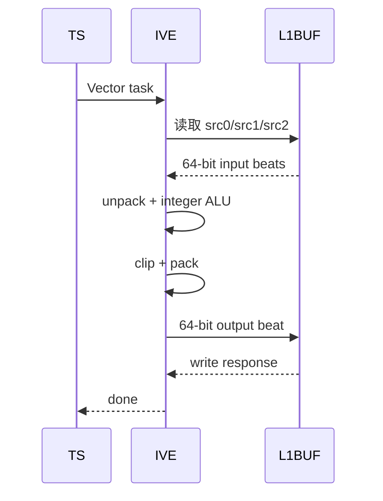
```mermaid
%%{init: {"sequence": {"useMaxWidth": true, "actorMargin": 14, "width": 82, "messageMargin": 10, "noteMargin": 6}, "themeVariables": {"fontSize": "11px"}}}%%
sequenceDiagram
    participant TS
    participant IVE
    participant L1 as L1BUF

    TS->>IVE: Vector task
    IVE->>L1: 读取 src0/src1/src2
    L1-->>IVE: 64-bit input beats
    IVE->>IVE: unpack + integer ALU
    IVE->>IVE: clip + pack
    IVE->>L1: 64-bit output beat
    L1-->>IVE: write response
    IVE-->>TS: done
```

设总有效元素数为：

$$
E=
\begin{cases}
0,&rows=0\ \text{或}\ length=0,\\
(rows-1)\times length+valid\_length,&\text{其他情况},
\end{cases}
$$

每周期可处理 $V$ 个整数元素，则无停顿时的计算发射周期不少于：

$$
N_{\mathrm{ive}}
=
\left\lceil\frac{E}{V}\right\rceil.
$$

还需同时满足 64-bit L1BUF 供数限制。例如单个输入端口每周期最多提供 16 个 INT4、8 个 INT8、4 个 INT16 或 2 个 INT32。若计算 lane 数大于 L1 每周期提供的元素数，吞吐由 L1 数据供应速度决定。

---

## 13. Complex Math Engine

### 13.1 模块组成

Complex Math Engine（CME）只接收软件可见的整数张量。P0 的输入、参数张量和输出可使用 INT4、INT8、INT16 或 INT32；每个有效元素在 CME 内依次完成：

```text
INT4 / INT8 / INT16 / INT32
→ 解包和符号扩展
→ 减 zero point
→ 乘输入 scale
→ FP32
→ 复杂数学函数
→ 除输出 scale
→ 舍入、加 zero point、裁剪
→ INT4 / INT8 / INT16 / INT32
```

CME 包含：

- I2F 转换器；
- FP32 lane 寄存器；
- FP32 加、减、乘和 FMA；
- 行级求和、求最大值、求平方和及 Welford 统计树；
- Exp、Reciprocal、ReciprocalSqrt、Sigmoid、Tanh、GELU、SiLU；
- 少量 FP32 标量寄存器；
- FP32 私有向量暂存区；
- F2I 舍入、裁剪和整数打包器。

FP32 中间结果不得写入软件可见的 L1BUF 张量，也不得经 DMA 写到 DDR。FP32 scale 和函数系数属于只读元数据，可由 CME 从 L1BUF 参数区读取。

### 13.2 模块级信号

任务与描述符端口沿用第 8.4、8.5 节。L1BUF 端口：

| 端口 | 数据宽度 | 用途 |
| --- | ---: | --- |
| `cme_src0_rd_*` | 64 | 主输入 |
| `cme_src1_rd_*` | 64 | gamma、第二输入或 RoPE cos 表的整数表示 |
| `cme_src2_rd_*` | 64 | beta、第三输入或 RoPE sin 表的整数表示 |
| `cme_mask_rd_*` | 64 | BOOLEAN mask 或每行有效长度；其他模式不发请求 |
| `cme_dst_wr_*` | 64 | 转回 INT4、INT8、INT16 或 INT32 后的输出 |

内部状态输出：

| 信号 | 方向 | 位宽 | 说明 |
| --- | --- | ---: | --- |
| `cme_busy_o` | Output | 1 | 当前有任务 |
| `cme_i2f_active_o` | Output | 1 | I2F 流水有效 |
| `cme_fp_active_o` | Output | 1 | FP32 函数流水有效 |
| `cme_f2i_active_o` | Output | 1 | F2I 流水有效 |
| `cme_l1_stall_o` | Output | 1 | 等待 L1BUF |
| `cme_numeric_flag_o` | Output | 8 | 当前任务的 Inf、NaN、除零、全 mask 行和数值范围事件位 |

`cme_numeric_flag_o` 使用固定 bit 定义。低 3 bit 保留既有取值，新增事件
使用 bit 3～5：

| Bit | 名称 | 置位条件 |
| ---: | --- | --- |
| 0 | `TASK_NUMERIC_EXCEPTION` | 当前任务终态为 `NUMERIC_EXCEPTION`；这是兼容既有使用者的汇总位 |
| 1 | `ALL_MASK_ROW` | 至少一行没有有效元素，包括 `all_mask_mode=ERROR` |
| 2 | `CLIPPED_OR_RANGE` | 输入受 `input_clip_min/max` 限制、Inf 或除零结果改为最大有限值，或 F2I/VSTAT 数学结果超出目的 dtype 范围 |
| 3 | `FP_INF` | 任一 FP32 中间运算产生正或负 Inf |
| 4 | `FP_NAN` | 任一 FP32 中间运算产生 NaN |
| 5 | `DIVIDE_BY_ZERO` | Reciprocal 或 ReciprocalSqrt 的输入为 0 |
| 7:6 | `RESERVED` | P0 输出 0 |

bit 1～5 从对应事件首次出现到当前任务离开 CME 期间保持为 1，CME 空闲时
输出 0，并在下一条任务请求握手时清零。事件记录独立于最终 `status`；
`STRICT_NUMERIC=0` 下任务成功时，已出现的 Inf、NaN 或除零 bit 仍可观察。
`CLIPPED_OR_RANGE` 同样独立于最终状态。`VSTAT_I` 可使用 SATURATE、ERROR 或 WRAP；其余 P0 CME 任务固定使用 SATURATE。

### 13.3 `COMPLEX_DESC` 专有字段

| Byte Offset | 字段 | 位宽 | 说明 |
| ---: | --- | ---: | --- |
| `0x40` | `rows` | 32 | 逻辑行数 |
| `0x44` | `length` | 32 | 每行元素数 |
| `0x48` | `valid_length` | 32 | 尾行有效元素数 |
| `0x4C` | `function_mode` | 32 | 具体函数或 Norm 模式 |
| `0x50` | `src0_row_stride` | 32 | 主输入行间隔 |
| `0x54` | `src1_row_stride` | 32 | 第二输入行间隔 |
| `0x58` | `src2_row_stride` | 32 | 第三输入行间隔 |
| `0x5C` | `dst_row_stride` | 32 | 输出行间隔 |
| `0x60` | `mask_addr` | 64 | INT8 mask；无 mask 时为 0 |
| `0x68` | `mask_row_stride` | 32 | 相邻 mask 行间隔 |
| `0x6C` | `mask_mode` | 32 | NONE、BOOLEAN、CAUSAL 或 VALID_LENGTH |
| `0x70` | `src0_scale_bits` | 32 | 主输入 $s_x$ |
| `0x74` | `src1_scale_bits` | 32 | gamma 或第二输入 scale |
| `0x78` | `src2_scale_bits` | 32 | beta 或第三输入 scale |
| `0x7C` | `dst_scale_bits` | 32 | 输出 $s_y$ |
| `0x80` | `src0_zero_point` | 32 | P0 默认 0 |
| `0x84` | `src1_zero_point` | 32 | P0 默认 0 |
| `0x88` | `src2_zero_point` | 32 | P0 默认 0 |
| `0x8C` | `dst_zero_point` | 32 | P0 默认 0 |
| `0x90` | `epsilon_bits` | 32 | Norm 的 FP32 $\epsilon$ |
| `0x94` | `input_clip_min_bits` | 32 | 函数输入最小值 |
| `0x98` | `input_clip_max_bits` | 32 | 函数输入最大值 |
| `0x9C` | `approx_mode` | 8 | 查表与多项式档位 |
| `0x9D` | `overflow_mode` | 8 | `VSTAT_I` 使用 SATURATE、ERROR、WRAP；其余 P0 CME 任务固定为 SATURATE |
| `0x9E` | `all_mask_mode` | 8 | 全 mask 行输出规则 |
| `0x9F` | `stats_mode` | 8 | TWO_PASS 或 WELFORD |
| `0xA0` | `rotary_dim` | 32 | `VROPE_I` 使用 |
| `0xA4` | `position_base` | 32 | 位置起点 |
| `0xA8` | `position_step` | 32 | 相邻 token 位置增量 |
| `0xAC` | `pair_mode` | 8 | EVEN_ODD 或 HALF_SPLIT |
| `0xB0` | `scratch_request_elems` | 32 | 当前任务申请的私有 FP32 暂存元素数 |
| `0xB4` | `query_position_base` | 32 | CAUSAL mask 的首行 Query 位置 |
| `0xB8` | `key_position_base` | 32 | CAUSAL mask 的第一个 Key 位置 |
| `0xBC` | `query_position_step` | 32 | 相邻 Softmax 行的 Query 位置增量 |
| `0xC0` | `valid_length_addr` | 64 | 每行有效 Key 数组地址；不用时为 0 |
| `0xC8` | `valid_length_stride` | 32 | 相邻行长度项的字节间隔 |
| `0xCC～0xFF` | `reserved` | — | 必须写 0 |

`0xAD～0xAF` 是对齐填充字节，P0 必须写 0。

`valid_length` 描述最后一行实际参与运算的元素数，与 `mask_mode=VALID_LENGTH` 使用的逐行 Key 数组不是同一字段。P0 使用以下规则：

- `rows=0` 时任务不读写张量并成功结束，`valid_length` 必须为 0；
- VACT、VRECIP 和 ADD_RESCALE 在 `rows>0,length=0` 时也成功结束，`valid_length` 必须为 0；
- `rows>0` 且 `length>0` 时必须满足 `1≤valid_length≤length`；
- 完整的最后一行写 `valid_length=length`；
- 最后一行中索引不小于 `valid_length` 的位置不读取，也不写目的地址；
- Softmax、Norm 和 VSTAT 在 `rows>0,length=0` 时返回 `BAD_SHAPE`。

`mask_addr` 和 `valid_length_addr` 都是 LADDR，只使用低 24 bit，高位必须为 0。BOOLEAN mask 是 INT8 `[rows,length]`，0 表示无效，非 0 表示有效。每行有效长度数组是 INT32 `[rows]`，每个元素必须位于 $[0,\texttt{length}]$；`valid_length_stride` 不得小于 4。

P0 的 `numeric_cfg.scale_mode` 固定采用以下解释：

| 模式 | 允许的任务 | scale 来源 |
| --- | --- | --- |
| NONE | `VSTAT_I` | 全部 scale 字段和 `aux0_addr/aux1_addr` 写 0 |
| PER_TENSOR | 除 VSTAT 外的 P0 CME 任务 | 使用 `0x70～0x7C` 中已启用输入和输出的标量 scale，两个辅助地址写 0 |
| PER_ROW | P0 不支持 | 返回 `BAD_DESC` |
| PER_FEATURE | VACT、Norm、ADD_RESCALE | `aux0_addr` 为 src0 `[length]` FP32 scale 表，`aux1_addr` 为 dst `[length]` FP32 scale 表；`src0_scale_bits` 和 `dst_scale_bits` 写 0，src1/src2 仍使用描述符标量 scale |

每 Feature 表按 little-endian FP32 连续保存，起点必须 4B 对齐，并满足 `addr+length×4≤L1_BYTES`。P0 CME 只接受 zero point 为 0，因此 `numeric_cfg.zero_point_enable=0`，`src0_zero_point`、`src1_zero_point`、`src2_zero_point` 和 `dst_zero_point` 必须全部写 0。

CME 在读取输入张量前必须确认：

- 所有已启用 scale 都是有限且大于 0 的 FP32；
- 只有 `VNORM_I` 检查 $\epsilon$，其值必须是有限且大于 0 的 FP32；其他 opcode 的 `epsilon_bits` 必须写 0；
- 只有 VACT、Softmax、Reciprocal 和 ReciprocalSqrt 检查 `input_clip_min < input_clip_max`；VSTAT、Norm、ADD_RESCALE 的两个 clip 字段必须写 0；
- `scratch_request_elems` 不大于 `CME_CONFIG` 给出的 `scratch_capacity=4096`；
- 零尺寸任务按本节前述规则要求 `valid_length=0`；其他任务要求 `1≤valid_length≤length`；
- mask、scale 表、$\gamma$ 和 $\beta$ 的元素数足够；
- 只有逐元素激活允许 `dst_addr=src0_addr`，其他部分重叠返回 `BAD_DESC`。

P0 的 `VACT_I`、`VSOFTMAX_I`、`VNORM_I` 和 `VADD_RESCALE_I` 必须设置 `overflow_mode=SATURATE`，并将 `numeric_cfg.saturate_enable` 设为 1。F2I 结果超出目的整数格式范围时，这些任务写入相应端点值，并置 `cme_numeric_flag_o[2]`。ERROR 和 WRAP 仅适用于 `VSTAT_I`。

`function_mode` 至少包括：

| 编码 | 模式 |
| ---: | --- |
| 0 | SIGMOID |
| 1 | TANH |
| 2 | GELU |
| 3 | SILU |
| 4 | SOFTMAX |
| 5 | LAYERNORM |
| 6 | RMSNORM |
| 7 | STAT_SUM |
| 8 | STAT_MAX |
| 9 | STAT_SUMSQ |
| 10 | RECIPROCAL |
| 11 | RECIPROCAL_SQRT |
| 12 | ADD_RESCALE |
| 13 | ROPE |

opcode 与 `function_mode` 的合法组合固定如下；任何不一致组合都返回 `BAD_DESC`：

| Opcode | 允许的 `function_mode` |
| --- | --- |
| `VACT_I` | SIGMOID、TANH、GELU、SILU |
| `VSOFTMAX_I` | SOFTMAX |
| `VNORM_I` | LAYERNORM、RMSNORM |
| `VROPE_I` | ROPE |
| `VSTAT_I` | STAT_SUM、STAT_MAX、STAT_SUMSQ |
| `VRECIP_I` | RECIPROCAL、RECIPROCAL_SQRT |
| `VADD_RESCALE_I` | ADD_RESCALE |

P0 的整数数据类型组合固定如下。“INT4/INT8/INT16/INT32 任一”表示该端口可以独立选择四种整数格式，不要求多个输入与输出使用相同格式。未使用的端口必须按对应描述符规则写 0。

| Opcode 与模式 | `src0` | `src1` | `src2` | `dst` |
| --- | --- | --- | --- | --- |
| `VACT_I` | INT4/INT8/INT16/INT32 任一 | 未使用 | 未使用 | INT4/INT8/INT16/INT32 任一 |
| `VSOFTMAX_I` | INT4/INT8/INT16/INT32 任一 | 未使用 | 未使用 | INT4/INT8/INT16/INT32 任一 |
| `VNORM_I` + LAYERNORM | INT4/INT8/INT16/INT32 任一 | gamma，INT4/INT8/INT16/INT32 任一 | beta，INT4/INT8/INT16/INT32 任一 | INT4/INT8/INT16/INT32 任一 |
| `VNORM_I` + RMSNORM | INT4/INT8/INT16/INT32 任一 | gamma，INT4/INT8/INT16/INT32 任一 | 未使用 | INT4/INT8/INT16/INT32 任一 |
| `VSTAT_I` | INT4/INT8/INT16/INT32 任一 | 未使用 | 未使用 | 仅 INT32 |
| `VADD_RESCALE_I` | INT4/INT8/INT16/INT32 任一 | INT4/INT8/INT16/INT32 任一 | 未使用 | INT4/INT8/INT16/INT32 任一 |

BOOLEAN mask 固定按 INT8 保存；每行有效长度数组固定按 INT32 保存。LayerNorm 和 RMSNorm 的 gamma、beta 是长度为 `length` 的一维参数数组，同一组参数供全部 `rows` 行使用。CME 的软件可见张量端口可以独立使用 INT4、INT8、INT16 或 INT32；FP32 仅用于 CME 的寄存器、私有暂存和只读参数值，不能作为 L1BUF 或 DDR 中的软件可见张量格式。C 语言参考模型的组合测试必须逐项覆盖上表，并额外覆盖 0、1、3、4、5 个元素、四种舍入方式、VSTAT 的三种溢出处理方式以及奇数个 INT4 输出元素。

CME 的 INT4 输入和输出起点在 P0 中都必须位于低半字节。奇数个 INT4 输出元素的末字节高半字节写 0。

`mask_mode` 使用 `0=NONE`、`1=BOOLEAN`、`2=CAUSAL`、`3=VALID_LENGTH`；`all_mask_mode` 使用 `0=WRITE_ZERO`、`1=ERROR`；`stats_mode` 使用 `0=TWO_PASS`、`1=WELFORD`。`approx_mode=0` 选择第 13.10 节定义的参考算法，其他档位只有在 `CME_CONFIG` 对应功能位为 1 时才能使用。

`stats_mode=WELFORD` 只用于 LayerNorm。RMSNorm 固定使用平方和计算，其他 CME 指令也必须写 `stats_mode=TWO_PASS`。

### 13.4 激活函数

对每个输入整数 $q_x$：

$$
x=(q_x-z_x)s_x.
$$

内部 FP32 函数定义：

$$
\operatorname{sigmoid}(x)=\frac{1}{1+e^{-x}},
$$

$$
\operatorname{tanh}(x)=\frac{e^x-e^{-x}}{e^x+e^{-x}},
$$

$$
\operatorname{SiLU}(x)=x\operatorname{sigmoid}(x),
$$

$$
\operatorname{GELU}(x)
\approx
\frac{x}{2}
\left[
1+
\operatorname{tanh}
\left(
\sqrt{\frac{2}{\pi}}
\left(x+0.044715x^3\right)
\right)
\right].
$$

得到 $y$ 后：

$$
q_y=
\operatorname{clip}
\left(
\operatorname{round}\left(\frac{y}{s_y}\right)+z_y
\right).
$$

`VACT_I` 是一个输入、一个输出的一遍任务。输入和输出可以原地使用同一地址，但读数据必须先进入流水寄存器，之后才能写回同一 64-bit beat。

### 13.5 不同 scale 的逐元素加法

`VADD_RESCALE_I` 计算：

$$
x_0=(q_0-z_0)s_0,
\qquad
x_1=(q_1-z_1)s_1,
$$

$$
q_y=
\operatorname{clip}
\left[
\operatorname{round}
\left(
\frac{x_0+x_1}{s_y}
\right)
+z_y
\right].
$$

该任务用于残差相加、不同来源的门值相加或两个张量 scale 不相同的情况。

### 13.6 Softmax

对一行内部 FP32 输入 $x_i$：

$$
m=\max_i x_i,
$$

$$
l=\sum_i\exp(x_i-m),
$$

$$
y_i=\frac{\exp(x_i-m)}{l}.
$$

CME 采用三遍整数读取：

1. 第一遍执行 I2F 并求 $m$；
2. 第二遍重新读取，执行 I2F、Exp 并求 $l$；
3. 第三遍重新计算 Exp，乘 $1/l$，再执行 F2I 和整数写回。

mask 为无效的位置：

- 求最大值时不参加比较；
- 求分母时贡献 0；
- 输出写为 $q_y=z_y$，即输出整数格式中代表实数 0 的值。

若一整行没有有效元素，CME 不计算 $1/0$，直接按 `all_mask_mode` 写 $z_y$ 或返回 `NUMERIC_EXCEPTION`。P0 默认写 $z_y$ 并增加 `all_mask_row_count`；P0 的 $z_y=0$。

每行开始时，最大值寄存器设为 $-\infty$，指数和寄存器设为 0。若本次读取的数据块没有任何有效位置，CME 直接跳过该块，不计算 $(-\infty)-(-\infty)$。这条规则同时用于普通三遍 Softmax 和后续可选的分块 Softmax。

Mask 模式定义：

| 模式 | 有效位置 |
| --- | --- |
| `NONE` | 全部 `i<length` |
| `BOOLEAN` | `mask[row,i] != 0` |
| `VALID_LENGTH` | `i < valid_length[row]` |
| `CAUSAL` | `key_position_base+i ≤ query_position_base+row×query_position_step` |

P0 必须实现 `NONE`、`BOOLEAN` 和 `VALID_LENGTH`。`CAUSAL` 可以先由软件生成 BOOLEAN mask；若硬件实现位置比较，则在功能寄存器中设置对应 P1 位。一个 CAUSAL 任务处理一个 Batch/Head 组，多个组由编译器发射多条任务。

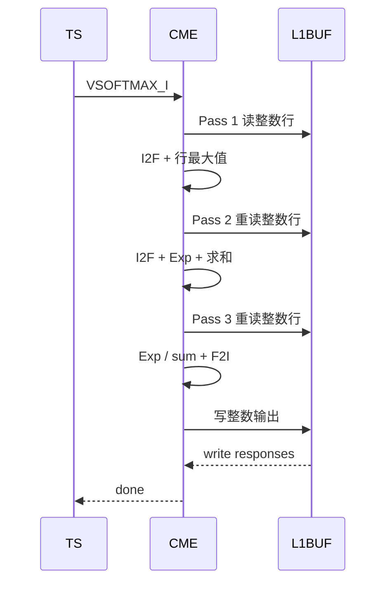
```mermaid
%%{init: {"sequence": {"useMaxWidth": true, "actorMargin": 14, "width": 82, "messageMargin": 10, "noteMargin": 6}, "themeVariables": {"fontSize": "11px"}}}%%
sequenceDiagram
    participant TS
    participant CME
    participant L1 as L1BUF

    TS->>CME: VSOFTMAX_I
    CME->>L1: Pass 1 读整数行
    CME->>CME: I2F + 行最大值
    CME->>L1: Pass 2 重读整数行
    CME->>CME: I2F + Exp + 求和
    CME->>L1: Pass 3 重读整数行
    CME->>CME: Exp / sum + F2I
    CME->>L1: 写整数输出
    L1-->>CME: write responses
    CME-->>TS: done
```

### 13.7 LayerNorm 与 RMSNorm

输入逻辑 shape 为 `[rows,H]`。对来自 `[B,S,H]` 的张量，可令 `rows=B×S`；每个 `(b,s)` 的 $H$ 个 Feature 独立处理，不跨 Batch维度或 token 位置。

LayerNorm：

$$
\mu=\frac1H\sum_{j=0}^{H-1}x_j,
\qquad
v=\frac1H\sum_{j=0}^{H-1}(x_j-\mu)^2,
$$

$$
y_j=
\gamma_j\frac{x_j-\mu}{\sqrt{v+\epsilon}}
+\beta_j.
$$

RMSNorm：

$$
r=
\sqrt{
\frac1H\sum_{j=0}^{H-1}x_j^2+\epsilon
},
\qquad
y_j=\gamma_j\frac{x_j}{r}.
$$

$x_j$、$\gamma_j$、$\beta_j$ 都从整数张量转为内部 FP32。$\gamma$ shape 为 `[H]`，$\beta$ shape 为 `[H]`；同一组参数用于全部 `rows` 行。P0 LayerNorm 必须提供 gamma 和 beta。P0 RMSNorm 只提供 gamma，不使用 beta，因此 `src2_addr=0`、`src2_row_stride=0`、`src2_scale_bits=0`，公共 `src2_dtype` 写 0。地址 0 本身仍是合法 LADDR；这里由 `function_mode=RMSNORM` 固定表示 src2 未使用，不依赖额外开关。

LayerNorm 可用 Welford 在第一遍同时得到均值和离均差平方和，也可使用两次统计读取。得到标量后，再读一遍整数输入和整数 $\gamma,\beta$，执行 FP32 标准化，最后转换为整数输出。

`VSTAT_I` 的整数统计数据通路不使用 FP32。C 语言参考模型的 `CME_MAX_LENGTH=65536`，`STAT_SUM` 使用有符号 64 bit，`STAT_SUMSQ` 使用 96-bit 概念临时值，保证对全部 P0 dtype 精确保存平方和。C 语言参考模型可用三个 32-bit word 实现该加法，不要求宿主编译器提供宽于 64 bit 的内建整数类型。写回 INT32 时按 `overflow_mode` 执行 SATURATE、ERROR 或 WRAP。`STAT_MAX` 先把输入符号扩展到 INT32，再按元素比较。

### 13.8 CME 状态机

| 状态 | 动作 |
| --- | --- |
| `IDLE` | 等待任务 |
| `LOAD_DESC` | 读取 COMPLEX_DESC |
| `CHECK` | 检查 scale、zero point、函数、shape、mask 和 scratch 容量 |
| `PASS0` | 第一遍整数读取和 I2F |
| `STATS0` | 最大值、均值、平方和或 Welford 更新 |
| `PASS1` | 第二遍读取和函数计算 |
| `STATS1` | 分母或方差相关标量完成 |
| `PASS2` | Softmax 第三遍，其他任务可跳过 |
| `F2I_PACK` | 舍入、裁剪和整数打包 |
| `WRITE` | 64-bit 写回 |
| `DRAIN` | 等待全部写响应 |
| `DONE` | 发送完成消息 |

### 13.9 单遍激活时序

| 阶段 | 最少动作 |
| --- | --- |
| T0 | 接收任务并读取描述符 |
| T1 | 发出 L1BUF 读请求 |
| T2～ | 64-bit 输入进入解包器 |
| T3～ | I2F：减 zero point、乘 scale |
| T4～ | FP32 函数流水 |
| T5～ | F2I：除输出 scale、舍入、加 zero point、裁剪 |
| T6～ | 64-bit 整数打包并写 L1BUF |
| Tend | 最后一个写响应返回，发送 done |

各阶段的实际流水深度由功能寄存器公开。CME 必须允许前一组元素处于 FP32 函数流水时，后一组元素进入 I2F，从而形成连续数据流。

V1.1 还固定 Engine Data 参考模型的活动调度。功能算子仍可先产生访问记录和
最终数据，但端口重放必须根据已经核对成功的源读响应推进算术调度，不能把全部
`me_mac_active`、`ive_alu_active`、`cme_i2f_active`、`cme_fp_active` 和
`cme_f2i_active` 都推迟到最后一个源读响应之后。

对于 ME、IVE 和单遍 CME，先定义按读端口计算的响应额度。设当前任务共有
$G_{\text{op}}$ 个算术组，读端口 $p$ 的访问记录共有 $T_p$ 个 64-bit word，
到当前周期已经成功接收 $A_p$ 个 word，则该端口允许启动的组数为：

$$
C_p=
\left\lfloor
\frac{A_pG_{\text{op}}}{T_p}
\right\rfloor .
$$

$T_p=0$ 的端口不参加比较。若任务没有源读 word，例如全部操作数均来自描述符
标量，则全部组立即具备启动条件。其余情况取所有已使用端口中的最小值：

$$
C=\min_{p:T_p>0} C_p.
$$

只有 status 表示成功、tag 与 last 正确，并且 `strb` 指定字节与访问记录一致的
读响应才增加 $A_p$。因此，算术 active 不会由尚未返回、返回错误或数据不一致的
word 提前触发。每个 Core 周期最多启动一个新组；已经启动的组数小于 $C$ 时，
当前周期可以启动下一组。`compute_valid` 此时可以与读端口的
`rsp_ready` 同时为 1。

ME 只使用 A、B 两个读端口计算 $C$，bias、residual 和整数重缩放参数由
Epilogue 使用，不延迟已有操作数的 MAC。IVE 使用全部实际出现访问记录的输入
端口，包括 mask 和旧目的读取。单遍 CME 使用全部实际出现访问记录的输入端口。
这种按 word 比例分配额度的方式使周期结果固定、可重复，并能表示读与计算重叠；
它不声称每个访问记录 word 已经带有精确的 tile 或元素组编号。

定义：

$$
E=(\text{rows}-1)\text{length}+\text{valid\_length},
\qquad
G=\left\lceil\frac{E}{4}\right\rceil,
\qquad
R=\text{rows}.
$$

当 `rows=0` 时令 $E=G=0$。再定义一个充满后每周期接收一组的流水周期函数：

$$
P(x,L)=
\begin{cases}
0,&x=0\ \text{或}\ L=0,\\
x+L-1,&\text{其他情况}.
\end{cases}
$$

这里 $x$ 是发射组数，$L$ 是首组延迟。周期窗使用左闭右开区间
`[start,start+cycles)`。对连续供数的单遍 CME，`elapsed=0` 表示第一组由
I2F 接收的周期；对多遍 CME，`elapsed=0` 表示最后一个源读响应完成后的第一个
算术周期。

直接激活、Reciprocal、ReciprocalSqrt 和 `ADD_RESCALE` 使用单遍流式调度。
下表给出各组连续启动且没有读暂停时的活动周期窗：

| 阶段 | `start` | `cycles` |
| --- | ---: | ---: |
| I2F | 0 | $P(G,3)$ |
| FP | 3 | $P(G,L_f)$ |
| F2I | $3+L_f$ | $P(G,4)$ |

$L_f$ 使用第 13.10.5 节的函数流水延迟；`ADD_RESCALE` 每组执行一次 FP32 加法，
因此 $L_f=1$。当 $G>1$ 时，I2F 与 FP、FP 与 F2I 的活动周期可以重叠；重叠表示
不同四元素组同时处于不同阶段。若响应额度暂时不足，新组停止启动，已经进入
I2F、FP 或 F2I 的组仍继续前进。此时 active 序列可以出现空周期，任务结束周期
也会晚于上表的连续供数结果。

组合函数需要重复读取输入，访问记录目前只区分读取遍次，没有记录每一行内部的
数据依赖。因此 Softmax、LayerNorm 和 RMSNorm 在全部读取遍次完成后再启动
参考算术调度。它们先计算串行前段周期 $Q$，再接最终逐组处理。各函数固定为：

| 函数 | I2F 发射组数 | 串行前段 $Q$ | 最终逐组延迟 $L_f$ |
| --- | ---: | --- | ---: |
| Softmax | $3G$ | $G+P(G,8)+P(R,6)$ | 9 |
| LayerNorm，`stats_mode=TWO_PASS` | $3G$ | $G+P(R,6)+P(G,3)+P(R,6)+R+P(R,8)$ | 4 |
| LayerNorm，`stats_mode=WELFORD` | $2G$ | $P(G,6)+P(R,6)+R+P(R,8)$ | 4 |
| RMSNorm | $2G$ | $P(G,2)+P(R,6)+2R+P(R,8)$ | 2 |

组合函数的活动窗为：

| 阶段 | `start` | `cycles` |
| --- | ---: | ---: |
| I2F | 0 | $P(\text{I2F 发射组数},3)$ |
| FP | 3 | $Q+P(G,L_f)$ |
| F2I | $3+Q+L_f$ | $P(G,4)$ |

Softmax 的 $Q$ 依次表示最大值扫描、Exp 与分母累加、每行一次 Reciprocal；
最终 9 周期段表示 Exp 和乘分母倒数。LayerNorm 与 RMSNorm 的 $Q$ 依次覆盖
统计、每行 Reciprocal、乘法、加 $\epsilon$、ReciprocalSqrt；最终段执行标准化、
$\gamma/\beta$ 或 RMS 缩放。`VSTAT_I` 是整数统计，不产生 I2F、FP 或 F2I
活动。

该参考调度只由描述符 shape、`stats_mode` 和函数决定，不根据 mask 内容缩短。
被 mask 排除的元素仍占用已发射组中的 lane，全 mask 行也按完整行时序执行；
这样相同描述符的执行周期不会随数据内容变化。`cme_fp_active_cycles` 统计上述
FP 活动窗，而不是仅统计最终对输出有数值贡献的 lane。

Matrix 的参考活动组数为：

$$
G_{\mathrm{ME}}=
\text{batch\_count}\times
\left\lceil\frac{M}{MT}\right\rceil\times
\left\lceil\frac{N}{NT}\right\rceil\times
\left\lceil\frac{K}{KT}\right\rceil .
$$

也就是每个 `(Batch, M tile, N tile, K tile)` 组合占一个
`me_mac_active` 周期；组的启动受 A、B 端口响应额度限制，因此可以与后续源读
响应重叠。`GEMM_ZERO` 不产生 MAC 活动。IVE 令
$L_{\mathrm{IVE}}$ 为当前 dtype 在 64-bit 供数限制和配置 lane 数共同允许的
lane 数，则 `ive_alu_active` 共对应
$G_{\mathrm{IVE}}=\lceil E/L_{\mathrm{IVE}}\rceil$ 个组；组的实际启动周期受
全部已使用输入端口的响应额度限制。
`ive_lane_valid` 的每一位表示当前组中存在一个 shape 有效元素；最后一组只置
剩余元素对应的低位。

当前 V1.1 重放器仍要求全部源读请求排空且全部算术组完成后，才发送第一个目的
写请求。要进一步精确描述 ME tile 写回、IVE 元素组写回以及单遍 CME 的 F2I
输出与后续组计算重叠，后续模型至少需要增加以下内部状态：

不能仅按当前写访问记录的数组次序提前发送数据。写记录会把同一 64-bit word
的多次字节写合并成一个最终 word，不再保留每次写来自哪个算术组。INT4 的同一
字节还可能由两个不同组分别产生低、高半字节。原地任务中，同一 word 也可能在
后续组继续作为源数据；未经证明的提前写会覆盖尚未接收的输入。ME 的一个写 word
还可能包含不同输出 tile 的元素，而每个输出 tile 必须等自己的最后一个 K tile
完成。若在缺少这些信息时按地址次序或固定比例猜测写就绪周期，取消和数据端口
错误时的 `PARTIAL_DEST` 与进度也会失去确定含义。

1. 在访问记录中为每个读 word 保存 tile、元素组、行和读取遍次编号，并为每个
   写 word 保存产生它的输出组编号。
2. 把读请求控制、算术调度和写请求控制拆成三个可同时推进的状态机，而不是只用
   一个互斥的重放状态。
3. ME 保存两套 A/B tile buffer 的有效位、tile 坐标、当前 K tile 累加状态和
   C tile 输出队列占用数。
4. IVE 为每个元素组保存 src0、src1、src2、mask 和旧目的的就绪位，并保存输出
   FIFO 的读写指针。
5. CME 保存逐组 I2F、FP、F2I token，以及 Softmax 和归一化任务的逐行统计状态。
6. 写控制器按输出组取得写记录片段，并分别统计已经发送、已经确认和因取消而
   丢弃的 word；完成消息继续以已经确认的目的字节数报告进度。

这些状态可以复用现有 L1BUF 和 MIF ready/valid 接口，不要求增加软件可见字段。
在上述状态进入 C 语言参考模型前，性能评估不得把当前“算术完成后统一写回”的周期数
当作最终 RTL 的吞吐结果。

### 13.10 FP32 内部异常

内部 FP32 出现以下情况时：

| 情况 | 默认行为 |
| --- | --- |
| 输入 scale 为 0、负数、NaN 或 Inf | 描述符错误，不启动任务 |
| Exp 输入大于 `input_clip_max` | 裁剪到上限并计数 |
| Exp 输入小于 `input_clip_min` | 结果按 0 处理并计数 |
| Reciprocal 输入为 0 | 按描述符写饱和值或返回错误 |
| F2I 超出目的整数范围 | 裁剪并增加计数 |
| FP32 中间值为 NaN | `STRICT_NUMERIC=1` 时任务失败，否则输出 zero point |

#### 13.10.1 `approx_mode=0` 的 FP32 基础规则

C 语言参考模型和 mode 0 RTL 使用 IEEE 754 binary32。每次加、减、乘都在该操作后立即舍入为 binary32，默认舍入方式为最近偶数；不得把相邻乘法和加法自动合成为 FMA。函数实现只使用符号位、指数位、尾数位、加法、减法、乘法、比较、移位和固定次数迭代，不调用宿主环境的 `expf`、`tanhf`、`sqrtf` 或同类函数。

C 语言参考模型在编译时检查 `float` 为 32 bit、二进制基数、24 bit 有效精度以及
binary32 指数范围；宿主环境不满足这些条件时直接拒绝构建，不能退化为另一种
浮点格式后继续运行。

mode 0 支持 binary32 次正规输入。规格化时可先乘 $2^{24}$，再把所得指数减 24。构造 $2^k$ 时，正规数直接写指数域，次正规数写相应尾数 bit。计算结果超过最大有限 FP32 时输出同符号最大有限值，不产生软件可见 FP 张量。

#### 13.10.2 Exp

Exp 先执行：

```text
x < -16 : 返回 0
x >  16 : 按 x = 16 计算
```

范围缩小使用以下 binary32 常数：

```text
inv_ln2 = 0x1.715476p+0
ln2_hi  = 0x1.62e300p-1
ln2_lo  = 0x1.2fefa2p-17
k       = round_nearest_even(x * inv_ln2)
r       = (x - k * ln2_hi) - k * ln2_lo
```

随后按照下列 Horner 次序计算六阶多项式，每一行都产生一次新的 FP32 结果：

```text
p = 0x1.6c16c2p-10
p = 0x1.111112p-7 + r * p
p = 0x1.555556p-5 + r * p
p = 0x1.555556p-3 + r * p
p = 0x1.000000p-1 + r * p
p = 1.0              + r * p
p = 1.0              + r * p
result = p * pow2(k)
```

这些系数分别接近 $1/720$、$1/120$、$1/24$、$1/6$ 和 $1/2$。使用十六进制 FP32 常数可以避免不同编译器把十进制文本转换成不同的末位结果。

#### 13.10.3 Reciprocal 与 ReciprocalSqrt

Reciprocal 先把 $|x|$ 写成 $m2^e$，其中 $1\le m<2$。初值和三轮 Newton 更新为：

```text
y0 = 0x1.69696ap+0 - 0x1.e1e1e2p-2 * m
y1 = y0 * (2 - m * y0)
y2 = y1 * (2 - m * y1)
y3 = y2 * (2 - m * y2)
result = sign(x) * y3 * pow2(-e)
```

ReciprocalSqrt 同样先规格化正输入，并调整 $e$ 为偶数；若 $e$ 为奇数，则令 $m\leftarrow2m$、$e\leftarrow e-1$。把 $m$ 的 FP32 位模式记为 `m_bits`：

```text
y_bits = 0x5f375a86 - (m_bits >> 1)
y = fp32_from_bits(y_bits)
重复三次：
    y = y * (1.5 - 0.5 * m * y * y)
result = y * pow2(-e / 2)
```

Reciprocal 的零输入和 ReciprocalSqrt 的非正输入在 `STRICT_NUMERIC=1` 时返回 `NUMERIC_EXCEPTION`；严格检查关闭时返回相应符号的最大有限值，随后由 F2I 按目的 dtype 处理。

#### 13.10.4 Sigmoid、Tanh、SiLU 与 GELU

Sigmoid 使用避免正数指数溢出的写法。令 $a=\exp(-|x|)$：

$$
\operatorname{sigmoid}(x)=
\begin{cases}
1/(1+a),&x\ge0,\\
a/(1+a),&x<0.
\end{cases}
$$

$x>16$ 时直接输出 1，$x<-16$ 时直接输出 0。

Tanh 在 $|x|<0.25$ 时使用：

$$
\operatorname{tanh}(x)
\approx
x-\frac{x^3}{3}+\frac{2x^5}{15}-\frac{17x^7}{315}.
$$

其他输入使用：

$$
\operatorname{tanh}(x)
=\operatorname{sign}(x)
\frac{1-\exp(-2|x|)}{1+\exp(-2|x|)}.
$$

$|x|>8$ 时直接输出相应符号的 1。SiLU 使用 $x\operatorname{sigmoid}(x)$；$x>16$ 时输出 $x$，$x<-16$ 时输出 0。GELU 使用第 13.4 节的 Tanh 公式和固定常数 `0x1.988454p-1`、`0x1.6e4e26p-5`；$x>8$ 时输出 $x$，$x<-8$ 时输出 0。

#### 13.10.5 mode 0 误差与简单周期参数

描述符中的 clip 范围必须位于下表支持范围内。Softmax 内部 Exp 的有效输入为 `[-16,0]`；小于 -16 的项按 0 处理。

| 函数 | 支持输入范围 | 最大绝对误差 | 最大相对误差 | 流水延迟 |
| --- | --- | ---: | ---: | ---: |
| Exp | `[-16,16]` | — | $2^{-10}$ | 8 |
| Reciprocal | $2^{-12}\le\lvert x\rvert\le2^{12}$ | — | $2^{-10}$ | 6 |
| ReciprocalSqrt | $2^{-12}\le x\le2^{12}$ | — | $2^{-10}$ | 8 |
| Sigmoid | `[-16,16]` | $2^{-12}$ | — | 10 |
| Tanh | `[-8,8]` | $2^{-12}$ | — | 10 |
| SiLU | `[-16,16]` | $2^{-10}$ | — | 12 |
| GELU | `[-8,8]` | $2^{-10}$ | — | 16 |

I2F 固定记为 3 周期，F2I 固定记为 4 周期。函数流水充满后，每周期最多接收一组 `CME_FP32_LANES=4` 个元素。误差测试使用高精度数学结果；NPU RTL 与同版本 C 语言参考模型之间还必须逐 bit 比较 mode 0 的 FP32 中间检查点和最终整数输出。

#### 13.10.6 mode 0 检查点接口

C 语言参考模型用 `npu_mode0_trace_t` 保存可与 RTL 调试信号逐 bit 比较的检查点。所有
以 `_bits` 结尾的成员都保存 IEEE 754 binary32 的原始 32-bit 位模式，不进行
十进制文本转换。验证程序先调用 `npu_mode0_trace_clear()`，再按待检查的运算
调用以下函数：

| C 语言参考模型函数 | `valid` 成员 | 保存内容 |
| --- | --- | --- |
| `npu_exp_approx_traced()` | `exp_valid` | `exp_k` 保存有符号整数 $k$，`exp_r_bits` 保存两次减法完成后的 $r$ |
| `npu_reciprocal_approx_traced()` | `reciprocal_valid` | `reciprocal_newton_bits` 保存第三轮 Newton 更新后的 $y_3$，此时尚未乘 $2^{-e}$，也尚未恢复输入符号 |
| `npu_rsqrt_approx_traced()` | `rsqrt_valid` | `rsqrt_newton_bits` 保存第三轮 Newton 更新后的 $y$，此时尚未乘 $2^{-e/2}$ |
| `npu_float_to_int_traced()` | `f2i_valid` | `f2i_input_bits` 保存进入整数转换器之前的 FP32 值 |

普通的 `npu_exp_approx()`、`npu_reciprocal_approx()`、
`npu_rsqrt_approx()` 和 `npu_float_to_int()` 与带检查点版本调用同一份计算实现，
两者的最终结果必须相同。NaN、Exp 下溢、Reciprocal 零输入、
ReciprocalSqrt 非正输入等特殊处理不会执行对应的范围缩小或 Newton 更新，
因此相应 `valid` 成员为 0。验证环境应对每个元素、每次基础函数调用分别保存
一条检查记录；单个结构只保存最近一次同类调用的值。

以下四组值是 V1.1 的固定冒烟测试，不允许因编译器或宿主处理器不同而改变：

| 调用 | 检查点 | 期望值 |
| --- | --- | --- |
| `Exp(1.0f)` | `k`、`r_bits` | `1`、`0x3E9D1BD0` |
| `Reciprocal(3.0f)` | 第三轮 Newton `y_bits` | `0x3F2AAAAB` |
| `ReciprocalSqrt(4.0f)` | 第三轮 Newton `y_bits` | `0x3F7FFFFF` |
| `F2I(-2.5f, nearest-even)` | 输入位模式、整数结果 | `0xC0200000`、`-2` |

> [!note] 为什么保存位模式
> 十进制打印会受显示位数影响，看起来相同的两个数仍可能相差一个最低有效 bit。直接比较 `uint32_t` 位模式可以检查常数、运算次序、每步 FP32 舍入以及是否意外使用了 FMA。

---

## 14. MIF 与 TBU

### 14.1 功能

MIF 接收 Descriptor Fetch Unit 和 DMA 的全局内存请求，执行：

1. 检查 `TBU_BYPASS` 是否满足配置要求；非 bypass 请求将 48-bit GVA 送给 TBU；
2. 接收 TBU 返回的 40-bit PA 或失败状态；
3. 检查 PA 是否位于允许访问的系统物理地址范围；
4. 分配 AXI ID，并通过 `m_axi_*` 向系统 AXI 互连发出请求；
5. 把 AXI 返回对应到内部请求 tag；
6. 把 `DECERR`、`SLVERR` 和地址转换错误变成统一任务状态。

MIF 通过 `m_axi_*` 接入系统 AXI 互连。DDR Controller、共享存储和其他
Slave 的地址选择由系统互连完成，MIF 不保存目标设备类型。TBU 只完成地址转换
与权限检查，不产生、不保存也不驱动 AXI 事务。

> [!important] 当前 RTL 与后续要求
> 当前 `npu_single_core_top.sv` 已把 `npu_axi_mif_master` 的完整
> `m_axi_aw*`、`m_axi_w*`、`m_axi_b*`、`m_axi_ar*`、`m_axi_r*` 通道直接
> 引出到系统总线；Verilator 完整单核测试把这些通道连接到通用 AXI 存储模型。
> 当前 `npu_mif_arbiter` 在 DFU 与 DMA 之间选择请求，
> `npu_axi_mif_master` 每次保留一项 64-bit 请求，使用 AXI ID 0、
> `ARLEN=AWLEN=0`，并在 TBU 成功返回后才发出 AXI 事务。当前 TBU 执行
> stream/substream、读写许可和 `m_axi_addr_base_o/m_axi_addr_limit_o`
> 范围检查，通过后采用恒等地址转换。下文的多 ID、burst、owner tag、CDC
> FIFO 和可选 bypass 是后续 RTL 必须达到的设计要求，不表示当前原型已经实现。

单核第一版不访问远端 L1BUF。

DFU/DMA 位于 `core_clk` 域，MIF/TBU 位于 `noc_clk` 域时，请求通过 `core_clk→noc_clk` 异步 FIFO，返回通过 `noc_clk→core_clk` 异步 FIFO。FIFO 必须同时保存 64-bit 数据、owner、tag、last、strb、响应类型和 status；不允许分别同步控制信号与数据总线。

参考实现为每个 owner 分别设置三类 FIFO：

| FIFO | 方向 | 每个 owner 的深度 | payload |
| --- | --- | ---: | --- |
| Request FIFO | Core→NoC | 4 | write、48-bit vaddr、beats、tag、owner、task_id、attr |
| Write-data FIFO | Core→NoC | 8 | 64-bit data、strb、last、tag、owner |
| Response FIFO | NoC→Core | 8 | 64-bit data、tag、is_write、last、status、owner |

各 FIFO 的读写位置变化经过两级接收时钟域同步寄存器后才参与 full、empty、
ready 和 valid 计算。发送域完成一次写入后，接收域必须经历两个完整同步采样
周期，payload 才能在后续周期置为 valid；同一次 Core tick 或 NoC tick 内
不得直接穿过 FIFO。反方向释放的空间也经过两级同步后才重新产生 ready。
Core 与 NoC 的 tick 可以任意交错，也可以采用不同频率；每个方向都保持
owner 内的先后次序。

任一时钟域的 `reset_n` 置 0 都清空三类 FIFO，并暂时禁止两个方向传输。
CDC 桥维护一个 32-bit `reset_epoch`。Core 域或 NoC 域首次观察到本次
`reset_n=0` 时，桥把 `reset_epoch` 加 1，并同时清除两侧的传输释放状态。
复位信号持续为 0 时不会重复增加该值。

每个时钟域各用两级寄存器观察当前 `reset_epoch`。Core 侧
`npu_mif_cdc_core_outputs_t.reset_epoch` 和 NoC 侧
`npu_mif_cdc_noc_outputs_t.reset_epoch` 都只给出本域第二级寄存器中的值。
本域第二级值等于当前 `reset_epoch` 后，还要再经过一个本域 tick 才设置本域
释放状态。只有 Core 和 NoC 的释放状态都为 1，
`transport_active` 才能为 1，Request、Write-data 和 Response FIFO 才恢复
ready/valid。因而，先恢复时钟的一侧不能在另一侧尚未处理复位事件时提前发送
数据。

> [!note] 为什么需要 `reset_epoch`
> 只检查“本域已经看到一次 `reset_n=1`”不能说明另一个时钟域已经复位 MIF，
> 也不能说明 TS 已经处理失去返回的任务。`reset_epoch` 把每次 FIFO 状态丢失
> 变成两侧都能可靠观察的事件。即使 Core 和 NoC 的 tick 次数比例不断变化，
> 两侧仍会按同一个 epoch 执行任务终止、MIF 复位和传输恢复。

如果请求已经离开 FIFO 并进入 MIF，清空 FIFO 不能代替后续处理。NoC 域观察
到新的 epoch 时，必须先保存旧 AXI ID 和外部 TBU tag，再复位 MIF/TBU；
Core 域观察到新的 epoch 时，按第 14.2 节处理仍在等待 MIF 的任务。两侧完成
这些操作之前，`transport_active` 必须保持为 0。

Core-only 复位时，外部 AXI 目标和外部 TBU 可以继续运行，因此旧 R、B 或 TBU
返回可能在新任务开始后才到达。单核顶层按以下规则隔离这些返回：

1. NoC 域处理新 epoch 前，保存已经发出 AR 的 AXI ID、尚未接收的读 beat 数、
   已经发出 AW 的 AXI ID、每笔写事务尚未发送的 W beat 数，以及等待外部
   TBU 返回的 14-bit tag；
2. 被保存的 AXI ID 不分配给新事务；被保存的外部 TBU tag 仍存在时，具有相同
   tag 的新请求留在 CDC Request FIFO 中；
3. 已经完成 AW 握手但尚未发送完 W 的事务，按原 AW 顺序补发剩余 beat；
   每拍 `WDATA=0`、`WSTRB=0`，只在该事务最后一拍置 `WLAST=1`，因此不会
   改变目标存储内容；
4. 旧 R 或 B 在顶层完成握手并被丢弃，不送入新的 MIF 表项；读事务按 beat
   递减旧返回计数，观察到 `RLAST=1` 后释放该 ID，B 握手后释放写 ID；
5. 旧外部 TBU 返回在顶层完成握手并被丢弃，随后才允许复用其 tag；
6. 被丢弃的旧返回只增加专用诊断计数，不能形成 MIF 协议错误，也不能改变新
   任务的状态、数据或完成信息。

> [!warning] AW 握手后的写事务必须完成 W 阶段
> AXI 没有取消已握手 AW 的信号。单核顶层必须补发全部剩余 W beat，并在等待
> 对应旧 B 期间禁止新请求复用该 ID。若外部目标与 NPU 同时复位，SoC 也可以
> 清除双方的旧事务；除此之外，不能直接丢弃未完成的 W 阶段。

MIF 的地址区段和 TBU 标识通过以下配置接口更新。方向以 MIF 为参照：

| 信号 | 方向 | 位宽 | 说明 |
| --- | --- | ---: | --- |
| `mif_cfg_valid_i` | Input | 1 | 本周期配置值有效；为 1 时在拍末保存 |
| `mif_cfg_system_addr_enable_i` | Input | 1 | 启用 MIF 系统物理地址访问范围 |
| `mif_cfg_system_addr_base_i` | Input | 40 | 允许访问的物理地址起点 |
| `mif_cfg_system_addr_limit_i` | Input | 40 | 最后一个允许的 64-bit beat 起始地址 |
| `mif_cfg_bypass_enable_i` | Input | 1 | 允许设备地址区段跳过 TBU |
| `mif_cfg_bypass_base_i` | Input | 40 | 允许跳过 TBU 的物理起点 |
| `mif_cfg_bypass_limit_i` | Input | 40 | 允许跳过 TBU 的最后一个 64-bit beat 起始地址 |
| `mif_cfg_stream_id_i` | Input | 16 | TBU stream ID |
| `mif_cfg_substream_id_i` | Input | 16 | TBU substream ID |

`mif_cfg_valid_i=1` 时，本周期握手的新请求直接使用同周期输入值，拍末再把这些值保存为当前配置；`mif_cfg_valid_i=0` 时继续使用已经保存的配置。每个请求表项都保存一份配置副本，后续的 TBU 请求、物理地址检查和 AXI 属性生成只使用该副本。因此，即使测试环境在旧请求完成前更新配置，旧请求的处理结果也不会改变。

一组配置只有同时满足以下要求才有效：

1. 两个 enable 字段只能为 0 或 1；
2. 四个地址端点都位于 40-bit 物理地址范围内并按 8B 对齐；
3. 每个已启用区段的 base 不大于 limit；base 等于 limit 表示只允许一个
   64-bit beat；
4. bypass 范围启用时，其起点和终点必须位于系统物理地址访问范围内；
5. 三个 AXI cache 配置值都不大于 `0xF`。

这里的 limit 表示最后一个允许 beat 的起始地址。例如
`base=0x1000,limit=0x1008` 表示允许 `0x1000～0x1007` 和
`0x1008～0x100F` 两个完整 beat。它不表示区段最后一个字节。

初始化配置不满足上述要求时，独立 MIF 初始化函数返回 `-1`；单核顶层初始化
返回 `BAD_DESC`。两者都保持调用者提供的模型对象不变。运行期间若
`mif_cfg_valid_i=1` 但输入配置无效，MIF 保留原配置，本周期把两个 owner 的
`_req_ready` 置 0，并记录 `CONFIG` 协议错误；已经接受的请求、写数据和返回
仍按原状态继续处理。

正常软件流程只在 core idle 时修改相关 CSR。`M_AXI_ADDR_BASE/LIMIT` 和 TBU ID
来自 LSC；允许跳过 TBU 的设备范围可由 SoC 集成寄存器或固定参数提供。集成逻辑
需要把完整配置同时送入 MIF，不能只更新其中一个地址字段。

### 14.2 内部请求接口

当前 RTL 的 DFU/DMA 请求先进入 `npu_mif_arbiter`，仲裁后送出
`req_valid/ready`、`req_write`、48-bit `req_addr`、64-bit `req_wdata` 和
8-bit `req_wstrb`；返回为 `rsp_valid/ready`、64-bit `rsp_rdata` 和 3-bit
`rsp_status`。每项请求只对应一个 64-bit beat。以下带 `beats`、`tag`、
`owner`、独立写数据通道和 8-bit 统一状态的接口，是为 burst 与多项未完成
事务保留的后续要求。

DFU 和 DMA 各连接一组相同接口：

| 信号后缀 | 发起模块方向 | 位宽 | 说明 |
| --- | --- | ---: | --- |
| `_req_valid` | Output | 1 | 请求有效 |
| `_req_ready` | Input | 1 | MIF 可接收 |
| `_req_write` | Output | 1 | 0 读、1 写 |
| `_req_vaddr` | Output | 48 | 虚拟字节地址 |
| `_req_beats` | Output | 8 | 64-bit beat 数减 1 |
| `_req_tag` | Output | 12 | 内部请求 tag |
| `_req_owner` | Output | 2 | `0=DFU`、`1=DMA`，其余值保留 |
| `_req_task_id` | Output | 12 | 发起该请求的任务编号 |
| `_req_attr` | Output | 8 | cache、权限、QOS 和 TBU bypass |
| `_wvalid` | Output | 1 | 写数据有效 |
| `_wready` | Input | 1 | MIF 可接收 |
| `_wdata` | Output | 64 | 写数据 |
| `_wstrb` | Output | 8 | 字节写使能 |
| `_wlast` | Output | 1 | 最后一拍 |
| `_wtag` | Output | 12 | 对应写请求 tag |
| `_rsp_valid` | Input | 1 | 读返回或写完成有效 |
| `_rsp_ready` | Output | 1 | 发起模块可接收 |
| `_rsp_data` | Input | 64 | 读数据 |
| `_rsp_tag` | Input | 12 | 对应请求 tag |
| `_rsp_is_write` | Input | 1 | 0 为读返回，1 为写完成 |
| `_rsp_last` | Input | 1 | 原始内部读请求最后一拍；不是每个 AXI 子 burst 的末拍 |
| `_rsp_status` | Input | 8 | 统一状态 |

DFU 只发读请求；其 `_req_owner` 固定为 0，`_req_task_id` 等于正在读取描述符的 `command_id`，`_w*` 信号固定为 0。DMA 的 `_req_owner` 固定为 1，`_req_task_id` 等于当前 DMA 任务编号，可发读写请求。同一 owner 的读写请求共用 tag 空间；旧请求完成前不得复用 tag。

`_req_ready` 只能由空闲请求表项数和轮询状态产生，不能组合依赖对应的 `_req_valid`、tag、地址或其他请求内容。至少有两个空闲表项时，DFU 和 DMA 可以在同一周期各完成一次请求握手；只有一个空闲表项时，由逐拍轮换的 owner 选择结果决定谁取得该表项。被选 owner 当拍没有有效请求时，轮换状态仍继续前进，另一个 owner 最多多等待一个周期。

owner 值保留、tag 超出 12 bit 或旧请求完成前重复使用 tag，均按内部协议错误处理。MIF 仍需接收该请求，使发起方不会永久等待，并返回一次 `BAD_DESC`；此类请求不得进入 TBU 或 AXI。

MIF 必须在接收请求时核对整个请求的 GVA，而不是只检查首个 beat。由于
`_req_beats` 保存 beat 数减 1，最后一个 64-bit beat 的起始地址为：

$$
v_{\mathrm{last}}
=
\texttt{\_req\_vaddr}
+
8\times\texttt{\_req\_beats}.
$$

首地址必须按 8B 对齐，并且 $v_{\mathrm{last}}$ 不得大于
$2^{48}-8$。硬件可以使用下式完成无溢出的比较：

$$
\texttt{\_req\_vaddr}
\le
(2^{48}-8)-8\times\texttt{\_req\_beats}.
$$

不满足该要求时，MIF 仍完成内部请求握手，向原 owner 返回
`ADDR_FAULT`，但不得向 TBU 或存储侧 AXI 接口发出该请求。该检查同样适用于
`TBU_BYPASS=1` 的请求；bypass 请求随后还要满足第 14.3 节的 40-bit
物理地址区段要求。

一个内部读请求即使因 4KiB 地址段、存储目标范围或 `AXI_MAX_BURST_BEATS` 被拆成多个 AXI 请求，对原 owner 仍表现为一条请求：成功时恰好返回 `_req_beats+1` 个数据 beat，只在最后一个 beat 设置 `_rsp_last=1`。一个内部写请求被拆分后，MIF 必须等待全部子请求的 B response，只向原 owner 返回一次写完成响应。

`_req_attr[7:0]` 定义：

| Bit | 字段 | 含义 |
| ---: | --- | --- |
| 0 | `TBU_BYPASS` | 1 表示按第 14.3 节条件跳过地址转换 |
| 2:1 | `CACHE_MODE` | `0=DEVICE`、`1=NORMAL_NONCACHE`、`2=NORMAL_CACHEABLE`、`3` 保留 |
| 3 | `PRIVILEGED` | 生成 AXI `AxPROT[0]` |
| 4 | `NONSECURE` | 生成 AXI `AxPROT[1]` |
| 5 | `INSTRUCTION` | 生成 AXI `AxPROT[2]`；DFU 和 DMA 固定为 0 |
| 7:6 | `QOS_CLASS` | 零扩展为 AXI 4-bit `AxQOS` |

MIF 根据 `CACHE_MODE` 生成 SoC 集成阶段确定的 `AxCACHE` 常量；保留编码返回 `BAD_DESC`，不发 AXI。

MIF 为写请求维护写顺序 FIFO，每项保存：

```text
owner
internal_tag
task_id
axi_id
beats
first_vaddr
first_paddr
```

内部写数据必须携带 `_wtag`。MIF 只接受写顺序 FIFO 队首请求的数据，一条数据流传输到 `_wlast=1` 后才能切换到下一条。AXI4 W 通道不含 WID，因此 W 数据次序必须与已经发出的 AW 次序一致。每个写请求只在收到对应 B response 后返回一次 `_rsp_is_write=1` 的完成消息。

跨时钟 FIFO 的写侧复位或读侧复位都会使其中的请求或返回失效。受控软复位
必须先停止新请求并排空 FIFO，因此受控流程不得依赖下面的直接终止动作。

若 NoC 域发生非受控复位而 Core 域仍在运行，Core 域的两级 epoch 寄存器观察
到新值后，顶层向 TS 产生一个周期的 `mif_reset_abort`：

1. 活跃 DFU 任务直接写入 `COMMIT`，状态为 `ABORTED`，
   `error_info.stage=ABORT`，`done_flags.ABORT_DRAINED=1`；
2. DFU 立即清除请求和等待返回状态，不进入等待剩余 response 的排空状态；
3. 活跃 DMA 任务以相同信息写入 `COMMIT`，TS 同拍释放 DMA active-task、
   cancel 和 done 接收状态；
4. DMA 数据适配器同拍复位，清除已经失去返回的本地请求状态；
5. 该周期不发送新的 DFU 或 DMA MIF 请求。下一周期只有不受该事件影响的任务
   才能继续参与调度。

这里的 `ABORT_DRAINED` 表示 NPU 内部已经不再等待该任务的 MIF 返回，不表示
外部 AXI 目标已经停止产生旧 R/B；旧返回仍按第 14.1 节接收并丢弃。若
Core 域自身也处于复位，TS 任务表按复位状态清除，不额外产生终态通知。

### 14.3 MIF 到 TBU 的接口

| 信号 | TBU 方向 | 位宽 | 说明 |
| --- | --- | ---: | --- |
| `tbu_req_valid_i` | Input | 1 | 地址转换请求有效 |
| `tbu_req_ready_o` | Output | 1 | TBU 可接收 |
| `tbu_req_vaddr_i` | Input | 48 | 虚拟地址 |
| `tbu_req_write_i` | Input | 1 | 访问类型 |
| `tbu_req_stream_id_i` | Input | 16 | LSC 配置的 stream ID |
| `tbu_req_substream_id_i` | Input | 16 | LSC 配置的 substream ID |
| `tbu_req_tag_i` | Input | 14 | `{owner[1:0],internal_tag[11:0]}` |
| `tbu_rsp_valid_o` | Output | 1 | 转换结果有效 |
| `tbu_rsp_ready_i` | Input | 1 | MIF 可接收 |
| `tbu_rsp_paddr_o` | Output | 40 | 物理地址 |
| `tbu_rsp_tag_o` | Output | 14 | 原样返回 owner 与内部 tag |
| `tbu_rsp_status_o` | Output | 8 | `SUCCESS`，或地址转换、权限检查失败状态 |

若 `TBU_BYPASS=1`，输入地址低 40 bit 直接作为物理地址，高 8 bit 必须为 0，且
整个请求对应的 PA 均须位于 LSC 明确配置的 bypass 设备地址范围内。任一条件不
满足时，MIF 向原 owner 返回 `ADDR_FAULT`，且不得向 TBU 或 `m_axi_*` 发出请求。

MIF 送入 TBU 的 tag 必须包含 owner。TBU 不解释 owner，只原样返回 14-bit tag；MIF 使用 owner 选择 DFU 或 DMA 返回 FIFO，使用内部 tag 查找原请求。

`tbu_rsp_ready_i` 只表示 MIF 是否具有接收 TBU 返回的内部资源，不能组合依赖 `tbu_rsp_valid_o`、返回 tag 或返回数据。TBU 给出不存在的 14-bit tag 时，MIF 仍完成该次握手并记录内部协议错误，但不得用该 tag 访问表项数组，也不得释放其他真实请求。后续合法返回仍须能够正常完成。

`tbu_rsp_status_o` 只允许使用第 4.3 节的 `0x00～0x0D`；`0x00` 表示
`SUCCESS`，页表未命中和权限拒绝均返回 `ADDR_FAULT`。当 tag 能找到真实
请求但 status 为其他编码时，MIF 仍完成响应握手并释放本次 TBU 未完成计数，
记录内部协议错误，把该请求改为 `BAD_DESC`，且不发出 AXI 请求。原始非法
编码只用于诊断记录，不得保存到请求表的 status 字段，也不得返回给 DFU
或 DMA。

当前 C 语言参考模型的 TBU 参考配置包含 8 个在途表项和 64 个测试用地址转换规则。
一条规则保存虚拟页号、物理页号、stream ID、substream ID、读许可和写许可。
页大小固定为 4 KiB，响应物理地址由规则中的物理页号与请求地址低 12 bit
组成。命中规则或发现权限错误时，从请求握手后的下一周期开始计数，经过 4 个
完整 `noc_clk` 周期后产生响应；未命中规则时，经过 64 个完整周期后返回
`ADDR_FAULT`。多个响应在同一周期到期时，先返回较早接收的请求。若
`tbu_rsp_ready_i=0`，TBU 必须保持 response valid、paddr、tag 和 status
不变，并继续占用原在途表项。

地址转换规则属于 C 语言参考模型测试环境配置，不是软件可见 NPU CSR。SoC 接入真实
IOMMU/TBU 时，可以采用不同的页表结构和等待周期，但必须满足本节的
ready/valid、tag、权限错误和最大在途数量要求，并通过只读集成参数或验证配置
给出相应数值。

### 14.4 outstanding 表

每个 outstanding 表项至少保存：

| 字段 | 作用 |
| --- | --- |
| `valid` | 表项是否占用 |
| `owner` | DFU 或 DMA |
| `internal_tag` | 发起模块 tag |
| `task_id` | 产生该内存请求的任务编号 |
| `axi_id` | AXI 请求 ID |
| `read_write` | 访问类型 |
| `beats_expected` | 预期 beat 数 |
| `beats_received` | 已收到或已发送 beat 数 |
| `first_vaddr` | 第一个虚拟地址 |
| `first_paddr` | 第一个物理地址 |
| `first_error` | 第一个非成功状态 |

同一个 AXI ID 在旧事务收到最后一个 R beat 或 B response 前不得重新分配。

MIF 状态输出如下，方向以 MIF 为参照：

| 信号 | 方向 | 位宽 | 说明 |
| --- | --- | ---: | --- |
| `mif_idle_o` | Output | 1 | 转换队列、写顺序 FIFO、outstanding 表、AXI 通道缓存和返回 FIFO 全部为空 |
| `mif_rd_outstanding_o` | Output | 9 | 尚未收到最后一个 R beat 的读事务数 |
| `mif_wr_outstanding_o` | Output | 9 | 尚未收到 B response 的写事务数 |
| `mif_tbu_outstanding_o` | Output | 9 | 尚未收到 TBU 返回的地址转换请求数 |

8-bit AXI ID 最多表示 256 个未完成事务，因此计数器使用 9 bit。`mif_idle_o` 只有在三个计数器均为 0，且所有内部与跨时钟 FIFO 均为空时才能置 1。

当前 `npu_axi_mif_master.sv` 的首错接口为：

| 信号 | 方向 | 位宽 | 说明 |
| --- | --- | ---: | --- |
| `error_clear_i` | Input | 1 | 清除当前保存的首错 |
| `error_valid_o` | Output | 1 | 已保存一项非成功请求 |
| `error_addr_o` | Output | 48 | 原请求虚拟地址 |
| `error_status_o` | Output | 3 | `npu_mem_status_e` 状态 |

后续支持多项未完成事务后，协议首错接口还必须提供以下诊断字段：

| 信号 | 方向 | 位宽 | 说明 |
| --- | --- | ---: | --- |
| `error_clear_i` | Input | 1 | 清除 first error 和 protocol error |
| `mif_protocol_error_valid_o` | Output | 1 | 已保存一项协议错误 |
| `mif_protocol_error_kind_o` | Output | 8 | 下表定义的稳定子码 |
| `mif_protocol_error_addr_o` | Output | 48 | 能够确定的虚拟地址 |
| `mif_protocol_error_owner_o` | Output | 8 | `0=DFU`、`1=DMA`；未知 TBU tag 可保留原 tag 中的值 2 或 3，未知 AXI ID 使用 `0xFF` |
| `mif_protocol_error_tag_o` | Output | 16 | 原始内部 tag，或未知 AXI ID/TBU tag 中可取得的 tag |
| `mif_protocol_error_has_task_identity_o` | Output | 1 | task ID 是否可确定 |
| `mif_protocol_error_task_id_o` | Output | 12 | 可确定时为请求携带的任务编号，否则为 0 |

`mif_protocol_error_kind_o` 使用以下固定编码，后续实现不得改变已有数值：

| 编码 | 名称 | 典型来源 | 保存的地址 |
| ---: | --- | --- | --- |
| `0` | `NONE` | 没有协议错误 | 0 |
| `1` | `REQUEST_OWNER` | 请求字段中的 owner 与实际输入端口不符 | 输入请求地址 |
| `2` | `REQUEST_TAG_RANGE` | tag 超出 12 bit | 输入请求地址 |
| `3` | `REQUEST_TAG_DUPLICATE` | 旧请求完成前重复使用 tag | 被拒绝请求地址 |
| `4` | `TBU_TAG` | TBU 返回未知 tag | 无法确定请求时为 0 |
| `5` | `TBU_STATUS` | TBU 返回未定义 status | 相关请求的当前虚拟地址 |
| `6` | `AXI_RID` | 未知 RID、写请求 ID 出现在 R 通道，或 AR 握手前收到 R | 已知请求时为相关地址；未知 RID 为 0 |
| `7` | `AXI_BID` | 未知 BID、读请求 ID 出现在 B 通道，或 AW 握手前收到 B | 已知请求时为相关地址；未知 BID 为 0 |
| `8` | `AXI_RLAST` | RLAST 提前或缺失 | 当前读 beat 虚拟地址 |
| `9` | `WRITE_LAST` | 内部 WLAST 与声明拍数不符 | 当前写 beat 虚拟地址 |
| `10` | `WRITE_TAG` | 内部写数据 tag 与队首请求不符 | 当前写 beat 虚拟地址 |
| `11` | `AXI_RRESP` | RRESP 使用未定义编码 | 当前读 beat 虚拟地址 |
| `12` | `AXI_BRESP` | BRESP 使用未定义编码 | 当前写子请求起始虚拟地址 |
| `13` | `AXI_EARLY_B` | 最后一个 W beat 之前收到 B | 当前写子请求起始虚拟地址 |
| `14` | `AXI_ENTRY` | AXI 表项与请求表项不一致 | AXI 表项保存的虚拟地址 |
| `15` | `CONFIG` | `mif_cfg_valid_i=1` 时配置字段组合无效 | 0 |

`REQUEST_OWNER` 保存实际接收请求的输入端口作为 owner，同时保存请求提供的原始 tag；这项检查不能只返回 `BAD_DESC` 而不产生协议记录。只要错误仍能找到请求表项，就必须同时保存 task ID 并置位 `has_task_identity`。未知 TBU tag、未知 RID 或未知 BID 没有可信任务身份，相关字段写 0。`valid=1` 后，kind、地址、owner、tag 和任务身份保持不变。清除和新协议错误同拍发生时，新错误优先。

### 14.5 页内拆分与地址选择

MIF 在每次 TBU 请求前先把内部请求拆成不跨 4KiB 虚拟页的子请求。若当前虚拟地址为 $v$，剩余 beat 数为 $n$，则本次子请求的 beat 数为：

$$
n_{\mathrm{sub}}
=
\min\left(
n,\;
\frac{4096-(v\bmod4096)}{8}
\right).
$$

首个子请求的 $n=\texttt{\_req\_beats}+1$，后续子请求使用尚未发送的 beat 数。P0 内部全局内存请求的起始地址必须 8B 对齐，因此上式结果为整数。每个子请求分别执行地址转换、物理地址检查和 AXI burst 拆分。一个 TBU 返回的物理页地址不得用于下一虚拟页。

TBU tag 只包含 `{owner,internal_tag}`，没有子请求编号。因此同一 `{owner,internal_tag}` 在任一时刻最多保留一个未完成的 TBU 转换；MIF 在本地表项中保存该子请求的原始 beat 偏移和剩余 beat 数，收到转换结果后才能为同一 tag 发出下一页转换。不同 tag 之间最多允许 8 个 TBU 请求同时等待返回。

MIF 使用 LSC 配置的物理地址范围检查每个 AXI 请求：

| 条件 | 处理方式 |
| --- | --- |
| 地址位于 `M_AXI_ADDR_BASE～M_AXI_ADDR_LIMIT` | 通过 `m_axi_*` 发出请求 |
| 地址不在允许范围内 | 不发 AXI，返回 `ADDR_FAULT` |

所有区段寄存器只能在 `core_idle_o=1` 时修改。任务运行期间写这些寄存器返回 `SLVERR`。

若一个已转换子请求跨越 `M_AXI_ADDR_LIMIT`，MIF 先按允许范围内的剩余字节数
拆分；后续地址超出允许范围时不发 AXI 请求，并向原 owner 返回
`ADDR_FAULT`。DDR Controller 或其他 Slave 的选择由系统 AXI 互连完成。

### 14.6 读请求时序

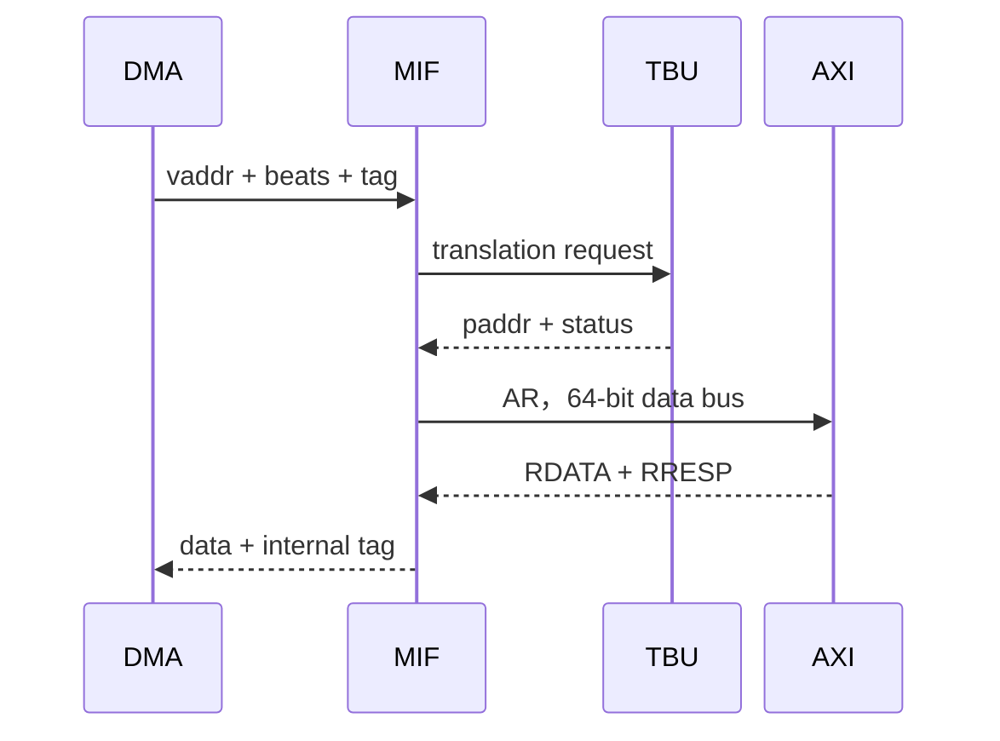
```mermaid
%%{init: {"sequence": {"useMaxWidth": true, "actorMargin": 14, "width": 82, "messageMargin": 10, "noteMargin": 6}, "themeVariables": {"fontSize": "11px"}}}%%
sequenceDiagram
    participant DMA
    participant MIF
    participant TBU
    participant AXI

    DMA->>MIF: vaddr + beats + tag
    MIF->>TBU: translation request
    TBU-->>MIF: paddr + status
    MIF->>AXI: AR，64-bit data bus
    AXI-->>MIF: RDATA + RRESP
    MIF-->>DMA: data + internal tag
```

TBU 返回错误时，MIF 不发 AXI 请求，直接向发起模块返回失败。TBU 命中时的固定延迟、未命中时的最大等待时间和同时在途的地址转换数量由 TBU 参数表给出。

### 14.7 写请求时序

1. MIF 先完成起始地址转换和物理地址检查；
2. MIF 分配 AXI ID，并把 owner、内部 tag、`task_id` 和 beat 数写入 outstanding 表与写顺序 FIFO；
3. AW 与 W 可独立握手，但 W 数据只从写顺序 FIFO 队首 owner 取得；
4. owner 写数据入口设置一个 1-beat 寄存缓冲。`_wready` 仅由该缓冲是否空闲、写顺序 FIFO 是否存在队首、队首 owner 以及当前 AXI 子请求是否仍需要数据等接收端状态决定，不得组合依赖 `_wvalid`、`_wtag`、`_wdata`、`_wstrb` 或 `_wlast`；
5. owner 完成 `_wvalid && _wready` 握手时，MIF 保存 `_wtag`、64-bit 数据、8-bit 字节写使能和 `_wlast`。后一级先比较保存的 tag 与队首内部 tag，二者相同才把该 beat 送入 AXI W 保持寄存器；
6. 保存的 tag 不符时，MIF 记录 `WRITE_TAG` 协议错误并让该写请求停在入口缓冲，后续 `_wready` 保持为 0。错误 beat 不得设置 AXI `WVALID`，也不得增加已接收 beat 数；`reset_n=0` 清除入口缓冲及暂停状态；
7. MIF 同时核对 owner 的 `_wlast` 与整个内部写请求的最后一个 beat，并根据当前 AXI 子请求的 beat 数生成 AXI `WLAST`；
8. 收到 B response 后释放 outstanding 表项，并向原 owner 返回 `_rsp_is_write=1`；
9. 若 B response 失败，返回第一个错误地址与 AXI ID。

---

## 15. LSC、CRG 与 WDT

### 15.1 LSC 功能

LSC 保存：

- 版本和功能寄存器；
- NPU 启停与软复位控制；
- 输入、权重、工作区、输出和 KV Cache 等模型数据区域的基地址；
- TBU stream ID 和权限；
- 命令、任务和执行单元状态；
- 中断状态、mask 和清除位；
- 第一个错误命令、地址和错误码；
- NPU AXI Slave、L1BUF 和 MIF 的非任务错误；
- L1BUF 只读参数区的起点、末地址和锁定状态；
- 性能计数器；
- 时钟门控与断电准备状态。

### 15.2 LSC 内部寄存器接口

| 信号 | LSC 方向 | 位宽 | 说明 |
| --- | --- | ---: | --- |
| `reg_req_valid_i` | Input | 1 | 寄存器请求有效 |
| `reg_req_ready_o` | Output | 1 | LSC 可接收 |
| `reg_req_write_i` | Input | 1 | 0 读、1 写 |
| `reg_req_space_i` | Input | 1 | `0=LSC CSR`，`1=Debug / Performance` |
| `reg_req_addr_i` | Input | 16 | LSC 内字节地址，必须 8B 对齐 |
| `reg_req_wdata_i` | Input | 64 | 写数据；窄写保持 AXI lane 位置 |
| `reg_req_wstrb_i` | Input | 8 | 每个字节一个写使能 |
| `reg_rsp_valid_o` | Output | 1 | 读返回或写完成有效 |
| `reg_rsp_ready_i` | Input | 1 | 总线适配器可接收 |
| `reg_rsp_rdata_o` | Output | 64 | 读数据 |
| `reg_rsp_status_o` | Output | 2 | OKAY 或 SLVERR |

LSC 最多保存一个未完成寄存器请求。T0 周期 `reg_req_valid_i && reg_req_ready_o` 时锁存全部请求字段；最早在 T1 周期拉高 `reg_rsp_valid_o`。响应等待 `reg_rsp_ready_i` 时，`reg_rsp_valid_o`、`reg_rsp_rdata_o` 和 `reg_rsp_status_o` 必须保持不变，同时 `reg_req_ready_o=0`。只读寄存器写入返回 `SLVERR`；保留地址读 0、写入返回 OKAY 且不改变状态。

### 15.2.1 运行状态、停止与参数保护接口

下表方向以 LSC 为参照：

| 信号 | 方向 | 位宽 | 说明 |
| --- | --- | ---: | --- |
| `cmd_ingress_idle_i` | Input | 1 | 命令 burst 暂存区与 ingress FIFO 均空，且没有命令 AW/W 事务；已经存入响应 FIFO 的完成项不影响该信号 |
| `cfe_quiesce_o` | Output | 1 | 命令接收端空闲后，停止 CFE 接收新的 CMD |
| `cfe_idle_i` | Input | 1 | 当前命令寄存器和 FIFO 均为空 |
| `ts_quiesce_o` | Output | 1 | TS 不再发射新任务 |
| `ts_idle_i` | Input | 1 | 任务表、Control Queue 和待发队列均为空 |
| `ts_quiescent_i` | Input | 1 | TS 已停止发射，运行任务、描述符读取、完成消息接收和终态通知队列均已排空；允许仍有等待软件 ACK 的终态任务 |
| `eng_abort_o` | Output | 4 | 依次连接 DMA、ME、IVE、CME 的 `eng_abort_i` |
| `eng_quiescent_i` | Input | 4 | 四个执行单元已停止并排空 |
| `l1_idle_i` | Input | 1 | L1BUF Controller 请求队列和写响应队列为空 |
| `l1_write_idle_i` | Input | 1 | L1BUF 不存在待处理写请求；设置参数锁和内部复位时使用 |
| `mif_idle_i` | Input | 1 | DSA MIF、TBU 和两侧异步 FIFO 均无未完成请求 |
| `s_axi_idle_i` | Input | 1 | NPU AXI Slave 没有未完成读写事务或控制响应 |
| `soft_reset_req_i` | Input | 1 | 外部受控软复位请求 |
| `internal_soft_reset_done_i` | Input | 1 | 计算域内部复位和 NoC 域 MIF/TBU 复位均已完成 |
| `soft_reset_done_o` | Output | 1 | 排空和内部复位完成；保持到请求撤销 |
| `power_down_req_i` | Input | 1 | PMU 请求进入断电准备 |
| `power_down_ack_o` | Output | 1 | 断电条件满足；保持到请求撤销 |
| `accept_new_cmd_o` | Output | 1 | 允许 NPU AXI Slave 接收新的命令 FIFO 写 burst |
| `single_step_pulse_o` | Output | 1 | 软件写 `SINGLE_STEP=1` 后产生一个周期脉冲 |
| `internal_soft_reset_pulse_o` | Output | 1 | 排空完成后产生一个周期的内部同步复位脉冲 |
| `core_idle_o` | Output | 1 | 下式给出的顶层空闲状态 |
| `param_l1_base_o` | Output | 20 | 参数区起始 LADDR |
| `param_l1_limit_o` | Output | 20 | 参数区末地址，不包含该地址 |
| `param_lock_o` | Output | 1 | 参数区写保护已经启用 |
| `l1_host_access_enable_o` | Output | 1 | 送往 NPU AXI Slave Front End 的 L1BUF 主控访问窗口使能 |
| `wdt_enable_o` | Output | 1 | WDT 使能 |
| `wdt_timeout_cycles_o` | Output | 32 | WDT 无进展超时周期数 |
| `wdt_kick_o` | Output | 1 | 软件写 WDT 控制寄存器产生的喂狗脉冲 |
| `module_clk_enable_o` | Output | 8 | 送往 CRG 的模块时钟请求使能 |

顶层空闲信号必须按下式产生：

```text
core_idle_o =
    cmd_ingress_idle_i
  & cfe_idle_i
  & ts_idle_i
  & (&eng_quiescent_i)
  & l1_idle_i
  & mif_idle_i
  & s_axi_idle_i;
```

任何模块仍保持请求 `valid=1`、返回 FIFO 非空、内部流水有效或 outstanding 表项有效时，对应 idle/quiescent 信号不得置 1。

完整设计要求是：LSC 收到 stop、软复位或断电准备请求后，先令
`accept_new_cmd_o=0`，使命令 FIFO 数据端口不再接受新的 AW；已经通过整体
检查并提交到 ingress FIFO 的完整 burst 继续送往 CFE。已经接受 AW、但尚未
收完 W beat 的 burst 按 AXI 要求收完，并在停止流程中整体丢弃。
`cmd_ingress_idle_i=1` 后再置位 `cfe_quiesce_o`，从而保证已提交 CMD 均得到
CFE 接收响应。

当前 `npu_lsc.sv` 在 stop、软复位排空或断电请求出现时立即置位
`cfe_quiesce_o` 和 `ts_quiesce_o`。这是当前原型行为，不得据此删除上述排空
要求；后续 RTL 需要延后 CFE 静止时点，或在 Front End/CFE 间加入等效的已提交
命令排空状态。

### 15.2.2 任务终态、中断与配置输出接口

TaskScheduler 在任务终态记录可见后，通过 ready/valid 向 LSC 发送终态通知。
下表先列当前 `npu_lsc.sv` 端口，方向以 LSC 为参照：

| 信号 | 方向 | 位宽 | 说明 |
| --- | --- | ---: | --- |
| `task_terminal_valid_i` | Input | 1 | 一条任务的完整终态通知 |
| `task_terminal_ready_o` | Output | 1 | LSC 可接收终态通知；当前 RTL 固定为 1 |
| `task_command_id_i` | Input | 12 | 软件命令编号 |
| `task_status_i` | Input | 8 | 第 7.4 节定义的终态 status |
| `task_engine_i` | Input | 4 | 产生终态的执行单元 |
| `task_opcode_i` | Input | 8 | CMD 直接携带的完整 opcode |
| `task_fault_addr_i` | Input | 48 | 第一个错误地址；无地址时为 0 |
| `task_irq_on_success_i` | Input | 1 | 任务 CMD 的 `IRQ_ON_SUCCESS` |
| `task_irq_on_error_i` | Input | 1 | 任务 CMD 的 `IRQ_ON_ERROR` |
| `wdt_timeout_i` | Input | 1 | WDT 超时脉冲 |
| `irq_done_o` | Output | 1 | 未屏蔽的成功中断 |
| `irq_exception_o` | Output | 1 | 未屏蔽的数值异常或任务超时中断 |
| `irq_error_o` | Output | 1 | 未屏蔽的描述符、地址、总线、ECC 或 WDT 错误中断 |

完整设计仍要求在终态通知中增加 32-bit `task_error_info_i` 和 16-bit
`task_done_flags_i`，并接收 16 路 64-bit 性能增量；这些字段不得从终态记录
语义中删除。它们尚未出现在当前 `npu_lsc.sv` 端口，因此当前 RTL 对照测试只
检查上表字段，后续实现再按第 8.5、19.6 节补齐。

配置寄存器通过以下持续有效信号送往使用模块：

| 信号组 | 位宽 | 使用模块 |
| --- | ---: | --- |
| `input_base_o`、`weight_base_o`、`work_base_o`、`output_base_o`、`kv_base_o` | 当前 RTL 各 48 | 描述符处理和地址生成单元 |
| `m_axi_addr_base_o`、`m_axi_addr_limit_o` | 当前 RTL 各 48；完整设计有效 PA 为低 40 bit | MIF/TBU 的系统物理地址许可范围 |
| `tbu_stream_id_o`、`tbu_substream_id_o` | 各 16 | TBU 请求属性 |
| `tbu_allow_read_o`、`tbu_allow_write_o` | 各 1 | TBU 读写许可；当前 RTL 固定为 1 |
| `timeout_cycles_o[15:0]` | 后续 `16×32` | TaskScheduler 超时计数器 |

当前 `npu_lsc.sv` 已实现五组模型数据基地址、`m_axi_addr_base_o/limit_o`、
TBU ID、`param_l1_*`、
`l1_host_access_enable_o`、WDT 配置和 `module_clk_enable_o`。逐任务
`error_info/done_flags`、16 组 timeout 输出及性能增量属于完整设计要求；在这些
端口进入 RTL 前，验证不得把 C 语言参考模型中已有的字段当成当前 RTL 端口。

任务终态与同周期 CSR 清除同时出现时，新的终态通知优先。性能增量与 `PERF_CONTROL.CLEAR` 同周期出现时，先清零再计入该周期增量；`FREEZE=1` 时忽略后续增量。

### 15.2.3 非任务错误输入与清除接口

当前 `npu_lsc.sv` 接收顶层合并后的接口错误，端口如下：

| 信号 | LSC 方向 | 位宽 | 说明 |
| --- | --- | ---: | --- |
| `interface_error_valid_i` | Input | 1 | 顶层已有接口错误记录 |
| `interface_error_status_i` | Input | 8 | 转换后的任务 status |
| `interface_error_addr_i` | Input | 48 | 可确定时为原请求虚拟地址，否则为 0 |
| `interface_error_clear_o` | Output | 1 | 软件写 `FAULT_CLEAR.bit0=1` 时产生一个周期脉冲 |

当前 `npu_single_core_top.sv` 依次选择 NPU AXI Slave 的
`protocol_error_o`、MIF 的 `error_valid_o` 和 CFE 的 `cfe_error_o`，形成
上述输入。NPU AXI Slave/CFE 协议错误转换为 `BAD_DESC`，MIF 的 3-bit
`npu_mem_status_e` 通过 `npu_mem_to_task_status()` 转为 8-bit status。任务
终态与接口错误同周期到达时任务终态优先；当前接口错误不能携带任务身份，
`FAULT_CMD` 使用 `0xFFF`。`interface_error_clear_o` 回到 NPU AXI Slave 的
`protocol_error_clear_i` 和 MIF 的 `error_clear_i`。

完整设计还必须保留来源细节。后续端口按四组格式一致的非任务错误记录扩展；
每组记录包含 `valid`、`status`、`addr`、`detail`、`aux` 和可选任务身份。
逻辑组名如下：

| 组名前缀 | 产生模块 | 记录内容 |
| --- | --- | --- |
| `sys_l1_interface_error` | NPU AXI Slave Front End / L1 External Bridge | L1BUF 外部窗口读写失败；`addr` 保存 LADDR，`detail` 保存 L1 端口 status，`aux.bit0` 保存读写方向 |
| `l1_ecc_error` | L1BUF Controller | 不可修正 ECC；`addr` 保存 LADDR，`detail` 保存客户端端口编号，`aux.bit0` 保存读写方向，`aux[7:1]` 保存 SRAM bank 编号 |
| `mif_first_error` | MIF | MIF 保存的第一个非成功事务；`addr` 保存第一个虚拟地址，`detail` 保存 owner，`aux` 保存 AXI response |
| `mif_protocol_error` | MIF | TBU、tag、写数据或 AXI 返回次序错误；地址按第 14.4 节保存；`detail` 保存协议错误子码，`aux` 保存 owner |

每组的后续模块级信号如下，`source` 替换为上表中的逻辑组名：

| 信号 | LSC 方向 | 位宽 | 说明 |
| --- | --- | ---: | --- |
| `source_valid_i` | Input | 1 | 错误记录有效；保持到收到清除脉冲 |
| `source_status_i` | Input | 8 | 第 4.3 节的非成功 status |
| `source_addr_i` | Input | 64 | 第一个相关地址；没有可用地址时写 0 |
| `source_detail_i` | Input | 8 | 上表定义的来源细节 |
| `source_aux_i` | Input | 8 | 上表定义的辅助信息 |
| `source_has_task_identity_i` | Input | 1 | 该错误能够确定所属任务时为 1 |
| `source_command_id_i` | Input | 12 | `has_task_identity=1` 时保存真实任务编号 |
| `source_engine_i` | Input | 4 | 能够确定时保存 CMD engine 的零扩展值，否则写 0 |
| `source_opcode_i` | Input | 8 | 能够确定时保存任务内部 opcode，否则写 0 |
| `interface_error_clear_o` | Output | 1 | 软件写 `FAULT_CLEAR.bit0=1` 后产生一个周期脉冲，同时送往各错误记录保存模块 |

`source_valid_i=1` 时，产生模块必须保持其余字段不变，直到采样到
`interface_error_clear_o=1`。NPU AXI Slave 的失败脉冲、L1BUF 的 ECC 脉冲
必须先进入各自的首错保存寄存器，再送入 LSC。MIF 的 first/protocol 状态也按
相同规则保持。清除与新错误同时发生时采用置位优先：产生模块清除旧记录，但
必须保留同周期的新记录。

能够确定任务编号的错误必须设置 `has_task_identity=1`，不能因为错误早于 TS 终态通知而丢失真实 `command_id`。MIF `first_error_task_id` 必须送入 `mif_first_error_command_id_i`，并设置 `mif_first_error_has_task_identity_i=1`。DMA 请求可同时给出 `engine=DMA`；DFU 或共享端口若不能仅根据错误记录确定 engine/opcode，对未知字段写 0。由执行单元端口产生的 L1BUF ECC 记录应携带该端口当前任务的身份。NPU AXI Slave 的外部窗口请求不属于 DSA 任务，`has_task_identity` 固定为 0。

`source_status_i` 只接受 `0x01～0x0D`。收到 `SUCCESS`、`0x0E～0xFF` 或其他未定义值时，LSC 把 `FAULT_INFO.status` 安全改为 `BAD_DESC`，原始 8-bit 值仍保存在 `FAULT_DETAIL.error_info[7:0]`，便于定位接口问题。

L1BUF 的 3-bit 本地 status 在进入 LSC 前必须转换成第 4.3 节的 8-bit status：`ECC_UNCORRECTABLE` 转成 `L1_ECC_UNCORRECTABLE`，`PORT_PROTOCOL_ERROR` 转成 `BAD_DESC`，`ADDR_FAULT` 保持为 `ADDR_FAULT`。MIF 与 NPU AXI Slave 的协议错误使用 `BAD_DESC`。AXI `DECERR` 与 `SLVERR` 分别使用 `BUS_DECERR` 与 `BUS_SLVERR`。

LSC 只保存第一条错误。不同来源在同一个周期首次有效时，选择次序固定为：

1. 非成功的任务终态；
2. `l1_ecc_error`；
3. `mif_first_error`；
4. `mif_protocol_error`；
5. `sys_l1_interface_error`；
6. WDT timeout。

任务终态为 `SUCCESS` 时不占用首错寄存器，后续来源继续参加当周期选择。任一
非任务错误都会设置 `IRQ_STATUS.ERROR`，不受任务 CMD 中
`IRQ_ON_ERROR` 的控制。已有首错不会被后续错误覆盖。

非任务错误始终使用 `done_flags=0`。`has_task_identity=1` 时，`FAULT_CMD`、`FAULT_INFO.engine` 和 `FAULT_INFO.opcode` 保存输入的任务身份；不能确定任务时使用 `command_id=0xFFF`、`engine=0` 和 `opcode=0`。其 `error_info` 使用以下稳定编码：

| Bit | 字段 | 说明 |
| ---: | --- | --- |
| 31:28 | `stage` | 固定为 7，表示 LSC 外部模块错误 |
| 27:24 | `source` | `1=SYS_L1_INTERFACE`、`2=L1_ECC`、`3=MIF_FIRST`、`4=MIF_PROTOCOL`、`5=WDT` |
| 23:16 | `detail` | 来源细节，定义见本节第一张表 |
| 15:8 | `aux` | 来源辅助信息，定义见本节第一张表 |
| 7:0 | `raw_status` | 输入的原始 status；WDT 固定为 `TIMEOUT` |

软件写 `FAULT_CLEAR.bit0=1` 时，LSC 清除整组 `FAULT_*`，并在该写请求的响应周期拉高 `interface_error_clear_o`。清除请求被接受的周期和清除脉冲有效的周期，LSC 不会把仍保持有效的旧接口记录再次保存。若产生模块在清除期间检测到新错误，其置位优先寄存器继续保持 `valid=1`；清除脉冲结束后，LSC 将它作为新的首错保存。任务终态或 WDT 脉冲与 `FAULT_CLEAR` 同周期出现时，新错误直接优先。

### 15.3 CSR 表

当前 `npu_lsc.sv` 已实现 `0x0000～0x00F0` 中下表注明的基础寄存器，以及
`WDT_CONTROL`、`WDT_TIMEOUT` 和 `MODULE_CLK_ENABLE`。`FAULT_DETAIL`、
`PERF_COUNTER/PERF_CONTROL` 与 `TIMEOUT_CLASS` 仍是完整设计必须补齐的
寄存器，不应当作当前 RTL 已存在的端口或状态。下表同时保留当前原型寄存器和
后续要求。

| Offset | 名称 | 属性 | 主要字段 |
| ---: | --- | --- | --- |
| `0x0000` | `NPU_VERSION` | RO | 主版本、次版本、RTL build |
| `0x0008` | `ISA_FEATURE` | RO | P0/P1 opcode 功能位 |
| `0x0010` | `BUS_CONFIG` | RO | `BUS_DATA_W=64`、地址宽度、AXI ID 位宽 |
| `0x0018` | `L1_CONFIG` | RO | 容量、bank 数、读延迟 |
| `0x0020` | `MATRIX_CONFIG` | RO | `MT`、`KT`、`NT`、可接受的整数格式 |
| `0x0028` | `VECTOR_CONFIG` | RO | lane 数和整数操作功能位 |
| `0x0030` | `CME_CONFIG` | RO | FP32 lane 数、函数和 `approx_mode` |
| `0x0040` | `CORE_CONTROL` | RW | start、stop、soft reset、single step |
| `0x0048` | `CORE_STATUS` | RO | idle、busy、wfi、error、power ready |
| `0x0050` | `RESERVED` | — | 外部 Generic Core 的程序起点不属于 NPU 配置 |
| `0x0058` | `INPUT_BASE` | RW idle-only | 输入区基地址 |
| `0x0060` | `WEIGHT_BASE` | RW idle-only | 权重区基地址 |
| `0x0068` | `WORK_BASE` | RW idle-only | 中间数据区基地址 |
| `0x0070` | `OUTPUT_BASE` | RW idle-only | 输出区基地址 |
| `0x0078` | `KV_BASE` | RW idle-only | KV Cache 区基地址 |
| `0x0080` | `M_AXI_ADDR_BASE` | RW idle-only | MIF 允许访问的物理地址起点 |
| `0x0088` | `M_AXI_ADDR_LIMIT` | RW idle-only | MIF 允许访问范围内最后一个 64-bit beat 起始地址 |
| `0x0090` | `TBU_STREAM_ID` | RW idle-only | stream/substream ID |
| `0x00A0` | `IRQ_STATUS` | W1C | done、exception、error |
| `0x00A8` | `IRQ_MASK` | RW | 中断屏蔽 |
| `0x00B0` | `FAULT_CMD` | RO | 已知任务身份时保存真实 `command_id`，否则为 `0xFFF` |
| `0x00B8` | `FAULT_ADDR` | RO | 第一个错误地址 |
| `0x00C0` | `FAULT_INFO` | RO | status、engine 和 opcode |
| `0x00C8` | `FAULT_CLEAR` | WO | 写 1 清除错误记录 |
| `0x00D0` | `PARAM_L1_BASE` | RW idle-only | L1BUF 参数区起始地址，8B 对齐 |
| `0x00D8` | `PARAM_L1_LIMIT` | RW idle-only | L1BUF 参数区末地址，8B 对齐且不包含该地址 |
| `0x00E0` | `PARAM_LOCK` | RW1S | bit 0 写 1 后锁定参数区，复位清 0 |
| `0x00E8` | `RESET_REASON` | RO | 外部、软件或 WDT 复位原因 |
| `0x00F0` | `L1_HOST_ACCESS_CONTROL` | RW | bit 0 控制 L1BUF 主控访问窗口总使能 |
| `0x00F8` | `FAULT_DETAIL` | RO（后续） | 第一个错误的 `error_info` 和 `done_flags` |
| `0x0100+8*i` | `PERF_COUNTER[i]` | RO/W1C（后续） | `i=0～15`，64-bit 性能计数器 |
| `0x0180` | `PERF_CONTROL` | RW（后续） | freeze 和 clear |
| `0x0200～0x027F` | `TIMEOUT_CLASS[n]` | RW idle-only（后续） | 16 组任务周期上限 |
| `0x0280～0x02B8` | `RESERVED` | — | 读取返回 0；写入返回 OKAY 且不改变状态 |
| `0x02C0` | `WDT_CONTROL` | RW | bit 0 使能；bit 1 写 1 产生 `wdt_kick_o` 脉冲 |
| `0x02C8` | `WDT_TIMEOUT` | RW | bit 31:0 为无进展超时周期数；0 表示不计时 |
| `0x02D0` | `MODULE_CLK_ENABLE` | RW | bit 7:0 持续输出到 CRG，复位值为 `0xFF` |

`idle-only` 寄存器在 NPU 忙时写入必须返回 `SLVERR`，原值保持不变。

`NPU_VERSION` 位段固定如下：

| Bit | 字段 | 含义 |
| ---: | --- | --- |
| 15:0 | `VERSION_MAJOR` | 不兼容接口修改时增加 |
| 31:16 | `VERSION_MINOR` | 向后兼容功能增加时更新 |
| 63:32 | `RTL_BUILD` | RTL 或 C 语言参考模型构建编号 |

`VERSION_MAJOR` 标识整套设备接口版本；CMD 的 `header_version` 独立检查命令头
格式。软件先识别 `VERSION_MAJOR`，再按第 6.2 节写
`header_version=1`。任一版本检查失败都不得执行任务。

`ISA_FEATURE` 只报告可选功能。第 6.4 节的全部 P0 opcode 是 V1.1 的固定能力，
不占用该寄存器位。位定义如下：

| Bit | 名称 | 为 1 时的能力 |
| ---: | --- | --- |
| 0 | `DMA_GATHER_ND` | 接受 DMA opcode `0x28` |
| 1 | `VROPE_I` | 接受 Complex opcode `0x83` |
| 2 | `VRECIP_I` | 接受 Complex opcode `0x85` |
| 3 | `CAUSAL_SOFTMAX` | 接受 `VSOFTMAX_I` 的 `mask_mode=CAUSAL` |
| 4 | `DESCRIPTOR_CRC` | 接受描述符 CRC 检查使能 |
| 63:5 | `RESERVED` | 固定读 0 |

软件发射上述可选 opcode 或启用 CRC 前必须检查对应位。位为 0 时，opcode 返回
`ILLEGAL_OPCODE`，CRC 使能返回 `BAD_DESC`。C 语言参考模型 V1.0 参考配置的
`ISA_FEATURE=0`，与第 20 节全部可选功能均关闭的配置一致；不得再用未说明的
低 16 bit 全 1 值代替功能表。

`BUS_CONFIG` 位段固定如下：

| Bit | 字段 | V1.1 值 | 含义 |
| ---: | --- | ---: | --- |
| 7:0 | `BUS_DATA_BITS` | 64 | AXI 与内部数据端口的单 beat 位宽 |
| 15:8 | `GVA_BITS` | 48 | DSA 全局虚拟地址位数 |
| 23:16 | `PA_BITS` | 40 | AXI 物理地址位数 |
| 31:24 | `AXI_ID_BITS` | 8 | AXI ID 位数 |
| 63:32 | `RESERVED` | 0 | 固定读 0 |

`L1_CONFIG` 位段固定如下：

| Bit | 字段 | V1.1 值 | 含义 |
| ---: | --- | ---: | --- |
| 31:0 | `L1_BYTES` | 1048576 | L1BUF 字节容量 |
| 39:32 | `L1_BANKS` | 16 | SRAM bank 数 |
| 47:40 | `L1_READ_LATENCY` | 2 | 请求执行到返回可见的固定周期数 |
| 63:48 | `RESERVED` | 0 | 固定读 0 |

`MATRIX_CONFIG` 位段固定如下：

| Bit | 字段 | V1.1 值 | 含义 |
| ---: | --- | ---: | --- |
| 7:0 | `MT` | 8 | M 方向 tile 大小 |
| 15:8 | `KT` | 16 | K 方向 tile 大小 |
| 23:16 | `NT` | 8 | N 方向 tile 大小 |
| 27:24 | `DTYPE_MASK` | `0b1111` | bit 0～3 依次表示 INT4、INT8、INT32、INT16 |
| 63:28 | `RESERVED` | 0 | 固定读 0 |

完整 V1.1 设计必须把 `DTYPE_MASK` 报告为 `0b1111`。当前
`npu_lsc.sv` 的 `MATRIX_CONFIG` 读值仍为 `0b0111`，但当前 Matrix RTL 和
Verilator 完整单核测试已经执行 INT16×INT16；这是功能公布寄存器尚待修正的
差异，不能据此改回旧 dtype 编码或删除 INT16 支持。

`VECTOR_CONFIG` 位段固定如下：

| Bit | 字段 | V1.1 值 | 含义 |
| ---: | --- | ---: | --- |
| 7:0 | `VLANES` | 8 | 配置的最大整数 lane 数 |
| 17:8 | `OPCODE_MASK` | `0x3FF` | bit 0～9 依次对应 opcode `0x60～0x69` |
| 63:18 | `RESERVED` | 0 | 固定读 0 |

`CME_CONFIG` 位段固定如下：

| Bit | 字段 | V1.1 值 | 含义 |
| ---: | --- | ---: | --- |
| 7:0 | `FP32_LANES` | 4 | CME 内部 FP32 lane 数 |
| 20:8 | `FUNCTION_MASK` | `0x1FFF` | bit 0～12 依次对应 `function_mode=0～12` |
| 24:21 | `APPROX_MODE_MASK` | `0x1` | bit n 表示支持 `approx_mode=n` |
| 31:25 | `RESERVED0` | 0 | 固定读 0 |
| 47:32 | `SCRATCH_ELEMS` | 4096 | CME 私有暂存区可保存的 FP32 元素数 |
| 63:48 | `RESERVED1` | 0 | 固定读 0 |

软件必须先读取这些字段，再生成 tile、lane、scratch 和函数选择参数。未知的
保留位即使在后续版本读到 1，也不能由 V1.1 软件自行解释。

`CORE_CONTROL` 位定义如下。复位值为 `0x2`，即 start 为 0、stop 为 1。

| Bit | 名称 | 属性 | 行为 |
| ---: | --- | --- | --- |
| 0 | `START` | RW | 写 1 设置 start 并清 stop；软复位或断电准备期间写 1 返回 `SLVERR` |
| 1 | `STOP` | RW | 写 1 清 start 并设置 stop |
| 2 | `SOFT_RESET` | WO pulse | 写 1启动第 15.8 节时序，读回为 0 |
| 3 | `SINGLE_STEP` | WO pulse | stop=1 且 core idle 时写 1，产生一个周期脉冲 |
| 63:4 | `RESERVED` | — | 写 1 返回 `SLVERR`，读 0 |

同一次写入不能同时设置 `START` 和 `STOP`。只写 0 不改变 start/stop 状态。

`CORE_STATUS` 位定义如下：

| Bit | 名称 | 为 1 的条件 |
| ---: | --- | --- |
| 0 | `IDLE` | `core_idle_o=1` |
| 1 | `BUSY` | `core_idle_o=0` |
| 2 | `CMD_READY` | `accept_new_cmd_o=1` |
| 3 | `ERROR` | `FAULT_*` 中存在有效记录 |
| 4 | `POWER_READY` | core idle 且 stop=1 |
| 5 | `SOFT_RESET_BUSY` | 受控软复位处于排空或完成保持阶段 |
| 63:6 | `RESERVED` | 恒为 0 |

`IRQ_STATUS` 与 `IRQ_MASK` 使用相同的三个位：

| Bit | 名称 | 对应输出 |
| ---: | --- | --- |
| 0 | `DONE` | `irq_done_o` |
| 1 | `EXCEPTION` | `irq_exception_o` |
| 2 | `ERROR` | `irq_error_o` |

`IRQ_STATUS` 为 W1C，复位值为 0。`IRQ_MASK` 中 1 表示屏蔽、0 表示允许输出，复位值为 `0x7`；屏蔽只影响中断引脚，不阻止 `IRQ_STATUS` 置位。bit 63:3 必须写 0。

`FAULT_INFO` 编码如下：

| Bit | 字段 | 说明 |
| ---: | --- | --- |
| 7:0 | `status` | 第 7.4 节 status |
| 11:8 | `engine` | 已知任务身份时保存 CMD engine 的零扩展值，否则写 0 |
| 19:12 | `opcode` | 已知任务身份时保存任务内部 opcode，否则写 0 |
| 63:20 | `RESERVED` | 读 0 |

`FAULT_DETAIL` 编码如下：

| Bit | 字段 | 说明 |
| ---: | --- | --- |
| 31:0 | `error_info` | 任务错误使用第 8.5 节格式；非任务错误使用第 15.2.3 节格式 |
| 47:32 | `done_flags` | `PARTIAL_DEST`、`FAULT_ADDR_IS_L1` 和 `ABORT_DRAINED` |
| 63:48 | `RESERVED` | 读 0 |

没有有效错误记录时，`FAULT_CMD`、`FAULT_ADDR`、`FAULT_INFO` 和
`FAULT_DETAIL` 全部读 0。`FAULT_CMD[11:0]` 保存 `command_id`，其余位读
0；不能确定任务身份的非任务错误读回 `0xFFF`。`FAULT_CLEAR` 清除一整组
首错记录，包括 `error_info` 和 `done_flags`，不能只清除其中一个字段，
同时按第 15.2.3 节产生 `interface_error_clear_o`。

`RESET_REASON` 为粘滞状态：bit 0 为外部复位，bit 1 为受控软复位，bit 2 为 WDT；一次受控软复位只增加 bit 1，不清除较早原因。外部复位后该寄存器为 `0x1`。

`L1_HOST_ACCESS_CONTROL.bit0=ENABLE`。复位和受控软复位均清 0。清 0 只阻止接受新的外部窗口请求，已经握手的 AXI 请求仍必须返回最终响应。bit 63:1 必须写 0。当前 RTL 对应输出信号名为 `l1_host_access_enable_o`，NPU AXI Slave Front End 的输入名为 `l1_host_access_enable_i`。

`WDT_CONTROL.bit0` 持续驱动 `wdt_enable_o`，bit 1 写 1 时产生一个周期的
`wdt_kick_o`，bit 63:2 必须为 0。`WDT_TIMEOUT` 只使用 bit 31:0，并持续
驱动 `wdt_timeout_cycles_o`。`MODULE_CLK_ENABLE` 只使用 bit 7:0，并持续
驱动 `module_clk_enable_o`；其外部复位值为 `0xFF`。当前三个寄存器均可在
运行期间写入。

`PERF_COUNTER[i]` 的顺序与第 19.6 节表格一致，`i=0` 对应 `core_active_cycles`，`i=15` 对应 `ecc_corrected_count`。写 1 清除对应 bit，写 0 保持；一次 64-bit 读返回完整计数值。`PERF_CONTROL.bit0=FREEZE`，写 1 停止计数、写 0 恢复；bit 1 为 `CLEAR` 脉冲，写 1 清除全部 16 个计数器，读回为 0。

`TIMEOUT_CLASS[n]` 只使用 bit 31:0，bit 63:32 必须写 0。值为 0 表示关闭该类任务计时，其余值按第 8.7 节解释。

`0x0280～0x02B8` 在 V1.1 中保留。软件不得在该地址段保存任务事件或选项；
全部提交字段都位于 128-bit CMD 中。按本节通用规则，保留地址读取为 0，
写入返回 OKAY 且不改变状态。

`INPUT_BASE`、`WEIGHT_BASE`、`WORK_BASE`、`OUTPUT_BASE` 和 `KV_BASE` 使用低 48 bit，bit 63:48 必须为 0，并要求 8B 对齐。`TBU_STREAM_ID[15:0]` 保存 stream ID，`[31:16]` 保存 substream ID，bit 63:32 必须为 0。

完整设计中，`M_AXI_ADDR_BASE` 与 `M_AXI_ADDR_LIMIT` 使用低 40 bit并要求
8B 对齐。MIF 把 limit 解释为最后一个允许的 64-bit beat 起始地址：

$$
\texttt{M\_AXI\_ADDR\_BASE}
\le paddr
\le \texttt{M\_AXI\_ADDR\_LIMIT}.
$$

两者在每次写入后都必须满足 base 不大于 limit，否则写入返回 `SLVERR` 且原值不变。从复位值 0 配置非零区段时，软件应先写 limit，再写 base；修改为更小区段时，应先写 base，再写 limit。一个请求的最后一个 64-bit beat 起始地址也必须位于该区段内；该 beat 覆盖 limit 后面的 7 个字节。

当前 `npu_lsc.sv` 暂存和输出 48 bit，当前 TBU 也按 48 bit 比较；随后
`npu_axi_mif_master` 检查转换结果能否放入 40-bit `m_axi_*` 地址，放不下时
返回 `ADDR_FAULT`，不会发出 AXI 请求。为与 40-bit PA 要求和 C 语言参考模型
一致，软件当前应把 bit 47:40 写 0；后续 RTL 应在 CSR 写入时直接拒绝这些位
非零。

参数区使用半开地址范围：

$$
\left[\texttt{PARAM\_L1\_BASE},\texttt{PARAM\_L1\_LIMIT}\right).
$$

两端都必须 8B 对齐，并满足：

$$
0\le\texttt{PARAM\_L1\_BASE}
\le\texttt{PARAM\_L1\_LIMIT}
\le\texttt{L1\_BYTES}.
$$

`PARAM_L1_BASE` 和 `PARAM_L1_LIMIT` 每次写入后都必须保持上述关系。从两者均为 0 的复位值配置非空参数区时，软件必须先写 limit，再写 base；缩小已有参数区时，选择不会产生临时非法组合的写入次序。任一步不满足条件都返回 `SLVERR`，且该步不改变寄存器。

`PARAM_LOCK=0` 时，只有 `DMA_COPY_1D` 或 `DMA_COPY_ND` 且 `convert_mode=NONE` 的原始字节复制可以写参数区；ME、IVE、CME 和 Debug 写请求仍被拒绝。软件完成 scale、函数系数和其他只读元数据加载后写 `PARAM_LOCK.bit0=1`。锁定后，DMA、ME、IVE、CME 和 Debug 对参数区任一字节的写请求均不进入 SRAM：

- 任务请求返回 `ADDR_FAULT`；
- Debug AXI 请求返回 `SLVERR`，同时在 LSC 记录 `ADDR_FAULT`；
- 参数区读请求仍按正常权限执行。

LSC 把 `param_l1_base_o`、`param_l1_limit_o` 和 `param_lock_o` 同时送到
DMA、ME、IVE、CME 与 L1BUF Controller。四个执行单元在发出任何源数据请求
或目的写请求前检查完整目的地址集合：

- `PARAM_LOCK=1` 时，只要任一目的写 word 与参数区相交，任务就以
  `ADDR_FAULT` 结束；
- `PARAM_LOCK=0` 时，只有 `DMA_COPY_1D` 或 `DMA_COPY_ND` 且
  `convert_mode=NONE` 的原始字节复制可以通过；
- 其余 DMA 方式以及 ME、IVE、CME 任务只要与参数区相交，同样以
  `ADDR_FAULT` 结束。

该检查失败时不得发出源数据请求和目的写请求，完成消息设置
`FAULT_ADDR_IS_L1=1`、`PARTIAL_DEST=0`、`progress=0`，Beat 1 保存按任务访问
次序遇到的第一个受保护 LADDR。L1BUF Controller 随后依据 Client ID 和同一组
参数区信号执行最终写保护，用于阻止协议错误或控制错误产生的非法写入。

`PARAM_LOCK` 是写 1 置位寄存器；写 0 无效，锁定后不能通过普通 CSR 写清除。受控软复位、外部 Core 复位或断电后重新上电时清 0。设置锁定位时，L1BUF 必须没有未完成写请求，且参数区配置必须合法，否则 CSR 写返回 `SLVERR`。

### 15.4 中断接口与时序

执行单元不直接产生软件中断。TaskScheduler 先完成以下动作：

1. 收到完整三拍 done；
2. 保存 status、`user_tag`、错误地址、`progress` 和时间戳，形成完整终态记录；
3. 更新任务终态；
4. 更新 Event Table；
5. 更新性能计数器和第一个错误记录；
6. 最后设置 `IRQ_STATUS`。

Event Table 的 SUCCESS 或 ERROR 不得早于终态记录完成。这样 `npu_drv_wait_event()` 观察到事件终态后，紧接着调用 `npu_drv_query_status()` 时一定能读到对应 `user_tag`、错误地址和 `progress`。

随后 LSC 根据 `IRQ_MASK` 产生 `irq_done_o`、`irq_exception_o` 或 `irq_error_o`。软件通过 W1C 清除中断位；清除中断不自动清除 `FAULT_*`。

中断分类固定如下：

| 任务或模块状态 | 中断类别 |
| --- | --- |
| `SUCCESS` 且任务 CMD 设置 `IRQ_ON_SUCCESS` | `irq_done_o` |
| `NUMERIC_EXCEPTION`、任务 `TIMEOUT`，且任务 CMD 设置 `IRQ_ON_ERROR` | `irq_exception_o` |
| `ILLEGAL_OPCODE`、`BAD_DESC`、`BAD_SHAPE`、`ADDR_FAULT`、`ADDR_OVERLAP`、`DTYPE_UNSUPPORTED`、AXI 错误、不可修正 ECC、`DEPENDENCY_FAILED`、`ABORTED`，且任务 CMD 设置 `IRQ_ON_ERROR` | `irq_error_o` |
| NPU AXI Slave/L1BUF 外部窗口失败、L1BUF 不可修正 ECC、MIF first/protocol error | `irq_error_o`，不检查任务 CMD 中的选项 |
| WDT timeout | `irq_error_o`，并按 WDT 配置产生 `wdt_reset_req_o` |

任务失败时，无论 `IRQ_ON_ERROR` 是否设置，LSC 都要按先到先保存规则更新 `FAULT_*`；该标志只决定是否设置 `IRQ_STATUS.EXCEPTION/ERROR`。WDT 不属于 CMD，因此不受 `IRQ_ON_ERROR` 控制。
第 15.2.3 节的四组非任务错误同样不受任务 CMD 中的选项控制。

`IRQ_STATUS` 的设置优先于同周期 W1C 清除。某位在同一周期既有新事件又被软件写 1 清除时，该位在周期结束后保持 1。

`FAULT_*` 只保存复位或上次 `FAULT_CLEAR` 之后的第一个错误；后续错误只增加对应计数器。同周期多个错误按第 15.2.3 节的固定次序选择。`FAULT_CLEAR` 与任务终态或 WDT 新错误同周期发生时，新错误直接成为新的第一条记录；外部模块的新错误由置位优先寄存器保留，并在清除脉冲结束后写入 LSC。清除中断位不修改 `FAULT_*`，清除 `FAULT_*` 也不修改已经置位的中断状态。

### 15.5 CRG 模块级信号

| 信号 | CRG 方向 | 位宽 | 说明 |
| --- | --- | ---: | --- |
| `core_clk_i` | Input | 1 | SoC 已选择频点的计算域原始时钟 |
| `noc_clk_i` | Input | 1 | SoC 提供的 NoC 原始时钟 |
| `core_rst_ni` | Input | 1 | 计算域异步复位输入 |
| `noc_rst_ni` | Input | 1 | NoC 域异步复位输入 |
| `dvfs_prepare_req_i` | Input | 1 | SoC 请求 NPU 为改变输入频率做准备 |
| `dvfs_prepare_ack_o` | Output | 1 | NPU 空闲，可由 SoC 改变 `core_clk_i` 频率 |
| `core_idle_i` | Input | 1 | 顶层当前空闲状态 |
| `axi_idle_i` | Input | 1 | NPU AXI Slave 与 MIF AXI Master 均无未完成事务 |
| `module_clk_en_i` | Input | 8 | CFE、TS、DMA、ME、IVE、CME、L1、MIF 时钟开关 |
| `module_idle_i` | Input | 8 | 与八个模块一一对应的空闲指示 |
| `module_clk_active_o` | Output | 8 | 忙模块强制开启后实际采用的时钟使能 |
| `core_clk_gated_o` | Output | 1 | 送往计算模块的门控时钟 |
| `noc_clk_gated_o` | Output | 1 | 送往 MIF/TBU 的门控时钟 |
| `core_reset_n` | Output | 1 | 同步释放后的计算域低有效复位 |
| `noc_reset_n` | Output | 1 | 同步释放后的 NoC 域低有效复位 |

外部 `core_rst_ni` 和 `noc_rst_ni` 异步置位。CRG 分别使用不少于两级同步器释放 `core_reset_n` 和 `noc_reset_n`；计算模块不得直接使用外部复位输入。

改变频点前，SoC 拉高 `dvfs_prepare_req_i`。只有 `core_idle_o=1` 且 AXI outstanding 为 0 时，CRG 才拉高 `dvfs_prepare_ack_o`。SoC 随后暂停并改变 `core_clk_i`，待新频率稳定后撤销请求。第一版只在 idle 时改变频点。

`dvfs_prepare_req_i` 置 1 后，NPU AXI Slave Front End 立即停止接收新的
CMD128，但已经接收的命令、控制请求和 AXI 事务继续完成。MIF 已发出的 AXI
请求同样需要排空。只有 Slave 与 Master 两侧均为空时才能给出
`dvfs_prepare_ack_o=1`。请求保持为 1 的整个期间不得重新开放命令提交；SoC
撤销请求后才恢复接收。

`module_clk_en_i[7:0]` 依次对应 CFE、TS、DMA、ME、IVE、CME、L1 和 MIF。任一模块的 idle/quiescent 为 0 时，CRG 必须忽略对该模块关闭时钟的请求。门控时钟单元只能在输入时钟低电平阶段改变使能状态。

`module_clk_active_o[7:0]` 是送往八个本地 ICG 的实际 enable，不是把八个模块
接到同一根门控时钟。每个模块的 ICG 分别使用对应 bit。
`core_clk_gated_o` 只是“七个受控 Core 模块中至少一个在当前输入时钟沿有效”的
域级汇总观测信号，不能代替七路本地 ICG 输出；`noc_clk_gated_o` 同样是 MIF
与 TBU 受控时钟的域级观测信号。

CRG、LSC、NPU AXI Slave Front End、固定地址命令 FIFO、L1BUF 外部访问桥和 WDT 属于 Core 常开控制区，只要 `clk_req_o` 已获
确认并且 Core 时钟仍在运行，它们就在每个 Core 上升沿更新。这样即使 CFE、
TS、四个执行单元和 L1 的请求时钟均关闭，软件仍能读取状态、重新开启模块或
处理看门狗。MIF 与 TBU 使用 NoC 域的 bit 7 控制，不属于 Core 常开控制区。

`scan_mode_i` 在顶层集成处先把八位 `module_clk_en_i` 全部强制为 1，再送入
CRG；因此 CRG 模块本身不需要单独的 scan 端口。`clk_req_o/clk_ack_i` 属于
顶层与 SoC 时钟控制模块之间的请求接口，不改变 CRG 对一个已经到达的时钟沿
所执行的状态更新；其时序按第 5.1 节执行。

### 15.6 WDT 模块级信号

| 信号 | WDT 方向 | 位宽 | 说明 |
| --- | --- | ---: | --- |
| `reset_n` | Input | 1 | Core 域低有效同步复位 |
| `wdt_enable_i` | Input | 1 | 看门狗使能 |
| `wdt_timeout_cycles_i` | Input | 32 | 超时周期数 |
| `wdt_kick_i` | Input | 1 | 软件或调度器喂狗 |
| `wdt_core_progress_i` | Input | 1 | 命令完成、AXI 返回或有效计算产生进展 |
| `wdt_timeout_o` | Output | 1 | 看门狗超时保持电平；超时后保持为 1，直到喂狗、关闭 WDT 或复位 |
| `wdt_reset_req_o` | Output | 1 | 请求复位 NPU Core；保持条件与 `wdt_timeout_o` 相同 |

`wdt_core_progress_i` 只能在可观察到任务推进时置 1，不能简单地在 `core_busy=1` 时持续置 1。以下任一事件在本周期出现时都属于有效推进：

- NPU AXI Slave 接受 CMD/控制请求或返回响应，以及 CFE、TS、执行单元、
  L1BUF 或 MIF 的 ready/valid 握手；
- CFE 编号查询请求或返回握手，以及 Descriptor SRAM 请求或返回握手；
- `me_mac_active_o`、`ive_alu_active_o`，或 CME 的 I2F、FP32、F2I 任一级正在处理有效元素；
- NPU AXI Slave 的 AR、R、AW、W、B 通道握手；
- MIF AXI Master 的 AR、R、AW、W、B 通道握手；
- TS 形成任务终态。

valid 保持但没有 ready 的等待周期不属于有效推进；同样，单纯处于 busy 状态也不能清除 WDT 计数。

LSC 的 `wdt_timeout_i` 是单周期事件，而 WDT 的 `wdt_timeout_o` 是保持电平。
顶层只在 `wdt_timeout_o` 从 0 变为 1 时向 LSC 发送一次事件。软件清除
`FAULT_*` 时，如果 WDT 超时电平仍为 1，旧超时不得再次占用首错寄存器；
只有先通过喂狗、关闭或复位使该电平回到 0，随后再次发生新的上升变化，才形成
下一条 WDT 错误。

### 15.7 上电与初始化时序

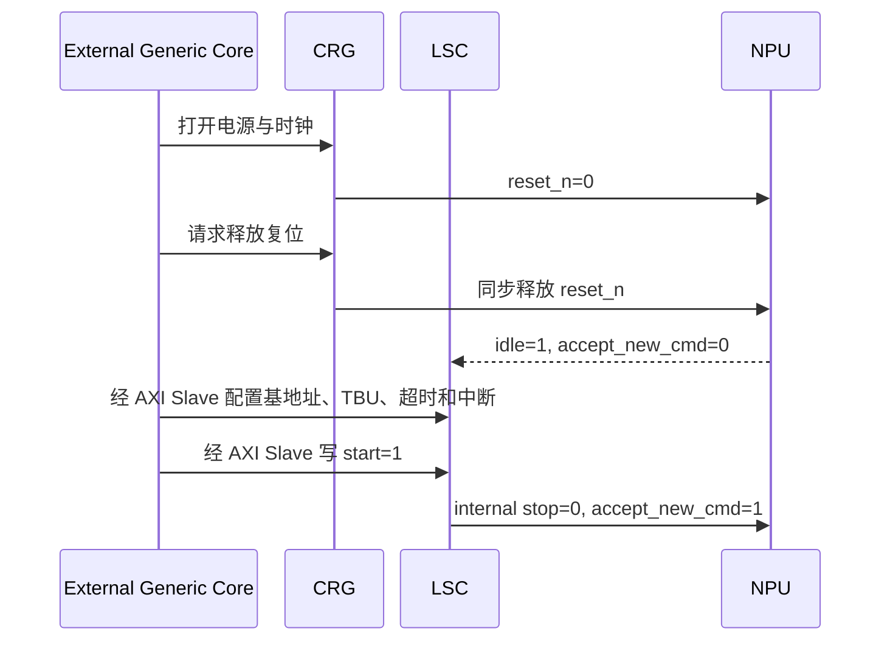
```mermaid
%%{init: {"sequence": {"useMaxWidth": true, "actorMargin": 14, "width": 82, "messageMargin": 10, "noteMargin": 6}, "themeVariables": {"fontSize": "11px"}}}%%
sequenceDiagram
    participant CPU as External Generic Core
    participant CRG
    participant LSC
    participant NPU

    CPU->>CRG: 打开电源与时钟
    CRG->>NPU: reset_n=0
    CPU->>CRG: 请求释放复位
    CRG->>NPU: 同步释放 reset_n
    NPU-->>LSC: idle=1, accept_new_cmd=0
    CPU->>LSC: 经 AXI Slave 配置基地址、TBU、超时和中断
    CPU->>LSC: 经 AXI Slave 写 start=1
    LSC->>NPU: internal stop=0, accept_new_cmd=1
```

LSC 配置完成前 `accept_new_cmd_o` 必须保持 0。基地址、TBU、地址范围、超时
类别和中断配置全部写完后，外部 CPU 执行一次 AXI 寄存器读回检查，再设置
`start`。事件和任务选项由模型编译器直接写入每条 128-bit CMD。

### 15.8 受控软复位时序

`soft_reset_req_i` 与 `soft_reset_done_o` 使用四阶段电平握手：请求方保持 `soft_reset_req_i=1`，直到看到 `soft_reset_done_o=1`；随后请求方撤销请求，NPU 再撤销完成信号。

受控软复位按以下次序执行：

1. LSC 令 `accept_new_cmd_o=0`，使 NPU AXI Slave 不再接受新的命令 AW。已经整体提交到 ingress FIFO 的 CMD 或已经接受的控制请求继续送出；WAIT、FENCE 也可由外部 CPU 按第 5.4 节取消。
2. `cmd_ingress_idle_i=1` 后，LSC 置 `cfe_quiesce_o=1`；`ts_quiesce_o` 和 `eng_abort_o` 可以在请求进入时立即置位。
3. 已经接受 AW、但 W beat 尚未收完的命令 burst 继续完成 AXI 写通道接收，随后整体丢弃并返回 `SLVERR`；其中任一 beat 都不能进入 ingress FIFO。
4. CFE FIFO 中已经写入命令接收响应 FIFO 的 CMD 继续送入 TS；TS 在复位模式下为它们建立 `ABORTED` 终态，不能使已接收编号无记录消失。
5. TS 将 `ACCEPTED`、`FETCH_DESC`、`CHECK_DESC`、`WAIT_EVENT` 和 `READY` 任务设为 `ABORTED`，并按正常规则更新它们的输出事件。
6. TS 对 DMA、ME、IVE 和 CME 拉高 `eng_abort_o`。各单元停止生成新请求，等待仍可能返回的请求结束；对 RUNNING 任务发送 status 为 `ABORTED`、`done_flags.ABORT_DRAINED=1` 的完整三拍完成消息，然后拉高对应 `eng_quiescent_i`。
7. NPU AXI Slave 不再接收新的外部窗口请求；已有读写事务继续完成，直到 `s_axi_idle_i=1`。
8. NoC 域的 MIF/TBU、异步 FIFO 和 L1BUF Controller 继续工作，直到 `mif_idle_i=1`、`l1_idle_i=1`、`ts_quiescent_i=1` 且全部执行单元 quiescent。
9. TaskScheduler 保存终态、第一个错误和复位原因。
10. LSC 产生一个周期的 `internal_soft_reset_pulse_o`。计算域模块在该周期清除任务表、Event Table、命令 burst 暂存区、ingress FIFO、命令响应 FIFO、CFE 半命令状态、内部流水有效位、`IRQ_STATUS`、`PARAM_LOCK`、`L1_HOST_ACCESS_CONTROL.enable` 和 `PERF_CONTROL.FREEZE`，把全部 Event 表项恢复为 `FREE,generation=0`；start 清 0、stop 置 1。
11. 顶层把内部复位请求跨到 NoC 域。MIF 的 NoC 域复位不得早于 AXI outstanding 清零；MIF/TBU 完成复位后，把确认信号同步回计算域。
12. 计算域复位已经执行且 NoC 确认已经返回时，顶层置 `internal_soft_reset_done_i=1`。LSC 随后拉高 `soft_reset_done_o`，并保持到 `soft_reset_req_i=0`。`internal_soft_reset_pulse_o` 与 `soft_reset_done_o` 不得在同一周期有效。
13. 请求撤销后，LSC 撤销 abort、quiesce 和完成信号，系统回到禁止新 CMD 的初始化状态。

突然复位无法保证部分目的数据有效。软件在复位后必须重新加载受影响的输入、权重 tile 和状态。

步骤 3～8 中形成的 ABORTED 终态只用于保证排空期间的事件传播和复位原因记录。步骤 10 清除任务表后，软件不能再用 `npu_drv_query_status()` 读取这些任务；查询旧 `command_id` 返回 NOT_FOUND。软件应在请求软复位前读取仍需保留的正常终态信息。

受控软复位等待 `ts_quiescent_i`，不等待 `ts_idle_i`。原因是正常终态任务
可以仍在任务表中等待软件 ACK，而软复位不要求逐项 ACK。
`ts_quiescent_i` 置 1 前必须送完终态通知并完成所有三拍 done 的接收，
防止内部复位丢失首错和中断信息。正常 `core_idle_o` 与断电准备仍使用
`ts_idle_i`。

受控软复位保留全部只读功能寄存器、五组数据基地址、`M_AXI_ADDR_BASE/LIMIT`、
TBU ID、16 组 `TIMEOUT_CLASS`、参数区 base/limit、16 个硬件性能计数器、
`FAULT_*` 和已有 `RESET_REASON`；随后在 `RESET_REASON` 中增加 software
bit。保留参数区地址但清除 `PARAM_LOCK`，是为了让软件能够重新加载参数。
NPU 外部复位使用第 15.10 节的上电复位值，不采用这组保留规则。

若 SoC 在 AXI outstanding 非零时强制置位 `noc_rst_ni=0`，必须同时复位对应的 NOC 和目标设备，使旧 R/B 返回不会再到达 NPU。禁止只清除 NPU MIF outstanding 表而让系统总线继续返回旧事务。

上述要求针对 NoC 域被强制复位的情况。只有 Core 域复位、NoC 域和 AXI 目标
继续运行时，单核顶层使用第 14.1 节的 `reset_epoch`、旧 AXI ID 保留和旧返回
接收丢弃机制；在旧返回处理完成前，不得把对应 ID 分配给复位后的新事务。

### 15.9 断电准备时序

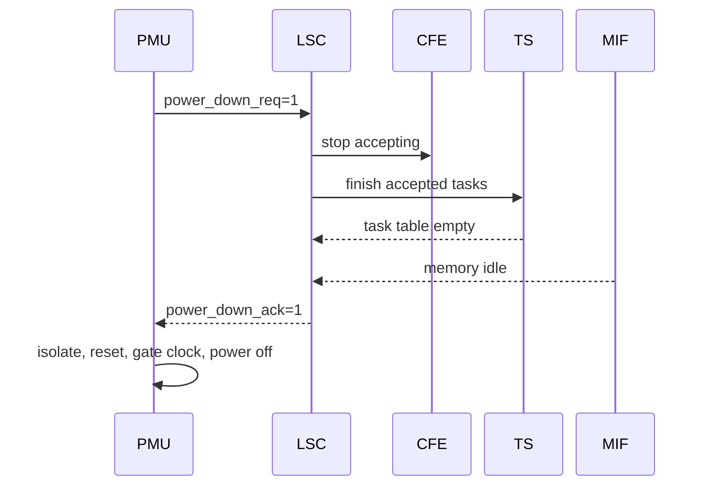
```mermaid
%%{init: {"sequence": {"useMaxWidth": true, "actorMargin": 14, "width": 82, "messageMargin": 10, "noteMargin": 6}, "themeVariables": {"fontSize": "11px"}}}%%
sequenceDiagram
    participant PMU
    participant LSC
    participant CFE
    participant TS
    participant MIF

    PMU->>LSC: power_down_req=1
    LSC->>CFE: stop accepting
    LSC->>TS: finish accepted tasks
    TS-->>LSC: task table empty
    MIF-->>LSC: memory idle
    LSC-->>PMU: power_down_ack=1
    PMU->>PMU: isolate, reset, gate clock, power off
```

`power_down_req_i` 与 `power_down_ack_o` 使用四阶段电平握手。断电准备不主动终止任务，而是停止接收新 CMD，并让全部已接受任务进入终态。若软件不希望等待长任务，应先执行受控软复位。

请求进入的同一周期，NPU AXI Slave 必须停止接收新的 CMD128。
已经完成 AXI 写握手的提交仍需完成：CMD 的低、高两个内部 beat 必须送完并取得
CFE 响应，控制请求必须取得 TS 响应或按允许的方式取消，AXI 读写响应也必须
返回外部 CPU。LSC 在 `cmd_ingress_idle_i=0` 或 `s_axi_idle_i=0` 时不得拉高
`power_down_ack_o`，也不得用 `cfe_quiesce_o` 阻止已接收提交完成。

LSC 只有在以下条件全部满足时才能拉高 `power_down_ack_o`：

1. `cmd_ingress_idle_i=1` 且 `core_idle_o=1`；
2. NPU AXI Slave 已停止接收新命令并返回全部已接收事务的响应；
3. MIF AXI Master 的 outstanding 数量为 0；
4. 所有完成状态、第一个错误和断电原因已经写入保持供电寄存器；
5. 中断输出已经送到保持供电区域。

PMU 看到 `power_down_ack_o=1` 后，依次执行输出隔离、内部复位置位、时钟停止和电源关闭。断电后的 L1BUF、Descriptor SRAM、任务表和 Event Table 内容全部无效。重新上电后必须从第 15.7 节的初始化流程开始。

PMU 撤销 `power_down_req_i` 后，LSC 撤销 `power_down_ack_o`。若请求在 ack 产生前撤销，LSC 继续完成已经开始的排空过程，但不进入断电确认状态。

终态任务表项在软件 ACK 前仍使 `ts_idle_i=0`。因此正常断电前，软件必须读取需要的终态信息，并对所有已完成任务调用 `npu_drv_ack_task()`；受控软复位可以直接清除这些记录。

### 15.10 各模块复位状态

| 模块 | 复位后的状态 |
| --- | --- |
| NPU AXI Slave Front End | 命令 burst 暂存区、ingress FIFO、命令响应 FIFO、控制请求和 L1BUF 外部窗口均无未完成事务；新 CMD 等待 LSC start |
| CFE | 低 beat 保存寄存器无效，128-bit CMD FIFO 空，`ready=0` 直到复位释放 |
| TaskScheduler | 任务表 FREE，Event Table FREE，所有执行单元请求 valid 为 0 |
| DFU | 无在途描述符请求，Descriptor SRAM 内容无效 |
| DMA | 未完成请求表空，MIF 与 L1 请求 valid 为 0，内部 FIFO 空 |
| Matrix | A/B 双缓冲、`MAC_CTX` 和 `ACCUM_CTX` 均无效，累加器清零，L1 请求 valid 为 0 |
| IVE | lane valid、输入流水和输出流水均无效 |
| CME | FP32 流水和统计寄存器无效，私有暂存区内容无效 |
| L1BUF Controller | 请求队列空；SRAM 数据内容不保证为 0 |
| MIF/TBU | 受控复位前已排空；内部 tag 全部释放，不存在 AXI 请求 |
| LSC | 版本和功能寄存器可读，start=0，stop=1，`PARAM_LOCK=0`，中断状态清零，复位原因有效 |
| WDT | 默认关闭，计数器清零 |

L1BUF 在复位后不自动全区清零。任何任务读取一个 L1 地址前，软件必须保证已有 DMA、Matrix、IVE 或 CME 任务写入该区域。

---

## 16. 完整任务功能时序

### 16.1 一条任务从提交到完成

| 阶段 | 模块 | 开始条件 | 完成条件 |
| --- | --- | --- | --- |
| 1. 提交 CMD | 外部 Generic Core / NPU AXI Slave / CFE | 驱动把 CMD128 排成相邻的低、高 word，并准备 2～16 beat 的 FIXED burst | 整个 AXI burst 通过检查并提交，随后 CFE 接收低、高两个内部 beat |
| 2. 接收 CMD | CFE | 两拍 CMD 完整 | 固定字段通过检查，完整 CMD 写入 FIFO |
| 3. 读取描述符 | TS / DFU / MIF | 分配任务表项和描述符槽 | 描述符全部 64-bit beat 到达 |
| 4. 检查描述符 | TS | 描述符完整 | 版本、地址、shape、stride、dtype 和 scale 合法 |
| 5. 等待事件 | TS | 静态检查通过 | 依赖事件全部成功，或任一事件失败 |
| 6. 发射 | TS / Engine | 单元 ready 且依赖成功 | `eng_req_valid && eng_req_ready` |
| 7. 执行 | Engine / L1BUF / MIF | 单元取得任务 | 结果全部产生并写入目的地址 |
| 8. 排空 | Engine | 不再产生结果 | 所有 L1 和 AXI 完成响应返回 |
| 9. 提交终态 | TS / Event Table | 收到完整 done | 先写完整终态记录，再更新任务和事件终态 |
| 10. 通知软件 | LSC | 终态记录与事件已经可见 | `npu_drv_wait_event()` 返回或中断置位 |

> [!important] 结果可见点
> 执行单元内部得到最后一个计算结果不等于任务完成。只有最后一个目的写请求收到完成响应，任务才可以进入成功终态。

### 16.2 GEMM 后接复杂激活

下面的 E0～E4 是单核 Event Table 中的事件引用：

| 命令 | 等待 | 产生 | 动作 |
| --- | --- | --- | --- |
| C0 | 无 | E0 | DMA 把输入 X 搬到 L1BUF |
| C1 | 无 | E1 | DMA 把权重 W、INT32 bias、Matrix 整数重缩放表和 CME scale 元数据搬到 L1BUF |
| C2 | E0、E1 | E2 | Matrix 执行 GEMM，输出整数张量 |
| C3 | E2 | E3 | CME 执行 GELU 或 SiLU，内部使用 FP32 |
| C4 | E3 | E4 | DMA 把整数输出写回 DDR |

C0 与 C1 可以同时执行。C2 只有在 E0、E1 都成功后才发射。若 C1 失败，C2 进入 `DEPENDENCY_FAILED`，E2 也进入失败终态；C3、C4 依次退出，不会读取无效结果。

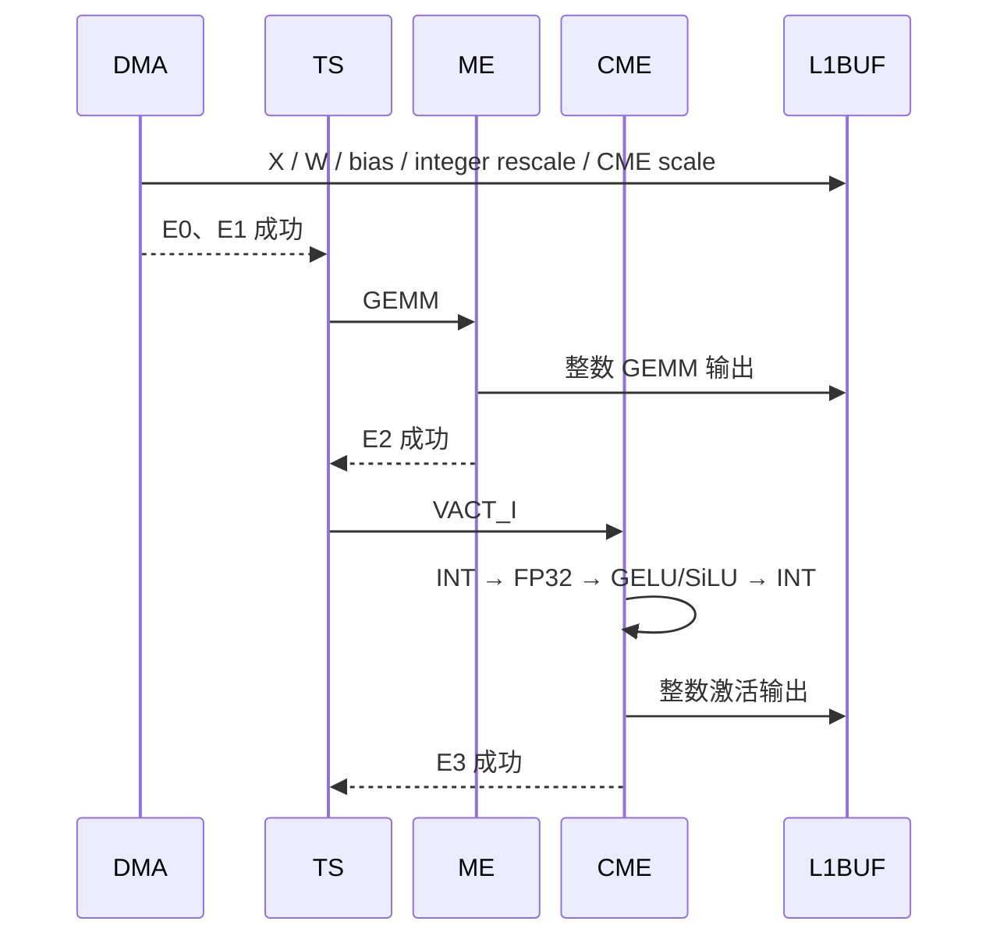
```mermaid
%%{init: {"sequence": {"useMaxWidth": true, "actorMargin": 14, "width": 82, "messageMargin": 10, "noteMargin": 6}, "themeVariables": {"fontSize": "11px"}}}%%
sequenceDiagram
    participant DMA
    participant TS
    participant ME
    participant CME
    participant L1 as L1BUF

    DMA->>L1: X / W / bias / integer rescale / CME scale
    DMA-->>TS: E0、E1 成功
    TS->>ME: GEMM
    ME->>L1: 整数 GEMM 输出
    ME-->>TS: E2 成功
    TS->>CME: VACT_I
    CME->>CME: INT → FP32 → GELU/SiLU → INT
    CME->>L1: 整数激活输出
    CME-->>TS: E3 成功
```

### 16.3 Transformer Attention

以整数 Q、K、V 为例：

1. DMA 把输入和 QKV 权重搬入 L1BUF。
2. Matrix 执行融合 QKV GEMM。
3. 三条 `DMA_COPY_ND` 分别取出 Q、K、V；需要改变维度次序时再发射 `DMA_TRANSPOSE_2D`。现有 `DMA_SPLIT` 只处理一组连续段与等距段，不能在一条任务中完成整张交错 QKV 的重新排列。
4. 若模型使用 RoPE，CME 执行 `VROPE_I`，内部把 Q/K 转为 FP32 做二维旋转，再写回整数 Q/K。
5. Matrix 执行 $QK^{\mathsf T}$，得到整数分数。
6. CME 执行缩放、mask 和 `VSOFTMAX_I`。
7. Matrix 执行整数 Softmax 权重与 V 的 BMM。
8. Matrix 执行输出投影，IVE 或 CME 完成 residual add。

`VSOFTMAX_I` 的输出 scale 必须与后续 BMM 的左输入 scale 一致。Softmax 结果通常使用 INT8；若使用 INT4，必须单独测试长序列下的输出误差。

### 16.4 LSTM 单时间步

设输入为 $x_t\in\mathbb Z^{B\times I}$，上一步隐藏状态为 $h_{t-1}\in\mathbb Z^{B\times H}$。编译器先把二者按 Feature 方向拼成 `[B,I+H]`，Matrix 计算四门：

$$
G_t=
[x_t,h_{t-1}]W+b,
$$

其中：

$$
W\in\mathbb Z^{(I+H)\times4H},
\qquad
b\in\mathbb Z^{4H}.
$$

同一组 $4H$ 个 bias 加到全部 $B$ 行；每一行依次包含输入门、遗忘门、候选值和输出门四段，每段长度为 $H$。

内部所表示的实数公式为：

$$
i_t=\operatorname{sigmoid}(G_i),
\quad
f_t=\operatorname{sigmoid}(G_f),
\quad
g_t=\operatorname{tanh}(G_g),
\quad
o_t=\operatorname{sigmoid}(G_o),
$$

$$
c_t=f_t\odot c_{t-1}+i_t\odot g_t,
$$

$$
h_t=o_t\odot\operatorname{tanh}(c_t).
$$

硬件任务次序：

| 步骤 | 单元 | 整数与内部 FP 处理 |
| ---: | --- | --- |
| 1 | DMA / IVE | 准备 `[x_t,h_{t-1}]` |
| 2 | Matrix | INT4/INT8/INT16 GEMM，INT32 累加，产生四门整数仿射结果 |
| 3 | CME | 三段 Sigmoid、一段 Tanh；每段执行 INT→FP32→INT |
| 4 | IVE | 分别计算 $f_t\odot c_{t-1}$ 与 $i_t\odot g_t$ 的 INT32 乘法结果 |
| 5 | CME | 使用 `VADD_RESCALE_I` 合成 $c_t$，写成指定 INT8 或 INT32 scale |
| 6 | CME | 对 $c_t$ 执行 Tanh |
| 7 | IVE / CME | 计算 $o_t$ 与 Tanh 结果的乘法，并转换为 $h_t$ scale |
| 8 | L1BUF | 将 $h_t,c_t$ 写入下一状态槽 |

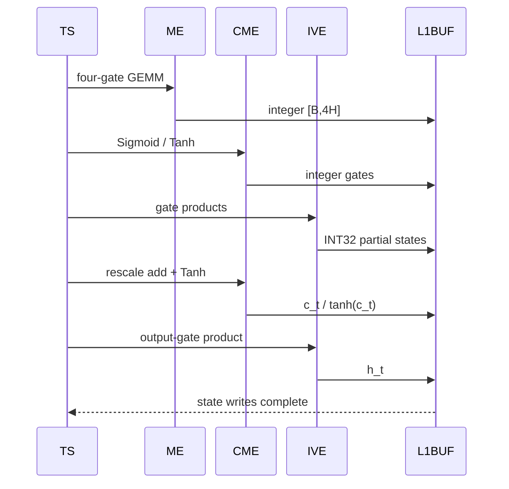
```mermaid
%%{init: {"sequence": {"useMaxWidth": true, "actorMargin": 14, "width": 82, "messageMargin": 10, "noteMargin": 6}, "themeVariables": {"fontSize": "11px"}}}%%
sequenceDiagram
    participant TS
    participant ME
    participant CME
    participant IVE
    participant L1 as L1BUF

    TS->>ME: four-gate GEMM
    ME->>L1: integer [B,4H]
    TS->>CME: Sigmoid / Tanh
    CME->>L1: integer gates
    TS->>IVE: gate products
    IVE->>L1: INT32 partial states
    TS->>CME: rescale add + Tanh
    CME->>L1: c_t / tanh(c_t)
    TS->>IVE: output-gate product
    IVE->>L1: h_t
    L1-->>TS: state writes complete
```

时间步 $t+1$ 只能在 $h_t$ 和 $c_t$ 的最后一个写响应返回后开始。为减少等待，DMA 可以提前把 $x_{t+1}$ 和下一组权重 tile 搬到另一组 L1BUF 区域，但不得覆盖当前时间步仍在读取的数据。

### 16.5 GRU 与普通 RNN

GRU 保存一个 $h_t$ 状态。设输入 $x_t\in\mathbb Z^{B\times I}$，上一步隐藏状态 $h_{t-1}\in\mathbb Z^{B\times H}$。$B$ 是 Batch Size，$I$ 是输入 Feature 数，$H$ 是隐藏 Feature 数。

P0 支持常见的 reset-after 次序：

$$
r_t=
\operatorname{sigmoid}
\left(
x_tW_{ir}+b_{ir}
+h_{t-1}W_{hr}+b_{hr}
\right),
$$

$$
z_t=
\operatorname{sigmoid}
\left(
x_tW_{iz}+b_{iz}
+h_{t-1}W_{hz}+b_{hz}
\right),
$$

$$
n_t=
\operatorname{tanh}
\left(
x_tW_{in}+b_{in}
+r_t\odot
\left(h_{t-1}W_{hn}+b_{hn}\right)
\right),
$$

$$
h_t=(1-z_t)\odot n_t+z_t\odot h_{t-1}.
$$

$r_t$ 是 reset gate，$z_t$ 是 update gate，$n_t$ 是候选隐藏状态，$\odot$ 表示相同位置元素相乘。输入权重可以拼成：

$$
W_i=[W_{ir},W_{iz},W_{in}]
\in\mathbb Z^{I\times3H},
$$

状态权重可以拼成：

$$
W_h=[W_{hr},W_{hz},W_{hn}]
\in\mathbb Z^{H\times3H}.
$$

输入侧 bias $b_i=[b_{ir},b_{iz},b_{in}]$ 和状态侧 bias $b_h=[b_{hr},b_{hz},b_{hn}]$ 的 shape 都是 `[3H]`。Matrix 读取每组 bias 时，三个长度为 $H$ 的片段分别加到三段输出；同一组 `[3H]` bias 对全部 $B$ 行重复使用。

PyTorch 的两组 GRU bias 可以分别保留为上述 $b_i,b_h$。Keras `reset_after=True` 常把两组 bias 保存为逻辑 shape `[2,3H]`，编译器拆成两个连续 `[3H]` 数组。门的实际存储次序可能是 R/Z/N 或 Z/R/N，编译器必须按模型框架的定义整理成描述符使用的次序。

若模型使用 reset-before 公式：

$$
n_t=
\operatorname{tanh}
\left(
x_tW_{in}+b_{in}
+(r_t\odot h_{t-1})W_{hn}+b_{hn}
\right),
$$

编译器先由 IVE 计算 $r_t\odot h_{t-1}$，再发射候选状态的 Matrix 任务。两种次序不能只靠交换参数得到相同结果，必须生成不同任务序列。

GRU 单时间步的硬件任务如下：

| 步骤 | 单元 | 动作 |
| ---: | --- | --- |
| 1 | Matrix | 计算输入侧 `[B,I]×[I,3H]`，加 `[3H]` INT32 bias |
| 2 | Matrix | 计算状态侧 `[B,H]×[H,3H]`，加 `[3H]` INT32 bias |
| 3 | CME | 对 reset/update 两段执行不同 scale 加法与 Sigmoid |
| 4 | IVE / CME | 按 reset-after 或 reset-before 次序计算候选状态输入 |
| 5 | CME | 对候选状态执行 Tanh |
| 6 | IVE | 计算 $(1-z_t)\odot n_t$ 和 $z_t\odot h_{t-1}$ 的 INT32 乘积 |
| 7 | CME | 用 `VADD_RESCALE_I` 合成并转换为 $h_t$ 的整数 scale |
| 8 | L1BUF | 最后一个 $h_t$ 写响应返回后，允许时间步 $t+1$ 开始 |

单核 P0 只有一个 Matrix Engine，步骤 1 和步骤 2 按先后次序执行；DMA 可以与其重叠读取下一块权重，但不能声称两个 GEMM 同周期执行。

普通 RNN 每个时间步执行：

$$
h_t=
\phi
\left(
x_tW_x+h_{t-1}W_h+b
\right),
$$

其中：

$$
W_x\in\mathbb Z^{I\times H},
\qquad
W_h\in\mathbb Z^{H\times H},
\qquad
b\in\mathbb Z^H.
$$

同一组 $H$ 个 bias 加到全部 $B$ 行；第 $j$ 个 bias 只加到每行第 $j$ 个隐藏 Feature。$\phi$ 为 Tanh 或 ReLU。Matrix 分别计算输入项和状态项；相同 scale 时由 IVE 相加，不同 scale 时由 CME `VADD_RESCALE_I` 相加。Tanh 由 CME 执行 `INT→FP32→INT`；ReLU 可由 IVE 直接执行整数比较和选择。

### 16.6 错误传播时序

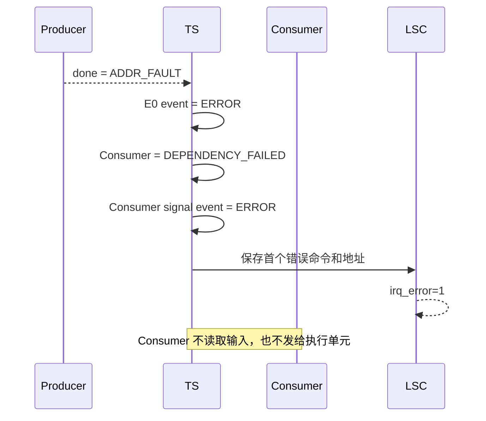
```mermaid
%%{init: {"sequence": {"useMaxWidth": true, "actorMargin": 14, "width": 82, "messageMargin": 10, "noteMargin": 6}, "themeVariables": {"fontSize": "11px"}}}%%
sequenceDiagram
    participant E0 as Producer
    participant TS
    participant E1 as Consumer
    participant LSC

    E0-->>TS: done = ADDR_FAULT
    TS->>TS: E0 event = ERROR
    TS->>TS: Consumer = DEPENDENCY_FAILED
    TS->>TS: Consumer signal event = ERROR
    TS->>LSC: 保存首个错误命令和地址
    LSC-->>LSC: irq_error=1
    Note over E1,TS: Consumer 不读取输入，也不发给执行单元
```

发生执行错误后：

1. 执行单元停止产生新请求；
2. 已发出的 AXI 和 L1BUF 请求必须排空；
3. 若已经写入部分目的数据，完成消息设置 `PARTIAL_DEST`；
4. 目的张量整体视为无效；
5. 依赖任务进入失败终态并继续传播；
6. 事件等待者不能永久停住。

NPU AXI Slave/L1BUF 外部窗口、L1BUF ECC 和 MIF 也会把非任务错误送入 LSC。产生模块先锁存 `status`、第一个相关地址、来源细节和可用的任务身份，并保持 `valid=1`；LSC 设置 `IRQ_STATUS.ERROR`，按第 15.2.3 节格式保存首错。MIF first error 即使早于 TS 终态通知，也必须携带 `first_error_task_id`，使 `FAULT_CMD` 保留真实任务编号。软件读取 `FAULT_*` 后写 `FAULT_CLEAR`，LSC 再用 `interface_error_clear_o` 清除各产生模块的旧记录。这个过程不依赖任务终态通知，因此未知 AXI ID、错误 RLAST、外部窗口访问失败等无法归属到某条 CMD 的问题仍有稳定的诊断信息。

---

## 17. 存储顺序与张量布局

### 17.1 字节顺序

所有多字节整数和 FP32 元数据使用 little-endian。对 64-bit 总线：

- `data[7:0]` 对应最低字节地址；
- `data[63:56]` 对应最高字节地址；
- `strb[i]` 控制 `data[8i+7:8i]`。

### 17.2 INT4 存储

设连续 INT4 元素为 $q_0,q_1,\ldots$：

```text
byte[0][3:0] = q0
byte[0][7:4] = q1
byte[1][3:0] = q2
byte[1][7:4] = q3
```

每个 4-bit 值采用有符号二进制补码。`0b1000` 表示 $-8$，`0b0111` 表示 $7$。64-bit beat 中最少地址的字节放在 `data[7:0]`，因此一个满 beat 保存 $q_0$ 到 $q_{15}$。

### 17.3 二维行优先张量

对 INT8/INT16/INT32 的 `[R,C]`：

$$
\operatorname{addr}(r,c)
=
\operatorname{base}
+r\cdot\operatorname{row\_stride}
+c\cdot\operatorname{elem\_bytes}.
$$

对行起点字节对齐的 INT4：

$$
\operatorname{byte\_addr}(r,c)
=
\operatorname{base}
+r\cdot\operatorname{row\_stride}
+\left\lfloor\frac c2\right\rfloor.
$$

$c$ 为偶数时选择低 4 bit，为奇数时选择高 4 bit。

### 17.4 GEMM 输入、Kernel 与输出

逻辑 shape：

| 对象 | 逻辑 shape | 连续方向 |
| --- | --- | --- |
| 输入 A | `[M,K]` | K |
| Kernel B | `[K,N]` | N 或硬件规定的 `KT×NT` tile 内层 |
| 输出 C | `[M,N]` | N |
| Bias | `[N]` | N |
| 整数重缩放表 | `[1]` 或 `[N]` | 每项保存 INT32 multiplier 和有符号 shift |

Kernel 在 DDR 中可以先保存为普通 `[K,N]` 行优先格式。编译器或离线工具根据 `b_pack_format` 把它整理成 Matrix tile 格式，再由 DMA 原样搬入 L1BUF。Matrix 不在运行时猜测 Kernel 的排列。

> [!note] Bias 加到哪些位置
> Bias 只有 $N$ 个元素。$b_n$ 加到输出第 $n$ 列的全部 $M$ 行，即 $C_{0,n}$ 到 $C_{M-1,n}$。它不会加到其他输出列。BMM 默认对全部外层矩阵重复使用同一组 $N$ 个 bias。

### 17.5 Transformer 布局

P0 接受以下两种逻辑布局：

| 名称 | shape | 最内层连续维度 |
| --- | --- | --- |
| BSH | `[Batch,Sequence,Hidden]` | Hidden |
| BHSD | `[Batch,Head,Sequence,HeadFeature]` | HeadFeature |

QKV 融合 GEMM 输出 BSH `[B,S,3H]`。由于 Q、K、V 在每个 token 的最后一维中交错成三段，P0 使用三条 `DMA_COPY_ND` 分别生成 `[B,S,H]` 的 Q、K、V；需要改变维度次序时再使用 `DMA_TRANSPOSE_2D` 整理为 `[B,h,S,D]`。其中 $H=hD$。`DMA_SPLIT` 只适用于第 9.4 节定义的“连续源段写到等距目的位置”，不能用一个目的基地址表示三个独立输出张量。

所有 stride 都由描述符给出。硬件不假设 Batch Size、序列长度或 Head 数为固定值。

### 17.6 循环层布局

| 对象 | shape | 说明 |
| --- | --- | --- |
| 时间步输入 | `[B,I]` | I 连续 |
| 隐藏状态 | `[B,H]` | H 连续 |
| LSTM 记忆状态 | `[B,H]` | H 连续 |
| LSTM 四门结果 | `[B,4H]` | 四段连续，每段 H |
| GRU 三门结果 | `[B,3H]` | 三段连续，每段 H |

LSTM/GRU 状态使用两个 L1BUF 区域轮换：

```text
time t:     read state_A, write state_B
time t + 1: read state_B, write state_A
```

事件必须保证写入完成后再交换两个区域的用途。

### 17.7 Scale 与函数参数区

FP32 scale、$\epsilon$ 和函数系数是 CME 的只读元数据，不是模型张量。Matrix 使用的 multiplier/shift 表是整数元数据。二者都可放在 L1BUF 参数区。参数区要求：

- 起始地址至少 4B 对齐；
- CME 每 Feature scale 表的 shape 为 `[length]`；
- Matrix 每输出通道整数重缩放表的 shape 为 `[N]`，每项 8B；
- Norm 的 $\gamma,\beta$ 仍是 INT4、INT8、INT16 或 INT32 模型参数，各自具有 scale；
- 描述符与参数区在任务终态前不得修改；
- DMA 可以搬运参数区的原始字节，但不得把 FP32 选作模型张量 dtype。

DMA 搬运 FP32 元数据表时使用“raw 32-bit copy”模式，数据通路按 INT32 宽度原样复制位模式，不执行整数算术或 scale 处理。

初始化阶段的保护次序如下：

1. 软件设置 `PARAM_L1_BASE` 和 `PARAM_L1_LIMIT`，二者都按 8B 对齐；
2. DMA 以 raw copy 把 FP32 元数据、整数重缩放表和函数系数写入该区；
3. 软件等待 DMA 完成，并设置 `PARAM_LOCK=1`；
4. 锁定后，DMA、ME、IVE、CME 和 Debug Slave 对该区的任何写请求都返回 `ADDR_FAULT`；
5. `PARAM_LOCK` 只能由复位清 0，软件不能在任务运行时撤销。

`PARAM_L1_LIMIT` 是末地址的下一个字节，因此参数区为：

$$
[\operatorname{PARAM\_L1\_BASE},\operatorname{PARAM\_L1\_LIMIT}).
$$

`PARAM_L1_BASE=PARAM_L1_LIMIT` 表示保护区为空；设置 `PARAM_LOCK=1` 仍合法。

---

## 18. 软件与硬件分工

| 工作 | 编译器 / Runtime / 固件 | NPU 硬件 |
| --- | --- | --- |
| 模型解析 | 读取模型并生成整数张量、scale 和 zero point | 不解析模型文件 |
| 指令选择 | 选择 P0/P1 opcode，把完整 opcode、事件和选项写入 128-bit CMD | 检查两个 beat、保存完整 CMD 并执行任务 |
| tile 选择 | 读取功能寄存器，选择 Matrix 和 Vector tile | 按描述符执行 |
| Kernel 整理 | 生成指定 `pack_format` | 按该格式读取 |
| L1BUF 分配 | 为输入、权重、临时值和输出分配不冲突区域 | 按 LADDR 访问 |
| Scale 管理 | 为 CME 生成 FP32 元数据，为 Matrix 生成整数 multiplier/shift | CME 执行 I2F/F2I；Matrix 执行整数重缩放 |
| 激活函数 | 选择函数和输入输出 scale | CME 执行 INT→FP32→INT |
| Softmax / Norm | 生成行数、行长度、mask 和参数 | CME 多遍读取并写整数输出 |
| 任务依赖 | 为生产者和消费者分配事件，把引用直接写入 CMD | Event Table 检查成功或失败终态 |
| Matrix 并行 | 安排 A/B 与部分和双缓冲，减少无效等待 | `MAC_CTX` 与 `ACCUM_CTX` 并行推进并检查地址冒险 |
| 地址转换与访问许可 | 在 SoC 的 IOMMU/TBU 中准备设备地址、页表或测试规则，并在 Descriptor 中填写全局虚拟地址（GVA） | TBU 返回物理地址（PA）或错误状态；MIF 仅在获得有效 PA 后发出 AXI 请求 |
| 错误处理 | 读取错误状态，决定重试、复位或停止 | 停止新请求、排空并报告 |

### 18.1 上层模型编译器与低层汇编器

软件产出过程分为上层编译、低层汇编和模型专用 C 源码包生成三个阶段：

| 阶段   | 参考程序                                 | 输入            | 主要工作                                           |
| ---- | ------------------------------------ | ------------- | ---------------------------------------------- |
| 上层编译 | `NPU/compiler/npu_model_compiler.py` | Keras、PyTorch、TFLite、ONNX 或高层 JSON 模型 | 前端导入、图检查、稳定拓扑排序、shape 推导、常量处理、算子拆分、张量布局、存储分配和任务依赖生成 |
| 低层汇编 | `NPU/compiler/npu_assembler.py` | 规范化的低层 JSON 中间表示（IR） | Descriptor 字节编码、事件字段检查和 CMD128 编码 |
| 模型专用 C 源码包生成 | 编译器的 C 源码生成后端 | 已编码的 CMD128、Descriptor、常量与运行元数据 | 生成配置结构体、CMD128 命令数组、Descriptor 数组、权重与常量数组、输入输出信息、操作信息和命令提交批次 |

高层模型图只描述下列内容：

- 模型名称、输入、输出和常量；
- 张量名称、逻辑 shape 和整数 dtype；
- 常量数值或常量文件；
- `MatMul`、`Add`、`Softmax`、`LayerNorm`、`GELU`、`Reshape`、
  `Transpose`、`Concat`、`MultiHeadAttention` 和 `Conv2D` 等语义算子；
- 头数、张量维度（axis）、$\epsilon$、stride、dilation 和 padding 等算子属性。

高层模型图不得填写 L1/DDR 地址、`command_id`、Event ID、执行单元、硬件
opcode、Descriptor 字段、burst 参数、字节步长或显式 DMA/PACK/SPLIT。
`MT/KT/NT`、L1 容量、Descriptor 基地址及 DDR 可用范围属于目标配置，由命令行
或单独的目标文件提供，不属于模型语义。

上层编译阶段依次完成：

1. 检查重复名称、未知张量、重复生产者和不支持的算子；
2. 从节点输入输出关系建立有向图，执行稳定拓扑排序并拒绝有环图；
3. 推导所有中间张量的 shape 和 dtype，检查矩阵维度、张量维度（axis）、数据排列、广播方式及
   Reshape 元素数；
4. 把复合算子拆成 Matrix、Vector、Complex 和 DMA 任务；
5. 把普通行主序权重整理成 Matrix 单元要求的 tile 存储形式；
6. 依据张量使用区间分配 L1 和 DDR，保证同时有效的数据区域不会互相覆盖；
7. 自动加入输入 DDR→L1BUF、常量 DDR→L1BUF 和输出 L1BUF→DDR 任务；
8. 根据实际数据关系生成任务依赖；三个以上前置任务使用 `EVENT_JOIN` 树，
   不能简单地把互不相关的分支全部串行化；
9. 在内存中生成低层 JSON IR，再调用低层汇编器；仅在指定 `--emit-raw`
   时写出 `.npuasm.json`；
10. 把 CMD128、Descriptor、权重、常量和运行配置写成 C 数组与配置结构体；
11. 生成输入输出信息、操作信息、命令提交批次和统一配置实例；
12. 生成检查清单与文件摘要；
13. `--check` 在内存中重新执行全部阶段并逐字节比较已有文件，不改写文件。

“操作信息”数组为每条已生成 CMD128 提供一项软件侧记录，包含 `name`、
`high_level_node`、`engine`、`opcode` 和 `command_id`；它用于日志、调试和错误
定位，硬件不读取该数组。

“命令提交批次”记录包含 `command_id_offset` 与 `command_count`。前者是
`batch_command_ids` 数组中的元素下标，后者是本次提交的命令数；相应命令由一次
`npu_drv_submit_batch()` 送入 `CMD_FIFO_DATA`。单个批次包含 1～8 条 CMD128。批次
划分不替代 Event 依赖，也不要求硬件在前一批次结束后才执行后一批次。参考 runner
可以在提交下一批次前等待并 ACK 前一批次，以回收任务表项。

`MultiHeadAttention` 在高层图中是一个节点。编译器负责生成 Q/K/V 投影、
按 Head 整理数据、K 转置、$QK^T$、Softmax、注意力乘 V、Head 合并和输出
投影。模型作者不应手工填写这些任务的地址、事件或 DMA 参数。

本版本没有卷积执行单元，也没有卷积 opcode。高层 `Conv2D` 通过
`im2col + GEMM` 实现。

当前模型编译器仅接受 NHWC 输入 $X[N,H,W,C_{in}]$、卷积核
$W[KH,KW,C_{in},C_{out}]$ 和 `groups=1`。`C_{in}` 必须等于卷积核的输入通道数。
`groups=1` 表示每个输出通道都使用全部 $C_{in}$ 个输入通道；编译器不对输入通道或
输出通道按组拆分。任何 `groups>1` 的节点均在编译期报错。

`strides=(S_H,S_W)` 与 `dilations=(D_H,D_W)` 必须由两个正整数构成。有效卷积核尺寸为：

$$
K_{H,\mathrm{eff}}=(KH-1)D_H+1,\qquad
K_{W,\mathrm{eff}}=(KW-1)D_W+1.
$$

`padding` 只接受 `VALID`、`SAME`、四个非负显式填充值
`[P_T,P_B,P_L,P_R]`、二维形式 `[[P_T,P_B],[P_L,P_R]]`，或包含 `top`、`bottom`、
`left`、`right` 四个非负字段的对象。显式填充时：

$$
H_o=\left\lfloor\frac{H+P_T+P_B-K_{H,\mathrm{eff}}}{S_H}\right\rfloor+1,
\qquad
W_o=\left\lfloor\frac{W+P_L+P_R-K_{W,\mathrm{eff}}}{S_W}\right\rfloor+1.
$$

`VALID` 取四个填充值为 0；`SAME` 取 $H_o=\lceil H/S_H\rceil$、
$W_o=\lceil W/S_W\rceil$，再把所需总填充量尽量平均分配给前后、左右两侧，额外的
一个元素放在下侧或右侧。输出高或宽不为正时，编译器拒绝该节点。

设 $r=((nH_o+h_o)W_o+w_o)$、
$c=((k_hKW+k_w)C_{in}+c_i)$，`im2col` 的元素定义为：

$$
\operatorname{im2col}[r,c]=
\begin{cases}
X[n,\ h_oS_H-P_T+k_hD_H,\ w_oS_W-P_L+k_wD_W,\ c_i], & \text{坐标位于输入张量内};\\
0, & \text{其他情况}.
\end{cases}
$$

存在填充时，DMA `FILL` 先将整个 `im2col[NH_oW_o,\;KH\,KW\,C_{in}]` 工作区写为
0，再由一个或多个 `COPY_ND` 写入各卷积核位置对应的有效输入片段；没有填充时只
生成 `COPY_ND`。卷积核按行主序整理为 $[KH\,KW\,C_{in},\;C_{out}]$，再交给 Matrix B
tile 整理程序。Matrix `GEMM` 的结果按 NHWC 线性顺序写入输出张量。

当前高层模型编译器要求输入和卷积核同为 INT4、INT8 或 INT16；INT4 输入时 $C_{in}$
必须为偶数。低层 `conv_lowering.py` 定义 INT4×INT4、INT8×INT8、INT8×INT4 和
INT16×INT16 的 Matrix 组合；高层模型导入阶段要求输入与卷积核 dtype 相同，因此当前
生成的模型专用 C 源码包使用前三者中的同类型组合，或 INT16×INT16。输出只允许
INT4、INT8、INT16 或 INT32。可选 bias 必须是位于 L1BUF 的 INT32 张量，
shape 为 `[Cout]`。输入、
`im2col`、整理后的卷积核、输出、bias 与重缩放参数在 Matrix 执行期间均位于 L1BUF；输出为
非 INT32 时必须提供 INT32 重缩放参数。上述数据类型、L1BUF 容量或 DMA 描述能力不满足时，
编译器必须报错。

模型编译器生成这些 DMA 与 GEMM 所需的 CMD128、Descriptor、常量和命令提交批次。
模型专用 C 源码包仅保存静态数组和配置；应用或示例运行程序通过通用 C 驱动提交这些
数据。需要由 CPU 执行的其他模型节点，必须由部署程序在相邻命令提交批次之间显式调用
软件算子；当前编译器不生成 CPU 算子代码。

默认部署产物是可参与应用构建的模型专用 C 源码包，而不是由应用自行装载的原始二进制
文件。完整结果至少包含：

| 文件名 | 默认生成 | 内容 | 使用方 |
| --- | --- | --- | --- |
| `<stem>_model.h` | 是 | 模型配置类型、输入输出说明、尺寸宏和数组声明 | 应用与 C 驱动 |
| `<stem>_model.c` | 是 | 配置结构体、CMD128 命令数组、Descriptor 数组、权重与常量数组、输入输出信息、操作信息和命令提交批次 | C/C++ 构建系统 |
| `<stem>.manifest.json` | 是 | 高层节点与底层任务的对应关系、数组摘要和目标功能 | 测试程序与检查工具 |
| `<stem>.npuasm.json` | 否，仅 `--emit-raw` | 自动生成的低层 JSON IR，可单独交给汇编器复查 | 编译器检查与调试工具 |
| `<stem>.cmd.bin` | 否，仅 `--emit-raw` | 从 C 数组中也能取得的 CMD128 原始字节 | 独立汇编比对 |
| `<stem>.desc.bin` | 否，仅 `--emit-raw` | 从 C 数组中也能取得的 Descriptor 原始字节 | 独立汇编比对 |
| `<stem>.const.bin` | 否，仅 `--emit-raw` | 从 C 数组中也能取得的权重与常量原始字节 | 独立汇编比对 |
| `<stem>.runtime.json` | 否，仅 `--emit-raw` | 输入输出、存储地址和命令提交批次等运行信息 | 调试工具 |

应用构建需要 `<stem>_model.h`、`<stem>_model.c` 和通用 C 驱动；
`<stem>.manifest.json` 用于追踪、测试和检查，不是运行时必需文件。应用不需要自行
装载原始二进制文件。
`<stem>_model.c` 中 CMD、Descriptor 和常量数组的有效字节，必须与“使用
`--emit-raw` 写出 `.npuasm.json`，再单独调用 `npu_assembler.py`”所得内容逐字节一致。C
测试程序应从生成配置结构体读取命令数、任务编号、输入输出地址和常量位置，
不允许在程序中再次手工排列权重或填写内部张量地址。

### 18.2 C 驱动的职责和文件划分要求

C 驱动必须使用 C11，并且不得依赖某一种操作系统。公共头文件只公开稳定类型
和函数；寄存器访问、CMD 提交、Descriptor 编码和 Descriptor 内存池应分别
放在独立源文件中。仅供驱动内部共享的检查函数与小端写入函数放在私有头文件，
应用程序不得包含该私有头文件。

参考驱动位于 `NPU/driver`，内部按下表拆分：

| 文件 | 主要职责 | 不应承担的工作 |
| --- | --- | --- |
| `npu_driver_device.c` | 初始化 AXI 与 MMIO（Memory-Mapped I/O）回调、设置 NPU Slave 基地址和超时、中断、启动与停止 | 不生成模型算子 |
| `npu_driver_command.c` | Event/CMD128 编解码、固定地址 FIXED burst 提交、逐项读取命令响应 FIFO | 不读取模型权重 |
| `npu_driver_runtime.c` | WAIT、QUERY、FENCE、轮询终态和 ACK | 不修改 Descriptor |
| `npu_driver_descriptor.c` | 64B 对齐内存池、公共前缀及 DMA、Matrix 专有字段 | 不提交命令 |
| `npu_driver_memory.c` | 小端字段写入、L1BUF 外部窗口访问、缓存维护和内存屏障 | 不解释算子语义 |
| `npu_driver_internal.h` | 仅供上述源文件共享的私有定义 | 不允许应用程序包含 |
| `npu_driver.h` | 由该头文件声明的稳定公共 API、类型和常量 | 不包含私有头文件 |

公共 API 必须保持平台无关，平台适配通过 `npu_drv_platform_ops_t` 提供设备访问。
真实 SoC 中，`mmio_read64` 与 `mmio_write64` 以 64-bit MMIO 访问 NPU AXI Slave
控制寄存器；`submit_fixed_burst` 向固定地址 `CMD_FIFO_DATA` 写入 2～16 个 64-bit
beat；`submit_response` 从 `CMD_RSP_FIFO` 读取一项 CFE 接收结果；`control_request`
访问控制窗口以完成 WAIT、QUERY 或 FENCE。C 语言参考模型测试后端可提供等效回调。
`write_barrier` 与 `read_barrier` 保证设备内存访问次序；`cache_clean` 与
`cache_invalidate` 由非一致缓存系统按需提供。任一回调返回错误时，驱动必须停止当前
调用并向上层返回错误，不能继续发送剩余 beat。

驱动回归至少使用 GCC 和 Clang，并分别启用 AddressSanitizer（ASan）与
UndefinedBehaviorSanitizer（UBSan）。测试需要覆盖四种
整数 dtype、七种 Matrix pack 配置、CMD 编解码、Descriptor 地址对齐、MMIO、
QUERY/WAIT/ACK/FENCE、缓存维护和小端写入。公共头中的函数声明数必须与静态库
导出的公共定义数一致，且不能存在重复定义。

### 18.3 从编译结果到任务完成的软件时序

一组模型任务的推荐软件次序如下：

1. 应用包含 `<stem>_model.h`，并把 `<stem>_model.c` 与通用 C 驱动一起编译；
2. 应用读取生成的配置结构体，并分配输入、输出和工作区；
3. 应用把生成的 Descriptor 数组、权重数组和常量数组放到配置指定的位置；
4. 对非一致缓存系统，应用对所有由 CPU 写入且将被 NPU 读取的实际内存区域调用
   `npu_drv_sync_for_device()`，包括 Descriptor、权重与常量、输入数据；该函数执行
   `cache_clean` 后执行设备写屏障。硬件一致性系统可省略缓存维护，但仍须满足设备
   访问次序要求；
5. 应用或示例运行程序按命令提交批次读取生成的 CMD128 数组；
6. `npu_drv_submit()` 把一条 CMD 的低、高 word 组成 2-beat FIXED burst；需要批量提交时，`npu_drv_submit_batch()` 可把 1～8 条 CMD 组成一次 2～16 beat burst；
7. AXI 写响应成功只表示该 burst 已被总线接收；驱动还必须从 `CMD_RSP_FIFO` 读取
   相同数量的 CFE 接收结果，并逐项检查 `command_id` 与接收状态。只有接收成功的
   CMD 才可继续等待任务终态；
8. 若部署程序包含 CPU 软件算子，应用在相邻 NPU 命令提交批次之间调用它，并在继续
   提交前确认所需 NPU 任务已结束；
9. 使用 QUERY、WAIT 或中断等待任务终态；
10. 对成功完成且将由 CPU 读取的输出，在读取前调用 `npu_drv_sync_for_cpu()`；该函数
    执行 `cache_invalidate` 后执行读屏障；
11. 保存终态、错误信息和所需输出后执行 ACK；ACK 仅释放已进入终态的任务表项和
    `command_id`。

一次 CMD128 的低、高 word 必须相邻，不能与另一条 CMD 交错。命令 burst
采用整体提交：若 WSTRB、WLAST、beat 数或其他 AXI 属性不符合要求，Front End
丢弃整个 burst 并返回 `SLVERR`，其中任何 CMD 都不会进入 CFE。若
`submit_fixed_burst` 返回错误，设备可能已经接收部分 beat；调用方必须先按平台规定
执行 FIFO 或设备恢复，不能直接重发，也不能补写单个 word。只有平台确认本次 burst
没有任何 beat 被设备接收时，才可重新发送完整 burst。

`npu_drv_submit()` 与 `npu_drv_submit_batch()` 只会自动同步其
`descriptor_cpu_address` 与 `descriptor_bytes` 参数所指的区域；它们不会自动清理
权重、常量和输入数据。调用方必须按第 4 步完成这些区域的设备可见性处理。

### 18.4 当前可执行的端到端示例

`NPU/cmodel/examples` 提供 RNN、GRU、LSTM、CNN 和 Transformer 五个端到端
测试。Transformer 示例调用 Keras `model.fit()`，用 12 条英文房间设备命令训练
四分类模型，并用 4 条没有参加训练的命令检查结果。高层图包含 Multi-Head
Attention、两次残差、两次 LayerNorm、两层 FFN 和最终分类 Dense；编译器将
18 个高层算子展开为 57 条 CMD128，并按 8、8、8、8、8、8、8、1 条命令分成
8 个 FIFO 提交批次。任务记录明确给出 wait event 和 signal event，运行程序逐条
检查提交响应、完成状态和 ACK。

Transformer 单次输入有 4 个 token，每个 token 使用 8 元 one-hot 特征。模型为
每个 token 输出 4 个类别分数，C 程序对相同类别的 4 个分数取平均后选择整句类别。
当前实测中，Keras 和 CModel 对 4 条命令均分类正确；两个实现的类别一致率为
4/4，64/64 个 INT8 输出完全相同，最大绝对误差、平均绝对误差和均方误差均为 0。

| 目录 | 模型类型 | 应用目标 | 软件可见模型张量 |
| --- | --- | --- | --- |
| `rnn/` | SimpleRNN | 设备状态序列估计 | INT8；Matrix 累加为 INT32 |
| `gru/` | GRU | 带更新门和重置门的状态序列估计 | INT8；Matrix 累加为 INT32 |
| `lstm/` | LSTM | 带输入、遗忘和输出门的状态序列估计 | INT8；Matrix 累加为 INT32 |
| `cnn/` | Conv2D + Dense | 6×6 灰度图划痕分类 | INT8；Matrix 累加为 INT32 |
| `transformer/` | 双头自注意力 + FFN + Dense | 房间设备命令四分类 | INT8；Matrix 累加为 INT32 |

每个示例从 Keras 模型开始，经模型编译器生成 CMD128、Descriptor、权重、常量、
输入输出信息和命令提交批次；示例运行程序使用通用 C 驱动提交命令，并在单核
C 语言参考模型中执行。复杂函数可在内部使用 FP32 临时值，但输入、权重、中间
张量和输出均不以 FP32 保存。

运行全部当前示例：

```bash
cd "/home/yusen/Obsidian Vault/NPU/cmodel/examples"
make test
make regress
```

Transformer 示例单独运行：

```bash
cd "/home/yusen/Obsidian Vault/NPU/cmodel/examples/transformer"
make clean
make test
```

单个模型可在对应子目录执行相同目标，例如 `make -C cnn test`。`make regress`
依次运行 RNN、GRU、LSTM、CNN 和 Transformer 的回归；出现编译、驱动、命令
接收或数值错误时，命令返回非零状态。

---

## 19. 验证与验收要求

### 19.1 模块接口检查

每个 ready/valid 接口至少检查：

1. `valid=1,ready=0` 时 payload 保持不变；
2. 对带 `first`、`last` 的多拍接口检查标志次序；CMD 的低、高两个 beat 都必须检查；
3. tag 在旧请求完成前不重复使用；
4. 返回 tag 必须对应仍在途的请求；
5. 写完成前不产生任务成功；
6. 复位期间不发新 AXI 或 L1BUF 请求；
7. `core_idle_o=1` 时所有 FIFO、任务表和 outstanding 表为空。

### 19.2 指令与描述符测试

每种 opcode 至少覆盖：

- 4-bit `engine` 与完整 8-bit opcode 的所属关系；
- `CMD[47:0]` 直接保存完整 48-bit 描述符地址，并检查低 6 bit为 0；
- `header_version`、三个事件字段、六个任务选项和超时类别；
- CMD 低、高两拍的 `first/last` 次序、独立暂停和数据保持；
- ingress FIFO 与 CFE 的 ready/valid 暂停、错误第二拍和复位清除；
- `header_flags[11:10]` 非 0、保留 engine 和当前未定义 opcode；
- INT4、INT8、INT16、INT32 的所有合法输入输出组合；
- `rows/length/M/N/K` 为 0、1、tile 减 1、tile、tile 加 1 和较大值；
- 非整 64-bit beat 尾部；
- INT4 奇数元素、输入高/低半字节起点、输出低半字节起点，以及非法 `dst_nibble=1`；
- 最大正数、最小负数、0 和重复值；
- 地址对齐错误、地址溢出、区域超限和非法重叠；
- 描述符版本错误、保留位非零和不被接受的 dtype；
- 前置事件成功、失败和代次错误；
- L1BUF 暂停、AXI 暂停、读返回交错和写 response 延迟。

### 19.3 整数 Matrix 测试

Matrix 结果与逐元素整数参考模型对比：

$$
a_{m,n}
=
\sum_kq^A_{m,k}q^W_{k,n}
+b_n^{\mathrm{acc}}.
$$

必须分别测试：

- INT4×INT4；
- INT8×INT8；
- INT8×INT4；
- INT16×INT16；
- INT32 累加；
- A/B/C 的 64 组 dtype 配置，其中 16 组必须成功，其余组合必须返回
  `DTYPE_UNSUPPORTED`；
- 由每输出通道模型 scale 生成的独立整数 multiplier/shift；
- 正、零、负 shift 与四种舍入模式；
- 32×32-bit 乘积接近 INT64 极值时的裁剪；
- bias shape `[N]` 在全部 M 行上的使用；
- BMM 外层计数；
- `last_tile_valid_m/last_tile_valid_n/last_tile_valid_k`；
- `RESIDUAL_ENABLE` 与 `ACCUM_FROM_SRC2` 非法同时设置；
- `GEMM_ZERO`、中间 `GEMM_ACCUM` 和最终 `GEMM` 的 L1BUF 部分和次序；
- 地址互不相交时，`MAC_CTX` 与 `ACCUM_CTX` 必须出现同时活动周期；
- 活动写区段与候选输入相交时的 RAW 暂停；
- WAR 和 WAW 允许候选 MAC 先执行，但候选写回必须晚于当前
  `ACCUM_CTX`；
- `ORDERED=1`、事件等待和 Fence 禁止不符合先后要求的并行；
- 任务完成事件和终态只能在最后一个写响应返回后更新；
- 五项 Matrix 调试计数按第 11.9.5 节条件增加；
- SATURATE、ERROR 和 WRAP。

当前 Verilator 完整单核测试还固定检查以下 INT16 行为：

1. INT16 Vector `VADD_I` 读取两组各四个小端 INT16，写回
   `64'hfc78_0125_0004_0006`，任务 `progress=4`；两组源读取与四个逐元素
   写回合计完成 12 次 Matrix 以外的 Vector L1BUF 请求握手。
2. INT16 Matrix 使用 `M=2,N=2,K=3`。A 使用 pack 5，第一项 B 使用 pack 5
   的普通行优先格式，第二项 B 使用 pack 6 的 `KT×NT` tile 格式，C 使用
   pack 4 写 INT32。两个任务都成功、`progress=4`，并得到相同的两行结果
   `64'h0000_000d_0000_0002` 与 `64'h0000_000d_0000_0006`。
3. 第三项 Matrix 把 `a_pack_format` 写成保留编码 7。命令头合法，所以 CFE
   接收响应仍为 `SUCCESS`；Matrix 随后返回 `BAD_DESC`、`progress=0`，且该
   任务不得产生任何 Matrix L1BUF 请求。针对 Matrix 的 FENCE 最终返回
   `BAD_DESC`。

以上检查明确区分 pack 5 的普通行优先 INT16、pack 6 的 B tile INT16 和
pack 7 的描述符失败；不得把 pack 6 接受到 A/C，也不得在 CFE 接收阶段错误
拒绝只因描述符中含 pack 7 的 CMD。

### 19.4 Complex Engine 测试

验证分两层进行：

1. FP32 内部函数与高精度数学参考结果比较；
2. 完整 INT→FP32→INT 输出与软件整数推理结果比较。

每个函数必须规定：

| 项目 | 要求 |
| --- | --- |
| 输入实数范围 | 按第 13.10.5 节各函数表 |
| 最大绝对误差 | Sigmoid/Tanh 为 $2^{-12}$，SiLU/GELU 为 $2^{-10}$ |
| 最大相对误差 | Exp、Reciprocal、ReciprocalSqrt 为 $2^{-10}$ |
| 输出整数逐 bit 相同要求 | 舍入、zero point 和裁剪必须逐 bit 相同 |
| Exp 处理范围 | `[-16,16]`；Softmax 内部为 `[-16,0]` |
| mode 0 中间检查 | 范围缩小后的 $k,r$、Newton 最后一轮结果和 F2I 输入逐 bit 相同 |
| 全 mask Softmax | 输出整数 0 对应值，并增加计数 |
| Norm 测试 | 不同 Batch Size、行长度、$\gamma/\beta$ scale 和 $\epsilon$ |

C 语言参考模型的函数误差测试必须覆盖完整支持区间，不能只检查少数整数输入点。
`Exp`、`Sigmoid`、`Tanh`、`SiLU` 和 `GELU` 至少使用 65537 个等距输入；
`Reciprocal` 与 `ReciprocalSqrt` 至少覆盖指数 $-12～12$，并在每个二进制
指数区间内检查不少于 2048 个尾数取值。测试程序可以使用宿主 `double`
数学库产生高精度参考值，但 `libnpu_cmodel.a` 本身不得依赖 `libm`。

### 19.5 功能时序检查

验证环境应随机暂停：

- NPU AXI Slave CMD128 窗口到 CFE 的低 beat和高 beat；
- CFE 到 TS 的完整 CMD128；
- DFU 到 MIF；
- TS 到执行单元；
- 每个 L1BUF 读写端口；
- AXI AW、W、B、AR、R；
- 执行单元 done 接口。

暂停期间必须保持数据和控制字段不变。CFE 到 TS 暂停时，当前
`cfe_cmd_i[127:0]` 必须保持。任务成功点必须晚于最后一个写完成响应。

当前 Verilator 完整单核测试还固定检查两项系统行为：

1. L1BUF→系统存储的 DMA 把 `64'h8877_6655_4433_2211` 写到地址
   `0x3100`，任务 `progress=8`；当前单 beat MIF 共完成 8 次 AW、8 次 W 和
   8 次 B 握手，测试存储目标最终读回同一 64-bit 值。
2. 三项 INT16 Matrix 描述符仍在读取时，软件启动编码 3 的 FENCE 并立即写
   `CTL_CANCEL=1`。当前 Front End 返回 `busy=0`、`done=1`，
   `CTL_STATUS.status=ABORTED`，且 `CTL_RESULT[7:0]=ABORTED`；取消只结束该
   次同步 FENCE，不取消三个 Matrix 任务。

当前测试整组通过时报告 9 条命令、272 次描述符读、280 次系统 AXI 读和 8 次
系统 AXI 写；这些计数与上述任务序列一起用于发现描述符或 DMA 请求被遗漏、
重复发送的问题。

L1BUF 写接口还必须随机改变写请求、写数据和写响应三个通道各自的 ready，检查：

1. 一个请求恰好接收 `wr_req_beats+1` 个 64-bit 数据 beat；
2. 两条写数据流不会在同一客户端端口交错；
3. 每个请求只返回一次响应；
4. 最后一个 SRAM 写入和 ECC 更新前不返回成功；
5. 参数区锁定后，任何相交写请求都不改变 SRAM，并返回 `ADDR_FAULT`。

### 19.6 性能计数器

P0 至少提供：

| 计数器 | 位宽 | 说明 |
| --- | ---: | --- |
| `core_active_cycles` | 64 | NPU 非空闲周期 |
| `cmd_accepted` | 64 | CFE 接收命令数 |
| `task_success` | 64 | 成功任务数 |
| `task_failed` | 64 | 失败任务数 |
| `dma_read_bytes` | 64 | DMA 从 GADDR 读取的源有效数据字节，不含 stride 间隔 |
| `dma_write_bytes` | 64 | DMA 向 GADDR 写入并获得确认的目的有效数据字节，不含 stride 间隔 |
| `dma_stall_cycles` | 64 | DMA 等待 AXI 或 L1BUF 的周期 |
| `l1_bank_stall_cycles` | 64 | 至少一个具备访问条件的 SRAM 操作因同 bank 竞争等待的周期；同周期只增加 1 |
| `matrix_mac_active_cycles` | 64 | Matrix 有效乘累加周期 |
| `matrix_operand_stall_cycles` | 64 | Matrix 等待 A/B 周期 |
| `ive_active_cycles` | 64 | Integer Vector 有效周期 |
| `cme_fp_active_cycles` | 64 | CME FP32 函数有效周期 |
| `cme_l1_stall_cycles` | 64 | CME 等待 L1BUF 周期 |
| `int_saturate_count` | 64 | 整数裁剪次数 |
| `all_mask_row_count` | 64 | Softmax 全 mask 行数 |
| `ecc_corrected_count` | 64 | 已修正 ECC 次数 |

`PERF_COUNTER[0～15]` 只对应上表 16 项。功能级调度器的公开
`npu_perf_t` 还提供 `matrix_accum_active_cycles`、
`matrix_overlap_cycles` 和 `matrix_hazard_stall_cycles`，用于核对第 11.9
节两阶段发射策略。这三项是 C 语言参考模型调试数据，不占用
`PERF_COUNTER[0～15]`，因此通用驱动不能用 `0x0100+8*i` 读取它们。

读取计数器前可执行 `PERF_FREEZE`。64-bit 总线可一次读取完整 64-bit 计数器，不需要高低位拼接。

`int_saturate_count` 和 `all_mask_row_count` 由执行单元完成功能运算时产生。
如果该完成点晚于当拍 LSC 的输入采样，单核顶层必须把增量保存到待提交寄存器，
并在下一次 `core_clk` 上升沿送入 `perf_increment_i[13]` 和
`perf_increment_i[14]`。增量只能送入一次。`PERF_FREEZE=1` 的周期内送到 LSC
的增量直接忽略，解除冻结后不得补记；`PERF_CONTROL.CLEAR` 与增量同周期时，
先清零再加入该周期增量。

---

## 20. C 语言参考模型参考配置与后续参数

下表是当前 C 语言参考模型、测试向量和简单周期模型使用的 V1.0 固定配置。本文
V1.1 的接口定义可以覆盖后续 RTL 扩展；当前参考程序的只读版本寄存器报告为 V1.0。RTL
若采用不同物理数值，必须通过只读功能寄存器报告，并重新执行相同功能测试。

功能级调度器提供 `npu_estimate_task_cycles()` 作为可重复的参考周期数。周期数
包含描述符读取、固定检查、输入与输出 beat、L1 或 DDR 参考延迟、tile 或
lane 执行时间以及末次写响应等待。所有中间加法和乘法都使用 64-bit
无符号上限计算；结果超出可表示范围时返回 `UINT64_MAX`，不得回绕成较小值。
`UINT64_MAX` 表示参考计数范围不足，不表示硬件恰好执行这些周期。

控制侧单核组合 `npu_core_top_cycle_init()` 和完整单核组合
`npu_single_core_cycle_init()` 初始化时，`npu_config_t`、
`npu_wire_limits_t` 和 `npu_lsc_cycle_config_t` 描述的是同一套硬件能力，
三者不能各自给出不同数值。两种初始化函数都在修改目标实例前检查 L1BUF
容量、bank 数、读延迟、任务表和描述符槽数、CFE FIFO 深度、DMA
outstanding 与 burst、`MT/KT/NT`、IVE lane 数、CME lane 与 scratch、
超时复位值，以及只读功能寄存器中的对应字段。任一项不一致都返回
`BAD_DESC`，目标实例保持原值。

初始化还必须满足以下关系：

1. `npu_wire_limits_t.gaddr_limit` 不得大于功能模型提供的 DDR 数组字节数；
2. `npu_lsc_cycle_config_t.isa_feature` 不得设置当前周期模型尚未支持的位；
3. `BUS_CONFIG`、`L1_CONFIG`、`MATRIX_CONFIG`、`VECTOR_CONFIG` 和
   `CME_CONFIG` 中未定义的位必须为零。

调用者没有提供 `npu_wire_limits_t` 时，组合模型从参考配置开始，并把
`gaddr_limit` 缩小为功能模型实际提供的 DDR 数组字节数。

完整单核组合还会检查具体 L1BUF 与 MIF 模块采用的固定容量、bank 数、延迟、
仲裁等待上限和未完成事务数量。控制侧组合不包含这两个数据模块，因此测试可
采用较小的 L1BUF 数组；但三处相关配置仍须一致。测试可以修改 `MT/KT/NT`
等可配置值，但必须同时修改三处相关配置。完整单核中由静态数组尺寸确定的
参数仍须等于本节给出的 V1.0 参考值。

完整单核初始化还需要先对四组 `npu_engine_data_workspace_t` 做只读检查。
每组 workspace 的读写 entry 指针、哈希指针和容量都必须有效；哈希槽数必须
是 2 的幂，并且不得小于对应 entry 容量。该检查不能清除哈希数组，也不能
改写 entry。只有四组 workspace 全部通过后，初始化函数才可改动 `top`、
L1 ECC 数组及 workspace 数组。任意一组失败时返回 `BAD_DESC`，调用前的
上述内容保持不变。

| 参数 | C 语言参考模型 V1.0 | 后续 RTL 关注项 |
| --- | ---: | --- |
| L1BUF 容量 | 1 MiB | 目标模型 tile 与片上 SRAM 资源 |
| L1BUF bank 数 | 16 | Matrix、IVE、CME、DMA 同时访问 |
| bank 端口 | 单端口 1RW | SRAM 宏类型 |
| L1 SRAM 读延迟 | 2 cycles | SRAM 宏实际延迟 |
| 每客户端端口未完成 L1 请求数 | 1 | 返回队列资源 |
| `L1_STARVE_LIMIT` | 64 cycles | 长任务混合访问测试 |
| Matrix `MT/KT/NT` | `8/16/8` | 64-bit 操作数供数速度 |
| Matrix 临时累加宽度 | 48 bit | 最大 K、bias 和 residual 测试 |
| IVE lane 数 | 8 | INT32 每 beat 只有 2 个元素 |
| CME FP32 lane 数 | 4 | 激活、Softmax、Norm 的周期数 |
| CME scratch | 4096 FP32 elems | 共 16 KiB |
| CME 最大 `length` | 65536 | 长序列和大 Feature 测试 |
| `STAT_SUMSQ` 临时宽度 | 96 bit | 三个 32-bit word 加法器 |
| DMA 单任务 outstanding | 16 | DDR 返回延迟 |
| MIF outstanding 总数 | 16 | AXI ID 资源 |
| TBU outstanding | 8 | 地址转换并行度 |
| TBU 测试规则数 | 64 | C 语言参考模型测试环境配置 |
| TBU 命中或权限错误响应延迟 | 4 NoC cycles | 从请求握手后的下一周期开始计数 |
| TBU 未命中响应延迟 | 64 NoC cycles | 到期返回 `ADDR_FAULT` |
| AXI 最大 burst | 16 beats | 每次最多 128B |
| Task 表项数 | 32 | 终态 ACK 速度 |
| Descriptor SRAM 槽数 | 32 | 与 Task 表项数相同 |
| CFE FIFO 深度 | 8 CMD | 外部 CPU 经 NPU AXI Slave 连续提交 |
| CFE 高 beat 等待上限 | 32 个完整 `core_clk` 周期 | 到期后的下一周期返回 `TIMEOUT` 并清除暂存低 beat |
| CMD 宽度与传送 | 128 bit | 64-bit 接口上的低、高两个 beat |
| Descriptor SRAM 读延迟 | 1 cycle | SRAM 实现 |
| `core_clk:noc_clk` | 独立 tick，默认测试节奏 1:1 | 还需测试 Core 较快和 NoC 较快的整数 tick 节奏 |
| DDR 读首拍延迟 | 20 cycles | 后续 beat 每周期一个 |
| DDR 写响应延迟 | 12 cycles | 从最后一个 W beat 握手后计数 |
| Descriptor CRC | 关闭 | 功能位为 0 |
| L1 ECC | C 语言参考模型默认关闭 | 保留错误注入测试 |
| INT4 激活与 KV Cache | 启用 | 需要模型误差测试 |
| INT16 输入、权重和输出 | 启用 | 回归模型精度与额外带宽开销测试 |
| dtype 编码 3 | INT16 | 驱动、汇编器与 C 语言参考模型必须使用该编码 |
| Matrix pack 编码 5、6 | 5 为普通行优先 INT16，6 只用于 B tile INT16 | 编码 7 在 Matrix 检查阶段返回 `BAD_DESC`、`progress=0`，不得产生 L1BUF 请求 |
| `VROPE_I` | P1，功能位为 0 | 公式和模型需求确定后启用 |
| `VRECIP_I` | P1，功能位为 0 | 软件可见接口完成验收后启用 |
| CAUSAL Softmax | P1，功能位为 0 | P0 由软件生成 BOOLEAN mask |
| `DMA_GATHER_ND` | P1，功能位为 0 | 索引格式确定后启用 |

### 20.1 64-bit AXI4 存储目标参考时序

C 语言参考模型提供 `npu_axi_mem_target_cycle`，用于给 NPU MIF 和验证环境中的
外部主控 AXI Master 连接一个可重复运行的存储目标。该模型只描述 AXI 目标设备
的总线行为，不代替 MIF、TBU、NPU AXI Slave 或 SoC 中的真实主控 CPU。以下
`gc` 名称仅指测试环境里的外部主控模型，不表示 Generic Core 位于 NPU 内部：

- `npu_axi_mem_master_from_mif()`：把 MIF Master 输出复制到共用 Master
  信号结构；
- `npu_axi_mem_target_to_mif()`：把存储目标输出复制到 MIF 输入；
- `npu_axi_mem_master_from_gc()`：把外部主控测试模型的 Master 输出复制到共用
  Master 信号结构；
- `npu_axi_mem_target_to_gc()`：把存储目标输出复制到外部主控测试模型输入。

目标模型的固定能力如下：

| 项目 | 参考值或行为 |
| --- | --- |
| 数据宽度 | 64 bit，即每个 beat 为 8B |
| AXI ID | 8 bit，R 和 B 返回原事务 ID |
| burst | 只接受 INCR，长度为 1～16 beat |
| 读事务容量 | 最多 16 个 |
| 写事务容量 | 最多 16 个 |
| 通道关系 | AW、W、B、AR、R 分别握手；读写可同时推进 |
| W 次序 | 严格遵循已接受 AW 的次序，因为 AXI4 W 通道没有 WID |
| 连续 R 吞吐 | 第一个 beat 到期后，目标设备最多每周期提供一个 beat |
| 写字节使能 | `WSTRB[7:0]` 的每一位控制 `WDATA` 中对应的一个字节 |
| 动态暂停 | 可分别禁止 AWREADY、WREADY、ARREADY，也可由 Master 暂停 R/B |
| 内存所有权 | 存储数组由调用者分配并在模型整个使用期间保持有效 |

本小节公式中的“周期”是对应存储目标的 `step` 次数。MIF 所连接的系统 AXI
存储目标随 NoC tick 推进，外部主控测试目标随测试环境的 CPU tick 推进。因此改变
Core 与 NoC 的调用比例不会改变单个目标按自身时钟计数的响应延迟。

读延迟从 AR 握手所在周期之后开始计数。若 AR 在周期 $t_\text{AR}$ 完成握手，
配置的读延迟为 $L_R$，注错规则给出的附加等待为 $E_R$，则第一个 R beat
最早在以下周期出现：

$$
t_\text{R-first}=t_\text{AR}+L_R+E_R+1
$$

其中 $L_R=20$ 时，AR 握手后先经过 20 个完整周期，第 21 个后续周期才允许
`RVALID=1`。第一个 beat 被接受后，若 `RREADY` 一直为 1，后续 beat 可连续
每周期返回一个。若 `RREADY=0`，目标设备必须保持 `RVALID`、`RID`、
`RDATA`、`RRESP` 和 `RLAST` 不变，直到该 beat 完成握手。

写响应延迟从最后一个 W beat 握手所在周期之后开始计数。若最后一个 W beat
在周期 $t_\text{W-last}$ 完成握手，配置的写延迟为 $L_B$，附加等待为
$E_B$，则 B response 最早在以下周期出现：

$$
t_\text{B}=t_\text{W-last}+L_B+E_B+1
$$

其中 $L_B=12$ 时，最后一个 W beat 握手后先经过 12 个完整周期，第 13 个
后续周期才允许 `BVALID=1`。若 `BREADY=0`，目标设备必须保持 `BVALID`、
`BID` 和 `BRESP` 不变。写入存储数组时，`WSTRB[k]=1` 才改写地址
`AWADDR+8i+k` 处的字节；这里 $i$ 是当前 W beat 编号，$k$ 的取值为
0～7。未选中的字节保留原值。

模型接收 AR 或 AW 时检查以下条件：

1. `ARSIZE` 或 `AWSIZE` 必须为 3，表示每个 beat 为 8B；
2. `ARBURST` 或 `AWBURST` 必须为 INCR；
3. 起始地址必须按 8B 对齐；
4. burst 长度必须为 1～16 beat；
5. burst 不得跨过 4KiB 地址段；
6. burst 的全部字节必须落在调用者给出的存储地址范围内。

任一条件不满足时，读事务仍返回声明数量的 R beat，`RRESP=DECERR` 且数据为
0；写事务仍接收声明数量的 W beat，最终返回 `BRESP=DECERR`，但不改写存储
数组。实际 `WLAST` 与 AWLEN 指定的最后一个 beat 不一致时，模型保存协议
错误的 AXI ID；原事务地址有效时返回 `SLVERR`，原事务已经确定为地址错误时
保留 `DECERR`。发现错误的 beat 以及后续 beat 不再改写存储数组；如果更早的
W beat 已经完成握手，它们按当时的 `WSTRB` 保留写入结果。

注错数组最多保存 32 条规则。每条规则按读写类型、起始地址以及可选 AXI ID
选择事务，并指定 `OKAY`、`EXOKAY`、`SLVERR` 或 `DECERR` 以及附加等待周期。
多个不同 ID 的事务到期次序不同时，R 事务与 B response 均可按到期时间换序；
同一 ID 的事务保持请求次序，同一读 burst 内部的 beat 也不换序。这样可以
检查 MIF 和外部主控测试模型是否按返回 ID 查找正确的未完成事务，而不是假定
响应与请求顺序相同。

`npu_axi_mem_target_cycle_reset()` 清除已经接收但尚未完成的读写事务、R/B
保持寄存器、写次序 FIFO、周期计数和协议错误记录。调用者提供的存储数组、
基地址、配置值与注错规则均保留。模型内部不调用动态内存分配函数，因此测试
环境可以明确控制存储容量和对象生存期。

参考测试 `test_axi_mem_target_cycle.c` 检查精确的 20/12 周期等待、1～16 beat
burst、尾部 `WSTRB`、R/B 暂停时的信号稳定性、不同 ID 的响应换序、4KiB
地址段错误、未对齐和越出存储地址范围、`WLAST` 错误、复位期间事务清除以及
固定随机种子的 AW/W/B/AR/R 暂停组合。

参考测试 `test_single_core_axi_target.c` 把一个外部主控测试模型和 NPU MIF
分别连接到存储目标。外部主控的单拍 DDR 读取只用于验证测试目标，不是
`npu_core_top` 的端口；Descriptor Fetch 经 NPU 内部 TBU 把虚拟地址转换为
物理地址，再由 MIF 发出 8-beat 与 16-beat 两个 burst 读取一份 192B
Descriptor。该测试采用不相等的 Core/NoC tick 数，核对 TBU 请求与响应次数、
实际 AXI 地址、24 个 R beat、任务终态以及 L1BUF 计算结果。

`TIMEOUT_CLASS[0～15]` 的 C 语言参考模型复位值如下。软件只能在 `core_idle_o=1` 时改写：

| Class | 周期数 | 用途说明 |
| ---: | ---: | --- |
| 0 | 0 | 关闭任务计时 |
| 1 | 1024 | 很短的 Control 或 Vector 任务 |
| 2 | 4096 | 小型 DMA 或 Vector 任务 |
| 3 | 16384 | 小型 Matrix 或激活任务 |
| 4 | 65536 | 中型 tile |
| 5 | 262144 | 较大 Matrix、Norm 或 Softmax |
| 6 | 1048576 | 长序列任务 |
| 7 | 4194304 | 多遍大张量任务 |
| 8 | 16777216 | 大型 DMA |
| 9 | 67108864 | 系统压力测试 |
| 10 | 268435456 | 很长任务 |
| 11 | 1073741824 | 调试 |
| 12 | `0xFFFFFFFF` | 32-bit 最大周期值 |
| 13～15 | 0 | 保留，复位后关闭 |

### 20.2 Keras layer 与整数网络测试参数

#### 20.2.1 两层 MLP

C 语言参考模型附带一个不依赖外部数据集的 `4→8→3` Keras MLP 测试。Keras 在
`tf_2_18` conda 环境中训练两层 Dense 网络；第一层使用 ReLU，第二层输出
三个 logits。训练完成后，脚本把输入和权重转换为 INT8，把 bias 转换为
INT32，并生成 C 测试头文件。该测试不是新的指令格式，而是用两条现有
`GEMM` layer 验证本 Spec 的 Matrix 数值、bias、ReLU、整数重缩放和 B 张量
tile 存储次序。

测试采用以下固定参数：

| 参数 | 数值 |
| --- | ---: |
| 输入特征数 | 4 |
| 隐藏特征数 | 8 |
| 输出类别数 | 3 |
| 固定测试样本数 | 72，每类 24 个 |
| 输入与权重 dtype | INT8 |
| bias dtype | INT32 |
| 第一层输出 dtype | INT8 |
| 第二层输出 dtype | INT32 logits |
| Matrix tile | `MT/KT/NT=8/16/8` |
| 第一层重缩放 | multiplier `6520393`，right shift `31` |
| 舍入方式 | `RNE`，即最近偶数 |

第一层按照以下整数次序执行：

$$
a_1=x_qW_{1q}+b_{1q}
$$

$$
h_q=\operatorname{sat}_{\mathrm{INT8}}
\left(\operatorname{RNE}
\left(\frac{\max(a_1,0)\times 6520393}{2^{31}}\right)\right)
$$

第二层按照以下次序执行：

$$
z_q=h_qW_{2q}+b_{2q}
$$

$z_q$ 保留为三个 INT32 logits，分类结果为最大 logit 的下标；出现相同最大值
时选择最小下标。权重 B 使用第 13.6 节的 tile 存储次序，超出真实
`K×N` shape 的 tile 元素必须写 0。

`test_keras_mlp_inference.c` 必须逐个核对第一层 576 个 INT8 输出、第二层
216 个 INT32 logits 和 72 个分类结果。当前固定向量要求整数网络至少正确
65 个样本，并且至少有 65 个样本与 Keras 分类相同；当前生成结果分别为
72 和 71。`make keras-e2e` 会重新训练、生成测试向量并运行全部 C 测试。
普通 C 回归使用已经保存的生成头文件，不要求测试机器安装 TensorFlow。

#### 20.2.2 Transformer、SimpleRNN、GRU 与 LSTM

`tools/export_keras_sequence_fixtures.py` 在 `tf_2_18` 中建立并训练四个
固定的小型应用网络。每个网络使用确定的初始权重、输入和目标数据，通过 Keras
`compile()` 与 `train_on_batch()` 执行 240 次 SGD 更新。Transformer 用于
客户短文本分类；SimpleRNN、GRU 和 LSTM 用于设备遥测数据的带时间依赖回归。
这样既能核对各个 layer 的整数结果，也能检查完整网络是否完成明确的应用任务。

##### 20.2.2.1 Transformer 客户短文本分类

Transformer 把最多 4 个 token 的客户短文本分成以下三类：

| 类别编号 | 类别名称 | 含义 |
| ---: | --- | --- |
| 0 | `positive_review` | 正面评价 |
| 1 | `negative_review` | 负面评价 |
| 2 | `information_request` | 信息询问 |

词表包含 `pad`、`good`、`great`、`bad`、`awful`、`what`、`status` 和
`now`，其中 `pad` 的编号为 0，用于补足不足 4 个 token 的输入。训练集合共有
12 条文本，每类 4 条。网络结构为 token embedding、位置 embedding、单头
注意力、两次残差相加、两层 FFN、平均池化和三分类 Dense。训练损失使用
稀疏类别交叉熵。

这个简化模型没有使用 padding mask。编号 0 只是为较短文本补足输入长度；
`pad` 对应的 embedding 仍会参与 Q、K、V 计算、注意力和最后的平均池化，
不能把补足位置当成自动忽略的元素。若后续模型需要忽略这些位置，必须显式增加
padding mask，并为 mask 参与注意力分数计算的过程补充测试。

先由三个 logits 计算类别概率：

$$
p_{i,c}
=
\frac{\exp(z_{i,c})}
{\displaystyle\sum_{j=0}^{C-1}\exp(z_{i,j})},
$$

再计算损失：

$$
\mathcal L_{\mathrm{CE}}
=
-\frac{1}{N}
\sum_{i=0}^{N-1}
\ln p_{i,y_i}.
$$

式中，$N=12$ 是训练文本数；$C=3$ 是类别数；$i$ 表示第 $i$ 条文本；
$c$ 和 $j$ 表示类别编号；$z_{i,c}$ 是网络为第 $i$ 条文本输出的第 $c$ 个
logit；$y_i$ 是这条文本的真实类别；$p_{i,c}$ 是对应类别的 Softmax 概率；
$\exp(\cdot)$ 是以自然常数 $e$ 为底的指数函数；$\ln(\cdot)$ 是自然对数。
训练前后的交叉熵与准确率如下：

| 项目 | 数值 |
| --- | ---: |
| 训练前交叉熵 | 1.102776885 |
| 训练后交叉熵 | 0.3232301772 |
| 12 条训练文本准确率 | 1.0 |
| 2 条固定文本准确率 | 1.0 |

两条固定文本的确切词序没有出现在 12 条训练文本中，用来检查网络能否根据已学
词义处理新的同类短句。它们只检查类别 0 和类别 2，不代表固定 C 输入已经覆盖
全部三个类别：

| 固定输入 | 真实类别 | Keras 预测类别 |
| --- | ---: | ---: |
| `great good good` | 0 | 0 |
| `status status what now` | 2 | 2 |

C 测试从整数分类层得到三个 logits，并按下式选择类别：

$$
\hat y=\underset{0\le c<C}{\operatorname{argmax}}\ z_c.
$$

$\operatorname{argmax}$ 返回数值最大的 logit 所在的类别编号。C 测试要求两条
固定文本的 $\hat y$ 同时等于真实类别和 Keras 预测类别，即结果必须为
`[0, 2]`。

##### 20.2.2.2 设备遥测的带时间依赖回归

三个循环网络读取 4 个时间步，每个时间步包含三个输入值：

| 符号 | 输入含义 | 数值说明 |
| --- | --- | --- |
| $T_t$ | 当前温度的归一化数值 | 实际温度为 $60+20T_t$ ℃ |
| $L_t$ | 当前负载的归一化数值 | 实际负载为 $50+50L_t$ % |
| $P_t$ | 每日运行周期的正弦值 | 用于表示周期所处阶段 |

SimpleRNN、GRU 和 LSTM 的 hidden Feature 数均为 3。每个时间步的三个
hidden 输出依次作为下一时刻的平滑温度、平滑负载和温度变化趋势。目标数据
不是只由当前输入决定，而是按照下列公式逐步计算：

$$
\hat T_{t+1}
=
0.52\hat T_t
+0.30T_t
+0.12L_t
+0.06P_t,
$$

$$
\hat L_{t+1}
=
0.48\hat L_t
+0.38L_t
+0.14P_t,
$$

$$
D_{t+1}
=
0.55D_t
+0.45\left(\hat T_{t+1}-\hat T_t\right).
$$

式中，$t$ 是输入时间步编号；$T_t$、$L_t$ 和 $P_t$ 是当前输入；
$\hat T_t$ 是前一时间步保存的平滑温度；$\hat L_t$ 是前一时间步保存的
平滑负载；$D_t$ 是前一时间步保存的温度变化趋势。每条序列开始时使用
$\hat T_0=\hat L_0=D_0=0$。输入时间步 $t$ 对应的目标依次为
$[\hat T_{t+1},\hat L_{t+1},D_{t+1}]$。因此，即使两条序列的当前输入相同，
先前各时间步不同也可能产生不同结果。

训练只使用 32 条由公式确定生成的设备序列。另设两条独立测试序列，它们不参与
训练。每个矩阵的一行表示一个时间步，三列依次为 $T_t$、$L_t$ 和 $P_t$：

$$
X^{(0)}
=
\begin{bmatrix}
 0.53 &  0.31 &  0.24 \\
 0.00 & -0.19 & -0.45 \\
-0.53 & -0.57 & -0.92 \\
 0.30 &  0.20 &  0.25
\end{bmatrix},
$$

$$
X^{(1)}
=
\begin{bmatrix}
-0.44 & -0.04 & -0.70 \\
 0.11 &  0.45 & -0.06 \\
 0.63 &  0.76 &  0.60 \\
 0.30 &  0.20 &  0.25
\end{bmatrix}.
$$

两条序列的最后一个输入均为 `[0.30, 0.20, 0.25]`，也就是温度 66 ℃、
负载 60% 和周期正弦值 0.25，但先前三个时间步明显不同。按照上述递推公式，
两个末步目标分别为
`[-0.00180586148, -0.0691984445, 0.0305751935]` 和
`[0.2908346355, 0.3148880005, 0.0798725784]`。这个例子直接说明循环状态
必须保留历史信息，不能只处理最后一次测量。

三个循环网络都使用均方误差训练：

$$
\operatorname{MSE}
=
\frac{1}{B S H}
\sum_{b=0}^{B-1}
\sum_{t=0}^{S-1}
\sum_{h=0}^{H-1}
\left(\hat y_{b,t,h}-y_{b,t,h}\right)^2.
$$

式中，$B$ 是序列数量；$S=4$ 是每条序列的时间步数；$H=3$ 是每个时间步
的输出 Feature 数；$b$、$t$ 和 $h$ 分别是序列、时间步和输出 Feature 的
编号；$\hat y_{b,t,h}$ 是网络预测值；$y_{b,t,h}$ 是目标值。训练集合上的
损失、两条独立测试序列的完整输出 MSE 和末步 MSE 如下：

| 网络 | Keras 结构 | 训练前 MSE | 训练后 MSE | 完整测试 MSE | 末步 MSE |
| --- | --- | ---: | ---: | ---: | ---: |
| SimpleRNN | 每步执行 `tanh(xW_x+hW_h+b)` | 0.0414074771 | 0.00277871406 | 0.00415767729 | 0.00645086681 |
| GRU | update、reset、candidate 三组门，`reset_after=True` | 0.0943286568 | 0.00495296204 | 0.00498581165 | 0.00178855180 |
| LSTM | input、forget、candidate、output 四组门 | 0.1001281890 | 0.0320885554 | 0.0179846659 | 0.0135771688 |

完整输出使用“沿用前一目标”的简单基准：第一个时间步输出全 0，后续时间步
直接使用前一个时间步的目标值。两条独立测试序列上的基准 MSE 为
0.0391055681，表中三个网络的完整测试 MSE 都必须小于这个数值。

由于两个末步具有完全相同的当前输入，只看当前输入的方法只能为它们给出同一个
输出。使两个末步目标总体误差最小的共享输出，是两个目标向量的逐元素平均值；
它的 MSE 为 0.0196325909。表中三个网络的末步 MSE 都必须小于这个共享输出
基准。

为了直接检查网络确实使用了历史信息，Keras、TFLite 和 C 整数网络的末步输出
都必须满足以下三项要求。设两条序列的预测向量为
$\hat{\mathbf y}^{(0)}$、$\hat{\mathbf y}^{(1)}$，对应目标为
$\mathbf y^{(0)}$、$\mathbf y^{(1)}$：

1. 两个预测向量至少有一个分量的差值绝对值大于 0.005：

   $$
   \max_h
   \left|
   \hat y_h^{(0)}-\hat y_h^{(1)}
   \right|
   >0.005.
   $$

2. 预测与各自历史正确配对时的误差，必须小于交换两个目标后的误差：

   $$
   E_{\mathrm{own}}
   =
   \frac{1}{6}
   \sum_{b=0}^{1}
   \left\|
   \hat{\mathbf y}^{(b)}-\mathbf y^{(b)}
   \right\|_2^2
   <
   \frac{1}{6}
   \sum_{b=0}^{1}
   \left\|
   \hat{\mathbf y}^{(b)}-\mathbf y^{(1-b)}
   \right\|_2^2
   =
   E_{\mathrm{swap}}.
   $$

3. $E_{\mathrm{own}}$ 也就是末步 MSE，它必须小于共享输出基准
   0.0196325909。

式中，$h$ 是三个输出 Feature 的编号；$\|\mathbf v\|_2^2$ 表示向量
$\mathbf v$ 的三个分量平方后相加；分母 6 来自 2 条序列和每条序列的
3 个输出 Feature。C 测试还会用整数网络的完整输出重新计算 MSE，并要求它
小于 0.0391055681。

##### 20.2.2.3 整数中间结果与 TensorFlow Lite 检查

训练脚本导出训练后的权重、bias、FP32 参考张量、对称 INT8 张量、INT32
累加值和整数重缩放参数。Transformer 的 C 测试逐项检查 Q、K、V、注意力
输出、FFN 两层和分类层共 7 个 Dense 投影，并继续检查 BMM 注意力分数、
Softmax、上下文、残差、平均池化与最终 logits。SimpleRNN、GRU 和 LSTM
分别检查每个时间步的输入投影、循环投影、激活函数、门乘法、状态更新与最终
hidden。投影由 Matrix 执行，`sigmoid`、`tanh` 和 `softmax` 由 CME
按 `INT→FP32→INT` 次序执行，逐元素相乘和状态更新由 IVE 与
`ADD_RESCALE` 完成。

TensorFlow Lite 检查用于记录框架对整数转换的支持情况。Transformer 必须能
使用内置整数算子完成严格转换。TensorFlow 2.18 导出的 SimpleRNN、GRU 和
LSTM 图仍包含 TensorList；严格的内置整数算子转换失败后，脚本使用
Select TF Ops 生成可执行模型，并把两次尝试的状态写入测试头文件。这个框架
限制不降低 C 语言参考模型的整数检查要求，三个循环网络仍需逐层核对 Matrix 的
INT32 累加值和 INT8 输出。

转换成功后，脚本必须用 TFLite Interpreter 运行完整测试输入。输入按照模型
声明的 dtype、scale 和 zero point 准备，整数输出按自身参数还原为 FP32，
然后逐项计算相对训练后 Keras 输出的最大绝对误差。当前固定测试值如下：

| 网络 | 状态 | 整数张量数 | FP 张量数 | 最大绝对误差 | 允许上限 |
| --- | ---: | ---: | ---: | ---: | ---: |
| Transformer | 1 | 35 | 1 | 0.01355886459 | 0.01499999966 |
| SimpleRNN | 2 | 6 | 7 | 0.00579634309 | 0.00609999988 |
| GRU | 2 | 6 | 7 | 0.00422267057 | 0.00449999981 |
| LSTM | 2 | 6 | 8 | 0.00316065270 | 0.00340000005 |

状态 1 表示严格的内置整数算子转换成功；状态 2 表示严格转换未完成，随后使用
内置算子或 Select TF Ops 生成了可执行模型。最大绝对误差定义为所有输出
元素中 TFLite 结果与 Keras 结果差值绝对值的最大值：

$$
E_{\max}
=
\max_k
\left|y_k^{\mathrm{TFLite}}-y_k^{\mathrm{Keras}}\right|.
$$

式中，$k$ 依次编号完整输出张量中的全部元素；$y_k^{\mathrm{TFLite}}$ 是
TFLite Interpreter 运行后的结果；$y_k^{\mathrm{Keras}}$ 是训练后 Keras
模型的参考结果。

误差不是有限数、误差小于 0、上限不大于 0，或误差超过上限时，生成脚本必须
失败。测试头文件保存误差与上限的精确 FP32 bit；普通 C 回归必须再次检查
这些值，防止跳过 TFLite 运行结果。

当前生成文件
`tests/generated/keras_sequence_fixtures.h` 的 SHA-256 是
`f93790bf9b901b5c8c2ee9eecfd5f60fde490242f6f739a840e1ec740357b3d8`。
`make keras-e2e` 必须重新训练 MLP 与四个序列网络、重建两份测试头文件并
运行全部 C 回归；普通 C 回归使用仓库中保存的头文件，不依赖 TensorFlow。

SFU mode 0 的函数范围、误差和流水延迟已经固定在第 13.10.5 节。若后续加入新的 `approx_mode`，必须为每个模式增加独立的十六进制 FP32 系数表、操作次序、误差限制和流水周期数。

> [!summary] 第一版硬件实现范围
> Generic Core 是 NPU 外部的主控 CPU：它读取模型专用 C 源码包导出的配置、调用通用 C 驱动，并以 AXI Master 身份访问 NPU。单核 NPU 由 64-bit AXI Slave Front End、Command Front End、TaskScheduler、DMA、Matrix、Integer Vector、Complex Math、64-bit L1BUF 客户端接口、MIF（64-bit AXI Master）、TBU（地址转换服务）、LSC、CRG 和 WDT 组成。每条 128-bit CMD 的低、高 word 经固定地址 `CMD_FIFO_DATA` 提交；一次 2～16 beat 的 AXI FIXED burst 可携带 1～8 条完整命令，Front End 检查整个 burst 后一次提交。控制寄存器与 L1BUF 外部窗口也属于该 AXI Slave 地址空间。模型张量采用 INT4、INT8、INT16、INT32；Matrix 使用 `MAC_CTX` 与 `ACCUM_CTX` 同时处理乘累加和部分和，复杂函数在 CME 内部执行 `INT→FP32→INT`。模型编译器生成可参加 C/C++ 构建的配置结构体、CMD128 数组、Descriptor 数组、权重与常量数组、输入输出信息和命令提交批次；`Conv2D` 由软件生成 im2col、DMA、GEMM、bias 与输出整理所需的任务，硬件不提供原生卷积指令。模型专用 C 源码包保存静态数据与配置；C 语言参考模型用于功能、周期和接口检查。
