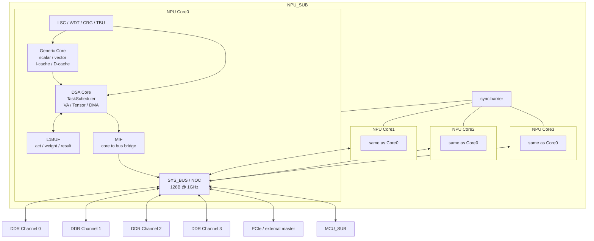
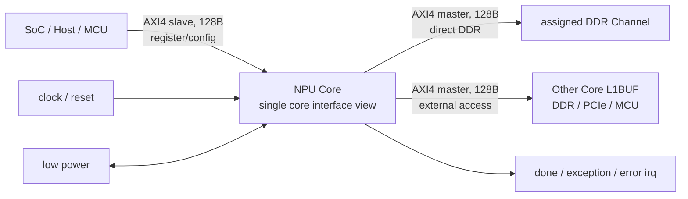
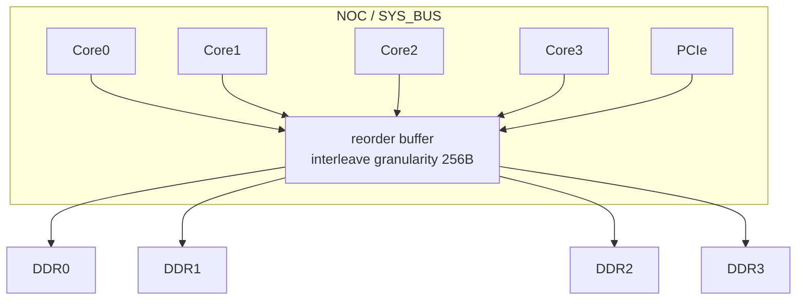
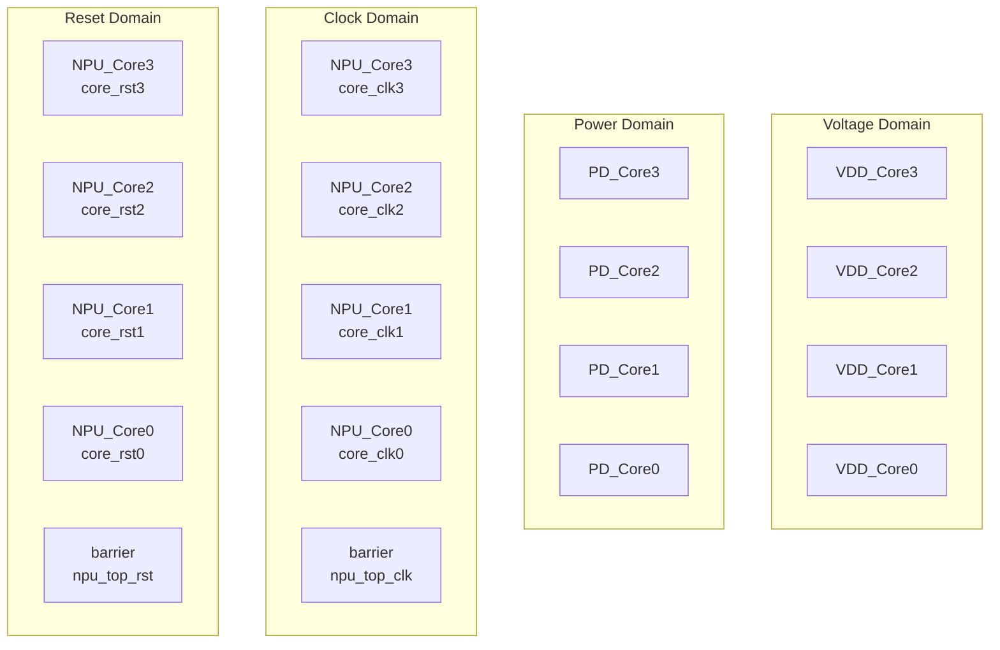
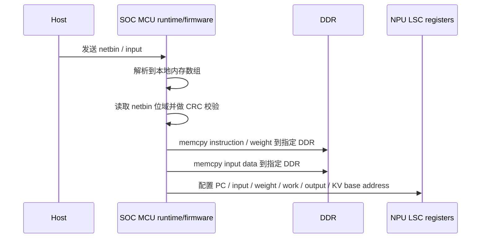
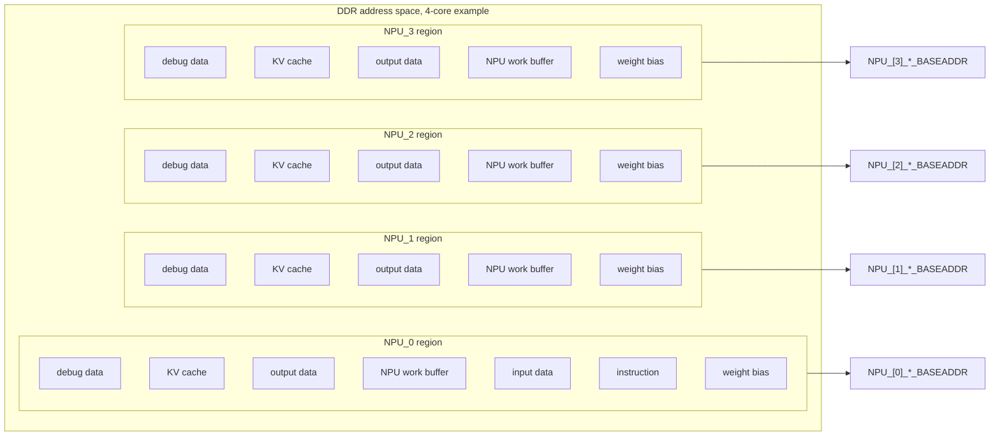
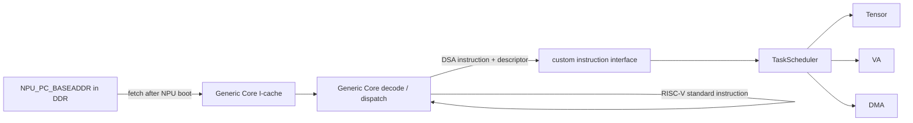
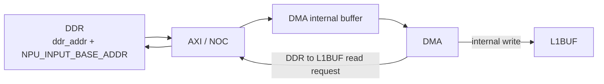
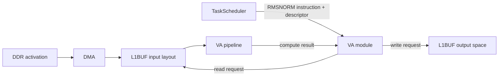
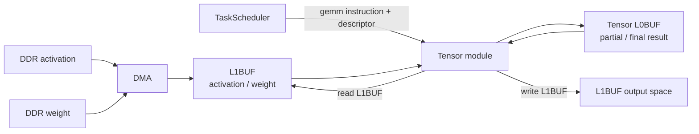

# NPU 设计 Spec 总结

> 根据现有 NPU 子系统设计 spec 截图整理。本文聚焦顶层架构、模块职责、接口约束、存储映射、时钟复位电源域，以及 NPU_SUB 顶层和硬件内部数据流。详细 IO、NoC 拓扑、memory map 和 CRG 表单仍以原始 Excel/规格表为准。

## 1. 总体架构

自研 NPU 子系统采用 4 核架构。每个 NPU Core 包含通用控制处理能力、DSA 计算引擎、片上 L1BUF、核内互联桥和系统控制模块。NPU Core 之间以及 Core 到 DDR、PCIe、MCU 等外部模块之间通过 SYS_BUS/NOC 互联。

### 1.1 主要模块职责

| 模块 | 职责 | IP 来源 |
| --- | --- | --- |
| SYS_BUS / NOC | Core 间互联；Core 与 DDR、PCIe、MCU 之间互联；支持 DDR 交织访问能力 | 外购 IP |
| Generic Core | 通用标量和向量计算；通过自定义指令下发接口向 DSA Core 发送指令和描述符 | 外购 IP |
| DSA Core | 大模型推理加速引擎，包含 TaskScheduler、Tensor、VA、DMA | 自研 |
| TaskScheduler | DSA 指令分发，进一步调度 Tensor、VA、DMA | 自研 |
| Tensor | 矩阵乘、卷积类计算 | 自研 |
| VA | 非矩阵乘、卷积类向量/激活计算 | 自研 |
| DMA | 数据搬运与格式转换 | 自研 |
| L1BUF | 片上数据缓存，保存 activation、weight、计算结果等，作为各计算模块的数据交换中心 | 自研 |
| MIF | 核内路由桥，连接核内组件与 NPU_BUS | 外购 IP |
| LSC | 系统控制器，负责寄存器配置、状态上报、低功耗管理等 | 自研 |
| WDT | 每个 NPU Core 一个看门狗模块 | 外购 IP |
| SUB CRG | NPU 子系统时钟门控和同步复位 | 自研 |
| TBU | 虚拟地址到物理地址转换 | 外购 IP |

## 2. 接口定义摘要

以单核接口为基本单元，4 核扩展 4 组接口。

- 1 组直连 DDR 的 master 接口，AXI4，位宽 128B，只能访问指定 DDR Channel。
- 1 组对外访问 master 接口，AXI4，位宽 128B，可访问其他 Core 的 L1BUF、所有 DDR Channel、PCIe、MCU。
- 1 组 slave 接口，AXI4，位宽 128B。
- 1 组 SoC 提供的时钟复位信号。
- 1 组中断信号，包含完成、异常和错误中断。
- 1 组低功耗接口。
- 其他边带信号。

## 3. 多核互联与 DDR 交织

当前 DDR 不交织时，4 个 NPU Core 或 PCIe 等访问方只能访问单一 DDR channel，访问带宽约为 32GB/s。NPU 单 Core 算力约 32T，在 memory-bound 场景下带宽和算力配比偏低，可考虑关闭部分 Core，让剩余 Core 通过交织方式访问 DDR，提高有效带宽到 64GB/s 或 128GB/s。

支持的半静态 DDR 交织配置：

1. DDR 4 个 channel 全交织。
2. DDR 两两交织：1/2 交织、3/4 交织。
3. DDR 不交织。

设计要点：

- NOC 总线可实现交织特性，在 initial 端口增加 reorder buffer。
- 除 NPU Core 直通通路外，共 6 个 initial 端口。
- reorder buffer 深度按交织粒度 256B 考虑。
- Ring 交织会使 DDR 访问延迟增加约 20 到 30 cycle，但相对整体 DDR 延迟占比可接受。
- DMA 指令不区分 remote DDR 和 local DDR，统一按 remote DDR 访问处理。
- 编译器在交织时不区分 remote DDR，其他模块对交织配置不感知。

## 4. Memory Map 约束

硬件地址映射约束：

- SCO 分配 NPU subsystem 基地址时，起始地址要求 16MB 对齐。
- 集成时，MIF 与 M0 口相连的 master 遇到 NPU subsystem global 地址空间时，地址转换为 `0x0_00xx_xxxx`：保留低 24 bit，高位补 0。

软件地址约束：

- NPU 内部 master 访问内部空间时使用 NPU local address。

通用访问错误约定：

- 总线无法路由且目标地址不存在时，返回 `DECERR`，由 dummy slave 回复。
- 总线无法路由且因为低功耗接管时，返回 `SLVERR`，由 dummy slave 回复。
- 访问安全保护区域时，返回 `OK`，写无效，读为 0。

Device 地址访问约定：

- 不支持非对齐访问，硬件自动转成对齐地址处理。
- 访问 Device 内部受权限保护地址时，返回 `SLVERR`。
- 访问 Device 内部保留地址时，返回 `OK`，写无效，读为 0。
- 访问寄存器内部保留位域时，默认按 `WARZ` 属性处理，即写无效、读为 0。

## 5. 电压、电源、时钟与复位域

每个 NPU Core 处于独立电压域和独立电源域，可独立关断电源。每个 NPU Core 也处于独立时钟域，支持 DVFS，最高频点 1.2GHz；每个 Core 有独立复位域，支持软复位。

## 6. NPU_SUB 顶层数据流

### 6.1 Netbin 和 Input 数据准备

SOC MCU 负责 runtime/firmware 层的数据准备，包括接收 Host 文件、校验、搬运到 DDR、配置基地址寄存器。

主要基地址寄存器：

| 类型 | 基地址寄存器 |
| --- | --- |
| weight 数据 | `NPU_[index]_WEIGHT_BASEADDR` |
| 指令数据 | `NPU_PC_BASEADDR`，指令仅一套 |
| 输入数据 | `NPU_IN_DATA_BASEADDR`，输入数据仅一套 |
| 中间数据 | `NPU_[index]_WORK_DATA_BASEADDR` |
| 输出数据 | `NPU_[index]_OUT_DATA_BASEADDR` |
| KV Cache 数据 | `NPU_[index]_KV_DATA_BASEADDR` |

系统软件需要保证各个 `BASEADDR` 对应的工作区不存在 overlap。

补充说明：

- DMA 操作时，SOC MCU 通过 LSC 配置寄存器获取各 Core 数据的实际偏移地址。
- 每个 Core 中都有所有 Core 的基地址寄存器。
- 编译器在 DMA 指令中添加 5 种数据类型字段和目标 `core_id` 字段。
- DMA 通过数据类型和 `core_id` 计算真实 DDR 地址。
- RVV 和 TE 不直接访问 DDR 数据用于计算，均通过 L1BUF。
- 并行解码场景下，draft 模型和 target 模型各需要一套基地址寄存器，可通过 LSC 配置当前运行模型，使 DMA 选择对应模型的基地址。
- 如果让编译器获取 `core_id` 和基地址寄存器来计算真实 DDR 地址，需要在 DMA 指令前增加一条 scalar 加法指令，并把计算结果放到 DMA 描述符中，存在性能风险。

### 6.2 指令数据流

指令流摘要：

1. NPU 启动后，Generic Core 基于 `NPU_PC_BASEADDR` 开始取值到 I-cache。
2. 指令解析后预分发：RISC-V 标准指令由 Generic Core 自身计算。
3. 自研 DSA 指令由特定下发接口分发到 DSA Core 的 TaskScheduler。
4. TaskScheduler 进一步解析，并将指令分发给 Tensor、VA 和 DMA 计算单元。

### 6.3 DMA 数据流

DMA 数据搬运流程：

1. DMA 收到指令后，译码为 DDR 到 L1BUF 的数据搬运，真实地址为指令中的 `ddr_addr + NPU_INPUT_BASE_ADDR`。
2. DMA 通过 AXI 总线发起 DDR 读请求。
3. DDR 数据返回到 DMA 内部 buffer。
4. DMA 通过内部接口把数据写入 L1BUF。

## 7. 硬件内部计算数据流

### 7.1 RMSNORM

RMSNORM 是 Transformer block 的第一个运算，典型路径为 DDR 数据经 DMA 搬入 L1BUF，VA 模块从 L1BUF 读取，计算后写回 L1BUF。

流程摘要：

1. activation 数据已经由 DMA 从 DDR 搬运到 L1BUF，并按指定 layout 摆放。
2. RMSNORM 指令和描述符下发到 VA 模块。
3. VA 根据指令解析，生成读取 L1BUF 的请求。
4. 数据进入 VA 模块流水线，计算得到结果。
5. 根据指令解析生成写 L1BUF 请求，将结果存入 L1BUF。

### 7.2 Matmul / GEMM

Matmul 是 Transformer block 中的 linear 运算，典型路径为 activation 和 weight 经 DMA 搬入 L1BUF，Tensor 模块读取并计算，中间结果和最终结果缓存在模块内部 L0BUF，完成后写回 L1BUF。

流程摘要：

1. activation 和 weight 数据已经由 DMA 从 DDR 搬运到 L1BUF，或由其他计算单元直接写入 L1BUF，并按指定 layout 摆放。
2. GEMM 指令和描述符下发到 Tensor 模块。
3. Tensor 根据指令解析，生成读取 L1BUF 的请求。
4. 数据进入 Tensor 模块 L0BUF 并进入模块流水线，中间结果和最终结果缓存在 L0BUF 内。
5. 计算完成后，根据指令解析生成写 L1BUF 请求，将结果存入 L1BUF。

## 8. 设计关注点

- 带宽瓶颈：不交织时单访问方只能使用单 DDR channel，memory-bound 场景下需要通过 DDR 交织或关闭部分 Core 提升有效带宽。
- 地址一致性：内部 master 访问内部空间使用 local address；MIF/M0 global 地址转换需要保持低 24 bit。
- 数据区隔离：软件必须保证 input、weight、work、output、KV cache、debug 等工作区无 overlap。
- DMA 寻址：推荐由 DMA 根据数据类型和 `core_id` 结合基地址寄存器计算真实 DDR 地址，避免编译器插入额外 scalar 指令造成性能损失。
- 多模型场景：draft/target 模型需要独立基地址集合，LSC 配置当前模型状态后由 DMA 选择对应地址。
- 低功耗与错误返回：低功耗接管导致无法路由返回 `SLVERR`；安全保护区访问返回 `OK` 但写无效、读为 0。
- 独立域管理：每个 Core 具备独立电压、电源、时钟和复位域，支持 DVFS、独立关电和软复位。

