|  |  |  |  |
| --- | --- | --- | --- |
| 项目/Project | T100 | 文档密级 | 机密 |
| 版本 | V100 | 页数/Page |  |

# T100 NPU TOP Architecture SPEC

|  |  |  |  |
| --- | --- | --- | --- |
| 拟制 |  | 日期 |  |
| 审核 |  | 日期 |  |
| 批准 |  | 日期 |  |
| 项目组 |  | 日期 |  |

版本记录

|  |  |  |  |
| --- | --- | --- | --- |
| 版本号 | 修订日期 | 描述 | 修订者 |
| V1.0 | 2025/4/15 | 初始化版本 | Leyna |
|  |  |  |  |
|  |  |  |  |

# 目录

[版本记录 22](#_Toc196743362)

[目录 23](#_Toc196743363)

[图目录 26](#_Toc196743364)

[表目录 27](#_Toc196743365)

[1. 引言 28](#_Toc196743366)

[1.1. 文档目的 28](#_Toc196743367)

[1.2. 适用范围 28](#_Toc196743368)

[1.3. 术语和缩略语 28](#_Toc196743369)

[2. NPU SUB概述 29](#_Toc196743370)

[2.1. 顶层框图 29](#_Toc196743371)

[2.2. 特性说明 29](#_Toc196743372)

[2.3. 接口定义 30](#_Toc196743373)

[2.4. 多核互联总线 30](#_Toc196743374)

[2.5. Memory map 30](#_Toc196743375)

[2.6. 电压电源域划分 31](#_Toc196743376)

[2.7. 时钟复位域划分 32](#_Toc196743377)

[3. NPU SUB顶层数据流 33](#_Toc196743378)

[3.1. Netbin和Input数据准备 33](#_Toc196743379)

[3.2. 上电解复位 34](#_Toc196743380)

[3.3. 初始化 34](#_Toc196743381)

[3.4. 启动NPU 34](#_Toc196743382)

[3.5. NPU任务完成 35](#_Toc196743383)

[3.6. 模型切换 35](#_Toc196743384)

[4. NPU SUB硬件内部数据流 36](#_Toc196743385)

[4.1. 指令数据流 36](#_Toc196743386)

[4.2. DMA数据流 36](#_Toc196743387)

[4.3. 典型算子数据流 37](#_Toc196743388)

[4.4. 联动算子数据流 40](#_Toc196743389)

[4.5. 量化衔接数据流 41](#_Toc196743390)

[4.6. 核内交互数据流 41](#_Toc196743391)

[4.7. 多核交互数据流 41](#_Toc196743392)

[4.8. 片间交互数据流 42](#_Toc196743393)

[5. Generic Core-RVV处理器（外购） 43](#_Toc196743394)

[5.1. 加速器集成 43](#_Toc196743395)

[5.2. 编程模型 43](#_Toc196743396)

[6. DSA Core-推理加速引擎（自研） 44](#_Toc196743397)

[6.1. 指令集-ISA 44](#_Toc196743398)

[6.2. 数据结构-Layout 44](#_Toc196743399)

[6.3. Task Scheduler-命令分发单元 44](#_Toc196743400)

[6.4. Tensor-矩阵乘法单元 44](#_Toc196743401)

[6.5. VA Engine-矢量加速单元 45](#_Toc196743402)

[6.6. DMA-数据搬运单元 45](#_Toc196743403)

[6.7. L1BUF-内部存储器 45](#_Toc196743404)

[7. MIF-内部互联桥 46](#_Toc196743405)

[8. MMU/TBU-内存管理单元 47](#_Toc196743406)

[9. LSC-系统控制器 48](#_Toc196743407)

[10. 中断处理 49](#_Toc196743408)

[11. Debug特性 50](#_Toc196743409)

[12. Trace特性 51](#_Toc196743410)

[13. Performance monitor 52](#_Toc196743411)

[14. 低功耗处理 54](#_Toc196743412)

[14.1. CG流程 54](#_Toc196743413)

[14.2. PG流程 54](#_Toc196743414)

[15. 应用指南 55](#_Toc196743415)

# 图目录

# 表目录

**未找到图形项目表。**

# 1. 引言

## 1.1. 文档目的

用于指导集成设计及集成验证开发，同时供后端及软件团队参考。

## 1.2. 适用范围

本文档面向对象是T100项目NPU架构部，前端设计人员，EDA验证人员、EMU原型验证人员，软件开发团队。

## 1.3. 术语和缩略语

|  |  |
| --- | --- |
| 名词 | 解释说明 |
| Spec | 逻辑需求规格说明书 |
|  |  |
|  |  |
|  |  |

# 2. NPU SUB概述

## 2.1. 顶层框图

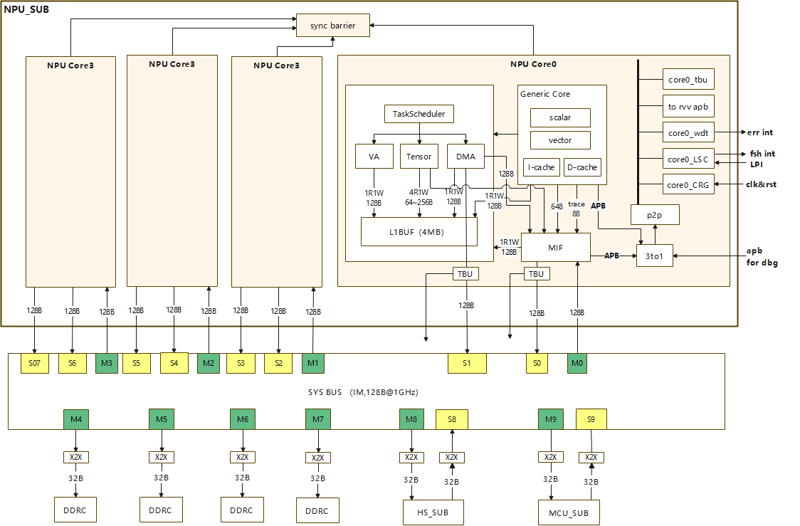

Figure 1 NPU子系统顶层框图

## 2.2. 特性说明

自研NPU子系统为4核架构，主要包含以下功能块：

SYS\_BUS：互联总线，负责NPU Core之间，以及NPU Core和DDR/PCIE./MCU之间的互联通信，外购IP。

Generic Core：通用处理器，负责通用标量和矢量运算，以及通过自定义指令下发接口给DSA Core传输指令和描述符，外购IP。

DSA Core：自研大模型推理加速引擎，包含一个命令分发组件Taskscheduler；两个计算组件：1)针对矩阵乘和卷积类计算的Tensor，和2）针对非矩阵乘和卷积类计算的VA，其中Tensor和VA需要配套的读写逻辑和量化逻辑一起来承担一条命令的完成处理；一个数据搬运和格式转换组件DMA。

L1BUF：片上存储单元，负责存储act、weight、计算结果等数据，所有的计算模块都是通过L1 Buf进行数据的交互，自研IP。

MIF：核内路由桥，负责核内各组件和NPU\_BUS之间的互联，外购IP。

LSC：系统控制器，负责寄存器配置、状态上报、低功耗管理等，自研IP。

wdt：看门狗，每个NPU Core一个看门狗模块，外购IP。

SUB CRG：子系统内CRG，负责时钟门控和同步解复位，自研IP。

TBU：虚拟地址到物理地址转换单元，外购IP。

## 2.3. 接口定义

【接口简要说明 详见NPU TOP IO.exls】

以单核接口进行说明，4核扩展4组：

- 支持1组直接访问DDR的master接口，AXI4协议，位宽128B；（只能访问指定的DDR Channel）
- 支持1组对外访问master接口，AXI4协议，位宽128B，可以访问其他Core的L1BUF、所有DDR Channel、PCIe、MCU；
- 支持1组slave接口，AXI4协议，位宽128B：
- 支持1组时钟复位信号，由SOC提供；
- 支持1组中断信号，包括完成、异常和错误中断；
- 支持1组低功耗接口；
- 其他边带信号；

## 2.4. 多核互联总线

【总线详细拓扑】

【总线user信号等sideband信号描述】

【总线附带功能描述】

多核互联总线详细拓扑参考：

t100\_pdt\_doc/开发库/04开发/03SOC组/02\_design/04\_subs/03\_noc\_ss/T100 NoC接口行为分析表.xlsx

DDR交织方案：

当前DDR不交织，4个NPU Core或者PCIe等只能访问单一DDR channel，访存带宽为32GB/s，NPU 单Core算力32T，在memory bound场景下，带宽和算力配比过小，这种场景下可以考虑2/3个Core关闭，剩余1/2个Core通过交织方式访问DDR，带宽可以到64GB/s或128GB/s，可以支持以下几种交织的配置，半静态配置：

1. DDR 4个交织
2. DDR两两交织：1/2交织 3/4交织
3. DDR不交织

- NOC总线可以实现交织特性，在initial端口增加reorder buffer，除了NPU Core直通通路，共6个initial端口，reorder buffer深度，交织粒度256B；
- Ring+交织的结构，DDR访问延迟会增加20~30 cycle（等最远的DDR返回数据），对于整体DDR延迟占比还好；
- 对于DMA指令，不区分remote DDR和local DDR，都是remote DDR访问；
- 编译器在交织时不区分remote DDR，其他不感知；

## 2.5. Memory map

地址映射约束：

1. SCO分配NPU subsystem的基地址时，要求起始地址16MB对齐；
2. 集成时MIF与M0口相连的Master口遇到NPU subsystem global地址空间更换为0X0\_00xx\_xxxx，具体操作为保留低24bit，高位补0；

软件约束：

1. NPU内部master访问内部空间用NPU local address；

通用访问错误约定（device或memory）：

1. 总线无法路由（目标地址不存在），返回DECERR（由dummy slave来回复）。
2. 总线无法路由（低功耗接管），返回SLVERR（由dummy slave来回复）。
3. 访问到受安全保护的区域，返回OK，且写无效读为零。

针对Device地址访问：

1. 不支持非对齐访问，硬件自动转成对齐的地址来处理。
2. 访问到Device内部的受权限保护地址，返回SLVERR。
3. 访问到Device内部的保留地址，返回OK，且写无效读为零。
4. 访问到寄存器内部的保留位域，默认按WARZ属性处理（写无效读为零）。

注：

1. 以上规定为默认的设计准则，特殊情况下允许slave根据需要定义访问行为，例如关键寄存器，在规定时段禁止访问时返回slverr等，具体见具体寄存器的定义。

Memory map详见：

t100\_pdt\_doc/开发库/04开发/02NPU组/01\_NPU架构/05\_spec/ T100 NPU memorymap

## 2.6. 电压电源域划分

 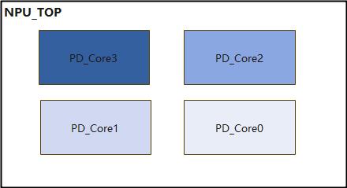

Figure 2 NPU\_SS电压电源域划分

每个NPU\_Core处于独立的电压域。

每个NPU\_Core处于独立的电源域，可独立关断电源。

## 2.7. 时钟复位域划分

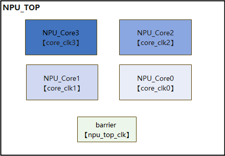

Figure 3 NPU子系统时钟域划分

NPU子系统内每个NPU Core独立的时钟域，支持DVFS，最高频点1.2GHz

Figure 4 NPU子系统复位域划分

NPU子系统内每个NPU Core独立的复位域，支持软复位。

时钟复位CRG表单详见：

t100\_pdt\_doc/开发库/04开发/02NPU组/01\_NPU架构/05\_spec/ T100 NPU CRG需求表单

# 3. NPU SUB顶层数据流

本章节描述NPU\_SUB顶层数据流。

## 3.1. Netbin和Input数据准备

SOC MCU（runtime/firmware）对netbin和input数据的处理流程：

1. SOC MCU接受Host发送的netbin等文件，解析到自己的内存数组中。
2. 读回netbin 位域，并对头信息进行CRC校验。如果存在CRC错误则进行错误处理，否则继续往下执行。（可选）
3. SOC MCU按照业务统一的内存规划，把Instruction、WEIGHT memcpy到指定的DDR内存中，并得到NPU\_PC\_BASEADDR和NPU\_[index]\_WEIGHT\_BASEADDR。

（4核单线程是同一份程序代码，4核4线程是不同的程序段）补充4核

1. SOC MCU按照业务统一的内存规划，把Input data memcpy到指定的DDR内存中，并得到NPU\_ IN\_DATA\_BASEADDR。
2. SOC MCU按照业务统一的内存规划得到NPU的相关基地址寄存器，包括：

- 权值数据基地址寄存器：NPU\_[index]\_WEIGHT\_BASEADDR
- 命令数据基地址寄存器：NPU\_PC\_BASEADDR（指令只有一套）
- 输入数据基地址寄存器：NPU\_IN\_DATA\_BASEADDR（输入数据只有一套）
- 中间数据基地址寄存器：NPU\_[index]\_WORK\_DATA\_BASEADDR
- 输出数据基地址寄存器：NPU\_[index]\_OUT\_DATA\_BASEADDR
- KV Cache数据基地址寄存器：：NPU\_[index]\_KV\_DATA\_BASEADDR

(系统软件需要保证各个BASEADDR的工作区不会出现overlap问题)

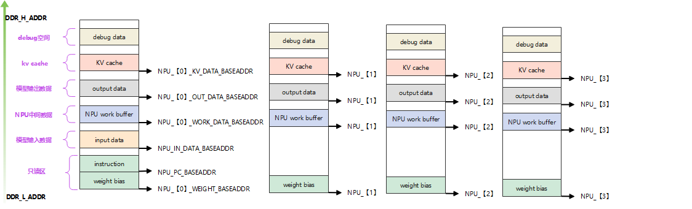

Figure 3 DDR中NPU相关数据地址（4核为例）

【注1】对于DMA操作，SOC MCU通过配置寄存器（LSC）获取各个Core数据的实际偏移地址，每个Core中都有所有Core的基地址寄存器，编译器在DMA指令中添加5种数据类型字段和目的Core\_id字段，DMA通过数据类型和Core\_id计算真实访问DDR的地址。RVV和TE不会访问DDR的数据用于计算，都是通过L1BUF，不需要做此处理。

【注2】考虑并行解码场景，draft模型和target模型各需要一套基地址寄存器，通过配置寄存器（LSC）表示当前运行模型，dma选择对应模型的基地址。

【注3】如果编译器获取core id和基地址寄存器来计算真实DDR地址，需要在DMA指令前加一条加法scalar指令，计算的结果放在DMA描述符中，会有性能问题。

## 3.2. 上电解复位

NPU的上电后默认为复位状态，解复位由SOC MCU控制：

1. SOC MCU解复位整个NPU子系统，解复位后总线通路，LSC模块可正常工作。
2. NPU Core处于解复位状态，输入信号stop\_on\_reset上电复位值为1，控制Core解复位后不取指令，待初始化配置后再改配stop\_on\_reset为0，开始取指。

NPU subsys解复位后各组件状态：

|  |  |
| --- | --- |
| 子模块 | 子系统解复位后状态 |
| NPU\_BUS | 解复位 |
| NPU \_Core\_0 | 解复位，stop\_on\_reset默认值为1，stall取指 |
| NPU \_Core\_1 | 解复位，stop\_on\_reset默认值为1，stall取指 |
| NPU \_Core\_2 | 解复位，stop\_on\_reset默认值为1，stall取指 |
| NPU \_Core\_3 | 解复位，stop\_on\_reset默认值为1，stall取指 |

## 3.3. 初始化

NPU子系统初始化流程：

初始化寄存器，SOC MCU在NPU空闲情况下（NPU非空闲则会出现配置报错 APB\_slverr），配置NPU的相关基地址寄存器，包括：

1. SOC MCU配置Core0~3的权值基地址寄存器core[0~3]\_weight\_baseaddr
2. SOC MCU配置Core0~3的中间数据基地址寄存器core[0~3]\_work\_data \_baseaddr
3. SOC MCU配置Core0~3的输出数据基地址寄存器core[0~3]\_out\_data \_baseaddr
4. SOC MCU配置Core0~3的kv数据基地址寄存器core[0~3]\_kv\_data \_baseaddr
5. SOC MCU配置Core0~3的取值基地址寄存器pc\_baseaddr
6. SOC MCU配置Core0~3的输入数据基地址寄存器in\_data\_baseaddr

NPU Core的寄存器详细参见：

t100\_pdt\_doc/开发库/04开发/02NPU组/01\_NPU架构/05\_spec/T100 NPU寄存器表单

## 3.4. 启动NPU

NPU Core启动流程：

1. NPU子系统初始化后，配置Core0的寄存器stop\_on\_reset解除stall启动Core0；
2. 配置Core1的寄存器stop\_on\_reset启动Core1；
3. 配置Core2的寄存器stop\_on\_reset启动Core2；
4. 配置Core3的寄存器stop\_on\_reset启动Core3；
5. NPU进行推理任务

注意：NPU状态寄存器在busy时（各个IP内部自行保护），不得修改，硬件报错，返回pslverr。

步骤1~4相互独立，没有先后顺序。

## 3.5. NPU任务完成

NPU完成推理任务后，可以通过两种方式通知MCU：

1. 编译文件最后一条指令为配置LSC 的cmpl寄存器上报完成中断给MCU，进入WFI状态；
2. SOC有mailbox，可以在推理完成时给SOC MCU发消息通知；

SOC MCU把上一次推理结果Output data memcpy到指定的IN\_DATA\_BASEADDR内存中，触发中断给RVV，RVV中断服务程序中跳转到起始PC开始新一轮推理任务，直到达到推理任务上限。

【注】如推理中涉及dcache，一次推理结束后加一条fencei指令flush dcache，目前不涉及dcache，icache不需要flush。

## 3.6. 模型切换

以并行解码为例，draft模型和target模型都是静态编译，常驻资源如instruction、weight、kv cache在DDR中独立分配，模型切换时runtime通过配置两套及地址寄存器通知硬件，按照章节3.3-3.5运行。

并行解码需求详见：

t100\_pdt\_doc/开发库/04开发/02NPU组/01\_NPU架构/架构分析/ T100 NPU 需求分解【并行解码】

# 4. NPU SUB硬件内部数据流

根据业务数据流划分：

## 4.1. 指令数据流

1. NPU启动后，Generic Core基于NPU\_PC\_BASEADDR开始取值到I-cache
2. 通过指令解析进行预分发，RISCV标准指令交由Generic Core自身计算，自研DSA指令由特定下发接口分发给DSA Core TaskScheduler模块；
3. TaskScheduler通过进一步解析将指令分发给Tensor、VAE和DMA计算单元；

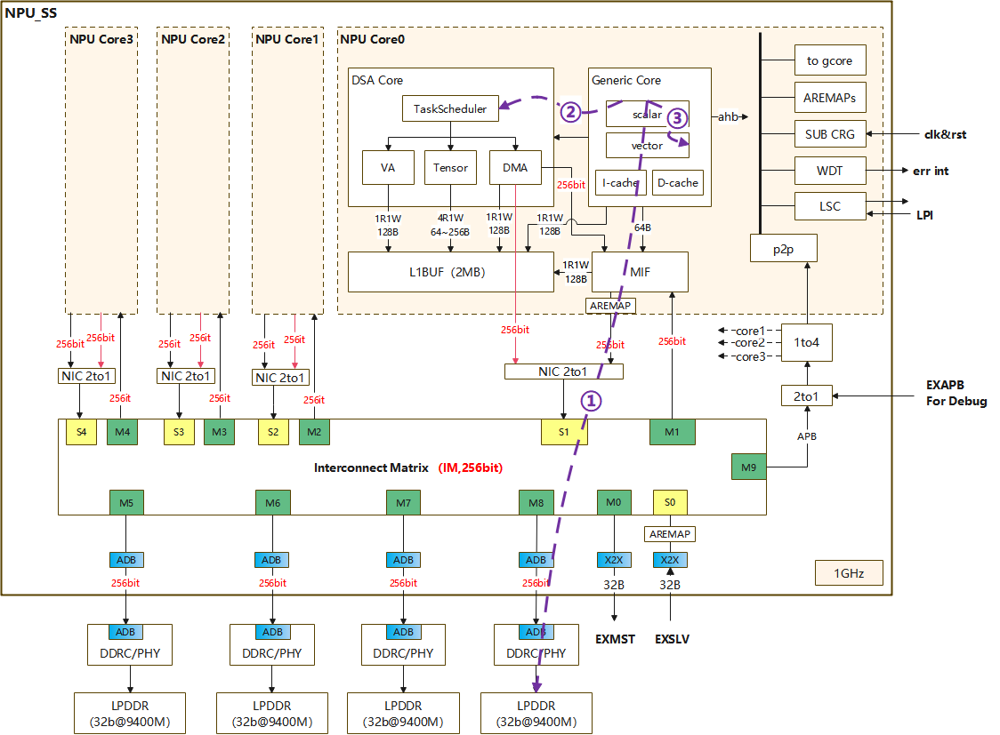

Figure 4 NPU指令数据流

## 4.2. DMA数据流

NPU推理数据先由DMA从DDR负责搬运到L1BUF：

1. DMA收到指令后，译码为DDR->L1BUF数据搬运（真实地址为指令中的ddr addr+NPU\_INPUT\_BASE\_ADDR）
2. DMA通过AXI总线发起DDR读请求
3. DDR数据送到DMA内部buffer
4. DMA通过内部接口把数据写进L1BUF

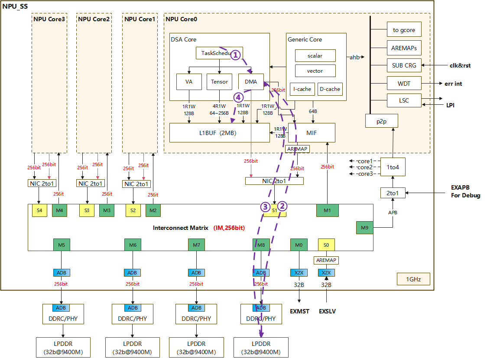

Figure 5 NPU DMA数据流

## 4.3. 典型算子数据流

1. RMSNORM：Transformer block第一个运算
2. 激活数据已经由DMA从DDR负责搬运到L1BUF，按照7.4.1 layout格式摆放
3. RMSNORM指令和描述符下发到VAE模块，VAE根据指令解析，生成读取L1BUF的请求
4. 数据进入VAE模块流水线，经过计算得到结果
5. 根据指令解析生成写L1BUF的请求，存入L1BUF的空间

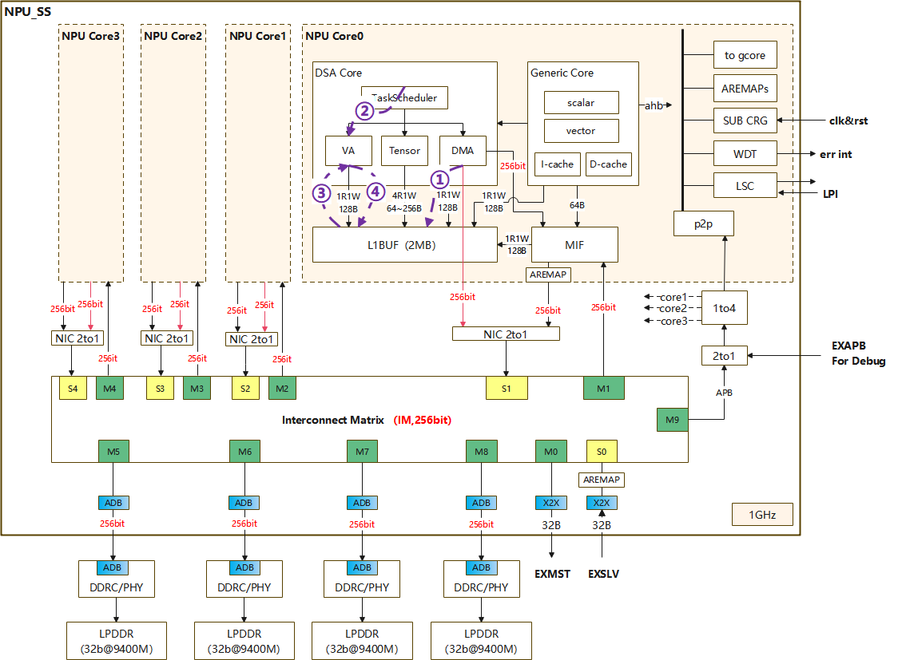

Figure 6 RMSNORM计算数据流

1. Matmul：Transformer block中的linear运算
2. 激活和weight数据已经由DMA从DDR负责搬运到L1BUF(或者由别的计算单元直接写入L1BUF)，按照7.4.1和7.4.3 layout格式摆放
3. gemm指令和描述符下发到Tensor模块，Tensor根据指令解析，生成读取L1BUF的请求
4. 数据进入Tensor模块的L0BUF，并进入模块流水线，中间结果和最终结果缓存在L0BUF内
5. 计算完成后根据指令解析生成写L1BUF的请求，存入L1BUF的空间

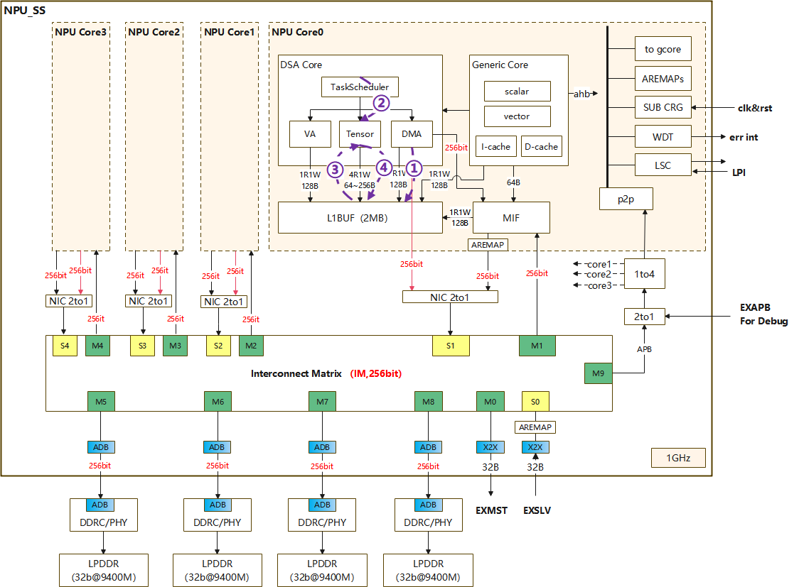

Figure 7 NPU gemm计算数据流

1. RVV指令：需要RVV计算的场景
2. 数据已经由DMA从DDR负责搬运到L1BUF(或者由别的计算单元直接写入L1BUF)，按照对应的layout格式摆放
3. Generic Core的vector计算单元收到rvv指令，执行load 指令生成读取L1BUF的请求
4. 数据由L1BUF读入vector运算单元寄存器，执行execute指令进入vector执行单元流水
5. 计算完成后执行store指令生成写L1BUF的请求，存入L1BUF的空间

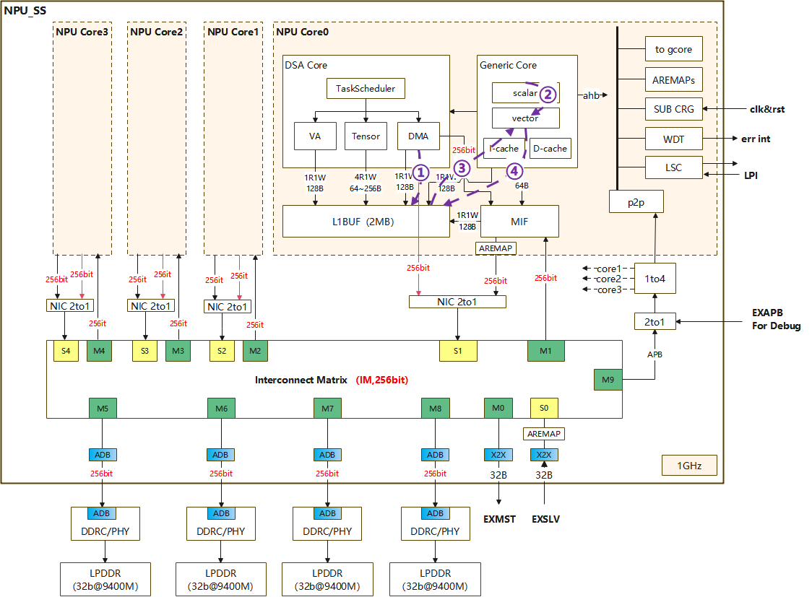

Figure 8 RVV指令计算数据流

## 4.4. 联动算子数据流（T100不支持）

联动算子是指由两条指令组合而成，第一条指令的combine\_start使能，第二条指令的combine\_end使能。这两条命令之间不允许中间插入其他命令。

联动典型场景（在线模式）：

Gemm+Softmax、Gemm+Rope

相关模型结构如下：

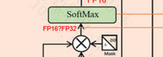 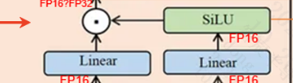 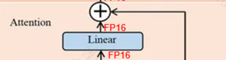

例如：Tensor执行gemm，VAE执行Softmax。按照FlashAttetion切分Softmax输入向量的维度，如切分成硬化的Softmax支持的并行度，tensor每拍输出向量的维度【16，16】，数据不直接由L0CBUF分四拍传递给VAE模块（同时写回L1BUF），实现FIFO联动计算，省掉第一轮的L1BUF访问，降低功耗开销。

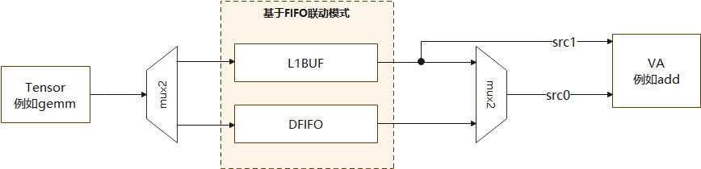

Figure 9 联动算子数据流

## 4.5. 量化衔接数据流

- 静态反量化在Tensor模块处理；
- Activation动态量化在VAE模块处理，反量化在Tensor模块处理；
- sageAttention整体量化的处理过程（如下图），将q，k，v量化为8bit，matmul计算按照定点计算，softmax按照浮点计算；

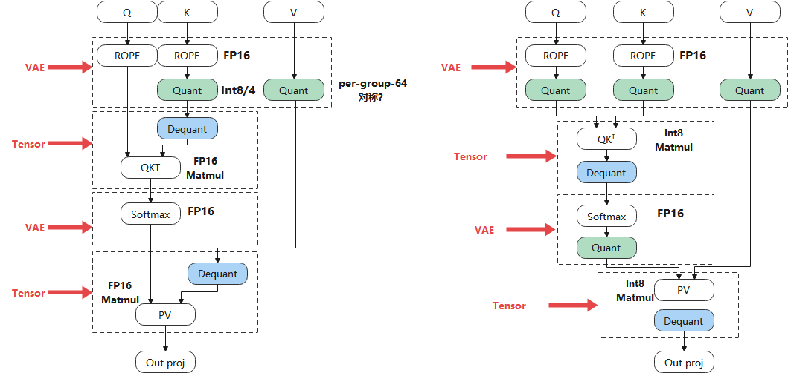

Figure 10 sage attention量化数据流

量化需求和方案详见：

t100\_pdt\_doc/开发库/04开发/02NPU组/01\_NPU架构/架构分析/ T100 NPU 需求分解【量化】

## 4.6. 核内交互数据流

单个NPU Core内为异构计算架构Generic Core和DSA Core，存在Generic Core要等DSA Core算完的数据依赖场景，（需要Generic Core改造fence指令支持收集自定义指令的done标志）。

## 4.7. 多核交互数据流

自研NPU子系统为4核（多核）架构，可以并行运算处理一个任务，4个NPU Core分别运算完的数据有可能需要合并后统一处理，如attention 4个核并行算完分别得到一行数据的4部分，需要合并成一行计算RMSNORM，需要多核间数据交互，数据集中到1个Core中计算：

1. 4个NPU Core计算完的结果分别存在local的L1BUF
2. 4个NPU Core执行barrier指令执行核间同步
3. NPU Core0执行fence指令堵住后续所有指令下发直到barrier指令完成（需要vendor改造fence指令支持收集自定义指令的done标志）
4. NPU Core0的DMA发起访问Core1 L1BUF数据的请求
5. NPU Core0的DMA发起访问Core2 L1BUF数据的请求
6. NPU Core0的DMA发起访问Core3 L1BUF数据的请求
7. 数据存入NPU Core0的L1BUF完成数据Contact
8. RMSNORM指令和描述符下发到VAE模块，VAE根据指令解析生成读取L1BUF的请求，进行计算后写入L1BUF

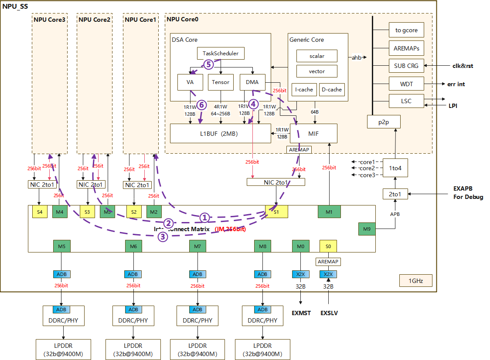

Figure 11 NPU多核交互数据流

## 4.8. 片间交互数据流

支持T100互联场景，支持NPU或这SOC DMA可以通过UCIE/PCIE接口访问其他片上DDR/L1BUF的数据。

互联需求和方案详见：

t100\_pdt\_doc/开发库/04开发/02NPU组/01\_NPU架构/架构分析/ T100 NPU 需求分解【多片互联】

# 5. Generic Core-RVV处理器（外购）

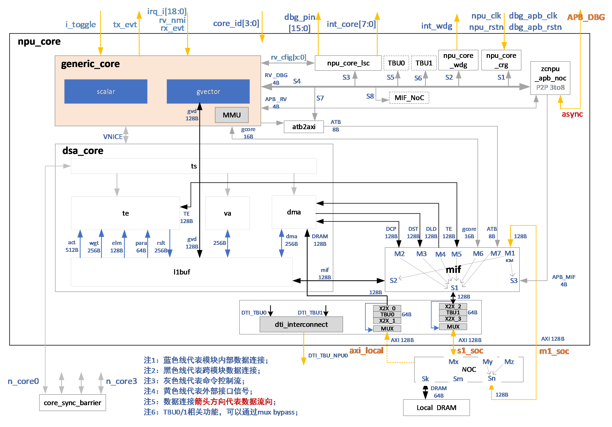

## 5.1. 加速器集成

Generic Core支持通过NICE接口集成DSA Core，完成自定义DSA指令的分发和指令流控制，接口行为详见：

t100\_pdt\_doc/开发库/04开发/02NPU组/01\_NPU架构/HLD文档/ 00\_generic/ ni900接口&集成说明

## 5.2. 编程模型

Generic Core为RISCV处理器，基于RISC-V SPEC编程规范。

## IP配置

Generic Core的IP配置项详见：

t100\_pdt\_doc/开发库/04开发/02NPU组/01\_NPU架构/03\_HLD/ 00\_generic/ T100\_NI900配置表

# 6. DSA Core-推理加速引擎（自研）

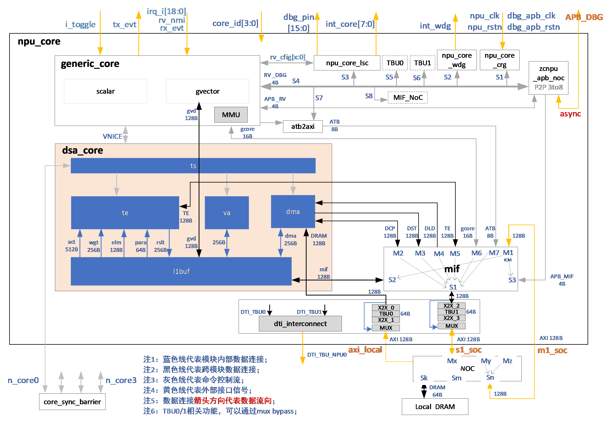

## 6.1. 指令集-ISA

自研NPU基于risc-v 64位指令进行扩展。需要增加tensor指令（矩阵和卷积）、dma指令、dma\_kv指令（专门搬运kv cache）、llm\_vec（专门加速大模型算子）、依赖指令（单核内的指令同步）、多核同步指令等。

ISA详细参见：

t100\_pdt\_doc/开发库/04开发/02NPU组/01\_NPU架构/02\_ ISA&Layout/ NPU指令集

## 6.2. 数据结构-Layout

DSA Core的数据结构即输入输出数据的layout格式，包括activation layout、weight layout、bias layout、kv cache layout，以及稀疏layout。

Layout详细参见：

t100\_pdt\_doc/开发库/04开发/02NPU组/01\_NPU架构/02\_ ISA&Layout/数据Layout

## 6.3. Task Scheduler-命令分发单元

Task Scheduler负责DSA指令的下发，规格详细参见：

t100\_pdt\_doc/开发库/04开发/02NPU组/01\_NPU架构//02\_ HLD文档/01\_dsa/00\_ts

## 6.4. Tensor-矩阵乘法单元

Tensor的规格详细参见：

t100\_pdt\_doc/开发库/04开发/02NPU组/01\_NPU架构//02\_ HLD文档/01\_dsa/01\_ts

## 6.5. VA Engine-矢量加速单元

VA Engine的规格详细参见：

t100\_pdt\_doc/开发库/04开发/02NPU组/01\_NPU架构//02\_ HLD文档/01\_dsa/03\_va

## 6.6. DMA-数据搬运单元

DMA 的规格详细参见：

t100\_pdt\_doc/开发库/04开发/02NPU组/01\_NPU架构//02\_ HLD文档/01\_dsa/02\_dma

## 6.7. L1BUF-内部存储器

L1BUF的规格详细参见：

t100\_pdt\_doc/开发库/04开发/02NPU组/01\_NPU架构//02\_HLD文档/01\_dsa/04\_l1buf

# 7. MIF-内部互联桥

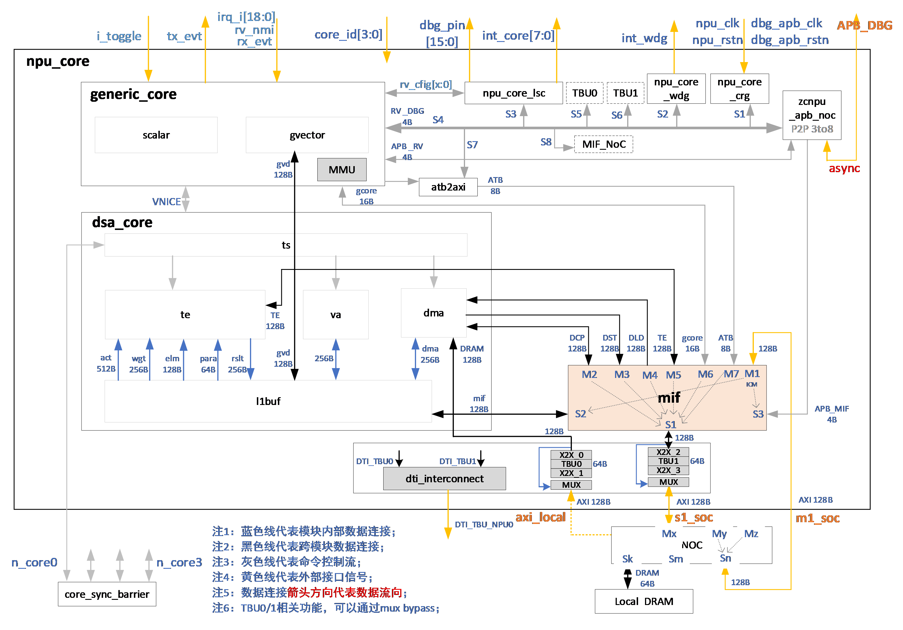

MIF的规格详细参见：

t100\_pdt\_doc/开发库/04开发/02NPU组/01\_NPU架构//02\_ HLD文档/02\_top/01\_mif

# 8. MMU/TBU-内存管理单元

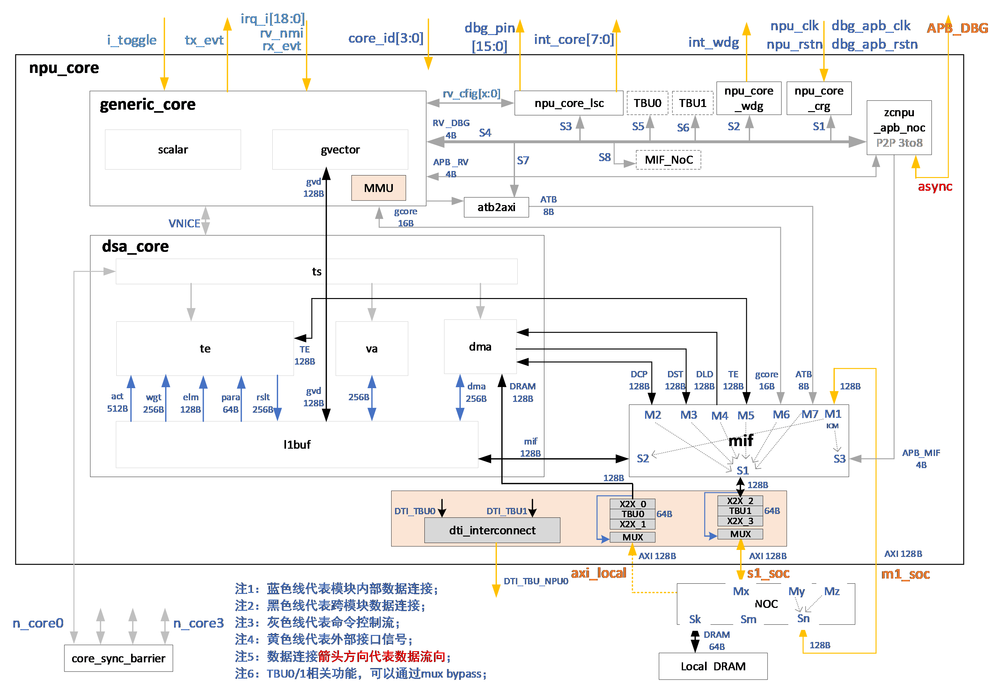

访问DDR时考虑DRAM颗粒错误地址重映射和Windows场景的需求，NPU需要支持MMU内存管理单元。

Generic Core支持MMU单元管理虚拟内存，支持以下特性：

- Sv32/39/48
- 两级TLB，第一级I/D TLB（8/16 entries），第二级MTLB
- 支持4KB, 2MB,1GB(Sv39)和512GB(Sv48)规格的页表大小
- 支持ASID，位宽16bit

DSA Core在DMA访问出口集成TBU进行地址转换：

- DMA和MIF 出口集成TBU，sid和ssid由寄存器配置，如果是访问remote l1buf，地址已经是PA，不经过TBU转换，在指令上根据访问目标判断bypass TBU；
- DMA虚拟地址变为48bit，指令编码适配，物理地址为40bit；
- 整个T100 SOC共享TCU，一套页表；

软件约束：

编译器用虚拟地址划分4核运行，可能实际物理地址都在一片DDR channel中， 其他core访问ddr的性能会变差，软件做虚拟地址和物理地址映射时需要考虑地址分配均衡。

Windows场景需求详见：

t100\_pdt\_doc/开发库/04开发/02NPU组/01\_NPU架构/架构分析/ T100 NPU 需求分解【Windows】

TBU配置表详见：

t100\_pdt\_doc/开发库/04开发/03SOC组/01\_architecture /09\_SMMU/ 智辰T100项目MMU-700配置表

# 9. LSC-系统控制器

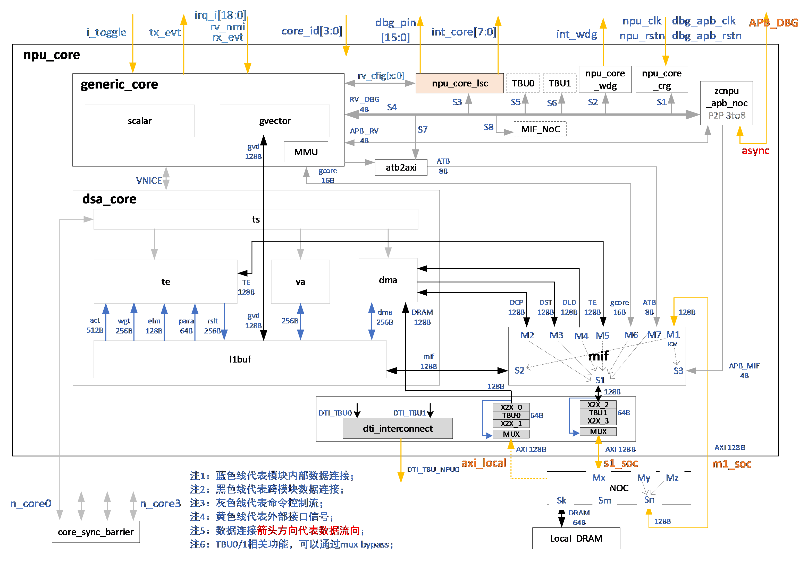

系统控制器，负责NPU子系统内寄存器配置、状态上报、低功耗管理等：

- NPU Core版本信息
- 访问DDR数据的基地址寄存器
- NPU启动、完成等控制信息
- NPU状态上报信息
- NPU中断上报/清除寄存器
- NPU Profiling信息

寄存器表单详见：

t100\_pdt\_doc/开发库/04开发/02NPU组/01\_NPU架构/01\_SPEC/T100 NPU寄存器表单

# 10. 中断处理

详细中断信息参见：

t100\_pdt\_doc/开发库/04开发/02NPU组/01\_NPU架构/01\_SPEC/T100 NPU中断路由表单

# 11. Debug特性

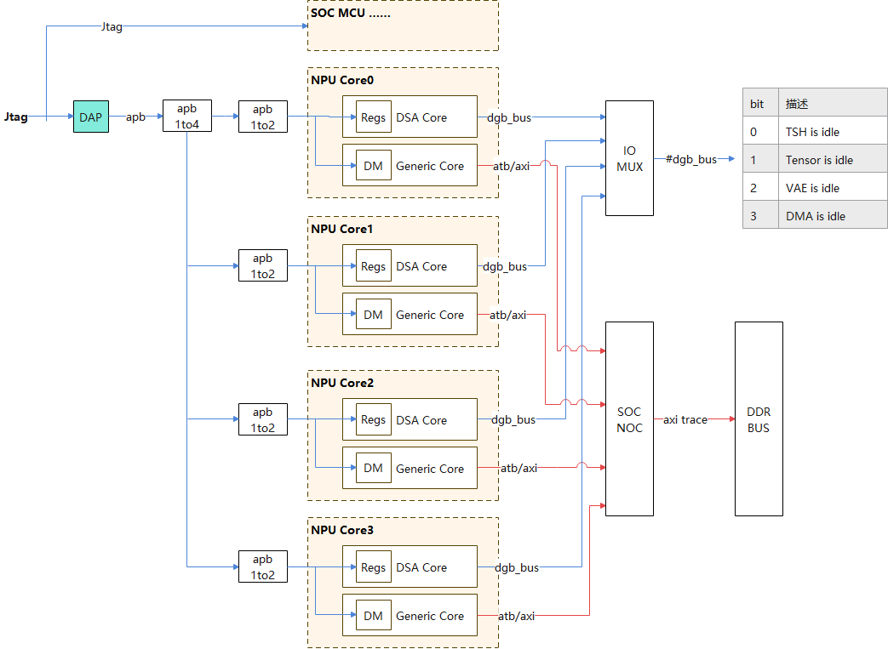

T100 NPU Debug特性主要由Generic Core的DM模块，DSA Core寄存器和IO Pin承载：

1. 外部JTAG/I2C转成APB访问Generic Core和DSA Core的寄存器进行调试；
2. Generic Core支持RISC-V debug specification (v0.13)，包括硬件断点、单步调试、trigger、profling等，也支持成熟的调试工具如GDB、OpenOCD；
3. DSA Core实现状态上报寄存器供软件查看，详见

t100\_pdt\_doc/开发库/04开发/02NPU组/01\_NPU架构/01\_SPEC/T100 NPU寄存器表单

1. 若APB线路出现问题，可以支持将NPU Core关键组件的IDLE状态通过IO pin拉到芯片顶层；

# 12. Trace特性

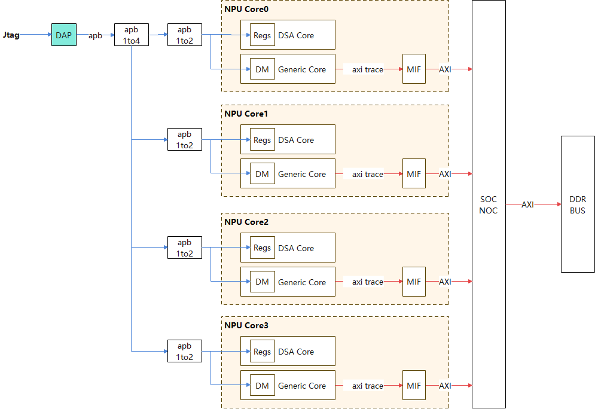

T100 NPU Trace特性主要由Generic Core承载：

1. Generic Core支持etrace功能，配置为AXI Trace接口通过MIF连到SOC\_NOC，存到DDR供软件查看；
2. 支持RISC-V Etrace specification（Verison 1.0）

# 13. Performance monitor

NPU子系统内Generic Core支持RISCV定义的performance monitor：

- Cycle Counter：
  - - 64bit的时钟周期计数器表示Core执行的cycle数
    - 通过CSR寄存器[mcycleh，mcycle]可获取计数值
- Instruction Retirement Counter：
- 64bit的计数器表示有多少条指令已经被执行
- 通过CSR寄存器[minstreth，minstret]可后去计数值
- Other user selected event Counter：
- 支持user可选择计数的event counter，共4个，可统计如下事件

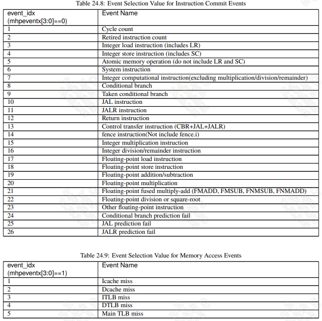

详细参见Nuclei ISA Specification <Nuclei\_RISC-V\_ISA\_Spec>

NPU子系统内DSA Core支持自定义的performance monitor：

- DSA Instruction Counter：
  - 32bit的计数器表示有多少条dsa指令已经被执行
  - 通过LSC寄存器[dsa\_inst\_cnt]可获取计数值
- Remote l1buf Counter：
  - 32bit的计数器表示访问remote l1buf的次数
  - 通过LSC寄存器[remote\_l1buf\_access\_cnt]可获取计数值
- l1buf Conflict Counter：
  - 32bit的计数器表示l1buf访问冲突的次数
  - 通过LSC寄存器[l1buf\_conflict\_cnt]可获取计数值

详见t100\_pdt\_doc/开发库/04开发/02NPU组/01\_NPU架构/ /01\_SPEC/T100 NPU寄存器表单

# 14. 低功耗处理

## 14.1. CG流程

动态CG：各自模块内实现，软件不感知.

静态CG流程由软件实现。

## 14.2. PG流程

进入PG流程：

1. 软件收到NPU Core完成中断，查看LSC的wfi\_mode寄存器，判断处于wfi状态
2. 软件配置TOP LSC寄存器进行总线接管
3. 软件配置TOP CRG关闭NPU时钟
4. 软件配置TOP CRG对NPU进行复位
5. 软件配置PMU进行PG和isolation

# 15. 应用指南
