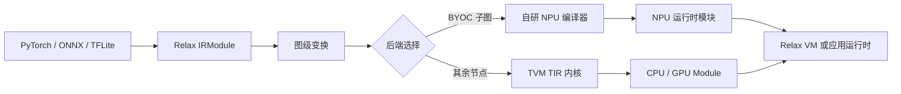

---
tags:
  - TVM
  - NPU
  - 编译器
  - Relax
  - TensorIR
status: maintained
baseline: Apache TVM v0.24.0
updated: 2026-07-29
---

# TVM 使用与自研 NPU 接入手册

> [!abstract] 手册目标
> 这是一套面向初学者、编译器开发者、NPU 架构师、驱动与运行时开发者的分册手册。内容从安装、模型导入和第一个 Relax 程序开始，逐步讲到 IRModule、Relax、TensorIR、调度、Pass、Target、代码生成、运行时、虚拟机，以及如何把自研 NPU 作为外部后端或原生设备加入 TVM。

> [!important] 版本基准
> 正文以 Apache TVM v0.24.0（Git 提交 `af3e4ba`）为源码基准，网络资料核对日期为 2026-07-29。网上大量旧文章仍使用 Relay、旧版 `tir` 和早期 BYOC API；照抄旧代码很容易遇到名称、函数签名及目录不一致的问题。

> [!note] 官方资料使用方式
> 本手册不是对官方页面逐句照录，而是依据官方教程、架构文档、API、测试与 v0.24.0 源码进行独立中文改写。每章新增最小示例、单条件变化示例、预期现象、源码阅读任务和自研 NPU 改造说明，并在对应位置保留官方链接，便于核对接口细节。

## 先给出结论

对大多数已有 NPU，推荐先采用 Relax BYOC：前端与通用图优化仍由 TVM 完成，接纳的子图交给自研编译器或 SDK，不被接纳的节点继续交给 CPU、GPU 或 TVM 自带内核。只有在确实需要让 TensorIR 直接产生 NPU 指令、需要 TVM 统一管理设备内存，或需要把 NPU 当作完整执行设备时，才增加 `TargetKind`、目标代码生成器和 `DeviceAPI`。

## 阅读路线

| 读者 | 建议顺序 | 读完后的能力 |
| --- | --- | --- |
| 第一次接触 TVM | 01 → 02 → 03 → 04 → 11 → 12 | 能安装、导入模型、查看 IR、编译并运行 |
| 编译器开发者 | 02 → 04 → 05 → 06 → 07 → 14 → 15 → 16 | 能设计图级变换、分区规则与外部代码生成 |
| NPU 架构师 | 02 → 08 → 18 → 19 → 20 → 21 → 算子分册 | 能把硬件能力写成可执行的编译约束 |
| 驱动与固件开发者 | 09 → 10 → 17 → 18 → 19 → 24 | 能实现模块加载、内存、提交、同步与诊断 |
| 验证开发者 | 20 → 21 → 22 → 24 → 实验分册 | 能建立逐层对照、异常测试和性能测量 |

## 分册目录

### 第一部分：TVM 的使用与设计

1. [[01-版本基准与学习准备]]
2. [[02-从模型到可执行文件的完整流程]]
3. [[03-IRModule 与统一对象系统]]
4. [[04-Relax 图级 IR]]
5. [[05-TensorIR 程序表示]]
6. [[06-调度 Tensor Intrin 与自动搜索]]
7. [[07-Pass 基础设施与编译流程]]
8. [[08-Target Device 与代码生成]]
9. [[09-PackedFunc Module 与运行时]]
10. [[10-Relax VM 导出与加载]]
11. [[11-源码构建与第一个程序]]
12. [[12-导入 PyTorch ONNX 与 TFLite]]
13. [[13-DLight MetaSchedule 与性能调优]]

### 第二部分：自研 NPU 接入

14. [[14-接入路线选择与总体设计]]
15. [[15-Relax DPL 子图识别与分区]]
16. [[16-BYOC 代码生成器]]
17. [[17-NPU 运行时与驱动适配]]
18. [[18-原生 TargetKind DeviceAPI 与 TIR 后端]]
19. [[19-命令流 内存规划 与数据布局]]
20. [[20-低比特整数计算与数值规则]]
21. [[21-动态形状 控制流 与异构回退]]
22. [[22-正确性测试与持续集成]]
23. [[23-性能建模与自动调优接入]]
24. [[24-调试 可观测性 与故障定位]]
25. [[25-工程目录 版本策略 与交付计划]]
26. [[26-端到端参考实现骨架]]
27. [[27-从旧版 Relay 迁移到 Relax]]
28. [[28-常见问题]]
29. [[29-官方资料与源码导航]]

### 第三部分：按算子查阅

- [[30-自研 NPU 算子接入分册]]

### 第四部分：动手实验

- [[31-循序渐进实验分册]]

### 第五部分：速查

- [[32-故障速查表]]
- [[33-术语与 API 速查]]
- [[34-评审检查表]]
- [[35-编译流程逐阶段检查手册]]
- [[36-模型家族接入指南]]
- [[37-设计文档与配置模板]]

### 第六部分：BYOC 专题

- [[38-BYOC 官方教程逐步解析]]
- [[39-模式注册与优先级设计]]
- [[40-PatternCheckContext 与能力检查]]
- [[41-FuseOpsByPattern 与组合函数]]
- [[42-MergeCompositeFunctions 与外部函数分组]]
- [[43-RunCodegen 源码解析]]
- [[44-JSONSerializer 与编译产物]]
- [[45-外部运行时模块与调用约定]]
- [[46-常量 动态形状 与缓存]]
- [[47-从 Example NPU 改造成真实后端]]
- [[48-BYOC 分阶段实验]]
- [[49-BYOC 测试 调试 与版本升级]]

### 第七部分：官方页面学习笔记

- [[50-官方文档逐页学习笔记]]

### 第八部分：对象定义与参数手册

- [[51-TVM 对象模型与定义规则]]
- [[52-Relax 表达式 函数与结构信息参数手册]]
- [[53-TensorIR 表达式 语句与 PrimFunc 参数手册]]
- [[54-IRModule 运行时模块与虚拟机参数手册]]

## Obsidian 标记说明

| 标记 | 用途 | 阅读建议 |
| --- | --- | --- |
| `> [!abstract]` | 本节摘要 | 第一次阅读先看 |
| `> [!note]` | 补充背景 | 需要时展开 |
| `> [!tip]` | 可直接采用的做法 | 实现时核对 |
| `> [!important]` | 会影响正确性的要求 | 不应跳过 |
| `> [!warning]` | 容易造成错误的做法 | 修改代码前确认 |
| `> [!example]` | 完整或缩小后的例子 | 可复制到实验工程 |
| `> [!question]` | 自测题或设计问题 | 评审前回答 |
| `[[页面名]]` | Vault 内部跳转 | 在 Obsidian 中直接打开 |
| `![[页面名#标题]]` | 嵌入另一页的小节 | 用于聚合专题 |

> [!tip] 初学者的最短路线
> 先完成 [[11-源码构建与第一个程序]]，把 `mod.show()`、`tvm.compile()` 和 VM 调用成功运行；随后阅读 [[02-从模型到可执行文件的完整流程]]。看到某个名词不清楚时，用 [[33-术语与 API 速查]] 查找，不必一开始就阅读全部 C++ 源码。

## 如何使用这套手册

第一次学习时，建议把“看懂一切”改成“完成一次可观察的编译”。先运行一个只有矩阵乘和激活函数的小模型，依次保存导入后的 Relax、图级变换后的 Relax、生成的 PrimFunc、最终模块信息与运行结果。每保存一个阶段，就回答三个问题：程序的输入和输出是什么，哪一次变换改变了程序，改变后的表示由谁继续处理。这样能够把大量类名和函数名放回实际流程中理解。

阅读 IR 时不要只盯着文本长度。先找函数入口、参数的 `StructInfo`、返回值、数据流块和函数属性，再沿变量定义向前追踪。遇到 `call_tir` 时，转到同一 `IRModule` 中对应的 `PrimFunc`；遇到带 `Codegen` 属性的函数时，转到外部代码生成部分；遇到 `call_dps_packed` 时，确认被调用函数由哪个运行时模块提供。每一种调用形式都表示明确的责任划分。

阅读 Pass 时，应同时准备变换前模块、变换后模块和最小输入。仅看 Pass 名称容易形成错误理解，因为一个 Pass 可能依赖前置规范化，也可能只处理特定表达式形态。使用 `PassContext` 插桩保存每一步 IR，并用结构比较验证预期的局部变化。发现结果不同于预期时，先检查输入是否满足该 Pass 的前置条件，再检查 Pass 顺序和配置项。

开发 NPU 后端时，把模型拆成逐级增加难度的集合。第一组只包含单个运算，验证属性读取、形状与数据类型；第二组验证常见组合；第三组验证多个子图、主机回退和跨设备数据传递；第四组加入动态尺寸、控制流和真实网络。每组都保留固定输入、参考输出、编译日志和产物摘要。出现差异时，可以快速确认问题属于模型导入、图变换、NPU 编译器、运行时还是驱动。

硬件能力不要散落在模式检查、代码生成和运行时代码中。把数据类型、布局、维度范围、对齐、片上存储容量、指令版本和固件要求整理成有版本的能力描述，并由各组件读取同一份信息。静态检查负责拒绝无法证明可执行的子图，运行时负责再次核对设备能力与产物要求。错误信息应指出具体函数、运算、属性与硬件限制，不能只返回一个失败状态。

做性能分析时，先区分编译时间、首次运行准备时间和稳定运行时间。运行阶段再拆分为主机准备、数据传输、设备执行、同步等待和结果回读。模型总体时延下降很少时，不要立即修改调度；先确认 NPU 实际接纳了多少计算、设备间复制是否过多、命令提交是否被频繁同步。只有测量项足够清楚，优化选择才有依据。

每次升级 TVM 都应重跑最小模型集，并比较注册名、Pass 输入形态、函数属性、导出格式与运行时加载行为。发布版之间可能移动源文件或调整推荐 API，因此本手册把版本号、提交号和在线资料日期写在首页。项目内若使用其他提交，应先阅读发布说明和相关测试，再对手册中的代码片段作相应调整。

建议在每章末尾记录自己的答案和实验结果，但不要直接改写基准说明。可以新建项目专用页面，通过 Obsidian 内部链接指向本手册，再写入芯片型号、工具版本、模型名称、失败原因和解决办法。基准资料与项目记录分开维护后，团队既能共享稳定知识，也能保留每次开发活动的真实条件。

## 本地 NPU 资料连接

- [[NPU 指令与硬件架构设计 Spec]]
- [[NPU 验证：从 BT 到算子]]
- [[分块矩阵外积数据流]]
- [[面向Transformer和LSTM加速的NPU设计目标]]

这些资料定义本地硬件、指令、存储和验证背景。本手册不假定某个具体 RTL 参数已经固定；接入时应以能力寄存器、编译配置和目标描述共同提供的数值为准。

## 完成标准

当下列结果都能稳定复现时，可认为第一版接入已经可用：

1. 同一模型在参考后端与 NPU 后端的输出满足各数据类型的误差要求；
2. 编译日志能说明每个子图为何进入 NPU 或保留在主机；
3. 编译产物可独立导出、重新加载并多次运行；
4. 驱动能报告提交、完成、超时和硬件错误；
5. 非整分块、空尺寸、极值、动态尺寸和不被支持的算子都有明确处理；
6. 端到端时延、数据搬运时间和各执行单元利用率可被测量；
7. 源码版本、构建选项、模型散列值、编译配置和固件版本可追溯。
