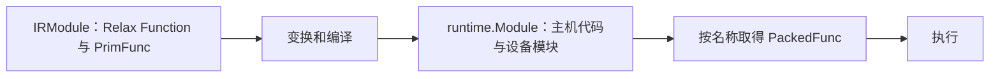

---
tags:
  - TVM
  - NPU
  - 编译器
  - Relax
  - TensorIR
status: maintained
baseline: Apache TVM v0.24.0
updated: 2026-07-29
---

# 03. IRModule 与统一对象系统

> [!abstract] 本章内容
> 本章直接说明 TVM 节点、表达式、变量、函数、模块、结构比较和源码位置。每个概念先给出严格定义，再说明字段、构造方法、使用位置与最小例子；阅读后应能区分 IRModule、BaseFunc、GlobalVar、Relax 表达式和运行时模块。

> [!important] 版本名称
> 本手册固定到 TVM v0.24.0。该版本的低层张量程序 Python 命名空间是 `tvm.tirx`，许多旧资料写作 `tvm.tir`。复制代码前先核对本地版本，不要把两个版本的类名混在同一程序中。

## 节点

节点是 TVM IR 中可由统一对象系统管理的结构化记录。一个节点由节点类型、若干字段和可选源码位置组成。节点本身不是“执行一次计算”的同义词：`TensorStructInfo` 是节点，但只描述值的结构；`VarBinding` 是节点，但负责记录变量与值的关系；`Call` 才表示一次调用。

节点常见特征如下：

- Python 对象通常只是 C++ 对象的引用包装；
- 字段由注册的节点类型定义，不应随意增加；
- Pass 通常创建替代节点或替代函数，不依赖就地修改原节点；
- 文本打印适合阅读，结构比较适合自动测试；
- `span` 保存源码位置，可用于把错误指回模型或 TVMScript。

## 表达式

表达式是“计算后产生一个值，或表示一个可被引用的值”的 IR 节点。这里的值可以是张量、标量、形状、元组、函数或运行时对象。表达式不要求立即执行；它先描述计算，编译器随后检查、改写并降低它。

Relax 表达式与 TensorIR 基础表达式处理的层级不同：

| 项目 | Relax `Expr` | TensorIR `PrimExpr` |
| --- | --- | --- |
| 描述对象 | 张量、元组、函数、形状和高层调用 | 整数、浮点数、索引、地址计算和低层内建调用 |
| 结果说明 | 主要由 `StructInfo` 给出 | 主要由 `dtype` 给出 |
| 变量 | `relax.Var`、`DataflowVar`、`GlobalVar` | `tirx.Var` |
| 调用 | `relax.Call` | `tirx.Call` |
| 常量 | `relax.Constant`、`PrimValue` 等 | `IntImm`、`FloatImm` 等 |
| 常见使用者 | Relax Pass、BYOC、Relax VM 编译 | TensorIR Pass、调度、目标代码生成 |

> [!example] 如何判断一个对象是不是表达式
> `R.add(x, y)`、`R.Tuple((x, y))` 和 `T.BufferLoad(A, [i])` 都产生值，因此属于表达式。`T.BufferStore(B, value, [i])` 改写缓冲区且不产生可继续参与加法的值，因此属于语句。

## 语句

语句表示执行顺序、控制结构或存储改写。TensorIR 使用 `Stmt` 组织循环、条件分支、缓冲区写入和块。语句通常不作为另一个算术运算的输入。Relax 主要用表达式和绑定组织程序，不采用 TensorIR 的 `Stmt` 层次。

例如，`BufferLoad(A, [i])` 是表达式，因为它产生一个元素值；`BufferStore(B, value, [i])` 是语句，因为它描述一次写入。`For` 的 `body` 也是语句，多个语句使用 `SeqStmt` 保持顺序。

## 变量与绑定

变量是带稳定身份的引用节点。名称只是供人阅读的提示，不是唯一身份。两个都显示为 `x` 的 `relax.Var` 可以是两个不同变量，因此变换代码不应仅按 `name_hint` 判断相等。

绑定把一个变量与一个表达式放在同一记录中：

```text
VarBinding(var=result, value=R.add(x, y))
```

`DataflowVar` 只在数据流块内部使用，适合局部中间结果；普通 `Var` 可作为数据流块输出并被后续代码使用。`MatchCast` 除了建立变量与值的关系，还加入运行时结构检查并处理未确定的符号尺寸。

## 函数

函数是具有参数列表、函数体、返回说明和属性的可调用程序单位。TVM 的 `BaseFunc` 是共同基类，常见具体类型是：

| 函数种类 | 函数体 | 主要用途 | 调用方式 |
| --- | --- | --- | --- |
| `relax.Function` | Relax `Expr` | 图级计算、控制流、外部子图包装 | `relax.Call` |
| `tirx.PrimFunc` | TensorIR `Stmt` | 低层循环与缓冲区程序 | 通常由 `relax.call_tir` 引用 |
| `relax.ExternFunc` | 无 TVM IR 函数体 | 引用注册表中的外部 PackedFunc | `relax.Call` 或 `call_dps_packed` |
| 运行时 PackedFunc | C++、Python 或设备模块中的可调用实现 | 执行已经编译或手工注册的功能 | 按名称查询后调用 |

函数的参数对象与调用节点的实参对象必须分开理解。`Function.params` 是形参；`Call.args` 是该次调用传入的实参。函数属性描述整个函数，调用属性只描述该次调用。

## 模块

`IRModule` 是编译阶段的程序容器，保存 `GlobalVar -> BaseFunc` 的关系、模块属性和全局信息。`runtime.Module` 是运行阶段的代码或资源容器，按名称提供函数并可导入其他运行时模块。两者名称都含 Module，但职责不同：



## 结构信息

`StructInfo` 描述 Relax 值在编译阶段可知的结构。它不只是数据类型：张量结构信息还能记录形状、维数和虚拟设备；函数结构信息记录参数、返回值及是否纯函数。

以张量为例，下列说明精确程度逐级降低：

```python
R.Tensor((1, 3, 224, 224), "float32")  # 形状、维数、数据类型都已知
R.Tensor(ndim=4, dtype="float32")       # 只知道维数和数据类型
R.Tensor(dtype="float32")               # 维数未知，数据类型已知
```

未知并不代表可任意取值。后续规范化、运算推导或运行时检查仍可能补充信息或拒绝不一致的输入。

## `span`

`Span(source_name, line, end_line, column, end_column)` 记录节点对应的源码文件和字符区间。所有位置均由前端或解析器提供。手写 IR 时可省略；开发导入器或诊断工具时应尽量保留。

| 参数 | 含义 |
| --- | --- |
| `source_name` | `SourceName` 对象，表示文件或逻辑来源 |
| `line`、`end_line` | 起始行与结束行 |
| `column`、`end_column` | 起始列与结束列 |

## 构造器、辅助函数与 TVMScript

同一个节点可能有三种创建方式：

1. 直接构造类，例如 `relax.Var("x", sinfo)`；
2. 使用辅助函数，例如 `relax.const(1.0, "float32")`；
3. 使用 TVMScript，例如函数签名中的 `R.Tensor((2, 4), "float32")`。

辅助函数通常处理 Python 值转换和默认数据类型；TVMScript 更适合编写完整模块；直接构造适合 Pass、测试和动态生成器。三种方式产生的节点可以结构相同，但传参规则不一定完全相同，应查看具体条目。

## 对象身份与结构比较

`same_as` 或底层对象身份回答“是否引用同一个节点”；`tvm.ir.structural_equal(lhs, rhs)` 回答“结构是否相同”。测试 Pass 时通常应使用结构比较，因为变换会创建新对象。

```python
import tvm
from tvm import relax

sinfo = relax.TensorStructInfo([2, 4], "float32")
x1 = relax.Var("x", sinfo)
x2 = relax.Var("x", sinfo)

assert not x1.same_as(x2)
assert not tvm.ir.structural_equal(x1, x2)
```

变量具有独立身份，因此即使名称与结构信息相同，两个新建变量也不是同一个变量。若要比较两个完整函数，结构比较会按照变量绑定关系处理名称差异。

## 规范化与合法性检查

直接构造的 `Call` 可能尚未补全 `struct_info_`。`BlockBuilder.normalize(expr)` 会调用运算的结构推导规则，返回补全后的表达式。完整模块可使用 `relax.analysis.check_well_formed(mod)` 检查变量使用、数据流块和结构信息。

```python
from tvm import relax

bb = relax.BlockBuilder()
x = relax.Var("x", relax.TensorStructInfo([2, 4], "float32"))
y = relax.Var("y", relax.TensorStructInfo([2, 4], "float32"))
raw = relax.op.add(x, y)
normalized = bb.normalize(raw)
print(normalized.struct_info_)
```

> [!warning] 不要把 Python 类型检查当作完整 IR 检查
> 构造器能检查的主要是参数对象种类。两个张量的形状是否可相加、调用输出说明是否正确、变量是否在有效作用域内，需要规范化或模块检查才能确认。

## 本手册的统一条目格式

后续每个对象按以下问题说明：

- 规范定义：该对象在 IR 中表示什么；
- 构造签名：v0.24.0 Python 接口的准确参数顺序；
- 参数：接受类型、默认值、功能和限制；
- 返回对象：构造后得到什么，可读取哪些字段；
- 必须满足的条件：哪些输入组合会被拒绝；
- 产生位置：前端、解析器、BlockBuilder 或 Pass 中谁创建它；
- 使用位置：哪个 Pass、代码生成器或运行时读取它；
- 最小例子：能单独观察字段的代码；
- 常见错误：最容易混淆的对象或参数。

## 源码和官方参考

- [Python IR API](https://tvm.apache.org/docs/reference/api/python/ir.html)
- [Python Relax API](https://tvm.apache.org/docs/reference/api/python/relax/relax.html)
- [Python TensorIR API](https://tvm.apache.org/docs/tirx/api/tirx.html)
- [IRModule 教程](https://tvm.apache.org/docs/get_started/tutorials/ir_module.html)
- [Relax 深入说明](https://tvm.apache.org/docs/deep_dive/relax/index.html)
- [`python/tvm/ir/expr.py`](https://github.com/apache/tvm/blob/v0.24.0/python/tvm/ir/expr.py)
- [`python/tvm/relax/expr.py`](https://github.com/apache/tvm/blob/v0.24.0/python/tvm/relax/expr.py)
- [`python/tvm/tirx/expr.py`](https://github.com/apache/tvm/blob/v0.24.0/python/tvm/tirx/expr.py)

## `IRModule` 与 `BaseFunc` 的构造参数

### `tvm.IRModule`

**规范定义**：编译阶段的程序容器，按全局变量保存 Relax Function 与 PrimFunc，并保存模块级属性和全局信息。

**Python 构造签名**

```text
tvm.IRModule(functions=None, attrs=None, global_infos=None)
```

### 参数

| 参数 | 接受的类型 | 默认值 | 功能与要求 |
| --- | --- | --- | --- |
| `functions` | `dict[str | GlobalVar, BaseFunc] | None` | `None` | 全局函数集合；字符串键会转换成 `GlobalVar`。 |
| `attrs` | `dict | None` | `None` | 模块级属性，非空字典会转换为 `DictAttrs`。 |
| `global_infos` | `dict | None` | `None` | 虚拟设备等全局信息。 |

### 返回对象与可观察字段

返回 `IRModule`。主要字段和接口为 `functions`、`attrs`、`global_infos`、`functions_items()`、`get_global_var()`、`update_func()` 和 `script()`。

### 必须满足的条件

- 键必须是字符串或 `GlobalVar`，值应为 `BaseFunc`。
- 模块内全局名称必须唯一。
- 变换后应检查所有全局调用仍能找到定义。

### 产生位置与使用位置

- 常见产生位置：TVMScript `@I.ir_module`、模型前端、`BlockBuilder.finalize()` 和 `IRModule.from_expr()`。
- 常见使用位置：所有模块 Pass、`tvm.compile`、Relax VM 编译、BYOC 与目标代码生成。

### 最小例子

```python
import tvm
from tvm import relax

x = relax.Var("x", relax.TensorStructInfo([2], "float32"))
func = relax.Function([x], x)
mod = tvm.IRModule({"main": func})
assert mod["main"].same_as(func)
assert mod.get_global_var("main").name_hint == "main"
```

### 常见错误

- 把 `IRModule` 与运行时模块混为一类。
- 按字符串新建全局变量后，假定它与模块已有全局变量具有相同身份。
- 原地修改函数字段而不使用新函数更新模块。

**固定版本源码**：[module.py](https://github.com/apache/tvm/blob/v0.24.0/python/tvm/ir/module.py)

### `tvm.ir.BaseFunc`

**规范定义**：所有 IR 函数节点的共同基类，统一提供函数属性的复制式更新接口。

**Python 构造签名**

```text
BaseFunc 不能直接构造；使用 relax.Function、relax.ExternFunc 或 tirx.PrimFunc
```

### 参数

| 参数 | 接受的类型 | 默认值 | 功能与要求 |
| --- | --- | --- | --- |

### 返回对象与可观察字段

具体对象由子类构造。`attrs` 读取属性；`with_attr`、`with_attrs` 和 `without_attr` 返回更新后的新函数。

### 必须满足的条件

- 不要直接实例化基类。
- 属性值必须能转换为 TVM 运行时对象。
- 调用更新接口后必须使用返回的新函数。

### 产生位置与使用位置

- 常见产生位置：Relax 与 TensorIR 函数构造器。
- 常见使用位置：IRModule、函数 Pass、Target 选择、BYOC 和代码生成。

### 最小例子

```python
from tvm import relax

x = relax.Var("x", relax.TensorStructInfo([2], "float32"))
func = relax.Function([x], x)
updated = func.with_attr("global_symbol", "main")
assert func.attrs is None or "global_symbol" not in func.attrs
assert updated.attrs["global_symbol"] == "main"
```

### 常见错误

- 调用 `func.with_attr(...)` 后忽略返回值。
- 把 `Codegen` 属性加在调用节点而不是外部函数上。

**固定版本源码**：[function.py](https://github.com/apache/tvm/blob/v0.24.0/python/tvm/ir/function.py)

## 本章参考资料

- [IRModule 教程](https://tvm.apache.org/docs/get_started/tutorials/ir_module.html)
- [Python IR API](https://tvm.apache.org/docs/reference/api/python/ir.html)
- [`python/tvm/ir/module.py`](https://github.com/apache/tvm/blob/v0.24.0/python/tvm/ir/module.py)
- [`python/tvm/ir/function.py`](https://github.com/apache/tvm/blob/v0.24.0/python/tvm/ir/function.py)

## 实现说明与验证步骤

> [!note] 依据与适用范围
> 本节依据所列 Apache TVM 官方资料和 v0.24.0 源码整理，给出输入条件、操作步骤、预期结果、异常处理和自研 NPU 适配要求。接口细节以固定版本源码与测试为准，在线页面用于补充说明。

### 03.A 目标与适用范围

建立包含两个全局函数的模块，然后用名称和 `GlobalVar` 两种方式取出函数。该例用来区分全局名称、函数对象和调用位置。

参考样本保持输入规模较小，以便直接检查对象、字段和输出。首次执行时不要同时加入图改写、外部代码生成和真实设备执行；应先确认当前阶段的输入与输出，再增加后续处理。建议为该项验证建立独立目录，保存命令、标准输出、IR、编译产物摘要和环境信息。

### 03.B 参考实现

**官方依据：** [IRModule 入门](https://tvm.apache.org/docs/get_started/tutorials/ir_module.html) 与 [TVMScript](https://tvm.apache.org/docs/arch/tvmscript.html)。

**v0.24.0 源码位置：** `docs/get_started/tutorials/ir_module.py`、`src/ir/module.cc`、`python/tvm/ir/module.py`。

```python
import tvm
from tvm.script import ir as I
from tvm.script import relax as R

@I.ir_module
class TwoFunctions:
    @R.function
    def twice(x: R.Tensor((4,), "float32")):
        return R.add(x, x)

    @R.function
    def main(x: R.Tensor((4,), "float32")):
        return TwoFunctions.twice(x)

gv = TwoFunctions.get_global_var("twice")
assert TwoFunctions["twice"] == TwoFunctions[gv]
print([str(x.name_hint) for x in TwoFunctions.get_global_vars()])
print(TwoFunctions.script())
```

按以下顺序执行：

1. 在新进程中确认 `tvm.__file__`、动态库路径和 TVM 提交，避免受到旧进程注册状态影响；
2. 将参考实现保存到单独文件，只补充本节明确要求的输入对象，不先加入额外优化；
3. 执行后保存完整输出；若生成 IR，同时保存 `script(show_meta=True)` 的文本；
4. 把输出与下面的预期现象逐项比较，不以“没有抛出异常”代替功能检查；
5. 重复执行一次并比较主要产物，确认结果没有依赖临时全局状态或未固定的遍历顺序。

> [!success] 预期现象
> 全局变量列表中应出现 `twice` 与 `main`。两种索引方式取得同一函数，但调用处使用的是 `GlobalVar`，并非复制函数正文。重命名、删除或替换函数时必须同步处理引用。

> [!tip] 输出检查顺序
> 先看对象类型和函数数量，再看属性、调用形式、形状与数据类型，最后看运行结果或编译产物。若前一项不符合预期，先停止后续步骤。这样能把问题限定在最早出现差异的阶段。

### 03.C 单项条件验证

尝试把新的同名函数加入模块，并分别使用检查模式和更新模式。记录冲突发生的位置，理解为何编译器不能静默保留两个同名全局函数。

执行条件变化样本时，复制参考实现的输入与环境，只修改上文指出的一项。对两个输出进行结构比较，并记录以下四项：

1. 第一次出现差异的是哪一个阶段？
2. 差异表现为函数、属性、形状、数据类型、编译产物还是运行结果？
3. 当前行为是明确拒绝、交给其他后端执行，还是编译错误？
4. 日志是否足以让另一位开发者不查看本次进程状态也能复现？

如果同时观察到多个变化，应继续缩小条件变化样本。参考实现用于确认正常处理，单项条件验证用于确认系统为何接受、拒绝或转交当前输入。

### 03.D 自研 NPU 适配要求

外部 NPU 函数也是模块中的全局函数。分区后检查它的 `Codegen`、`global_symbol`、参数和返回 `StructInfo`，并验证主函数只通过全局调用使用它。

改造时建议保留三份相互独立的输入：最小 Relax 或 TensorIR、设备编译器输入、运行时调用输入。三份输入使用同一个样本编号，并记录转换前后的关键字段。这样可以分别测试 TVM 变换、NPU 编译器和驱动，不需要每次都运行完整模型。

至少补充以下样本：

- 一个完全满足能力要求的正向样本；
- 一个只改变数据类型的反向样本；
- 一个只改变形状或属性的反向样本；
- 一个包含主机与 NPU 混合执行的样本；
- 一个导出后在新进程加载的样本；
- 若支持动态尺寸，再增加最小值、常用值和最大值附近的样本。

### 03.E 源码定位

从上文列出的源码位置选择一个公开 API，依次找到 Python 调用、FFI 注册、C++ 实现和测试。记录函数签名、主要输入、主要输出、会写入的模块属性以及失败方式。若名称只在文档出现而源码中找不到，继续搜索注册字符串、属性键或错误文本。

> [!important] 验证项目
> 1. 执行前记录参考实现的对象关系；2. 执行后用实际输出修正记录；3. 增加一个会被明确拒绝的输入；4. 标明自研 NPU 接入需要修改的层次与保持不变的层次；5. 把结果整理成可由自动测试检查的断言。

### 03.F 检查清单

- [ ] 示例可在固定 v0.24.0 环境重复执行，或已明确列出所需可选依赖；
- [ ] 预期现象包含可检查的结构、字段或数值，不只是“运行成功”；
- [ ] 单条件变化能触发预期的拒绝、转交或结构差异；
- [ ] 能从官方页面定位到固定版本源码和测试；
- [ ] NPU 改造说明包含编译阶段、运行阶段与部署阶段；
- [ ] 失败时保留最小输入、环境、阶段输出和第一个错误。
