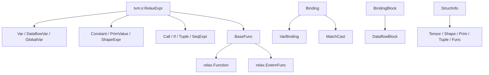

---
tags:
  - TVM
  - NPU
  - 编译器
  - Relax
  - TensorIR
status: maintained
baseline: Apache TVM v0.24.0
updated: 2026-07-29
---

# 04. Relax 图级 IR

> [!abstract] 本章内容
> 本章从零定义 Relax 的表达式、变量、调用、绑定、数据流块、顺序表达式、函数和结构信息。每个名词都在本章首次出现的位置给出构造签名、参数、字段、约束、产生位置、使用位置、最小例子与常见错误，不再要求读者跳到其他章节查找基础定义。

## 先建立一组严格定义

### Relax IR

Relax IR 是 TVM 用来描述模型级计算的中间表示。它记录函数、张量与其他值之间的依赖关系、控制流、形状信息、数据类型和函数属性。Relax IR 主要回答“要计算什么”和“各个值之间是什么关系”，低层循环与缓冲区访问由 TensorIR 表示。

### 表达式 `Expr`

表达式是表示一个值，或表示一项会产生值的计算的 IR 节点。Relax Python API 中的 `relax.Expr` 是 `tvm.ir.RelaxExpr` 的别名。变量、常量、调用、元组、条件表达式、顺序表达式和函数都属于 Relax 表达式。

表达式描述程序，不等同于立即执行一次 Python 运算。例如：

```python
from tvm import relax

x = relax.Var("x", relax.TensorStructInfo([2, 4], "float32"))
y = relax.Var("y", relax.TensorStructInfo([2, 4], "float32"))
call = relax.op.add(x, y)
```

这行代码创建一个表示加法的 Relax `Call` 节点；它不会在创建节点时读取 `x` 和 `y` 的张量数据。

### 值

值是 Relax 程序在执行时可以产生、保存或传递的对象。常见值包括张量、基础标量、形状、元组、函数和通用运行时对象。每种值可由相应 `StructInfo` 描述其编译阶段已知结构。

### 变量 `Var`

变量是对一个 Relax 值的具名引用。变量由内部 `Id` 保持身份，`name_hint` 只用于打印和诊断。两个都打印成 `x` 的新变量仍是两个不同对象。

### 调用 `Call`

调用是把一组实参传给某个可调用对象的表达式。`Call.op` 指明被调用对象，`Call.args` 保存位置实参，`Call.attrs` 保存该次调用的属性，`Call.sinfo_args` 只为特定内建调用或外部调用补充结构信息。

### 绑定 `Binding`

绑定记录“哪个变量由哪个表达式定义”。`VarBinding(var, value)` 是变量定义记录，不是可反复改写同一存储位置的命令。绑定本身不是表达式，不能作为加法或函数调用的实参。

### 绑定块 `BindingBlock`

绑定块按顺序保存多个绑定。普通 `BindingBlock` 可包含具有可观察副作用或控制流的绑定；`DataflowBlock` 只应包含没有可观察副作用且没有控制流的纯计算，因此编译器可以在依赖关系允许时删除、融合或调整其中的绑定。

### 数据流变量 `DataflowVar`

数据流变量是只在一个 `DataflowBlock` 内部使用的局部变量。需要传到块外的结果必须由普通 `Var` 承接。在 TVMScript 中，`R.output(out)` 声明哪些普通变量是数据流块输出。

### 顺序表达式 `SeqExpr`

顺序表达式由若干绑定块和一个最终结果表达式组成。字段 `blocks` 保存绑定块列表，字段 `body` 给出整个表达式的返回值。规范化后的 Relax Function 常以 `SeqExpr` 作为函数体。

### 函数 `Function`

Relax Function 是可调用的图级程序单位。它包含形参列表 `params`、函数体 `body`、返回结构 `ret_struct_info`、纯函数标志 `is_pure`、函数属性 `attrs` 和源码位置 `span`。函数的形参与一次调用的实参是两组不同对象。

### 结构信息 `StructInfo`

结构信息描述一个 Relax 值在编译阶段已知的结构。它可以说明张量形状、数据类型、维数、虚拟设备、元组字段或函数参数与返回值。结构信息不是运行时张量，也不执行计算。

## 最小程序中的对象关系

```python
from tvm.script import ir as I
from tvm.script import relax as R

@I.ir_module
class SmallModule:
    @R.function
    def main(
        x: R.Tensor((2, 4), "float32"),
        y: R.Tensor((2, 4), "float32"),
    ) -> R.Tensor((2, 4), "float32"):
        with R.dataflow():
            lv = R.add(x, y)
            out = R.nn.relu(lv)
            R.output(out)
        return out
```

逐项对应如下：

| TVMScript 片段 | 产生的主要对象 | 准确定义 |
| --- | --- | --- |
| `@I.ir_module` | `IRModule` | 保存全局函数的编译阶段容器 |
| `@R.function` | `relax.Function` | 具有形参、函数体和返回结构的图级函数 |
| `x`、`y` | `relax.Var` | 函数形参值的引用 |
| `R.Tensor(...)` | `TensorStructInfo` | 张量形状与数据类型说明 |
| `R.add(x, y)` | `relax.Call` | 对已注册 Relax 运算的调用 |
| `lv` | `DataflowVar` | 数据流块内部中间值 |
| `out` | 普通 `Var` | 可从数据流块传出的结果 |
| `R.output(out)` | 数据流块输出声明 | 允许 `out` 在块外继续使用 |
| `return out` | `SeqExpr.body` 对应的结果 | 整个函数的返回值 |

下面各节对这些对象的字段和参数逐一展开。

> [!abstract] 查阅方式
> 本章给出 v0.24.0 Relax 核心对象的规范定义和准确构造签名。第一次阅读建议先看 `Var`、`Call`、`VarBinding`、`DataflowBlock`、`SeqExpr`、`Function` 与 `TensorStructInfo`，再看常量、元组、控制流和外部函数。

> [!note] 字段名称保持源码拼写
> 参数表中的 `name_hint`、`struct_info`、`sinfo_args`、`ret_struct_info` 等名称必须按 Python API 原样使用。中文说明只解释功能，不改写源码标识符。

## 对象关系



## `tvm.ir.GlobalVar`

**规范定义**：IRModule 中全局函数的稳定引用。它本身不是函数实现，而是用来查找或调用模块内函数的全局标识。

**Python 构造签名**

```text
tvm.ir.GlobalVar(name_hint: str)
```

### 参数

| 参数 | 接受的类型 | 默认值 | 功能与要求 |
| --- | --- | --- | --- |
| `name_hint` | `str` | 无 | 供阅读和全局查找使用的名称。模块内同名全局变量必须保持唯一。 |

### 返回对象与可观察字段

返回 `GlobalVar`。主要字段是 `name_hint`；作为被调用对象时会产生 `relax.Call`，以基础表达式实参调用时也可生成 TensorIR 调用。

### 必须满足的条件

- 必须提供字符串名称。
- 调用时全部实参应同属 Relax 表达式，或全部属于基础表达式；混合传入会失败。

### 产生位置与使用位置

- 常见产生位置：TVMScript 解析、`IRModule` 用字符串键构造、`BlockBuilder.add_func`。
- 常见使用位置：`IRModule.__getitem__`、`relax.Call`、`call_tir`、函数重命名与外部代码生成 Pass。

### 最小例子

```python
import tvm
from tvm import relax

gv = tvm.ir.GlobalVar("main")
x = relax.Var("x", relax.TensorStructInfo([2, 4], "float32"))
call = gv(x)
assert call.op.same_as(gv)
```

### 常见错误

- 把 `name_hint` 当作局部变量身份。
- 创建新的同名 `GlobalVar` 后，直接假定它与模块中原对象是同一个对象。

**固定版本源码**：[expr.py](https://github.com/apache/tvm/blob/v0.24.0/python/tvm/ir/expr.py)

## `relax.Var`

**规范定义**：Relax 局部变量或函数形参。变量用内部 `Id` 保持身份，`name_hint` 只负责可读显示。

**Python 构造签名**

```text
relax.Var(name_hint: str | Id, struct_info: StructInfo | None = None, span: Span | None = None)
```

### 参数

| 参数 | 接受的类型 | 默认值 | 功能与要求 |
| --- | --- | --- | --- |
| `name_hint` | `str | relax.Id` | 无 | 变量名称提示，通常传字符串。`Id` 由现有变量内部提供，不能直接构造。 |
| `struct_info` | `StructInfo | None` | `None` | 该变量的结构说明；函数形参通常应显式提供。 |
| `span` | `Span | None` | `None` | 可选源码位置。 |

### 返回对象与可观察字段

返回 `Var`。常用字段或属性为 `vid`、`name_hint`、`struct_info_`、`span`。

### 必须满足的条件

- `struct_info` 若非空，必须已经是 `StructInfo`；形状列表不能直接当成此参数。
- 同名变量仍可具有不同身份。

### 产生位置与使用位置

- 常见产生位置：前端导入器、TVMScript 参数解析、BlockBuilder 和手写 Pass。
- 常见使用位置：`Function.params`、`VarBinding`、`Call.args`、自由变量分析和数据流分析。

### 最小例子

```python
from tvm import relax

sinfo = relax.TensorStructInfo([1, 16], "float16")
x = relax.Var("x", sinfo)
assert x.name_hint == "x"
assert x.struct_info_.dtype == "float16"
```

### 常见错误

- 把 `[1, 16]` 直接传给 `struct_info`。
- 按变量显示名称维护替换表，导致同名变量被错误替换。

**固定版本源码**：[expr.py](https://github.com/apache/tvm/blob/v0.24.0/python/tvm/relax/expr.py)

## `relax.DataflowVar`

**规范定义**：仅供 `DataflowBlock` 内部使用的局部中间变量。它标记该值不应直接从数据流块外部引用。

**Python 构造签名**

```text
relax.DataflowVar(name_hint: str | Id, struct_info: StructInfo | None = None, span: Span | None = None)
```

### 参数

| 参数 | 接受的类型 | 默认值 | 功能与要求 |
| --- | --- | --- | --- |
| `name_hint` | `str | relax.Id` | 无 | 变量名称提示。 |
| `struct_info` | `StructInfo | None` | `None` | 中间值的结构说明。 |
| `span` | `Span | None` | `None` | 可选源码位置。 |

### 返回对象与可观察字段

返回 `DataflowVar`，它是 `relax.Var` 的子类，具有相同主要字段。

### 必须满足的条件

- 定义与使用应位于同一个数据流块有效范围内。
- 需要从数据流块输出的值应绑定到普通 `Var`。

### 产生位置与使用位置

- 常见产生位置：TVMScript `R.dataflow()`、`BlockBuilder.emit`。
- 常见使用位置：数据流分析、融合、消除无用绑定和 `BlockBuilder.emit_output`。

### 最小例子

```python
from tvm import relax

sinfo = relax.TensorStructInfo([2, 8], "float32")
lv = relax.DataflowVar("lv", sinfo)
assert isinstance(lv, relax.Var)
```

### 常见错误

- 把它用作函数公开返回变量后仍在块外直接引用。
- 认为它与普通 `Var` 只在打印名称上不同。

**固定版本源码**：[expr.py](https://github.com/apache/tvm/blob/v0.24.0/python/tvm/relax/expr.py)

## `relax.Constant`

**规范定义**：保存不可改变张量数据的 Relax 表达式。标量张量以零维张量表示，不能把它与 `PrimValue` 混为一类。

**Python 构造签名**

```text
relax.Constant(data: tvm.runtime.Tensor, struct_info: StructInfo | None = None, span: Span | None = None)
```

### 参数

| 参数 | 接受的类型 | 默认值 | 功能与要求 |
| --- | --- | --- | --- |
| `data` | `tvm.runtime.Tensor` | 无 | 常量实际数据。 |
| `struct_info` | `StructInfo | None` | `None` | 可选结构说明；省略时从数据推导。 |
| `span` | `Span | None` | `None` | 可选源码位置。 |

### 返回对象与可观察字段

返回 `Constant`。`data` 保存运行时张量；结构信息通常包含数据形状与数据类型。

### 必须满足的条件

- 直接构造时 `data` 必须是 TVM 运行时张量。
- 提供的结构信息必须与实际数据一致。

### 产生位置与使用位置

- 常见产生位置：模型导入器、参数绑定、常量折叠和 `relax.const`。
- 常见使用位置：常量折叠、BYOC 常量收集、代码生成与运行时参数准备。

### 最小例子

```python
import numpy as np
from tvm import relax

c = relax.const(np.array([[1, 2]], dtype="float32"))
assert c.data.shape == (1, 2)
```

### 常见错误

- 直接调用类构造器却传入 NumPy 数组；此时应优先使用 `relax.const`。
- 把 Python 整数常量默认推断的数据类型想当然地视为 `int64`。

**固定版本源码**：[expr.py](https://github.com/apache/tvm/blob/v0.24.0/python/tvm/relax/expr.py)

## `relax.const`

**规范定义**：把 Python 标量、NumPy 数组或 TVM 运行时张量转换为 `relax.Constant` 的辅助函数。

**Python 构造签名**

```text
relax.const(value: bool | int | float | numpy.ndarray | tvm.runtime.Tensor, dtype: str | None = None) -> relax.Constant
```

### 参数

| 参数 | 接受的类型 | 默认值 | 功能与要求 |
| --- | --- | --- | --- |
| `value` | `bool | int | float | numpy.ndarray | runtime.Tensor` | 无 | 要写入 IR 的常量值。 |
| `dtype` | `str | None` | `None` | 目标数据类型；省略时整数默认 `int32`，浮点数默认 `float32`，布尔值默认 `bool`。 |

### 返回对象与可观察字段

返回 `relax.Constant`，数据位于 CPU 运行时张量中。

### 必须满足的条件

- 显式数据类型必须能表示输入数据。
- 大型模型权重会增加 IR 与导出产物体积，应按编译流程的参数策略处理。

### 产生位置与使用位置

- 常见产生位置：用户代码、前端导入器和 `Function.bind_params`。
- 常见使用位置：所有接受张量表达式的 Relax 运算，以及参数提取和外部代码生成。

### 最小例子

```python
from tvm import relax

one = relax.const(1)
half = relax.const(0.5, "float16")
assert one.struct_info_.dtype == "int32"
assert half.struct_info_.dtype == "float16"
```

### 常见错误

- 省略 `dtype` 后假定 Python 整数保留 Python 的任意精度。
- 把 `relax.const(3)` 当作 `PrimValue(3)`；前者是零维张量。

**固定版本源码**：[expr.py](https://github.com/apache/tvm/blob/v0.24.0/python/tvm/relax/expr.py)

## `relax.PrimValue`

**规范定义**：把一个基础表达式包装为 Relax 值，常用于动态尺寸、标量配置和运行时张量字段。

**Python 构造签名**

```text
relax.PrimValue(value: tvm.tirx.PrimExpr | int, span: Span | None = None)
```

### 参数

| 参数 | 接受的类型 | 默认值 | 功能与要求 |
| --- | --- | --- | --- |
| `value` | `tirx.PrimExpr | int` | 无 | 要包装的基础值；Python 整数转换为 `int64` 的 `IntImm`。 |
| `span` | `Span | None` | `None` | 可选源码位置。 |

### 返回对象与可观察字段

返回 `PrimValue`，`value` 字段保存基础表达式。

### 必须满足的条件

- 不接受普通浮点数作为该构造器的自动输入。
- 它描述基础值，不保存张量存储。

### 产生位置与使用位置

- 常见产生位置：动态尺寸处理、`Expr.shape[i]` 相关构造、手写 Relax IR。
- 常见使用位置：形状相关内建运算、`tir_vars`、标量运算与运行时检查。

### 最小例子

```python
from tvm import relax

n = relax.PrimValue(16)
assert n.value.dtype == "int64"
```

### 常见错误

- 与零维 `Constant` 混用。
- 把它直接当 Python 整数参与宿主语言分支。

**固定版本源码**：[expr.py](https://github.com/apache/tvm/blob/v0.24.0/python/tvm/relax/expr.py)

## `relax.StringImm`

**规范定义**：把字符串字面量保存为 Relax 值的表达式。它适合把数据类型名称、运行时选项或其他字符串值传给明确接纳字符串的运算。

**Python 构造签名**

```text
relax.StringImm(value: str, span: Span | None = None)
```

### 参数

| 参数 | 接受的类型 | 默认值 | 功能与要求 |
| --- | --- | --- | --- |
| `value` | `str` | 无 | 字符串内容。 |
| `span` | `Span | None` | `None` | 可选源码位置。 |

### 返回对象与可观察字段

返回 `StringImm`。字段 `value` 保存字符串，`span` 保存可选源码位置。

### 必须满足的条件

- 只有明确接纳字符串值的运算才能使用该对象。
- 不要用它代替函数属性中的普通字符串而不核对属性类型。

### 产生位置与使用位置

- 常见产生位置：TVMScript 字符串值、前端导入器和运行时内建调用构造。
- 常见使用位置：Relax 内建运算、VM 编译与外部运行时调用。

### 最小例子

```python
from tvm import relax

mode = relax.StringImm("nearest")
assert str(mode.value) == "nearest"
```

### 常见错误

- 把 Python 字符串直接加入 `Call.args`，却没有确认辅助接口会自动转换。
- 把它与 `DataTypeImm` 混为一类。

**固定版本源码**：[expr.py](https://github.com/apache/tvm/blob/v0.24.0/python/tvm/relax/expr.py)

## `relax.DataTypeImm`

**规范定义**：把数据类型本身保存为 Relax 值的表达式。它描述例如 `float16` 这一数据类型值，不表示一个 `float16` 张量。

**Python 构造签名**

```text
relax.DataTypeImm(value: tvm.DataType | str, span: Span | None = None)
```

### 参数

| 参数 | 接受的类型 | 默认值 | 功能与要求 |
| --- | --- | --- | --- |
| `value` | `tvm.DataType | str` | 无 | TVM 可识别的数据类型。 |
| `span` | `Span | None` | `None` | 可选源码位置。 |

### 返回对象与可观察字段

返回 `DataTypeImm`。字段 `value` 是规范化后的 `DataType`。

### 必须满足的条件

- 字符串必须是 TVM 可识别的数据类型。
- 该对象不能替代 `TensorStructInfo.dtype` 字段中的字符串参数。

### 产生位置与使用位置

- 常见产生位置：数据类型检查运算、TVMScript 和手写 Relax IR。
- 常见使用位置：张量信息读取、数据类型相关内建调用和 VM 编译。

### 最小例子

```python
from tvm import relax

dtype_value = relax.DataTypeImm("float16")
assert str(dtype_value.value) == "float16"
```

### 常见错误

- 把数据类型值理解成具有该数据类型的标量数据。
- 在要求普通字符串参数的位置盲目传入 `DataTypeImm`。

**固定版本源码**：[expr.py](https://github.com/apache/tvm/blob/v0.24.0/python/tvm/relax/expr.py)

## `relax.ShapeExpr`

**规范定义**：保存一组基础整数表达式的 Relax 形状值。每个元素表示对应维度的长度。

**Python 构造签名**

```text
relax.ShapeExpr(values: list[tvm.tirx.PrimExpr] | tuple[tvm.tirx.PrimExpr, ...] | tvm_ffi.Array, span: Span | None = None)
```

### 参数

| 参数 | 接受的类型 | 默认值 | 功能与要求 |
| --- | --- | --- | --- |
| `values` | `list[PrimExpr] | tuple[PrimExpr, ...] | tvm_ffi.Array` | 无 | 按张量维度顺序排列的长度表达式。 |
| `span` | `Span | None` | `None` | 可选源码位置。 |

### 返回对象与可观察字段

返回 `ShapeExpr`。`values` 可按下标读取，`len(obj)` 返回维数。

### 必须满足的条件

- 元素应是可用于尺寸的整数基础表达式。
- 维度次序必须与张量布局及算子定义一致。

### 产生位置与使用位置

- 常见产生位置：TensorStructInfo 构造、TVMScript 解析、形状推导和 `call_tir` 参数准备。
- 常见使用位置：结构信息、动态尺寸计算、`MatchCast` 和 TensorIR 调用。

### 最小例子

```python
from tvm import relax, tirx

n = tirx.Var("n", "int64")
shape = relax.ShapeExpr([n, 64])
assert len(shape) == 2
```

### 常见错误

- 把形状值和张量值当成同一对象。
- 将排列顺序不一致的尺寸直接传给后端。

**固定版本源码**：[expr.py](https://github.com/apache/tvm/blob/v0.24.0/python/tvm/relax/expr.py)

## `relax.Tuple`

**规范定义**：按固定顺序组合多个 Relax 表达式的值。字段可具有不同结构信息。

**Python 构造签名**

```text
relax.Tuple(fields: list[Expr] | tuple[Expr, ...], span: Span | None = None)
```

### 参数

| 参数 | 接受的类型 | 默认值 | 功能与要求 |
| --- | --- | --- | --- |
| `fields` | `list[Expr] | tuple[Expr, ...]` | 无 | 元组字段，顺序属于程序定义的一部分。 |
| `span` | `Span | None` | `None` | 可选源码位置。 |

### 返回对象与可观察字段

返回 `Tuple`。可读取 `fields`，也可使用 `len` 与整数下标。

### 必须满足的条件

- 每个字段都必须能转换为 Relax 表达式。
- 下标范围为 `[-len, len-1]`。

### 产生位置与使用位置

- 常见产生位置：多返回值算子、`call_tir` 实参包装、前端导入器和数据流块输出。
- 常见使用位置：`TupleGetItem`、调用参数拆分、结构推导和虚拟机。

### 最小例子

```python
from tvm import relax

x = relax.Var("x", relax.TensorStructInfo([2], "float32"))
y = relax.Var("y", relax.TensorStructInfo([2], "float32"))
pair = relax.Tuple([x, y])
assert pair[1].same_as(y)
```

### 常见错误

- 假定元组中的张量必须具有相同形状。
- 改变字段顺序后未同步修改运行时参数读取。

**固定版本源码**：[expr.py](https://github.com/apache/tvm/blob/v0.24.0/python/tvm/relax/expr.py)

## `relax.TupleGetItem`

**规范定义**：从元组表达式中选取一个固定位置的字段。

**Python 构造签名**

```text
relax.TupleGetItem(tuple_value: Expr, index: int, span: Span | None = None)
```

### 参数

| 参数 | 接受的类型 | 默认值 | 功能与要求 |
| --- | --- | --- | --- |
| `tuple_value` | `Expr` | 无 | 产生元组值的表达式。 |
| `index` | `int` | 无 | 编译阶段已知的字段编号。 |
| `span` | `Span | None` | `None` | 可选源码位置。 |

### 返回对象与可观察字段

返回 `TupleGetItem`。字段为 `tuple_value`、`index` 和 `span`。

### 必须满足的条件

- 输入的结构信息应为 `TupleStructInfo`。
- 下标必须在字段范围内。

### 产生位置与使用位置

- 常见产生位置：Python 下标操作、TVMScript、规范化和多返回值处理。
- 常见使用位置：融合、死代码删除、结构推导和运行时指令生成。

### 最小例子

```python
from tvm import relax

x = relax.Var("x", relax.TensorStructInfo([1], "float32"))
item = relax.TupleGetItem(relax.Tuple([x]), 0)
assert item.index == 0
```

### 常见错误

- 用动态 Relax 值作为 `index`；此参数必须是 Python 整数。
- 输入不是元组却等待运行时再报错。

**固定版本源码**：[expr.py](https://github.com/apache/tvm/blob/v0.24.0/python/tvm/relax/expr.py)

## `relax.Call`

**规范定义**：表示一次 Relax 调用。被调用对象可以是已注册 `Op`、全局函数、本地函数值、函数变量或外部函数。

**Python 构造签名**

```text
relax.Call(op: Expr | tvm.ir.Op, args: list[Expr] | tuple[Expr, ...], attrs: tvm.ir.Attrs | None = None, sinfo_args: list[StructInfo] | tuple[StructInfo, ...] | None = None, span: Span | None = None)
```

### 参数

| 参数 | 接受的类型 | 默认值 | 功能与要求 |
| --- | --- | --- | --- |
| `op` | `Expr | tvm.ir.Op` | 无 | 被调用对象。 |
| `args` | `list[Expr] | tuple[Expr, ...]` | 无 | 按函数签名顺序传入的实参。 |
| `attrs` | `tvm.ir.Attrs | None` | `None` | 该次调用的命名属性；普通函数参数不放在这里。 |
| `sinfo_args` | `list[StructInfo] | tuple[StructInfo, ...] | None` | `None` | 仅特定内建调用和外部函数需要的输出结构说明。 |
| `span` | `Span | None` | `None` | 可选源码位置。 |

### 返回对象与可观察字段

返回 `Call`。主要字段是 `op`、`args`、`attrs`、`sinfo_args`、`struct_info_` 和 `span`。

### 必须满足的条件

- 实参数量与结构必须符合被调用对象的定义。
- `sinfo_args` 通常不应为普通 Relax 运算手工填写。
- 直接构造后可能需要规范化才能得到结果结构信息。

### 产生位置与使用位置

- 常见产生位置：Relax 运算辅助函数、函数对象调用、前端导入器和 Pass。
- 常见使用位置：结构推导、融合、BYOC 模式检查、低层转换和 VM 编译。

### 最小例子

```python
import tvm
from tvm import relax

x = relax.Var("x", relax.TensorStructInfo([2], "float32"))
y = relax.Var("y", relax.TensorStructInfo([2], "float32"))
add_op = tvm.ir.Op.get("relax.add")
call = relax.Call(add_op, [x, y])
normalized = relax.BlockBuilder().normalize(call)
assert normalized.struct_info_.dtype == "float32"
```

### 常见错误

- 把输出形状放进普通运算的 `attrs`。
- 把 `op` 的名称字符串直接当作 `tvm.ir.Op`。
- 未规范化就假定 `struct_info_` 已填写。

**固定版本源码**：[expr.py](https://github.com/apache/tvm/blob/v0.24.0/python/tvm/relax/expr.py)

## `relax.If`

**规范定义**：有返回值的条件表达式。运行时只选择并执行一个分支，整个节点产生被选分支的结果。

**Python 构造签名**

```text
relax.If(cond: Expr, true_branch: Expr, false_branch: Expr, span: Span | None = None)
```

### 参数

| 参数 | 接受的类型 | 默认值 | 功能与要求 |
| --- | --- | --- | --- |
| `cond` | `Expr` | 无 | 标量布尔条件。 |
| `true_branch` | `Expr` | 无 | 条件为真时计算的表达式。 |
| `false_branch` | `Expr` | 无 | 条件为假时计算的表达式。 |
| `span` | `Span | None` | `None` | 可选源码位置。 |

### 返回对象与可观察字段

返回 `If`。规范化后结果结构信息应能同时接纳两个分支的结果。

### 必须满足的条件

- 条件必须能解释为标量布尔值。
- 两个分支的结果结构必须兼容。
- 分支内变量的有效范围不能泄漏到节点外。

### 产生位置与使用位置

- 常见产生位置：前端控制流导入、TVMScript 条件表达式和控制流 Pass。
- 常见使用位置：合法性检查、控制流变换、VM 编译和 BYOC 分区。

### 最小例子

```python
from tvm import relax

cond = relax.Var("cond", relax.PrimStructInfo("bool"))
x = relax.PrimValue(1)
y = relax.PrimValue(2)
expr = relax.If(cond, x, y)
```

### 常见错误

- 把 Python `if` 与 Relax `If` 混为一类。
- 两个分支返回字段数量不同的元组。
- 假定 BYOC 后端一定能接纳控制流。

**固定版本源码**：[expr.py](https://github.com/apache/tvm/blob/v0.24.0/python/tvm/relax/expr.py)

## `relax.VarBinding`

**规范定义**：把右侧表达式结果赋给一个 Relax 变量的绑定记录。它是 IR 结构，不等同于执行时的可变赋值。

**Python 构造签名**

```text
relax.VarBinding(var: relax.Var, value: Expr, span: Span | None = None)
```

### 参数

| 参数 | 接受的类型 | 默认值 | 功能与要求 |
| --- | --- | --- | --- |
| `var` | `relax.Var` | 无 | 接收结果的变量。 |
| `value` | `Expr` | 无 | 用于定义该变量的表达式。 |
| `span` | `Span | None` | `None` | 可选源码位置。 |

### 返回对象与可观察字段

返回 `VarBinding`，字段是 `var`、`value` 和 `span`。

### 必须满足的条件

- 变量在所属函数范围内通常只定义一次。
- 变量结构信息必须能接纳右侧结果。

### 产生位置与使用位置

- 常见产生位置：TVMScript 赋值、`BlockBuilder.emit`、A-normal form 规范化。
- 常见使用位置：数据流分析、表达式访问器、融合、常量折叠和代码生成。

### 最小例子

```python
from tvm import relax

sinfo = relax.TensorStructInfo([2], "float32")
x = relax.Var("x", sinfo)
y = relax.Var("y", sinfo)
z = relax.Var("z", sinfo)
binding = relax.VarBinding(z, relax.op.add(x, y))
assert binding.var.same_as(z)
```

### 常见错误

- 把绑定理解为可重复改写同一变量的命令。
- 在变量定义之前读取它。

**固定版本源码**：[expr.py](https://github.com/apache/tvm/blob/v0.24.0/python/tvm/relax/expr.py)

## `relax.MatchCast`

**规范定义**：建立变量绑定，同时要求运行时值符合给定结构说明，并可确定其中尚未给定的符号尺寸。

**Python 构造签名**

```text
relax.MatchCast(var: relax.Var, value: Expr, struct_info: StructInfo, span: Span | None = None)
```

### 参数

| 参数 | 接受的类型 | 默认值 | 功能与要求 |
| --- | --- | --- | --- |
| `var` | `relax.Var` | 无 | 检查成功后接收值的变量。 |
| `value` | `Expr` | 无 | 被检查的输入值。 |
| `struct_info` | `StructInfo` | 无 | 期望结构。 |
| `span` | `Span | None` | `None` | 可选源码位置。 |

### 返回对象与可观察字段

返回 `MatchCast`，字段包括 `var`、`value`、`struct_info` 和 `span`。

### 必须满足的条件

- 目标变量的说明应与 `struct_info` 一致。
- 重复出现的符号尺寸必须相等，否则运行时检查失败。

### 产生位置与使用位置

- 常见产生位置：动态形状导入器、TVMScript `R.match_cast` 和形状处理 Pass。
- 常见使用位置：合法性检查、动态形状转换和 VM 编译。

### 最小例子

```python
from tvm import relax, tirx

n = tirx.Var("n", "int64")
x = relax.Var("x", relax.TensorStructInfo(ndim=2, dtype="float32"))
y = relax.Var("y", relax.TensorStructInfo([n, 16], "float32"))
binding = relax.MatchCast(y, x, y.struct_info_)
```

### 常见错误

- 把它当成只改变显示类型而不做运行时检查。
- 在不同位置用同一个符号名称表达本应独立的尺寸。

**固定版本源码**：[expr.py](https://github.com/apache/tvm/blob/v0.24.0/python/tvm/relax/expr.py)

## `relax.BindingBlock`

**规范定义**：按顺序保存一组 Relax 绑定的普通块。块内允许包含具有可观察副作用或控制流的绑定。

**Python 构造签名**

```text
relax.BindingBlock(bindings: list[Binding], span: Span | None = None)
```

### 参数

| 参数 | 接受的类型 | 默认值 | 功能与要求 |
| --- | --- | --- | --- |
| `bindings` | `list[Binding]` | 无 | 按定义顺序排列的绑定。 |
| `span` | `Span | None` | `None` | 可选源码位置。 |

### 返回对象与可观察字段

返回 `BindingBlock`，`bindings` 字段保存绑定列表。

### 必须满足的条件

- 每个绑定只能使用已经有效的变量。
- 绑定顺序对于有副作用的调用不可任意调整。

### 产生位置与使用位置

- 常见产生位置：TVMScript、BlockBuilder 和规范化 Pass。
- 常见使用位置：`SeqExpr`、表达式访问器、VM 编译和各种图级 Pass。

### 最小例子

```python
from tvm import relax

sinfo = relax.TensorStructInfo([2], "float32")
x = relax.Var("x", sinfo)
y = relax.Var("y", sinfo)
block = relax.BindingBlock([relax.VarBinding(y, x)])
```

### 常见错误

- 把普通块当作所有绑定都可自由换序的数据流块。
- 手工重排具有副作用的调用。

**固定版本源码**：[expr.py](https://github.com/apache/tvm/blob/v0.24.0/python/tvm/relax/expr.py)

## `relax.DataflowBlock`

**规范定义**：只包含纯计算绑定的数据流块。编译器可以在依赖关系允许时对内部绑定执行融合、删除或调整顺序。

**Python 构造签名**

```text
relax.DataflowBlock(bindings: list[Binding], span: Span | None = None)
```

### 参数

| 参数 | 接受的类型 | 默认值 | 功能与要求 |
| --- | --- | --- | --- |
| `bindings` | `list[Binding]` | 无 | 纯计算绑定列表。 |
| `span` | `Span | None` | `None` | 可选源码位置。 |

### 返回对象与可观察字段

返回 `DataflowBlock`，它是 `BindingBlock` 的子类。

### 必须满足的条件

- 块内不应包含可观察副作用或控制流。
- 内部 `DataflowVar` 不能直接在块外使用；输出应由普通 `Var` 承接。

### 产生位置与使用位置

- 常见产生位置：TVMScript `R.dataflow()`、BlockBuilder 和图规范化。
- 常见使用位置：算子融合、BYOC、死代码删除、数据流重写和 VM 编译。

### 最小例子

```python
from tvm import relax

sinfo = relax.TensorStructInfo([2], "float32")
x = relax.Var("x", sinfo)
lv = relax.DataflowVar("lv", sinfo)
out = relax.Var("out", sinfo)
block = relax.DataflowBlock([
    relax.VarBinding(lv, relax.op.negative(x)),
    relax.VarBinding(out, lv),
])
```

### 常见错误

- 将随机数、设备提交或文件操作放入数据流块。
- 让 `DataflowVar` 直接成为块后表达式的引用。

**固定版本源码**：[expr.py](https://github.com/apache/tvm/blob/v0.24.0/python/tvm/relax/expr.py)

## `relax.SeqExpr`

**规范定义**：由零个或多个绑定块和一个最终结果表达式组成的 Relax 顺序表达式。函数体常被规范化为该形式。

**Python 构造签名**

```text
relax.SeqExpr(blocks: list[BindingBlock], body: Expr, span: Span | None = None)
```

### 参数

| 参数 | 接受的类型 | 默认值 | 功能与要求 |
| --- | --- | --- | --- |
| `blocks` | `list[BindingBlock]` | 无 | 按程序顺序排列的绑定块。 |
| `body` | `Expr` | 无 | 整个顺序表达式的返回值。 |
| `span` | `Span | None` | `None` | 可选源码位置。 |

### 返回对象与可观察字段

返回 `SeqExpr`。主要字段为 `blocks`、`body`、`struct_info_` 和 `span`。

### 必须满足的条件

- `body` 只能引用参数或此前块中已输出的变量。
- 块之间的变量有效范围必须满足 Relax 规则。

### 产生位置与使用位置

- 常见产生位置：BlockBuilder 完成函数、Normalize Pass、TVMScript 解析。
- 常见使用位置：几乎所有 Relax 函数级 Pass、BYOC 与 VM 编译。

### 最小例子

```python
from tvm import relax

sinfo = relax.TensorStructInfo([2], "float32")
x = relax.Var("x", sinfo)
y = relax.Var("y", sinfo)
block = relax.BindingBlock([relax.VarBinding(y, x)])
seq = relax.SeqExpr([block], y)
```

### 常见错误

- 把 `body` 理解为最后一个绑定本身；它必须是表达式。
- 在 `body` 中读取未从数据流块输出的内部变量。

**固定版本源码**：[expr.py](https://github.com/apache/tvm/blob/v0.24.0/python/tvm/relax/expr.py)

## `relax.Function`

**规范定义**：以 Relax 表达式为函数体的可调用函数，是图级程序、组合函数和外部子图包装的主要单位。

**Python 构造签名**

```text
relax.Function(params: list[Var], body: Expr, ret_struct_info: StructInfo | None = None, is_pure: bool | None = True, attrs: tvm.ir.DictAttrs | None = None, span: Span | None = None)
```

### 参数

| 参数 | 接受的类型 | 默认值 | 功能与要求 |
| --- | --- | --- | --- |
| `params` | `list[relax.Var]` | 无 | 按调用顺序排列的形参。 |
| `body` | `Expr` | 无 | 函数返回结果的表达式，常为 `SeqExpr`。 |
| `ret_struct_info` | `StructInfo | None` | `None` | 显式返回说明；省略时由函数体推导。 |
| `is_pure` | `bool | None` | `True` | 函数是否没有可观察副作用。 |
| `attrs` | `tvm.ir.DictAttrs | None` | `None` | 函数属性，例如 `global_symbol`、`Codegen`、`Composite`。 |
| `span` | `Span | None` | `None` | 可选源码位置。 |

### 返回对象与可观察字段

返回 `Function`。主要字段为 `params`、`body`、`ret_struct_info`、`is_pure`、`attrs` 和 `span`。

### 必须满足的条件

- 参数必须是 `relax.Var`。
- 函数体中的自由变量应来自参数或合法外部引用。
- 显式返回说明必须能接纳函数体结果。
- `is_pure=True` 时不得隐藏外部可观察副作用。

### 产生位置与使用位置

- 常见产生位置：模型前端、TVMScript、BlockBuilder、融合与外部函数分组 Pass。
- 常见使用位置：IRModule、函数级 Pass、BYOC 代码生成、Relax 编译和 VM。

### 最小例子

```python
from tvm import relax

sinfo = relax.TensorStructInfo([2, 4], "float32")
x = relax.Var("x", sinfo)
func = relax.Function([x], relax.op.negative(x), sinfo)
assert len(func.params) == 1
assert func.is_pure
```

### 常见错误

- 把函数属性与 `Call.attrs` 混在一起。
- 标记为纯函数却调用具有外部副作用的 PackedFunc。
- 仅按参数名称而非参数顺序准备运行时输入。

**固定版本源码**：[expr.py](https://github.com/apache/tvm/blob/v0.24.0/python/tvm/relax/expr.py)

## `relax.ExternFunc`

**规范定义**：对运行时 PackedFunc 名称的 IR 引用。它不保存函数体，执行时必须能从注册表或运行时模块中找到对应实现。

**Python 构造签名**

```text
relax.ExternFunc(global_symbol: str, struct_info: StructInfo | None = None, span: Span | None = None)
```

### 参数

| 参数 | 接受的类型 | 默认值 | 功能与要求 |
| --- | --- | --- | --- |
| `global_symbol` | `str` | 无 | 运行时查询使用的全局函数名。 |
| `struct_info` | `StructInfo | None` | `None` | 可选函数结构说明。 |
| `span` | `Span | None` | `None` | 可选源码位置。 |

### 返回对象与可观察字段

返回 `ExternFunc`。主要字段是 `global_symbol`、`struct_info_` 和 `span`。

### 必须满足的条件

- 名称必须与运行时注册名完全一致。
- 调用参数和返回说明必须符合外部实现。

### 产生位置与使用位置

- 常见产生位置：`relax.extern`、外部函数调用构造、后端转换。
- 常见使用位置：`relax.Call`、`call_dps_packed`、VM 编译和运行时函数查询。

### 最小例子

```python
from tvm import relax

sinfo = relax.FuncStructInfo(
    [relax.TensorStructInfo([2], "float32")],
    relax.TensorStructInfo([2], "float32"),
)
ext = relax.ExternFunc("acme_npu.relu", sinfo)
assert str(ext.global_symbol) == "acme_npu.relu"
```

### 常见错误

- 只创建 `ExternFunc`，却没有注册或导入对应运行时函数。
- 名称大小写或命名空间不一致。

**固定版本源码**：[expr.py](https://github.com/apache/tvm/blob/v0.24.0/python/tvm/relax/expr.py)

## 结构信息

结构信息不是可执行表达式，而是表达式在编译阶段的结构说明。以下条目使用与表达式相同的参数格式。

## `relax.ObjectStructInfo`

**规范定义**：只说明值是一个运行时对象，不进一步限定张量、形状或函数结构。

**Python 构造签名**

```text
relax.ObjectStructInfo(span: Span | None = None)
```

### 参数

| 参数 | 接受的类型 | 默认值 | 功能与要求 |
| --- | --- | --- | --- |
| `span` | `Span | None` | `None` | 可选源码位置。 |

### 返回对象与可观察字段

返回 `ObjectStructInfo`。

### 必须满足的条件

- 仅在更具体的结构信息不可用或对象确实是通用运行时对象时使用。

### 产生位置与使用位置

- 常见产生位置：前端、外部调用和对象容器相关运算。
- 常见使用位置：结构检查、VM 编译和运行时对象传递。

### 最小例子

```python
from tvm import relax
sinfo = relax.ObjectStructInfo()
```

### 常见错误

- 把已知张量退化为通用对象，导致形状和数据类型检查丢失。

**固定版本源码**：[struct_info.py](https://github.com/apache/tvm/blob/v0.24.0/python/tvm/relax/struct_info.py)

## `relax.PrimStructInfo`

**规范定义**：描述基础标量值的数据类型，并可进一步记录一个编译阶段已知的具体基础表达式。

**Python 构造签名**

```text
relax.PrimStructInfo(dtype: str | DataType | None = None, value: int | float | PrimExpr | None = None, span: Span | None = None)
```

### 参数

| 参数 | 接受的类型 | 默认值 | 功能与要求 |
| --- | --- | --- | --- |
| `dtype` | `str | DataType | None` | `None` | 基础值数据类型；`dtype` 与 `value` 至少提供一个。 |
| `value` | `int | float | PrimExpr | None` | `None` | 可选已知值。 |
| `span` | `Span | None` | `None` | 可选源码位置。 |

### 返回对象与可观察字段

返回 `PrimStructInfo`。字段 `dtype` 表示数据类型，`value` 在已知具体值时非空。

### 必须满足的条件

- 不能同时省略 `dtype` 和 `value`。
- 第一个位置参数必须是数据类型，不得把基础表达式放在该位置。
- 同时提供时二者数据类型必须一致。

### 产生位置与使用位置

- 常见产生位置：`PrimValue` 规范化、函数签名、形状运算和标量调用。
- 常见使用位置：结构推导、条件检查、动态尺寸和 VM 编译。

### 最小例子

```python
from tvm import relax, tirx

any_i64 = relax.PrimStructInfo("int64")
known = relax.PrimStructInfo(value=tirx.IntImm("int64", 16))
assert known.value.value == 16
```

### 常见错误

- 写成 `PrimStructInfo(16)`；应使用 `value=16`。
- 把它当成零维张量结构说明。

**固定版本源码**：[struct_info.py](https://github.com/apache/tvm/blob/v0.24.0/python/tvm/relax/struct_info.py)

## `relax.ShapeStructInfo`

**规范定义**：描述一个形状值本身，而不是描述某个张量。可记录完整尺寸列表，或只记录形状包含多少个维度。

**Python 构造签名**

```text
relax.ShapeStructInfo(values: list[PrimExpr] | None = None, ndim: int = -1, span: Span | None = None)
```

### 参数

| 参数 | 接受的类型 | 默认值 | 功能与要求 |
| --- | --- | --- | --- |
| `values` | `list[PrimExpr] | None` | `None` | 已知的各维度长度。 |
| `ndim` | `int` | `-1` | 维数；`-1` 表示未知。 |
| `span` | `Span | None` | `None` | 可选源码位置。 |

### 返回对象与可观察字段

返回 `ShapeStructInfo`。`values` 可能为空，`ndim` 在未知时为 `-1`。

### 必须满足的条件

- 不要同时用 `values` 和非默认 `ndim` 描述同一对象。
- 若给出 `values`，维数由其长度确定。

### 产生位置与使用位置

- 常见产生位置：`ShapeExpr` 规范化、函数参数和形状推导。
- 常见使用位置：动态尺寸 Pass、`MatchCast`、结构检查和 VM。

### 最小例子

```python
from tvm import relax, tirx

n = tirx.Var("n", "int64")
known = relax.ShapeStructInfo([n, 64])
rank_only = relax.ShapeStructInfo(ndim=2)
```

### 常见错误

- 误以为它描述 `Tensor`；张量应使用 `TensorStructInfo`。
- 给出 `values` 后又给出冲突的 `ndim`。

**固定版本源码**：[struct_info.py](https://github.com/apache/tvm/blob/v0.24.0/python/tvm/relax/struct_info.py)

## `relax.TensorStructInfo`

**规范定义**：描述 Relax 张量的形状、数据类型、虚拟设备和维数。它是算子检查与 NPU 能力检查最常读取的结构节点。

**Python 构造签名**

```text
relax.TensorStructInfo(shape: Expr | list[PrimExpr] | None = None, dtype: str = "float32", vdevice: VDevice | str | None = None, ndim: int = -1, span: Span | None = None)
```

### 参数

| 参数 | 接受的类型 | 默认值 | 功能与要求 |
| --- | --- | --- | --- |
| `shape` | `Expr | list[PrimExpr] | None` | `None` | 形状表达式或尺寸列表；列表会自动转换为 `ShapeExpr`。 |
| `dtype` | `str` | `"float32"` | 元素数据类型。 |
| `vdevice` | `VDevice | str | None` | `None` | 可选虚拟设备。 |
| `ndim` | `int` | `-1` | 只知道维数时使用；`-1` 表示未知。 |
| `span` | `Span | None` | `None` | 可选源码位置。 |

### 返回对象与可观察字段

返回 `TensorStructInfo`。主要字段是 `shape`、`dtype`、`vdevice`、`ndim` 和 `span`。

### 必须满足的条件

- 不要同时提供具体 `shape` 和非默认 `ndim`。
- 数据类型字符串必须是 TVM 可识别类型。
- NPU 检查不能在 `shape` 未知时直接读取固定整数。

### 产生位置与使用位置

- 常见产生位置：函数签名、前端导入器、算子结构推导和 `call_tir` 输出说明。
- 常见使用位置：运算检查、BYOC 模式检查、内存规划、低层转换和 VM。

### 最小例子

```python
from tvm import relax, tirx

n = tirx.Var("n", "int64")
exact = relax.TensorStructInfo([n, 128], "float16")
rank_only = relax.TensorStructInfo(dtype="float16", ndim=2)
assert exact.ndim == 2
```

### 常见错误

- 依赖默认 `float32`，忘记实际模型使用 `float16`。
- 把 `shape=None` 解释成任意维数均已验证可执行。
- 直接用 Python `len(sinfo.shape)` 处理未知形状。

**固定版本源码**：[struct_info.py](https://github.com/apache/tvm/blob/v0.24.0/python/tvm/relax/struct_info.py)

## `relax.TupleStructInfo`

**规范定义**：按固定顺序描述 Relax 元组各字段的结构。

**Python 构造签名**

```text
relax.TupleStructInfo(fields: list[StructInfo], span: Span | None = None)
```

### 参数

| 参数 | 接受的类型 | 默认值 | 功能与要求 |
| --- | --- | --- | --- |
| `fields` | `list[StructInfo]` | 无 | 每个元组字段对应一个结构说明。 |
| `span` | `Span | None` | `None` | 可选源码位置。 |

### 返回对象与可观察字段

返回 `TupleStructInfo`，`fields` 与元组字段一一对应。

### 必须满足的条件

- 字段数量和顺序必须与实际元组一致。

### 产生位置与使用位置

- 常见产生位置：`Tuple` 规范化、多输出运算和函数返回推导。
- 常见使用位置：`TupleGetItem` 推导、调用检查、VM 与外部代码生成。

### 最小例子

```python
from tvm import relax

pair = relax.TupleStructInfo([
    relax.TensorStructInfo([2], "float32"),
    relax.PrimStructInfo("int64"),
])
assert len(pair.fields) == 2
```

### 常见错误

- 改变返回元组顺序但未同步外部运行时。
- 用一个张量结构说明代替只有一个字段的元组结构说明。

**固定版本源码**：[struct_info.py](https://github.com/apache/tvm/blob/v0.24.0/python/tvm/relax/struct_info.py)

## `relax.FuncStructInfo`

**规范定义**：描述函数值的参数结构、返回结构和纯函数属性。

**Python 构造签名**

```text
relax.FuncStructInfo(params: list[StructInfo], ret: StructInfo, purity: bool = True, span: Span | None = None)
```

### 参数

| 参数 | 接受的类型 | 默认值 | 功能与要求 |
| --- | --- | --- | --- |
| `params` | `list[StructInfo]` | 无 | 按调用顺序排列的形参结构。 |
| `ret` | `StructInfo` | 无 | 返回值结构。 |
| `purity` | `bool` | `True` | 是否没有可观察副作用。 |
| `span` | `Span | None` | `None` | 可选源码位置。 |

### 返回对象与可观察字段

返回 `FuncStructInfo`。字段为 `params`、`ret`、`purity`；不透明函数还可能使用 `derive_func`。

### 必须满足的条件

- 参数顺序必须与实际调用约定一致。
- 纯函数说明必须与实现行为一致。

### 产生位置与使用位置

- 常见产生位置：Relax Function、ExternFunc 类型说明、结构推导。
- 常见使用位置：`Call` 检查、函数变量调用、优化和 VM。

### 最小例子

```python
from tvm import relax

tensor = relax.TensorStructInfo([2], "float32")
sinfo = relax.FuncStructInfo([tensor], tensor, purity=True)
```

### 常见错误

- 只检查返回数据类型，忽略参数数量和顺序。
- 对外部有状态函数使用默认 `purity=True`。

**固定版本源码**：[struct_info.py](https://github.com/apache/tvm/blob/v0.24.0/python/tvm/relax/struct_info.py)

## 调用辅助函数的参数说明

### `relax.call_tir`

```text
relax.call_tir(
    gvar: GlobalVar,
    args: Expr,
    out_sinfo: TensorStructInfo | list[TensorStructInfo],
    tir_vars: ShapeExpr | tuple[PrimExpr] | list[PrimExpr] | None = None,
) -> relax.Call
```

| 参数 | 功能 |
| --- | --- |
| `gvar` | 指向同一 `IRModule` 内 `tirx.PrimFunc` 的全局变量 |
| `args` | 输入张量表达式；单个非元组表达式会自动包成 Relax 元组 |
| `out_sinfo` | 每个输出张量的结构说明；多个输出用列表 |
| `tir_vars` | 额外传给 PrimFunc 的基础整数参数，常用于动态尺寸 |

`call_tir` 采用目标传递方式：运行时先准备输出张量，再调用 PrimFunc 写入这些输出。`out_sinfo` 决定输出对象准备方式，因此不能用猜测的形状代替真实推导。

### `relax.call_dps_packed`

```text
relax.call_dps_packed(
    func: str | Expr,
    args: Expr,
    out_sinfo: TensorStructInfo | list[TensorStructInfo],
) -> relax.Call
```

`func` 可以是运行时注册名或 `ExternFunc`。外部函数接收输入和已经准备好的输出。该接口按纯函数处理指定输出以外的行为；若实现还修改全局状态、隐藏缓冲区或设备队列，编译器的删除、调整顺序或重复调用可能造成错误。

### 普通 `Call`、`call_tir` 与 `call_dps_packed`

| 形式 | 被调用对象 | 输出如何确定 | NPU 常见用途 |
| --- | --- | --- | --- |
| `relax.Call(Op, ...)` | Relax 已注册运算 | 运算结构推导函数 | 分区前的图 |
| `relax.Call(GlobalVar, ...)` | Relax Function | 函数返回说明 | 调用组合函数或外部子图 |
| `relax.call_tir(...)` | PrimFunc | `out_sinfo` | TVM 生成的低层内核 |
| `relax.call_dps_packed(...)` | PackedFunc | `out_sinfo` | 手写运行时函数或设备库 |
| `relax.Call(ExternFunc, ...)` | 外部 PackedFunc | 函数结构或 `sinfo_args` | 特定外部调用 |

## 一个完整的逐对象例子

下面的 TVMScript 与对象关系图同时展示函数、形参、调用、绑定、数据流块、顺序表达式与结构信息。

```python
import tvm
from tvm.script import ir as I
from tvm.script import relax as R

@I.ir_module
class Module:
    @R.function
    def main(
        x: R.Tensor((2, 4), "float32"),
        y: R.Tensor((2, 4), "float32"),
    ) -> R.Tensor((2, 4), "float32"):
        with R.dataflow():
            lv0 = R.add(x, y)
            lv1 = R.nn.relu(lv0)
            out = lv1
            R.output(out)
        return out

func = Module["main"]
assert isinstance(func, tvm.relax.Function)
assert len(func.params) == 2
assert isinstance(func.body, tvm.relax.SeqExpr)

block = func.body.blocks[0]
assert isinstance(block, tvm.relax.DataflowBlock)
assert len(block.bindings) == 3

first_binding = block.bindings[0]
assert isinstance(first_binding, tvm.relax.VarBinding)
assert isinstance(first_binding.value, tvm.relax.Call)
assert first_binding.value.op.name == "relax.add"
```

对象关系可写成：

```text
IRModule
└── GlobalVar("main") -> relax.Function
    ├── params[0] -> Var("x") : TensorStructInfo((2, 4), float32)
    ├── params[1] -> Var("y") : TensorStructInfo((2, 4), float32)
    └── body -> SeqExpr
        ├── blocks[0] -> DataflowBlock
        │   ├── VarBinding(lv0, Call(relax.add, [x, y]))
        │   ├── VarBinding(lv1, Call(relax.nn.relu, [lv0]))
        │   └── VarBinding(out, lv1)
        └── body -> out
```

## 为 NPU 编写检查代码时读取哪些字段

```python
from tvm import relax

def inspect_tensor(expr, role):
    sinfo = expr.struct_info_
    if not isinstance(sinfo, relax.TensorStructInfo):
        return False, f"{role}: expected TensorStructInfo"
    if sinfo.dtype != "float16":
        return False, f"{role}: dtype={sinfo.dtype}"
    if sinfo.ndim != 2:
        return False, f"{role}: ndim={sinfo.ndim}"
    if sinfo.shape is None:
        return False, f"{role}: static shape required"
    return True, "accepted"
```

检查顺序应从对象种类开始，再到数据类型、维数、形状值、布局属性和设备容量。若形状未知，检查代码应返回明确原因，不能直接把 `shape.values` 当作始终存在。

## 结构检查 API

| API | 输入 | 输出 | 用途 |
| --- | --- | --- | --- |
| `relax.analysis.bound_vars(expr)` | 表达式或函数 | 在对象内部定义的变量列表 | 检查绑定范围 |
| `relax.analysis.all_vars(expr)` | 表达式或函数 | 所有 Relax 变量列表 | 编写访问器和诊断工具 |
| `relax.analysis.all_global_vars(expr)` | 表达式或函数 | 所有全局变量引用 | 查找被调用函数 |
| `relax.analysis.check_well_formed(mod)` | IRModule | 布尔值，失败时可报告诊断 | 模块合法性检查 |
| `BlockBuilder.normalize(expr)` | Relax 表达式 | 补全结构后的表达式 | 调用结果推导 |

## 固定版本源码与在线 API

- [Relax Python API](https://tvm.apache.org/docs/reference/api/python/relax/relax.html)
- [Relax 运算 API](https://tvm.apache.org/docs/reference/api/python/relax/op.html)
- [Relax 分析 API](https://tvm.apache.org/docs/reference/api/python/relax/analysis.html)
- [`python/tvm/relax/expr.py`](https://github.com/apache/tvm/blob/v0.24.0/python/tvm/relax/expr.py)
- [`python/tvm/relax/struct_info.py`](https://github.com/apache/tvm/blob/v0.24.0/python/tvm/relax/struct_info.py)
- [`python/tvm/relax/op/base.py`](https://github.com/apache/tvm/blob/v0.24.0/python/tvm/relax/op/base.py)
- [`include/tvm/relax/expr.h`](https://github.com/apache/tvm/blob/v0.24.0/include/tvm/relax/expr.h)
- [`include/tvm/relax/struct_info.h`](https://github.com/apache/tvm/blob/v0.24.0/include/tvm/relax/struct_info.h)

## `relax.Function` 的常用方法

### 直接构造调用

`func(*args)` 返回 `relax.Call(func, args)`，不会立即执行函数。实参数量和结构应与 `func.params` 一致。

### `bind_symbolic_vars`

```text
func.bind_symbolic_vars(
    binding_map: Mapping[str | tvm.tirx.Var, PrimExpr],
) -> relax.Function
```

该方法把函数中的符号尺寸替换为给定基础表达式并返回新函数。键可以是符号变量对象，也可以是能唯一找到符号变量的名称；Python 整数会先转换为 `int64` 常量。原函数保持不变。

### `bind_params`

```text
func.bind_params(
    binding_map: Mapping[
        str | relax.Var,
        int | float | PrimExpr | runtime.Tensor |
        numpy.ndarray | relax.Expr,
    ],
) -> relax.Function
```

该方法把函数形参替换为常量或表达式并返回新函数。键可以是形参对象或唯一形参名；值必须能转换为 Relax 表达式，并与原形参结构兼容。

### `inline_functions`

```text
func.inline_functions(
    function_map: Mapping[str | GlobalVar, relax.Function],
) -> relax.Function
```

该方法把指定全局函数的调用以内联函数体替换，返回更新后的函数。被替换函数的参数、返回结构和纯函数属性必须与调用位置一致。

### 函数属性方法

| 方法 | 参数 | 返回值 | 功能 |
| --- | --- | --- | --- |
| `with_attr(key, value)` | 属性名和值 | 新函数 | 增加或替换一个函数属性 |
| `with_attrs(attr_map)` | `DictAttrs` 或字典 | 新函数 | 一次设置多个属性 |
| `without_attr(key)` | 属性名 | 新函数 | 删除一个属性 |

所有这些方法都返回新函数。若忽略返回值，模块中的函数不会发生变化。

## `BlockBuilder`

`BlockBuilder` 是以合法变量范围逐步构造 Relax Function 和 IRModule 的辅助对象。它负责生成变量、组织绑定块、调用规范化，并在完成时返回模块。

```text
relax.BlockBuilder(mod: IRModule | None = None)
```

| 方法 | 主要参数 | 返回值 | 功能 |
| --- | --- | --- | --- |
| `function(name, params, attrs, pure, private)` | 函数名、形参、属性、纯函数标志、可见性 | 上下文管理器 | 开始构造函数 |
| `dataflow()` | 无 | 上下文管理器 | 开始纯计算数据流块 |
| `emit(expr, name_hint="")` | 表达式和名称提示 | `DataflowVar` 或 `Var` | 规范化表达式并增加绑定 |
| `emit_output(output, name_hint="")` | 块输出 | 普通 `Var` 或元组 | 声明数据流块输出 |
| `emit_func_output(output, params=None)` | 函数输出与可选形参 | 通常无有用返回值 | 完成当前函数 |
| `match_cast(value, struct_info, name_hint="")` | 值和目标结构 | `Var` | 增加运行时结构检查绑定 |
| `normalize(expr)` | 表达式 | 规范化后的表达式 | 补全结构信息 |
| `add_func(func, func_name)` | BaseFunc 和全局名称 | `GlobalVar` | 把函数加入构建中的模块 |
| `get()` | 无 | `IRModule` | 取得当前中间模块 |
| `finalize()` | 无 | `IRModule` | 完成模块并处理全局名称 |

### 完整构造例子

```python
from tvm import relax

bb = relax.BlockBuilder()
x = relax.Var("x", relax.TensorStructInfo([2, 4], "float32"))

with bb.function("main", [x]):
    with bb.dataflow():
        lv = bb.emit(relax.op.negative(x), "lv")
        out = bb.emit_output(lv, "out")
    bb.emit_func_output(out)

mod = bb.finalize()
assert isinstance(mod["main"], relax.Function)
```

> [!warning] 变量范围
> `emit` 在数据流块内通常返回 `DataflowVar`；只有通过 `emit_output` 得到的普通变量才能在块外使用。`finalize()` 可能规范化全局名称，因此不要在调用后继续依赖此前缓存的临时全局变量对象。

## 实现说明与验证步骤

> [!note] 依据与适用范围
> 本节依据所列 Apache TVM 官方资料和 v0.24.0 源码整理，给出输入条件、操作步骤、预期结果、异常处理和自研 NPU 适配要求。接口细节以固定版本源码与测试为准，在线页面用于补充说明。

### 04.A 目标与适用范围

用显式 `dataflow` 区域编写 MatMul、加法和 ReLU，随后观察普通变量与数据流变量的使用范围，以及函数输出为何必须通过 `R.output` 暴露。

参考样本保持输入规模较小，以便直接检查对象、字段和输出。首次执行时不要同时加入图改写、外部代码生成和真实设备执行；应先确认当前阶段的输入与输出，再增加后续处理。建议为该项验证建立独立目录，保存命令、标准输出、IR、编译产物摘要和环境信息。

### 04.B 参考实现

**官方依据：** [Relax 创建教程](https://tvm.apache.org/docs/deep_dive/relax/tutorials/relax_creation.html)、[Relax 变换教程](https://tvm.apache.org/docs/deep_dive/relax/tutorials/relax_transformation.html)。

**v0.24.0 源码位置：** `docs/deep_dive/relax/tutorials/relax_creation.py`、`docs/deep_dive/relax/tutorials/relax_transformation.py`、`src/relax/ir/`。

```python
import tvm
from tvm.script import ir as I
from tvm.script import relax as R

@I.ir_module
class MLPBlock:
    @R.function
    def main(
        x: R.Tensor((2, 4), "float32"),
        w: R.Tensor((4, 8), "float32"),
        b: R.Tensor((8,), "float32"),
    ):
        with R.dataflow():
            mm = R.matmul(x, w)
            biased = R.add(mm, b)
            out = R.nn.relu(biased)
            R.output(out)
        return out

print(MLPBlock.script())
```

按以下顺序执行：

1. 在新进程中确认 `tvm.__file__`、动态库路径和 TVM 提交，避免受到旧进程注册状态影响；
2. 将参考实现保存到单独文件，只补充本节明确要求的输入对象，不先加入额外优化；
3. 执行后保存完整输出；若生成 IR，同时保存 `script(show_meta=True)` 的文本；
4. 把输出与下面的预期现象逐项比较，不以“没有抛出异常”代替功能检查；
5. 重复执行一次并比较主要产物，确认结果没有依赖临时全局状态或未固定的遍历顺序。

> [!success] 预期现象
> 广播由张量形状推导；`mm` 与 `biased` 只在数据流区域内部使用；`out` 经 `R.output` 后可作为函数返回值。这里的形状和数据类型信息会被模式检查、内存规划和后端代码生成继续使用。

> [!tip] 输出检查顺序
> 先看对象类型和函数数量，再看属性、调用形式、形状与数据类型，最后看运行结果或编译产物。若前一项不符合预期，先停止后续步骤。这样能把问题限定在最早出现差异的阶段。

### 04.C 单项条件验证

把偏置形状改为 `(7,)` 并解析模块。错误应在结构信息推导阶段出现，而不是等到设备执行。再把偏置改为 `(1, 8)`，观察合法广播与原写法的 IR 差异。

执行条件变化样本时，复制参考实现的输入与环境，只修改上文指出的一项。对两个输出进行结构比较，并记录以下四项：

1. 第一次出现差异的是哪一个阶段？
2. 差异表现为函数、属性、形状、数据类型、编译产物还是运行结果？
3. 当前行为是明确拒绝、交给其他后端执行，还是编译错误？
4. 日志是否足以让另一位开发者不查看本次进程状态也能复现？

如果同时观察到多个变化，应继续缩小条件变化样本。参考实现用于确认正常处理，单项条件验证用于确认系统为何接受、拒绝或转交当前输入。

### 04.D 自研 NPU 适配要求

为 MatMul+Bias+ReLU 注册组合模式时，注释节点必须分别指向输入、权重、偏置和根调用。检查函数读取这些节点的形状、数据类型和属性，不能依赖变量名称。

改造时建议保留三份相互独立的输入：最小 Relax 或 TensorIR、设备编译器输入、运行时调用输入。三份输入使用同一个样本编号，并记录转换前后的关键字段。这样可以分别测试 TVM 变换、NPU 编译器和驱动，不需要每次都运行完整模型。

至少补充以下样本：

- 一个完全满足能力要求的正向样本；
- 一个只改变数据类型的反向样本；
- 一个只改变形状或属性的反向样本；
- 一个包含主机与 NPU 混合执行的样本；
- 一个导出后在新进程加载的样本；
- 若支持动态尺寸，再增加最小值、常用值和最大值附近的样本。

### 04.E 源码定位

从上文列出的源码位置选择一个公开 API，依次找到 Python 调用、FFI 注册、C++ 实现和测试。记录函数签名、主要输入、主要输出、会写入的模块属性以及失败方式。若名称只在文档出现而源码中找不到，继续搜索注册字符串、属性键或错误文本。

> [!important] 验证项目
> 1. 执行前记录参考实现的对象关系；2. 执行后用实际输出修正记录；3. 增加一个会被明确拒绝的输入；4. 标明自研 NPU 接入需要修改的层次与保持不变的层次；5. 把结果整理成可由自动测试检查的断言。

### 04.F 检查清单

- [ ] 示例可在固定 v0.24.0 环境重复执行，或已明确列出所需可选依赖；
- [ ] 预期现象包含可检查的结构、字段或数值，不只是“运行成功”；
- [ ] 单条件变化能触发预期的拒绝、转交或结构差异；
- [ ] 能从官方页面定位到固定版本源码和测试；
- [ ] NPU 改造说明包含编译阶段、运行阶段与部署阶段；
- [ ] 失败时保留最小输入、环境、阶段输出和第一个错误。
