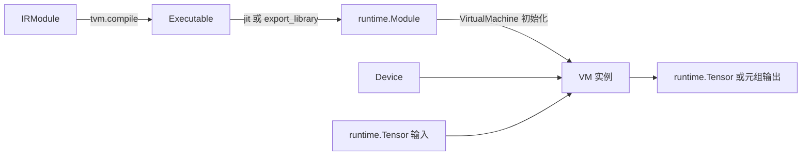

---
tags:
  - TVM
  - NPU
  - 编译器
  - Relax
  - TensorIR
status: maintained
baseline: Apache TVM v0.24.0
updated: 2026-07-29
---

# 10. Relax VM 导出与加载

> [!abstract] 本章内容
> 本章直接定义 Executable、运行时 Module、VirtualMachine、VM 函数、闭包和有状态调用接口，并逐项说明构造参数。读者不需要先假定“编译结果可以直接运行”，而是能够判断当前对象是否还需要链接、加载或设备初始化。

## 对象转换顺序



## Executable 与 VirtualMachine

### `tvm.runtime.Executable`

**规范定义**：`tvm.compile` 产生的可执行包装对象，持有尚可能需要最终编译或链接的运行时模块，并提供即时链接和导出接口。

**Python 构造签名**

```text
tvm.runtime.Executable(mod: tvm.runtime.Module)
```

### 参数

| 参数 | 接受的类型 | 默认值 | 功能与要求 |
| --- | --- | --- | --- |
| `mod` | `tvm.runtime.Module` | 无 | 编译产生的运行时模块及其导入模块。 |

### 返回对象与可观察字段

返回 `Executable`。`mod` 是原始模块；`jit()` 返回可运行 `runtime.Module`；`export_library()` 生成可部署库；下标按名称获取函数。

### 必须满足的条件

- 包含 C 源码或静态对象时，执行前必须完成编译和链接。
- 导出所需工具链与附加对象必须可用。
- 设备子模块必须支持相应保存方式。

### 产生位置与使用位置

- 常见产生位置：`tvm.compile(mod, target)`。
- 常见使用位置：应用、`VirtualMachine`、部署工具与性能测试。

### 最小例子

```python
import tvm

def prepare(executable):
    rt_mod = executable.jit()
    return tvm.relax.VirtualMachine(rt_mod, tvm.cpu())
```

### 常见错误

- 把 `Executable` 内的源代码模块当作一定可直接运行。
- 在部署环境首次调用时才发现缺少链接器或设备库。

**固定版本源码**：[executable.py](https://github.com/apache/tvm/blob/v0.24.0/python/tvm/runtime/executable.py)

### `relax.VirtualMachine`

**规范定义**：Relax 字节码的运行时执行器，负责加载可执行程序、初始化设备和内存分配器、转换输入并调用命名函数。

**Python 构造签名**

```text
relax.VirtualMachine(rt_mod: runtime.Module | runtime.Executable, device: Device | list[Device], memory_cfg: str | dict[Device, str] | None = None)
```

### 参数

| 参数 | 接受的类型 | 默认值 | 功能与要求 |
| --- | --- | --- | --- |
| `rt_mod` | `runtime.Module | runtime.Executable` | 无 | 包含 `vm_load_executable` 的模块；Executable 会先执行 `jit()`。 |
| `device` | `Device | list[Device]` | 无 | 执行设备或设备列表。VM 还需要 CPU 执行形状相关功能。 |
| `memory_cfg` | `str | dict[Device, str] | None` | `None` | `naive` 或 `pooled`，也可按设备指定；默认使用池式分配器。 |

### 返回对象与可观察字段

返回 `VirtualMachine`。可通过 `vm[name]` 取得函数，也可使用 `set_input`、`invoke_stateful`、`get_outputs`、`save_function` 和 `time_evaluator`。

### 必须满足的条件

- 运行时模块必须提供 VM 加载入口。
- 设备列表顺序必须与编译期虚拟设备安排一致。
- 调用有状态接口时必须遵循设置输入、执行、取输出的顺序。

### 产生位置与使用位置

- 常见产生位置：应用、测试、RPC 客户端和部署服务。
- 常见使用位置：模型推理、调试仪器与性能测量。

### 最小例子

```python
import tvm

def run_main(executable, x):
    vm = tvm.relax.VirtualMachine(executable, tvm.cpu())
    return vm["main"](x)
```

### 常见错误

- 在 NPU 模块中缺少设备函数，却只检查 VM 是否构造成功。
- 调用 `set_input` 后又直接调用 `vm['main']`。
- 计时前未预热，或把输入转换和结果回传混在内核测量中。

**固定版本源码**：[vm.py](https://github.com/apache/tvm/blob/v0.24.0/python/tvm/runtime/vm.py)

## VM 函数

VM 函数是 Relax Function 编译后的可执行入口。`vm["main"]` 返回一个可调用 PackedFunc 包装；调用时 VM 根据函数参数顺序转换输入，并返回 Tensor、基础值、运行时对象或嵌套元组。

```python
output = vm["main"](x, weight)
```

关键要求如下：

- 函数名必须存在于 VM 可执行程序；
- 位置参数顺序必须与 Relax Function 的 `params` 一致；
- 命名参数会按函数参数名重新排列；
- 输入 Tensor 的设备和结构必须符合编译结果；
- 首次调用可能包含延迟初始化，不应直接作为稳定性能结果。

## VM 闭包

闭包是函数与其已保存参数的组合。`save_function` 可以把函数名和一组固定参数保存为模块中的新可调用函数，常用于减少性能测量中的名称查找和参数准备开销。

```text
vm.save_function(
    func_name: str,
    saved_name: str,
    *args,
    include_return: bool = True,
    **kwargs,
) -> None
```

| 参数 | 功能 |
| --- | --- |
| `func_name` | 原 VM 函数名 |
| `saved_name` | 新保存函数的名称 |
| `args`、`kwargs` | 与闭包一起保存的参数 |
| `include_return` | 是否把函数结果返回给调用方 |

## 直接调用与有状态调用

### 直接调用

```python
output = vm["main"](x, weight)
```

适合功能验证和普通推理。

### 有状态调用

```python
vm.set_input("main", x, weight=weight)
vm.invoke_stateful("main")
output = vm.get_outputs("main")
```

有状态接口必须遵循“设置输入、执行、读取输出”的顺序。调用 `set_input` 后不应绕过 `invoke_stateful` 直接调用同一函数。`get_outputs` 会递归处理嵌套元组。

## 内存分配器参数

`memory_cfg` 接受 `None`、`"naive"`、`"pooled"` 或按 Device 指定的字典。默认池式分配器会复用存储，适合重复推理；简单分配器更适合定位生命周期问题。自研 NPU 若需要专有存储区域，DeviceAPI 和 VM 分配规则必须对同一设备给出一致实现。

## 性能测量

```text
vm.time_evaluator(
    func_name,
    dev,
    number=10,
    repeat=1,
    min_repeat_ms=0,
    cooldown_interval_ms=0,
    repeats_to_cooldown=1,
    f_preproc="",
)
```

| 参数 | 功能 |
| --- | --- |
| `func_name` | 被测函数名 |
| `dev` | 执行计时函数的设备 |
| `number` | 每组内的调用次数 |
| `repeat` | 测量组数 |
| `min_repeat_ms` | 每组最短时间，不足时增加调用次数 |
| `cooldown_interval_ms` | 组间暂停时间 |
| `repeats_to_cooldown` | 每隔多少组执行暂停 |
| `f_preproc` | 每组前执行的预处理函数 |

对于 NPU，需要另行说明测量是否包括输入准备、数据复制、设备执行、同步等待和结果回传。

## 导出后重新加载

```python
from pathlib import Path
import tvm

def reload_vm(library_path, device):
    path = Path(library_path).resolve()
    if not path.is_file():
        raise FileNotFoundError(path)
    rt_mod = tvm.runtime.load_module(str(path))
    return tvm.relax.VirtualMachine(rt_mod, device)
```

重新加载测试应在新进程执行，避免使用编译进程中的全局注册状态。BYOC 外部模块还应检查产物版本、固件要求、常量摘要和函数参数元数据。

## 本章参考资料

- [Relax Python API](https://tvm.apache.org/docs/reference/api/python/relax/relax.html)
- [Relax 虚拟机](https://tvm.apache.org/docs/arch/relax_vm.html)
- [导出与加载 Relax 可执行程序](https://tvm.apache.org/docs/how_to/tutorials/export_and_load_executable.html)
- [`python/tvm/runtime/executable.py`](https://github.com/apache/tvm/blob/v0.24.0/python/tvm/runtime/executable.py)
- [`python/tvm/runtime/vm.py`](https://github.com/apache/tvm/blob/v0.24.0/python/tvm/runtime/vm.py)

## 官方资料基础上的扩展课

> [!note] 改写与引用说明
> 本节以所列 Apache TVM 官方资料和 v0.24.0 源码为依据，采用独立的中文结构、示例与解释。阅读顺序围绕“输入是什么、执行什么、输出如何检查、失败怎样定位”展开，并增加自研 NPU 场景。需要核对接口细节时，请打开官方页面并查看固定版本源码。

### 10.A 本节要解决的具体问题

把一个已经编译的 Relax 可执行对象导出为共享库，在新的 Python 进程中加载并运行。重点检查代码、参数和元数据是否都随部署包提供。

这类小例子的价值在于变量少、输出可直接观察。第一次运行时不要同时加入图改写、外部代码生成和真实设备执行；先确认当前层的输入与输出，再增加下一层。建议为本例新建独立目录，保存命令、标准输出、IR、编译产物摘要和环境信息。

### 10.B 示例一：最小可观察输入

**官方依据：** [Relax VM](https://tvm.apache.org/docs/arch/relax_vm.html) 与 [导出和加载可执行对象](https://tvm.apache.org/docs/how_to/tutorials/export_and_load_executable.html)。

**v0.24.0 源码位置：** `docs/arch/relax_vm.rst`、`docs/how_to/tutorials/export_and_load_executable.py`、`src/relax/backend/vm/`。

```python
from pathlib import Path
import tvm
from tvm import relax

def export_executable(executable, out_dir):
    out_dir = Path(out_dir)
    out_dir.mkdir(parents=True, exist_ok=True)
    lib_path = out_dir / "model.so"
    executable.export_library(str(lib_path))
    return lib_path

def load_vm(lib_path, device):
    loaded = tvm.runtime.load_module(str(lib_path))
    return relax.VirtualMachine(loaded, device)
```

按以下顺序执行：

1. 在新进程中确认 `tvm.__file__`、动态库路径和 TVM 提交，避免受到旧进程注册状态影响；
2. 复制示例到单独文件，只补充示例明确要求的输入对象，不先加入额外优化；
3. 执行后保存完整输出；若生成 IR，同时保存 `script(show_meta=True)` 的文本；
4. 把输出与下面的预期现象逐项比较，不以“没有抛出异常”代替功能检查；
5. 重复执行一次并比较主要产物，确认结果没有依赖临时全局状态或未固定的遍历顺序。

> [!success] 预期现象
> 导出文件不是可直接启动的命令行程序，而是运行时可加载模块。若参数保留为函数输入，还要单独保存参数；若参数嵌入模块，则换权重需要重新编译。部署测试必须在干净进程进行。

> [!tip] 如何阅读输出
> 先看对象类型和函数数量，再看属性、调用形式、形状与数据类型，最后看运行结果或编译产物。若前一项不符合预期，先停止后续步骤。这样能把问题限定在最早出现差异的阶段。

### 10.C 示例二：只改变一个条件

只复制共享库而遗漏独立参数文件，再运行加载脚本。错误信息应指出缺少哪个文件或参数，而不是在调用深处以形状错误结束。

执行第二个例子时，复制第一个例子的输入与环境，只修改上文指出的一项。把两个输出做结构比较，并写下以下四个答案：

1. 第一次出现差异的是哪一个阶段？
2. 差异表现为函数、属性、形状、数据类型、编译产物还是运行结果？
3. 当前行为是明确拒绝、交给其他后端执行，还是编译错误？
4. 日志是否足以让另一位开发者不查看本次进程状态也能复现？

如果同时观察到多个变化，应把第二个例子继续拆小。教程中的成功示例说明“怎样走通”，而单条件变化说明“系统为何作出这个决定”，两者缺一不可。

### 10.D 改造成自研 NPU 示例

确认外部 NPU `runtime.Module` 已作为导入模块打包。目标机只部署轻量运行时与驱动时，构建脚本不能意外依赖编译器动态库或 Python 前端。

改造时建议保留三份相互独立的输入：最小 Relax 或 TensorIR、设备编译器输入、运行时调用输入。三份输入使用同一个样本编号，并记录转换前后的关键字段。这样可以分别测试 TVM 变换、NPU 编译器和驱动，不需要每次都运行完整模型。

至少补充以下样本：

- 一个完全满足能力要求的正向样本；
- 一个只改变数据类型的反向样本；
- 一个只改变形状或属性的反向样本；
- 一个包含主机与 NPU 混合执行的样本；
- 一个导出后在新进程加载的样本；
- 若支持动态尺寸，再增加最小值、常用值和最大值附近的样本。

### 10.E 源码阅读任务

从上文列出的源码位置选择一个公开 API，依次找到 Python 调用、FFI 注册、C++ 实现和测试。记录函数签名、主要输入、主要输出、会写入的模块属性以及失败方式。若名称只在文档出现而源码中找不到，继续搜索注册字符串、属性键或错误文本。

> [!question] 章末练习
> 1. 不运行代码，先画出示例执行前后的对象关系；2. 运行后用实际输出修正图；3. 增加一个会被明确拒绝的输入；4. 说明若接入自研 NPU，哪一层需要改动，哪一层可以保持不变；5. 把结果整理成可由自动测试检查的断言。

### 10.F 完成标准

- [ ] 示例可在固定 v0.24.0 环境重复执行，或已明确列出所需可选依赖；
- [ ] 预期现象包含可检查的结构、字段或数值，不只是“运行成功”；
- [ ] 单条件变化能触发预期的拒绝、转交或结构差异；
- [ ] 能从官方页面定位到固定版本源码和测试；
- [ ] NPU 改造说明包含编译阶段、运行阶段与部署阶段；
- [ ] 失败时保留最小输入、环境、阶段输出和第一个错误。
