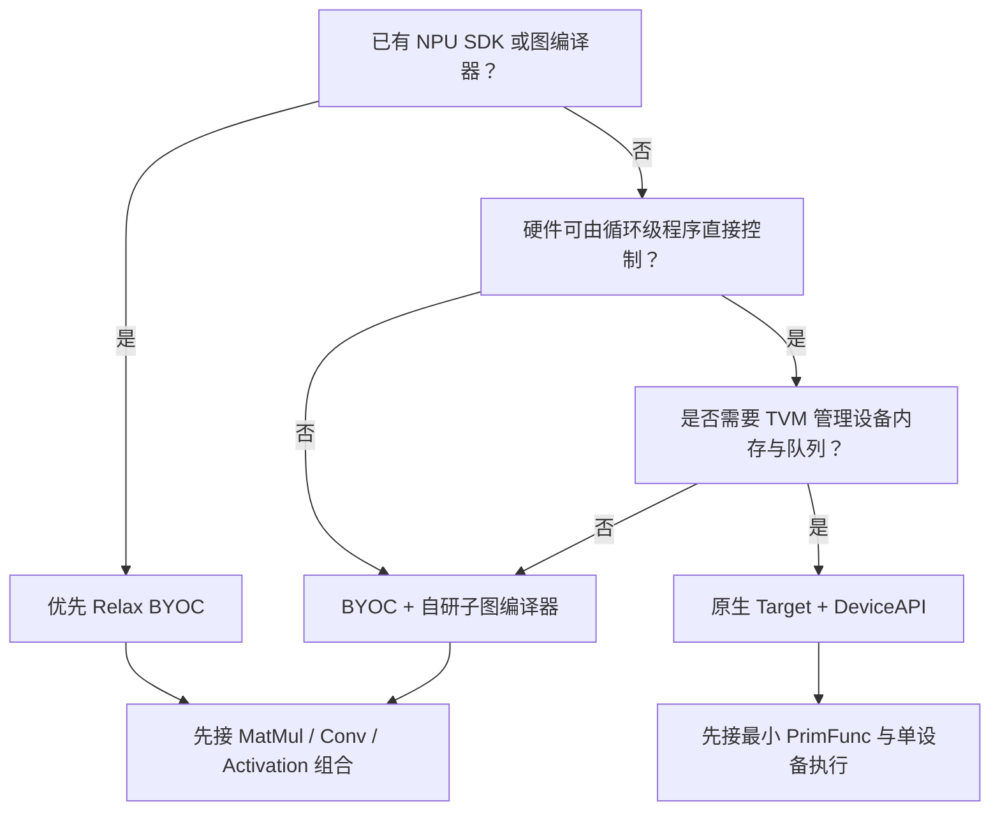
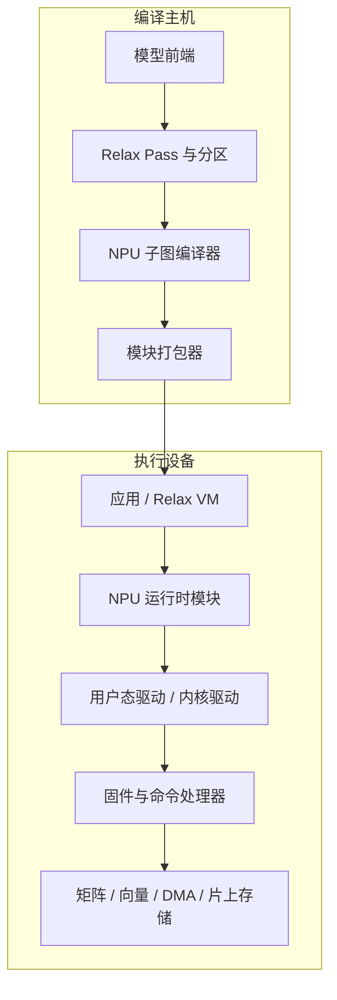

---
tags:
  - TVM
  - NPU
  - 编译器
  - Relax
  - TensorIR
status: maintained
baseline: Apache TVM v0.24.0
updated: 2026-07-29
---

# 14. 接入路线选择与总体设计

> [!abstract] 本章内容
> 本章把自研 NPU 接入拆成三条路线，给出选择方法、组件关系、阶段成果和接口责任。读完后应能回答：为何选择 BYOC 或原生 TIR 后端，哪些工作由 TVM 完成，哪些工作由自研编译器、运行时、驱动和固件完成。

## 14.1 三条路线

| 路线 | 适合情况 | TVM 侧主要工作 | 自研侧主要工作 | 第一版建议 |
| --- | --- | --- | --- | --- |
| Relax BYOC + 已有 SDK | 已有图编译器或网络执行引擎 | 组合运算注册、分区、外部模块打包 | 图编译、命令生成、运行时提交 | 最推荐 |
| Relax BYOC + 自定义命令编译器 | 硬件已定，尚无完整软件栈 | 分区、JSON 或二进制序列化、外部函数调用 | 子图编译、内存规划、命令流、驱动 | 推荐 |
| 原生 Target + TensorIR | 希望 TVM 直接产生设备代码，设备可编程性强 | TargetKind、调度、内建函数、代码生成、DeviceAPI | 汇编器或编码器、驱动、固件 | 第二阶段 |

> [!important] 不要被“原生”二字误导
> 原生 Target 并不自动带来更高性能。若 NPU 的最优执行单位是多算子子图，且已有成熟子图编译器，BYOC 往往更自然。原生 TIR 路线更适合指令可编程、循环与存储层次可由编译器直接控制的设备。

## 14.2 决策树



## 14.3 推荐的软件分层



每一层只承担自己能稳定完成的工作：

- 模型前端负责把源框架程序转换成 Relax，并保留形状、数据类型和参数。
- Relax Pass 负责通用图处理、组合运算识别、NPU 子图选择与主机保留部分。
- NPU 子图编译器负责数据布局选择、分块、片上内存分配、命令生成与静态检查。
- 运行时模块负责加载编译产物、绑定实际 Tensor、分配设备资源、提交和等待。
- 驱动负责地址与权限、队列、同步、复位、错误上报和缓存维护。
- 固件负责解析版本化命令、调度硬件单元和报告完成状态。

## 14.4 先明确六类规范

### 14.4.1 算子规格说明

每个可交给 NPU 的运算都要写明：

1. Relax 运算名和允许的组合形式；
2. 输入、输出数量；
3. 允许的秩、尺寸范围和动态维度；
4. 数据类型、累加类型、舍入、饱和与特殊值处理；
5. 数据布局、对齐和步长限制；
6. 属性要求，例如卷积 stride、padding、dilation、groups；
7. 非整分块的处理；
8. 工作区计算方法；
9. 结果误差要求；
10. 不满足条件时的处理。

### 14.4.2 外部函数 ABI

外部函数必须有稳定的名称与参数顺序。建议所有 Tensor 仍通过 DLTensor 或 TVM Tensor 传入，标量配置放入模块元数据或显式参数。异步提交需要返回事件对象或由调用方提供事件槽；同步函数则必须在返回前保证输出可读取。

### 14.4.3 编译产物格式

至少包含以下字段：

| 字段 | 目的 |
| --- | --- |
| magic 与格式版本 | 拒绝错误文件 |
| 编译器版本与目标型号 | 追溯来源 |
| 所需固件 ABI 版本 | 加载前兼容检查 |
| 外部函数目录 | 按符号查找 |
| 常量目录与校验值 | 防止权重错配 |
| 命令段与重定位项 | 加载到实际地址 |
| 工作区要求 | 运行前分配 |
| 输入输出描述 | 绑定 Tensor |
| 调试信息 | 命令反汇编与故障定位 |

### 14.4.4 Target 能力描述

不要让编译器从型号名称猜参数。建议使用可版本化 JSON：

```json
{
  "kind": "acme_npu",
  "arch": "npu_v1",
  "matrix_m": 16,
  "matrix_n": 16,
  "matrix_k": 32,
  "sram_bytes": 1048576,
  "dma_alignment": 64,
  "supported_dtypes": ["int8", "int16", "int32"],
  "firmware_abi": 3
}
```

### 14.4.5 错误处理规范

错误至少分为：模型不被接受、编译约束不满足、产物不兼容、内存不足、设备忙、提交失败、设备超时、命令格式错误、地址错误、计算单元错误和结果对照失败。每个错误要有机器可读码与面向开发者的详细文本。

### 14.4.6 测试规范

测试不仅确认“能跑”，还应确认：

- 分区前后函数结构符合预期；
- 只接纳能力范围内的子图；
- 编译产物可保存和重新加载；
- 正常、极值、尾部、动态尺寸和异常输入得到预期处理；
- 主机保留部分与 NPU 部分的数据传递正确；
- 多次运行、并发、取消、超时和复位后恢复稳定。

## 14.5 分阶段成果

| 阶段 | 产物 | 必须通过的演示 |
| --- | --- | --- |
| A | 仅 Python 分区 | MatMul+ReLU 形成一个外部函数，其他运算留在主机 |
| B | 空壳代码生成与运行时 | 可导出、加载、调用，输出形状正确 |
| C | 单运算真实执行 | MatMul 的随机、极值和尾部尺寸正确 |
| D | 多运算子图 | MatMul+Bias+Activation 不写回中间结果 |
| E | 完整内存与异步提交 | 多次运行和并发稳定 |
| F | 模型覆盖 | 代表模型达到功能与性能目标 |
| G | 调优与长期维护 | 目标配置、数据库和版本升级可复现 |

## 14.6 与本地 NPU 规格协同

本 Vault 已有 [[NPU 指令与硬件架构设计 Spec]]、[[分块矩阵外积数据流]] 和 [[NPU 验证：从 BT 到算子]]。接入时应从这些资料提取矩阵分块、L1BUF 容量、DMA 对齐、任务槽、数据类型、累加规则和错误状态，并放入目标配置与算子规格说明。编译器不能依赖未写入能力描述的默认值。

> [!question] 评审前必须回答
> NPU 最优执行单位是单条指令、单个 TensorIR 内核，还是包含多个 Relax 运算的子图？权重何时重排？谁负责设备内存？执行是否异步？不被接受的节点由谁执行？产物如何在不同固件版本间做兼容检查？

## 14.7 官方依据

- [Bring Your Own Codegen](https://tvm.apache.org/docs/how_to/tutorials/bring_your_own_codegen.html)
- [External Library Dispatch](https://tvm.apache.org/docs/arch/external_library_dispatch.html)
- [Device/Target Interactions](https://tvm.apache.org/docs/arch/device_target_interactions.html)
- [Code Generation](https://tvm.apache.org/docs/arch/codegen.html)

## 官方资料基础上的扩展课

> [!note] 改写与引用说明
> 本节以所列 Apache TVM 官方资料和 v0.24.0 源码为依据，采用独立的中文结构、示例与解释。阅读顺序围绕“输入是什么、执行什么、输出如何检查、失败怎样定位”展开，并增加自研 NPU 场景。需要核对接口细节时，请打开官方页面并查看固定版本源码。

### 14.A 本节要解决的具体问题

同一块 NPU 已有成熟图编译器和驱动。先比较 BYOC 与原生 Target 两种接入方式，再用可验证的需求选择，不以代码改动量作为唯一因素。

这类小例子的价值在于变量少、输出可直接观察。第一次运行时不要同时加入图改写、外部代码生成和真实设备执行；先确认当前层的输入与输出，再增加下一层。建议为本例新建独立目录，保存命令、标准输出、IR、编译产物摘要和环境信息。

### 14.B 示例一：最小可观察输入

**官方依据：** [External Library Dispatch](https://tvm.apache.org/docs/arch/external_library_dispatch.html) 与 [BYOC 教程](https://tvm.apache.org/docs/how_to/tutorials/bring_your_own_codegen.html)。

**v0.24.0 源码位置：** `docs/arch/external_library_dispatch.rst`、`docs/how_to/tutorials/bring_your_own_codegen.py`、`src/relax/backend/contrib/`。

```yaml
backend:
  name: acme_npu
  existing_graph_compiler: true
  existing_runtime: true
  accepts_subgraphs: true
  needs_tir_scheduling: false
  needs_tvm_device_allocation: false
decision:
  first_route: relax_byoc
  revisit_native_target_when:
    - direct_tir_codegen_required
    - unified_device_memory_required
```

按以下顺序执行：

1. 在新进程中确认 `tvm.__file__`、动态库路径和 TVM 提交，避免受到旧进程注册状态影响；
2. 复制示例到单独文件，只补充示例明确要求的输入对象，不先加入额外优化；
3. 执行后保存完整输出；若生成 IR，同时保存 `script(show_meta=True)` 的文本；
4. 把输出与下面的预期现象逐项比较，不以“没有抛出异常”代替功能检查；
5. 重复执行一次并比较主要产物，确认结果没有依赖临时全局状态或未固定的遍历顺序。

> [!success] 预期现象
> 已有子图编译器、运行时和图输入格式时，Relax BYOC 通常能最快形成可运行系统。若必须从 TensorIR 直接生成指令，或由 TVM 管理设备分配，才需要更完整的原生设备接入。

> [!tip] 如何阅读输出
> 先看对象类型和函数数量，再看属性、调用形式、形状与数据类型，最后看运行结果或编译产物。若前一项不符合预期，先停止后续步骤。这样能把问题限定在最早出现差异的阶段。

### 14.C 示例二：只改变一个条件

把 `needs_tir_scheduling` 改为 `true`，重新检查现有编译器是否仍承担调度。若两个系统都修改循环和内存计划，必须明确谁先执行、谁拥有最终决定。

执行第二个例子时，复制第一个例子的输入与环境，只修改上文指出的一项。把两个输出做结构比较，并写下以下四个答案：

1. 第一次出现差异的是哪一个阶段？
2. 差异表现为函数、属性、形状、数据类型、编译产物还是运行结果？
3. 当前行为是明确拒绝、交给其他后端执行，还是编译错误？
4. 日志是否足以让另一位开发者不查看本次进程状态也能复现？

如果同时观察到多个变化，应把第二个例子继续拆小。教程中的成功示例说明“怎样走通”，而单条件变化说明“系统为何作出这个决定”，两者缺一不可。

### 14.D 改造成自研 NPU 示例

在方案文档中分别列出图接纳、外部代码生成、模块加载、设备内存、同步、调试和部署责任。每项只能有一个主要实现位置，并给出可以运行的验证方法。

改造时建议保留三份相互独立的输入：最小 Relax 或 TensorIR、设备编译器输入、运行时调用输入。三份输入使用同一个样本编号，并记录转换前后的关键字段。这样可以分别测试 TVM 变换、NPU 编译器和驱动，不需要每次都运行完整模型。

至少补充以下样本：

- 一个完全满足能力要求的正向样本；
- 一个只改变数据类型的反向样本；
- 一个只改变形状或属性的反向样本；
- 一个包含主机与 NPU 混合执行的样本；
- 一个导出后在新进程加载的样本；
- 若支持动态尺寸，再增加最小值、常用值和最大值附近的样本。

### 14.E 源码阅读任务

从上文列出的源码位置选择一个公开 API，依次找到 Python 调用、FFI 注册、C++ 实现和测试。记录函数签名、主要输入、主要输出、会写入的模块属性以及失败方式。若名称只在文档出现而源码中找不到，继续搜索注册字符串、属性键或错误文本。

> [!question] 章末练习
> 1. 不运行代码，先画出示例执行前后的对象关系；2. 运行后用实际输出修正图；3. 增加一个会被明确拒绝的输入；4. 说明若接入自研 NPU，哪一层需要改动，哪一层可以保持不变；5. 把结果整理成可由自动测试检查的断言。

### 14.F 完成标准

- [ ] 示例可在固定 v0.24.0 环境重复执行，或已明确列出所需可选依赖；
- [ ] 预期现象包含可检查的结构、字段或数值，不只是“运行成功”；
- [ ] 单条件变化能触发预期的拒绝、转交或结构差异；
- [ ] 能从官方页面定位到固定版本源码和测试；
- [ ] NPU 改造说明包含编译阶段、运行阶段与部署阶段；
- [ ] 失败时保留最小输入、环境、阶段输出和第一个错误。
