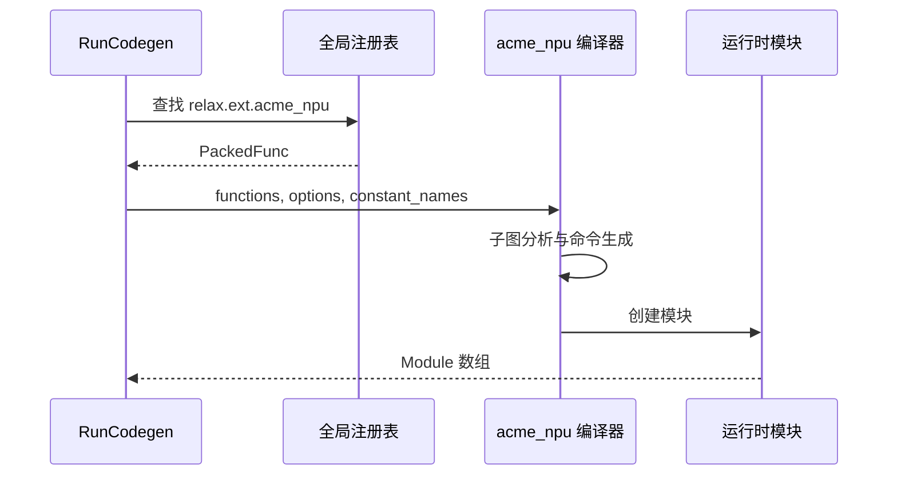

---
tags:
  - TVM
  - NPU
  - 编译器
  - Relax
  - TensorIR
status: maintained
baseline: Apache TVM v0.24.0
updated: 2026-07-29
---

# 16. BYOC 代码生成器

> [!abstract] 本章内容
> 本章说明 `RunCodegen` 如何找到外部编译器，如何遍历组合函数、生成 JSON 或二进制产物、建立 runtime.Module，以及真实 NPU 编译器应补充的形状、常量、工作区、重定位和版本信息。

## 16.1 调用位置

分区后的外层 Relax 函数带有 `Codegen="acme_npu"`。`RunCodegen` 收集这些函数，通过全局注册表取得 `relax.ext.acme_npu`，再把函数数组、选项和常量名称传给后端。后端返回一个或多个 runtime.Module，TVM 把这些模块接入最终可执行对象。



## 16.2 与 v0.24.0 Example NPU 一致的函数形态

```cpp
ffi::Array<ffi::Module> AcmeNPUCompiler(
    ffi::Array<relax::Function> functions,
    ffi::Map<ffi::String, ffi::Any> options,
    ffi::Map<relax::Constant, ffi::String> constant_names) {
  ffi::Array<ffi::Module> modules;
  auto create = tvm::ffi::Function::GetGlobalRequired(
      "runtime.AcmeNPURuntimeCreate");

  for (const auto& func : functions) {
    auto symbol = relax::GetExtSymbol(func);
    auto artifact = CompileSubgraph(func, options, constant_names);
    modules.push_back(
        create(symbol, artifact.binary, artifact.metadata,
               artifact.constant_names).cast<ffi::Module>());
  }
  return modules;
}

TVM_FFI_STATIC_INIT_BLOCK() {
  namespace refl = tvm::ffi::reflection;
  refl::GlobalDef().def("relax.ext.acme_npu", AcmeNPUCompiler);
}
```

这是接口骨架，`CompileSubgraph` 是项目的核心。它应是确定性的：相同 IR、Target、常量与编译器版本产生相同产物，或至少产生功能相同且可追溯的产物。

## 16.3 JSON 还是二进制

| 格式 | 优点 | 缺点 | 推荐使用阶段 |
| --- | --- | --- | --- |
| JSON 图 | 容易查看、适合早期联调 | 体积大、解析慢、字段类型限制多 | 空壳与第一个真实运算 |
| FlatBuffer / 自定义表 | 兼顾可扩展与读取速度 | 需要格式工具与兼容策略 | 稳定的图级运行时 |
| 命令二进制 | 加载快、接近硬件 | 调试困难、重定位复杂 | 固件协议稳定后 |
| 混合包 | 元数据可读，命令段紧凑 | 打包器更复杂 | 产品阶段 |

> [!tip] 建议
> 早期先输出可读 JSON，同时生成命令反汇编文本。硬件执行稳定后再把命令段改为二进制，但保留元数据、版本、散列值和离线解析工具。

## 16.4 子图编译步骤

### 步骤 1：读取函数接口

收集每个参数和返回值的：

- 名称与顺序；
- 形状、数据类型、设备；
- 是否为常量；
- 允许的步长；
- 别名与原地写要求；
- 动态维度及其上限。

缺少必要 StructInfo 时，代码生成器应给出编译错误，不应猜测。

### 步骤 2：建立内部图

把 Relax 组合函数转换成自研内部节点。内部节点需要保存运算类型、属性、输入输出值、常量引用和源位置。转换表要版本化，并为每个运算写单测。

### 步骤 3：选择数据布局

根据运算、数据类型、分块和消费者选择布局。若生产者与消费者在同一个组合函数内，可保留 NPU 私有布局；外部函数输入输出必须遵守 ABI，或显式插入重排运算。

### 步骤 4：工作区与生命周期

对内部值做存活区间分析，复用不重叠的缓冲区。片上存储不足时选择更小分块、分阶段执行或使用片外工作区。工作区大小应是输入尺寸的确定函数，并写入元数据。

### 步骤 5：命令生成

生成 DMA、矩阵、向量、复杂函数和同步命令。每条命令引用逻辑缓冲区或重定位项，不直接写入编译主机虚拟地址。命令序号与源节点保持关联，便于设备错误反查。

### 步骤 6：静态检查

检查命令字段、地址范围、对齐、缓冲区越界、依赖事件、工作区上限、命令数和固件 ABI。静态检查失败必须阻止产物输出。

### 步骤 7：模块构造

创建 runtime.Module，保存外部符号、命令、元数据、常量名称和所需版本。模块必须支持导出与重新加载。

## 16.5 常量处理

`constant_names` 让代码生成器用稳定名称引用 Relax Constant。常见选择：

1. 常量仍由 TVM 保存，运行时 `Init` 时传入；
2. 编译器预重排后把常量嵌入 NPU 模块；
3. 常量单独保存为权重包，多个模型函数共享。

预重排可以减少每次启动工作，但必须把源常量散列值、目标布局、数据类型、编译器版本和硬件型号写入缓存键。常量内容变化后不得复用旧结果。

## 16.6 选项与 Target

编译选项不应散落在环境变量。建议统一成：

```python
npu_options = {
    "arch": "npu_v1",
    "firmware_abi": 3,
    "opt_level": 2,
    "sram_bytes": 1048576,
    "enable_fused_activation": True,
    "debug_artifacts": "/tmp/acme_npu_debug",
}
```

硬件固定限制来自 Target 或能力文件；用户可选策略来自 PassContext 或后端 options。两类信息发生冲突时，固定限制优先，并报告具体字段。

## 16.7 JSONSerializer 起点

若后端接受图结构，可继承 TVM 的 `JSONSerializer`。v0.24.0 Example NPU 的访问器取得组合函数 `Composite` 属性，把调用参数变为 JSON 节点输入，再以 `runtime.ExampleNPUJSONRuntimeCreate` 建立模块。这条路线适合快速搭建，但真实项目通常还要写入：

- 完整运算属性；
- 每个输入输出的形状与数据类型；
- 常量索引；
- 数据布局；
- 工作区；
- 设备版本；
- 编译选项；
- 错误定位信息。

## 16.8 构建开关

```cmake
if(USE_ACME_NPU_CODEGEN)
  tvm_file_glob(
    GLOB COMPILER_ACME_NPU_SRCS
    src/relax/backend/contrib/acme_npu/*.cc
  )
  list(APPEND COMPILER_SRCS ${COMPILER_ACME_NPU_SRCS})
endif()

if(USE_ACME_NPU_RUNTIME)
  tvm_file_glob(
    GLOB RUNTIME_ACME_NPU_SRCS
    src/runtime/contrib/acme_npu/*.cc
  )
  list(APPEND RUNTIME_SRCS ${RUNTIME_ACME_NPU_SRCS})
endif()
```

编译器版通常同时需要代码生成与运行时创建函数；仅部署版只带运行时。CI 应分别构建两种配置。

## 16.9 测试

1. 注册函数存在性：`tvm.get_global_func("relax.ext.acme_npu", True)`；
2. 一个组合函数生成一个带预期 type key 的 Module；
3. 同一输入多次编译产物散列值稳定；
4. 属性和常量正确进入产物；
5. 非法尺寸、数据类型、对齐和 ABI 得到明确错误；
6. 导出后在新进程加载；
7. 调试产物能从命令序号回到 Relax 节点；
8. 仅运行时构建不包含编译器依赖。

## 16.10 官方依据

- [External Library Dispatch](https://tvm.apache.org/docs/arch/external_library_dispatch.html)
- [Code Generation](https://tvm.apache.org/docs/arch/codegen.html)
- [Example NPU 代码生成](https://github.com/apache/tvm/blob/v0.24.0/src/relax/backend/contrib/example_npu/codegen.cc)
- [Example NPU CMake](https://github.com/apache/tvm/blob/v0.24.0/cmake/modules/contrib/ExampleNPU.cmake)

## 官方资料基础上的扩展课

> [!note] 改写与引用说明
> 本节以所列 Apache TVM 官方资料和 v0.24.0 源码为依据，采用独立的中文结构、示例与解释。阅读顺序围绕“输入是什么、执行什么、输出如何检查、失败怎样定位”展开，并增加自研 NPU 场景。需要核对接口细节时，请打开官方页面并查看固定版本源码。

### 16.A 本节要解决的具体问题

把一个带 `Codegen="acme_npu"` 的外部函数转换为设备编译器可接收的 JSON，再创建自研运行时模块。

这类小例子的价值在于变量少、输出可直接观察。第一次运行时不要同时加入图改写、外部代码生成和真实设备执行；先确认当前层的输入与输出，再增加下一层。建议为本例新建独立目录，保存命令、标准输出、IR、编译产物摘要和环境信息。

### 16.B 示例一：最小可观察输入

**官方依据：** [BYOC 教程](https://tvm.apache.org/docs/how_to/tutorials/bring_your_own_codegen.html) 与 [External Library Dispatch](https://tvm.apache.org/docs/arch/external_library_dispatch.html)。

**v0.24.0 源码位置：** `src/relax/transform/run_codegen.cc`、`src/relax/backend/contrib/codegen_json/`、`src/relax/backend/contrib/example_npu/`。

```text
Relax external function
  -> validate attributes and StructInfo
  -> assign stable global symbol
  -> serialize nodes, constants and outputs
  -> call acme compiler SDK
  -> package command binary and metadata
  -> return runtime.Module
```

按以下顺序执行：

1. 在新进程中确认 `tvm.__file__`、动态库路径和 TVM 提交，避免受到旧进程注册状态影响；
2. 复制示例到单独文件，只补充示例明确要求的输入对象，不先加入额外优化；
3. 执行后保存完整输出；若生成 IR，同时保存 `script(show_meta=True)` 的文本；
4. 把输出与下面的预期现象逐项比较，不以“没有抛出异常”代替功能检查；
5. 重复执行一次并比较主要产物，确认结果没有依赖临时全局状态或未固定的遍历顺序。

> [!success] 预期现象
> 代码生成入口按后端名称注册，接收一组外部函数、后端选项和常量名称。返回值是运行时模块数组；`RunCodegen` 把调用改成外部函数形式，并把模块放入 `external_mods`。

> [!tip] 如何阅读输出
> 先看对象类型和函数数量，再看属性、调用形式、形状与数据类型，最后看运行结果或编译产物。若前一项不符合预期，先停止后续步骤。这样能把问题限定在最早出现差异的阶段。

### 16.C 示例二：只改变一个条件

让设备编译器返回缺少输出描述的产物。代码生成器应立即拒绝，并报告外部函数名和缺失字段，不能创建一个只能到执行时才失败的模块。

执行第二个例子时，复制第一个例子的输入与环境，只修改上文指出的一项。把两个输出做结构比较，并写下以下四个答案：

1. 第一次出现差异的是哪一个阶段？
2. 差异表现为函数、属性、形状、数据类型、编译产物还是运行结果？
3. 当前行为是明确拒绝、交给其他后端执行，还是编译错误？
4. 日志是否足以让另一位开发者不查看本次进程状态也能复现？

如果同时观察到多个变化，应把第二个例子继续拆小。教程中的成功示例说明“怎样走通”，而单条件变化说明“系统为何作出这个决定”，两者缺一不可。

### 16.D 改造成自研 NPU 示例

序列化格式需要版本号、目标型号、输入输出、常量标识、命令数据和完整性校验。编译器 SDK 的错误必须转换为稳定原因码，同时保留厂商原始信息供诊断。

改造时建议保留三份相互独立的输入：最小 Relax 或 TensorIR、设备编译器输入、运行时调用输入。三份输入使用同一个样本编号，并记录转换前后的关键字段。这样可以分别测试 TVM 变换、NPU 编译器和驱动，不需要每次都运行完整模型。

至少补充以下样本：

- 一个完全满足能力要求的正向样本；
- 一个只改变数据类型的反向样本；
- 一个只改变形状或属性的反向样本；
- 一个包含主机与 NPU 混合执行的样本；
- 一个导出后在新进程加载的样本；
- 若支持动态尺寸，再增加最小值、常用值和最大值附近的样本。

### 16.E 源码阅读任务

从上文列出的源码位置选择一个公开 API，依次找到 Python 调用、FFI 注册、C++ 实现和测试。记录函数签名、主要输入、主要输出、会写入的模块属性以及失败方式。若名称只在文档出现而源码中找不到，继续搜索注册字符串、属性键或错误文本。

> [!question] 章末练习
> 1. 不运行代码，先画出示例执行前后的对象关系；2. 运行后用实际输出修正图；3. 增加一个会被明确拒绝的输入；4. 说明若接入自研 NPU，哪一层需要改动，哪一层可以保持不变；5. 把结果整理成可由自动测试检查的断言。

### 16.F 完成标准

- [ ] 示例可在固定 v0.24.0 环境重复执行，或已明确列出所需可选依赖；
- [ ] 预期现象包含可检查的结构、字段或数值，不只是“运行成功”；
- [ ] 单条件变化能触发预期的拒绝、转交或结构差异；
- [ ] 能从官方页面定位到固定版本源码和测试；
- [ ] NPU 改造说明包含编译阶段、运行阶段与部署阶段；
- [ ] 失败时保留最小输入、环境、阶段输出和第一个错误。
