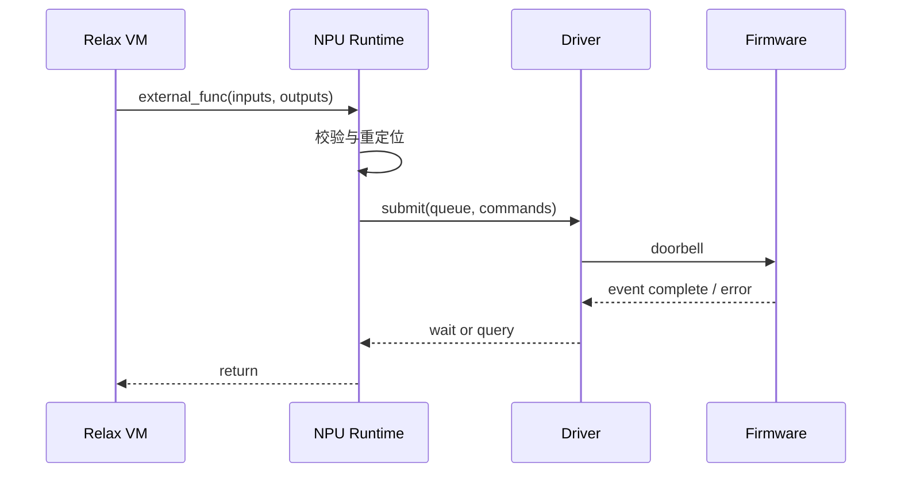

---
tags:
  - TVM
  - NPU
  - 编译器
  - Relax
  - TensorIR
status: maintained
baseline: Apache TVM v0.24.0
updated: 2026-07-29
---

# 17. NPU 运行时与驱动适配

> [!abstract] 本章内容
> 本章从 runtime.Module 的角度说明模块创建、常量初始化、输入输出绑定、设备内存、命令提交、事件同步、序列化和错误处理。BYOC 第一版通常不需要实现完整 DeviceAPI，但仍需一个可靠的 NPU 运行时模块。

## 17.1 运行时的责任

运行时接收已经编译的外部函数产物，不再决定复杂图优化。它主要负责：

1. 检查产物格式与设备兼容性；
2. 加载常量与命令；
3. 为每次调用绑定实际 Tensor；
4. 分配或复用设备工作区；
5. 处理主机与设备的数据复制；
6. 进行地址重定位；
7. 提交命令并取得事件；
8. 等待、查询或回收事件；
9. 把设备错误转换成 TVM 可见错误；
10. 保存与恢复模块状态。

> [!important] 编译期与运行期分工
> 分块、组合运算、静态工作区布局和命令结构尽量在编译期决定；实际地址、设备编号、队列、事件与本次输入尺寸在运行期决定。若运行时重新做大型图优化，产物将难以复现。

## 17.2 Module 骨架

```cpp
class AcmeNPURuntimeNode final : public tvm::runtime::ModuleNode {
 public:
  const char* type_key() const final { return "acme_npu"; }

  ffi::Function GetFunction(
      const ffi::String& name,
      const ffi::ObjectPtr<ffi::Object>& self) final {
    if (name == symbol_) {
      return ffi::Function::FromPacked(
          [sptr_to_self = ffi::GetRef<ffi::Module>(this)]
          (ffi::PackedArgs args, ffi::Any* rv) {
            auto* node =
                static_cast<AcmeNPURuntimeNode*>(sptr_to_self.operator->());
            node->Run(args);
          });
    }
    return nullptr;
  }

  void SaveToBinary(dmlc::Stream* stream) final {
    stream->Write(symbol_);
    stream->Write(artifact_);
    stream->Write(metadata_);
  }

 private:
  void Run(ffi::PackedArgs args);
  ffi::String symbol_;
  std::string artifact_;
  std::string metadata_;
};
```

具体基类与签名应以 v0.24.0 当前头文件和相邻模块为准。若采用 JSON 图，可继承 `JSONRuntimeBase`；若产物已经是设备命令，直接实现 ModuleNode 往往更清楚。

## 17.3 初始化

初始化分为模块级与设备级：

- 模块级：解析元数据、校验 magic、版本、函数目录、常量目录和命令段；
- 设备级：打开设备、取得能力、创建上下文、队列或流；
- 常量级：分配设备内存、执行预重排或上传已重排权重；
- 缓存级：建立权重与命令缓存，记录引用计数。

初始化应支持重复调用或明确拒绝重复调用。失败后必须释放已经取得的资源，不能留下半初始化对象。

## 17.4 Tensor 绑定

每次调用先核对：

| 检查项 | 说明 |
| --- | --- |
| 参数数量 | 与外部函数 ABI 一致 |
| 数据类型 | 与编译产物一致，或允许的动态集合 |
| ndim | 与描述一致 |
| 形状 | 静态值一致，动态值在范围内 |
| strides | 连续要求或明确支持的非连续步长 |
| byte_offset | 设备是否支持带偏移 Tensor |
| device | 主机、NPU 或共享内存 |
| alignment | 基地址与每行步长 |
| 可写性 | 输出与原地写约束 |

若输入在主机内存，运行时可以分配设备缓冲区并复制；若输入已经在 NPU 内存，直接绑定可避免往返复制。两种情况必须在日志与性能统计中区分。

## 17.5 设备内存

推荐把内存分成四类：

1. 常量内存：模块生命周期内保持；
2. 输入输出内存：调用方拥有或运行时暂时创建；
3. 工作区：外部函数调用期间使用，可由内存池复用；
4. 命令与描述符内存：通常只读，可跨调用复用。

内存池按设备、对齐和用途分组。异步调用完成之前，不得回收仍被设备使用的缓冲区。若运行时允许并发，同一模块的可变工作区不能被两个调用同时覆盖。

## 17.6 提交与事件



同步调用可以在函数返回前等待事件。异步调用应把事件与输入输出生命周期绑定，并提供后续同步点。不要仅依赖全设备同步，这会破坏不同队列间的并行。

## 17.7 缓存一致性

非一致性 SoC 需要明确：

- CPU 写入输入后由谁 clean；
- NPU 写入输出后由谁 invalidate；
- 命令缓冲区何时可见；
- 设备写完成与中断到达的先后保证；
- 地址是物理地址、IOVA 还是设备虚拟地址；
- scatter-gather 是否被硬件支持。

这些规则属于驱动 ABI，不能由每个算子自行处理。错误的缓存维护常表现为输入相关的偶发数值错误。

## 17.8 错误与恢复

推荐错误对象包含：

```text
stage           = submit | execute | wait | copy | load
host_code       = 统一软件错误码
driver_code     = ioctl 或 SDK 返回码
device_code     = 固件错误码
function        = 外部函数符号
submission_id   = 提交序号
command_index   = 第一个失败命令
engine          = DMA | Matrix | Vector | CME
detail          = 可读说明
recoverable     = true | false
```

可恢复错误可以终止当前调用并保留设备；不可恢复错误应停止新提交、收集状态、复位设备、清空失效事件与内存，再允许上层重新加载模块。复位后不能继续使用复位前的设备地址和事件。

## 17.9 模块保存与加载

`export_library` 会把被导入模块一并打包。自定义 Module 若需要在加载后恢复命令和元数据，必须实现二进制保存，并注册：

```cpp
TVM_FFI_STATIC_INIT_BLOCK() {
  namespace refl = tvm::ffi::reflection;
  refl::GlobalDef()
      .def("runtime.AcmeNPURuntimeCreate", AcmeNPURuntimeCreate)
      .def("ffi.Module.load_from_bytes.acme_npu",
           AcmeNPURuntimeLoadFromBytes);
}
```

type key、加载注册名与模块返回值必须一致。测试应在另一个进程加载共享库，防止全局对象残留掩盖缺失注册。

## 17.10 多线程与多设备

- 设备上下文按 device id 区分；
- 模块不可变部分可共享；
- 每次调用状态独立；
- 队列选择有明确策略；
- 常量缓存使用线程安全引用计数；
- 设备复位只影响对应设备；
- 错误日志包含线程、队列和提交序号。

## 17.11 运行时最小测试

1. 创建与销毁模块一万次无泄漏；
2. 常量初始化成功与失败均可清理；
3. 零长度、最小尺寸、最大允许尺寸；
4. 输入输出地址未对齐；
5. 驱动返回忙、超时、非法命令和设备复位；
6. 两线程调用同一模块；
7. 两个设备并行；
8. 导出、进程退出、重新加载；
9. 连续运行后结果不受上一次工作区残留影响；
10. 运行时仅构建配置可以独立链接。

## 17.12 官方依据

- [TVM 运行时 System](https://tvm.apache.org/docs/arch/runtime.html)
- [Module Serialization](https://tvm.apache.org/docs/arch/introduction_to_module_serialization.html)
- [Example NPU runtime](https://github.com/apache/tvm/blob/v0.24.0/src/runtime/contrib/example_npu/example_npu_runtime.cc)
- [Relax VM](https://tvm.apache.org/docs/arch/relax_vm.html)

## 官方资料基础上的扩展课

> [!note] 改写与引用说明
> 本节以所列 Apache TVM 官方资料和 v0.24.0 源码为依据，采用独立的中文结构、示例与解释。阅读顺序围绕“输入是什么、执行什么、输出如何检查、失败怎样定位”展开，并增加自研 NPU 场景。需要核对接口细节时，请打开官方页面并查看固定版本源码。

### 17.A 本节要解决的具体问题

设计一个最小 NPU 模块对象：加载编译产物、接收张量、提交命令、等待完成并返回输出。对象析构时清理仍由它拥有的设备资源。

这类小例子的价值在于变量少、输出可直接观察。第一次运行时不要同时加入图改写、外部代码生成和真实设备执行；先确认当前层的输入与输出，再增加下一层。建议为本例新建独立目录，保存命令、标准输出、IR、编译产物摘要和环境信息。

### 17.B 示例一：最小可观察输入

**官方依据：** [TVM 运行时系统](https://tvm.apache.org/docs/arch/runtime.html)、[模块序列化](https://tvm.apache.org/docs/arch/introduction_to_module_serialization.html)。

**v0.24.0 源码位置：** `src/runtime/module.cc`、`3rdparty/tvm-ffi/include/tvm/ffi/extra/module.h`、`src/runtime/contrib/example_npu/`。

```cpp
class AcmeModuleNode final : public tvm::runtime::ModuleNode {
 public:
  const char* type_key() const final { return "acme_npu"; }
  tvm::ffi::Optional<tvm::ffi::Function> GetFunction(
      const tvm::ffi::String& name) final;
  void SaveToBinary(tvm::ffi::Stream* stream) final;

 private:
  DeviceProgram program_;
  DeviceSession session_;
};
```

按以下顺序执行：

1. 在新进程中确认 `tvm.__file__`、动态库路径和 TVM 提交，避免受到旧进程注册状态影响；
2. 复制示例到单独文件，只补充示例明确要求的输入对象，不先加入额外优化；
3. 执行后保存完整输出；若生成 IR，同时保存 `script(show_meta=True)` 的文本；
4. 把输出与下面的预期现象逐项比较，不以“没有抛出异常”代替功能检查；
5. 重复执行一次并比较主要产物，确认结果没有依赖临时全局状态或未固定的遍历顺序。

> [!success] 预期现象
> `GetFunction` 返回的可调用对象需要持有足够的模块状态，避免模块销毁后访问无效指针。保存与加载必须恢复程序数据和必要元数据，但不应序列化当前进程中的设备句柄。

> [!tip] 如何阅读输出
> 先看对象类型和函数数量，再看属性、调用形式、形状与数据类型，最后看运行结果或编译产物。若前一项不符合预期，先停止后续步骤。这样能把问题限定在最早出现差异的阶段。

### 17.C 示例二：只改变一个条件

在提交成功后、等待完成前注入超时。测试模块能否报告未完成任务、阻止提前复用输出、清理临时内存，并允许调用方决定复位或终止会话。

执行第二个例子时，复制第一个例子的输入与环境，只修改上文指出的一项。把两个输出做结构比较，并写下以下四个答案：

1. 第一次出现差异的是哪一个阶段？
2. 差异表现为函数、属性、形状、数据类型、编译产物还是运行结果？
3. 当前行为是明确拒绝、交给其他后端执行，还是编译错误？
4. 日志是否足以让另一位开发者不查看本次进程状态也能复现？

如果同时观察到多个变化，应把第二个例子继续拆小。教程中的成功示例说明“怎样走通”，而单条件变化说明“系统为何作出这个决定”，两者缺一不可。

### 17.D 改造成自研 NPU 示例

把驱动 API 封装在独立适配层，单元测试使用模拟实现。多设备、多队列和异步事件都要有明确所有权；错误清理不能覆盖最先发生的设备错误。

改造时建议保留三份相互独立的输入：最小 Relax 或 TensorIR、设备编译器输入、运行时调用输入。三份输入使用同一个样本编号，并记录转换前后的关键字段。这样可以分别测试 TVM 变换、NPU 编译器和驱动，不需要每次都运行完整模型。

至少补充以下样本：

- 一个完全满足能力要求的正向样本；
- 一个只改变数据类型的反向样本；
- 一个只改变形状或属性的反向样本；
- 一个包含主机与 NPU 混合执行的样本；
- 一个导出后在新进程加载的样本；
- 若支持动态尺寸，再增加最小值、常用值和最大值附近的样本。

### 17.E 源码阅读任务

从上文列出的源码位置选择一个公开 API，依次找到 Python 调用、FFI 注册、C++ 实现和测试。记录函数签名、主要输入、主要输出、会写入的模块属性以及失败方式。若名称只在文档出现而源码中找不到，继续搜索注册字符串、属性键或错误文本。

> [!question] 章末练习
> 1. 不运行代码，先画出示例执行前后的对象关系；2. 运行后用实际输出修正图；3. 增加一个会被明确拒绝的输入；4. 说明若接入自研 NPU，哪一层需要改动，哪一层可以保持不变；5. 把结果整理成可由自动测试检查的断言。

### 17.F 完成标准

- [ ] 示例可在固定 v0.24.0 环境重复执行，或已明确列出所需可选依赖；
- [ ] 预期现象包含可检查的结构、字段或数值，不只是“运行成功”；
- [ ] 单条件变化能触发预期的拒绝、转交或结构差异；
- [ ] 能从官方页面定位到固定版本源码和测试；
- [ ] NPU 改造说明包含编译阶段、运行阶段与部署阶段；
- [ ] 失败时保留最小输入、环境、阶段输出和第一个错误。
