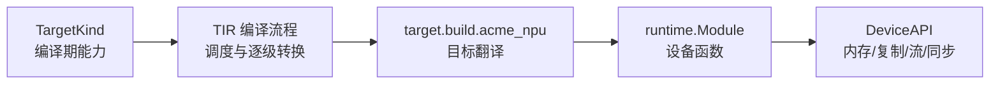

---
tags:
  - TVM
  - NPU
  - 编译器
  - Relax
  - TensorIR
status: maintained
baseline: Apache TVM v0.24.0
updated: 2026-07-29
---

# 18. 原生 TargetKind DeviceAPI 与 TIR 后端

> [!abstract] 本章内容
> 本章面向需要让 TVM 把 NPU 当作完整目标设备的项目，说明 TargetKind、Target 属性、TIR 调度、目标构建函数、runtime.Module 和 DeviceAPI 的职责与最小实现顺序。

## 18.1 何时采用

满足多个条件时再进入本路线：

- NPU 指令可由循环级程序稳定表达；
- 编译器能够直接控制片上缓冲区、DMA、矩阵或向量单元；
- 希望 TVM 调度和自动搜索决定分块与执行次序；
- 需要 TVM Tensor 直接驻留在 NPU 设备内存；
- 需要多个 TIR 内核以统一设备队列执行；
- 团队可以长期维护 Target、代码生成、运行时和测试。

若 NPU 只接受封装好的网络或大型子图，继续使用 BYOC 更合适。

## 18.2 四个必要组件



### TargetKind

声明目标名称、默认设备类型与合法属性。属性示例：

- `arch`：硬件代次；
- `matrix_m/n/k`：矩阵基本块；
- `sram_bytes`：编译可用片上空间；
- `vector_bytes`：向量宽度；
- `dma_alignment`：DMA 对齐；
- `max_commands`：单函数命令上限；
- `firmware_abi`：所需固件协议版本；
- `supports_async_copy`：异步复制能力。

### TIR 编译流程

把通用 PrimFunc 转为设备可处理的形式，包括循环规范化、内存作用域、缓冲区展平、内建函数降低和主机设备函数分离。每个 Pass 的输入条件要明确。

### 目标构建函数

以 `target.build.acme_npu` 注册，接收 IRModule 与 Target，返回 runtime.Module。它可以生成汇编、C 源码、设备二进制或命令包。

### DeviceAPI

在运行期实现设备属性、内存、复制、流与同步。Python 的 `tvm.runtime.device("acme_npu", 0)` 最终依赖设备类型与 DeviceAPI 注册。

## 18.3 TargetKind 注册骨架

官方架构文档要求在目标类型注册处增加：

```cpp
TVM_REGISTER_TARGET_KIND("acme_npu", kDLAcmeNPU)
    .add_attr_option<ffi::String>("arch")
    .add_attr_option<Integer>("matrix_m", Integer(16))
    .add_attr_option<Integer>("matrix_n", Integer(16))
    .add_attr_option<Integer>("matrix_k", Integer(32))
    .add_attr_option<Integer>("sram_bytes")
    .add_attr_option<Integer>("dma_alignment", Integer(64))
    .add_attr_option<Integer>("firmware_abi");
```

设备类型值必须按当前 TVM 与 DLPack 规则选择，并同步更新 C++ 与 Python 的设备名称表。不要私自与现有值冲突。

Python 侧使用：

```python
target = tvm.target.Target({
    "kind": "acme_npu",
    "arch": "npu_v1",
    "matrix_m": 16,
    "matrix_n": 16,
    "matrix_k": 32,
    "sram_bytes": 1048576,
    "dma_alignment": 64,
    "firmware_abi": 3,
})
```

## 18.4 调度与内存作用域

可定义类似 `npu.sram`、`npu.accumulator` 的存储区域名称，并在调度中使用：

```python
sch = tvm.s_tir.Schedule(mod)
block = sch.get_block("matmul")
i, j, k = sch.get_loops(block)
io, ii = sch.split(i, factors=[None, 16])
jo, ji = sch.split(j, factors=[None, 16])
ko, ki = sch.split(k, factors=[None, 32])
sch.reorder(io, jo, ko, ii, ji, ki)
aa = sch.cache_read(block, 0, "npu.sram")
bb = sch.cache_read(block, 1, "npu.sram")
cc = sch.cache_write(block, 0, "npu.sram")
```

调度只是建立程序组织。要真正使用矩阵指令，还需 Tensor Intrin 或后端内建调用，并保证描述函数、实现函数、缓冲区步长和数据类型完全一致。

## 18.5 Tensor Intrin

一个 Tensor Intrin 通常包含：

- 描述：小块计算结果如何得到；
- 实现：用硬件内建函数或外部调用完成相同工作；
- 缓冲区形状与步长要求；
- 作用域与对齐要求。

```python
TensorIntrin.register(
    "acme_npu.mma_i8_16x16x32",
    desc_func,
    impl_func,
)
sch.tensorize(loop_or_block, "acme_npu.mma_i8_16x16x32")
```

非整尺寸可以选择外层保护、填充到物理块、尾部使用向量单元，或保留给主机。选择必须与成本模型及数值规则一致。

## 18.6 目标构建函数

```cpp
tvm::runtime::Module BuildAcmeNPU(
    IRModule mod, Target target) {
  ValidateTarget(target);
  auto lowered = RunAcmeLowering(mod, target);
  auto binary = EmitAcmeBinary(lowered, target);
  return AcmeModuleCreate(binary, target);
}

TVM_FFI_STATIC_INIT_BLOCK() {
  namespace refl = tvm::ffi::reflection;
  refl::GlobalDef().def("target.build.acme_npu", BuildAcmeNPU);
}
```

构建函数不得查询本机实际 NPU，因为编译主机可能没有设备。所有需要的能力由 Target 提供。若某个属性缺失，应报告明确错误。

## 18.7 DeviceAPI 方法

| 方法类别 | 关键责任 |
| --- | --- |
| `GetAttr` | 设备存在、名称、总内存等运行期属性 |
| `SetDevice` | 选择当前设备 |
| `AllocDataSpace` / `FreeDataSpace` | 设备内存 |
| `CopyDataFromTo` | 主机与设备、设备内部复制 |
| `CreateStream` / `FreeStream` | 队列或流 |
| `SetStream` | 后续函数提交到当前流 |
| `StreamSync` | CPU 等待某个流 |
| `SyncStreamFromTo` | 建立两个流之间的先后关系 |

如果硬件只有一个队列，`CreateStream` 可返回空句柄，但同步行为仍需正确。异步复制必须保证源与目的缓冲区在事件完成前有效。

注册名称：

```cpp
TVM_FFI_STATIC_INIT_BLOCK() {
  namespace refl = tvm::ffi::reflection;
  refl::GlobalDef().def("device_api.acme_npu",
                        AcmeNPUDeviceAPI::Global);
}
```

## 18.8 主机与设备函数

最终程序常包含：

- 主机函数：参数检查、设备内存准备、内核发射；
- 设备函数：NPU 可执行内核；
- 导入关系：主机 Module 导入设备 Module；
- VM：按 Relax 控制流程调用主机包装或外部函数。

导出共享库时设备 Module 作为被导入模块序列化。加载后恢复导入关系，再由设备驱动创建实际执行对象。

## 18.9 最小实现顺序

1. 注册 TargetKind，能构造并读取属性；
2. 注册目标构建函数，返回只含空函数的 Module；
3. 实现一个向量加法 PrimFunc；
4. 实现设备内存与同步复制；
5. 执行单内核并对照 CPU；
6. 增加矩阵 Tensor Intrin；
7. 增加片上存储和 DMA；
8. 增加多流、异步复制和自动搜索；
9. 接到 Relax 编译流程；
10. 测试导出、加载和远程运行。

## 18.10 官方依据

- [Device/Target Interactions](https://tvm.apache.org/docs/arch/device_target_interactions.html)
- [Target API](https://tvm.apache.org/docs/reference/api/python/target.html)
- [Code Generation](https://tvm.apache.org/docs/arch/codegen.html)
- [TensorIR](https://tvm.apache.org/docs/deep_dive/tensor_ir/index.html)

## 官方资料基础上的扩展课

> [!note] 改写与引用说明
> 本节以所列 Apache TVM 官方资料和 v0.24.0 源码为依据，采用独立的中文结构、示例与解释。阅读顺序围绕“输入是什么、执行什么、输出如何检查、失败怎样定位”展开，并增加自研 NPU 场景。需要核对接口细节时，请打开官方页面并查看固定版本源码。

### 18.A 本节要解决的具体问题

当项目决定采用原生接入时，用一张注册清单检查 TargetKind、构建入口、设备代码模块和 DeviceAPI 是否齐全。

这类小例子的价值在于变量少、输出可直接观察。第一次运行时不要同时加入图改写、外部代码生成和真实设备执行；先确认当前层的输入与输出，再增加下一层。建议为本例新建独立目录，保存命令、标准输出、IR、编译产物摘要和环境信息。

### 18.B 示例一：最小可观察输入

**官方依据：** [设备与 Target 的交互](https://tvm.apache.org/docs/arch/device_target_interactions.html) 与 [代码生成](https://tvm.apache.org/docs/arch/codegen.html)。

**v0.24.0 源码位置：** `src/target/target_kind.cc`、`src/target/`、`src/runtime/`、`python/tvm/tirx/build.py`。

```text
TargetKind "acme_npu"
  attrs: model, revision, sram_bytes, dma_alignment
  build key: target.build.acme_npu
  module type: acme_npu

DeviceAPI kDLAcmeNPU
  SetDevice / GetAttr
  AllocDataSpace / FreeDataSpace
  CopyDataFromTo
  StreamCreate / StreamSync / StreamFree
```

按以下顺序执行：

1. 在新进程中确认 `tvm.__file__`、动态库路径和 TVM 提交，避免受到旧进程注册状态影响；
2. 复制示例到单独文件，只补充示例明确要求的输入对象，不先加入额外优化；
3. 执行后保存完整输出；若生成 IR，同时保存 `script(show_meta=True)` 的文本；
4. 把输出与下面的预期现象逐项比较，不以“没有抛出异常”代替功能检查；
5. 重复执行一次并比较主要产物，确认结果没有依赖临时全局状态或未固定的遍历顺序。

> [!success] 预期现象
> TargetKind 描述编译属性；构建入口把 TIR 转成设备模块；DeviceAPI 管理执行期设备资源。只注册其中一项不会自动得到其余功能。

> [!tip] 如何阅读输出
> 先看对象类型和函数数量，再看属性、调用形式、形状与数据类型，最后看运行结果或编译产物。若前一项不符合预期，先停止后续步骤。这样能把问题限定在最早出现差异的阶段。

### 18.C 示例二：只改变一个条件

暂时不实现异步流，只实现默认流。调用非默认流接口时必须明确报告不支持，不能忽略参数后继续执行，否则上层会错误地认为依赖已被满足。

执行第二个例子时，复制第一个例子的输入与环境，只修改上文指出的一项。把两个输出做结构比较，并写下以下四个答案：

1. 第一次出现差异的是哪一个阶段？
2. 差异表现为函数、属性、形状、数据类型、编译产物还是运行结果？
3. 当前行为是明确拒绝、交给其他后端执行，还是编译错误？
4. 日志是否足以让另一位开发者不查看本次进程状态也能复现？

如果同时观察到多个变化，应把第二个例子继续拆小。教程中的成功示例说明“怎样走通”，而单条件变化说明“系统为何作出这个决定”，两者缺一不可。

### 18.D 改造成自研 NPU 示例

先用单个向量加法完成端到端，再加入动态形状、多个函数、模块导出和远程执行。每增加一项，都要在不含完整编译器的只运行构建中重复加载测试。

改造时建议保留三份相互独立的输入：最小 Relax 或 TensorIR、设备编译器输入、运行时调用输入。三份输入使用同一个样本编号，并记录转换前后的关键字段。这样可以分别测试 TVM 变换、NPU 编译器和驱动，不需要每次都运行完整模型。

至少补充以下样本：

- 一个完全满足能力要求的正向样本；
- 一个只改变数据类型的反向样本；
- 一个只改变形状或属性的反向样本；
- 一个包含主机与 NPU 混合执行的样本；
- 一个导出后在新进程加载的样本；
- 若支持动态尺寸，再增加最小值、常用值和最大值附近的样本。

### 18.E 源码阅读任务

从上文列出的源码位置选择一个公开 API，依次找到 Python 调用、FFI 注册、C++ 实现和测试。记录函数签名、主要输入、主要输出、会写入的模块属性以及失败方式。若名称只在文档出现而源码中找不到，继续搜索注册字符串、属性键或错误文本。

> [!question] 章末练习
> 1. 不运行代码，先画出示例执行前后的对象关系；2. 运行后用实际输出修正图；3. 增加一个会被明确拒绝的输入；4. 说明若接入自研 NPU，哪一层需要改动，哪一层可以保持不变；5. 把结果整理成可由自动测试检查的断言。

### 18.F 完成标准

- [ ] 示例可在固定 v0.24.0 环境重复执行，或已明确列出所需可选依赖；
- [ ] 预期现象包含可检查的结构、字段或数值，不只是“运行成功”；
- [ ] 单条件变化能触发预期的拒绝、转交或结构差异；
- [ ] 能从官方页面定位到固定版本源码和测试；
- [ ] NPU 改造说明包含编译阶段、运行阶段与部署阶段；
- [ ] 失败时保留最小输入、环境、阶段输出和第一个错误。
