---
tags:
  - TVM
  - NPU
  - 编译器
  - Relax
  - TensorIR
status: maintained
baseline: Apache TVM v0.24.0
updated: 2026-07-29
---

# 19. 命令流、内存规划与数据布局

> [!abstract] 本章内容
> 本章把 Relax 子图转成可执行 NPU 任务，重点说明逻辑缓冲区、生命周期、片上存储、DMA、分块、命令依赖、地址重定位和数据布局。

## 19.1 从图到命令的中间层

不要让 Relax 节点直接写成硬件命令。建议先建立 NPU 内部 IR：

```text
Relax composite function
  → NPU graph IR
  → 布局与 dtype 规划
  → 分块计划
  → 逻辑缓冲区与生命周期
  → 引擎任务 DAG
  → 命令编码
  → 静态检查
  → 模块产物
```

内部 IR 给编译器留下插入重排、DMA、填充、尾部处理和同步的空间。硬件命令格式变化时，也不必重写整个 Relax 前端。

## 19.2 逻辑缓冲区

每个值先用逻辑缓冲区表示：

| 字段 | 说明 |
| --- | --- |
| id | 模块内唯一编号 |
| role | input、output、constant、workspace、scratch |
| 形状 | 逻辑尺寸 |
| 数据类型 | 元素类型 |
| 数据布局 | 数据布局 |
| size_bytes | 包含填充后的实际字节数 |
| alignment | 最小对齐 |
| memory_class | 主机、设备片外、片上 |
| lifetime | 首次写到最后一次读 |
| relocatable | 加载时是否需要重定位 |

编译期命令引用 buffer id 与偏移，运行时再把 buffer id 换成实际设备地址。这样同一模块可以在不同调用、不同设备地址下复用。

## 19.3 生命周期与复用

对任务 DAG 做拓扑排序后，可用首写位置与末读位置计算生命周期。两个生命周期不重叠的工作区可以共享同一物理区域，但下列情况需要保守处理：

- 异步 DMA 与计算仍在使用旧数据；
- 一个值有多个消费者；
- 原地写会覆盖仍需读取的输入；
- 多队列缺少明确事件关系；
- 调试模式要求保留中间值。

片上存储规划可采用线性扫描、空闲区列表或图着色。第一版建议使用容易验证的线性扫描，并在日志中打印每个缓冲区的偏移和生命周期。

## 19.4 分块选择

以矩阵乘法 `C[M,N] = A[M,K] × B[K,N]` 为例，分块至少受以下因素制约：

```text
A_tile_bytes + B_tile_bytes + C_partial_bytes
+ 双缓冲空间 + 对齐空隙 + 指令暂存
<= 可分配片上空间
```

选择 `Mt, Nt, Kt` 时同时考虑：

- 矩阵阵列的物理块；
- DMA 突发传输与行对齐；
- B 权重复用；
- C 部分和宽度；
- 双缓冲；
- M、N、K 尾部；
- 多核或多引擎并行；
- 工作区和命令数量。

较大分块不一定更快。它提高复用，也会占用更多片上空间，降低同时驻留任务数，并可能增加尾部浪费。

## 19.5 双缓冲

```mermaid
gantt
    title 双缓冲示意
    dateFormat X
    axisFormat %s
    section DMA
    载入分块 0 :a0, 0, 2
    载入分块 1 :a1, 2, 4
    载入分块 2 :a2, 4, 6
    section Matrix
    计算分块 0 :b0, 2, 4
    计算分块 1 :b1, 4, 6
    计算分块 2 :b2, 6, 8
```



双缓冲需要两个物理区域与明确事件。DMA 写入 buffer 1 时，矩阵单元读取 buffer 0；下一轮交换。编译器必须保证写端不会提前覆盖读端，固件必须正确实现事件等待。

## 19.6 命令依赖

推荐命令使用显式事件或前序位图，而不是依赖“提交次序自然正确”。示例：

```text
cmd 10: DMA_LOAD_A    signal=e10
cmd 11: DMA_LOAD_B    signal=e11
cmd 12: MATMUL        wait={e10,e11} signal=e12
cmd 13: VECTOR_RELU   wait={e12}     signal=e13
cmd 14: DMA_STORE_C   wait={e13}     signal=e14
```

编译器静态检查：

- 每个被等待事件都有生产者；
- 事件不会在仍被等待时错误复用；
- DAG 无环；
- 失败能传播到依赖命令；
- 最终输出命令可被主机等待；
- 命令数量不超过硬件上限。

## 19.7 数据布局

逻辑形状相同的数据可以有不同物理排列。例如二维权重 `[K,N]` 可按 `Ko, No, Ki, Ni` 分块，使 `Ki×Ni` 与矩阵单元一致。布局描述必须给出：

1. 逻辑维度与物理维度的对应关系；
2. 分块因子；
3. 维度次序；
4. 对齐与填充；
5. 元素打包方式；
6. 地址计算式；
7. 尾部未使用位置的写入规则。

建议把布局做成结构化对象，禁止只使用含糊字符串。编译器、权重转换工具、运行时和验证参考模型共同使用一份定义。

## 19.8 外部函数接口处的布局

有三种选择：

- 输入输出使用标准连续布局，外部函数内部转换；
- 模型参数预先转换，激活仍使用标准布局；
- 相邻 NPU 子图共享私有布局，只在主机与 NPU 交界处转换。

第三种可减少转换，但需要图级布局传播与更复杂的主机保留处理。第一版通常先选择第二种：权重离线转换，激活接口保持简单。

## 19.9 非整分块

四种方法：

| 方法 | 优点 | 成本 |
| --- | --- | --- |
| 硬件掩码 | 无额外填充 | 指令与 RTL 需要支持 |
| 填充输入 | 主计算规则简单 | 增加内存与 DMA |
| 小分块尾部 | 浪费较少 | 命令与调度更复杂 |
| 主机处理尾部 | 便于初期实现 | 增加主机设备交互 |

矩阵归约 K 尾部填充时，填充值必须使计算结果不变。带 zero point 的整数计算不能简单假定填 0 总是正确，应根据数值公式选择。

## 19.10 地址与安全

运行时重定位必须检查：

- `offset + size` 不溢出；
- 访问落在已分配缓冲区内；
- 读写权限正确；
- 对齐满足命令要求；
- 物理地址或 IOVA 位宽合法；
- 不允许命令访问任意主机地址；
- 常量区不可被写命令覆盖。

固件还应进行独立检查，不能只信任编译器。编译器检查提高开发效率，固件检查保护系统。

## 19.11 与本地规格对应

[[NPU 指令与硬件架构设计 Spec]] 定义了命令头、任务槽、L1BUF、DMA、Matrix、Vector、CME 与事件。编译器应把其中稳定规则实现为：

- Target 能力字段；
- NPU 内部 IR 约束；
- 分块选择器；
- 命令编码器；
- 静态检查器；
- 命令反汇编器；
- 参考模型；
- 模块级与系统级测试。

## 19.12 评审清单

- [ ] 每个命令地址都由逻辑缓冲区重定位得到；
- [ ] 每个缓冲区大小包含对齐、填充与打包；
- [ ] 生命周期考虑异步执行；
- [ ] 非整分块有明确方法；
- [ ] 事件无未定义生产者与错误复用；
- [ ] 布局地址公式有正反向测试；
- [ ] 片上占用不超过能力值；
- [ ] 命令可离线解析；
- [ ] 静态检查与固件检查各自存在；
- [ ] 性能日志能分解 DMA 与计算时间。

## 实现说明与验证步骤

> [!note] 依据与适用范围
> 本节依据所列 Apache TVM 官方资料和 v0.24.0 源码整理，给出输入条件、操作步骤、预期结果、异常处理和自研 NPU 适配要求。接口细节以固定版本源码与测试为准，在线页面用于补充说明。

### 19.A 目标与适用范围

以 MatMul+Bias+ReLU 为例，从张量形状推导分块、片上缓冲区和 DMA 命令，并把所有推导结果写成可检查文件。

参考样本保持输入规模较小，以便直接检查对象、字段和输出。首次执行时不要同时加入图改写、外部代码生成和真实设备执行；应先确认当前阶段的输入与输出，再增加后续处理。建议为该项验证建立独立目录，保存命令、标准输出、IR、编译产物摘要和环境信息。

### 19.B 参考实现

**官方依据：** [设备与 Target 的交互](https://tvm.apache.org/docs/arch/device_target_interactions.html) 与 [TVM 运行时系统](https://tvm.apache.org/docs/arch/runtime.html)。

**v0.24.0 源码位置：** `src/relax/backend/contrib/`、`src/runtime/`、自研命令格式与固件文档。

```yaml
function: fused_matmul_bias_relu_0
inputs:
  - {name: x, shape: [32, 128], dtype: fp16}
  - {name: w, shape: [128, 256], dtype: fp16}
tiling: {m: 16, n: 64, k: 32}
buffers:
  - {name: x_tile, memory: l1, bytes: 1024}
  - {name: w_tile, memory: l1, bytes: 4096}
  - {name: acc, memory: l1, bytes: 4096}
commands:
  - dma_load_x
  - dma_load_w
  - matmul
  - add_bias_relu
  - dma_store_y
```

按以下顺序执行：

1. 在新进程中确认 `tvm.__file__`、动态库路径和 TVM 提交，避免受到旧进程注册状态影响；
2. 将参考实现保存到单独文件，只补充本节明确要求的输入对象，不先加入额外优化；
3. 执行后保存完整输出；若生成 IR，同时保存 `script(show_meta=True)` 的文本；
4. 把输出与下面的预期现象逐项比较，不以“没有抛出异常”代替功能检查；
5. 重复执行一次并比较主要产物，确认结果没有依赖临时全局状态或未固定的遍历顺序。

> [!success] 预期现象
> 每个缓冲区大小应能由分块和数据类型重新计算；命令引用的地址必须来自已分配对象；加载、计算和写回的依赖关系应可由模拟器检查。

> [!tip] 输出检查顺序
> 先看对象类型和函数数量，再看属性、调用形式、形状与数据类型，最后看运行结果或编译产物。若前一项不符合预期，先停止后续步骤。这样能把问题限定在最早出现差异的阶段。

### 19.C 单项条件验证

把 `n` 分块从 64 改为 96，重新计算片上容量和指令字段。若超过容量，应在计划阶段拒绝，而不是生成被固件截断的字段。

执行条件变化样本时，复制参考实现的输入与环境，只修改上文指出的一项。对两个输出进行结构比较，并记录以下四项：

1. 第一次出现差异的是哪一个阶段？
2. 差异表现为函数、属性、形状、数据类型、编译产物还是运行结果？
3. 当前行为是明确拒绝、交给其他后端执行，还是编译错误？
4. 日志是否足以让另一位开发者不查看本次进程状态也能复现？

如果同时观察到多个变化，应继续缩小条件变化样本。参考实现用于确认正常处理，单项条件验证用于确认系统为何接受、拒绝或转交当前输入。

### 19.D 自研 NPU 适配要求

为命令格式编写解码器和静态检查工具。代码生成测试既比较高层字段，也把二进制反解后比较，防止打包位段与文档说明不一致。

改造时建议保留三份相互独立的输入：最小 Relax 或 TensorIR、设备编译器输入、运行时调用输入。三份输入使用同一个样本编号，并记录转换前后的关键字段。这样可以分别测试 TVM 变换、NPU 编译器和驱动，不需要每次都运行完整模型。

至少补充以下样本：

- 一个完全满足能力要求的正向样本；
- 一个只改变数据类型的反向样本；
- 一个只改变形状或属性的反向样本；
- 一个包含主机与 NPU 混合执行的样本；
- 一个导出后在新进程加载的样本；
- 若支持动态尺寸，再增加最小值、常用值和最大值附近的样本。

### 19.E 源码定位

从上文列出的源码位置选择一个公开 API，依次找到 Python 调用、FFI 注册、C++ 实现和测试。记录函数签名、主要输入、主要输出、会写入的模块属性以及失败方式。若名称只在文档出现而源码中找不到，继续搜索注册字符串、属性键或错误文本。

> [!important] 验证项目
> 1. 执行前记录参考实现的对象关系；2. 执行后用实际输出修正记录；3. 增加一个会被明确拒绝的输入；4. 标明自研 NPU 接入需要修改的层次与保持不变的层次；5. 把结果整理成可由自动测试检查的断言。

### 19.F 检查清单

- [ ] 示例可在固定 v0.24.0 环境重复执行，或已明确列出所需可选依赖；
- [ ] 预期现象包含可检查的结构、字段或数值，不只是“运行成功”；
- [ ] 单条件变化能触发预期的拒绝、转交或结构差异；
- [ ] 能从官方页面定位到固定版本源码和测试；
- [ ] NPU 改造说明包含编译阶段、运行阶段与部署阶段；
- [ ] 失败时保留最小输入、环境、阶段输出和第一个错误。
