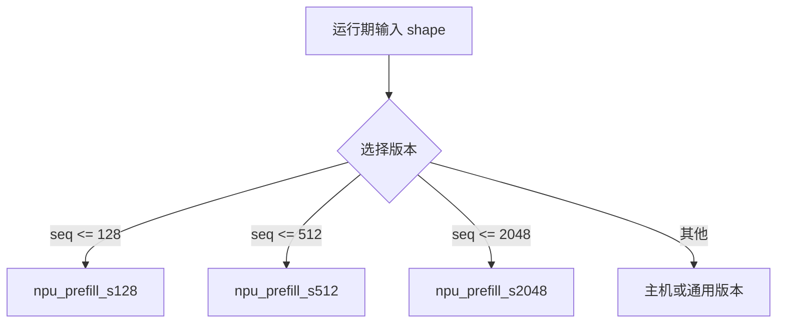

---
tags:
  - TVM
  - NPU
  - 编译器
  - Relax
  - TensorIR
status: maintained
baseline: Apache TVM v0.24.0
updated: 2026-07-29
---

# 21. 动态形状、控制流与异构回退

> [!abstract] 本章内容
> 本章说明 Relax 如何保留符号尺寸与控制流，自研 NPU 后端如何选择静态特化、范围编译或运行期分派，以及不被接受的节点怎样安全地交给主机。

## 21.1 三类尺寸

| 类型 | 例子 | 编译策略 |
| --- | --- | --- |
| 完全静态 | 图像模型 `1×3×224×224` | 直接编译 |
| 有限集合 | batch ∈ {1,2,4,8} | 多版本特化 |
| 范围动态 | sequence ∈ `[1,4096]` | 范围产物或运行期选择 |

完全未知的维度会影响工作区、分块、命令数和设备时间。第一版可以拒绝范围动态，但必须由分区检查函数明确拒绝，不能在代码生成器深处崩溃。

## 21.2 Relax 符号尺寸

Relax TensorStructInfo 可包含符号变量。后端检查时区分：

- 是否已知秩；
- 每个维度是常量、符号还是表达式；
- 是否存在上限；
- 维度之间是否有相等或整除关系；
- 运行期是否需要把尺寸传给外部函数。

若硬件要求 K 为 32 的倍数，符号 K 可以携带约束，也可以在运行时加守卫：

```text
if K % 32 == 0 and K <= 4096:
    call acme_npu_matmul
else:
    call host_matmul
```

运行期守卫增加控制开销，但允许一个可执行对象处理更多输入。

## 21.3 多版本特化

对常见 batch 或 sequence 长度分别编译：



较大版本可以使用填充处理较小输入，但要评估额外计算和数据搬运。版本选择表应进入模块元数据，运行时只做简单查询。

## 21.4 动态工作区

工作区大小可表示成符号尺寸函数，例如：

$$
W(B,S,H)=\operatorname{align}(B\cdot S\cdot H,64)+W_{temp}
$$

编译器保存表达式或上限，运行时取得实际尺寸后计算。必须检查乘法溢出与上限。若申请失败，返回内存不足，不能缩小缓冲区继续执行。

## 21.5 控制流

Relax 支持 `If` 等控制。常见策略：

- 分支整体留在 VM，分支内部的可接纳子图进入 NPU；
- 两个分支都编译成外部函数，VM 在运行期选择；
- 若条件在编译期已知，先折叠不可能分支；
- NPU 有原生控制能力时，可在子图编译器内部处理，但调试复杂度更高。

VM 只组织控制，不执行张量计算。分支返回的 TensorStructInfo 必须兼容。

## 21.6 主机保留

异构模型通常包含：

```text
主机算子
  → 复制到 NPU
  → NPU 子图
  → 复制到主机
  → 主机算子
  → 复制到 NPU
  → NPU 子图
```

每次设备切换都有固定开销。分区成本模型需要估算复制字节和提交次数，小运算即使硬件支持，也可能留在主机更快。

## 21.7 设备间 Tensor

若使用 BYOC 且运行时内部管理 NPU 内存，外部函数输入输出可能仍以主机 Tensor 呈现，由运行时复制。若实现 DeviceAPI，Tensor 可直接处于 NPU 设备。两种设计的差别：

| 方面 | BYOC 内部复制 | DeviceAPI |
| --- | --- | --- |
| 第一版工作量 | 较小 | 较大 |
| 跨外部函数保持设备数据 | 需运行时自建机制 | 更自然 |
| TVM 统一设备复制 | 较弱 | 完整 |
| 与已有 SDK 配合 | 容易 | 需适配 |
| 多设备控制 | 后端自管 | TVM 设备模型 |

## 21.8 不被接受时的原则

1. 在分区阶段发现不符合条件，保留原 Relax 节点；
2. 在代码生成阶段发现内部编译失败，可配置为报告编译错误，或重新编译时禁用该模式；
3. 运行期设备执行失败一般不能自动改用主机重算，除非输出尚未对外可见、输入仍有效且调用被设计为可重试；
4. 任何重试都应记录原因，避免静默隐藏设备缺陷。

> [!warning] 不要把运行期失败等同于普通主机保留
> 分区阶段的主机保留是编译计划的一部分；运行期设备失败可能已经部分写入输出或改变状态，直接重算需要严格的事务与状态设计。

## 21.9 状态型模型

KV Cache、RNN state、随机数状态和设备驻留参数具有跨调用状态。需要说明：

- 状态的拥有者；
- 初始化与销毁；
- 多会话隔离；
- 形状增长；
- 设备复位后的恢复；
- 并发访问；
- 导出可执行文件是否包含初始状态。

状态更新失败后不能只返回旧状态继续运行，否则后续输出会持续错误。

## 21.10 测试矩阵

| 维度 | 值 |
| --- | --- |
| batch | 1、常见值、上限、上限+1 |
| sequence | 0、1、分块-1、分块、分块+1、最大 |
| 分支 | true、false、编译期常量 |
| 后端组合 | 全 NPU、部分 NPU、全主机 |
| 工作区 | 正常、刚好上限、申请失败 |
| 状态 | 首次、重复、多会话、复位后 |
| 设备 | 0、1、不存在 |

## 21.11 设计问题

> [!question] 请写入项目设计
> 哪些维度静态？哪些允许有限集合？是否生成运行期守卫？守卫失败交给哪个后端？设备间复制由 VM、DeviceAPI 还是 NPU 运行时完成？状态由谁拥有？设备失败是否允许重试？

## 官方资料基础上的扩展课

> [!note] 改写与引用说明
> 本节以所列 Apache TVM 官方资料和 v0.24.0 源码为依据，采用独立的中文结构、示例与解释。阅读顺序围绕“输入是什么、执行什么、输出如何检查、失败怎样定位”展开，并增加自研 NPU 场景。需要核对接口细节时，请打开官方页面并查看固定版本源码。

### 21.A 本节要解决的具体问题

一个模型的第一个维度为符号值 `n`。编译器需要保留符号关系，并决定 NPU 是支持任意值、只支持若干档位，还是暂由主机执行。

这类小例子的价值在于变量少、输出可直接观察。第一次运行时不要同时加入图改写、外部代码生成和真实设备执行；先确认当前层的输入与输出，再增加下一层。建议为本例新建独立目录，保存命令、标准输出、IR、编译产物摘要和环境信息。

### 21.B 示例一：最小可观察输入

**官方依据：** [Relax 抽象](https://tvm.apache.org/docs/deep_dive/relax/abstraction.html) 与 [Relax VM](https://tvm.apache.org/docs/arch/relax_vm.html)。

**v0.24.0 源码位置：** `docs/deep_dive/relax/abstraction.rst`、`docs/arch/relax_vm.rst`、`src/relax/analysis/`。

```python
import tvm
from tvm.script import ir as I
from tvm.script import relax as R
from tvm.script import tirx as T

@I.ir_module
class DynamicAdd:
    @R.function
    def main(
        x: R.Tensor(("n", 128), "float32"),
        y: R.Tensor(("n", 128), "float32"),
    ):
        return R.add(x, y)
```

按以下顺序执行：

1. 在新进程中确认 `tvm.__file__`、动态库路径和 TVM 提交，避免受到旧进程注册状态影响；
2. 复制示例到单独文件，只补充示例明确要求的输入对象，不先加入额外优化；
3. 执行后保存完整输出；若生成 IR，同时保存 `script(show_meta=True)` 的文本；
4. 把输出与下面的预期现象逐项比较，不以“没有抛出异常”代替功能检查；
5. 重复执行一次并比较主要产物，确认结果没有依赖临时全局状态或未固定的遍历顺序。

> [!success] 预期现象
> 模块保留符号维度，而不是把它替换成一次测试使用的数值。外部函数输入输出也必须保存相同关系；运行时用实际形状选择命令版本或触发重新编译。

> [!tip] 如何阅读输出
> 先看对象类型和函数数量，再看属性、调用形式、形状与数据类型，最后看运行结果或编译产物。若前一项不符合预期，先停止后续步骤。这样能把问题限定在最早出现差异的阶段。

### 21.C 示例二：只改变一个条件

分别运行 `n=1`、`n=17` 和超过设备最大值的输入。前两者应选择正确版本或尾部实现，最后一个应得到清楚的拒绝或转交结果。

执行第二个例子时，复制第一个例子的输入与环境，只修改上文指出的一项。把两个输出做结构比较，并写下以下四个答案：

1. 第一次出现差异的是哪一个阶段？
2. 差异表现为函数、属性、形状、数据类型、编译产物还是运行结果？
3. 当前行为是明确拒绝、交给其他后端执行，还是编译错误？
4. 日志是否足以让另一位开发者不查看本次进程状态也能复现？

如果同时观察到多个变化，应把第二个例子继续拆小。教程中的成功示例说明“怎样走通”，而单条件变化说明“系统为何作出这个决定”，两者缺一不可。

### 21.D 改造成自研 NPU 示例

缓存键包含符号约束与实际专门化尺寸。控制流模型还要确认两个分支的设备与返回结构一致；跨设备复制必须出现在可检查的位置。

改造时建议保留三份相互独立的输入：最小 Relax 或 TensorIR、设备编译器输入、运行时调用输入。三份输入使用同一个样本编号，并记录转换前后的关键字段。这样可以分别测试 TVM 变换、NPU 编译器和驱动，不需要每次都运行完整模型。

至少补充以下样本：

- 一个完全满足能力要求的正向样本；
- 一个只改变数据类型的反向样本；
- 一个只改变形状或属性的反向样本；
- 一个包含主机与 NPU 混合执行的样本；
- 一个导出后在新进程加载的样本；
- 若支持动态尺寸，再增加最小值、常用值和最大值附近的样本。

### 21.E 源码阅读任务

从上文列出的源码位置选择一个公开 API，依次找到 Python 调用、FFI 注册、C++ 实现和测试。记录函数签名、主要输入、主要输出、会写入的模块属性以及失败方式。若名称只在文档出现而源码中找不到，继续搜索注册字符串、属性键或错误文本。

> [!question] 章末练习
> 1. 不运行代码，先画出示例执行前后的对象关系；2. 运行后用实际输出修正图；3. 增加一个会被明确拒绝的输入；4. 说明若接入自研 NPU，哪一层需要改动，哪一层可以保持不变；5. 把结果整理成可由自动测试检查的断言。

### 21.F 完成标准

- [ ] 示例可在固定 v0.24.0 环境重复执行，或已明确列出所需可选依赖；
- [ ] 预期现象包含可检查的结构、字段或数值，不只是“运行成功”；
- [ ] 单条件变化能触发预期的拒绝、转交或结构差异；
- [ ] 能从官方页面定位到固定版本源码和测试；
- [ ] NPU 改造说明包含编译阶段、运行阶段与部署阶段；
- [ ] 失败时保留最小输入、环境、阶段输出和第一个错误。
