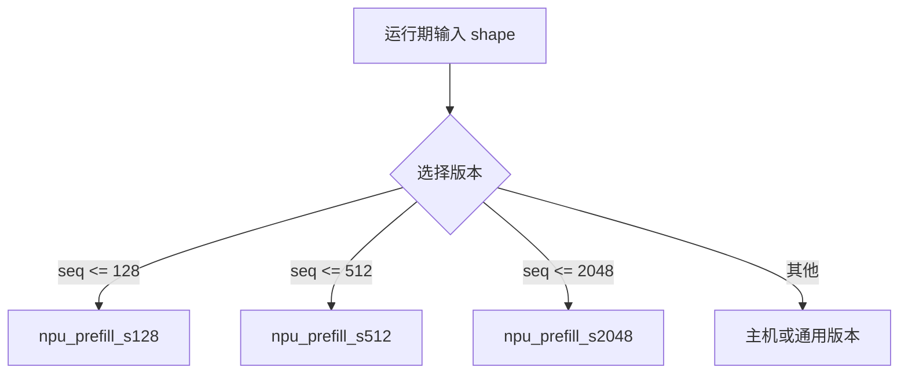

---
tags:
  - TVM
  - NPU
  - 编译器
  - Relax
  - TensorIR
status: maintained
baseline: Apache TVM v0.24.0
updated: 2026-07-29
---

# 21. 动态形状、控制流与异构回退

> [!abstract] 本章内容
> 本章说明 Relax 如何保留符号尺寸与控制流，自研 NPU 后端如何选择静态特化、范围编译或运行期分派，以及不被接受的节点怎样安全地交给主机。

## 21.1 三类尺寸

| 类型 | 例子 | 编译策略 |
| --- | --- | --- |
| 完全静态 | 图像模型 `1×3×224×224` | 直接编译 |
| 有限集合 | batch ∈ {1,2,4,8} | 多版本特化 |
| 范围动态 | sequence ∈ `[1,4096]` | 范围产物或运行期选择 |

完全未知的维度会影响工作区、tile、命令数和设备时间。首版可以拒绝范围动态，但必须由分区检查函数明确拒绝，不能在代码生成器深处崩溃。

## 21.2 Relax 符号尺寸

Relax TensorStructInfo 可包含符号变量。后端检查时区分：

- 是否已知秩；
- 每个维度是常量、符号还是表达式；
- 是否存在上限；
- 维度之间是否有相等或整除关系；
- 运行期是否需要把尺寸传给外部函数。

若硬件要求 K 为 32 的倍数，符号 K 可以携带约束，也可以在运行时加守卫：

```text
if K % 32 == 0 and K <= 4096:
    call acme_npu_matmul
else:
    call host_matmul
```

运行期守卫增加控制开销，但允许一个可执行对象处理更多输入。

## 21.3 多版本特化

对常见 batch 或 sequence 长度分别编译：



较大版本可以使用填充处理较小输入，但要评估额外计算和数据搬运。版本选择表应进入模块元数据，运行时只做简单查询。

## 21.4 动态工作区

工作区大小可表示成符号尺寸函数，例如：

$$
W(B,S,H)=\operatorname{align}(B\cdot S\cdot H,64)+W_{temp}
$$

编译器保存表达式或上限，运行时取得实际尺寸后计算。必须检查乘法溢出与上限。若申请失败，返回内存不足，不能缩小缓冲区继续执行。

## 21.5 控制流

Relax 支持 `If` 等控制。常见策略：

- 分支整体留在 VM，分支内部的可接纳子图进入 NPU；
- 两个分支都编译成外部函数，VM 在运行期选择；
- 若条件在编译期已知，先折叠不可能分支；
- NPU 有原生控制能力时，可在子图编译器内部处理，但调试复杂度更高。

VM 只组织控制，不执行张量计算。分支返回的 TensorStructInfo 必须兼容。

## 21.6 主机保留

异构模型通常包含：

```text
Host op
  → copy to NPU
  → NPU subgraph
  → copy to Host
  → Host op
  → copy to NPU
  → NPU subgraph
```

每次设备切换都有固定开销。分区成本模型需要估算复制字节和提交次数，小运算即使硬件支持，也可能留在主机更快。

## 21.7 设备间 Tensor

若使用 BYOC 且运行时内部管理 NPU 内存，外部函数输入输出可能仍以主机 Tensor 呈现，由运行时复制。若实现 DeviceAPI，Tensor 可直接处于 NPU 设备。两种设计的差别：

| 方面 | BYOC 内部复制 | DeviceAPI |
| --- | --- | --- |
| 首版工作量 | 较小 | 较大 |
| 跨外部函数保持设备数据 | 需运行时自建机制 | 更自然 |
| TVM 统一设备复制 | 较弱 | 完整 |
| 与已有 SDK 配合 | 容易 | 需适配 |
| 多设备控制 | 后端自管 | TVM 设备模型 |

## 21.8 不被接受时的原则

1. 在分区阶段发现不符合条件，保留原 Relax 节点；
2. 在代码生成阶段发现内部编译失败，可配置为报告编译错误，或重新编译时禁用该模式；
3. 运行期设备执行失败一般不能自动改用主机重算，除非输出尚未对外可见、输入仍有效且调用被设计为可重试；
4. 任何重试都应记录原因，避免静默隐藏设备缺陷。

> [!warning] 不要把运行期失败等同于普通主机保留
> 分区阶段的主机保留是编译计划的一部分；运行期设备失败可能已经部分写入输出或改变状态，直接重算需要严格的事务与状态设计。

## 21.9 状态型模型

KV Cache、RNN state、随机数状态和设备驻留参数具有跨调用状态。需要说明：

- 状态的拥有者；
- 初始化与销毁；
- 多会话隔离；
- 形状增长；
- 设备复位后的恢复；
- 并发访问；
- 导出可执行文件是否包含初始状态。

状态更新失败后不能只返回旧状态继续运行，否则后续输出会持续错误。

## 21.10 测试矩阵

| 维度 | 值 |
| --- | --- |
| batch | 1、常见值、上限、上限+1 |
| sequence | 0、1、tile-1、tile、tile+1、最大 |
| 分支 | true、false、编译期常量 |
| 后端组合 | 全 NPU、部分 NPU、全主机 |
| 工作区 | 正常、刚好上限、申请失败 |
| 状态 | 首次、重复、多会话、复位后 |
| 设备 | 0、1、不存在 |

## 21.11 设计问题

> [!question] 请写入项目设计
> 哪些维度静态？哪些允许有限集合？是否生成运行期守卫？守卫失败交给哪个后端？设备间复制由 VM、DeviceAPI 还是 NPU Runtime 完成？状态由谁拥有？设备失败是否允许重试？
