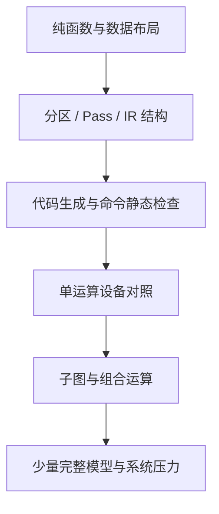

---
tags:
  - TVM
  - NPU
  - 编译器
  - Relax
  - TensorIR
status: maintained
baseline: Apache TVM v0.24.0
updated: 2026-07-29
---

# 22. 正确性测试与持续集成

> [!abstract] 本章内容
> 本章建立从模式注册、分区、代码生成、模块保存、运行时、驱动到模型结果的测试金字塔，并给出 CI 配置、随机测试、异常注入和回归资产管理方法。

## 22.1 测试金字塔



越靠下的测试数量越多、执行越快、定位越直接。完整模型测试不能替代数据布局和命令字段单测。

## 22.2 Python 编译器测试

### 模式注册

```python
patterns = get_patterns_with_prefix("acme_npu")
names = {p.name for p in patterns}
assert "acme_npu.matmul_bias_relu" in names
```

### 结构比较

构造输入模块、运行单个 Pass，并与期望模块执行：

```python
tvm.ir.assert_structural_equal(actual, expected)
```

覆盖被接纳与不被接纳的情况。每条硬件限制至少有一个刚好满足和一个刚好不满足的样本。

### 重复执行

同一 Pass 连续运行两次，第二次不应继续产生新函数或多套属性。相同输入和配置应得到结构相同的输出。

## 22.3 C++ 代码生成测试

不连接真实设备也可测试：

- 外部函数符号；
- 运算属性读取；
- 常量索引；
- 布局选择；
- 工作区大小；
- 命令数量；
- 地址重定位项；
- 固件 ABI；
- 非法输入错误；
- 二进制保存与加载。

对命令包做“编译 → 反汇编 → 再编码”往返测试，保证字段工具与编码器一致。

## 22.4 单运算设备测试

每个运算按 [[30-自研 NPU 算子接入分册]] 的规格说明建立尺寸集合。以 MatMul 为例：

- M、N、K 等于 1；
- 每个维度为物理分块的前一值、整值和后一值；
- 长条矩阵、方阵、批矩阵；
- 极值、随机值、稀疏值；
- bias、激活与无 bias；
- 重复运行和并发；
- 输入输出地址对齐与故意未对齐。

设备结果同时与高精度参考和位准确参考比较。

## 22.5 组合运算测试

组合运算应证明中间值未写回片外，而不仅是结果正确。可通过：

- 命令反汇编中不存在中间 store/load；
- 设备性能计数器的片外字节减少；
- 中间逻辑缓冲区被分配到片上；
- 与拆分执行结果比较；
- 组合开关关闭时仍能正确运行。

## 22.6 模型测试

模型集按网络结构选择，不只按知名度：

| 结构 | 代表关注点 |
| --- | --- |
| CNN | Conv、Depthwise、Pool、残差 |
| MLP | MatMul、bias、激活 |
| Transformer encoder | Attention、Norm、GELU |
| Decoder | KV Cache、动态 sequence、状态 |
| RNN / LSTM | 循环状态、门函数 |
| 检测模型 | 多输出、NMS 主机保留 |

保存模型来源、散列值、输入预处理、源框架版本和参考输出。

## 22.7 属性测试与随机测试

适合自动生成的性质：

- 打包后解包得到原始值；
- 重排后反排得到原始 Tensor；
- 分块切分覆盖每个逻辑元素恰好一次；
- 生命周期分配的同时存活缓冲区不重叠；
- 命令依赖图无环；
- 每个读取都有先前写入或输入来源；
- 静态检查接受的命令可被参考解释器执行；
- 同一输入多次编译结构稳定。

失败的随机种子必须保存为固定回归样本。

## 22.8 异常注入

| 注入位置 | 示例 |
| --- | --- |
| 编译器 | 不受支持数据类型、缺少属性、过大工作区 |
| 模块加载 | 错误 magic、截断文件、ABI 不兼容 |
| 内存 | 申请失败、未对齐、越界重定位 |
| 驱动 | busy、timeout、ioctl 错误 |
| 固件 | 非法 opcode、事件不存在、看门狗 |
| 硬件 | DMA fault、执行单元错误、中断丢失 |

异常测试确认错误码、资源清理、设备状态和后续恢复，而不只是确认进程退出。

## 22.9 CI 构建矩阵

```text
1. TVM compiler + acme codegen + acme runtime
2. TVM runtime-only + acme runtime
3. compiler without acme flags
4. Debug + assertions
5. RelWithDebInfo
6. Python unit tests
7. C++ unit tests
8. 模块导出/新进程加载
9. 模拟器设备测试
10. 每日真实板卡测试
```

真实板卡数量有限时，提交级 CI 运行编译器与模拟器，每日或合入队列运行板卡。板卡任务要锁定设备、记录温度频率和固件版本。

## 22.10 精度与性能门限

功能门限与性能门限分开。功能不通过时性能结果无效。建议门限包括：

- 位级或误差要求；
- 子图接纳数量不得意外下降；
- 编译时间；
- 产物大小；
- 峰值内存；
- 端到端时延；
- 片外字节；
- 设备错误率；
- 长时间运行稳定性。

性能波动要使用统计范围，避免一次测量造成误报。

## 22.11 回归资产

每个失败问题留下：

1. 最小模型或 IRModule；
2. 输入与常量；
3. Target 和后端配置；
4. 期望结果；
5. 失败产物或命令摘要；
6. 软件、固件和硬件版本；
7. 首次失败阶段；
8. 修复后的测试名称。

## 22.12 官方依据

- [Testing TVM](https://tvm.apache.org/docs/contribute/testing.html)
- [Example NPU tests](https://github.com/apache/tvm/blob/v0.24.0/tests/python/contrib/test_example_npu.py)
- [Pass Infrastructure](https://tvm.apache.org/docs/arch/pass_infra.html)

## 官方资料基础上的扩展课

> [!note] 改写与引用说明
> 本节以所列 Apache TVM 官方资料和 v0.24.0 源码为依据，采用独立的中文结构、示例与解释。阅读顺序围绕“输入是什么、执行什么、输出如何检查、失败怎样定位”展开，并增加自研 NPU 场景。需要核对接口细节时，请打开官方页面并查看固定版本源码。

### 22.A 本节要解决的具体问题

为 MatMul 模式建立四层测试：模式识别、能力检查、编译产物解析和真实设备结果。每层使用相同样本编号。

这类小例子的价值在于变量少、输出可直接观察。第一次运行时不要同时加入图改写、外部代码生成和真实设备执行；先确认当前层的输入与输出，再增加下一层。建议为本例新建独立目录，保存命令、标准输出、IR、编译产物摘要和环境信息。

### 22.B 示例一：最小可观察输入

**官方依据：** [持续集成指南](https://tvm.apache.org/docs/contribute/ci.html) 与 [导入模型教程](https://tvm.apache.org/docs/how_to/tutorials/import_model.html)。

**v0.24.0 源码位置：** `tests/python/relax/`、`tests/cpp/`、`docs/contribute/ci.rst`。

```python
import numpy as np

CASES = [
    ((1, 16), (16, 32)),
    ((3, 17), (17, 31)),
    ((16, 64), (64, 64)),
]

def compare(actual, expected):
    np.testing.assert_allclose(
        actual,
        expected,
        rtol=1e-4,
        atol=1e-5,
    )
```

按以下顺序执行：

1. 在新进程中确认 `tvm.__file__`、动态库路径和 TVM 提交，避免受到旧进程注册状态影响；
2. 复制示例到单独文件，只补充示例明确要求的输入对象，不先加入额外优化；
3. 执行后保存完整输出；若生成 IR，同时保存 `script(show_meta=True)` 的文本；
4. 把输出与下面的预期现象逐项比较，不以“没有抛出异常”代替功能检查；
5. 重复执行一次并比较主要产物，确认结果没有依赖临时全局状态或未固定的遍历顺序。

> [!success] 预期现象
> 规则层测试结构，产物层测试字段和完整性，运行层测试数值。奇数尺寸与非对齐尺寸能暴露尾部问题；只测试方阵和整齐尺寸会遗漏大量错误。

> [!tip] 如何阅读输出
> 先看对象类型和函数数量，再看属性、调用形式、形状与数据类型，最后看运行结果或编译产物。若前一项不符合预期，先停止后续步骤。这样能把问题限定在最早出现差异的阶段。

### 22.C 示例二：只改变一个条件

让能力检查错误地接纳一个设备不支持的数据类型。测试应在规则层立即失败，并指出原因码；若直到设备执行才失败，说明层次划分不够清楚。

执行第二个例子时，复制第一个例子的输入与环境，只修改上文指出的一项。把两个输出做结构比较，并写下以下四个答案：

1. 第一次出现差异的是哪一个阶段？
2. 差异表现为函数、属性、形状、数据类型、编译产物还是运行结果？
3. 当前行为是明确拒绝、交给其他后端执行，还是编译错误？
4. 日志是否足以让另一位开发者不查看本次进程状态也能复现？

如果同时观察到多个变化，应把第二个例子继续拆小。教程中的成功示例说明“怎样走通”，而单条件变化说明“系统为何作出这个决定”，两者缺一不可。

### 22.D 改造成自研 NPU 示例

设备测试按硬件可用性分组，但模拟器与序列化测试应在每次提交运行。失败样本保存模型、输入、参考输出、编译配置、固件版本和设备日志。

改造时建议保留三份相互独立的输入：最小 Relax 或 TensorIR、设备编译器输入、运行时调用输入。三份输入使用同一个样本编号，并记录转换前后的关键字段。这样可以分别测试 TVM 变换、NPU 编译器和驱动，不需要每次都运行完整模型。

至少补充以下样本：

- 一个完全满足能力要求的正向样本；
- 一个只改变数据类型的反向样本；
- 一个只改变形状或属性的反向样本；
- 一个包含主机与 NPU 混合执行的样本；
- 一个导出后在新进程加载的样本；
- 若支持动态尺寸，再增加最小值、常用值和最大值附近的样本。

### 22.E 源码阅读任务

从上文列出的源码位置选择一个公开 API，依次找到 Python 调用、FFI 注册、C++ 实现和测试。记录函数签名、主要输入、主要输出、会写入的模块属性以及失败方式。若名称只在文档出现而源码中找不到，继续搜索注册字符串、属性键或错误文本。

> [!question] 章末练习
> 1. 不运行代码，先画出示例执行前后的对象关系；2. 运行后用实际输出修正图；3. 增加一个会被明确拒绝的输入；4. 说明若接入自研 NPU，哪一层需要改动，哪一层可以保持不变；5. 把结果整理成可由自动测试检查的断言。

### 22.F 完成标准

- [ ] 示例可在固定 v0.24.0 环境重复执行，或已明确列出所需可选依赖；
- [ ] 预期现象包含可检查的结构、字段或数值，不只是“运行成功”；
- [ ] 单条件变化能触发预期的拒绝、转交或结构差异；
- [ ] 能从官方页面定位到固定版本源码和测试；
- [ ] NPU 改造说明包含编译阶段、运行阶段与部署阶段；
- [ ] 失败时保留最小输入、环境、阶段输出和第一个错误。
