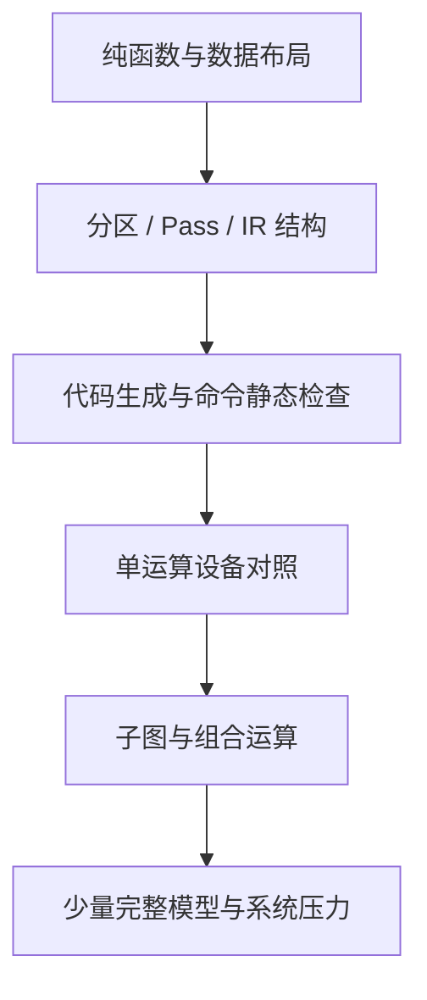

---
tags:
  - TVM
  - NPU
  - 编译器
  - Relax
  - TensorIR
status: maintained
baseline: Apache TVM v0.24.0
updated: 2026-07-29
---

# 22. 正确性测试与持续集成

> [!abstract] 本章内容
> 本章建立从模式注册、分区、代码生成、模块保存、运行时、驱动到模型结果的测试金字塔，并给出 CI 配置、随机测试、异常注入和回归资产管理方法。

## 22.1 测试金字塔



越靠下的测试数量越多、执行越快、定位越直接。完整模型测试不能替代数据布局和命令字段单测。

## 22.2 Python 编译器测试

### 模式注册

```python
patterns = get_patterns_with_prefix("acme_npu")
names = {p.name for p in patterns}
assert "acme_npu.matmul_bias_relu" in names
```

### 结构比较

构造输入模块、运行单个 Pass，并与期望模块执行：

```python
tvm.ir.assert_structural_equal(actual, expected)
```

覆盖被接纳与不被接纳的情况。每条硬件限制至少有一个刚好满足和一个刚好不满足的样本。

### 重复执行

同一 Pass 连续运行两次，第二次不应继续产生新函数或多套属性。相同输入和配置应得到结构相同的输出。

## 22.3 C++ 代码生成测试

不连接真实设备也可测试：

- 外部函数符号；
- 运算属性读取；
- 常量索引；
- 布局选择；
- 工作区大小；
- 命令数量；
- 地址重定位项；
- 固件 ABI；
- 非法输入错误；
- 二进制保存与加载。

对命令包做“编译 → 反汇编 → 再编码”往返测试，保证字段工具与编码器一致。

## 22.4 单运算设备测试

每个运算按 [[30-自研 NPU 算子接入分册]] 的合同建立尺寸集合。以 MatMul 为例：

- M、N、K 等于 1；
- 每个维度为物理分块的前一值、整值和后一值；
- 长条矩阵、方阵、批矩阵；
- 极值、随机值、稀疏值；
- bias、激活与无 bias；
- 重复运行和并发；
- 输入输出地址对齐与故意未对齐。

设备结果同时与高精度参考和位准确参考比较。

## 22.5 组合运算测试

组合运算应证明中间值未写回片外，而不仅是结果正确。可通过：

- 命令反汇编中不存在中间 store/load；
- 设备性能计数器的片外字节减少；
- 中间逻辑缓冲区被分配到片上；
- 与拆分执行结果比较；
- 组合开关关闭时仍能正确运行。

## 22.6 模型测试

模型集按网络结构选择，不只按知名度：

| 结构 | 代表关注点 |
| --- | --- |
| CNN | Conv、Depthwise、Pool、残差 |
| MLP | MatMul、bias、激活 |
| Transformer encoder | Attention、Norm、GELU |
| Decoder | KV Cache、动态 sequence、状态 |
| RNN / LSTM | 循环状态、门函数 |
| 检测模型 | 多输出、NMS 主机保留 |

保存模型来源、散列值、输入预处理、源框架版本和参考输出。

## 22.7 属性测试与随机测试

适合自动生成的性质：

- 打包后解包得到原始值；
- 重排后反排得到原始 Tensor；
- 分块切分覆盖每个逻辑元素恰好一次；
- 生命周期分配的同时存活缓冲区不重叠；
- 命令依赖图无环；
- 每个读取都有先前写入或输入来源；
- 静态检查接受的命令可被参考解释器执行；
- 同一输入多次编译结构稳定。

失败的随机种子必须保存为固定回归样本。

## 22.8 异常注入

| 注入位置 | 示例 |
| --- | --- |
| 编译器 | 不受支持数据类型、缺少属性、过大工作区 |
| 模块加载 | 错误 magic、截断文件、ABI 不兼容 |
| 内存 | 申请失败、未对齐、越界重定位 |
| 驱动 | busy、timeout、ioctl 错误 |
| 固件 | 非法 opcode、事件不存在、看门狗 |
| 硬件 | DMA fault、执行单元错误、中断丢失 |

异常测试确认错误码、资源清理、设备状态和后续恢复，而不只是确认进程退出。

## 22.9 CI 构建矩阵

```text
1. TVM compiler + acme codegen + acme runtime
2. TVM runtime-only + acme runtime
3. compiler without acme flags
4. Debug + assertions
5. RelWithDebInfo
6. Python unit tests
7. C++ unit tests
8. 模块导出/新进程加载
9. 模拟器设备测试
10. 每日真实板卡测试
```

真实板卡数量有限时，提交级 CI 运行编译器与模拟器，每日或合入队列运行板卡。板卡任务要锁定设备、记录温度频率和固件版本。

## 22.10 精度与性能门限

功能门限与性能门限分开。功能不通过时性能结果无效。建议门限包括：

- 位级或误差要求；
- 子图接纳数量不得意外下降；
- 编译时间；
- 产物大小；
- 峰值内存；
- 端到端时延；
- 片外字节；
- 设备错误率；
- 长时间运行稳定性。

性能波动要使用统计范围，避免一次测量造成误报。

## 22.11 回归资产

每个失败问题留下：

1. 最小模型或 IRModule；
2. 输入与常量；
3. Target 和后端配置；
4. 期望结果；
5. 失败产物或命令摘要；
6. 软件、固件和硬件版本；
7. 首次失败阶段；
8. 修复后的测试名称。

## 22.12 官方依据

- [Testing TVM](https://tvm.apache.org/docs/contribute/testing.html)
- [Example NPU tests](https://github.com/apache/tvm/blob/v0.24.0/tests/python/contrib/test_example_npu.py)
- [Pass Infrastructure](https://tvm.apache.org/docs/arch/pass_infra.html)
