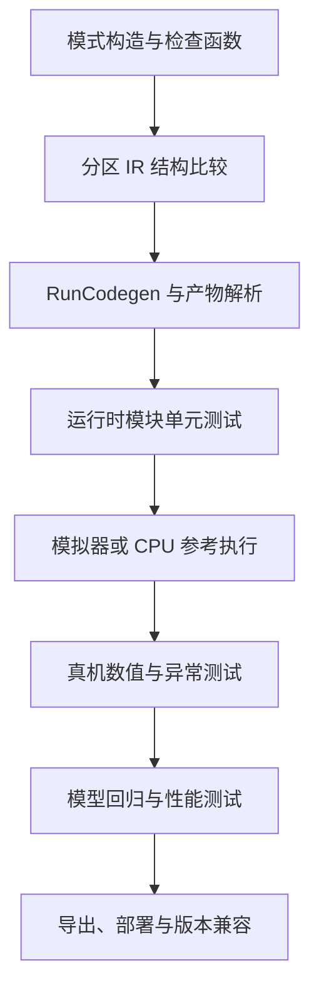

---
tags:
  - TVM
  - NPU
  - 编译器
  - Relax
  - TensorIR
status: maintained
baseline: Apache TVM v0.24.0
updated: 2026-07-29
---

# 49. BYOC 测试 调试 与版本升级

> [!abstract] 本章内容
> 建立覆盖 Python 模式、Relax 变换、C++ 代码生成、模块序列化、设备执行、错误注入、性能和 TVM 升级的系统测试方法。

> [!note] 官方依据
> `tests/python/contrib/test_example_npu.py`、Relax 代码生成测试、TVM 测试指南和各 BYOC 后端测试。

## 本章使用说明

先执行或检查本章给出的最小示例，再按快速目录逐项核对。每一节都使用相同的七个观察角度：功能与适用范围、官方实现、自研方法、必查信息、拒绝与异常、测试、应保留证据。这种组织便于快速定位实现位置，也便于后端开发者把内容直接转换为开发任务与测试。

遇到 API 名称时保留源码拼写，例如 `FusionPattern`、`FuseOpsByPattern`、`RunCodegen` 和 `runtime.Module`；解释文字使用 [[33-术语与 API 速查]] 中的标准中文。若某个接口与本地构建不同，先确认 TVM 提交与 Python 加载的动态库，再查固定 tag 的源码和测试。

## 快速目录

- [[#49.1 模式注册测试|49.1 模式注册测试]]
- [[#49.2 分区结构测试|49.2 分区结构测试]]
- [[#49.3 代码生成注册测试|49.3 代码生成注册测试]]
- [[#49.4 产物解析测试|49.4 产物解析测试]]
- [[#49.5 运行时数值测试|49.5 运行时数值测试]]
- [[#49.6 错误注入与恢复|49.6 错误注入与恢复]]
- [[#49.7 版本升级测试|49.7 版本升级测试]]
- [[#49.8 性能回归测试|49.8 性能回归测试]]

## 49.0 推荐的测试层次



上层模型测试发现差异后，应能回到更小层次复现。每层保存自己的输入和输出，不用完整模型日志代替单元测试。

## 49.1 模式注册测试

> [!abstract] 本节内容
> 确认核心模式存在、名称正确、优先级稳定且可选模式状态清楚

### 功能与适用范围

确认核心模式存在、名称正确、优先级稳定且可选模式状态清楚。该项位于两个编译阶段的责任交接处：前一阶段必须把后一阶段所需信息写入 IR、属性或结构化参数，后一阶段只能依据这些信息处理。检查打印的 IR 时，应先找到负责交接的函数、属性和调用，再确认普通 TVM 节点与外部后端节点分别保留在哪里。

### 官方实现中的具体行为

Example NPU 测试读取模式名称集合，断言 dense、matmul、conv1d、conv2d 和 max_pool2d 等核心项目。本手册以 v0.24.0 源码、对应测试和当前官方页面共同核对。若在线页面与固定版本存在目录或接口差异，项目代码以固定提交的函数签名为准，在线页面用于说明整体方法。检查源码时同时查看注册位置、调用位置和测试，不要只看一个帮助函数。

### 自研 NPU 中的实现方法

除集合外再验证顺序、检查函数和模式版本。建议把这一项实现为独立函数或独立类，并把硬件固定限制从 Target 能力文件传入。实现函数返回结构化结果，其中至少包含成功状态、原因码、涉及的 Relax 节点、关键属性摘要和建议处理方式。这样，编译报告、单元测试和模型覆盖统计都能使用同一结果。

### 必须逐项核对的信息

核心集合、可选集合、名称前缀、优先级、重复项和导入来源。核对时要记录数值单位、维度次序、数据类型、有符号性、内存类别和版本来源。形状中的符号变量要保留名称及约束，不能用一个示例值替换后继续编译。常量内容很大时可以只记录稳定名称、数据类型、形状和内容散列值，但调试工具应能找到原始权重。

### 拒绝与异常处理

核心模式缺失或顺序改变但没有变更说明时阻止合入。拒绝不是失败，只表示该候选继续由 TVM 自带后端或另一外部后端处理。真正的编译错误只用于模型本身无效、产物内部不一致、所需运行时没有注册、或用户明确要求全部进入 NPU 但仍有节点未被接纳等情况。

### 测试方法

每次新进程导入后执行，避免受到其他测试注册状态影响。每个正向样本至少再配一个只改变单一条件的反向样本，使测试失败时能立即知道是哪条规则失效。对 IR 变换使用结构比较，对编译产物使用字段解析和散列比较，对运行结果使用独立参考实现，对性能使用设备端计时与多次统计。

### 应保留的证据

模式快照、差异、TVM 提交和后端版本。按模型、外部函数和编译阶段归档，在总清单中保存内容散列值；推导数值同时保存原始输入与算法版本。

> [!important] 完成条件
> 能从变换前后 IR 追踪到外部产物和运行时调用；能说明接纳结果；能用最小测试复现，并能在新进程加载产物。

## 49.2 分区结构测试

> [!abstract] 本节内容
> 用结构比较确认预期子图被组合，未接纳节点仍由普通 TVM 流程处理

### 功能与适用范围

用结构比较确认预期子图被组合，未接纳节点仍由普通 TVM 流程处理。该项位于两个编译阶段的责任交接处：前一阶段必须把后一阶段所需信息写入 IR、属性或结构化参数，后一阶段只能依据这些信息处理。检查打印的 IR 时，应先找到负责交接的函数、属性和调用，再确认普通 TVM 节点与外部后端节点分别保留在哪里。

### 官方实现中的具体行为

官方测试执行 FuseOpsByPattern 与 MergeCompositeFunctions，并检查产生 Composite。本手册以 v0.24.0 源码、对应测试和当前官方页面共同核对。若在线页面与固定版本存在目录或接口差异，项目代码以固定提交的函数签名为准，在线页面用于说明整体方法。检查源码时同时查看注册位置、调用位置和测试，不要只看一个帮助函数。

### 自研 NPU 中的实现方法

建立完整期望 IR，而不是只用字符串包含检查。建议把这一项实现为独立函数或独立类，并把硬件固定限制从 Target 能力文件传入。实现函数返回结构化结果，其中至少包含成功状态、原因码、涉及的 Relax 节点、关键属性摘要和建议处理方式。这样，编译报告、单元测试和模型覆盖统计都能使用同一结果。

### 必须逐项核对的信息

函数层次、属性、参数、返回值、常量绑定、外部符号和剩余节点。核对时要记录数值单位、维度次序、数据类型、有符号性、内存类别和版本来源。形状中的符号变量要保留名称及约束，不能用一个示例值替换后继续编译。常量内容很大时可以只记录稳定名称、数据类型、形状和内容散列值，但调试工具应能找到原始权重。

### 拒绝与异常处理

只断言模块非空无法发现错误组合，应提升为结构级检查。拒绝不是失败，只表示该候选继续由 TVM 自带后端或另一外部后端处理。真正的编译错误只用于模型本身无效、产物内部不一致、所需运行时没有注册、或用户明确要求全部进入 NPU 但仍有节点未被接纳等情况。

### 测试方法

每个模式一个正样本、多个反样本，外加重叠模式和分叉图。每个正向样本至少再配一个只改变单一条件的反向样本，使测试失败时能立即知道是哪条规则失效。对 IR 变换使用结构比较，对编译产物使用字段解析和散列比较，对运行结果使用独立参考实现，对性能使用设备端计时与多次统计。

### 应保留的证据

实际 IR、期望 IR、结构差异和检查原因。按模型、外部函数和编译阶段归档，在总清单中保存内容散列值；推导数值同时保存原始输入与算法版本。

> [!important] 完成条件
> 能从变换前后 IR 追踪到外部产物和运行时调用；能说明接纳结果；能用最小测试复现，并能在新进程加载产物。

## 49.3 代码生成注册测试

> [!abstract] 本节内容
> 确认 `relax.ext.<backend>` 接收当前版本规定的三个参数并返回模块数组

### 功能与适用范围

确认 `relax.ext.<backend>` 接收当前版本规定的三个参数并返回模块数组。该项位于两个编译阶段的责任交接处：前一阶段必须把后一阶段所需信息写入 IR、属性或结构化参数，后一阶段只能依据这些信息处理。检查打印的 IR 时，应先找到负责交接的函数、属性和调用，再确认普通 TVM 节点与外部后端节点分别保留在哪里。

### 官方实现中的具体行为

Example NPU 测试用全局函数探测是否启用，再执行 RunCodegen。本手册以 v0.24.0 源码、对应测试和当前官方页面共同核对。若在线页面与固定版本存在目录或接口差异，项目代码以固定提交的函数签名为准，在线页面用于说明整体方法。检查源码时同时查看注册位置、调用位置和测试，不要只看一个帮助函数。

### 自研 NPU 中的实现方法

增加伪函数直接调用编译器，检查 options 和 constant_names。建议把这一项实现为独立函数或独立类，并把硬件固定限制从 Target 能力文件传入。实现函数返回结构化结果，其中至少包含成功状态、原因码、涉及的 Relax 节点、关键属性摘要和建议处理方式。这样，编译报告、单元测试和模型覆盖统计都能使用同一结果。

### 必须逐项核对的信息

FFI 注册名、函数签名、参数类型、返回模块、异常类型和线程安全。核对时要记录数值单位、维度次序、数据类型、有符号性、内存类别和版本来源。形状中的符号变量要保留名称及约束，不能用一个示例值替换后继续编译。常量内容很大时可以只记录稳定名称、数据类型、形状和内容散列值，但调试工具应能找到原始权重。

### 拒绝与异常处理

签名与 TVM 版本不同、返回类型错误或注册名冲突时在单元测试发现。拒绝不是失败，只表示该候选继续由 TVM 自带后端或另一外部后端处理。真正的编译错误只用于模型本身无效、产物内部不一致、所需运行时没有注册、或用户明确要求全部进入 NPU 但仍有节点未被接纳等情况。

### 测试方法

空函数数组、单函数、多函数、常量和未知选项分别测试。每个正向样本至少再配一个只改变单一条件的反向样本，使测试失败时能立即知道是哪条规则失效。对 IR 变换使用结构比较，对编译产物使用字段解析和散列比较，对运行结果使用独立参考实现，对性能使用设备端计时与多次统计。

### 应保留的证据

FFI 调用记录、模块 type key、异常文本和函数签名说明。按模型、外部函数和编译阶段归档，在总清单中保存内容散列值；推导数值同时保存原始输入与算法版本。

> [!important] 完成条件
> 能从变换前后 IR 追踪到外部产物和运行时调用；能说明接纳结果；能用最小测试复现，并能在新进程加载产物。

## 49.4 产物解析测试

> [!abstract] 本节内容
> 不用运行设备就能确认编译产物结构、字段和值合法

### 功能与适用范围

不用运行设备就能确认编译产物结构、字段和值合法。该项位于两个编译阶段的责任交接处：前一阶段必须把后一阶段所需信息写入 IR、属性或结构化参数，后一阶段只能依据这些信息处理。检查打印的 IR 时，应先找到负责交接的函数、属性和调用，再确认普通 TVM 节点与外部后端节点分别保留在哪里。

### 官方实现中的具体行为

JSONSerializer 输出可直接解析，真实后端也应提供独立解析或反汇编工具。本手册以 v0.24.0 源码、对应测试和当前官方页面共同核对。若在线页面与固定版本存在目录或接口差异，项目代码以固定提交的函数签名为准，在线页面用于说明整体方法。检查源码时同时查看注册位置、调用位置和测试，不要只看一个帮助函数。

### 自研 NPU 中的实现方法

对每个分段、命令、缓冲区和重定位项执行静态检查。建议把这一项实现为独立函数或独立类，并把硬件固定限制从 Target 能力文件传入。实现函数返回结构化结果，其中至少包含成功状态、原因码、涉及的 Relax 节点、关键属性摘要和建议处理方式。这样，编译报告、单元测试和模型覆盖统计都能使用同一结果。

### 必须逐项核对的信息

格式版本、长度、偏移、对齐、符号、常量、工作区和 Target。核对时要记录数值单位、维度次序、数据类型、有符号性、内存类别和版本来源。形状中的符号变量要保留名称及约束，不能用一个示例值替换后继续编译。常量内容很大时可以只记录稳定名称、数据类型、形状和内容散列值，但调试工具应能找到原始权重。

### 拒绝与异常处理

未知版本、截断、分段重叠、字段越界和散列错误全部安全失败。拒绝不是失败，只表示该候选继续由 TVM 自带后端或另一外部后端处理。真正的编译错误只用于模型本身无效、产物内部不一致、所需运行时没有注册、或用户明确要求全部进入 NPU 但仍有节点未被接纳等情况。

### 测试方法

正常往返、固定标准文件、随机损坏和模糊输入测试。每个正向样本至少再配一个只改变单一条件的反向样本，使测试失败时能立即知道是哪条规则失效。对 IR 变换使用结构比较，对编译产物使用字段解析和散列比较，对运行结果使用独立参考实现，对性能使用设备端计时与多次统计。

### 应保留的证据

解析树、静态检查报告、错误位置和标准产物散列。按模型、外部函数和编译阶段归档，在总清单中保存内容散列值；推导数值同时保存原始输入与算法版本。

> [!important] 完成条件
> 能从变换前后 IR 追踪到外部产物和运行时调用；能说明接纳结果；能用最小测试复现，并能在新进程加载产物。

## 49.5 运行时数值测试

> [!abstract] 本节内容
> 真实后端必须验证输出数值，而不是沿用 Example NPU 的形状断言

### 功能与适用范围

真实后端必须验证输出数值，而不是沿用 Example NPU 的形状断言。该项位于两个编译阶段的责任交接处：前一阶段必须把后一阶段所需信息写入 IR、属性或结构化参数，后一阶段只能依据这些信息处理。检查打印的 IR 时，应先找到负责交接的函数、属性和调用，再确认普通 TVM 节点与外部后端节点分别保留在哪里。

### 官方实现中的具体行为

官方教程明确说明示例运行时不计算，并在 TensorRT 部分与参考结果比较。本手册以 v0.24.0 源码、对应测试和当前官方页面共同核对。若在线页面与固定版本存在目录或接口差异，项目代码以固定提交的函数签名为准，在线页面用于说明整体方法。检查源码时同时查看注册位置、调用位置和测试，不要只看一个帮助函数。

### 自研 NPU 中的实现方法

为每个算子建立独立高精度或位准确参考，组合运算再做逐层对照。建议把这一项实现为独立函数或独立类，并把硬件固定限制从 Target 能力文件传入。实现函数返回结构化结果，其中至少包含成功状态、原因码、涉及的 Relax 节点、关键属性摘要和建议处理方式。这样，编译报告、单元测试和模型覆盖统计都能使用同一结果。

### 必须逐项核对的信息

输入分布、极值、数据类型、舍入、饱和、允许误差、动态尺寸和重复次数。核对时要记录数值单位、维度次序、数据类型、有符号性、内存类别和版本来源。形状中的符号变量要保留名称及约束，不能用一个示例值替换后继续编译。常量内容很大时可以只记录稳定名称、数据类型、形状和内容散列值，但调试工具应能找到原始权重。

### 拒绝与异常处理

参考实现与硬件使用同一错误代码路径或相同近似表时不具备独立性。拒绝不是失败，只表示该候选继续由 TVM 自带后端或另一外部后端处理。真正的编译错误只用于模型本身无效、产物内部不一致、所需运行时没有注册、或用户明确要求全部进入 NPU 但仍有节点未被接纳等情况。

### 测试方法

固定数据、随机数据、极值、临界值、尾部分块和多次运行。每个正向样本至少再配一个只改变单一条件的反向样本，使测试失败时能立即知道是哪条规则失效。对 IR 变换使用结构比较，对编译产物使用字段解析和散列比较，对运行结果使用独立参考实现，对性能使用设备端计时与多次统计。

### 应保留的证据

输入、参考输出、设备输出、第一个差异位置和数值规则版本。按模型、外部函数和编译阶段归档，在总清单中保存内容散列值；推导数值同时保存原始输入与算法版本。

> [!important] 完成条件
> 能从变换前后 IR 追踪到外部产物和运行时调用；能说明接纳结果；能用最小测试复现，并能在新进程加载产物。

## 49.6 错误注入与恢复

> [!abstract] 本节内容
> 验证编译、加载、申请、复制、提交、执行、等待和清理各阶段的失败行为

### 功能与适用范围

验证编译、加载、申请、复制、提交、执行、等待和清理各阶段的失败行为。该项位于两个编译阶段的责任交接处：前一阶段必须把后一阶段所需信息写入 IR、属性或结构化参数，后一阶段只能依据这些信息处理。检查打印的 IR 时，应先找到负责交接的函数、属性和调用，再确认普通 TVM 节点与外部后端节点分别保留在哪里。

### 官方实现中的具体行为

官方示例测试主要覆盖正常流程，真实设备后端需要自行增加系统错误测试。本手册以 v0.24.0 源码、对应测试和当前官方页面共同核对。若在线页面与固定版本存在目录或接口差异，项目代码以固定提交的函数签名为准，在线页面用于说明整体方法。检查源码时同时查看注册位置、调用位置和测试，不要只看一个帮助函数。

### 自研 NPU 中的实现方法

在 SDK 适配层提供可测试故障点，并保证第一个错误不被清理错误覆盖。建议把这一项实现为独立函数或独立类，并把硬件固定限制从 Target 能力文件传入。实现函数返回结构化结果，其中至少包含成功状态、原因码、涉及的 Relax 节点、关键属性摘要和建议处理方式。这样，编译报告、单元测试和模型覆盖统计都能使用同一结果。

### 必须逐项核对的信息

故障阶段、错误码、已申请资源、队列状态、设备状态、重试和清理。核对时要记录数值单位、维度次序、数据类型、有符号性、内存类别和版本来源。形状中的符号变量要保留名称及约束，不能用一个示例值替换后继续编译。常量内容很大时可以只记录稳定名称、数据类型、形状和内容散列值，但调试工具应能找到原始权重。

### 拒绝与异常处理

超时后设备状态未知、部分输出被使用或资源泄漏时禁止继续复用会话。拒绝不是失败，只表示该候选继续由 TVM 自带后端或另一外部后端处理。真正的编译错误只用于模型本身无效、产物内部不一致、所需运行时没有注册、或用户明确要求全部进入 NPU 但仍有节点未被接纳等情况。

### 测试方法

逐个故障点注入一次，并测试连续失败、并发失败和复位后恢复。每个正向样本至少再配一个只改变单一条件的反向样本，使测试失败时能立即知道是哪条规则失效。对 IR 变换使用结构比较，对编译产物使用字段解析和散列比较，对运行结果使用独立参考实现，对性能使用设备端计时与多次统计。

### 应保留的证据

注入配置、返回错误、清理清单、设备状态和后续调用结果。按模型、外部函数和编译阶段归档，在总清单中保存内容散列值；推导数值同时保存原始输入与算法版本。

> [!important] 完成条件
> 能从变换前后 IR 追踪到外部产物和运行时调用；能说明接纳结果；能用最小测试复现，并能在新进程加载产物。

## 49.7 版本升级测试

> [!abstract] 本节内容
> 在升级 TVM、后端、驱动或固件时及时发现 API、IR 和产物变化

### 功能与适用范围

在升级 TVM、后端、驱动或固件时及时发现 API、IR 和产物变化。该项位于两个编译阶段的责任交接处：前一阶段必须把后一阶段所需信息写入 IR、属性或结构化参数，后一阶段只能依据这些信息处理。检查打印的 IR 时，应先找到负责交接的函数、属性和调用，再确认普通 TVM 节点与外部后端节点分别保留在哪里。

### 官方实现中的具体行为

v0.24.0 已使用 Relax、TVM FFI 新接口以及当前 RunCodegen 签名，旧 Relay 教程不可直接照抄。本手册以 v0.24.0 源码、对应测试和当前官方页面共同核对。若在线页面与固定版本存在目录或接口差异，项目代码以固定提交的函数签名为准，在线页面用于说明整体方法。检查源码时同时查看注册位置、调用位置和测试，不要只看一个帮助函数。

### 自研 NPU 中的实现方法

固定一组小 IR 与产物标准文件，升级时比较注册名、函数签名、Pass 输出和加载行为。建议把这一项实现为独立函数或独立类，并把硬件固定限制从 Target 能力文件传入。实现函数返回结构化结果，其中至少包含成功状态、原因码、涉及的 Relax 节点、关键属性摘要和建议处理方式。这样，编译报告、单元测试和模型覆盖统计都能使用同一结果。

### 必须逐项核对的信息

TVM 提交、Python API、C++ 头文件、目录、FFI 名称、模块格式和固件 ABI。核对时要记录数值单位、维度次序、数据类型、有符号性、内存类别和版本来源。形状中的符号变量要保留名称及约束，不能用一个示例值替换后继续编译。常量内容很大时可以只记录稳定名称、数据类型、形状和内容散列值，但调试工具应能找到原始权重。

### 拒绝与异常处理

任何未解释的结构差异、符号差异或旧产物加载变化都需要暂停发布。拒绝不是失败，只表示该候选继续由 TVM 自带后端或另一外部后端处理。真正的编译错误只用于模型本身无效、产物内部不一致、所需运行时没有注册、或用户明确要求全部进入 NPU 但仍有节点未被接纳等情况。

### 测试方法

新旧版本分别运行同一测试集合，并生成结构化差异报告。每个正向样本至少再配一个只改变单一条件的反向样本，使测试失败时能立即知道是哪条规则失效。对 IR 变换使用结构比较，对编译产物使用字段解析和散列比较，对运行结果使用独立参考实现，对性能使用设备端计时与多次统计。

### 应保留的证据

版本组合、API 差异、IR 差异、产物差异和兼容结论。按模型、外部函数和编译阶段归档，在总清单中保存内容散列值；推导数值同时保存原始输入与算法版本。

> [!important] 完成条件
> 能从变换前后 IR 追踪到外部产物和运行时调用；能说明接纳结果；能用最小测试复现，并能在新进程加载产物。

## 49.8 性能回归测试

> [!abstract] 本节内容
> 在功能正确后检查分区数量、数据复制、编译时间和设备时间是否退化

### 功能与适用范围

在功能正确后检查分区数量、数据复制、编译时间和设备时间是否退化。该项位于两个编译阶段的责任交接处：前一阶段必须把后一阶段所需信息写入 IR、属性或结构化参数，后一阶段只能依据这些信息处理。检查打印的 IR 时，应先找到负责交接的函数、属性和调用，再确认普通 TVM 节点与外部后端节点分别保留在哪里。

### 官方实现中的具体行为

BYOC 机制只决定外部调度方式，最终收益取决于后端接纳范围和设备实现。本手册以 v0.24.0 源码、对应测试和当前官方页面共同核对。若在线页面与固定版本存在目录或接口差异，项目代码以固定提交的函数签名为准，在线页面用于说明整体方法。检查源码时同时查看注册位置、调用位置和测试，不要只看一个帮助函数。

### 自研 NPU 中的实现方法

为微基准与代表模型保存时间分布和硬件计数器，并设置分级告警。建议把这一项实现为独立函数或独立类，并把硬件固定限制从 Target 能力文件传入。实现函数返回结构化结果，其中至少包含成功状态、原因码、涉及的 Relax 节点、关键属性摘要和建议处理方式。这样，编译报告、单元测试和模型覆盖统计都能使用同一结果。

### 必须逐项核对的信息

编译时间、缓存命中、外部函数数、复制字节、提交、执行时间、等待和峰值内存。核对时要记录数值单位、维度次序、数据类型、有符号性、内存类别和版本来源。形状中的符号变量要保留名称及约束，不能用一个示例值替换后继续编译。常量内容很大时可以只记录稳定名称、数据类型、形状和内容散列值，但调试工具应能找到原始权重。

### 拒绝与异常处理

只看端到端平均值无法解释变化，应先补齐分项测量再决定是否失败。拒绝不是失败，只表示该候选继续由 TVM 自带后端或另一外部后端处理。真正的编译错误只用于模型本身无效、产物内部不一致、所需运行时没有注册、或用户明确要求全部进入 NPU 但仍有节点未被接纳等情况。

### 测试方法

固定环境预热，多次测量中位数和高分位，并保留原始样本。每个正向样本至少再配一个只改变单一条件的反向样本，使测试失败时能立即知道是哪条规则失效。对 IR 变换使用结构比较，对编译产物使用字段解析和散列比较，对运行结果使用独立参考实现，对性能使用设备端计时与多次统计。

### 应保留的证据

环境、频率温度、原始时间、统计值、版本和差异说明。按模型、外部函数和编译阶段归档，在总清单中保存内容散列值；推导数值同时保存原始输入与算法版本。

> [!important] 完成条件
> 能从变换前后 IR 追踪到外部产物和运行时调用；能说明接纳结果；能用最小测试复现，并能在新进程加载产物。

## 本章检查清单

- [ ] 能用自己的话说明本章每个 TVM 属性或 API 的作用；
- [ ] 能在变换前后 IR 中找到对应结构；
- [ ] 能指出 Example NPU 中仅仅用于说明机制的部分；
- [ ] 能写出自研后端的输入、输出、失败原因和测试；
- [ ] 能保存足以在另一进程或另一台开发机复现的证据；
- [ ] 能说明本章内容与前后章节的关系。

## 继续阅读

本章属于 BYOC 专题。建议同时参照 [[15-Relax DPL 子图识别与分区]]、[[16-BYOC 代码生成器]]、[[17-NPU 运行时与驱动适配]]、[[26-端到端参考实现骨架]] 和 [[29-官方资料与源码导航]]。

## 实现说明与验证步骤

> [!note] 依据与适用范围
> 本节依据所列 Apache TVM 官方资料和 v0.24.0 源码整理，给出输入条件、操作步骤、预期结果、异常处理和自研 NPU 适配要求。接口细节以固定版本源码与测试为准，在线页面用于补充说明。

### 49.A 目标与适用范围

建立 TVM、后端编译器、运行时、驱动和固件的版本组合测试，并固定一组小 IR 与产物。

参考样本保持输入规模较小，以便直接检查对象、字段和输出。首次执行时不要同时加入图改写、外部代码生成和真实设备执行；应先确认当前阶段的输入与输出，再增加后续处理。建议为该项验证建立独立目录，保存命令、标准输出、IR、编译产物摘要和环境信息。

### 49.B 参考实现

**官方依据：** [BYOC 教程](https://tvm.apache.org/docs/how_to/tutorials/bring_your_own_codegen.html)、[持续集成指南](https://tvm.apache.org/docs/contribute/ci.html)。

**v0.24.0 源码位置：** `tests/python/relax/`、`tests/cpp/`、`docs/contribute/ci.rst`、项目兼容表。

```yaml
test_matrix:
  - tvm: v0.24.0
    compiler: acme-3.2
    runtime: acme-3.2
    driver: ">=5.1,<6.0"
    firmware: "7.4"
    expected: supported
  - tvm: v0.24.0
    compiler: acme-3.3
    runtime: acme-3.2
    driver: "5.2"
    firmware: "7.4"
    expected: reject_module_version
```

按以下顺序执行：

1. 在新进程中确认 `tvm.__file__`、动态库路径和 TVM 提交，避免受到旧进程注册状态影响；
2. 将参考实现保存到单独文件，只补充本节明确要求的输入对象，不先加入额外优化；
3. 执行后保存完整输出；若生成 IR，同时保存 `script(show_meta=True)` 的文本；
4. 把输出与下面的预期现象逐项比较，不以“没有抛出异常”代替功能检查；
5. 重复执行一次并比较主要产物，确认结果没有依赖临时全局状态或未固定的遍历顺序。

> [!success] 预期现象
> 兼容表中的每一行都可由自动任务运行。被支持组合检查编译、导出、加载和执行；不被支持组合检查错误发生在最早且最清楚的位置。

> [!tip] 输出检查顺序
> 先看对象类型和函数数量，再看属性、调用形式、形状与数据类型，最后看运行结果或编译产物。若前一项不符合预期，先停止后续步骤。这样能把问题限定在最早出现差异的阶段。

### 49.C 单项条件验证

升级 TVM 后只运行完整模型。若失败，很难判断是 API、IR、模式还是产物变化；先比较固定小 IR 的注册名、函数属性和结构输出。

执行条件变化样本时，复制参考实现的输入与环境，只修改上文指出的一项。对两个输出进行结构比较，并记录以下四项：

1. 第一次出现差异的是哪一个阶段？
2. 差异表现为函数、属性、形状、数据类型、编译产物还是运行结果？
3. 当前行为是明确拒绝、交给其他后端执行，还是编译错误？
4. 日志是否足以让另一位开发者不查看本次进程状态也能复现？

如果同时观察到多个变化，应继续缩小条件变化样本。参考实现用于确认正常处理，单项条件验证用于确认系统为何接受、拒绝或转交当前输入。

### 49.D 自研 NPU 适配要求

发布前保留功能、异常、并发、性能和旧产物加载报告。性能变化必须附原始样本和环境，不能只保存一个平均值。

改造时建议保留三份相互独立的输入：最小 Relax 或 TensorIR、设备编译器输入、运行时调用输入。三份输入使用同一个样本编号，并记录转换前后的关键字段。这样可以分别测试 TVM 变换、NPU 编译器和驱动，不需要每次都运行完整模型。

至少补充以下样本：

- 一个完全满足能力要求的正向样本；
- 一个只改变数据类型的反向样本；
- 一个只改变形状或属性的反向样本；
- 一个包含主机与 NPU 混合执行的样本；
- 一个导出后在新进程加载的样本；
- 若支持动态尺寸，再增加最小值、常用值和最大值附近的样本。

### 49.E 源码定位

从上文列出的源码位置选择一个公开 API，依次找到 Python 调用、FFI 注册、C++ 实现和测试。记录函数签名、主要输入、主要输出、会写入的模块属性以及失败方式。若名称只在文档出现而源码中找不到，继续搜索注册字符串、属性键或错误文本。

> [!important] 验证项目
> 1. 执行前记录参考实现的对象关系；2. 执行后用实际输出修正记录；3. 增加一个会被明确拒绝的输入；4. 标明自研 NPU 接入需要修改的层次与保持不变的层次；5. 把结果整理成可由自动测试检查的断言。

### 49.F 检查清单

- [ ] 示例可在固定 v0.24.0 环境重复执行，或已明确列出所需可选依赖；
- [ ] 预期现象包含可检查的结构、字段或数值，不只是“运行成功”；
- [ ] 单条件变化能触发预期的拒绝、转交或结构差异；
- [ ] 能从官方页面定位到固定版本源码和测试；
- [ ] NPU 改造说明包含编译阶段、运行阶段与部署阶段；
- [ ] 失败时保留最小输入、环境、阶段输出和第一个错误。
