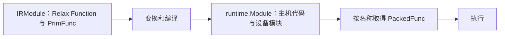

---
tags:
  - TVM
  - NPU
  - 编译器
  - Relax
  - TensorIR
status: maintained
baseline: Apache TVM v0.24.0
updated: 2026-07-29
---

# 51. TVM 对象模型与定义规则

> [!abstract] 本章解决的问题
> 本章先严格区分节点、表达式、语句、变量、绑定、函数、模块、结构信息与运行时对象。后续三章按统一格式列出构造签名、参数、返回对象、约束、产生位置、使用位置、最小例子和常见错误。遇到不熟悉的类名时，先在本章确认它属于哪一层，再进入对应参数条目。

> [!important] 版本名称
> 本手册固定到 TVM v0.24.0。该版本的低层张量程序 Python 命名空间是 `tvm.tirx`，许多旧资料写作 `tvm.tir`。复制代码前先核对本地版本，不要把两个版本的类名混在同一程序中。

## 51.1 节点

节点是 TVM IR 中可由统一对象系统管理的结构化记录。一个节点由节点类型、若干字段和可选源码位置组成。节点本身不是“执行一次计算”的同义词：`TensorStructInfo` 是节点，但只描述值的结构；`VarBinding` 是节点，但负责记录变量与值的关系；`Call` 才表示一次调用。

节点常见特征如下：

- Python 对象通常只是 C++ 对象的引用包装；
- 字段由注册的节点类型定义，不应随意增加；
- Pass 通常创建替代节点或替代函数，不依赖就地修改原节点；
- 文本打印适合阅读，结构比较适合自动测试；
- `span` 保存源码位置，可用于把错误指回模型或 TVMScript。

## 51.2 表达式

表达式是“计算后产生一个值，或表示一个可被引用的值”的 IR 节点。这里的值可以是张量、标量、形状、元组、函数或运行时对象。表达式不要求立即执行；它先描述计算，编译器随后检查、改写并降低它。

Relax 表达式与 TensorIR 基础表达式处理的层级不同：

| 项目 | Relax `Expr` | TensorIR `PrimExpr` |
| --- | --- | --- |
| 描述对象 | 张量、元组、函数、形状和高层调用 | 整数、浮点数、索引、地址计算和低层内建调用 |
| 结果说明 | 主要由 `StructInfo` 给出 | 主要由 `dtype` 给出 |
| 变量 | `relax.Var`、`DataflowVar`、`GlobalVar` | `tirx.Var` |
| 调用 | `relax.Call` | `tirx.Call` |
| 常量 | `relax.Constant`、`PrimValue` 等 | `IntImm`、`FloatImm` 等 |
| 常见使用者 | Relax Pass、BYOC、Relax VM 编译 | TensorIR Pass、调度、目标代码生成 |

> [!example] 如何判断一个对象是不是表达式
> `R.add(x, y)`、`R.Tuple((x, y))` 和 `T.BufferLoad(A, [i])` 都产生值，因此属于表达式。`T.BufferStore(B, value, [i])` 改写缓冲区且不产生可继续参与加法的值，因此属于语句。

## 51.3 语句

语句表示执行顺序、控制结构或存储改写。TensorIR 使用 `Stmt` 组织循环、条件分支、缓冲区写入和块。语句通常不作为另一个算术运算的输入。Relax 主要用表达式和绑定组织程序，不采用 TensorIR 的 `Stmt` 层次。

例如，`BufferLoad(A, [i])` 是表达式，因为它产生一个元素值；`BufferStore(B, value, [i])` 是语句，因为它描述一次写入。`For` 的 `body` 也是语句，多个语句使用 `SeqStmt` 保持顺序。

## 51.4 变量与绑定

变量是带稳定身份的引用节点。名称只是供人阅读的提示，不是唯一身份。两个都显示为 `x` 的 `relax.Var` 可以是两个不同变量，因此变换代码不应仅按 `name_hint` 判断相等。

绑定把一个变量与一个表达式放在同一记录中：

```text
VarBinding(var=result, value=R.add(x, y))
```

`DataflowVar` 只在数据流块内部使用，适合局部中间结果；普通 `Var` 可作为数据流块输出并被后续代码使用。`MatchCast` 除了建立变量与值的关系，还加入运行时结构检查并处理未确定的符号尺寸。

## 51.5 函数

函数是具有参数列表、函数体、返回说明和属性的可调用程序单位。TVM 的 `BaseFunc` 是共同基类，常见具体类型是：

| 函数种类 | 函数体 | 主要用途 | 调用方式 |
| --- | --- | --- | --- |
| `relax.Function` | Relax `Expr` | 图级计算、控制流、外部子图包装 | `relax.Call` |
| `tirx.PrimFunc` | TensorIR `Stmt` | 低层循环与缓冲区程序 | 通常由 `relax.call_tir` 引用 |
| `relax.ExternFunc` | 无 TVM IR 函数体 | 引用注册表中的外部 PackedFunc | `relax.Call` 或 `call_dps_packed` |
| 运行时 PackedFunc | C++、Python 或设备模块中的可调用实现 | 执行已经编译或手工注册的功能 | 按名称查询后调用 |

函数的参数对象与调用节点的实参对象必须分开理解。`Function.params` 是形参；`Call.args` 是该次调用传入的实参。函数属性描述整个函数，调用属性只描述该次调用。

## 51.6 模块

`IRModule` 是编译阶段的程序容器，保存 `GlobalVar -> BaseFunc` 的关系、模块属性和全局信息。`runtime.Module` 是运行阶段的代码或资源容器，按名称提供函数并可导入其他运行时模块。两者名称都含 Module，但职责不同：



## 51.7 结构信息

`StructInfo` 描述 Relax 值在编译阶段可知的结构。它不只是数据类型：张量结构信息还能记录形状、维数和虚拟设备；函数结构信息记录参数、返回值及是否纯函数。

以张量为例，下列说明精确程度逐级降低：

```python
R.Tensor((1, 3, 224, 224), "float32")  # 形状、维数、数据类型都已知
R.Tensor(ndim=4, dtype="float32")       # 只知道维数和数据类型
R.Tensor(dtype="float32")               # 维数未知，数据类型已知
```

未知并不代表可任意取值。后续规范化、运算推导或运行时检查仍可能补充信息或拒绝不一致的输入。

## 51.8 `span`

`Span(source_name, line, end_line, column, end_column)` 记录节点对应的源码文件和字符区间。所有位置均由前端或解析器提供。手写 IR 时可省略；开发导入器或诊断工具时应尽量保留。

| 参数 | 含义 |
| --- | --- |
| `source_name` | `SourceName` 对象，表示文件或逻辑来源 |
| `line`、`end_line` | 起始行与结束行 |
| `column`、`end_column` | 起始列与结束列 |

## 51.9 构造器、辅助函数与 TVMScript

同一个节点可能有三种创建方式：

1. 直接构造类，例如 `relax.Var("x", sinfo)`；
2. 使用辅助函数，例如 `relax.const(1.0, "float32")`；
3. 使用 TVMScript，例如函数签名中的 `R.Tensor((2, 4), "float32")`。

辅助函数通常处理 Python 值转换和默认数据类型；TVMScript 更适合编写完整模块；直接构造适合 Pass、测试和动态生成器。三种方式产生的节点可以结构相同，但传参规则不一定完全相同，应查看具体条目。

## 51.10 对象身份与结构比较

`same_as` 或底层对象身份回答“是否引用同一个节点”；`tvm.ir.structural_equal(lhs, rhs)` 回答“结构是否相同”。测试 Pass 时通常应使用结构比较，因为变换会创建新对象。

```python
import tvm
from tvm import relax

sinfo = relax.TensorStructInfo([2, 4], "float32")
x1 = relax.Var("x", sinfo)
x2 = relax.Var("x", sinfo)

assert not x1.same_as(x2)
assert not tvm.ir.structural_equal(x1, x2)
```

变量具有独立身份，因此即使名称与结构信息相同，两个新建变量也不是同一个变量。若要比较两个完整函数，结构比较会按照变量绑定关系处理名称差异。

## 51.11 规范化与合法性检查

直接构造的 `Call` 可能尚未补全 `struct_info_`。`BlockBuilder.normalize(expr)` 会调用运算的结构推导规则，返回补全后的表达式。完整模块可使用 `relax.analysis.check_well_formed(mod)` 检查变量使用、数据流块和结构信息。

```python
from tvm import relax

bb = relax.BlockBuilder()
x = relax.Var("x", relax.TensorStructInfo([2, 4], "float32"))
y = relax.Var("y", relax.TensorStructInfo([2, 4], "float32"))
raw = relax.op.add(x, y)
normalized = bb.normalize(raw)
print(normalized.struct_info_)
```

> [!warning] 不要把 Python 类型检查当作完整 IR 检查
> 构造器能检查的主要是参数对象种类。两个张量的形状是否可相加、调用输出说明是否正确、变量是否在有效作用域内，需要规范化或模块检查才能确认。

## 51.12 本手册的统一条目格式

后续每个对象按以下问题说明：

- 规范定义：该对象在 IR 中表示什么；
- 构造签名：v0.24.0 Python 接口的准确参数顺序；
- 参数：接受类型、默认值、功能和限制；
- 返回对象：构造后得到什么，可读取哪些字段；
- 必须满足的条件：哪些输入组合会被拒绝；
- 产生位置：前端、解析器、BlockBuilder 或 Pass 中谁创建它；
- 使用位置：哪个 Pass、代码生成器或运行时读取它；
- 最小例子：能单独观察字段的代码；
- 常见错误：最容易混淆的对象或参数。

## 51.13 源码和官方参考

- [Python IR API](https://tvm.apache.org/docs/reference/api/python/ir.html)
- [Python Relax API](https://tvm.apache.org/docs/reference/api/python/relax/relax.html)
- [Python TensorIR API](https://tvm.apache.org/docs/tirx/api/tirx.html)
- [IRModule 教程](https://tvm.apache.org/docs/get_started/tutorials/ir_module.html)
- [Relax 深入说明](https://tvm.apache.org/docs/deep_dive/relax/index.html)
- [`python/tvm/ir/expr.py`](https://github.com/apache/tvm/blob/v0.24.0/python/tvm/ir/expr.py)
- [`python/tvm/relax/expr.py`](https://github.com/apache/tvm/blob/v0.24.0/python/tvm/relax/expr.py)
- [`python/tvm/tirx/expr.py`](https://github.com/apache/tvm/blob/v0.24.0/python/tvm/tirx/expr.py)

## 51.14 阅读下一章

- Relax 对象：[[52-Relax 表达式 函数与结构信息参数手册]]
- TensorIR 对象：[[53-TensorIR 表达式 语句与 PrimFunc 参数手册]]
- 模块与执行对象：[[54-IRModule 运行时模块与虚拟机参数手册]]
