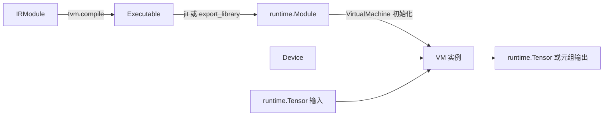

---
tags:
  - TVM
  - NPU
  - 编译器
  - Relax
  - TensorIR
status: maintained
baseline: Apache TVM v0.24.0
updated: 2026-07-29
---

# 54. IRModule、运行时模块与虚拟机参数手册

> [!abstract] 本章用途
> 本章说明程序从编译阶段对象转成可执行对象时，每一类 Module、Device、Tensor、Executable 与 VirtualMachine 分别负责什么。自研 NPU 接入最常见的错误之一，是把编译阶段函数容器、运行时代码容器和设备实例混在一起理解。

## 对象转换顺序



| 阶段 | 主要对象 | 是否保存 IR | 是否持有运行时函数 | 是否表示物理设备 |
| --- | --- | --- | --- | --- |
| 编译输入与变换 | `IRModule` | 是 | 否 | 否 |
| 编译结果包装 | `Executable` | 通常不作为变换输入 | 间接持有模块 | 否 |
| 代码与资源 | `runtime.Module` | 否 | 是 | 否 |
| 设备实例 | `Device` | 否 | 否 | 是 |
| 数据实例 | `runtime.Tensor` | 否 | 否 | 数据位于某个设备 |
| 执行器 | `VirtualMachine` | 否 | 通过模块调用 | 管理一个或多个设备 |

## `tvm.IRModule`

**规范定义**：编译阶段的程序容器，按全局变量保存 Relax Function 与 PrimFunc，并保存模块级属性和全局信息。

**Python 构造签名**

```text
tvm.IRModule(functions=None, attrs=None, global_infos=None)
```

### 参数

| 参数 | 接受的类型 | 默认值 | 功能与要求 |
| --- | --- | --- | --- |
| `functions` | `dict[str | GlobalVar, BaseFunc] | None` | `None` | 全局函数集合；字符串键会转换成 `GlobalVar`。 |
| `attrs` | `dict | None` | `None` | 模块级属性，非空字典会转换为 `DictAttrs`。 |
| `global_infos` | `dict | None` | `None` | 虚拟设备等全局信息。 |

### 返回对象与可观察字段

返回 `IRModule`。主要字段和接口为 `functions`、`attrs`、`global_infos`、`functions_items()`、`get_global_var()`、`update_func()` 和 `script()`。

### 必须满足的条件

- 键必须是字符串或 `GlobalVar`，值应为 `BaseFunc`。
- 模块内全局名称必须唯一。
- 变换后应检查所有全局调用仍能找到定义。

### 产生位置与使用位置

- 常见产生位置：TVMScript `@I.ir_module`、模型前端、`BlockBuilder.finalize()` 和 `IRModule.from_expr()`。
- 常见使用位置：所有模块 Pass、`tvm.compile`、Relax VM 编译、BYOC 与目标代码生成。

### 最小例子

```python
import tvm
from tvm import relax

x = relax.Var("x", relax.TensorStructInfo([2], "float32"))
func = relax.Function([x], x)
mod = tvm.IRModule({"main": func})
assert mod["main"].same_as(func)
assert mod.get_global_var("main").name_hint == "main"
```

### 常见错误

- 把 `IRModule` 与运行时模块混为一类。
- 按字符串新建全局变量后，假定它与模块已有全局变量具有相同身份。
- 原地修改函数字段而不使用新函数更新模块。

**固定版本源码**：[module.py](https://github.com/apache/tvm/blob/v0.24.0/python/tvm/ir/module.py)

## `tvm.ir.BaseFunc`

**规范定义**：所有 IR 函数节点的共同基类，统一提供函数属性的复制式更新接口。

**Python 构造签名**

```text
BaseFunc 不能直接构造；使用 relax.Function、relax.ExternFunc 或 tirx.PrimFunc
```

### 参数

| 参数 | 接受的类型 | 默认值 | 功能与要求 |
| --- | --- | --- | --- |

### 返回对象与可观察字段

具体对象由子类构造。`attrs` 读取属性；`with_attr`、`with_attrs` 和 `without_attr` 返回更新后的新函数。

### 必须满足的条件

- 不要直接实例化基类。
- 属性值必须能转换为 TVM 运行时对象。
- 调用更新接口后必须使用返回的新函数。

### 产生位置与使用位置

- 常见产生位置：Relax 与 TensorIR 函数构造器。
- 常见使用位置：IRModule、函数 Pass、Target 选择、BYOC 和代码生成。

### 最小例子

```python
from tvm import relax

x = relax.Var("x", relax.TensorStructInfo([2], "float32"))
func = relax.Function([x], x)
updated = func.with_attr("global_symbol", "main")
assert func.attrs is None or "global_symbol" not in func.attrs
assert updated.attrs["global_symbol"] == "main"
```

### 常见错误

- 调用 `func.with_attr(...)` 后忽略返回值。
- 把 `Codegen` 属性加在调用节点而不是外部函数上。

**固定版本源码**：[function.py](https://github.com/apache/tvm/blob/v0.24.0/python/tvm/ir/function.py)

## `tvm.runtime.Device`

**规范定义**：运行阶段的设备标识，包含 DLPack 设备种类和设备编号，并通过 DeviceAPI 查询能力、分配内存和同步。

**Python 构造签名**

```text
tvm.runtime.device(device_type: str | int | DLDeviceType, index: int | None = None) -> Device
```

### 参数

| 参数 | 接受的类型 | 默认值 | 功能与要求 |
| --- | --- | --- | --- |
| `device_type` | `str | int | DLDeviceType` | 无 | 设备种类名称或编号，例如 `cpu`、`cuda` 或已注册自研设备。 |
| `index` | `int | None` | `None` | 设备编号；省略时通常为零。 |

### 返回对象与可观察字段

返回 `Device`。常用字段或属性包括 `device_type`、`index`、`exist`；可用能力属性取决于 DeviceAPI 实现。

### 必须满足的条件

- 设备种类必须已注册。
- `exist` 同时受到构建支持、物理设备、驱动和访问权限影响。
- 自研 NPU 的设备编号含义必须稳定。

### 产生位置与使用位置

- 常见产生位置：应用、VM 初始化、RPC 会话和运行时测试。
- 常见使用位置：Tensor 分配、函数调用、VM 内存分配器、性能测量和 DeviceAPI。

### 最小例子

```python
import tvm

cpu0 = tvm.device("cpu", 0)
assert cpu0.index == 0
assert cpu0.exist
```

### 常见错误

- 只因设备对象能构造就认为驱动和硬件可用。
- 把 Target 名称与运行时设备种类视为自动相同。
- 多设备程序忽略设备编号。

**固定版本源码**：[device.py](https://github.com/apache/tvm/blob/v0.24.0/python/tvm/runtime/device.py)

## `tvm.runtime.Tensor`

**规范定义**：运行阶段的轻量张量容器，保存数据指针、形状、数据类型、设备和可选存储区域。它不提供 NumPy 式算术运算。

**Python 构造签名**

```text
tvm.runtime.tensor(arr, device=None, mem_scope=None) -> tvm.runtime.Tensor
```

### 参数

| 参数 | 接受的类型 | 默认值 | 功能与要求 |
| --- | --- | --- | --- |
| `arr` | `array-like | DLPack compatible` | 无 | 源数组或可转换数据。 |
| `device` | `Device | None` | `None` | 目标设备；省略时通常使用 CPU。 |
| `mem_scope` | `str | None` | `None` | 可选存储区域。 |

### 返回对象与可观察字段

返回 `runtime.Tensor`。常用属性与方法为 `shape`、`dtype`、`device`、`numpy()`、`copyfrom()` 和 `copyto()`。

### 必须满足的条件

- 复制时形状必须一致。
- 非连续 NumPy 数据可能先被转换为连续存储。
- 设备数据转为 NumPy 通常会触发同步复制。

### 产生位置与使用位置

- 常见产生位置：`runtime.tensor`、`runtime.empty`、DLPack 导入和 VM 输出。
- 常见使用位置：PackedFunc、VM、DeviceAPI、RPC 与应用接口。

### 最小例子

```python
import numpy as np
import tvm

x = tvm.runtime.tensor(
    np.arange(8, dtype="float32").reshape(2, 4),
    device=tvm.cpu(),
)
assert x.shape == (2, 4)
np.testing.assert_array_equal(x.numpy(), np.arange(8).reshape(2, 4))
```

### 常见错误

- 对 `runtime.Tensor` 直接执行 `x + y`。
- 在计时范围内调用 `numpy()`，把设备同步和回传时间混入设备内核时间。
- 忽略外部张量的连续存储和对齐要求。

**固定版本源码**：[_tensor.py](https://github.com/apache/tvm/blob/v0.24.0/python/tvm/runtime/_tensor.py)

## `tvm.runtime.Module`

**规范定义**：运行阶段的代码与资源容器。模块按名称提供 PackedFunc，可以导入子模块，也可以支持保存、导出或二进制序列化。

**Python 构造签名**

```text
通常由 tvm.runtime.load_module(path)、Executable.jit() 或后端构造函数产生
```

### 参数

| 参数 | 接受的类型 | 默认值 | 功能与要求 |
| --- | --- | --- | --- |

### 返回对象与可观察字段

模块常用接口为 `get_function(name, query_imports=False)`、`__getitem__(name)`、`imports`、`import_module()`、`export_library()`、`kind` 和 `time_evaluator()`。

### 必须满足的条件

- 函数名称必须与编译端导出的全局符号一致。
- 需要随主库发布的外部模块必须可序列化或被正确打包。
- 模块导入树不能依赖仅在编译进程存在的 Python 对象。

### 产生位置与使用位置

- 常见产生位置：LLVM/CUDA 等代码生成、BYOC 外部运行时构造函数、`load_module` 和 `Executable.jit()`。
- 常见使用位置：VirtualMachine、应用、RPC、模块导出与函数查询。

### 最小例子

```python
import tvm

def require_func(mod, name):
    func = mod.get_function(name, query_imports=True)
    if func is None:
        raise RuntimeError(f"missing runtime function: {name}")
    return func
```

### 常见错误

- 只在根模块查询函数，忽略导入模块。
- 外部模块能在当前进程运行，却不能导出后重新加载。
- 把模块 `kind` 当作 Target 字符串。

**固定版本源码**：[module.py](https://github.com/apache/tvm/blob/v0.24.0/python/tvm/runtime/module.py)

## `tvm.runtime.Executable`

**规范定义**：`tvm.compile` 产生的可执行包装对象，持有尚可能需要最终编译或链接的运行时模块，并提供即时链接和导出接口。

**Python 构造签名**

```text
tvm.runtime.Executable(mod: tvm.runtime.Module)
```

### 参数

| 参数 | 接受的类型 | 默认值 | 功能与要求 |
| --- | --- | --- | --- |
| `mod` | `tvm.runtime.Module` | 无 | 编译产生的运行时模块及其导入模块。 |

### 返回对象与可观察字段

返回 `Executable`。`mod` 是原始模块；`jit()` 返回可运行 `runtime.Module`；`export_library()` 生成可部署库；下标按名称获取函数。

### 必须满足的条件

- 包含 C 源码或静态对象时，执行前必须完成编译和链接。
- 导出所需工具链与附加对象必须可用。
- 设备子模块必须支持相应保存方式。

### 产生位置与使用位置

- 常见产生位置：`tvm.compile(mod, target)`。
- 常见使用位置：应用、`VirtualMachine`、部署工具与性能测试。

### 最小例子

```python
import tvm

def prepare(executable):
    rt_mod = executable.jit()
    return tvm.relax.VirtualMachine(rt_mod, tvm.cpu())
```

### 常见错误

- 把 `Executable` 内的源代码模块当作一定可直接运行。
- 在部署环境首次调用时才发现缺少链接器或设备库。

**固定版本源码**：[executable.py](https://github.com/apache/tvm/blob/v0.24.0/python/tvm/runtime/executable.py)

## `relax.VirtualMachine`

**规范定义**：Relax 字节码的运行时执行器，负责加载可执行程序、初始化设备和内存分配器、转换输入并调用命名函数。

**Python 构造签名**

```text
relax.VirtualMachine(rt_mod: runtime.Module | runtime.Executable, device: Device | list[Device], memory_cfg: str | dict[Device, str] | None = None)
```

### 参数

| 参数 | 接受的类型 | 默认值 | 功能与要求 |
| --- | --- | --- | --- |
| `rt_mod` | `runtime.Module | runtime.Executable` | 无 | 包含 `vm_load_executable` 的模块；Executable 会先执行 `jit()`。 |
| `device` | `Device | list[Device]` | 无 | 执行设备或设备列表。VM 还需要 CPU 执行形状相关功能。 |
| `memory_cfg` | `str | dict[Device, str] | None` | `None` | `naive` 或 `pooled`，也可按设备指定；默认使用池式分配器。 |

### 返回对象与可观察字段

返回 `VirtualMachine`。可通过 `vm[name]` 取得函数，也可使用 `set_input`、`invoke_stateful`、`get_outputs`、`save_function` 和 `time_evaluator`。

### 必须满足的条件

- 运行时模块必须提供 VM 加载入口。
- 设备列表顺序必须与编译期虚拟设备安排一致。
- 调用有状态接口时必须遵循设置输入、执行、取输出的顺序。

### 产生位置与使用位置

- 常见产生位置：应用、测试、RPC 客户端和部署服务。
- 常见使用位置：模型推理、调试仪器与性能测量。

### 最小例子

```python
import tvm

def run_main(executable, x):
    vm = tvm.relax.VirtualMachine(executable, tvm.cpu())
    return vm["main"](x)
```

### 常见错误

- 在 NPU 模块中缺少设备函数，却只检查 VM 是否构造成功。
- 调用 `set_input` 后又直接调用 `vm['main']`。
- 计时前未预热，或把输入转换和结果回传混在内核测量中。

**固定版本源码**：[vm.py](https://github.com/apache/tvm/blob/v0.24.0/python/tvm/runtime/vm.py)

## IRModule 常用方法的准确功能

| 调用 | 参数 | 返回值 | 功能 |
| --- | --- | --- | --- |
| `mod.functions_items()` | 无 | 按全局名称排序的 `(GlobalVar, BaseFunc)` 列表 | 稳定遍历函数 |
| `mod.get_global_var(name)` | `name: str` | `GlobalVar` | 按名称取得模块中已有全局变量 |
| `mod.get_global_vars()` | 无 | `list[GlobalVar]` | 取得全部全局变量 |
| `mod.update_func(var, func)` | `GlobalVar, BaseFunc` | 通常无有用返回值 | 用新函数替换全局定义 |
| `mod.clone()` | 无 | 新 `IRModule` | 克隆模块容器 |
| `IRModule.from_expr(expr, functions=None)` | `RelaxExpr` 与可选函数集合 | `IRModule` | 把单个表达式放入入口函数 |
| `mod.get_attr(key)` | 字符串键 | 属性值或空 | 读取模块属性 |
| `mod.with_attr(key, value)` | 键和值 | 新 `IRModule` | 复制后增加或替换模块属性 |

`update_func` 需要模块中已有的 `GlobalVar`。若手里只有名称，先调用 `get_global_var(name)`。在 Pass 中使用复制式函数属性更新后，再把返回的新函数写回模块。

```python
import tvm

def mark_entry(mod, name):
    gv = mod.get_global_var(name)
    old_func = mod[gv]
    new_func = old_func.with_attr("global_symbol", name)
    updated = mod.clone()
    updated.update_func(gv, new_func)
    return updated
```

## 运行时张量创建接口

### `runtime.empty`

```text
tvm.runtime.empty(
    shape,
    dtype="float32",
    device=None,
    mem_scope=None,
) -> tvm.runtime.Tensor
```

该函数分配未初始化张量。`shape` 是尺寸序列，`dtype` 是元素类型，`device` 选择设备，`mem_scope` 选择可选存储区域。返回前不保证数据为零。输出张量或临时工作区若需要固定对齐，应由设备分配器和运行时接口共同保证。

### `runtime.tensor`

```python
tvm.runtime.tensor(arr, device=None, mem_scope=None)
```

该函数从现有数组创建张量并在需要时复制到目标设备。若只想为设备内核准备输出，不要先创建无意义 NumPy 数据再复制，应使用 `empty`。

### `runtime.from_dlpack`

从支持 DLPack 的外部张量取得 TVM Tensor。v0.24.0 的 TVM 包装会检查连续存储和对齐。零复制是否成立取决于来源对象、设备和所有权约定，不能仅根据函数名推断。

## VirtualMachine 两种调用方式

### 直接调用

```python
output = vm["main"](x, weight)
```

适合普通推理和功能测试。VM 负责把支持的 Python 或运行时对象转换为内部参数。

### 有状态调用

```python
vm.set_input("main", x, weight=weight)
vm.invoke_stateful("main")
output = vm.get_outputs("main")
```

适合 RPC 或希望分开输入准备、执行和取输出的场景。三步必须按顺序使用。`get_outputs` 能递归还原嵌套元组。

## 性能测量参数

```python
vm.time_evaluator(
    func_name,
    dev,
    number=10,
    repeat=1,
    min_repeat_ms=0,
    cooldown_interval_ms=0,
    repeats_to_cooldown=1,
    f_preproc="",
)
```

| 参数 | 功能 |
| --- | --- |
| `func_name` | VM 模块中的函数名 |
| `dev` | 执行计时函数的设备 |
| `number` | 每组测量内调用次数 |
| `repeat` | 测量组数，结果包含这么多个样本 |
| `min_repeat_ms` | 每组最短毫秒数，不足时自动增加调用次数 |
| `cooldown_interval_ms` | 指定组数后暂停的毫秒数 |
| `repeats_to_cooldown` | 每隔多少组执行一次暂停 |
| `f_preproc` | 每组测量前调用的预处理函数名 |

VM 会进行一次不计入结果的预热。对于 NPU，还应明确计时函数是否包含命令准备、主机到设备复制、设备执行、同步等待与结果回传。需要只测设备执行时，使用保存函数、预先准备输入，并由设备事件提供辅助测量。

## NPU 运行时对象要求

1. DeviceAPI 必须为设备种类和编号提供稳定处理；
2. 外部 `runtime.Module` 必须按全局符号提供函数；
3. 模块应能随主库导出并在新进程重新加载；
4. 输入 Tensor 的设备、数据类型、形状、步幅与对齐必须在提交前核对；
5. 设备函数失败应返回包含函数名、设备编号和底层错误的诊断；
6. 异步执行必须定义事件所有权、等待、超时和资源释放；
7. VM 设备列表与编译期虚拟设备安排必须一致；
8. CPU 仍可能用于形状计算，不能因为主要计算位于 NPU 就删除 CPU 运行时支持。

## 外部模块加载测试

```python
from pathlib import Path
import tvm

def reload_and_check(library_path, required_symbols):
    path = Path(library_path).resolve()
    if not path.is_file():
        raise FileNotFoundError(path)
    mod = tvm.runtime.load_module(str(path))
    missing = [
        name
        for name in required_symbols
        if mod.get_function(name, query_imports=True) is None
    ]
    if missing:
        raise RuntimeError(f"missing symbols: {missing}")
    return mod
```

该测试应在没有编译进程状态的新进程运行。BYOC 模块还应检查编译产物版本、固件最低版本、常量摘要和函数参数元数据。

## 固定版本源码与在线参考

- [Python IR API](https://tvm.apache.org/docs/reference/api/python/ir.html)
- [Python 运行时 API](https://tvm.apache.org/docs/reference/api/python/runtime/runtime.html)
- [Relax Python API](https://tvm.apache.org/docs/reference/api/python/relax/relax.html)
- [`python/tvm/ir/module.py`](https://github.com/apache/tvm/blob/v0.24.0/python/tvm/ir/module.py)
- [`python/tvm/ir/function.py`](https://github.com/apache/tvm/blob/v0.24.0/python/tvm/ir/function.py)
- [`python/tvm/runtime/module.py`](https://github.com/apache/tvm/blob/v0.24.0/python/tvm/runtime/module.py)
- [`python/tvm/runtime/executable.py`](https://github.com/apache/tvm/blob/v0.24.0/python/tvm/runtime/executable.py)
- [`python/tvm/runtime/vm.py`](https://github.com/apache/tvm/blob/v0.24.0/python/tvm/runtime/vm.py)
- [`python/tvm/runtime/_tensor.py`](https://github.com/apache/tvm/blob/v0.24.0/python/tvm/runtime/_tensor.py)
