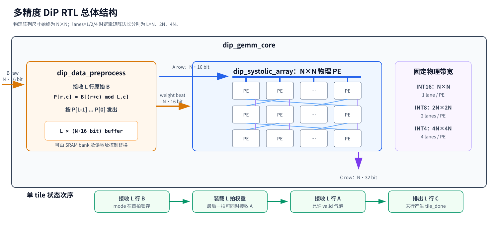
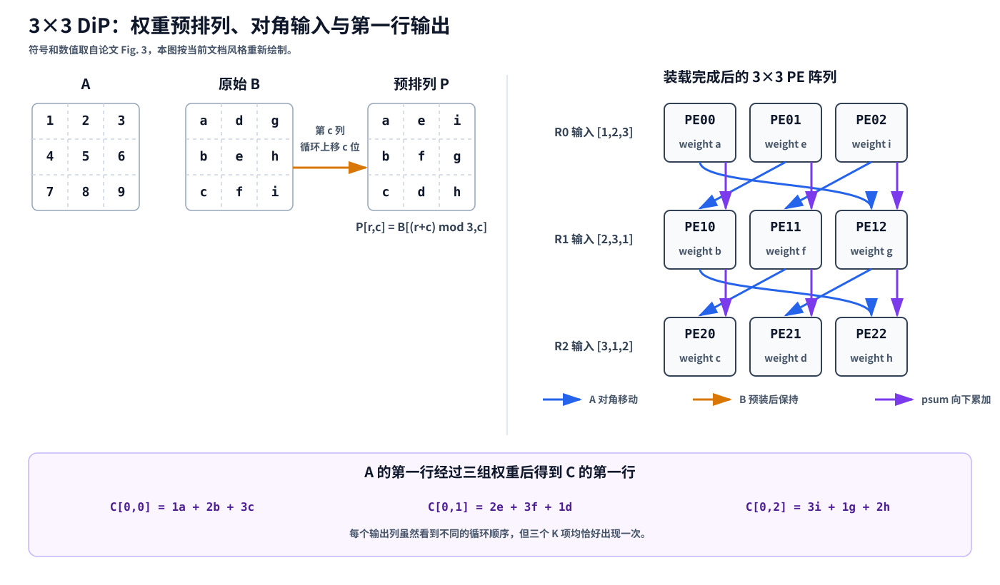
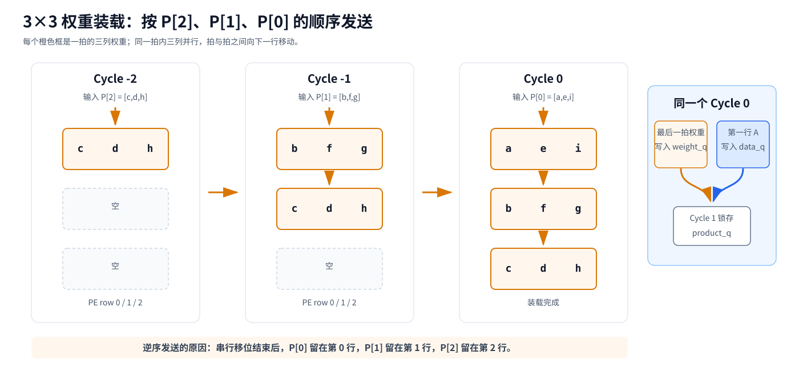
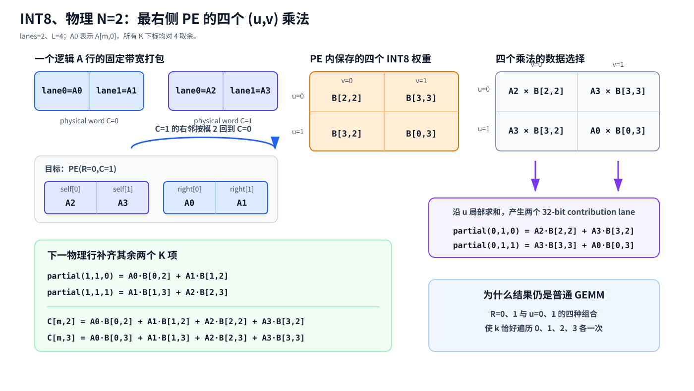
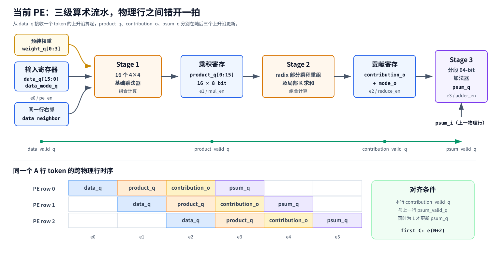

# 多精度 DiP 脉动阵列 RTL

本目录实现论文 *DiP: A Scalable, Energy-Efficient Systolic Array for Matrix Multiplication Acceleration* 的 diagonal-input、permutated weight-stationary 数据流，并在同一组物理 PE 上加入 INT16、INT8、INT4 三档计算能力。论文中的 PE 使用二级 MAC，本文 RTL 在基础乘法器之后增加寄存器，并把局部 K 求和单独寄存，因此当前 PE 是三级算术流水。

默认物理阵列尺寸为 `16×16`。输入位宽降低时，每个 16-bit 物理 word 容纳更多 lane，同一个物理 PE 同时计算更多逻辑乘法，逻辑矩阵尺寸随之扩展为 `32×32` 或 `64×64`。A、B、C 的物理行带宽在三个模式下保持不变。

本文中的五张 SVG 均为依据论文 Fig. 2、Fig. 3 和当前 RTL 重新绘制，并非论文原图。论文的 3×3 示例用于解释基本 DiP 数据流；涉及三级流水、多 lane、临时累加位宽的图则以本仓库代码为准。

## 1. 功能概览

### 1.1 模式

设物理阵列边长为 `N`，元素位宽为 `w`，每个物理 word 的元素数为 `lanes=16/w`，逻辑矩阵边长为 `L=N×lanes`。

| `mode_i` | 模式 | `w` | `lanes` | 逻辑矩阵 | 每物理 PE 的逻辑乘法数/周期 | 临时累加器 | 每物理列的最终结果 |
|---:|---|---:|---:|---|---:|---|---|
| `2'b00` | INT16 | 16 | 1 | `N×N` | 1 | 1×INT64 | 1×INT32 |
| `2'b01` | INT8 | 8 | 2 | `2N×2N` | 4 | 2×INT32 | 2×INT16 |
| `2'b10` | INT4 | 4 | 4 | `4N×4N` | 16 | 4×INT16 | 4×INT8 |
| `2'b11` | 保留 | — | — | — | — | — | 不接受新 tile |

默认 `N=16` 时：

```text
INT16: 16×16 logical array,  256 multiplications/cycle
INT8 : 32×32 logical array, 1024 multiplications/cycle
INT4 : 64×64 logical array, 4096 multiplications/cycle
```

这里的乘法数表示逻辑元素乘法数量。INT16 逻辑乘法由 16 个 4×4 radix 乘法组成；INT8 的 4 个逻辑乘法各需要 4 个 4×4 radix 乘法；INT4 的 16 个逻辑乘法各使用 1 个 4×4 乘法。

### 1.2 固定物理带宽

| 总线 | 每物理列 | 整行 |
|---|---:|---:|
| A 输入 | 16 bit | `N×16` bit |
| 原始 B 输入 | 16 bit | `N×16` bit |
| 权重装载 | 16 bit | `N×16` bit |
| PE 间部分和 | 64 bit | `N×64` bit |
| C 输出 | 32 bit | `N×32` bit |

packed word 中 lane 0 始终位于最低位。对物理列 `C` 和 lane `v`：

```text
a_row_i[C*16 + v*w +: w] =
  A[m, lanes*C+v]

b_raw_row_i[C*16 + v*w +: w] =
  B[r, lanes*C+v]

c_row_o[C*32 + v*(2*w) +: 2*w] =
  C[m, lanes*C+v]
```

INT16 的一个物理 C word 是一个 INT32；INT8 的一个物理 C word 按低位到高位放置两个 INT16；INT4 的一个物理 C word 按低位到高位放置四个 INT8。

## 2. 总体结构



图 1：`dip_gemm_core` 先接收完整 B tile，预处理模块生成 DiP 权重次序，随后把权重送入物理阵列。最后一个权重拍可以与第一个 A 行同时接收。阵列完成计算后按原始 A 行次序输出 C。

顶层一次处理一个完整的方形 `L×L×L` GEMM tile：

1. 在第一个 B 行握手时锁存 `mode_i`。
2. 接收 `L` 行原始 B，每行宽度固定为 `N×16` bit。
3. 预处理模块发出 `L` 个权重装载拍。
4. 最后一个权重拍可以与第一个 A 行在同一上升沿握手。
5. 接收 `L` 行 A，每行宽度固定为 `N×16` bit。
6. 阵列按输入顺序输出 `L` 行 C，每行宽度固定为 `N×32` bit。
7. 最后一行 C 有效时拉高 `c_row_last_o`，同一处理结束后 `tile_done_o` 脉冲一个周期。

### 2.1 顶层接口

| 信号 | 方向 | 宽度 | 说明 |
|---|---|---:|---|
| `clk_i` | input | 1 | 时钟 |
| `reset_n` | input | 1 | 低有效异步复位 |
| `mode_i` | input | 2 | `00/01/10` 对应 INT16/INT8/INT4 |
| `b_raw_row_valid_i` | input | 1 | 原始 B 行有效 |
| `b_raw_row_ready_o` | output | 1 | 可以接收原始 B 行 |
| `b_raw_row_i` | input | `N×16` | 一个 packed B 行 |
| `a_row_valid_i` | input | 1 | A 行有效 |
| `a_row_ready_o` | output | 1 | 可以接收 A 行 |
| `a_row_i` | input | `N×16` | 一个 packed A 行 |
| `c_row_valid_o` | output | 1 | C 行有效 |
| `c_row_last_o` | output | 1 | 当前 C 行是 tile 的最后一行 |
| `c_row_o` | output | `N×32` | 一个 packed C 行 |
| `busy_o` | output | 1 | 当前 tile 尚未完成 |
| `tile_done_o` | output | 1 | 当前 tile 完成脉冲 |

所有输入都以 `valid && ready` 为一次接收。C 端没有 `ready`，调用方必须接收每个 `c_row_valid_o=1` 的周期。单独使用 `dip_systolic_array` 时，调用方必须从权重装载开始到最后一行结果输出为止保持 `mode_i` 不变；使用 `dip_gemm_core` 时 mode 由顶层锁存。

## 3. 论文中的基本 DiP 数据流

论文使用一个 3×3 例子解释输入为什么沿对角方向移动，以及权重为什么需要提前改变排列。令：

```text
A = [ 1  2  3 ]      B = [ a  d  g ]
    [ 4  5  6 ]          [ b  e  h ]
    [ 7  8  9 ]          [ c  f  i ]
```

权重矩阵的第 `c` 列向上循环移动 `c` 个位置：

```text
P[r,c] = B[(r+c) mod N,c]

P = [ a  e  i ]
    [ b  f  g ]
    [ c  d  h ]
```



图 2：权重装载完成后，物理第 0、1、2 行分别保存 `P[0]`、`P[1]`、`P[2]`。A 的第一行进入物理第 0 行时为 `[1,2,3]`，移动到下一物理行后循环成为 `[2,3,1]`，再下一行成为 `[3,1,2]`。

论文基本结构的数据移动关系可写为：

```text
I[R,C] = A[m,(R+C) mod N]
I[R+1,C] = I[R,(C+1) mod N]
```

也可以从发送端理解为：

```text
PE(R,C) 的 registered data
  发送到 PE(R+1,(C-1) mod N)
```

因此普通列向左下方发送，最左列回接到下一物理行的最右列。权重和部分和则沿同一物理列向下。

对固定输出列 `C`，物理行 `R` 的乘法是：

```text
A[m,(R+C) mod N] * B[(R+C) mod N,C]
```

当 `R` 从 0 遍历到 `N-1` 时，`(R+C) mod N` 会把全部 K 下标各访问一次，所以纵向求和仍等于普通 GEMM：

```text
sum over R:
  A[m,(R+C) mod N] * B[(R+C) mod N,C]

= sum over k:
  A[m,k] * B[k,C]

= C[m,C]
```

3×3 示例的第一行输出为：

```text
C[0,0] = 1a + 2b + 3c
C[0,1] = 2e + 3f + 1d = 1d + 2e + 3f
C[0,2] = 3i + 1g + 2h = 1g + 2h + 3i
```

物理阵列中的加法顺序发生循环变化，但每个输出都包含正确的三个乘法项。

## 4. 权重预处理与逐拍装载

### 4.1 通用排列公式

当前多精度设计的逻辑矩阵边长为 `L=N×lanes`，预处理后的权重满足：

```text
P[r,c] = B[(r+c) mod L,c]
```

`dip_data_preprocess` 先按逻辑行号 `0...L-1` 接收原始 B，再按以下顺序发出：

```text
P[L-1], P[L-2], ..., P[1], P[0]
```

逆序发送是为了配合向下移位：最早发送的权重移动到最底部，最后发送的 `P[0]` 留在物理第 0 行。

### 4.2 论文 3×3 装载例子



图 3：论文的 3×3 例子依次发送 `[c,d,h]`、`[b,f,g]`、`[a,e,i]`。Cycle 0 后，三个物理行正好保存 `P[0]`、`P[1]`、`P[2]`。

| 周期 | PE row 0 | PE row 1 | PE row 2 | 同时发生 |
|---|---|---|---|---|
| Cycle -2 | `[c,d,h]` | 空 | 空 | 接收 `P[2]` |
| Cycle -1 | `[b,f,g]` | `[c,d,h]` | 空 | 接收 `P[1]` |
| Cycle 0 | `[a,e,i]` | `[b,f,g]` | `[c,d,h]` | 接收 `P[0]` 和第一行 A |

### 4.3 当前多精度权重寄存器

每个物理列形成一条纵向串行移位路径，共有 `N` 条路径并行工作。单个物理列的有效深度为：

```text
INT16: N × 1 = N
INT8 : N × 2 = 2N
INT4 : N × 4 = 4N
```

每个 PE 内部提供 `weight_q[0:3]`，实际参与移位的深度由模式决定：

| 模式 | 使用的 slice | `weight_o` |
|---|---|---|
| INT16 | `q0` | `q0` |
| INT8 | `q0,q1` | `q1` |
| INT4 | `q0,q1,q2,q3` | `q3` |

装载完成后，PE `(R,C)` 的 slice `u` 中，输出 lane `v` 对应的权重为：

```text
weight_q[R,C,u,v]
  = P[lanes*R+u, lanes*C+v]
  = B[(lanes*(R+C)+u+v) mod L, lanes*C+v]
```

权重只在 `wshift_i=1` 时移动。计算期间 `wshift_i=0`，全部 `weight_q` 保持不变，不随三级算术流水继续前进。

### 4.4 最后一拍权重与第一行 A

最后一个权重拍和第一个 A 行可以在 `e0` 同时被接收：

```text
e0: weight_q 写入最终权重，同时 data_q 写入第一行 A
e1: 乘法器看到更新后的 weight_q 和 data_q，结果写入 product_q
e2: contribution_q 更新
e3: 第 0 物理行的 psum_q 更新
```

由于 `product_q` 在 `e1` 才锁存，最终权重在乘法采样前已经稳定，不需要给权重增加与后两级相同的延迟。

### 4.5 预处理存储

当前预处理模块使用一个最大尺寸为 `4N×N×16` bit 的逻辑 B buffer，主要用于提供可综合、可仿真的功能参考。论文建议在软件中预先改变权重排列，或者通过多 bank SRAM 的读地址次序直接产生 `P`。面向 SoC 集成时，可以用 SRAM bank 和地址发生器替换当前 buffer，不必把它计入论文 PE 阵列的面积与功耗数据。

## 5. 多精度 PE 的下标组织

### 5.1 符号

```text
w       = 元素位宽，分别为 16/8/4
lanes   = 16/w，分别为 1/2/4
L       = N*lanes
R, C    = 物理 PE 行号和列号，范围 0 ... N-1
u       = PE 内的 K lane，范围 0 ... lanes-1
v       = PE 内的输出 lane，范围 0 ... lanes-1
m       = 当前 A/C 的逻辑行号
```

物理列 `C` 负责 `lanes` 个逻辑输出列：

```text
j(C,v) = lanes*C + v
```

一个 PE 对每个 `v` 并行计算 `lanes` 个乘法，再沿 `u` 做局部求和。单个 `(u,v)` 乘法使用的 K 下标是：

```text
k(R,C,u,v) =
  (lanes*(R+C) + u + v) mod L

product(R,C,u,v) =
  A[m,k(R,C,u,v)] *
  B[k(R,C,u,v),lanes*C+v]

partial(R,C,v) =
  sum over u=0...lanes-1 of product(R,C,u,v)
```

阵列再沿物理行方向累计：

```text
C[m,lanes*C+v] =
  sum over R=0...N-1 of partial(R,C,v)
```

对固定的 `(C,v)`，`lanes*C+v` 是常数偏移；`R` 与 `u` 的全部组合使 `lanes*R+u` 遍历 `0...L-1`。加上常数后再对 `L` 取余，K 下标仍然各出现一次，所以结果等于普通 GEMM。

### 5.2 本地 word 与右邻 word

物理 PE `(R,C)` 的 registered data word 记为 `D[R,C]`：

```text
D[R,C,t] =
  A[m,(lanes*(R+C)+t) mod L]
```

对 `(u,v)`，令 `z=u+v`。需要的数据选择为：

```text
if z < lanes:
    data = D[R,C,z]
else:
    data = D[R,(C+1) mod N,z-lanes]
```

`u+v` 的最大值是 `2×lanes-2`，因此最多跨过一个 16-bit word。右邻数据来自同一物理行另一个 PE 的 `data_q`，源端已经寄存，不会形成组合环。

最右侧物理列 `C=N-1` 的右邻按模 `N` 回到第 0 列：

```text
data_neighbor[R,N-1] =
  data_from_pe[R,0]
```

物理行之间的对角移动也采用同样的循环方式：

```text
D[R+1,C] =
  D[R,(C+1) mod N]

D[R+1,N-1] =
  D[R,0]
```

所以最左列的 registered data 会送往下一物理行的最右列，这与论文 Fig. 2、Fig. 3 一致。

### 5.3 `N=2`、INT8 的 `(u,v)` 图解



图 4：`lanes=2` 时，最右侧 PE `(R=0,C=1)` 的本地 word 是 `[A2,A3]`，右邻按模 2 回到第 0 列，所以右邻 word 是 `[A0,A1]`。四个 `(u,v)` 乘法中只有 `(u=1,v=1)` 需要读取 `A0`。

INT8 的数据来源表：

| 输出 lane `v` | K lane `u` | `z=u+v` | A 来源 |
|---:|---:|---:|---|
| 0 | 0 | 0 | `self[0]` |
| 0 | 1 | 1 | `self[1]` |
| 1 | 0 | 1 | `self[1]` |
| 1 | 1 | 2 | `right[0]` |

INT4 使用相同规则，只是 `lanes=4`：

| K lane `u` / 输出 lane `v` | 0 | 1 | 2 | 3 |
|---:|---|---|---|---|
| 0 | S0 | S1 | S2 | S3 |
| 1 | S1 | S2 | S3 | R0 |
| 2 | S2 | S3 | R0 | R1 |
| 3 | S3 | R0 | R1 | R2 |

`Sx` 表示 `self[x]`，`Rx` 表示 `right[x]`。INT16 只有 `(u=0,v=0)`，始终读取自己的 lane 0。

## 6. `N=2`、INT8 完整数值例子

取一行 A 和一个 4×4 B：

```text
A = [1, 2, 3, 4]

B = [ 1,  2,  3,  4]
    [ 5,  6,  7,  8]
    [ 9, 10, 11, 12]
    [13, 14, 15, 16]
```

两个物理 A word 为：

```text
physical C=0: lane0=1, lane1=2, word=16'h0201
physical C=1: lane0=3, lane1=4, word=16'h0403
```

预处理后的四行权重为：

```text
P0 = [ 1,  6, 11, 16]
P1 = [ 5, 10, 15,  4]
P2 = [ 9, 14,  3,  8]
P3 = [13,  2,  7, 12]
```

发送顺序为 `P3、P2、P1、P0`。四拍结束后：

| PE | `q0` 的 `[v0,v1]` | `q1` 的 `[v0,v1]` |
|---|---|---|
| `(0,0)` | `[1,6]` | `[5,10]` |
| `(0,1)` | `[11,16]` | `[15,4]` |
| `(1,0)` | `[9,14]` | `[13,2]` |
| `(1,1)` | `[3,8]` | `[7,12]` |

每个 PE 的两个局部结果为：

| PE | 输出 lane 0 | 输出 lane 1 |
|---|---:|---:|
| `(0,0)` | `1×1 + 2×5 = 11` | `2×6 + 3×10 = 42` |
| `(1,0)` | `3×9 + 4×13 = 79` | `4×14 + 1×2 = 58` |
| `(0,1)` | `3×11 + 4×15 = 93` | `4×16 + 1×4 = 68` |
| `(1,1)` | `1×3 + 2×7 = 17` | `2×8 + 3×12 = 52` |

同一物理列纵向相加：

```text
C = [11+79, 42+58, 93+17, 68+52]
  = [90, 100, 110, 120]
```

这与普通矩阵乘法完全一致：

```text
C[0] = 1×1 + 2×5 + 3×9  + 4×13 = 90
C[1] = 1×2 + 2×6 + 3×10 + 4×14 = 100
C[2] = 1×3 + 2×7 + 3×11 + 4×15 = 110
C[3] = 1×4 + 2×8 + 3×12 + 4×16 = 120
```

最终两个 32-bit 物理输出 word 为：

```text
physical column 0 = {INT16'(100), INT16'(90)}
                  = 32'h0064_005A

physical column 1 = {INT16'(120), INT16'(110)}
                  = 32'h0078_006E
```

## 7. PE 算术结构

### 7.1 基础乘法器

每个物理 PE 固定实例化 16 个 `dip_base_mul4`。一个宽有符号数按 4-bit radix digit 拆分时，只有最高 digit 按 signed 解释，其余 digit 按 unsigned 解释。例如 INT16：

```text
A = a0 + (a1 << 4) + (a2 << 8) + (a3 << 12)
B = b0 + (b1 << 4) + (b2 << 8) + (b3 << 12)

a0,a1,a2: unsigned 4-bit digit
a3      : signed   4-bit digit
b0,b1,b2: unsigned 4-bit digit
b3      : signed   4-bit digit
```

乘法重组为：

```text
A*B = sum over p,q:
  extend(a[p]*b[q]) << (4*(p+q))
```

各模式对 16 个基础乘法器的使用方式：

```text
INT16: 1 个 16×16 product × 16 个 radix product
INT8 : 4 个 8×8 product  ×  4 个 radix product
INT4 : 16 个 4×4 product ×  1 个 radix product
```

INT8 和 INT4 模式还会在 PE 内沿 `u` 把多个逻辑乘法相加，从而为每个输出 lane 生成一个 `contribution`。

### 7.2 加法器

`dip_segmented_adder64` 明确实例化 16 个 `dip_base_add4`，组成一条可分段的 64-bit carry path：

```text
INT16: [                     64-bit lane                     ]
INT8 : [          32-bit lane          ][      32-bit lane   ]
INT4 : [16-bit lane][16-bit lane][16-bit lane][16-bit lane]
```

INT8 在 bit 32 处阻断 carry；INT4 在 bit 16、32、48 处阻断 carry。这样同一组 4-bit 加法单元可以并行更新 1、2、4 个临时累加器。

需要注意：Stage 2 的 radix 部分乘积重组和局部 K 求和使用 SystemVerilog `+` 描述，综合工具会为这一阶段生成额外的组合加法硬件；它与 Stage 3 的 16 个 `dip_base_add4` 同时工作，不是分时复用同一组加法单元。

### 7.3 临时累加与最终截断

| 模式 | contribution lane | psum lane | 最终输出 lane |
|---|---|---|---|
| INT16 | 1×64 bit | 1×64 bit | 1×32 bit |
| INT8 | 2×32 bit | 2×32 bit | 2×16 bit |
| INT4 | 4×16 bit | 4×16 bit | 4×8 bit |

每次累加都按临时累加器位宽做二补码回绕，阵列底部再保留每个 lane 的低位作为最终输出。设计不执行饱和或舍入。例如 INT4 临时结果 `204` 的 16-bit 表示为 `16'h00CC`，截成 signed INT8 后得到 `8'hCC=-52`。

## 8. 三级算术流水与跨行对齐



图 5：三级算术流水不包含输入寄存器本身。`data_q` 在 `e0` 接收 token，三个算术寄存器分别在 `e1`、`e2`、`e3` 更新。相邻物理行接收同一个 token 的时间错开一拍，所以每增加一个物理行只增加一拍阵列延迟。

### 8.1 单 PE 时序

| 上升沿 | 更新的寄存器 | 使用的数据 | 使能 |
|---|---|---|---|
| `e0` | `data_q`、`data_mode_q` | `data_i`、`mode_i` | `pe_en_i` |
| `e1` | `product_q[0:15]`、`product_mode_q` | 本地 `data_q`、同行右邻 `data_q`、静止权重 | `mul_en_i` |
| `e2` | 已寄存的 `contribution_o`、`contribution_mode_o` | `product_q` | `reduce_en_i` |
| `e3` | `psum_q` | `contribution_q + psum_i` | `adder_en_i` |

组合路径被拆成：

```text
data_q/weight_q
  → 16 个 4×4 multiplier
  → product_q
  → radix 重组与局部 K 求和
  → contribution_q
  → segmented 64-bit adder
  → psum_q
```

mode 与相应数据同步前进：

```text
data_mode_q
  → product_mode_q
  → contribution_mode_o
  → segmented adder mode
```

### 8.2 valid 对齐

阵列按物理行生成四组使能：

```text
pe_en[row]      : 本物理行接收 data_q
mul_en[row]     : 对应 data_q 写入 product_q
reduce_en[row]  : 对应 product_q 写入 contribution_q
adder_en[row]   : 本地 contribution 与上一物理行 psum 同时有效
```

valid 寄存器依次为：

```text
data_valid_q
  → product_valid_q
  → contribution_valid_q
  → psum_valid_q
```

第 0 物理行没有上游部分和，因此：

```text
adder_en[0] = contribution_valid_q[0]
```

后续物理行只有两项同时有效才更新：

```text
adder_en[R] =
  contribution_valid_q[R] &&
  psum_valid_q[R-1]
```

若第 `m` 个 A 行在 `e(m)` 被顶行接收，则物理行 `R` 的寄存器更新时间为：

```text
data_q[R]         : e(m+R)
product_q[R]      : e(m+R+1)
contribution_q[R] : e(m+R+2)
psum_q[R]         : e(m+R+3)
```

物理行 `R>0` 的本地 `contribution_q` 与上一物理行的 `psum_q` 都在 `e(m+R+2)` 更新，并在整个下一周期保持稳定，因此本行在 `e(m+R+3)` 相加时读取的是同一个 token。输入 valid 中的气泡会沿四组 valid 原样前进，不会把不同 A 行混合。

同行所有物理列共用相同的行使能，所以一个 C 行中的所有物理 word 同时有效。`data_neighbor_i` 读取同行 PE 的 `data_q`，同行各列也属于同一个 token。

### 8.3 阵列输出时刻

第一个 A 行在 `e0` 接收时：

```text
first C row : e(N+2)
```

连续接收 `L` 行 A 时：

```text
C row m    : e(m+N+2)
last C row : e(L+N+1)
```

从第一个 A 握手到最后一个 C 行的时钟差为：

```text
INT16: L+N+1 = 2N+1
INT8 : L+N+1 = 3N+1
INT4 : L+N+1 = 5N+1
```

流水充满后仍然每周期输出一行 C。上述时刻不包含预处理模块先接收 B 的时间。

## 9. 文件结构与模块职责

```text
rtl/dip/
├── dip_base_mul4.sv
├── dip_base_add4.sv
├── dip_simd_dot_product.sv
├── dip_segmented_adder64.sv
├── dip_pe.sv
├── dip_systolic_array.sv
├── dip_data_preprocess.sv
├── dip_gemm_core.sv
├── docs/
│   └── figures/
│       ├── system_overview.svg
│       ├── dip_3x3_dataflow.svg
│       ├── weight_load_3x3.svg
│       ├── int8_n2_uv_example.svg
│       └── pe_pipeline_and_alignment.svg
├── tb/
│   ├── gen_random_vectors.py
│   ├── tb_dip_pe.sv
│   ├── tb_dip_data_preprocess.sv
│   ├── tb_dip_gemm_core.sv
│   └── tb_dip_gemm_n1.sv
└── Makefile
```

### `dip_base_mul4`

可配置两个 4-bit operand 是否按 signed 解释，输出 8-bit 二补码乘积。非最高 radix digit 使用 unsigned，最高 radix digit 使用 signed。

### `dip_base_add4`

一个带 carry 输入和输出的 4-bit 加法单元，由 `dip_segmented_adder64` 实例化 16 次。

### `dip_simd_dot_product`

根据 mode 配置 16 个基础乘法器的数据来源和符号属性；在 `product_q` 后完成 radix 重组与局部 K 求和；输出一个包含 1、2 或 4 个 lane 的 64-bit contribution。

### `dip_segmented_adder64`

根据 mode 在指定 bit 位置阻断 carry，以一组硬件实现 `1×64`、`2×32` 或 `4×16` 加法。

### `dip_pe`

保存输入 word、mode、1/2/4 个权重 slice、基础乘积、局部贡献和临时部分和。端口宽度固定：

| 端口 | 宽度 | 说明 |
|---|---:|---|
| `data_i/data_neighbor_i/data_o` | 16 | 本地数据、同行右邻数据、对角输出 |
| `weight_i/weight_o` | 16 | 纵向权重移位 |
| `psum_i/psum_o` | 64 | 纵向临时部分和 |
| `mode_i` | 2 | 算术拆分方式 |
| `wshift_i` | 1 | 权重寄存器使能 |
| `pe_en_i` | 1 | 输入寄存器使能 |
| `mul_en_i` | 1 | 基础乘积寄存器使能 |
| `reduce_en_i` | 1 | 局部贡献寄存器使能 |
| `adder_en_i` | 1 | 临时部分和寄存器使能 |

### `dip_systolic_array`

实例化 `N×N` 个 PE，生成对角数据连接、纵向权重和部分和连接、同行共享的四级 valid 控制，并在阵列底部把临时累加 lane 截成最终 C lane。此模块没有输出背压。

### `dip_data_preprocess`

接收 `L` 行原始 B，按 `P[r,c]=B[(r+c) mod L,c]` 选择元素，并以逆序行号产生 `L` 个权重装载拍。输出端支持 ready/valid 停顿。

### `dip_gemm_core`

提供完整 tile 控制，包含 `ST_LOAD_WEIGHTS`、`ST_ACCEPT_INPUTS`、`ST_DRAIN` 三个状态，负责 mode 锁存、B/A 行计数、最后一行 C 标记和完成脉冲。

## 10. Python 随机向量

`tb/gen_random_vectors.py` 生成可重复的 signed A/B 随机矩阵，并计算与 RTL 一致的 C。默认覆盖 INT16、INT8、INT4，并插入最小负数、最大正数、`-1/0/1` 等典型极值。

示例：

```bash
python3 rtl/dip/tb/gen_random_vectors.py \
  --array-n 16 \
  --tiles-per-mode 2 \
  --seed 20250727 \
  --output /tmp/dip_vectors.txt
```

只生成指定模式：

```bash
python3 rtl/dip/tb/gen_random_vectors.py \
  --array-n 4 \
  --modes int8 int4 \
  --no-corners
```

文件格式使用纯十进制，SystemVerilog 可以直接用 `$fscanf` 读取：

```text
version physical_n tile_count seed
tile_id precision lanes logical_n input_bits accumulator_bits output_bits
<L rows of A>
<L rows of B>
<L rows of expected C>
```

Python 黄金计算每次累加都按 INT64、INT32 或 INT16 做二补码回绕，最后再截成 INT32、INT16 或 INT8。

## 11. Verilator 验证

运行严格 lint 和全部测试：

```bash
make -C rtl/dip lint
make -C rtl/dip test
```

单独运行：

```bash
make -C rtl/dip pe-test
make -C rtl/dip preprocess-test
make -C rtl/dip random-vectors
make -C rtl/dip gemm-test
make -C rtl/dip n1-test
```

扩大随机回归：

```bash
make -C rtl/dip gemm-test \
  VECTOR_SEED=12345 \
  TILES_PER_MODE=10
```

当前测试覆盖：

- 三种模式的 radix 乘法重组、局部 K 求和和分段临时累加；
- signed 极值、二补码回绕和最终截断；
- INT8/INT4 同行右邻数据选择以及最右列回接；
- 三种模式的权重预处理、逆序装载和 ready/valid 停顿；
- 最后一拍权重与第一行 A 同时接收；
- Python 生成的完整随机 GEMM；
- 三级算术流水后的 `2N+1/3N+1/5N+1` 时钟差；
- 连续 A 输入时 C 严格保持每周期一行；
- A/B valid 气泡、连续 tile、`last/done/busy`；
- `ARRAY_N=1` 特例和异步复位；
- 保留 mode 不接受新 tile。

成功日志：

```text
tb_dip_pe: PASS
tb_dip_data_preprocess: PASS
tb_dip_gemm_core: PASS (... Python-generated tiles ...)
tb_dip_gemm_n1: PASS
```

## 12. 与论文原型的差异

| 项目 | 论文原型 | 当前 RTL |
|---|---|---|
| 主要精度 | INT8 | INT16、INT8、INT4 |
| 物理 PE | 每周期一个逻辑 MAC | 每周期 1、4、16 个逻辑乘法 |
| MAC 流水 | 二级 | 三级算术流水 |
| 权重准备 | 软件预处理或存储器读次序调整 | RTL buffer 功能参考 |
| 论文 3×3 首行输出 | Cycle 3 | 三级版本在 `e(N+2)=e5` |
| 逻辑边长 | `N` | `L=N×lanes` |

论文给出的 DiP 单 tile 延迟公式为：

```text
Latency_DiP = 2N + S - 2
```

其中 `S` 是 MAC 流水级数。论文例子取 `S=2`；当前 INT16 路径取 `S=3`，从第一个 A 行到最后一个 C 行的时钟差为 `2N+1`。INT8 和 INT4 每个 tile 分别包含 `2N` 和 `4N` 个逻辑 A 行，因此使用当前 RTL 的通用公式 `L+N+1`。

论文在 22 nm、INT8、特定阵列规模下给出的面积、功耗和性能数据不能直接用于当前多精度 PE。当前设计增加了 radix 重组、局部 K 求和、更宽临时累加器和额外流水寄存器，必须重新综合、布局布线并测量。

## 13. 当前限制

- 顶层一次处理一个完整方形 tile，非整除尾块由上游补零并丢弃越界结果。
- 多个 K tile 的临时结果需要在阵列外合并。
- C 输出没有 ready，不能暂停输出。
- 当前 core 不重叠下一 B tile 的预取和当前 tile 计算。
- 最终输出采用低位截取和二补码回绕，不执行饱和或舍入。
- 第 0 列到最右列的循环回接可能形成较长物理连线，但源端为 `data_q`，终点为下一数据寄存器或 `product_q`，不存在组合环。
- 当前预处理 buffer 是功能参考，实现产品时通常替换为 SRAM bank 和读地址控制。
- `reset_n` 为低有效异步复位。
