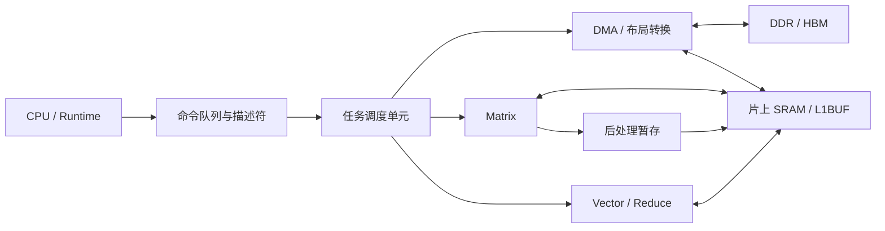
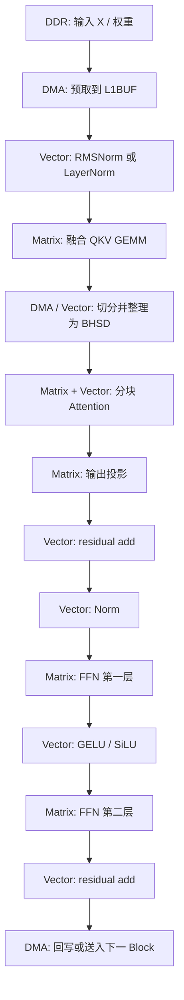

# 面向 Transformer 和 LSTM 加速的 NPU 设计目标

> 文件名沿用题目中的 Transfomer 写法；正文统一使用标准拼写 Transformer。
>
> 本文面向推理型 NPU，说明 Transformer 与 LSTM 的计算特征、需要实现的关键算子、软硬件职责划分，以及适合优先由硬件完成的部分。本文假定 NPU 包含 Matrix、Vector、DMA、片上 SRAM（如 L1BUF）和任务调度单元。

## 1. 设计范围与总目标

### 1.1 目标模型

| 模型 | 典型应用 | 主要计算特征 | NPU 重点 |
| --- | --- | --- | --- |
| Transformer Encoder | 文本理解、视觉 Transformer、语音编码 | token 维可并行；线性层与 FFN 的矩阵乘占比高 | 高吞吐 GEMM、归一化、Softmax、张量重排 |
| Transformer Decoder | 大语言模型生成、代码生成、对话 | 逐 token 生成；KV Cache 读写频繁 | 小矩阵低时延、KV Cache 预取、低启动开销 |
| LSTM / BiLSTM | 语音、时序预测、轻量 NLP | 时间步间有状态依赖；四门计算规则固定 | 门控 GEMM、逐元素激活、状态驻留 |

本文聚焦推理。反向传播、优化器更新、梯度通信和随机失活不属于首版 NPU 的必备范围。

### 1.2 总体目标

NPU 应实现以下能力：

1. 用高利用率矩阵乘支持 Transformer 的线性层、注意力矩阵乘、FFN 和 LSTM 的四门矩阵乘。
2. 用向量流水支持归一化、Softmax、Sigmoid、Tanh、GELU、SiLU、残差相加和逐元素乘。
3. 用 DMA、片上 SRAM 和描述符调度减少外部存储访问。
4. 支持动态 batch、序列长度、头数和隐藏维度，不要求每种模型尺寸对应一套 RTL。
5. 将图分析、分块、融合选择和指令生成交给软件；将规则、重复、高密度的数值计算交给硬件。
6. 为 Decoder 提供短任务调度，以及 KV Cache 的追加、读取和分块访问能力。

### 1.3 首版不应单列大型硬件模块的功能

以下工作分支多、调用频率低，或需要复杂策略选择，宜由 CPU、固件或 Runtime 处理：

- tokenizer、文本编码和文本解码；
- Beam Search、Top-k、Top-p 与随机采样；
- 字符串处理、模型文件解析和复杂控制流；
- KV Cache 的高层块表管理；
- 少量出现的任务专用后处理。

NPU 可以提供比较、选择、局部排序和 DMA 原语帮助软件，但不需要先为这些工作配置大面积专用电路。

---

## 2. 模型计算分解

### 2.1 Transformer Block

设输入为：

$$
X\in\mathbb{R}^{B\times S\times H},
$$

其中 $B$ 是 batch 大小，$S$ 是序列长度，$H$ 是隐藏维度。一个常见的 Pre-Norm Transformer Block 可写为：

$$
\widetilde X=\operatorname{Norm}(X),
$$

$$
Q=\widetilde XW_Q,\qquad K=\widetilde XW_K,\qquad V=\widetilde XW_V,
$$

$$
A=\operatorname{Softmax}\left(\frac{QK^T}{\sqrt{D}}+M\right),
$$

$$
Z=\operatorname{Concat}(A_1V_1,\ldots,A_hV_h)W_O,
$$

$$
U=X+Z,
$$

$$
Y=U+W_2\phi(\operatorname{Norm}(U)W_1+b_1)+b_2.
$$

其中 $h$ 为注意力头数，$D=H/h$ 为单头维度，$M$ 是可选掩码，$\phi$ 常取 GELU 或 SiLU。

一个 Transformer Block 可拆成六类基础计算：

1. 规则 GEMM：Q、K、V、输出投影和两层 FFN。
2. 批量矩阵乘：$QK^T$ 与 $AV$。
3. 归约：LayerNorm、RMSNorm、Softmax。
4. 逐元素运算：bias、残差相加、缩放、掩码、激活函数。
5. 张量布局转换：BSH、BHSD、BSHD 等排列之间的转置、切分和拼接。
6. 存储访问：权重读取、中间特征暂存、KV Cache 追加和读取。

### 2.2 Transformer 计算量示例

以 $B=2$、$S=128$、$H=768$、FFN 中间维度 $F=3072$、$h=12$ 为例，忽略 bias 与逐元素计算：

| 部分 | MAC 数量 | 硬件特征 |
| --- | ---: | --- |
| Q、K、V 投影 | $3BSH^2$ | 规则 GEMM，权重复用充分 |
| 注意力分数 $QK^T$ | $BS^2H$ | 批量矩阵乘，随 $S^2$ 增长 |
| 注意力加权 $AV$ | $BS^2H$ | 批量矩阵乘，适合按块执行 |
| 输出投影 | $BSH^2$ | 规则 GEMM |
| 两层 FFN | $2BSHF$ | 通常是 Block 内最大的计算部分 |

FFN 的结构高度规则，最适合由 Matrix 阵列执行。序列较长时，注意力的 $S^2$ 项会快速增大片上存储需求和外部带宽需求。

### 2.3 LSTM 单元

设第 $t$ 个时间步输入为 $x_t$，前一时刻隐藏状态与记忆状态为 $h_{t-1}$、$c_{t-1}$。标准 LSTM 为：

$$
i_t=\sigma(W_{ii}x_t+W_{hi}h_{t-1}+b_i),
$$

$$
f_t=\sigma(W_{if}x_t+W_{hf}h_{t-1}+b_f),
$$

$$
g_t=\tanh(W_{ig}x_t+W_{hg}h_{t-1}+b_g),
$$

$$
o_t=\sigma(W_{io}x_t+W_{ho}h_{t-1}+b_o),
$$

$$
c_t=f_t\odot c_{t-1}+i_t\odot g_t,
\qquad
h_t=o_t\odot\tanh(c_t).
$$

实际实现应将四组门控矩阵拼接为一次 GEMM：

$$
G_t=[x_t,h_{t-1}]
\begin{bmatrix}
W_i & W_f & W_g & W_o
\end{bmatrix}
+[b_i,b_f,b_g,b_o].
$$

再将 $G_t$ 切成四份，由 Vector 完成 Sigmoid、Tanh、逐元素乘和加法。输入宽度为 $I$、隐藏宽度为 $H$、时间长度为 $T$ 时，门控部分约需：

$$
4BT(I+H)H
$$

次 MAC。

LSTM 的时间维不能完全并行，但 batch 维、隐藏维和四个门均可并行。因此，复用 GEMM 阵列和向量流水即可获得大部分加速收益，无需独立的大型 LSTM 阵列。

---

## 3. 关键算子与硬件优先级

### 3.1 算子总表

| 优先级 | 算子或算子组 | Transformer 用途 | LSTM 用途 | 推荐执行单元 | 硬件建议 |
| --- | --- | --- | --- | --- | --- |
| P0 | GEMM / MatMul / Batched MatMul | QKV、投影、FFN、$QK^T$、$AV$ | 四门拼接矩阵乘 | Matrix / Tensor Engine | 必须实现，最高优先级 |
| P0 | bias、残差加、缩放、逐元素乘 | 线性层后处理、残差、注意力缩放 | 状态更新、门控组合 | Vector ALU | 与主算子融合 |
| P0 | ReduceSum、ReduceMax、ReduceMean | Softmax、LayerNorm、RMSNorm | 可选统计 | Vector Reduce Unit | 必须有归约树 |
| P0 | Exp、Reciprocal、ReciprocalSqrt | Softmax、Norm | 少量概率与归一化 | Special Function Unit | 支持近似计算 |
| P0 | Sigmoid、Tanh、GELU、SiLU | FFN 激活 | LSTM 门控激活 | Vector / Special Function Unit | 查表加多项式 |
| P0 | DMA Copy、Strided Copy、Transpose | QKV 切分、KV Cache、布局转换 | 输入与状态搬运 | DMA / Layout Engine | 必须实现 |
| P1 | Masked Softmax | 因果注意力、padding mask | 不常用 | Vector + Attention Pipeline | 作为 Softmax 扩展 |
| P1 | RoPE | Decoder 的位置旋转 | 不常用 | Vector ALU | 适合向量单元 |
| P1 | KV Cache Append / Gather | Decoder 生成 | 不适用 | DMA + SRAM 控制 | 重点优化访存 |
| P1 | Fused Attention | 长序列 Encoder、Prefill | 不适用 | Attention Pipeline | 中后期加入 |
| P2 | Embedding Gather | token 查表 | 词嵌入查表 | DMA / Vector Gather | 按产品需求决定 |
| P2 | Top-k / Sampling | 输出 token 选择 | 不常用 | CPU / Vector | 首版以软件为主 |

P0 表示首版必须具备，P1 表示主干可用后优先加入，P2 表示按产品需求选择。

### 3.2 GEMM、Batched MatMul 与线性层

统一计算形式为：

$$
C_{m,n}=\sum_{k=0}^{K-1}A_{m,k}B_{k,n}+b_n.
$$

Matrix 单元应支持：

- 一般 GEMM：$M\times K$ 乘 $K\times N$；
- 多个独立矩阵组成的 Batched MatMul；
- 逻辑转置视图，例如 $QK^T$ 中的 $K^T$；
- bias 融合；
- 可选残差相加、激活和输出写回；
- 非整 tile 尺寸的掩码处理；
- FP16、BF16、INT8 等格式，以及更高精度累加。

对 Transformer，建议把 QKV 三次线性层合并为一次：

$$
[Q,K,V]=X[W_Q,W_K,W_V]+[b_Q,b_K,b_V].
$$

对 LSTM，建议把四个门的权重拼接为一次 GEMM。两种融合都能减少中间张量的片上写回与再次读取。

### 3.3 LayerNorm 与 RMSNorm

LayerNorm 对最后一维求均值与方差：

$$
\mu=\frac{1}{H}\sum_{j=1}^{H}x_j,
\qquad
v=\frac{1}{H}\sum_{j=1}^{H}(x_j-\mu)^2,
$$

$$
y_j=\gamma_j\frac{x_j-\mu}{\sqrt{v+\epsilon}}+\beta_j.
$$

RMSNorm 不减均值：

$$
r=\sqrt{\frac{1}{H}\sum_{j=1}^{H}x_j^2+\epsilon},
\qquad
y_j=\gamma_j\frac{x_j}{r}.
$$

这两类算子适合 Vector，重点是：

1. 分块累加与树形归约；
2. FP32 或等效精度的局部累加；
3. ReciprocalSqrt 近似；
4. 与乘 $\gamma$、加 $\beta$ 融合；
5. 输入、统计量与输出尽量留在片上 SRAM。

不建议为 LayerNorm 单独设计巨大的计算阵列；增强通用向量归约单元的吞吐和片上读写能力更合适。

### 3.4 Softmax 与 Masked Softmax

数值稳定的 Softmax 先减去行最大值：

$$
m=\max_j x_j,
\qquad
p_i=\frac{\exp(x_i-m)}{\sum_j\exp(x_j-m)}.
$$

因果注意力中，未来位置不可参与当前行计算。可将不允许的位置加上负无穷，或在指数计算前令其贡献为零：

$$
p_i=\frac{\exp(x_i-m)\cdot valid_i}
{\sum_j\exp(x_j-m)\cdot valid_j}.
$$

硬件需要完成如下向量流水：

    最大值归约 → 指数近似 → 求和归约 → 倒数 → 逐元素乘

Exp 可由分段查表、低阶多项式或两者组合完成。行长度、mask 类型和缩放系数应由描述符配置。

### 3.5 激活函数

Transformer 常见 GELU、SiLU；LSTM 必需 Sigmoid、Tanh：

$$
\operatorname{Sigmoid}(x)=\frac{1}{1+e^{-x}},
\qquad
\operatorname{Tanh}(x)=\frac{e^{2x}-1}{e^{2x}+1},
$$

$$
\operatorname{SiLU}(x)=x\cdot\operatorname{Sigmoid}(x),
$$

$$
\operatorname{GELU}(x)\approx\frac{x}{2}
\left[1+\tanh\left(\sqrt{\frac{2}{\pi}}(x+0.044715x^3)\right)\right].
$$

这些算子的算术密度不足以单独占用 Matrix 阵列，但调用次数多，适合放入 Vector 流水中的特殊函数子单元，并与 bias、残差和逐元素乘连续执行。

### 3.6 张量布局转换与切分

Transformer 常在以下形状间切换：

    BSH → BS(3H) → BSH + BSH + BSH
    BSH → BSH → BHSD
    BHSD → BSH

其中 $D$ 是单头维度。QKV 切分、head 维重排、KV Cache 写入和批量矩阵乘输入准备都依赖此类工作。建议 DMA 支持多维描述符、可编程 stride、转置和小粒度拼接；复杂形状选择保留在编译器。

---

## 4. 推荐硬件架构

### 4.1 顶层组成

建议采用“Matrix 负责乘累加，Vector 负责非矩阵计算，DMA 负责搬运和布局转换”的分工。调度单元根据描述符安排双缓冲、依赖事件和任务完成通知。

### 4.2 Matrix / Tensor Engine

| 能力 | 设计要求 | 对模型的价值 |
| --- | --- | --- |
| Tile GEMM | 支持可配置 $M_t\times K_t\times N_t$ tile | 覆盖 FFN、QKV、LSTM 门控 |
| 多格式乘累加 | FP16/BF16/INT8 输入；FP32 或 INT32 累加 | 在性能、带宽和误差间选择 |
| 权重复用 | 同一权重 tile 服务多个 token 或 batch | 减少外部读取 |
| 输入复用 | 激活 tile 在多个输出通道上复用 | 提高 SRAM 利用率 |
| 转置访问 | 支持逻辑转置视图或 DMA 预处理 | 支持 $QK^T$ |
| 融合后处理 | bias、缩放、残差、激活可选融合 | 减少中间张量往返 |
| 尾部处理 | 对非整 tile 尺寸提供 mask | 支持不规则 batch |

Matrix 单元无需区分 QKV、FFN 或 LSTM 门控；它只需要高效执行描述符定义的 GEMM。模型语义、权重拼接和输出切分由编译器决定。

### 4.3 Vector / Reduce / Special Function Unit

向量单元至少应包括：

- 向量加、减、乘、乘加、最大值、最小值、比较、选择；
- Exp、倒数、倒数平方根、Sigmoid、Tanh；
- ReduceSum、ReduceMax、ReduceMean；
- 数据格式转换、饱和与裁剪；
- 读改写，用于残差相加和 LSTM 状态更新；
- 可选 RoPE 旋转计算：成对乘加与正余弦表读取。

建议使用多 lane SIMD 加归约树。大向量按 tile 处理，在 SRAM 内完成局部归约，再完成最终归约。LayerNorm、RMSNorm、Softmax 的中间统计量不应写回 DDR。

### 4.4 DMA 与片上 SRAM

| 能力 | 作用 |
| --- | --- |
| 双缓冲或多缓冲 | 当前 tile 计算时预取下一 tile |
| 多维 stride | 搬运 BSH、BHSD、KV Cache 等非连续片段 |
| 转置与拼接 | 减轻 Vector 和 CPU 的数据整理负担 |
| 广播 | bias、Norm 参数、位置参数在多个 token 上复用 |
| 多地址空间 | 分开管理输入、权重、中间结果、输出、KV Cache |
| 异步事件 | 让 DMA、Matrix、Vector 并行工作 |
| 对齐访问 | 提高总线有效载荷比例，简化 SRAM bank 调度 |

片上 SRAM 至少需要激活 tile、权重 tile、矩阵累加结果、向量暂存和 Decoder KV 热点缓存等区域。

### 4.5 调度器

硬件调度器适合管理短而规则的依赖：

    DMA 预取 A/B tile
            ↓
    Matrix GEMM
            ↓
    Vector bias + activation
            ↓
    DMA 回写或交给下一算子

模型层数、头数、序列长度和融合策略变化快，不宜固化为硬件状态机。编译器应生成任务列表和描述符；硬件只需支持命令队列、依赖事件或 fence、独立启动 DMA/Matrix/Vector、异常上报和性能计数器。

---

## 5. Transformer 的专门优化

### 5.1 QKV 与 FFN 融合

QKV 的三组权重可沿输出通道拼接，变为一次 GEMM。输出先进入 L1BUF，再由 DMA 或 Vector 做三段切分与 head 重排：

    X [B,S,H]
      │
      ├─ GEMM with [Wq | Wk | Wv]
      ▼
    QKV [B,S,3H]
      │
      ├─ split + layout conversion
      ▼
    Q, K, V [B,h,S,D]

FFN 推荐采用：

    GEMM + bias + GELU
    GEMM + bias + residual add

融合的收益来自减少中间张量在 L1BUF 与 DDR 之间的往返，不是减少 GEMM 的 MAC 数量。

### 5.2 分块 Attention

直接保存注意力分数矩阵需要 $B\times h\times S\times S$ 个元素。长序列下，它会占满 SRAM 或引入大量 DDR 访问。应按 Query 块和 Key/Value 块处理：

    for each Q block:
        初始化行最大值与归一化分母
        for each K/V block:
            计算 QK^T
            加缩放与 mask
            更新 Softmax 统计量
            累加对应的 V 加权结果
        写出当前 Q block 的注意力结果

在线 Softmax 可避免写出完整的 $S\times S$ 分数矩阵。对已处理部分保存行最大值 $m$、归一化分母 $l$ 和输出累加器 $o$。读入新块得到 $m'$ 后：

$$
m_{\mathrm{new}}=\max(m,m'),
$$

$$
l_{\mathrm{new}}=e^{m-m_{\mathrm{new}}}l+
\sum_j e^{s'_j-m_{\mathrm{new}}},
$$

$$
o_{\mathrm{new}}=e^{m-m_{\mathrm{new}}}o+
\sum_j e^{s'_j-m_{\mathrm{new}}}v'_j.
$$

最终输出为：

$$
y=\frac{o}{l}.
$$

对于短序列，通用 Matrix + Vector 组合已足够；对于长上下文 Prefill，可增加 Attention Pipeline，使 Matrix 输出的分数 tile 直接进入缩放、mask、指数、归约和 $V$ 加权流程。

### 5.3 Decoder 与 KV Cache

生成第 $t$ 个 token 时，当前 Query 只含一个或少量 token，Key/Value 来自 $0\ldots t$ 的历史缓存。性能重点变为：

1. 当前 token 的 QKV、FFN 小矩阵乘；
2. 大量 KV Cache 顺序读取；
3. 当前 K/V 的追加写入；
4. 小批量任务的低启动开销。

建议让软件选择 KV 块大小和地址表，让 DMA 按多维描述符完成读写；硬件不必理解页管理策略。建议：

- 将相邻时间步的 K/V 放在连续存储区域；
- 按若干 token 为一块，便于预取；
- 将当前层常用 KV 块保留在 L1BUF；
- 使用 Grouped-Query Attention 或 Multi-Query Attention 时复用更少的 K/V 头，降低读取量。

### 5.4 RoPE

Rotary Position Embedding 对二维元素对做旋转：

$$
\begin{bmatrix}
x'_{2i}\\
x'_{2i+1}
\end{bmatrix}
=
\begin{bmatrix}
\cos\theta_i & -\sin\theta_i\\
\sin\theta_i & \cos\theta_i
\end{bmatrix}
\begin{bmatrix}
x_{2i}\\
x_{2i+1}
\end{bmatrix}.
$$

RoPE 是成对乘加加正余弦表读取，适合放入 Vector 单元。正余弦表由软件预生成并存入只读权重区或片上常量区，无需配置专门的 Matrix 类阵列。

---

## 6. LSTM 的专门优化

### 6.1 四门融合

不要为输入项与循环项分别启动八次小 GEMM。应将输入和隐藏状态拼接，并将四个门的权重拼接：

    [x_t | h_(t-1)] × [Wi | Wf | Wg | Wo]
                               │
                               ▼
                         [i_raw | f_raw | g_raw | o_raw]

随后在同一个 Vector 任务中完成：

    i = sigmoid(i_raw)
    f = sigmoid(f_raw)
    g = tanh(g_raw)
    o = sigmoid(o_raw)
    c = f * c_prev + i * g
    h = o * tanh(c)

该方式减少命令数量、DMA 任务数量和中间张量占用，也提高 Matrix 阵列处理小矩阵时的利用率。

### 6.2 状态驻留

$h_t$ 和 $c_t$ 在下一时间步立刻使用。对于一个时间步块或一个 batch，推荐让它们保留在：

1. Vector 寄存器或专用状态寄存器；
2. L1BUF 的固定状态区；
3. 仅在序列块切换或任务结束时回写 DDR。

这能避免每个时间步都读取和写回外部存储。若隐藏维度过大，可按块循环处理，但每一块的 $h$ 与 $c$ 都应尽量留在片上，直到该时间步完成。

### 6.3 时间维调度

LSTM 的 $h_t,c_t$ 依赖前一时刻，不能跨时间步完全并行。调度器应：

- 沿时间步顺序发射门控 GEMM 与 Vector 状态更新；
- 在当前步 Vector 处理时预取下一步 $x_{t+1}$ 与权重 tile；
- 在 batch 维、隐藏维、输出通道维充分并行；
- 对多层 LSTM，让层间输出尽量直接进入下层输入缓冲；
- 对双向 LSTM，将正向与反向作为独立任务并行。

LSTM 的优化重点是降低每个时间步的固定开销，并让状态尽量少离开片上存储。

---

## 7. 软硬件职责划分

### 7.1 划分原则

适合硬件的工作具有以下特征：

- 计算规则固定；
- 数据规模大或调用频率高；
- 分支少；
- 数据复用明显；
- 可按 tile、向量或流水方式重复执行。

适合软件的工作具有以下特征：

- 模型结构、形状或策略变化快；
- 需要复杂搜索、动态内存管理或多层控制流；
- 调用次数少；
- 需要快速兼容新模型。

### 7.2 详细分工

| 工作项 | 编译器 / Runtime / CPU | NPU 硬件 | 说明 |
| --- | --- | --- | --- |
| 模型导入与图优化 | 负责 | 不负责 | 解析 ONNX、PyTorch 导出图或其他中间表示 |
| 算子拆分与融合决策 | 负责 | 提供可融合能力 | 决定 QKV 拼接、FFN 激活融合等 |
| tile 大小选择 | 负责 | 执行给定 tile | 软件按形状和 SRAM 容量选择 |
| 指令与描述符生成 | 负责 | 译码执行 | 保留模型演进空间 |
| GEMM、BMM | 发起任务 | 负责 | Matrix 阵列获得最高计算密度 |
| Norm、Softmax、激活 | 发起任务 | 负责 | Vector 与特殊函数流水执行 |
| 张量布局转换 | 选择方式 | DMA / Vector 执行 | 简单转置和搬运优先 DMA |
| KV Cache 地址管理 | 负责 | 按描述符读写 | 软件管理块表和容量策略 |
| KV Cache 数据搬运 | 下发描述符 | 负责 | DMA 负责预取、追加和回写 |
| mask 生成 | 负责 | 支持 mask 读取或比较 | 因果 mask 可由硬件根据位置参数生成 |
| Top-k、Top-p、采样 | 负责 | 可提供向量辅助 | 首版不需要专用大模块 |
| tokenizer | 负责 | 不负责 | 控制复杂、算术密度低 |
| 性能计数与异常 | 读取、分析 | 提供计数器和中断 | 便于调优与定位问题 |

### 7.3 为什么采用基础能力组合

Transformer 的结构持续演进：LayerNorm 与 RMSNorm、MHA 与 GQA、不同位置编码、不同 FFN 激活和不同 KV Cache 组织都会变化。若硬件直接固化模型层级语义，兼容新模型的成本很高。

更稳妥的方式是让硬件提供少量强大的基础能力：GEMM、BMM、向量归约、特殊函数、DMA 和片上存储。软件把具体模型拆成这些基础能力的任务序列。这样不仅覆盖 Transformer 和 LSTM，也能覆盖 GRU、MLP、CNN 的主要计算部分。

---

## 8. 数据格式、精度与误差控制

### 8.1 建议的数据格式

| 数据类型 | 建议用途 | 原因 |
| --- | --- | --- |
| FP16 | 激活、权重、常规推理 | 硬件成熟，带宽和存储开销较低 |
| BF16 | 大模型激活与权重 | 指数范围较大，溢出风险较低 |
| FP32 | 归约累加、Softmax 分母、Norm 统计量 | 减少长向量累加误差 |
| INT8 | 对误差容忍度较高的 GEMM | 可提高吞吐，降低带宽 |
| INT32 | INT8 GEMM 累加 | 避免乘累加过早截断 |

首版可优先支持 FP16/BF16 输入、FP32 累加和可选输出格式。低比特整数路径可作为可选能力，避免拖慢主干浮点模型的开发进度。

### 8.2 特殊函数近似

Exp、倒数、倒数平方根、Sigmoid 和 Tanh 可采用：

1. 输入区间规约；
2. 小型查找表给出初值；
3. 一到两次多项式修正或迭代修正；
4. 输出裁剪与格式转换。

软件需要为不同数据格式准备误差测试集。硬件可提供可配置近似模式，以便在更高精度和更高吞吐间选择。

### 8.3 累加精度

- GEMM：FP16/BF16 乘法结果推荐在 FP32 中累加；INT8 乘法结果推荐在 INT32 中累加。
- LayerNorm/RMSNorm：平方和与均值推荐使用 FP32 累加。
- Softmax：最大值、分母和倒数推荐使用 FP32 或等效精度。
- LSTM：$c_t$ 在长序列上可能积累误差，状态更新应避免过早截断。

---

## 9. 指令和描述符建议

| 描述符 | 关键字段 | 用途 |
| --- | --- | --- |
| GEMM_DESC | A/B/C 地址、M/N/K、stride、转置位、bias、输出格式 | Linear、QKV、FFN、LSTM 门控 |
| BMM_DESC | batch/head 数、M/N/K、各批次 stride | $QK^T$、$AV$ |
| NORM_DESC | 输入/输出地址、归约长度、$\gamma$/$\beta$、$\epsilon$、模式 | LayerNorm、RMSNorm |
| SOFTMAX_DESC | 行数、行长度、缩放、mask 类型、输出格式 | 注意力权重 |
| VECTOR_DESC | opcode、长度、输入/输出地址、标量参数 | 残差、激活、LSTM 状态更新、RoPE |
| DMA_DESC | 源/目的地址、多维 shape、stride、转置、事件 | 预取、回写、布局转换、KV Cache |
| ATTN_DESC | Q/K/V 地址、head 参数、mask、tile 参数 | 可选融合 Attention Pipeline |

GEMM_DESC 可提供以下融合标志：

    BIAS_ENABLE
    SCALE_ENABLE
    RESIDUAL_ENABLE
    ACTIVATION = NONE / GELU / SILU
    OUTPUT_LAYOUT = BSH / BHSD / custom-stride

VECTOR_DESC 可支持短操作序列，例如 Sigmoid → 乘法 → 加法。这足以覆盖 LSTM 状态更新，但不建议将任意长程序塞入单条指令，以免译码器和调试复杂度快速增加。

事件依赖示例：

    E0: DMA 将 X 和 Wqkv 搬入 L1BUF
    E1: GEMM 等待 E0，生成 QKV
    E2: DMA / Vector 等待 E1，完成 QKV 切分与重排
    E3: BMM 等待 E2，计算 QK^T
    E4: Softmax 等待 E3
    E5: BMM 等待 E4，计算 AV
    E6: 下一层等待 E5 后继续

事件表由软件生成，硬件只检查依赖是否完成，能够支持不同层数、不同头数和不同融合策略。

---

## 10. 典型执行流程

### 10.1 Transformer Encoder Block

只要 L1BUF 容量允许，Norm 输出、QKV 输出、Attention 输出和 FFN 中间结果应尽量不离开片上存储。

### 10.2 LSTM 时间步

~~~mermaid
flowchart TD
    A["输入 x_t 与状态 h_(t-1), c_(t-1)"] --> B["DMA: 预取 x_t / 权重"]
    B --> C["Matrix: 四门融合 GEMM"]
    C --> D["Vector: Sigmoid / Tanh"]
    D --> E["Vector: 更新 c_t"]
    E --> F["Vector: 计算 h_t"]
    F --> G["L1BUF 状态区"]
    G --> H["下一时间步 t+1"]
~~~

$h_t$ 与 $c_t$ 在 L1BUF 状态区中停留，下一时间步直接读取。权重跨时间步复用，适合预取后长期停留在较近的存储层级。

---

## 11. 性能目标与测试集合

### 11.1 需要采集的指标

| 类别 | 指标 |
| --- | --- |
| Matrix | 有效 MAC 利用率、tile 空闲周期、权重复用次数、累加精度 |
| Vector | 元素吞吐、归约吞吐、特殊函数误差、等待 SRAM 的周期 |
| DMA | 有效带宽、burst 利用率、预取命中率、转置开销 |
| SRAM | bank 冲突、读写端口利用率、各类缓冲占用 |
| Transformer | token/s、单 token 延迟、Prefill 延迟、KV Cache 访问量 |
| LSTM | 每时间步延迟、状态回写次数、四门融合比例 |
| 软件 | 编译时间、描述符数量、CPU 调度开销 |

### 11.2 建议基准形状

| 场景 | 建议覆盖形状 | 目的 |
| --- | --- | --- |
| Encoder 短序列 | $B=1/4$，$S=64/128$，$H=256/768$ | 验证常规文本和视觉 token 计算 |
| Encoder 长序列 | $S=512/1024/2048$ | 观察 Attention 的存储压力 |
| Decoder Prefill | $B=1/4$，多种 prompt 长度 | 测量大矩阵与分块 Attention |
| Decoder 逐 token | $B=1$，不同 KV 长度 | 测量小 GEMM 启动开销和 KV 读取 |
| LSTM 小隐藏层 | $I,H=64/128$ | 验证小矩阵调度效率 |
| LSTM 大隐藏层 | $I,H=512/1024$，$T=50/100$ | 验证状态驻留和权重复用 |

### 11.3 正确性测试

每类算子至少应有：

1. 与 PyTorch 或高精度参考实现的逐元素对比；
2. 连续多层网络的端到端对比；
3. 随机尺寸、非整 tile 尺寸和不同 stride 的压力测试；
4. mask、全零输入、大幅值输入、极小方差输入等特殊数据；
5. 多任务并发时的事件依赖和 DMA 数据一致性测试；
6. 长序列 LSTM 状态与 Decoder KV Cache 的持续读写测试。

---

## 12. 分阶段实现建议

### 第一阶段：通用主干

- DMA：连续搬运、多维 stride、双缓冲、基础转置；
- Matrix：FP16/BF16 GEMM、bias、可选激活、Batched MatMul；
- Vector：加减乘、归约、LayerNorm/RMSNorm、Softmax、GELU、SiLU、Sigmoid、Tanh；
- Runtime：描述符队列、事件依赖、基础内存规划；
- 模型：Transformer Encoder、基础 Decoder、单层或多层 LSTM。

这一阶段覆盖绝大多数计算量，并保持较好的模型兼容性。

### 第二阶段：长序列与低时延

- 分块融合 Attention Pipeline；
- KV Cache 预取、追加和块式访问优化；
- 小矩阵专用调度策略；
- QKV、FFN、LSTM 四门等常见融合模板；
- RoPE 向量原语；
- 更丰富的数据格式与混合精度策略。

### 第三阶段：产品差异化

- Grouped-Query Attention、Multi-Query Attention 的数据复用策略；
- 更灵活的 KV Cache 块管理；
- 稀疏或结构化裁剪模型的加速；
- Top-k 向量辅助；
- 多核任务切分与共享权重缓存策略。

---

## 13. 结论

Transformer 和 LSTM 对 NPU 的共同核心需求是高效矩阵乘、向量后处理和低开销数据移动。两者不需要完全不同的计算硬件：

1. **GEMM / Batched MatMul 是最高优先级能力**，覆盖 QKV、FFN、Attention 两次矩阵乘和 LSTM 四门计算。
2. **Vector + Reduce + 特殊函数是第二主干**，覆盖 Norm、Softmax、GELU、SiLU、Sigmoid、Tanh、残差和状态更新。
3. **DMA 与 SRAM 组织决定真实吞吐**。QKV、KV Cache、长序列 Attention 和 LSTM 状态都会因频繁外部存储访问而变慢。
4. **Transformer 的长序列 Attention 值得加入融合流水**，避免保存完整注意力分数矩阵。
5. **LSTM 应通过四门融合和状态驻留加速**，无需单独设计不同的计算阵列。
6. **软件负责模型变化，硬件负责规则计算**。用描述符、事件和基础算子组合，可以在较少修改 RTL 的情况下支持后续模型演进。

因此，首版 NPU 应把资源优先投入 Matrix、Vector/Reduce、DMA、L1BUF 和低开销调度；将 tokenizer、采样和复杂策略选择保留给 CPU 与 Runtime。这样既能覆盖 Transformer，也能有效加速 LSTM，并为后续更长上下文和更多模型类型留出扩展空间。
