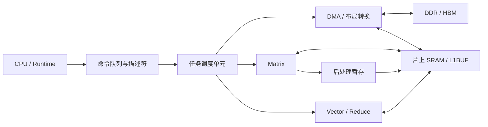
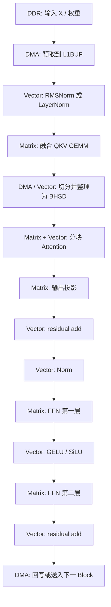
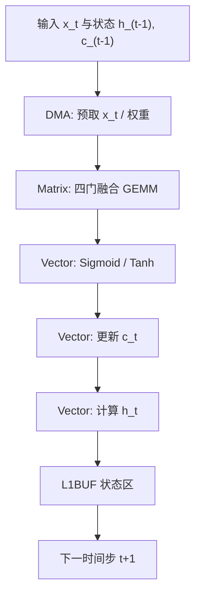
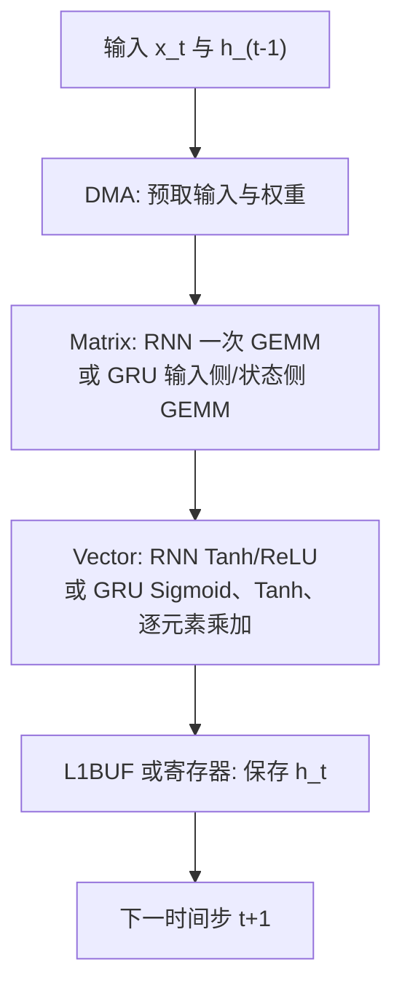

# 面向 Transformer、LSTM、GRU 和 RNN 加速的 NPU 设计目标

> 文件名沿用题目中的 Transfomer 写法；正文统一使用标准拼写 Transformer。本次更新把 GRU 和普通 RNN 纳入硬件支持范围。
>
> 本文面向推理型 NPU，说明 Transformer、LSTM、GRU 和 RNN 的计算特征、需要实现的关键算子、软硬件职责划分，以及适合优先由硬件完成的部分。本文假定 NPU 包含 Matrix、Vector、DMA、片上 SRAM（如 L1BUF）和任务调度单元。

## 1. 设计范围与总目标

### 1.1 目标模型

| 模型 | 典型应用 | 主要计算特征 | NPU 重点 |
| --- | --- | --- | --- |
| Transformer Encoder | 文本理解、视觉 Transformer、语音编码 | token 维可并行；线性层与 FFN 的矩阵乘占比高 | 高吞吐 GEMM、归一化、Softmax、张量重排 |
| Transformer Decoder | 大语言模型生成、代码生成、对话 | 逐 token 生成；KV Cache 读写频繁 | 小矩阵低时延、KV Cache 预取、低启动开销 |
| LSTM / BiLSTM | 语音、时序预测、轻量 NLP | 时间步间有状态依赖；四门计算规则固定 | 门控 GEMM、逐元素激活、状态驻留 |
| GRU / BiGRU | 语音、传感器时序、轻量序列模型 | 三个门；只有一个隐藏状态 | 三门矩阵乘、Sigmoid/Tanh、状态更新 |
| RNN / BiRNN | 极轻量时序模型、教学或旧模型兼容 | 一次递推矩阵乘加一个激活 | 小矩阵 GEMM、激活函数、隐藏状态驻留 |

本文聚焦推理。反向传播、优化器更新、梯度通信和随机失活不属于首版 NPU 的必备范围。

### 1.2 总体目标

NPU 应实现以下能力：

1. 用高利用率矩阵乘支持 Transformer 的线性层、注意力矩阵乘、FFN，以及 LSTM、GRU、RNN 的递推矩阵乘。
2. 用向量流水支持归一化、Softmax、Sigmoid、Tanh、GELU、SiLU、残差相加和逐元素乘。
3. 用 DMA、片上 SRAM 和描述符调度减少外部存储访问。
4. 支持动态 batch、序列长度、头数和隐藏维度，不要求每种模型尺寸对应一套 RTL。
5. 将图分析、分块、融合选择和指令生成交给软件；将规则、重复、高密度的数值计算交给硬件。
6. 为 Decoder 提供短任务调度，以及 KV Cache 的追加、读取和分块访问能力。

### 1.3 首版不应单列大型硬件模块的功能

以下工作分支多、调用频率低，或需要复杂策略选择，宜由 CPU、固件或 Runtime 处理：

- tokenizer、文本编码和文本解码；
- Beam Search、Top-k、Top-p 与随机采样；
- 字符串处理、模型文件解析和复杂控制流；
- KV Cache 的高层块表管理；
- 少量出现的任务专用后处理。

NPU 可以提供比较、选择、局部排序和 DMA 原语帮助软件，但不需要先为这些工作配置大面积专用电路。

### 1.4 公式读法、函数和符号速查

本文公式中的“字母”多数不是一个固定数字，而是一个标量、向量、矩阵或多维张量。先分清对象类型，公式会容易很多。

| 记号 | 读法和含义 | 初学者应注意的点 |
| --- | --- | --- |
| $x$ | 一个输入数、输入向量或输入张量 | 下标不同通常表示不同位置或时间步 |
| $x_t$ | 第 $t$ 个时间步的输入向量 | $t-1$ 就是前一个时间步 |
| $h_t$ | 第 $t$ 个时间步的隐藏状态 | RNN、GRU、LSTM 都会产生它 |
| $c_t$ | LSTM 的记忆状态 | 只有 LSTM 使用；GRU 与普通 RNN 没有它 |
| $W$ | 可学习权重矩阵 | 矩阵乘把输入的多个数按权重组合成新特征 |
| $b$ | 可学习偏置向量 | 在矩阵乘结果上逐元素相加 |
| $A,B,C$ | 矩阵乘中的左输入、右输入、输出 | $C=AB$ 时，左矩阵的列数必须等于右矩阵的行数 |
| $Q,K,V$ | Query、Key、Value | 注意力中：Q 提问，K 给出可匹配特征，V 提供被加权汇聚的内容 |
| $W_Q,W_K,W_V$ | 生成 Q、K、V 的三组权重 | 它们都是可学习参数，不是固定规则 |
| $T$ 上标，如 $K^T$ | 转置 | 行和列互换；不要与“时间长度 $T$”混淆，后者没有上标 |
| $[a,b]$ | 向量或矩阵的拼接 | 本文在循环层中表示沿特征维把两个向量接在一起 |
| $\sum$ | 求和 | 例如 $\sum_{k=0}^{K-1}$ 表示从 $k=0$ 一直加到 $K-1$ |
| $\odot$ | 逐元素乘 | 两个向量相同位置的数分别相乘，不是矩阵乘 |
| $\times$ | 维度乘积或普通乘法 | 在形状 $B\times S\times H$ 中表示三个维度；在算式中表示普通乘法 |
| $\sqrt{\ }$ | 平方根 | Softmax 和归一化中用于控制数值大小 |
| $\approx$ | 近似等于 | 通常表示硬件用多项式或查表得到近似结果 |

常用函数如下：

| 函数或算子 | 输入到输出 | 直观含义 |
| --- | --- | --- |
| $\operatorname{Norm}$ | 一个特征向量 | 调整一组特征的均值或均方根，再做缩放和平移 |
| $\operatorname{Softmax}$ | 一行分数 | 变成非负且总和为 1 的权重 |
| $\sigma(x)$ 或 Sigmoid | 一个实数 | 输出在 0 到 1 之间，适合当“保留比例”或“开关强度” |
| $\tanh(x)$ | 一个实数 | 输出在 $-1$ 到 $1$ 之间，适合生成有正负号的候选内容 |
| $\exp(x)$ | 一个实数 | $e^x$，其中 $e\approx2.71828$；Softmax 使用它把较大的分数放大 |
| $\max$ | 一组数 | 取最大值；Softmax 先减最大值可降低溢出风险 |
| $\operatorname{Concat}$ | 多个向量或矩阵 | 沿指定维度拼接 |
| $\phi$ | 激活函数占位符 | 在本文的 FFN 中通常选 GELU 或 SiLU |
| $\operatorname{ReLU}(x)$ | 一个实数 | $\max(0,x)$；负数变为 0，正数保持不变 |

形状记号 $B,S,H,D,F,I,T$ 在不同章节反复出现：$B$ 是 batch 大小，$S$ 是 Transformer 序列长度，$H$ 是隐藏宽度，$D$ 是单头宽度，$F$ 是 FFN 中间宽度，$I$ 是循环层的输入宽度，$T$ 是循环层的总时间步数。小写 $h$ 表示注意力头数，而带时间下标的 $h_t$ 表示循环层隐藏状态。若写成 $X\in\mathbb R^{B\times S\times H}$，读作“$X$ 属于三维实数张量集合，形状为 batch、序列长度、隐藏宽度”。

---

## 2. 模型计算分解

### 2.1 Transformer Block

设输入为：

$$
X\in\mathbb{R}^{B\times S\times H},
$$

其中 $B$ 是 batch 大小，$S$ 是序列长度，$H$ 是隐藏维度。一个常见的 Pre-Norm Transformer Block 可写为：

$$
\widetilde X=\operatorname{Norm}(X),
$$

$$
Q=\widetilde XW_Q,\qquad K=\widetilde XW_K,\qquad V=\widetilde XW_V,
$$

$$
A=\operatorname{Softmax}\left(\frac{QK^T}{\sqrt{D}}+M_{\mathrm{mask}}\right),
$$

$$
Z=\operatorname{Concat}(A_1V_1,\ldots,A_hV_h)W_O,
$$

$$
U=X+Z,
$$

$$
Y=U+\phi(\operatorname{Norm}(U)W_1+b_1)W_2+b_2.
$$

其中 $h$ 为注意力头数，$D=H/h$ 为单头维度，$M_{\mathrm{mask}}$ 是可选掩码，$\phi$ 常取 GELU 或 SiLU。

下面逐式解释 Transformer Block：

| 公式片段 | 输入和输出 | 它在做什么 |
| --- | --- | --- |
| $\widetilde X=\operatorname{Norm}(X)$ | $X$ 与 $\widetilde X$ 形状相同 | 先把每个 token 的特征调整到更稳定的数值范围 |
| $Q=\widetilde XW_Q$ | 输入 $(B,S,H)$，输出通常仍为 $(B,S,H)$ | 每个 token 生成“要找什么”的 Query |
| $K=\widetilde XW_K$ | 形状同上 | 每个 token 生成供其他 token 匹配的 Key |
| $V=\widetilde XW_V$ | 形状同上 | 每个 token 生成被权重加和的 Value |
| $QK^T$ | 每个头内为 $(S,D)$ 乘 $(D,S)$ | 得到 $(S,S)$ 分数表；第 $i$ 行表示第 $i$ 个 Query 对全部 Key 的分数 |
| $/\sqrt D$ | 分数表 | $D$ 较大时点积容易过大；除以 $\sqrt D$ 可控制数值范围 |
| $+M_{\mathrm{mask}}$ | 分数表 | 不允许关注的位置加极小值，使 Softmax 后的权重接近 0 |
| $A=\operatorname{Softmax}(\cdot)$ | $(S,S)$ 分数表变为 $(S,S)$ 权重表 | 每一行权重之和为 1 |
| $A_jV_j$ | $(S,S)$ 乘 $(S,D)$ | 第 $j$ 个头把 Value 按注意力权重做加权和 |
| $\operatorname{Concat}(\cdots)W_O$ | 多个头的结果拼接后再线性变换 | 把多个头的信息合成 $H$ 维输出 |
| $U=X+Z$、$Y=U+\cdots$ | 两侧形状均为 $(B,S,H)$ | 残差相加，把原特征直接保留一部分 |

FFN 采用“张量在左、权重在右”的写法，因此：

$$
W_1\in\mathbb R^{H\times F},\qquad
W_2\in\mathbb R^{F\times H},\qquad
b_1\in\mathbb R^F,\qquad
b_2\in\mathbb R^H.
$$

输入 $(B,S,H)$ 先乘 $W_1$ 变为 $(B,S,F)$，经过 $\phi$ 后再乘 $W_2$ 回到 $(B,S,H)$。因此它才能与 $U$ 做残差相加。

一个 Transformer Block 可拆成六类基础计算：

1. 规则 GEMM：Q、K、V、输出投影和两层 FFN。
2. 批量矩阵乘：$QK^T$ 与 $AV$。
3. 归约：LayerNorm、RMSNorm、Softmax。
4. 逐元素运算：bias、残差相加、缩放、掩码、激活函数。
5. 张量布局转换：BSH、BHSD、BSHD 等排列之间的转置、切分和拼接。
6. 存储访问：权重读取、中间特征暂存、KV Cache 追加和读取。

### 2.2 Transformer 计算量示例

以 $B=2$、$S=128$、$H=768$、FFN 中间维度 $F=3072$、$h=12$ 为例，忽略 bias 与逐元素计算：

| 部分 | MAC 数量 | 代入本例后的数量 | 硬件特征 |
| --- | ---: | ---: | --- |
| Q、K、V 投影 | $3BSH^2$ | $452{,}984{,}832$ | 规则 GEMM，权重复用充分 |
| 注意力分数 $QK^T$ | $BS^2H$ | $25{,}165{,}824$ | 批量矩阵乘，随 $S^2$ 增长 |
| 注意力加权 $AV$ | $BS^2H$ | $25{,}165{,}824$ | 批量矩阵乘，适合按块执行 |
| 输出投影 | $BSH^2$ | $150{,}994{,}944$ | 规则 GEMM |
| 两层 FFN | $2BSHF$ | $1{,}207{,}959{,}552$ | 通常是 Block 内最大的计算部分 |

MAC 是一次乘法及其后的累加。例如，计算一个输出元素时，硬件把一对输入相乘，并把结果加到该元素的部分和中。式中的 $H^2$ 表示 $H\times H$，$S^2$ 表示 $S\times S$；它们不是把张量中每个元素各自平方。

FFN 的结构高度规则，最适合由 Matrix 阵列执行。序列较长时，注意力的 $S^2$ 项会快速增大片上存储需求和外部带宽需求。

### 2.3 LSTM 单元

设第 $t$ 个时间步输入为 $x_t$，前一时刻隐藏状态与记忆状态为 $h_{t-1}$、$c_{t-1}$。标准 LSTM 为：

$$
i_t=\sigma(x_tW_{xi}+h_{t-1}W_{hi}+b_i),
$$

$$
f_t=\sigma(x_tW_{xf}+h_{t-1}W_{hf}+b_f),
$$

$$
g_t=\tanh(x_tW_{xg}+h_{t-1}W_{hg}+b_g),
$$

$$
o_t=\sigma(x_tW_{xo}+h_{t-1}W_{ho}+b_o),
$$

$$
c_t=f_t\odot c_{t-1}+i_t\odot g_t,
\qquad
h_t=o_t\odot\tanh(c_t).
$$

实际实现应将四组门控矩阵拼接为一次 GEMM：

$$
G_t=[x_t,h_{t-1}]W_{\mathrm{lstm}}+b_{\mathrm{lstm}}.
$$

其中：

$$
x_t\in\mathbb R^{B\times I},\qquad
h_t,c_t\in\mathbb R^{B\times H},
$$

$$
W_{\mathrm{lstm}}\in\mathbb R^{(I+H)\times4H},\qquad
b_{\mathrm{lstm}}\in\mathbb R^{4H}.
$$

$G_t$ 的形状为 $(B,4H)$，可按最后一维切成四段原始值 $[i_{\mathrm{raw}},f_{\mathrm{raw}},g_{\mathrm{raw}},o_{\mathrm{raw}}]$，每段形状都是 $(B,H)$。PyTorch 保存的 `bias_ih` 与 `bias_hh` 可在推理前按门相加，合成为上式的 $b_{\mathrm{lstm}}$。

再将 $G_t$ 切成四份，由 Vector 完成 Sigmoid、Tanh、逐元素乘和加法。输入宽度为 $I$、隐藏宽度为 $H$、时间长度为 $T$ 时，门控部分约需：

$$
4BT(I+H)H
$$

次 MAC。

LSTM 的时间维不能完全并行，但 batch 维、隐藏维和四个门均可并行。因此，复用 GEMM 阵列和向量流水即可获得大部分加速收益，无需独立的大型 LSTM 阵列。

LSTM 公式中各个符号的含义如下：

| 符号 | 名称 | 数值范围或形状 | 作用 |
| --- | --- | --- | --- |
| $i_t$ | 输入门 | 与 $h_t$ 同形状，元素在 0 到 1 之间 | 控制候选内容写入多少 |
| $f_t$ | 遗忘门 | 与 $h_t$ 同形状，元素在 0 到 1 之间 | 控制旧记忆 $c_{t-1}$ 保留多少 |
| $g_t$ | 候选内容 | 与 $h_t$ 同形状，元素在 $-1$ 到 $1$ 之间 | 提供待写入的新内容 |
| $o_t$ | 输出门 | 与 $h_t$ 同形状，元素在 0 到 1 之间 | 控制从 $c_t$ 输出多少 |
| $W_{xi},W_{xf},\ldots$ | 输入到各门的权重 | 常见形状为 $(I,H)$ | 用当前输入 $x_t$ 计算四个门 |
| $W_{hi},W_{hf},\ldots$ | 隐藏状态到各门的权重 | 常见形状为 $(H,H)$ | 用上一时刻 $h_{t-1}$ 计算四个门 |
| $b_i,b_f,b_g,b_o$ | 各门的 bias | 长度为 $H$ | 为每个门增加可学习偏移 |
| $\odot$ | 逐元素乘 | 两侧形状相同 | 例如 $f_t\odot c_{t-1}$ 表示每个记忆元素独立保留 |

可以先把门的输出当作已知数，手算一次状态更新。若某一个特征位置上 $f_t=0.25$、$c_{t-1}=0.4$、$i_t=0.5$、$g_t=0.8$、$o_t=0.6$，则：

$$
c_t=0.25\times0.4+0.5\times0.8=0.5,
$$

$$
h_t=0.6\times\tanh(0.5)\approx0.6\times0.4621=0.2773.
$$

这里 $c_t$ 是内部记忆状态，$h_t$ 是对外输出的隐藏状态。两者长度通常相同，但用途不同：遗忘门和输入门直接更新 $c_t$，输出门再决定从 $c_t$ 中给出多少 $h_t$。

### 2.4 普通 RNN 单元

普通 RNN 是最简单的循环层。它先做两次线性变换，再把结果相加并通过激活函数：

$$
a_t=x_tW_x+h_{t-1}W_h+b,
$$

$$
h_t=\psi(a_t).
$$

其中 $\psi$ 是激活函数，常见取值为 $\tanh$ 或 ReLU。若 batch 大小为 $B$，则 $x_t\in\mathbb R^{B\times I}$、$h_t\in\mathbb R^{B\times H}$，并且：

$$
W_x\in\mathbb R^{I\times H},\qquad
W_h\in\mathbb R^{H\times H}.
$$

$b$ 的长度为 $H$，对 batch 中每一行输入重复相加。举一个最小例子：当 $B=I=H=1$、$x_t=2$、$h_{t-1}=1$、$W_x=0.5$、$W_h=0.25$、$b=0$，若选择 ReLU，则：

$$
a_t=2\times0.5+1\times0.25=1.25,\qquad
h_t=\operatorname{ReLU}(1.25)=1.25.
$$

这个例子中的 Matrix 工作就是两次乘法与一次加法；真实模型只是把一个数扩展为一整行或一整块特征。

读这两式时可以这样理解：

1. $x_tW_x$：把当前输入的 $I$ 个数合成为 $H$ 个数。
2. $h_{t-1}W_h$：把上一时刻的 $H$ 个状态合成为新的 $H$ 个数。
3. 两项和 bias 相加得到原始结果 $a_t$。
4. $\psi(a_t)$ 把原始结果变为新隐藏状态 $h_t$。

若采用行向量存储，可把两次矩阵乘改写为一次拼接 GEMM：

$$
h_t=\psi\left([x_t,h_{t-1}]W_{\mathrm{rnn}}+b_{\mathrm{rnn}}\right),
$$

其中 $[x_t,h_{t-1}]$ 的长度为 $I+H$，$W_{\mathrm{rnn}}$ 的形状为 $(I+H)\times H$。一个 batch、$T$ 个时间步的主计算量约为：

$$
BT(IH+H^2)=BTH(I+H)
$$

次 MAC。MAC 是一次乘法加一次累加的组合。

#### RNN 的底层运算与硬件分工

| 次序 | 底层运算 | 推荐单元 | 原因 |
| --- | --- | --- | --- |
| 1 | 读取 $x_t$、$h_{t-1}$ 和权重 tile | DMA + L1BUF | $h_{t-1}$ 会在每个时间步反复使用 |
| 2 | $[x_t,h_{t-1}]W_{\mathrm{rnn}}$ | Matrix | 规则 GEMM，计算量最大 |
| 3 | 加 bias | Vector，或 Matrix 后处理 | 逐元素加法，可与下一步合并 |
| 4 | $\tanh$ 或 ReLU | Vector 特殊函数单元 | 每个元素独立计算 |
| 5 | 写入 $h_t$ | Vector 寄存器或 L1BUF | 下一时间步立刻需要它 |

普通 RNN 只有一个状态 $h_t$，因此数据组织比 LSTM 和 GRU 简单。对于双向 RNN，正向和反向序列可作为两组独立任务执行。

### 2.5 GRU 单元

GRU 使用重置门 $r_t$、更新门 $z_t$ 和候选状态 $n_t$。PyTorch 常用形式为：

$$
r_t=\sigma(x_tW_{xr}+b_{xr}+h_{t-1}W_{hr}+b_{hr}),
$$

$$
z_t=\sigma(x_tW_{xz}+b_{xz}+h_{t-1}W_{hz}+b_{hz}),
$$

$$
n_t=\tanh\left(x_tW_{xn}+b_{xn}+r_t\odot(h_{t-1}W_{hn}+b_{hn})\right),
$$

$$
h_t=(1-z_t)\odot n_t+z_t\odot h_{t-1}.
$$

若 batch 大小为 $B$，则 $x_t\in\mathbb R^{B\times I}$、$r_t,z_t,n_t,h_t\in\mathbb R^{B\times H}$，输入侧权重 $W_{x*}$ 形状为 $(I,H)$，状态侧权重 $W_{h*}$ 形状为 $(H,H)$。每个 bias 的长度为 $H$，并对 batch 中每一行重复相加。

符号说明：

| 符号 | 含义 | 直观解释 |
| --- | --- | --- |
| $r_t$ | 重置门，元素在 0 到 1 之间 | 控制上一时刻状态参与候选状态的比例 |
| $z_t$ | 更新门，元素在 0 到 1 之间 | 决定新状态更接近 $n_t$ 还是更接近旧状态 $h_{t-1}$ |
| $n_t$ | 候选状态，元素在 $-1$ 到 $1$ 之间 | 当前时间步准备写入的新内容 |
| $1-z_t$ | 逐元素的补数 | 当 $z_t$ 较大时，候选状态的占比会变小 |
| $W_{xr},W_{xz},W_{xn}$ | 输入权重 | 分别为三个门读取当前输入，形状为 $(I,H)$ |
| $W_{hr},W_{hz},W_{hn}$ | 状态权重 | 分别为三个门读取上一时刻状态，形状为 $(H,H)$ |

用一个单元素例子可以同时看清重置门和更新门的作用。假设输入侧候选结果 $x_tW_{xn}+b_{xn}=0.3$，状态侧候选结果 $h_{t-1}W_{hn}+b_{hn}=0.8$；两次 Sigmoid 已得到 $r_t=0.25$、$z_t=0.75$，且旧状态 $h_{t-1}=0.8$。先算候选状态：

$$
n_t=\tanh(0.3+0.25\times0.8)=\tanh(0.5)\approx0.4621.
$$

再更新隐藏状态：

$$
h_t=(1-0.75)\times0.4621+0.75\times0.8\approx0.7155.
$$

重置门 $r_t$ 越小，状态侧候选结果参与得越少；更新门 $z_t$ 越大，旧状态 $h_{t-1}$ 占更多比例。

GRU 的主计算量约为：

$$
3BT(IH+H^2)=3BTH(I+H)
$$

次 MAC，比 LSTM 的四门计算少一组门。

#### GRU 的底层运算与硬件分工

GRU 不应简单地把三组门完全合并成“一个输出后直接激活”的 GEMM。原因是候选状态 $n_t$ 中的 $r_t$ 必须先与 $W_{hn}h_{t-1}+b_{hn}$ 逐元素相乘，再进入 Tanh。

也存在另一类 GRU 写法：先计算 $r_t\odot h_{t-1}$，再送入候选状态的隐藏侧矩阵乘。导入模型时，软件必须记录所用公式；两类写法的计算次序和 bias 位置不同，不能混合处理。

推荐执行次序如下：

下标中的 $*$ 表示 $r$、$z$、$n$ 三者之一。例如 $W_{x*}$ 可以指 $W_{xr}$、$W_{xz}$ 或 $W_{xn}$。

1. Matrix 分别计算输入侧三组仿射结果 $x_tW_{x*}+b_{x*}$，以及状态侧三组仿射结果 $h_{t-1}W_{h*}+b_{h*}$。
2. Vector 将重置门和更新门的两部分相加后计算 Sigmoid，得到 $r_t,z_t$。
3. Vector 计算 $r_t\odot(W_{hn}h_{t-1}+b_{hn})$，再加输入侧候选结果并计算 Tanh，得到 $n_t$。
4. Vector 计算 $(1-z_t)\odot n_t+z_t\odot h_{t-1}$，得到 $h_t$。
5. 将 $h_t$ 保留在寄存器或 L1BUF 状态区，供下一时间步使用。

| 计算部分 | 推荐单元 | 说明 |
| --- | --- | --- |
| 三组输入侧矩阵乘 | Matrix | 可沿输出通道拼接成一次 GEMM |
| 三组状态侧矩阵乘 | Matrix | 可沿输出通道拼接成一次 GEMM |
| 两组 Sigmoid | Vector 特殊函数单元 | 产生 $r_t,z_t$ |
| reset 逐元素乘、候选 Tanh | Vector | 计算 $n_t$ |
| 两次逐元素乘和一次加法 | Vector | 更新 $h_t$ |
| 状态读写 | Vector 寄存器 / L1BUF / DMA | $h_t$ 需要传给下一个时间步 |

GRU 只有 $h_t$，不像 LSTM 还要保留 $c_t$；因此状态存储量较小。对双向 GRU，两个方向的时间循环独立，可同时调度。

---

## 3. 关键算子与硬件优先级

### 3.1 算子总表

| 优先级 | 算子或算子组 | Transformer 用途 | LSTM / GRU / RNN 用途 | 推荐执行单元 | 硬件建议 |
| --- | --- | --- | --- | --- | --- |
| P0 | GEMM / MatMul / Batched MatMul | QKV、投影、FFN、$QK^T$、$AV$ | LSTM 四门、GRU 三门、RNN 单次递推矩阵乘 | Matrix / Tensor Engine | 必须实现，最高优先级 |
| P0 | bias、残差加、缩放、逐元素乘 | 线性层后处理、残差、注意力缩放 | 门控组合、候选状态、隐藏状态更新 | Vector ALU | 与主算子融合 |
| P0 | ReduceSum、ReduceMax、ReduceMean | Softmax、LayerNorm、RMSNorm | 通常不在主递推路径中 | Vector Reduce Unit | 必须有归约树 |
| P0 | Exp、Reciprocal、ReciprocalSqrt | Softmax、Norm | Sigmoid 和 Tanh 的内部近似可复用 Exp | Special Function Unit | 支持近似计算 |
| P0 | Sigmoid、Tanh、GELU、SiLU | FFN 激活 | LSTM/GRU 使用 Sigmoid、Tanh；RNN 使用 Tanh 或 ReLU | Vector / Special Function Unit | 查表加多项式 |
| P0 | DMA Copy、Strided Copy、Transpose | QKV 切分、KV Cache、布局转换 | 输入、权重、$h_t$ 和 $c_t$ 的搬运 | DMA / Layout Engine | 必须实现 |
| P1 | Masked Softmax | 因果注意力、padding mask | 不常用 | Vector + Attention Pipeline | 作为 Softmax 扩展 |
| P1 | RoPE | Decoder 的位置旋转 | 不常用 | Vector ALU | 适合向量单元 |
| P1 | KV Cache Append / Gather | Decoder 生成 | 不适用 | DMA + SRAM 控制 | 重点优化访存 |
| P1 | Fused Attention | 长序列 Encoder、Prefill | 不适用 | Attention Pipeline | 中后期加入 |
| P2 | Embedding Gather | token 查表 | 词嵌入查表 | DMA / Vector Gather | 按产品需求决定 |
| P2 | Top-k / Sampling | 输出 token 选择 | 不常用 | CPU / Vector | 首版以软件为主 |

P0 表示首版必须具备，P1 表示主干可用后优先加入，P2 表示按产品需求选择。

### 3.2 GEMM、Batched MatMul 与线性层

统一计算形式为：

$$
C_{m,n}=\sum_{k=0}^{K_{\mathrm g}-1}A_{m,k}W_{k,n}+b_n.
$$

这条式可以逐个元素阅读：

| 符号 | 含义 |
| --- | --- |
| $A_{m,k}$ | 左矩阵 $A$ 的第 $m$ 行、第 $k$ 列元素 |
| $W_{k,n}$ | 右矩阵 $W$ 的第 $k$ 行、第 $n$ 列元素 |
| $C_{m,n}$ | 输出矩阵 $C$ 的第 $m$ 行、第 $n$ 列元素 |
| $k$ | 被求和的公共维度编号；每一个 $k$ 都会产生一次乘法 |
| $K_{\mathrm g}$ | 公共维度长度；也就是每个输出元素需要累加多少项 |
| $b_n$ | 第 $n$ 个输出通道使用的 bias |

例如 $A$ 形状为 $M_{\mathrm g}\times K_{\mathrm g}$、$W$ 形状为 $K_{\mathrm g}\times N_{\mathrm g}$ 时，输出 $C$ 形状为 $M_{\mathrm g}\times N_{\mathrm g}$。下标 $\mathrm g$ 表示 GEMM 维度，用来避免与 batch 大小 $B$、注意力掩码 $M_{\mathrm{mask}}$ 混淆。一个 $C_{m,n}$ 需要 $K_{\mathrm g}$ 次乘法和约 $K_{\mathrm g}$ 次加法；这正是 Matrix 阵列最擅长的重复计算。

Matrix 单元应支持：

- 一般 GEMM：$M\times K$ 乘 $K\times N$；
- 多个独立矩阵组成的 Batched MatMul；
- 逻辑转置视图，例如 $QK^T$ 中的 $K^T$；
- bias 融合；
- 可选残差相加、激活和输出写回；
- 非整 tile 尺寸的掩码处理；
- FP16、BF16、INT8 等格式，以及更高精度累加。

对 Transformer，建议把 QKV 三次线性层合并为一次：

$$
[Q,K,V]=X[W_Q,W_K,W_V]+[b_Q,b_K,b_V].
$$

对 LSTM，建议把四个门的权重拼接为一次 GEMM；对普通 RNN，可把输入和上一时刻状态拼接为一次 GEMM；对 GRU，可将输入侧三组矩阵乘拼接，并将状态侧三组矩阵乘拼接。这样既复用 Matrix 阵列，也减少中间张量的片上写回与再次读取。

### 3.3 LayerNorm 与 RMSNorm

LayerNorm 对最后一维求均值与方差：

$$
\mu=\frac{1}{H}\sum_{j=1}^{H}x_j,
\qquad
v=\frac{1}{H}\sum_{j=1}^{H}(x_j-\mu)^2,
$$

$$
y_j=\gamma_j\frac{x_j-\mu}{\sqrt{v+\epsilon}}+\beta_j.
$$

其中 $j$ 是特征编号，$\mu$ 是当前归一化范围内的平均值，$v$ 是方差，$\gamma_j$ 是第 $j$ 个特征的可学习缩放系数，$\beta_j$ 是第 $j$ 个特征的可学习平移系数，$\epsilon$ 是很小的正数，用于避免除以 0。分母 $\sqrt{v+\epsilon}$ 是标准差的近似形式。

RMSNorm 不减均值：

$$
r=\sqrt{\frac{1}{H}\sum_{j=1}^{H}x_j^2+\epsilon},
\qquad
y_j=\gamma_j\frac{x_j}{r}.
$$

这里 $r$ 是均方根；它先对 $x_j^2$ 求平均，再开平方。RMSNorm 比 LayerNorm 少了“减均值”这一步，因此硬件需要的归约项更少。

这两类算子适合 Vector，重点是：

1. 分块累加与树形归约；
2. FP32 或等效精度的局部累加；
3. ReciprocalSqrt 近似；
4. 与乘 $\gamma$、加 $\beta$ 融合；
5. 输入、统计量与输出尽量留在片上 SRAM。

不建议为 LayerNorm 单独设计巨大的计算阵列；增强通用向量归约单元的吞吐和片上读写能力更合适。

### 3.4 Softmax 与 Masked Softmax

数值稳定的 Softmax 先减去行最大值：

$$
m=\max_j x_j,
\qquad
p_i=\frac{\exp(x_i-m)}{\sum_j\exp(x_j-m)}.
$$

因果注意力中，未来位置不可参与当前行计算。可将不允许的位置加上负无穷，或在指数计算前令其贡献为零：

$$
p_i=\frac{\exp(x_i-m)\cdot valid_i}
{\sum_j\exp(x_j-m)\cdot valid_j}.
$$

式中 $x_i$ 是第 $i$ 个原始分数，$m=\max_jx_j$ 是该行最大分数，$p_i$ 是第 $i$ 个输出权重，$j$ 表示同一行中参与求和的全部位置。$valid_i$ 取 1 表示该位置可用，取 0 表示该位置不可用。减去 $m$ 不改变 Softmax 的最终权重，因为分子和分母同时乘上了同一个 $e^{-m}$，但能避免 $\exp(x)$ 过大。

使用 mask 时，应先排除不可用位置，再求 $m$；也就是 $m$ 只能从 $valid_j=1$ 的分数中取最大值。实现中常见的做法是先给不可用位置加上极小值，再执行 ReduceMax 与 Softmax。

硬件需要完成如下向量流水：

    最大值归约 → 指数近似 → 求和归约 → 倒数 → 逐元素乘

Exp 可由分段查表、低阶多项式或两者组合完成。行长度、mask 类型和缩放系数应由描述符配置。

### 3.5 激活函数

Transformer 常见 GELU、SiLU；LSTM 必需 Sigmoid、Tanh：

$$
\operatorname{Sigmoid}(x)=\frac{1}{1+e^{-x}},
\qquad
\operatorname{Tanh}(x)=\frac{e^{2x}-1}{e^{2x}+1},
$$

$$
\operatorname{SiLU}(x)=x\cdot\operatorname{Sigmoid}(x),
$$

$$
\operatorname{GELU}(x)\approx\frac{x}{2}
\left[1+\tanh\left(\sqrt{\frac{2}{\pi}}(x+0.044715x^3)\right)\right].
$$

在这些式子中，$x$ 是输入元素，$e$ 是自然常数，$\pi\approx3.14159$，$x^3=x\times x\times x$。Sigmoid 的输出位于 0 到 1 之间；Tanh 的输出位于 $-1$ 到 $1$ 之间；SiLU 把输入 $x$ 与其 Sigmoid 相乘；GELU 式中的 $\approx$ 表示常用的近似计算式，不要求硬件直接计算精确积分形式。

这些算子的算术密度不足以单独占用 Matrix 阵列，但调用次数多，适合放入 Vector 流水中的特殊函数子单元，并与 bias、残差和逐元素乘连续执行。

### 3.6 张量布局转换与切分

Transformer 常在以下形状间切换：

    [B,S,H] → [B,S,3H] → 3 × [B,S,H] → 3 × [B,h,S,D]
    [B,h,S,D] → [B,S,H]

其中 $D=H/h$ 是单头维度。例子：当 $B=2$、$S=4$、$H=8$、$h=2$ 时，$D=4$。QKV 线性层先输出 $[2,4,24]$，切成三个 $[2,4,8]$ 张量，再整理成三个 $[2,2,4,4]$ 张量。QKV 切分、head 维重排、KV Cache 写入和批量矩阵乘输入准备都依赖此类工作。建议 DMA 支持多维描述符、可编程 stride、转置和小粒度拼接；复杂形状选择保留在编译器。

---

## 4. 推荐硬件架构

### 4.1 顶层组成

建议采用“Matrix 负责乘累加，Vector 负责非矩阵计算，DMA 负责搬运和布局转换”的分工。调度单元根据描述符安排双缓冲、依赖事件和任务完成通知。

### 4.2 Matrix / Tensor Engine

| 能力 | 设计要求 | 对模型的价值 |
| --- | --- | --- |
| Tile GEMM | 支持可配置 $M_t\times K_t\times N_t$ tile | 覆盖 FFN、QKV、LSTM/GRU/RNN 递推 |
| 多格式乘累加 | FP16/BF16/INT8 输入；FP32 或 INT32 累加 | 在性能、带宽和误差间选择 |
| 权重复用 | 同一权重 tile 服务多个 token 或 batch | 减少外部读取 |
| 输入复用 | 激活 tile 在多个输出通道上复用 | 提高 SRAM 利用率 |
| 转置访问 | 支持逻辑转置视图或 DMA 预处理 | 支持 $QK^T$ |
| 融合后处理 | bias、缩放、残差、激活可选融合 | 减少中间张量往返 |
| 尾部处理 | 对非整 tile 尺寸提供 mask | 支持不规则 batch |

Matrix 单元无需区分 QKV、FFN、LSTM 门控、GRU 门控或 RNN 递推；它只需要高效执行描述符定义的 GEMM。模型语义、权重拼接和输出切分由编译器决定。

这里 $M_t,K_t,N_t$ 是一个 tile 的行数、公共维度长度和列数；下标 $t$ 在这里表示 tile 标记，不表示时间步。完整矩阵会被切成多个 tile，由 Matrix 逐块读取、计算、累加和写回。

### 4.3 Vector / Reduce / Special Function Unit

向量单元至少应包括：

- 向量加、减、乘、乘加、最大值、最小值、比较、选择；
- Exp、倒数、倒数平方根、Sigmoid、Tanh；
- ReduceSum、ReduceMax、ReduceMean；
- 数据格式转换、饱和与裁剪；
- 读改写，用于残差相加以及 LSTM、GRU、RNN 状态更新；
- 可选 RoPE 旋转计算：成对乘加与正余弦表读取。

建议使用多 lane SIMD 加归约树。大向量按 tile 处理，在 SRAM 内完成局部归约，再完成最终归约。LayerNorm、RMSNorm、Softmax 的中间统计量不应写回 DDR。

### 4.4 DMA 与片上 SRAM

| 能力 | 作用 |
| --- | --- |
| 双缓冲或多缓冲 | 当前 tile 计算时预取下一 tile |
| 多维 stride | 搬运 BSH、BHSD、KV Cache 等非连续片段 |
| 转置与拼接 | 减轻 Vector 和 CPU 的数据整理负担 |
| 广播 | bias、Norm 参数、位置参数在多个 token 上复用 |
| 多地址空间 | 分开管理输入、权重、中间结果、输出、KV Cache |
| 异步事件 | 让 DMA、Matrix、Vector 并行工作 |
| 对齐访问 | 提高总线有效载荷比例，简化 SRAM bank 调度 |

片上 SRAM 至少需要激活 tile、权重 tile、矩阵累加结果、向量暂存和 Decoder KV 热点缓存等区域。

### 4.5 调度器

硬件调度器适合管理短而规则的依赖：

    DMA 预取 A/B tile
            ↓
    Matrix GEMM
            ↓
    Vector bias + activation
            ↓
    DMA 回写或交给下一算子

模型层数、头数、序列长度和融合策略变化快，不宜固化为硬件状态机。编译器应生成任务列表和描述符；硬件只需支持命令队列、依赖事件或 fence、独立启动 DMA/Matrix/Vector、异常上报和性能计数器。

---

## 5. Transformer 的专门优化

### 5.1 QKV 与 FFN 融合

QKV 的三组权重可沿输出通道拼接，变为一次 GEMM。输出先进入 L1BUF，再由 DMA 或 Vector 做三段切分与 head 重排：

    X [B,S,H]
      │
      ├─ GEMM with [Wq | Wk | Wv]
      ▼
    QKV [B,S,3H]
      │
      ├─ split + layout conversion
      ▼
    Q, K, V [B,h,S,D]

FFN 推荐采用：

    GEMM + bias + GELU
    GEMM + bias + residual add

融合的收益来自减少中间张量在 L1BUF 与 DDR 之间的往返，不是减少 GEMM 的 MAC 数量。

### 5.2 分块 Attention

直接保存注意力分数矩阵需要 $B\times h\times S\times S$ 个元素。长序列下，它会占满 SRAM 或引入大量 DDR 访问。应按 Query 块和 Key/Value 块处理：

    for each Q block:
        初始化行最大值与归一化分母
        for each K/V block:
            计算 QK^T
            加缩放与 mask
            更新 Softmax 统计量
            累加对应的 V 加权结果
        写出当前 Q block 的注意力结果

在线 Softmax 可避免写出完整的 $S\times S$ 分数矩阵。对已处理部分保存行最大值 $m$、归一化分母 $l$ 和输出累加器 $o$。读入新块得到 $m'$ 后：

$$
m_{\mathrm{new}}=\max(m,m'),
$$

$$
l_{\mathrm{new}}=e^{m-m_{\mathrm{new}}}l+
\sum_j e^{s'_j-m_{\mathrm{new}}},
$$

$$
o_{\mathrm{new}}=e^{m-m_{\mathrm{new}}}o+
\sum_j e^{s'_j-m_{\mathrm{new}}}v'_j.
$$

最终输出为：

$$
y=\frac{o}{l}.
$$

这组式子的符号含义如下：

| 符号 | 含义 |
| --- | --- |
| $m$ | 已处理 Key/Value 块中的行最大分数 |
| $m'$ | 新读入块中的行最大分数 |
| $m_{\mathrm{new}}$ | 合并旧块和新块后的行最大分数 |
| $l$ | 已处理部分的指数和，也就是 Softmax 分母的部分和 |
| $s'_j$ | 新块中第 $j$ 个注意力分数，已经包含缩放和 mask 的作用 |
| $v'_j$ | 新块中与 $s'_j$ 相同位置的 Value 向量 |
| $o$ | 尚未除以分母的 Value 加权和 |
| $e^{m-m_{\mathrm{new}}}$ | 用新的最大值重新缩放旧块统计量，保证旧块与新块处于同一数值尺度 |

对于每一个 Query 行，$m$、$m'$、$m_{\mathrm{new}}$、$l$ 都是各自独立的标量；$o$ 和最终 $y$ 都是长度为 $D$ 的 Value 向量。撇号表示“当前新读入的 Key/Value 块”，并不是求导符号。也就是说，$l_{\mathrm{new}}$ 更新 Softmax 分母，$o_{\mathrm{new}}$ 更新加权 Value 之和，最后用标量 $l$ 分别除以向量 $o$ 的每个元素。这使硬件不必保存完整的 $S\times S$ 分数矩阵。

对于短序列，通用 Matrix + Vector 组合已足够；对于长上下文 Prefill，可增加 Attention Pipeline，使 Matrix 输出的分数 tile 直接进入缩放、mask、指数、归约和 $V$ 加权流程。

### 5.3 Decoder 与 KV Cache

生成第 $t$ 个 token 时，当前 Query 只含一个或少量 token，Key/Value 来自 $0\ldots t$ 的历史缓存。性能重点变为：

1. 当前 token 的 QKV、FFN 小矩阵乘；
2. 大量 KV Cache 顺序读取；
3. 当前 K/V 的追加写入；
4. 小批量任务的低启动开销。

建议让软件选择 KV 块大小和地址表，让 DMA 按多维描述符完成读写；硬件不必理解页管理策略。建议：

- 将相邻时间步的 K/V 放在连续存储区域；
- 按若干 token 为一块，便于预取；
- 将当前层常用 KV 块保留在 L1BUF；
- 使用 Grouped-Query Attention 或 Multi-Query Attention 时复用更少的 K/V 头，降低读取量。

### 5.4 RoPE

Rotary Position Embedding 对二维元素对做旋转：

$$
\begin{bmatrix}
x'_{2i}\\
x'_{2i+1}
\end{bmatrix}
=
\begin{bmatrix}
\cos\theta_i & -\sin\theta_i\\
\sin\theta_i & \cos\theta_i
\end{bmatrix}
\begin{bmatrix}
x_{2i}\\
x_{2i+1}
\end{bmatrix}.
$$

其中 $i=0,\ldots,D/2-1$ 是特征对编号，$x_{2i}$ 和 $x_{2i+1}$ 是单个注意力头中相邻的两个输入元素，$\theta_i$ 是该 token 位置和该特征对使用的旋转角度，$\cos\theta_i$、$\sin\theta_i$ 是对应的余弦和正弦值，带撇号的 $x'$ 表示旋转后的输出。这个 $2\times2$ 矩阵只做四次乘法和两次加减法。

RoPE 是成对乘加加正余弦表读取，适合放入 Vector 单元。正余弦表由软件预生成并存入只读权重区或片上常量区，无需配置专门的 Matrix 类阵列。

---

## 6. LSTM、GRU 与 RNN 的专门优化

### 6.1 四门融合

不要为输入项与循环项分别启动八次小 GEMM。应将输入和隐藏状态拼接，并将四个门的权重拼接：

    [x_t | h_(t-1)] × [W_i | W_f | W_g | W_o]
                               │
                               ▼
                         [i_raw | f_raw | g_raw | o_raw]

这里 $W_i,W_f,W_g,W_o$ 分别是四个门的完整拼接权重，每个矩阵有 $I+H$ 行、$H$ 列。例如 $W_i$ 的前 $I$ 行对应 $W_{xi}$，后 $H$ 行对应 $W_{hi}$。竖线 `$|$` 表示沿输出特征维拼接。

随后在同一个 Vector 任务中完成：

    i = sigmoid(i_raw)
    f = sigmoid(f_raw)
    g = tanh(g_raw)
    o = sigmoid(o_raw)
    c = f * c_prev + i * g
    h = o * tanh(c)

该方式减少命令数量、DMA 任务数量和中间张量占用，也提高 Matrix 阵列处理小矩阵时的利用率。

### 6.2 状态驻留

$h_t$ 和 $c_t$ 在下一时间步立刻使用。对于一个时间步块或一个 batch，推荐让它们保留在：

1. Vector 寄存器或专用状态寄存器；
2. L1BUF 的固定状态区；
3. 仅在序列块切换或任务结束时回写 DDR。

这能避免每个时间步都读取和写回外部存储。若隐藏维度过大，可按块循环处理，但每一块的 $h$ 与 $c$ 都应尽量留在片上，直到该时间步完成。

### 6.3 时间维调度

LSTM 的 $h_t,c_t$ 依赖前一时刻，不能跨时间步完全并行。调度器应：

- 沿时间步顺序发射门控 GEMM 与 Vector 状态更新；
- 在当前步 Vector 处理时预取下一步 $x_{t+1}$ 与权重 tile；
- 在 batch 维、隐藏维、输出通道维充分并行；
- 对多层 LSTM，让层间输出尽量直接进入下层输入缓冲；
- 对双向 LSTM，将正向与反向作为独立任务并行。

LSTM 的优化重点是降低每个时间步的固定开销，并让状态尽量少离开片上存储。

### 6.4 RNN 的递推加速

普通 RNN 每个时间步只需“矩阵乘 + bias + 激活”。最适合的硬件执行顺序为：

    读取 x_t 与 h_(t-1)
        ↓
    Matrix: [x_t, h_(t-1)] × W_rnn
        ↓
    Vector: 加 b_rnn，再执行 Tanh 或 ReLU
        ↓
    将 h_t 保留在寄存器或 L1BUF

RNN 的输入和状态可拼接为一个长度 $I+H$ 的向量，因此硬件只需一条小 GEMM 指令和一条 Vector 激活指令。关键设计要求如下：

| 设计项 | 要求 | 原因 |
| --- | --- | --- |
| 小 M 维 GEMM | 支持 batch 较小、$M$ 较小的矩阵乘 | 单序列推理时 batch 常为 1 |
| 状态寄存器或 L1BUF 状态区 | 保存 $h_t$ | 避免每一个时间步访问 DDR |
| Tanh / ReLU | 支持按描述符选择 | PyTorch RNN 可选两种激活 |
| 时间循环计数 | 支持 $T$ 次重复发射或由任务列表展开 | 每一步都依赖前一步的 $h_t$ |
| 双向模式 | 前向、反向两个独立任务 | 两个方向不共享时间状态 |

普通 RNN 的硬件重点不是增加新的计算阵列，而是提高小矩阵 GEMM 的利用率和减少短任务调度开销。

### 6.5 GRU 的三门加速

GRU 的时间依赖和 LSTM 相同，但只维护一个状态 $h_t$。它的每个时间步可拆为如下硬件任务：

    输入侧 GEMM:  x_t × [W_xr | W_xz | W_xn]
    状态侧 GEMM:  h_(t-1) × [W_hr | W_hz | W_hn]
                           ↓
    Vector: r_t、z_t 的加法和 Sigmoid
                           ↓
    Vector: r_t × 候选状态侧结果，再做 Tanh 得到 n_t
                           ↓
    Vector: (1-z_t) × n_t + z_t × h_(t-1)
                           ↓
    写入或保留 h_t

输入侧与状态侧矩阵乘都可将三个输出通道拼接，因此每个时间步通常是两次大一些的 GEMM，而不是六次小 GEMM。候选状态中的 reset 逐元素乘必须放在第二个 GEMM 的结果之后，以保持 PyTorch GRU 的计算顺序。

PyTorch 通常分别保存输入侧 bias 和状态侧 bias。对 $r_t,z_t$，两侧 bias 可以在 Vector 加法时一起加入；对候选状态 $n_t$，状态侧 bias $b_{hn}$ 必须和状态侧矩阵乘结果一起先乘 $r_t$，而输入侧 bias $b_{xn}$ 在 Tanh 前直接相加。因此候选门的两组 bias 不应过早合并。

| GRU 阶段 | 输入 | 输出 | 硬件重点 |
| --- | --- | --- | --- |
| 输入侧仿射计算 | $x_t$、三组输入权重 | 三组长度为 $H$ 的向量 | Matrix 输出通道拼接 |
| 状态侧仿射计算 | $h_{t-1}$、三组状态权重 | 三组长度为 $H$ 的向量 | Matrix 输出通道拼接 |
| reset / update 门 | 两组输入侧和状态侧结果 | $r_t,z_t$ | Vector 加法、Sigmoid |
| 候选状态 | 输入侧候选结果、状态侧候选结果、$r_t$ | $n_t$ | Vector 逐元素乘、加法、Tanh |
| 状态更新 | $z_t,n_t,h_{t-1}$ | $h_t$ | Vector 两次乘法加一次加法 |

GRU 比 LSTM 少一个状态 $c_t$、少一组门，但仍然需要高效的 Sigmoid、Tanh 和片上状态驻留。

### 6.6 循环层共用的状态与调度能力

RNN、GRU、LSTM 的共性是“当前时间步的输出会成为下一时间步的输入”。因此可以由一套循环层执行框架服务三种单元：

| 能力 | RNN | GRU | LSTM |
| --- | --- | --- | --- |
| 需要保存的状态 | $h_t$ | $h_t$ | $h_t,c_t$ |
| 每时间步门数 | 无门 | 3 | 4 |
| Matrix 主计算 | 1 次拼接 GEMM | 输入侧 1 次 + 状态侧 1 次拼接 GEMM | 1 次四门拼接 GEMM |
| Vector 特殊函数 | Tanh 或 ReLU | 2 次 Sigmoid + 1 次 Tanh | 3 次 Sigmoid + 1 次 Tanh |
| 时间维并行 | 不能完全并行 | 不能完全并行 | 不能完全并行 |

统一调度器应提供：

1. 时间步计数器和状态地址寄存器；
2. Matrix、Vector、DMA 三类任务的事件依赖；
3. 状态驻留策略：寄存器优先，其次 L1BUF，最后才写 DDR；
4. 多层循环网络的层间直连缓冲；
5. 双向网络的两个方向独立发射；
6. 变长序列的有效长度信息，由软件生成每个样本的有效时间范围。

---

## 7. 软硬件职责划分

### 7.1 划分原则

适合硬件的工作具有以下特征：

- 计算规则固定；
- 数据规模大或调用频率高；
- 分支少；
- 数据复用明显；
- 可按 tile、向量或流水方式重复执行。

适合软件的工作具有以下特征：

- 模型结构、形状或策略变化快；
- 需要复杂搜索、动态内存管理或多层控制流；
- 调用次数少；
- 需要快速兼容新模型。

### 7.2 详细分工

| 工作项 | 编译器 / Runtime / CPU | NPU 硬件 | 说明 |
| --- | --- | --- | --- |
| 模型导入与图优化 | 负责 | 不负责 | 解析 ONNX、PyTorch 导出图或其他中间表示 |
| 算子拆分与融合决策 | 负责 | 提供可融合能力 | 决定 QKV 拼接、FFN 激活融合等 |
| tile 大小选择 | 负责 | 执行给定 tile | 软件按形状和 SRAM 容量选择 |
| 指令与描述符生成 | 负责 | 译码执行 | 保留模型演进空间 |
| GEMM、BMM | 发起任务 | 负责 | Matrix 阵列获得最高计算密度 |
| Norm、Softmax、激活 | 发起任务 | 负责 | Vector 与特殊函数流水执行 |
| 循环层权重整理 | 负责 | 不负责 | 将 RNN、GRU、LSTM 的权重按硬件需要的门顺序与布局保存 |
| 循环层时间步控制 | 提供层数、方向、有效长度和初始状态 | 执行每一步的依赖和状态更新 | 软件保留模型灵活性，硬件降低每步开销 |
| RNN/GRU/LSTM 门控计算 | 下发描述符 | 负责 | Matrix 计算仿射部分，Vector 计算门与状态 |
| 隐藏状态和记忆状态保存 | 分配状态区 | 负责片上读写与回写 | RNN/GRU 保存 $h_t$，LSTM 还保存 $c_t$ |
| 张量布局转换 | 选择方式 | DMA / Vector 执行 | 简单转置和搬运优先 DMA |
| KV Cache 地址管理 | 负责 | 按描述符读写 | 软件管理块表和容量策略 |
| KV Cache 数据搬运 | 下发描述符 | 负责 | DMA 负责预取、追加和回写 |
| mask 生成 | 负责 | 支持 mask 读取或比较 | 因果 mask 可由硬件根据位置参数生成 |
| Top-k、Top-p、采样 | 负责 | 可提供向量辅助 | 首版不需要专用大模块 |
| tokenizer | 负责 | 不负责 | 控制复杂、算术密度低 |
| 性能计数与异常 | 读取、分析 | 提供计数器和中断 | 便于调优与定位问题 |

### 7.3 为什么采用基础能力组合

Transformer 的结构持续演进：LayerNorm 与 RMSNorm、MHA 与 GQA、不同位置编码、不同 FFN 激活和不同 KV Cache 组织都会变化。若硬件直接固化模型层级语义，兼容新模型的成本很高。

更稳妥的方式是让硬件提供少量强大的基础能力：GEMM、BMM、向量归约、特殊函数、DMA 和片上存储。软件把具体模型拆成这些基础能力的任务序列。这样不仅覆盖 Transformer、LSTM、GRU 和 RNN，也能覆盖 MLP、CNN 的主要计算部分。

---

## 8. 数据格式、精度与误差控制

### 8.1 建议的数据格式

| 数据类型 | 建议用途 | 原因 |
| --- | --- | --- |
| FP16 | 激活、权重、常规推理 | 硬件成熟，带宽和存储开销较低 |
| BF16 | 大模型激活与权重 | 指数范围较大，溢出风险较低 |
| FP32 | 归约累加、Softmax 分母、Norm 统计量 | 减少长向量累加误差 |
| INT8 | 对误差容忍度较高的 GEMM | 可提高吞吐，降低带宽 |
| INT32 | INT8 GEMM 累加 | 避免乘累加过早截断 |

首版可优先支持 FP16/BF16 输入、FP32 累加和可选输出格式。低比特整数路径可作为可选能力，避免拖慢主干浮点模型的开发进度。

### 8.2 特殊函数近似

Exp、倒数、倒数平方根、Sigmoid 和 Tanh 可采用：

1. 输入区间规约；
2. 小型查找表给出初值；
3. 一到两次多项式修正或迭代修正；
4. 输出裁剪与格式转换。

软件需要为不同数据格式准备误差测试集。硬件可提供可配置近似模式，以便在更高精度和更高吞吐间选择。

### 8.3 累加精度

- GEMM：FP16/BF16 乘法结果推荐在 FP32 中累加；INT8 乘法结果推荐在 INT32 中累加。
- LayerNorm/RMSNorm：平方和与均值推荐使用 FP32 累加。
- Softmax：最大值、分母和倒数推荐使用 FP32 或等效精度。
- LSTM：$c_t$ 在长序列上可能积累误差，状态更新应避免过早截断。
- GRU、RNN：$h_t$ 会沿时间步反复使用，状态保存和激活结果也应避免过早截断。

---

## 9. 指令和描述符建议

| 描述符 | 关键字段 | 用途 |
| --- | --- | --- |
| GEMM_DESC | A/B/C 地址、M/N/K、stride、转置位、bias、输出格式 | Linear、QKV、FFN、RNN/GRU/LSTM 仿射计算 |
| BMM_DESC | batch/head 数、M/N/K、各批次 stride | $QK^T$、$AV$ |
| NORM_DESC | 输入/输出地址、归约长度、$\gamma$/$\beta$、$\epsilon$、模式 | LayerNorm、RMSNorm |
| SOFTMAX_DESC | 行数、行长度、缩放、mask 类型、输出格式 | 注意力权重 |
| VECTOR_DESC | opcode、长度、输入/输出地址、标量参数 | 残差、激活、RNN/GRU/LSTM 状态更新、RoPE |
| DMA_DESC | 源/目的地址、多维 shape、stride、转置、事件 | 预取、回写、布局转换、KV Cache |
| ATTN_DESC | Q/K/V 地址、head 参数、mask、tile 参数 | 可选融合 Attention Pipeline |
| RECURRENT_DESC | 单元类型、B/I/H/T、层数、方向、激活、状态地址、权重/bias 地址、有效长度地址 | RNN、GRU、LSTM 的时间步调度 |

描述符中的常用字段含义如下：

| 字段 | 含义 |
| --- | --- |
| M/N/K | GEMM 的输出行数、输出列数、公共维度长度 |
| stride | 相邻元素、行或批次的地址间隔 |
| shape | 张量各维的长度 |
| opcode | Vector 要执行的具体操作，例如 Sigmoid、Tanh、乘法或加法 |
| tile | 完整张量的一小块；用于让数据放进片上 SRAM |
| event 或 fence | 一个任务完成后发出的标记；依赖它的任务收到标记后才能开始 |
| B/I/H/T | batch 大小、循环层输入宽度、隐藏宽度、时间步数 |

GEMM_DESC 可提供以下融合标志：

    BIAS_ENABLE
    SCALE_ENABLE
    RESIDUAL_ENABLE
    ACTIVATION = NONE / GELU / SILU
    OUTPUT_LAYOUT = BSH / BHSD / custom-stride

VECTOR_DESC 可支持短操作序列，例如 Sigmoid → 乘法 → 加法。这足以覆盖 LSTM 状态更新，也能覆盖 GRU 的候选状态和更新状态计算，以及 RNN 的激活与状态写回；不建议将任意长程序塞入单条指令，以免译码器和调试复杂度快速增加。

事件依赖示例：

    E0: DMA 将 X 和 Wqkv 搬入 L1BUF
    E1: GEMM 等待 E0，生成 QKV
    E2: DMA / Vector 等待 E1，完成 QKV 切分与重排
    E3: BMM 等待 E2，计算 QK^T
    E4: Softmax 等待 E3
    E5: BMM 等待 E4，计算 AV
    E6: 下一层等待 E5 后继续

事件表由软件生成，硬件只检查依赖是否完成，能够支持不同层数、不同头数和不同融合策略。

---

## 10. 典型执行流程

### 10.1 Transformer Encoder Block

只要 L1BUF 容量允许，Norm 输出、QKV 输出、Attention 输出和 FFN 中间结果应尽量不离开片上存储。

### 10.2 LSTM 时间步

$h_t$ 与 $c_t$ 在 L1BUF 状态区中停留，下一时间步直接读取。权重跨时间步复用，适合预取后长期停留在较近的存储层级。

### 10.3 RNN 与 GRU 时间步

普通 RNN 和 GRU 共用输入预取、Matrix、Vector 与状态区；差别在于 GRU 的 Vector 阶段要先计算两个门和候选状态。

RNN 的 Vector 阶段只有一个激活；GRU 需要按 $r_t,z_t,n_t,h_t$ 的顺序完成多步向量计算。两者都应把 $h_t$ 留在片上，避免下一时间步重新从 DDR 读取。

---

## 11. 性能目标与测试集合

### 11.1 需要采集的指标

| 类别 | 指标 |
| --- | --- |
| Matrix | 有效 MAC 利用率、tile 空闲周期、权重复用次数、累加精度 |
| Vector | 元素吞吐、归约吞吐、特殊函数误差、等待 SRAM 的周期 |
| DMA | 有效带宽、burst 利用率、预取命中率、转置开销 |
| SRAM | bank 冲突、读写端口利用率、各类缓冲占用 |
| Transformer | token/s、单 token 延迟、Prefill 延迟、KV Cache 访问量 |
| LSTM | 每时间步延迟、状态回写次数、四门融合比例 |
| GRU | 每时间步延迟、输入侧/状态侧 GEMM 利用率、三门与状态更新耗时 |
| RNN | 每时间步延迟、小 GEMM 利用率、激活函数耗时、状态回写次数 |
| 软件 | 编译时间、描述符数量、CPU 调度开销 |

### 11.2 建议基准形状

| 场景 | 建议覆盖形状 | 目的 |
| --- | --- | --- |
| Encoder 短序列 | $B\in\{1,4\}$，$S\in\{64,128\}$，$H\in\{256,768\}$ | 验证常规文本和视觉 token 计算 |
| Encoder 长序列 | $S\in\{512,1024,2048\}$ | 观察 Attention 的存储压力 |
| Decoder Prefill | $B\in\{1,4\}$，多种 prompt 长度 | 测量大矩阵与分块 Attention |
| Decoder 逐 token | $B=1$，不同 KV 长度 | 测量小 GEMM 启动开销和 KV 读取 |
| LSTM 小隐藏层 | $I,H\in\{64,128\}$ | 验证四门小矩阵调度效率 |
| LSTM 大隐藏层 | $I,H\in\{512,1024\}$，$T\in\{50,100\}$ | 验证状态驻留和权重复用 |
| GRU | $I,H\in\{64,128,512\}$，$T\in\{50,100\}$ | 验证三门两侧 GEMM、reset 与更新状态 |
| RNN | $I,H\in\{32,64,128,512\}$，$T\in\{50,100\}$ | 验证单次递推 GEMM 和小 batch 启动开销 |

### 11.3 正确性测试

每类算子至少应有：

1. 与 PyTorch 或高精度参考实现的逐元素对比；
2. 连续多层网络的端到端对比；
3. 随机尺寸、非整 tile 尺寸和不同 stride 的压力测试；
4. mask、全零输入、大幅值输入、极小方差输入等特殊数据；
5. 多任务并发时的事件依赖和 DMA 数据一致性测试；
6. 长序列 RNN、GRU、LSTM 状态与 Decoder KV Cache 的持续读写测试。
7. GRU 的 reset、update 门分别接近 0 和 1 时的状态更新测试。
8. RNN 的 Tanh/ReLU 两种激活，以及双向、多层、变长序列的测试。

---

## 12. 分阶段实现建议

### 第一阶段：通用主干

- DMA：连续搬运、多维 stride、双缓冲、基础转置；
- Matrix：FP16/BF16 GEMM、bias、可选激活、Batched MatMul；
- Vector：加减乘、减法、归约、LayerNorm/RMSNorm、Softmax、GELU、SiLU、Sigmoid、Tanh、ReLU；
- Runtime：描述符队列、事件依赖、基础内存规划；
- 模型：Transformer Encoder、基础 Decoder，以及 RNN、GRU、LSTM 的单层与多层推理。

这一阶段覆盖绝大多数计算量，并保持较好的模型兼容性。

### 第二阶段：长序列与低时延

- 分块融合 Attention Pipeline；
- KV Cache 预取、追加和块式访问优化；
- 小矩阵专用调度策略；
- QKV、FFN、LSTM 四门、GRU 输入侧/状态侧三门、RNN 拼接 GEMM 等常见融合模板；
- RoPE 向量原语；
- 更丰富的数据格式与混合精度策略。

### 第三阶段：产品差异化

- Grouped-Query Attention、Multi-Query Attention 的数据复用策略；
- 更灵活的 KV Cache 块管理；
- 稀疏或结构化裁剪模型的加速；
- Top-k 向量辅助；
- 多核任务切分与共享权重缓存策略。

---

## 13. 结论

Transformer、LSTM、GRU 和 RNN 对 NPU 的共同核心需求是高效矩阵乘、向量后处理和低开销数据移动。它们不需要完全不同的计算硬件：

1. **GEMM / Batched MatMul 是最高优先级能力**，覆盖 QKV、FFN、Attention 两次矩阵乘、LSTM 四门、GRU 三门和 RNN 递推计算。
2. **Vector + Reduce + 特殊函数是第二主干**，覆盖 Norm、Softmax、GELU、SiLU、Sigmoid、Tanh、ReLU、残差和循环状态更新。
3. **DMA 与 SRAM 组织决定真实吞吐**。QKV、KV Cache、长序列 Attention 和 LSTM 状态都会因频繁外部存储访问而变慢。
4. **Transformer 的长序列 Attention 值得加入融合流水**，避免保存完整注意力分数矩阵。
5. **LSTM、GRU、RNN 应共用状态驻留和时间步调度能力**。LSTM 采用四门融合，GRU 保留候选状态的 reset 计算顺序，RNN 采用一次拼接 GEMM 加激活。
6. **软件负责模型变化，硬件负责规则计算**。用描述符、事件和基础算子组合，可以在较少修改 RTL 的情况下支持后续模型演进。

因此，首版 NPU 应把资源优先投入 Matrix、Vector/Reduce、DMA、L1BUF 和低开销调度；将 tokenizer、采样和复杂策略选择保留给 CPU 与 Runtime。这样既能覆盖 Transformer，也能有效加速 LSTM、GRU 和 RNN，并为后续更长上下文和更多模型类型留出扩展空间。
