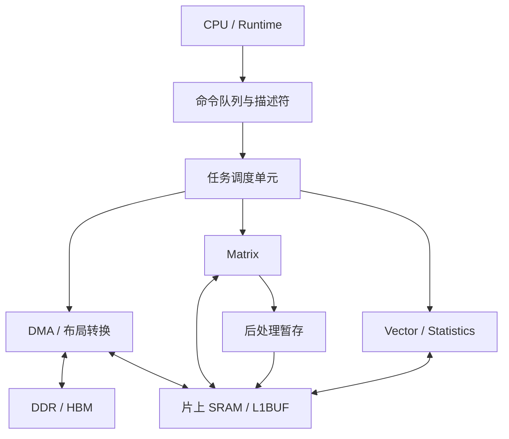
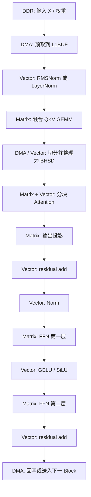
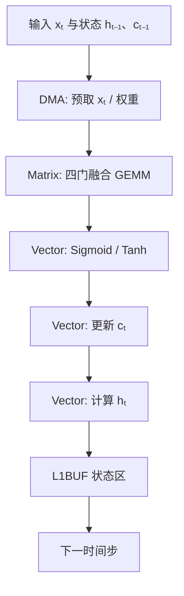
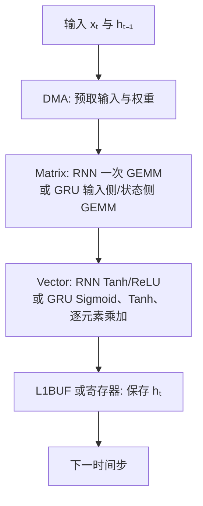

# 面向 Transformer、LSTM、GRU 和 RNN 加速的 NPU 设计目标

> [!ABSTRACT] 文档目的
> 本文定义一款推理型 NPU 对 Transformer、LSTM、GRU 和普通 RNN 的算子、存储、调度、精度及软件接口要求。设计以 Matrix、Vector/Statistics/SFU、DMA、片上 SRAM（下文记为 L1BUF）和任务调度单元为基础，不为每种模型复制一套计算阵列。Statistics 表示沿指定维度求和、求最大值或求平均值。

> [!SUMMARY] 首版设计结论
>
> | 项目 | 结论 |
> |---|---|
> | 计算核心 | 一套可参数化 GEMM/BMM 阵列承担 QKV、FFN、Attention、RNN、GRU 和 LSTM 的矩阵乘 |
> | 非矩阵计算 | Vector/Statistics/SFU 执行 Norm、Softmax、激活、残差和循环状态更新 |
> | 数据移动 | DMA 按 shape 与 stride 搬运 tile；L1BUF 保存活跃 tile、循环状态和在线 Softmax 统计量 |
> | 调度 | 硬件执行短且固定的事件依赖；编译器与 Runtime 决定分块、融合、门顺序和缓存地址 |
> | 首版重点 | 完成 P0 基础指令、Batch Size 为 1 时的小矩阵调度、非整 tile 处理和明确的异常语义 |
> | 暂不配置专用大模块 | tokenizer、采样、复杂搜索、页表管理和任务专用后处理继续由 CPU 或 Runtime 执行 |

## 1. 需求范围与设计约束

### 1.1 目标模型

| 模型 | 典型应用 | 主要计算特征 | NPU 重点 |
| --- | --- | --- | --- |
| Transformer Encoder | 文本理解、视觉 Transformer、语音编码 | token 维可并行；线性层与 FFN 的矩阵乘占比高 | 连续发射大 GEMM、归一化、Softmax、张量重排 |
| Transformer Decoder | 大语言模型生成、代码生成、对话 | 逐 token 生成；KV Cache 读写频繁 | Batch Size 为 1 的小 GEMM、KV Cache 预取和短命令启动 |
| LSTM / BiLSTM | 语音、时序预测、轻量 NLP | 时间步间有状态依赖；四门计算规则固定 | 门控 GEMM、逐元素激活、状态驻留 |
| GRU / BiGRU | 语音、传感器时序、轻量序列模型 | 三个门；只有一个隐藏状态 | 三门矩阵乘、Sigmoid/Tanh、状态更新 |
| RNN / BiRNN | 极轻量时序模型、教学或旧模型兼容 | 一次递推矩阵乘加一个激活 | 小矩阵 GEMM、激活函数、隐藏状态驻留 |

本文聚焦推理。反向传播、优化器更新、梯度通信和随机失活不属于首版 NPU 的必备范围。

### 1.2 可验证的设计目标

| 目标 | 首版要求 | 验证方式 |
|---|---|---|
| 算子完备 | 四类目标模型都能分解为 GEMM/BMM、Vector、Statistics、SFU 与 DMA 任务 | 使用第 11.2 节形状运行完整 Block 或完整循环层 |
| 小任务效率 | Batch Size 为 1、Decoder 单 token 和小隐藏宽度循环层不因命令启动而长期空转 | 记录发射周期、Matrix 空闲周期和每时间步延迟 |
| 片上复用 | QKV tile、Norm/Softmax 统计量、$h_t$、$c_t$ 在消费完成前不默认回写 DDR | 统计 DDR 字节数与状态回写次数 |
| 形状适配 | shape、stride、tail mask 和 Head 数由描述符给出，不为常见尺寸复制 RTL | 覆盖随机形状、非整 tile 与多种布局 |
| 数值明确 | 输入、累加、输出格式以及特殊函数近似模式都有确定语义 | 与高精度参考结果比较，并执行长序列状态测试 |
| 可观测 | 地址错误、非法 opcode、dtype 不被接受和任务超时可被软件识别 | 注入异常描述符并检查状态寄存器与事件 |

吞吐、时延、利用率和误差的具体记录方式见第 11 章。这里先定义“必须能做什么”，避免只用峰值 TOPS 描述设计目标。

### 1.3 首版软硬件分工

| 决策对象  | 软件动作                             | 硬件动作                 |
| ----- | -------------------------------- | -------------------- |
| 模型结构  | 图解析、算子拆分、门顺序、Head 组织             | 译码并执行通用任务            |
| 分块与融合 | 根据 shape 和 L1BUF 容量选择 tile 与融合方案 | 执行描述符指定的 tile 和后处理   |
| 地址与缓存 | 分配全局内存、状态区和 KV 块表                | 按地址与 stride 搬运、预取和回写 |
| 时间依赖  | 生成事件、循环次数和有效长度                   | 等待事件、更新状态槽、报告完成或错误   |
| 数值模式  | 选择输入、累加、输出格式和近似档位                | 按描述符执行舍入、饱和和特殊函数     |

第 7 章给出逐项职责表，第 9 章给出相应指令和描述符。

### 1.4 不纳入首版专用硬件的功能

以下工作分支多、调用频率低，或需要复杂策略选择，宜由 CPU、固件或 Runtime 处理：

- tokenizer、文本编码和文本解码；
- Beam Search、Top-k、Top-p 与随机采样；
- 字符串处理、模型文件解析和复杂控制流；
- KV Cache 的高层块表管理；
- 投影 LSTM 与 peephole LSTM 的专用状态机；这两类变体由基础 GEMM/Vector 任务分解，首阶段不做完整网络验收；
- 少量出现的任务专用后处理。

NPU 可提供比较、选择、局部排序和 DMA 基础操作供软件调用，但首版不为这些工作配置大面积专用电路。

### 1.5 公式读法、函数和符号速查

本文公式中的“字母”多数不是一个固定数字，而是一个标量、向量、矩阵或多维张量。先分清对象类型，公式会容易很多。

| 记号                               | 读法和含义           | 初学者应注意的点                                   |
| -------------------------------- | --------------- | ------------------------------------------ |
| $x$                              | 一个输入数、输入向量或输入张量 | 下标不同通常表示不同位置或时间步                           |
| $x_t$                            | 第 $t$ 个时间步的输入向量 | $t-1$ 就是前一个时间步                             |
| $h_t$                            | 第 $t$ 个时间步的隐藏状态 | RNN、GRU、LSTM 都会产生它                         |
| $c_t$                            | LSTM 的记忆状态      | 只有 LSTM 使用；GRU 与普通 RNN 没有它                 |
| $W$                              | 可学习权重矩阵         | 矩阵乘把输入的多个数按权重组合成新特征                        |
| $b$                              | 可学习偏置向量         | 在矩阵乘结果上逐元素相加                               |
| $A,B,C$                          | 矩阵乘中的左输入、右输入、输出 | $C=AB$ 时，左矩阵的列数必须等于右矩阵的行数                  |
| $Q,K,V$                          | Query、Key、Value | 注意力中：Q 提问，K 给出可匹配特征，V 提供被加权汇聚的内容           |
| $W_Q,W_K,W_V$                    | 生成 Q、K、V 的三组权重  | 它们都是可学习参数，不是固定规则                           |
| $\mathsf T$ 上标，如 $K^{\mathsf T}$ | 转置              | 行和列互换；不要与“时间长度 $T$”混淆，后者没有上标               |
| $[a,b]$                          | 向量或矩阵的拼接        | 本文在循环层中表示沿特征维把两个向量接在一起                     |
| $\sum$                           | 求和              | 例如 $\sum_{k=0}^{K-1}$ 表示从 $k=0$ 一直加到 $K-1$ |
| $\odot$                          | 逐元素乘            | 两个向量相同位置的数分别相乘，不是矩阵乘                       |
| $\times$                         | 维度乘积或普通乘法       | 在形状 $B\times S\times H$ 中表示三个维度；在算式中表示普通乘法 |
| $\sqrt{x}$                       | 平方根             | Softmax 和归一化中用于控制数值大小                      |
| $\approx$                        | 近似等于            | 通常表示硬件用多项式或查表得到近似结果                        |

常用函数如下：

| 函数或算子 | 输入到输出 | 直观含义 |
| --- | --- | --- |
| $\operatorname{Norm}$ | 一个特征向量 | 计算均值、方差或均方根，再对每个元素执行标准化、缩放和平移 |
| $\operatorname{Softmax}$ | 一行分数 | 变成非负且总和为 1 的权重 |
| $\sigma(x)$ 或 Sigmoid | 一个实数 | 输出在 0 到 1 之间，可表示“保留比例”或“开关强度” |
| $\tanh(x)$ | 一个实数 | 输出在 $-1$ 到 $1$ 之间，可生成带正负号的候选内容 |
| $\exp(x)$ | 一个实数 | $e^x$，其中 $e\approx2.71828$；Softmax 使用它把较大的分数放大 |
| $\max$ | 一组数 | 取最大值；Softmax 先减最大值可降低溢出风险 |
| $\operatorname{Concat}$ | 多个向量或矩阵 | 沿指定维度拼接 |
| $\phi$ | 激活函数占位符 | 在本文的 FFN 中通常选 GELU 或 SiLU |
| $\operatorname{ReLU}(x)$ | 一个实数 | $\max(0,x)$；负数变为 0，正数保持不变 |

形状记号 $B,S,H,D,F,I,T$ 在不同章节反复出现：$B$ 是 Batch Size，$S$ 是 Transformer 序列长度，$H$ 是隐藏宽度，$D$ 是单个 Head 的宽度，$F$ 是 FFN 中间宽度，$I$ 是循环层的输入宽度，$T$ 是循环层的总时间步数。小写 $h$ 表示注意力 Head 数，而带时间下标的 $h_t$ 表示循环层隐藏状态。若写成 $X\in\mathbb R^{B\times S\times H}$，读作“$X$ 属于三维实数张量集合，三个维度依次为 Batch维度、序列位置和隐藏特征”。

> [!note] 本文的矩阵与维度约定
> 本文统一采用**行向量在左、权重在右**的约定：若 $X\in\mathbb R^{M\times K}$ 且 $W\in\mathbb R^{K\times N}$，则 $Y=XW\in\mathbb R^{M\times N}$。批量维或序列维出现在矩阵乘前的维度时，可把它们合并为 $M$ 维来理解。除非特别说明，bias 会沿除输出特征维外的所有维度广播；$\operatorname{Softmax}$ 则沿最后一个“Key 位置”维度逐行计算。

---

## 2. 模型计算分解

### 2.1 Transformer Block

设输入为：

$$
X\in\mathbb{R}^{B\times S\times H},
$$

其中 $B$ 是 Batch Size，$S$ 是序列长度，$H$ 是隐藏宽度。一个常见的 Pre-Norm Transformer Block 可写为：

$$
\widetilde X=\operatorname{Norm}(X),
$$

$$
Q=\widetilde XW_Q,\qquad K=\widetilde XW_K,\qquad V=\widetilde XW_V,
$$

对第 $j$ 个注意力头，令 $Q_j,K_j,V_j\in\mathbb R^{B\times S\times D}$，则：

$$
A_j=\operatorname{Softmax}\left(
\frac{Q_jK_j^{\mathsf T}}{\sqrt{D}}+M_{\mathrm{mask},j}
\right),
\qquad
Z=\operatorname{Concat}_{j=1}^{h}(A_jV_j)W_O,
$$

$$
U=X+Z,
$$

$$
F=\phi\bigl(\operatorname{Norm}(U)W_1+b_1\bigr),
\qquad
Y=U+FW_2+b_2.
$$

其中 $h$ 为注意力头数，$D=H/h$ 为单头维度，$M_{\mathrm{mask}}$ 是可选掩码，$\phi$ 常取 GELU 或 SiLU。

> [!note] 注意力公式中的转置与 Softmax 轴
> 对每个 Batch 样本和每个 Head，$Q_jK_j^{\mathsf T}$ 表示形状为 $(S,D)$ 的 Query 矩阵乘以形状为 $(D,S)$ 的 Key 转置，因此得到 $(S,S)$ 的分数矩阵。第 $q$ 行只描述第 $q$ 个 Query 对所有 Key 的分数；Softmax 只在这一行的 Key 位置轴计算。这里的 $\mathsf T$ 只交换最后两个矩阵维度，不交换 Batch维度、Head维度或序列分组。

> [!note] Cross-Attention 使用两个序列长度
> 编码器—解码器模型中的 Cross-Attention 令 Query 长度为 $S_q$，编码器 Key/Value 长度为 $S_{\mathrm{kv}}$。此时 $Q\in\mathbb R^{B\times h\times S_q\times D}$，$K,V\in\mathbb R^{B\times h_{\mathrm{kv}}\times S_{\mathrm{kv}}\times D}$，分数 shape 为 $[B,h,S_q,S_{\mathrm{kv}}]$。它仍由 BMM、按 Key 位置求 Softmax 和 BMM 组成，不增加新计算单元；`BMM_DESC` 与 `ATTN_DESC` 必须分别记录 Query 和 Key/Value 长度。P0 基础指令可以表达 Cross-Attention，但首阶段不要求完整编码器—解码器模型验收。

下面逐式解释 Transformer Block：

| 公式片段 | 输入和输出 | 它在做什么 |
| --- | --- | --- |
| $\widetilde X=\operatorname{Norm}(X)$ | $X$ 与 $\widetilde X$ 形状相同 | 对每个 token 的 $H$ 个 Feature 计算统计量，再执行标准化、缩放和平移 |
| $Q=\widetilde XW_Q$ | 输入 $(B,S,H)$，输出通常仍为 $(B,S,H)$ | 每个 token 生成“要找什么”的 Query |
| $K=\widetilde XW_K$ | 形状同上 | 每个 token 生成供其他 token 匹配的 Key |
| $V=\widetilde XW_V$ | 形状同上 | 每个 token 生成被权重加和的 Value |
| $QK^{\mathsf T}$ | 每个头内为 $(S,D)$ 乘 $(D,S)$ | 得到 $(S,S)$ 分数表；第 $i$ 行表示第 $i$ 个 Query 对全部 Key 的分数 |
| $1/\sqrt{D}$ | 分数表 | $D$ 较大时点积容易过大；除以 $\sqrt{D}$ 可控制数值范围 |
| $+M_{\mathrm{mask}}$ | 分数表 | 不允许关注的位置加极小值，使 Softmax 后的权重接近 0 |
| $A_j=\operatorname{Softmax}(\cdot)$ | $(S,S)$ 分数表变为 $(S,S)$ 权重表 | 每一行权重之和为 1 |
| $A_jV_j$ | $(S,S)$ 乘 $(S,D)$ | 第 $j$ 个头把 Value 按注意力权重做加权和 |
| $\operatorname{Concat}(\cdots)W_O$ | 多个头的结果拼接后再线性变换 | 把多个头的信息合成 $H$ 维输出 |
| $U=X+Z$、$Y=U+\cdots$ | 两侧形状均为 $(B,S,H)$ | 残差相加，把原特征直接保留一部分 |

FFN 采用“张量在左、权重在右”的写法，因此：

$$
W_1\in\mathbb R^{H\times F},\qquad
W_2\in\mathbb R^{F\times H},\qquad
b_1\in\mathbb R^F,\qquad
b_2\in\mathbb R^H.
$$

输入 $(B,S,H)$ 先乘 $W_1$ 变为 $(B,S,F)$，经过 $\phi$ 后再乘 $W_2$ 回到 $(B,S,H)$。因此它才能与 $U$ 做残差相加。

许多 Decoder 使用 SwiGLU，而不是上面的单分支 FFN。其计算为：

$$
A=UW_{\mathrm{up}}+b_{\mathrm{up}},
\qquad
G=UW_{\mathrm{gate}}+b_{\mathrm{gate}},
$$

$$
F=\operatorname{SiLU}(G)\odot A,
\qquad
Y=U+FW_{\mathrm{down}}+b_{\mathrm{down}}.
$$

其中 $W_{\mathrm{up}},W_{\mathrm{gate}}\in\mathbb R^{H\times F}$，$W_{\mathrm{down}}\in\mathbb R^{F\times H}$；$b_{\mathrm{up}},b_{\mathrm{gate}}\in\mathbb R^F$，$b_{\mathrm{down}}\in\mathbb R^H$。$A$、$G$ 和 $F$ 的 shape 都是 $[B,S,F]$。Matrix 执行两个上投影和一个下投影，Vector 执行 SiLU 与逐元素乘。

一个 Transformer Block 可拆成六类基础计算：

1. 规则 GEMM：Q、K、V、输出投影和两层 FFN。
2. 批量矩阵乘：$QK^{\mathsf T}$ 与 $AV$。
3. 按指定维度求和、求最大值或求平均值：LayerNorm、RMSNorm、Softmax 都需要这类统计计算。
4. 逐元素运算：bias、残差相加、缩放、掩码、激活函数。
5. 张量布局转换：BSH、BHSD、BSHD 等排列之间的转置、切分和拼接。
6. 存储访问：权重读取、中间特征暂存、KV Cache 追加和读取。

### 2.2 Transformer 计算量示例

以 $B=2$、$S=128$、$H=768$、FFN 中间维度 $F=3072$、$h=12$ 为例，忽略 bias 与逐元素计算：

| 部分 | MAC 数量 | 代入本例后的数量 | 硬件特征 |
| --- | ---: | ---: | --- |
| Q、K、V 投影 | $3BSH^2$ | $452{,}984{,}832$ | 规则 GEMM；一个权重元素用于 $BS$ 个输入行 |
| 注意力分数 $QK^{\mathsf T}$ | $BS^2H$ | $25{,}165{,}824$ | 批量矩阵乘，随 $S^2$ 增长 |
| 注意力加权 $AV$ | $BS^2H$ | $25{,}165{,}824$ | 按 Query 和 Key/Value tile 执行 BMM |
| 输出投影 | $BSH^2$ | $150{,}994{,}944$ | 规则 GEMM |
| 两层 FFN | $2BSHF$ | $1{,}207{,}959{,}552$ | 通常是 Block 内最大的计算部分 |
| SwiGLU（替代两层 FFN） | $3BSHF$ | $1{,}811{,}939{,}328$ | 两个上投影、一个下投影；另有 SiLU 和逐元素乘 |

MAC 是一次乘法及其后的累加。例如，计算一个输出元素时，硬件把一对输入相乘，并把结果加到该元素的部分和中。式中的 $H^2$ 表示 $H\times H$，$S^2$ 表示 $S\times S$；它们不是把张量中每个元素各自平方。表中的普通 FFN 与 SwiGLU 是两种替代结构，不能把两行计算量相加；真实模型中的 $F$ 也可能不同。

FFN 的 $M,N,K$ 连续且常大于 Matrix tile，非整 tile 的 lane 占比通常低于小矩阵任务。序列长度增大时，注意力分数的元素数、保存空间和读取量按 $S^2$ 增长。

> [!note] MAC 与 FLOP 不应混用
> 表中的 MAC（multiply-accumulate）是一次乘法并累加到部分和。若把一次乘法和一次加法各计为一个浮点操作，则理想化地可近似认为 $1\ \mathrm{MAC}\approx2\ \mathrm{FLOPs}$；但不同芯片和基准报告采用的 FLOP 计数方式可能不同，性能表中应明确说明乘法与加法如何计数。

### 2.3 LSTM 单元

设第 $t$ 个时间步输入为 $x_t$，前一时刻隐藏状态与记忆状态为 $h_{t-1}$、$c_{t-1}$。标准 LSTM 为：

$$
i_t=\sigma(x_tW_{xi}+h_{t-1}W_{hi}+b_i),
$$

$$
f_t=\sigma(x_tW_{xf}+h_{t-1}W_{hf}+b_f),
$$

$$
g_t=\tanh(x_tW_{xg}+h_{t-1}W_{hg}+b_g),
$$

$$
o_t=\sigma(x_tW_{xo}+h_{t-1}W_{ho}+b_o),
$$

$$
c_t=f_t\odot c_{t-1}+i_t\odot g_t,
\qquad
h_t=o_t\odot\tanh(c_t).
$$

实际实现应将四组门控矩阵拼接为一次 GEMM：

$$
G_t=[x_t,h_{t-1}]W_{\mathrm{lstm}}+b_{\mathrm{lstm}}.
$$

其中：

$$
x_t\in\mathbb R^{B\times I},\qquad
h_t,c_t\in\mathbb R^{B\times H},
$$

$$
W_{\mathrm{lstm}}\in\mathbb R^{(I+H)\times4H},\qquad
b_{\mathrm{lstm}}\in\mathbb R^{4H}.
$$

$G_t$ 的形状为 $(B,4H)$，可按最后一维切成四段原始值 $[i_{\mathrm{raw}},f_{\mathrm{raw}},g_{\mathrm{raw}},o_{\mathrm{raw}}]$，每段形状都是 $(B,H)$。PyTorch 保存的 `bias_ih` 与 `bias_hh` 可在推理前按门相加，合成为上式的 $b_{\mathrm{lstm}}$。

再将 $G_t$ 切成四份，由 Vector 完成 Sigmoid、Tanh、逐元素乘和加法。输入宽度为 $I$、隐藏宽度为 $H$、时间长度为 $T$ 时，门控部分约需：

$$
4BT(I+H)H
$$

次 MAC。

LSTM 的时间轴不能完全并行，但 Batch维度、隐藏特征和四个门均可并行。因此，复用 GEMM 阵列和向量流水即可承担主要计算，无需独立的大型 LSTM 阵列。

> [!warning] LSTM 门顺序必须由模型导入器显式记录
> 文中拼接顺序使用 $[i,f,g,o]$，其中 $g$ 是候选门。PyTorch 的 `weight_ih` 和 `weight_hh` 分别以 $[4H,I]$、$[4H,H]$ 保存，而本文行向量公式需要 $[I,4H]$、$[H,4H]$；导入器必须转置并按 NPU pack format 排列。不同框架、导出格式和权重文件的门顺序也可能不同，Runtime 必须重排权重与 bias，或把门顺序写入描述符。仅因某一维长度为 $4H$ 就默认其顺序为 $[i,f,g,o]$，会造成数值看似正常但门含义错误的输出。

LSTM 公式中各个符号的含义如下：

| 符号 | 名称 | 数值范围或形状 | 作用 |
| --- | --- | --- | --- |
| $i_t$ | 输入门 | 与 $h_t$ 同形状，元素在 0 到 1 之间 | 控制候选内容写入多少 |
| $f_t$ | 遗忘门 | 与 $h_t$ 同形状，元素在 0 到 1 之间 | 控制旧记忆 $c_{t-1}$ 保留多少 |
| $g_t$ | 候选内容 | 与 $h_t$ 同形状，元素在 $-1$ 到 $1$ 之间 | 提供待写入的新内容 |
| $o_t$ | 输出门 | 与 $h_t$ 同形状，元素在 0 到 1 之间 | 控制从 $c_t$ 输出多少 |
| $W_{xi},W_{xf},\ldots$ | 输入到各门的权重 | 常见形状为 $(I,H)$ | 用当前输入 $x_t$ 计算四个门 |
| $W_{hi},W_{hf},\ldots$ | 隐藏状态到各门的权重 | 常见形状为 $(H,H)$ | 用上一时刻 $h_{t-1}$ 计算四个门 |
| $b_i,b_f,b_g,b_o$ | 各门的 bias | 长度为 $H$ | 为每个门增加可学习偏移 |
| $\odot$ | 逐元素乘 | 两侧形状相同 | 例如 $f_t\odot c_{t-1}$ 表示每个记忆元素独立保留 |

可以先把门的输出当作已知数，手算一次状态更新。若某一个特征位置上 $f_t=0.25$、$c_{t-1}=0.4$、$i_t=0.5$、$g_t=0.8$、$o_t=0.6$，则：

$$
c_t=0.25\times0.4+0.5\times0.8=0.5,
$$

$$
h_t=0.6\times\tanh(0.5)\approx0.6\times0.4621=0.2773.
$$

这里 $c_t$ 是内部记忆状态，$h_t$ 是对外输出的隐藏状态。两者长度通常相同，但用途不同：遗忘门和输入门直接更新 $c_t$，输出门再决定从 $c_t$ 中给出多少 $h_t$。

### 2.4 普通 RNN 单元

普通 RNN 是最简单的循环层。它先做两次线性变换，再把结果相加并通过激活函数：

$$
a_t=x_tW_x+h_{t-1}W_h+b,
$$

$$
h_t=\psi(a_t).
$$

其中 $\psi$ 是激活函数，常见取值为 $\tanh$ 或 ReLU。若 Batch Size 为 $B$，则 $x_t\in\mathbb R^{B\times I}$、$h_t\in\mathbb R^{B\times H}$，并且：

$$
W_x\in\mathbb R^{I\times H},\qquad
W_h\in\mathbb R^{H\times H}.
$$

$b$ 的长度为 $H$，对 Batch 中每一行输入重复相加。举一个最小例子：当 $B=I=H=1$、$x_t=2$、$h_{t-1}=1$、$W_x=0.5$、$W_h=0.25$、$b=0$，若选择 ReLU，则：

$$
a_t=2\times0.5+1\times0.25=1.25,\qquad
h_t=\operatorname{ReLU}(1.25)=1.25.
$$

这个例子中的 Matrix 工作是两次乘法与一次加法。完整模型执行相同公式，只是标量运算变为形状 $(B,I+H)\times(I+H,H)$ 的矩阵乘。

读这两式时可以这样理解：

1. $x_tW_x$：把当前输入的 $I$ 个数合成为 $H$ 个数。
2. $h_{t-1}W_h$：把上一时刻的 $H$ 个状态合成为新的 $H$ 个数。
3. 两项和 bias 相加得到原始结果 $a_t$。
4. $\psi(a_t)$ 把原始结果变为新隐藏状态 $h_t$。

若采用行向量存储，可把两次矩阵乘改写为一次拼接 GEMM：

$$
h_t=\psi\left([x_t,h_{t-1}]W_{\mathrm{rnn}}+b_{\mathrm{rnn}}\right),
$$

其中 $[x_t,h_{t-1}]$ 的长度为 $I+H$，$W_{\mathrm{rnn}}$ 的形状为 $(I+H)\times H$。一个 Batch、$T$ 个时间步的主计算量约为：

$$
BT(IH+H^2)=BTH(I+H)
$$

次 MAC。MAC 是一次乘法加一次累加的组合。

#### RNN 的底层运算与硬件分工

| 次序 | 底层运算 | 执行单元 | 原因 |
| --- | --- | --- | --- |
| 1 | 读取 $x_t$、$h_{t-1}$ 和权重 tile | DMA + L1BUF | $h_{t-1}$ 会在每个时间步反复使用 |
| 2 | $[x_t,h_{t-1}]W_{\mathrm{rnn}}$ | Matrix | 规则 GEMM，计算量最大 |
| 3 | 加 bias | Vector，或 Matrix 后处理 | 逐元素加法，可与下一步合并 |
| 4 | $\tanh$ 或 ReLU | Vector 特殊函数单元 | 每个元素独立计算 |
| 5 | 写入 $h_t$ | Vector 寄存器或 L1BUF | 下一时间步立刻需要它 |

普通 RNN 只有一个状态 $h_t$，因此数据组织比 LSTM 和 GRU 简单。对于双向 RNN，正向和反向序列可作为两组独立任务执行。

### 2.5 GRU 单元

GRU 使用重置门 $r_t$、更新门 $z_t$ 和候选状态 $n_t$。PyTorch 常用形式为：

$$
r_t=\sigma(x_tW_{xr}+b_{xr}+h_{t-1}W_{hr}+b_{hr}),
$$

$$
z_t=\sigma(x_tW_{xz}+b_{xz}+h_{t-1}W_{hz}+b_{hz}),
$$

$$
n_t=\tanh\left(x_tW_{xn}+b_{xn}+r_t\odot(h_{t-1}W_{hn}+b_{hn})\right),
$$

$$
h_t=(1-z_t)\odot n_t+z_t\odot h_{t-1}.
$$

若 Batch Size 为 $B$，则 $x_t\in\mathbb R^{B\times I}$、$r_t,z_t,n_t,h_t\in\mathbb R^{B\times H}$，输入侧权重 $W_{x*}$ 形状为 $(I,H)$，状态侧权重 $W_{h*}$ 形状为 $(H,H)$。每个 bias 的长度为 $H$，并对 Batch 中每一行重复相加。

符号说明：

| 符号 | 含义 | 直观解释 |
| --- | --- | --- |
| $r_t$ | 重置门，元素在 0 到 1 之间 | 控制上一时刻状态参与候选状态的比例 |
| $z_t$ | 更新门，元素在 0 到 1 之间 | 决定新状态更接近 $n_t$ 还是更接近旧状态 $h_{t-1}$ |
| $n_t$ | 候选状态，元素在 $-1$ 到 $1$ 之间 | 当前时间步准备写入的新内容 |
| $1-z_t$ | 逐元素的补数 | 当 $z_t$ 较大时，候选状态的占比会变小 |
| $W_{xr},W_{xz},W_{xn}$ | 输入权重 | 分别为三个门读取当前输入，形状为 $(I,H)$ |
| $W_{hr},W_{hz},W_{hn}$ | 状态权重 | 分别为三个门读取上一时刻状态，形状为 $(H,H)$ |

用一个单元素例子可以同时看清重置门和更新门的作用。假设输入侧候选结果 $x_tW_{xn}+b_{xn}=0.3$，状态侧候选结果 $h_{t-1}W_{hn}+b_{hn}=0.8$；两次 Sigmoid 已得到 $r_t=0.25$、$z_t=0.75$，且旧状态 $h_{t-1}=0.8$。先算候选状态：

$$
n_t=\tanh(0.3+0.25\times0.8)=\tanh(0.5)\approx0.4621.
$$

再更新隐藏状态：

$$
h_t=(1-0.75)\times0.4621+0.75\times0.8\approx0.7155.
$$

重置门 $r_t$ 越小，状态侧候选结果参与得越少；更新门 $z_t$ 越大，旧状态 $h_{t-1}$ 占更多比例。

GRU 的主计算量约为：

$$
3BT(IH+H^2)=3BTH(I+H)
$$

次 MAC，比 LSTM 的四门计算少一组门。

#### GRU 的底层运算与硬件分工

GRU 不应简单地把三组门完全合并成“一个输出后直接激活”的 GEMM。原因是候选状态 $n_t$ 中的 $r_t$ 必须先与 $h_{t-1}W_{hn}+b_{hn}$ 逐元素相乘，再进入 Tanh。

也存在另一类 GRU 写法：先计算 $r_t\odot h_{t-1}$，再送入候选状态的隐藏侧矩阵乘。导入模型时，软件必须记录所用公式；两类写法的计算次序和 bias 位置不同，不能混合处理。

硬件按以下次序执行：

下标中的 $*$ 表示 $r$、$z$、$n$ 三者之一。例如 $W_{x*}$ 可以指 $W_{xr}$、$W_{xz}$ 或 $W_{xn}$。

1. Matrix 分别计算输入侧三组仿射结果 $x_tW_{x*}+b_{x*}$，以及状态侧三组仿射结果 $h_{t-1}W_{h*}+b_{h*}$。
2. Vector 将重置门和更新门的两部分相加后计算 Sigmoid，得到 $r_t,z_t$。
3. Vector 计算 $r_t\odot(h_{t-1}W_{hn}+b_{hn})$，再加输入侧候选结果并计算 Tanh，得到 $n_t$。
4. Vector 计算 $(1-z_t)\odot n_t+z_t\odot h_{t-1}$，得到 $h_t$。
5. 将 $h_t$ 保留在寄存器或 L1BUF 状态区，供下一时间步使用。

| 计算部分 | 执行单元 | 说明 |
| --- | --- | --- |
| 三组输入侧矩阵乘 | Matrix | 可沿输出通道拼接成一次 GEMM |
| 三组状态侧矩阵乘 | Matrix | 可沿输出通道拼接成一次 GEMM |
| 两组 Sigmoid | Vector 特殊函数单元 | 产生 $r_t,z_t$ |
| reset 逐元素乘、候选 Tanh | Vector | 计算 $n_t$ |
| 两次逐元素乘和一次加法 | Vector | 更新 $h_t$ |
| 状态读写 | Vector 寄存器 / L1BUF / DMA | $h_t$ 需要传给下一个时间步 |

GRU 只有 $h_t$，不像 LSTM 还要保留 $c_t$；因此状态存储量较小。双向 GRU 的两个方向互不读取对方状态，可以拆成独立任务；只有存在多个 Matrix 实例或可并行使用的多核资源时才同时发射。

---

## 3. 关键算子与硬件实现优先度

### 3.1 优先度分级与算子总表

P0、P1、P2 的定义、选择方法和具体示例见第 9.1 节。下表按照该分级列出各类算子的实现次序、用途和执行单元。

| 优先度 | 算子或算子组                          | Transformer 用途            | LSTM / GRU / RNN 用途                         | 执行单元                         | 首版要求          |
| --- | ------------------------------- | ------------------------- | ------------------------------------------- | ------------------------------ | ------------- |
| P0  | GEMM / MatMul / Batched MatMul  | QKV、投影、FFN、$QK^{\mathsf T}$、$AV$    | LSTM 四门、GRU 三门、RNN 单次递推矩阵乘                  | Matrix / Tensor Engine         | 必须实现，最高优先度    |
| P0  | bias、残差加、缩放、逐元素乘                | 线性层后处理、残差、注意力缩放           | 门控组合、候选状态、隐藏状态更新                            | Vector ALU                     | 与主算子融合        |
| P0  | ReduceSum（求和）、ReduceMax（求最大值）、ReduceMean（求平均值） | Softmax、LayerNorm、RMSNorm | 通常不在主递推路径中 | Vector Statistics Unit | 并行合并各 lane 的统计结果 |
| P0  | Exp、Reciprocal、ReciprocalSqrt   | Softmax、Norm              | Sigmoid 和 Tanh 的内部近似可复用 Exp                 | Special Function Unit          | 给出近似档位与误差上限 |
| P0  | Sigmoid、Tanh、GELU、SiLU          | FFN 激活                    | LSTM/GRU 使用 Sigmoid、Tanh；RNN 使用 Tanh 或 ReLU | Vector / Special Function Unit | 查表加多项式        |
| P0  | DMA Copy、Strided Copy、Transpose | QKV 切分、KV Cache、布局转换      | 输入、权重、$h_t$ 和 $c_t$ 的搬运                     | DMA / Layout Engine            | 必须实现          |
| P1  | Masked Softmax 行级宏任务         | 因果注意力、padding mask        | 不常用                                         | Vector + Attention Pipeline    | P0 先用比较、选择和基础 Softmax 指令分解 |
| P1  | RoPE                            | Decoder 的位置旋转             | 不常用                                         | Vector ALU                     | 成对执行乘加        |
| P1  | KV Cache Gather 宏任务           | Decoder 生成                | 不适用                                         | DMA + SRAM 控制                  | P0 用 `DMA_COPY_ND` 追加和分块读取 |
| P1  | Fused Attention                 | 长序列 Encoder、Prefill       | 不适用                                         | Attention Pipeline             | 中后期加入         |
| P2  | Embedding Gather                | token 查表                  | 词嵌入查表                                       | DMA / Vector Gather            | 按产品需求决定       |
| P2  | Top-k / Sampling                | 输出 token 选择               | 不常用                                         | CPU / Vector                   | 首版以软件为主       |

### 3.2 GEMM、Batched MatMul 与线性层

统一计算形式为：

$$
C_{m,n}=\sum_{k=0}^{K_{\mathrm g}-1}A_{m,k}W_{k,n}+b_n.
$$

这条式可以逐个元素阅读：

| 符号              | 含义                          |
| --------------- | --------------------------- |
| $A_{m,k}$       | 左矩阵 $A$ 的第 $m$ 行、第 $k$ 列元素  |
| $W_{k,n}$       | 右矩阵 $W$ 的第 $k$ 行、第 $n$ 列元素  |
| $C_{m,n}$       | 输出矩阵 $C$ 的第 $m$ 行、第 $n$ 列元素 |
| $k$             | 被求和的公共维度编号；每一个 $k$ 都会产生一次乘法 |
| $K_{\mathrm g}$ | 公共维度长度；也就是每个输出元素需要累加多少项     |
| $b_n$           | 第 $n$ 个输出通道使用的 bias         |

例如 $A$ 形状为 $M_{\mathrm g}\times K_{\mathrm g}$、$W$ 形状为 $K_{\mathrm g}\times N_{\mathrm g}$ 时，输出 $C$ 形状为 $M_{\mathrm g}\times N_{\mathrm g}$。下标 $\mathrm g$ 表示 GEMM 维度，用来避免与 Batch Size $B$、注意力掩码 $M_{\mathrm{mask}}$ 混淆。一个 $C_{m,n}$ 需要 $K_{\mathrm g}$ 次乘法和约 $K_{\mathrm g}$ 次加法；Matrix 阵列沿 $K_{\mathrm g}$ 维并行执行这些乘累加。

Matrix 单元应执行：

- 一般 GEMM：$M\times K$ 乘 $K\times N$；
- 多个独立矩阵组成的 Batched MatMul；
- 逻辑转置视图，例如 $QK^{\mathsf T}$ 中的 $K^{\mathsf T}$；
- bias 融合；
- 可选残差相加、激活和输出写回；
- 非整 tile 尺寸的掩码处理；
- P0 的 FP16/BF16 输入与 FP32 累加，以及 P1 的 INT8 输入与 INT32 累加。

对 Transformer，把 QKV 三次线性层合并为一次：

$$
[Q,K,V]=X[W_Q,W_K,W_V]+[b_Q,b_K,b_V].
$$

对 LSTM，把四个门的权重拼接为一次 GEMM。对普通 RNN，把输入和上一时刻状态拼接为一次 GEMM。对 GRU，输入侧三组矩阵乘合成一次 GEMM，状态侧三组矩阵乘合成另一次 GEMM。拼接不会减少 MAC 数，但会减少命令数量以及中间张量的片上写入和读取次数。

### 3.3 LayerNorm 与 RMSNorm

LayerNorm 对最后一维求均值与方差：

$$
\mu=\frac{1}{H}\sum_{j=1}^{H}x_j,
\qquad
v=\frac{1}{H}\sum_{j=1}^{H}(x_j-\mu)^2,
$$

$$
y_j=\gamma_j\frac{x_j-\mu}{\sqrt{v+\epsilon}}+\beta_j.
$$

其中 $j$ 是特征编号，$\mu$ 是当前归一化范围内的平均值，$v$ 是方差，$\gamma_j$ 是第 $j$ 个特征的可学习缩放系数，$\beta_j$ 是第 $j$ 个特征的可学习平移系数，$\epsilon$ 是很小的正数，用于避免除以 0。分母 $\sqrt{v+\epsilon}$ 是标准差的近似形式。

RMSNorm 不减均值：

$$
r=\sqrt{\frac{1}{H}\sum_{j=1}^{H}x_j^2+\epsilon},
\qquad
y_j=\gamma_j\frac{x_j}{r}.
$$

这里 $r$ 是均方根；它先对 $x_j^2$ 求平均，再开平方。RMSNorm 比 LayerNorm 少了“减均值”这一步，因此需要计算的统计项更少。

> [!note] Norm 的统计范围与参数广播
> 对形状为 $[B,S,H]$ 的激活，LayerNorm/RMSNorm 通常独立处理每一个 $(b,s)$ 对应的长度为 $H$ 的特征向量；它们不跨 Batch维度或 token 位置求均值。$\gamma,\beta\in\mathbb R^H$ 沿 $B$ 和 $S$ 两个维度广播。部分 RMSNorm 实现没有 $\beta$，因此 NORM 描述符应把平移项设计为可选。

> [!note] LayerNorm 统计量的计算方法
> P0 使用 FP32 统计量，并采用两遍算法或 Welford 算法。两遍算法先求 $\mu$，再读取同一行计算 $\sum_j(x_j-\mu)^2$；Welford 在一次流式读取中同时更新样本数、均值和离均差平方和。直接用 $\frac1H\sum_jx_j^2-\mu^2$ 计算方差时，若两个大数非常接近，会丢失较多有效位，因此不作为默认模式。

Vector/Statistics/SFU 按以下步骤执行这两类算子：

1. 每个 lane 先计算局部和，再通过树形结构合并各 lane 的结果；
2. FP32 或等效精度的局部累加；
3. ReciprocalSqrt 近似；
4. 与乘 $\gamma$、加 $\beta$ 融合；
5. 输入、统计量与输出在最后一个消费者完成前保存在片上 SRAM。

首版不单设 LayerNorm 阵列；Vector 单元应增加求和、求最大值的吞吐和片上读写带宽。

### 3.4 Softmax 与 Masked Softmax

数值稳定的 Softmax 先减去行最大值：

$$
m=\max_j x_j,
\qquad
p_i=\frac{\exp(x_i-m)}{\sum_j\exp(x_j-m)}.
$$

因果注意力中，未来位置不可参与当前行计算。可将不允许的位置加上负无穷，或在指数计算前令其贡献为零：

$$
m=\max_{j:\operatorname{valid}_j=1}x_j,
\qquad
p_i=
\begin{cases}
\dfrac{\exp(x_i-m)}
{\sum_{j:\operatorname{valid}_j=1}\exp(x_j-m)},
& \operatorname{valid}_i=1,\\[8pt]
0,& \operatorname{valid}_i=0.
\end{cases}
$$

式中 $x_i$ 是第 $i$ 个原始分数，$m$ 只从有效位置中取最大值，$p_i$ 是第 $i$ 个输出权重。$\operatorname{valid}_i\in\{0,1\}$：取 $1$ 表示该位置可用，取 $0$ 表示该位置不可用。无效 lane 不执行 Exp，直接写 $0$。减去 $m$ 不改变有效位置的 Softmax 权重，因为分子和分母同时乘上了同一个 $e^{-m}$，但能避免 $\exp(x)$ 过大。

使用 mask 时，应先排除不可用位置，再求 $m$；也就是 $m$ 只能从 $\operatorname{valid}_j=1$ 的分数中取最大值。实现中常见的做法是先给不可用位置加上极小值，再执行 ReduceMax 与 Softmax。

> [!warning] 全 mask 行需要单独定义结果
> 若一行所有位置都被 mask，则上式的分母为 $0$，而且行最大值没有定义。Causal mask 正常情况下不会产生这种行；padding、稀疏 attention 或异常输入则可能产生。描述符或 Vector 内核应定义该情形的输出（通常为全 $0$），并避免对该行执行倒数。

硬件需要完成如下向量流水：

$$
\operatorname{ReduceMax}
\;\longrightarrow\;
\operatorname{Exp}
\;\longrightarrow\;
\operatorname{ReduceSum}
\;\longrightarrow\;
\operatorname{Reciprocal}
\;\longrightarrow\;
\text{elementwise multiply}.
$$

Exp 可由分段查表、低阶多项式或两者组合完成。行长度、mask 类型和缩放系数应由描述符配置。

### 3.5 激活函数

Transformer 常见 GELU、SiLU；LSTM 必需 Sigmoid、Tanh：

$$
\operatorname{Sigmoid}(x)=\frac{1}{1+e^{-x}},
\qquad
\operatorname{Tanh}(x)=\frac{e^{2x}-1}{e^{2x}+1},
$$

$$
\operatorname{SiLU}(x)=x\cdot\operatorname{Sigmoid}(x),
$$

$$
\operatorname{GELU}(x)\approx\frac{x}{2}
\left[1+\tanh\left(\sqrt{\frac{2}{\pi}}(x+0.044715x^3)\right)\right].
$$

在这些式子中，$x$ 是输入元素，$e$ 是自然常数，$\pi\approx3.14159$，$x^3=x\times x\times x$。Sigmoid 的输出位于 0 到 1 之间；Tanh 的输出位于 $-1$ 到 $1$ 之间；SiLU 把输入 $x$ 与其 Sigmoid 相乘；GELU 式中的 $\approx$ 表示常用的近似计算式，不要求硬件直接计算精确积分形式。

这些算子的算术密度不足以单独占用 Matrix 阵列。Vector 流水中的 SFU 执行函数近似，并与 bias、残差和逐元素乘连续发射。

### 3.6 张量布局转换与切分

普通多头注意力（MHA）的 Q、K、V 宽度都为 $H$，常在以下形状间切换：

$$
[B,S,H]
\;\longrightarrow\;
[B,S,3H]
\;\longrightarrow\;
3\times[B,S,H]
\;\longrightarrow\;
3\times[B,h,S,D],
$$

$$
[B,h,S,D]
\;\xrightarrow{\operatorname{merge\_heads}}\;
[B,S,H].
$$

其中 $D=H/h$ 是单头维度。当 $B=2$、$S=4$、$H=8$、$h=2$ 时，$D=4$。QKV 线性层的输出 shape 为 $[2,4,24]$；沿最后一维切分后得到三个 $[2,4,8]$ 张量，再重排为三个 $[2,2,4,4]$ 张量。

Grouped-Query Attention（GQA）或 Multi-Query Attention（MQA）的 Key/Value Head 数记为 $h_{\mathrm{kv}}$。此时融合输出宽度不是固定的 $3H$，而是：

$$
H+2H_{\mathrm{kv}},
\qquad
H_{\mathrm{kv}}=h_{\mathrm{kv}}D.
$$

Q 重排为 $[B,h,S,D]$，K 和 V 分别重排为 $[B,h_{\mathrm{kv}},S,D]$。MHA 满足 $h_{\mathrm{kv}}=h$，因此 $H_{\mathrm{kv}}=H$，融合输出才等于 $3H$。

GQA/MQA 要求 $h$ 能被 $h_{\mathrm{kv}}$ 整除。令每个 KV Head 服务的 Query Head 数为：

$$
g=\frac{h}{h_{\mathrm{kv}}},
$$

则编号为 $q$ 的 Query Head 读取编号为 $\lfloor q/g\rfloor$ 的 K/V Head。BMM 和 Attention 描述符必须显式给出 $h$、$h_{\mathrm{kv}}$ 与 $g$，不能默认每个 Query Head 都有独立 K/V。

DMA 读取多维 shape 与 stride，执行物理转置和分段搬运；编译器决定切分次序、目标布局和是否只修改元数据。QKV 切分、Head 维重排、KV Cache 写入和 BMM 输入准备都使用这组基础操作。

> [!note] reshape 与 transpose 是不同操作
> 从 $[B,S,H]$ 切分到 $[B,h,S,D]$ 至少包含两步：先把最后一维 reshape 为 $[h,D]$，再把序列维与 head 维调换为矩阵乘友好的次序。reshape 在连续布局下可只改元数据；transpose 通常改变元素访问 stride，可能需要 DMA 搬运或 Matrix 的逻辑转置视图。设计描述符时应分别表达这两种操作，不能只用“变形”一词笼统处理。

---

## 4. 硬件组成

### 4.1 顶层组成



顶层分工如下：Matrix 执行乘累加，Vector/Statistics/SFU 执行其余数值运算，DMA 搬运并重排数据。调度单元依据描述符和事件安排三类单元，并在任务结束后写入完成状态。

### 4.2 Matrix / Tensor Engine

| 硬件项 | 设计要求 | 直接用途 |
| --- | --- | --- |
| Tile GEMM | 接受可配置 $M_t\times K_t\times N_t$ tile | 执行 FFN、QKV、LSTM/GRU/RNN 递推 |
| 多格式乘累加 | P0：FP16/BF16 输入、FP32 累加；P1：INT8 输入、INT32 累加 | 按描述符选择数据路径 |
| 权重复用 | 同一权重 tile 服务多个 token 或 Batch 样本 | 减少外部读取 |
| 输入复用 | 激活 tile 在多个输出通道上复用 | 提高 SRAM 利用率 |
| 转置访问 | 接受逻辑转置视图或 DMA 预处理后的数据 | 执行 $QK^{\mathsf T}$ |
| 融合后处理 | bias、缩放、残差、激活可选融合 | 减少中间张量往返 |
| 尾部处理 | 对非整 tile 尺寸提供 mask | 处理可变 Batch Size 和非整 tile 形状 |

Matrix 单元无需区分 QKV、FFN、LSTM 门控、GRU 门控或 RNN 递推；它只执行描述符定义的 GEMM。模型语义、权重拼接和输出切分由编译器决定。

这里 $M_t,K_t,N_t$ 是一个 tile 的行数、公共维度长度和列数；下标 $t$ 在这里表示 tile 标记，不表示时间步。完整矩阵会被切成多个 tile，由 Matrix 逐块读取、计算、累加和写回。

### 4.3 Vector / Statistics / Special Function Unit

向量单元至少应包括：

- 向量加、减、乘、乘加、最大值、最小值、比较、选择；
- Exp、倒数、倒数平方根、Sigmoid、Tanh；
- ReduceSum（沿指定维度求和）、ReduceMax（求最大值）、ReduceMean（求平均值）；
- 数据格式转换、饱和与裁剪；
- 读改写，用于残差相加以及 LSTM、GRU、RNN 状态更新；
- 可选 RoPE 旋转计算：成对乘加与正余弦表读取。

Vector 由多 lane SIMD 和树形统计单元组成。大向量按 tile 处理：各 tile 先得到局部和或局部最大值，再合并所有 tile 的结果。LayerNorm、RMSNorm、Softmax 的中间统计量不写回 DDR。

### 4.4 DMA 与片上 SRAM

| DMA 功能 | 作用 |
| --- | --- |
| 双缓冲或多缓冲 | 当前 tile 计算时预取下一 tile |
| 多维 stride | 搬运 BSH、BHSD、KV Cache 等非连续片段 |
| 转置与拼接 | 减轻 Vector 和 CPU 的数据整理负担 |
| 重复读取地址生成 | Matrix/Vector 按 stride 重复读取 bias、Norm 参数和位置参数，不复制参数张量 |
| 多地址空间 | 分开管理输入、权重、中间结果、输出、KV Cache |
| 异步事件 | 让 DMA、Matrix、Vector 并行工作 |
| 对齐访问 | 提高总线有效载荷比例，简化 SRAM bank 调度 |

片上 SRAM 至少需要激活 tile、权重 tile、矩阵累加结果、向量暂存和 Decoder KV 热点缓存等区域。

### 4.5 调度器

硬件调度器管理以下短任务序列：

    DMA 预取 A/B tile
            ↓
    Matrix GEMM
            ↓
    Vector bias + activation
            ↓
    DMA 回写或交给下一算子

层数、Head 数、序列长度和融合方案不进入硬件状态机。编译器生成任务列表与描述符；调度器读取命令队列、检查事件、分别发射 DMA、Matrix 和 Vector 任务，并记录异常与性能计数。

---

## 5. Transformer 的专门优化

### 5.1 QKV 与 FFN 融合

QKV 的三组权重可沿输出通道拼接，变为一次 GEMM。输出先进入 L1BUF，再由 DMA 或 Vector 做三段切分与 head 重排：

$$
QKV=X\,[W_Q\mid W_K\mid W_V]+[b_Q\mid b_K\mid b_V]
\in\mathbb R^{B\times S\times(H+2H_{\mathrm{kv}})},
$$

$$
(Q,K,V)=\operatorname{split}_{(H,H_{\mathrm{kv}},H_{\mathrm{kv}})}(QKV),
\qquad
Q:[B,S,H]\longrightarrow[B,h,S,D],
$$

$$
K,V:[B,S,H_{\mathrm{kv}}]
\longrightarrow[B,h_{\mathrm{kv}},S,D].
$$

其中：

$$
W_Q\in\mathbb R^{H\times H},\quad
W_K,W_V\in\mathbb R^{H\times H_{\mathrm{kv}}},
$$

$$
b_Q\in\mathbb R^H,\quad
b_K,b_V\in\mathbb R^{H_{\mathrm{kv}}}.
$$

$\mid$ 表示沿最后一个输出特征维拼接，$\operatorname{split}_{(H,H_{\mathrm{kv}},H_{\mathrm{kv}})}$ 表示按三段指定宽度切分。普通 MHA 中 $h_{\mathrm{kv}}=h$ 且 $H_{\mathrm{kv}}=H$，三段才是等宽的。

FFN 按下列位置组织融合：

$$
R_1=\operatorname{GEMM}(U,W_1)+b_1,
\qquad
F=\operatorname{GELU}(R_1),
$$

$$
R_2=\operatorname{GEMM}(F,W_2)+b_2,
\qquad
Y=U+R_2.
$$

$b_1\in\mathbb R^F$ 加到第一层输出 $[B,S,F]$ 的每个 $(b,s)$ 位置，$b_2\in\mathbb R^H$ 加到第二层输出 $[B,S,H]$ 的每个 $(b,s)$ 位置。bias 只沿输出 Feature 维变化，不为每个 Batch 样本或 token 单独保存一份。

融合的收益来自减少中间张量在 L1BUF 与 DDR 之间的往返，不是减少 GEMM 的 MAC 数量。

### 5.2 分块 Attention

直接保存注意力分数矩阵需要 $B\times h\times S\times S$ 个元素。长序列下，它会占满 SRAM 或引入大量 DDR 访问。应按 Query 块和 Key/Value 块处理：

```text
for each Q block:
    初始化逐行最大值、分母和输出累加器
    for each K/V block:
        计算注意力分数，加入缩放与 mask
        更新在线 Softmax 统计量
        累加对应的 V 加权结果
    写出当前 Q block 的注意力结果
```

在线 Softmax 可避免写出完整的 $S\times S$ 分数矩阵。对已处理部分保存行最大值 $m$、归一化分母 $l$ 和输出累加器 $\mathbf o$。读入新块得到 $m'$ 后：

$$
m=-\infty,\qquad l=0,\qquad \mathbf o=\mathbf 0
$$

是每个 Query 行在处理第一个 Key/Value 块前的初值。$\mathbf 0$ 是长度为 $D$ 的全零向量。

$$
m_{\mathrm{new}}=\max(m,m'),
$$

$$
l_{\mathrm{new}}=e^{m-m_{\mathrm{new}}}l+
\sum_j e^{s'_j-m_{\mathrm{new}}},
$$

$$
\mathbf{o}_{\mathrm{new}}=e^{m-m_{\mathrm{new}}}\mathbf{o}+
\sum_j e^{s'_j-m_{\mathrm{new}}}\mathbf{v}'_j.
$$

最终输出为：

$$
\mathbf{y}=\frac{\mathbf{o}}{l}.
$$

这组式子的符号含义如下：

| 符号 | 含义 |
| --- | --- |
| $m$ | 已处理 Key/Value 块中的行最大分数 |
| $m'$ | 新读入块中的行最大分数 |
| $m_{\mathrm{new}}$ | 合并旧块和新块后的行最大分数 |
| $l$ | 已处理部分的指数和，也就是 Softmax 分母的部分和 |
| $s'_j$ | 新块中第 $j$ 个注意力分数，已经包含缩放和 mask 的作用 |
| $\mathbf{v}'_j$ | 新块中与 $s'_j$ 相同位置的 Value 向量 |
| $\mathbf{o}$ | 尚未除以分母的 Value 加权和 |
| $e^{m-m_{\mathrm{new}}}$ | 用新的最大值重新缩放旧块统计量，保证旧块与新块处于同一数值尺度 |

每个 Query 行各自保存标量 $m$、$l$ 和长度为 $D$ 的向量 $\mathbf o$。撇号表示“当前新读入的 Key/Value 块”，不是求导符号。新块到达后分别更新三者，全部块处理完再计算 $\mathbf y=\mathbf o/l$，因此无需保存完整的 $S\times S$ 分数矩阵。

若当前块对某个 Query 行没有任何有效 Key，则该行跳过本次更新，原来的 $m,l,\mathbf o$ 保持不变。全部块处理完后若 $l=0$，该行按第 3.4 节的全 mask 规则输出全零向量，不执行除法。

> [!note] 在线 Softmax 的不变量
> 处理任意数量的 Key/Value 块后，$l=\sum_j\exp(s_j-m)$，且 $\mathbf{o}=\sum_j\exp(s_j-m)\mathbf v_j$，其中 $m=\max_j s_j$。读入新块而最大值变大时，旧的 $l$ 与 $\mathbf{o}$ 必须乘以 $\exp(m-m_{\mathrm{new}})$ 后才能与新块相加。这个重标定步骤是在线算法数值等价于整行 Softmax 的关键，不能为了少一次向量乘而省略。

短序列的分数 tile 能放入 L1BUF 时，BMM 与基础 Vector 指令即可完成整行 Softmax。长上下文 Prefill 则列入 P1 Attention Pipeline：Matrix 输出的分数 tile 直接进入缩放、mask、在线统计更新和 $V$ 加权阶段。

### 5.3 Decoder 与 KV Cache

生成第 $t$ 个 token 时，当前 Query 只含一个或少量 token，Key/Value 来自 $0,\ldots,t$ 的历史缓存。主要耗时来自：

1. 当前 token 的 QKV、FFN 小矩阵乘；
2. 大量 KV Cache 顺序读取；
3. 当前 K/V 的追加写入；
4. 小 Batch Size 任务的低启动开销。

软件选择 KV 块大小和块表，DMA 根据多维描述符搬运数据，硬件不解析页管理策略。KV 数据按以下规则排列：

- 将相邻时间步的 K/V 放在连续存储区域；
- 按若干 token 为一块，便于预取；
- 将当前层常用 KV 块保留在 L1BUF；
- 使用 Grouped-Query Attention 或 Multi-Query Attention 时复用更少的 K/V 头，降低读取量。

对第 $\ell$ 层、已生成到位置 $t$ 的 Decoder，可将缓存的逻辑形状写为：

$$
\mathcal K^{(\ell)}_{0:t},\mathcal V^{(\ell)}_{0:t}
\in\mathbb R^{B\times h_{\mathrm{kv}}\times(t+1)\times D},
$$

$$
\mathcal K^{(\ell)}_{0:t}
=\operatorname{append}\!\left(\mathcal K^{(\ell)}_{0:t-1},K_t^{(\ell)}\right),
\qquad
\mathcal V^{(\ell)}_{0:t}
=\operatorname{append}\!\left(\mathcal V^{(\ell)}_{0:t-1},V_t^{(\ell)}\right).
$$

若每个缓存元素占 `elem_bytes` 字节，则单层、单个生成步骤仅读取历史 K 和 V 的最低数据量为：

$$
\operatorname{KVReadBytes}_{\mathrm{layer,token}}
=2B\,h_{\mathrm{kv}}(t+1)D\cdot\operatorname{elem\_bytes}.
$$

系数 $2$ 分别对应 K 和 V。该式未计入块表、对齐填充、当前 K/V 追加写入和重复读取，因此性能测试中的 DMA 字节数不应低于此值；若高出较多，应检查 tile 重复搬运和布局转换。

> [!note] KV Cache 的逻辑形状与物理布局
> $h_{\mathrm{kv}}$ 是 Key/Value 头数；在普通多头注意力中它等于 Query 头数 $h$，而在 GQA/MQA 中通常满足 $h_{\mathrm{kv}}<h$。上式只定义逻辑顺序，物理上可以采用 `[layer][block][head][token][D]`、分页块表或其他布局。只要 Runtime 能把逻辑下标 $(\ell,b,\text{head},t)$ 换算成 DMA 描述符中的地址和 stride，NPU 就不需要把页表策略硬编码到 RTL。

### 5.4 RoPE

Rotary Position Embedding 对二维元素对做旋转：

$$
\begin{bmatrix}
x'_{2i}\\
x'_{2i+1}
\end{bmatrix}
=
\begin{bmatrix}
\cos\theta_i & -\sin\theta_i\\
\sin\theta_i & \cos\theta_i
\end{bmatrix}
\begin{bmatrix}
x_{2i}\\
x_{2i+1}
\end{bmatrix}.
$$

其中 $i=0,\ldots,D/2-1$ 是特征对编号，$x_{2i}$ 和 $x_{2i+1}$ 是单个注意力头中相邻的两个输入元素，$\theta_i$ 是该 token 位置和该特征对使用的旋转角度，$\cos\theta_i$、$\sin\theta_i$ 是对应的余弦和正弦值，带撇号的 $x'$ 表示旋转后的输出。这个 $2\times2$ 矩阵只做四次乘法和两次加减法。

RoPE 对元素对执行乘加并读取正余弦表，由 Vector 单元完成。正余弦表由软件预生成并存入只读权重区或片上常量区，无需配置专门的 Matrix 类阵列。

P0 编译器可用 `VMUL`、`VADD`/`VSUB` 和 strided 读取分解二维旋转；P1 `VROPE` 把同一组固定步骤合成一个任务，以减少命令数。

> [!note] RoPE 的应用对象
> RoPE 通常应用于 $Q$ 和 $K$，而不是 $V$。旋转角度还依赖 token 位置与频率索引；因此描述符至少需要能取得当前位置、特征对编号和正余弦表地址。长上下文扩展若改变频率公式或位置缩放，应由软件生成相应表项，Vector 只执行逐对旋转。

---

## 6. LSTM、GRU 与 RNN 的专门优化

### 6.1 四门融合

不要为输入项与循环项分别启动八次小 GEMM。应将输入和隐藏状态拼接，并将四个门的权重拼接：

$$
\begin{aligned}
\mathbf z_t
&=[x_t\mid h_{t-1}]
  [W_i\mid W_f\mid W_g\mid W_o]
  +[b_i\mid b_f\mid b_g\mid b_o] \\
&=[\mathbf z_{i,t}\mid\mathbf z_{f,t}\mid
   \mathbf z_{g,t}\mid\mathbf z_{o,t}].
\end{aligned}
$$

这里 $W_i,W_f,W_g,W_o$ 分别是四个门的完整拼接权重，每个矩阵有 $I+H$ 行、$H$ 列。例如 $W_i$ 的前 $I$ 行对应 $W_{xi}$，后 $H$ 行对应 $W_{hi}$。竖线 $\mid$ 表示沿输出特征维拼接。

$b_i,b_f,b_g,b_o\in\mathbb R^H$，拼接后的 bias 为 $b_{\mathrm{lstm}}\in\mathbb R^{4H}$。GEMM 输出为 $[B,4H]$ 时，同一组 $4H$ 个 bias 加到全部 $B$ 行；切成四门后，每一门取得其中连续的 $H$ 个元素。

随后在同一个 Vector 任务中完成：

$$
\begin{aligned}
i_t&=\sigma(\mathbf z_{i,t}), &
f_t&=\sigma(\mathbf z_{f,t}), &
g_t&=\tanh(\mathbf z_{g,t}), &
o_t&=\sigma(\mathbf z_{o,t}), \\
c_t&=f_t\odot c_{t-1}+i_t\odot g_t, &
h_t&=o_t\odot\tanh(c_t).
\end{aligned}
$$

四门拼接把八个小矩阵任务合成一个输出宽度为 $4H$ 的 GEMM，减少命令和 DMA 任务数量；更宽的输出 tile 也能提高 Matrix 阵列的 lane 占用率。

> [!note] 四门融合的最小中间状态
> Matrix 的输出 $\mathbf z_t\in\mathbb R^{B\times4H}$ 直接写入 L1BUF 或 Vector 输入寄存器，再按连续的 $H$ 元素区间读取四个门。若先完整回写 DDR 再由 Vector 读回，每个时间步会额外产生一次 $4BH$ 元素的写入和一次同等大小的读取。

### 6.2 状态驻留

$h_t$ 和 $c_t$ 在下一时间步立刻使用。状态保存顺序如下：

1. Vector 寄存器或专用状态寄存器；
2. L1BUF 的固定状态区；
3. 仅在序列块切换或任务结束时回写 DDR。

当完整状态能放入 L1BUF 时，只在序列块切换、上下文切换或任务结束时写回 DDR。若状态大于 L1BUF 状态区，则完整状态保存在共享 L2/SLC；没有该层级时只能保存在 DDR。Matrix 按输出 Feature 分块计算，每个状态块在本时间步最后一次读取完成前留在 L1BUF，随后写回其上一级存储。性能模型必须计入这种逐时间步状态搬运，不能假定分块后仍可让全部状态常驻 L1BUF。

权重是否能驻留必须按字节计算。标准 FP16 LSTM 的融合权重占：

$$
(I+H)\times4H\times2\ \text{bytes}.
$$

当 $I=H=1024$ 时，该权重为 $16\ \text{MiB}$，通常大于单核 L1BUF。此时编译器按 $K$、$N$ tile 分块，DMA 在当前 tile 计算期间预取下一 tile；若芯片有共享 L2/SLC，则把完整层权重保存在该层级，不能在设计说明中默认全部权重常驻 L1BUF。

### 6.3 时间维调度

LSTM 的 $h_t,c_t$ 依赖前一时刻，不能跨时间步完全并行。调度器应：

- 沿时间步顺序发射门控 GEMM 与 Vector 状态更新；
- 在当前步 Vector 处理时预取下一步 $x_{t+1}$ 与权重 tile；
- 在 Batch维度、隐藏特征和输出 Channel 上并行；
- 对多层 LSTM，当前层输出直接写入下一层输入缓冲；
- 对双向 LSTM，将正向与反向作为独立任务；只有存在两个 Matrix 实例或可并行使用的多核资源时才同时发射，否则按方向顺序执行。

### 6.4 RNN 的递推加速

普通 RNN 每个时间步只需“矩阵乘 + bias + 激活”。硬件按以下顺序执行：

$$
\underbrace{[x_t\mid h_{t-1}]W_{\mathrm{rnn}}+b_{\mathrm{rnn}}}_{\text{Matrix: affine result}}
\;\xrightarrow{\ \text{Vector: }\psi\ }
h_t,
\qquad
\psi\in\{\tanh,\operatorname{ReLU}\}.
$$

其中 $h_t$ 应直接写入寄存器或 L1BUF 的状态槽，而非默认回写 DDR。这个数据依赖使下一时间步必须等待当前 $h_t$ 完成；但同一时间步中的 Batch 行和输出特征仍可由 Matrix 并行计算。

$b_{\mathrm{rnn}}\in\mathbb R^H$。对输出 $[B,H]$，第 $j$ 个 bias 加到全部 Batch 行的第 $j$ 个输出 Feature 上。

RNN 的输入和状态可拼接为一个长度 $I+H$ 的向量，因此硬件只需一条小 GEMM 指令和一条 Vector 激活指令。关键设计要求如下：

| 设计项 | 要求 | 原因 |
| --- | --- | --- |
| 小 M 维 GEMM | 接受 Batch Size 较小、$M$ 较小的矩阵乘 | 单序列推理时 Batch Size 常为 1 |
| 状态寄存器或 L1BUF 状态区 | 保存 $h_t$ | 避免每一个时间步访问 DDR |
| Tanh / ReLU | 按描述符选择 | PyTorch RNN 可选两种激活 |
| 时间循环计数 | 重复发射 $T$ 次或由任务列表展开 | 每一步都依赖前一步的 $h_t$ |
| 双向模式 | 前向、反向两个独立任务 | 两个方向不共享时间状态 |

普通 RNN 的硬件重点不是增加新的计算阵列，而是提高小矩阵 GEMM 的利用率和减少短任务调度开销。

### 6.5 GRU 的三门加速

GRU 的时间依赖和 LSTM 相同，但只维护一个状态 $h_t$。它的每个时间步可拆为如下硬件任务：

$$
\begin{aligned}
\mathbf R_x&=x_t[W_{xr}\mid W_{xz}\mid W_{xn}]
             +[b_{xr}\mid b_{xz}\mid b_{xn}], \\
\mathbf R_h&=h_{t-1}[W_{hr}\mid W_{hz}\mid W_{hn}]
             +[b_{hr}\mid b_{hz}\mid b_{hn}], \\
r_t&=\sigma(\mathbf R_{x,r}+\mathbf R_{h,r}),
\qquad
z_t=\sigma(\mathbf R_{x,z}+\mathbf R_{h,z}), \\
n_t&=\tanh\!\left(\mathbf R_{x,n}+r_t\odot\mathbf R_{h,n}\right), \\
h_t&=(1-z_t)\odot n_t+z_t\odot h_{t-1}.
\end{aligned}
$$

这里 $\mathbf R_{x,*}$ 与 $\mathbf R_{h,*}$ 是各自拼接 GEMM 的三段输出，形状都为 $(B,H)$。只有一个 Matrix 实例时，两条 GEMM 按先后次序发射；有两个可独立发射的 Matrix 实例时，调度器才可并行执行它们。两条 GEMM 都完成后，Vector 先得到 $r_t,z_t$，再计算候选状态 $n_t$ 和新状态 $h_t$。

输入侧与状态侧矩阵乘都可将三个输出通道拼接，因此每个时间步通常是两次大一些的 GEMM，而不是六次小 GEMM。候选状态中的 reset 逐元素乘必须放在第二个 GEMM 的结果之后，以保持 PyTorch GRU 的计算顺序。

PyTorch 通常分别保存输入侧 bias 和状态侧 bias。对 $r_t,z_t$，两侧 bias 可以在 Vector 加法时一起加入；对候选状态 $n_t$，状态侧 bias $b_{hn}$ 必须和状态侧矩阵乘结果一起先乘 $r_t$，而输入侧 bias $b_{xn}$ 在 Tanh 前直接相加。因此候选门的两组 bias 不应过早合并。

若沿门维拼接，PyTorch 的输入侧与状态侧 bias 各为 $\mathbb R^{3H}$；六个单门 bias 各为 $\mathbb R^H$。Keras 在 `reset_after=True` 且启用 bias 时常把两组 bias 保存为 shape $[2,3H]$。导入器应按框架权重格式读取，不能仅依据元素总数判断两组 bias 的位置。

> [!warning] GRU 的 reset 位置存在两种语义
> 本节采用 PyTorch GRU 的计算次序：$r_t$ 作用在隐藏侧仿射结果 $\mathbf R_{h,n}$ 上。Keras 的 `reset_after=True` 也把 reset 放在隐藏侧矩阵乘之后，但 bias 的保存形式由 `use_bias` 和框架权重格式共同决定。另一种定义先计算 $r_t\odot h_{t-1}$，再执行候选门隐藏侧矩阵乘；两种次序在一般情况下不等价。模型导入器必须把 `gru_reset_mode`、门顺序和两组 bias 的位置写入图或描述符，不能只根据算子名“GRU”选择固定任务序列。

| GRU 阶段 | 输入 | 输出 | 硬件重点 |
| --- | --- | --- | --- |
| 输入侧仿射计算 | $x_t$、三组输入权重 | 三组长度为 $H$ 的向量 | Matrix 输出通道拼接 |
| 状态侧仿射计算 | $h_{t-1}$、三组状态权重 | 三组长度为 $H$ 的向量 | Matrix 输出通道拼接 |
| reset / update 门 | 两组输入侧和状态侧结果 | $r_t,z_t$ | Vector 加法、Sigmoid |
| 候选状态 | 输入侧候选结果、状态侧候选结果、$r_t$ | $n_t$ | Vector 逐元素乘、加法、Tanh |
| 状态更新 | $z_t,n_t,h_{t-1}$ | $h_t$ | Vector 两次乘法加一次加法 |

GRU 比 LSTM 少一个状态 $c_t$ 和一组门；它仍需调用 Sigmoid、Tanh，并在相邻时间步之间保存 $h_t$。

### 6.6 循环层共用的状态存储与调度

RNN、GRU 和 LSTM 共用时间步计数器、状态地址寄存器、事件调度器和 L1BUF 状态区：

PyTorch 普通 RNN 的输入权重 shape 为 $[H,I]$，GRU 的输入权重 shape 为 $[3H,I]$；对应状态权重为 $[H,H]$ 与 $[3H,H]$。本文把权重写在行向量右侧，因此导入器需要转置，并在 GRU 中同时处理门顺序。物理 shape 相同的 $[H,H]$ 转置前后数值位置仍不同，不能因为 shape 未变化而省略转置。

| 比较项 | RNN | GRU | LSTM |
| --- | --- | --- | --- |
| 需要保存的状态 | $h_t$ | $h_t$ | $h_t,c_t$ |
| 每时间步门数 | 无门 | 3 | 4 |
| Matrix 主计算 | 1 次拼接 GEMM | 输入侧 1 次 + 状态侧 1 次拼接 GEMM | 1 次四门拼接 GEMM |
| Vector 特殊函数 | Tanh 或 ReLU | 2 次 Sigmoid + 1 次 Tanh | 3 次 Sigmoid + 1 次 Tanh |
| 时间维并行 | 不能完全并行 | 不能完全并行 | 不能完全并行 |

调度器和状态区应包含：

1. 时间步计数器和状态地址寄存器；
2. Matrix、Vector、DMA 三类任务的事件依赖；
3. 状态驻留策略：寄存器优先，其次 L1BUF，最后才写 DDR；
4. 多层循环网络的层间直连缓冲；
5. 双向网络的两个方向独立发射；
6. 变长序列的有效长度信息，由软件生成每个样本的有效时间范围。

对 Batch 中第 $b$ 个样本，令有效长度为 $L_b$。P0 语义固定为：

- 当 $t<L_b$ 时，正常计算并更新状态；
- 当 $t\ge L_b$ 时，$h_t$ 与 $c_t$ 保持最后一个有效时间步的值，序列输出位置写 $0$；
- 最终状态取 $t=L_b-1$ 的状态；若 $L_b=0$，最终状态等于初始状态；
- 反向任务从 $L_b-1$ 读取到 $0$，而不是从 Batch 补齐后的最大长度末端开始。

状态更新和序列输出必须使用同一个有效样本 mask，避免无效时间步改写最终状态。

双向层的正向与反向状态互不读取。PyTorch 默认把两个方向的序列输出沿最后一个 Feature 维拼接，因此单向输出 $[B,T,H]$ 变为 $[B,T,2H]$；最终隐藏状态则按“层、方向、Batch、Feature”保存。若目标图要求相加而非拼接，编译器在两个方向都完成后发射 `VADD`，循环调度器本身不改变组合方式。

### 6.7 投影 LSTM 与 peephole LSTM

首阶段完整网络测试使用没有 projection、没有 peephole 的标准 LSTM。基础指令仍可表达两种变体：

- 投影 LSTM 的 cell 宽度为 $H$，对外隐藏宽度为 $P$。门控 GEMM 的权重 shape 为 $(I+P)\times4H$，先得到长度为 $H$ 的未投影隐藏值，再乘 $W_{\mathrm{proj}}\in\mathbb R^{H\times P}$ 得到 $h_t\in\mathbb R^P$。
- peephole LSTM 在部分门的仿射结果中加入 $c_{t-1}$ 或 $c_t$ 与长度为 $H$ 的 peephole 权重逐元素乘。Vector 执行这些乘加，Matrix 仍执行门控 GEMM。

P1 `RECURRENT_DESC` 若未列出 `proj_size`、投影权重地址和 peephole 地址，则编译器必须展开为基础任务，不能按标准 LSTM 宏任务发射。

---

## 7. 软硬件职责划分

### 7.1 决策方法

一个工作是否进入硬件，由三个问题决定：

1. 数值步骤是否固定，并且在目标模型中高频出现；
2. shape、stride、数据格式和 mask 是否能由有限字段完整描述；
3. 硬件执行后是否能减少命令启动周期、DDR 字节数或 CPU 参与次数。

三个问题都回答“是”时，将工作放入 Matrix、Vector/Statistics/SFU 或 DMA。若它需要图搜索、动态内存分配、字符串处理、采样策略或模型专有控制流，则由编译器、Runtime 或 CPU 处理。

### 7.2 详细分工

| 工作项 | 编译器 / Runtime / CPU 动作 | NPU 动作 | 说明 |
| --- | --- | --- | --- |
| 模型导入与图优化 | 解析并优化 ONNX、PyTorch 导出图或其他中间表示 | 无操作 | 模型文件不进入 NPU |
| 算子拆分与融合选择 | 选择 QKV 拼接、FFN 激活和任务组合 | 执行描述符指定的后处理 | 融合种类不写入固定状态机 |
| tile 大小选择 | 根据 shape 和 SRAM 容量选择 | 执行给定 tile | 尾块由 mask 标记有效元素 |
| 指令与描述符生成 | 生成任务、字段与事件 | 译码并发射 | 新增模型主要修改编译器的任务拆分规则，不修改 P0 指令格式 |
| GEMM、BMM | 下发任务 | Matrix 执行 | 线性层与注意力矩阵乘 |
| Norm、Softmax、激活 | 下发任务 | Vector/Statistics/SFU 执行 | 沿指定维度求和或求最大值、函数近似与逐元素运算 |
| 循环层权重整理 | 按门顺序和物理布局保存权重 | 读取指定地址 | RNN、GRU、LSTM 的门数和次序不同 |
| 循环层时间步控制 | 给出层数、方向、每个样本的有效长度和初始状态 | 检查事件并更新状态槽 | 每一步读取前一步的状态 |
| RNN/GRU/LSTM 门控计算 | 下发描述符 | Matrix 计算仿射项，Vector 计算门与状态 | GRU 描述符必须给出 reset 语义 |
| 隐藏状态和记忆状态保存 | 分配状态区 | 执行片上读写与最终回写 | RNN/GRU 保存 $h_t$，LSTM 还保存 $c_t$ |
| 张量布局转换 | 选择方式 | DMA / Vector 执行 | 简单转置和搬运优先 DMA |
| KV Cache 地址管理 | 分配块表和容量 | 按地址与 stride 读写 | NPU 不解析页管理策略 |
| KV Cache 数据搬运 | 下发描述符 | DMA 预取、追加和回写 | 块大小由软件给出 |
| mask 生成 | 生成参数或显式 mask | 读取 mask 或按位置比较 | 因果 mask 可由 Query/Key 位置比较得到 |
| Top-k、Top-p、采样 | 执行完整算法 | 可执行比较、选择和局部排序 | 首版不设置专用模块 |
| tokenizer | 执行文本编码和解码 | 无操作 | 字符串与词表控制分支多 |
| 性能计数与异常 | 读取并分析 | 写入计数器、状态寄存器或中断 | 定位空闲周期、地址错误和超时 |

### 7.3 采用通用基础指令的原因

硬件提供 GEMM、BMM、向量求和/求最大值、特殊函数、DMA 和片上存储，编译器把模型拆成这些任务。LayerNorm/RMSNorm、MHA/GQA、位置编码、FFN 激活或 KV Cache 布局发生变化时，只调整任务序列和描述符；P0 指令仍按相同数值语义执行。

---

## 8. 数据格式、精度与误差控制

### 8.1 数据格式与累加格式

| 数据类型 | 用途 | 设计原因 |
| --- | --- | --- |
| FP16 | 激活、权重、常规推理 | 硬件成熟，带宽和存储开销较低 |
| BF16 | 大模型激活与权重 | 指数范围较大，溢出风险较低 |
| FP32 | 长向量求和、Softmax 分母、Norm 统计量 | 减少长向量累加误差 |
| INT8 | 经误差测试后可采用的 GEMM | 相同元素数下，操作数存储量是 FP16/BF16 的一半；实际吞吐由 INT8 lane 数决定 |
| INT32 | INT8 GEMM 累加 | 避免乘累加过早截断 |

P0 数据路径采用 FP16/BF16 输入和 FP32 累加；INT8 输入与 INT32 累加列入 P1。

### 8.2 特殊函数近似

Exp、倒数、倒数平方根、Sigmoid 和 Tanh 可采用：

1. 输入区间规约；
2. 小型查找表给出初值；
3. 一到两次多项式修正或迭代修正；
4. 输出裁剪与格式转换。

软件为每种数据格式准备误差测试集。描述符中的 `approx_mode` 选择查表尺寸、修正次数和输出裁剪范围；各档位的最大绝对误差、最大相对误差和吞吐必须写入硬件规格。

> [!note] 近似误差应按算子和端到端两层验收
> 对参考输出 $y$ 与 NPU 输出 $\hat y$，可同时报告绝对误差 $|\hat y-y|$、相对误差 $|\hat y-y|/\max(|y|,\delta)$，以及最大误差和均方误差。$\delta>0$ 用于避免参考值接近 $0$ 时相对误差失去意义。Softmax、Norm 与循环状态更新还应做端到端长序列测试：单次误差很小的近似，在反复递推后也可能累积为明显偏差。

### 8.3 累加精度

- GEMM：FP16/BF16 乘法结果在 FP32 中累加；INT8 乘法结果在 INT32 中累加。
- LayerNorm/RMSNorm：平方和与均值使用 FP32 累加。
- Softmax：最大值、分母和倒数使用 FP32 或等效精度。
- LSTM：$c_t$ 在长序列上可能积累误差，状态更新应避免过早截断。
- GRU、RNN：$h_t$ 会沿时间步反复使用，状态保存和激活结果也应避免过早截断。

---

## 9. 指令集与描述符

本节先说明 P0、P1、P2 的优先度定义，再定义 Runtime 写入命令队列的异步任务。每条任务启动一次 DMA、Matrix、Vector 或控制操作，并通过事件规定先后次序。

### 9.1 功能与指令的优先度分级

本文按照功能对首版正确性、执行时间和数据搬运量的影响，将 NPU 功能分为 P0、P1、P2 三个优先度等级。`P` 来自 Priority，后面的数字越小，实现次序越靠前。分级时主要考虑三点：首版是否依靠该功能得到正确结果、能否使用已有基础指令得到相同结果，以及该功能是否只服务特定模型或部署场景。这个分级只用于安排本文 NPU 的功能实现次序，与 PyTorch、Keras 的算子分类、数据精度、计算难度和性能分数无关。

| 优先度等级 | 在本文中的含义 | 必须满足的条件 | 缺少该等级时会发生什么 |
| --- | --- | --- | --- |
| P0 | 首版基础功能 | 只使用 P0 指令，就能从模型输入计算出正确输出，并通过第 11 章的正确性测试 | 任一必需 P0 功能缺失，首版目标就没有完成 |
| P1 | P0 完成后加入的组合任务、专用流水或附加数据格式 | 对同一模型计算，必须存在 P0 基础指令序列；P1 用于减少任务数量、DDR 字节数或固定启动周期 | 模型仍能使用 P0 基础指令序列运行，但命令数、访存量或时延可能增加 |
| P2 | 由具体部署场景决定的功能 | 只有目标模型、应用或产品规格明确要求时才加入 | 对本文规定的首版模型没有影响 |

> [!important] P0 不是“临时能跑的版本”
> P0 仍需定义完整的数值语义、bias shape、数据格式、异常状态、非整 tile 处理和测试要求。P1 也不是永远可有可无：如果某个产品把 INT8、Paged KV Cache 或特定宏任务写入首版要求，该项目就应把对应功能提升为 P0。

确定一项功能的优先度时，应依次回答下面三个问题：

1. 缺少它时，本文规定的首版模型是否无法得到正确输出？如果是，列为 P0。
2. P0 基础指令能否得到相同结果，而新增功能主要减少命令、数据搬运或执行周期？如果是，通常列为 P1。
3. 它是否只服务某类模型或某个部署场景？如果是，通常列为 P2。

下面五组计算说明 P0 基础指令与 P1 组合任务的区别：

| 计算 | P0 的执行方式 | P1 加入的内容 | 没有 P1 时 |
| --- | --- | --- | --- |
| Softmax | 依次执行 ReduceMax（求最大值）、减最大值、Exp、ReduceSum（求和）、Reciprocal 和乘法 | `VSOFTMAX_ROW` 把固定步骤合成一个行级任务 | 数值结果不变，但需要发射多条 Vector/Statistics 任务 |
| RoPE | 使用 `VMUL`、`VADD`、`VSUB` 和正余弦表完成二维旋转 | `VROPE` 在一个任务中处理成对 Feature | 数值结果不变，但每层需要更多 Vector 任务 |
| KV Cache | 使用多条 `DMA_COPY_ND` 完成追加与分块读取 | `DMA_GATHER_ND` 或 KV Cache 宏任务读取块表 | 仍可读写缓存，但描述符和 DMA 任务数量增加 |
| RNN、GRU、LSTM | 编译器展开每个时间步，发射 `STATE_LOAD`、GEMM、Vector 和 `STATE_STORE` | `RECURRENT_DESC` 表示重复的时间步模板 | 递推公式不变，但命令队列更长 |
| Attention | 使用 BMM、Vector/Statistics 和 DMA 分块执行 | Attention Pipeline 连续处理分数、在线 Softmax 与 Value 加权 | 仍能计算 Attention，但中间任务和片上读写次数增加 |

因此，确定一项功能的优先度时，必须检查是否存在结果相同的 P0 指令序列，不能只看某个组合任务是否常用。若标为 P1 的功能是得到正确结果的唯一方式，就应将它调整为 P0。

### 9.2 指令执行模型

首版采用“**命令头 + 固定尺寸描述符**”的队列接口，不暴露可变长微码。其抽象形式为：

$$
\operatorname{CMD}=
(\operatorname{command\_id},\operatorname{opcode},\operatorname{flags},
\operatorname{desc\_addr},\operatorname{wait\_event\_list},
\operatorname{signal\_event},\operatorname{event\_generation}).
$$

其中 `command_id` 标识命令，`opcode` 选择执行单元和操作类型，`flags` 选择精度、舍入、饱和、转置、mask 等行为，`desc_addr` 指向全局内存中的描述符。`wait_event_list` 中的每一项都包含事件号与代次；`signal_event` 在任务进入成功或失败终态时写入同一 `event_generation`。硬件解析命令头后，从描述符取得地址、形状、stride 和算子专有参数。

> [!note] 指令粒度
> 指令的工作量应至少覆盖一个 tile、一个向量段或一组 DMA 行，而不是一个标量元素。例如一次 `GEMM` 覆盖一个 $M_t\times K_t$ 乘 $K_t\times N_t$ tile；一次 `VADD` 覆盖连续或 strided 的 $L$ 个元素。这样才能摊薄命令译码、事件和地址生成的固定成本，尤其对 Decoder 与循环层的小任务很重要。

首版硬件不提供“Transformer 指令”“LSTM 指令”或“GRU 指令”。这些模型层由下表中的通用任务组合。只有当第 11.4 节的记录表明某组合减少了命令周期或 DDR 字节数，并且面积与功耗增量处于项目限制内时，才增加可选宏指令。

### 9.3 地址空间、寄存器和数据对象

| 对象 | 硬件结构 | 软件动作 | 使用场景 |
| --- | --- | --- | --- |
| 全局地址（GADDR） | 64-bit IOVA 或等价虚拟地址 | Runtime 分配输入、权重、输出、KV Cache 的大块存储 | DDR/HBM 数据搬运 |
| 本地地址（LADDR） | L1BUF bank 内的字节地址 + bank/region 标记 | 编译器分配 tile、状态和双缓冲槽 | DMA、Matrix、Vector 的主要操作数 |
| 标量寄存器（SREG） | 少量 FP32/INT32 标量寄存器 | 保存求和/最大值结果、缩放系数、循环计数或地址偏移 | Norm、Softmax、循环层控制 |
| 向量寄存器（VREG） | 可选；也可由 L1BUF 向量段替代 | 保存只在相邻任务间使用的门值、激活和 mask | LSTM/GRU/RNN 后处理 |
| 事件表（EVENT） | 每项至少含完成位与错误位 | 编译器建立跨单元依赖 | DMA–Matrix–Vector 流水 |
| 状态槽（STATE） | L1BUF 中固定或可分配的持久区域 | 保存 $h_t$、$c_t$、在线 Softmax 统计量 | RNN/GRU/LSTM、Attention |

数据描述符应带有 `dtype`、`elem_bytes`、`layout`、`base_addr`、`shape` 和 `stride`。整数张量若使用 scale 与 zero point，也应在描述符中显式给出；带尾块的 tile 还需记录有效元素范围。地址计算必须以字节为单位定义，避免 FP16、BF16、INT8 共用同一描述符时产生歧义。

### 9.4 公共字段、完成语义和精度控制

所有异步指令至少应具有以下公共字段：

| 字段 | 含义 | 硬件要求 |
| --- | --- | --- |
| `engine` / `opcode` | 目标单元及具体操作 | 未识别 opcode 必须报告非法命令 |
| `wait_event_list` | 依赖事件的编号与代次列表 | 所有依赖进入成功终态前不得读取操作数；任一依赖失败时传播错误 |
| `signal_event` | 任务进入终态时更新的事件号 | 事件记录 `SUCCESS` 或错误状态；等待者不得永久停在失败事件上 |
| `command_id` / `event_generation` | 命令编号与事件代次 | 防止旧事件被新任务复用后误唤醒等待者 |
| `precision_mode` | 输入、累加、输出的数据格式与近似档位 | 格式转换、舍入与饱和行为必须确定 |
| `valid_shape` | 当前 tile 各维的有效长度 | 无效 lane 不能读写地址范围外的数据，也不能参与求和、求最大值或求平均值 |
| `exception_policy` | 地址、形状、数值异常的处理方式 | 可选任务失败、计数或状态回报；不得静默写入错误结果 |

`valid_shape` 是公共语义，不要求所有描述符使用同一个位图字段。`GEMM_DESC` 将其展开为 `valid_m/valid_n/valid_k`，`REDUCE_DESC` 使用 `valid_length`，Vector 任务使用 `rows/length` 与可选 predicate mask。

对两个任务 $A$ 和 $B$，若 $B$ 的 `wait_event_list` 包含 $A$ 的 `signal_event` 及对应代次，则必须满足：

$$
\operatorname{complete}(A)
\prec
\operatorname{start}(B),
$$

且 $A$ 对 L1BUF 或全局内存的写入在 $B$ 读取前可见。若 $A$ 失败，$B$ 不读取操作数，而是以 `DEPENDENCY_FAILED` 结束并把上游错误编号写入状态区。事件只有在所有等待者退出后才能换用新的 `event_generation`。从命令入队到事件进入终态期间，软件不得修改描述符、地址表、scale 数组和常量表。

P0 精度模式包含 `FP16_ACC_FP32`、`BF16_ACC_FP32` 和 `FP32`；其中 `FP32` 是 Vector/Statistics/SFU 与 Matrix 累加器的 P0 格式，不要求 P0 Matrix 执行 FP32×FP32 乘法。Matrix FP32 乘法若列入 P1，Runtime 必须先读取 `MATRIX_FEATURE_BITS`。P1 还增加 `INT8_ACC_INT32`。设输入整数为 $x_q$、权重整数为 $w_q$，则 INT32 累加值为：

$$
a_{m,n}
=\sum_{k=0}^{K-1}
\bigl(x_{q,m,k}-z_x\bigr)
\bigl(w_{q,k,n}-z_{w,n}\bigr)
+b_{\mathrm{acc},n}.
$$

这里 $z_x$ 是输入 zero point，$z_{w,n}$ 是第 $n$ 个输出通道的权重 zero point，$b_{\mathrm{acc},n}$ 是已经换算到 INT32 累加尺度的 bias。输出整数定义为：

$$
y_{q,m,n}=\operatorname{clip}\!\left(
\operatorname{round}\!\left(\frac{s_xs_{w,n}}{s_y}a_{m,n}\right)+z_y,
q_{\min},q_{\max}
\right),
$$

其中 $s_x$ 是输入 scale，$s_{w,n}$ 是每个输出通道独立的权重 scale，$s_y$ 与 $z_y$ 是输出 scale 和 zero point。若训练参数中的实数 bias 为 $b_n$，则软件预先计算：

$$
b_{\mathrm{acc},n}
=\operatorname{round}\!\left(
\frac{b_n}{s_xs_{w,n}}
\right).
$$

P1 `GEMM_DESC` 必须给出输入、权重、输出的 scale/zero-point 地址、数组长度、作用轴和非对称 zero point 开关。P0 描述符为这些字段预留版本位，因此加入 INT8 时不改变命令头尺寸。

### 9.5 DMA 与布局转换指令

DMA 不只是连续复制器，它还向 Matrix 与 Vector 提供 tile。P0/P1 指令如下：

| 指令 | 优先度 | 源与目的 | 核心字段 | 精确定义与用途 |
| --- | --- | --- | --- | --- |
| `DMA_LOAD` / `DMA_STORE` | P0 | GADDR $\leftrightarrow$ LADDR | 字节数、burst、cache hint | 连续 tile 预取、回写输出 |
| `DMA_COPY_ND` | P0 | GADDR/LADDR $\to$ GADDR/LADDR | rank、shape、src/dst stride | 多维 strided copy；用于 BSH、BHSD、状态块 |
| `DMA_TRANSPOSE_2D` | P0 | LADDR/GADDR $\to$ LADDR/GADDR | rows、cols、两个 leading stride、tile 尺寸 | 实际搬动元素的二维转置；$K^{\mathsf T}$ 也可由 Matrix 转置位读取 |
| `DMA_PACK` / `DMA_SPLIT` | P0 | 多段 $\leftrightarrow$ 单段 | 段数、每段 base/offset/size/stride | QKV 拼接/切分、四门或三门输出分段 |
| `DMA_BROADCAST` | P1 | 标量/向量 $\to$ LADDR | 重复维、重复次数 | 只有下游必须读取展开后的连续张量时才物理复制 |
| `DMA_GATHER_ND` | P1 | GADDR $\to$ LADDR | 块表地址、索引、块大小 | paged KV Cache、Embedding；首版可由多个 `DMA_COPY_ND` 替代 |
| `DMA_FILL` | P0 | 常量 $\to$ LADDR | 常量值、shape、dtype | 清零累加器、初始化 mask 或状态 |

对秩为 $R$ 的 `DMA_COPY_ND`，令索引向量为 $\mathbf i=(i_0,\ldots,i_{R-1})$，则其语义应为：

$$
\operatorname{dst}[\mathbf i]
=\operatorname{convert}\!\left(
\operatorname{src}[\operatorname{src\_base}+\mathbf i\cdot\mathbf s_{\mathrm{src}}]
\right),
$$

$$
\operatorname{dst\_addr}(\mathbf i)
=\operatorname{dst\_base}+\mathbf i\cdot\mathbf s_{\mathrm{dst}}.
$$

这里的 `convert` 可选择 no-op、数据类型转换、饱和或浮点与整数格式变换。转置、pack、split 都应定义为上述索引和地址换算的受限形式；不要为每一种模型布局加入独立硬连线。

P0 `DMA_COPY_ND` 的最大 rank 记为 $R_{\max}$，且 $R_{\max}\ge5$，以容纳 Batch、Head、序列、Feature 和块编号。任一 shape 维为 $0$ 时，任务不读写数据并以成功结束。P0 只接受非负 stride；反向序列由软件调整每个时间步的 base address，P1 可增加带符号 stride。所有乘加地址计算使用不窄于 GADDR 的整数位宽，发生整数溢出或超出已分配地址范围时返回错误。格式转换的次序固定为“读取源元素→转换和裁剪→写入目的元素”。

> [!note] bias 与 Norm 参数默认不由 DMA 展开
> 输出消费者通过地址生成器重复读取短向量。若 GEMM 输出为 $[M,N]$，Matrix 对每个输出行都读取同一组 $N$ 个 bias；若 Norm 输入为 $[B,S,H]$，Vector 对每个 $(b,s)$ 位置都读取同一组 $H$ 个 $\gamma$ 和 $\beta$。`DMA_BROADCAST` 只处理确实要求物理连续副本的任务。

> [!warning] DMA 必须检查别名与 bank 冲突约束
> P0 禁止同一条 DMA 的源地址范围与目的地址范围重叠；检测到重叠时，在写入任何字节前返回 `ADDR_OVERLAP`。编译器需要重叠复制时先分配临时 tile。编译器分配 L1BUF bank 和双缓冲槽，事件阻止尚未完成的读写互相覆盖；硬件 bank 仲裁器对同周期端口冲突执行停顿，并累加 `l1_bank_stall_cycles`。

### 9.6 Matrix 指令与 Matrix Engine

P0 Matrix 指令集的核心语义是一个可参数化的 `GEMM`；芯片可按面积与吞吐目标实例化一个或多个 Matrix Engine。`BMM` 在同一 GEMM 语义外增加 Batch/Head 计数和 stride。计算式为：

$$
C\leftarrow
\operatorname{Epilogue}\!\left(
\alpha\,\operatorname{op}(A)\operatorname{op}(B)
+\beta C
\right),
$$

其中 $\operatorname{op}(X)\in\{X,X^{\mathsf T}\}$；$\alpha,\beta$ 为可选标量；输出在高精度累加器中完成全部 $K$ 项乘加后才进入 Epilogue。

多个 Epilogue 开关同时打开时，执行次序固定为：

$$
\begin{aligned}
P&=\alpha\,\operatorname{op}(A)\operatorname{op}(B)+\beta C_{\mathrm{old}},\\
U&=P+b,\\
V&=s\odot U,\\
R&=V+R_{\mathrm{residual}},\\
E&=\operatorname{activation}(R),\\
C&=\operatorname{cast}(E).
\end{aligned}
$$

$P$ 保持累加格式；$b$ 是 bias，$s$ 是标量或长度为 $N$ 的缩放向量，$R_{\mathrm{residual}}$ 与输出同 shape；`cast` 最后执行舍入、饱和和输出格式转换。某个开关关闭时，跳过对应一行，不能改变其余步骤的先后次序。

| 指令 | 必需字段 | 允许的 Epilogue | 单元内部结构 | 典型用途 |
| --- | --- | --- | --- | --- |
| `GEMM` | A/B/C 的 LADDR、$M,N,K$、leading stride、转置位、dtype、acc dtype、`valid_m/valid_n/valid_k`、pack format | `NONE`、`BIAS`、`SCALE`、`RESIDUAL`、`RELU`；GELU/SiLU 可交 Vector | tile 地址生成、乘法阵列、部分和累加器、尾 lane mask、写回转换 | Linear、QKV、FFN、LSTM 四门、GRU/RNN 仿射项 |
| `BMM` | `GEMM` 字段加 `batch_count`、A/B/C 的 Batch stride、$h_q,h_{\mathrm{kv}}$ 与 Head 分组字段 | 同 `GEMM` | 外层 Batch/Head 计数器；每组矩阵独立累加 | $QK^{\mathsf T}$、$AV$ |
| `GEMM_ACCUM` | 同 `GEMM`，C 指向高精度 L1 累加器 | 一般为 `NONE` | 跨 $K$ tile 累加，最后一块再执行转换 | 大 $K$、分块 Attention |
| `GEMM_ZERO` | C 地址、tile 形状、acc dtype | 无 | 高精度累加器初始化 | 显式分块累加的首块 |

`GEMM` 的 bias、residual 和缩放都必须定义广播规则。例如，输出为 $C\in\mathbb R^{M\times N}$ 时，长度为 $N$ 的 bias 应满足：

$$
C_{m,n}\leftarrow C_{m,n}+b_n,
\qquad
0\le m<M,\;0\le n<N.
$$

也就是说，$b\in\mathbb R^N$ 只有 $N$ 个元素。固定输出列 $n$ 后，同一个 $b_n$ 加到第 $0$ 行至第 $M-1$ 行的 $C_{m,n}$ 上。若 BMM 输出为 $[B_{\mathrm{mm}},M,N]$，同一个 $b_n$ 还用于全部 $B_{\mathrm{mm}}$ 组矩阵；除非描述符显式给出每组独立 bias 及其 Batch stride。

Softmax、LayerNorm、Sigmoid 和 Tanh 由 Vector/Statistics/SFU 执行。Matrix 的 P0 Epilogue 只包含 bias、scale、residual 和 ReLU；GELU/SiLU 列为可选项。

`valid_m` 和 `valid_n` 决定哪些输出行、列可以写回；`valid_k` 决定公共维中有多少输入参与累加。三者不能合并成一个尾 mask。K 方向的无效 lane 对部分和贡献为零，M/N 方向的无效输出不得写入 L1BUF。

> [!note] Matrix 物理 tile 格式是软硬件接口的一部分
> 逻辑上，A、B、C 分别是 $[M,K]$、$[K,N]$、$[M,N]$。物理上，描述符还需给出 `a_pack_format`、`b_pack_format`、`c_pack_format` 和 `pack_version`。硬件规格必须列出每种格式的内层 tile 次序、字节对齐、L1BUF bank 交错规则和 leading stride 含义；`TRANS_A/TRANS_B` 先交换逻辑行列，再按所选格式取数。编译器按该格式整理权重，Matrix 不猜测张量的物理排列。

### 9.7 Vector、按维度统计与特殊函数指令

Vector Engine 以“一个或多个 L1 向量段输入，逐 lane 生成一个向量段输出”为基本粒度。公共字段包括 `rows`、`length`、`src0/src1/src2`、`dst`、各操作数的元素 stride 与行 stride、`scalar`、`mask`、`dtype` 和 `round_mode`。`rows=M,length=N` 可在一个任务中处理 $[M,N]$；bias 输入的行 stride 设为 $0$ 时，同一组 $N$ 个 bias 会被全部 $M$ 行重复读取。

| 指令族 | 具体 opcode | 逐元素语义 | 硬件单元 | 模型中的直接用途 |
| --- | --- | --- | --- | --- |
| 二元算术 | `VADD`、`VSUB`、`VMUL`、`VDIV` | $y_i=a_i\pm b_i$、$y_i=a_ib_i$、$y_i=a_i/b_i$ | Vector ALU；`VDIV` 可由倒数乘法实现 | 残差、门控、缩放、Norm |
| 融合乘加 | `VFMA`、`VFMS` | $y_i=a_ib_i+c_i$ 或 $a_ib_i-c_i$ | FMA lane | $f_t\odot c_{t-1}+i_t\odot g_t$、残差融合 |
| 比较与选择 | `VMAX`、`VMIN`、`VCMP`、`VSEL`、`VCLAMP`、`VRELU` | 逐元素最大/最小、比较 mask、按 mask 选择、裁剪、$\max(0,x_i)$ | ALU + predicate 寄存器 | mask、ReLU、整数输出饱和 |
| 标量与格式 | `VSCALE`、`VBIAS`、`VCAST`、`VQUANT`、`VDEQUANT` | 向量与标量乘加、格式转换、浮点转整数或整数转浮点 | ALU + convert unit | attention 缩放、bias、输出写回 |
| 按维度统计 | `VREDUCE_SUM`、`VREDUCE_MAX`、`VREDUCE_SUMSQ` | 每行或每段得到 $\sum_i x_i$、$\max_i x_i$、$\sum_i x_i^2$ | 各 lane 先计算局部结果，再用树形结构合并 | Softmax、LayerNorm、RMSNorm |
| 特殊函数 | `VEXP`、`VRECIP`、`VRSQRT`、`VSIGMOID`、`VTANH`、`VGELU`、`VSILU` | 每个 lane 调用指定近似函数 | SFU：查表、区间规约、多项式/FMA | Softmax、Norm、FFN、LSTM、GRU、RNN |
| 位置编码 | `VROPE` | 对每对元素执行二维旋转 | Vector FMA + sin/cos 表读取 | Decoder 的 $Q,K$ RoPE |

P1 `VROPE` 的操作字段包括 `rotary_dim`、`pair_mode`、`position_base`、`position_step`、cos/sin 表地址以及各表 stride。`pair_mode=EVEN_ODD` 表示 $(0,1),(2,3),\ldots$ 成对；`pair_mode=HALF_SPLIT` 表示前半区与后半区相同偏移的元素成对。仅前 `rotary_dim` 个 Feature 旋转，其余 Feature 原样复制。Decoder 当前步的 K 必须先执行 RoPE，再追加到 KV Cache。

对这类统计指令，必须明确“行”的定义。若输入逻辑形状为 $[R,L]$，`VREDUCE_SUM(axis=last)` 表示分别对每一行的 $L$ 个元素求和：

$$
r_p=\sum_{i=0}^{L-1}x_{p,i},
\qquad 0\le p<R.
$$

`VREDUCE_MAX` 把求和替换为求最大值，`VREDUCE_SUMSQ` 则先计算每个元素的平方再求和。每个 tile 的局部结果以 FP32 或等效精度写入 SREG/L1，再由第二级统计任务合并所有 tile；最后一个不完整 tile 的无效 lane 不能影响最大值或总和。

P1 可增加行级组合指令 `VSOFTMAX_ROW`，依次执行 ReduceMax、减最大值、Exp、ReduceSum、Reciprocal 和乘法。它一次处理完整逻辑行，其数学语义必须等价于：

$$
y_i=\frac{\exp(x_i-m)}{\sum_j\exp(x_j-m)},
\qquad m=\max_jx_j.
$$

P0 编译器用基础 `VREDUCE_*`、`VEXP`、`VRECIP`、`VMUL` 指令得到相同结果。长行按 Key/Value 块处理时不能对每块单独执行 `VSOFTMAX_ROW`；此时必须按第 5.2 节更新 $m,l,\mathbf o$。

### 9.8 控制、循环、同步和异常指令

| 指令 | 优先度 | 语义 | 必需原因 |
| --- | --- | --- | --- |
| `EVENT_WAIT` | P0 | 当前队列或指定 engine 等待一个或多个事件 | 连接 DMA、Matrix、Vector |
| `EVENT_SIGNAL` | P0 | 显式置位软件可见事件 | 处理不产生数据的控制任务 |
| `BARRIER` | P0 | 等待指定任务组完成并保证写可见 | 层间同步点、L1BUF 重用前同步 |
| `LOOP` / `REPEAT` | P1 | 对固定次数、固定 stride 的任务模板重复发射 | 降低 $T$ 步 RNN/LSTM/GRU 的命令压力 |
| `STATE_LOAD` / `STATE_STORE` | P0 | STATE 与 L1/VREG 间的受控搬运 | 时间步状态驻留与序列切换 |
| `PERF_SNAPSHOT` | P1 | 抓取 cycle、MAC、DMA bytes、stall 等计数器 | 性能归因与调优 |
| `TRAP` / `STATUS_QUERY` | P0 | 报告非法地址、非法形状、dtype 不被接受和超时 | 防止静默错误 |

`LOOP` 只能重复已经由编译器验证为固定形状和固定依赖的任务模板。例如可将单层、等长的循环网络表示为 $T$ 次门控 GEMM 与 Vector 更新；同一 Batch 中的变长序列、双向顺序和层间依赖仍应由 Runtime 展开，或通过谓词/mask 明确指定。这样可减少命令开销，又不会把复杂模型控制流固化进硬件。

NaN/Inf、Exp 输入裁剪、除零和全 mask 行默认记录 `nan_count`、`inf_count`、`masked_row_count` 等诊断计数器；描述符选择饱和、置零或任务失败。地址超限、描述符版本不匹配和 dtype 不被接受时，任务必须返回失败状态。

### 9.9 从模型算子到基础指令序列

下表给出常见模型片段的基础指令分解：

| 模型片段 | 指令序列 | 关键驻留数据 | 依赖关系 |
| --- | --- | --- | --- |
| QKV 投影 | `DMA_LOAD` $X,W$ $\to$ `GEMM(BIAS)` $\to$ `DMA_SPLIT`/`DMA_TRANSPOSE_2D` | QKV 输出留在 L1BUF | GEMM 等待输入和权重；布局转换等待 GEMM |
| 完整注意力行 | `BMM` $QK^{\mathsf T}$ $\to$ `VSCALE`/mask $\to$ `VSOFTMAX_ROW`（或基础 Vector 序列）$\to$ `BMM` $AV$ | 完整分数行、Softmax 权重、输出 | 只用于一条逻辑行能完整处理的形状 |
| 分块注意力 | 对每个 K/V 块执行 `BMM` 分数计算 $\to$ `VSCALE`/mask $\to$ 更新 $m,l,\mathbf o$；全部块结束后计算 $\mathbf o/l$ | 行最大值、分母和未除分母的 Value 加权和 | 旧的 $l,\mathbf o$ 必须按新最大值重新缩放；禁止块内 Softmax 后直接相加 |
| LayerNorm | 求均值 $\to$ `VSUB` $\to$ 求离均差平方和 $\to$ 乘 $1/H$ $\to$ 加 $\epsilon$ $\to$ `VRSQRT` $\to$ 乘 $\gamma$ $\to$ 加 $\beta$ | 每行均值、方差和倒数标准差在 FP32 SREG/L1 | 采用两遍或 Welford；输出阶段等待统计量完成 |
| RMSNorm | `VREDUCE_SUMSQ` $\to$ 乘 $1/H$ $\to$ 加 $\epsilon$ $\to$ `VRSQRT` $\to$ 乘输入与 $\gamma$ | 每行平方和与倒数均方根在 FP32 SREG/L1 | 不执行减均值；$\beta$ 由模型决定是否存在 |
| LSTM 一个时间步 | `STATE_LOAD` $\to$ `GEMM(BIAS)` $\to$ `VSIGMOID`/`VTANH` $\to$ 两组 `VFMA`/`VMUL` $\to$ `STATE_STORE` | $h_{t-1},c_{t-1},G_t,h_t,c_t$ | 所有 Vector 更新等待四门 GEMM；下一步等待状态写完 |
| GRU 一个时间步 | 两条 `GEMM(BIAS)` $\to$ `VSIGMOID` $\to$ `VMUL` + `VTANH` $\to$ `VFMA` | $h_{t-1}$、输入侧/状态侧三门结果 | 单 Matrix 实例顺序执行两条 GEMM；候选门等待 reset 门 |
| 普通 RNN 一个时间步 | `GEMM(BIAS)` $\to$ `VTANH` 或 `VRELU` $\to$ `STATE_STORE` | $h_{t-1},h_t$ | $t+1$ 步等待 $h_t$ |

> [!note] 指令序列中的融合范围
> 融合的首要目标是减少 L1BUF 与 DDR 之间的读写。`GEMM(BIAS)`、`VFMA`、`VREDUCE_SUMSQ` 的输入输出局部且步骤固定，可放在同一任务内；长序列在线统计、复杂 mask、不同 GRU 语义和动态 KV 块表继续由多条 Vector/DMA 任务表达。

### 9.10 描述符与字段

| 描述符              | 级别  | 关键字段                                                                                                                                                                               | 用途与实现范围                                                               |
| ---------------- | --- | ---------------------------------------------------------------------------------------------------------------------------------------------------------------------------------- | --------------------------------------------------------------------- |
| `GEMM_DESC`      | P0  | A/B/C 的 LADDR、$M,N,K$、leading stride、转置位、pack format、bias/residual 地址、dtype、acc dtype、Epilogue、`valid_m/n/k`；P1 增加 scale/zero-point 数组地址和作用轴                                       | Linear、QKV、FFN、RNN/GRU/LSTM 仿射计算；Matrix 只从 L1BUF 取数                   |
| `BMM_DESC`       | P0  | `GEMM_DESC` 字段加 Batch/Head 数、各组 stride；Attention 任务再给出 $h,h_{\mathrm{kv}},g$                                                                                                       | $QK^{\mathsf T}$、$AV$；可由 `GEMM_DESC` 外层循环实现                           |
| `VECTOR_DESC`    | P0  | opcode、rows、length、src0/src1/src2/dst LADDR、元素/行 stride、SREG 常量、mask、dtype、round mode                                                                                              | 残差、激活、RNN/GRU/LSTM 状态更新、基础 Softmax/Norm                               |
| `REDUCE_DESC`    | P0  | reduce opcode、rows、row length、`valid_length`、src/dst LADDR、acc dtype、axis                                                                                                          | ReduceSum、ReduceMax、ReduceSumSq；服务 Softmax 与 Norm                     |
| `DMA_DESC`       | P0  | GADDR/LADDR、rank、shape、src/dst stride、转换/transpose/pack 模式、burst、事件                                                                                                                | 预取、回写、布局转换、KV Cache 的基础块搬运                                            |
| `NORM_DESC`      | P1  | 输入/输出 LADDR、rows、每行统计长度、行 stride、$\gamma$/$\beta$ 地址、$\epsilon$、acc dtype、LayerNorm/RMSNorm 模式、两遍/Welford 模式                                                                       | 可选宏描述符；必须能分解为 `REDUCE_DESC`、`VRSQRT` 与 Vector 指令                      |
| `SOFTMAX_DESC`   | P1  | 行数、行长度、行 stride、缩放、mask 地址/类型/stride、Query/Key 起点、每行有效长度、全 mask 行处理、输出格式                                                                                                           | 可选 `VSOFTMAX_ROW` 宏；必须能分解为基础 Vector/Statistics 指令                     |
| `VROPE_DESC`     | P1  | Q/K 地址、`rotary_dim`、`pair_mode`、position 起点/步长、cos/sin 表地址与 stride                                                                                                                 | Q/K 位置旋转；当前 K 旋转后才能写入 KV Cache                                        |
| `KV_CACHE_DESC`  | P1  | 每样本上下文长度、当前位置、块表地址、块大小、K/V 基址与 stride、$h,h_{\mathrm{kv}},D$、dtype、追加/读取次序                                                                                                          | KV Cache 块式追加和读取；P0 可分解为多条 `DMA_COPY_ND`                              |
| `ATTN_DESC`      | P1  | Q/K/V LADDR、Query/Key 长度、$h,h_{\mathrm{kv}},g,D$、mask、tile 参数、在线统计地址、KV Cache 字段                                                                                                   | 可选 Attention Pipeline；普通 Attention 必须能分解为 BMM、Vector/Statistics 与 DMA |
| `RECURRENT_DESC` | P1  | 单元类型、$B,I,H,T$、层数、方向、激活、`gate_order`、`gru_reset_mode`、`bias_mode`、length 数组地址/dtype、无效步输出模式、输入/序列输出 stride、初始/最终状态地址、每层每方向权重表、STATE 双缓冲槽、反向遍历和输出组合字段；可选 `proj_size`、投影/peephole 地址 | 只表示循环模板和状态调度；门控计算仍由 `GEMM`、Vector、事件完成                                |

描述符中的常用字段含义如下：

| 字段 | 含义 |
| --- | --- |
| $M,N,K$ | GEMM 的输出行数、输出列数、公共维度长度 |
| stride | 相邻元素、行或批次的地址间隔 |
| shape | 张量各维的长度 |
| opcode | DMA、Matrix、Vector 或 Statistics 要执行的具体操作，例如 `GEMM`、Sigmoid、Tanh、求和、求最大值、乘法或加法 |
| tile | 完整张量的一小块；用于让数据放进片上 SRAM |
| event 或 fence | 一个任务完成后发出的标记；依赖它的任务收到标记后才能开始 |
| $B,I,H,T$ | Batch Size、循环层输入宽度、隐藏宽度、时间步数 |

GEMM_DESC 可提供以下融合标志：

    BIAS_ENABLE
    SCALE_ENABLE
    RESIDUAL_ENABLE
    ACTIVATION_P0 = NONE / RELU
    ACTIVATION_P1 = GELU / SILU
    OUTPUT_LAYOUT = BSH / BHSD / custom-stride

Runtime 在使用 `ACTIVATION_P1` 前读取 `MATRIX_FEATURE_BITS`。若对应位为 $0$，编译器必须在 GEMM 后发射 `VGELU` 或 `VSILU`，不能把 P1 Epilogue 当作正确性前提。

P0 `VECTOR_DESC` 一次只执行一个 opcode。LSTM 状态更新、GRU 候选状态和 RNN 激活由多条 Vector 任务及事件表达；`NORM_DESC`、`SOFTMAX_DESC`、`RECURRENT_DESC` 等 P1 宏描述符只缩短任务列表，不引入任意长度的 Vector 程序。

> [!note] P0 循环层不依赖 `RECURRENT_DESC`
> P0 编译器把每个时间步展开为 `STATE_LOAD`、`GEMM`、Vector 和 `STATE_STORE`，再用事件规定次序。P1 的 `RECURRENT_DESC` 只减少命令数量；缺少该宏描述符不影响 RNN、GRU 和 LSTM 的数值正确性。

事件依赖示例：

    E0: DMA 将 X 和 Wqkv 搬入 L1BUF
    E1: GEMM 等待 E0，生成 QKV
    E2: DMA / Vector 等待 E1，完成 QKV 切分与重排
    E3: BMM 等待 E2，计算注意力分数
    E4: Softmax 等待 E3
    E5: BMM 等待 E4，计算 AV
    E6: 下一层等待 E5 后继续

事件表由软件生成，硬件只检查依赖是否完成。层数、Head 数和融合方案的变化只修改事件表，不修改调度规则。

> [!note] 事件只表达完成顺序，地址相关性仍需检查
> 例如 DMA 回写与下一条 DMA 复用同一 L1BUF tile 时，二者必须通过事件或双缓冲索引建立读写依赖；仅保证 GEMM 已结束并不能防止后续 DMA 覆盖 Vector 尚未读取的数据。描述符中应明确输入、输出与临时缓冲的地址范围，Runtime 生成无冲突的 tile 轮换方案。

---

## 10. 典型执行流程

### 10.1 Transformer Encoder Block



编译器根据活跃区间分配 L1BUF：Norm 输出、QKV 输出、Attention 输出和 FFN 中间结果在最后一个消费者完成前保存在片上；容量不足时才选择分块或写回 DDR。

若 Block 使用 SwiGLU，流程图中的“FFN 第一层 → GELU/SiLU”替换为两个上投影 GEMM、对 gate 分支执行 SiLU、再用 `VMUL` 合并两个分支；合并结果随后进入下投影 GEMM。

### 10.2 LSTM 时间步



$h_t$ 与 $c_t$ 保存在 L1BUF 状态区，下一时间步直接读取。若容量允许，当前层权重 tile 跨多个时间步保存在 L1BUF；容量不足时，DMA 在当前 tile 计算期间预取下一权重 tile。

### 10.3 RNN 与 GRU 时间步

普通 RNN 和 GRU 共用输入预取、Matrix、Vector 与状态区；差别在于 GRU 的 Vector 阶段要先计算两个门和候选状态。



RNN 的 Vector 阶段只有一个激活；GRU 需要按 $r_t,z_t,n_t,h_t$ 的顺序完成多步向量计算。两者都应把 $h_t$ 留在片上，避免下一时间步重新从 DDR 读取。

---

## 11. 性能目标与测试集合

### 11.1 需要采集的指标

| 类别 | 指标 |
| --- | --- |
| Matrix | 有效 MAC 利用率、tile 空闲周期、权重复用次数、累加精度 |
| Vector | 元素吞吐、求和/求最大值吞吐、特殊函数误差、等待 SRAM 的周期 |
| DMA | 有效带宽、burst 利用率、预取命中率、转置开销 |
| SRAM | bank 冲突、读写端口利用率、各类缓冲占用 |
| Transformer | token/s、单 token 延迟、Prefill 延迟、KV Cache 访问量 |
| LSTM | 每时间步延迟、状态回写次数、四门融合比例 |
| GRU | 每时间步延迟、输入侧/状态侧 GEMM 利用率、三门与状态更新耗时 |
| RNN | 每时间步延迟、小 GEMM 利用率、激活函数耗时、状态回写次数 |
| 调度器 / 指令队列 | 每秒发射任务数、描述符读取延迟、事件等待周期、队列背压、Loop 模板收益 |
| 软件 | 编译时间、描述符数量、CPU 调度开销 |

> [!note] 指标应同时报告吞吐、时延与利用率
> 对运行 $N$ 次、总耗时为 $t_{\mathrm{total}}$ 的稳定负载，吞吐记为 $N/t_{\mathrm{total}}$；单 token 生成单独报告首 token、稳态 token 和尾部 token 的时延。Matrix 利用率定义为 $\text{有效 MAC 数}/(\text{峰值 MAC/cycle}\times\text{运行 cycle})$。只报告 TOPS 或平均 token/s 会隐藏小 Batch Size、非整 tile 和 KV Cache 访问造成的空转周期。

### 11.2 基准形状

| 场景 | 测试形状 | 目的 |
| --- | --- | --- |
| Encoder 短序列 | $B\in\{1,4\}$，$S\in\{64,128\}$，$H\in\{256,768\}$ | 验证常规文本和视觉 token 计算 |
| Encoder 长序列 | $S\in\{512,1024,2048\}$ | 观察 Attention 的存储压力 |
| Decoder Prefill | $B\in\{1,4\}$，多种 prompt 长度 | 测量大矩阵与分块 Attention |
| Decoder 逐 token | $B=1$，不同 KV 长度 | 测量小 GEMM 启动开销和 KV 读取 |
| LSTM 小隐藏层 | $I,H\in\{64,128\}$ | 验证四门小矩阵调度效率 |
| LSTM 大隐藏层 | $I,H\in\{512,1024\}$，$T\in\{50,100\}$ | 验证状态驻留和权重复用 |
| GRU | $I,H\in\{64,128,512\}$，$T\in\{50,100\}$ | 验证三门两侧 GEMM、reset 与更新状态 |
| RNN | $I,H\in\{32,64,128,512\}$，$T\in\{50,100\}$ | 验证单次递推 GEMM 和小 Batch Size 启动开销 |

### 11.3 正确性测试

每类算子至少应有：

1. 与 PyTorch 或高精度参考实现的逐元素对比；
2. 连续多层网络的端到端对比；
3. 随机尺寸、非整 tile 尺寸和不同 stride 的压力测试；
4. mask、全零输入、大幅值输入、极小方差输入等特殊数据；
5. 多任务并发时的事件依赖和 DMA 数据一致性测试；
6. 长序列 RNN、GRU、LSTM 状态与 Decoder KV Cache 的持续读写测试；
7. GRU 两种 reset 次序、不同门顺序、两组 bias 保存格式，以及 reset/update 门接近 0 和 1 时的状态更新测试；
8. RNN 的 Tanh/ReLU、双向、多层、变长序列，以及 $L_b=0$、$L_b<T$ 时的状态保持和输出清零测试；
9. 标准 LSTM、投影 LSTM 与 peephole LSTM 的基础任务分解测试；
10. 普通 FFN 与 SwiGLU、Cross-Attention、GQA Head 复用、两种 RoPE 成对方式和当前 K 先旋转后追加的测试；
11. 每条 P0 指令对随机 shape、stride、非整 tile、有效长度、地址对齐和格式转换的参考比对；
12. `DMA_COPY_ND`、transpose、pack/split、参数重复读取和 KV 块搬运的索引与地址换算测试；源与目的重叠时应在写入前返回 `ADDR_OVERLAP`；
13. 事件失败传播、事件代次复用、描述符存活期、L1BUF 双缓冲和 bank 冲突的压力测试；
14. P1 INT8 每输出通道 scale、非对称 zero point、INT32 bias 尺度和输出裁剪测试；
15. 空 K/V 块、全 mask 行、NaN/Inf、描述符版本不匹配、非法 opcode、越界地址和 dtype 不被接受的状态测试。

### 11.4 必须填写的数值目标

时钟频率、Matrix 阵列规模、L1BUF 容量、DDR 接口宽度和芯片面积预算尚未在本文给出，因此不能据此编造周期或 token/s 数字。架构冻结前，项目规格必须为下表每一项填写数值，并把同一数值写入性能模型、RTL 测试和驱动查询接口。

| 参数 | 数值定义 | 测量条件 |
| --- | --- | --- |
| $P_{\mathrm{mat}}$ | Matrix 峰值 MAC/cycle | 阵列所有乘加 lane 同周期工作 |
| $\eta_{\mathrm{mat,target}}$ | tile 对齐 GEMM 的最低有效 MAC 利用率 | $M,N,K$ 均不小于 4 个对应 tile，数据已在 L1BUF |
| $C_{\mathrm{mat,start}}$ | Matrix 从任务可发射到首个 tile 开始计算的最大周期数 | 命令、描述符和操作数均就绪 |
| $P_{\mathrm{vec}}$、$P_{\mathrm{stats}}$ | Vector 每周期元素数、Statistics 每周期输入元素数 | 连续 L1BUF 数据，无 bank 冲突 |
| $\eta_{\mathrm{dma,target}}$ | DMA 最低有效带宽占接口峰值的比例 | 对齐且连续、单次不少于 4 KiB 的搬运 |
| $C_{\mathrm{L1}}$ | 每核 L1BUF 字节数 | 至少容纳双缓冲 A/B tile、C 累加 tile、Vector 暂存和当前循环状态 |
| $N_{\mathrm{event}}$ | 同时有效的事件数 | 不小于编译器最大并行任务图的活跃事件数 |
| $E_{\mathrm{SFU}}$ | Exp、RSqrt、Sigmoid、Tanh 各档位的最大绝对/相对误差 | 覆盖规格规定输入区间与特殊值 |
| $T_{\mathrm{token,target}}$ | Decoder 单 token 最大时延 | 分别记录指定模型、Batch Size、KV 长度和数据格式 |
| $T_{\mathrm{step,target}}$ | RNN/GRU/LSTM 单时间步最大时延 | 分别记录指定 $B,I,H$、单元类型和数据格式 |

L1BUF 的最低容量还需满足当前执行计划的工作集：

$$
C_{\mathrm{L1}}
\ge
2\bigl(|A_{\mathrm{tile}}|+|B_{\mathrm{tile}}|\bigr)
+|C_{\mathrm{acc}}|
+|V_{\mathrm{tmp}}|
+|S_{\mathrm{state}}|.
$$

竖线 $|X|$ 表示对象 $X$ 占用的字节数，系数 $2$ 表示 A/B 双缓冲。若该不等式不成立，编译器必须减小 tile 或增加写回，性能模型也要计入新增 DMA 字节数。

---

## 12. 分阶段实现顺序

### 第一阶段：P0 基础任务

- DMA：`DMA_LOAD`/`DMA_STORE`/`DMA_COPY_ND`/`DMA_FILL`、双缓冲、基础转置与 QKV 切分；
- Matrix：FP16/BF16 `GEMM`/`BMM`、FP32 累加、bias/scale/residual/ReLU Epilogue、非整 tile 的 `valid_m/valid_n/valid_k`；
- Vector：`VADD`、`VSUB`、`VMUL`、`VFMA`、`VBIAS`、`VCMP`、`VSEL`、`VREDUCE_*`、`VEXP`、`VRECIP`、`VRSQRT`、Sigmoid、Tanh、GELU、SiLU、ReLU；
- 控制：`EVENT_WAIT`/`EVENT_SIGNAL`、`BARRIER`、`STATE_LOAD`/`STATE_STORE`、失败传播与事件代次；
- Runtime：命令/描述符队列、事件依赖、L1BUF bank 规划、基础内存规划与错误回报；
- 模型：Transformer Encoder、基础 Decoder，以及 RNN、GRU、LSTM 的单层与多层推理。

第一阶段完成后，P0 指令可以执行第 11.2 节列出的 Transformer 和循环层基准。

### 第二阶段：长序列与低时延

- 分块融合 Attention Pipeline；
- KV Cache 预取、追加和块式访问优化；
- 小矩阵专用调度策略；
- QKV、FFN、LSTM 四门、GRU 输入侧/状态侧三门、RNN 拼接 GEMM 等常见融合模板；
- RoPE 向量原语；
- INT8 每输出通道 scale、可选输出格式和分层精度配置。

### 第三阶段：按部署场景选择的功能

- Grouped-Query Attention、Multi-Query Attention 的数据复用策略；
- 可配置页粒度、块大小和块表格式的 KV Cache 管理；
- 稀疏或结构化裁剪模型的加速；
- Top-k 向量辅助；
- 多核任务切分与共享权重缓存策略。

---

## 13. 设计决策汇总

1. P0 资源投入 Matrix、Vector/Statistics/SFU、DMA、L1BUF 和事件调度器。
2. 编译器选择 tile、布局、门次序和融合方案；NPU 执行描述符给出的基础任务。
3. Transformer 线性层、Attention 与 FFN，以及 RNN、GRU、LSTM 的递推计算共用 Matrix 和 Vector 数据路径。
4. 长序列 Attention Pipeline、循环宏描述符和 INT8 数据路径按第 12 章的阶段加入。
5. tokenizer、采样、复杂搜索和页管理策略由 CPU 或 Runtime 执行。

---

## 14. 框架语义参考

- [PyTorch GRU](https://docs.pytorch.org/docs/stable/generated/torch.nn.GRU.html)：门公式、两组 bias 和输出说明。
- [PyTorch LSTM](https://docs.pytorch.org/docs/stable/generated/torch.nn.LSTM.html)：标准 LSTM、`proj_size`、双向输出和参数 shape。
- [PyTorch RNN](https://docs.pytorch.org/docs/stable/generated/torch.nn.RNN.html)：Tanh/ReLU、双向输出和状态 shape。
- [Keras GRU](https://keras.io/api/layers/recurrent_layers/gru/)：`reset_after`、`return_sequences`、`return_state` 和 mask 参数。
