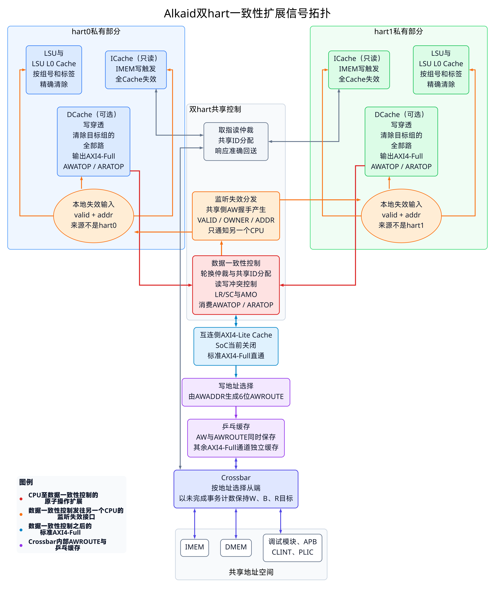

# Alkaid多核模式设计

## 1. 设计概述

Alkaid SoC（System on Chip，片上系统）支持单hart与双hart两种配置。双hart模式采用私有一级存储结构、共享存储器和集中式一致性控制：每个CPU保留独立的流水线、ICache、可选DCache与LSU L0 Cache，系统层负责AXI4-Full（Advanced eXtensible Interface 4 Full，第四代高级可扩展全功能接口）仲裁、跨核失效、原子操作和共享外设访问。当前设计不包含共享一级Cache或共享二级Cache；未来增加共享二级Cache时，可以保持CPU接口不变。

完整方案覆盖RTL、BSP（Board Support Package，板级支持包）、RT-Thread SMP（Symmetric Multiprocessing，对称多处理）端口、AMP（Asymmetric Multiprocessing，非对称多处理）启动服务和验证环境。核心保持`轻度乱序单发射、有限乱序完成`，Zba（Address Generation，地址生成）、Zbb（Basic Bit-Manipulation，基础位操作）、Zbs（Single-Bit Instructions，单比特操作）与Zbc（Carry-Less Multiplication，无进位乘法）仅作为ISA（Instruction Set Architecture，指令集架构）扩展使用，其中Zbc不作为核内微结构创新点。硬件也支持C（Compressed，压缩指令）扩展，但公平性能程序保持32位定长指令。

> [!NOTE]
> 单核与双核性能测试使用完全相同的编译参数、ISA、测试源码和迭代配置。硬件可以支持C压缩指令扩展，但公平性能程序没有生成压缩指令，以排除ISA差异对比较结果的影响。

## 2. 系统结构

### 2.1 层次职责

`core_top`是单个hart的正式顶层模块，内部包含CPU流水线、私有ICache、可选私有DCache、LSU L0 Cache接口和CLINT（Core-Local Interruptor，核心本地中断控制器）。`alkaid_soc_top`是SoC正式顶层模块，保留双hart共享功能，包括取指读仲裁、数据一致性控制、AXI4-Lite Cache与乒乓缓存、共享IMEM、共享数据存储和公共外设。

这种职责划分让单核配置与双核配置复用同一个`core_top`。hart编号、hart数量、Cache容量、流水线级数、RV32（32位RISC-V）或RV64（64位RISC-V）以及各ISA扩展均由参数确定。非法hart数量或不支持的组合在硬件展开时报告错误。

```text
hart0 core_top ── 私有ICache ──┐
                               ├─ 取指读仲裁 ── 共享IMEM
hart1 core_top ── 私有ICache ──┘

hart0 core_top ── 私有DCache/LSU L0 Cache ──┐
                                             ├─ 数据一致性控制 ── 共享存储与外设
hart1 core_top ── 私有DCache/LSU L0 Cache ──┘
```

### 2.2 私有与共享资源

每个hart具有独立PC（Program Counter，程序计数器）、GPR（General-Purpose Register，通用寄存器）、CSR（Control and Status Register，控制与状态寄存器）、流水线暂停状态、异常状态、ICache、LSU L0 Cache和栈。两个hart共享物理地址空间、IMEM、数据存储器、外设寄存器、全局时间计数与一致性控制。

本次双hart性能配置为每核私有2048项、2路ICache，取指侧允许4笔未完成读事务；每核私有DCache为1024项、2路，允许4笔未完成读事务；每核独立的LSU L0 Cache为64项、1路。两个CPU不共用同一个一级Cache。LSU L0 Cache用于吸收最常访问的数据，DCache用于保存更大的私有读数据集合，两级均采用写穿透方式，不保存需要回写的脏数据。

### 2.3 CLINT归属

每个`core_top`都包含CLINT控制功能。hart0内部的CLINT负责共享MMIO寄存器组，并输出各hart的软件中断和定时器中断；hart1接收属于自己的中断位，其CLINT MMIO请求保持无效。这样既把异常控制放在核内，又避免出现两套可写的共享时间寄存器。

## 3. 流水线组织

### 3.1 核心特征

CPU保持`轻度乱序单发射、有限乱序完成`。IFU（Instruction Fetch Unit，取指单元）一次提供一条指令，IDU（Instruction Decode Unit，译码单元）产生操作信息，IRS（Issue Reservation Station，发射保留站）保存等待执行的操作，EXU（Execution Unit，执行单元）完成计算，WBU（Write-Back Unit，写回单元）提交结果。HDU（数据冒险检查单元）负责检查数据冒险，并依据流水线级数选择紧凑比较或近期commit id跟踪。

BPU（Branch Prediction Unit，分支预测单元）提供预测方向与目标，BJP（Branch and Jump Processing，分支跳转处理单元）给出已解析的控制流请求和有效目标。CLINT使用这两项结果确定可靠的下一条PC，不再增加一套重复的指令类型解码。

### 3.2 P3、P4与P5

下表使用IF（Instruction Fetch，取指）、ID（Instruction Decode，译码）、Dispatch（发射准备）、EX（Execution，执行）和WB（Write Back，写回）表示各阶段职责。

| 配置 | 阶段划分 | 主要流水线寄存器 | IRS容量 | 数据冒险处理 | 适用重点 |
| --- | --- | --- | ---: | --- | --- |
| P3 | IF；ID、Dispatch与EX；WB | `ifu_pipe`；WBU结果寄存器 | 1项 | HDU执行4组紧凑比较，不使用EXU局部旁路 | 低延迟与较小面积 |
| P4 | IF；ID与Dispatch；EX；WB | `ifu_pipe`；`dispatch_pipe`；WBU结果寄存器 | 3项 | 近期commit id表与局部旁路 | 面积和频率平衡 |
| P5 | IF；ID；Dispatch；EX；WB | `ifu_pipe`；`idu_id_pipe`；`dispatch_pipe`；WBU结果寄存器 | 3项 | 近期commit id表与局部旁路 | 更清晰的时序分隔 |

`ifu_pipe`和WBU结果寄存器在三种配置中始终存在。`idu_id_pipe`只用于P5数据通路；`dispatch_pipe`在P4与P5中形成流水线寄存级，在P3中直接通过。P3用更短的数据通路减少等待，P4与P5用更多寄存级改善时序收敛。

```systemverilog
if (PIPELINE_STAGES == 5) begin
    id_to_dispatch = idu_id_pipe;
end else begin
    id_to_dispatch = idu_result;
end

if (PIPELINE_STAGES >= 4) begin
    exu_request = dispatch_pipe;
end else begin
    exu_request = dispatch_result;
end
```

### 3.3 固定宽度取指

IFU在硬件支持C扩展时仍保留固定宽度快速取指。对已经确认的32位指令流，取指继续使用早期预测和普通发出条件；只有遇到16位指令或跨32位取指字的指令时，才进入半字拼接处理。这样使支持C扩展的硬件不会让未使用压缩指令的软件承担明显额外等待。

### 3.4 控制流与异常进入

中断请求到达时，CLINT不能仅使用当前取指PC，因为BJP可能正在更正下一条PC。控制逻辑等待BJP请求可确认后再保存`mepc`，并在原子操作或存储操作繁忙时推迟异常进入。这能避免把中断插入原子指令序列中间。

## 4. 存储接口

### 4.1 AXI4-Full接口

取指接口和一致性控制之后的共享数据接口采用AXI4-Full，地址宽度为32位，数据宽度跟随XLEN（整数寄存器宽度），当前性能配置为32位，ID（Identifier，标识号）宽度为2位。标准接口保留`ID`、`LEN`、`SIZE`、`BURST`、`LOCK`、`CACHE`、`PROT`、`QOS`与`LAST`。CPU与一致性控制之间的数据接口还带有第4.2节说明的内部扩展字段，因此该段接口应称为“AXI4-Full加Alkaid内部扩展”，不能作为纯AXI4-Full接口直接连接通用AXI模块。

AXI4-Lite Cache用于优化普通单拍访问，乒乓缓存用于保存暂停期间的完整通道内容。两者均保留AXI4-Full控制字段；突发访问和排他访问从Cache查找旁路通过，错误响应保持原值返回CPU。内部原子扩展的旁路行为在第4.2节单独说明。

AXI4-Full的五个独立通道分别为AW（Write Address，写地址）、W（Write Data，写数据）、B（Write Response，写响应）、AR（Read Address，读地址）和R（Read Data，读数据）。各通道只在自身`VALID`与`READY`同时为1时完成一次握手。

`AWLOCK`、`ARLOCK`、`EXOKAY`和`OKAY`均属于标准AXI4排他访问机制。AXI4中的`AWLOCK`或`ARLOCK`置1表示排他访问，不表示锁住总线，也不禁止其他hart访问所有地址。排他读成功时返回`EXOKAY`；排他写只有在排他监视检查成功并实际完成写入时返回`EXOKAY`，检查失败时返回`OKAY`且不得更新目标地址。

本文涉及三类容易混淆的“锁”。软件自旋锁是共享存储中的一个状态字，CPU通过原子交换或LR/SC竞争该状态字，只有成功的CPU进入临界区；AXI4的`LOCK`字段只是排他访问属性，由排他监视判断条件写是否成立，不会锁住整条总线；数据一致性控制中的AMO互斥状态是硬件内部调度状态，在一笔AMO的读改写期间阻止会破坏原子性的请求，不是软件可以直接读取的锁。三者的作用位置和持续时间不同，不能相互替代。

### 4.2 Alkaid内部一致性扩展

Alkaid内部一致性扩展是面向当前双hart、写穿透私有Cache结构设计的紧凑协议。这里使用“设计前提”，不使用容易产生理论含义误解的“公理”。协议依赖三项设计前提：私有DCache和LSU L0 Cache不保存需要回写的脏数据；两个CPU的数据访问统一经过数据一致性控制；共享数据由存储器返回，不进行Cache间数据传送。在这些前提下，写操作只需进入共享存储，同时通知另一个CPU清除旧副本。

该协议不等同于ACE（AXI Coherency Extensions，AXI一致性扩展）。它没有ACE的AC（Snoop Address，监听地址）、CR（Snoop Response，监听响应）和CD（Snoop Data，监听数据）通道，不查询私有Cache状态，不接收Cache数据，也没有监听响应。当前扩展完成的功能是原子操作标记、LR（Load-Reserved，保留读）/SC（Store-Conditional，条件写）保留监视、AMO（Atomic Memory Operation，原子存储器操作）互斥、重叠读写控制和写地址驱动的跨hart失效。

#### 4.2.1 接口组成

CPU数据接口在AXI4-Full五通道之外增加`AWATOP`和`ARATOP`。`AWATOP`沿用AW Atomic Operation（AW通道原子操作）的名称，`ARATOP`按内部AR Atomic Operation（AR通道原子操作）命名。数据一致性控制消费这两个字段，并在共享侧AW握手时产生`SNOOP_INVALIDATE_VALID`、`SNOOP_INVALIDATE_OWNER`和`SNOOP_INVALIDATE_ADDR`。`AWROUTE`与Cache旁路字段虽然也是内部扩展，但不属于一致性协议：前者保存从端选择结果，后者只决定是否使用普通Cache处理。

| 类别 | 信号 | 是否属于AXI4-Full | 产生位置 | 消费位置 | 作用 |
| --- | --- | --- | --- | --- | --- |
| 标准排他访问 | `AWLOCK`、`ARLOCK`、`BRESP`、`RRESP` | 是 | CPU或从设备 | Cache、数据一致性控制和共享从设备 | 实现AXI4排他访问 |
| 原子操作扩展 | `AWATOP`、`ARATOP` | 否 | LSU | 私有DCache和数据一致性控制 | 标记LR、SC和AMO阶段 |
| 监听失效扩展 | `SNOOP_INVALIDATE_VALID`、`SNOOP_INVALIDATE_OWNER`、`SNOOP_INVALIDATE_ADDR` | 否 | 数据一致性控制 | SoC级来源选择和另一个CPU的私有Cache | 通知另一个CPU清除写地址对应的旧副本 |
| 写地址选择字段 | `S_AXI_AWROUTE`、`M_AXI_AWROUTE` | 否 | Crossbar地址选择逻辑 | 乒乓缓存和Crossbar响应选择逻辑 | 保持AW与从端选择结果同步 |
| Cache旁路控制 | `S_AXI_AW_BYPASS`、`S_AXI_AR_BYPASS` | 否 | AXI4-Lite Cache封装 | Cache控制逻辑 | 跳过普通单拍Cache处理 |



可编辑图源：[draw.io工程](./_media/alkaid_multicore/alkaid_coherence_signal_topology.drawio)。

图中的一条粗线用于概括一组相关信号，不表示只有一个物理信号。灰色取指连接同时包含向共享侧发送的AR（Read Address，读地址）通道和向ICache返回的R（Read Data，读数据）通道，因此在draw.io工程中使用双向箭头。红色箭头只强调CPU数据接口送往数据一致性控制的原子操作扩展字段，不代表完整AXI4-Full接口只有单向传输。橙色箭头表示数据一致性控制产生的单向监听失效事件。蓝色接口从数据一致性控制之后恢复为标准AXI4-Full。Crossbar不接收`AWATOP`、`ARATOP`或监听失效信号。

#### 4.2.2 拓扑图连接说明

拓扑图中的模块文字描述模块自身完成的处理，连接线描述模块之间传递的请求、响应或控制事件，两者不能连读为一句话。例如，“ICache（只读）、IMEM写触发、全Cache失效”描述ICache的访问属性和失效条件；ICache与取指读仲裁之间的灰色连接描述取指未命中请求及其读响应。这条灰色连接不负责触发ICache失效。

| 连接 | 传递内容 | 连接含义 |
| --- | --- | --- |
| 每个ICache与取指读仲裁之间的灰色双向连接 | AXI4-Full的AR与R通道 | ICache命中时在CPU内部直接返回指令；未命中、回填或预取需要访问IMEM时，ICache发送AR请求，R响应沿原连接返回ICache。关闭ICache时，每次取指读都经过该连接。 |
| 取指读仲裁与Crossbar之间的灰色双向连接 | 合并后的M0只读AXI4-Full接口 | 取指读仲裁每周期至多选择一个hart的AR请求，分配空闲共享侧ID并记录来源hart与原始本地ID；Crossbar返回R响应后，仲裁器根据共享侧`RID`把响应送回对应hart并恢复原始本地ID。 |
| Crossbar与IMEM之间的双向连接 | M0取指读以及M1数据侧对IMEM的读写 | M0只允许访问IMEM。M0与M1同时请求IMEM读端时，M1数据访问优先；IMEM的读响应再返回获得授权的主端。 |
| Crossbar与DMEM（Data Memory，数据存储器）、调试模块、APB（Advanced Peripheral Bus，高级外设总线）、CLINT和PLIC（Platform-Level Interrupt Controller，平台级中断控制器）之间的双向连接 | M1数据侧AXI4-Full请求与响应 | Crossbar根据M1地址选择一个共享从端。取指使用的M0不能通过该连接访问这些从端。 |
| 每个DCache指向数据一致性控制的红色连接 | `AWATOP`、`ARATOP`及与原子操作相关的CPU侧请求信息 | 红色只突出Alkaid内部原子操作扩展。标准AW、W、B、AR和R通道仍同时存在，其中B和R响应返回CPU。 |
| 数据一致性控制经监听失效分发到本地失效输入的橙色连接 | `SNOOP_INVALIDATE_VALID`、`SNOOP_INVALIDATE_OWNER`和`SNOOP_INVALIDATE_ADDR` | 数据一致性控制在共享侧AW握手时产生事件，SoC只把事件送往写请求来源之外的另一个CPU。接收CPU再按地址决定ICache、DCache和LSU L0 Cache的处理。 |
| 数据一致性控制、AXI4-Lite Cache与乒乓缓存、Crossbar之间的蓝色和紫色连接 | 标准AXI4-Full，以及Crossbar内部使用的`AWROUTE` | 互连侧共享Cache当前关闭，CPU私有DCache保持开启；标准通道经过M1乒乓缓存后进入Crossbar。`AWROUTE`只与AW一起经过乒乓缓存，用于保存写地址选择结果，不会传入共享从设备。 |

“ICache（只读）”表示该Cache只保存取指读取得的数据，不设置CPU写通道；它不表示IMEM不能被数据接口写入。CPU可以通过数据侧访问修改IMEM。当前私有ICache有两个全Cache失效来源：本hart的数据侧AW请求被接受且地址位于IMEM，以及另一个hart的IMEM写地址被共享侧接受后送来的监听失效事件。任一条件成立都会清除该hart全部ICache项的有效状态。“全Cache失效”不会修改IMEM内容，也不表示每次IMEM读都会清除ICache。图中橙色箭头只画出另一个hart写入所产生的监听事件，本hart写IMEM的检测在CPU内部完成。

“取指读仲裁、共享ID分配、响应准确回送”描述同一笔取指未命中事务的三个阶段。两个hart同时给出`ARVALID`时，仲裁器按轮换次序选择一个请求；存在空闲记录时，以编号最小的空闲记录号作为共享侧`ARID`，并在该记录中保存来源hart和CPU原始`ARID`。共享侧返回`RID`后，该值直接选中对应记录，记录中的来源hart决定哪一路`RVALID`置1，保存的原始ID作为返回给该hart的`RID`。最后一拍完成握手后释放记录。当前ID宽度为2位，所以两个hart合计最多保留4笔取指读事务；记录占满时停止接受新的AR请求。

“Crossbar按地址选择从端”表示Crossbar检查请求地址属于IMEM、DMEM、调试模块、APB、CLINT还是PLIC。对于取指读仲裁输出的M0接口，合法目标只有IMEM；对于数据一致性控制输出的M1接口，目标由地址决定。Crossbar不会再次判断请求来自hart0还是hart1：取指响应的hart选择由取指读仲裁完成，数据响应的hart选择由数据一致性控制完成。

“以未完成事务计数保持W、B、R目标”用于解决AXI4-Full各通道相互独立带来的从端选择问题。W通道本身没有地址，因此Crossbar必须记住先前已接受的AW选择了哪个从端；B响应和R响应返回时，也必须选择此前接受写地址或读地址的从端。Crossbar分别统计各从端尚未完成的W、B和R事务，并保持相应从端选择，直到W最后一拍、B响应或R最后一拍完成握手。M1已经有未完成事务时，只允许相同从端继续接受同类地址请求，因此同一从端可以保留多笔事务，不会在响应尚未结束时切换到另一个从端。这些计数解决的是共享从端选择，不替代取指读仲裁和数据一致性控制中的共享侧ID记录。

一次取指未命中的完整过程如下：ICache先向取指读仲裁发送AR请求；仲裁器选择一个hart、分配共享侧ID并保存来源信息；Crossbar把M0请求送到IMEM；IMEM以相同共享侧ID返回R响应；Crossbar把响应返回M0；仲裁器恢复来源hart和原始本地ID；ICache接收数据并完成回填。若指令已经在ICache中命中，则上述共享访问不会发生。IMEM写入引起的ICache失效是另一项独立控制处理，不经过灰色取指连接。

#### 4.2.3 原子操作字段

`AWATOP`表示写阶段的内部原子操作类型，仅在`AWVALID=1`时有效；`ARATOP`表示读阶段的内部原子操作类型，仅在`ARVALID=1`时有效。`READY=0`期间，相应字段必须与同通道地址和控制字段保持不变。普通访问将字段置0；字段非零时，私有DCache跳过普通命中、填充和本地更新过程，请求继续进入数据一致性控制。

需要特别区分Alkaid的4位`AWATOP`与AMBA 5（Advanced Microcontroller Bus Architecture 5，第五代高级微控制器总线架构）定义的`AWATOP[5:0]`。AMBA 5原子事务只增加6位`AWATOP`，原子请求从AW通道发出；Alkaid使用自定义4位编码，并增加`ARATOP`以标记本地读改写过程的读阶段。两者的位宽、编码和事务组织均不兼容，当前接口不能声明为AXI5（Advanced eXtensible Interface 5，第五代高级可扩展接口）原子事务接口。标准定义参考[AMBA AXI and ACE Protocol Specification](https://developer.arm.com/-/media/Arm%20Developer%20Community/PDF/IHI0022H_amba_axi_protocol_spec.pdf)。

| 编码 | 操作 | 有效通道 | 数据一致性控制处理 |
| ---: | --- | --- | --- |
| 0 | 普通访问 | AW或AR | 不启动原子控制 |
| 1 | LR | AR | 保存来源hart和8字节粒度保留地址 |
| 2 | SC | AW | 检查本hart保留状态；成功时发出写请求，失败时禁止共享侧写入并在CPU侧产生B响应 |
| 3 | AMOSWAP | 先AR、后AW | 从读请求被接受起保持AMO互斥，写响应结束后解除 |
| 4 | AMOADD | 先AR、后AW | 同上 |
| 5 | AMOXOR | 先AR、后AW | 同上 |
| 6 | AMOAND | 先AR、后AW | 同上 |
| 7 | AMOOR | 先AR、后AW | 同上 |
| 8 | AMOMIN | 先AR、后AW | 同上 |
| 9 | AMOMAX | 先AR、后AW | 同上 |
| 10 | AMOMINU | 先AR、后AW | 同上 |
| 11 | AMOMAXU | 先AR、后AW | 同上 |
| 12至15 | 未分配 | 无 | CPU正常执行过程不会产生；接口集成时保持不用 |

AMO由LSU先发出带`ARATOP`的读请求，取得旧值并计算新值，再发出带同一操作编码的`AWATOP`写请求。数据一致性控制在读阶段开始后阻止另一个hart进入原子过程，并在对应写响应完成后结束AMO互斥。LR只使用`ARATOP=1`，SC只使用`AWATOP=2`。`AWLOCK`和`ARLOCK`继续传递标准排他属性，但仅凭这两个标准字段不能区分LR、SC和各类AMO。

双hart模式下，数据一致性控制在完成原子处理后不再向共享侧输出`AWATOP`和`ARATOP`，Crossbar与共享从设备只接收标准AXI4-Full。单hart模式由LSU本地完成LR/SC保留检查和AMO读改写；内部字段仍可在CPU和私有DCache之间传递，也不会进入共享从设备。

#### 4.2.4 监听失效信号

监听失效接口独立于AXI4-Full五个通道，不带`READY`，也没有接收确认或重试。三个信号必须在同一周期使用。

| 信号 | 方向 | 位宽 | 含义 | 有效条件 | 暂停、错误与复位行为 |
| --- | --- | ---: | --- | --- | --- |
| `SNOOP_INVALIDATE_VALID` | 数据一致性控制输出 | 1位 | 指示本周期出现一笔需要通知另一个CPU的写地址 | 共享侧`AWVALID && AWREADY` | 不支持暂停和重试；复位期间没有有效AW握手时为0 |
| `SNOOP_INVALIDATE_OWNER` | 数据一致性控制输出 | 1位 | 指示写地址来自hart0还是hart1 | `SNOOP_INVALIDATE_VALID=1` | 仅与有效信号同周期使用；复位期间不单独解释其值 |
| `SNOOP_INVALIDATE_ADDR` | 数据一致性控制输出 | 32位 | 给出本次已接受的`AWADDR` | `SNOOP_INVALIDATE_VALID=1` | 仅与有效信号同周期使用；不携带突发长度、每拍大小、突发类型或写字节使能 |

`SNOOP_INVALIDATE_OWNER`名称中的`OWNER`仅表示本次写地址的来源hart，不表示Cache项归属，也不授予互斥访问权。SoC级来源选择消费该位，CPU本地失效接口只保留有效信号和地址，因此私有Cache不需要再次判断来源hart。

使用过程如下：数据一致性控制先固定本笔写请求的来源hart、共享侧ID以及AW和W完成状态；共享侧AW握手时写事务记录变为有效，同时产生监听失效事件；SoC级来源选择根据`SNOOP_INVALIDATE_OWNER`只向另一个CPU输出本地失效有效信号和地址；接收CPU按地址区域分别处理ICache、DCache与LSU L0 Cache；后续W握手和B响应仍按AXI4-Full独立进行。写请求仅被选择、仅完成CPU侧AW握手或仅完成W握手时，都不会产生监听失效事件。

当前数据一致性控制、SoC级来源选择和两个CPU使用同一系统时钟，接收端每周期都能够采样失效事件。若以后跨时钟集成，单周期`VALID`脉冲不能直接跨时钟传递，需要先转换为带接收确认的事件队列，并保证来源hart与地址和每一个有效事件同步保存。

监听事件在AW被接受时发生，早于B响应。即使后续写响应为`SLVERR`或`DECERR`，另一个CPU已经清除的Cache状态也不会恢复；这种保守处理只会增加后续重新读取，不会把失败写入的数据当作有效数据。失败SC不会向共享侧发出AW，因此不会产生监听事件；成功SC、AMO写阶段和普通写均按共享侧AW握手产生事件。无论`WSTRB`选择几个字节，接收方均清除包含该地址的完整数据总线字对应状态。

数据一致性控制对所有共享侧写地址产生事件，接收方再按IMEM或DTCM（Data Tightly Coupled Memory，数据紧耦合存储器）地址范围决定是否处理。`SNOOP_INVALIDATE_ADDR`只描述一个起始地址。当前LSU固定产生自然对齐的单拍事务，`AWLEN=0`，因此一个事件覆盖当前CPU能够写入的一个数据总线字。若以后在数据一致性控制之前加入可产生多拍写的主设备，单个起始地址不能覆盖整个突发；集成方案需要为每个受影响的Cache项产生失效事件，或增加长度、大小和突发类型字段，或让对应共享地址范围不进入私有Cache。

#### 4.2.5 写地址选择字段

`S_AXI_AWROUTE`和`M_AXI_AWROUTE`是Crossbar内部使用的6位写地址选择字段，不属于AXI4-Full，也不属于一致性协议。Crossbar在AW进入乒乓缓存前根据`AWADDR`生成该字段，位0至位5依次代表IMEM、DMEM（Data Memory，数据存储器）、调试模块、APB（Advanced Peripheral Bus，高级外设总线）、CLINT和PLIC（Platform-Level Interrupt Controller，平台级中断控制器）。该字段为独热值，与同一笔AW请求一起保存在弹性寄存器中；AW暂停时保持不变。

开启写通道寄存级后，`M_AXI_AWROUTE`用于恢复首次AW的从端选择结果。Crossbar在从端接受AW后分别记录等待W和等待B的事务数，并在这些事务结束前只允许同一从端继续接受新AW。W通道依据等待W的从端选择发送，B通道依据等待B的从端选择返回；同一从端可以保留多笔未完成写事务，不同从端不会同时处于未完成写状态。`AWROUTE`不是B响应的事务ID，也不替代`AWID`或`BID`。

设计没有增加`ARROUTE`或`WROUTE`。读侧同样在存在未完成读事务时只允许相同从端继续接受AR，并通过从端选择状态和计数选择R响应。W通道目标来自已经接受的AW。未开启乒乓寄存级时，Crossbar直接使用当前地址选择和已保存状态，不依赖`AWROUTE`完成响应选择。

#### 4.2.6 Cache旁路字段

`S_AXI_AW_BYPASS`和`S_AXI_AR_BYPASS`是AXI4-Lite Cache内部控制信号，不属于CPU接口、共享侧接口或一致性协议。写请求满足`AWLOCK=1`、`AWLEN`非零或`AWATOP`非零中的任一条件时，`S_AXI_AW_BYPASS`置1；读请求满足`ARLOCK=1`、`ARLEN`非零或`ARATOP`非零中的任一条件时，`S_AXI_AR_BYPASS`置1。Cache控制逻辑据此跳过普通单拍Cache处理，并保持请求字段不变地发出访问。

### 4.3 取指读仲裁

`axi_dual_read_arbiter`合并两个hart的AR与R通道。当前`ID_WIDTH=2`，因此共享侧ID取值为0至3，对应4项读事务记录。共享侧ID直接作为记录表下标，不是将hart编号与CPU侧本地ID拼接。每项有效记录保存来源hart和该hart发出请求时的本地`ARID`，使两个hart即使使用相同本地ID，也能通过不同的共享侧ID同时保留请求。

#### 4.3.1 请求选择

仲裁器先检查两个hart的`ARVALID`。只有一个hart请求时直接选择该hart；两个hart同时请求时选择上一次成功获得服务的另一个hart。复位后保存的上次选择值为hart1，因此复位后的第一次双请求选择hart0。只有共享侧AR通道完成`ARVALID && ARREADY`握手后，仲裁器才更新上次选择值，未被共享侧接受的请求不会改变下一次双请求的优先次序。

仲裁器每周期最多向共享侧发送一笔AR请求。存在空闲记录且至少一个hart提出请求时，共享侧`ARVALID`才为1；只有被选hart能够看到`ARREADY=1`。共享侧未准备好或4项记录全部有效时，两个hart的`ARREADY`都保持为0，请求hart必须继续保持`ARID`、地址和其他AR控制字段。

#### 4.3.2 ID分配

空闲记录选择采用从0到3的固定顺序扫描，选择编号最小的无效项。共享侧`ARID`等于该记录编号。记录只在共享侧AR握手时写入，保存内容为有效位、来源hart和原始本地`ARID`；仅出现`ARVALID`而没有完成握手时，不占用记录。

| 步骤 | CPU侧请求或共享侧响应 | 使用的共享侧ID | 记录内容或处理结果 |
| ---: | --- | ---: | --- |
| 1 | hart0以本地`ARID=2`发出请求 | 0 | 记录0保存hart0和本地ID 2 |
| 2 | hart1也以本地`ARID=2`发出请求 | 1 | 记录1保存hart1和本地ID 2 |
| 3 | 共享侧先返回`RID=1` | 1 | 查记录1，将响应送给hart1，并恢复`RID=2` |
| 4 | 共享侧随后返回`RID=0` | 0 | 查记录0，将响应送给hart0，并恢复`RID=2` |

该例说明，共享侧ID的作用是唯一标识当前仍未结束的共享读事务；CPU侧ID只在请求进入时保存，在响应回送时恢复。两个ID字段宽度虽然相同，但请求经过仲裁后数值不必相同。

#### 4.3.3 响应回送

共享侧返回`RVALID`时，仲裁器以`RID`读取对应记录。记录有效时，来源hart决定哪一路CPU侧`RVALID`置1，原始本地ID作为该路CPU侧`RID`，`RDATA`、`RRESP`和`RLAST`保持共享侧返回值。另一个hart的`RVALID`保持为0，因此不会接收不属于自己的响应。

共享侧`RREADY`取自响应所属hart的`RREADY`。如果该hart暂停接收，仲裁器同时阻止共享侧完成R握手，响应字段按照AXI4规则保持不变。若共享侧给出的`RID`没有对应有效记录，仲裁器不会向任一hart给出`RVALID`，同时保持共享侧`RREADY=0`，避免错误响应被送入CPU；验证环境应将这种情况报告为AXI协议错误。

突发读的所有返回拍使用同一个共享侧`RID`。中间拍完成握手后仍保留记录，只有最后一拍完成`RVALID && RREADY && RLAST`握手时才释放记录，因此每一拍都使用同一来源hart和本地ID。

#### 4.3.4 未完成事务

4项记录允许两个hart合计保留4笔未完成事务（outstanding）。只要仍有空闲记录且共享侧能够接收，仲裁器就可以继续接受新AR请求，不需要等待较早请求返回。不同共享侧ID的响应可以采用不同于请求发出次序的返回次序，记录表仍能恢复正确的来源hart和本地ID。

同一hart对同一本地ID连续发出的多笔请求仍须遵守AXI4的同ID顺序规则。当前记录表负责来源hart和本地ID的恢复，不对同一hart、同一本地ID的多笔响应再次排序。因此，任意次序返回能力适用于不同的“来源hart与本地ID”组合；若从设备可能打乱同一组合的返回次序，系统还需要在共享侧保证该组合按请求次序返回。

### 4.4 数据一致性控制

`axi_dual_coherency_manager`合并两个hart的数据读写请求，并分别设置4项读事务记录和4项写事务记录。该模块同时是内部一致性扩展的集中处理点：它消费`AWATOP`与`ARATOP`，维护LR/SC保留状态和AMO互斥状态，阻止与未完成写重叠的读请求，并在共享侧接受写地址时产生监听失效事件。读表与写表相互独立，因此数值相同的共享侧读ID和写ID可以同时有效；R通道只查询读表，B通道只查询写表，不会相互混淆。

#### 4.4.1 读请求仲裁

数据读请求使用与取指读相同的双hart轮换方法和共享侧ID分配方法。共享侧AR握手时，读表在`ARID`指定的记录中保存来源hart和原始本地`ARID`；共享侧R响应通过`RID`查询读表，恢复来源hart和本地ID；最后一拍R响应握手后释放记录。

进入轮换选择前，控制逻辑先判断请求是否允许读取。每笔读请求根据`ARADDR`、`ARLEN`和`ARSIZE`计算起始与结束的8字节区域，并与两个hart当前有效的AW请求以及全部未结束写记录进行比较。范围重叠的读请求暂不参加本周期仲裁，无重叠的读请求仍可发出。LR和AMO还需满足第6章所述的写事务与原子互斥条件。

#### 4.4.2 写请求仲裁

写仲裁以`AWVALID`判断两个hart是否提出写请求。只有一个hart请求时直接选择该hart；两个hart同时请求时选择上一次写选择的另一个hart。开始选择新写请求还要求当前没有正在补齐AW或W握手的写请求、没有等待CPU接收的内部写响应，并且写表存在空闲记录。

写表的空闲记录同样按照编号0至3的顺序选择，编号最小的无效项作为下一笔写请求的共享侧ID，共享侧`AWID`等于该编号。AXI4的AW与W通道相互独立，W通道没有事务ID。控制逻辑选定hart后，保存来源hart、拟使用的共享侧ID、原始本地`AWID`以及AW和W各自是否已经握手。在当前写请求的AW与W均完成握手前，选择结果保持不变，另一个hart不能插入W数据。AW先完成时继续等待当前hart的W；W先完成时继续等待当前hart的AW；两个通道同周期完成时无需增加等待周期。即使W早于AW完成握手，当前选择也会独占拟使用的共享侧ID，其他写请求不能重复使用该编号。

共享侧AW握手时，共享侧`AWID`指定的写记录变为有效。该记录保存来源hart、原始本地`AWID`、是否为成功SC、是否属于AMO，以及根据`AWADDR`、`AWLEN`和`AWSIZE`计算出的起始与结束8字节区域。写记录一直保留到B响应完成握手。在当前请求的AW与W都已被接受后，即使较早请求的B响应尚未返回，仲裁器也可以选择下一笔写请求，因此普通写可以连续发出并形成多笔未完成写事务。

#### 4.4.3 写响应回送

共享侧返回`BVALID`时，控制逻辑以`BID`查询写表，得到来源hart和原始本地`AWID`。只有来源hart的CPU侧`BVALID`置1，CPU侧`BID`恢复为原始本地ID，`BRESP`保持共享侧结果；成功SC按照第6章的规则返回`EXOKAY`。共享侧`BREADY`取自来源hart的`BREADY`，所以CPU暂停接收时不会提前释放写记录。只有`BVALID && BREADY`握手完成后，`BID`对应的写记录才变为空闲。

SC条件不成立时，请求不会发送到共享侧。控制逻辑在CPU侧产生内部B响应，直接使用已保存的来源hart和本地`AWID`，不占用共享侧写记录。该响应同样等待对应hart给出`BREADY`后结束。

共享侧AW握手同时产生监听失效事件，携带来源hart和写地址。系统只把事件送给另一个hart，接收CPU按第5章说明的方式分别处理ICache、DCache和LSU L0 Cache。监听失效以共享侧真正接受写地址为准，不会因仅选择了写请求或仅完成W握手而提前发生。

#### 4.4.4 未完成事务容量

| 通道 | 记录数量 | 分配时机 | 释放时机 | 允许的返回次序 |
| --- | ---: | --- | --- | --- |
| 取指读 | 4项 | 共享侧AR握手 | 最后一拍R握手 | 不同来源hart与本地ID组合之间可以改变次序 |
| 数据读 | 4项 | 共享侧AR握手 | 最后一拍R握手 | 不同来源hart与本地ID组合之间可以改变次序 |
| 数据写 | 4项 | 共享侧AW握手 | B握手 | 不同来源hart与本地ID组合之间可以改变次序 |
| 失败SC | 不占用共享记录 | CPU侧AW与W均被接受 | 内部B握手 | 只返回发起SC的hart |

普通访问最多可以同时保留4笔数据读事务和4笔数据写事务。读写表使用独立有效位，即使读表和写表都使用共享侧ID 0，也能分别通过`RID`和`BID`找到正确记录。写请求处理中只允许一笔请求处于AW或W尚未完成的状态，这是因为AXI4的W通道不携带ID；已经完成AW与W握手、仅等待B响应的写请求可以有多笔。

#### 4.4.5 一致性处理时序

以下时序以hart0写共享DTCM、hart1随后读取相同数据总线字为例。ICache只在写地址属于IMEM时参与，处理方式见第5.1节。

| 阶段 | 数据一致性控制 | hart0私有Cache | hart1私有Cache | 共享侧状态 |
| --- | --- | --- | --- | --- |
| 写请求进入 | 轮换选择hart0，固定共享侧ID并分别等待AW和W | DCache按写穿透方式发出写请求；原子、排他或突发旁路写在CPU侧AW被接受时登记本地目标组清除；LSU L0 Cache记录本地写影响 | 保持原状态 | 尚未接受写地址 |
| 共享侧AW握手 | 分配写事务记录，同时输出`SNOOP_INVALIDATE_VALID=1`、来源hart和`AWADDR` | 不接收本次跨hart事件 | DCache当拍禁止使用冲突组的命中，LSU L0 Cache当拍禁止使用同地址命中，并更新有效位 | 写地址已经接受，W和B仍可继续等待 |
| 写响应返回前 | 使用写事务记录阻止与该写范围重叠的共享读请求 | 等待本地写结果 | 被清除的访问重新进入共享读流程；未完成Cache填充不得把旧值重新写入有效状态 | W可独立握手，B尚未返回 |
| B响应握手 | 通过`BID`查写表，恢复来源hart和本地`AWID`，随后释放记录 | 普通成功写按字节使能更新本地DCache；旁路写的目标组保持已清除状态 | 保持失效状态，后续读从共享存储取得数据 | 写事务结束 |

监听失效与读写范围阻止承担不同职责。监听失效清除另一个CPU已有的私有副本；读写范围阻止保证该CPU失效后的重新读取不会在较早写响应结束前进入共享侧。两者共同避免另一个CPU继续读到旧数据。

### 4.5 标准AXI4关键端口

下表以CPU侧面向一致性控制的接口为准。每个信号单独一行；数组形式信号的位宽还需乘以hart数量。

| 信号 | 方向 | 位宽 | 功能 | 有效条件 | 暂停、错误与复位行为 |
| --- | --- | ---: | --- | --- | --- |
| `AWID` | CPU输出 | 2位 | 写事务本地ID | `AWVALID=1` | `AWREADY=0`时保持；复位后无待处理请求 |
| `AWADDR` | CPU输出 | 32位 | 写起始地址 | `AWVALID=1` | 暂停时保持；地址错误由`BRESP`报告 |
| `AWLEN` | CPU输出 | 8位 | 写突发拍数减一 | `AWVALID=1` | 暂停时保持；与`WLAST`不一致时报告协议错误 |
| `AWSIZE` | CPU输出 | 3位 | 每拍字节数 | `AWVALID=1` | 暂停时保持；不支持的大小返回错误 |
| `AWBURST` | CPU输出 | 2位 | 写突发类型 | `AWVALID=1` | 暂停时保持；不支持的类型返回错误 |
| `AWLOCK` | CPU输出 | 1位 | 标记排他写 | `AWVALID=1` | 暂停时保持，并穿过仲裁与Cache旁路 |
| `AWCACHE` | CPU输出 | 4位 | 写Cache属性 | `AWVALID=1` | 暂停时保持；复位后清零 |
| `AWPROT` | CPU输出 | 3位 | 写保护属性 | `AWVALID=1` | 暂停时保持；从设备按属性检查访问 |
| `AWQOS` | CPU输出 | 4位 | 写服务等级 | `AWVALID=1` | 暂停时保持；不参与响应成功判断 |
| `AWVALID` | CPU输出 | 1位 | 指示写地址有效 | 高电平有效 | 等待`AWREADY`期间保持为1；复位后清零 |
| `AWREADY` | CPU输入 | 1位 | 接受被选hart的写地址 | 与`AWVALID`同时为1时握手 | 写表已满、另一笔写请求正在等待AW或W、原子互斥或共享侧暂停时拉低；复位期间拉低 |
| `WDATA` | CPU输出 | XLEN位 | 写数据 | `WVALID=1` | `WREADY=0`时保持；错误由写响应报告 |
| `WSTRB` | CPU输出 | XLEN/8位 | 写字节使能 | `WVALID=1` | 暂停时保持；无效组合不更改未选字节 |
| `WLAST` | CPU输出 | 1位 | 标记写突发最后一拍 | `WVALID=1` | 暂停时保持；最后一拍握手后结束写数据 |
| `WVALID` | CPU输出 | 1位 | 指示写数据有效 | 高电平有效 | 等待`WREADY`期间保持为1；复位后清零 |
| `WREADY` | CPU输入 | 1位 | 接受被选hart的写数据 | 与`WVALID`同时为1时握手 | 仅向当前写请求所属hart开放；当前W已握手、无已选写请求或共享侧暂停时拉低；复位期间拉低 |
| `BID` | CPU输入 | 2位 | 返回原始写事务ID | `BVALID=1` | `BREADY=0`时保持；共享侧ID无有效记录时不回送CPU并阻止共享侧握手 |
| `BRESP` | CPU输入 | 2位 | 返回写结果 | `BVALID=1` | `SLVERR`与`DECERR`保持为错误；条件写成功可返回`EXOKAY` |
| `BVALID` | CPU输入 | 1位 | 指示写响应有效 | 高电平有效 | 等待`BREADY`期间保持响应；复位后清零 |
| `BREADY` | CPU输出 | 1位 | 接受写响应 | 与`BVALID`同时为1时握手 | CPU暂停时可拉低；复位后清零 |
| `ARID` | CPU输出 | 2位 | 读事务本地ID | `ARVALID=1` | `ARREADY=0`时保持；复位后无待处理请求 |
| `ARADDR` | CPU输出 | 32位 | 读起始地址 | `ARVALID=1` | 暂停时保持；地址错误由`RRESP`报告 |
| `ARLEN` | CPU输出 | 8位 | 读突发拍数减一 | `ARVALID=1` | 暂停时保持；返回拍数与`RLAST`一致 |
| `ARSIZE` | CPU输出 | 3位 | 每拍字节数 | `ARVALID=1` | 暂停时保持；不支持的大小返回错误 |
| `ARBURST` | CPU输出 | 2位 | 读突发类型 | `ARVALID=1` | 暂停时保持；不支持的类型返回错误 |
| `ARLOCK` | CPU输出 | 1位 | 标记排他读 | `ARVALID=1` | 暂停时保持，并穿过仲裁与Cache旁路 |
| `ARCACHE` | CPU输出 | 4位 | 读Cache属性 | `ARVALID=1` | 暂停时保持；复位后清零 |
| `ARPROT` | CPU输出 | 3位 | 读保护属性 | `ARVALID=1` | 暂停时保持；从设备按属性检查访问 |
| `ARQOS` | CPU输出 | 4位 | 读服务等级 | `ARVALID=1` | 暂停时保持；不参与响应成功判断 |
| `ARVALID` | CPU输出 | 1位 | 指示读地址有效 | 高电平有效 | 等待`ARREADY`期间保持为1；复位后清零 |
| `ARREADY` | CPU输入 | 1位 | 接受被选hart的读地址 | 与`ARVALID`同时为1时握手 | 读表已满、共享侧暂停、写范围重叠或原子互斥时拉低；未被选择的hart保持为0 |
| `RID` | CPU输入 | 2位 | 返回原始读事务ID | `RVALID=1` | `RREADY=0`时保持；共享侧ID无有效记录时不回送CPU并阻止共享侧握手 |
| `RDATA` | CPU输入 | XLEN位 | 返回读数据 | `RVALID=1` | `RREADY=0`时保持；错误数据被阻止提交到GPR |
| `RRESP` | CPU输入 | 2位 | 返回读结果 | `RVALID=1` | 错误状态保持；保留读成功可返回`EXOKAY` |
| `RLAST` | CPU输入 | 1位 | 标记读突发最后一拍 | `RVALID=1` | 暂停时保持；握手后释放读事务记录 |
| `RVALID` | CPU输入 | 1位 | 指示读响应有效 | 高电平有效 | 等待`RREADY`期间保持全部响应字段；复位后清零 |
| `RREADY` | CPU输出 | 1位 | 接受读响应 | 与`RVALID`同时为1时握手 | CPU暂停时可拉低；复位后清零 |

### 4.6 内部扩展端口

下表中的信号均不属于AXI4-Full。`AWATOP`和`ARATOP`附加在CPU侧数据接口，`AWROUTE`和旁路字段只在内部模块之间使用，监听失效信号构成独立接口。集成时不得把这些字段作为标准AXI端口连接到通用AXI模块。

| 信号 | 方向 | 位宽 | 功能 | 有效条件 | 暂停、错误与复位行为 |
| --- | --- | ---: | --- | --- | --- |
| `AWATOP` | CPU输出 | 4位 | 指示写阶段的Alkaid原子操作类型 | `AWVALID=1` | `AWREADY=0`时与AW字段一起保持；非零时旁路普通Cache处理；复位后清零 |
| `ARATOP` | CPU输出 | 4位 | 指示读阶段的Alkaid原子操作类型 | `ARVALID=1` | `ARREADY=0`时与AR字段一起保持；非零时旁路普通Cache处理；复位后清零 |
| `S_AXI_AWROUTE` | 乒乓缓存输入 | 6位 | 携带Crossbar根据写地址得到的独热从端选择结果 | `S_AXI_AWVALID=1` | `S_AXI_AWREADY=0`时与其他AW字段一起保持；复位期间有效信号为0时不使用本字段 |
| `M_AXI_AWROUTE` | 乒乓缓存输出 | 6位 | 输出与当前AW请求同步的独热从端选择结果 | `M_AXI_AWVALID=1` | `M_AXI_AWREADY=0`时保持；只辅助首次写目标选择，不替代`AWID`和`BID`；复位清除缓存内有效状态后不使用本字段 |
| `S_AXI_AW_BYPASS` | Cache控制输入 | 1位 | 指示写请求跳过普通Cache处理 | `S_AXI_AWVALID=1` | 随AW标准字段和`AWATOP`组合产生；AW暂停时保持；复位期间请求无效 |
| `S_AXI_AR_BYPASS` | Cache控制输入 | 1位 | 指示读请求跳过普通Cache处理 | `S_AXI_ARVALID=1` | 随AR标准字段和`ARATOP`组合产生；AR暂停时保持；复位期间请求无效 |
| `SNOOP_INVALIDATE_VALID` | 一致性控制输出 | 1位 | 指示跨hart失效事件有效 | 共享侧AW完成握手的周期 | 没有暂停和重试能力；接收端当拍采样；复位期间没有有效AW请求时为0 |
| `SNOOP_INVALIDATE_OWNER` | 一致性控制输出 | 1位 | 给出写请求来源hart | `SNOOP_INVALIDATE_VALID=1` | 与有效信号同周期使用；系统不向来源hart发出本地失效请求；复位期间有效信号为0时不使用本字段 |
| `SNOOP_INVALIDATE_ADDR` | 一致性控制输出 | 32位 | 给出已被共享侧接受的写起始地址 | `SNOOP_INVALIDATE_VALID=1` | 与有效信号同周期使用；不描述突发后续地址；复位期间有效信号为0时不使用本字段 |
| `lsu_snoop_invalidate_valid_i` | CPU输入 | 1位 | 指示来自另一个hart的本地失效事件有效 | SoC级来源选择确认全局事件不是本CPU发起时 | 没有暂停信号；CPU当拍采样；复位期间为0 |
| `lsu_snoop_invalidate_addr_i` | CPU输入 | 32位 | 给出另一个hart已被共享侧接受的写起始地址 | `lsu_snoop_invalidate_valid_i=1` | 与有效信号同周期使用；ICache、DCache和LSU L0 Cache分别检查地址范围；复位期间有效信号为0时不使用本字段 |

> [!WARNING]
> AXI4的AW与W相互独立。控制逻辑分别记住两个通道是否握手，不限定它们在同一周期完成，也不会在只收到其中一个通道后提前产生B响应。

## 5. Cache结构

### 5.1 私有ICache

每个hart拥有独立只读ICache。本次性能配置为每核2048项、2路，并允许4笔取指读事务。ICache不使用写地址进行单项标签比较；只要本CPU的数据写通道接受一个IMEM写地址，或者本CPU收到另一个hart发出的IMEM监听失效事件，就启动全Cache失效，从第0组开始逐组清除两路有效位。因此，写入一个IMEM数据总线字会清除该CPU的整个ICache，而不是只清除写地址对应的一项。

写入来源CPU依靠本地IMEM写地址握手使自己的ICache失效，另一个CPU依靠监听失效事件使自己的ICache失效。全Cache清除启动后，ICache停止采用原有Cache命中，也不允许新的返回数据成为有效项；已经发出的取指读响应仍可返回IFU，但失效期间返回的数据不重新写入Cache。该处理覆盖自修改代码、程序下载和另一个CPU修改IMEM的情况。

### 5.2 私有DCache

私有DCache采用写穿透方式。本次性能配置为每核1024项、2路，并允许4笔未完成读事务；每个Cache项保存一个自然对齐的数据总线字。普通单拍访问可以使用DCache，突发、排他和原子访问直接旁路。所有写请求都发送到共享侧，只有收到成功B响应后才允许更新本地DCache。

读请求被接受时，DCache按CPU接收次序为该请求分配一个响应位置，并读取地址对应组的标签、有效位和数据。命中结果写入该请求的响应位置；未命中记录保存请求字段、组号、标签、待替换路和响应位置，随后向下一级发出AR。下一级R响应按发出次序与未命中记录对应，并写入原请求的响应位置。命中和未命中的完成时间可以不同，但只有队首响应位置就绪时才向CPU给出`RVALID`，因此CPU观察到的响应次序与DCache接收读请求的次序一致。下一级必须保持同一CPU接口内的读响应次序；数据一致性控制和共享DTCM满足该条件。

标签和数据存储在时钟下降沿取样。当当前没有更早的读响应、未命中或标签查询需要先处理时，DCache在下降沿锁定新AR请求并完成命中比较，然后在紧接的上升沿同时接受AR并给出R响应。如果CPU此时没有接收R响应，DCache保存数据和响应状态，持续保持`RVALID`，直到`RREADY=1`完成握手。未命中以及无法使用该快速方式的请求仍进入响应队列，所以响应次序、暂停保持和错误传递规则不变。下降沿寄存请求有效位、可缓存属性和标签，避免从AXI读请求输入直接影响同周期响应输出。

DCache写命中更新采用写响应确认后的提交方式。全字写在未命中时可以选择一条路保存完整新数据；部分字节写只有在原地址已经命中时才更新，因为未命中时DCache没有其余字节的正确值。部分字节写未命中只写共享存储，不在DCache中分配新项。等待提交的更新会保留到标签和数据端口可用的周期，不会因为一次无关地址的监听事件被静默丢弃。

另一个hart的监听事件到达后，DCache先检查地址是否属于DTCM，再从地址取得组号。当前硬件不读取标签进行精确失效，而是清除目标组所有路的有效位。2路配置会同时清除该组的两路，即使其中一路保存的是不同标签；这种保守清除保持正确性，但可能增加一次无关地址的重新读取。

DCache还处理监听事件与正在进行的读写相遇的情况。监听有效的当拍不启动新的普通标签操作；若当前读探测使用相同组，则该探测不能报告命中；所有已经发出但尚未返回的未命中读均被标记为不得填充，返回数据仍可完成原读请求，但不能重新写入DCache；等待提交的填充和本地写更新在监听有效周期暂停。已经完成的写探测只在监听地址使用相同组时取消，无关组的写更新继续保留。该处理防止较早发出的读响应在失效后再次形成有效旧副本，也防止监听清除与写探测争用标签端口时采用前一次探测结果。

写入来源CPU不会收到自己产生的跨hart监听事件。普通写由成功B响应后的本地更新维持状态；突发、排他和原子写旁路普通DCache处理，因此来源CPU在接受这类AW时还会登记一次本地组清除，并在标签端口可用后清除目标组。即使SC最终失败，保守清除也只增加后续重新读取，不会产生错误数据。

### 5.3 LSU L0 Cache

两个CPU各自使用独立LSU L0 Cache，深度允许1至1024项，组相联度允许1路或2路。本次性能配置使用64项、1路，只保存DTCM区域内的数据，每项对应一个自然对齐的数据总线字。LSU L0 Cache不是DCache内部的一组表项，而是一级更靠近发射位置的独立数据缓存。有效位、标签和命中路选择位于发射模块，数据存储位于LSU；两部分使用同一笔地址、路号、写入或清除状态进行更新，使标签状态与数据内容始终对应。

#### 5.3.1 读写处理

发射模块对普通对齐加载提前计算DTCM字地址，同时比较有效位和标签。命中后向LSU给出命中有效位和路号；LSU只在输入请求队列、读响应队列、原子状态和非对齐拆分状态都允许立即完成时接受该命中。完成时间同时输出加载数据、目的寄存器、commit id和有效状态，不向DCache发出AR。

LSU L0 Cache未命中时，加载进入DCache。DCache命中或共享存储返回成功R响应后，LSU使用已保存的组号、标签和路号写入数据，并同时通知发射模块设置对应有效位和标签。`RRESP`不是`OKAY`时不进行填充，返回数据也不会成为LSU L0 Cache有效项。如果DCache在接受AR的同一上升沿给出完整R响应，LSU直接使用当前请求的组号、标签、目的寄存器、commit id和加载类型完成该加载，不必先把请求写入读队列。该完成与LSU L0 Cache命中共用快速完成端口，使下一条数据相关指令可以直接使用结果，但覆盖率统计仍将它计为DCache命中，不计为LSU L0 Cache命中。

普通全字存储使LSU L0 Cache保存新数据；子字存储和非对齐拆分存储只清除受影响项，因为单次写数据不包含该总线字的全部有效字节。发射模块分别接收当前存储、已排队存储和拆分第二次存储的对齐字地址，防止这些地址影响的项继续报告命中。LSU L0 Cache的本地写处理在普通写地址首次有效时发生，不等待B响应；共享存储写仍通过AXI握手完成，B响应错误由普通写事务另行处理。

为保持同一hart内的存储次序，LSU保存最多4笔已接受但尚未收到B响应的存储对齐字地址。新加载仅在与其中一个地址相同时暂停；访问其他地址的加载可以继续进入LSU L0 Cache或DCache。B响应按写地址接受次序移除记录，因此不会把未完成存储的旧数据作为后续相同地址加载的结果。

LSU还在两项读队列中保存每笔已接受加载的自然对齐字地址。较晚的普通存储只在访问其中尚未完成的相同字时暂停，访问其他字时可以使用独立的AXI读写通道继续执行。若队首加载的R响应在当前周期完成，它不再阻止同周期的相同字存储；队列中仍有另一笔相同字加载时，存储继续等待。该控制与前一段的存储后加载检查方向相反，两者共同保证同一字的数据访问次序，同时保留不同字之间的并行能力。

#### 5.3.2 关键信号

下表方向均以LSU为参考。“字地址宽度”等于DTCM地址宽度减去每个数据总线字的字节选择位数；RV32性能配置的数据总线为32位，因而减去2位。

| 信号名称 | 方向 | 位宽 | 功能 | 有效条件、暂停、错误与复位行为 |
| --- | --- | ---: | --- | --- |
| `lsu_hot_cache_hit_i` | LSU输入 | 1位 | 表示当前普通加载的有效位和标签已命中 | 只在加载请求有效且发射模块已排除本地写、填充和监听冲突时为1；暂停时不产生完成，该路径无AXI错误响应，复位时为0 |
| `lsu_hot_cache_way_i` | LSU输入 | 1位 | 指示命中数据所在路 | 仅在`lsu_hot_cache_hit_i=1`时使用；请求暂停期间随命中状态保持，1路配置固定使用第0路，复位时忽略 |
| `lsu_hot_cache_ready_o` | LSU输出 | 1位 | 表示LSU当前可立即接受LSU L0 Cache命中 | 输入请求队列和读响应队列为空，且无原子或拆分访问时为1；为0时发射模块暂停或转为普通读，复位清除各状态后反映空闲状态 |
| `lsu_hot_cache_snoop_valid_i` | LSU输入 | 1位 | 表示另一hart的写地址已被共享侧接受 | 仅在监听事件当周期为1；不因LSU暂停而延后，本信号不携带B响应错误，复位时为0 |
| `lsu_hot_cache_snoop_addr_i` | LSU输入 | 32位 | 给出监听事件的写起始地址 | 仅在`lsu_hot_cache_snoop_valid_i=1`时使用；同周期完成DTCM范围、组号和标签比较，复位或无效时忽略 |
| `lsu_hot_cache_meta_valid_o` | LSU输出 | 1位 | 表示本周期有一笔本地存储更新、单项清除或成功读填充 | 有效时地址、路号和清除状态同时有效；填充只接受`RRESP=OKAY`，原子状态、已失效的未完成读或同组本地存储会抑制填充，复位时为0 |
| `lsu_hot_cache_meta_addr_o` | LSU输出 | 32位 | 给出本地更新或清除的自然对齐地址 | 仅在`lsu_hot_cache_meta_valid_o=1`时使用；暂停时由有效信号限定是否采样，复位或无效时忽略 |
| `lsu_hot_cache_meta_way_o` | LSU输出 | 1位 | 给出本地填充或全字存储选择的路 | 仅在更新有效且不是单项清除时使用；1路配置为0，复位或清除时忽略 |
| `lsu_hot_cache_meta_clear_o` | LSU输出 | 1位 | 区分写入数据、单项清除和全Cache清除 | 与更新有效同时为1表示清除指定项；它单独为1表示原子操作要求清除全部有效位；复位时为0，有效位阵列另行复位清零 |
| `lsu_hot_cache_meta_live_store_valid_o` | LSU输出 | 1位 | 指示当前未排队普通存储正在影响一个LSU L0 Cache字地址 | 只在存储具有有效字节、地址属于DTCM且不是原子访问时为1；用于立即屏蔽冲突命中，复位时为0 |
| `lsu_hot_cache_meta_live_store_beat_o` | LSU输出 | 字地址宽度 | 给出当前未排队存储的对齐字地址 | 仅在对应有效信号为1时使用；不携带字节选择位，复位或无效时忽略 |
| `lsu_hot_cache_meta_queued_store_valid_o` | LSU输出 | 1位 | 指示输入队列队首的普通存储正在影响LSU L0 Cache | 有效条件与当前存储相同，但地址来自已排队请求；暂停时保持排队状态，复位时为0 |
| `lsu_hot_cache_meta_queued_store_beat_o` | LSU输出 | 字地址宽度 | 给出已排队存储的对齐字地址 | 仅在对应有效信号为1时使用；队首暂停期间来自已保存内容，复位或无效时忽略 |
| `lsu_hot_cache_meta_split_store_valid_o` | LSU输出 | 1位 | 指示非对齐存储的拆分第二次访问正在影响LSU L0 Cache | 只在拆分第二次存储有效、地址属于DTCM且不是原子访问时为1；该类访问清除相应项，复位时为0 |
| `lsu_hot_cache_meta_split_store_beat_o` | LSU输出 | 字地址宽度 | 给出拆分第二次存储的对齐字地址 | 仅在对应有效信号为1时使用；地址来自拆分访问寄存器，复位或无效时忽略 |
| `lsu_hot_cache_meta_fill_valid_o` | LSU输出 | 1位 | 指示成功读响应正在填充LSU L0 Cache | 只在普通DTCM读、`RRESP=OKAY`、该读未被监听或同组存储标记为不得填充，且当周期没有更高优先级存储事件时为1；复位时为0 |
| `lsu_hot_cache_meta_fill_beat_o` | LSU输出 | 字地址宽度 | 给出读填充的对齐字地址 | 仅在填充有效时使用；地址来自当前直接响应或已保存的读记录，复位或无效时忽略 |
| `reg_hot_we_o` | LSU输出 | 1位 | 表示当前非拆分加载可通过快速完成端口写回 | LSU L0 Cache命中并且LSU就绪时为1，或DCache在AR接受当拍给出完整R响应时为1；暂停、拆分访问、取消或复位时为0，DCache响应错误仍按普通读响应规则处理但不填充LSU L0 Cache |
| `reg_wdata_o` | LSU输出 | `REG_DATA_WIDTH` | 给出经过加载类型和地址低位处理后的寄存器结果 | 快速完成来自LSU L0 Cache时选择命中数据，来自DCache当拍响应时选择`RDATA`；其他时间可表示普通读或拆分读结果，仅在对应写使能有效时采样，复位时不单独使用 |
| `reg_hot_waddr_o` | LSU输出 | `REG_ADDR_WIDTH` | 给出快速完成加载的目的寄存器 | LSU L0 Cache命中时使用当前请求目的寄存器，DCache当拍响应时使用响应对应请求的目的寄存器；仅在`reg_hot_we_o=1`时有效，暂停、取消或复位时不采样 |
| `hot_commit_id_o` | LSU输出 | `COMMIT_ID_WIDTH` | 给出快速完成加载的commit id | LSU L0 Cache命中时使用当前请求信息，DCache当拍响应时使用响应对应请求信息；仅在`hot_ticket_valid_o=1`时参与完成对应，暂停、取消或复位时不采样 |
| `hot_ticket_valid_o` | LSU输出 | 1位 | 表示快速完成端口上的commit id有效 | LSU L0 Cache命中或DCache当拍完整响应成立，并且对应请求已经取得有效完成资格时为1；暂停、拆分访问、取消或复位时为0 |

#### 5.3.3 同步与一致性

##### 5.3.3.1 本地数据同步

LSU L0 Cache的数据阵列位于LSU，有效位和标签位于发射模块。一次更新必须让两处采用同一个自然对齐字地址和路号，不能只写数据而不更新标签，也不能只设置有效位而没有对应数据。当前设计按以下次序完成本地同步：

1. 普通加载未命中后进入DCache；DCache命中或共享存储返回`RRESP=OKAY`时，LSU取得返回数据，并从当前请求或两项读记录中恢复组号、标签和待填路。
2. LSU在写入数据阵列的同一周期置位`lsu_hot_cache_meta_valid_o`和`lsu_hot_cache_meta_fill_valid_o`，同时给出对齐字地址及路号。发射模块据此设置相同项的标签和有效位。
3. 当前普通全字存储首次给出有效AW时，LSU直接把完整写数据保存到对应项；子字写和非对齐拆分写没有完整数据总线字，因此只产生清除事件。该本地处理不会代替共享存储写，AW、W和B仍按AXI4-Full完成。
4. 当前存储、已排队存储、拆分第二次存储和读填充分别使用独立有效信号。发射模块在进行标签比较时同时检查这些事件；只要事件与查询使用相同组，就先禁止原有命中，避免等待有效位阵列在下一时钟沿更新时多使用一次旧数据。
5. 原子操作不使用LSU L0 Cache命中或填充。原子状态会清除全部有效位，使LR/SC与AMO的读改写统一进入数据一致性控制。

`lsu_hot_cache_meta_valid_o`描述对标签有效位的正式更新，四个更具体的`*_valid_o`信号描述当前周期是哪一类地址变化。性能配置使用这些较窄的对齐字地址直接检查查询冲突，减少完整32位地址进入发射控制的逻辑；两组信号表示同一次更新，不是两次独立写入。

##### 5.3.3.2 跨hart失效

另一hart的DTCM写地址只有在共享侧完成AW握手后才成为有效监听事件。来源选择将该事件送到本CPU，LSU L0 Cache按以下步骤处理：

1. `lsu_hot_cache_snoop_valid_i=1`时，发射模块和LSU同时采样`lsu_hot_cache_snoop_addr_i`，先检查地址是否位于DTCM，再分离组号与标签。
2. 发射模块把监听地址与正在查询及已经进入流水寄存级的加载地址比较。组号和标签都相同时，当拍屏蔽命中，随后清除对应有效位；因此CPU不会在清除生效前多使用一次旧数据。
3. LSU把监听地址与两项未完成读记录比较。完全匹配的读记录被标记为不得填充。该读的R响应仍可完成原加载，因为它对应的是监听发生前已经接受的请求；但返回数据不能再次写入LSU L0 Cache。
4. 本地填充或本地写更新与监听同周期出现时，监听对完全匹配项优先。组号相同而标签不同，或组号不同时，两项操作分别处理，不扩大为全Cache清除。
5. 监听事件没有`READY`和重试。当前数据一致性控制、来源选择、CPU和LSU使用同一时钟，接收端必须在事件当拍完成比较与状态登记。复位会清除全部有效位和未完成读的填充资格。

这套处理同时覆盖“已有副本失效”和“未完成读不得再次形成副本”两个时间范围。若只清除当前有效位，而不处理正在等待R响应的读记录，较早发出的读仍可能在监听之后把旧值重新写入LSU L0 Cache。

##### 5.3.3.3 与DCache的分级关系

LSU L0 Cache与DCache串联使用：普通加载先查LSU L0 Cache，未命中才进入DCache；DCache未命中才访问共享存储。两级接收同一笔跨hart DTCM写事件，但更新位置和失效粒度不同：

- LSU L0 Cache为64项、1路，位于加载发射和快速完成位置。它按组号和标签精确清除一个自然对齐数据总线字，本地全字写在AW首次有效时立即更新，子字写清除相应项。
- DCache为1024项、2路，位于CPU的AXI数据接口。它按组号清除该组两路，普通本地写只有在B响应成功后才提交Cache更新；原子、排他和突发写旁路普通处理，并登记本地组清除。
- 两级都会阻止监听之后返回的旧读数据重新填充。LSU L0 Cache还必须取消发射模块已经提前得到的命中，DCache则必须处理标签探测、未命中记录、待提交写更新和监听清除对同一存储端口的竞争。
- 两级强制同步次数相同，是因为它们接收相同的DTCM监听事件；实际清除的有效项数量可以不同。LSU L0 Cache可能没有匹配标签，DCache则会保守清除目标组的两路，因此强制同步次数不能直接当作有效项清除次数。

### 5.4 AXI4-Lite Cache与乒乓缓存

`axi_lite_cache`是AXI4-Lite Cache的正式模块名，但其外部标准端口已经携带完整AXI4-Full字段。CPU内部的私有DCache位于数据一致性控制之前，能够接收`AWATOP`、`ARATOP`和另一个CPU的监听失效地址；非零原子操作编码使请求旁路普通Cache处理。双hart SoC不启用互连侧共享Cache，该位置按标准AXI4-Full直通，其监听失效输入固定无效，原子操作字段也已经由数据一致性控制消费，因此它不保存需要参与双hart一致性处理的私有状态。

乒乓缓存位于数据一致性控制之后。AW、W、B、AR和R通道分别设置参数化寄存级，每个启用的寄存级使用两项弹性存储。每个通道把数据、ID、突发字段、排他属性和响应状态作为同一组内容保存；AW还附带6位`AWROUTE`。乒乓缓存不分配ID、不判断地址冲突、不产生监听事件，也不记录跨通道事务关系，其职责是保存暂停期间的完整通道内容并切分较长的组合路径。

本次性能配置将M0和M1的主参数均设为1级，fall-through均关闭，但请求方向和响应方向采用独立级数。M0的AR增加1级，R不增加寄存级；M1的AW、W、AR和R各增加1级，B不增加寄存级。M1的B响应仍保留完整`BID`和`BRESP`，并由DCache、数据一致性控制和Crossbar已有状态保证响应对应关系；取消的只是B方向重复增加的一拍保存。这样既保留请求方向和读返回方向的时序分隔，也减少普通存储等待B响应所增加的流水线暂停。零附加级的响应方向不使用fall-through存储，因此文档和验证结果必须同时记录主参数与各响应方向的实际级数。

### 5.5 Crossbar

Crossbar接收取指读接口和共享数据接口。共享数据接口在进入Crossbar之前已经完成双hart仲裁、共享ID分配、原子处理和跨hart失效，因而Crossbar只处理标准AXI4-Full以及内部`AWROUTE`。它不会查看`AWATOP`、`ARATOP`或监听失效信号，也不维护私有Cache状态。

读地址根据`ARADDR`选择IMEM、DMEM、调试模块、APB、CLINT或PLIC。第一个从端接受AR后，Crossbar保存读从端选择并增加该从端的未完成读事务数；未完成读存在期间，只允许相同从端继续接受新AR。R通道只从保存的从端接收响应，最后一拍握手时减少计数。这样可以支持同一从端的多笔未完成读，同时避免多个从端同时返回时无法确定R通道来源。

写侧在AW进入乒乓缓存前生成`AWROUTE`。从端接受AW后，Crossbar分别增加等待W和等待B的计数，W最后一拍握手时减少等待W计数，B握手时减少等待B计数；只要任一写计数非零，新AW就只能选择同一从端。`AWROUTE`保证AW经过寄存级后仍携带首次选择结果，计数和从端选择状态保证W与B始终连接到该从端。数据一致性控制分配的`AWID`与`ARID`保持不变，从端返回的`BID`与`RID`继续用于上一级事务记录查询。

### 5.6 并发冒险与缺陷修复参考

双hart中的并发缺陷通常发生在两个单独看都合法的操作交错时。例如，读地址已经被接受但读数据尚未返回，另一个hart的写地址又在此期间触发失效；又如，AW和W在不同周期完成握手，控制逻辑却按两者同时完成处理。此类错误往往只在特定暂停时长、请求次序或Cache状态下出现，普通顺序访问难以触发。

以下各项按照“错误过程示例、形成原因、当前处理和验证重点”说明已经确认的缺陷。示例中的A、B和C表示自然对齐的数据总线字地址，A与B不同表示它们不是同一个自然对齐字；是否使用相同Cache组会在示例中另行说明。

#### 5.6.1 同一自然对齐字的读写次序

**错误过程示例。** 假设地址A的初始值为0，同一hart依次执行“加载A”和“存储A=1”。加载的AR已经握手，但R响应被共享侧推迟。由于AXI读写通道相互独立，如果后发存储的AW和W继续握手，共享存储可能先写入1，再生成前一笔加载的R响应，使程序中较早的加载错误地读到1。反方向也有问题：程序先执行“存储A=1”，再执行“加载A”，若存储尚未收到B响应而加载已经发出，加载可能仍取得旧值0。

**形成原因。** 轻度乱序单发射、有限乱序完成允许不同AXI通道并行工作，指令已经按程序次序发射并不等于共享侧也会按相同次序完成。若LSU只记录请求数量，不保存请求地址，就只能暂停全部读写，或者错误地放行访问相同字的后一笔请求。

**当前处理。** LSU的两项读记录保存每笔未完成加载的自然对齐字地址。后发普通存储与这些地址逐项比较，只要仍有一笔较早加载访问相同字，AW和W就保持等待；队首R在当前周期完成时，该读记录立即不再阻止同周期存储。反方向由最多4项的写响应记录处理：AW握手后保存存储的自然对齐字地址，收到对应B响应后删除；后发加载只在地址与某项未完成存储相同时等待。A与B为不同字时，读写仍可并行。

**验证重点。** 需要分别检查加载后存储、存储后加载、同一字内不同字节访问、不同字访问，以及R或B完成与后一笔请求解除暂停发生在同一周期的情况。不同字访问不能因为队列中存在其他请求而全部停止。

#### 5.6.2 AW与W分拍握手

**错误过程示例。** 一笔单拍存储要把数据`0x5A5AA5A5`写入地址A。某周期`WREADY=1`而`AWREADY=0`，因此W已经握手，AW仍在等待。如果LSU因为整笔存储尚未完成而继续保持同一笔`WVALID`，共享侧会在随后多个周期重复接收相同写数据；AW恢复后，这些多余数据可能被当成其他写事务的数据，或者使写响应数与实际请求数不一致。

**形成原因。** AXI允许AW与W独立握手，W可以早于AW，也可以晚于AW。用一个“整笔写完成”状态同时控制两个通道，无法区分哪一个通道已经完成。

**当前处理。** LSU分别记录写地址和写数据的完成状态。W早于AW握手时，`write_data_sent_before_addr`登记该事实并停止再次发送W，同时继续保持AW及其地址字段，直到AW握手。AW随后完成时，不会把已经发送的数据再次写入写数据队列。AW早于W时，则保存尚未发送的数据，待`WREADY=1`后只发送一次。只有AW和W均已完成，写事务才进入等待B响应的状态。

**验证重点。** 需要覆盖W先于AW、AW先于W、两者同周期握手、任一通道连续暂停，以及恢复后B响应正常排空。每笔单拍写必须恰好出现一次AW握手、一次W握手和一次B握手。

#### 5.6.3 LSU读响应与请求信息对应

**错误过程示例。** LSU读记录为空时，当前指令发出“加载A到`x24`，commit id为3”。DCache命中并在AR握手当拍给出R响应。若LSU仍从尚未写入的读记录队首取得目的寄存器、地址低位和commit id，数据可能被写入前一笔请求使用的`x7`，或者以错误的commit id完成。数据值本身即使正确，写入位置错误仍会破坏程序执行。

**形成原因。** 通常情况下，AR先握手，LSU把请求信息写入两项读记录，后续R再从队首取回这些信息。DCache快速命中使AR和R可以在同一周期完成，此时本周期开始前并不存在可读取的队首记录。读记录满时同周期移除旧项并加入新项，也需要分别处理旧响应和新请求，不能先更新指针再选择响应信息。

**当前处理。** LSU先判断响应属于“当拍直接响应”还是“已登记请求响应”。当拍直接响应使用当前请求的加载类型、地址低位、目的寄存器、commit id和完成有效状态；已登记响应使用读记录队首保存的信息。两类响应进入同一数据整理和写回选择逻辑。读记录同周期加入和移除时，计数保持不变，旧响应使用移除前的队首，新请求写入刚释放的位置。

**验证重点。** 需要检查读记录为空时AR与R同周期完成、已有一项或两项读请求时R返回、队列满时同周期移除和加入、R通道连续返回，以及每笔响应的数据、目的寄存器、加载类型和commit id均与原请求一致。

#### 5.6.4 跨hart写与LSU L0 Cache未完成加载

**错误过程示例。** hart0加载地址A，LSU L0 Cache未命中，读请求已经进入DCache或共享存储，但R尚未返回。随后hart1写入A，写地址在共享侧握手并向hart0发送监听失效事件。hart0的旧读响应之后返回。该响应可以完成监听发生前已经接受的原加载，但如果同时重新填入LSU L0 Cache，hart0下一次加载A就会再次命中失效前的数据。

**形成原因。** 清除LSU L0 Cache当前有效项只能处理监听到达时已经存在的副本，不能取消已经发出且仍在等待R响应的请求。若未完成读记录不保存其地址和填充资格，旧响应返回时无法判断它是否经历过跨hart失效。

**当前处理。** 每项LSU读记录同时保存组号、标签和填充资格。监听地址属于DTCM且与某项记录的组号、标签完全相同时，该项被标记为不得填充。R响应仍按原请求完成寄存器写回；只有`RRESP=OKAY`且记录没有失效标记时，才允许更新LSU L0 Cache的数据、标签和有效位。因此，上述示例中的下一次加载A必须重新访问DCache或共享存储。

**验证重点。** 需要覆盖监听早于R、监听与R同周期、同一地址连续监听、两项未完成读中只有一项匹配，以及相同组但标签不同的情况。相同组不同标签不能错误取消另一项LSU L0 Cache填充。

#### 5.6.5 监听与LSU L0 Cache流水命中

**错误过程示例。** hart0的LSU L0 Cache中保存地址A的旧值。第N周期，加载A完成标签比较并把命中结果送入流水寄存级；第N+1周期，hart1写A产生监听事件。如果只在第N+1周期的时钟沿清除有效位，已经进入流水寄存级的命中仍可能在该周期把旧值送往写回位置，相当于在失效到达后又使用了一次旧副本。

**形成原因。** 有效位清除会影响之后的标签查询，但已经寄存的命中结果不会自动重新查询Cache。仅比较组号也不够，因为直接相联结构中，相同组在不同时刻可以保存不同标签，过度取消会无故增加重新读取。

**当前处理。** 发射模块保留流水中加载的组号和标签。监听到达当拍，监听地址同时与当前查询地址及流水中已登记的地址比较；组号和标签都相同时，立即取消命中并清除对应有效位。组号相同而标签不同，或者地址不属于DTCM时，不取消该命中。

**验证重点。** 需要覆盖监听与标签查询同周期、监听晚于查询一周期、流水暂停期间收到监听、完全匹配，以及相同组不同标签。被取消的命中不得产生寄存器写回，也不得抑制随后发出的普通读请求。

#### 5.6.6 DCache写探测与监听清除

**错误过程示例。** DCache准备对地址B执行部分字节写，需要先查询B是否命中以及命中哪一路。恰在标签读取周期，另一个hart的监听事件要求清除地址A所在组。标签端口优先执行清除后，输出端可能仍保留前一次探测结果。若控制器把这组旧结果当作B的探测结果，部分字节数据就可能写入错误的路；未被写使能覆盖的字节仍来自原数据，最终形成由两个地址数据拼接出的错误Cache项。

**形成原因。** 监听清除和普通写探测共用标签存储访问资源。探测是否真正启动、探测结果是否仍可使用以及写更新是否已经等待提交，必须分别记录。只看“本周期存在写请求”不能证明本周期已经取得该请求的标签结果。

**当前处理。** 任意有效监听周期都不启动新的普通写探测，待监听结束后重新发起。已经在前一周期完成的写探测只在监听使用相同组时取消；监听使用其他组时，探测结果和待提交更新继续保留。部分字节写只有在标签真实命中时才更新DCache，未命中时只写共享存储，不分配新项；全字写包含完整数据，可以按既定替换方式保存。

**验证重点。** 需要让无关组监听、相同组监听分别与部分字节写探测重叠，并在冲突后读取目标地址。检查内容包括写探测是否重新执行、更新路是否正确、同组两路是否出现重复标签，以及未写字节是否保持原值。

#### 5.6.7 DCache填充、本地更新与监听

**错误过程示例。** 第一种情况是hart0读取A未命中并已经发出AR，hart1随后写入共享数据并产生监听，之后A的旧R响应才返回。如果该响应继续填充DCache，刚完成的失效就被旧数据覆盖。第二种情况是hart0普通写B已经收到成功B响应，DCache准备提交本地写更新，但连续监听占用标签写端口；若控制器只尝试一个周期，B的更新会被静默丢弃，之后读取B可能命中写前数据。

**形成原因。** 未命中填充、普通写成功后的本地更新和监听清除都可能修改标签、有效位或数据，但标签存储只有一个写入位置可在该周期使用。是否允许填充、更新是否仍在等待以及监听是否影响相同组，必须独立保存。

**当前处理。** 监听到达后，当前所有已发出但尚未返回的DCache未命中读都保守地标记为不得填充。R响应仍完成原读请求，但不会写标签和数据。成功B响应形成的本地写更新保存在待提交状态，直到标签和数据端口可用；监听使用其他组时不能删除它，监听使用相同组时则取消依赖旧探测结果的更新。监听有效周期不启动新的普通标签操作。

**验证重点。** 需要覆盖监听早于R、监听与R同周期、监听与B同周期、相同组和不同组的连续监听，以及本地写更新等待多个周期后完成。还要在每种交错之后再次读取A或B，确认旧响应没有重新形成有效项，成功写入也没有丢失。

#### 5.6.8 来源CPU的旁路写

**错误过程示例。** hart0先普通读取A，使自己的DCache保存旧值1。随后hart0执行原子交换，把共享存储中的A改为2。该写会使hart1的对应Cache状态失效，但跨hart监听不会发回hart0。如果原子写又旁路普通DCache更新，hart0随后普通加载A时仍可能命中旧值1。

**形成原因。** 跨hart失效只发送给写请求来源之外的CPU，避免来源CPU对普通写既更新又失效。原子、排他和突发写不采用普通单拍DCache处理，不能依靠成功B响应后的普通命中更新维持来源CPU的Cache状态。

**当前处理。** DCache接受旁路AW时登记本地目标组清除请求，待标签端口可用后清除该组。AMO、排他写和突发写均采用这一处理。SC失败时也允许保守清除，因为清除只会使下一次普通加载重新读取，不会把失败写的数据保存为有效数据。

**验证重点。** 先用普通加载预热来源CPU的DCache，再依次检查AMO、成功SC、失败SC、排他写和突发写，最后普通加载相同地址。另一个CPU的失效和来源CPU的本地组清除必须各自发生，不能依靠其中一个代替另一个。

#### 5.6.9 Cache快速命中与响应暂停

**错误过程示例。** DCache或ICache已经保存地址A，请求能够通过快速命中在AR握手当拍给出`RVALID`和`RDATA`。如果CPU此时令`RREADY=0`并连续暂停两个周期，而Cache只在命中当拍组合产生响应，那么下一周期`RVALID`会消失；CPU已经送出请求却永远收不到数据。另一种错误是`RVALID`仍保持，但`RDATA`随新的查询地址变化，导致暂停前后数据不一致。

**形成原因。** 快速命中缩短了请求到响应的周期数，但没有取消AXI的暂停保持规则。一次响应只有在`RVALID=1`且`RREADY=1`时才完成，在此之前有效状态、数据和响应状态都必须稳定。

**当前处理。** 快速命中当拍若没有完成R握手，Cache把命中数据和有效状态保存到专用响应寄存器。保存期间停止用新查询结果替换该响应，持续保持`RVALID`、`RDATA`和`RRESP`；`RREADY=1`完成握手后才释放。普通队列响应和未命中响应仍按原响应次序处理，不能越过这笔暂停中的快速响应。

**验证重点。** DCache和ICache都需要检查快速命中当拍接收、暂停一周期、连续暂停多个周期、恢复握手，以及暂停期间出现后续请求。响应数据和状态必须逐周期保持不变，每笔请求只能完成一次。

#### 5.6.10 ICache失效与未完成取指

**错误过程示例。** ICache中已有地址A的旧指令。数据写接口修改IMEM后启动全Cache失效时，A的快速命中可能已经完成标签查询；若该命中没有被取消，IFU仍会执行一次旧指令。另一种情况是地址B取指未命中，AR已经发出，全Cache失效在R返回前启动；B的返回数据可以完成失效前的取指，但不能再次填入ICache，否则全Cache清除结束后仍可能命中旧指令。

**形成原因。** 全Cache失效需要逐组清除有效位，不会在一个周期内完成。已经进入快速命中处理的请求和已经发往共享侧的未命中请求，都可能跨越失效开始时刻，单纯启动逐组清除不能处理这些在途请求。

**当前处理。** 本CPU接受IMEM写地址或收到另一个hart的IMEM监听事件后，ICache登记全Cache失效并从第0组开始清除有效位。失效登记、清除执行及随后保护周期内不采用原有命中，也不允许返回数据填充。已经发出的R响应仍可交给IFU，保证请求能够结束；其未命中记录带有失效标记，因而不会设置新的有效位。快速响应遇到IFU暂停时仍按第5.6.9节保持到握手完成。

**验证重点。** 需要检查本地IMEM写、另一hart修改IMEM、快速命中与失效同时发生、未命中AR之后失效、R与失效同周期，以及清除完成后再次取指。最后一次取指必须重新访问IMEM，不能依靠失效期间返回的数据命中。

#### 5.6.11 紧密跳转循环与IPI

**错误过程示例。** 从hart使用一条无条件跳转指令反复跳回自身，等待主hart发送IPI（Inter-Processor Interrupt，处理器间中断）。每个周期都会出现新的分支或跳转请求。如果中断控制只要看到该请求就推迟中断，那么请求永远不会出现空隙，`MSIP`已经置位也无法进入中断处理程序。

**形成原因。** 分支或跳转尚未得到确定目标时，立即接受中断可能使MEPC（Machine Exception Program Counter，机器异常程序计数器）保存错误的恢复地址；但目标已经确定后仍继续等待，则会造成中断长期不能进入。需要区分“正在等待下一PC（Program Counter，程序计数器）”和“下一PC已经确定”两种状态。

**当前处理。** 分支或跳转请求有效且目标尚未确定时，CLINT推迟中断。目标有效的周期，CLINT保存该目标作为中断返回地址并允许进入中断；因此紧密跳转循环每次得到确定目标时都有接受中断的机会。原子读改写和存储事务仍在不能安全中断的阶段推迟异常，避免中断插入尚未完成的访存操作。

**验证重点。** 从hart进入紧密跳转循环后，由主hart设置其`MSIP`，检查从hart能够进入中断、MEPC保存已确定的跳转目标、处理程序清除`MSIP`，并在执行`mret`后从正确地址继续运行。条件分支、间接跳转和外部中断也要覆盖“目标未确定”和“目标已确定”两个周期。

#### 5.6.12 M1响应寄存级与跨从端访问

**错误过程示例。** M1的AW、W、B、AR和R若统一增加一级，普通存储在共享从端已经给出B响应后，CPU仍要额外等待一个周期才能看到该响应。单笔访问的功能结果没有变化，但存储密集程序会反复承担这一固定等待。另一个需要同时防止的问题是：M1先向DMEM发出多笔请求，在这些请求完成前又访问APB；若Crossbar过早切换从端，后续W、B或R可能连接到错误从端。

**形成原因。** 请求方向需要寄存级切分较长路径，但B响应已经由Crossbar的写目标状态、数据一致性控制的写事务记录以及DCache的待提交状态共同保持对应关系。额外的B寄存级不增加可同时等待的事务数，只增加响应等待。跨从端访问则不能只根据当前地址组合选择从端，因为AW、W、B以及AR、R分别独立传输，地址离开后仍需记住原目标。

**当前处理。** M1主参数保持1级且fall-through关闭；AW、W、AR和R保留1级，B单独设置为0级。`BID`、`BRESP`和B通道暂停规则保持不变，响应仍通过写事务记录返回正确hart和本地ID。Crossbar在首笔请求被从端接受后保存目标，并用等待W、等待B和未完成读事务数保持选择；这些计数未清零前，只接受发往同一从端的新请求。AW经过乒乓缓存时，`AWROUTE`与AW的全部标准字段同步保存，W和B据此继续连接原从端。

**验证重点。** 需要依次执行DMEM、APB、DMEM读写，并让前一从端的响应长时间暂停；在此期间后一从端不能提前接收请求。还要检查同一从端4笔outstanding请求、AW与W分拍到达、不同ID、错误响应和B通道暂停。运行配置应同时记录M1主参数及B、R方向的实际寄存级数，避免只看主参数而误解响应延迟。

## 6. 原子操作

### 6.1 支持范围

Alkaid实现RISC-V A（Atomic，原子操作）扩展的LR/SC，并支持AMO交换、加、异或、与、或、有符号最小值、有符号最大值、无符号最小值和无符号最大值。LSU用`AWLOCK`与`ARLOCK`传递标准AXI4排他属性，并用第4.2节定义的4位`AWATOP`与`ARATOP`指出具体操作。

### 6.2 保留监视

每个hart保存独立的保留有效位与8字节粒度地址。带`ARATOP=1`的共享侧AR完成握手时立即建立保留，不等待R响应返回。任意共享侧AW完成握手时，数据一致性控制比较该写起始地址的8字节粒度值，并清除两个hart中匹配的保留；即使后续B响应报告错误，保留也不恢复。SC仅在当前hart保留有效且地址相同时向存储器发出写请求。

SC被选择时立即清除本hart保留。条件成立时，写请求进入共享侧，B响应返回`EXOKAY`，LSU向目的寄存器写0；条件不成立时，AW和W只在CPU侧完成，不向共享侧发出写请求，也不产生监听失效事件，数据一致性控制返回内部`OKAY`响应，LSU向目的寄存器写1。

```systemverilog
sc_success = reservation_valid[hart] &&
             reservation_addr[hart] == request_addr[ADDR_WIDTH-1:3];

if (is_sc && !sc_success) begin
    suppress_shared_write = 1'b1;
    cpu_sc_result = 1'b1;
end
```

### 6.3 AMO互斥

AMO从原子读开始到对应写响应结束期间占用全局原子互斥状态。存在普通写事务时暂缓新的AMO，AMO进行期间也不接受可能破坏原子读改写的冲突请求。原子读返回旧值，LSU计算新值，原子写完成后将旧值提交到目的寄存器。

> [!NOTE]
> `AWLOCK`和`ARLOCK`用于传递排他属性，但仅有这两个信号不足以实现RISC-V原子操作。保留监视、SC失败处理、冲突写清除、Cache失效和软件存储顺序缺一不可。

## 7. CLINT与多hart异常

### 7.1 寄存器组织

| 寄存器 | 地址偏移 | hart步长 | 功能 |
| --- | ---: | ---: | --- |
| `MSIP` | `0x0000` | 4字节 | 对应hart的软件中断位 |
| `MTIMECMP`低32位 | `0x4000` | 8字节 | 对应hart定时器比较值低半部分 |
| `MTIMECMP`高32位 | `0x4004` | 8字节 | 对应hart定时器比较值高半部分 |
| `MTIME`低32位 | `0xBFF8` | 共享 | 全局时间低半部分 |
| `MTIME`高32位 | `0xBFFC` | 共享 | 全局时间高半部分 |

RV32读取64位时间时使用“高、低、高”次序并在两个高值不同后重读。写`MTIMECMP`时先写高32位全1，再写低32位，最后写目标高32位，以免更新中途提前触发定时器中断。

### 7.2 异常控制

CLINT异常控制依次更新`mepc`、`mstatus`、可选`mtval`和`mcause`，`mret`时恢复`mstatus`。BJP请求与已经解析出的跳转有效信号共同确定可靠的下一条PC：控制流请求尚未给出目标时推迟中断；无条件跳转或已经确定方向和目标的控制流请求给出有效目标时，可以保存该目标并进入中断。原子操作或存储尚未结束时，异常请求保持等待，直至当前操作可以安全结束。该处理使紧密无条件跳转等待循环仍能接收软件中断。

### 7.3 软件中断

`MSIP`用于IPI（Inter-Processor Interrupt，核间中断）。主hart写目标hart的`MSIP`后，从hart进入软件中断处理；处理程序完成本地动作并清除自己的`MSIP`。每个hart的定时器比较值独立，因此RT-Thread可以为两个CPU分别维护调度节拍。

## 8. 启动与AMP

### 8.1 汇编启动

所有hart首先读取`mhartid`并选择独立且按ABI（Application Binary Interface，应用二进制接口）对齐的栈，同时初始化保存寄存器。hart0清零全局未初始化数据区、设置异常入口并完成全局初始化；hart1在等待区检查启动标志，不重复清零全局状态。

hart0发布启动参数前执行`fence rw, rw`。hart1观察到启动标志后执行`fence r, rw`，设置异常入口并进入从hart函数。双hart各预留8 KiB栈空间，总栈空间为16 KiB。

### 8.2 AMP服务

AMP服务为每个hart保存离线、等待、运行和完成四种状态，以及函数地址、参数和返回值。主hart填写函数与参数，执行发布栅栏，更新启动状态并发送IPI；从hart执行获取栅栏后调用函数，保存返回值，发布完成状态，然后回到等待区。

AMP双启动测试是SMP调试的前置步骤。如果CoreMark SMP未通过，应先确认双hart独立栈、IPI、函数调用、返回值、LR/SC与AMO均在AMP测试中正确工作。

## 9. RT-Thread SMP移植

### 9.1 配置生成

RT-Thread使用专用Env配置工具处理Kconfig依赖。平台配置启用`RT_USING_SMP`、设置`RT_CPUS_NR=2`并选择`RT_USING_HW_ATOMIC`。构建描述通过Env生成的配置结果决定是否加入硬件原子端口，不依赖人工修改普通编译命令。

> [!NOTE]
> 修改RT-Thread功能选项后，应先运行Env配置工具并保存配置，再执行构建。这样可以让SMP、CPU数量与硬件原子端口保持一致。

### 9.2 CPU端口

CPU端口读取`mhartid`作为当前CPU编号。自旋锁使用`amoswap.w.aq`循环获取，释放前执行`fence rw, w`再清零锁值。IPI函数遍历目标CPU位集合并写对应CLINT `MSIP`。从CPU启动时先调用AMP服务进入本地初始化，再进入调度器；空闲线程执行WFI（Wait For Interrupt，等待中断）。

指令后缀`aq`表示获取次序控制：原子操作之后的存储访问不得被CPU提前到该原子操作之前对其他hart可见，适合在成功取得锁后进入临界区。后缀`rl`表示释放次序控制：原子操作之前的存储访问必须先于该原子操作对其他hart可见，适合发布临界区结果。当前自旋锁获取使用`amoswap.w.aq`；释放路径先执行`fence rw, w`，再清零锁值，达到先发布临界区写入、后释放锁的效果。比较交换循环使用带`aq`的LR和带`rl`的SC，同时约束成功路径两侧的访问次序。

```asm
1:
    li          t0, 1
    amoswap.w.aq t1, t0, (a0)
    bnez        t1, 1b

    # 临界区结束后释放
    fence       rw, w
    sw          zero, 0(a0)
```

### 9.3 原子接口

RT-Thread硬件原子API（Application Programming Interface，应用程序接口）为RV32与RV64分别实现交换、加、减、异或、与、或、读取、写入、标志测试设置、标志清除和比较交换。交换使用`amoswap`，加减使用`amoadd`，读取可使用零值`amoxor`，比较交换使用带`aq`与`rl`属性的LR/SC循环。

```c
do {
    old = lr_aq(ptr);
    if (old != expected) {
        break;
    }
    failed = sc_rl(ptr, desired);
} while (failed);
```

API实现同时加入编译器内存约束，避免编译器把临界区读写移动到原子操作之外。上层内核统一调用RT-Thread原子API，不直接依赖某个应用中的内联汇编。

### 9.4 CoreMark并行执行

CoreMark的单核与双核程序采用相同并行构建设置，运行上下文数均由`RT_CPUS_NR`确定。主上下文固定在hart0，工作线程固定在hart1；hart0直接执行本地上下文，hart1执行第二上下文。启动、就绪与完成状态使用原子变量，避免高优先级主线程迁移后持续占用hart1。

## 10. 验证环境

### 10.1 注册方式

AXI用例已经注册到Python调度与配置文件驱动的统一验证环境，不使用独立运行脚本。配置项选择测试平台、AXI参数、激励类型、超时和覆盖率统计；调度程序依据配置完成编译、运行与结果归档。

TVIP-AXI VIP配置为AXI4、2位ID、32位地址、32位数据、最大16拍突发、同一ID内顺序返回以及4笔未完成响应。测试序列先发出4笔写突发，再发出4笔读突发；地址从`0x40`开始，每笔相隔32字节，每拍4字节，每个突发4拍。`LOCK`由地址位6确定，使0与1两种属性都出现在真实握手中。

计分器配置为检查4次AW、4次B、4次AR、16次R和4次`RLAST`，同时检查4笔未完成事务以及`LOCK`为0和1的握手。从设备存储模型可保留8笔未完成事务，为主设备产生并发返回条件。

### 10.2 RTL模块结果

下表包含模块测试、BSP双hart启动、RT-Thread SMP基础测试和公平性能测试。DCache普通配置使用Verilator，DCache读未命中重叠配置使用VCS，整核CoreMark使用Verilator。

| 测试项 | 通过数 | 总数 | 结果 |
| --- | ---: | ---: | --- |
| 双hart取指读仲裁 | 31 | 31 | 通过 |
| 双hart数据一致性与原子处理 | 125 | 125 | 通过 |
| DCache普通读写与快速命中 | 163 | 163 | 通过 |
| DCache读未命中重叠 | 163 | 163 | 通过 |
| M1乒乓缓存跨从端次序 | 32 | 32 | 通过 |
| CLINT多hart功能 | 32 | 32 | 通过 |
| CLINT MMIO | 209 | 209 | 通过 |
| IFU AXI主设备 | 15 | 15 | 通过 |
| 异常恢复接口 | 117 | 117 | 通过 |
| BSP双hart启动 | 1 | 1 | 通过 |
| RT-Thread SMP基础测试 | 1 | 1 | 通过 |
| CoreMark公平比较的程序、参数与ISA一致性 | 1 | 1 | 通过 |
| CoreMark单hart 385分目标 | 1 | 1 | 通过，当前为386.0750分 |

本轮回归未执行TVIP UVM（Universal Verification Methodology，通用验证方法学）用例。该用例的注册、配置、激励与计分器已完成，正式回归应单独保存其运行结果和覆盖率统计。

> [!WARNING]
> 上表中的RTL模块结果不代表尚未执行完成的TVIP UVM结果。文档分别记录两类结果，并明确区分“已注册”与“已通过”。

### 10.3 重点场景

- 两个hart使用相同本地ID发出读写请求，并以不同次序返回。
- 读写各达到4笔未完成事务，AW与W在不同周期握手。
- B与R通道施加暂停，全部控制字段在暂停期间保持。
- 普通、突发和排他请求保持正确旁路行为，`AWATOP`或`ARATOP`非零的内部原子请求不进入普通Cache处理。
- LR后无冲突写时SC成功，LR后有冲突写时SC失败且不写存储器。
- 各类AMO返回旧值并写入正确新值。
- 其他hart写入DTCM后，DCache目标组与LSU L0 Cache匹配项失效；写入IMEM后，整个私有ICache失效。
- DCache部分字节写与无关组监听同周期到达时，不采用前一次标签探测结果，不产生错误路更新或重复标签。
- DCache预热后执行原子旁路写，来源CPU本地目标组被清除，后续普通加载必须取得原子写后的数据。
- LSU L0 Cache和DCache存在未完成加载时，匹配监听允许当前加载完成，但禁止旧响应重新填充。
- 紧密无条件跳转等待循环能够接收IPI，并在异常返回后恢复执行正确PC。
- 复位清除事务记录、原子互斥状态、保留状态和有效响应。

## 11. 性能结果

### 11.1 公平比较

五级流水线配置的性能测试固定使用相同源码、相同优化参数、相同并行构建设置和相同ISA。A扩展开启，C扩展关闭，Zba、Zbb、Zbs和Zbc开启，非对齐数据访问开启。两组ELF（Executable and Linkable Format，可执行与可链接格式）属性均为`rv32i2p1_m2p0_a2p1_b1p0_zicsr2p0_zmmul1p0_zaamo1p0_zalrsc1p0_zba1p0_zbb1p0_zbc1p0_zbs1p0`，没有生成C扩展指令。

硬件参数如下。单hart与双hart除hart数量外完全相同，性能程序均在RV32、`PIPELINE_STAGES=5`下运行。

| 类别 | 参数 |
| --- | --- |
| ISA与访问能力 | `A=1`、`C=0`、`Zba=1`、`Zbb=1`、`Zbs=1`、`Zbc=1`，非对齐数据访问开启 |
| LSU L0 Cache | 64项、1路 |
| DCache | 1024项、2路，允许4笔未完成读事务 |
| ICache | 2048项、2路，允许4笔未完成读事务，预取关闭 |
| CSR | CSR读取预译码开启 |
| AXI4-Lite Cache与乒乓缓存 | M0与M1主参数均为1级，fall-through均关闭；M0 AR为1级、R为0附加级；M1 AW、W、AR、R为1级，B为0附加级 |
| DTCM | `DTCM_REGISTER_RDATA=0` |
| BPU | 增强型BPU与TAGE（Tagged Geometric History Length，带标签几何历史长度预测器）开启；4张表，每张128项，标签7位，历史长度为4、8、12和16 |
| 其他分支预测结构 | BTB（Branch Target Buffer，分支目标缓冲）128项，BHT（Branch History Table，分支历史表）256项，GHR（Global History Register，全局历史寄存器）2位 |

为缩短RTL仿真时间，每个hart执行一次迭代，分数按“总迭代次数×100,000,000÷计时周期数”换算为100 MHz下的迭代次数/秒。该结果用于上述固定配置下的单hart与双hart内部性能比较，不作为满足CoreMark官方最短运行时间条件的提交成绩。

| 模式 | 100 MHz等效分数 | 周期数 | 相对单hart |
| --- | ---: | ---: | ---: |
| 单hart | 386.0750 | 259017 | 100.00% |
| 双hart | 713.0532 | 280484 | 184.69% |

双hart提升为1.846929倍，即184.69%，超过170%目标；双hart利用效率为92.35%，相对单hart的周期增加8.2879%。两组配置打印结果除hart数量外逐项一致，ISA属性检查一致。M0和M1主参数均为1级且fall-through关闭，各响应方向的实际附加级数按第5.4节配置。

ICache和DCache的未完成读事务容量从2提高到4后，若不改变LSU读队列、数据冒险控制和DCache命中响应方式，本组CoreMark的单hart与双hart周期数均没有变化。这说明测试期间没有形成超过原有2笔容量的有效并行读，单独增大Cache记录数不能缩短执行时间。当前实现仍保留4笔容量，以便其他程序在具有更多独立读时利用。

| 比较对象 | 单hart分数 | 单hart周期数 | 双hart分数 | 双hart周期数 |
| --- | ---: | ---: | ---: | ---: |
| Cache允许2笔未完成读事务 | 324.3710 | 308289 | 612.3324 | 326620 |
| 仅将Cache容量提高到4笔 | 324.3710 | 308289 | 612.3324 | 326620 |
| 4笔Cache容量，LSU仅暂停与未完成存储地址相同的加载 | 347.0945 | 288106 | 656.7756 | 304518 |
| 再增加DCache快速命中响应 | 360.4734 | 277413 | 679.1863 | 294470 |
| 再让较晚存储只等待相同自然对齐字的较早加载 | 360.4747 | 277412 | 681.1409 | 293625 |
| 再让DCache当拍完整响应直接进入快速完成端口 | 373.6083 | 267660 | 695.4877 | 287568 |
| 再增加ICache快速命中、取指响应状态直接传递并取消M1 B响应的附加寄存级 | 386.0750 | 259017 | 713.0532 | 280484 |

精确的存储后加载数据冒险检查使单hart较仅提高未完成事务容量的配置提高7.01%，DCache快速命中响应再提高3.85%。加载后存储的精确地址检查主要改善双hart并行执行，对单hart分数影响很小。DCache当拍完整响应直接进入快速完成端口后，单hart再提高3.64%，减少9752个周期。ICache快速命中、取指响应状态直接传递和M1 B响应级数调整合计再减少8643个周期，单hart提高3.34%。相对最初允许2笔未完成读事务的配置，单hart累计提高19.02%。

与389分的同类单核逻辑参考值相比，当前386.0750分低0.75%，已经达到385分测试门限。当前配置保留64项LSU L0 Cache、1024项DCache及真实启用的一级乒乓缓存，因此后续优化不能通过改回1024项LSU L0 Cache或关闭DCache和乒乓缓存取得表面分数。曾测得的390.5014分使用1024项、1路LSU L0 Cache，未启用DCache与一级乒乓缓存，并且CPU硬件启用了C扩展；它与当前配置不是同一比较对象。

### 11.2 Cache命中与强制同步

公平比较配置同时启用ICache、LSU L0 Cache和DCache。ICache访问次数表示在IMEM地址范围完成的Cache查询次数；LSU L0 Cache访问次数表示实际发射、地址位于DTCM、满足对齐条件且不属于原子操作的普通加载次数；DCache访问次数表示LSU L0 Cache未命中后进入DCache的普通读请求数。命中次数表示请求直接使用对应私有Cache中的有效数据，未命中次数表示请求转由下一级处理。

强制同步次数表示计时区间内该Cache收到的跨hart失效事件数。ICache仅在另一个hart写入IMEM时收到全Cache失效事件；LSU L0 Cache和DCache在另一个hart写入DTCM时收到事件。LSU L0 Cache按组号和标签精确清除，DCache按组号清除两路。强制同步率按“强制同步次数÷Cache访问次数”计算，表示每百次该级Cache访问对应多少次跨hart写事件。它不是概率，也不限制在100%以内；失效事件到达时目标数据不一定保存在该级Cache中，因此强制同步次数也不等于实际清除有效项的次数。

| 模式 | Cache | 访问次数 | 命中次数 | 未命中次数 | 命中率 | 强制同步次数 | 强制同步率 |
| --- | --- | ---: | ---: | ---: | ---: | ---: | ---: |
| 单hart | ICache | 234479 | 231167 | 3312 | 98.59% | 0 | 0.00% |
| 单hart | LSU L0 Cache | 51430 | 35538 | 15892 | 69.10% | 0 | 0.00% |
| 单hart | DCache | 15892 | 15586 | 306 | 98.07% | 0 | 0.00% |
| 双hart合计 | ICache | 475336 | 467974 | 7362 | 98.45% | 0 | 0.00% |
| 双hart合计 | LSU L0 Cache | 103313 | 70357 | 32956 | 68.10% | 39942 | 38.66% |
| 双hart合计 | DCache | 32956 | 22925 | 10031 | 69.56% | 39942 | 121.20% |

双hart明细如下。两个hart的ICache、LSU L0 Cache和DCache访问次数接近，说明工作分配基本对称。

| hart | Cache | 访问次数 | 命中次数 | 未命中次数 | 命中率 | 强制同步次数 | 强制同步率 |
| --- | --- | ---: | ---: | ---: | ---: | ---: | ---: |
| hart0 | ICache | 237760 | 234039 | 3721 | 98.44% | 0 | 0.00% |
| hart0 | LSU L0 Cache | 51661 | 35060 | 16601 | 67.87% | 19974 | 38.66% |
| hart0 | DCache | 16601 | 11518 | 5083 | 69.38% | 19974 | 120.32% |
| hart1 | ICache | 237576 | 233935 | 3641 | 98.47% | 0 | 0.00% |
| hart1 | LSU L0 Cache | 51652 | 35297 | 16355 | 68.34% | 19968 | 38.66% |
| hart1 | DCache | 16355 | 11407 | 4948 | 69.75% | 19968 | 122.09% |

CoreMark计时区间不写入IMEM，所以两个ICache均没有收到强制同步事件。LSU L0 Cache容量为64项，双hart合计命中率为68.10%；它承担的是最常访问数据的快速命中，而不是保存全部工作数据。LSU L0 Cache合计32956次未命中全部进入DCache，这与DCache访问次数完全相等。DCache容量为1024项、2路，但跨hart写按组清除两路，双hart合计命中率为69.56%。DCache强制同步率超过100%，是因为统计分母只包含进入DCache的普通读查询，而每笔另一个hart的DTCM写都会计为一次失效事件；写事件数可以多于该级读查询数。

### 11.3 结果解读

本组结果同时启用64项LSU L0 Cache、1024项2路DCache和M0/M1一级乒乓缓存，且所有fall-through设置为0，代表本次指定的实际性能配置。M0 R和M1 B不增加响应寄存级，其余通道级数见第5.4节。单hart与双hart都保留线程创建、原子状态和RT-Thread调度开销，因此相对提升由相同程序和硬件参数直接计算。

64项LSU L0 Cache的单hart命中率为69.10%，双hart合计命中率为68.10%。它只保存64个自然对齐数据总线字，且为1路结构，工作数据超过容量或多个地址使用相同组时会替换，因此不应期待它保存全部工作数据。DCache接收全部LSU L0 Cache未命中，并用1024项、2路结构继续吸收访问；因此评估分级结构时应同时观察两级命中率，不能把LSU L0 Cache单级命中率直接解释为共享存储访问比例。单hart中，LSU L0 Cache的15892次未命中进入DCache后只有306次继续访问共享存储，说明DCache吸收了LSU L0 Cache容量不足导致的绝大多数访问。

### 11.4 瓶颈分析

双hart周期增加8.2879%，并行利用效率为92.35%。主要成本包括线程启动与完成同步、调度器固定成本、共享总线仲裁、M0/M1关闭fall-through后的寄存级延迟，以及跨hart写引起的两级Cache失效。LSU不再因为任意未完成存储而暂停所有后发加载；单hart计时区间的222次存储后加载暂停全部来自相同自然对齐字，不再有不同字引起的保守暂停。反向的加载后存储也只等待相同自然对齐字的较早加载，并在队首R响应当拍完成时解除对应等待。

单独把Cache未完成读事务容量提高到4没有带来分数变化，因此当前CoreMark的首要限制不是Cache记录数量。DCache当拍完整响应直接进入快速完成端口减少了9752个单hart周期，说明依赖指令等待普通读写回寄存过程是更直接的限制。最终配置又通过ICache快速命中、取指响应状态直接传递和M1 B响应级数调整减少8643个周期。单hart计时区间仍有3325个取指PC暂停周期、1544次分支回滚和3312次ICache未命中，这些项目仍是接近或超过389分参考值时应优先检查的对象。

当前失效策略优先保证正确性。LSU L0 Cache按组号和标签精确清除，DCache则按组号清除两路，并对所有未完成未命中采用保守的禁止填充。后续若应用的共享数据写比例明显增加，可继续检查以下项目：

- 将频繁更新的独立变量放入不同DCache组，减少保守清除带来的无关未命中。
- 保持工作线程CPU亲和性，避免主线程迁移到hart1。
- 缩短全局自旋锁临界区，优先使用每hart局部计数。
- 优化取指恢复和分支预测，减少取指PC暂停与分支回滚。
- 在保持正确响应次序和存储次序的前提下，评估只暂停确有地址依赖的加载后存储。
- 评估共享L2的收益，但继续保留两个CPU各自的L1 Cache。

## 12. 设计要点

- `core_top`包含单hart的私有ICache、可选私有DCache、LSU L0 Cache接口和CLINT控制。
- 两个CPU各自使用私有一级Cache，系统不使用共享一级Cache。
- 取指接口和一致性控制之后的共享数据接口使用标准AXI4-Full字段，并支持排他访问和多笔未完成事务。
- CPU侧数据接口在AXI4-Full字段之外增加4位`AWATOP`和`ARATOP`，内部模块明确区分标准字段与Alkaid扩展字段。
- 私有DCache和LSU L0 Cache接收另一个CPU的监听失效地址；ICache在IMEM写入时执行全Cache失效。
- 数据一致性控制消费`AWATOP`和`ARATOP`并产生监听失效事件；Crossbar不接收这些一致性扩展信号。
- 数据一致性控制移除原子操作字段后，乒乓缓存只附加内部`AWROUTE`并完整保留标准AXI4-Full请求与响应字段。
- LR/SC与AMO经过集中式一致性控制，不依赖单个Cache的局部状态。
- CLINT按hart提供独立`MSIP`与`MTIMECMP`，两个hart共享`MTIME`。
- CLINT使用BJP请求和已经解析出的跳转目标决定中断恢复PC，不增加重复的指令控制流解码。
- RT-Thread配置由Env工具处理依赖，并启用硬件原子模式。
- CoreMark单hart与双hart保持编译参数、ISA和测试配置相同。
- CoreMark SMP调试以BSP双hart启动和AMP原子测试通过为前提。
- TVIP-AXI用例通过Python与配置文件注册到统一验证环境。
- 覆盖率统计包含并发、暂停、错误、复位、排他属性、原子操作和跨hart Cache失效。

## 13. 总结

Alkaid双hart模式采用私有ICache、DCache和LSU L0 Cache，系统层在标准AXI4-Full共享接口之外提供独立的内部原子操作字段和跨hart失效接口，并完成LR/SC保留、AMO互斥、共享ID响应回送和写入驱动的Cache失效。LSU L0 Cache按组号和标签精确清除，DCache按组号清除两路，两级都阻止监听之后的旧响应重新填充；LSU还保存4笔未完成存储地址和两笔未完成加载地址，只暂停访问相同自然对齐字的较晚操作。ICache和DCache均支持4笔未完成读事务，DCache能在接受AR的同一上升沿给出命中R响应，并通过快速完成端口使相关指令立即使用结果。指定RV32五级流水线配置下，Verilator测得单hart CoreMark为386.0750分，双hart为713.0532分，双hart相对单hart为184.69%；双hart合计ICache、LSU L0 Cache和DCache命中率分别为98.45%、68.10%和69.56%。
