# RISC-V 调试规范 v1.0：中文学习版
<figure style="margin: 0.5em auto; text-align: center;"><figcaption>图：原 PDF 封面图标</figcaption></figure>

> [!abstract] 文档定位
> 本文完整导出自同目录的 **The RISC-V Debug Specification, v1.0（2025-02-21，Ratified）**，正文与寄存器字段说明均译为中文；寄存器名、位域名、指令名、地址和代码保持原样。规范性解释以英文原 PDF 为准。

> [!info] 阅读约定
> - `hart`：硬件线程；本文保留该 RISC-V 术语。
> - `halt`：使 hart 进入调试状态的规范操作；涉及状态、请求或原因编码时保留英文，说明性文字可称“暂停”。
> - DM（Debug Module，调试模块）、DMI（Debug Module Interface，调试模块接口）、DTM（Debug Transport Module，调试传输模块）。
> - GPR（General-Purpose Register，通用寄存器）、CSR（Control and Status Register，控制与状态寄存器）、SBA（System Bus Access，系统总线访问）。
> - JTAG（Joint Test Action Group，联合测试行动组）、WARL（Write Any, Read Legal，任意写入、合法读出）、W1C（Write One to Clear，写 1 清除）。
> - **Required / Optional / WARL / W1C** 等术语的行为规定以原规范为准；字段名请以反引号形式检索。
> - 插图保留自原 PDF，故图内英文标注未重绘；图后及相邻正文提供中文解读。

## 学习导航

1. 先读第 2 章，建立 Debug Host → DTM → DMI → DM → hart 的数据通路。
2. 再读第 3、4 章，理解外部 DM 控制与 hart 内 Debug Mode 的分工。
3. 调试断点/观察点时读第 5 章；对接 JTAG 时读第 6 章；编写工具或 testbench 时以附录 B 的流程为落脚点。

## Obsidian Mote 格式解读

本文用 Obsidian 原生 Callout 记录 Mote（随读随记的学习注释）。例如：

> [!note]- Mote · 标题
> 这里写一条与相邻规范段落对应的理解、前提或检查点。

- `> [!note]` 表示注释类型；`Mote · 标题` 是便于检索的注释名称。
- 类型后的 `-` 表示默认折叠；点击注释标题即可展开。删去 `-` 则默认展开。
- 同一注释的每一行前都保留 `>`；可把 `[!note]` 改为 `[!tip]`、`[!warning]` 等类型。
- 本文的 Mote 只作学习提示，不替代规范中的 Required、Optional、must 或 may 等约束。

## 核心术语速查

| 原术语            | 学习用中文  | 关键点                                |
| -------------- | ------ | ---------------------------------- |
| hart           | 硬件线程   | DM 控制的最小 RISC-V 执行实体               |
| DM             | 调试模块   | 提供运行控制、抽象命令、Program Buffer、SBA 等能力 |
| DMI            | 调试模块接口 | 外部调试器访问 DM 寄存器的抽象总线                |
| DTM            | 调试传输模块 | 将 JTAG 等物理传输转换为 DMI 事务             |
| Debug Mode     | 调试模式   | hart 的特殊执行模式；不是普通特权级               |
| Program Buffer | 程序缓冲区  | 让已暂停 hart 执行短指令序列                  |
| SBA            | 系统总线访问 | 不借助 hart、用物理地址访问系统总线               |
| Trigger        | 触发器    | 对 PC、访存、数据或指令匹配后采取动作               |

## 1. 引言

> [!note]- Mote · 先建立心智模型
> RISC-V 调试不是给 GDB 规定一种实现，而是约定 **主机—传输—DM—hart** 的共同接口。后文所有寄存器与时序，都服务于“观察、暂停、恢复、访问状态”这条调试通路。

当设计从仿真进展到硬件实现时，用户对系统当前状态的控制和理解会急剧下降。为了帮助启动和调试低级软件和硬件，在硬件中内置良好的调试支持至关重要。当强大的操作系统在内核上运行时，软件可以处理许多调试任务。但在很多场景下，硬件的支持是必不可少的。

本文档概述了 RISC-V 硬件平台上调试支持的标准架构。该架构允许多种实现和权衡，是广泛 RISC-V 实现的补充。同时，该规范定义通用接口，使调试工具和组件可用于采用 RISC-V ISA 的各种硬件平台。

系统设计人员可以选择添加额外的硬件调试支持，但该规范定义了通用功能的标准接口。

### 1.1 术语

**高级特性**  
适合高级用户的高级特性。大多数用户将无法利用它。

**AMO**  
原子存储器操作。

**BYPASS**  
JTAG 指令选择一位数据寄存器，也称为 BYPASS。

**组件**  
RISC-V 内核或硬件平台的其他部分。通常，所有组件都将连接到单个系统总线。

**CSR**  
控制和状态寄存器。

**DM**  
调试模块（参见第 3 章）。

**DMI**  
调试模块接口（参见第 3.1 节）。

**DR**  
JTAG 数据寄存器。

**DTM**  
调试传输模块（参见 第 6 章）。

**DXLEN**  
调试XLEN，这是 hart 支持的最宽的XLEN，忽略 `misa` 中 `mxl` 的当前值。

**ELP**  
预期的着陆垫状态，由 Zicfilp 扩展定义。

**基本特性**  
为了使调试正常工作，必须存在一个基本特性。

**GPR**  
通用寄存器。

**硬件平台**  
由一个或多个“组件”组成的单个系统。

**hart**  
RISC-V 内核中的硬件线程。

**IDCODE**  
32 位识别码，以及返回 IDCODE 值的 JTAG 指令。

**IR**  
JTAG指令寄存器。

**JTAG**  
指 IEEE 联合测试行动组所做的工作，如 IEEE 1149.1 中所述。

**遗留特性**  
遗留特性只能用于支持系统中存在的遗留硬件。

**最小 RISC-V 调试规范**  
完整调试规范的子集，允许非常小的实现。参见 第 3 章。

**NAPOT**  
自然对齐的二的幂。

**NMI**  
不可屏蔽中断。

**物理地址**  
可在系统总线上直接使用的地址。

**推荐特性**  
推荐的功能并不是调试正常工作所必需的，但它非常有用，因此不应在没有充分理由的情况下忽略它。

**SBA**  
系统总线访问（参见第 3.10 节）。

**专用特性**  
一项专门的功能，仅在某些特定硬件的情况下才有意义。

**TAP**  
测试访问端口，在 IEEE 1149.1 中定义。

**TM**  
触发模块（参见第 5 章）。

**虚拟地址**  
hart 看到的地址。如果 hart 使用地址转换，这可能与物理地址不同。若未使用地址转换，则二者相同。

**xepc**  
适合捕获模式的异常程序计数器 CSR（例如 `mepc`）。

### 1.2 背景信息

该规范试图支持大约在 2023 年上半年获得批准的所有 RISC-V ISA 扩展。不过，该规范特别针对以下扩展中的功能：

1. A
2. C
3. D
4. F
5. H
6. Sm1p13
7. Smstateen
8. Ss1p13
9. V
10. Zawrs
11. Zcmp
12. Zicbom
13. Zicbop
14. Zicboz
15. Zicsr

### 1.3 本文档

#### 1.3.1 结构

本文档包含两部分。该文档的主要部分是规范，在编号的章节中给出。该文件的第二部分是一组附录。附录中的信息旨在澄清并提供示例，但不是实际规范的一部分。

#### 1.3.2 ISA 与非 ISA

该规范包含 ISA 和非 ISA 部件。 ISA 部分定义了独立的 ISA 扩展。文档的其他部分描述了非 ISA 外部调试扩展。内容仅为其中之一的章节在其标题中标记为此类。没有此类标签的章节适用于 ISA 和非 ISA。

#### 1.3.3 寄存器定义格式

本文档中的所有寄存器定义均遵循如下所示的格式。一个简单的图形显示了寄存器中的字段。高位索引和低位索引显示在每个字段的左上角和右上角。该字段的总位数显示在其下方。

图形之后是一个表格，其中列出了每个字段的名称、描述、允许的访问和复位值。 表 1 中列出了允许的访问。复位值可以是常数或“预设”。后者意味着它是特定于实现的法律值。

当前未使用的寄存器部分标有数字 0。软件只能向这些字段写入 0，而在读取时忽略它们的值。当读取这些字段时，硬件必须返回 0，并忽略写入其中的值。

> [!note]
> 此行为使我们能够稍后使用这些字段，而无需增加版本字段中的值。

寄存器名称及其字段是其定义的超链接，也列在 Index 中。

##### 1.3.3.1 长名称（短名称，位于 0x123）
<figure style="margin: 0.5em auto; text-align: center;"><figcaption>图：寄存器位域图：1.3.3.1 长名称（短名称，位于 0x123）</figcaption></figure>

| 字段 | 描述 | 访问 | 复位 |
| --- | --- | --- | --- |
|  `field` | 该字段用途的描述。 | **R/W** | 15 |

<table id="tab:access" style="margin: 0.25em auto 1em; border-collapse: collapse; table-layout: auto;">
  <caption style="caption-side: top; text-align: center !important; display: table-caption; width: 100%; font-weight: 600; padding-bottom: 0.2em; white-space: nowrap;"><span style="display: block; width: 100%; text-align: center !important;">表 1．寄存器访问缩写</span></caption>
  <thead>
    <tr><th style="white-space: nowrap; text-align: center !important; vertical-align: middle;">访问类型</th><th style="white-space: nowrap; text-align: center !important; vertical-align: middle;">说明</th></tr>
  </thead>
  <tbody>
    <tr><td style="white-space: nowrap;">R</td><td>只读。</td></tr>
    <tr><td style="white-space: nowrap;">R/W</td><td>读/写。</td></tr>
    <tr><td style="white-space: nowrap;">R/W1C</td><td>写 1 清除。向每一位写入 0 无效；向每一位写入 1 会清除该字段；其他写入结果未定义。</td></tr>
    <tr><td style="white-space: nowrap;">WARZ</td><td>任意写入、读 0。调试器可写入任意值；读取时该字段返回 0。</td></tr>
    <tr><td style="white-space: nowrap;">W1</td><td>只写。只有写入 1 有效；读取时应返回 0。</td></tr>
    <tr><td style="white-space: nowrap;">WARL</td><td>任意写入、合法读出。调试器可写入任意值；若该值不受支持，实现会返回支持的值。</td></tr>
  </tbody>
</table>

### 1.4 背景

专用调试硬件有多种用例，包括本机调试和外部调试。本机调试（有时称为自托管调试）是指在 RISC-V 平台上运行的调试软件，对同一平台进行调试。可选的触发器模块提供了对本机调试有用的功能。外部调试是指在其他地方运行的调试软件，通过 JTAG 等调试传输来调试 RISC-V 平台。整个文档提供了对外部调试有用的功能。

本规范解决了下面列出的用例。实现可以选择不实现每个功能，这意味着某些用例可能不受支持。

- 在没有工作 CPU 的情况下访问硬件平台上的硬件。 （外部调试。）
- 在硬件平台中存在任何可执行代码路径之前引导硬件平台以测试、配置和编程组件。 （外部调试。）
- 在没有操作系统或其他软件的情况下调试低级软件。 （外部调试。）
- 操作系统本身的调试问题。 （外部或本机调试。）
- 调试操作系统上运行的进程。 （本机或外部调试。）

### 1.5 支持的功能

本规范定义的调试接口支持以下功能：

1. 可读写所有 hart 寄存器（包括 CSR）。
2. 可从 hart 的视角访问内存，也可直接经系统总线访问内存，或同时支持两种方式。
3. 支持 RV32、RV64，以及未来的 RV128。
4. 硬件平台中的每个 hart 均可独立调试。
5. 调试器无需用户配置，便可自行发现几乎所有必需信息。<sup>[1]</sup>
6. 每个 hart 都可从执行第一条指令起进行调试。
7. 执行软件断点指令时，RISC-V hart 可暂停。
8. 硬件单步一次最多执行一条指令。
9. 调试功能独立于所采用的调试传输方式。
10. 调试器无需了解所调试 hart 的微架构细节。
11. 可同时暂停和恢复任意 hart 子集。（可选）
12. 可在已暂停 hart 上执行任意指令。因此，内核带有附加或自定义指令、或具有额外状态时，只要可通过程序把该状态传送到 GPR，就不需要新增调试功能。（可选）
13. 可在不中断执行的情况下访问寄存器。（可选）
14. 可要求运行中的 hart 执行短指令序列，且开销很小。（可选）
15. 系统总线管理器可在不经由任何 hart 的情况下访问内存。（可选）
16. 触发器可匹配 PC、读/写地址、读/写数据或指令操作码，并使 RISC-V hart 暂停。（可选）
17. hart 可分组；同组任一 hart 暂停时，组内全部 hart 均暂停。组还可响应外部触发，或向外部触发源发出通知。（可选）

本文档不规定硬件测试、调试或错误检测技术的策略和实现。扫描、内置自测试（BIST）等不在本规范范围内；不过，本规范并不限制它们在 RISC-V 系统中的使用。

采用软件线程的代码可以被调试，但不需要专门的调试支持。

## 2. 系统概述

> [!note]- Mote · 从外到内看调试通路
> GDB 不直接访问芯片：它经 OpenOCD 一类的调试转换层与 JTAG 探针，进入 DTM；DTM 用 DMI 访问 DM；DM 最终控制一个或多个 hart。虚线框是可选能力。

图 1 显示了调试支持的主要组件。虚线所示的块是可选的。

用户与正在运行调试器（例如 gdb）的调试主机（例如笔记本电脑）进行交互。调试器与调试转换器（例如 OpenOCD，可能包含硬件驱动程序）通信，以与调试传输硬件（例如 Olimex USB-JTAG 适配器）通信。调试传输硬件将调试主机连接到硬件平台的调试传输模块 (DTM)。 DTM 使用调试模块接口 (DMI) 提供对一个或多个调试模块 (DM) 的访问。

硬件平台中的每个 hart 均由一个 DM 控制。 hart 可能是异构的。 hart 与 DM 的关联方式没有进一步的限制，但通常单个核心中的所有 hart 都由同一个 DM 控制。在大多数硬件平台中，只有一个 DM 来控制硬件平台中的所有 hart。

DM 在硬件平台中提供对其 hart 的运行控制。抽象命令提供对 GPR 的访问。可以通过抽象命令或将程序写入可选的程序缓冲区来访问其他寄存器。

程序缓冲区允许调试器在 hart 上执行任意指令。该机制也可用于访问内存。可选的系统总线访问块允许内存访问，而无需使用 RISC-V hart 来执行访问。

每个 RISC-V hart 都可实现触发模块。触发条件满足时，hart 会暂停，并向 DM 报告已暂停状态。

<figure style="margin: 0.5em auto; text-align: center;"><figcaption>图 1：RISC-V 调试系统总览（原 PDF 插图）</figcaption></figure>

图 1．RISC-V 调试系统概述

## 3. 调试模块（DM，非 ISA 扩展）

> [!note]- Mote · DM 是外部调试的控制中枢
> DMI 是寄存器访问通道，DM 负责执行调试规则。实现或验证 DM 时，应将 `dmcontrol`、`dmstatus`、抽象命令、Program Buffer 和 SBA 视为相互配合的状态机，而非孤立寄存器。

DM 在抽象调试操作与具体硬件实现之间提供接口。它可以支持下列功能：

1. 向调试器提供实现所需的信息。（必需）
2. 暂停和恢复任意单个 hart。（必需）
3. 报告各 hart 的暂停状态。（必需）
4. 对已暂停 hart 的 GPR 提供抽象读写访问。（必需）
5. 提供复位控制，使调试可从复位后的第一条指令开始。（必需）
6. 无论复位原因如何，均允许在 hart 刚退出复位时调试。（可选）
7. 对非 GPR 的 hart 寄存器提供抽象访问。（可选）
8. 提供 Program Buffer，使 hart 执行任意指令。（可选）
9. 同时暂停、恢复和/或复位多个 hart。（可选）
10. 从 hart 的视角访问内存。（可选）
11. 直接访问系统总线。（可选）
12. 对 hart 分组；同组任一 hart 暂停时，整组 hart 一并暂停。（可选）
13. 通过暂停已配置组中的各 hart 来响应外部触发。（可选）
14. 当组内 hart 暂停时，对外发出触发信号。（可选）

要符合本规范，实现必须：

1. 实现上述全部必需功能。
2. 至少实现 Program Buffer、系统总线访问或抽象内存访问命令机制中的一种。
3. 至少满足下列一项：
   1. 实现 Program Buffer。
   2. 对 hart 上运行的软件可见的所有寄存器提供抽象访问，包括该 hart 实际具备的寄存器以及 表 4 所列寄存器。
   3. 至少对全部 GPR、`dcsr` 和 `dpc` 提供抽象访问，并将实现标示为符合“最小 RISC-V 调试规范”，而非“RISC-V 调试规范”。

单个 DM 最多可调试 $2^{20}$ 个 hart。

### 3.1 调试模块接口（DMI）

DM 是 DMI 总线上的从属组件，DTM 是该总线的管理器。DMI 可以是一条只有一个管理器和一个从属组件的简单总线（见 表 21），也可采用功能更完整的总线，例如 TileLink 或 AMBA 高级外设总线；具体实现由系统设计者决定。

DMI 的地址宽度为 7～32 位；每个地址对应一个可读写的 32 位寄存器。地址空间低端分配给第一个（通常也是唯一的）DM，其余空间可用于自定义调试设备、其他处理器核心或附加 DM。若该 DMI 上存在附加 DM，下一 DM 的基地址由 `nextdm` 给出。

调试器通过访问 DMI 地址空间中的寄存器控制 DM。

### 3.2 复位控制

有两种方法允许调试器复位 hart。 `ndmreset` 复位硬件平台中的所有 hart，以及硬件平台除调试模块、调试传输模块和调试模块接口之外的所有其他部分。受此复位影响的具体内容取决于实现，但必须能够从执行的第一条指令开始调试程序。 `hartreset` 复位所有当前选择的 hart。在这种情况下，实现可能会复位更多的 hart 而不仅仅是所选的 hart。调试器可以通过选择并检查 `anyhavereset` 和 `allhavereset` 来发现哪些其他 hart 被复位（如果有）。

执行任一复位时，调试器先置位相应控制位，再将其清零。实际复位可在该位被置位后立即开始，也可在清零后的任意时刻开始，且过程本身可以持续任意长时间。复位期间，hart 要么处于运行状态（可执行部分抽象命令），要么处于不可用状态（不能执行抽象命令）。复位完成后必须置位 `havereset`。若 hart 退出复位时 `haltreq` 或 `resethaltreq` 已置位，hart 必须立即进入调试模式并暂停；否则，原先运行的 hart 继续运行，原先暂停的 hart 也会先恢复运行，但可能随即再次暂停。

> [!note]
> 调试器没有通用、可靠的方法来了解复位何时真正开始。

DM 自身的状态和寄存器仅会在上电时或 `dmcontrol` 的 `dmactive`=0 时复位。若存在其他 DM 复位机制，该机制也必须复位所有可由该 DM 访问的 hart。

由于时钟和电源域交叉问题，可能无法跨硬件平台复位执行任意 DMI 访问。当 `ndmreset` 或任何外部复位被置位时，唯一支持的 DM 操作是读/写 `dmcontrol` 和读 `ndmresetpending`。其他访问的行为未定义。

hart 复位后必须置位粘性的 `havereset` 状态位。调试器可通过 `dmstatus` 的 `anyhavereset` 和 `allhavereset` 观察当前所选 hart 的此状态；无论复位原因为何，均必须置位。向 `dmcontrol` 的 `ackhavereset` 写 1 可清除所选 hart 的该位。当 `dmactive`=0 时，该位是否清除由实现决定。

### 3.3 选择 hart

单个 DM 最多可连接 $2^{20}$ hart。向 DM 发出的命令仅适用于当前选定的 hart。

要枚举所有 hart，调试器必须首先通过将所有 1 写入 `hartsel`（假设最大大小）并读回该值以查看实际设置了哪些位来确定 `HARTSELLEN`。然后它从 0 开始选择每个 hart，直到 `dmstatus` 中的 `anynonexistent` 为 1，或者达到最高索引（取决于 `HARTSELLEN`）。

调试器可通过读取 `mhartid` 的接口，或读取硬件平台配置结构，确定 hart 索引与 `mhartid` 的对应关系。

#### 3.3.1 选择单个 hart

所有调试模块必须支持选择单个 hart。调试器可以通过将其索引写入 `hartsel` 来选择 hart。 hart 索引从 0 开始并且连续直到最终索引。

#### 3.3.2 选择多个 hart

DM 可实现 hart 数组掩码寄存器，以一次选择多个 hart。掩码的第 $n$ 位对应索引为 $n$ 的 hart；该位为 1 时选中该 hart。通常，掩码宽度足以覆盖 DM 支持的全部 hart，但实现允许把其中任意位固定为 0。

调试器可通过 `hawindowsel` 与 `hawindow` 设置 hart 数组掩码，并置位 `hasel`，将操作应用于全部选中 hart。支持该功能时，可同时暂停、恢复或复位多个 hart；设置或清除 `hasel` 不会改变数组掩码寄存器。

执行抽象命令会忽略此机制，仅适用于 `hartsel` 选择的 hart。

### 3.4 hart DM 状态

每个可选中的 hart 都处于四种 DM 状态之一：不存在、不可用、运行中或已暂停。当前所选 hart 的状态由 `allnonexistent`、`anynonexistent`、`allunavail`、`anyunavail`、`allrunning`、`anyrunning`、`allhalted` 和 `anyhalted` 反映。

若某 hart 永远不会属于该硬件平台，无论等待多久都不会出现，则它不存在。例如，简单的单 hart 平台中只有一个 hart 存在，其余均不存在。调试器可假定：索引高于第一个不存在 hart 的所有 hart 也不存在。

若某 hart 可能存在或稍后变得可用，或存在索引更高的其他 hart，则该 hart 为不可用。复位、临时断电或未装入平台均可使 hart 不可用。因此 hart 可随时在可用与不可用之间转换，尽管良好可调试的平台应很少发生这种情况；hart 变为可用时，其状态没有保证。

具有大量 hart 的硬件平台可能会在制造过程中永久禁用某些 hart，从而在原本连续的 hart 索引空间中留下漏洞。为了让调试器发现所有 hart，它们必须显示为不可用，即使它们不可能变得可用。

hart 正常执行、仿佛未连接调试器时即处于运行中状态。这也包括低功耗模式或等待中断的情况，只要暂停请求会令 hart 暂停。

hart 在调试模式中暂停，只代表调试器执行任务。

处于复位过程中的 hart 的执行状态由实现决定。复位有效期间及释放后的一段时间内，它可能不可用；随后可能先运行一段时间，最终根据 `haltreq` 与 `resethaltreq` 的状态进入运行或暂停状态。

### 3.5 运行控制

DM 为每个 hart 维护四个概念状态位：暂停请求、恢复确认、复位后暂停请求和 hart 复位（后两项可选）。除恢复确认可复位为 0 或 1 外，它们复位时均为 0。DM 从每个 hart 接收“已暂停”“运行中”“已复位”信号。调试器可在 `allresumeack`、`anyresumeack` 中观察恢复确认状态，并在 `allhalted`、`anyhalted`、`allrunning`、`anyrunning`、`allhavereset` 和 `anyhavereset` 中观察对应状态；其余状态位不可直接观察。

调试器向 `haltreq` 写 1 时，会置位每个所选 hart 的暂停请求位。运行中的 hart 或刚退出复位的 hart 观察到该位为 1 后，会暂停、撤销运行信号并置位暂停信号；已暂停的 hart 忽略暂停请求位。

调试器向 `resumereq` 写 1 时，会清除每个所选 hart 的恢复确认位，并向每个已暂停的所选 hart 发出恢复请求。hart 响应后恢复运行、清除暂停信号并置位运行信号；过程结束时恢复确认位置位。所有所选 hart 的这些状态由 `allresumeack`、`anyresumeack`、`allrunning` 和 `anyrunning` 反映。运行中的 hart 忽略恢复请求。

除非 hart 不可用，收到暂停或恢复请求后必须在一秒内响应；规范不规定实现方式，典型延迟通常仅为数个时钟周期。

DM 可为每个 hart 实现可选的“复位后暂停”位；`hasresethaltreq`=1 表示实现了 `setresethaltreq` 与 `clrresethaltreq`。向前者写 1 会为每个所选 hart 设置复位后暂停请求；该 hart 在下一次退出复位时立即进入调试模式，且不受复位原因影响。此请求保持置位，直至调试器选择该 hart 后向 `clrresethaltreq` 写 1，或 DM 本身复位。

若 DM 在 hart 已暂停时复位，该 hart 是否会恢复运行未指定。调试器应在清除 `dmactive` 并断开连接前，使用 `resumereq` 显式恢复 hart。

### 3.6 暂停组、恢复组和外部触发器

可选功能允许调试器将 hart 分为两种组：暂停组和恢复组。还可以将外部触发器添加到暂停和恢复组中。在任何给定时间，每个 hart 和每个触发器都是一个暂停组和一个恢复组的成员。

在暂停组和恢复组中，组 0 是特殊的。组 0 中的 hart 暂停/恢复，就好像根本没有实现组一样。

当暂停组中的任一 hart 暂停时：

1. 该 hart 正常暂停，`cause` 反映引发暂停的原始原因。
2. 该组其余运行中的 hart 必须快速暂停。对这些 hart，`cause` 应报告为 6，也可报告为 3。组内已暂停但已开始恢复的其他 hart 也必须快速重新暂停，即使它们曾短暂恢复。
3. 该组中的任何外部触发器都会收到通知。

将 hart 加入暂停组不会自动暂停该 hart，即使组内其他 hart 已暂停。

当属于暂停组成员的外部触发器触发时：

1. 暂停组中全部运行中的 hart 必须快速暂停。对这些 hart，`cause` 应报告为 6，也可报告为 3。组内已暂停但已开始恢复的其他 hart 也必须快速重新暂停，即使它们曾短暂恢复。

当恢复组中的任何 hart 恢复时：

1. 当前抽象命令完成后，组内其余已暂停 hart 必须快速恢复。每个 hart 恢复后置位恢复确认位；正在进入暂停的 hart 应完成该过程并保持暂停状态。
2. 该组中的任何外部触发器都会收到通知。

将 hart 添加到恢复组不会自动恢复该 hart，即使该组中的其他 hart 当前正在运行。

当属于恢复组成员的外部触发器触发时：

1. 当前抽象命令完成后，组内全部已暂停 hart 必须快速恢复。每个 hart 恢复后置位恢复确认位；正在进入暂停的 hart 应完成该过程并保持暂停状态。

外部触发器是抽象概念，可以向 DM 发送信号和/或从 DM 接收信号。此配置通过 `dmcs2` 完成，其中外部触发器由数字引用。通常，外部触发器能够将信号从硬件平台发送到 DM，以及从 DM 接收信号以采取自己的操作。外部触发器也可以是仅输入或仅输出。按照惯例，外部触发器 0-7 是双向的，触发器 8-11 仅输入，触发器 12-15 仅输出，但这不是必需的。

> [!note]
> 当平台并非所有核心均为 RISC-V 核心时，外部触发器可用于让全平台核心近乎同时暂停或恢复。

当 DM 复位时，所有 hart 必须放置在它们可以进入的最低编号的暂停和恢复组中。（通常是组 0。）

某些设计可将 hart 组固定为非 0 组，使单独暂停或恢复一个 hart 永远不可能。规范明确允许这种设计；即使分组不可更改，也必须能通过 `dmcs2` 发现该组。

### 3.7 抽象命令

> [!tip] Tips · 发命令前后都检查 `abstractcs.busy` 与 `cmderr`；发生错误后用写 1 清除 `cmderr`，不要假设下一条命令会自动恢复。

DM 支持一组抽象命令，其中大多数为可选功能。具体实现可能允许调试器在所选 hart 未暂停时执行某些抽象命令。调试器只能通过尝试这些抽象命令，然后查看 `abstractcs` 中的 `cmderr` 以查看它们是否成功，来确定给定 hart 在给定状态（运行、暂停或保持复位）下支持哪些抽象命令。某些选项集可能支持命令，但其他选项集则不支持命令。如果命令设置了不支持的选项，或者定义为 0 的位不为 0，则 DM 必须将 `cmderr` 设置为 2（不支持）。

> [!note]
> 例如：每个 DM 必须支持访问寄存器命令，但可能不支持访问 CSR。如果调试器在这种情况下请求读取 CSR，该命令将返回“不支持”。

调试器通过向 `command` 写入抽象命令来启动执行，并通过 `abstractcs` 的 `busy` 判断是否完成。若在 `busy`=1 时启动新命令，`cmderr` 会变为 1（`busy`）；当前命令仍会完成，但它产生的错误会丢失。完成后，`cmderr` 指示命令是否成功。命令可能因 hart 未暂停、未运行、不可用或执行中出错而失败。

如果命令采用参数，则调试器必须在写入 `command` 之前将它们写入 `data` 寄存器。如果命令返回结果，则调试模块必须确保在清除 `busy` 之前将它们放入 `data` 寄存器中。 表 2 中描述了哪些 `data` 寄存器用于参数。在所有情况下，最低有效字都放置在编号最低的 `data` 寄存器中。参数宽度取决于正在执行的命令，并且在未明确指定的情况下为 DXLEN。

<table id="tab:datareg" style="margin: 0.25em auto 1em; border-collapse: collapse; table-layout: auto;">
  <caption style="caption-side: top; text-align: center !important; display: table-caption; width: 100%; font-weight: 600; padding-bottom: 0.2em; white-space: nowrap;"><span style="display: block; width: 100%; text-align: center !important;">表 2．数据寄存器的使用</span></caption>
  <thead>
    <tr><th style="white-space: nowrap; text-align: center !important; vertical-align: middle;">参数宽度</th><th style="white-space: nowrap; text-align: center !important; vertical-align: middle;"><code>arg0</code> / 返回值</th><th style="white-space: nowrap; text-align: center !important; vertical-align: middle;"><code>arg1</code></th><th style="white-space: nowrap; text-align: center !important; vertical-align: middle;"><code>arg2</code></th></tr>
  </thead>
  <tbody>
    <tr><td style="white-space: nowrap;">32 位</td><td><code>data0</code></td><td><code>data1</code></td><td><code>data2</code></td></tr>
    <tr><td style="white-space: nowrap;">64 位</td><td><code>data0</code>、<code>data1</code></td><td><code>data2</code>、<code>data3</code></td><td><code>data4</code>、<code>data5</code></td></tr>
    <tr><td style="white-space: nowrap;">128 位</td><td><code>data0</code> — <code>data3</code></td><td><code>data4</code> — <code>data7</code></td><td><code>data8</code> — <code>data11</code></td></tr>
  </tbody>
</table>

> [!note]
> 抽象命令接口旨在允许调试器尽可能快地编写命令，然后检查它们是否完成而没有错误。在常见情况下，调试器将比目标慢得多，并且命令会成功，从而实现最大吞吐量。如果发生故障，接口将确保在发生故障的命令之后不会执行任何命令。要发现哪个命令失败，调试器必须查看 DM（例如 `data0` 的内容）或 hart（例如由程序缓冲区程序修改的寄存器的内容）的状态以确定哪一个失败。

当执行抽象命令时（`abstractcs` 中的 `busy` 为高电平），调试器不得更改 `hartsel`，也不得将 1 写入 `haltreq`、`resumereq`、`ackhavereset`、`setresethaltreq` 或 `clrresethaltreq`。硬件不应依赖此调试器行为，但应通过在 `busy` 为高电平时忽略对这些位的写入来强制执行此行为。

如果抽象命令未在预期时间内完成并且似乎被挂起，则调试器可以尝试复位 hart（使用 `hartreset` 或 `ndmreset`）。如果这不能清除 `busy`，则可以尝试复位调试模块（使用 `dmactive`）。

如果在选定的 hart 不可用时启动抽象命令，或者在执行抽象命令时 hart 变得不可用，则调试模块可以终止抽象命令，将 `busy` 设置为低，并将 `cmderr` 设置为 4（`halt`/resume）。或者，该命令可能只是显示为挂起（`busy` 永远不会变低）。

#### 3.7.1 抽象命令列表

本节描述每个不同的抽象命令以及将它们写入 `command` 时应如何解释它们的字段。

每个抽象命令都是一个 32 位值。高 8 位包含 `cmdtype`，它确定命令的类型。 表 3 列出所有命令。

<table id="tab:cmdtype" style="margin: 0.25em auto 1em; border-collapse: collapse; table-layout: auto;">
  <caption style="caption-side: top; text-align: center !important; display: table-caption; width: 100%; font-weight: 600; padding-bottom: 0.2em; white-space: nowrap;"><span style="display: block; width: 100%; text-align: center !important;">表 3．cmdtype 的含义</span></caption>
  <thead>
    <tr><th style="white-space: nowrap; text-align: center !important; vertical-align: middle;"><code>cmdtype</code></th><th style="white-space: nowrap; text-align: center !important; vertical-align: middle;">命令</th></tr>
  </thead>
  <tbody>
    <tr><td style="white-space: nowrap;">0</td><td>访问寄存器命令</td></tr>
    <tr><td style="white-space: nowrap;">1</td><td>快速访问命令</td></tr>
    <tr><td style="white-space: nowrap;">2</td><td>访问内存命令</td></tr>
  </tbody>
</table>

##### 3.7.1.1 `Access Register`

该命令使调试器能够访问 CPU 寄存器并允许其执行程序缓冲区。它执行以下操作序列：

1. 如果 `write` 清零且 `transfer` 置位，则将数据从 `regno` 指定的寄存器复制到 `data` 的 `arg0` 区域，并执行从 M 模式读取该寄存器时发生的任何副作用。
2. 如果 `write` 被置位且 `transfer` 被置位，则将数据从 `data` 的 `arg0` 区域复制到 `regno` 指定的寄存器中，并执行从 M 模式写入该寄存器时发生的任何副作用。
3. 如果设置了 `aarpostincrement` 和 `transfer`，则递增 `regno`。如果 `aarpostincrement` 置位且 `transfer` 清零，则 `regno` 也可能会递增。
4. 如果 `postexec` 被置位，则执行程序缓冲区。

如果上述任一步骤失败，`cmderr` 将置位，后续步骤不再执行。实现可以在会失败的步骤之前提前判定整个命令失败。若失败原因为 hart 中不存在所请求的寄存器，`cmderr` 必须置为 3（exception）。

调试模块必须实现此命令，并且当选定的 hart 已暂停时必须支持对所有 GPR 的读写访问。调试模块可以选择支持访问其他寄存器，或在 hart 运行时访问寄存器。建议一组中某个寄存器可访问时，该组的全部寄存器均可访问；但每个独立寄存器（GPR 除外）的读、写和暂停状态支持情况可以不同。

如果当前运行的 M 模式代码无法访问寄存器，则它们可能无法访问。 （例如，当 `mstatus.FS` 为 0 时，`fflags` 可能无法访问。）如果是这种情况，调试器负责更改状态以使寄存器可访问。如果实现了抽象 CSR 访问，则应该可以访问核心调试寄存器 (第 4.9 节)。

<table id="tab:regno" style="margin: 0.25em auto 1em; border-collapse: collapse; table-layout: auto;">
  <caption style="caption-side: top; text-align: center !important; display: table-caption; width: 100%; font-weight: 600; padding-bottom: 0.2em; white-space: nowrap;"><span style="display: block; width: 100%; text-align: center !important;">表 4．抽象寄存器编号</span></caption>
  <thead>
    <tr><th style="white-space: nowrap; text-align: center !important; vertical-align: middle;">编号</th><th style="white-space: nowrap; text-align: center !important; vertical-align: middle;">组说明</th></tr>
  </thead>
  <tbody>
    <tr><td style="white-space: nowrap;">0x0000 — 0x0fff</td><td>CSR。PC 可通过 <code>dpc</code> 访问。</td></tr>
    <tr><td style="white-space: nowrap;">0x1000 — 0x101f</td><td>GPR</td></tr>
    <tr><td style="white-space: nowrap;">0x1020 — 0x103f</td><td>浮点寄存器</td></tr>
    <tr><td style="white-space: nowrap;">0xc000 — 0xffff</td><td>保留给非标准扩展和内部使用。</td></tr>
  </tbody>
</table>

> [!note]
> 选择 `aarsize` 的编码来匹配 `sbcs` 中的 `sbaccess`

该命令仅在读取寄存器时修改 `arg0`。其他 `data` 寄存器不变。
<figure style="margin: 0.5em auto; text-align: center;">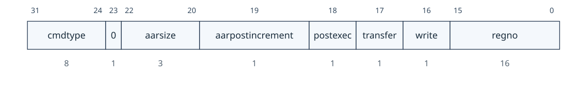<figcaption>图：寄存器位域图：3.7.1.1 Access Register</figcaption></figure>

| 字段                 | 描述                                                                                                                                                                                             |
| ------------------ | ---------------------------------------------------------------------------------------------------------------------------------------------------------------------------------------------- |
| `cmdtype`          | 固定为 0，表示“访问寄存器”命令。                                                                                                                                                                             |
| `aarsize`          | 2（32 位）：访问寄存器的低 32 位。<br>3（64 位）：访问寄存器的低 64 位。<br>4（128 位）：访问寄存器的低 128 位。<br>若 `aarsize` 指定的宽度大于寄存器实际宽度，访问必须失败。只要寄存器可访问，就必须支持读取宽度不超过实际宽度的 `aarsize`；可选支持写入部分寄存器，但此时高位的处理未指定。本字段控制 表 2 所述的参数宽度。 |
| `aarpostincrement` | 0（disabled）：无影响，必须支持。<br>1（enabled）：成功访问寄存器后，`regno` 递增；递增越过最高受支持值时，`regno` 的值未指定。支持本变体可选；当 `transfer`=0 时是否递增未指定。                                                                             |
| `postexec`         | 0（disabled）：无影响，必须支持；若 `progbufsize`=0，这是唯一必须支持的取值。<br>1（enabled）：若执行了传输，则随后恰好执行一次 Program Buffer 中的程序。支持本变体可选。                                                                                |
| `transfer`         | 0（disabled）：不执行 `write` 指定的操作。<br>1（enabled）：执行 `write` 指定的操作。<br>可利用本位只执行 Program Buffer，而无需为 `aarsize` 或 `regno` 填入有效值。                                                                      |
| `write`            | 仅在 `transfer` 置位时有效：<br>0（arg0）：把指定寄存器的数据复制到 `data` 的 `arg0` 部分。<br>1（register）：把 `data` 的 `arg0` 部分复制到指定寄存器。                                                                                  |
| `regno`            | 待访问寄存器的编号，见 表 4。若本命令可在未暂停的 hart 上执行，则可用 `dpc` 作为 PC 的别名。                                                                                                                                       |

##### 3.7.1.2 `Quick Access`

执行以下操作顺序：

1. 如果 hart 暂停，该命令将 `cmderr` 设置为 `halt/resume` 并且不会继续。
2. 使 hart `halt`。若 hart 已因其他原因（例如断点）处于 `halt` 状态，则本命令将 `cmderr` 置为 `halt/resume`，且不再继续。
3. 执行 Program Buffer。若发生异常，则将 `cmderr` 置为 `exception`，结束 Program Buffer 执行，hart 保持暂停，并将 `cause` 置为 3。
4. 如果程序缓冲区执行无异常，则恢复 hart。

执行此命令是可选的。

该命令不触及 `data` 寄存器。
<figure style="margin: 0.5em auto; text-align: center;"><figcaption>图：寄存器位域图：3.7.1.2 Quick Access</figcaption></figure>

| 字段 | 描述 |
| --- | --- |
|  `cmdtype` | 固定为 1，表示快速访问命令。 |

##### 3.7.1.3 `Access Memory`

此命令允许调试器执行内存访问，其内存视图和权限与在选定的 hart 上执行加载/存储完全相同。这包括访问 hart 本地以内存地址方式访问的寄存器等。该命令执行以下操作序列：

1. 如果 `write` 清零，则将数据从 `arg1` 中指定的内存位置复制到 `data` 的 `arg0` 部分。
2. 如果设置了 `write`，则将数据从 `data` 的 `arg0` 部分复制到 `arg1` 中指定的内存位置。
3. 如果设置了 `aampostincrement`，则递增 `arg1`。

如果这些操作中的任何一个失败，则设置 `cmderr` 并且不会执行其余步骤。仅当运行 M 模式代码的 hart 在尝试相同的访问时可能遇到相同的失败时，访问才可能失败。实现可以尽早检测到即将发生的故障，并在到达可能导致故障的步骤之前使整个命令失败。

调试模块可以选择实现此命令，并在所选 hart 运行或暂停时支持对内存位置的读写访问。若本命令支持在 hart 运行时访问内存，则也必须支持在 hart 暂停时访问内存。

> [!note]
> 选择 `aamsize` 的编码来匹配 `sbcs` 中的 `sbaccess`

该命令仅在读取内存时修改 `arg0`。仅当设置了 `aampostincrement` 时才修改 `arg1`。其他 `data` 寄存器不变。
<figure style="margin: 0.5em auto; text-align: center;">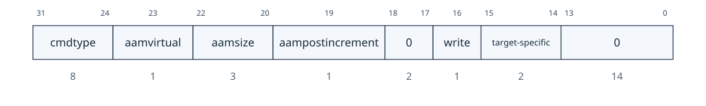<figcaption>图：寄存器位域图：3.7.1.3 Access Memory</figcaption></figure>

| 字段 | 描述 |
| --- | --- |
|  `cmdtype` | 固定为 2，表示访问内存命令。 |
|  `aamvirtual` | 实现不必同时支持虚拟地址与物理地址访问，但必须使不支持的访问失败。<br>0（physical）：`arg1` 中的地址按物理地址解释；访问效果等同于所选 hart 对该地址执行访问。<br>1（virtual）：`arg1` 中的地址按虚拟地址解释，按 M 模式且 `MPRV` 置位时的规则完成地址转换。<br>没有地址转换的系统可允许本字段写为 1；其结果应与写为 0 相同。 |
|  `aamsize` | 0（8 位）：访问内存位置的低 8 位。<br>1（16 位）：访问内存位置的低 16 位。<br>2（32 位）：访问内存位置的低 32 位。<br>3（64 位）：访问内存位置的低 64 位。<br>4（128 位）：访问内存位置的低 128 位。 |
|  `aampostincrement` | 内存访问完成后，本位为 1 时，将包含访问地址的 `arg1` 递增 `aamsize` 编码的字节数。支持本变体可选，但出于性能考虑强烈建议支持。 |
|  `write` | 0（read）：从 `arg1` 指定的内存位置读取数据，复制到 `arg0` 的低位；`arg0` 其余位未指定。<br>1（`write`）：将 `arg0` 的低位写入 `arg1` 指定的内存位置。 |
|  `target-specific` | 这些位保留用于特定于目标的用途。 |

### 3.8 程序缓冲区

为支持在已暂停 hart 上执行任意指令，DM 可以包含 Program Buffer，调试器可向其中写入小程序。仅靠抽象命令即可支持全部必需功能的 DM 可以省略 Program Buffer。

调试器可以将一个小程序写入程序缓冲区，然后使用访问寄存器抽象命令将其执行一次，同时设置 `command` 中的 `postexec` 位。调试器可以编写任何它喜欢的程序（包括跳出程序缓冲区），但程序必须以 `ebreak` 或 `c.ebreak` 结尾。实现可以支持当 hart 从程序缓冲区末尾运行时执行的隐式 `ebreak`。这由 `impebreak` 表示。借助此功能，仅 2 个 32 位字的程序缓冲区即可提供高效的调试。

执行这些程序时，hart 不会离开调试模式（请参阅 第 4.1 节）。如果在执行程序缓冲区期间遇到异常，则不再执行任何指令，hart 保持在调试模式，并且 `cmderr` 设置为 3（`exception error`）。如果调试器执行的程序不以 `ebreak` 指令终止，则 hart 将保持在调试模式，并且调试器将失去对 hart 的控制。

如果 `progbufsize` 为 1，则以下情况适用：

1. `impebreak` 必须为 1。
2. 如果调试器将压缩指令写入程序缓冲区，则必须将其放入低 16 位，并在高 16 位中附上压缩 `nop`。

> [!note]
> 当 `progbufsize`=1 时，对调试器施加上述要求，是为了适配这类实现：hart 暂停时，它们更适合把指令直接填入流水线，而不是把程序缓冲区放在某个可寻址位置。

程序缓冲器可以被实现为可由 hart 访问的RAM。调试器可以通过执行小程序来确定是否是这种情况，这些小程序在从程序缓冲区执行时尝试相对于 `pc` 进行写入和读回。如果是这样，调试器在使用程序缓冲区时可以更加灵活。

### 3.9 hart 调试状态概述

> [!tip] Tips · 把图中的“概念状态”对应到寄存器可见条件：`anyrunning/allrunning`、`anyhalted/allhalted`、`busy` 与 `cmderr`。它们比内部 RTL 状态名更具可移植性。

图 2 显示 hart 在运行/暂停调试期间受 `dmcontrol`、`abstractcs`、`abstractauto` 和 `command` 各字段影响所经过状态的概念视图。

<figure style="margin: 0.5em auto; text-align: center;"><figcaption>图 2：单 hart 平台的运行/暂停调试状态机（原 PDF 插图）</figcaption></figure>

图 2．单 hart 硬件平台的运行/暂停调试状态机。由于调试器只能看到少量状态，因此状态与转换均为概念性描述。

### 3.10 系统总线访问

> [!tip] Tips · SBA 使用物理地址，且未必与各 hart 观察到的数据自动一致。调试 cache 或 DMA 问题时，须由调试器/平台自行安排一致性操作。

调试器可以使用程序缓冲区或抽象访问内存命令从 hart 的角度访问内存。 （这两个功能都是可选的。）调试模块还可以包括系统总线访问块，以提供内存访问，而无需涉及 hart，无论是否实现程序缓冲区。系统总线访问块使用物理地址。

系统总线访问块可支持 8、16、32、64 和 128 位访问。表 5 给出每种访问大小使用的 `sbdata` 位。

<table id="sbdatabits" style="margin: 0.25em auto 1em; border-collapse: collapse; table-layout: auto;">
  <caption style="caption-side: top; text-align: center !important; display: table-caption; width: 100%; font-weight: 600; padding-bottom: 0.2em; white-space: nowrap;"><span style="display: block; width: 100%; text-align: center !important;">表 5．系统总线数据位</span></caption>
  <thead>
    <tr><th style="white-space: nowrap; text-align: center !important; vertical-align: middle;">访问大小（位）</th><th style="white-space: nowrap; text-align: center !important; vertical-align: middle;">使用的数据位</th></tr>
  </thead>
  <tbody>
    <tr><td style="white-space: nowrap;">8</td><td><code>sbdata0</code> 的位 7:0</td></tr>
    <tr><td style="white-space: nowrap;">16</td><td><code>sbdata0</code> 的位 15:0</td></tr>
    <tr><td style="white-space: nowrap;">32</td><td><code>sbdata0</code> 的全部 32 位</td></tr>
    <tr><td style="white-space: nowrap;">64</td><td><code>sbdata1</code> 与 <code>sbdata0</code></td></tr>
    <tr><td style="white-space: nowrap;">128</td><td><code>sbdata3</code>、<code>sbdata2</code>、<code>sbdata1</code> 与 <code>sbdata0</code></td></tr>
  </tbody>
</table>

取决于微架构，经系统总线访问读到的数据未必与每个 hart 可见的数据一致。若实现不提供一致性保证，应由调试器自行保证；规范不规定统一方法，例如可写入专用内存地址，或通过 Program Buffer 执行专用指令。

> [!note]
> 即使 DM 已实现 Program Buffer，系统总线访问块仍有明显好处：可在尽量不干扰运行系统的前提下访问内存；可提高内存访问性能；还可访问 hart 无法触及的设备。

### 3.11 最小侵入式调试

视任务而定，某些 hart 只能短暂暂停。本节的机制允许访问此类运行中系统的资源，同时尽量减小对 hart 的影响。

首先，实现可允许在不暂停 hart 的情况下执行某些抽象命令。

其次，快速访问抽象命令可用于暂停 hart、快速执行 Program Buffer 内容，再使 hart 恢复运行。结合允许 Program Buffer 代码访问 `data` 寄存器的指令（见 `hartinfo`），可快速完成内存或寄存器访问。对部分硬件平台而言，这种方式干扰过大；但对许多不能长时间暂停的硬件平台，可偶尔承受一百个或更少的周期。

第三，如果实现了系统总线访问模块，则可以在 hart 运行时使用它来访问系统内存。

### 3.12 安全性

为了保护知识产权，可能需要锁定对调试模块的访问。为了允许在制造过程中而不是之后进行访问，合理的解决方案可能是向调试模块添加一个熔丝位，用于永久禁用它。由于这是特定于技术的，因此本规范中没有进一步讨论。

另一种选择是仅允许拥有访问密钥的用户解锁 DM。 `authenticated`、`authbusy`、`authdata` 之间可以支持任意复杂的认证机制。当 `authenticated` 清除时，DM 不得与硬件平台的其余部分交互，也不得暴露有关连接到 DM 的 hart 的详细信息。所有 DM 寄存器应读取 0，而写入应被忽略，但以下强制例外：

1. `dmstatus` 中的 `authenticated` 可读。
2. `dmstatus` 中的 `authbusy` 可读。
3. `dmstatus` 中的 `version` 可读。
4. `dmcontrol` 中的 `dmactive` 可读可写。
5. `authdata` 可读可写。

无法使用 `authdata` 解锁 DM 的实现不应实现该寄存器。

### 3.13 版本检测

要检测副作用最小的调试模块的版本，请使用以下过程：

1. 读取 `dmcontrol`。
2. 如果 `dmactive` 为 0 或 `ndmreset` 为 1：
    1. 写入 `dmcontrol`，保留读取值中的 `hartreset`、`hasel`、`hartsello` 和 `hartselhi`，设置 `dmactive`，并清除所有其他位。
    2. 读取 `dmcontrol`，直到 `dmactive` 为高电平。
3. 读取 `dmstatus`，其中包含 `version`。

如果需要清除 `ndmreset`，可能会产生以下副作用：

1. `haltreq` 被清除，可能会阻止先前调试器发出的暂停请求生效。
2. `resumereq` 被清除，可能会阻止先前调试器发出的恢复请求生效。
3. `ndmreset` 被置为无效，如果先前的调试器已设置它，则释放硬件平台的复位状态。
4. `dmactive` 被置位，释放 DM 的复位状态。这本身是任何 hart 都无法观察到的。

此过程保证在此规范的未来版本中有效。 `hartreset`、`hasel`、`hartsello` 和 `hartselhi` 当前所在的 `dmcontrol` 位的含义可能会改变，但保留它们不会有副作用。清除此处未明确提及的 `dmcontrol` 位不会产生除上述影响之外的副作用。

### 3.14 调试模块寄存器

本节中描述的寄存器是通过 DMI 总线访问的。每个 DM 都有一个基地址（第一个 DM 为0）。下面的寄存器地址是相对于该基地址的偏移量。

调试模块 DMI 未实现或下表中未提及的寄存器在读取时返回 0。写它们没有任何效果。

<table id="tab:None" style="margin: 0.25em auto 1em; border-collapse: collapse; table-layout: auto;">
  <caption style="caption-side: top; text-align: center !important; display: table-caption; width: 100%; font-weight: 600; padding-bottom: 0.2em; white-space: nowrap;"><span style="display: block; width: 100%; text-align: center !important;">表 6．调试模块调试总线寄存器</span></caption>
  <thead>
    <tr><th style="white-space: nowrap; text-align: center !important; vertical-align: middle;">地址</th><th style="white-space: nowrap; text-align: center !important; vertical-align: middle;">名称</th><th style="white-space: nowrap; text-align: center !important; vertical-align: middle;">部分</th></tr>
  </thead>
  <tbody>
    <tr><td style="white-space: nowrap;">0x04</td><td>抽象数据 0 (<code>data0</code>)</td><td>第 3.14.14 节</td></tr>
    <tr><td style="white-space: nowrap;">0x05</td><td>抽象数据 1 (data1)</td><td></td></tr>
    <tr><td style="white-space: nowrap;">0x06</td><td>抽象数据 2 (data2)</td><td></td></tr>
    <tr><td style="white-space: nowrap;">0x07</td><td>抽象数据 3 (data3)</td><td></td></tr>
    <tr><td style="white-space: nowrap;">0x08</td><td>抽象数据 4 (data4)</td><td></td></tr>
    <tr><td style="white-space: nowrap;">0x09</td><td>抽象数据 5 (data5)</td><td></td></tr>
    <tr><td style="white-space: nowrap;">0x0a</td><td>抽象数据 6 (data6)</td><td></td></tr>
    <tr><td style="white-space: nowrap;">0x0b</td><td>抽象数据 7 (data7)</td><td></td></tr>
    <tr><td style="white-space: nowrap;">0x0c</td><td>抽象数据 8 (data8)</td><td></td></tr>
    <tr><td style="white-space: nowrap;">0x0d</td><td>抽象数据 9 (data9)</td><td></td></tr>
    <tr><td style="white-space: nowrap;">0x0e</td><td>抽象数据 10 (data10)</td><td></td></tr>
    <tr><td style="white-space: nowrap;">0x0f</td><td>抽象数据 11 (data11)</td><td></td></tr>
    <tr><td style="white-space: nowrap;">0x10</td><td>调试模块控制（<code>dmcontrol</code>）</td><td>第 3.14.2 节</td></tr>
    <tr><td style="white-space: nowrap;">0x11</td><td>调试模块状态（<code>dmstatus</code>）</td><td>第 3.14.1 节</td></tr>
    <tr><td style="white-space: nowrap;">0x12</td><td>hart 信息 (<code>hartinfo</code>)</td><td>第 3.14.3 节</td></tr>
    <tr><td style="white-space: nowrap;">0x13</td><td>暂停状态汇总 1 (<code>haltsum1</code>)</td><td>第 3.14.19 节</td></tr>
    <tr><td style="white-space: nowrap;">0x14</td><td>hart 阵列窗口选择 (<code>hawindowsel</code>)</td><td>第 3.14.4 节</td></tr>
    <tr><td style="white-space: nowrap;">0x15</td><td>hart 阵列窗口 (<code>hawindow</code>)</td><td>第 3.14.5 节</td></tr>
    <tr><td style="white-space: nowrap;">0x16</td><td>抽象控制和状态（<code>abstractcs</code>）</td><td>第 3.14.6 节</td></tr>
    <tr><td style="white-space: nowrap;">0x17</td><td>抽象命令（<code>command</code>）</td><td>第 3.14.7 节</td></tr>
    <tr><td style="white-space: nowrap;">0x18</td><td>抽象命令 Autoexec (<code>abstractauto</code>)</td><td>第 3.14.8 节</td></tr>
    <tr><td style="white-space: nowrap;">0x19</td><td>配置结构指针0（<code>confstrptr0</code>）</td><td>第 3.14.9 节</td></tr>
    <tr><td style="white-space: nowrap;">0x1a</td><td>配置结构指针1（<code>confstrptr1</code>）</td><td>第 3.14.10 节</td></tr>
    <tr><td style="white-space: nowrap;">0x1b</td><td>配置结构指针2（<code>confstrptr2</code>）</td><td>第 3.14.11 节</td></tr>
    <tr><td style="white-space: nowrap;">0x1c</td><td>配置结构指针3（<code>confstrptr3</code>）</td><td>第 3.14.12 节</td></tr>
    <tr><td style="white-space: nowrap;">0x1d</td><td>下一个调试模块（<code>nextdm</code>）</td><td>第 3.14.13 节</td></tr>
    <tr><td style="white-space: nowrap;">0x1f</td><td>自定义功能 (<code>custom</code>)</td><td>第 3.14.31 节</td></tr>
    <tr><td style="white-space: nowrap;">0x20</td><td>程序缓冲区 0 (<code>progbuf0</code>)</td><td>第 3.14.15 节</td></tr>
    <tr><td style="white-space: nowrap;">0x21</td><td>程序缓冲区 1 (progbuf1)</td><td></td></tr>
    <tr><td style="white-space: nowrap;">0x22</td><td>程序缓冲区 2 (progbuf2)</td><td></td></tr>
    <tr><td style="white-space: nowrap;">0x23</td><td>程序缓冲区 3 (progbuf3)</td><td></td></tr>
    <tr><td style="white-space: nowrap;">0x24</td><td>程序缓冲区 4 (progbuf4)</td><td></td></tr>
    <tr><td style="white-space: nowrap;">0x25</td><td>程序缓冲区 5 (progbuf5)</td><td></td></tr>
    <tr><td style="white-space: nowrap;">0x26</td><td>程序缓冲区 6 (progbuf6)</td><td></td></tr>
    <tr><td style="white-space: nowrap;">0x27</td><td>程序缓冲区 7 (progbuf7)</td><td></td></tr>
    <tr><td style="white-space: nowrap;">0x28</td><td>程序缓冲区 8 (progbuf8)</td><td></td></tr>
    <tr><td style="white-space: nowrap;">0x29</td><td>程序缓冲区 9 (progbuf9)</td><td></td></tr>
    <tr><td style="white-space: nowrap;">0x2a</td><td>程序缓冲区 10 (progbuf10)</td><td></td></tr>
    <tr><td style="white-space: nowrap;">0x2b</td><td>程序缓冲区 11 (progbuf11)</td><td></td></tr>
    <tr><td style="white-space: nowrap;">0x2c</td><td>程序缓冲区 12 (progbuf12)</td><td></td></tr>
    <tr><td style="white-space: nowrap;">0x2d</td><td>程序缓冲区 13 (progbuf13)</td><td></td></tr>
    <tr><td style="white-space: nowrap;">0x2e</td><td>程序缓冲区 14 (progbuf14)</td><td></td></tr>
    <tr><td style="white-space: nowrap;">0x2f</td><td>程序缓冲区 15 (progbuf15)</td><td></td></tr>
    <tr><td style="white-space: nowrap;">0x30</td><td>认证数据（<code>authdata</code>）</td><td>第 3.14.16 节</td></tr>
    <tr><td style="white-space: nowrap;">0x32</td><td>调试模块控制和状态2 (<code>dmcs2</code>)</td><td>第 3.14.17 节</td></tr>
    <tr><td style="white-space: nowrap;">0x34</td><td>暂停状态汇总 2 (<code>haltsum2</code>)</td><td>第 3.14.20 节</td></tr>
    <tr><td style="white-space: nowrap;">0x35</td><td>暂停状态汇总 3 (<code>haltsum3</code>)</td><td>第 3.14.21 节</td></tr>
    <tr><td style="white-space: nowrap;">0x37</td><td>系统总线地址 127:96 (<code>sbaddress3</code>)</td><td>第 3.14.26 节</td></tr>
    <tr><td style="white-space: nowrap;">0x38</td><td>系统总线访问控制和状态（<code>sbcs</code>）</td><td>第 3.14.22 节</td></tr>
    <tr><td style="white-space: nowrap;">0x39</td><td>系统总线地址31：0（<code>sbaddress0</code>）</td><td>第 3.14.23 节</td></tr>
    <tr><td style="white-space: nowrap;">0x3a</td><td>系统总线地址 63:32 (<code>sbaddress1</code>)</td><td>第 3.14.24 节</td></tr>
    <tr><td style="white-space: nowrap;">0x3b</td><td>系统总线地址 95:64 (<code>sbaddress2</code>)</td><td>第 3.14.25 节</td></tr>
    <tr><td style="white-space: nowrap;">0x3c</td><td>系统总线数据31:0 (<code>sbdata0</code>)</td><td>第 3.14.27 节</td></tr>
    <tr><td style="white-space: nowrap;">0x3d</td><td>系统总线数据 63:32 (<code>sbdata1</code>)</td><td>第 3.14.28 节</td></tr>
    <tr><td style="white-space: nowrap;">0x3e</td><td>系统总线数据 95:64 (<code>sbdata2</code>)</td><td>第 3.14.29 节</td></tr>
    <tr><td style="white-space: nowrap;">0x3f</td><td>系统总线数据 127:96 (<code>sbdata3</code>)</td><td>第 3.14.30 节</td></tr>
    <tr><td style="white-space: nowrap;">0x40</td><td>暂停状态汇总 0 (<code>haltsum0</code>)</td><td>第 3.14.18 节</td></tr>
    <tr><td style="white-space: nowrap;">0x70</td><td>自定义功能 0 (<code>custom0</code>)</td><td>第 3.14.32 节</td></tr>
    <tr><td style="white-space: nowrap;">0x71</td><td>自定义功能 1 (custom1)</td><td></td></tr>
    <tr><td style="white-space: nowrap;">0x72</td><td>自定义功能 2 (custom2)</td><td></td></tr>
    <tr><td style="white-space: nowrap;">0x73</td><td>自定义功能 3 (custom3)</td><td></td></tr>
    <tr><td style="white-space: nowrap;">0x74</td><td>自定义功能 4 (​​custom4)</td><td></td></tr>
    <tr><td style="white-space: nowrap;">0x75</td><td>自定义功能 5 (custom5)</td><td></td></tr>
    <tr><td style="white-space: nowrap;">0x76</td><td>自定义功能 6 (custom6)</td><td></td></tr>
    <tr><td style="white-space: nowrap;">0x77</td><td>自定义功能 7 (custom7)</td><td></td></tr>
    <tr><td style="white-space: nowrap;">0x78</td><td>自定义功能 8 (custom8)</td><td></td></tr>
    <tr><td style="white-space: nowrap;">0x79</td><td>自定义功能 9 (custom9)</td><td></td></tr>
    <tr><td style="white-space: nowrap;">0x7a</td><td>自定义功能 10 (custom10)</td><td></td></tr>
    <tr><td style="white-space: nowrap;">0x7b</td><td>自定义功能 11 (custom11)</td><td></td></tr>
    <tr><td style="white-space: nowrap;">0x7c</td><td>自定义功能 12 (custom12)</td><td></td></tr>
    <tr><td style="white-space: nowrap;">0x7d</td><td>自定义功能 13 (custom13)</td><td></td></tr>
    <tr><td style="white-space: nowrap;">0x7e</td><td>自定义功能 14 (custom14)</td><td></td></tr>
    <tr><td style="white-space: nowrap;">0x7f</td><td>自定义功能 15 (custom15)</td><td></td></tr>
  </tbody>
</table>

#### 3.14.1 调试模块状态（`dmstatus`，位于 0x11）

该寄存器报告整个调试模块以及当前选择的 hart 的状态，如 `hasel` 中所定义。它的地址以后不会改变，因为它包含 `version`。

整个寄存器是只读的。
<figure style="margin: 0.5em auto; text-align: center;"><figcaption>图：寄存器位域图：3.14.1 调试模块状态（dmstatus，位于 0x11）</figcaption></figure>

<figure style="margin: 0.5em auto; text-align: center;">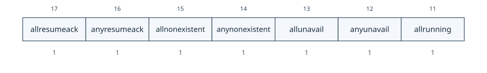<figcaption>图：寄存器位域图：3.14.1 调试模块状态（dmstatus，位于 0x11）</figcaption></figure>

<figure style="margin: 0.5em auto; text-align: center;">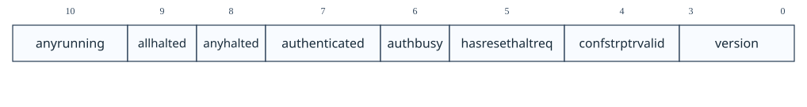<figcaption>图：寄存器位域图：3.14.1 调试模块状态（dmstatus，位于 0x11）</figcaption></figure>

| 字段 | 描述 | 访问 | 复位 |
| --- | --- | --- | --- |
|  `ndmresetpending` | 0（假）：未实现，或 `ndmreset` 为零且当前没有 `ndmreset` 正在进行。 1（true）：`ndmreset` 当前非零，或者正在进行 `ndmreset`。 | **R** | - |
|  `stickyunavail` | 0（current）：各 hart 的 `unavail` 位反映该 hart 的当前状态。<br>1（sticky）：各 hart 的 `unavail` 位为粘性位；一旦置位，只有调试器通过 `ackunavail` 确认后才会清零。 | **R** | 预设 |
|  `impebreak` | 为 1 时，紧邻 Program Buffer 末尾的未实现字位置隐含一条 `ebreak`。调试器因而无需自行写入 `ebreak`，Program Buffer 也可少一个字。若 `progbufsize`=1，本位必须为 1。 | **R** | 预设 |
|  `allhavereset` | 当当前选择的所有 hart 均已复位且其中任何一个的复位尚未被确认时，该字段为 1。 | **R** | - |
|  `anyhavereset` | 当前选定的 hart 中至少有一个已经复位，且尚未确认该 hart 的复位时，本字段为 1。 | **R** | - |
|  `allresumeack` | 当所有当前选择的 hart 都设置了恢复确认位时，该字段为 1。 | **R** | - |
|  `anyresumeack` | 当任何当前选择的 hart 的恢复确认位设置时，该字段为 1。 | **R** | - |
|  `allnonexistent` | 当前选择的所有 hart 在此硬件平台中不存在时，该字段为 1。 | **R** | - |
|  `anynonexistent` | 当当前选择的任何 hart 在此硬件平台中不存在时，该字段为 1。 | **R** | - |
|  `allunavail` | 当当前选择的所有 hart 都不可用时，或者（如果 `stickyunavail` 为 1）在未得到确认的情况下不可用时，此字段为 1。 | **R** | - |
|  `anyunavail` | 当任何当前选择的 hart 不可用时，或者（如果 `stickyunavail` 为 1）在未得到确认的情况下不可用时，此字段为 1。 | **R** | - |
|  `allrunning` | 当前选中的所有 hart 都在运行时，该字段为1。 | **R** | - |
|  `anyrunning` | 当当前选择的任何 hart 正在运行时，该字段为 1。 | **R** | - |
|  `allhalted` | 所有当前选择的 hart 均处于 `halt` 状态时，本字段为 1。 | **R** | - |
|  `anyhalted` | 任一当前选择的 hart 处于 `halt` 状态时，本字段为 1。 | **R** | - |
|  `authenticated` | 0（false）：使用 DM 前需要认证。<br>1（true）：已通过认证检查。<br>未实现认证机制的组件必须将本位预设为 1。 | **R** | 预设 |
|  `authbusy` | 0（ready）：认证模块已准备好处理下一次对 `authdata` 的读写。<br>1（`busy`）：认证模块忙；访问 `authdata` 的行为未指定。认证模块仅在可立即响应 `authdata` 访问时置位本状态。 | **R** | 0 |
|  `hasresethaltreq` | 1（如果此调试模块支持可通过 `setresethaltreq` 和 `clrresethaltreq` 位控制的复位暂停功能）。否则为 0。 | **R** | 预设 |
|  `confstrptrvalid` | 0（invalid）：`confstrptr0`～`confstrptr3` 的内容并非配置结构地址。<br>1（valid）：这四个寄存器共同保存配置结构的地址。 | **R** | 预设 |
|  `version` | 0（无）：不存在调试模块。 1 (0.11)：有一个调试模块，并且符合该规范的0.11版本。 2 (0.13)：有一个调试模块，符合该规范的0.13版本。 3（1.0）：有一个调试模块，并且符合该规范的1.0版本。 15（自定义）：有一个调试模块，但它不符合此规范的任何可用版本。 | **R** | 3 |

#### 3.14.2 调试模块控制（`dmcontrol`，位于 0x10）

该寄存器控制整个调试模块以及当前选择的 hart，如 `hasel` 中所定义。

在本文档中，我们提到 `hartsel`，它是 `hartselhi` 与 `hartsello` 的组合。虽然规范允许 20 个 `hartsel` 位，但实现可能会选择实现少于此数量的位。 `hartsel` 的实际宽度称为 `HARTSELLEN`。它必须至少为 0，最多为 20。调试器应通过将所有 1 写入 `hartsel`（假设最大大小）并读回该值以查看实际设置了哪些位来发现 `HARTSELLEN`。在执行抽象命令时，调试器不得更改 `hartsel`。硬件应通过在设置 `busy` 时忽略对 `hartsel` 的更改来强制执行此操作。

> [!note]
> 有单独的 `setresethaltreq` 和 `clrresethaltreq` 位，以便在并非所有选定的 hart 都具有相同的情况下，可以写入 `dmcontrol`，而不更改每个选定的 hart 的复位暂停请求位配置.

在任何给定的写入中，调试器最多只能向以下位之一写入 1：`resumereq`、`hartreset`、`ackhavereset`、`setresethaltreq` 和 `clrresethaltreq`。其他的必须写0。

`resethaltreq` 是每个 hart 状态的可选内部位，无法读取，但可以使用 `setresethaltreq` 和 `clrresethaltreq` 写入。

`keepalive` 是每个 hart 状态的可选内部位。设置后，它建议硬件应尝试保持 hart 对调试器可用，例如通过防止其在通电后进入低功耗状态。即使该位被实现，硬件也可能无法保持 hart 可用。该位通过 `setkeepalive` 和 `clrkeepalive` 写入。

为了向前兼容，当位 1 (`ndmreset`) 为 0 并且位 0 (`dmactive`) 为 1 时，`version` 将始终可读。
<figure style="margin: 0.5em auto; text-align: center;">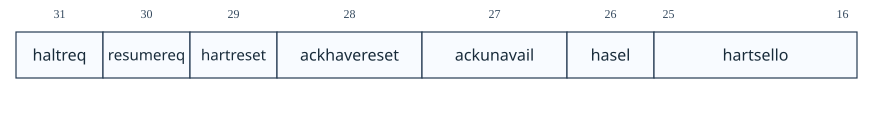<figcaption>图：寄存器位域图：3.14.2 调试模块控制（dmcontrol，位于 0x10）</figcaption></figure>

<figure style="margin: 0.5em auto; text-align: center;">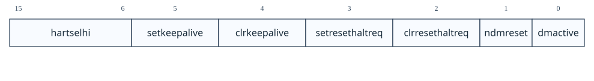<figcaption>图：寄存器位域图：3.14.2 调试模块控制（dmcontrol，位于 0x10）</figcaption></figure>

| 字段 | 描述 | 访问 | 复位 |
| --- | --- | --- | --- |
|  `haltreq` | 写 0：清除全部当前选定 hart 的暂停请求位，可能撤销这些 hart 尚未完成的暂停请求。<br>写 1：置位全部当前选定 hart 的暂停请求位；运行中的 hart 会在该位保持置位期间暂停。<br>写操作使用同一次写入中的 `hartsel` 与 `hasel` 新值。执行抽象命令期间应忽略对该位的写入。 | **WARZ** | - |
|  `resumereq` | 写 1：若写入时当前选定 hart 已暂停，则使其恢复一次，并清除这些 hart 的恢复确认位。<br>若 `haltreq` 为 1，则忽略 `resumereq`。<br>写操作使用同一次写入中的 `hartsel` 与 `hasel` 新值。执行抽象命令期间应忽略对该位的写入。 | **W1** | - |
|  `hartreset` | 可选字段。为全部当前选定 hart 写入复位控制位；调试器写 1 使复位有效，再写 0 使复位无效。<br>该位为 1 时，调试器不得更改所选 hart。若未实现，本位恒为 0；写 1 后读回即可判断是否支持。<br>写操作使用同一次写入中的 `hartsel` 与 `hasel` 新值。 | **WARL** | 0 |
|  `ackhavereset` | 0（nop）：无影响。<br>1（ack）：清除任一当前选定 hart 的 `havereset`。<br>写操作使用同一次写入中的 `hartsel` 与 `hasel` 新值。执行抽象命令期间应忽略对该位的写入。 | **W1** | - |
|  `ackunavail` | 0（nop）：无影响。<br>1（ack）：清除当前可用的任一选定 hart 的 `unavail`。<br>写操作使用同一次写入中的 `hartsel` 与 `hasel` 新值。 | **W1** | - |
|  `hasel` | 选择“当前选定 hart”的定义。<br>0（single）：只选定一个 hart，由 `hartsel` 指定。<br>1（multiple）：可选定多个 hart，即 `hartsel` 指定的 hart 加上 hart 数组掩码寄存器选定的 hart。<br>未实现 hart 数组掩码寄存器的实现必须将本字段固定为 0；调试器使用该功能前应写 1 并读回，确认是否受支持。 | **WARL** | 0 |
|  `hartsello` | `hartsel` 的低 10 位：所选 hart 的 DM 专用索引。该 hart 始终属于当前选定 hart 集合。 | **WARL** | 0 |
|  `hartselhi` | `hartsel` 的高 10 位：所选 hart 的 DM 专用索引。该 hart 始终属于当前选定 hart 集合。 | **WARL** | 0 |
|  `setkeepalive` | 可选字段。为全部当前选定 hart 设置 `keepalive`，但 `clrkeepalive` 同时为 1 时除外。<br>写操作使用同一次写入中的 `hartsel` 与 `hasel` 新值。 | **W1** | - |
|  `clrkeepalive` | 可选字段。清除全部当前选定 hart 的 `keepalive`。<br>写操作使用同一次写入中的 `hartsel` 与 `hasel` 新值。 | **W1** | - |
|  `setresethaltreq` | 可选字段。为全部当前选定 hart 设置“复位后暂停”请求位，但 `clrresethaltreq` 同时为 1 时除外。置 1 后，每个选定 hart 会在下一次复位解除时暂停；该请求位不会自动清零，调试器必须写 `clrresethaltreq` 将其清除。<br>写操作使用同一次写入中的 `hartsel` 与 `hasel` 新值；若 `hasresethaltreq` 为 0，则本字段未实现。执行抽象命令期间应忽略对该位的写入。 | **W1** | - |
|  `clrresethaltreq` | 可选字段。清除全部当前选定 hart 的“复位后暂停”请求位。<br>写操作使用同一次写入中的 `hartsel` 与 `hasel` 新值。执行抽象命令期间应忽略对该位的写入。 | **W1** | - |
|  `ndmreset` | 控制从 DM 发往硬件平台其余部分的复位信号。该信号应复位平台中的每个部分（包括每个 hart），但不包括 DM 本身及访问 DM 所需逻辑。要复位硬件平台，调试器写 1，再写 0 使复位无效。 | **R/W** | 0 |
|  `dmactive` | DM 自身的复位信号。改写本位后，调试器必须轮询 `dmcontrol`，直至 `dmactive` 读回请求值，才可执行依赖该状态改变完成的操作。硬件完成激活或停用的时间可以任意长；在此期间 DM 可忽略寄存器写入。<br>0（inactive）：模块状态（包括认证机制）取复位值；仅本位可写成非复位值。对模块的访问可能失败，尤其是 `version` 可能返回错误数据。同次对 `dmcontrol` 的写入中，其余字段可被忽略。<br>1（active）：模块正常工作。上电后不应存在其他会复位 DM 的机制。调试器应依次写 0、轮询至读回 0、写 1、轮询至读回 1，以将 DM 置于已知状态。实现可利用本位辅助调试，例如在调试有效时禁止对 DM 进行电源门控。 | **R/W** | 0 |

#### 3.14.3 hart 信息（`hartinfo`，位于 0x12）

该寄存器提供有关 `hartsel` 当前选择的 hart 的信息。

该寄存器是可选的。如果不存在，则应读取全零。

如果包含该寄存器，则调试器可以通过编写显式访问 `data` 和/或 `dscratch` 寄存器的程序来对程序缓冲区执行更多操作。

整个寄存器是只读的。
<figure style="margin: 0.5em auto; text-align: center;"><figcaption>图：寄存器位域图：3.14.3 hart 信息（hartinfo，位于 0x12）</figcaption></figure>

| 字段 | 描述 | 访问 | 复位 |
| --- | --- | --- | --- |
|  `nscratch` | 可供调试器在程序缓冲区执行期间使用的 `dscratch` 寄存器的数量，从 `dscratch0` 开始。调试器无法对命令之间这些寄存器的内容做出任何假设。 | **R** | 预设 |
|  `dataaccess` | 0（csr）：`data` 寄存器通过 hart 内的 CSR 影子副本访问；每个 CSR 宽 DXLEN 位，并按 表 2 对应一个参数。<br>1（memory）：`data` 寄存器通过 hart 的内存地址空间中的影子副本访问；每个寄存器占用 4 字节。 | **R** | 预设 |
|  `datasize` | 若 `dataaccess`=0：用于 `data` 寄存器影子副本的 CSR 数量。<br>若 `dataaccess`=1：内存地址空间中用于 `data` 寄存器影子副本的 32 位字数量。<br>`data` 寄存器最多 12 个，因此本寄存器值不得大于 12。 | **R** | 预设 |
|  `dataaddr` | 若 `dataaccess`=0：用于 `data` 寄存器影子副本的第一个 CSR 编号。<br>若 `dataaccess`=1：存放 `data` 寄存器影子副本的 RAM 地址。该地址会进行符号扩展，范围为 −2048 至 2047；使用 `x0` 作为地址寄存器即可通过加载或存储方便访问。 | **R** | 预设 |

#### 3.14.4 hart 数组窗口选择（`hawindowsel`，位于 0x14）

该寄存器选择 hart 阵列掩码寄存器（参见 第 3.3.2 节）的哪个 32 位部分可在 `hawindow` 中访问。
<figure style="margin: 0.5em auto; text-align: center;"><figcaption>图：寄存器位域图：3.14.4 hart 数组窗口选择（hawindowsel，位于 0x14）</figcaption></figure>

| 字段 | 描述 | 访问 | 复位 |
| --- | --- | --- | --- |
|  `hawindowsel` | 根据数组掩码寄存器的大小，本字段的一些高位可固定为 0。例如，具有 48 个 hart 的硬件平台中，只有位 0 实际可写。 | **WARL** | 0 |

#### 3.14.5 hart 数组窗口（`hawindow`，位于 0x15）

该寄存器提供对 hart 数组掩码寄存器的 32 位片段的 R/W 访问（见 第 3.3.2 节）。窗口位置由 `hawindowsel` 决定：位 0 对应 hart `hawindowsel` × 32，位 31 对应 hart `hawindowsel` × 32 + 31。

由于 hart 数组掩码寄存器中的某些位可能是常量0，因此该寄存器中的某些位可能是常量0，具体取决于 `hawindowsel` 的当前值。
<figure style="margin: 0.5em auto; text-align: center;"><figcaption>图：寄存器位域图：3.14.5 hart 数组窗口（hawindow，位于 0x15）</figcaption></figure>

#### 3.14.6 抽象控制和状态（`abstractcs`，位于 0x16）

在执行抽象命令时写入该寄存器会导致命令完成后 `cmderr` 变为 1（忙）（`busy` 变为 0）。

> [!note]
> `datacount` 必须至少为 1 才能支持 RV32 hart，2 才能支持 RV64 hart，或 4 才能支持 RV128 hart。
<figure style="margin: 0.5em auto; text-align: center;"><figcaption>图：寄存器位域图：3.14.6 抽象控制和状态（abstractcs，位于 0x16）</figcaption></figure>

| 字段 | 描述 | 访问 | 复位 |
| --- | --- | --- | --- |
|  `progbufsize` | 程序缓冲区的大小，以 32 位字为单位。有效尺寸为 0 - 16. | **R** | 预设 |
|  `busy` | 0（就绪）：当前没有正在执行的抽象命令。 1（忙）：当前正在执行抽象命令。 一旦写入 `command`，该位就被置位，并且在该命令完成之前不会被清除。 | **R** | 0 |
|  `relaxedpriv` | 此可选位控制程序缓冲区和抽象内存访问是使用基于执行访问的 hart 的当前架构状态应用的精确且完整的权限检查集来执行，还是使用宽松的权限检查集（例如忽略 PMP 限制）来执行。后者的细节是特定于实现的。 0（完整检查）：应用完整权限检查。 1（宽松的检查）：宽松的权限检查适用。 | **WARL** | 预设 |
|  `cmderr` | 抽象命令失败时置位。各位保持置位，直至向相应位写 1 清除；在读回值恢复为 0 前，不会启动新的抽象命令。本字段仅当 `busy`=0 时有效。<br>0（none）：无错误。<br>1（`busy`）：写入 `command`、`abstractcs`、`abstractauto`，或读写任一 `data`/`progbuf` 寄存器时，已有抽象命令正在执行；仅当 `cmderr` 为 0 时才可写入该状态。<br>2（not supported）：`command` 中的命令不受支持；在其他选项组合下可能受支持，但不会仅因之后 hart 或系统状态改变而变得受支持。<br>3（exception）：执行命令时发生异常，例如执行 Program Buffer 时。<br>4（halt/resume）：hart 未处于命令所需的运行/暂停状态，或 hart 不可用。<br>5（bus）：因总线错误失败，例如对齐、访问大小或超时。<br>6（reserved）：保留。<br>7（other）：因其他原因失败。 | **R/W1C** | 0 |
|  `datacount` | 作为抽象命令接口的一部分实现的 `data` 寄存器的数量。有效尺寸为 1 — 12. | **R** | 预设 |

#### 3.14.7 抽象命令（命令，位于 0x17）

写入该寄存器会导致执行相应的抽象命令。

在执行抽象命令时写入该寄存器会导致命令完成后 `cmderr` 变为 1（忙）（忙变为 0）。

如果 `cmderr` 非零，则忽略对此寄存器的写入。

> [!note]
> `cmderr` 禁止启动新命令以适应调试器，出于性能原因，调试器会连续发送多个要执行的命令，而不在其间检查 `cmderr`。他们可以安全地这样做，并在最后检查 `cmderr`，而不必担心一个命令失败，但随后的命令（可能取决于前一个命令的成功）通过。
<figure style="margin: 0.5em auto; text-align: center;">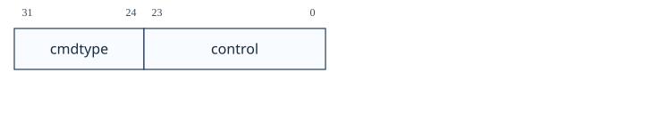<figcaption>图：寄存器位域图：3.14.7 抽象命令（命令，位于 0x17）</figcaption></figure>

| 字段        | 描述                          | 访问       | 复位  |
| --------- | --------------------------- | -------- | --- |
| `cmdtype` | 的类型决定了这个抽象命令的整体功能。          | **WARZ** | 0   |
| `control` | 该字段以特定于命令的方式解释，为每个抽象命令进行描述。 | **WARZ** | 0   |

#### 3.14.8 抽象命令 Autoexec（`abstractauto`，位于 0x18）

该寄存器是可选的。包含它可以实现更高效的突发访问。调试器可以通过设置位并读回它们来检测是否支持。

如果实现了该寄存器，则与实现的 progbuf 和数据寄存器对应的位必须是可写的。其他位必须硬连线为 0。

如果在执行抽象命令时写入该寄存器，则写入将被忽略，并且一旦命令完成（忙变为 0），`cmderr` 将变为 1（忙）。
<figure style="margin: 0.5em auto; text-align: center;"><figcaption>图：寄存器位域图：3.14.8 抽象命令 Autoexec（abstractauto，位于 0x18）</figcaption></figure>

| 字段 | 描述 | 访问 | 复位 |
| --- | --- | --- | --- |
|  `autoexecprogbuf` | 当该字段中的某个位为 1 时，对相应 `progbuf` 字的读或写访问会导致 DM 的行为就像在对 `progbuf` 的访问完成后再次写入 `command` 中的当前值一样。 | **WARL** | 0 |
|  `autoexecdata` | 当该字段中的某个位为 1 时，对相应 `data` 字的读或写访问会导致 DM 的行为就像在对 `data` 的访问完成后再次写入 `command` 中的当前值一样。 | **WARL** | 0 |

#### 3.14.9 配置结构指针 0（`confstrptr0`，位于 0x19）

当 `confstrptrvalid` 置位时，读取该寄存器将返回配置结构指针的位 31:0。读取其他 `confstrptr` 寄存器将返回地址的高位。

当实现系统总线访问时，该地址必须是可以与系统总线访问模块一起使用的地址。否则，这必须是一个可用于从 ID 为 0 的 hart 访问配置结构的地址。

如果 `confstrptrvalid` 为 0，则 `confstrptr` 寄存器保存本文档中未进一步指定的标识符信息。

配置结构本身是与特权规范中描述的 `mconfigptr` 指向的数据结构格式相同的数据结构。

整个寄存器是只读的。
<figure style="margin: 0.5em auto; text-align: center;"><figcaption>图：寄存器位域图：3.14.9 配置结构指针 0（confstrptr0，位于 0x19）</figcaption></figure>

#### 3.14.10 配置结构指针 1（`confstrptr1`，位于 0x1a）

当 `confstrptrvalid` 置位时，读取该寄存器将返回配置结构指针的位 63:32。更多详情请参见 `confstrptr0`。

整个寄存器是只读的。
<figure style="margin: 0.5em auto; text-align: center;"><figcaption>图：寄存器位域图：3.14.10 配置结构指针 1（confstrptr1，位于 0x1a）</figcaption></figure>

#### 3.14.11 配置结构指针 2（`confstrptr2`，位于 0x1b）

当 `confstrptrvalid` 置位时，读取该寄存器将返回配置结构指针的位 95:64。更多详情请参见 `confstrptr0`。

整个寄存器是只读的。
<figure style="margin: 0.5em auto; text-align: center;"><figcaption>图：寄存器位域图：3.14.11 配置结构指针 2（confstrptr2，位于 0x1b）</figcaption></figure>

#### 3.14.12 配置结构指针 3（`confstrptr3`，位于 0x1c）

当 `confstrptrvalid` 置位时，读取该寄存器将返回配置结构指针的位 127:96。更多详情请参见 `confstrptr0`。

整个寄存器是只读的。
<figure style="margin: 0.5em auto; text-align: center;"><figcaption>图：寄存器位域图：3.14.12 配置结构指针 3（confstrptr3，位于 0x1c）</figcaption></figure>

#### 3.14.13 下一个调试模块（`nextdm`，位于 0x1d）

如果在此 DMI 上可访问多个 DM，则该寄存器包含链中下一个的基地址，如果这是链中的最后一个，则为 0。

整个寄存器是只读的。
<figure style="margin: 0.5em auto; text-align: center;"><figcaption>图：寄存器位域图：3.14.13 下一个调试模块（nextdm，位于 0x1d）</figcaption></figure>

#### 3.14.14 抽象数据 0（`data0`，位于 0x04）

`data0` 到 data11 是可以通过抽象命令读取或更改的寄存器。 `datacount` 表示实现了多少个，从 `data0` 开始，向上计数。 表 2 显示了抽象命令如何使用这些寄存器。

在执行抽象命令时访问这些寄存器会导致 `cmderr` 如果为 0，则被设置为 1（忙）。

在设置 `busy` 时尝试写入它们不会改变它们的值。

执行抽象命令后，这些寄存器中的值可能不会保留。对其内容的唯一保证是相关命令提供的保证。如果命令失败，则无法对这些寄存器的内容做出任何假设。
<figure style="margin: 0.5em auto; text-align: center;"><figcaption>图：寄存器位域图：3.14.14 抽象数据 0（data0，位于 0x04）</figcaption></figure>

#### 3.14.15 程序缓冲区 0（`progbuf0`，位于 0x20）

`progbuf0` 到 progbuf15 必须提供对可选程序缓冲区的写访问。调试器还可以通过这些寄存器从程序缓冲区读取数据。如果不支持读取，则所有读取都返回 0。

`progbufsize` 表示从 `progbuf0` 开始，实现了多少个 `progbuf` 寄存器，向上计数。

在执行抽象命令时访问这些寄存器会导致 `cmderr` 如果为 0，则被设置为 1（忙）。

在设置 `busy` 时尝试写入它们不会改变它们的值。
<figure style="margin: 0.5em auto; text-align: center;"><figcaption>图：寄存器位域图：3.14.15 程序缓冲区 0（progbuf0，位于 0x20）</figcaption></figure>

#### 3.14.16 身份验证数据（`authdata`，位于 0x30）

该寄存器用作与认证模块之间的 32 位串行端口。

当 `authbusy` 清零时，调试器可以通过读或写该寄存器与认证模块进行通信。没有单独的机制来发出溢出/下溢信号。
<figure style="margin: 0.5em auto; text-align: center;"><figcaption>图：寄存器位域图：3.14.16 身份验证数据（authdata，位于 0x30）</figcaption></figure>

#### 3.14.17 调试模块控制和状态 2（`dmcs2`，位于 0x32）

该寄存器包含 DM 控制和状态位，这些位不容易适合 `dmcontrol` 和 `dmstatus`。全部都是可选的。

如果未实现暂停组，则当 `grouptype` 为 0 时，`group` 将始终为 0。

如果未实现恢复组，则即使写入 1，`grouptype` 也将保持为 0。

可用于添加到暂停组的 DM 外部触发器可以与可用于添加到恢复组的 DM 外部触发器相同或不同。
<figure style="margin: 0.5em auto; text-align: center;">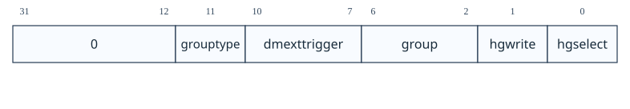<figcaption>图：寄存器位域图：3.14.17 调试模块控制和状态 2（dmcs2，位于 0x32）</figcaption></figure>

| 字段 | 描述 | 访问 | 复位 |
| --- | --- | --- | --- |
|  `grouptype` | 0（暂停）：该寄存器中的其余字段配置暂停组。 1（恢复）：该寄存器中的其余字段配置恢复组。 | **WARL** | 0 |
|  `dmexttrigger` | 该字段包含当前选择的 DM 外部触发。 如果此处写入不存在的触发值，则如果不存在 DM 外部触发，硬件会将其更改为有效的1或0。 | **WARL** | 0 |
|  `group` | 当 `hgselect`=0 时，返回 `hartsel` 指定 hart 所属的组；当 `hgselect`=1 时，返回 `dmexttrigger` 选定的 DM 外部触发器所属的组。<br>除非同次写入还将 `hgwrite` 置 1，否则写入本字段的值会被忽略。组号从 0 起连续编号；最大组号取决于实现，且不同类型的组可能不同。调试器写入后应读回本字段，以确认所用 hart 组受支持。未实现分组功能时，本字段恒为 0。 | **WARL** | 预设 |
|  `hgwrite` | 当写入 1 且 `hgselect` 为 0 时，对于每个选定的 hart，DM 会将其组更改为写入 `group` 的值（如果硬件支持该 hart 的该组）。如果由于硬件限制而有必要，实现也可以以相同的方式更改未选择的 hart 的最小集合的组。 当写入 1 且 `hgselect` 为 1 时，如果硬件支持该触发组，则 DM 会将 `dmexttrigger` 选择的 DM 外部触发组更改为写入 `group` 的值。 写0无效。 | **W1** | - |
|  `hgselect` | 0（harts）：对 hart 操作。<br>1（triggers）：对 DM 外部触发器操作。<br>若不存在 DM 外部触发器，硬件必须将本字段固定为 0。 | **WARL** | 0 |

#### 3.14.18 暂停状态汇总 0（`haltsum0`，位于 0x40）

该只读寄存器的每一位表示一个特定 hart 是否已暂停；不可用或不存在的 hart 均视为未暂停。

如果少于 2 个 hart 连接到该 DM，则该寄存器可能不存在。

最低位表示索引为 `{hartsel[19:5], 5'h0}` 的 hart 是否暂停，最高位表示索引为 `{hartsel[19:5], 5'h1f}` 的 hart 是否暂停。

整个寄存器是只读的。
<figure style="margin: 0.5em auto; text-align: center;"><figcaption>图：寄存器位域图：3.14.18 暂停状态汇总 0（haltsum0，位于 0x40）</figcaption></figure>

#### 3.14.19 暂停状态汇总 1（`haltsum1`，位于 0x13）

该只读寄存器的每一位表示对应的一组 hart 中是否至少有一个已暂停；不可用或不存在的 hart 均视为未暂停。

如果少于 33 个 hart 连接到该 DM，则该寄存器可能不存在。

最低位汇总索引范围 `{hartsel[19:10], 10'h0}`～`{hartsel[19:10], 10'h1f}`；最高位汇总 `{hartsel[19:10], 10'h3e0}`～`{hartsel[19:10], 10'h3ff}`。任一范围内有 hart 暂停，对应位即为 1。

整个寄存器是只读的。
<figure style="margin: 0.5em auto; text-align: center;"><figcaption>图：寄存器位域图：3.14.19 暂停状态汇总 1（haltsum1，位于 0x13）</figcaption></figure>

#### 3.14.20 暂停状态汇总 2（`haltsum2`，位于 0x34）

该只读寄存器的每一位表示对应的一组 hart 中是否至少有一个已暂停；不可用或不存在的 hart 均视为未暂停。

如果少于 1025 个 hart 连接到该 DM，则该寄存器可能不存在。

最低位汇总索引范围 `{hartsel[19:15], 15'h0}`～`{hartsel[19:15], 15'h3ff}`；最高位汇总 `{hartsel[19:15], 15'h7c00}`～`{hartsel[19:15], 15'h7fff}`。任一范围内有 hart 暂停，对应位即为 1。

整个寄存器是只读的。
<figure style="margin: 0.5em auto; text-align: center;"><figcaption>图：寄存器位域图：3.14.20 暂停状态汇总 2（haltsum2，位于 0x34）</figcaption></figure>

#### 3.14.21 暂停状态汇总 3（`haltsum3`，位于 0x35）

该只读寄存器的每一位表示对应的一组 hart 中是否至少有一个已暂停；不可用或不存在的 hart 均视为未暂停。

如果连接到该 DM 的 hart 数量少于 32769 个，则该寄存器可能不存在。

最低位汇总索引 `20'h00000`～`20'h07fff`；最高位汇总 `20'hf8000`～`20'hfffff`。任一范围内有 hart 暂停，对应位即为 1。

整个寄存器是只读的。
<figure style="margin: 0.5em auto; text-align: center;"><figcaption>图：寄存器位域图：3.14.21 暂停状态汇总 3（haltsum3，位于 0x35）</figcaption></figure>

#### 3.14.22 系统总线访问控制和状态（`sbcs`，位于 0x38）
<figure style="margin: 0.5em auto; text-align: center;">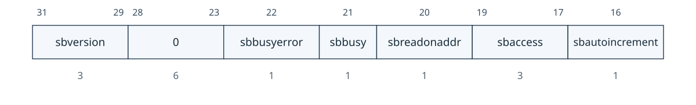<figcaption>图：寄存器位域图：3.14.22 系统总线访问控制和状态（sbcs，位于 0x38）</figcaption></figure>

<figure style="margin: 0.5em auto; text-align: center;">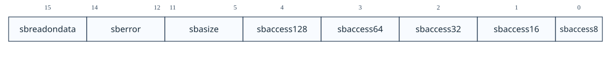<figcaption>图：寄存器位域图：3.14.22 系统总线访问控制和状态（sbcs，位于 0x38）</figcaption></figure>

| 字段 | 描述 | 访问 | 复位 |
| --- | --- | --- | --- |
|  `sbversion` | 0（legacy）：系统总线接口符合本规范 2018-01-01 之前的主线草案。<br>1（1.0）：接口符合本文档版本。<br>其他值保留。 | **R** | 1 |
|  `sbbusyerror` | 在读取未完成时尝试读取数据，或 `sbbusy`=1 时启动新的访问，会置位本字段。它保持置位，直到调试器显式清除；非零时 DM 不能再发起系统总线访问。 | **R/W1C** | 0 |
|  `sbbusy` | 为 1 时表示系统总线管理器忙；这与系统总线本身是否忙有关，但两者不是同一状态。任一读/写请求发出后，本位立即置 1，直至访问完全结束才清零。<br>当 `sbbusy`=1 时写 `sbcs` 的行为未定义；调试器必须等待读回 `sbbusy`=0 后才可写入 `sbcs`。 | **R** | 0 |
|  `sbreadonaddr` | 为 1 时，每次写入 `sbaddress0` 都会自动触发对新地址的系统总线读取。 | **R/W** | 0 |
|  `sbaccess` | 选择系统总线访问大小：0=8 位、1=16 位、2=32 位、3=64 位、4=128 位。DM 以不受支持的值发起访问时，不执行该访问，且 `sberror` 置为 4（`size`）。 | **R/W** | 2 |
|  `sbautoincrement` | 为 1 时，每次系统总线访问后，`sbaddress` 都会按 `sbaccess` 中选择的访问大小（以字节为单位）递增。 | **R/W** | 0 |
|  `sbreadondata` | 为 1 时，每次读取 `sbdata0` 都会自动触发对当前地址（可能已自动递增）的系统总线读取。 | **R/W** | 0 |
|  `sberror` | 系统总线管理器出错时置位；向相应位写 1 清除。非零时 DM 不能发起新的系统总线访问。实现可将任意错误报告为 7（other）。<br>0（none）：无错误。1（timeout）：超时。2（`address`）：地址错误。3（alignment）：对齐错误。4（`size`）：请求的访问大小不受支持。7（other）：其他错误。 | **R/W1C** | 0 |
|  `sbasize` | 系统总线地址宽度，单位为位；0 表示不支持系统总线访问。 | **R** | 预设 |
|  `sbaccess128` | 支持 128 位系统总线访问时为 1。 | **R** | 预设 |
|  `sbaccess64` | 支持 64 位系统总线访问时为 1。 | **R** | 预设 |
|  `sbaccess32` | 支持 32 位系统总线访问时为 1。 | **R** | 预设 |
|  `sbaccess16` | 支持 16 位系统总线访问时为 1。 | **R** | 预设 |
|  `sbaccess8` | 支持 8 位系统总线访问时为 1。 | **R** | 预设 |

#### 3.14.23 系统总线地址 31:0（`sbaddress0`，位于 0x39）

如果 `sbasize` 为 0，则该寄存器不存在。

当系统总线管理器繁忙时，写入该寄存器将设置 `sbbusyerror` 并且不执行任何其他操作。

如果 `sberror` 为 0，`sbbusyerror` 为 0，并且 `sbreadonaddr` 被设置，则写入该寄存器将启动以下操作：

1. 设置 `sbbusy`。
2. 从 `sbaddress` 的新值执行总线读取。
3. 如果读取成功并且设置了 `sbautoincrement`，则递增 `sbaddress`。
4. 清除 `sbbusy`。
<figure style="margin: 0.5em auto; text-align: center;"><figcaption>图：寄存器位域图：3.14.23 系统总线地址 31:0（sbaddress0，位于 0x39）</figcaption></figure>

| 字段 | 描述 | 访问 | 复位 |
| --- | --- | --- | --- |
|  `address` | 访问 `sbaddress`.中物理地址的位31:0 | **R/W** | 0 |

#### 3.14.24 系统总线地址 63:32（`sbaddress1`，位于 0x3a）

如果 `sbasize` 小于 33，则该寄存器不存在。

当系统总线管理器繁忙时，写入该寄存器将设置 `sbbusyerror` 并且不执行任何其他操作。
<figure style="margin: 0.5em auto; text-align: center;"><figcaption>图：寄存器位域图：3.14.24 系统总线地址 63:32（sbaddress1，位于 0x3a）</figcaption></figure>

| 字段 | 描述 | 访问 | 复位 |
| --- | --- | --- | --- |
|  `address` | 访问 `sbaddress` 中物理地址的位 63:32（如果系统地址总线那么宽）。 | **R/W** | 0 |

#### 3.14.25 系统总线地址 95:64（`sbaddress2`，位于 0x3b）

如果 `sbasize` 小于 65，则该寄存器不存在。

当系统总线管理器繁忙时，写入该寄存器将设置 `sbbusyerror` 并且不执行任何其他操作。
<figure style="margin: 0.5em auto; text-align: center;"><figcaption>图：寄存器位域图：3.14.25 系统总线地址 95:64（sbaddress2，位于 0x3b）</figcaption></figure>

| 字段 | 描述 | 访问 | 复位 |
| --- | --- | --- | --- |
|  `address` | 访问 `sbaddress` 中物理地址的位 95:64（如果系统地址总线那么宽）。 | **R/W** | 0 |

#### 3.14.26 系统总线地址 127:96（`sbaddress3`，位于 0x37）

如果 `sbasize` 小于 97，则该寄存器不存在。

当系统总线管理器繁忙时，写入该寄存器将设置 `sbbusyerror` 并且不执行任何其他操作。
<figure style="margin: 0.5em auto; text-align: center;"><figcaption>图：寄存器位域图：3.14.26 系统总线地址 127:96（sbaddress3，位于 0x37）</figcaption></figure>

| 字段 | 描述 | 访问 | 复位 |
| --- | --- | --- | --- |
|  `address` | 访问 `sbaddress` 中物理地址的位 127:96（如果系统地址总线那么宽）。 | **R/W** | 0 |

#### 3.14.27 系统总线数据 31:0（`sbdata0`，位于 0x3c）

如果 `sbcs` 中的所有 `sbaccess` 位均为 0，则该寄存器不存在。

任何成功的系统总线读取都会更新 `sbdata`。如果读访问的宽度小于 `sbdata` 的宽度，则剩余高位的内容可以取任意值。

如果 `sberror` 或 `sbbusyerror` 不为 0，则访问不会执行任何操作。

如果总线管理器忙，则访问设置 `sbbusyerror`，并且不执行任何其他操作。

写入该寄存器将启动以下操作：

1. 设置 `sbbusy`。
2. 将 `sbdata` 的新值执行总线写入 `sbaddress`。
3. 如果写入成功且 `sbautoincrement` 被置位，则递增 `sbaddress`。
4. 清除 `sbbusy`。

从此寄存器读取开始以下内容：

1. “返回”数据。
2. 设置 `sbbusy`。
3. 如果设置了 `sbreadondata`：
    1. 从 `sbaddress` 中包含的地址执行系统总线读取，并将结果放入 `sbdata` 中。
    2. 如果设置了 `sbautoincrement` 并且读取成功，则递增 `sbaddress`。
4. 清除 `sbbusy`。

只有 `sbdata0` 有此行为。其他 `sbdata` 寄存器没有副作用。在总线宽度超过 32 位的系统上，调试器应在访问其他 `sbdata` 寄存器后访问 `sbdata0`。
<figure style="margin: 0.5em auto; text-align: center;"><figcaption>图：寄存器位域图：3.14.27 系统总线数据 31:0（sbdata0，位于 0x3c）</figcaption></figure>

| 字段 | 描述 | 访问 | 复位 |
| --- | --- | --- | --- |
|  `data` | 访问 `sbdata`. 的位 31:0 | **R/W** | 0 |

#### 3.14.28 系统总线数据 63:32（`sbdata1`，位于 0x3d）

如果 `sbaccess64` 和 `sbaccess128` 为 0，则该寄存器不存在。

如果总线管理器忙，则访问设置 `sbbusyerror`，并且不执行任何其他操作。
<figure style="margin: 0.5em auto; text-align: center;"><figcaption>图：寄存器位域图：3.14.28 系统总线数据 63:32（sbdata1，位于 0x3d）</figcaption></figure>

| 字段 | 描述 | 访问 | 复位 |
| --- | --- | --- | --- |
|  `data` | 访问 `sbdata` 的位 63:32（如果系统总线那么宽）。 | **R/W** | 0 |

#### 3.14.29 系统总线数据 95:64（`sbdata2`，位于 0x3e）

仅当 `sbaccess128` 为 1 时该寄存器才存在。

如果总线管理器忙，则访问设置 `sbbusyerror`，并且不执行任何其他操作。
<figure style="margin: 0.5em auto; text-align: center;"><figcaption>图：寄存器位域图：3.14.29 系统总线数据 95:64（sbdata2，位于 0x3e）</figcaption></figure>

| 字段 | 描述 | 访问 | 复位 |
| --- | --- | --- | --- |
|  `data` | 访问 `sbdata` 的位 95:64（如果系统总线那么宽）。 | **R/W** | 0 |

#### 3.14.30 系统总线数据 127:96（`sbdata3`，位于 0x3f）

仅当 `sbaccess128` 为 1 时该寄存器才存在。

如果总线管理器忙，则访问设置 `sbbusyerror`，并且不执行任何其他操作。
<figure style="margin: 0.5em auto; text-align: center;"><figcaption>图：寄存器位域图：3.14.30 系统总线数据 127:96（sbdata3，位于 0x3f）</figcaption></figure>

| 字段 | 描述 | 访问 | 复位 |
| --- | --- | --- | --- |
|  `data` | 访问 `sbdata` 的位 127:96（如果系统总线那么宽）。 | **R/W** | 0 |

#### 3.14.31 自定义功能（自定义，位于 0x1f）

该可选寄存器可用于非标准功能。未来版本的调试规范将不会使用此地址。

#### 3.14.32 自定义功能 0（`custom0`，位于 0x70）

可选的 `custom0` 到 custom15 寄存器可用于非标准功能。调试规范的未来版本将不会使用这些地址。

## 4. Sdext（ISA 扩展）

> [!note]- Mote · 这是 hart 内部的调试规则
> DM 在芯片外部提出 halt/resume 请求；Sdext 定义 hart 进入 Debug Mode 后怎样保存现场、执行 Program Buffer、单步并从 `dpc` 返回。

本章介绍 Sdext ISA 扩展。必须实现它才能使外部调试工作，并且仅在与外部调试结合使用时才有用。

为了支持调试而对 RISC-V 内核进行的修改保持在最低限度。有一个特殊的执行模式（调试模式）和一些额外的 CSR。 DM 负责剩下的工作。

为了与本规范兼容，实现必须实现本章中描述的所有未明确列为可选的内容。

如果实现了 Sdext 而未实现 Sdtrig，则访问任何 Sdtrig CSR 都必须引发非法指令异常。

### 4.1 调试模式

调试模式是一种特殊的处理器模式，仅在 hart 处于 `halt` 状态以进行外部调试时使用。hart `halt` 期间，正常指令流不会前进。本规范不规定调试模式的具体实现方式。

当由于抽象命令而执行代码时，hart 保持在调试模式并且以下情况适用：

1. 所有已实现的指令的运行方式与 M 模式下的运行方式相同，除非此列表中提到了例外情况。
2. 所有操作均以机器模式权限执行，但可以访问附加调试模式 CSR，并且根据 `mprven`，`mstatus` 中的 `mprv` 可能会被忽略。完整的权限检查或一组宽松的权限检查将根据 `relaxedpriv` 进行应用。
3. 所有中断（包括 NMI）均被屏蔽。
4. 不会进入陷阱；异常会结束 Program Buffer 执行，hart 仍保持调试模式。由于不会陷入 M 模式，`mepc`、`mcause`、`mtval`、`mtval2`、`mtinst` 及其他通常在进入陷阱时更新的等效特权寄存器均不会更新。不过，在异常被识别前，作为指令执行一部分而允许更新的寄存器仍可能改变；例如，引发异常的向量加载/存储指令可能部分更新目标寄存器，并相应设置 `vstart`。
5. 触发器不匹配或触发。
6. `stopcount`=0 时，计数器继续计数；为 1 时，计数器冻结。
7. `stoptime`=0 时，`time` 继续更新；为 1 时，`time` 不更新。离开调试模式后，`time` 重新同步。
8. 会使 hart 进入等待状态的指令视作 `nop`，包括 `wfi`、`wrs.sto` 和 `wrs.nto`。
9. 几乎所有改变特权模式的指令都有未指定的行为。这包括 `ecall`、`mret`、`sret` 和 `uret`。 （要更改特权模式，调试器可以在 `dcsr` 中写入 `prv` 和 `v`）。唯一的例外是 `ebreak`，它在执行时结束程序缓冲区的执行。
10. 如果所有控制传输指令的目的地位于程序缓冲区中，则它们可能会充当非法指令。如果其中一条指令被视为非法指令，则所有此类指令都必须被视为非法指令。
11. 如果所有控制传输指令的目的地位于程序缓冲区之外，则它们可能会充当非法指令。如果其中一条指令被视为非法指令，则所有此类指令都必须被视为非法指令。
12. 依赖于 PC 值的指令（例如 `auipc`）可能会被视为非法指令。
13. 实现 Zicfilp 扩展时，`ELP` 状态为 `NO_LP_EXPECTED`，且不受任何指令更新；LPAD 指令按无操作执行。
14. XLEN 有效为 DXLEN。
15. 保证持续执行能够前进。

> [!note]
> 当 `mprven`=1 时，外部调试器可相应设置 MPRV 和 MPP，使硬件按正确的字节序、地址转换、权限检查及 PMP/PMA 检查（受 `relaxedpriv` 约束）执行内存访问。当 Sv32 hart 支持 34 位物理地址时，这也是访问全部物理内存的唯一方式。若硬件将 `mprven` 固定为 0，外部调试器应自行模拟 MPRV 的全部效果，包括会影响内存访问的扩展；因此建议将 `mprven` 固定为 1。

### 4.2 加载保留/条件存储指令

当进入调试模式或处于调试模式时，由 `lr` 指令在内存地址上注册的保留可能会丢失。这意味着如果在 `lr` 和 `sc` 对之间进入调试模式，则可能不会有任何进展。

> [!note]
> 这是调试用户必须注意的行为。如果他们在 `lr` 和 `sc` 对之间设置了断点，或者单步执行此类代码，则 `sc` 可能永远不会成功。幸运的是，在一般使用中，这样的序列中的指令很少，任何调试它的人都会很快注意到预留没有发生。这种情况的解决方案是在 `sc` 之后的第一条指令上设置断点并运行到该指令。更高级别的调试器可能会选择自动执行此操作。

### 4.3 等待中断指令

若执行 `wfi` 时收到暂停请求，hart 必须离开等待状态，完成该指令后进入调试模式。

### 4.4 等待保留集指令

若执行 `wrs.sto` 或 `wrs.nto` 时收到暂停请求，hart 必须离开等待状态，完成该指令后进入调试模式。

### 4.5 单步

> [!tip] Tips · 单步不是“执行一条后永远无中断”：`stepie` 决定是否允许中断；触发器和异常的优先级也会影响最终停下的位置。

#### 4.5.1 DCSR 中的步进位

此方法仅适用于外部调试器，并且是单步的首选方法。

外部调试器可以导致暂停的 hart 执行单个指令或陷阱，然后通过在恢复之前设置 `step` 重新进入调试模式。如果在 hart 恢复时设置了 `step`，则无论恢复原因如何，它将单步执行。

如果在执行指令时将控制权转移到陷阱处理程序，则在 PC 更改为陷阱处理程序后立即重新进入调试模式，并更新相应的 `tval` 和 `cause` 寄存器。在这种情况下，不会执行任何陷阱处理程序，并且如果原因是未决中断，则根本不会执行任何指令。

如果执行或获取指令导致触发器触发（`action`=1），则在该触发器触发后立即重新进入调试模式。在这种情况下，`cause` 设置为 2（触发）而不是 4（单步）。指令是否执行取决于触发器的具体配置。

如果执行的指令导致 PC 更改为指令获取导致异常的地址，则直到下次恢复 hart 时才会发生该异常。同样，在 hart 实际尝试执行该指令之前，新地址处的触发器不会触发。

若被跳过的指令通常会使 hart 进入等待状态，该指令视作 `nop`，包括 `wfi`、`wrs.sto` 和 `wrs.nto`。

#### 4.5.2 计数触发

本机调试器无法访问 `dcsr`，但可以通过将 `count` 设置为 1 来使用 `icount` 触发器。

这种方法确实有一些局限性：

1. 中断将照常触发。想要在单步执行时禁用中断的调试器必须通过更改 `mstatus` 来禁用中断，并专门处理读取 `mstatus` 的指令。
2. `wfi` 指令未经过特殊处理，可能需要很长时间才能完成。

该机制完整支持具有多个特权级的系统：操作系统或调试存根在 M 模式运行，被调试程序则处于较低特权级。仅支持 M 模式的系统也可使用 `icount`，但 `count` 必须能够计数多条指令，具体数量取决于软件实现。见 附录 B.3.1。

### 4.6 复位

hart 退出复位时，若 `halt` 信号（由 DM 中 hart 的 `halt` 请求位驱动）或 `hasresethaltreq` 置位，则它必须在执行任何指令前进入调试模式，但可先完成通常在第一条指令前进行的初始化。

### 4.7 Halt

当 hart 暂停时：

1. 更新 `cause`。
2. `prv` 和 `v` 设置为反映当前特权模式和虚拟化模式。
3. 若实现 Zicfilp 扩展，`pelp` 设为当前 `ELP` 状态，`ELP` 设为 `NO_LP_EXPECTED`。
4. `dpc` 被设置为应该执行的下一条指令。
5. 如果当前指令可以部分执行并且应该重新启动才能完成，则更新其相关状态。例如。如果在部分执行的向量指令期间发生暂停，则更新 `vstart`，并将 `dpc` 更新为部分执行的指令的地址。这类似于向量指令对于异常的行为方式。
6. hart 进入调试模式。

### 4.8 恢复

当 hart 恢复时：

1. `pc` 更改为 `dpc` 中存储的值。
2. 将当前的特权模式和虚拟化模式更改为 `prv` 和 `v` 指定的模式。
3. 如果在新特权模式下启用了 Zicfilp 扩展，则当前 `ELP` 状态将更改为 `pelp` 指定的状态，否则将设置为 `NO_LP_EXPECTED`。 `pelp` 设置为 `NO_LP_EXPECTED`。
4. 如果新特权模式的特权低于 M 模式，则 `mstatus` 中的 `MPRV` 被清除。
5. 如果实现了 Smdbltrp 扩展并且新的特权模式不是 M，则 `MDT` 位设置为 0。
6. 如果实现了 Ssdbltrp 扩展，并且新的特权模式是 U、VS 或 VU，则 `sstatus.SDT` 设置为 0。此外，如果是 VU，则 `vsstatus.SDT` 也设置为 0。
7. hart 不再处于调试模式。

### 4.9 核心调试寄存器

必须为每个可调试的 hart 实现受支持的内核调试寄存器。它们是 CSR，可以使用 RISC-V `csr` 操作码进行访问，也可以选择使用抽象调试命令。

尝试访问未实现的核心调试寄存器会引发非法指令异常。

这些寄存器只能从调试模式访问。

<table id="tab:core" style="margin: 0.25em auto 1em; border-collapse: collapse; table-layout: auto;">
  <caption style="caption-side: top; text-align: center !important; display: table-caption; width: 100%; font-weight: 600; padding-bottom: 0.2em; white-space: nowrap;"><span style="display: block; width: 100%; text-align: center !important;">表 7．核心调试寄存器</span></caption>
  <thead>
    <tr><th style="white-space: nowrap; text-align: center !important; vertical-align: middle;">地址</th><th style="white-space: nowrap; text-align: center !important; vertical-align: middle;">名称</th><th style="white-space: nowrap; text-align: center !important; vertical-align: middle;">章节</th></tr>
  </thead>
  <tbody>
    <tr><td style="white-space: nowrap;">0x7b0</td><td>调试控制和状态（<code>dcsr</code>）</td><td>第 4.9.1 节</td></tr>
    <tr><td style="white-space: nowrap;">0x7b1</td><td>调试 PC（<code>dpc</code>）</td><td>第 4.9.2 节</td></tr>
    <tr><td style="white-space: nowrap;">0x7b2</td><td>调试暂存寄存器 0（<code>dscratch0</code>）</td><td>第 4.9.3 节</td></tr>
    <tr><td style="white-space: nowrap;">0x7b3</td><td>调试暂存寄存器 1（<code>dscratch1</code>）</td><td>第 4.9.4 节</td></tr>
  </tbody>
</table>

#### 4.9.1 调试控制和状态（`dcsr`，位于 0x7b0）

进入调试模式后，`v` 和 `prv` 将更新为 hart 之前所处的权限级别，`cause` 将更新为进入调试模式的原因。除了这些字段和 `nmip` 之外，`dcsr` 的其他字段只能由外部调试器写入。

表 8 显示进入调试模式的原因的优先级。实施应实施表中所示的优先级。为了与本规范的旧版本兼容，允许 `resethaltreq` 和 `haltreq` 位于与所示不同的位置，只要：

1. `resethaltreq` 的优先级高于 `haltreq`
2. 其他四个原因的相对顺序保持不变

<table id="tab:dcsrcausepriority" style="margin: 0.25em auto 1em; border-collapse: collapse; table-layout: auto;">
  <caption style="caption-side: top; text-align: center !important; display: table-caption; width: 100%; font-weight: 600; padding-bottom: 0.2em; white-space: nowrap;"><span style="display: block; width: 100%; text-align: center !important;">表 8．进入调试模式的原因优先级（由高至低）</span></caption>
  <thead>
    <tr><th style="white-space: nowrap; text-align: center !important; vertical-align: middle;"><code>cause</code> 编码</th><th style="white-space: nowrap; text-align: center !important; vertical-align: middle;">原因</th></tr>
  </thead>
  <tbody>
    <tr><td style="white-space: nowrap;">5</td><td>复位后 <code>halt</code> 请求</td></tr>
    <tr><td style="white-space: nowrap;">6</td><td><code>halt</code> 组</td></tr>
    <tr><td style="white-space: nowrap;">3</td><td><code>halt</code> 请求</td></tr>
    <tr><td style="white-space: nowrap;">2</td><td>触发（详细优先级见 表 13）</td></tr>
    <tr><td style="white-space: nowrap;">1</td><td><code>ebreak</code></td></tr>
    <tr><td style="white-space: nowrap;">4</td><td>单步</td></tr>
  </tbody>
</table>

> [!note]
> 若 `mcontrol`/`mcontrol6` 触发器在命中指令之后的下一条指令上触发，则它被视为后续指令的高优先级原因。因此，在 `ebreak` 指令上以 `timing`=after 触发的执行触发器优先级低于 `ebreak` 本身，因为它发生在 `ebreak` 之后。同理，单条指令同时命中 `icount` 与 `step` 时，`step` 优先。`ebreak` 指令上各触发器的相对优先级见 表 13。多数多 hart 实现可将 `stoptime` 硬连线为 0，因为支持冻结时间会显著增加实现复杂度而收益有限。

该 CSR 是读/写的。
<figure style="margin: 0.5em auto; text-align: center;">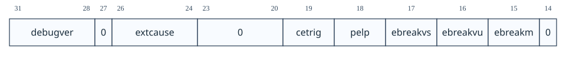<figcaption>图：寄存器位域图：4.9.1 调试控制和状态（dcsr，位于 0x7b0）</figcaption></figure>

<figure style="margin: 0.5em auto; text-align: center;">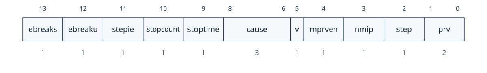<figcaption>图：寄存器位域图：4.9.1 调试控制和状态（dcsr，位于 0x7b0）</figcaption></figure>

| 字段          | 描述                                                                                                                                                                                                                                                                                                                                                                                                     | 访问       | 复位  |
| ----------- | ------------------------------------------------------------------------------------------------------------------------------------------------------------------------------------------------------------------------------------------------------------------------------------------------------------------------------------------------------------------------------------------------------ | -------- | --- |
| `debugver`  | 0（无）：没有调试支持。 4 (1.0)：存在调试支持，如本文档中所述。 15（自定义）：有调试支持，但不符合此规范的任何可用版本。                                                                                                                                                                                                                                                                                                                                     | **R**    | 预设  |
| `extcause`  | 仅当 `cause`=7 时有效：保存比“其他”更具体的暂停原因；其他情况下为 0。<br>0（critical error）：hart 进入 Smdbltrp 扩展定义的严重错误状态。<br>其他值保留给本规范后续版本或其他 RISC-V 扩展。                                                                                                                                                                                                                                                                           | **R**    | 0   |
| `cetrig`    | 该位是 Smdbltrp 的一部分，仅在实现该扩展时才存在。 0（禁用）：处于严重错误状态的 hart 不会进入调试模式，而是向平台断言严重错误信号。 1（启用）：处于严重错误状态的 hart 进入调试模式，而不是向平台断言严重错误信号。进入调试模式后，`cause` 字段设置为 7，`extcause` 字段设置为 0，表示严重错误触发了调试模式进入。在进入调试模式的所有原因中，该原因具有最高优先级。从严重错误状态进入后从调试模式恢复会将 hart 返回到严重错误状态。<br><strong>注：</strong>当 `cetrig` 为 1 时，由于严重错误而进入后从调试模式恢复将导致由于严重错误而立即重新进入调试模式。调试器可以在 `cetrig` 设置为 0 的情况下恢复，以允许平台定义的针对严重错误信号的操作发生。其他可能的操作包括使用调试模块复位控件启动 hart 或平台复位。 | **WARL** | 0   |
| `pelp`      | 该位是 Zicfilp 的一部分，仅在实现该扩展时才存在。 0 (NO_LP_EXPECTED)：不需要着陆垫指令。 1 (LP_EXPECTED)：预计有着陆垫指令。                                                                                                                                                                                                                                                                                                                   | **WARL** | 0   |
| `ebreakvs`  | 0（exception）：VS 模式执行 `ebreak` 时，行为遵循特权规范。<br>1（debug mode）：VS 模式执行 `ebreak` 时进入调试模式。<br>不支持虚拟化模式的 hart 将本位固定为 0。                                                                                                                                                                                                                                                                                       | **WARL** | 0   |
| `ebreakvu`  | 0（exception）：VU 模式执行 `ebreak` 时，行为遵循特权规范。<br>1（debug mode）：VU 模式执行 `ebreak` 时进入调试模式。<br>不支持虚拟化模式的 hart 将本位固定为 0。                                                                                                                                                                                                                                                                                       | **WARL** | 0   |
| `ebreakm`   | 0（exception）：M 模式执行 `ebreak` 时，行为遵循特权规范。<br>1（debug mode）：M 模式执行 `ebreak` 时进入调试模式。                                                                                                                                                                                                                                                                                                                     | **R/W**  | 0   |
| `ebreaks`   | 0（exception）：S 模式执行 `ebreak` 时，行为遵循特权规范。<br>1（debug mode）：S 模式执行 `ebreak` 时进入调试模式。<br>不支持 S 模式的 hart 将本位固定为 0。                                                                                                                                                                                                                                                                                         | **WARL** | 0   |
| `ebreaku`   | 0（exception）：U 模式执行 `ebreak` 时，行为遵循特权规范。<br>1（debug mode）：U 模式执行 `ebreak` 时进入调试模式。<br>不支持 U 模式的 hart 将本位固定为 0。                                                                                                                                                                                                                                                                                         | **WARL** | 0   |
| `stepie`    | 0（interrupts disabled）：`step` 置位的单步期间，禁用中断（包括 NMI）；实现应支持此值。<br>1（interrupts enabled）：单步期间使能中断（包括 NMI）。<br>实现可将本位固定为 0，此时调试器可自行模拟中断行为。hart 运行时，调试器不得改写本位。                                                                                                                                                                                                                                               | **WARL** | 0   |
| `stopcount` | 0（normal）：计数器照常递增。<br>1（freeze）：在调试模式中，或执行会进入调试模式的 `ebreak` 时，不递增任何 hart 本地计数器，包括 `instret` CSR。单 hart 核心上 `cycle` 应停止递增；多 hart 核心上则必须继续递增。<br>实现可将本位固定为 0 或 1。                                                                                                                                                                                                                                        | **WARL** | 预设  |
| `stoptime`  | 0（normal）：`time` 继续反映 `mtime`。<br>1（freeze）：进入调试模式时冻结 `time`；离开调试模式后，`time` 再次反映最新 `mtime` 值。所有 hart 的 `stoptime`=1 且均处于调试模式时，允许 `mtime` 停止递增。<br>实现可将本位固定为 0 或 1。                                                                                                                                                                                                                                     | **WARL** | 预设  |
| `cause`     | 说明进入调试模式的原因。同一周期存在多个原因时，硬件应记录优先级最高者，优先级见 表 8。<br>1（ebreak）：执行了 `ebreak`。<br>2（trigger）：触发模块触发，且 `action`=1。<br>3（`haltreq`）：调试器通过 `haltreq` 请求进入调试模式。<br>4（`step`）：`step` 置位导致 hart 单步。<br>5（`resethaltreq`）：`resethaltreq` 使 hart 直接在复位后暂停；报告为 3 也可接受。<br>6（`group`）：hart 因属于暂停组而暂停；报告为 3 也可接受。<br>7（other）：其他原因导致暂停；`extcause` 可能提供更具体的原因。                                                           | **R**    | 0   |
| `v`         | 与 `prv` 共同记录进入调试模式时 hart 的虚拟化模式；编码见 表 11。调试器可在退出调试模式时改写本位以改变虚拟化模式。不支持虚拟化模式的 hart 将本位固定为 0。                                                                                                                                                                                                                                                                                                             | **WARL** | 0   |
| `mprven`    | 0（禁用）：`mstatus` 中的 `mprv` 在调试模式下被忽略。 1（启用）：`mstatus` 中的 `mprv` 在调试模式下生效。 该位的实现是可选的。它可能与 0 或 1. 相关                                                                                                                                                                                                                                                                                                            | **WARL** | 预设  |
| `nmip`      | 设置时，hart 有一个不可屏蔽中断 (NMI) 待处理 由于 NMI 可以指示硬件错误情况，因此一旦设置该位，就可能无法再进行可靠的调试。这是依赖于实现的。                                                                                                                                                                                                                                                                                                                        | **R**    | 0   |
| `step`      | 当设置且未处于调试模式时，hart 将仅执行单个指令，然后进入调试模式。详细信息请参见第4.5.1。 hart 运行时，调试器不得更改该位的值。                                                                                                                                                                                                                                                                                                                               | **R/W**  | 0   |
| `prv`       | 记录进入调试模式时 hart 的特权模式；编码见 表 11。调试器可在退出调试模式时改写该值以改变特权模式。若写入的编码不受支持，或实现不允许调试器改写，hart 可切换到任一受支持的特权模式。                                                                                                                                                                                                                                                                                                      | **WARL** | 3   |

#### 4.9.2 调试 PC（`dpc`，位于 0x7b1）

进入调试模式后，`dpc` 将更新为要执行的下一条指令的虚拟地址。 表 9 中更详细地描述了该行为。

<table id="tab:dpc" style="margin: 0.25em auto 1em; border-collapse: collapse; table-layout: auto;">
  <caption style="caption-side: top; text-align: center !important; display: table-caption; width: 100%; font-weight: 600; padding-bottom: 0.2em; white-space: nowrap;"><span style="display: block; width: 100%; text-align: center !important;">表 9．DPC 中的虚拟地址</span></caption>
  <thead>
    <tr><th style="white-space: nowrap; text-align: center !important; vertical-align: middle;">原因</th><th style="white-space: nowrap; text-align: center !important; vertical-align: middle;">DPC 中的虚拟地址</th></tr>
  </thead>
  <tbody>
    <tr><td style="white-space: nowrap;"><code>ebreak</code></td><td><code>ebreak</code> 指令的地址</td></tr>
    <tr><td style="white-space: nowrap;">单步</td><td>如果没有进行调试，接下来要执行的指令的地址。 即， <code>pc</code> + 4 用于不改变程序流程、所采取的跳转/分支上的目标 PC 等的 32 位指令。</td></tr>
    <tr><td style="white-space: nowrap;">触发模块</td><td>进入调试模式时要执行的下一条指令的地址。如果触发器是 <code>mcontrol</code> 且 <code>timing</code> 为 0，或者触发器为 <code>mcontrol6</code> 且 <code>hit1</code> 为 0，则这对应于导致触发器触发的指令的地址。</td></tr>
    <tr><td style="white-space: nowrap;">停止请求</td><td>进入调试模式时要执行的下一条指令的地址。</td></tr>
  </tbody>
</table>

执行程序缓冲区可能会导致 `dpc` 的值变为 UNSPECIFIED。如果是这种情况，则必须可以使用未设置 `postexec` 的抽象命令来读/写 `dpc`。调试器必须尝试在停止和执行程序缓冲区之间保存 `dpc`，然后在离开调试模式之前恢复 `dpc`。

> [!note]
> 允许 `dpc` 在程序缓冲区执行时变为 UNSPECIFIED 允许直接实现，无需单独的 PC 寄存器，并且在执行程序缓冲区时需要使用 PC。

如果访问寄存器抽象命令支持在 hart 运行时读取 `dpc`，则读取的值应该是最近执行的指令的地址。

如果访问寄存器抽象命令支持在 hart 运行时写入 `dpc`，则执行程序应在写入发生后立即跳转到写入的地址。

`dpc` 的可写性遵循与特权规范中定义的 `mepc` 相同的规则。特别是，`dpc` 必须能够保存所有有效的虚拟地址，并且低位的可写性取决于 IALIGN。

恢复时，hart 的 PC 会更新为 `dpc` 中存储的虚拟地址。调试器可以写入 `dpc` 来更改 hart 的恢复位置。

该 CSR 是读/写的。
<figure style="margin: 0.5em auto; text-align: center;">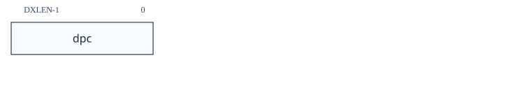<figcaption>图：寄存器位域图：4.9.2 调试 PC（dpc，位于 0x7b1）</figcaption></figure>

#### 4.9.3 调试暂存寄存器 0（`dscratch0`，位于 0x7b2）

可选的暂存寄存器可供需要它的实现使用。调试器不得写入该寄存器，除非 `hartinfo` 明确提及它（调试模块可以在内部使用该寄存器）。

该 CSR 是读/写的。
<figure style="margin: 0.5em auto; text-align: center;"><figcaption>图：寄存器位域图：4.9.3 调试暂存寄存器 0（dscratch0，位于 0x7b2）</figcaption></figure>

#### 4.9.4 调试暂存寄存器 1（`dscratch1`，位于 0x7b3）

可选的暂存寄存器可供需要它的实现使用。调试器不得写入该寄存器，除非 `hartinfo` 明确提及它（调试模块可以在内部使用该寄存器）。

该 CSR 是读/写的。
<figure style="margin: 0.5em auto; text-align: center;">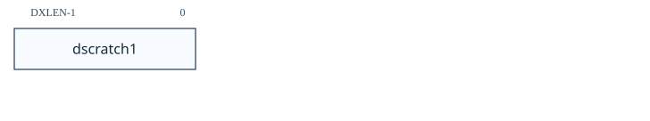<figcaption>图：寄存器位域图：4.9.4 调试暂存寄存器 1（dscratch1，位于 0x7b3）</figcaption></figure>

### 4.10 虚拟调试寄存器

虚拟调试寄存器并不直接存在于硬件中，但调试器会将其提供得如同真实存在。调试器软件应实现这些寄存器，硬件则可以忽略本节。它们使用户能够访问不属于标准调试寄存器的功能，同时无需直接改写调试器自身访问相同功能时所依赖的寄存器。

<table id="tab:virtual" style="margin: 0.25em auto 1em; border-collapse: collapse; table-layout: auto;">
  <caption style="caption-side: top; text-align: center !important; display: table-caption; width: 100%; font-weight: 600; padding-bottom: 0.2em; white-space: nowrap;"><span style="display: block; width: 100%; text-align: center !important;">表 10．虚拟 hart 调试寄存器</span></caption>
  <thead>
    <tr><th style="white-space: nowrap; text-align: center !important; vertical-align: middle;">地址</th><th style="white-space: nowrap; text-align: center !important; vertical-align: middle;">名称</th><th style="white-space: nowrap; text-align: center !important; vertical-align: middle;">章节</th></tr>
  </thead>
  <tbody>
    <tr><td style="white-space: nowrap;">虚拟</td><td>特权模式（<code>priv</code>）</td><td>第 4.10.1 节</td></tr>
  </tbody>
</table>

#### 4.10.1 特权模式（`priv`，虚拟地址）

调试器可读取本寄存器，检查 hart 进入 `halt` 状态时的特权模式；也可写入本寄存器，改变 hart 恢复运行时采用的特权模式。

本寄存器包含 `dcsr` 中的 `prv` 与 `v`，但位于用户预期访问的位置。用户不应直接访问 `dcsr`，否则可能干扰调试器。

<table id="tab:privmode" style="margin: 0.25em auto 1em; border-collapse: collapse; table-layout: auto;">
  <caption style="caption-side: top; text-align: center !important; display: table-caption; width: 100%; font-weight: 600; padding-bottom: 0.2em; white-space: nowrap;"><span style="display: block; width: 100%; text-align: center !important;">表 11．特权模式与虚拟化模式编码</span></caption>
  <thead>
    <tr><th style="white-space: nowrap; text-align: center !important; vertical-align: middle;">支持 H 扩展</th><th style="white-space: nowrap; text-align: center !important; vertical-align: middle;"><code>v</code></th><th style="white-space: nowrap; text-align: center !important; vertical-align: middle;"><code>prv</code></th><th style="white-space: nowrap; text-align: center !important; vertical-align: middle;">缩写</th><th style="white-space: nowrap; text-align: center !important; vertical-align: middle;">名称</th></tr>
  </thead>
  <tbody>
    <tr><td style="white-space: nowrap;">否</td><td>0</td><td>0</td><td>U</td><td>用户模式</td></tr>
    <tr><td style="white-space: nowrap;">否</td><td>0</td><td>1</td><td>S</td><td>监管者模式</td></tr>
    <tr><td style="white-space: nowrap;">否</td><td>0</td><td>3</td><td>M</td><td>机器模式</td></tr>
    <tr><td style="white-space: nowrap;">是</td><td>0</td><td>0</td><td>U</td><td>用户模式</td></tr>
    <tr><td style="white-space: nowrap;">是</td><td>0</td><td>1</td><td>HS</td><td>启用 Hypervisor 扩展的监管者模式</td></tr>
    <tr><td style="white-space: nowrap;">是</td><td>0</td><td>3</td><td>M</td><td>机器模式</td></tr>
    <tr><td style="white-space: nowrap;">是</td><td>1</td><td>0</td><td>VU</td><td>虚拟用户模式</td></tr>
    <tr><td style="white-space: nowrap;">是</td><td>1</td><td>1</td><td>VS</td><td>虚拟监管者模式</td></tr>
  </tbody>
</table>

<figure style="margin: 0.5em auto; text-align: center;"><figcaption>图：寄存器位域图：4.10.1 特权模式（priv，虚拟地址）</figcaption></figure>

| 字段 | 描述 | 访问 | 复位 |
| --- | --- | --- | --- |
|  `v` | 记录进入调试模式时 hart 的虚拟化模式。编码见 表 11，与特权规范中的虚拟化模式编码一致。调试器可在退出调试模式时写入该值，以改变 hart 的虚拟化模式。 | **WARL** | 0 |
|  `prv` | 记录进入调试模式时 hart 的特权模式。编码见 表 11，与特权规范中的特权模式编码一致。调试器可在退出调试模式时写入该值，以改变 hart 的特权模式。 | **R/W** | 0 |

## 5. Sdtrig（ISA 扩展）

> [!note]- Mote · Trigger 是“何时停”的硬件条件器
> `tselect` 选槽位，`tdata1/2/3` 配条件与比较值；命中后按 `action`、特权级、时序和优先级决定是否进入 Debug Mode 或产生异常。

本章介绍 Sdtrig ISA 扩展，该扩展可以独立于其他章节中描述的功能来实现。它仅由触发模块 (TM) 组成。

触发器可以导致断点异常、进入调试模式或跟踪操作，而无需执行特殊指令。这使得它们在调试 ROM 代码时非常有价值。它们可以在给定内存地址处的指令执行时触发，或者在加载/存储中的地址/数据上触发。

如果实现Sdtrig，触发模块必须支持至少一个触发。访问任何已实现的触发器均未使用的触发器 CSR 必定会导致非法指令异常。无论当前所选触发器的当前类型如何，对任何已实现触发器使用的触发器 CSR 的 M 模式和调试模式访问都必须成功。

当满足其指定的条件（例如来自特定地址的加载）时，触发器匹配。当匹配的触发器执行为该触发器配置的操作时，触发器就会触发。

在调试模式下触发器不会触发。

### 5.1 枚举

每个触发器可以支持多种功能。调试器可以构建所有触发器及其功能的列表，如下所示：

1. 将 0 写入 `tselect`。如果这导致非法指令异常，则不会执行任何触发器。
2. 读回 `tselect` 并检查其是否包含写入的值。如果不是，则退出循环。
3. 读取 `tinfo`。
4. 如果这导致了异常，调试器必须读取 `tdata1` 来发现类型。 （如果 `type` 为0，则该触发器不存在，退出循环。）
5. 如果 `info` 为1，则该触发器不存在。退出循环。
6. 否则，所选触发器支持 `info` 中发现的类型。
7. 重复上述操作，增加 `tselect` 中的值。

> [!note]
> 上述算法读回 `tselect`。具有 $2^n$ 个触发器的实现只需实现 `tselect` 的 $n$ 位。算法还会检查 `tinfo` 与 `type`，以应对实现拥有 $m$ 位 `tselect`、但实际触发器少于 $2^m$ 个的情况。

### 5.2 动作

触发器可以配置为在触发时执行多种操作之一。 表 12 列出了所有选项。

<table id="tab:action" style="margin: 0.25em auto 1em; border-collapse: collapse; table-layout: auto;">
  <caption style="caption-side: top; text-align: center !important; display: table-caption; width: 100%; font-weight: 600; padding-bottom: 0.2em; white-space: nowrap;"><span style="display: block; width: 100%; text-align: center !important;">表 12．action 编码</span></caption>
  <thead>
    <tr><th style="white-space: nowrap; text-align: center !important; vertical-align: middle;">值</th><th style="white-space: nowrap; text-align: center !important; vertical-align: middle;">描述</th></tr>
  </thead>
  <tbody>
    <tr><td style="white-space: nowrap;">0</td><td>引发断点异常。软件在未连接外部调试器时可用此动作；<code>xepc</code> 必须保存为保持程序流而必须执行的下一条指令的虚拟地址。</td></tr>
    <tr><td style="white-space: nowrap;">1</td><td>进入调试模式；<code>dpc</code> 必须保存为保持程序流而必须执行的下一条指令的虚拟地址。仅当触发器的 <code>dmode</code>=1 时该动作才合法；由于 <code>tdata1</code> 为 WARL，硬件必须阻止 <code>dmode</code>=0 且 <code>action</code>=1 的组合。仅当 hart 实现 Sdext 时才可支持本动作。</td></tr>
    <tr><td style="white-space: nowrap;">2</td><td>开启跟踪；详见跟踪规范。</td></tr>
    <tr><td style="white-space: nowrap;">3</td><td>关闭跟踪；详见跟踪规范。</td></tr>
    <tr><td style="white-space: nowrap;">4</td><td>发出跟踪通知；详见跟踪规范。</td></tr>
    <tr><td style="white-space: nowrap;">5</td><td>保留给跟踪规范使用。</td></tr>
    <tr><td style="white-space: nowrap;">8–9</td><td>分别向 TM 外部触发输出 0 或 1 发送信号。</td></tr>
    <tr><td style="white-space: nowrap;">其他</td><td>保留供将来使用。</td></tr>
  </tbody>
</table>
> [!note]
> 操作 8 和 9 旨在增加自定义事件计数器，但这些信号也可以传送到输出以供外部逻辑使用。

### 5.3 优先级

表 13 列出了特权规范中的同步异常，以及各种类型的触发器适合的位置。前 3 列来自特权规范，最后一列显示触发器适合的位置。表中的优先级由水平线分隔，因此例如 `etrigger` 和 `itrigger` 具有相同的优先级。如果此表与特权规范中的表相矛盾，则后者优先。

该表仅适用于触发器精确的情况。否则，触发器将在事件发生后的某个不确定时间触发，并且优先级无关紧要。当触发器被链接时，优先级是链中触发器的最低优先级。

<table id="tab:priority" style="margin: 0.25em auto 1em; border-collapse: collapse; table-layout: auto;">
  <caption style="caption-side: top; text-align: center !important; display: table-caption; width: 100%; font-weight: 600; padding-bottom: 0.2em; white-space: nowrap;"><span style="display: block; width: 100%; text-align: center !important;">表 13．同步异常优先级（由高至低）</span></caption>
  <thead>
    <tr><th style="white-space: nowrap; text-align: center !important; vertical-align: middle;">优先级</th><th style="white-space: nowrap; text-align: center !important; vertical-align: middle;">异常代码</th><th style="white-space: nowrap; text-align: center !important; vertical-align: middle;">描述</th><th style="white-space: nowrap; text-align: center !important; vertical-align: middle;">触发器</th></tr>
  </thead>
  <tbody>
    <tr><td style="white-space: nowrap;">最高</td><td>3<br>3<br>3<br>3</td><td>—</td><td><code>etrigger</code><br><code>icount</code><br><code>itrigger</code><br><code>mcontrol</code>/<code>mcontrol6</code>：after（作用于前一条指令）</td></tr>
    <tr><td style="white-space: nowrap;"></td><td>3</td><td>指令地址断点</td><td><code>mcontrol</code>/<code>mcontrol6</code>：执行地址 before</td></tr>
    <tr><td style="white-space: nowrap;"></td><td>12、20、1</td><td>指令地址转换期间：首次遇到的页错误、客体页错误或访问错误</td><td>—</td></tr>
    <tr><td style="white-space: nowrap;"></td><td>1</td><td>以物理地址取指时：指令访问错误</td><td>—</td></tr>
    <tr><td style="white-space: nowrap;"></td><td>3</td><td>—</td><td><code>mcontrol</code>/<code>mcontrol6</code>：执行数据 before</td></tr>
    <tr><td style="white-space: nowrap;"></td><td>2<br>22<br>0<br>8、9、10、11<br>3<br>3</td><td>非法指令<br>虚拟指令<br>指令地址未对齐<br>环境调用<br>环境断点<br>加载/存储/AMO 地址断点</td><td><code>mcontrol</code>/<code>mcontrol6</code>：加载/存储地址 before，存储数据 before</td></tr>
    <tr><td style="white-space: nowrap;"></td><td>4、6</td><td>可选：加载/存储/AMO 地址未对齐</td><td>—</td></tr>
    <tr><td style="white-space: nowrap;"></td><td>13、15、21、23、5、7</td><td>显式内存访问的地址转换期间：首次遇到的页错误、客体页错误或访问错误</td><td>—</td></tr>
    <tr><td style="white-space: nowrap;"></td><td>5、7</td><td>以物理地址显式访问内存时：加载/存储/AMO 访问错误</td><td>—</td></tr>
    <tr><td style="white-space: nowrap;"></td><td>4、6</td><td>若无更高优先级：加载/存储/AMO 地址未对齐</td><td>—</td></tr>
    <tr><td style="white-space: nowrap;">最低</td><td>3</td><td>—</td><td><code>mcontrol</code>/<code>mcontrol6</code>：加载数据 before</td></tr>
  </tbody>
</table>
当同一优先级的多个触发器同时触发时，将为所有触发器设置 `hit`（如果已实现）。如果这些触发器中有多个 `action`=0 ，则 `tval` 根据其中之一进行更新，但哪一个是 UNSPECIFIED 。如果这些触发器之一具有“进入调试模式”操作 (1)，而另一个触发器具有“引发断点异常”操作 (0)，则首选行为是同时执行这两个操作。两者中哪一个先发生取决于实现。这确保了外部调试器的存在不会影响执行，并且用户代码设置的触发器不会影响外部调试器。如果未实现，则 hart 必须进入调试模式并忽略断点异常。在后一种情况下，动作为 0 的触发器的 `hit` 仍必须被设置，从而使调试器有机会处理这种情况。由于动作为 0 或 1 以外的触发器不会影响 hart 的执行，因此优先级表中未提及它们。此类触发器独立于动作为 0 或 1 的触发器而触发。

### 5.4 原生触发器

> [!tip] Tips · 配置 trigger 前先枚举 `tselect`/`tinfo`。不同槽位支持的类型和可写字段可能不同；写入后应读回确认 WARL 约束后的值。

当 `action`=0 时，触发器可用于本机调试。如果 hart 支持并且调试器需要，触发器通常会被编程为 `m`=0，这样当它们触发时，它们会导致断点异常，从而陷入更特权的模式。该断点异常可以在 M 模式下进行，也可以委托给特权较低的模式。但是，触发器可能会以与处理结果异常相同的模式触发。

在这些情况下，此类触发器可能会在已处于陷阱处理程序中时导致断点异常。这可能会使 hart 无法恢复正常执行，因为 `mcause` 和 `mepc` 等状态将被覆盖。

> [!note]
> 具体来说，当 `action`=0时： `mcontrol` 和 `mcontrol6` 触发器与 `m`=1 可能会导致从 M 模式到 M 模式（无论委托如何）的断点异常。 如果 `medeleg` [3]=1，`mcontrol` 和 `mcontrol6` 触发器与 `s`=1 可能会导致从 S 模式到 S 模式的断点异常。 如果 `medeleg` [3]=1 且 `hedeleg` [3]=1，`mcontrol6` 触发器 `vs`=1 可能会导致从 VS 模式到 VS 模式的断点异常。 `icount` 触发器与 `m`=1 可能会导致从 M 模式到 M 模式（无论委托如何）的断点异常。 如果 `medeleg` [3]=1，`icount` 触发器 `s`=1 可能会导致从 S 模式到 S 模式的断点异常。 如果 `medeleg` [3]=1 且 `hedeleg` [3]=1，`icount` 触发器 `vs`=1 可能会导致从 VS 模式转到 VS 模式的断点异常。 `etrigger` 和 `itrigger` 触发器将始终在处理程序的第一条指令之前从陷阱处理程序中获取。如果 `etrigger`/`itrigger` 设置为在异常/中断 X 上触发，并且 X 被委托给模式 Y，则触发器将导致从模式 Y 到模式 Y 的断点异常，除非断点异常被委托给比 Y 更特权的模式。 `tmexttrigger` 触发是异步的，可以在任何模式下随时发生。

支持 `action`=0 触发器的 hart 应实现以下两种解决方案之一来解决重入问题：

1. 当处于 M 模式且 `mstatus` 中的 `MIE` 为 0 时，硬件会阻止 `action`=0 的触发器匹配或触发。如果 `medeleg` [3]=1，则它会阻止 `action`=0 的触发器在 S 模式下且 `sstatus` 中的 `SIE` 为 0 时匹配或触发。如果 `medeleg` [3]=1 和 `hedeleg` [3]=1 那么它会阻止 `action`=0 的触发器在 VS 模式下以及 `vstatus` 中的 `SIE` 为 0 时匹配或触发。
2. 实现 `tcontrol` 中的 `mte` 和 `mpte`。 `medeleg` [3] 硬连接到 0。

> [!note]
> 第一个选项有这样的限制：当用户仍希望触发触发器时，有时可能会禁用中断。它的好处是M模式下不需要处理断点。 第二个选项的优点是它仅在陷阱处理程序期间禁用触发器，尽管它需要 M 模式陷阱处理程序中的此调试功能的特定软件支持。仅当断点未委托给特权较低的模式时它才能工作，因此主要针对没有 S 模式的实现。 由于 `tcontrol` 无法访问 S 模式，因此在不添加额外的 S 模式和 VS 模式 CSR 的情况下，无法扩展第二个选项以适应委派。 这两个选项都可以防止 `etrigger` 和 `itrigger` 对 M 模式下处理的异常和中断产生任何影响。它们还可以防止在每个处理程序的某些初始部分期间触发。调试器应使用其他机制来调试这些情况，例如修补处理程序或在清除 `MIE` 后在指令上设置断点。

### 5.5 内存访问触发器

`mcontrol` 和 `mcontrol6` 均启用内存访问触发器。本节介绍了如何处理某些极端情况。

#### 5.5.1 扩展

如果支持 A 扩展，则加载/存储上的触发器将按如下方式处理它们：

1. `lr` 指令是加载。
2. 成功的 `sc` 指令被存储。
3. 未指定失败的 `sc` 指令是否存储。
4. 每条 AMO 指令都是操作读取部分的加载。该地址始终可用于触发，但加载的值可能不可用，具体取决于硬件实现。
5. 每条 AMO 指令都是用于操作写入部分的存储。该地址始终可用于触发。数据存储触发器是否在 AMO 上匹配尚未指定。
6. 如果任何加载或 AMO 的目标寄存器是 `zero`，则未指定数据加载触发是否匹配。

#### 5.5.2 组合访问

某些指令导致 hart 执行多次内存访问。这包括向量加载和存储，以及 `cm.push` 和 `cm.pop` 指令。触发模块应该匹配此类访问，就好像它们都是单独发生的一样。例如。矢量加载应被视为执行了大小为 SEW（所选元素宽度）的多个加载，而 `cm.push` 应被视为执行了大小为 XLEN 的多个存储。

#### 5.5.3 缓存操作

缓存操作很少执行，并且使用它们的代码可能存在难以发现的错误。为了调试触发器的目的，两类缓存操作必须匹配存储：

1. 高速缓存操作使软件能够保持原本不相干的隐式和显式存储器访问之间的一致性。
2. 执行常量数据块写入的缓存操作。

只有 `size`=0 和 `select`=0 的触发器才会匹配。由于缓存操作影响多个地址，因此有多个可能的值可供比较。实现必须实现以下选项之一。从最理想到最不理想，它们是：

1. 从向下舍入到最近的缓存块边界（含）的有效地址到向上舍入到最近的缓存块边界（不包括）的有效地址之间的每个地址都是一个比较值。
2. 向下舍入到最近的缓存块边界的有效地址是比较值。
3. 指令的有效地址是比较值。

编码为 HINT 的缓存操作与调试触发器不匹配。

> [!note]
> 上述语言旨在捕获与即将在 I/D 一致性扩展中引入的缓存操作相关的触发行为。 对于 RISC-V 基本缓存管理操作 ISA 扩展 1.0.1，这意味着以下内容： `cbo.clean`、`cbo.flush` 和 `cbo.inval` 会像存储一样进行匹配，因为它们会影响一致性。 `cbo.zero` 匹配就像存储一样，因为它执行常量数据的块写入。 预取指令根本不匹配。

#### 5.5.4 地址匹配

对于没有掩码的地址匹配，`tdata2` 必须能够在所有支持的转换模式下保存所有有效地址。这意味着在写入任何这些有效地址后，将读回完全相同的 XLEN 范围值，包括任何高位。实现可能能够优化所需的存储，具体取决于它支持的最宽地址。

> [!note]
> 如果物理地址小于XLEN位宽，则它们被零扩展。如果虚拟地址的宽度小于 XLEN 位，则对它们进行符号扩展。 `tdata2` 必须使用足够的存储位来实现，以表示软件读取和硬件使用时支持的全部物理和虚拟地址值。

##### 5.5.4.1 无效地址

如果 `tdata2` 可以保存任何无效地址，则不能按原样表示的无效地址的写入应转换为可以表示的不同无效地址。

对于无效指令获取地址以及加载和存储有效地址，可以将比较值改变为不同的无效地址。

此外，实现可以选择禁止所有与无效地址匹配的触发器，特别是在不支持在 `tdata2` 中存储任何无效地址值的情况下。

### 5.6 多状态变化指令

执行多个体系结构状态更改（例如，寄存器更新和/或内存访问）的指令可能会导致触发器在其执行的中间点触发。因此，截至该点的体系结构状态更改可能已执行，而从激活触发器的事件开始的后续状态更改可能尚未执行。这种指令的定义将指定架构状态改变发生的顺序。或者，它可能声明不允许部分执行，这意味着中间执行触发器必须防止发生任何架构状态更改。

调试器不会知道指令是否已部分执行。当它们恢复执行时，它们将再次执行相同的指令。因此，部分执行该指令然后再次执行该指令使 hart 处于与该指令仅执行一次时的状态非常相似的状态，这一点至关重要。

### 5.7 触发模块寄存器

这些寄存器是 CSR，可使用 RISC-V `csr` 操作码进行访问，也可以选择使用抽象调试命令。它们是访问触发器的唯一机制。

几乎所有触发器功能都是可选的。所有 `tdata` 寄存器都遵循 WARL（任意写入、合法读出）规则。如果调试器写入不支持的配置，寄存器将读回支持的值（可能只是禁用的触发器）。这意味着调试器必须始终读回写入 `tdata` 寄存器的值，除非它已经知道支持什么。对一个 `tdata` 寄存器的写入不得修改其他 `tdata` 寄存器的内容，也不得修改除当前所选触发器之外的任何触发器的配置。

这些规则的组合意味着调试器不能简单地通过先写入 `tdata1`，然后写入 `tdata2` 等来设置触发器。`tdata2` 的当前值对于 `tdata1` 的新值可能不合法。为了帮助解决这种情况，可以保证向 `tdata1` 写入 0 会禁用触发器，并使其处于可以向 `tdata2` 和 `tdata3` 写入对此触发器支持的任何触发器类型有意义的任何值的状态。

因此，调试器可以编写任何支持的触发器，如下所示：

1. 将 0 写入 `tdata1`。 （这将导致 `tdata1` 包含非零值，因为寄存器是 **WARL**。）
2. 将所需值写入 `tdata2` 和 `tdata3`。
3. 将所需值写入 `tdata1`。

恢复可能配置为在当前特权模式下触发的触发器的 CSR 上下文的代码必须使用相同的序列来恢复触发器。这避免了部分写入的触发器在与预期不同的时间触发的问题。

尝试访问未实现的触发模块寄存器会引发非法指令异常。

触发模块寄存器（`mscontext`、`scontext` 和 `hcontext` 除外）只能在机器和调试模式下访问，以防止不受信任的用户代码导致未经操作系统许可进入调试模式。

本节中的XLEN 指当前执行模式下有效的XLEN。在 XLEN 值在模式之间可能不同的系统上，按如下方式处理。无论 XLEN 如何，字段都会保留其值，这仅影响这些字段在寄存器中出现的位置（例如 `type`）。有些字段在 XLEN 为 64 时比为 32 时更宽（例如 `svalue`）。当 XLEN 为 32 时，此类字段中的高位保留其值，但不可读。当 XLEN 为 32 时修改寄存器会清除该寄存器中任何不可访问的位。

<table id="tab:trigger" style="margin: 0.25em auto 1em; border-collapse: collapse; table-layout: auto;">
  <caption style="caption-side: top; text-align: center !important; display: table-caption; width: 100%; font-weight: 600; padding-bottom: 0.2em; white-space: nowrap;"><span style="display: block; width: 100%; text-align: center !important;">表 14．触发模块寄存器</span></caption>
  <thead>
    <tr><th style="white-space: nowrap; text-align: center !important; vertical-align: middle;">地址</th><th style="white-space: nowrap; text-align: center !important; vertical-align: middle;">名称</th><th style="white-space: nowrap; text-align: center !important; vertical-align: middle;">部分</th></tr>
  </thead>
  <tbody>
    <tr><td style="white-space: nowrap;">0x5a8</td><td>主管上下文（<code>scontext</code>）</td><td>第 5.7.8 节</td></tr>
    <tr><td style="white-space: nowrap;">0x6a8</td><td>管理程序上下文 (<code>hcontext</code>)</td><td>第 5.7.7 节</td></tr>
    <tr><td style="white-space: nowrap;">0x7a0</td><td>触发选择（<code>tselect</code>）</td><td>第 5.7.1 节</td></tr>
    <tr><td style="white-space: nowrap;">0x7a1</td><td>触发数据1 (<code>tdata1</code>)</td><td>第 5.7.2 节</td></tr>
    <tr><td style="white-space: nowrap;">0x7a1</td><td>比赛控制 (<code>mcontrol</code>)</td><td>第 5.7.11 节</td></tr>
    <tr><td style="white-space: nowrap;">0x7a1</td><td>比赛控制类型 6 (<code>mcontrol6</code>)</td><td>第 5.7.12 节</td></tr>
    <tr><td style="white-space: nowrap;">0x7a1</td><td>指令计数（<code>icount</code>）</td><td>第 5.7.13 节</td></tr>
    <tr><td style="white-space: nowrap;">0x7a1</td><td>中断触发（<code>itrigger</code>）</td><td>第 5.7.14 节</td></tr>
    <tr><td style="white-space: nowrap;">0x7a1</td><td>异常触发器（<code>etrigger</code>）</td><td>第 5.7.15 节</td></tr>
    <tr><td style="white-space: nowrap;">0x7a1</td><td>外部触发（<code>tmexttrigger</code>）</td><td>第 5.7.16 节</td></tr>
    <tr><td style="white-space: nowrap;">0x7a2</td><td>触发数据2 (<code>tdata2</code>)</td><td>第 5.7.3 节</td></tr>
    <tr><td style="white-space: nowrap;">0x7a3</td><td>触发数据3 (<code>tdata3</code>)</td><td>第 5.7.4 节</td></tr>
    <tr><td style="white-space: nowrap;">0x7a3</td><td>额外触发器 (RV32) (<code>textra32</code>)</td><td>第 5.7.17 节</td></tr>
    <tr><td style="white-space: nowrap;">0x7a3</td><td>额外触发器 (RV64) (<code>textra64</code>)</td><td>第 5.7.18 节</td></tr>
    <tr><td style="white-space: nowrap;">0x7a4</td><td>触发信息（<code>tinfo</code>）</td><td>第 5.7.5 节</td></tr>
    <tr><td style="white-space: nowrap;">0x7a5</td><td>触发控制（<code>tcontrol</code>）</td><td>第 5.7.6 节</td></tr>
    <tr><td style="white-space: nowrap;">0x7a8</td><td>机器上下文（<code>mcontext</code>）</td><td>第 5.7.9 节</td></tr>
    <tr><td style="white-space: nowrap;">0x7aa</td><td>机器主管上下文（<code>mscontext</code>）</td><td>第 5.7.10 节</td></tr>
  </tbody>
</table>

#### 5.7.1 触发选择（`tselect`，位于 0x7a0）

该寄存器确定可通过其他触发模块寄存器访问哪个触发。如果没有实现触发器，则它是可选的。可访问的触发器集必须从 0 开始，并且是连续的。

该寄存器是**WARL**。写入大于或等于支持的触发器数量的值可能会导致该寄存器中的值与写入的值不同，或者可能指向 `type`=0 的触发器。为了验证他们写入的内容是否是有效的索引，调试器可以读回该值并检查 `tselect` 是否保存了他们写入的内容，并读取 `tdata1` 以查看 `type` 是否非零。

由于调试模式和 M 模式都可以使用触发器，因此外部调试器在修改该寄存器时必须恢复该寄存器。

该 CSR 是读/写的。
<figure style="margin: 0.5em auto; text-align: center;"><figcaption>图：寄存器位域图：5.7.1 触发选择（tselect，位于 0x7a0）</figcaption></figure>

#### 5.7.2 触发数据 1（`tdata1`，位于 0x7a1）

该寄存器提供对 `tselect` 选择的触发器的访问。此处列出的复位值适用于每个基础触发器。

如果没有实现触发器，则该寄存器是可选的。

向该寄存器写入 0 必定会导致触发器被禁用。如果此触发器支持多种类型，则硬件应通过将 `type` 更改为 15 来禁用它。

该 CSR 是读/写的。
<figure style="margin: 0.5em auto; text-align: center;">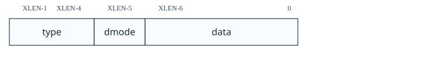<figcaption>图：寄存器位域图：5.7.2 触发数据 1（tdata1，位于 0x7a1）</figcaption></figure>

| 字段 | 描述 | 访问 | 复位 |
| --- | --- | --- | --- |
|  `type` | 0（none）：`tselect` 当前未选中触发器。<br>1（legacy）：传统 SiFive 地址匹配触发器；不应实现，本文不再规定。<br>2（`mcontrol`）：地址/数据匹配触发器；其余位的定义见 `mcontrol`。<br>3（`icount`）：指令计数触发器；见 `icount`。<br>4（`itrigger`）：中断触发器；见 `itrigger`。<br>5（`etrigger`）：异常触发器；见 `etrigger`。<br>6（`mcontrol6`）：增强型地址/数据匹配触发器；见 `mcontrol6`。它与类型 2 类似但功能更多，新实现应优先采用此类型。<br>7（`tmexttrigger`）：TM 外部触发源；见 `tmexttrigger`。<br>12～14（`custom`）：供非标准用途使用。<br>15（disabled）：触发器禁用。此时可向 `tdata2` 与 `tdata3` 写入该触发器任一支持类型允许的任意值；除 `dmode` 外的其余位均被忽略。<br>其他值保留。 | **WARL** | 预设 |
|  `dmode` | 若 `type`=0，本位固定为 0。<br>0（both）：调试模式和 M 模式均可写入当前 `tselect` 选定触发器的 `tdata` 寄存器。<br>1（`dmode`）：仅调试模式可写入选定触发器的 `tdata` 寄存器；其他模式的写入被忽略。<br>本位只能在调试模式写入。通常外部调试器配置触发器时总会置位本位；清零时，还应将 `action` 字段（其位置取决于 `type`）设置为非 1 值。 | **WARL** | 0 |
|  `data` | 若 `type`=0，本字段固定为 0；其余情况下为触发器专用数据。 | **WARL** | 预设 |

#### 5.7.3 触发数据 2（`tdata2`，位于 0x7a2）

该寄存器提供对 `tselect` 选择的触发器的访问。此处列出的复位值适用于每个基础触发器。

特定于触发器的数据。如果没有实现的触发器使用它，则它是可选的。

如果触发器被禁用，则可以使用该触发器支持的任何触发器类型支持的任何值写入该寄存器。

如果 XLEN 小于 DXLEN，则对该寄存器的写入将进行符号扩展。

该 CSR 是读/写的。
<figure style="margin: 0.5em auto; text-align: center;"><figcaption>图：寄存器位域图：5.7.3 触发数据 2（tdata2，位于 0x7a2）</figcaption></figure>

#### 5.7.4 触发数据 3（`tdata3`，位于 0x7a3）

该寄存器提供对 `tselect` 选择的触发器的访问。此处列出的复位值适用于每个基础触发器。

特定于触发器的数据。如果没有实现的触发器使用它，则它是可选的。

如果触发器被禁用，则可以使用该触发器支持的任何触发器类型支持的任何值写入该寄存器。

如果 XLEN 小于 DXLEN，则对该寄存器的写入将进行符号扩展。

该 CSR 是读/写的。
<figure style="margin: 0.5em auto; text-align: center;"><figcaption>图：寄存器位域图：5.7.4 触发数据 3（tdata3，位于 0x7a3）</figcaption></figure>

#### 5.7.5 触发信息（`tinfo`，位于 0x7a4）

该寄存器提供对 `tselect` 选择的触发器的访问。此处列出的复位值适用于每个基础触发器。

如果没有实现触发器，或者 `type` 不可写并且 `version` 将为 0，则该寄存器是可选的。在这种情况下，调试器可以从 `tdata1` 读取唯一支持的类型。

写入此读/写CSR 没有任何效果。
<figure style="margin: 0.5em auto; text-align: center;"><figcaption>图：寄存器位域图：5.7.5 触发信息（tinfo，位于 0x7a4）</figcaption></figure>

| 字段 | 描述 | 访问 | 复位 |
| --- | --- | --- | --- |
|  `version` | 实现的 Sdtrig 扩展版本。<br>0：支持 2023-02-02 提交 `5a5c078` 所述的触发器；在该旧版本中，`mcontrol6` 的时序位等同于 `timing`，`hit0` 的行为等同于 `hit`，`hit1` 为只读 0，且超过 64 位的 `size` 编码不同。<br>1：支持本文档批准的 1.0 版所述触发器。 | **R** | 预设 |
|  `info` | 对于 `tdata1` 中枚举的每个可能的 `type` 都有一个位。位 N 对应类型 N。如果设置该位，则当前选择的触发器支持该类型。 如果当前选择的触发器不存在，则该字段包含1. | **R** | 预设 |

#### 5.7.6 触发控制（`tcontrol`，位于 0x7a5）

该可选寄存器只能在 M 模式和调试模式下访问，并提供与触发器相关的各种控制位。

该 CSR 是读/写的。
<figure style="margin: 0.5em auto; text-align: center;">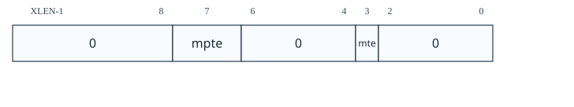<figcaption>图：寄存器位域图：5.7.6 触发控制（tcontrol，位于 0x7a5）</figcaption></figure>

| 字段 | 描述 | 访问 | 复位 |
| --- | --- | --- | --- |
|  `mpte` | M 模式“先前触发使能”字段。`mpte` 与 `mte` 可解决 M 模式陷阱处理程序中 `action`=0 的触发器触发问题，详见 第 5.4 节。发生任何进入 M 模式的陷阱时，硬件将 `mpte` 设为当前 `mte` 的值。 | **WARL** | 0 |
|  `mte` | M 模式触发使能字段。<br>0（disabled）：hart 处于 M 模式时，`action`=0 的触发器不匹配也不触发。<br>1（enabled）：hart 处于 M 模式时，触发器可以匹配和触发。<br>发生任何进入 M 模式的陷阱时，硬件将 `mte` 清零；执行 `mret` 时，硬件将 `mte` 恢复为 `mpte` 的值。 | **WARL** | 0 |

#### 5.7.7 虚拟机管理程序上下文（`hcontext`，位于 0x6a8）

仅当实现了 H 扩展时，才可以实现该可选寄存器。如果实现了，`mcontext` 也必须实现。

该寄存器只能在 HS 模式、M 模式和调试模式下访问。如果实现 Smstateen，则 HS 模式下的可访问性由 `mstateenzero[57]` 控制。

该寄存器是 `mcontext` 寄存器的别名，提供从 HS 模式对 `hcontext` 字段的访问。

#### 5.7.8 主管上下文（`scontext`，位于 0x5a8）

该可选寄存器只能在 S/HS 模式、VS 模式、M 模式和调试模式下访问。

CSR 的可访问性由 Smstateen 扩展中的 `mstateenzero[57]` 和 `hstateenzero[57]` 控制。在具有不交换 `scontext` 的虚拟机管理程序的虚拟化系统中，启用 `scontext` 可能会存在安全风险。

该 CSR 是读/写的。
<figure style="margin: 0.5em auto; text-align: center;">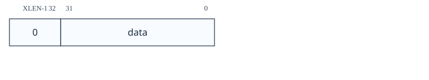<figcaption>图：寄存器位域图：5.7.8 主管上下文（scontext，位于 0x5a8）</figcaption></figure>

| 字段 | 描述 | 访问 | 复位 |
| --- | --- | --- | --- |
|  `data` | S 模式软件可向本寄存器写入上下文编号，以配置仅在该上下文中触发的触发器。实现可将任意数量的高位固定为 0；建议 RV32 实现 16 位、RV64 实现 32 位。 | **WARL** | 0 |

#### 5.7.9 机器上下文（`mcontext`，位于 0x7a8）

如果实现了 `hcontext`，则该寄存器必须实现，否则是可选的。它只能在 M 模式和调试模式下访问。

> [!note]
> `hcontext` 主要用于在虚拟机管理程序系统上设置触发器，这些触发器仅在给定 VM 执行时触发。它在 M-Mode 直接实现虚拟机管理程序之类的系统中也很有用。

该 CSR 是读/写的。
<figure style="margin: 0.5em auto; text-align: center;"><figcaption>图：寄存器位域图：5.7.9 机器上下文（mcontext，位于 0x7a8）</figcaption></figure>

| 字段 | 描述 | 访问 | 复位 |
| --- | --- | --- | --- |
|  `hcontext` | M 模式软件，或通过 `hcontext` 的 HS 模式软件，可向本寄存器写入上下文编号；该编号可用于配置仅在特定上下文中触发的触发器。实现可将任意数量的高位固定为 0。未实现 H 扩展时，建议 RV32 实现 6 位、RV64 实现 13 位；实现 H 扩展时，建议 RV32 实现 7 位、RV64 实现 14 位。 | **WARL** | 0 |

#### 5.7.10 机器主管上下文（`mscontext`，位于 0x7aa）

该可选寄存器是 `scontext` 的别名。它只能在 S/HS 模式、M 模式和调试模式下访问。包含它是为了向后兼容版本 0.13。

> [!note]
> 此 CSR 的编码不符合特权规范中的 CSR 地址编码约定。预计新的实现将不支持此编码，并且如果 `scontext` 可用，新的调试器将不会使用此 CSR。

#### 5.7.11 匹配控制（`mcontrol`，位于 0x7a1）

该寄存器提供对 `tselect` 选择的触发器的访问。此处列出的复位值适用于每个基础触发器。

当 `type` 为 2 时，此寄存器可作为 `tdata1` 访问。此触发类型已弃用。包含它是为了向后兼容版本 0.13。

> [!note]
> 此触发器类型仅支持较新的 `mcontrol6` 的部分功能。预计新的实现将不支持此触发类型，并且如果 `mcontrol6` 可用，新的调试器将不会使用它。

地址和数据触发的实现在很大程度上取决于处理器内核的实现方式。为了适应各种实现，执行、加载和存储地址/数据触发器可以在最方便实现的任何时间点触发。调试器可能会请求 `timing` 中所述的特定时序。 表 15 建议最佳用户体验的时间安排。

不具有相同 `timing` 值的触发器链永远不会触发。这意味着要实现 表 15 中的建议，可以与加载数据触发器链接的加载地址触发器都应支持两种时序。

特权规范规定，指令获取、加载或存储时发生的断点异常会用零或错误虚拟地址更新 `tval` CSR。 `action`=0 的 `mcontrol` 触发器的错误虚拟地址是正在访问并导致该触发器触发的地址。如果多个 `mcontrol` 触发器被链接，则错误虚拟地址是导致任何链接触发器触发的地址。

如果为此触发器实现 `textra32` 或 `textra64`，则仅当满足其中设置的条件时才匹配。

该 CSR 是读/写的。
<figure style="margin: 0.5em auto; text-align: center;">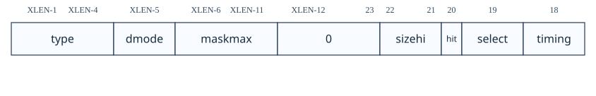<figcaption>图：寄存器位域图：5.7.11 匹配控制（mcontrol，位于 0x7a1）</figcaption></figure>

<figure style="margin: 0.5em auto; text-align: center;">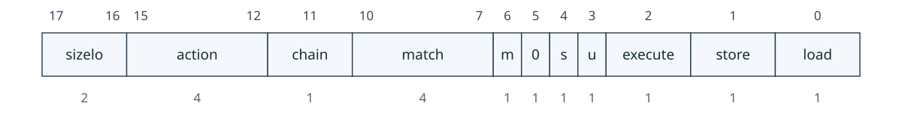<figcaption>图：寄存器位域图：5.7.11 匹配控制（mcontrol，位于 0x7a1）</figcaption></figure>

| 字段 | 描述 | 访问 | 复位 |
| --- | --- | --- | --- |
|  `maskmax` | 当 `match`=1 时，指定硬件支持的最大自然对齐 2 的幂（NAPOT）范围。该值是该范围字节数的以 2 为底对数。值 0 表示不支持 `match`=1；值 63 对应大小为 $2^{63}$ 字节的最大 NAPOT 范围。 | **R** | 预设 |
|  `sizehi` | 仅当 XLEN 至少为 64 时存在。它保存访问大小编码的高 2 位；低位见 `sizelo`。 | **WARL** | 0 |
|  `hit` | 如果该位被实现，那么当该触发器触发时它必须被置位，并且当该触发器匹配时它可能被置位。触发器的用户可以随时设置或清除它。它用于确定匹配的触发器。如果该位没有实现，则始终为0，写入无效。 | **WARL** | 0 |
|  `select` | 决定 XLEN 位比较值的内容。<br>0（地址）：至少有一个比较值包含访问的最低虚拟地址；建议同时提供其他访问字节的虚拟地址作为额外比较值。例如，读取 `0x4000` 起始的 32 位数据时，最低地址为 `0x4000`，其他地址为 `0x4001`、`0x4002`、`0x4003`。<br>1（数据）：仅有一个比较值，包含加载/存储的数据值或执行的指令；超出数据访问大小的位为 0。 | **WARL** | 0 |
|  `timing` | 0（before）：在触发指令提交前、且所有先前指令已提交后执行该触发器的操作；`xepc` 或 `dpc`（取决于 `action`）必须指向匹配指令的虚拟地址。若同时设置 `load` 与 `select`=1，内存访问及其副作用仍会发生，即使加载不会更新目标寄存器；触发指令执行多个内存访问时，哪些访问已在触发前完成未指定。<br>1（after）：在触发指令提交后执行操作，且应在下一条指令提交前进行；`xepc` 或 `dpc` 必须指向下一条待执行指令的虚拟地址。多数硬件只实现一种时序，且可能依赖 `select`、`execute`、`load`、`store`；本字段主要用于向调试器报告时序，也可实现为可写以提供更多控制。调试器让 hart 继续运行时，`timing`=0 的数据加载触发器会使同一加载再次发生，因此数据加载断点应先尝试 `timing`=1。`timing`=0 的触发器匹配时是否阻止 `timing`=1 的触发器匹配，取决于实现。 | **WARL** | 0 |
|  `sizelo` | 访问大小的低 2 位；高位来自 `sizehi`。组合值：0（任意）尝试匹配任意大小访问，但仅当 `select`=0 或访问大小为 XLEN 时有明确定义；1/2/3 分别匹配 8/16/32 位内存访问或相同长度的指令执行；4、6、7、8 分别匹配 48、80、96、112 位指令执行；5、9 分别匹配 64、128 位内存访问或指令执行。<br>实现必须支持值 0，其他值可选。地址触发器应支持 hart 所支持的每种访问大小与指令长度；数据值触发器受 `tdata2` 宽度限制，只能支持不超过 XLEN 位的访问大小，并建议支持 hart 所支持、且不超过 XLEN 的各访问大小与指令长度。 | **WARL** | 0 |
|  `action` | 触发器匹配后执行的动作；各编码见 表 12。 | **WARL** | 0 |
|  `chain` | 0（禁用）：该触发器匹配时执行已配置操作。1（启用）：在该触发器尚未匹配时，阻止下一个索引的触发器匹配。触发器链从 `chain`=0 之后第一个 `chain`=1 的触发器开始；若第一个触发器的 `chain`=1，则从它开始。链在之后第一个 `chain`=0 的触发器处结束，且该最终触发器仍属于链。除最终触发器外的 `action` 均被忽略；仅当链内全部触发器同时匹配时，才执行最终触发器的 `action`。调试器不应让不同类型的触发器组成同一链，此类情形的触发行为未定义。由于 `chain` 影响下一个触发器：若写入本寄存器时将 `dmode` 置 0、而下一个触发器的 `dmode` 为 1，硬件必须将 `chain` 清零；若前一个触发器的 `dmode`=0 且 `chain`=1，硬件应忽略将本触发器 `dmode` 置 1 的写入。调试器写入本寄存器前必须检查前一个触发器的 `chain`，避免后一种情形。 | **WARL** | 0 |
|  `match` | 0（相等）：任一比较值等于 `tdata2` 时匹配。1（NAPOT）：任一比较值的最高 `M` 位与 `tdata2` 的最高 `M` 位相同则匹配；`M` 为 `XLEN-1` 减去 `tdata2` 中最低一个值为 0 的位索引。调试器仅可写入满足 `M + maskmax ≥ XLEN` 且 `M > 0` 的值，否则匹配行为未定义。2（ge）：任一比较值按无符号数大于或等于 `tdata2` 时匹配。3（lt）：任一比较值按无符号数小于 `tdata2` 时匹配。4（掩码低）：比较值低 `XLEN/2` 位应等于 `tdata2` 的低 `XLEN/2` 位与比较值高 `XLEN/2` 位按位 AND 的结果。5（掩码高）：比较值高 `XLEN/2` 位应等于 `tdata2` 的低 `XLEN/2` 位与比较值低 `XLEN/2` 位按位 AND 的结果。8、9、12、13 分别是模式 0、1、4、5 的反向匹配。其他值保留。所有比较只使用当前模式下比较值与 `tdata2` 的低 XLEN 位；当 `select`=1 且访问大小为 `N` 时，比较进一步限制为低 `N` 位。 | **WARL** | 0 |
|  `m` | 设置时，在M模式下启用此触发器。 | **WARL** | 0 |
|  `s` | 设置后，在 S/HS 模式下启用此触发器。如果 hart 不支持 S 模式，则该位硬连线为 0。 | **WARL** | 0 |
|  `u` | 设置时，在 U 模式下启用此触发器。如果 hart 不支持 U 模式，则该位硬连线为 0。 | **WARL** | 0 |
|  `execute` | 设置后，触发器在所执行指令的虚拟地址或操作码上触发。 | **WARL** | 0 |
|  `store` | 设置后，触发器在任何存储的虚拟地址或数据上触发。 | **WARL** | 0 |
|  `load` | 设置后，触发器在任何加载的虚拟地址或数据上触发。 | **WARL** | 0 |

#### 5.7.12 匹配控制类型 6（`mcontrol6`，位于 0x7a1）

该寄存器提供对 `tselect` 选择的触发器的访问。此处列出的复位值适用于每个基础触发器。

当 `type` 为 6 时，该寄存器可作为 `tdata1` 访问。

如此处所述实现此触发器要求 `version` 为 1 或更高，这又意味着必须实现 `tinfo`。

这在较新的实现中取代了 `mcontrol` 并用于提供附加功能。

地址和数据触发的实现在很大程度上取决于处理器内核的实现方式。为了适应各种实现，执行、加载和存储地址/数据触发器可以在最方便实现的任何时间点触发。

表 15 建议最佳用户体验的时间安排。基本原则是在指令之前触发可以让用户更深入地了解，因此更可取。但是，根据指令和条件，在指令部分执行之前可能无法评估触发器。在这种情况下，最好让指令在触发器触发之前退出，以避免可能影响系统状态的额外内存访问。

<table id="tab:hwbp_timing" style="margin: 0.25em auto 1em; border-collapse: collapse; table-layout: auto;">
  <caption style="caption-side: top; text-align: center !important; display: table-caption; width: 100%; font-weight: 600; padding-bottom: 0.2em; white-space: nowrap;"><span style="display: block; width: 100%; text-align: center !important;">表 15．建议的触发时序</span></caption>
  <thead>
    <tr><th style="white-space: nowrap; text-align: center !important; vertical-align: middle;">匹配类型</th><th style="white-space: nowrap; text-align: center !important; vertical-align: middle;">建议的触发时机</th></tr>
  </thead>
  <tbody>
    <tr><td style="white-space: nowrap;">执行地址</td><td>之前</td></tr>
    <tr><td style="white-space: nowrap;">执行指令</td><td>之前</td></tr>
    <tr><td style="white-space: nowrap;">执行地址+指令</td><td>之前</td></tr>
    <tr><td style="white-space: nowrap;">加载地址</td><td>之前</td></tr>
    <tr><td style="white-space: nowrap;">加载数据</td><td>之后</td></tr>
    <tr><td style="white-space: nowrap;">加载地址+数据</td><td>之后</td></tr>
    <tr><td style="white-space: nowrap;">存储地址</td><td>之前</td></tr>
    <tr><td style="white-space: nowrap;">存储数据</td><td>之前</td></tr>
    <tr><td style="white-space: nowrap;">存储地址+数据</td><td>之前</td></tr>
  </tbody>
</table>

仅当链中的每个触发器都与相同指令匹配时，触发器链才必须触发。

特权规范规定，指令获取、加载或存储时发生的断点异常会用零或错误虚拟地址更新 `tval` CSR。 `action`=0 的 `mcontrol6` 触发器的错误虚拟地址是正在访问并导致该触发器触发的地址。如果多个 `mcontrol6` 触发器被链接，则错误虚拟地址是导致任何链接触发器触发的地址。

在支持 `match` 模式 1 (NAPOT) 的实现中，并非所有 NAPOT 范围都受支持。支持从 $2^1$ 到 $2^{maskmax6}$ 的全部 NAPOT 范围，其中 $maskmax6 \ge 1$。`maskmax6` 的值可以由调试器通过以下顺序确定：

1. 写入 `tdata1`=0，以防 `mcontrol6` 触发器不支持当前 `tdata2` 值。
2. 写入 `tdata2`=0，`mcontrol6` 触发器始终支持该设置。
3. 写入 `tdata1`，其中 `type`=`mcontrol6` 且 `match`=1。
4. 读取 `match`。如果不是 1，则不支持 NAPOT 匹配。
5. 将所有值写入 `tdata2`。
6. 读取 `tdata2`。 maskmax6的值是最高有效0位的索引加1。

如果为此触发器实现 `textra32` 或 `textra64`，则仅当满足其中设置的条件时才匹配。

> [!note]
> `uncertain` 和 `uncertainen` 的存在是为了适应触发模块并非完全观察到每个内存访问的系统。可能的示例包括远 AMO 中的数据值，以及执行多个内存访问的指令（例如向量、入栈和出栈指令）访问的地址/数据/大小。 虽然存在处理这些情况的不确定机制，但它可能会导致无法使用的误报数量。如果 TM 能够完美地了解每次内存访问的细节，用户将获得更好的调试体验。

该 CSR 是读/写的。
<figure style="margin: 0.5em auto; text-align: center;">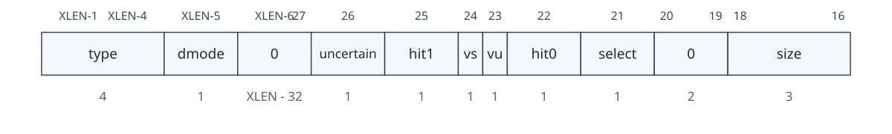<figcaption>图：寄存器位域图：5.7.12 匹配控制类型 6（mcontrol6，位于 0x7a1）</figcaption></figure>

<figure style="margin: 0.5em auto; text-align: center;">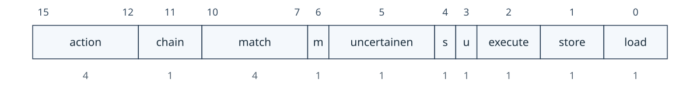<figcaption>图：寄存器位域图：5.7.12 匹配控制类型 6（mcontrol6，位于 0x7a1）</figcaption></figure>

| 字段 | 描述 | 访问 | 复位 |
| --- | --- | --- | --- |
|  `uncertain` | 如果实施，TM每次触发器触发时都会更新此字段。 0（确定）：触发的触发器满足配置的条件，或者该位未实现。 1（不确定）：触发的触发器可能未完全满足配置的条件。由于实现的原因，硬件无法确定。 | **WARL** | 0 |
|  `vs` | 设置时，在 VS 模式下启用此触发器。如果 hart 不支持虚拟化模式，则该位硬连线为 0。 | **WARL** | 0 |
|  `vu` | 设置后，在 VU 模式下启用此触发器。如果 hart 不支持虚拟化模式，则该位硬连线为 0。 | **WARL** | 0 |
|  `hit0` | 若实现，`hit1`（高位）与 `hit0`（低位）构成一个 2 位字段；触发器触发时，TM 更新该字段。调试器观察到更新后通常向其写 0，以便观察后续变化。未实现的位读为 0。<br>0（false）：触发器未触发。<br>1（before）：在匹配指令提交前、且所有先前指令已提交后触发；允许指令部分执行，见 第 5.6 节。`xepc` 或 `dpc`（取决于 `action`）必须指向匹配指令的虚拟地址。<br>2（after）：在触发指令及至少一条附加指令提交后触发；`xepc` 或 `dpc` 必须指向下一条待执行指令的虚拟地址。<br>3（immediately after）：触发指令刚提交后、任一后续指令执行前触发；`xepc` 或 `dpc` 必须指向下一条待执行指令的虚拟地址。若该指令进行了多次内存访问，所有访问均已完成。 | **WARL** | 0 |
|  `select` | 选择 XLEN 位比较值的内容。<br>0（`address`）：至少一个比较值包含访问的最低虚拟地址；建议同时提供该访问其他字节的虚拟地址作为额外比较值。例如，读取起始地址为 `0x4000` 的 32 位数据时，地址依次为 `0x4000`、`0x4001`、`0x4002`、`0x4003`。<br>1（`data`）：仅有一个比较值，包含加载/存储的数据值或正在执行的指令；超出访问数据大小的各位为 0。 | **WARL** | 0 |
|  `size` | 访问大小编码：0（任意）尝试匹配任意大小访问，但仅当 `select`=0 或访问大小为 XLEN 时有明确定义；1/2/3 分别匹配 8/16/32 位内存访问或相同长度的指令执行；4 匹配 48 位指令执行；5 匹配 64 位内存访问或指令执行；6 匹配 128 位内存访问或指令执行。<br>实现必须支持值 0，其他值可选。地址触发器应支持 hart 所支持的每种访问大小与指令长度；数据值触发器受 `tdata2` 宽度限制，只能支持不超过 XLEN 位的访问大小，并建议支持 hart 所支持、且不超过 XLEN 的各访问大小与指令长度。 | **WARL** | 0 |
|  `action` | 触发器触发时要采取的操作。这些值在 表 12 中进行了解释 | **WARL** | 0 |
|  `chain` | 0（禁用）：该触发器匹配时执行已配置操作。1（启用）：在该触发器尚未匹配时，阻止下一个索引的触发器匹配。触发器链从 `chain`=0 之后第一个 `chain`=1 的触发器开始；若第一个触发器的 `chain`=1，则从它开始。链在之后第一个 `chain`=0 的触发器处结束，且该最终触发器仍属于链。除最终触发器外的 `action` 均被忽略；仅当链内全部触发器同时匹配时，才执行最终触发器的 `action`。调试器不应让不同类型的触发器组成同一链，此类情形的触发行为未定义。由于 `chain` 影响下一个触发器：若写入本寄存器时将 `dmode` 置 0、而下一个触发器的 `dmode` 为 1，硬件必须将 `chain` 清零；若前一个触发器的 `dmode`=0 且 `chain`=1，硬件应忽略将本触发器 `dmode` 置 1 的写入。调试器写入本寄存器前必须检查前一个触发器的 `chain`，避免后一种情形。 | **WARL** | 0 |
|  `match` | 0（相等）、2（ge）、3（lt）、4（掩码低）、5（掩码高）、8、9、12、13 的含义与 `mcontrol` 的 `match` 相同。模式 1（NAPOT）使用 `maskmax6`：当 `tdata2` 的 `maskmax6-1:0` 位全为 1 时，WARL 规则会将位 `maskmax6-1` 读回为 0，且位 `maskmax6-2:0` 的值未指定。合法值必须满足 `M + maskmax6 ≥ XLEN` 且 `M > 0`；`M` 的定义同 `mcontrol`。所有比较只使用当前模式下比较值与 `tdata2` 的低 XLEN 位；当 `select`=1 且访问大小为 `N` 时，比较进一步限制为低 `N` 位。 | **WARL** | 0 |
|  `m` | 设置时，在M模式下启用此触发器。 | **WARL** | 0 |
|  `uncertainen` | 0（禁用）：只有硬件可以完美评估该触发器，该触发器才会匹配。 1（启用）：如果触发模块具有有关正在执行的操作的完整信息，则如果可能匹配，则此触发器将匹配。 | **WARL** | 0 |
|  `s` | 设置后，在 S/HS 模式下启用此触发器。如果 hart 不支持 S 模式，则该位硬连线为 0。 | **WARL** | 0 |
|  `u` | 设置时，在 U 模式下启用此触发器。如果 hart 不支持 U 模式，则该位硬连线为 0。 | **WARL** | 0 |
|  `execute` | 设置后，触发器在所执行指令的虚拟地址或操作码上触发。 | **WARL** | 0 |
|  `store` | 设置后，触发器在任何存储的虚拟地址或数据上触发。 | **WARL** | 0 |
|  `load` | 设置后，触发器在任何加载的虚拟地址或数据上触发。 | **WARL** | 0 |

#### 5.7.13 指令计数（`icount`，位于 0x7a1）

该寄存器提供对 `tselect` 选择的触发器的访问。此处列出的复位值适用于每个基础触发器。

当 `type` 为 3 时，该寄存器可作为 `tdata1` 访问。

此触发器在以下情况下匹配：

1. 指令在触发器启用的特权模式下被获取后退出。这明确包括来自各种模式的所有 RET 指令。
2. 从启用触发器的特权模式中获取陷阱。这明确包括由于中断而发生的陷阱。

如果在单条指令执行期间发生多个上述事件，则触发器仍然只对该指令匹配一次。

> [!note]
> 为支持单步，`icount` 必须匹配“处理程序返回后不会重新执行该指令”的陷阱，例如由特权软件模拟的非法指令，且被模拟指令永远不会提交。理想情况下，`icount` 不应匹配“处理程序稍后会重试该指令”的陷阱，例如特权软件修改页表后返回至最终会提交的缺页指令。区分两类情况会引入复杂规则，因此规范统一规定所有陷阱均应匹配。另见 第 4.5.2 节。

当 `count` 大于 1 且发生触发匹配时，`count` 减 1。

当 `count` 为 1 并且触发匹配时，则 `pending` 置位。此外，除非硬连线为 1，否则 `count` 将变为 0。

上述情况的唯一例外是当触发器匹配的指令是对 `icount` 触发器的写入时。在这种情况下，如果 `count` 为 1，则 `pending` 可能会也可能不会被设置。随后 `count` 包含新写入的值。

当 `count` 为 0 时，它会保持为 0，直到明确写入为止。

当设置 `pending` 时，触发器将在启用触发器的模式下执行任何进一步指令之前触发。当触发器触发时，`pending` 被清除。此外，如果 `count` 硬连线为 1，则 `m`、`s`、`u`、`vs` 和 `vu` 均被清零。

如果触发器在 `action`=0 的情况下触发，则断点陷阱上的 `tval` CSR 中将写入零。

> [!note]
> `pending` 的目的是干净地处理 `action` 为0、`m` 为0、`u` 为1、`count` 为1以及U模式指令的情况被执行会导致陷入 M 模式。在这种情况下，我们希望执行整个 M 模式处理程序，并在下一条 U 模式指令之前进行调试陷阱。

> [!note]
> 此触发类型旨在用作软件监控程序或本机调试的单步。支持多种特权模式的系统，想要调试在较低特权模式下运行的软件，不需要支持 `count` 大于 1.

如果为此触发器实现 `textra32` 或 `textra64`，则仅当满足其中设置的条件时才匹配。

该 CSR 是读/写的。
<figure style="margin: 0.5em auto; text-align: center;">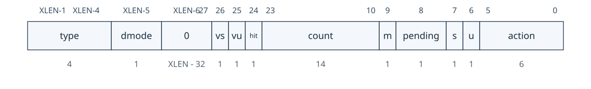<figcaption>图：寄存器位域图：5.7.13 指令计数（icount，位于 0x7a1）</figcaption></figure>

| 字段 | 描述 | 访问 | 复位 |
| --- | --- | --- | --- |
|  `vs` | 设置时，在 VS 模式下启用此触发器。如果 hart 不支持虚拟化模式，则该位硬连线为 0。 | **WARL** | 0 |
|  `vu` | 设置后，在 VU 模式下启用此触发器。如果 hart 不支持虚拟化模式，则该位硬连线为 0。 | **WARL** | 0 |
|  `hit` | 如果该位被实现，则当该触发器触发时硬件将其设置。触发器的用户可以随时设置或清除它。它用于确定触发哪个触发器。如果该位没有实现，则始终为0，写入无效。 | **WARL** | 0 |
|  `count` | 触发器通常会在启用模式下的 `count` 指令执行完毕后触发。请参阅上面的精确行为。 | **WARL** | 1 |
|  `m` | 设置时，在M模式下启用此触发器。 | **WARL** | 0 |
|  `pending` | 当 `count` 从 1 递减到 0 时，该位被置位。当触发器触发时，该位被清除，这将在启用模式之一执行下一条指令之前发生。 | **R/W** | 0 |
|  `s` | 设置后，在 S/HS 模式下启用此触发器。如果 hart 不支持 S 模式，则该位硬连线为 0。 | **WARL** | 0 |
|  `u` | 设置时，在 U 模式下启用此触发器。如果 hart 不支持 U 模式，则该位硬连线为 0。 | **WARL** | 0 |
|  `action` | 触发器触发时要采取的操作。这些值在 表 12 中进行了解释 | **WARL** | 0 |

#### 5.7.14 中断触发器（`itrigger`，位于 0x7a1）

该寄存器提供对 `tselect` 选择的触发器的访问。此处列出的复位值适用于每个基础触发器。

当 `type` 为 4 时，该寄存器可作为 `tdata1` 访问。

当发生中断陷阱时，可以触发此触发器。

通过设置 `tdata2` 中与中断号对应的位，可以对各个中断号启用它。中断号以陷阱处理程序执行的模式进行解释。（例如，虚拟中断号在每种模式下都不相同。）此外，可以使用 `nmi` 为不可屏蔽中断启用触发器。

> [!note]
> 如果 XLEN 为 32，则无法为异常代码大于 31 的中断设置触发器。RISC-V 特权规范的未来版本可能会定义中断异常代码 32 到 47。其中一些数字已被 RISC-V 高级中断架构使用。

硬件可能仅支持此触发器的中断子集。调试器必须在写入 `tdata2` 后读回它，以确认实际支持所请求的功能。

当触发器匹配时，它会在陷阱发生后、陷阱处理程序的第一条指令执行之前触发。如果 `action`=0，则更新标准 CSR 以获取断点陷阱，并将零写入相关的 `tval` CSR。如果断点陷阱没有进入更高权限模式，这将丢失原始陷阱的 CSR 信息。有关此案例的更多信息，请参阅 第 5.4 节。

如果为此触发器实现 `textra32` 或 `textra64`，则仅当满足其中设置的条件时才匹配。

该 CSR 是读/写的。
<figure style="margin: 0.5em auto; text-align: center;">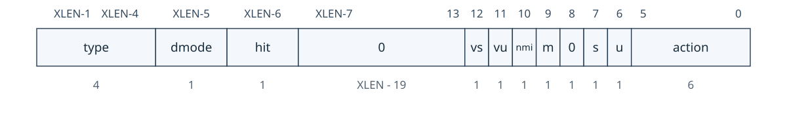<figcaption>图：寄存器位域图：5.7.14 中断触发器（itrigger，位于 0x7a1）</figcaption></figure>

| 字段 | 描述 | 访问 | 复位 |
| --- | --- | --- | --- |
|  `hit` | 如果该位被实现，则当该触发匹配时硬件将其置位。触发器的用户可以随时设置或清除它。它用于确定匹配的触发器。如果该位没有实现，则始终为0，写入无效。 | **WARL** | 0 |
|  `vs` | 置位后，为从 VS 模式获取的中断启用此触发器。如果 hart 不支持虚拟化模式，则该位硬连线为 0。 | **WARL** | 0 |
|  `vu` | 置位后，为从 VU 模式获取的中断启用此触发器。如果 hart 不支持虚拟化模式，则该位硬连线为 0。 | **WARL** | 0 |
|  `nmi` | 设置后，如果当前模式启用了触发器，则不可屏蔽中断会导致该触发器触发。 | **WARL** | 0 |
|  `m` | 置位后，启用此触发器以获取来自 M 模式的中断。 | **WARL** | 0 |
|  `s` | 置位后，为从 S/HS 模式获取的中断启用此触发器。如果 hart 不支持 S 模式，则该位硬连线为 0。 | **WARL** | 0 |
|  `u` | 置位后，为从 U 模式获取的中断启用此触发器。如果 hart 不支持 U 模式，则该位硬连线为 0。 | **WARL** | 0 |
|  `action` | 触发器触发时要采取的操作。这些值在 表 12 中进行了解释 | **WARL** | 0 |

#### 5.7.15 异常触发器（`etrigger`，位于 0x7a1）

该寄存器提供对 `tselect` 选择的触发器的访问。此处列出的复位值适用于每个基础触发器。

当 `type` 为 5 时，该寄存器可作为 `tdata1` 访问。

此触发器最多可在 `mcause` 中定义的异常代码（在特权规范中描述，中断 = 0）中触发 XLEN。这些原因可通过写入 `tdata2` 中的相应位来配置。 （例如，为了捕获非法指令，调试器设置 `tdata2` 中的位 2。）

> [!note]
> 如果 XLEN 为 32，则无法对高于 31 的异常代码设置触发器。RISC-V 特权规范的未来版本可能会定义异常代码 32 到 47。

硬件可能仅支持一部分异常。调试器必须在写入 `tdata2` 后读回它，以确认实际支持所请求的功能。

当触发器匹配时，它会在陷阱发生后、陷阱处理程序的第一条指令执行之前触发。如果 `action`=0，则更新标准 CSR 以获取断点陷阱，并将零写入相关的 `tval` CSR。如果断点陷阱没有进入更高权限模式，这将丢失原始陷阱的 CSR 信息。有关此案例的更多信息，请参阅 第 5.4 节。

如果为此触发器实现 `textra32` 或 `textra64`，则仅当满足其中设置的条件时才匹配。

该 CSR 是读/写的。
<figure style="margin: 0.5em auto; text-align: center;">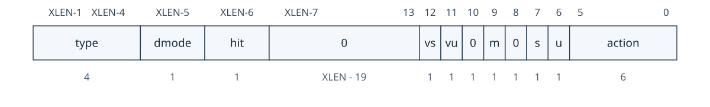<figcaption>图：寄存器位域图：5.7.15 异常触发器（etrigger，位于 0x7a1）</figcaption></figure>

| 字段 | 描述 | 访问 | 复位 |
| --- | --- | --- | --- |
|  `hit` | 如果该位被实现，则当该触发匹配时硬件将其置位。触发器的用户可以随时设置或清除它。它用于确定匹配的触发器。如果该位没有实现，则始终为0，写入无效。 | **WARL** | 0 |
|  `vs` | 设置后，为从 VS 模式获取的异常启用此触发器。如果 hart 不支持虚拟化模式，则该位硬连线为 0。 | **WARL** | 0 |
|  `vu` | 设置后，为从 VU 模式获取的异常启用此触发器。如果 hart 不支持虚拟化模式，则该位硬连线为 0。 | **WARL** | 0 |
|  `m` | 设置后，为从 M 模式获取的异常启用此触发器。 | **WARL** | 0 |
|  `s` | 设置后，为从 S/HS 模式获取的异常启用此触发器。如果 hart 不支持 S 模式，则该位硬连线为 0。 | **WARL** | 0 |
|  `u` | 设置后，为从 U 模式获取的异常启用此触发器。如果 hart 不支持 U 模式，则该位硬连线为 0。 | **WARL** | 0 |
|  `action` | 触发器触发时要采取的操作。这些值在 表 12 中进行了解释 | **WARL** | 0 |

#### 5.7.16 外部触发器（`tmexttrigger`，位于 0x7a1）

该寄存器提供对 `tselect` 选择的触发器的访问。此处列出的复位值适用于每个基础触发器。

当 `type` 为 7 时，该寄存器可作为 `tdata1` 访问。

当任何选定的 TM 外部触发输入信号时，该触发器触发。最多可以选择来自 TM 外部其他模块的 16 个 TM 外部触发输入（例如，发出 hpm 计数器溢出信号）。硬件可能不支持或仅支持几个 TM 外部触发输入（从 TM 外部触发输入 0 开始并按顺序继续）。不支持的输入被硬连线为不活动状态。

如果触发器在 `action`=0 的情况下触发，则断点陷阱上的 `tval` CSR 中将写入零。此触发器异步触发，但与其他触发器一样，它受 medeleg[3] 委托。

当由于 第 5.4 节 中的一种机制而阻止触发器触发时，TM 外部触发器输入可以发出信号。当无法触发时，实现可以完全忽略该信号（丢弃触发事件），或者可以将操作保持为挂起状态，并在合法时触发触发器。

> [!note]
> `intctl` 旨在由核心本地中断控制器 (CLIC) RISC-V 特权架构扩展中的 `clicinttrig` 机制使用。

该 CSR 是读/写的。
<figure style="margin: 0.5em auto; text-align: center;">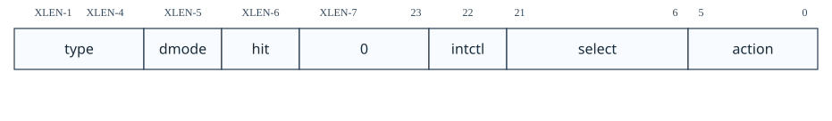<figcaption>图：寄存器位域图：5.7.16 外部触发器（tmexttrigger，位于 0x7a1）</figcaption></figure>

| 字段 | 描述 | 访问 | 复位 |
| --- | --- | --- | --- |
|  `hit` | 如果该位被实现，则当该触发匹配时硬件将其置位。触发器的用户可以随时设置或清除它。它用于确定匹配的触发器。如果该位没有实现，则始终为0，写入无效。 | **WARL** | 0 |
|  `intctl` | 此可选位设置后，每当连接的中断控制器发出触发信号时，都会导致该触发器触发。 | **WARL** | 0 |
|  `select` | 选择最多 16 个 TM 外部触发器输入的任意组合，导致该触发器触发。 | **WARL** | 0 |
|  `action` | 触发器触发时要采取的操作。这些值在 表 12 中进行了解释 | **WARL** | 0 |

#### 5.7.17 触发额外 (RV32)（`textra32`，位于 0x7a3）

该寄存器提供对 `tselect` 选择的触发器的访问。此处列出的复位值适用于每个基础触发器。

当 `type` 为 2、3、4、5 或 6 且 XLEN=32 时，该寄存器可作为 `tdata3` 进行访问。

如果 DXLEN \>= 64，则该寄存器提供对 `textra64` 中定义的每个字段的低位的访问。写入该寄存器将清除 `textra64` 中相应字段的高位。

该寄存器中的所有功能都是可选的。 `mhvalue` 和 `svalue` 的任意数量的高位都可以绑定到 0。`mhselect` 和 `sselect` 可能只支持 0（忽略）。

`scontext` 与 `svalue` 的字节粒度比较允许定义 `scontext` 以包括多个比较元素。例如，软件检测可以将 `scontext` 值编程为不同 ID 上下文（例如进程 ID 和线程 ID）的串联。然后，用户可以基于 `sbytemask` 对字节比较进行编程，以在比较中包含一个或多个上下文。

字节掩码仅适用于 `scontext` 比较；即当 `sselect` 为 1 时。

> [!note]
> 请注意，`sselect` 和 `mhselect` 过滤适用于所有模式，包括 M 模式和 S 模式。如果需要，调试器可以使用触发器的模式过滤位来将匹配限制为认为 ASID/VMID/`scontext`/`hcontext` 处于活动状态的模式。

该 CSR 是读/写的。
<figure style="margin: 0.5em auto; text-align: center;">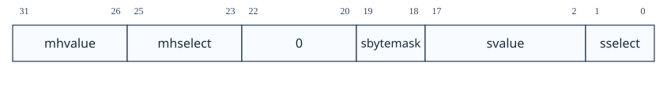<figcaption>图：寄存器位域图：5.7.17 触发额外 (RV32)（textra32，位于 0x7a3）</figcaption></figure>

| 字段 | 描述 | 访问 | 复位 |
| --- | --- | --- | --- |
|  `mhvalue` | 与 `mhselect` 配合使用的数据。 | **WARL** | 0 |
|  `mhselect` | 0（ignore）：忽略 `mhvalue`。<br>4（`mcontext`）：仅当 `mcontext`/`hcontext` 低位等于 `mhvalue` 时，本触发器才匹配或触发。<br>1、5（mcontext_select）：仅当上述上下文低位等于由 `mhvalue` 与 `mhselect[2]` 拼接得到的值时，才匹配或触发。<br>2、6（vmid_select）：仅当 `hgatp` 中的 VMID 等于该拼接值的低 VMIDMAX 位（见特权规范）时，才匹配或触发。<br>3、7（reserved）：保留。<br>未实现 H 扩展时，唯一合法值为 0 和 4。 | **WARL** | 0 |
|  `sbytemask` | 仅当 `sselect`=1 时有效：最低位为 1 时，比较忽略位 7:0；次低位为 1 时，比较忽略位 15:8。 | **WARL** | 0 |
|  `svalue` | 与 `sselect` 配合使用的数据。未支持 S 模式时，本字段应固定为 0。 | **WARL** | 0 |
|  `sselect` | 0（ignore）：忽略 `svalue`。<br>1（`scontext`）：仅当 `scontext` 的低位等于 `svalue` 时，触发器才匹配或触发。<br>2（asid）：仅当以下条件满足时匹配或触发：在 VS/VU 模式，`vsatp` 中的 ASID 等于 `svalue` 的低 ASIDMAX 位；其他模式下，`satp` 中的 ASID 等于该字段的低 ASIDMAX 位（ASIDMAX 见特权规范）。<br>未支持 S 模式时，本字段应固定为 0。 | **WARL** | 0 |

#### 5.7.18 触发额外 (RV64)（`textra64`，位于 0x7a3）

该寄存器提供对 `tselect` 选择的触发器的访问。此处列出的复位值适用于每个基础触发器。

当 `type` 为 2、3、4、5 或 6 且 XLEN=64 时，可将本寄存器作为 `tdata3` 访问；字段功能见 `textra32`。XLEN 改变时，本寄存器保留原值；XLEN=32 时，部分位可通过 `textra32` 访问。

`textra64` 中 `scontext` 与 `svalue` 的字节粒度比较允许定义 `scontext` 以包括多个比较元素。例如，软件检测可以将 `scontext` 值编程为不同 ID 上下文（例如进程 ID 和线程 ID）的串联。然后，用户可以基于 `sbytemask` 对字节比较进行编程，以在比较中包含一个或多个上下文。

字节掩码只用于 `scontext` 比较，即 `sselect`=1 时。

该 CSR 是读/写的。
<figure style="margin: 0.5em auto; text-align: center;">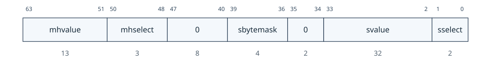<figcaption>图：寄存器位域图：5.7.18 触发额外 (RV64)（textra64，位于 0x7a3）</figcaption></figure>

| 字段 | 描述 | 访问 | 复位 |
| --- | --- | --- | --- |
|  `sbytemask` | 仅当 `sselect`=1 时有效：最低位为 1 时忽略比较位 7:0；第 2、3、4 位分别控制是否比较位 15:8、23:16、31:24。 | **WARL** | 0 |

## 6. 调试传输模块（DTM，非 ISA 扩展）

> [!note]- Mote · DTM 只负责搬运，不解释调试意图
> JTAG DTM 把扫描链事务转换成 DMI 读写；DMI 的 `busy`/`failed` 状态与 `idle` 周期要求，是 OpenOCD/JTAG 驱动稳定性的关键。

DTM 通过一种或多种传输方式（例如 JTAG 或 USB）提供对 DM 的访问。

一个硬件平台可包含多个 DTM。理想情况下，每个能够与外部通信的组件都包含 DTM，从而可通过其支持的任一传输方式调试平台。例如，带有 DTM 且能访问 DMI 的 USB 组件可用于经 USB 调试平台。

规范不支持同时使用多个 DTM；使用者必须避免这种情况。

本规范在 第 6.1 节 定义 JTAG DTM；未来版本可能加入其他 DTM。

实现可以与本规范兼容，而无需实现本节的任何内容。在这种情况下，它必须被宣传为符合“RISC-V 调试规范，带有自定义 DTM”。如果实现此处描述的 JTAG DTM，则必须将其声明为符合“RISC-V 调试规范，带有 JTAG DTM”。

### 6.1 JTAG 调试传输模块

> [!tip] Tips · 遇到 JTAG 访问异常，先读 `dtmcs`：确认版本、`abits`、`idle` 与 `dmistat`，必要时用 `dmireset` 清除粘滞失败状态。

该 DTM 基于标准 JTAG 测试访问端口（TAP）。访问任一 JTAG 寄存器时，先通过 JTAG 指令寄存器（IR）选中它，再经 JTAG 数据寄存器（DR）访问。

#### 6.1.1 JTAG 背景

JTAG 指 IEEE Std 1149.1-2013。它是一个定义测试逻辑的标准，可以包含在集成电路中，以测试集成电路之间的互连、测试集成电路本身以及观察或修改组件正常运行期间的电路活动。本规范使用后一种功能。 JTAG 标准定义了一个测试访问端口 (TAP)，可用于读写一些自定义寄存器，这些寄存器可用于与组件中的调试硬件进行通信。

#### 6.1.2 JTAG DTM 寄存器

用作 DTM 的 JTAG TAP 必须具有至少 5 位的 IR。当TAP复位时，IR必须默认为00001，选择IDCODE指令。 JTAG 寄存器及其编码的完整列表位于 表 16 中。如果 IR 实际上有超过 5 位，则 表 16 中的编码应在最高有效位中用 0 进行扩展，但 BYPASS 的 0x1f 编码必须在最高有效位中用 1 进行扩展。调试器可能使用的唯一常规 JTAG 寄存器是 BYPASS 和 IDCODE，但此规范为许多其他标准 JTAG 指令留出了 IR 空间。未实现的指令必须选择BYPASS寄存器。

<table id="tab:jtag_registers" style="margin: 0.25em auto 1em; border-collapse: collapse; table-layout: auto;">
  <caption style="caption-side: top; text-align: center !important; display: table-caption; width: 100%; font-weight: 600; padding-bottom: 0.2em; white-space: nowrap;"><span style="display: block; width: 100%; text-align: center !important;">表 16．JTAG DTM TAP 寄存器</span></caption>
  <thead>
    <tr><th style="white-space: nowrap; text-align: center !important; vertical-align: middle;">地址</th><th style="white-space: nowrap; text-align: center !important; vertical-align: middle;">名称</th><th style="white-space: nowrap; text-align: center !important; vertical-align: middle;">描述</th><th style="white-space: nowrap; text-align: center !important; vertical-align: middle;">部分</th></tr>
  </thead>
  <tbody>
    <tr><td style="white-space: nowrap;">0x00</td><td><code>bypass</code></td><td>JTAG 推荐此编码</td><td></td></tr>
    <tr><td style="white-space: nowrap;">0x01</td><td><code>idcode</code></td><td>识别特定的芯片版本</td><td>第 6.1.3 节</td></tr>
    <tr><td style="white-space: nowrap;">0x10</td><td>DTM 控制和状态 (<code>dtmcs</code>)</td><td>用于调试</td><td>第 6.1.4 节</td></tr>
    <tr><td style="white-space: nowrap;">0x11</td><td>调试模块接口访问（<code>dmi</code>）</td><td>用于调试</td><td>第 6.1.5 节</td></tr>
    <tr><td style="white-space: nowrap;">0x12</td><td>保留（绕过）</td><td>为未来RISC-V调试保留</td><td></td></tr>
    <tr><td style="white-space: nowrap;">0x13</td><td>保留（绕过）</td><td>为未来RISC-V调试保留</td><td></td></tr>
    <tr><td style="white-space: nowrap;">0x14</td><td>保留（绕过）</td><td>为未来RISC-V调试保留</td><td></td></tr>
    <tr><td style="white-space: nowrap;">0x15</td><td>保留（绕过）</td><td>为未来的 RISC-V 标准保留</td><td></td></tr>
    <tr><td style="white-space: nowrap;">0x16</td><td>保留（绕过）</td><td>为未来的 RISC-V 标准保留</td><td></td></tr>
    <tr><td style="white-space: nowrap;">0x17</td><td>保留（绕过）</td><td>为未来的 RISC-V 标准保留</td><td></td></tr>
    <tr><td style="white-space: nowrap;">0x1f</td><td><code>bypass</code></td><td>JTAG 需要此编码</td><td>第 6.1.6 节</td></tr>
  </tbody>
</table>

#### 6.1.3 `IDCODE`（位于 0x01）

当 TAP 状态机复位时，选择该寄存器（在 IR 中）。其定义与 IEEE Std 1149.1-2013 中的定义完全相同。

整个寄存器是只读的。
<figure style="margin: 0.5em auto; text-align: center;"><figcaption>图：寄存器位域图：6.1.3 IDCODE（位于 0x01）</figcaption></figure>

| 字段 | 描述 | 访问 | 复位 |
| --- | --- | --- | --- |
|  `Version` | 标识该部分的发布版本。 | **R** | 预设 |
|  `PartNumber` | 标识该部件的设计者部件号。 | **R** | 预设 |
|  `ManufId` | 标识该部件的设计者/制造商。位 6:0 必须是 JEDEC 标准 JEP106 指定的设计者/制造商标识码的位 6:0。位 10:7 包含同一标识码中连续字符 (0x7f) 数量的模 16 计数。 | **R** | 预设 |

#### 6.1.4 DTM 控制和状态（`dtmcs`，位于 0x10）

该寄存器的大小在未来版本中将保持不变，以便调试器始终可以确定 DTM 的版本。
<figure style="margin: 0.5em auto; text-align: center;">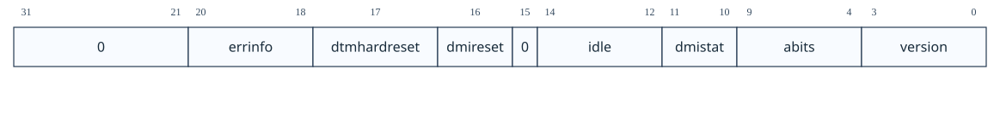<figcaption>图：寄存器位域图：6.1.4 DTM 控制和状态（dtmcs，位于 0x10）</figcaption></figure>

| 字段 | 描述 | 访问 | 复位 |
| --- | --- | --- | --- |
|  `errinfo` | 可选的错误附加信息。硬件更新 `op` 或向 `dmireset` 写 1 时更新本字段。<br>0（unimplemented）：未实现。<br>1（`dmi` error）：DTM 与 DMI 之间出错。<br>2（communication error）：DMI 与下级组件之间通信出错。<br>3（device error）：DMI 下级组件报告错误。<br>4（unknown）：无可报告错误，或没有更详细信息；若实现本字段，这是复位值。<br>其他值保留。 | **R** | 4 |
|  `dtmhardreset` | 向该位写入 1 会对 DTM 进行硬复位，导致 DTM 忘记任何未完成的 DMI 事务，并将所有寄存器和内部状态返回到其复位值。一般来说，只有当调试器有理由预期未完成的 DMI 事务将永远不会完成时才应使用此选项（例如，复位条件导致正在进行的 DMI 事务被取消）。 | **W1** | - |
|  `dmireset` | 向该位写入 1 会清除粘性错误状态并复位 `errinfo`，但不会影响未完成的 DMI 事务。 | **W1** | - |
|  `idle` | 调试器在每次 DMI 扫描后，建议在 Run-Test/Idle 停留的最少周期数，以避免 `dmistat`=3（`busy`）。必要时仍必须检查 `dmistat`。<br>0：无需进入 Run-Test/Idle。<br>1：进入后立即离开。<br>2：进入后停留 1 个周期再离开。<br>依此类推。 | **R** | 预设 |
|  `dmistat` | `op` 的只读别名 | **R** | 0 |
|  `abits` | `dmi` 中 `address` 字段的位宽。 | **R** | 预设 |
|  `version` | 0（0.11）：本文档 0.11 版所述的 DTM。<br>1（1.0）：本文档 0.13 版和 1.0 版所述的 DTM。<br>15（`custom`）：本文档各已发布版本均未定义的 DTM。 | **R** | 1 |

#### 6.1.5 调试模块接口访问（`dmi`，位于 0x11）

该寄存器允许访问调试模块接口（DMI）。

在 Update-DR 中，DTM 启动 `op` 中指定的操作，除非 `op` 中报告的当前状态为粘性。

在 Capture-DR 中，DTM 使用该操作的结果更新 `data`；若当前 `op` 状态不是粘性状态，也会更新 `op`。

使用示例见 附录 B.2.1。

> [!note]
> 仍然进行中的状态是粘性的，以适应将多个扫描批处理在一起的调试器，这些扫描必须全部执行或一旦出现问题就停止。 例如，一系列扫描可以编写调试程序并执行它。如果其中一项写入失败但执行继续，则调试程序可能会挂起或产生其他意外的副作用。
<figure style="margin: 0.5em auto; text-align: center;"><figcaption>图：寄存器位域图：6.1.5 调试模块接口访问（dmi，位于 0x11）</figcaption></figure>

| 字段 | 描述 | 访问 | 复位 |
| --- | --- | --- | --- |
|  `address` | 用于 DMI 访问的地址。在 Update-DR 中，该值用于通过 DMI 访问 DM。 `op` 定义该寄存器在每次可能的操作后包含的内容。 | **R/W** | 0 |
|  `data` | Update-DR期间通过 DMI 发送到 DM 的数据，以及作为先前操作的结果从 DM 返回的数据。 | **R/W** | 0 |
|  `op` | 调试器写入本字段时：<br>0（nop）：忽略 `data` 和 `address`；Update-DR 期间不通过 DMI 发送任何内容，不影响 DMI 的忙或错误状态，随后 Capture-DR 报告的地址和数据未定义。本操作使 `address` 与 `data` 的值未指定。<br>1（read）：从 `address` 读取；成功时 `address` 保存实际读取地址，`data` 保存读取值。<br>2（`write`）：将 `data` 写入 `address`；完成后 `address` 与 `data` 的值未指定。<br>3（reserved）：保留。<br>调试器读取本字段时：<br>0（success）：先前操作成功完成。<br>1（reserved）：保留。<br>2（failed）：先前操作失败；本次访问扫描进 `dmi` 的数据被忽略。该状态为粘性状态，可通过向 `dtmcs` 中的 `dmireset` 写 1 清除。这表示 DM 本身或 DMI 返回错误；规范未指定 DM 在何种情况下返回错误，且 DMI 不要求支持返回错误。调试器可从 `errinfo` 获得附加信息。<br>3（`busy`）：先前 DMI 操作尚未完成又尝试新操作；本次扫描进 `dmi` 的数据被忽略。该粘性状态同样可用 `dmireset` 清除。调试器应在 Update-DR 与 Capture-DR 之间提供更多 TCK 边沿；最简单方法是在 Run-Test/Idle 增加额外状态转换。 | **R/W** | 0 |

#### 6.1.6 `BYPASS`（位于 0x1f）

1 位寄存器无效。当调试器不想与此 TAP 通信时使用它。

整个寄存器是只读的。
<figure style="margin: 0.5em auto; text-align: center;"><figcaption>图：寄存器位域图：6.1.6 BYPASS（位于 0x1f）</figcaption></figure>

#### 6.1.7 JTAG 连接器

##### 6.1.7.1 推荐 JTAG 连接器

为便于获取调试硬件，本规范建议使用与 MIPI-10 0.05 英寸连接器规范兼容的连接器，具体见《MIPI 调试与跟踪连接器建议》1.20 版（2021 年 7 月 2 日）。

该连接器的引脚间距为 0.05 英寸，采用镀金公头和厚度为 0.016 英寸的硬化铜或铍青铜方柱（SAMTEC FTSH 或同等产品）；母头应采用 20 μm 镀金触点。

从上方观察公头（引脚朝向观察者），目标端连接器如 表 17 所示；各引脚功能见 表 18。

<table id="tab:mipiten" style="margin: 0.25em auto 1em; border-collapse: collapse; table-layout: auto;">
  <caption style="caption-side: top; text-align: center !important; display: table-caption; width: 100%; font-weight: 600; padding-bottom: 0.2em; white-space: nowrap;"><span style="display: block; width: 100%; text-align: center !important;">表 17．MIPI 10 引脚 JTAG + nRESET 连接器图</span></caption>
  <thead>
    <tr><th style="white-space: nowrap; text-align: center !important; vertical-align: middle;">目标端信号</th><th style="white-space: nowrap; text-align: center !important; vertical-align: middle;">引脚</th><th style="white-space: nowrap; text-align: center !important; vertical-align: middle;">引脚</th><th style="white-space: nowrap; text-align: center !important; vertical-align: middle;">调试适配器信号</th></tr>
  </thead>
  <tbody>
    <tr><td style="white-space: nowrap;">VREF DEBUG</td><td>1</td><td>2</td><td>TMS</td></tr>
    <tr><td style="white-space: nowrap;">GND</td><td>3</td><td>4</td><td>TCK</td></tr>
    <tr><td style="white-space: nowrap;">GND</td><td>5</td><td>6</td><td>TDO</td></tr>
    <tr><td style="white-space: nowrap;">GND 或 KEY</td><td>7</td><td>8</td><td>TDI</td></tr>
    <tr><td style="white-space: nowrap;">GND</td><td>9</td><td>10</td><td>nRESET</td></tr>
  </tbody>
</table>

若硬件平台需要 nTRST，允许将 nRESET 引脚改作 nTRST，从而形成 MIPI 10 引脚 JTAG-nTRST 连接器。

##### 6.1.7.2 备用 JTAG 连接器

MIPI-10 已能满足现代硬件所需的信号。若设计确实需要传统 JTAG 信号，应使用 MIPI-20；未使用功能的引脚可以悬空。

其物理连接器与 MIPI-10 基本相同，但长度和引脚数均为两倍。引脚排列见 表 19，各引脚功能见 表 18。

<table id="tab:pinout" style="margin: 0.25em auto 1em; border-collapse: collapse; table-layout: auto;">
  <caption style="caption-side: top; text-align: center !important; display: table-caption; width: 100%; font-weight: 600; padding-bottom: 0.2em; white-space: nowrap;"><span style="display: block; width: 100%; text-align: center !important;">表 18．JTAG 连接器引脚功能</span></caption>
  <thead>
    <tr><th style="white-space: nowrap; text-align: center !important; vertical-align: middle;">类别</th><th style="white-space: nowrap; text-align: center !important; vertical-align: middle;">引脚</th><th style="white-space: nowrap; text-align: center !important; vertical-align: middle;">功能</th></tr>
  </thead>
  <tbody>
    <tr><td style="white-space: nowrap;">必需</td><td>GND</td><td>接地。</td></tr>
    <tr><td style="white-space: nowrap;">必需</td><td>TCK</td><td>JTAG TCK 信号，由调试适配器驱动。</td></tr>
    <tr><td style="white-space: nowrap;">必需</td><td>TDI</td><td>JTAG TDI 信号，由调试适配器驱动。</td></tr>
    <tr><td style="white-space: nowrap;">必需</td><td>TDO</td><td>JTAG TDO 信号，由目标端驱动。</td></tr>
    <tr><td style="white-space: nowrap;">必需</td><td>TMS</td><td>JTAG TMS 信号，由调试适配器驱动。</td></tr>
    <tr><td style="white-space: nowrap;">必需</td><td>VREF DEBUG</td><td>逻辑高电平参考电压。</td></tr>
    <tr><td style="white-space: nowrap;">建议</td><td>nRESET</td><td>开漏、低有效复位信号，通常由调试适配器驱动；可用于双向驱动或检测目标复位。置位复位应复位全部 RISC-V hart 和 PCB 上其他外设，但不应复位调试逻辑。该引脚可选但强烈建议使用；不得将其接到 TAP 复位，否则调试器可能无法在复位期间调试、定位故障或保持执行控制。</td></tr>
    <tr><td style="white-space: nowrap;">建议</td><td>KEY</td><td>可在公头切除并插入母头以防反插。不过建议将该引脚作为额外接地，以支持更快的 TCK；应使用带护罩的连接器以避免线缆插错。</td></tr>
    <tr><td style="white-space: nowrap;">高级</td><td>EXT</td><td>保留给定制用途；可作为输入或输出。</td></tr>
    <tr><td style="white-space: nowrap;">高级</td><td>TRIGIN</td><td>本规范未使用，由调试适配器驱动；某些适配器可将其用于 UART、启动模式选择等扩展功能。</td></tr>
    <tr><td style="white-space: nowrap;">高级</td><td>TRIGOUT</td><td>本规范未使用，由目标端驱动。</td></tr>
    <tr><td style="white-space: nowrap;">专用</td><td>nTRST</td><td>测试复位，由调试适配器驱动。置位 nTRST 会异步初始化 JTAG DTM，适用于正常上电后 JTAG DTM 尚未就绪的系统；该信号有时称为 TRST*。</td></tr>
    <tr><td style="white-space: nowrap;">遗留</td><td>RTCK</td><td>返回测试时钟，由目标端驱动。目标处理完 TCK 后可在此转发该信号，使调试器据此调整 TCK 频率；仅用于依赖该功能的传统组件。</td></tr>
    <tr><td style="white-space: nowrap;">遗留</td><td>nTRST_PD</td><td>带下拉的测试复位，由调试适配器驱动。功能与 nTRST 相同，但目标端带下拉电阻；仅用于依赖该功能的传统组件。</td></tr>
  </tbody>
</table>

<table id="tab:mipitwenty" style="margin: 0.25em auto 1em; border-collapse: collapse; table-layout: auto;">
  <caption style="caption-side: top; text-align: center !important; display: table-caption; width: 100%; font-weight: 600; padding-bottom: 0.2em; white-space: nowrap;"><span style="display: block; width: 100%; text-align: center !important;">表 19．MIPI 20 引脚 JTAG 连接器图</span></caption>
  <thead>
    <tr><th style="white-space: nowrap; text-align: center !important; vertical-align: middle;">目标端信号</th><th style="white-space: nowrap; text-align: center !important; vertical-align: middle;">引脚</th><th style="white-space: nowrap; text-align: center !important; vertical-align: middle;">引脚</th><th style="white-space: nowrap; text-align: center !important; vertical-align: middle;">调试适配器信号</th></tr>
  </thead>
  <tbody>
    <tr><td style="white-space: nowrap;">VREF DEBUG</td><td>1</td><td>2</td><td>TMS</td></tr>
    <tr><td style="white-space: nowrap;">GND</td><td>3</td><td>4</td><td>TCK</td></tr>
    <tr><td style="white-space: nowrap;">GND</td><td>5</td><td>6</td><td>TDO</td></tr>
    <tr><td style="white-space: nowrap;">GND 或 KEY</td><td>7</td><td>8</td><td>TDI</td></tr>
    <tr><td style="white-space: nowrap;">GND</td><td>9</td><td>10</td><td>nRESET</td></tr>
    <tr><td style="white-space: nowrap;">GND</td><td>11</td><td>12</td><td>GND 或 RTCK</td></tr>
    <tr><td style="white-space: nowrap;">GND</td><td>13</td><td>14</td><td>NC 或 nTRST_PD</td></tr>
    <tr><td style="white-space: nowrap;">GND</td><td>15</td><td>16</td><td>nTRST 或 NC</td></tr>
    <tr><td style="white-space: nowrap;">GND</td><td>17</td><td>18</td><td>TRIGIN 或 NC</td></tr>
    <tr><td style="white-space: nowrap;">GND</td><td>19</td><td>20</td><td>TRIGOUT 或 GND</td></tr>
  </tbody>
</table>

#### 6.1.8 cJTAG

该规范没有关于如何使用 cJTAG 协议的具体建议。

当实现对 JTAG DTM 的 cJTAG 访问时，应使用 MIPI 10 引脚窄 JTAG 连接器。不需要功能的引脚可以保持未连接状态。

从上方查看公头（引脚指向您的眼睛），目标的连接器看起来与 表 20 中的一样。

<table id="tab:mipicjtag" style="margin: 0.25em auto 1em; border-collapse: collapse; table-layout: auto;">
  <caption style="caption-side: top; text-align: center !important; display: table-caption; width: 100%; font-weight: 600; padding-bottom: 0.2em; white-space: nowrap;"><span style="display: block; width: 100%; text-align: center !important;">表 20．MIPI 10 引脚窄 JTAG 连接器图</span></caption>
  <thead>
    <tr><th style="white-space: nowrap; text-align: center !important; vertical-align: middle;">目标端信号</th><th style="white-space: nowrap; text-align: center !important; vertical-align: middle;">引脚</th><th style="white-space: nowrap; text-align: center !important; vertical-align: middle;">引脚</th><th style="white-space: nowrap; text-align: center !important; vertical-align: middle;">调试适配器信号</th></tr>
  </thead>
  <tbody>
    <tr><td style="white-space: nowrap;">VREF DEBUG</td><td>1</td><td>2</td><td>TMSC</td></tr>
    <tr><td style="white-space: nowrap;">GND</td><td>3</td><td>4</td><td>TCKC</td></tr>
    <tr><td style="white-space: nowrap;">GND</td><td>5</td><td>6</td><td>EXT 或 NC</td></tr>
    <tr><td style="white-space: nowrap;">GND 或 KEY</td><td>7</td><td>8</td><td>NC 或 nTRST_PD</td></tr>
    <tr><td style="white-space: nowrap;">GND</td><td>9</td><td>10</td><td>nRESET</td></tr>
  </tbody>
</table>

## 附录 A：硬件实现

下面是两种可能的实现方式。设计师可以选择其中一种，进行混合搭配，或者提出自己的设计。

### A.1 基于抽象命令

`halt` 通过阻断 hart 的执行流水线实现。

寄存器堆上的多路选择器使“访问寄存器”抽象命令可以访问 GPR 和 CSR。

内存可通过“访问内存”抽象命令或系统总线访问。

即使 hart 无法执行指令，此实现也可以允许调试器从 hart 收集信息。

### A.2 基于执行

此实现仅在已暂停 hart 上实现 GPR 的“访问寄存器”抽象命令，并依赖 Program Buffer 执行其他操作。它利用 hart 现有流水线及从任意内存位置执行的能力，避免修改 hart 的数据通路。

暂停请求位置位时，DM 向所选 hart 发出特殊中断。该中断使每个 hart 进入调试模式，并跳转至由 DM 提供的指定内存区域；该区域仅可由处于调试模式的 hart 访问。对此内存的访问应取消缓存，以免调试操作产生副作用。发生此跳转时，`pc` 保存至 `dpc`，`dcsr` 中的 `cause` 随之更新。该跳转类似陷阱，但在体系结构上不视为陷阱，因此不会计入触发器行为中的陷阱。

DM 中的代码使 hart 进入驻停循环（park loop）。在该循环中，hart 将其 `mhartid` 写入 DM 内的一个内存位置，以表示自己已暂停。为了让 DM 在多个已暂停 hart 中单独控制其中一个，每个 hart 都会轮询 DM 控制的内存位置中的标志，判断调试器是否要求它执行 Program Buffer 或恢复运行。

执行抽象命令时，DM 先按 `command` 填入 Program Buffer 的若干内部字。`transfer` 置位时，DM 分别填入 `lw <gpr>, 0x400(zero)` 或 `sw <gpr>, 0x400(zero)`；64 位和 128 位访问分别使用 `ld`/`sd` 和 `lq`/`sq`。`transfer` 未置位时，这些位置填入 `nop` 指令。`postexec` 置位时，随后继续执行由调试器控制的 Program Buffer；否则 DM 立即使 hart 执行 `ebreak`。

执行 `ebreak`（表示 Program Buffer 代码结束）后，hart 返回驻停循环。若发生异常，hart 跳转至 DM 内的地址；该处代码让 hart 向 DM 写入异常指示，然后回到驻停循环。DM 根据此写入判断发生了异常，并相应设置 `cmderr`。通常，hart 在进入驻停循环前执行 `fence`，以确保抽象命令的影响（例如写 `data0`）在 DM 将 `busy` 读回为 0 前已经生效。

要恢复执行，DM 设置相应标志，使 hart 执行 `dret`。`dret` 仅在调试模式中有意义，且不由 Program Buffer 执行；建议编码为 `0x7b200073`。执行 `dret` 时，`pc` 从 `dpc` 恢复，并以 `prv`、`v` 设定的特权与虚拟化模式以及 `pelp` 设定的 ELP 状态恢复普通执行。

`data0` 等寄存器可作为普通内存呈现，其地址相对基址的偏移可用不超过 12 位的立即数 `imm` 编码。具体地址属于实现细节，调试器不得依赖；例如，`data` 寄存器可位于 `0x400`。

为提高灵活性，`progbuf0` 等寄存器可在普通内存中位于紧邻 `data0` 之前的位置，从而形成可供程序执行或数据传输使用的连续内存区域。

hart 处于调试模式时，无论 PMP 如何配置，PMP 都不得禁止在与 DM 关联的地址范围内取指、加载或存储；PMA 也同样如此。没有这一保证，驻停循环会陷入无限陷阱，调试将无法进行。

### A.3 调试模块接口信号

如 第 3.1 节 部分所述，DMI 的详细信息留给系统设计人员。通常情况下，仅实现一个 DTM 和一个 DM。在这种情况下，遵守 表 21 中建议的信号可能会很有用，表 21 是开源 [rocket-chip](https://github.com/chipsalliance/rocket-chip/blob/375045a7db1bdc7b4f7851f1a59b3f10a2b922ff/src/main/scala/devices/debug/Debug.scala#L170) RISC-V 内核中使用的实现。

当 DM 将 REQ_READY 设置为 1 时，DTM 可以启动请求。在这种情况下，可以将 REQ_OP 设置为 1 表示读取请求，或设置为 2 表示写入请求。所需的地址由 REQ_ADDRESS 信号驱动。最后，REQ_VALID 设置为高电平，向 DM 指示有效请求正在等待处理。

当 `RSP_READY` 为高电平时，DM 必须响应来自 DTM 的请求。响应状态由 `RSP_OP` 指示（见 `op`）；响应数据由 `RSP_DATA` 驱动；`RSP_VALID` 置位表示存在待处理的响应。

<table id="tab:dmi_signals" style="margin: 0.25em auto 1em; border-collapse: collapse; table-layout: auto;">
  <caption style="caption-side: top; text-align: center !important; display: table-caption; width: 100%; font-weight: 600; padding-bottom: 0.2em; white-space: nowrap;"><span style="display: block; width: 100%; text-align: center !important;">表 21．一台 DTM 与一台 DM 之间建议使用的 DMI 信号</span></caption>
  <thead>
    <tr><th style="white-space: nowrap; text-align: center !important; vertical-align: middle;">信号</th><th style="white-space: nowrap; text-align: center !important; vertical-align: middle;">宽度</th><th style="white-space: nowrap; text-align: center !important; vertical-align: middle;">来源</th><th style="white-space: nowrap; text-align: center !important; vertical-align: middle;">描述</th></tr>
  </thead>
  <tbody>
    <tr><td style="white-space: nowrap;">REQ_VALID</td><td>1</td><td>DTM</td><td>表示存在待处理的有效请求。</td></tr>
    <tr><td style="white-space: nowrap;">REQ_READY</td><td>1</td><td>DM</td><td>表示 DM 可以处理请求。</td></tr>
    <tr><td style="white-space: nowrap;">REQ_ADDRESS</td><td><code>abits</code></td><td>DTM</td><td>请求地址。</td></tr>
    <tr><td style="white-space: nowrap;">REQ_DATA</td><td>32</td><td>DTM</td><td>请求数据。</td></tr>
    <tr><td style="white-space: nowrap;">REQ_OP</td><td>2</td><td>DTM</td><td>与 <code>op</code> 字段含义相同。</td></tr>
    <tr><td style="white-space: nowrap;">RSP_VALID</td><td>1</td><td>DM</td><td>表示存在待处理的有效响应。</td></tr>
    <tr><td style="white-space: nowrap;">RSP_READY</td><td>1</td><td>DTM</td><td>表示 DTM 可以处理响应。</td></tr>
    <tr><td style="white-space: nowrap;">RSP_DATA</td><td>32</td><td>DM</td><td>响应数据。</td></tr>
    <tr><td style="white-space: nowrap;">RSP_OP</td><td>2</td><td>DM</td><td>与 <code>op</code> 字段含义相同。</td></tr>
  </tbody>
</table>

## 附录 B：调试器实现

### B.1 C 头文件

[github.com/riscv/riscv-debug-spec](https://github.com/riscv/riscv-debug-spec) 包含用于生成 C 头文件的指令，该文件为本文档中提到的每个寄存器/抽象命令中的每个字段定义宏。

### B.2 外部调试器实现

> [!tip] Tips · 将本节流程实现为可重试的事务：DMI 操作 → 检查状态 → 遇到 `busy` 等待/退避 → 遇到失败复位 DMI → 重试。不要把一次扫描链操作当作必然成功。

本节说明外部调试器如何通过 第 6.1 节 所述的 JTAG DTM，在 RISC-V hart 上执行常见操作。示例均假设 hart 为 32 位；调整后同样适用于 64 位或 128 位 hart。

为便于阅读，以下示例均假设操作成功，且目标完成操作的速度快于调试器发起下一次访问；典型 JTAG 配置通常如此。不过，调试器每完成一串操作都必须检查粘性错误状态位。若发现错误，应重试同一操作，并视情况增加等待时间或显式轮询状态位。

#### B.2.1 调试模块接口访问

要读取任一 DM 寄存器，先选择 `dmi`，再扫描一个值：将 `op` 设为 1，且把 `address` 设为目标寄存器地址。操作在 Update-DR 启动，结果在 Capture-DR 捕获到 `data`。若未及时完成，`op` 返回 3，必须忽略 `data`；向 `dtmcs` 的 `dmireset` 写 1 清除忙状态后重新扫描，直至 `op` 返回 0。后续操作应在 Update-DR 与 Capture-DR 间预留更多时间。

要写入任一 DM 寄存器，选择 `dmi` 后扫描一个值：将 `op` 设为 2，并将 `address` 与 `data` 分别设为目标地址和写入数据。之后的状态检查和重试流程与读取完全相同。

几乎不需要扫描 IR，从而避免了典型 JTAG 使用中的低效率问题。

#### B.2.2 检查 hart 是否已暂停

调试器通常希望尽快得知 hart 是否已暂停（例如命中断点）。有多个 hart 时，可用 `haltsum` 寄存器逐级定位：从 `haltsum3` 开始，对每个置位位写入 `hartsel`，再检查 `haltsum2`，随后按同样方式检查 `haltsum1` 与 `haltsum0`。可根据实际 hart 数量从较低级的 `haltsum` 开始。

#### B.2.3 暂停

要暂停一个或多个 hart，调试器选中它们、置位 `haltreq`，然后等待 `allhalted` 指示它们已暂停。随后可清除 `haltreq`，也可保持置位，以捕获在暂停状态下复位的 hart。

#### B.2.4 恢复运行

调试器首先应恢复已覆盖的全部寄存器，然后置位 `resumereq`，使所选 hart 恢复运行。`allresumeack` 置位即表示所选 hart 已确认恢复。hart 恢复后可能立刻再次暂停（例如命中软件断点），因此不能通过 `allhalted` 或 `anyhalted` 判断其是否已恢复。

#### B.2.5 单步

使用硬件单步与普通恢复运行几乎相同，只需在恢复 hart 前配置单步。hart 的行为与运行中一致，但中断可能被禁用（取决于 `stepie`），且它在再次进入调试模式前只取指并执行一条指令。

#### B.2.6 访问寄存器

##### B.2.6.1 使用抽象命令

使用抽象命令读取 `s0`：

| 操作 | 地址 | 值 | 说明 |
| --- | --- | --- | --- |
| 写入 | `command` | `aarsize`=2，`transfer`，`regno` = 0x1008 | 读取 `s0` |
| 读取 | `data0` | — | 返回 `s0` 中的值 |

使用抽象命令写入 `mstatus`：

| 操作 | 地址 | 值 | 说明 |
| --- | --- | --- | --- |
| 写入 | `data0` | 新值 |  |
| 写入 | `command` | `aarsize`=2、`transfer`、`write`、`regno` = 0x300 | 写 `mstatus` |

##### B.2.6.2 使用程序缓冲区

仅需要抽象命令来支持 GPR 访问。要访问非 GPR 寄存器，调试器可以使用程序缓冲区将值移入/移出 GPR，然后使用抽象命令访问 GPR 值。

使用程序缓冲区写入 `mstatus`：

| 操作 | 地址 | 值 | 说明 |
| --- | --- | --- | --- |
| 写入 | `progbuf0` | `csrw s0, MSTATUS` |  |
| 写入 | `progbuf1` | `ebreak` |  |
| 写入 | `data0` | 新值 |  |
| 写入 | `command` | `aarsize`=2、`postexec`、`transfer`、`write`、`regno` = 0x1008 | 写入 `s0`，然后执行程序缓冲区 |

使用程序缓冲区读取 `f1`：

| 操作 | 地址 | 值 | 说明 |
| --- | --- | --- | --- |
| 写入 | `progbuf0` | {`fmv.x.s s0, f1`} |  |
| 写入 | `progbuf1` | `ebreak` |  |
| 写入 | `command` | `postexec` | 执行程序缓冲区 |
| 写入 | `command` | `transfer`、`regno` = 0x1008 | 读取 `s0` |
| 读取 | `data0` | — | 返回 `f1` 中的值 |

#### B.2.7 读取内存

##### B.2.7.1 使用系统总线访问

对于系统总线访问，地址是物理系统总线地址。

使用系统总线访问从内存中读取一个字：

| 操作 | 地址 | 值 | 说明 |
| --- | --- | --- | --- |
| 写入 | `sbcs` | `sbaccess`=2，`sbreadonaddr` | 设置 |
| 写入 | `sbaddress0` | 地址 |  |
| 读取 | `sbdata0` | — | 从内存中读取的值 |

使用系统总线访问读取内存块：

| 操作 | 地址 | 值 | 说明 |
| --- | --- | --- | --- |
| 写入 | `sbcs` | `sbaccess`=2、`sbreadonaddr`、`sbreadondata`、`sbautoincrement` | 打开自动读取和自动增量 |
| 写入 | `sbaddress0` | 地址 | 写入地址触发读取并递增 |
| 读取 | `sbdata0` | — | 从内存中读取的值 |
| 读取 | `sbdata0` | — | 从内存中读取的下一个值 |
| …​ | …​ | …​ | …​ |
| 写入 | `sbcs` | 0 | 禁用自动读取 |
| 读取 | `sbdata0` | — | 获取从内存中读取的最后一个值。 |

##### B.2.7.2 使用程序缓冲区

通过让 hart 执行加载/存储，可以通过程序缓冲区访问内存。地址是物理地址还是虚拟地址取决于系统配置。

使用程序缓冲区从内存中读取一个字：

| 操作 | 地址 | 值 | 说明 |
| --- | --- | --- | --- |
| 写入 | `progbuf0` | `lw s0, 0(s0)` |  |
| 写入 | `progbuf1` | `ebreak` |  |
| 写入 | `data0` | 地址 |  |
| 写入 | `command` | `transfer`、`write`、`postexec`、`regno` = 0x1008 | 写入 `s0`，然后执行程序缓冲区 |
| 写入 | `command` | `regno` = 0x1008 | 读取 `s0` |
| 读取 | `data0` | — | 从内存中读取的值 |

使用程序缓冲区读取内存块：

| 操作 | 地址 | 值 | 说明 |
| --- | --- | --- | --- |
| 写入 | `progbuf0` | `lw s1, 0(s0)` |  |
| 写入 | `progbuf1` | `addi s0, s1, 4` |  |
| 写入 | `progbuf2` | `ebreak` |  |
| 写入 | `data0` | 地址 |  |
| 写入 | `command` | `transfer`、`write`、`postexec`、`regno` = 0x1008 | 写入 `s0`，然后执行程序缓冲区 |
| 写入 | `command` | `postexec`、`regno` = 0x1009 | 读取 `s1`，然后执行程序缓冲区 |
| 写入 | `abstractauto` | `autoexecdata`[0] | 设置 `autoexecdata`[0] |
| 读取 | `data0` | — | 获取从内存中读取的值，然后执行程序缓冲区 |
| 读取 | `data0` | — | 获取从内存中读取的下一个值，然后执行程序缓冲区 |
| …​ | …​ | …​ | …​ |
| 写入 | `abstractauto` | 0 | 清除 `autoexecdata`[0] |
| 读取 | `data0` | — | 获取从内存中读取的最后一个值。 |

##### B.2.7.3 使用抽象内存访问

抽象内存访问的行为就好像它们是由 hart 执行的，尽管实际的实现可能有所不同。

使用抽象内存访问从内存中读取一个字：

| 操作 | 地址 | 值 | 说明 |
| --- | --- | --- | --- |
| 写入 | `data1` | 地址 |  |
| 写入 | `command` | `cmdtype`=2, `aamsize`=2 |  |
| 读取 | `data0` | — | 从内存中读取的值 |

使用抽象内存访问读取内存块：

| 操作 | 地址 | 值 | 说明 |
| --- | --- | --- | --- |
| 写入 | `abstractauto` | 1 | 访问 `data0` 时重新执行命令 |
| 写入 | `data1` | 地址 |  |
| 写入 | `command` | `cmdtype`=2, `aamsize`=2, `aampostincrement`=1 |  |
| 读取 | `data0` | — | 读取值，并触发读取下一个地址 |
| …​ | …​ | …​ | …​ |
| 写入 | `abstractauto` | 0 | 禁用自动执行 |
| 读取 | `data0` | — | 获取从内存中读取的最后一个值。 |

#### B.2.8 写入内存

##### B.2.8.1 使用系统总线访问

对于系统总线访问，地址是物理系统总线地址。

使用系统总线访问将一个字写入存储器：

| 操作 | 地址 | 值 | 说明 |
| --- | --- | --- | --- |
| 写入 | `sbcs` | `sbaccess`=2 | 配置访问大小 |
| 写入 | `sbaddress0` | 地址 |  |
| 写入 | `sbdata0` | 值 |  |

使用系统总线访问写入内存块：

| 操作 | 地址 | 值 | 说明 |
| --- | --- | --- | --- |
| 写入 | `sbcs` | `sbaccess`=2，`sbautoincrement` | 开启自动增量 |
| 写入 | `sbaddress0` | 地址 |  |
| 写入 | `sbdata0` | 值 0 |  |
| 写入 | `sbdata0` | 值1 |  |
| …​ | …​ | …​ | …​ |
| 写入 | `sbdata0` | 值N |  |

##### B.2.8.2 使用程序缓冲区

通过程序缓冲区，hart 执行存储器访问。地址是物理的或虚拟的（取决于其他系统配置）。

使用程序缓冲区将一个字写入内存：

| 操作 | 地址 | 值 | 说明 |
| --- | --- | --- | --- |
| 写入 | `progbuf0` | `sw s1, 0(s0)` |  |
| 写入 | `progbuf1` | `ebreak` |  |
| 写入 | `data0` | 地址 |  |
| 写入 | `command` | `transfer`、`write`、`regno` = 0x1008 | 写 `s0` |
| 写入 | `data0` | 值 |  |
| 写入 | `command` | `transfer`、`write`、`postexec`、`regno` = 0x1009 | 写入 `s1`，然后执行程序缓冲区 |

使用程序缓冲区写入内存块：

| 操作 | 地址 | 值 | 说明 |
| --- | --- | --- | --- |
| 写入 | `progbuf0` | `sw s1, 0(s0)` |  |
| 写入 | `progbuf1` | `addi s0, s1, 4` |  |
| 写入 | `progbuf2` | `ebreak` |  |
| 写入 | `data0` | 地址 |  |
| 写入 | `command` | `transfer`、`write`、`regno` = 0x1008 | 写 `s0` |
| 写入 | `data0` | 值 0 |  |
| 写入 | `command` | `transfer`、`write`、`postexec`、`regno` = 0x1009 | 写入 `s1`，然后执行程序缓冲区 |
| 写入 | `abstractauto` | `autoexecdata`[0] | 设置 `autoexecdata`[0] |
| 写入 | `data0` | 值1 |  |
| …​ | …​ | …​ | …​ |
| 写入 | `data0` | 值N |  |
| 写入 | `abstractauto` | 0 | 清除 `autoexecdata`[0] |

##### B.2.8.3 使用抽象内存访问

抽象内存访问的行为就好像它们是由 hart 执行的，尽管实际的实现可能有所不同。

使用抽象内存访问将一个字写入内存：

| 操作 | 地址 | 值 | 说明 |
| --- | --- | --- | --- |
| 写入 | `data1` | 地址 |  |
| 写入 | `data0` | 值 |  |
| 写入 | `command` | `cmdtype`=2，`aamsize`=2，写入=1 |  |

使用抽象内存访问写入内存块：

| 操作 | 地址 | 值 | 说明 |
| --- | --- | --- | --- |
| 写入 | `data1` | 地址 |  |
| 写入 | `data0` | 值 0 |  |
| 写入 | `command` | `cmdtype`=2，`aamsize`=2，写入=1，`aampostincrement`=1 |  |
| 写入 | `abstractauto` | 1 | 访问 `data0` 时重新执行命令 |
| 写入 | `data0` | 值1 |  |
| 写入 | `data0` | 值2 |  |
| …​ | …​ | …​ | …​ |
| 写入 | `data0` | 值N |  |
| 写入 | `abstractauto` | 0 | 禁用自动执行 |

#### B.2.9 触发器

特定事件发生时，调试器可用硬件触发器暂停 hart。下列示例不一定适用于所有实现，因为规范不要求 hart 实现特定数量或功能的触发器。调试器配置触发器后应读回，以确认该配置受支持。所有示例均假定 XLEN=32。

执行0x80001234处的指令时进入调试模式，用作ROM中的指令断点：

| 寄存器 | 写入值 | 配置说明 |
| --- | --- | --- |
| `tdata1` | 0x6980105c |类型 = 6、`dmode` = 1、操作 = 1、选择 = 0、匹配 = 0、`m` = 1、`s` = 1、`u` = 1、`vs` = 1、`vu` = 1、执行 = 1 |
| `tdata2` | 0x80001234 | 地址 |

在 M 模式或 S 模式或 U 模式下在地址 0x80007f80 处执行加载时进入调试模式：

| 寄存器 | 写入值 | 配置说明 |
| --- | --- | --- |
| `tdata1` | 0x68001059 |类型 = 6，`dmode` = 1，操作 = 1，选择 = 0，匹配 = 0，`m` = 1，`s` = 1，`u` = 1，加载 = 1 |
| `tdata2` | 0x80007f80 | 地址 |

当 hgatp.VMID=1 时，在 VS 模式或 VU 模式下存储到 0x80007c80 和 0x80007cef（含）之间的地址时，进入调试模式：

| 寄存器 | 写入值 | 配置说明 |
| --- | --- | --- |
| `tdata1` 0 | 0x69801902 |类型 = 6、`dmode` = 1、操作 = 1、链 = 1、选择 = 0、匹配 = 2、`vs` = 1、`vu` = 1、存储 = 1 |
| `tdata2` 0 | 0x80007c80 |起始地址（含）|
| `textra32` 0 | 0x03000000| `mhselect`=6，`mhvalue`=0 |
| `tdata1` 1 | 0x69801182 |类型 = 6、`dmode` = 1、操作 = 1、选择 = 0、匹配 = 3、`vs` = 1、`vu` = 1、存储 = 1 |
| `tdata2` 1 | 0x80007cf0 | 结束地址（不含） |
| `textra32` 1 | 0x03000000| `mhselect`=6，`mhvalue`=0 |

存储到 0x81230000 和 0x8123ffff（含）之间的地址时进入调试模式：

| 寄存器 | 写入值 | 配置说明 |
| --- | --- | --- |
| `tdata1` | 0x698010da |类型 = 6、`dmode` = 1、操作 = 1、选择 = 0、匹配 = 1、`m` = 1、`s` = 1、`u` = 1、`vs` = 1、`vu` = 1、存储 = 1 |
| `tdata2` | 0x81237fff | 0x81237fff 16 个高位完全匹配，然后是 0，然后是全 1。 |

从 0x86753090 到 0x8675309f 之间或 0x96753090 到 0x9675309f（含）之间的地址加载时进入调试模式：

| 寄存器 | 写入值 | 配置说明 |
| --- | --- | --- |
| `tdata1` 0 | 0x69801a59 | 类型 =6、`dmode`=1、动作=1、链=1、匹配=4、`m`=1、`s`=1、`u`=1、`vs`=1、`vu`=1、加载=1 |
| `tdata2` 0 | 0xfff03090 |屏蔽下半部分，然后匹配下半部分 |
| `tdata1` 1 | 0x698012d9 | 类型 = 6、`dmode` = 1、操作 = 1、匹配 = 5、`m` = 1、`s` = 1、`u` = 1、`vs` = 1、`vu` = 1、加载 = 1 |
| `tdata2` 1 | 0xefff8675 | 屏蔽上半部分，然后匹配上半部分|

#### B.2.10 处理异常

通常，调试器可以通过小心其编写的程序来避免异常。有时它们是不可避免的，例如如果用户要求访问未实现的内存或 CSR。典型的调试器对硬件平台的了解不够，无法知道将要发生什么，并且必须尝试访问以确定结果。

当执行程序缓冲区时发生异常时，`command` 被置位。调试器可以检查该字段以查看程序是否遇到异常。如果出现异常，调试器就会知道导致异常的原因。

#### B.2.11 快速访问

有多种指令可在 GPR 和 `data` 寄存器之间传输数据。它们要么是加载/存储，要么是 CSR 读/写。具体地址也各不相同。这都是在 `hartinfo` 中指定的。这里的示例使用伪操作 `transfer dest, src` 来表示所有这些选项。

以最短暂停时间让 hart 执行一次内存写入：

| 操作 | 地址 | 值 | 说明 |
| --- | --- | --- | --- |
| 写入 | `progbuf0` | `transfer arg2, s0` | 保存 `s0` |
| 写入 | `progbuf1` | `transfer s0, arg0` | 读取第一个参数（地址） |
| 写入 | `progbuf2` | `transfer arg0, s1` | 保存 `s1` |
| 写入 | `progbuf3` | `transfer s1, arg1` | 读取第二个参数（数据） |
| 写入 | `progbuf4` | `sw s1, 0(s0)` |  |
| 写入 | `progbuf5` | `transfer s1, arg0` | 恢复 `s1` |
| 写入 | `progbuf6` | `transfer s0, arg2` | 恢复 `s0` |
| 写入 | `progbuf7` | `ebreak` |  |
| 写入 | `data0` | 地址 |  |
| 写入 | `data1` | 数据 |  |
| 写入 | `command` | 0x10000000 | 执行快速访问 |

这显示了设置 `m` 位以在 M 模式下启用硬件断点的示例。之前可以使用类似的快速访问指令来配置此处启用的触发器：

| 操作 | 地址 | 值 | 说明 |
| --- | --- | --- | --- |
| 写入 | `progbuf0` | `transfer arg0, s0` | 保存 `s0` |
| 写入 | `progbuf1` | `li s0, (1 << 6)` | 形成 `m` 位的掩码 |
| 写入 | `progbuf2` | `csrrs x0, tdata1, s0` | 将掩码应用到 `mcontrol` |
| 写入 | `progbuf3` | `transfer s0, arg2` | 恢复 `s0` |
| 写入 | `progbuf4` | `ebreak` |  |
| 写入 | `command` | 0x10000000 | 执行快速访问 |

### B.3 本机调试器实现

该规范包含一些有助于编写本机调试器的功能。本节描述如何实现一些常见任务。

#### B.3.1 单步

如果操作系统或调试存根在 M 模式下运行，而正在调试的程序在特权较低的模式下运行，那么单步操作就很简单。当需要一个步骤时，操作系统或调试存根会写入 `count`=1、`action`=0、`m`=0，然后使用 `mret` 指令将控制权返回给下层用户程序。

对与调试器处于相同特权级的代码进行单步，取决于实现的其他调试功能，处理更复杂。

若硬件实现 `mpte` 与 `mte`，对不允许嵌套中断的非陷阱代码进行单步也很直接。

若硬件在进入陷阱处理程序时自动禁止 `action`=0 的触发器匹配（见 第 5.4 节），精心编写的陷阱处理程序可确保凡是 `icount` 触发器不应匹配的时段，中断均被禁用。

如果这些功能都不存在，那么单步是可行的，但很难正确执行。对于单步执行，调试存根将执行如下内容：

```asm
li    t0, count=4, action=0, m=1
csrw  tdata1, t0      # 写入触发器
lw    t0, 8(sp)       # 恢复 t0；count 减至 3
lw    sp, 0(sp)       # 恢复 sp；count 减至 2
mret                  # 返回被调试程序；count 减至 1
```

使用 `icount` 单步还有一个额外的问题。指令可能会导致异常进入未启用触发器的更特权模式。异常处理程序可能会解决异常的原因，然后重新启动指令。此类示例包括页面错误、FPU 尚未启用时的 FPU 指令以及中断。当用户单步执行此类代码时，他们将必须单步执行两次才能通过重新启动的指令。第一次运行异常处理程序，第二次实际执行指令。这很令人困惑，而且通常是不可取的。

为了帮助用户，调试器应该检测单步何时重新启动指令，然后再次单步执行。这样，用户就可以看到跳过指令的预期行为。理想情况下，调试器会通知用户异常处理程序第一次执行。

当 PC 在常规步骤中没有发生变化时，调试器应该执行这个额外的步骤。

> [!note]
> 当 PC 发生变化时，额外执行一步仍是安全的：每条 RISC-V 指令要么改变 PC，要么在重复执行时产生副作用，但绝不会同时具备两者。

为了避免在异常处理程序未解决异常原因时出现无限循环，调试器执行的额外步骤不得超过一个。

---

## 学习与实现 Tips（Mote）

> [!tip] 推荐阅读顺序
> 1. 用图 1 理清工具与硬件的通信顺序；2. 用 `dmcontrol` + `dmstatus` 跑通 halt/resume；3. 用 `abstractcs`/`command` 读写 GPR；4. 再进入 Program Buffer、SBA 与 trigger；最后按附录 B 编写可重试的调试器事务。

> [!warning] 常见踩坑
> - **不要混淆 DTM 与 DM**：前者运输 DMI 事务，后者实现调试功能。
> - **不要只写不读回**：WARL 字段可能把你的请求改写成硬件支持的值；`cmderr`、`sberror`、`dmistat` 是必查状态。
> - **不要假设 halt 立即完成**：请求与观察状态是异步的，应轮询 `dmstatus`；多 hart 时还要区分 any/all 位。
> - **不要把 SBA 当成自动 coherent 的内存访问**：缓存、DMA、总线权限和安全策略都可能改变观察结果。
> - **不要把英文原 PDF 丢掉**：涉及保留字、时序和“must/may/UNSPECIFIED”时，应回查同目录原件。
