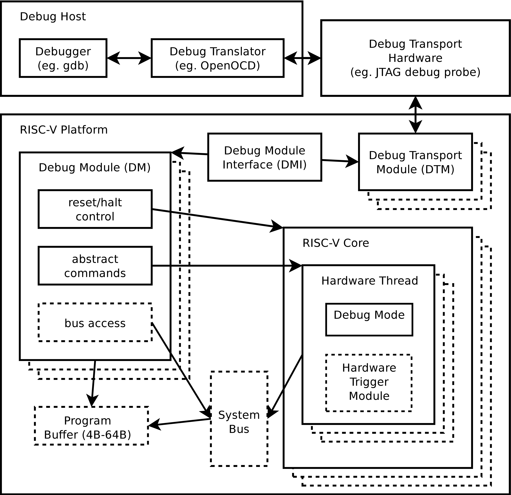
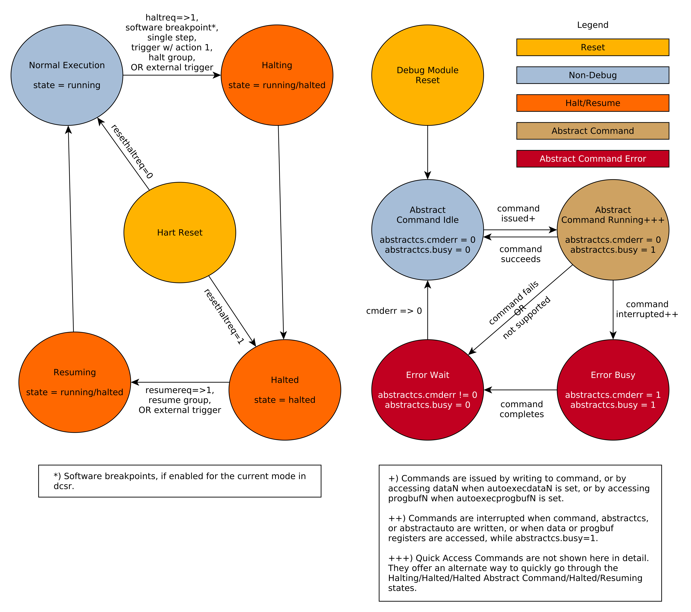

# RISC-V 调试规范 v1.0：中文学习版


> [!abstract] 文档定位
> 本文完整导出自同目录的 **The RISC-V Debug Specification, v1.0（2025-02-21，Ratified）**，正文与寄存器字段说明均译为中文；寄存器名、位域名、指令名、地址、代码、链接锚点保留原样。规范性解释以英文原 PDF 为准。

> [!info] 阅读约定
> - `hart`：硬件线程；本文保留该 RISC-V 术语。
> - DM（Debug Module，调试模块）、DMI（Debug Module Interface，调试模块接口）、DTM（Debug Transport Module，调试传输模块）。
> - GPR（General-Purpose Register，通用寄存器）、CSR（Control and Status Register，控制与状态寄存器）、SBA（System Bus Access，系统总线访问）。
> - JTAG（Joint Test Action Group，联合测试行动组）、WARL（Write Any, Read Legal，任意写入、合法读出）、W1C（Write One to Clear，写 1 清除）。
> - **Required / Optional / WARL / W1C** 等术语的行为规定以原规范为准；字段名请以反引号形式检索。
> - 插图保留自原 PDF，故图内英文标注未重绘；图后及相邻正文提供中文解读。

## 学习导航

1. 先读第 2 章，建立 Debug Host → DTM → DMI → DM → hart 的数据通路。
2. 再读第 3、4 章，理解外部 DM 控制与 hart 内 Debug Mode 的分工。
3. 调试断点/观察点时读第 5 章；对接 JTAG 时读第 6 章；编写工具或 testbench 时以附录 B 的流程为落脚点。

## Obsidian Mote 格式解读

本文用 Obsidian 原生 Callout 记录 Mote（随读随记的学习注释）。例如：

> [!note]- Mote · 标题
> 这里写一条与相邻规范段落对应的理解、前提或检查点。

- `> [!note]` 表示注释类型；`Mote · 标题`是便于检索的注释名称。
- 类型后的 `-` 表示默认折叠；点击注释标题即可展开。删去 `-` 则默认展开。
- 同一注释的每一行前都保留 `>`；可把 `[!note]` 改为 `[!tip]`、`[!warning]` 等类型。
- 本文的 Mote 只作学习提示，不替代规范中的 Required、Optional、must 或 may 等约束。

## 核心术语速查

| 原术语 | 学习用中文 | 关键点 |
|---|---|---|
| hart | 硬件线程 | DM 控制的最小 RISC-V 执行实体 |
| DM | 调试模块 | 提供运行控制、抽象命令、Program Buffer、SBA 等能力 |
| DMI | 调试模块接口 | 外部调试器访问 DM 寄存器的抽象总线 |
| DTM | 调试传输模块 | 将 JTAG 等物理传输转换为 DMI 事务 |
| Debug Mode | 调试模式 | hart 的特殊执行模式；不是普通特权级 |
| Program Buffer | 程序缓冲区 | 让已暂停 hart 执行短指令序列 |
| SBA | 系统总线访问 | 不借助 hart、用物理地址访问系统总线 |
| Trigger | 触发器 | 对 PC、访存、数据或指令匹配后采取动作 |

---

> [!warning]
> **此规格已冻结。** 改变的可能性极小。将使用较高的门槛，并且只有在公共审查周期中发现一些真正关键的问题时才会发生更改。任何其他期望或需要的更改都可以成为后续新扩展的主题。

该规范所有版本的贡献者按字母顺序排列（请联系编辑提出更正建议）：Bruce Ableidinger、Krste Asanović、Peter Ashenden、Allen Baum、Mark Beal、Alex Bradbury、Chuanhua Chang、Yenhao Chen、Zhong-Ho Chen、Monte Dalrymple、Paul Donahue、Vyacheslav Dyachenko、Ernie Edgar、Peter Egold、Marc Gauthier、Markus Goehrle、罗伯特·高拉、约翰·豪瑟、理查德·赫维尔、萧永青、黄博伟、斯科特·约翰逊、L.J. Madar、Grigorios Magklis、Daniel Mangum、Alexis Marquet、Jan Matyas、Kai Meinhard、Jean-Luc Nagel、Aram Nahidipour、Rishiyur Nikhil、Gajinder Panesar、Deepak Panwar、Antony Pavlov、Klaus Kruse Pedersen、Ken佩蒂特、达柳斯·拉德、乔·拉赫梅、乔什·沙伊德、维德维亚斯·尚博格、加文·斯塔克、本·斯塔维利、韦斯利·特普斯特拉、汤米·索恩、梅根·沃克斯、简·威廉·范·德瓦尔特、菲利普·瓦格纳、斯特凡·瓦伦托维茨、雷·范·德·沃克、安德鲁·沃特曼、托马斯·威基、安迪·赖特、布莱恩·怀亚特和弗洛里安·扎鲁巴。

*本文档根据 Creative Commons Attribution 4.0 International License 发布。*

## 1. 引言

> [!note]- Mote · 先建立心智模型
> RISC-V 调试不是给 GDB 规定一种实现，而是约定 **主机—传输—DM—hart** 的共同接口。后文所有寄存器与时序，都服务于“观察、暂停、恢复、访问状态”这条调试通路。

当设计从仿真进展到硬件实现时，用户对系统当前状态的控制和理解会急剧下降。为了帮助启动和调试低级软件和硬件，在硬件中内置良好的调试支持至关重要。当强大的操作系统在内核上运行时，软件可以处理许多调试任务。但在很多场景下，硬件的支持是必不可少的。

本文档概述了 RISC-V 硬件平台上调试支持的标准架构。该架构允许多种实现和权衡，这是对广泛的 RISC-V 实现的补充。同时，该规范定义了通用接口，允许调试工具和组件针对基于RISC-V ISA的各种硬件平台。

系统设计人员可以选择添加额外的硬件调试支持，但该规范定义了通用功能的标准接口。

### 1.1 术语

**高级功能**  
适合高级用户的高级功能。大多数用户将无法利用它。

**AMO**  
原子存储器操作。

**BYPASS**  
JTAG 指令选择一位数据寄存器，也称为 BYPASS。

**组件**  
RISC-V 内核或硬件平台的其他部分。通常，所有组件都将连接到单个系统总线。

**CSR**  
控制和状态寄存器。

**DM**  
调试模块（参见[第 3 章](#dm)）。

**DMI**  
调试模块接口（参见[第 3.1 节](#dmi)）。

**DR**  
JTAG 数据寄存器。

**DTM**  
调试传输模块（参见 [第 6 章](#dtm)）。

**DXLEN**  
调试XLEN，这是hart支持的最宽的XLEN，忽略`misa`中`mxl`的当前值。

**ELP**  
预期的着陆垫状态，由 Zicfilp 扩展定义。

**基本功能**  
为了使调试正常工作，必须存在一个基本功能。

**GPR**  
通用寄存器。

**硬件平台**  
由一个或多个“组件”组成的单个系统。

**hart**  
RISC-V 内核中的硬件线程。

**IDCODE**  
32 位识别码，以及返回 IDCODE 值的 JTAG 指令。

**IR**  
JTAG指令寄存器。

**JTAG**  
指 IEEE 联合测试行动组所做的工作，如 IEEE 1149.1 中所述。

**遗留功能**  
遗留功能只能用于支持系统中存在的遗留硬件。

**最小 RISC-V 调试规范**  
完整调试规范的子集，允许非常小的实现。参见 [第 3 章](#dm)。

**NAPOT**  
自然对齐的二的幂。

**NMI**  
不可屏蔽中断。

**物理地址**  
可在系统总线上直接使用的地址。

**推荐功能**  
推荐的功能并不是调试正常工作所必需的，但它非常有用，因此不应在没有充分理由的情况下忽略它。

**SBA**  
系统总线访问（参见[第 3.10 节](#systembusaccess)）。

**专业功能**  
一项专门的功能，仅在某些特定硬件的情况下才有意义。

**TAP**  
测试访问端口，在 IEEE 1149.1 中定义。

**TM**  
触发模块（参见[第 5 章](#trigger)）。

**虚拟地址**  
hart 看到的地址。如果 hart 使用地址转换，这可能与物理地址不同。若未使用地址转换，则二者相同。

**xepc**  
适合捕获模式的异常程序计数器 CSR（例如 `mepc`）。

### 1.2 背景信息

该规范试图支持大约在 2023 年上半年获得批准的所有 RISC-V ISA 扩展。不过，该规范特别针对以下扩展中的功能：

1. A

2. C

3. D

4. F

5. H

6. Sm1p13

7. Smstateen

8. Ss1p13

9. V

10. Zawrs

11. Zcmp

12. Zicbom

13. Zicbop

14. Zicboz

15. Zicsr

#### 1.2.1 版本

本文档的 0.13 版本已获得 RISC-V 基金会董事会的批准。版本 0.13.x 是针对该已批准规范的错误修复版本。

0.14 版是一个工作版本，从未得到正式批准。

版本 1.0 几乎完全向前和向后兼容版本 0.13。

##### 1.2.1.1 0.13 至 1.0 的错误修复

修复规范中的错误的更改：

1. 修复[sbdata0](#dm-sbdata0)中描述的操作顺序。 [\#392](https://github.com/riscv/riscv-debug-spec/pull/392)

2. 恢复后设置恢复确认，在[第 3.5 节](#runcontrol)中。 [\#400](https://github.com/riscv/riscv-debug-spec/pull/400)

3. [sselect](#textra32-sselect)适用于[svalue](#textra32-svalue)。 [\#402](https://github.com/riscv/riscv-debug-spec/pull/402)

4. [mte](#tcontrol-mte)仅适用于action=0时。 [\#411](https://github.com/riscv/riscv-debug-spec/pull/411)

5. [aamsize](#accessmemory-aamsize) 不影响参数宽度。 [\#420](https://github.com/riscv/riscv-debug-spec/pull/420)

6. 明确如果 [haltreq](#dmcontrol-haltreq) =1，hart 将停止复位。 [\#419](https://github.com/riscv/riscv-debug-spec/pull/419)

##### 1.2.1.2 从 0.13 到 1.0 的不兼容更改

不向后兼容的更改。实现 0.13 的调试器或硬件实现必须进行一些更改才能实现 1.0：

1. 如果只有一个hart，则将haltsum0设为可选。 [\#505](https://github.com/riscv/riscv-debug-spec/pull/505)

2. 系统总线自动增量仅在实际发生访问时发生。 ([sbdata0](#dm-sbdata0)) [\#507](https://github.com/riscv/riscv-debug-spec/pull/507)

3. 将 [version](#tinfo-version) 碰撞到 3. [\#512](https://github.com/riscv/riscv-debug-spec/pull/512)

4. 要求调试器在降低 [dmactive](#dmcontrol-dmactive) 后轮询它。 [\#566](https://github.com/riscv/riscv-debug-spec/pull/566)

5. 将 [pending](#icount-pending) 添加到 [icount](#csr-icount) 。 [\#574](https://github.com/riscv/riscv-debug-spec/pull/574)

6. 当选定的触发器被禁用时，[tdata2](#csr-tdata2) 和 [tdata3](#csr-tdata3) 可以写入该触发器支持的任何类型支持的任何值。 [\#721](https://github.com/riscv/riscv-debug-spec/pull/721)

7. [tcontrol](#csr-tcontrol) 字段仅适用于断点陷阱，不适用于任何陷阱。 [\#723](https://github.com/riscv/riscv-debug-spec/pull/723)

8. 如果 [version](#tinfo-version) 大于 0，则当触发器在匹配的指令之后触发多个指令时，[hit0](#mcontrol6-hit0)（以前称为 [mcontrol6](#csr-mcontrol6).`hit`）现在包含 0。 （此信息现已反映在 [hit1](#mcontrol6-hit1) 中。） [\#795](https://github.com/riscv/riscv-debug-spec/pull/795)

9. 如果[version](#tinfo-version)大于0，则[mcontrol6](#csr-mcontrol6)的位20不再用于定时信息。 （以前该位称为 [mcontrol6](#csr-mcontrol6).`timing`。） [\#807](https://github.com/riscv/riscv-debug-spec/pull/807)

10. 如果 [version](#tinfo-version) 大于 0，则大于 64 位的大小的 [size](#mcontrol6-size) 的编码已更改。 [\#807](https://github.com/riscv/riscv-debug-spec/pull/807)

##### 1.2.1.3 从 0.13 到 1.0 的微小变化

稍微修改定义行为的更改。技术上向后不兼容，但不太可能被注意到：

1. [stopcount](#dcsr-stopcount) 仅适用于 hart 本地计数器。 [\#405](https://github.com/riscv/riscv-debug-spec/pull/405)

2. 当[dmactive](#dmcontrol-dmactive)=0 时，[version](#dmstatus-version) 可能无效。 [\#414](https://github.com/riscv/riscv-debug-spec/pull/414)

3. 地址触发器 ([mcontrol](#csr-mcontrol)) 可以在任何访问的地址上触发。 [\#421](https://github.com/riscv/riscv-debug-spec/pull/421)

4. 所有触发模块寄存器（[表 14](#tab:trigger)）都是可选的。 [\#431](https://github.com/riscv/riscv-debug-spec/pull/431)

5. 扩展IR时，[bypass](#dtm-bypass)仍为全1。 [\#437](https://github.com/riscv/riscv-debug-spec/pull/437)

6. [ebreaks](#dcsr-ebreaks) 和 [ebreaku](#dcsr-ebreaku) 为 WARL。 [\#458](https://github.com/riscv/riscv-debug-spec/pull/458)

7. NMI 被 [stepie](#dcsr-stepie) 禁用。 [\#465](https://github.com/riscv/riscv-debug-spec/pull/465)

8. R/W1C 字段应通过将每一位写入高电平来清除。 [\#472](https://github.com/riscv/riscv-debug-spec/pull/472)

9. 在 [表 13](#tab:priority) 中指定相对于异常的触发优先级。 [\#478](https://github.com/riscv/riscv-debug-spec/pull/478)

10. [dmactive](#dmcontrol-dmactive) 变高之前可能需要一段时间。 [\#500](https://github.com/riscv/riscv-debug-spec/pull/500)

11. 恢复到较低权限模式时清除 MPRV。 [\#503](https://github.com/riscv/riscv-debug-spec/pull/503)

12. 复位后可能无法保留暂停状态。 [\#504](https://github.com/riscv/riscv-debug-spec/pull/504)

13. 当 [dmode](#tdata1-dmode) 清零且动作为 1 时，硬件应清除触发动作。 [\#501](https://github.com/riscv/riscv-debug-spec/pull/501)

14. 更改快速访问异常以停止 [第 3.7.1.2 节](#ac-quickaccess) 中的目标。 [\#585](https://github.com/riscv/riscv-debug-spec/pull/585)

15. 将 0 写入 [tdata1](#csr-tdata1) 强制 [tdata2](#csr-tdata2) 和 [tdata3](#csr-tdata3) 处于可写状态。 [\#598](https://github.com/riscv/riscv-debug-spec/pull/598)

16. [第 5.4 节](#nativetrigger) 中处理重入的解决方案可防止触发器“匹配”，而不仅仅是“触发”。这主要影响 [icount](#csr-icount) 的行为。 [\#722](https://github.com/riscv/riscv-debug-spec/pull/722)

17. 尝试访问未实现的 CSR 会引发非法指令异常。 [\#791](https://github.com/riscv/riscv-debug-spec/pull/791)

##### 1.2.1.4 0.13到1.0的新功能

以前不存在的新的向后兼容功能：

1. 在[第 3.6 节](#hrgroups)中添加暂停组和外部触发器。 [\#404](https://github.com/riscv/riscv-debug-spec/pull/404)

2. 预留部分DMI空间供非标使用。请参见 [custom](#dm-custom) 和 [custom0](#dm-custom0) 至 `custom15`。 [\#406](https://github.com/riscv/riscv-debug-spec/pull/406)

3. 保留触发[type](#tdata1-type)值以供非标准使用。 [\#417](https://github.com/riscv/riscv-debug-spec/pull/417)

4. 将 [nmi](#itrigger-nmi) 位添加到 [itrigger](#csr-itrigger)。 [\#408](https://github.com/riscv/riscv-debug-spec/pull/408) 和 [\#709](https://github.com/riscv/riscv-debug-spec/pull/709)

5. 建议对每个访问的地址进行匹配。 [\#449](https://github.com/riscv/riscv-debug-spec/pull/449)

6. 在[第 3.6 节](#hrgroups)中添加简历组。 [\#506](https://github.com/riscv/riscv-debug-spec/pull/506)

7. 添加[relaxedpriv](#abstractcs-relaxedpriv)。 [\#536](https://github.com/riscv/riscv-debug-spec/pull/536)

8. 移动[scontext](#csr-scontext)，将原来的重命名为[mscontext](#csr-mscontext)，并创建[hcontext](#csr-hcontext)。 [\#535](https://github.com/riscv/riscv-debug-spec/pull/535)

9. 添加[mcontrol6](#csr-mcontrol6)，弃用[mcontrol](#csr-mcontrol)。 [\#538](https://github.com/riscv/riscv-debug-spec/pull/538)

10. 添加虚拟机管理程序支持：[ebreakvs](#dcsr-ebreakvs)、[ebreakvu](#dcsr-ebreakvu)、[v](#dcsr-v)、[hcontext](#csr-hcontext)、[mcontrol](#csr-mcontrol)、[mcontrol6](#csr-mcontrol6) 和 [priv](#virt-priv)。 [\#549](https://github.com/riscv/riscv-debug-spec/pull/549)

11. 可选择使[anyunavail](#dmstatus-anyunavail)和[allunavail](#dmstatus-allunavail)粘性，由[stickyunavail](#dmstatus-stickyunavail)控制。 [\#520](https://github.com/riscv/riscv-debug-spec/pull/520)

12. 增加[tmexttrigger](#csr-tmexttrigger)支持触发模块外部触发输入。 [\#543](https://github.com/riscv/riscv-debug-spec/pull/543)

13. 用原子指令描述 [mcontrol](#csr-mcontrol) 和 [mcontrol6](#csr-mcontrol6) 行为。 [\#561](https://github.com/riscv/riscv-debug-spec/pull/561)

14. 触发命中位必须设置为点火，可以设置为匹配。 [\#593](https://github.com/riscv/riscv-debug-spec/pull/593)

15. 将[sbytemask](#textra32-sbytemask)和[sbytemask](#textra32-sbytemask)添加到[textra32](#csr-textra32)和[textra64](#csr-textra64)。 [\#588](https://github.com/riscv/riscv-debug-spec/pull/588)

16. 允许调试器通过 [setkeepalive](#dmcontrol-setkeepalive) 中的 keepalive 位请求 hart 保持活动状态。 [\#592](https://github.com/riscv/riscv-debug-spec/pull/592)

17. 添加 [ndmresetpending](#dmstatus-ndmresetpending) 以允许调试器确定 ndmreset 何时完成。 [\#594](https://github.com/riscv/riscv-debug-spec/pull/594)

18. 添加 [intctl](#tmexttrigger-intctl) 以支持来自中断控制器的触发器。 [\#599](https://github.com/riscv/riscv-debug-spec/pull/599)

##### 1.2.1.5 1.0 稳定版期间不兼容的更改

两个版本之间向后不兼容的更改都称为 1.0 稳定版。

1. [nmi](#itrigger-nmi) 已从 [etrigger](#csr-etrigger) 移至 [itrigger](#csr-itrigger)，现在受该触发器中的模式位的影响。

2. [\#728](https://github.com/riscv/riscv-debug-spec/pull/728)引入了消息寄存器，后来在[\#878](https://github.com/riscv/riscv-debug-spec/pull/878)中被删除。

3. 可能无法使用 `progbuf` 寄存器读取程序缓冲区的内容。 [\#731](https://github.com/riscv/riscv-debug-spec/pull/731)

4. [tcontrol](#csr-tcontrol) 字段适用于所有陷阱，而不仅仅是断点陷阱。这将恢复 [\#723](https://github.com/riscv/riscv-debug-spec/pull/723)。 [\#880](https://github.com/riscv/riscv-debug-spec/pull/880)

##### 1.2.1.6 1.0.0-rc1 和 1.0.0-rc2 之间的不兼容更改

1. 0.0-rc1 和 1.0.0-rc2 之间向后不兼容的更改。

1. [\#981](https://github.com/riscv/riscv-debug-spec/pull/981) 缩小了 [scontext](#csr-scontext).[data](#scontext-data)、[mcontext](#csr-mcontext).[hcontext](#mcontext-hcontext)、[sbytemask](#textra64-sbytemask) 和 [textra64](#csr-textra64).`svalue` 的宽度。这样可以避免当 XLEN 再次减少和增加时，[scontext](#csr-scontext) 和 [mcontext](#csr-mcontext) 的内容发生混淆。

### 1.3 本文档

#### 1.3.1 结构

本文档包含两部分。该文档的主要部分是规范，在编号的章节中给出。该文件的第二部分是一组附录。附录中的信息旨在澄清并提供示例，但不是实际规范的一部分。

#### 1.3.2 ISA 与非 ISA

该规范包含 ISA 和非 ISA 部件。 ISA 部分定义了独立的 ISA 扩展。文档的其他部分描述了非 ISA 外部调试扩展。内容仅为其中之一的章节在其标题中标记为此类。没有此类标签的章节适用于 ISA 和非 ISA。

#### 1.3.3 寄存器定义格式

本文档中的所有寄存器定义均遵循如下所示的格式。一个简单的图形显示了寄存器中的字段。高位索引和低位索引显示在每个字段的左上角和右上角。该字段的总位数显示在其下方。

图形之后是一个表格，其中列出了每个字段的名称、描述、允许的访问和重置值。 [表 1](#tab:access) 中列出了允许的访问。重置值可以是常数或“预设”。后者意味着它是特定于实现的法律值。

当前未使用的寄存器部分标有数字 0。软件只能向这些字段写入 0，而在读取时忽略它们的值。当读取这些字段时，硬件必须返回 0，并忽略写入其中的值。

> [!note]
> 此行为使我们能够稍后使用这些字段，而无需增加版本字段中的值。

寄存器名称及其字段是其定义的超链接，也列在 [Index](#index) 中。

##### 1.3.3.1 长名称（短名称，位于 0x123）

```text
(def row-height 45)
(def row-header-fn nil)
(def boxes-per-row 24)
(draw-column-headers {:font-size 15 :height 17 :labels ["31" "" "" "" "" "" "8" "7" "" "" "" "0" "" "" "" "" "" "" "" "" "" "" "" ""]})
(draw-box (text "0" {:font-size 20}) {:span 7})
(draw-box (text "field" {:font-size 20}) {:span 5})
(draw-box "" {:span 12 :borders {}})
(draw-box "24" {:span 7 :borders {}})
(draw-box "8" {:span 5 :borders {}})
(draw-box "" {:span 12 :borders {}})
```

| 场 | 描述 | 访问 | 复位 |
| --- | --- | --- | --- |
| <a id="shortname-field"></a> `field` | 该字段用途的描述。 | **R/W** | 15 |

|  |  |
|----|----|
|右 |只读。 |
|读/写 |读/写。 |
| R/W1C |读/写要清除的。向每一位写入 0 没有任何效果。向每一位写入 1 会清除该字段。其他写入的结果未定义。 |
|沃兹 |写任意，读零。调试器可以写入任何值。读取时此字段返回 0。
| W1 |只写。只有写1才有效果。读取时返回值应为 0。
| WARL |写任意，读合法。调试器可以写入任何值。如果某个值不受支持，则实现会将该值转换为受支持的值。 |

表 1. 寄存器访问缩写

### 1.4 背景

专用调试硬件有多种用例，包括本机调试和外部调试。本机调试（有时称为自托管调试）是指在 RISC-V 平台上运行的调试软件，对同一平台进行调试。可选的触发器模块提供了对本机调试有用的功能。外部调试是指在其他地方运行的调试软件，通过 JTAG 等调试传输来调试 RISC-V 平台。整个文档提供了对外部调试有用的功能。

本规范解决了下面列出的用例。实现可以选择不实现每个功能，这意味着某些用例可能不受支持。

- 在没有工作 CPU 的情况下访问硬件平台上的硬件。 （外部调试。）

- 在硬件平台中存在任何可执行代码路径之前引导硬件平台以测试、配置和编程组件。 （外部调试。）

- 在没有操作系统或其他软件的情况下调试低级软件。 （外部调试。）

- 操作系统本身的调试问题。 （外部或本机调试。）

- 调试操作系统上运行的进程。 （本机或外部调试。）

### 1.5 支持的特性

本规范中描述的调试接口支持以下功能：

1. 所有hart寄存器（包括CSR）均可读/写。

2. 可以从 hart 的角度访问内存，也可以直接通过系统总线访问内存，或者两者兼而有之。

3. RV32、RV64以及未来的RV128均支持。

4. 硬件平台中任意一个hart均可独立调试。

5. 调试器几乎可以发现 <sup>\[[1](#_footnotedef_1)\]</sup> 它自己需要了解的一切，无需用户配置。

6. 每个hart 都可以从执行的第一条指令开始进行调试。

7. 当执行软件断点指令时，RISC-V hart 可以暂停。

8. 硬件单步一次只能执行一条指令。

9. 调试功能独立于所使用的调试传输。

10. 调试器不需要了解其正在调试的hart的微架构的任何信息。

11. hart 的任意子集可以同时停止和恢复。 （可选）

12. 可以在暂停的 hart 上执行任意指令。这意味着当内核具有附加或自定义指令或状态时，不需要新的调试功能，只要存在可以将该状态移至 GPR 的程序即可。 （可选）

13. 可以不间断地访问寄存器。 （可选）

14. 可以指示正在运行的 hart 执行短指令序列，而开销很小。 （可选）

15. 系统总线管理器允许存储器访问而不涉及任何hart。 （可选）

16. 当触发器与 PC、读/写地址/数据或指令操作码匹配时，RISC-V hart 可以停止。 （可选）

17. hart 可以分组，同一组中的 hart 任意一个停机时，全部停机。这些组还可以对外部触发因素做出反应或通知外部触发因素。 （可选）

本文档不建议硬件测试、调试或错误检测技术的策略或实现。扫描、内置自测试（BIST）等不在本规范的范围内，但本规范无意限制它们在 RISC-V 系统中的使用。

可以调试使用软件线程的代码，但没有特殊的调试支持。

## 2. 系统概述

> [!note]- Mote · 从外到内看调试通路
> GDB 不直接访问芯片：它经 OpenOCD 一类的调试转换层与 JTAG 探针，进入 DTM；DTM 用 DMI 访问 DM；DM 最终控制一个或多个 hart。虚线框是可选能力。

[图 1](#systemoverview) 显示了调试支持的主要组件。虚线所示的块是可选的。

用户与正在运行调试器（例如 gdb）的调试主机（例如笔记本电脑）进行交互。调试器与调试转换器（例如 OpenOCD，可能包含硬件驱动程序）通信，以与调试传输硬件（例如 Olimex USB-JTAG 适配器）通信。调试传输硬件将调试主机连接到硬件平台的调试传输模块 (DTM)。 DTM 使用调试模块接口 (DMI) 提供对一个或多个调试模块 (DM) 的访问。

硬件平台中的每个hart均由一个DM控制。 hart 可能是异构的。 hart-DM对应关系没有进一步的限制，但通常单个核心中的所有hart都由同一个DM控制。在大多数硬件平台中，只有一个DM来控制硬件平台中的所有hart。

DM 在硬件平台中提供对其 hart 的运行控制。抽象命令提供对 GPR 的访问。可以通过抽象命令或将程序写入可选的程序缓冲区来访问其他寄存器。

程序缓冲区允许调试器在 hart 上执行任意指令。该机制也可用于访问内存。可选的系统总线访问块允许内存访问，而无需使用 RISC-V hart 来执行访问。

每个 RISC-V hart 可以实现一个触发模块。当满足触发条件时，hart 将停止并通知调试模块已停止。



图 1. RISC-V 调试系统概述

## 3. 调试模块（DM，非 ISA 扩展）

> [!note]- Mote · DM 是外部调试的控制中枢
> DMI 是寄存器访问通道，DM 负责执行调试规则。实现或验证 DM 时，优先把 `dmcontrol`、`dmstatus`、抽象命令、Program Buffer、SBA 视为一套协作状态机，而非孤立寄存器。

调试模块实现了抽象调试操作与其具体实现之间的转换接口。它可能支持以下操作：

1. 为调试器提供有关实现的必要信息。 （必填）

2. 允许暂停和恢复任何单个 hart。 （必填）

3. 提供 hart 是否暂停的状态。 （必填）

4. 提供对已暂停 hart 的 GPR 的抽象读写访问。 （必填）

5. 提供对复位信号的访问，允许从复位后的第一条指令开始进行调试。 （必填）

6. 提供一种机制，允许在复位后立即调试 hart（无论复位原因如何）。 （可选）

7. 提供对非 GPR hart 寄存器的抽象访问。 （可选）

8. 提供程序缓冲区以强制hart 执行任意指令。 （可选）

9. 允许同时停止、恢复和/或重置多个hart。 （可选）

10. 允许从 hart 的角度进行内存访问。 （可选）

11. 允许直接系统总线访问。 （可选）

12. hart组。当组中任何一个 hart 停止时，它们都停止。 （可选）

13. 通过停止配置组中的每个 hart 来响应外部触发。 （可选）

14. 当组中的 hart 停止时发出外部触发信号。 （可选）

为了与本规范兼容，实现必须：

1. 实现上面列出的所有必需功能。

2. 实现程序缓冲区、系统总线访问或抽象访问存储器命令机制中的至少一种。

3. 至少执行以下一项操作：

    

1. 实现程序缓冲区。

2. 实现对 hart 上运行的软件可见的所有寄存器的抽象访问，包括 hart 上存在的和 [表 4](#tab:regno) 中列出的所有寄存器。

3. 实现至少对所有 GPR、[dcsr](#csr-dcsr) 和 [dpc](#csr-dpc) 的抽象访问，并将该实现宣传为符合“最小 RISC-V 调试规范”，而不是“RISC-V 调试规范”。

    

单个 DM 最多可调试 \\2^{20}\\ hart。

### 3.1 调试模块接口（DMI）

调试模块是称为调试模块接口 (DMI) 的总线上的从属组件。总线管理器是调试传输模块。调试模块接口可以是具有一个管理器和一个从属器的普通总线（请参阅 [表 21](#tab:dmi_signals)），也可以使用功能更齐全的总线，例如 TileLink 或 AMBA 高级外设总线。细节留给系统设计者。

DMI 使用 7 到 32 个地址位。每个地址都指向一个可以读取或写入的 32 位寄存器。地址空间的底部用于第一个（通常是唯一的）DM。额外的空间可用于自定义调试设备、其他内核、附加 DM 等。如果此 DMI 上有附加 DM，则 DMI 地址空间中的下一个 DM 的基地址在 [nextdm](#dm-nextdm) 中给出。

调试模块通过对其 DMI 地址空间的寄存器访问进行控制。

### 3.2 复位控制

有两种方法允许调试器重置 hart。 [ndmreset](#dmcontrol-ndmreset) 重置硬件平台中的所有 hart，以及硬件平台除调试模块、调试传输模块和调试模块接口之外的所有其他部分。受此复位影响的具体内容取决于实现，但必须能够从执行的第一条指令开始调试程序。 [hartreset](#dmcontrol-hartreset) 重置所有当前选择的 hart。在这种情况下，实现可能会重置更多的 hart 而不仅仅是所选的 hart。调试器可以通过选择并检查 [anyhavereset](#dmstatus-anyhavereset) 和 [allhavereset](#dmstatus-allhavereset) 来发现哪些其他 hart 被重置（如果有）。

要执行任一复位，调试器首先声明该位，然后将其清除。实际的复位可以在该位被断言后立即开始，但也可以在该位被解除断言后任意长的时间开始。重置本身也可能需要任意长的时间。在复位过程中，hart要么处于运行状态，表示在此期间可以执行一些抽象命令，要么处于不可用状态，表示在此期间无法执行任何抽象命令。一旦 hart 的复位完成，`havereset` 就会被置位。当 hart 退出复位并设置 [haltreq](#dmcontrol-haltreq) 或 `resethaltreq` 时，hart 将立即进入调试模式（暂停状态）。否则，如果 hart 最初运行，它将正常执行（运行状态），如果 hart 最初停止，它现在应该正在运行，但可能会停止。

> [!note]
> 调试器没有通用、可靠的方法来了解复位何时真正开始。

调试模块自身的状态和寄存器只能在上电时复位，且 [dmcontrol](#dm-dmcontrol) 中的 [dmactive](#dmcontrol-dmactive) 为 0。如果有其他机制可以复位 DM，则该机制还必须复位 DM 可访问的所有 hart。

由于时钟和电源域交叉问题，可能无法跨硬件平台重置执行任意 DMI 访问。当 [ndmreset](#dmcontrol-ndmreset) 或任何外部复位被置位时，唯一支持的 DM 操作是读/写 [dmcontrol](#dm-dmcontrol) 和读 [ndmresetpending](#dmstatus-ndmresetpending)。其他访问的行为未定义。

当 hart 复位后，它们必须设置粘性 `havereset` 状态位。可以读取 [anyhavereset](#dmstatus-anyhavereset) 中选定的 hart 和 [dmstatus](#dm-dmstatus) 中的 [allhavereset](#dmstatus-allhavereset) 的概念性 `havereset` 状态位。无论复位原因如何，都必须设置这些位。可以通过向 [dmcontrol](#dm-dmcontrol) 中的 [ackhavereset](#dmcontrol-ackhavereset) 写入 1 来清除所选 hart 的 `havereset` 位。当 [dmactive](#dmcontrol-dmactive) 为低电平时，`havereset` 位可能会也可能不会被清除。

### 3.3 选择hart

单个 DM 最多可连接 \\2^{20}\\ hart。向 DM 发出的命令仅适用于当前选定的 hart。

要枚举所有 hart，调试器必须首先通过将所有 1 写入 [hartsel](#hartsel)（假设最大大小）并读回该值以查看实际设置了哪些位来确定 `HARTSELLEN`。然后它从 0 开始选择每个 hart，直到 [dmstatus](#dm-dmstatus) 中的 [anynonexistent](#dmstatus-anynonexistent) 为 1，或者达到最高索引（取决于 `HARTSELLEN`）。

调试器可以通过读取`mhartid`的接口，或者通过读取硬件平台的配置结构来发现hart索引和`mhartid`之间的对应关系。

#### 3.3.1 选择单个 hart

所有调试模块必须支持选择单个 hart。调试器可以通过将其索引写入 [hartsel](#hartsel) 来选择 hart。 hart 索引从 0 开始并且连续直到最终索引。

#### 3.3.2 选择多个 hart

调试模块可以实现 hart 阵列掩码寄存器，以允许一次选择多个 hart。 hart 数组掩码寄存器中的第 \\n\\ 位适用于索引为 \\n\\ 的 hart。如果该位为 1，则选择 hart。通常，DM 会有一个 hart 数组掩码寄存器，其宽度足以选择它支持的所有 hart，但允许将这些位中的任何一位绑定到 0。

调试器可以使用 [hawindowsel](#dm-hawindowsel) 和 [hawindow](#dm-hawindow) 设置 hart 阵列掩码寄存器中的位，然后通过设置 [hasel](#dmcontrol-hasel) 将操作应用于所有选定的 hart。如果支持此功能，则可以同时停止、恢复和重置多个 hart。 hart 阵列掩码寄存器的状态不受设置或清除 [hasel](#dmcontrol-hasel) 的影响。

执行抽象命令会忽略此机制，仅适用于 [hartsel](#hartsel) 选择的 hart。

### 3.4 hart DM 状态

每个可选择的 hart 都处于以下四种 DM 状态之一：不存在、不可用、正在运行或已停止。所选hart处于哪种状态由[allnonexistent](#dmstatus-allnonexistent)、[anynonexistent](#dmstatus-anynonexistent)、[allunavail](#dmstatus-allunavail)、[anyunavail](#dmstatus-anyunavail)、[allrunning](#dmstatus-allrunning)、[anyrunning](#dmstatus-anyrunning)、[allhalted](#dmstatus-allhalted)和[anyhalted](#dmstatus-anyhalted)反映。

如果 hart 永远不会成为该硬件平台的一部分，无论用户等待多久，它们都是不存在的。例如。在一个简单的单hart硬件平台中，只有一个hart存在，其他的都不存在。调试器可能会假设硬件平台不存在索引高于第一个不存在索引的 hart。

如果 hart 可能存在/稍后变得可用，或者存在其他 hart 的索引高于此索引，则 hart 不可用。 hart 可能因多种原因而不可用，包括被重置、暂时断电以及未插入硬件平台。这意味着 hart 可能随时变得可用或不可用，尽管这些事件在易于调试的硬件平台中应该很少见。当 hart 可用时，我们无法保证其状态。

具有大量 hart 的硬件平台可能会在制造过程中永久禁用某些 hart，从而在原本连续的 hart 索引空间中留下漏洞。为了让调试器发现所有 hart，它们必须显示为不可用，即使它们不可能变得可用。

hart 在正常执行时正在运行，就好像没有附加调试器一样。这包括处于低功耗模式或等待中断，只要暂停请求就会导致 hart 暂停。

hart 在调试模式下停止，仅代表调试器执行任务。

其中规定复位的 hart 的执行情况取决于实现。当复位有效时，hart 可能不可用，并且在复位无效后的一段时间内，hart 可能不可用。在重置无效后，它们可能会过渡到运行一段时间。最后，它们最终要么运行，要么停止，具体取决于 [haltreq](#dmcontrol-haltreq) 和 `resethaltreq`。

### 3.5 运行控制

对于每个 hart，调试模块跟踪 4 个概念状态位：暂停请求、恢复确认、暂停复位请求和 hart 复位。 （hart 复位和复位暂停请求位是可选的。）这 4 位复位为 0，恢复确认除外，恢复确认可以复位为 0 或 1。DM 从每个 hart 接收暂停、运行和已复位信号。调试器可以观察[allresumeack](#dmstatus-allresumeack)和[anyresumeack](#dmstatus-anyresumeack)中的resume ack状态，以及[allhalted](#dmstatus-allhalted)、[anyhalted](#dmstatus-anyhalted)、[allrunning](#dmstatus-allrunning)、[anyrunning](#dmstatus-anyrunning)、[allhavereset](#dmstatus-allhavereset)和[anyhavereset](#dmstatus-anyhavereset)中的halted、running和havereset信号的状态。其他位的状态无法直接观察。

当调试器向 [haltreq](#dmcontrol-haltreq) 写入 1 时，每个选定的 hart 的暂停请求位都会被设置。当正在运行的 hart 或刚从复位状态出来的 hart 看到其暂停请求位为高电平时，它会通过暂停、取消其运行信号并声明其暂停信号来做出响应。停止的 hart 忽略它们的停止请求位。

当调试器向 [resumereq](#dmcontrol-resumereq) 写入 1 时，每个选定的 hart 的恢复确认位都会被清除，并且每个选定的暂停的 hart 都会发送恢复请求。 hart 通过恢复、清除其暂停信号并断言其运行信号来响应。在此过程结束时，恢复确认位被设置。所有选定的 hart 的这些状态信号都反映在 [allresumeack](#dmstatus-allresumeack)、[anyresumeack](#dmstatus-anyresumeack)、[allrunning](#dmstatus-allrunning) 和 [anyrunning](#dmstatus-anyrunning) 中。运行 hart 会忽略恢复请求。

当请求停止或恢复时，hart 必须在不到一秒的时间内做出响应，除非它不可用。 （没有进一步说明这是如何实现的。几个时钟周期将是更典型的延迟）。

DM 可以为每个 hart 实现可选的复位暂停位，这通过将 [hasresethaltreq](#dmstatus-hasresethaltreq) 设置为 1 来指示。这意味着 DM 实现了 [setresethaltreq](#dmcontrol-setresethaltreq) 和 [clrresethaltreq](#dmcontrol-clrresethaltreq) 位。将 1 写入 [setresethaltreq](#dmcontrol-setresethaltreq) 将为每个选定的 hart 设置复位暂停请求位。当 hart 的复位暂停请求位被置位时，hart 将在下次复位时立即进入调试模式。无论重置的原因如何，都是如此。 hart 的复位暂停请求位保持置位，直到在选择 hart 时调试器将 1 写入 [clrresethaltreq](#dmcontrol-clrresethaltreq) 或通过 DM 复位清除为止。

如果 DM 在 hart 暂停时复位，则 hart 是否恢复是不确定的。调试器应在清除 [dmactive](#dmcontrol-dmactive) 并断开连接之前使用 [resumereq](#dmcontrol-resumereq) 显式恢复 hart。

### 3.6 暂停组、恢复组和外部触发器

可选功能允许调试器将 hart 分为两种组：暂停组和恢复组。还可以将外部触发器添加到暂停和恢复组中。在任何给定时间，每个 hart 和每个触发器都是一个暂停组和一个恢复组的成员。

在停止组和恢复组中，组 0 是特殊的。组 0 中的 hart 暂停/恢复，就好像根本没有实现组一样。

当停止组中的任何 hart 停止时：

1. hart 正常停止，[cause](#dcsr-cause) 反映停止的原始原因。

2. 暂停组中所有其他正在运行的hart将快速停止。对于那些 hart，[cause](#dcsr-cause) 应设置为 6，但也可以设置为 3。停止组中已停止但已开始恢复过程的其他 hart 也必须快速停止，即使它们确实短暂恢复。

3. 该组中的任何外部触发器都会收到通知。

将 hart 添加到停止组不会自动停止该 hart，即使该组中的其他 hart 已停止。

当属于暂停组成员的外部触发器触发时：

1. 停机组中所有正在运行的hart将快速停机。对于那些 hart，[cause](#dcsr-cause) 应设置为 6，但也可以设置为 3。停止组中已停止但已开始恢复过程的其他 hart 也必须快速停止，即使它们确实短暂恢复。

当恢复组中的任何 hart 恢复时：

1. 一旦当前正在执行的抽象命令完成，该组中所有其他暂停的 hart 将快速恢复。组中的每个 hart 一旦恢复就设置其恢复确认位。处于停止过程中的 hart 应完成该过程并保持停止状态。

2. 该组中的任何外部触发器都会收到通知。

将 hart 添加到恢复组不会自动恢复该 hart，即使该组中的其他 hart 当前正在运行。

当属于恢复组成员的外部触发器触发时：

1. 一旦当前正在执行的抽象命令完成，该组中所有暂停的 hart 将快速恢复。组中的每个 hart 一旦恢复就设置其恢复确认位。处于停止过程中的 hart 应完成该过程并保持停止状态。

外部触发器是抽象概念，可以向 DM 发送信号和/或从 DM 接收信号。此配置通过 [dmcs2](#dm-dmcs2) 完成，其中外部触发器由数字引用。通常，外部触发器能够将信号从硬件平台发送到 DM，以及从 DM 接收信号以采取自己的操作。外部触发器也可以是仅输入或仅输出。按照惯例，外部触发器 0-7 是双向的，触发器 8-11 仅输入，触发器 12-15 仅输出，但这不是必需的。

> [!note]
> 当并非所有内核都是 RISC-V 内核时，外部触发器可用于实现硬件平台中所有内核几乎同时停止/恢复。

当 DM 复位时，所有 hart 必须放置在它们可以进入的最低编号的暂停和恢复组中。（通常是组 0。）

某些设计可能会选择将 hart 组硬编码为组 0 以外的组，这意味着永远不可能仅停止或恢复单个 hart。这是明确允许的。在这种情况下，即使无法更改配置，也必须能够使用 [dmcs2](#dm-dmcs2) 发现组。

### 3.7 抽象命令

> [!tip] Tips · 发命令前后都检查 `abstractcs.busy` 与 `cmderr`；发生错误后用写 1 清除 `cmderr`，不要假设下一条命令会自动恢复。

DM 支持一组抽象命令，其中大部分是可选的。根据实现的不同，即使所选的 hart 未停止，调试器也可能能够执行一些抽象命令。调试器只能通过尝试这些抽象命令，然后查看 [abstractcs](#dm-abstractcs) 中的 [cmderr](#abstractcs-cmderr) 以查看它们是否成功，来确定给定 hart 在给定状态（运行、暂停或保持复位）下支持哪些抽象命令。某些选项集可能支持命令，但其他选项集则不支持命令。如果命令设置了不支持的选项，或者定义为 0 的位不为 0，则 DM 必须将 [cmderr](#abstractcs-cmderr) 设置为 2（不支持）。

> [!note]
> E 示例：每个 DM 必须支持访问寄存器命令，但可能不支持访问 CSR。如果调试器在这种情况下请求读取 CSR，该命令将返回“不支持”。

调试器通过将抽象命令写入 [command](#dm-command) 来执行它们。他们可以通过读取[abstractcs](#dm-abstractcs)中的[busy](#abstractcs-busy)来判断抽象命令是否完整。如果调试器在设置 [busy](#abstractcs-busy) 时启动新命令，则 [cmderr](#abstractcs-cmderr) 变为 1（忙），当前执行的命令仍会运行完成，但当前执行的命令生成的任何错误都会丢失。完成后，[cmderr](#abstractcs-cmderr) 指示命令是否成功。命令可能会失败，因为 hart 未停止、未运行、不可用，或者因为在执行期间遇到错误。

如果命令采用参数，则调试器必须在写入 [command](#dm-command) 之前将它们写入 `data` 寄存器。如果命令返回结果，则调试模块必须确保在清除 [busy](#abstractcs-busy) 之前将它们放入 `data` 寄存器中。 [表 2](#tab:datareg) 中描述了哪些 `data` 寄存器用于参数。在所有情况下，最低有效字都放置在编号最低的 `data` 寄存器中。参数宽度取决于正在执行的命令，并且在未明确指定的情况下为 DXLEN。

|参数宽度 | arg0/返回值| arg1 | arg2 |
|----|----|----|----|
| 32 | 32 [data0](#dm-data0) | `data1` | `data2` |
| 64 | 64 [data0](#dm-data0)、`data1` | `data2`、`data3` | `data4`、`data5` |
| 128 | 128 [data0](#dm-data0)-`data3` | `data4`-`data7` | `data8`-`data11` |

表 2. 数据寄存器的使用

> [!note]
> 抽象命令接口旨在允许调试器尽可能快地编写命令，然后检查它们是否完成而没有错误。在常见情况下，调试器将比目标慢得多，并且命令会成功，从而实现最大吞吐量。如果发生故障，接口将确保在发生故障的命令之后不会执行任何命令。要发现哪个命令失败，调试器必须查看 DM（例如 [data0](#dm-data0) 的内容）或 hart（例如由程序缓冲区程序修改的寄存器的内容）的状态以确定哪一个失败。

当执行抽象命令时（[abstractcs](#dm-abstractcs) 中的 [busy](#abstractcs-busy) 为高电平），调试器不得更改 [hartsel](#hartsel)，也不得将 1 写入 [haltreq](#dmcontrol-haltreq)、[resumereq](#dmcontrol-resumereq)、[ackhavereset](#dmcontrol-ackhavereset)、[setresethaltreq](#dmcontrol-setresethaltreq) 或 [clrresethaltreq](#dmcontrol-clrresethaltreq)。硬件不应依赖此调试器行为，但应通过在 [busy](#abstractcs-busy) 为高电平时忽略对这些位的写入来强制执行此行为。

如果抽象命令未在预期时间内完成并且似乎被挂起，则调试器可以尝试重置 hart（使用 [hartreset](#dmcontrol-hartreset) 或 [ndmreset](#dmcontrol-ndmreset)）。如果这不能清除 [busy](#abstractcs-busy)，则可以尝试重置调试模块（使用 [dmactive](#dmcontrol-dmactive)）。

如果在选定的 hart 不可用时启动抽象命令，或者在执行抽象命令时 hart 变得不可用，则调试模块可以终止抽象命令，将 [busy](#abstractcs-busy) 设置为低，并将 [cmderr](#abstractcs-cmderr) 设置为 4（停止/恢复）。或者，该命令可能只是显示为挂起（[busy](#abstractcs-busy) 永远不会变低）。

#### 3.7.1 抽象命令列表

本节描述每个不同的抽象命令以及将它们写入 [command](#dm-command) 时应如何解释它们的字段。

每个抽象命令都是一个 32 位值。高 8 位包含 [cmdtype](#command-cmdtype)，它确定命令的类型。 [表 3](#tab:cmdtype) 列出所有命令。

| [cmdtype](#command-cmdtype) |命令 |
|-----------------------------|-----------------------------------------------|
| 0 | [Access Register Command](#ac-accessregister) |
| 1 | [Quick Access](#ac-quickaccess) |
| 2 | [Access Memory Command](#ac-accessmemory) |

表 3. [cmdtype](#command-cmdtype) 的含义

##### 3.7.1.1 `Access Register`

该命令使调试器能够访问 CPU 寄存器并允许其执行程序缓冲区。它执行以下操作序列：

1. 如果 [write](#accessregister-write) 清零且 [transfer](#accessregister-transfer) 置位，则将数据从 [regno](#accessregister-regno) 指定的寄存器复制到 `data` 的 `arg0` 区域，并执行从 M 模式读取该寄存器时发生的任何副作用。

2. 如果 [write](#accessregister-write) 被置位且 [transfer](#accessregister-transfer) 被置位，则将数据从 `data` 的 `arg0` 区域复制到 [regno](#accessregister-regno) 指定的寄存器中，并执行从 M 模式写入该寄存器时发生的任何副作用。

3. 如果设置了 [aarpostincrement](#accessregister-aarpostincrement) 和 [transfer](#accessregister-transfer)，则递增 [regno](#accessregister-regno)。如果 [aarpostincrement](#accessregister-aarpostincrement) 置位且 [transfer](#accessregister-transfer) 清零，则 [regno](#accessregister-regno) 也可能会递增。

4. 如果 [postexec](#accessregister-postexec) 被置位，则执行程序缓冲区。

如果这些操作中的任何一个失败，则设置 [cmderr](#abstractcs-cmderr) 并且不会执行其余步骤。实现可以尽早检测到即将发生的故障，并在到达可能导致故障的步骤之前使整个命令失败。如果失败是因为hart中不存在所请求的寄存器，则[cmderr](#abstractcs-cmderr)必须设置为3（例外）。

调试模块必须实现此命令，并且当选定的 hart 停止时必须支持对所有 GPR 的读写访问。调试模块可以选择支持访问其他寄存器，或在 hart 运行时访问寄存器。建议如果一组中的一个寄存器可访问，则该组中的所有寄存器都可访问，但每个单独的寄存器（GPR 除外）在读、写和暂停状态下可能受到不同的支持。

如果当前运行的 M 模式代码无法访问寄存器，则它们可能无法访问。 （例如，当 `mstatus.FS` 为 0 时，`fflags` 可能无法访问。）如果是这种情况，调试器负责更改状态以使寄存器可访问。如果实现了抽象 CSR 访问，则应该可以访问核心调试寄存器 ([第 4.9 节](#debreg))。

|编号|组说明|
|----|----|
| 0x0000 — 0x0fff|CSR。`PC` 可通过 [dpc](#csr-dpc) 访问。 |
| 0x1000 — 0x101f |GPR |
| 0x1020 — 0x103f |浮点寄存器 |
| 0xc000 — 0xffff |保留供非标准扩展和内部使用。 |

表 4. 抽象寄存器编号

> [!note]
> 选择[aarsize](#accessregister-aarsize)的编码来匹配[sbcs](#dm-sbcs).中的[sbaccess](#sbcs-sbaccess)

该命令仅在读取寄存器时修改 `arg0`。其他 `data` 寄存器不变。

```text
(def row-height 45)
(def row-header-fn nil)
(def boxes-per-row 34)
(draw-column-headers {:font-size 15 :height 17 :labels ["31" "" "" "" "24" "23" "22" "" "" "" "20" "" "" "" "19" "" "" "" "" "18" "" "" "17" "" "" "16" "" "15" "" "" "" "" "" "0"]})
(draw-box (text "cmdtype" {:font-size 20}) {:span 5})
(draw-box (text "0" {:font-size 20}) {:span 1})
(draw-box (text "aarsize" {:font-size 20}) {:span 5})
(draw-box (text "aarpostincrement" {:font-size 20}) {:span 7})
(draw-box (text "postexec" {:font-size 20}) {:span 3})
(draw-box (text "transfer" {:font-size 20}) {:span 3})
(draw-box (text "write" {:font-size 20}) {:span 3})
(draw-box (text "regno" {:font-size 20}) {:span 7})
(draw-box "8" {:span 5 :borders {}})
(draw-box "1" {:span 1 :borders {}})
(draw-box "3" {:span 5 :borders {}})
(draw-box "1" {:span 7 :borders {}})
(draw-box "1" {:span 3 :borders {}})
(draw-box "1" {:span 3 :borders {}})
(draw-box "1" {:span 3 :borders {}})
(draw-box "16" {:span 7 :borders {}})
```

| 场 | 描述 |
| --- | --- |
| <a id="accessregister-cmdtype"></a> `cmdtype` | 此为0表示访问寄存器命令。 |
| <a id="accessregister-aarsize"></a> `aarsize` | 2（32位）：访问寄存器的最低32位。 3（64位）：访问寄存器的最低64位。 4（128位）：访问寄存器的最低128位。 如果[aarsize](#accessregister-aarsize)指定的大小大于寄存器的实际大小，则访问必定失败。如果寄存器可访问，则必须支持读取小于或等于寄存器实际大小的 [aarsize](#accessregister-aarsize)。可能支持写入少于整个寄存器的内容，但在这种情况下高位会发生什么情况未知。 此字段控制 [Table 2](#tab:datareg). 中引用的参数宽度 |
| <a id="accessregister-aarpostincrement"></a> `aarpostincrement` | 0（禁用）：无影响。必须支持此变体。 1（使能）：成功访问寄存器后，[regno](#accessregister-regno) 递增。增加超过支持的最高值会导致 [regno](#accessregister-regno) 变为 UNSPECIFIED。支持此变体是可选的。 [transfer](#accessregister-transfer)为0时是否增量未定义。 |
| <a id="accessregister-postexec"></a> `postexec` | 0（禁用）：无影响。必须支持此变体，并且如果 [progbufsize](#abstractcs-progbufsize) 为 0.，则该变体是唯一受支持的变体 1（启用）：执行传输后，仅执行一次程序缓冲区中的程序（如果有）。支持此变体是可选的。 |
| <a id="accessregister-transfer"></a> `transfer` | 0（禁用）：不执行[write](#accessregister-write).指定的操作 1（使能）：执行[write](#accessregister-write).指定的操作 该位可用于仅执行程序缓冲区，而不必担心将有效值放入 [aarsize](#accessregister-aarsize) 或 [regno](#accessregister-regno). |
| <a id="accessregister-write"></a> `write` | 当[转](#accessregister-transfer)设置时： 0 (arg0)：将指定寄存器中的数据复制到`data`.的`arg0`部分 1（寄存器）：将`data`的`arg0`部分的数据复制到指定寄存器中。 |
| <a id="accessregister-regno"></a> `regno` | 要访问的寄存器的编号，如 [ 表 4](#tab:regno) 中所述。如果非暂停 hart. 支持此命令，则 [dpc](#csr-dpc) 可以用作 PC 的别名 |

##### 3.7.1.2 `Quick Access`

执行以下操作顺序：

1. 如果 hart 暂停，该命令将 [cmderr](#abstractcs-cmderr) 设置为 `halt/resume` 并且不会继续。

2. 停止 hart。如果 hart 由于某些其他原因（例如断点）而停止，则该命令将 [cmderr](#abstractcs-cmderr) 设置为 `halt/resume` 并且不会继续。

3. 执行程序缓冲区。如果发生异常，则 [cmderr](#abstractcs-cmderr) 设置为 `Exception`，程序缓冲区执行结束，并且 hart 停止，[cause](#dcsr-cause) 设置为 3。

4. 如果程序缓冲区执行无异常，则恢复 hart。

执行此命令是可选的。

该命令不触及 `data` 寄存器。

```text
(def row-height 45)
(def row-header-fn nil)
(def boxes-per-row 24)
(draw-column-headers {:font-size 15 :height 17 :labels ["31" "" "" "" "24" "23" "" "" "" "" "" "0" "" "" "" "" "" "" "" "" "" "" "" ""]})
(draw-box (text "cmdtype" {:font-size 20}) {:span 5})
(draw-box (text "0" {:font-size 20}) {:span 7})
(draw-box "" {:span 12 :borders {}})
(draw-box "8" {:span 5 :borders {}})
(draw-box "24" {:span 7 :borders {}})
(draw-box "" {:span 12 :borders {}})
```

| 场 | 描述 |
| --- | --- |
| <a id="quickaccess-cmdtype"></a> `cmdtype` | 这是1表示快速访问命令。 |

##### 3.7.1.3 `Access Memory`

此命令允许调试器执行内存访问，其内存视图和权限与在选定的 hart 上执行加载/存储完全相同。这包括访问 hart 本地内存对应关系寄存器等。该命令执行以下操作序列：

1. 如果 [write](#accessregister-write) 清零，则将数据从 `arg1` 中指定的内存位置复制到 `data` 的 `arg0` 部分。

2. 如果设置了 [write](#accessregister-write)，则将数据从 `data` 的 `arg0` 部分复制到 `arg1` 中指定的内存位置。

3. 如果设置了 [aampostincrement](#accessmemory-aampostincrement)，则递增 `arg1`。

如果这些操作中的任何一个失败，则设置 [cmderr](#abstractcs-cmderr) 并且不会执行其余步骤。仅当运行 M 模式代码的 hart 在尝试相同的访问时可能遇到相同的失败时，访问才可能失败。实现可以尽早检测到即将发生的故障，并在到达可能导致故障的步骤之前使整个命令失败。

调试模块可以选择实现此命令，并且可以在选定的 hart 运行或停止时支持对存储器位置的读写访问。如果该命令在 hart 运行时支持内存访问，则它也必须在 hart 停止时支持内存访问。

> [!note]
> 选择[aamsize](#accessmemory-aamsize)的编码来匹配[sbcs](#dm-sbcs).中的[sbaccess](#sbcs-sbaccess)

该命令仅在读取内存时修改 `arg0`。仅当设置了 [aampostincrement](#accessmemory-aampostincrement) 时才修改 `arg1`。其他 `data` 寄存器不变。

```text
(def row-height 45)
(def row-header-fn nil)
(def boxes-per-row 40)
(draw-column-headers {:font-size 15 :height 17 :labels ["31" "" "" "" "24" "" "" "23" "" "" "22" "" "" "" "20" "" "" "" "19" "" "" "" "18" "" "17" "" "16" "" "15" "" "" "" "14" "13" "" "" "" "" "" "0"]})
(draw-box (text "cmdtype" {:font-size 20}) {:span 5})
(draw-box (text "aamvirtual" {:font-size 20}) {:span 5})
(draw-box (text "aamsize" {:font-size 20}) {:span 5})
(draw-box (text "aampostincrement" {:font-size 20}) {:span 7})
(draw-box (text "0" {:font-size 20}) {:span 3})
(draw-box (text "write" {:font-size 20}) {:span 3})
(draw-box (text "target-specific" {:font-size 20}) {:span 5})
(draw-box (text "0" {:font-size 20}) {:span 7})
(draw-box "8" {:span 5 :borders {}})
(draw-box "1" {:span 5 :borders {}})
(draw-box "3" {:span 5 :borders {}})
(draw-box "1" {:span 7 :borders {}})
(draw-box "2" {:span 3 :borders {}})
(draw-box "1" {:span 3 :borders {}})
(draw-box "2" {:span 5 :borders {}})
(draw-box "14" {:span 7 :borders {}})
```

| 场 | 描述 |
| --- | --- |
| <a id="accessmemory-cmdtype"></a> `cmdtype` | 这是2，表示访问内存命令。 |
| <a id="accessmemory-aamvirtual"></a> `aamvirtual` | 一个实现不必同时实现虚拟和物理访问，但它必须使它不支持的访问失败。 0（物理）：地址是物理的（对于它们执行的 hart）。 1（虚拟）：地址是虚拟的，并以 M 模式的方式进行转换，设置了 `MPRV`。 没有地址转换（即虚拟地址等于物理地址）的系统上的 Debug 模块可以选择允许 [aamvirtual](#accessmemory-aamvirtual) 设置为 1，这将产生与清除 [aamvirtual](#accessmemory-aamvirtual) 的相同抽象命令相同的结果。 |
| <a id="accessmemory-aamsize"></a> `aamsize` | 0（8位）：访问内存位置的最低8位。 1（16位）：访问内存位置的最低16位。 2（32位）：访问内存位置的最低32位。 3（64位）：访问内存位置的最低64位。 4（128位）：访问内存位置的最低128位。 |
| <a id="accessmemory-aampostincrement"></a> `aampostincrement` | 内存访问完成后，如果该位为 1，则将 `arg1`（包含所使用的地址）增加 [aamsize](#accessmemory-aamsize). 中编码的字节数 支持此变体是可选的，但出于性能原因强烈推荐。 |
| <a id="accessmemory-write"></a> `write` | 0 (arg0)：将数据从`arg1`指定的内存位置复制到`arg0`的低位。 `arg0` 其余位的值未指定。 1（存储器）：将数据从`arg0`的低位复制到`arg1`.指定的存储器位置 |
| <a id="accessmemory-target-specific"></a> `target-specific` | 这些位保留用于特定于目标的用途。 |

### 3.8 程序缓冲区

为了支持在停止的 hart 上执行任意指令，调试模块可以包含一个程序缓冲区，调试器可以向其中写入小程序。仅使用抽象命令支持所有必要功能的 DM 可以选择省略程序缓冲区。

调试器可以将一个小程序写入程序缓冲区，然后使用访问寄存器抽象命令将其执行一次，同时设置 [command](#dm-command) 中的 [postexec](#accessregister-postexec) 位。调试器可以编写任何它喜欢的程序（包括跳出程序缓冲区），但程序必须以 `ebreak` 或 `c.ebreak` 结尾。实现可以支持当 hart 从程序缓冲区末尾运行时执行的隐式 `ebreak`。这由 [impebreak](#dmstatus-impebreak) 表示。借助此功能，仅 2 个 32 位字的程序缓冲区即可提供高效的调试。

执行这些程序时，hart 不会离开调试模式（请参阅 [第 4.1 节](#debugmode)）。如果在执行程序缓冲区期间遇到异常，则不再执行任何指令，hart 保持在调试模式，并且 [cmderr](#abstractcs-cmderr) 设置为 3（`exception error`）。如果调试器执行的程序不以 `ebreak` 指令终止，则 hart 将保持在调试模式，并且调试器将失去对 hart 的控制。

如果 [progbufsize](#abstractcs-progbufsize) 为 1，则以下情况适用：

1. [impebreak](#dmstatus-impebreak) 必须为 1。

2. 如果调试器将压缩指令写入程序缓冲区，则必须将其放入低 16 位，并在高 16 位中附上压缩 `nop`。

> [!note]
> [progbufsize](#abstractcs-progbufsize) 等于 1 的情况下对调试器的这一要求是为了适应硬件设计，这些设计更喜欢在停止时将指令直接填充到管道中，而不是让程序缓冲区存在于地址空间中的某处。

程序缓冲器可以被实现为可由hart访问的RAM。调试器可以通过执行小程序来确定是否是这种情况，这些小程序在从程序缓冲区执行时尝试相对于 `pc` 进行写入和读回。如果是这样，调试器在使用程序缓冲区时可以更加灵活。

### 3.9 hart 调试状态概述

> [!tip] Tips · 把图中的“概念状态”对应关系为寄存器可见条件：`anyrunning/allrunning`、`anyhalted/allhalted`、`busy` 与 `cmderr`。它们比内部 RTL 状态名更具可移植性。

[图 2](#abstract_sm) 显示了 hart 在运行/停止调试期间受 [dmcontrol](#dm-dmcontrol)、[abstractcs](#dm-abstractcs)、[abstractauto](#dm-abstractauto) 和 [command](#dm-command) 不同字段影响所经过的状态的概念视图。



图 2. 单 hart 硬件平台的运行/停止调试状态机。由于调试器只能看到少量状态，因此状态和转换是概念性的。

### 3.10 系统总线访问

> [!tip] Tips · SBA 使用物理地址，且未必与各 hart 观察到的数据自动一致。调试 cache 或 DMA 问题时，须由调试器/平台自行安排一致性操作。

调试器可以使用程序缓冲区或抽象访问内存命令从 hart 的角度访问内存。 （这两个功能都是可选的。）调试模块还可以包括系统总线访问块，以提供内存访问，而无需涉及 hart，无论是否实现程序缓冲区。系统总线访问块使用物理地址。

系统总线访问块可以支持8、16、32、64和128位访问。 [表 5](#sbdatabits) 显示 `sbdata` 中的哪些位用于每个访问大小。

|访问大小 |数据位|
|----|----|
| 8 | [sbdata0](#dm-sbdata0) 位 7:0 |
| 16 | 16 [sbdata0](#dm-sbdata0) 位 15:0 |
| 32 | 32 [sbdata0](#dm-sbdata0) |
| 64 | 64 [sbdata1](#dm-sbdata1)、[sbdata0](#dm-sbdata0) |
| 128 | 128 [sbdata3](#dm-sbdata3)、[sbdata2](#dm-sbdata2)、[sbdata1](#dm-sbdata1)、[sbdata0](#dm-sbdata0) |

表 5. 系统总线数据位

根据微架构的不同，通过系统总线访问访问的数据可能并不总是与每个 hart 观察到的数据一致。如果实现没有实现一致性，则由调试器来强制执行一致性。本规范没有定义执行此操作的标准方法。可能性可能包括写入特殊的内存对应关系位置，或通过程序缓冲区执行特殊指令。

> [!note]
> 即使调试模块也实现了程序缓冲区，实现系统总线访问块也有很多好处。首先，可以以最小的影响访问正在运行的系统中的内存。其次，它可以提高访问内存时的性能。第三，它可以提供对 hart 无法访问的设备的访问。

### 3.11 最小侵入式调试

根据正在执行的任务，某些 hart 只能短暂停止。有多种机制允许访问此类正在运行的系统中的资源，同时对正在运行的 hart 的影响最小。

首先，实现可以允许执行一些抽象命令而不停止 hart。

其次，快速访问抽象命令可用于停止 hart，快速执行程序缓冲区的内容，并让 hart 再次运行。与允许程序缓冲区代码访问 `data` 寄存器的指令相结合（如 [hartinfo](#dm-hartinfo) 中所述），这可用于快速执行存储器或寄存器访问。对于某些硬件平台来说，这会造成太大的干扰，但许多无法停止的硬件平台可能会偶尔出现一百个或更少的周期。

第三，如果实现了系统总线访问模块，则可以在 hart 运行时使用它来访问系统内存。

### 3.12 安全性

为了保护知识产权，可能需要锁定对调试模块的访问。为了允许在制造过程中而不是之后进行访问，合理的解决方案可能是向调试模块添加一个熔丝位，用于永久禁用它。由于这是特定于技术的，因此本规范中没有进一步讨论。

另一种选择是仅允许拥有访问密钥的用户解锁 DM。 [authenticated](#dmstatus-authenticated)、[authbusy](#dmstatus-authbusy)、[authdata](#dm-authdata)之间可以支持任意复杂的认证机制。当 [authenticated](#dmstatus-authenticated) 清除时，DM 不得与硬件平台的其余部分交互，也不得暴露有关连接到 DM 的 hart 的详细信息。所有 DM 寄存器应读取 0，而写入应被忽略，但以下强制例外：

1. [dmstatus](#dm-dmstatus)中的[authenticated](#dmstatus-authenticated)可读。

2. [dmstatus](#dm-dmstatus) 中的 [authbusy](#dmstatus-authbusy) 可读。

3. [dmstatus](#dm-dmstatus)中的[version](#tinfo-version)可读。

4. [dmcontrol](#dm-dmcontrol)中的[dmactive](#dmcontrol-dmactive)可读可写。

5. [authdata](#dm-authdata) 可读可写。

无法使用 [authdata](#dm-authdata) 解锁 DM 的实现不应实现该寄存器。

### 3.13 版本检测

要检测副作用最小的调试模块的版本，请使用以下过程：

1. 读取[dmcontrol](#dm-dmcontrol)。

2. 如果 [dmactive](#dmcontrol-dmactive) 为 0 或 [ndmreset](#dmcontrol-ndmreset) 为 1：

    

1. 写入 [dmcontrol](#dm-dmcontrol)，保留读取值中的 [hartreset](#dmcontrol-hartreset)、[hasel](#dmcontrol-hasel)、[hartsello](#dmcontrol-hartsello) 和 [hartselhi](#dmcontrol-hartselhi)，设置 [dmactive](#dmcontrol-dmactive)，并清除所有其他位。

2. 读取[dmcontrol](#dm-dmcontrol)，直到[dmactive](#dmcontrol-dmactive) 为高电平。

    

3. 读取[dmstatus](#dm-dmstatus)，其中包含[version](#dmstatus-version)。

如果需要清除[ndmreset](#dmcontrol-ndmreset)，可能会产生以下副作用：

1. [haltreq](#dmcontrol-haltreq) 被清除，可能会阻止先前调试器发出的暂停请求生效。

2. [resumereq](#dmcontrol-resumereq) 被清除，可能会阻止先前调试器发出的恢复请求生效。

3. [ndmreset](#dmcontrol-ndmreset) 被置为无效，如果先前的调试器已设置它，则释放硬件平台的复位状态。

4. [dmactive](#dmcontrol-dmactive) 被置位，释放 DM 的复位状态。这本身是任何 hart 都无法观察到的。

此过程保证在此规范的未来版本中有效。 [hartreset](#dmcontrol-hartreset)、[hasel](#dmcontrol-hasel)、[hartsello](#dmcontrol-hartsello) 和 [hartselhi](#dmcontrol-hartselhi) 当前所在的 [dmcontrol](#dm-dmcontrol) 位的含义可能会改变，但保留它们不会有副作用。清除此处未明确提及的 [dmcontrol](#dm-dmcontrol) 位不会产生除上述影响之外的副作用。

### 3.14 调试模块寄存器

本节中描述的寄存器是通过 DMI 总线访问的。每个DM都有一个基地址（第一个DM为0）。下面的寄存器地址是相对于该基地址的偏移量。

调试模块 DMI 未实现或下表中未提及的寄存器在读取时返回 0。写它们没有任何效果。

|地址 |名称 |部分|
|----|----|----|
| 0x04 | 0x04摘要数据 0 ([data0](#dm-data0)) | [第 3.14.14 节](#dm-data0) |
| 0x05 | 0x05摘要数据 1 (data1) |  |
| 0x06 | 0x06摘要数据 2 (data2) |  |
| 0x07 | 0x07摘要数据 3 (data3) |  |
| 0x08 | 0x08摘要数据 4 (data4) |  |
| 0x09 | 0x09摘要数据 5 (data5) |  |
| 0x0a | 0x0a |摘要数据 6 (data6) |  |
| 0x0b | 0x0b |摘要数据 7 (data7) |  |
| 0x0c | 0x0c |摘要数据 8 (data8) |  |
| 0x0d | 0x0d摘要数据 9 (data9) |  |
| 0x0e | 0x0e |摘要数据 10 (data10) |  |
| 0x0f | 0x0f |摘要数据 11 (data11) |  |
| 0x10 | 0x10调试模块控制（[dmcontrol](#dm-dmcontrol)）| [第 3.14.2 节](#dm-dmcontrol) |
| 0x11 | 0x11调试模块状态（[dmstatus](#dm-dmstatus)）| [第 3.14.1 节](#dm-dmstatus) |
| 0x12 | 0x12 hart 信息 ([hartinfo](#dm-hartinfo)) | [第 3.14.3 节](#dm-hartinfo) |
| 0x13 | 0x13停止摘要 1 ([haltsum1](#dm-haltsum1)) | [第 3.14.19 节](#dm-haltsum1) |
| 0x14 | 0x14 hart 阵列窗口选择 ([hawindowsel](#dm-hawindowsel)) | [第 3.14.4 节](#dm-hawindowsel) |
| 0x15 | 0x15 hart 阵列窗口 ([hawindow](#dm-hawindow)) | [第 3.14.5 节](#dm-hawindow) |
| 0x16 | 0x16抽象控制和状态（[abstractcs](#dm-abstractcs)）| [第 3.14.6 节](#dm-abstractcs) |
| 0x17 | 0x17抽象命令（[command](#dm-command)）| [第 3.14.7 节](#dm-command) |
| 0x18 | 0x18抽象命令 Autoexec ([abstractauto](#dm-abstractauto)) | [第 3.14.8 节](#dm-abstractauto) |
| 0x19 | 0x19配置结构指针0（[confstrptr0](#dm-confstrptr0)）| [第 3.14.9 节](#dm-confstrptr0) |
| 0x1a | 0x1a |配置结构指针1（[confstrptr1](#dm-confstrptr1)）| [第 3.14.10 节](#dm-confstrptr1) |
| 0x1b | 0x1b配置结构指针2（[confstrptr2](#dm-confstrptr2)）| [第 3.14.11 节](#dm-confstrptr2) |
| 0x1c | 0x1c |配置结构指针3（[confstrptr3](#dm-confstrptr3)）| [第 3.14.12 节](#dm-confstrptr3) |
| 0x1d | 0x1d |下一个调试模块（[nextdm](#dm-nextdm)）| [第 3.14.13 节](#dm-nextdm) |
| 0x1f | 0x1f |自定义功能 ([custom](#dm-custom)) | [第 3.14.31 节](#dm-custom) |
| 0x20 | 0x20程序缓冲区 0 ([progbuf0](#dm-progbuf0)) | [第 3.14.15 节](#dm-progbuf0) |
| 0x21 | 0x21程序缓冲区 1 (progbuf1) |  |
| 0x22 | 0x22程序缓冲区 2 (progbuf2) |  |
| 0x23 | 0x23程序缓冲区 3 (progbuf3) |  |
| 0x24 | 0x24程序缓冲区 4 (progbuf4) |  |
| 0x25 | 0x25程序缓冲区 5 (progbuf5) |  |
| 0x26 | 0x26程序缓冲区 6 (progbuf6) |  |
| 0x27 | 0x27程序缓冲区 7 (progbuf7) |  |
| 0x28 | 0x28程序缓冲区 8 (progbuf8) |  |
| 0x29 | 0x29程序缓冲区 9 (progbuf9) |  |
| 0x2a | 0x2a |程序缓冲区 10 (progbuf10) |  |
| 0x2b | 0x2b程序缓冲区 11 (progbuf11) |  |
| 0x2c | 0x2c程序缓冲区 12 (progbuf12) |  |
| 0x2d | 0x2d程序缓冲区 13 (progbuf13) |  |
| 0x2e | 0x2e |程序缓冲区 14 (progbuf14) |  |
| 0x2f | 0x2f |程序缓冲区 15 (progbuf15) |  |
| 0x30 | 0x30认证数据（[authdata](#dm-authdata)）| [第 3.14.16 节](#dm-authdata) |
| 0x32 | 0x32调试模块控制和状态2 ([dmcs2](#dm-dmcs2)) | [第 3.14.17 节](#dm-dmcs2) |
| 0x34 | 0x34停止摘要 2 ([haltsum2](#dm-haltsum2)) | [第 3.14.20 节](#dm-haltsum2) |
| 0x35 | 0x35停止摘要 3 ([haltsum3](#dm-haltsum3)) | [第 3.14.21 节](#dm-haltsum3) |
| 0x37 | 0x37系统总线地址 127:96 ([sbaddress3](#dm-sbaddress3)) | [第 3.14.26 节](#dm-sbaddress3) |
| 0x38 | 0x38系统总线访问控制和状态（[sbcs](#dm-sbcs)）| [第 3.14.22 节](#dm-sbcs) |
| 0x39 | 0x39系统总线地址31：0（[sbaddress0](#dm-sbaddress0)）| [第 3.14.23 节](#dm-sbaddress0) |
| 0x3a | 0x3a |系统总线地址 63:32 ([sbaddress1](#dm-sbaddress1)) | [第 3.14.24 节](#dm-sbaddress1) |
| 0x3b | 0x3b系统总线地址 95:64 ([sbaddress2](#dm-sbaddress2)) | [第 3.14.25 节](#dm-sbaddress2) |
| 0x3c | 0x3c系统总线数据31:0 ([sbdata0](#dm-sbdata0)) | [第 3.14.27 节](#dm-sbdata0) |
| 0x3d | 0x3d系统总线数据 63:32 ([sbdata1](#dm-sbdata1)) | [第 3.14.28 节](#dm-sbdata1) |
| 0x3e | 0x3e系统总线数据 95:64 ([sbdata2](#dm-sbdata2)) | [第 3.14.29 节](#dm-sbdata2) |
| 0x3f | 0x3f |系统总线数据 127:96 ([sbdata3](#dm-sbdata3)) | [第 3.14.30 节](#dm-sbdata3) |
| 0x40 | 0x40停止摘要 0 ([haltsum0](#dm-haltsum0)) | [第 3.14.18 节](#dm-haltsum0) |
| 0x70 | 0x70自定义功能 0 ([custom0](#dm-custom0)) | [第 3.14.32 节](#dm-custom0) |
| 0x71 | 0x71自定义功能 1 (custom1) |  |
| 0x72 | 0x72自定义功能 2 (custom2) |  |
| 0x73 | 0x73自定义功能 3 (custom3) |  |
| 0x74 | 0x74自定义功能 4 (​​custom4) |  |
| 0x75 | 0x75自定义功能 5 (custom5) |  |
| 0x76 | 0x76自定义功能 6 (custom6) |  |
| 0x77 | 0x77自定义功能 7 (custom7) |  |
| 0x78 | 0x78自定义功能 8 (custom8) |  |
| 0x79 | 0x79自定义功能 9 (custom9) |  |
| 0x7a | 0x7a |自定义功能 10 (custom10) |  |
| 0x7b | 0x7b自定义功能 11 (custom11) |  |
| 0x7c | 0x7c自定义功能 12 (custom12) |  |
| 0x7d | 0x7d自定义功能 13 (custom13) |  |
| 0x7e | 0x7e自定义功能 14 (custom14) |  |
| 0x7f | 0x7f |自定义功能 15 (custom15) |  |

表 6. 调试模块调试总线寄存器

#### 3.14.1 调试模块状态（dmstatus，位于 0x11）

该寄存器报告整个调试模块以及当前选择的 hart 的状态，如 [hasel](#dmcontrol-hasel) 中所定义。它的地址以后不会改变，因为它包含[version](#dmstatus-version)。

整个寄存器是只读的。

```text
(def row-height 45)
(def row-header-fn nil)
(def boxes-per-row 31)
(draw-column-headers {:font-size 15 :height 17 :labels ["31" "" "" "" "25" "" "" "24" "" "" "" "" "23" "" "" "" "22" "" "21" "" "20" "" "" "19" "" "" "" "" "18" "" ""]})
(draw-box (text "0" {:font-size 20}) {:span 5})
(draw-box (text "ndmresetpending" {:font-size 20}) {:span 5})
(draw-box (text "stickyunavail" {:font-size 20}) {:span 5})
(draw-box (text "impebreak" {:font-size 20}) {:span 3})
(draw-box (text "0" {:font-size 20}) {:span 3})
(draw-box (text "allhavereset" {:font-size 20}) {:span 5})
(draw-box (text "anyhavereset" {:font-size 20}) {:span 5})
(draw-box "7" {:span 5 :borders {}})
(draw-box "1" {:span 5 :borders {}})
(draw-box "1" {:span 5 :borders {}})
(draw-box "1" {:span 3 :borders {}})
(draw-box "2" {:span 3 :borders {}})
(draw-box "1" {:span 5 :borders {}})
(draw-box "1" {:span 5 :borders {}})
```

```text
(def row-height 45)
(def row-header-fn nil)
(def boxes-per-row 35)
(draw-column-headers {:font-size 15 :height 17 :labels ["" "" "17" "" "" "" "" "16" "" "" "" "" "15" "" "" "" "" "14" "" "" "" "" "13" "" "" "" "" "12" "" "" "" "" "11" "" ""]})
(draw-box (text "allresumeack" {:font-size 20}) {:span 5})
(draw-box (text "anyresumeack" {:font-size 20}) {:span 5})
(draw-box (text "allnonexistent" {:font-size 20}) {:span 5})
(draw-box (text "anynonexistent" {:font-size 20}) {:span 5})
(draw-box (text "allunavail" {:font-size 20}) {:span 5})
(draw-box (text "anyunavail" {:font-size 20}) {:span 5})
(draw-box (text "allrunning" {:font-size 20}) {:span 5})
(draw-box "1" {:span 5 :borders {}})
(draw-box "1" {:span 5 :borders {}})
(draw-box "1" {:span 5 :borders {}})
(draw-box "1" {:span 5 :borders {}})
(draw-box "1" {:span 5 :borders {}})
(draw-box "1" {:span 5 :borders {}})
(draw-box "1" {:span 5 :borders {}})
```

```text
(def row-height 45)
(def row-header-fn nil)
(def boxes-per-row 34)
(draw-column-headers {:font-size 15 :height 17 :labels ["" "" "10" "" "" "" "9" "" "" "8" "" "" "" "7" "" "" "" "6" "" "" "" "5" "" "" "" "" "4" "" "" "3" "" "" "" "0"]})
(draw-box (text "anyrunning" {:font-size 20}) {:span 5})
(draw-box (text "allhalted" {:font-size 20}) {:span 3})
(draw-box (text "anyhalted" {:font-size 20}) {:span 3})
(draw-box (text "authenticated" {:font-size 20}) {:span 5})
(draw-box (text "authbusy" {:font-size 20}) {:span 3})
(draw-box (text "hasresethaltreq" {:font-size 20}) {:span 5})
(draw-box (text "confstrptrvalid" {:font-size 20}) {:span 5})
(draw-box (text "version" {:font-size 20}) {:span 5})
(draw-box "1" {:span 5 :borders {}})
(draw-box "1" {:span 3 :borders {}})
(draw-box "1" {:span 3 :borders {}})
(draw-box "1" {:span 5 :borders {}})
(draw-box "1" {:span 3 :borders {}})
(draw-box "1" {:span 5 :borders {}})
(draw-box "1" {:span 5 :borders {}})
(draw-box "4" {:span 5 :borders {}})
```

| 场 | 描述 | 访问 | 复位 |
| --- | --- | --- | --- |
| <a id="dmstatus-ndmresetpending"></a> `ndmresetpending` | 0（假）：未实现，或 [ndmreset](#dmcontrol-ndmreset) 为零且当前没有 ndmreset 正在进行。 1（true）：[ndmreset](#dmcontrol-ndmreset) 当前非零，或者正在进行 ndmreset。 | **R** | - |
| <a id="dmstatus-stickyunavail"></a> `stickyunavail` | 0（当前）：每个 hart `unavail` 位反映 hart. 的当前状态 1（粘性）：每个 hart `unavail` 位是粘性的。一旦设置完毕，它们将不会清除，直到调试器使用 [ackunavail](#dmcontrol-ackunavail). 确认它们 | **R** | 预设 |
| <a id="dmstatus-impebreak"></a> `impebreak` | 如果为 1，则紧接着程序缓冲区之后的不存在字处存在隐式 `ebreak` 指令。这使得调试器不必编写 `ebreak` 本身，并允许程序缓冲区小一个字。 当[progbufsize](#abstractcs-progbufsize)为1时，这个必须为1。 | **R** | 预设 |
| <a id="dmstatus-allhavereset"></a> `allhavereset` | 当当前选择的所有 hart 均已复位且其中任何一个的复位尚未被确认时，该字段为 1。 | **R** | - |
| <a id="dmstatus-anyhavereset"></a> `anyhavereset` | 当至少一个当前选定的 hart 已被复位并且尚未对该 hart. 确认复位时，该字段为 1 | **R** | - |
| <a id="dmstatus-allresumeack"></a> `allresumeack` | 当所有当前选择的 hart 都设置了恢复确认位时，该字段为 1。 | **R** | - |
| <a id="dmstatus-anyresumeack"></a> `anyresumeack` | 当任何当前选择的 hart 的恢复确认位设置时，该字段为 1。 | **R** | - |
| <a id="dmstatus-allnonexistent"></a> `allnonexistent` | 当前选择的所有 hart 在此硬件平台中不存在时，该字段为 1。 | **R** | - |
| <a id="dmstatus-anynonexistent"></a> `anynonexistent` | 当当前选择的任何 hart 在此硬件平台中不存在时，该字段为 1。 | **R** | - |
| <a id="dmstatus-allunavail"></a> `allunavail` | 当当前选择的所有 hart 都不可用时，或者（如果 [stickyunavail](#dmstatus-stickyunavail) 为 1）在未得到确认的情况下不可用时，此字段为 1。 | **R** | - |
| <a id="dmstatus-anyunavail"></a> `anyunavail` | 当任何当前选择的 hart 不可用时，或者（如果 [stickyunavail](#dmstatus-stickyunavail) 为 1）在未得到确认的情况下不可用时，此字段为 1。 | **R** | - |
| <a id="dmstatus-allrunning"></a> `allrunning` | 当前选中的所有hart都在运行时，该字段为1。 | **R** | - |
| <a id="dmstatus-anyrunning"></a> `anyrunning` | 当当前选择的任何 hart 正在运行时，该字段为 1。 | **R** | - |
| <a id="dmstatus-allhalted"></a> `allhalted` | 当所有当前选择的 hart 都停止时，该字段为 1。 | **R** | - |
| <a id="dmstatus-anyhalted"></a> `anyhalted` | 当任何当前选择的 hart 停止时，该字段为 1。 | **R** | - |
| <a id="dmstatus-authenticated"></a> `authenticated` | 0 (false)：使用DM.之前需要进行身份验证 1 (true): 身份验证检查已通过。 在不实现身份验证的组件上，该位必须预设为1。 | **R** | 预设 |
| <a id="dmstatus-authbusy"></a> `authbusy` | 0（就绪）：认证模块已准备好处理下一次对[authdata](#dm-authdata).的读/写 1（忙）：认证模块忙。访问 [authdata](#dm-authdata) 会导致未指定的行为。 [authbusy](#dmstatus-authbusy) 仅在立即响应对 [authdata](#dm-authdata). 的访问时设置 | **R** | 0 |
| <a id="dmstatus-hasresethaltreq"></a> `hasresethaltreq` | 1（如果此调试模块支持可通过 [setresethaltreq](#dmcontrol-setresethaltreq) 和 [clrresethaltreq](#dmcontrol-clrresethaltreq) 位控制的复位暂停功能）。否则为 0。 | **R** | 预设 |
| <a id="dmstatus-confstrptrvalid"></a> `confstrptrvalid` | 0（无效）：[confstrptr0](#dm-confstrptr0)--[confstrptr3](#dm-confstrptr3)保存与配置结构无关的信息。 1（有效）：[confstrptr0](#dm-confstrptr0)--[confstrptr3](#dm-confstrptr3)保存配置结构体的地址。 | **R** | 预设 |
| <a id="dmstatus-version"></a> `version` | 0（无）：不存在调试模块。 1 (0.11)：有一个调试模块，并且符合该规范的0.11版本。 2 (0.13)：有一个调试模块，符合该规范的0.13版本。 3（1.0）：有一个调试模块，并且符合该规范的1.0版本。 15（自定义）：有一个调试模块，但它不符合此规范的任何可用版本。 | **R** | 3 |

#### 3.14.2 调试模块控制（dmcontrol，位于 0x10）

该寄存器控制整个调试模块以及当前选择的 hart，如 [hasel](#dmcontrol-hasel) 中所定义。

在本文档中，我们提到 [hartsel](#hartsel)，它是 [hartselhi](#dmcontrol-hartselhi) 与 [hartsello](#dmcontrol-hartsello) 的组合。虽然规范允许 20 个 [hartsel](#hartsel) 位，但实现可能会选择实现少于此数量的位。 [hartsel](#hartsel)的实际宽度称为`HARTSELLEN`。它必须至少为 0，最多为 20。调试器应通过将所有 1 写入 [hartsel](#hartsel)（假设最大大小）并读回该值以查看实际设置了哪些位来发现 `HARTSELLEN`。在执行抽象命令时，调试器不得更改 [hartsel](#hartsel)。硬件应通过在设置 [busy](#abstractcs-busy) 时忽略对 [hartsel](#hartsel) 的更改来强制执行此操作。

> [!note]
> 有单独的 [setresethaltreq](#dmcontrol-setresethaltreq) 和 [clrresethaltreq](#dmcontrol-clrresethaltreq) 位，以便在并非所有选定的 hart 都具有相同的情况下，可以写入 [dmcontrol](#dm-dmcontrol)，而不更改每个选定的 hart 的复位暂停请求位配置.

在任何给定的写入中，调试器最多只能向以下位之一写入 1：[resumereq](#dmcontrol-resumereq)、[hartreset](#dmcontrol-hartreset)、[ackhavereset](#dmcontrol-ackhavereset)、[setresethaltreq](#dmcontrol-setresethaltreq) 和 [clrresethaltreq](#dmcontrol-clrresethaltreq)。其他的必须写0。

[resethaltreq](#resethaltreq) 是每个 hart 状态的可选内部位，无法读取，但可以使用 [setresethaltreq](#dmcontrol-setresethaltreq) 和 [clrresethaltreq](#dmcontrol-clrresethaltreq) 写入。

[keepalive](#keepalive) 是每个 hart 状态的可选内部位。设置后，它建议硬件应尝试保持 hart 对调试器可用，例如通过防止其在通电后进入低功耗状态。即使该位被实现，硬件也可能无法保持 hart 可用。该位通过 [setkeepalive](#dmcontrol-setkeepalive) 和 [clrkeepalive](#dmcontrol-clrkeepalive) 写入。

为了向前兼容，当位 1 ([ndmreset](#dmcontrol-ndmreset)) 为 0 并且位 0 ([dmactive](#dmcontrol-dmactive)) 为 1 时，[version](#dmstatus-version) 将始终可读。

```text
(def row-height 45)
(def row-header-fn nil)
(def boxes-per-row 29)
(draw-column-headers {:font-size 15 :height 17 :labels ["" "31" "" "" "30" "" "" "29" "" "" "" "28" "" "" "" "" "27" "" "" "" "26" "" "25" "" "" "" "" "" "16"]})
(draw-box (text "haltreq" {:font-size 20}) {:span 3})
(draw-box (text "resumereq" {:font-size 20}) {:span 3})
(draw-box (text "hartreset" {:font-size 20}) {:span 3})
(draw-box (text "ackhavereset" {:font-size 20}) {:span 5})
(draw-box (text "ackunavail" {:font-size 20}) {:span 5})
(draw-box (text "hasel" {:font-size 20}) {:span 3})
(draw-box (text "hartsello" {:font-size 20}) {:span 7})
(draw-box "1" {:span 3 :borders {}})
(draw-box "1" {:span 3 :borders {}})
(draw-box "1" {:span 3 :borders {}})
(draw-box "1" {:span 5 :borders {}})
(draw-box "1" {:span 5 :borders {}})
(draw-box "1" {:span 3 :borders {}})
(draw-box "10" {:span 7 :borders {}})
```

```text
(def row-height 45)
(def row-header-fn nil)
(def boxes-per-row 33)
(draw-column-headers {:font-size 15 :height 17 :labels ["15" "" "" "" "" "" "6" "" "" "5" "" "" "" "" "4" "" "" "" "" "3" "" "" "" "" "2" "" "" "" "1" "" "" "0" ""]})
(draw-box (text "hartselhi" {:font-size 20}) {:span 7})
(draw-box (text "setkeepalive" {:font-size 20}) {:span 5})
(draw-box (text "clrkeepalive" {:font-size 20}) {:span 5})
(draw-box (text "setresethaltreq" {:font-size 20}) {:span 5})
(draw-box (text "clrresethaltreq" {:font-size 20}) {:span 5})
(draw-box (text "ndmreset" {:font-size 20}) {:span 3})
(draw-box (text "dmactive" {:font-size 20}) {:span 3})
(draw-box "10" {:span 7 :borders {}})
(draw-box "1" {:span 5 :borders {}})
(draw-box "1" {:span 5 :borders {}})
(draw-box "1" {:span 5 :borders {}})
(draw-box "1" {:span 5 :borders {}})
(draw-box "1" {:span 3 :borders {}})
(draw-box "1" {:span 3 :borders {}})
```

| 场 | 描述 | 访问 | 复位 |
| --- | --- | --- | --- |
| <a id="dmcontrol-haltreq"></a> `haltreq` | 写 0 会清除所有当前选定的 hart 的暂停请求位。这可能会取消那些 hart. 的未完成的停止请求 写入 1 为所有当前选择的 hart 设置暂停请求位。只要设置了停止请求位，运行的 hart 就会停止。 写入适用于[hartsel](#hartsel)和[hasel](#dmcontrol-hasel).的新值 在执行抽象命令时应忽略对此位的写入。 | **WARZ** | - |
| <a id="dmcontrol-resumereq"></a> `resumereq` | Writing 1 会导致当前选定的 hart 恢复一次（如果它们在写入发生时暂停）。它还清除 hart. 的恢复确认位 如果设置了 [haltreq](#dmcontrol-haltreq)，则 [resumereq](#dmcontrol-resumereq) 将被忽略。 写入适用于[hartsel](#hartsel)和[hasel](#dmcontrol-hasel).的新值 在执行抽象命令时应忽略对此位的写入。 | **W1** | - |
| <a id="dmcontrol-hartreset"></a> `hartreset` | 该可选字段为所有当前选定的 hart 写入复位位。要执行复位，调试器写入 1，然后写入 0 以取消置位复位信号。 当该位为 1 时，调试器不得更改选择的 hart。 如果未实现该功能，则该位始终保持为0，因此在写入1后调试器可以读回寄存器以查看是否支持该功能。 写入适用于[hartsel](#hartsel)和[hasel](#dmcontrol-hasel).的新值 | **WARL** | 0 |
| <a id="dmcontrol-ackhavereset"></a> `ackhavereset` | 0（nop）：无影响。 1（ack）：针对任何选定的 hart. 清除 `havereset` 写入适用于[hartsel](#hartsel)和[hasel](#dmcontrol-hasel).的新值 在执行抽象命令时应忽略对此位的写入。 | **W1** | - |
| <a id="dmcontrol-ackunavail"></a> `ackunavail` | 0（nop）：无影响。 1（ack）：清除当前可用的任何选定的 hart 的 `unavail`。 写入适用于[hartsel](#hartsel)和[hasel](#dmcontrol-hasel).的新值 | **W1** | - |
| <a id="dmcontrol-hasel"></a> `hasel` | 选择当前选择的hart.的定义 0（单个）：当前选择了一个hart，由[hartsel](#hartsel).选择 1（多个）：当前选择的hart — [hartsel](#hartsel)选择的hart，加上hart数组屏蔽寄存器选择的可能有多个。 未实现 hart 数组掩码寄存器的实现必须将此字段绑定到 0。希望使用 hart 数组掩码寄存器功能的调试器应设置此位并读回以查看是否支持该功能。 | **WARL** | 0 |
| <a id="dmcontrol-hartsello"></a> `hartsello` | [hartsel](#hartsel)的低10位：要选择的hart的DM特定索引。该 hart 始终是当前选定的 hart. 的一部分 | **WARL** | 0 |
| <a id="dmcontrol-hartselhi"></a> `hartselhi` | [hartsel](#hartsel)的高10位：要选择的hart的DM特定索引。该 hart 始终是当前选定的 hart. 的一部分 | **WARL** | 0 |
| <a id="dmcontrol-setkeepalive"></a> `setkeepalive` | 此可选字段为所有当前选定的 hart 设置 [keepalive](#keepalive)，除非 [clrkeepalive](#dmcontrol-clrkeepalive) 同时设置为 1。 写入适用于[hartsel](#hartsel)和[hasel](#dmcontrol-hasel).的新值 | **W1** | - |
| <a id="dmcontrol-clrkeepalive"></a> `clrkeepalive` | 此可选字段清除所有当前选定的 hart. 的 [keepalive](#keepalive) 写入适用于[hartsel](#hartsel)和[hasel](#dmcontrol-hasel).的新值 | **W1** | - |
| <a id="dmcontrol-setresethaltreq"></a> `setresethaltreq` | 此可选字段为所有当前选定的 hart 写入复位暂停请求位，除非 [clrresethaltreq](#dmcontrol-clrresethaltreq) 同时设置为 1。设置为 1 时，每个选定的 hart 将在下次复位时暂停。复位暂停请求位不会自动清除。调试器必须写入 [clrrresethaltreq](#dmcontrol-clrresethaltreq) 才能将其清除。 写入适用于[hartsel](#hartsel)和[hasel](#dmcontrol-hasel).的新值 如果[hasresethaltreq](#dmstatus-hasresethaltreq)为0，则该字段不实现。 在执行抽象命令时应忽略对此位的写入。 | **W1** | - |
| <a id="dmcontrol-clrresethaltreq"></a> `clrresethaltreq` | 此可选字段清除所有当前选定的 hart. 的暂停复位请求位 写入适用于[hartsel](#hartsel)和[hasel](#dmcontrol-hasel).的新值 在执行抽象命令时应忽略对此位的写入。 | **W1** | - |
| <a id="dmcontrol-ndmreset"></a> `ndmreset` | 该位控制从 DM 到硬件平台其余部分的复位信号。该信号应重置硬件平台的每个部分，包括每个 hart，但 DM 和访问 DM 所需的任何逻辑除外。要执行硬件平台复位，调试器写入 1，然后写入 0 以取消复位。 | **R/W** | 0 |
| <a id="dmcontrol-dmactive"></a> `dmactive` | 该位用作调试模块本身的复位信号。更改该位的值后，调试器必须轮询 [dmcontrol](#dm-dmcontrol)，直到 [dmactive](#dmcontrol-dmactive) 获取请求的值，然后再执行假定请求的 [dmactive](#dmcontrol-dmactive) 状态更改已完成的任何操作。硬件可能需要任意长的时间来完成激活或停用，并且将通过将 [dmactive](#dmcontrol-dmactive) 设置为请求的值来指示完成。在此期间，DM 可能会忽略任何寄存器写入。 0（无效）：模块的状态，包括身份验证机制，采用其复位值（[dmactive](#dmcontrol-dmactive) 位是唯一可以写入复位值以外的位）。对模块的任何访问都可能失败。具体来说，[version](#dmstatus-version) 可能不会返回正确的数据。 当写入该值时，DM可能会忽略同一写入中写入{dmcontrol}的任何其他位。 1（有效）：模块功能正常。 不应存在其他可能导致上电后重置调试模块的机制。 要将调试模块置于已知状态，调试器应将 0 写入 [dmactive](#dmcontrol-dmactive)，轮询直至观察到 [dmactive](#dmcontrol-dmactive) 为 0，将 1 写入 [dmactive](#dmcontrol-dmactive)，并轮询直至观察到 [dmactive](#dmcontrol-dmactive) 1. 实现可能会注意该位以进一步帮助调试，例如通过防止调试模块在调试处于活动状态时被电源门控。 | **R/W** | 0 |

#### 3.14.3 hart 信息（hartinfo，位于 0x12）

该寄存器提供有关 [hartsel](#hartsel) 当前选择的 hart 的信息。

该寄存器是可选的。如果不存在，则应读取全零。

如果包含该寄存器，则调试器可以通过编写显式访问 `data` 和/或 `dscratch` 寄存器的程序来对程序缓冲区执行更多操作。

整个寄存器是只读的。

```text
(def row-height 45)
(def row-header-fn nil)
(def boxes-per-row 32)
(draw-column-headers {:font-size 15 :height 17 :labels ["31" "" "" "" "24" "23" "" "" "" "20" "19" "" "" "" "17" "" "" "16" "" "" "15" "" "" "" "12" "11" "" "" "" "" "" "0"]})
(draw-box (text "0" {:font-size 20}) {:span 5})
(draw-box (text "nscratch" {:font-size 20}) {:span 5})
(draw-box (text "0" {:font-size 20}) {:span 5})
(draw-box (text "dataaccess" {:font-size 20}) {:span 5})
(draw-box (text "datasize" {:font-size 20}) {:span 5})
(draw-box (text "dataaddr" {:font-size 20}) {:span 7})
(draw-box "8" {:span 5 :borders {}})
(draw-box "4" {:span 5 :borders {}})
(draw-box "3" {:span 5 :borders {}})
(draw-box "1" {:span 5 :borders {}})
(draw-box "4" {:span 5 :borders {}})
(draw-box "12" {:span 7 :borders {}})
```

| 场 | 描述 | 访问 | 复位 |
| --- | --- | --- | --- |
| <a id="hartinfo-nscratch"></a> `nscratch` | 可供调试器在程序缓冲区执行期间使用的 `dscratch` 寄存器的数量，从 [dscratch0](#csr-dscratch0) 开始。调试器无法对命令之间这些寄存器的内容做出任何假设。 | **R** | 预设 |
| <a id="hartinfo-dataaccess"></a> `dataaccess` | 0 (csr)：`data` 寄存器在 hart 中被 CSR 隐藏。每个 CSR 的大小为 DXLEN 位，并且对应于每个 [Table 2](#tab:datareg). 的单个参数 1（内存）：`data` 寄存器在 hart 的内存对应关系中被隐藏。每个寄存器在内存对应关系中占用4个字节。 | **R** | 预设 |
| <a id="hartinfo-datasize"></a> `datasize` | 如果 [dataaccess](#hartinfo-dataaccess) 为 0：专用于对应关系 `data` 寄存器的 CSR 数量。 如果 [dataaccess](#hartinfo-dataaccess) 为 1：存储器对应关系中专用于隐藏 `data` 寄存器的 32 位字的数量。 由于`data`寄存器最多有12个，因此该寄存器中的值必须为12或更小。 | **R** | 预设 |
| <a id="hartinfo-dataaddr"></a> `dataaddr` | 如果 [dataaccess](#hartinfo-dataaccess) 为 0：专用于对应关系 `data` 寄存器的第一个 CSR 的编号。 如果[dataaccess](#hartinfo-dataaccess)为1：数据寄存器被隐藏的RAM地址。该地址经过符号扩展，范围为 -2048 到 2047，可以使用 `x0` 作为地址寄存器通过加载或存储轻松寻址。 | **R** | 预设 |

#### 3.14.4 hart 数组窗口选择（hawindowsel，位于 0x14）

该寄存器选择 hart 阵列掩码寄存器（参见 [第 3.3.2 节](#hartarraymask)）的哪个 32 位部分可在 [hawindow](#dm-hawindow) 中访问。

```text
(def row-height 45)
(def row-header-fn nil)
(def boxes-per-row 24)
(draw-column-headers {:font-size 15 :height 17 :labels ["31" "" "" "" "" "" "15" "14" "" "" "" "" "" "0" "" "" "" "" "" "" "" "" "" ""]})
(draw-box (text "0" {:font-size 20}) {:span 7})
(draw-box (text "hawindowsel" {:font-size 20}) {:span 7})
(draw-box "" {:span 10 :borders {}})
(draw-box "17" {:span 7 :borders {}})
(draw-box "15" {:span 7 :borders {}})
(draw-box "" {:span 10 :borders {}})
```

| 场 | 描述 | 访问 | 复位 |
| --- | --- | --- | --- |
| <a id="hawindowsel-hawindowsel"></a> `hawindowsel` | 该字段的高位可以绑定为 0，具体取决于数组掩码寄存器有多大。例如。在具有 48 个 hart 的硬件平台上，该字段中只有位 0 实际上是可写的。 | **WARL** | 0 |

#### 3.14.5 hart 数组窗口（hawindow，位于 0x15）

该寄存器提供对 hart 阵列掩码寄存器的 32 位部分的 R/W 访问（请参见 [第 3.3.2 节](#hartarraymask)）。窗口的位置由[hawindowsel](#dm-hawindowsel)决定。 IE。位0指的是hart [hawindowsel](#dm-hawindowsel) \\\* 32\\，而位31指的是hart [hawindowsel](#dm-hawindowsel) \\\* 32 + 31\\。

由于hart数组掩码寄存器中的某些位可能是常量0，因此该寄存器中的某些位可能是常量0，具体取决于[hawindowsel](#dm-hawindowsel)的当前值。

```text
(def row-height 45)
(def row-header-fn nil)
(def boxes-per-row 24)
(draw-column-headers {:font-size 15 :height 17 :labels ["31" "" "" "" "" "" "" "" "0" "" "" "" "" "" "" "" "" "" "" "" "" "" "" ""]})
(draw-box (text "maskdata" {:font-size 20}) {:span 9})
(draw-box "" {:span 15 :borders {}})
(draw-box "32" {:span 9 :borders {}})
(draw-box "" {:span 15 :borders {}})
```

#### 3.14.6 抽象控制和状态（abstractcs，位于 0x16）

在执行抽象命令时写入该寄存器会导致命令完成后 [cmderr](#abstractcs-cmderr) 变为 1（忙）（[busy](#abstractcs-busy) 变为 0）。

> [!note]
> [datacount](#abstractcs-datacount) 必须至少为 1 才能支持 RV32 hart，2 才能支持 RV64 hart，或 4 才能支持 RV128 hart.

```text
(def row-height 45)
(def row-header-fn nil)
(def boxes-per-row 40)
(draw-column-headers {:font-size 15 :height 17 :labels ["31" "" "" "" "29" "28" "" "" "" "24" "23" "" "" "" "" "" "13" "" "12" "" "" "" "11" "" "" "10" "" "" "" "8" "7" "" "" "" "4" "3" "" "" "" "0"]})
(draw-box (text "0" {:font-size 20}) {:span 5})
(draw-box (text "progbufsize" {:font-size 20}) {:span 5})
(draw-box (text "0" {:font-size 20}) {:span 7})
(draw-box (text "busy" {:font-size 20}) {:span 3})
(draw-box (text "relaxedpriv" {:font-size 20}) {:span 5})
(draw-box (text "cmderr" {:font-size 20}) {:span 5})
(draw-box (text "0" {:font-size 20}) {:span 5})
(draw-box (text "datacount" {:font-size 20}) {:span 5})
(draw-box "3" {:span 5 :borders {}})
(draw-box "5" {:span 5 :borders {}})
(draw-box "11" {:span 7 :borders {}})
(draw-box "1" {:span 3 :borders {}})
(draw-box "1" {:span 5 :borders {}})
(draw-box "3" {:span 5 :borders {}})
(draw-box "4" {:span 5 :borders {}})
(draw-box "4" {:span 5 :borders {}})
```

| 场 | 描述 | 访问 | 复位 |
| --- | --- | --- | --- |
| <a id="abstractcs-progbufsize"></a> `progbufsize` | 程序缓冲区的大小，以 32 位字为单位。有效尺寸为 0 - 16. | **R** | 预设 |
| <a id="abstractcs-busy"></a> `busy` | 0（就绪）：当前没有正在执行的抽象命令。 1（忙）：当前正在执行抽象命令。 一旦写入 [ 命令 ](#dm-command)，该位就被置位，并且在该命令完成之前不会被清除。 | **R** | 0 |
| <a id="abstractcs-relaxedpriv"></a> `relaxedpriv` | 此可选位控制程序缓冲区和抽象内存访问是使用基于执行访问的 hart 的当前架构状态应用的精确且完整的权限检查集来执行，还是使用宽松的权限检查集（例如忽略 PMP 限制）来执行。后者的细节是特定于实现的。 0（完整检查）：应用完整权限检查。 1（宽松的检查）：宽松的权限检查适用。 | **WARL** | 预设 |
| <a id="abstractcs-cmderr"></a> `cmderr` | 如果抽象命令失败则设置。该字段中的位保持设置状态，直到通过向其写入 1 将其清除为止。在该值重置为 0. 之前，不会启动任何抽象命令 仅当 [busy](#abstractcs-busy) 为 0 时，该字段才包含有效值。 0（无）：无错误。 1（忙）：在写入 [command](#dm-command)、[abstractcs](#dm-abstractcs) 或 [abstractauto](#dm-abstractauto) 时，或者在读取或写入 `data` 或 `progbuf` 寄存器之一时，正在执行抽象命令。仅当 [cmderr](#abstractcs-cmderr) 包含 0. 时才写入此状态 2（不支持）：不支持[command](#dm-command)中的命令。不同的选项设置可能会支持，但以后当 hart 或系统状态不同时，将不再支持。 3（异常）：执行命令时（例如执行程序缓冲区时）发生异常。 4（停止/恢复）：抽象命令无法执行，因为 hart 未处于所需状态（运行/停止）或不可用。 5（总线）：由于总线错误（例如对齐、访问大小或超时），抽象命令失败。 6（保留）：保留供将来使用。 7（其他）：命令因其他原因失败。 | **R/W1C** | 0 |
| <a id="abstractcs-datacount"></a> `datacount` | 作为抽象命令接口的一部分实现的 `data` 寄存器的数量。有效尺寸为 1 — 12. | **R** | 预设 |

#### 3.14.7 抽象命令（命令，位于 0x17）

写入该寄存器会导致执行相应的抽象命令。

在执行抽象命令时写入该寄存器会导致命令完成后 [cmderr](#abstractcs-cmderr) 变为 1（忙）（忙变为 0）。

如果 [cmderr](#abstractcs-cmderr) 非零，则忽略对此寄存器的写入。

> [!note]
> [cmderr](#abstractcs-cmderr) 禁止启动新命令以适应调试器，出于性能原因，调试器会连续发送多个要执行的命令，而不在其间检查 [cmderr](#abstractcs-cmderr)。他们可以安全地这样做，并在最后检查 [cmderr](#abstractcs-cmderr)，而不必担心一个命令失败，但随后的命令（可能取决于前一个命令的成功）通过。

```text
(def row-height 45)
(def row-header-fn nil)
(def boxes-per-row 24)
(draw-column-headers {:font-size 15 :height 17 :labels ["31" "" "" "" "24" "23" "" "" "" "" "" "0" "" "" "" "" "" "" "" "" "" "" "" ""]})
(draw-box (text "cmdtype" {:font-size 20}) {:span 5})
(draw-box (text "control" {:font-size 20}) {:span 7})
(draw-box "" {:span 12 :borders {}})
(draw-box "8" {:span 5 :borders {}})
(draw-box "24" {:span 7 :borders {}})
(draw-box "" {:span 12 :borders {}})
```

| 场 | 描述 | 访问 | 复位 |
| --- | --- | --- | --- |
| <a id="command-cmdtype"></a> `cmdtype` | 的类型决定了这个抽象命令的整体功能。 | **WARZ** | 0 |
| <a id="command-control"></a> `control` | 该字段以特定于命令的方式解释，为每个抽象命令进行描述。 | **WARZ** | 0 |

#### 3.14.8 抽象命令 Autoexec（abstractauto，位于 0x18）

该寄存器是可选的。包含它可以实现更高效的突发访问。调试器可以通过设置位并读回它们来检测是否支持。

如果实现了该寄存器，则与实现的 progbuf 和数据寄存器对应的位必须是可写的。其他位必须硬连线为 0。

如果在执行抽象命令时写入该寄存器，则写入将被忽略，并且一旦命令完成（忙变为 0），[cmderr](#abstractcs-cmderr) 将变为 1（忙）。

```text
(def row-height 45)
(def row-header-fn nil)
(def boxes-per-row 24)
(draw-column-headers {:font-size 15 :height 17 :labels ["31" "" "" "" "" "" "16" "15" "" "" "" "12" "11" "" "" "" "" "" "0" "" "" "" "" ""]})
(draw-box (text "autoexecprogbuf" {:font-size 20}) {:span 7})
(draw-box (text "0" {:font-size 20}) {:span 5})
(draw-box (text "autoexecdata" {:font-size 20}) {:span 7})
(draw-box "" {:span 5 :borders {}})
(draw-box "16" {:span 7 :borders {}})
(draw-box "4" {:span 5 :borders {}})
(draw-box "12" {:span 7 :borders {}})
(draw-box "" {:span 5 :borders {}})
```

| 场 | 描述 | 访问 | 复位 |
| --- | --- | --- | --- |
| <a id="abstractauto-autoexecprogbuf"></a> `autoexecprogbuf` | 当该字段中的某个位为 1 时，对相应 `progbuf` 字的读或写访问会导致 DM 的行为就像在对 `progbuf` 的访问完成后再次写入 [ 命令 ](#dm-command) 中的当前值一样。 | **WARL** | 0 |
| <a id="abstractauto-autoexecdata"></a> `autoexecdata` | 当该字段中的某个位为 1 时，对相应 `data` 字的读或写访问会导致 DM 的行为就像在对 `data` 的访问完成后再次写入 [ 命令 ](#dm-command) 中的当前值一样。 | **WARL** | 0 |

#### 3.14.9 配置结构指针 0（confstrptr0，位于 0x19）

当 [confstrptrvalid](#dmstatus-confstrptrvalid) 置位时，读取该寄存器将返回配置结构指针的位 31:0。读取其他 `confstrptr` 寄存器将返回地址的高位。

当实现系统总线访问时，该地址必须是可以与系统总线访问模块一起使用的地址。否则，这必须是一个可用于从 ID 为 0 的 hart 访问配置结构的地址。

如果 [confstrptrvalid](#dmstatus-confstrptrvalid) 为 0，则 `confstrptr` 寄存器保存本文档中未进一步指定的标识符信息。

配置结构本身是与特权规范中描述的 `mconfigptr` 指向的数据结构格式相同的数据结构。

整个寄存器是只读的。

```text
(def row-height 45)
(def row-header-fn nil)
(def boxes-per-row 24)
(draw-column-headers {:font-size 15 :height 17 :labels ["31" "" "" "" "" "" "" "" "0" "" "" "" "" "" "" "" "" "" "" "" "" "" "" ""]})
(draw-box (text "addr" {:font-size 20}) {:span 9})
(draw-box "" {:span 15 :borders {}})
(draw-box "32" {:span 9 :borders {}})
(draw-box "" {:span 15 :borders {}})
```

#### 3.14.10 配置结构指针 1（confstrptr1，位于 0x1a）

当 [confstrptrvalid](#dmstatus-confstrptrvalid) 置位时，读取该寄存器将返回配置结构指针的位 63:32。更多详情请参见 [confstrptr0](#dm-confstrptr0)。

整个寄存器是只读的。

```text
(def row-height 45)
(def row-header-fn nil)
(def boxes-per-row 24)
(draw-column-headers {:font-size 15 :height 17 :labels ["31" "" "" "" "" "" "" "" "0" "" "" "" "" "" "" "" "" "" "" "" "" "" "" ""]})
(draw-box (text "addr" {:font-size 20}) {:span 9})
(draw-box "" {:span 15 :borders {}})
(draw-box "32" {:span 9 :borders {}})
(draw-box "" {:span 15 :borders {}})
```

#### 3.14.11 配置结构指针 2（confstrptr2，位于 0x1b）

当 [confstrptrvalid](#dmstatus-confstrptrvalid) 置位时，读取该寄存器将返回配置结构指针的位 95:64。更多详情请参见 [confstrptr0](#dm-confstrptr0)。

整个寄存器是只读的。

```text
(def row-height 45)
(def row-header-fn nil)
(def boxes-per-row 24)
(draw-column-headers {:font-size 15 :height 17 :labels ["31" "" "" "" "" "" "" "" "0" "" "" "" "" "" "" "" "" "" "" "" "" "" "" ""]})
(draw-box (text "addr" {:font-size 20}) {:span 9})
(draw-box "" {:span 15 :borders {}})
(draw-box "32" {:span 9 :borders {}})
(draw-box "" {:span 15 :borders {}})
```

#### 3.14.12 配置结构指针 3（confstrptr3，位于 0x1c）

当 [confstrptrvalid](#dmstatus-confstrptrvalid) 置位时，读取该寄存器将返回配置结构指针的位 127:96。更多详情请参见 [confstrptr0](#dm-confstrptr0)。

整个寄存器是只读的。

```text
(def row-height 45)
(def row-header-fn nil)
(def boxes-per-row 24)
(draw-column-headers {:font-size 15 :height 17 :labels ["31" "" "" "" "" "" "" "" "0" "" "" "" "" "" "" "" "" "" "" "" "" "" "" ""]})
(draw-box (text "addr" {:font-size 20}) {:span 9})
(draw-box "" {:span 15 :borders {}})
(draw-box "32" {:span 9 :borders {}})
(draw-box "" {:span 15 :borders {}})
```

#### 3.14.13 下一个调试模块（nextdm，位于 0x1d）

如果在此 DMI 上可访问多个 DM，则该寄存器包含链中下一个的基地址，如果这是链中的最后一个，则为 0。

整个寄存器是只读的。

```text
(def row-height 45)
(def row-header-fn nil)
(def boxes-per-row 24)
(draw-column-headers {:font-size 15 :height 17 :labels ["31" "" "" "" "" "" "" "" "0" "" "" "" "" "" "" "" "" "" "" "" "" "" "" ""]})
(draw-box (text "addr" {:font-size 20}) {:span 9})
(draw-box "" {:span 15 :borders {}})
(draw-box "32" {:span 9 :borders {}})
(draw-box "" {:span 15 :borders {}})
```

#### 3.14.14 抽象数据 0（data0，位于 0x04）

[data0](#dm-data0) 到 data11 是可以通过抽象命令读取或更改的寄存器。 [datacount](#abstractcs-datacount)表示实现了多少个，从[data0](#dm-data0)开始，向上计数。 [表 2](#tab:datareg) 显示了抽象命令如何使用这些寄存器。

在执行抽象命令时访问这些寄存器会导致 [cmderr](#abstractcs-cmderr) 如果为 0，则被设置为 1（忙）。

在设置 [busy](#abstractcs-busy) 时尝试写入它们不会改变它们的值。

执行抽象命令后，这些寄存器中的值可能不会保留。对其内容的唯一保证是相关命令提供的保证。如果命令失败，则无法对这些寄存器的内容做出任何假设。

```text
(def row-height 45)
(def row-header-fn nil)
(def boxes-per-row 24)
(draw-column-headers {:font-size 15 :height 17 :labels ["31" "" "" "" "" "" "" "" "0" "" "" "" "" "" "" "" "" "" "" "" "" "" "" ""]})
(draw-box (text "data" {:font-size 20}) {:span 9})
(draw-box "" {:span 15 :borders {}})
(draw-box "32" {:span 9 :borders {}})
(draw-box "" {:span 15 :borders {}})
```

#### 3.14.15 程序缓冲区 0（progbuf0，位于 0x20）

[progbuf0](#dm-progbuf0) 到 progbuf15 必须提供对可选程序缓冲区的写访问。调试器还可以通过这些寄存器从程序缓冲区读取数据。如果不支持读取，则所有读取都返回 0。

[progbufsize](#abstractcs-progbufsize)表示从[progbuf0](#dm-progbuf0)开始，实现了多少个`progbuf`寄存器，向上计数。

在执行抽象命令时访问这些寄存器会导致 [cmderr](#abstractcs-cmderr) 如果为 0，则被设置为 1（忙）。

在设置 [busy](#abstractcs-busy) 时尝试写入它们不会改变它们的值。

```text
(def row-height 45)
(def row-header-fn nil)
(def boxes-per-row 24)
(draw-column-headers {:font-size 15 :height 17 :labels ["31" "" "" "" "" "" "" "" "0" "" "" "" "" "" "" "" "" "" "" "" "" "" "" ""]})
(draw-box (text "data" {:font-size 20}) {:span 9})
(draw-box "" {:span 15 :borders {}})
(draw-box "32" {:span 9 :borders {}})
(draw-box "" {:span 15 :borders {}})
```

#### 3.14.16 身份验证数据（authdata，位于 0x30）

该寄存器用作与认证模块之间的 32 位串行端口。

当[authbusy](#dmstatus-authbusy)清零时，调试器可以通过读或写该寄存器与认证模块进行通信。没有单独的机制来发出溢出/下溢信号。

```text
(def row-height 45)
(def row-header-fn nil)
(def boxes-per-row 24)
(draw-column-headers {:font-size 15 :height 17 :labels ["31" "" "" "" "" "" "" "" "0" "" "" "" "" "" "" "" "" "" "" "" "" "" "" ""]})
(draw-box (text "data" {:font-size 20}) {:span 9})
(draw-box "" {:span 15 :borders {}})
(draw-box "32" {:span 9 :borders {}})
(draw-box "" {:span 15 :borders {}})
```

#### 3.14.17 调试模块控制和状态 2（dmcs2，位于 0x32）

该寄存器包含 DM 控制和状态位，这些位不容易适合 [dmcontrol](#dm-dmcontrol) 和 [dmstatus](#dm-dmstatus)。全部都是可选的。

如果未实现暂停组，则当 [grouptype](#dmcs2-grouptype) 为 0 时，[group](#dmcs2-group) 将始终为 0。

如果未实现恢复组，则即使写入 1，[grouptype](#dmcs2-grouptype) 也将保持为 0。

可用于添加到暂停组的 DM 外部触发器可以与可用于添加到恢复组的 DM 外部触发器相同或不同。

```text
(def row-height 45)
(def row-header-fn nil)
(def boxes-per-row 26)
(draw-column-headers {:font-size 15 :height 17 :labels ["31" "" "" "" "" "" "12" "" "11" "" "10" "" "" "" "7" "6" "" "" "" "2" "" "1" "" "" "0" ""]})
(draw-box (text "0" {:font-size 20}) {:span 7})
(draw-box (text "grouptype" {:font-size 20}) {:span 3})
(draw-box (text "dmexttrigger" {:font-size 20}) {:span 5})
(draw-box (text "group" {:font-size 20}) {:span 5})
(draw-box (text "hgwrite" {:font-size 20}) {:span 3})
(draw-box (text "hgselect" {:font-size 20}) {:span 3})
(draw-box "20" {:span 7 :borders {}})
(draw-box "1" {:span 3 :borders {}})
(draw-box "4" {:span 5 :borders {}})
(draw-box "5" {:span 5 :borders {}})
(draw-box "1" {:span 3 :borders {}})
(draw-box "1" {:span 3 :borders {}})
```

| 场 | 描述 | 访问 | 复位 |
| --- | --- | --- | --- |
| <a id="dmcs2-grouptype"></a> `grouptype` | 0（暂停）：该寄存器中的其余字段配置暂停组。 1（恢复）：该寄存器中的其余字段配置恢复组。 | **WARL** | 0 |
| <a id="dmcs2-dmexttrigger"></a> `dmexttrigger` | 该字段包含当前选择的DM外部触发。 如果此处写入不存在的触发值，则如果不存在DM外部触发，硬件会将其更改为有效的1或0。 | **WARL** | 0 |
| <a id="dmcs2-group"></a> `group` | 当[hgselect](#dmcs2-hgselect)为0时，包含[hartsel](#hartsel).指定的hart的组 当[hgselect](#dmcs2-hgselect)为1时，包含[dmexttrigger](#dmcs2-dmexttrigger).选择的DM外部触发组 写入该字段的值将被忽略，除非[hgwrite](#dmcs2-hgwrite)也写入1. Group 编号从 0 开始连续，最高编号取决于实现，并且不同组类型之间可能有所不同。调试器应在写入后读回此字段，以确认它们正在使用受支持的 hart 组。 如果没有实现组，则整个字段为0. | **WARL** | 预设 |
| <a id="dmcs2-hgwrite"></a> `hgwrite` | 当写入 1 且 [hgselect](#dmcs2-hgselect) 为 0 时，对于每个选定的 hart，DM 会将其组更改为写入 [group](#dmcs2-group) 的值（如果硬件支持该 hart 的该组）。如果由于硬件限制而有必要，实现也可以以相同的方式更改未选择的 hart 的最小集合的组。 当写入 1 且 [hgselect](#dmcs2-hgselect) 为 1 时，如果硬件支持该触发组，则 DM 会将 [dmexttrigger](#dmcs2-dmexttrigger) 选择的 DM 外部触发组更改为写入 [group](#dmcs2-group) 的值。 写0无效。 | **W1** | - |
| <a id="dmcs2-hgselect"></a> `hgselect` | 0（hart）：在hart.上操作 1（触发器）：在 DM 外部触发器上操作。 如果没有 DM 外部触发器，则该字段必须绑定到 0. | **WARL** | 0 |

#### 3.14.18 停止摘要 0（haltsum0，位于 0x40）

该只读寄存器中的每一位指示一个特定的 hart 是否停止。不可用/不存在的 hart 不被视为已停止。

如果少于 2 个 hart 连接到该 DM，则该寄存器可能不存在。

LSB 反映了 hart {hartsel\[19:5\],5'h0} 的停止状态，MSB 反映了 hart {hartsel\[19:5\],5'h1f} 的停止状态。

整个寄存器是只读的。

```text
(def row-height 45)
(def row-header-fn nil)
(def boxes-per-row 24)
(draw-column-headers {:font-size 15 :height 17 :labels ["31" "" "" "" "" "" "" "" "0" "" "" "" "" "" "" "" "" "" "" "" "" "" "" ""]})
(draw-box (text "haltsum0" {:font-size 20}) {:span 9})
(draw-box "" {:span 15 :borders {}})
(draw-box "32" {:span 9 :borders {}})
(draw-box "" {:span 15 :borders {}})
```

#### 3.14.19 停止摘要 1（haltsum1，位于 0x13）

该只读寄存器中的每一位指示是否有一组 hart 被暂停。不可用/不存在的 hart 不被视为已停止。

如果少于 33 个 hart 连接到该 DM，则该寄存器可能不存在。

LSB 反映了 hart {hartsel\[19:10\],10'h0} 到 {hartsel\[19:10\],10'h1f} 的停止状态。 MSB反映了hart {hartsel\[19:10\],10'h3e0}到{hartsel\[19:10\],10'h3ff}的停止状态。

整个寄存器是只读的。

```text
(def row-height 45)
(def row-header-fn nil)
(def boxes-per-row 24)
(draw-column-headers {:font-size 15 :height 17 :labels ["31" "" "" "" "" "" "" "" "0" "" "" "" "" "" "" "" "" "" "" "" "" "" "" ""]})
(draw-box (text "haltsum1" {:font-size 20}) {:span 9})
(draw-box "" {:span 15 :borders {}})
(draw-box "32" {:span 9 :borders {}})
(draw-box "" {:span 15 :borders {}})
```

#### 3.14.20 停止摘要 2（haltsum2，位于 0x34）

该只读寄存器中的每一位指示是否有一组 hart 被暂停。不可用/不存在的 hart 不被视为已停止。

如果少于 1025 个 hart 连接到该 DM，则该寄存器可能不存在。

LSB 反映了 hart {hartsel\[19:15\],15'h0} 到 {hartsel\[19:15\],15'h3ff} 的停止状态。 MSB反映了hart {hartsel\[19:15\],15'h7c00}到{hartsel\[19:15\],15'h7fff}的停止状态。

整个寄存器是只读的。

```text
(def row-height 45)
(def row-header-fn nil)
(def boxes-per-row 24)
(draw-column-headers {:font-size 15 :height 17 :labels ["31" "" "" "" "" "" "" "" "0" "" "" "" "" "" "" "" "" "" "" "" "" "" "" ""]})
(draw-box (text "haltsum2" {:font-size 20}) {:span 9})
(draw-box "" {:span 15 :borders {}})
(draw-box "32" {:span 9 :borders {}})
(draw-box "" {:span 15 :borders {}})
```

#### 3.14.21 停止摘要 3（haltsum3，位于 0x35）

该只读寄存器中的每一位指示是否有一组 hart 被暂停。不可用/不存在的 hart 不被视为已停止。

如果连接到该 DM 的 hart 数量少于 32769 个，则该寄存器可能不存在。

LSB 反映了 hart 20’h0 到 20’h7fff 的停止状态。 MSB 反映了 hart 20'hf8000 到 20'hfffff 的停止状态。

整个寄存器是只读的。

```text
(def row-height 45)
(def row-header-fn nil)
(def boxes-per-row 24)
(draw-column-headers {:font-size 15 :height 17 :labels ["31" "" "" "" "" "" "" "" "0" "" "" "" "" "" "" "" "" "" "" "" "" "" "" ""]})
(draw-box (text "haltsum3" {:font-size 20}) {:span 9})
(draw-box "" {:span 15 :borders {}})
(draw-box "32" {:span 9 :borders {}})
(draw-box "" {:span 15 :borders {}})
```

#### 3.14.22 系统总线访问控制和状态（sbcs，位于 0x38）

```text
(def row-height 45)
(def row-header-fn nil)
(def boxes-per-row 33)
(draw-column-headers {:font-size 15 :height 17 :labels ["31" "" "" "" "29" "28" "" "" "" "23" "" "" "22" "" "" "" "21" "" "" "" "20" "" "" "19" "" "" "" "17" "" "" "16" "" ""]})
(draw-box (text "sbversion" {:font-size 20}) {:span 5})
(draw-box (text "0" {:font-size 20}) {:span 5})
(draw-box (text "sbbusyerror" {:font-size 20}) {:span 5})
(draw-box (text "sbbusy" {:font-size 20}) {:span 3})
(draw-box (text "sbreadonaddr" {:font-size 20}) {:span 5})
(draw-box (text "sbaccess" {:font-size 20}) {:span 5})
(draw-box (text "sbautoincrement" {:font-size 20}) {:span 5})
(draw-box "3" {:span 5 :borders {}})
(draw-box "6" {:span 5 :borders {}})
(draw-box "1" {:span 5 :borders {}})
(draw-box "1" {:span 3 :borders {}})
(draw-box "1" {:span 5 :borders {}})
(draw-box "3" {:span 5 :borders {}})
(draw-box "1" {:span 5 :borders {}})
```

```text
(def row-height 45)
(def row-header-fn nil)
(def boxes-per-row 38)
(draw-column-headers {:font-size 15 :height 17 :labels ["" "" "15" "" "" "14" "" "" "" "12" "11" "" "" "" "5" "" "" "4" "" "" "" "" "3" "" "" "" "" "2" "" "" "" "" "1" "" "" "" "0" ""]})
(draw-box (text "sbreadondata" {:font-size 20}) {:span 5})
(draw-box (text "sberror" {:font-size 20}) {:span 5})
(draw-box (text "sbasize" {:font-size 20}) {:span 5})
(draw-box (text "sbaccess128" {:font-size 20}) {:span 5})
(draw-box (text "sbaccess64" {:font-size 20}) {:span 5})
(draw-box (text "sbaccess32" {:font-size 20}) {:span 5})
(draw-box (text "sbaccess16" {:font-size 20}) {:span 5})
(draw-box (text "sbaccess8" {:font-size 20}) {:span 3})
(draw-box "1" {:span 5 :borders {}})
(draw-box "3" {:span 5 :borders {}})
(draw-box "7" {:span 5 :borders {}})
(draw-box "1" {:span 5 :borders {}})
(draw-box "1" {:span 5 :borders {}})
(draw-box "1" {:span 5 :borders {}})
(draw-box "1" {:span 5 :borders {}})
(draw-box "1" {:span 3 :borders {}})
```

| 场 | 描述 | 访问 | 复位 |
| --- | --- | --- | --- |
| <a id="sbcs-sbversion"></a> `sbversion` | 0（旧版）：系统总线接口符合 2018 年 1 月 1 日之前的本规范的主线草案。 1 (1.0)：系统总线接口符合此版本的规范。 其他值保留给未来版本。 | **R** | 1 |
| <a id="sbcs-sbbusyerror"></a> `sbbusyerror` | 当调试器在读取正在进行时尝试读取数据时设置，或者当调试器在读取正在进行时启动新的访问时设置（当设置 [sbbusy](#sbcs-sbbusy) 时）。它保持设置状态，直到被调试器明确清除。 当该字段被设置时，调试模块不能再发起系统总线访问。 | **R/W1C** | 0 |
| <a id="sbcs-sbbusy"></a> `sbbusy` | 为1时，表示系统总线管理器正忙。 （与系统总线本身是否繁忙有关，但不是一回事。）当出于任何原因请求读或写时，该位立即变高，直到访问完全完成后才变低。 写入 [sbcs](#dm-sbcs)，而 [sbbusy](#sbcs-sbbusy) 为高值会导致未定义的行为。调试器在将 [sbbusy](#sbcs-sbbusy) 读取为 0. 之前不得写入 [sbcs](#dm-sbcs) | **R** | 0 |
| <a id="sbcs-sbreadonaddr"></a> `sbreadonaddr` | 为1时，每次写入[sb地址0](#dm-sbaddress0)都会自动触发系统总线在新地址处读取。 | **R/W** | 0 |
| <a id="sbcs-sbaccess"></a> `sbaccess` | 选择用于系统总线访问的访问大小。 0（8位）：8位 1（16位）：16位 2（32位）：32位 3（64位）：64位 4（128位）：128位 当 DM 开始总线访问时，如果 [sbaccess](#sbcs-sbaccess) 具有不支持的值，则不会执行访问，并且 [sberror](#sbcs-sberror) 设置为 4。 | **R/W** | 2 |
| <a id="sbcs-sbautoincrement"></a> `sbautoincrement` | 为 1 时，每次系统总线访问后，`sbaddress` 都会按 [sbaccess](#sbcs-sbaccess) 中选择的访问大小（以字节为单位）递增。 | **R/W** | 0 |
| <a id="sbcs-sbreadondata"></a> `sbreadondata` | 为1时，每次从[sbdata0](#dm-sbdata0)读取都会自动触发系统总线读取（可能自动递增）地址。 | **R/W** | 0 |
| <a id="sbcs-sberror"></a> `sberror` | 当调试模块的系统总线管理器遇到错误时，该字段被设置。该字段中的位保持设置状态，直到通过向其写入 1 将其清除为止。当该字段非零时，调试模块无法启动更多系统总线访问。 对于任何错误情况，实现可能会报告 ``Other'' (7)。 0（无）：没有总线错误。 1（超时）：发生超时。 2（地址）：访问了错误的地址。 3（对齐）：存在对齐错误。 4（大小）：请求了不支持大小的访问。 7（其他）：其他. | **R/W1C** | 0 |
| <a id="sbcs-sbasize"></a> `sbasize` | 系统总线地址的宽度（以位为单位）。 （0表示不支持总线访问。） | **R** | 预设 |
| <a id="sbcs-sbaccess128"></a> `sbaccess128` | 当支持128位系统总线访问时为1。 | **R** | 预设 |
| <a id="sbcs-sbaccess64"></a> `sbaccess64` | 当支持64位系统总线访问时为1。 | **R** | 预设 |
| <a id="sbcs-sbaccess32"></a> `sbaccess32` | 当支持32位系统总线访问时为1。 | **R** | 预设 |
| <a id="sbcs-sbaccess16"></a> `sbaccess16` | 当支持16位系统总线访问时为1。 | **R** | 预设 |
| <a id="sbcs-sbaccess8"></a> `sbaccess8` | 当支持8位系统总线访问时为1。 | **R** | 预设 |

#### 3.14.23 系统总线地址 31:0（sbaddress0，位于 0x39）

如果 [sbasize](#sbcs-sbasize) 为 0，则该寄存器不存在。

当系统总线管理器繁忙时，写入该寄存器将设置 [sbbusyerror](#sbcs-sbbusyerror) 并且不执行任何其他操作。

如果 [sberror](#sbcs-sberror) 为 0，[sbbusyerror](#sbcs-sbbusyerror) 为 0，并且 [sbreadonaddr](#sbcs-sbreadonaddr) 被设置，则写入该寄存器将启动以下操作：

1. 设置[sbbusy](#sbcs-sbbusy)。

2. 从 `sbaddress` 的新值执行总线读取。

3. 如果读取成功并且设置了 [sbautoincrement](#sbcs-sbautoincrement)，则递增 `sbaddress`。

4. 清除[sbbusy](#sbcs-sbbusy)。

```text
(def row-height 45)
(def row-header-fn nil)
(def boxes-per-row 24)
(draw-column-headers {:font-size 15 :height 17 :labels ["31" "" "" "" "" "" "" "" "0" "" "" "" "" "" "" "" "" "" "" "" "" "" "" ""]})
(draw-box (text "address" {:font-size 20}) {:span 9})
(draw-box "" {:span 15 :borders {}})
(draw-box "32" {:span 9 :borders {}})
(draw-box "" {:span 15 :borders {}})
```

| 场 | 描述 | 访问 | 复位 |
| --- | --- | --- | --- |
| <a id="sbaddress0-address"></a> `address` | 访问`sbaddress`.中物理地址的位31:0 | **R/W** | 0 |

#### 3.14.24 系统总线地址 63:32（sbaddress1，位于 0x3a）

如果 [sbasize](#sbcs-sbasize) 小于 33，则该寄存器不存在。

当系统总线管理器繁忙时，写入该寄存器将设置 [sbbusyerror](#sbcs-sbbusyerror) 并且不执行任何其他操作。

```text
(def row-height 45)
(def row-header-fn nil)
(def boxes-per-row 24)
(draw-column-headers {:font-size 15 :height 17 :labels ["31" "" "" "" "" "" "" "" "0" "" "" "" "" "" "" "" "" "" "" "" "" "" "" ""]})
(draw-box (text "address" {:font-size 20}) {:span 9})
(draw-box "" {:span 15 :borders {}})
(draw-box "32" {:span 9 :borders {}})
(draw-box "" {:span 15 :borders {}})
```

| 场 | 描述 | 访问 | 复位 |
| --- | --- | --- | --- |
| <a id="sbaddress1-address"></a> `address` | 访问 `sbaddress` 中物理地址的位 63:32（如果系统地址总线那么宽）。 | **R/W** | 0 |

#### 3.14.25 系统总线地址 95:64（sbaddress2，位于 0x3b）

如果 [sbasize](#sbcs-sbasize) 小于 65，则该寄存器不存在。

当系统总线管理器繁忙时，写入该寄存器将设置 [sbbusyerror](#sbcs-sbbusyerror) 并且不执行任何其他操作。

```text
(def row-height 45)
(def row-header-fn nil)
(def boxes-per-row 24)
(draw-column-headers {:font-size 15 :height 17 :labels ["31" "" "" "" "" "" "" "" "0" "" "" "" "" "" "" "" "" "" "" "" "" "" "" ""]})
(draw-box (text "address" {:font-size 20}) {:span 9})
(draw-box "" {:span 15 :borders {}})
(draw-box "32" {:span 9 :borders {}})
(draw-box "" {:span 15 :borders {}})
```

| 场 | 描述 | 访问 | 复位 |
| --- | --- | --- | --- |
| <a id="sbaddress2-address"></a> `address` | 访问 `sbaddress` 中物理地址的位 95:64（如果系统地址总线那么宽）。 | **R/W** | 0 |

#### 3.14.26 系统总线地址 127:96（sbaddress3，位于 0x37）

如果 [sbasize](#sbcs-sbasize) 小于 97，则该寄存器不存在。

当系统总线管理器繁忙时，写入该寄存器将设置 [sbbusyerror](#sbcs-sbbusyerror) 并且不执行任何其他操作。

```text
(def row-height 45)
(def row-header-fn nil)
(def boxes-per-row 24)
(draw-column-headers {:font-size 15 :height 17 :labels ["31" "" "" "" "" "" "" "" "0" "" "" "" "" "" "" "" "" "" "" "" "" "" "" ""]})
(draw-box (text "address" {:font-size 20}) {:span 9})
(draw-box "" {:span 15 :borders {}})
(draw-box "32" {:span 9 :borders {}})
(draw-box "" {:span 15 :borders {}})
```

| 场 | 描述 | 访问 | 复位 |
| --- | --- | --- | --- |
| <a id="sbaddress3-address"></a> `address` | 访问 `sbaddress` 中物理地址的位 127:96（如果系统地址总线那么宽）。 | **R/W** | 0 |

#### 3.14.27 系统总线数据 31:0（sbdata0，位于 0x3c）

如果 [sbcs](#dm-sbcs) 中的所有 `sbaccess` 位均为 0，则该寄存器不存在。

任何成功的系统总线读取都会更新 `sbdata`。如果读访问的宽度小于`sbdata`的宽度，则剩余高位的内容可以取任意值。

如果 [sberror](#sbcs-sberror) 或 [sbbusyerror](#sbcs-sbbusyerror) 不为 0，则访问不会执行任何操作。

如果总线管理器忙，则访问设置 [sbbusyerror](#sbcs-sbbusyerror)，并且不执行任何其他操作。

写入该寄存器将启动以下操作：

1. 设置[sbbusy](#sbcs-sbbusy)。

2. 将`sbdata` 的新值执行总线写入`sbaddress`。

3. 如果写入成功且 [sbautoincrement](#sbcs-sbautoincrement) 被置位，则递增 `sbaddress`。

4. 清除[sbbusy](#sbcs-sbbusy)。

从此寄存器读取开始以下内容：

1. “返回”数据。

2. 设置[sbbusy](#sbcs-sbbusy)。

3. 如果设置了 [sbreadondata](#sbcs-sbreadondata)：

    

1. 从 `sbaddress` 中包含的地址执行系统总线读取，并将结果放入 `sbdata` 中。

2. 如果设置了 [sbautoincrement](#sbcs-sbautoincrement) 并且读取成功，则递增 `sbaddress`。

    

4. 清除[sbbusy](#sbcs-sbbusy)。

只有 [sbdata0](#dm-sbdata0) 有此行为。其他 `sbdata` 寄存器没有副作用。在总线宽度超过 32 位的系统上，调试器应在访问其他 `sbdata` 寄存器后访问 [sbdata0](#dm-sbdata0)。

```text
(def row-height 45)
(def row-header-fn nil)
(def boxes-per-row 24)
(draw-column-headers {:font-size 15 :height 17 :labels ["31" "" "" "" "" "" "" "" "0" "" "" "" "" "" "" "" "" "" "" "" "" "" "" ""]})
(draw-box (text "data" {:font-size 20}) {:span 9})
(draw-box "" {:span 15 :borders {}})
(draw-box "32" {:span 9 :borders {}})
(draw-box "" {:span 15 :borders {}})
```

| 场 | 描述 | 访问 | 复位 |
| --- | --- | --- | --- |
| <a id="sbdata0-data"></a> `data` | 访问 `sbdata`. 的位 31:0 | **R/W** | 0 |

#### 3.14.28 系统总线数据 63:32（sbdata1，位于 0x3d）

如果 [sbaccess64](#sbcs-sbaccess64) 和 [sbaccess128](#sbcs-sbaccess128) 为 0，则该寄存器不存在。

如果总线管理器忙，则访问设置 [sbbusyerror](#sbcs-sbbusyerror)，并且不执行任何其他操作。

```text
(def row-height 45)
(def row-header-fn nil)
(def boxes-per-row 24)
(draw-column-headers {:font-size 15 :height 17 :labels ["31" "" "" "" "" "" "" "" "0" "" "" "" "" "" "" "" "" "" "" "" "" "" "" ""]})
(draw-box (text "data" {:font-size 20}) {:span 9})
(draw-box "" {:span 15 :borders {}})
(draw-box "32" {:span 9 :borders {}})
(draw-box "" {:span 15 :borders {}})
```

| 场 | 描述 | 访问 | 复位 |
| --- | --- | --- | --- |
| <a id="sbdata1-data"></a> `data` | 访问 `sbdata` 的位 63:32（如果系统总线那么宽）。 | **R/W** | 0 |

#### 3.14.29 系统总线数据 95:64（sbdata2，位于 0x3e）

仅当 [sbaccess128](#sbcs-sbaccess128) 为 1 时该寄存器才存在。

如果总线管理器忙，则访问设置 [sbbusyerror](#sbcs-sbbusyerror)，并且不执行任何其他操作。

```text
(def row-height 45)
(def row-header-fn nil)
(def boxes-per-row 24)
(draw-column-headers {:font-size 15 :height 17 :labels ["31" "" "" "" "" "" "" "" "0" "" "" "" "" "" "" "" "" "" "" "" "" "" "" ""]})
(draw-box (text "data" {:font-size 20}) {:span 9})
(draw-box "" {:span 15 :borders {}})
(draw-box "32" {:span 9 :borders {}})
(draw-box "" {:span 15 :borders {}})
```

| 场 | 描述 | 访问 | 复位 |
| --- | --- | --- | --- |
| <a id="sbdata2-data"></a> `data` | 访问 `sbdata` 的位 95:64（如果系统总线那么宽）。 | **R/W** | 0 |

#### 3.14.30 系统总线数据 127:96（sbdata3，位于 0x3f）

仅当 [sbaccess128](#sbcs-sbaccess128) 为 1 时该寄存器才存在。

如果总线管理器忙，则访问设置 [sbbusyerror](#sbcs-sbbusyerror)，并且不执行任何其他操作。

```text
(def row-height 45)
(def row-header-fn nil)
(def boxes-per-row 24)
(draw-column-headers {:font-size 15 :height 17 :labels ["31" "" "" "" "" "" "" "" "0" "" "" "" "" "" "" "" "" "" "" "" "" "" "" ""]})
(draw-box (text "data" {:font-size 20}) {:span 9})
(draw-box "" {:span 15 :borders {}})
(draw-box "32" {:span 9 :borders {}})
(draw-box "" {:span 15 :borders {}})
```

| 场 | 描述 | 访问 | 复位 |
| --- | --- | --- | --- |
| <a id="sbdata3-data"></a> `data` | 访问 `sbdata` 的位 127:96（如果系统总线那么宽）。 | **R/W** | 0 |

#### 3.14.31 自定义功能（自定义，位于 0x1f）

该可选寄存器可用于非标准功能。未来版本的调试规范将不会使用此地址。

#### 3.14.32 自定义功能 0（custom0，位于 0x70）

可选的 [custom0](#dm-custom0) 到 custom15 寄存器可用于非标准功能。调试规范的未来版本将不会使用这些地址。

## 4. Sdext（ISA 扩展）

> [!note]- Mote · 这是 hart 内部的调试规则
> DM 在芯片外部提出 halt/resume 请求；Sdext 定义 hart 进入 Debug Mode 后怎样保存现场、执行 Program Buffer、单步并从 `dpc` 返回。

本章介绍 Sdext ISA 扩展。必须实现它才能使外部调试工作，并且仅在与外部调试结合使用时才有用。

为了支持调试而对 RISC-V 内核进行的修改保持在最低限度。有一个特殊的执行模式（调试模式）和一些额外的 CSR。 DM 负责剩下的工作。

为了与本规范兼容，实现必须实现本章中描述的所有未明确列为可选的内容。

如果实现了 Sdext 而未实现 Sdtrig，则访问任何 Sdtrig CSR 都必须引发非法指令异常。

### 4.1 调试模式

调试模式是一种特殊的处理器模式，仅在 hart 停止进行外部调试时使用。由于 hart 已暂停，因此正常指令流中没有前进进度。调试模式是如何实现的，这里不做具体说明。

当由于抽象命令而执行代码时，hart 保持在调试模式并且以下情况适用：

1. 所有已实现的指令的运行方式与 M 模式下的运行方式相同，除非此列表中提到了例外情况。

2. 所有操作均以机器模式权限执行，但可以访问附加调试模式 CSR，并且根据 [mprven](#dcsr-mprven)，`mstatus` 中的 `mprv` 可能会被忽略。完整的权限检查或一组宽松的权限检查将根据 [relaxedpriv](#abstractcs-relaxedpriv) 进行应用。

3. 所有中断（包括NMI）被屏蔽。

4. 不会出现陷阱。相反，它们会结束程序缓冲区的执行，并且 hart 仍处于调试模式。由于它们不会陷入 M 模式，因此不会更新 、`mepc`、`mcause`、`mtval`、`mtval2` 和 `mtinst` 等寄存器。对于在捕获到其他模式时更新的等效特权寄存器也是如此。在允许更新异常之前，可以作为执行的一部分更新的寄存器。例如，引发异常的向量加载/存储指令可能会部分更新目标寄存器并适当地设置 `vstart`。

5. 触发器不匹配或触发。

6. 如果 [stopcount](#dcsr-stopcount) 为 0，则计数器继续。如果为 1，则停止计数器。

7. 如果[stoptime](#dcsr-stoptime) 为0，则`time` 继续更新。如果为 1，则 `time` 将不会更新。退出调试模式后，它将与 `time` 重新同步。

8. 将 hart 置于停止状态的指令充当 `nop`。这包括 `wfi`、`wrs.sto` 和 `wrs.nto`。

9. 几乎所有改变特权模式的指令都有未指定的行为。这包括 `ecall`、`mret`、`sret` 和 `uret`。 （要更改特权模式，调试器可以在[dcsr](#csr-dcsr)中写入[prv](#dcsr-prv)和[v](#dcsr-v)）。唯一的例外是`ebreak`，它在执行时结束程序缓冲区的执行。

10. 如果所有控制传输指令的目的地位于程序缓冲区中，则它们可能会充当非法指令。如果其中一条指令被视为非法指令，则所有此类指令都必须被视为非法指令。

11. 如果所有控制传输指令的目的地位于程序缓冲区之外，则它们可能会充当非法指令。如果其中一条指令被视为非法指令，则所有此类指令都必须被视为非法指令。

12. 依赖于 PC 值的指令（例如 `auipc`）可能会被视为非法指令。

13. 当实现Zicfilp扩展时，`ELP`状态为`NO_LP_EXPECTED`并且不被任何指令更新。 LPAD 指令作为无操作执行。

14. XLEN 有效为 DXLEN。

15. 前进的进展是有保证的。

> [!note]
> 当 [mprven](#dcsr-mprven) 时，外部调试器可以适当地设置 MPRV 和 MPP，以使硬件以适当的字节序、地址转换、权限检查和 PMP/PMA 检查（受 [relaxedpriv](#abstractcs-relaxedpriv) 约束）执行内存访问。当 Sv32 hart 支持 34 位物理地址时，这也是访问所有物理内存的唯一方法。如果硬件将 [mprven](#dcsr-mprven) 绑定到 0，则外部调试器预计将模拟 MPRV 的所有效果，包括影响内存访问的任何扩展。由于这些原因，建议将 [mprven](#dcsr-mprven) 绑定到 1.

### 4.2 加载保留/条件存储指令

当进入调试模式或处于调试模式时，由 `lr` 指令在内存地址上注册的保留可能会丢失。这意味着如果在 `lr` 和 `sc` 对之间进入调试模式，则可能不会有任何进展。

> [!note]
> 这是调试用户必须注意的行为。如果他们在 `lr` 和 `sc` 对之间设置了断点，或者单步执行此类代码，则 `sc` 可能永远不会成功。幸运的是，在一般使用中，这样的序列中的指令很少，任何调试它的人都会很快注意到预留没有发生。这种情况的解决方案是在 `sc` 之后的第一条指令上设置断点并运行到该指令。更高级别的调试器可能会选择自动执行此操作。

### 4.3 等待中断指令

如果在 `wfi` 执行时请求暂停，则 hart 必须离开停止状态，完成该指令的执行，然后进入调试模式。

### 4.4 等待保留集指令

如果在执行 `wrs.sto` 或 `wrs.nto` 时请求暂停，则 hart 必须离开停止状态，完成该指令的执行，然后进入调试模式。

### 4.5 单步

> [!tip] Tips · 单步不是“执行一条后永远无中断”：`stepie` 决定是否允许中断；触发器和异常的优先级也会影响最终停下的位置。

#### 4.5.1 DCSR 中的步进位

此方法仅适用于外部调试器，并且是单步的首选方法。

外部调试器可以导致暂停的 hart 执行单个指令或陷阱，然后通过在恢复之前设置 [step](#dcsr-step) 重新进入调试模式。如果在 hart 恢复时设置了 [step](#dcsr-step)，则无论恢复原因如何，它将单步执行。

如果在执行指令时将控制权转移到陷阱处理程序，则在 PC 更改为陷阱处理程序后立即重新进入调试模式，并更新相应的 `tval` 和 `cause` 寄存器。在这种情况下，不会执行任何陷阱处理程序，并且如果原因是未决中断，则根本不会执行任何指令。

如果执行或获取指令导致触发器触发（action=1），则在该触发器触发后立即重新进入调试模式。在这种情况下，[cause](#dcsr-cause) 设置为 2（触发）而不是 4（单步）。指令是否执行取决于触发器的具体配置。

如果执行的指令导致 PC 更改为指令获取导致异常的地址，则直到下次恢复 hart 时才会发生该异常。同样，在 hart 实际尝试执行该指令之前，新地址处的触发器不会触发。

如果被跳过的指令通常会停止 hart，则该指令将被视为 `nop`。这包括 `wfi`、`wrs.sto` 和 `wrs.nto`。

#### 4.5.2 计数触发

本机调试器无法访问 [dcsr](#csr-dcsr)，但可以通过将 [count](#icount-count) 设置为 1 来使用 [icount](#csr-icount) 触发器。

这种方法确实有一些局限性：

1. 中断将照常触发。想要在单步执行时禁用中断的调试器必须通过更改 `mstatus` 来禁用中断，并专门处理读取 `mstatus` 的指令。

2. `wfi` 指令未经过特殊处理，可能需要很长时间才能完成。

这种机制完全支持支持多个特权级别的系统，其中操作系统或调试存根在 M 模式下运行，而正在调试的程序在特权较低的模式下运行。仅支持 M 模式的系统也可以使用 [icount](#csr-icount)，但 [count](#icount-count) 必须能够计算多个指令（取决于软件实现）。参见 [Section B.3.1](#nativestep)。

### 4.6 复位

如果在 hart 退出复位时停止信号（由调试模块中 hart 的停止请求位驱动）或 [hasresethaltreq](#dmstatus-hasresethaltreq) 被置位，则 hart 必须在执行任何指令之前（但在执行通常在执行第一条指令之前发生的任何初始化之后）进入调试模式。

### 4.7 暂停

当 hart 停止时：

1. 更新[cause](#dcsr-cause)。

2. [prv](#dcsr-prv) 和[v](#dcsr-v) 设置为反映当前特权模式和虚拟化模式。

3. 如果实现了Zicfilp扩展，则[pelp](#dcsr-pelp)设置为当前`ELP`状态，`ELP`设置为`NO_LP_EXPECTED`

4. [dpc](#csr-dpc) 被设置为应该执行的下一条指令。

5. 如果当前指令可以部分执行并且应该重新启动才能完成，则更新其相关状态。例如。如果在部分执行的向量指令期间发生暂停，则更新 `vstart`，并将 [dpc](#csr-dpc) 更新为部分执行的指令的地址。这类似于向量指令对于异常的行为方式。

6. hart 进入调试模式。

### 4.8 恢复

当 hart 恢复时：

1. `pc` 更改为 [dpc](#csr-dpc) 中存储的值。

2. 将当前的特权模式和虚拟化模式更改为[prv](#dcsr-prv)和[v](#dcsr-v)指定的模式。

3. 如果在新特权模式下启用了 Zicfilp 扩展，则当前 `ELP` 状态将更改为 [pelp](#dcsr-pelp) 指定的状态，否则将设置为 `NO_LP_EXPECTED`。 [pelp](#dcsr-pelp) 设置为 `NO_LP_EXPECTED`。

4. 如果新特权模式的特权低于 M 模式，则 `mstatus` 中的 `MPRV` 被清除。

5. 如果实现了 Smdbltrp 扩展并且新的特权模式不是 M，则 `MDT` 位设置为 0。

6. 如果实现了 Ssdbltrp 扩展，并且新的特权模式是 U、VS 或 VU，则 `sstatus.SDT` 设置为 0。此外，如果是 VU，则 `vsstatus.SDT` 也设置为 0。

7. hart 不再处于调试模式。

### 4.9 核心调试寄存器

必须为每个可调试的 hart 实现受支持的内核调试寄存器。它们是 CSR，可以使用 RISC-V `csr` 操作码进行访问，也可以选择使用抽象调试命令。

尝试访问未实现的核心调试寄存器会引发非法指令异常。

这些寄存器只能从调试模式访问。

|地址 |名称 |部分|
|----|----|----|
| 0x7b0 | 0x7b0 |调试控制和状态（[dcsr](#csr-dcsr)）| [第 4.9.1 节](#csr-dcsr) |
| 0x7b1 | 0x7b1调试电脑（[dpc](#csr-dpc)）| [第 4.9.2 节](#csr-dpc) |
| 0x7b2 | 0x7b2调试暂存寄存器 0 ([dscratch0](#csr-dscratch0)) | [第 4.9.3 节](#csr-dscratch0) |
| 0x7b3 | 0x7b3调试暂存寄存器 1 ([dscratch1](#csr-dscratch1)) | [第 4.9.4 节](#csr-dscratch1) |

表 7. 核心调试寄存器

#### 4.9.1 调试控制和状态（dcsr，位于 0x7b0）

进入调试模式后，[v](#dcsr-v) 和 [prv](#dcsr-prv) 将更新为 hart 之前所处的权限级别，[cause](#dcsr-cause) 将更新为进入调试模式的原因。除了这些字段和[nmip](#dcsr-nmip)之外，[dcsr](#csr-dcsr)的其他字段只能由外部调试器写入。

[表 8](#tab:dcsrcausepriority) 显示进入调试模式的原因的优先级。实施应实施表中所示的优先级。为了与本规范的旧版本兼容，允许resethaltreq和haltreq位于与所示不同的位置，只要：

1. resethaltreq的优先级高于haltreq

2. 其他四个原因的相对顺序保持不变

| [cause](#dcsr-cause) 编码 |原因 |
|----|----|
| 5 |重置haltreq |
| 6 |停止组|
| 3 |停止请求 |
| 2 |触发（详细优先级参见[表 13](#tab:priority)）|
| 1 |电子突破 |
| 4 |步骤|

表 8. 进入调试模式的原因优先级从最高到最低。

> [!note]
> 请注意，在命中触发器的指令之后触发的 mcontrol/mcontrol6 触发器被认为是后续指令的高优先级原因。因此，在 ebreak 指令上计时=after 的执行触发器的优先级低于 ebreak 本身，因为触发器将在 ebreak 指令之后触发。出于同样的原因，如果单个指令同时使用 icount 和 [step](#dcsr-step) 进行步进，则 [step](#dcsr-step) 具有优先级。有关 ebreak 指令的触发器的相对优先级，请参见 [ 表 13](#tab:priority)。 大多数多 hart 实现可能会将 [stoptime](#dcsr-stoptime) 硬连线为 0，因为实现可能会变得复杂并且收益很小。

该 CSR 是读/写的。

```text
(def row-height 45)
(def row-header-fn nil)
(def boxes-per-row 32)
(draw-column-headers {:font-size 15 :height 17 :labels ["31" "" "" "" "28" "27" "26" "" "" "" "24" "23" "" "" "" "20" "" "19" "" "" "18" "" "" "17" "" "" "16" "" "" "15" "" "14"]})
(draw-box (text "debugver" {:font-size 20}) {:span 5})
(draw-box (text "0" {:font-size 20}) {:span 1})
(draw-box (text "extcause" {:font-size 20}) {:span 5})
(draw-box (text "0" {:font-size 20}) {:span 5})
(draw-box (text "cetrig" {:font-size 20}) {:span 3})
(draw-box (text "pelp" {:font-size 20}) {:span 3})
(draw-box (text "ebreakvs" {:font-size 20}) {:span 3})
(draw-box (text "ebreakvu" {:font-size 20}) {:span 3})
(draw-box (text "ebreakm" {:font-size 20}) {:span 3})
(draw-box (text "0" {:font-size 20}) {:span 1})
(draw-box "4" {:span 5 :borders {}})
(draw-box "1" {:span 1 :borders {}})
(draw-box "3" {:span 5 :borders {}})
(draw-box "4" {:span 5 :borders {}})
(draw-box "1" {:span 3 :borders {}})
(draw-box "1" {:span 3 :borders {}})
(draw-box "1" {:span 3 :borders {}})
(draw-box "1" {:span 3 :borders {}})
(draw-box "1" {:span 3 :borders {}})
(draw-box "1" {:span 1 :borders {}})
```

```text
(def row-height 45)
(def row-header-fn nil)
(def boxes-per-row 33)
(draw-column-headers {:font-size 15 :height 17 :labels ["" "13" "" "" "12" "" "" "11" "" "" "10" "" "" "9" "" "8" "" "" "" "6" "5" "" "4" "" "" "3" "" "" "2" "" "1" "" "0"]})
(draw-box (text "ebreaks" {:font-size 20}) {:span 3})
(draw-box (text "ebreaku" {:font-size 20}) {:span 3})
(draw-box (text "stepie" {:font-size 20}) {:span 3})
(draw-box (text "stopcount" {:font-size 20}) {:span 3})
(draw-box (text "stoptime" {:font-size 20}) {:span 3})
(draw-box (text "cause" {:font-size 20}) {:span 5})
(draw-box (text "v" {:font-size 20}) {:span 1})
(draw-box (text "mprven" {:font-size 20}) {:span 3})
(draw-box (text "nmip" {:font-size 20}) {:span 3})
(draw-box (text "step" {:font-size 20}) {:span 3})
(draw-box (text "prv" {:font-size 20}) {:span 3})
(draw-box "1" {:span 3 :borders {}})
(draw-box "1" {:span 3 :borders {}})
(draw-box "1" {:span 3 :borders {}})
(draw-box "1" {:span 3 :borders {}})
(draw-box "1" {:span 3 :borders {}})
(draw-box "3" {:span 5 :borders {}})
(draw-box "1" {:span 1 :borders {}})
(draw-box "1" {:span 3 :borders {}})
(draw-box "1" {:span 3 :borders {}})
(draw-box "1" {:span 3 :borders {}})
(draw-box "2" {:span 3 :borders {}})
```

| 场 | 描述 | 访问 | 复位 |
| --- | --- | --- | --- |
| <a id="dcsr-debugver"></a> `debugver` | 0（无）：没有调试支持。 4 (1.0)：存在调试支持，如本文档中所述。 15（自定义）：有调试支持，但不符合此规范的任何可用版本。 | **R** | 预设 |
| <a id="dcsr-extcause"></a> `extcause` | 当[cause](#dcsr-cause)为7时，该可选字段包含比“其他”更具体的停止原因的值。否则它包含0. 0（严重错误）：hart 进入严重错误状态，如 Smdbltrp 扩展中所定义。 所有其他值均保留供本规范的未来版本使用，或供其他 RISC-V 扩展使用。 | **R** | 0 |
| <a id="dcsr-cetrig"></a> `cetrig` | 该位是 Smdbltrp 的一部分，仅在实现该扩展时才存在。 0（禁用）：处于严重错误状态的 hart 不会进入调试模式，而是向平台断言严重错误信号。 1（启用）：处于严重错误状态的 hart 进入调试模式，而不是向平台断言严重错误信号。进入调试模式后，cause 字段设置为 7，extcause 字段设置为 0，表示严重错误触发了调试模式进入。在进入调试模式的所有原因中，该原因具有最高优先级。从严重错误状态进入后从调试模式恢复会将 hart 返回到严重错误状态。 > [!note] > 当 [cetrig](#dcsr-cetrig) 为 1 时，由于严重错误而进入后从调试模式恢复将导致由于严重错误而立即重新进入调试模式。调试器可以在 [cetrig](#dcsr-cetrig) 设置为 0 的情况下恢复，以允许平台定义的针对严重错误信号的操作发生。其他可能的操作包括使用调试模块复位控件启动 hart 或平台复位。 | **WARL** | 0 |
| <a id="dcsr-pelp"></a> `pelp` | 该位是 Zicfilp 的一部分，仅在实现该扩展时才存在。 0 (NO_LP_EXPECTED)：不需要着陆垫指令。 1 (LP_EXPECTED)：预计有着陆垫指令。 | **WARL** | 0 |
| <a id="dcsr-ebreakvs"></a> `ebreakvs` | 0（例外）：VS 模式下的 `ebreak` 指令的行为如特权规范 中所述 1（调试模式）：VS模式下的`ebreak`指令进入调试模式。 如果 hart 不支持虚拟化模式，则该位硬连线为 0。 | **WARL** | 0 |
| <a id="dcsr-ebreakvu"></a> `ebreakvu` | 0（例外）：VU 模式下的 `ebreak` 指令的行为如特权规范 中所述 1（调试模式）：VU模式下的`ebreak`指令进入调试模式。 如果 hart 不支持虚拟化模式，则该位硬连线为 0。 | **WARL** | 0 |
| <a id="dcsr-ebreakm"></a> `ebreakm` | 0（例外）：M 模式下的 `ebreak` 指令的行为如特权规范 中所述 1（调试模式）：M模式下的`ebreak`指令进入调试模式。 | **R/W** | 0 |
| <a id="dcsr-ebreaks"></a> `ebreaks` | 0（例外）：S 模式下的 `ebreak` 指令的行为如特权规范 中所述 1（调试模式）：S模式下的`ebreak`指令进入调试模式。 如果 hart 不支持 S 模式，则该位硬连线为 0。 | **WARL** | 0 |
| <a id="dcsr-ebreaku"></a> `ebreaku` | 0（例外）：U 模式下的 `ebreak` 指令的行为如特权规范 中所述 1（调试模式）：U模式下的`ebreak`指令进入调试模式。 如果 hart 不支持 U 模式，则该位硬连线为 0。 | **WARL** | 0 |
| <a id="dcsr-stepie"></a> `stepie` | 0（禁用中断）：在设置了 [step](#dcsr-step) 的单步执行过程中，中断（包括 NMI）被禁用。应该支持这个值。 1（中断使能）：在设置了[step](#dcsr-step)的单步执行过程中，中断（包括NMI）被使能。 实现可以将该位硬连接为0。在这种情况下，调试器可以模拟中断行为。 hart 运行时，调试器不得更改该位的值。 | **WARL** | 0 |
| <a id="dcsr-stopcount"></a> `stopcount` | 0（正常）：照常递增计数器。 1（冻结）：在调试模式下或在导致进入调试模式的 `ebreak` 指令上，不要增加任何 hart 本地计数器。这些计数器包括 `instret` CSR。在单 hart 内核上，`cycle` 应停止，但在多 hart 内核上，它必须保持递增。 实现可以将该位硬连线为 0 或 1。 | **WARL** | 预设 |
| <a id="dcsr-stoptime"></a> `stoptime` | 0（正常）：`time`继续反映`mtime`. 1（冻结）：进入调试模式时 `time` 被冻结。当离开调试模式时，`time` 将再次反映 `mtime` 的最新值。 当所有hart的[stoptime](#dcsr-stoptime)=1且处于调试模式时，允许`mtime`停止递增。 实现可以将该位硬连线为 0 或 1。 | **WARL** | 预设 |
| <a id="dcsr-cause"></a> `cause` | 解释进入调试模式的原因。 当单个周期内有多个原因进入调试模式时，硬件应将[cause](#dcsr-cause)设置为具有最高优先级的原因。优先级请参见 [ 表 8](#tab:dcsrcausepriority)。 1（ebreak）：执行了`ebreak`指令。 2（触发器）：使用 action=1. 触发的触发器模块触发器 3 (haltreq)：调试器使用 [haltreq](#dmcontrol-haltreq). 请求进入调试模式 4（步）：hart单步，因为设置了[step](#dcsr-step)。 5 (resethaltreq)：由于 [resethaltreq](#resethaltreq)，hart 直接因复位而停止。发生这种情况时报告 3 也是可以接受的。 6（组）：hart 停止，因为它是停止组的一部分。 hart 可能会因此报告 3。 7（其他）：hart因上述以外的原因停止。 [extcause](#dcsr-extcause) 可能包含更具体的原因。 | **R** | 0 |
| <a id="dcsr-v"></a> `v` | 使用进入调试模式时 hart 运行的虚拟化模式扩展 prv 字段。 [表11](#tab:privmode)中描述了编码。调试器可以在退出调试模式时更改此值以更改 hart 的虚拟化模式。在不支持虚拟化模式的 hart 上，该位硬连线为 0。 | **WARL** | 0 |
| <a id="dcsr-mprven"></a> `mprven` | 0（禁用）：`mstatus`中的`mprv`在调试模式下被忽略。 1（启用）：`mstatus`中的`mprv`在调试模式下生效。 该位的实现是可选的。它可能与 0 或 1. 相关 | **WARL** | 预设 |
| <a id="dcsr-nmip"></a> `nmip` | 设置时，hart. 有一个不可屏蔽中断 (NMI) 待处理 由于 NMI 可以指示硬件错误情况，因此一旦设置该位，就可能无法再进行可靠的调试。这是依赖于实现的。 | **R** | 0 |
| <a id="dcsr-step"></a> `step` | 当设置且未处于调试模式时，hart 将仅执行单个指令，然后进入调试模式。详细信息请参见[第4.5.1](#stepbit)。 hart 运行时，调试器不得更改该位的值。 | **R/W** | 0 |
| <a id="dcsr-prv"></a> `prv` | 包含进入调试模式时 hart 运行的特权模式。 [表11](#tab:privmode)中描述了编码。调试器可以在退出调试模式时更改此值以更改 hart 的特权模式。 并非所有权限模式在所有 hart 上均受支持。如果不支持写入的编码或不允许调试器更改它，则 hart 可能会更改为任何支持的特权模式。 | **WARL** | 3 |

#### 4.9.2 调试 PC（dpc，位于 0x7b1）

进入调试模式后，[dpc](#csr-dpc) 将更新为要执行的下一条指令的虚拟地址。 [表 9](#tab:dpc) 中更详细地描述了该行为。

|原因 | DPC 中的虚拟地址 |
|----|----|
| `ebreak` | `ebreak`指令的地址|
|单步|如果没有进行调试，接下来要执行的指令的地址。 IE。 `pc` + 4 用于不改变程序流程、所采取的跳转/分支上的目标 PC 等的 32 位指令。
|触发模块|进入调试模式时要执行的下一条指令的地址。如果触发器是 [mcontrol](#csr-mcontrol) 且 [timing](#mcontrol-timing) 为 0，或者触发器为 [mcontrol6](#csr-mcontrol6) 且 `hit1` 为 0，则这对应于导致触发器触发的指令的地址。 |
|停止请求|进入调试模式时要执行的下一条指令的地址。 |

表 9. DPC 中的虚拟地址。

执行程序缓冲区可能会导致 [dpc](#csr-dpc) 的值变为 UNSPECIFIED。如果是这种情况，则必须可以使用未设置 [postexec](#accessregister-postexec) 的抽象命令来读/写 [dpc](#csr-dpc)。调试器必须尝试在停止和执行程序缓冲区之间保存 [dpc](#csr-dpc)，然后在离开调试模式之前恢复 [dpc](#csr-dpc)。

> [!note]
> 允许 [dpc](#csr-dpc) 在程序缓冲区执行时变为 UNSPECIFIED 允许直接实现，无需单独的 PC 寄存器，并且在执行程序缓冲区时需要使用 PC。

如果访问寄存器抽象命令支持在 hart 运行时读取 [dpc](#csr-dpc)，则读取的值应该是最近执行的指令的地址。

如果访问寄存器抽象命令支持在 hart 运行时写入 [dpc](#csr-dpc)，则执行程序应在写入发生后立即跳转到写入的地址。

[dpc](#csr-dpc) 的可写性遵循与特权规范中定义的 `mepc` 相同的规则。特别是，[dpc](#csr-dpc) 必须能够保存所有有效的虚拟地址，并且低位的可写性取决于 IALIGN。

恢复时，hart 的 PC 会更新为 [dpc](#csr-dpc) 中存储的虚拟地址。调试器可以写入 [dpc](#csr-dpc) 来更改 hart 的恢复位置。

该 CSR 是读/写的。

```text
(def row-height 45)
(def row-header-fn nil)
(def boxes-per-row 24)
(draw-column-headers {:font-size 15 :height 17 :labels ["" "DXLEN-1" "" "" "" "" "0" "" "" "" "" "" "" "" "" "" "" "" "" "" "" "" "" ""]})
(draw-box (text "dpc" {:font-size 20}) {:span 7})
(draw-box "" {:span 17 :borders {}})
(draw-box "DXLEN" {:span 7 :borders {}})
(draw-box "" {:span 17 :borders {}})
```

#### 4.9.3 调试暂存寄存器 0（dscratch0，位于 0x7b2）

可选的暂存寄存器可供需要它的实现使用。调试器不得写入该寄存器，除非 [hartinfo](#dm-hartinfo) 明确提及它（调试模块可以在内部使用该寄存器）。

该 CSR 是读/写的。

```text
(def row-height 45)
(def row-header-fn nil)
(def boxes-per-row 24)
(draw-column-headers {:font-size 15 :height 17 :labels ["" "DXLEN-1" "" "" "" "" "0" "" "" "" "" "" "" "" "" "" "" "" "" "" "" "" "" ""]})
(draw-box (text "dscratch0" {:font-size 20}) {:span 7})
(draw-box "" {:span 17 :borders {}})
(draw-box "DXLEN" {:span 7 :borders {}})
(draw-box "" {:span 17 :borders {}})
```

#### 4.9.4 调试暂存寄存器 1（dscratch1，位于 0x7b3）

可选的暂存寄存器可供需要它的实现使用。调试器不得写入该寄存器，除非 [hartinfo](#dm-hartinfo) 明确提及它（调试模块可以在内部使用该寄存器）。

该 CSR 是读/写的。

```text
(def row-height 45)
(def row-header-fn nil)
(def boxes-per-row 24)
(draw-column-headers {:font-size 15 :height 17 :labels ["" "DXLEN-1" "" "" "" "" "0" "" "" "" "" "" "" "" "" "" "" "" "" "" "" "" "" ""]})
(draw-box (text "dscratch1" {:font-size 20}) {:span 7})
(draw-box "" {:span 17 :borders {}})
(draw-box "DXLEN" {:span 7 :borders {}})
(draw-box "" {:span 17 :borders {}})
```

### 4.10 虚拟调试寄存器

虚拟寄存器并不直接存在于硬件中，但调试器将其公开，就好像它确实存在一样。调试软件应该实现它们，但硬件可以跳过这一部分。虚拟寄存器的存在是为了让用户能够访问不属于标准调试器的功能，而无需他们在调试器访问这些相同的寄存器时仔细修改调试寄存器。

|地址 |名称 |部分|
|---------|-------------------------------------|------------------------------|
|虚拟|特权模式（[priv](#virt-priv)）| [第 4.10.1 节](#virt-priv) |

表 10. 虚拟内核调试寄存器

#### 4.10.1 特权模式（priv、at virtual）

用户可以读取该寄存器来检查 hart 停止时 hart 运行的特权模式。用户可以写入该寄存器来更改hart恢复时运行的特权模式。

该寄存器包含 [dcsr](#csr-dcsr) 中的 [prv](#dcsr-prv) 和 [v](#dcsr-v)，但位于用户预期访问的位置。用户不应直接访问 [dcsr](#csr-dcsr)，因为这样做可能会干扰调试器。

|支持 H 扩展 | v | prv |缩写|名称 |
|----|----|----|----|----|
|没有 | 0 | 0 | U型|用户模式 ​​|
|没有 | 0 | 1 | S 模式 |管理员模式|
|没有 | 0 | 3 | M 模式 |机器模式 |
|是的 | 0 | 0 | U型|用户模式 ​​|
|是的 | 0 | 1 | HS 模式 |启用管理程序的管理模式 |
|是的 | 0 | 3 | M 模式 |机器模式 |
|是的 | 1 | 0 | VU 模式 |虚拟用户模式|
|是的 | 1 | 1 | VS 模式 |虚拟主管模式 |

表 11. 特权模式和虚拟化模式编码

```text
(def row-height 45)
(def row-header-fn nil)
(def boxes-per-row 24)
(draw-column-headers {:font-size 15 :height 17 :labels ["2" "1" "" "0" "" "" "" "" "" "" "" "" "" "" "" "" "" "" "" "" "" "" "" ""]})
(draw-box (text "v" {:font-size 20}) {:span 1})
(draw-box (text "prv" {:font-size 20}) {:span 3})
(draw-box "" {:span 20 :borders {}})
(draw-box "1" {:span 1 :borders {}})
(draw-box "2" {:span 3 :borders {}})
(draw-box "" {:span 20 :borders {}})
```

| 场 | 描述 | 访问 | 复位 |
| --- | --- | --- | --- |
| <a id="priv-v"></a> `v` | 包含进入调试模式时 hart 运行的虚拟化模式。 [表 11](#tab:privmode) 中描述了该编码，并且与特权规范中的虚拟化模式编码相匹配。用户可以在退出调试模式时写入该值来更改hart的虚拟化模式。 | **WARL** | 0 |
| <a id="priv-prv"></a> `prv` | 包含进入调试模式时 hart 运行的特权模式。该编码在 [ 表 11](#tab:privmode) 中进行了描述，并且与特权规范中的特权模式编码相匹配。用户可以在退出调试模式时写入此值来更改 hart 的权限模式。 | **R/W** | 0 |

## 5. Sdtrig（ISA 扩展）

> [!note]- Mote · Trigger 是“何时停”的硬件条件器
> `tselect` 选槽位，`tdata1/2/3` 配条件与比较值；命中后按 action、特权级、时序和优先级决定是否进入 Debug Mode 或产生异常。

本章介绍 Sdtrig ISA 扩展，该扩展可以独立于其他章节中描述的功能来实现。它仅由触发模块 (TM) 组成。

触发器可以导致断点异常、进入调试模式或跟踪操作，而无需执行特殊指令。这使得它们在调试 ROM 代码时非常有价值。它们可以在给定内存地址处的指令执行时触发，或者在加载/存储中的地址/数据上触发。

如果实现Sdtrig，触发模块必须支持至少一个触发。访问任何已实现的触发器均未使用的触发器 CSR 必定会导致非法指令异常。无论当前所选触发器的当前类型如何，对任何已实现触发器使用的触发器 CSR 的 M 模式和调试模式访问都必须成功。

当满足其指定的条件（例如来自特定地址的负荷）时，触发器匹配。当匹配的触发器执行为该触发器配置的操作时，触发器就会触发。

在调试模式下触发器不会触发。

### 5.1 枚举

每个触发器可以支持多种功能。调试器可以构建所有触发器及其功能的列表，如下所示：

1. 将 0 写入 [tselect](#csr-tselect)。如果这导致非法指令异常，则不会执行任何触发器。

2. 读回 [tselect](#csr-tselect) 并检查其是否包含写入的值。如果不是，则退出循环。

3. 读取[tinfo](#csr-tinfo)。

4. 如果这导致了异常，调试器必须读取 [tdata1](#csr-tdata1) 来发现类型。 （如果[type](#tdata1-type)为0，则该触发器不存在，退出循环。）

5. 如果[info](#tinfo-info)为1，则该触发器不存在。退出循环。

6. 否则，所选触发器支持 [info](#tinfo-info) 中发现的类型。

7. 重复上述操作，增加 [tselect](#csr-tselect) 中的值。

> [!note]
> 上述算法读回[tselect](#csr-tselect)，以便具有$2^n$个触发器的实现只需要实现[tselect](#csr-tselect).的$n$位 该算法检查 [tinfo](#csr-tinfo) 和 [type](#tdata1-type)，以防实现具有 $m$ 位 [tselect](#csr-tselect) 但少于 $2^m$ 个触发器。

### 5.2 动作

触发器可以配置为在触发时执行多种操作之一。 [表 12](#tab:action) 列出了所有选项。

| 值 | 描述 |
| --- | --- |
| 0 | 引发断点异常。 （当软件想要在没有连接外部调试器的情况下使用触发模块时使用。）`xepc` 必须包含必须执行的下一条指令的虚拟地址以保留程序流程。 |
| 1 | 进入调试模式。 [dpc](#csr-dpc) 必须包含必须执行的下一条指令的虚拟地址以保留程序流。 仅当触发器的 [dmode](#mcontrol-dmode) 为 1 时，此操作才合法。由于 [tdata1](#csr-tdata1) 为 WARL，因此硬件必须阻止其包含 [dmode](#tdata1-dmode)=0 和 action=1. 仅当在 hart. |
| 2 | Trace on，在跟踪规范中描述。 |
| 3 | 跟踪关闭，在跟踪规范中描述。 |
| 4 | Trace通知，在trace规范中描述。 |
| 5 | 保留供跟踪规范使用。 |
| 8 - 9 | 发送信号到TM外部触发输出0或1（分别）。 |
| 其他 | 保留供将来使用。 |

> [!note]
> 操作 8 和 9 旨在增加自定义事件计数器，但这些信号也可以传送到输出以供外部逻辑使用。

### 5.3 优先级

[表 13](#tab:priority) 列出了特权规范中的同步异常，以及各种类型的触发器适合的位置。前 3 列来自特权规范，最后一列显示触发器适合的位置。表中的优先级由水平线分隔，因此例如etrigger 和 itrigger 具有相同的优先级。如果此表与特权规范中的表相矛盾，则后者优先。

该表仅适用于触发器精确的情况。否则，触发器将在事件发生后的某个不确定时间触发，并且优先级无关紧要。当触发器被链接时，优先级是链中触发器的最低优先级。

| 优先级 | 异常代码 | 描述 | 触发器 |
| --- | --- | --- | --- |
| *最高* | 3 3 3 3 |  | etrigger icount 触发 mcontrol/mcontrol6 之后（在上一条指令上） |
|  | 3 | 指令地址断点 | mcontrol/mcontrol6执行 |
|  | 12, 20, 1 | 指令地址转换期间：首次遇到页面错误、访客页面错误或访问错误 |  |
|  | 1 | 带指令物理地址：指令访问错误 |  |
|  | 3 |  | mcontrol/mcontrol6执行 |
|  | 2 22 0 8, 9, 10, 11 3 3 | 非法指令 虚拟指令 指令地址未对齐 环境调用 环境破坏 加载/存储/AMO地址断点 | mcontrol/mcontrol6 加载/存储地址之前，存储数据之前 |
|  | 4, 6 | 可选：加载/存储/AMO地址未对齐 |  |
|  | 13, 15, 21, 23, 5, 7 | 在显式内存访问的地址转换期间：首次遇到页面错误、访客页面错误或访问错误 |  |
|  | 5, 7 | 具有用于显式内存访问的物理地址：加载/存储/AMO访问故障 |  |
|  | 4, 6 | 如果不是更高优先级：加载/存储/AMO地址未对齐 |  |
| *最低* | 3 |  | mcontrol/mcontrol6 加载 |

当同一优先级的多个触发器同时触发时，将为所有触发器设置 [hit](#mcontrol-hit)（如果已实现）。如果这些触发器中有多个 [action](#mcontrol-action)=0 ，则 `tval` 根据其中之一进行更新，但哪一个是 UNSPECIFIED 。如果这些触发器之一具有“进入调试模式”操作 (1)，而另一个触发器具有“引发断点异常”操作 (0)，则首选行为是同时执行这两个操作。两者中哪一个先发生取决于实现。这确保了外部调试器的存在不会影响执行，并且用户代码设置的触发器不会影响外部调试器。如果未实现，则 hart 必须进入调试模式并忽略断点异常。在后一种情况下，动作为 0 的触发器的 [hit](#mcontrol-hit) 仍必须被设置，从而使调试器有机会处理这种情况。由于动作为 0 或 1 以外的触发器不会影响 hart 的执行，因此优先级表中未提及它们。此类触发器独立于动作为 0 或 1 的触发器而触发。

### 5.4 原生触发器

> [!tip] Tips · 配置 trigger 前先枚举 `tselect`/`tinfo`。不同槽位支持的类型和可写字段可能不同；写入后应读回确认 WARL 约束后的值。

当 [action](#mcontrol-action)=0 时，触发器可用于本机调试。如果 hart 支持并且调试器需要，触发器通常会被编程为 [m](#mcontrol-m)=0，这样当它们触发时，它们会导致断点异常，从而陷入更特权的模式。该断点异常可以在 M 模式下进行，也可以委托给特权较低的模式。但是，触发器可能会以与处理结果异常相同的模式触发。

在这些情况下，此类触发器可能会在已处于陷阱处理程序中时导致断点异常。这可能会使 hart 无法恢复正常执行，因为 `mcause` 和 `mepc` 等状态将被覆盖。

> [!note]
> 具体来说，当[action](#mcontrol-action)=0时： mcontrol 和 mcontrol6 触发器与 [m](#mcontrol-m)=1 可能会导致从 M 模式到 M 模式（无论委托如何）的断点异常。 如果 `medeleg` [3]=1，mcontrol 和 mcontrol6 触发器与 [s](#mcontrol-s)=1 可能会导致从 S 模式到 S 模式的断点异常。 如果 `medeleg` [3]=1 且 `hedeleg` [3]=1，mcontrol6 触发器 [vs](#mcontrol6-vs)=1 可能会导致从 VS 模式到 VS 模式的断点异常。 icount 触发器与 [m](#mcontrol-m)=1 可能会导致从 M 模式到 M 模式（无论委托如何）的断点异常。 如果 `medeleg` [3]=1，icount 触发器 [s](#mcontrol-s)=1 可能会导致从 S 模式到 S 模式的断点异常。 如果 `medeleg` [3]=1 且 `hedeleg` [3]=1，icount 触发器 [vs](#mcontrol6-vs)=1 可能会导致从 VS 模式转到 VS 模式的断点异常。 etrigger 和 itrigger 触发器将始终在处理程序的第一条指令之前从陷阱处理程序中获取。如果 etrigger/itrigger 设置为在异常/中断 X 上触发，并且 X 被委托给模式 Y，则触发器将导致从模式 Y 到模式 Y 的断点异常，除非断点异常被委托给比 Y 更特权的模式。 tmexttrigger 触发是异步的，可以在任何模式下随时发生。

支持 [action](#mcontrol-action)=0 触发器的 hart 应实现以下两种解决方案之一来解决重入问题：

1. 当处于 M 模式且 `mstatus` 中的 `MIE` 为 0 时，硬件会阻止 [action](#mcontrol-action)=0 的触发器匹配或触发。如果 `medeleg` \[3\]=1，则它会阻止 [action](#mcontrol-action)=0 的触发器在 S 模式下且 `sstatus` 中的 `SIE` 为 0 时匹配或触发。如果 `medeleg` \[3\]=1 和 `hedeleg` \[3\]=1 那么它会阻止 [action](#mcontrol-action)=0 的触发器在 VS 模式下以及 `vstatus` 中的 `SIE` 为 0 时匹配或触发。

2. 实现[tcontrol](#csr-tcontrol)中的[mte](#tcontrol-mte)和[mpte](#tcontrol-mpte)。 `medeleg` \[3\] 硬连接到 0。

> [!note]
> 第一个选项有这样的限制：当用户仍希望触发触发器时，有时可能会禁用中断。它的好处是M模式下不需要处理断点。 第二个选项的优点是它仅在陷阱处理程序期间禁用触发器，尽管它需要 M 模式陷阱处理程序中的此调试功能的特定软件支持。仅当断点未委托给特权较低的模式时它才能工作，因此主要针对没有 S 模式的实现。 由于 [tcontrol](#csr-tcontrol) 无法访问 S 模式，因此在不添加额外的 S 模式和 VS 模式 CSR 的情况下，无法扩展第二个选项以适应委派。 这两个选项都可以防止 etrigger 和 itrigger 对 M 模式下处理的异常和中断产生任何影响。它们还可以防止在每个处理程序的某些初始部分期间触发。调试器应使用其他机制来调试这些情况，例如修补处理程序或在清除 `MIE` 后在指令上设置断点。

### 5.5 内存访问触发器

[mcontrol](#csr-mcontrol) 和 [mcontrol6](#csr-mcontrol6) 均启用内存访问触发器。本节介绍了如何处理某些极端情况。

#### 5.5.1 扩展

如果支持 A 扩展，则加载/存储上的触发器将按如下方式处理它们：

1. `lr` 指令是负荷。

2. 成功的`sc`指令被存储。

3. 未指定失败的 `sc` 指令是否存储。

4. 每条 AMO 指令都是操作读取部分的负荷。该地址始终可用于触发，但加载的值可能不可用，具体取决于硬件实现。

5. 每条 AMO 指令都是用于操作写入部分的存储。该地址始终可用于触发。数据存储触发器是否在 AMO 上匹配尚未指定。

6. 如果任何加载或 AMO 的目标寄存器是 `zero`，则未指定数据加载触发是否匹配。

#### 5.5.2 组合访问

某些指令导致 hart 执行多次内存访问。这包括向量加载和存储，以及 `cm.push` 和 `cm.pop` 指令。触发模块应该匹配此类访问，就好像它们都是单独发生的一样。例如。矢量加载应被视为执行了大小为 SEW（所选元素宽度）的多个加载，而 `cm.push` 应被视为执行了大小为 XLEN 的多个存储。

#### 5.5.3 缓存操作

缓存操作很少执行，并且使用它们的代码可能存在难以发现的错误。为了调试触发器的目的，两类缓存操作必须匹配存储：

1. 高速缓存操作使软件能够保持原本不相干的隐式和显式存储器访问之间的一致性。

2. 执行常量数据块写入的缓存操作。

只有 [size](#mcontrol6-size)=0 和 [select](#mcontrol6-select)=0 的触发器才会匹配。由于缓存操作影响多个地址，因此有多个可能的值可供比较。实现必须实现以下选项之一。从最理想到最不理想，它们是：

1. 从向下舍入到最近的缓存块边界（含）的有效地址到向上舍入到最近的缓存块边界（不包括）的有效地址之间的每个地址都是一个比较值。

2. 向下舍入到最近的缓存块边界的有效地址是比较值。

3. 指令的有效地址是比较值。

编码为 HINT 的缓存操作与调试触发器不匹配。

> [!note]
> 上述语言旨在捕获与即将在 I/D 一致性扩展中引入的缓存操作相关的触发行为。 对于 RISC-V 基本缓存管理操作 ISA 扩展 1.0.1，这意味着以下内容： `cbo.clean`、`cbo.flush` 和 `cbo.inval` 会像存储一样进行匹配，因为它们会影响一致性。 `cbo.zero` 匹配就像存储一样，因为它执行常量数据的块写入。 预取指令根本不匹配。

#### 5.5.4 地址匹配

对于没有掩码的地址匹配，[tdata2](#csr-tdata2) 必须能够在所有支持的转换模式下保存所有有效地址。这意味着在写入任何这些有效地址后，将读回完全相同的 XLEN 范围值，包括任何高位。实现可能能够优化所需的存储，具体取决于它支持的最宽地址。

> [!note]
> 如果物理地址小于XLEN位宽，则它们被零扩展。如果虚拟地址的宽度小于 XLEN 位，则对它们进行符号扩展。 [tdata2](#csr-tdata2) 必须使用足够的存储位来实现，以表示软件读取和硬件使用时支持的全部物理和虚拟地址值。

##### 5.5.4.1 无效地址

如果[tdata2](#csr-tdata2)可以保存任何无效地址，则不能按原样表示的无效地址的写入应转换为可以表示的不同无效地址。

对于无效指令获取地址以及加载和存储有效地址，可以将比较值改变为不同的无效地址。

此外，实现可以选择禁止所有与无效地址匹配的触发器，特别是在不支持在 tdata2 中存储任何无效地址值的情况下。

### 5.6 多状态变化指令

执行多个体系结构状态更改（例如，寄存器更新和/或内存访问）的指令可能会导致触发器在其执行的中间点触发。因此，截至该点的体系结构状态更改可能已执行，而从激活触发器的事件开始的后续状态更改可能尚未执行。这种指令的定义将指定架构状态改变发生的顺序。或者，它可能声明不允许部分执行，这意味着中间执行触发器必须防止发生任何架构状态更改。

调试器不会知道指令是否已部分执行。当它们恢复执行时，它们将再次执行相同的指令。因此，部分执行该指令然后再次执行该指令使 hart 处于与该指令仅执行一次时的状态非常相似的状态，这一点至关重要。

### 5.7 触发模块寄存器

这些寄存器是 CSR，可使用 RISC-V `csr` 操作码进行访问，也可以选择使用抽象调试命令。它们是访问触发器的唯一机制。

几乎所有触发器功能都是可选的。所有 `tdata` 寄存器都遵循 WARL（任意写入、合法读出）规则。如果调试器写入不支持的配置，寄存器将读回支持的值（可能只是禁用的触发器）。这意味着调试器必须始终读回写入 `tdata` 寄存器的值，除非它已经知道支持什么。对一个 `tdata` 寄存器的写入不得修改其他 `tdata` 寄存器的内容，也不得修改除当前所选触发器之外的任何触发器的配置。

这些规则的组合意味着调试器不能简单地通过先写入 [tdata1](#csr-tdata1)，然后写入 [tdata2](#csr-tdata2) 等来设置触发器。[tdata2](#csr-tdata2) 的当前值对于 [tdata1](#csr-tdata1) 的新值可能不合法。为了帮助解决这种情况，可以保证向 [tdata1](#csr-tdata1) 写入 0 会禁用触发器，并使其处于可以向 [tdata2](#csr-tdata2) 和 [tdata3](#csr-tdata3) 写入对此触发器支持的任何触发器类型有意义的任何值的状态。

因此，调试器可以编写任何支持的触发器，如下所示：

1. 将 0 写入 [tdata1](#csr-tdata1)。 （这将导致 [tdata1](#csr-tdata1) 包含非零值，因为寄存器是 **WARL**。）

2. 将所需值写入[tdata2](#csr-tdata2) 和[tdata3](#csr-tdata3)。

3. 将所需值写入[tdata1](#csr-tdata1)。

恢复可能配置为在当前特权模式下触发的触发器的 CSR 上下文的代码必须使用相同的序列来恢复触发器。这避免了部分写入的触发器在与预期不同的时间触发的问题。

尝试访问未实现的触发模块寄存器会引发非法指令异常。

触发模块寄存器（[mscontext](#csr-mscontext)、[scontext](#csr-scontext) 和 [hcontext](#csr-hcontext) 除外）只能在机器和调试模式下访问，以防止不受信任的用户代码导致未经操作系统许可进入调试模式。

本节中的XLEN 指当前执行模式下有效的XLEN。在 XLEN 值在模式之间可能不同的系统上，按如下方式处理。无论 XLEN 如何，字段都会保留其值，这仅影响这些字段在寄存器中出现的位置（例如 [type](#tdata1-type)）。有些字段在 XLEN 为 64 时比为 32 时更宽（例如 [svalue](#textra32-svalue)）。当 XLEN 为 32 时，此类字段中的高位保留其值，但不可读。当 XLEN 为 32 时修改寄存器会清除该寄存器中任何不可访问的位。

|地址 |名称 |部分|
|----|----|----|
| 0x5a8 | 0x5a8主管上下文（[scontext](#csr-scontext)）| [第 5.7.8 节](#csr-scontext) |
| 0x6a8 | 0x6a8管理程序上下文 ([hcontext](#csr-hcontext)) | [第 5.7.7 节](#csr-hcontext) |
| 0x7a0 | 0x7a0触发选择（[tselect](#csr-tselect)）| [第 5.7.1 节](#csr-tselect) |
| 0x7a1 | 0x7a1触发数据1 ([tdata1](#csr-tdata1)) | [第 5.7.2 节](#csr-tdata1) |
| 0x7a1 | 0x7a1比赛控制 ([mcontrol](#csr-mcontrol)) | [第 5.7.11 节](#csr-mcontrol) |
| 0x7a1 | 0x7a1比赛控制类型 6 ([mcontrol6](#csr-mcontrol6)) | [第 5.7.12 节](#csr-mcontrol6) |
| 0x7a1 | 0x7a1指令计数（[icount](#csr-icount)）| [第 5.7.13 节](#csr-icount) |
| 0x7a1 | 0x7a1中断触发（[itrigger](#csr-itrigger)）| [第 5.7.14 节](#csr-itrigger) |
| 0x7a1 | 0x7a1异常触发器（[etrigger](#csr-etrigger)）| [第 5.7.15 节](#csr-etrigger) |
| 0x7a1 | 0x7a1外部触发（[tmexttrigger](#csr-tmexttrigger)）| [第 5.7.16 节](#csr-tmexttrigger) |
| 0x7a2 | 0x7a2触发数据2 ([tdata2](#csr-tdata2)) | [第 5.7.3 节](#csr-tdata2) |
| 0x7a3 | 0x7a3触发数据3 ([tdata3](#csr-tdata3)) | [第 5.7.4 节](#csr-tdata3) |
| 0x7a3 | 0x7a3额外触发器 (RV32) ([textra32](#csr-textra32)) | [第 5.7.17 节](#csr-textra32) |
| 0x7a3 | 0x7a3额外触发器 (RV64) ([textra64](#csr-textra64)) | [第 5.7.18 节](#csr-textra64) |
| 0x7a4 | 0x7a4触发信息（[tinfo](#csr-tinfo)）| [第 5.7.5 节](#csr-tinfo) |
| 0x7a5 | 0x7a5触发控制（[tcontrol](#csr-tcontrol)）| [第 5.7.6 节](#csr-tcontrol) |
| 0x7a8 | 0x7a8机器上下文（[mcontext](#csr-mcontext)）| [第 5.7.9 节](#csr-mcontext) |
| 0x7aa | 0x7aa |机器主管上下文（[mscontext](#csr-mscontext)）| [第 5.7.10 节](#csr-mscontext) |

表 14. 触发模块寄存器

#### 5.7.1 触发选择（tselect，位于 0x7a0）

该寄存器确定可通过其他触发模块寄存器访问哪个触发。如果没有实现触发器，则它是可选的。可访问的触发器集必须从 0 开始，并且是连续的。

该寄存器是**WARL**。写入大于或等于支持的触发器数量的值可能会导致该寄存器中的值与写入的值不同，或者可能指向 [type](#tdata1-type)=0 的触发器。为了验证他们写入的内容是否是有效的索引，调试器可以读回该值并检查 [tselect](#csr-tselect) 是否保存了他们写入的内容，并读取 [tdata1](#csr-tdata1) 以查看 [type](#tdata1-type) 是否非零。

由于调试模式和 M 模式都可以使用触发器，因此外部调试器在修改该寄存器时必须恢复该寄存器。

该 CSR 是读/写的。

```text
(def row-height 45)
(def row-header-fn nil)
(def boxes-per-row 24)
(draw-column-headers {:font-size 15 :height 17 :labels ["" "XLEN-1" "" "" "" "" "" "" "0" "" "" "" "" "" "" "" "" "" "" "" "" "" "" ""]})
(draw-box (text "index" {:font-size 20}) {:span 9})
(draw-box "" {:span 15 :borders {}})
(draw-box "XLEN" {:span 9 :borders {}})
(draw-box "" {:span 15 :borders {}})
```

#### 5.7.2 触发数据 1（tdata1，位于 0x7a1）

该寄存器提供对 [tselect](#csr-tselect) 选择的触发器的访问。此处列出的重置值适用于每个基础触发器。

如果没有实现触发器，则该寄存器是可选的。

向该寄存器写入 0 必定会导致触发器被禁用。如果此触发器支持多种类型，则硬件应通过将 [type](#tdata1-type) 更改为 15 来禁用它。

该 CSR 是读/写的。

```text
(def row-height 45)
(def row-header-fn nil)
(def boxes-per-row 24)
(draw-column-headers {:font-size 15 :height 17 :labels ["" "XLEN-1" "" "XLEN-4" "" "" "XLEN-5" "" "" "XLEN-6" "" "" "" "" "" "" "0" "" "" "" "" "" "" ""]})
(draw-box (text "type" {:font-size 20}) {:span 5})
(draw-box (text "dmode" {:font-size 20}) {:span 3})
(draw-box (text "data" {:font-size 20}) {:span 9})
(draw-box "" {:span 7 :borders {}})
(draw-box "4" {:span 5 :borders {}})
(draw-box "1" {:span 3 :borders {}})
(draw-box "XLEN - 5" {:span 9 :borders {}})
(draw-box "" {:span 7 :borders {}})
```

| 场 | 描述 | 访问 | 复位 |
| --- | --- | --- | --- |
| <a id="tdata1-type"></a> `type` | 0（无）：[tselect](#csr-tselect).处没有触发 1（传统）：触发器是传统 SiFive 地址匹配触发器。这些不应该被实现，也不会在这里进一步记录。 2（mcontrol）：该触发器是地址/数据匹配触发器。该寄存器中的其余位的作用如 [mcontrol](#csr-mcontrol). 中所述 3(icount)：该触发器是指令计数触发器。该寄存器中的其余位的作用如 [icount](#csr-icount). 中所述 4(itrigger)：触发为中断触发。该寄存器中的其余位的作用如 [itrigger](#csr-itrigger). 中所述 5(etrigger)：该触发器为异常触发器。该寄存器中的其余位的作用如 [etrigger](#csr-etrigger). 中所述 6 (mcontrol6)：该触发器是地址/数据匹配触发器。该寄存器中的其余位的作用如 [mcontrol6](#csr-mcontrol6) 中所述。这类似于类型 2 触发器，但提供了附加功能，应该在较新的实现中代替类型 2 使用。 7（tmexttrigger）：触发器是TM外部的触发源。该寄存器中的其余位的作用如 [tmexttrigger](#csr-tmexttrigger). 中所述 12—​14（自定义）：这些触发器类型可用于非标准用途。 15（禁用）：该触发器被禁用。在此状态下，可以使用此触发器实现的任何类型支持的任何值写入 [tdata2](#csr-tdata2) 和 [tdata3](#csr-tdata3)。该寄存器中的其余位（[dmode](#tdata1-dmode) 除外）将被忽略。 其他值保留供将来使用。 | **WARL** | 预设 |
| <a id="tdata1-dmode"></a> `dmode` | 如果[type](#tdata1-type)为0，则该位硬连线为0。 0（两者）：调试和 M 模式都可以在选定的 [tselect](#csr-tselect). 处写入 `tdata` 寄存器 1 (dmode)：只有调试模式才能在选定的 [tselect](#csr-tselect) 处写入 `tdata` 寄存器。来自其他模式的写入将被忽略。 该位只能在调试模式下写入。在日常使用中，外部调试器在配置触发器时始终会设置该位。清除该位时，调试器还应将操作字段（其位置取决于 [type](#tdata1-type)）设置为除 1. 之外的其他值 | **WARL** | 0 |
| <a id="tdata1-data"></a> `data` | 如果[type](#tdata1-type)为0，则该字段硬连线为0. 触发器特定数据。 | **WARL** | 预设 |

#### 5.7.3 触发数据 2（tdata2，位于 0x7a2）

该寄存器提供对 [tselect](#csr-tselect) 选择的触发器的访问。此处列出的重置值适用于每个基础触发器。

特定于触发器的数据。如果没有实现的触发器使用它，则它是可选的。

如果触发器被禁用，则可以使用该触发器支持的任何触发器类型支持的任何值写入该寄存器。

如果 XLEN 小于 DXLEN，则对该寄存器的写入将进行符号扩展。

该 CSR 是读/写的。

```text
(def row-height 45)
(def row-header-fn nil)
(def boxes-per-row 24)
(draw-column-headers {:font-size 15 :height 17 :labels ["" "XLEN-1" "" "" "" "" "" "" "0" "" "" "" "" "" "" "" "" "" "" "" "" "" "" ""]})
(draw-box (text "data" {:font-size 20}) {:span 9})
(draw-box "" {:span 15 :borders {}})
(draw-box "XLEN" {:span 9 :borders {}})
(draw-box "" {:span 15 :borders {}})
```

#### 5.7.4 触发数据 3（tdata3，位于 0x7a3）

该寄存器提供对 [tselect](#csr-tselect) 选择的触发器的访问。此处列出的重置值适用于每个基础触发器。

特定于触发器的数据。如果没有实现的触发器使用它，则它是可选的。

如果触发器被禁用，则可以使用该触发器支持的任何触发器类型支持的任何值写入该寄存器。

如果 XLEN 小于 DXLEN，则对该寄存器的写入将进行符号扩展。

该 CSR 是读/写的。

```text
(def row-height 45)
(def row-header-fn nil)
(def boxes-per-row 24)
(draw-column-headers {:font-size 15 :height 17 :labels ["" "XLEN-1" "" "" "" "" "" "" "0" "" "" "" "" "" "" "" "" "" "" "" "" "" "" ""]})
(draw-box (text "data" {:font-size 20}) {:span 9})
(draw-box "" {:span 15 :borders {}})
(draw-box "XLEN" {:span 9 :borders {}})
(draw-box "" {:span 15 :borders {}})
```

#### 5.7.5 触发信息（tinfo，位于 0x7a4）

该寄存器提供对 [tselect](#csr-tselect) 选择的触发器的访问。此处列出的重置值适用于每个基础触发器。

如果没有实现触发器，或者 [type](#tdata1-type) 不可写并且 [version](#tinfo-version) 将为 0，则该寄存器是可选的。在这种情况下，调试器可以从 [tdata1](#csr-tdata1) 读取唯一支持的类型。

写入此读/写CSR 没有任何效果。

```text
(def row-height 45)
(def row-header-fn nil)
(def boxes-per-row 24)
(draw-column-headers {:font-size 15 :height 17 :labels ["" "XLEN-1" "32" "31" "" "" "" "24" "23" "" "" "" "16" "15" "" "" "" "" "" "0" "" "" "" ""]})
(draw-box (text "0" {:font-size 20}) {:span 3})
(draw-box (text "version" {:font-size 20}) {:span 5})
(draw-box (text "0" {:font-size 20}) {:span 5})
(draw-box (text "info" {:font-size 20}) {:span 7})
(draw-box "" {:span 4 :borders {}})
(draw-box "XLEN - 32" {:span 3 :borders {}})
(draw-box "8" {:span 5 :borders {}})
(draw-box "8" {:span 5 :borders {}})
(draw-box "16" {:span 7 :borders {}})
(draw-box "" {:span 4 :borders {}})
```

| 场 | 描述 | 访问 | 复位 |
| --- | --- | --- | --- |
| <a id="tinfo-version"></a> `version` | 包含实现的Sdtrig扩展的版本。 0 (0)：支持 2023 年 2 月 2 日提交的规范 5a5c078 中描述的触发器。 在这些旧版本中： [mcontrol6](#csr-mcontrol6) 的时序位与 [timing](#mcontrol-timing) 相同 [hit0](#mcontrol6-hit0) 的行为与 [hit](#mcontrol-hit). 相同 [hit1](#mcontrol6-hit1) 为只读 0. E 对于大于 64 位的访问大小，[size](#mcontrol6-size) 的编码是不同的。 1 (1)：支持本文档已批准版本 1.0 中所述的触发器。 | **R** | 预设 |
| <a id="tinfo-info"></a> `info` | 对于 [tdata1](#csr-tdata1) 中枚举的每个可能的 [type](#tdata1-type) 都有一个位。位 N 对应类型 N。如果设置该位，则当前选择的触发器支持该类型。 如果当前选择的触发器不存在，则该字段包含1. | **R** | 预设 |

#### 5.7.6 触发控制（tcontrol，位于 0x7a5）

该可选寄存器只能在 M 模式和调试模式下访问，并提供与触发器相关的各种控制位。

该 CSR 是读/写的。

```text
(def row-height 45)
(def row-header-fn nil)
(def boxes-per-row 24)
(draw-column-headers {:font-size 15 :height 17 :labels ["" "XLEN-1" "" "" "" "" "8" "" "7" "" "6" "" "" "" "4" "3" "2" "" "" "" "0" "" "" ""]})
(draw-box (text "0" {:font-size 20}) {:span 7})
(draw-box (text "mpte" {:font-size 20}) {:span 3})
(draw-box (text "0" {:font-size 20}) {:span 5})
(draw-box (text "mte" {:font-size 20}) {:span 1})
(draw-box (text "0" {:font-size 20}) {:span 5})
(draw-box "" {:span 3 :borders {}})
(draw-box "XLEN - 8" {:span 7 :borders {}})
(draw-box "1" {:span 3 :borders {}})
(draw-box "3" {:span 5 :borders {}})
(draw-box "1" {:span 1 :borders {}})
(draw-box "3" {:span 5 :borders {}})
(draw-box "" {:span 3 :borders {}})
```

| 场 | 描述 | 访问 | 复位 |
| --- | --- | --- | --- |
| <a id="tcontrol-mpte"></a> `mpte` | M-模式前一个触发使能字段。 [mpte](#tcontrol-mpte) 和 [mte](#tcontrol-mte) 为 M 模式陷阱处理程序中动作 = 0 触发的触发器问题提供了一种解决方案。更多详细信息，请参见 [ 第 5.4 节 ](#nativetrigger)。 当采取任何进入 M 模式的陷阱时，[mpte](#tcontrol-mpte) 被设置为 [mte](#tcontrol-mte). 的值 | **WARL** | 0 |
| <a id="tcontrol-mte"></a> `mte` | M-模式触发使能字段。 0（禁用）：当 hart 处于 M 模式时，动作 = 0 的触发器不匹配/触发。 1（启用）：当 hart 处于 M 模式时，触发器会匹配/触发。 当采取任何进入M模式的陷阱时，[mte](#tcontrol-mte)被设置为0。当执行`mret`时，[mte](#tcontrol-mte)被设置为[mpte](#tcontrol-mpte).的值 | **WARL** | 0 |

#### 5.7.7 虚拟机管理程序上下文（hcontext，位于 0x6a8）

仅当实现了 H 扩展时，才可以实现该可选寄存器。如果实现了，[mcontext](#csr-mcontext)也必须实现。

该寄存器只能在 HS 模式、M 模式和调试模式下访问。如果实现 Smstateen，则 HS 模式下的可访问性由 `mstateenzero[57]` 控制。

该寄存器是 [mcontext](#csr-mcontext) 寄存器的别名，提供从 HS 模式对 [hcontext](#mcontext-hcontext) 字段的访问。

#### 5.7.8 主管上下文（scontext，位于 0x5a8）

该可选寄存器只能在 S/HS 模式、VS 模式、M 模式和调试模式下访问。

CSR 的可访问性由 Smstateen 扩展中的 `mstateenzero[57]` 和 `hstateenzero[57]` 控制。在具有不交换 [scontext](#csr-scontext) 的虚拟机管理程序的虚拟化系统中，启用 [scontext](#csr-scontext) 可能会存在安全风险。

该 CSR 是读/写的。

```text
(def row-height 45)
(def row-header-fn nil)
(def boxes-per-row 24)
(draw-column-headers {:font-size 15 :height 17 :labels ["" "XLEN-1" "32" "31" "" "" "" "" "" "" "" "0" "" "" "" "" "" "" "" "" "" "" "" ""]})
(draw-box (text "0" {:font-size 20}) {:span 3})
(draw-box (text "data" {:font-size 20}) {:span 9})
(draw-box "" {:span 12 :borders {}})
(draw-box "XLEN - 32" {:span 3 :borders {}})
(draw-box "32" {:span 9 :borders {}})
(draw-box "" {:span 12 :borders {}})
```

| 场 | 描述 | 访问 | 复位 |
| --- | --- | --- | --- |
| <a id="scontext-data"></a> `data` | Supervisor模式软件可以将上下文编号写入该寄存器，该寄存器可用于设置仅在该特定上下文中触发的触发器。 An 实现可以将该字段中的任意数量的高位绑定到 0。建议在 RV32 上实现 16 位，在 RV64. 上实现 32 位 | **WARL** | 0 |

#### 5.7.9 机器上下文（mcontext，位于 0x7a8）

如果实现了 [hcontext](#csr-hcontext)，则该寄存器必须实现，否则是可选的。它只能在 M 模式和调试模式下访问。

> [!note]
> [hcontext](#mcontext-hcontext) 主要用于在虚拟机管理程序系统上设置触发器，这些触发器仅在给定 VM 执行时触发。它在 M-Mode 直接实现虚拟机管理程序之类的系统中也很有用。

该 CSR 是读/写的。

```text
(def row-height 45)
(def row-header-fn nil)
(def boxes-per-row 24)
(draw-column-headers {:font-size 15 :height 17 :labels ["" "XLEN-1" "" "" "" "" "14" "13" "" "" "" "" "" "0" "" "" "" "" "" "" "" "" "" ""]})
(draw-box (text "0" {:font-size 20}) {:span 7})
(draw-box (text "hcontext" {:font-size 20}) {:span 7})
(draw-box "" {:span 10 :borders {}})
(draw-box "XLEN - 14" {:span 7 :borders {}})
(draw-box "14" {:span 7 :borders {}})
(draw-box "" {:span 10 :borders {}})
```

| 场 | 描述 | 访问 | 复位 |
| --- | --- | --- | --- |
| <a id="mcontext-hcontext"></a> `hcontext` | M-Mode 或 HS-Mode（使用 [hcontext](#csr-hcontext)）软件可以将上下文编号写入该寄存器，该寄存器可用于设置仅在该特定上下文中触发的触发器。 An 实现可以将此字段中的任意数量的高位与 0 绑定。如果未实现 H 扩展，建议在 RV32 上实现 6 位，在 RV64 上实现 13 位（通过 [mcontext](#csr-mcontext) 寄存器可见）。如果实现H扩展，建议在RV32上实现7位，在RV64.上实现14位 | **WARL** | 0 |

#### 5.7.10 机器主管上下文（mscontext，位于 0x7aa）

该可选寄存器是 [scontext](#csr-scontext) 的别名。它只能在 S/HS 模式、M 模式和调试模式下访问。包含它是为了向后兼容版本 0.13。

> [!note]
> 此CSR的编码不符合特权规范中的CSR地址对应关系约定。预计新的实现将不支持此编码，并且如果 [scontext](#csr-scontext) 可用，新的调试器将不会使用此 CSR。

#### 5.7.11 匹配控制（mcontrol，位于 0x7a1）

该寄存器提供对 [tselect](#csr-tselect) 选择的触发器的访问。此处列出的重置值适用于每个基础触发器。

当 [type](#tdata1-type) 为 2 时，此寄存器可作为 [tdata1](#csr-tdata1) 访问。此触发类型已弃用。包含它是为了向后兼容版本 0.13。

> [!note]
> 此触发器类型仅支持较新的 [mcontrol6](#csr-mcontrol6) 的部分功能。预计新的实现将不支持此触发类型，并且如果 [mcontrol6](#csr-mcontrol6) 可用，新的调试器将不会使用它。

地址和数据触发的实现在很大程度上取决于处理器内核的实现方式。为了适应各种实现，执行、加载和存储地址/数据触发器可以在最方便实现的任何时间点触发。调试器可能会请求 [timing](#mcontrol-timing) 中所述的特定时序。 [表 15](#tab:hwbp_timing) 建议最佳用户体验的时间安排。

不具有相同 [timing](#mcontrol-timing) 值的触发器链永远不会触发。这意味着要实现 [表 15](#tab:hwbp_timing) 中的建议，可以与加载数据触发器链接的加载地址触发器都应支持两种时序。

特权规范规定，指令获取、加载或存储时发生的断点异常会用零或错误虚拟地址更新 `tval` CSR。 [action](#mcontrol-action)=0 的 mcontrol 触发器的错误虚拟地址是正在访问并导致该触发器触发的地址。如果多个 mcontrol 触发器被链接，则错误虚拟地址是导致任何链接触发器触发的地址。

如果为此触发器实现 [textra32](#csr-textra32) 或 [textra64](#csr-textra64)，则仅当满足其中设置的条件时才匹配。

该 CSR 是读/写的。

```text
(def row-height 45)
(def row-header-fn nil)
(def boxes-per-row 28)
(draw-column-headers {:font-size 15 :height 17 :labels ["" "XLEN-1" "" "XLEN-4" "" "" "XLEN-5" "" "" "XLEN-6" "" "XLEN-11" "" "" "XLEN-12" "" "" "23" "22" "" "21" "20" "" "19" "" "" "18" ""]})
(draw-box (text "type" {:font-size 20}) {:span 5})
(draw-box (text "dmode" {:font-size 20}) {:span 3})
(draw-box (text "maskmax" {:font-size 20}) {:span 5})
(draw-box (text "0" {:font-size 20}) {:span 5})
(draw-box (text "sizehi" {:font-size 20}) {:span 3})
(draw-box (text "hit" {:font-size 20}) {:span 1})
(draw-box (text "select" {:font-size 20}) {:span 3})
(draw-box (text "timing" {:font-size 20}) {:span 3})
(draw-box "4" {:span 5 :borders {}})
(draw-box "1" {:span 3 :borders {}})
(draw-box "6" {:span 5 :borders {}})
(draw-box "XLEN - 34" {:span 5 :borders {}})
(draw-box "2" {:span 3 :borders {}})
(draw-box "1" {:span 1 :borders {}})
(draw-box "1" {:span 3 :borders {}})
(draw-box "1" {:span 3 :borders {}})
```

```text
(def row-height 45)
(def row-header-fn nil)
(def boxes-per-row 29)
(draw-column-headers {:font-size 15 :height 17 :labels ["17" "" "16" "15" "" "" "" "12" "" "11" "" "10" "" "" "" "7" "6" "5" "4" "3" "" "2" "" "" "1" "" "" "0" ""]})
(draw-box (text "sizelo" {:font-size 20}) {:span 3})
(draw-box (text "action" {:font-size 20}) {:span 5})
(draw-box (text "chain" {:font-size 20}) {:span 3})
(draw-box (text "match" {:font-size 20}) {:span 5})
(draw-box (text "m" {:font-size 20}) {:span 1})
(draw-box (text "0" {:font-size 20}) {:span 1})
(draw-box (text "s" {:font-size 20}) {:span 1})
(draw-box (text "u" {:font-size 20}) {:span 1})
(draw-box (text "execute" {:font-size 20}) {:span 3})
(draw-box (text "store" {:font-size 20}) {:span 3})
(draw-box (text "load" {:font-size 20}) {:span 3})
(draw-box "2" {:span 3 :borders {}})
(draw-box "4" {:span 5 :borders {}})
(draw-box "1" {:span 3 :borders {}})
(draw-box "4" {:span 5 :borders {}})
(draw-box "1" {:span 1 :borders {}})
(draw-box "1" {:span 1 :borders {}})
(draw-box "1" {:span 1 :borders {}})
(draw-box "1" {:span 1 :borders {}})
(draw-box "1" {:span 3 :borders {}})
(draw-box "1" {:span 3 :borders {}})
(draw-box "1" {:span 3 :borders {}})
```

| 场 | 描述 | 访问 | 复位 |
| --- | --- | --- | --- |
| <a id="mcontrol-maskmax"></a> `maskmax` | 指定当[match](#mcontrol-match)为1时硬件支持的最大自然对齐的2次幂(NAPOT)范围。该值是该范围内字节数的以2为底的对数。值为 0 表示不支持 [match](#mcontrol-match) 1。值 63 对应于最大 NAPOT 范围，大小为 263 字节。 | **R** | 预设 |
| <a id="mcontrol-sizehi"></a> `sizehi` | 该字段仅在 XLEN 至少为 64 时存在。它包含访问大小的 2 个高位。低位来自[sizelo](#mcontrol-sizelo)。有关如何使用的信息，请参阅 [sizelo](#mcontrol-sizelo)。 | **WARL** | 0 |
| <a id="mcontrol-hit"></a> `hit` | 如果该位被实现，那么当该触发器触发时它必须被置位，并且当该触发器匹配时它可能被置位。触发器的用户可以随时设置或清除它。它用于确定匹配的触发器。如果该位没有实现，则始终为0，写入无效。 | **WARL** | 0 |
| <a id="mcontrol-select"></a> `select` | 该位决定XLEN位比较值的内容。 0（地址）：至少有一个比较值，它包含访问的最低虚拟地址。建议为其他访问的虚拟地址提供额外的比较值。 （例如，从 0x4000 读取 32 位数据时，最低地址为 0x4000，其他地址为 0x4001、0x4002 和 0x4003。） 1（数据）：只有一个比较值，它包含加载或存储的数据值，或执行的指令。超出数据访问大小的任何位都将包含 0. | **WARL** | 0 |
| <a id="mcontrol-timing"></a> `timing` | 0（之前）：此触发器的操作将在触发该触发器的指令退出之前但在所有先前的指令退出之后执行。 `xepc`或[dpc](#csr-dpc)（取决于[action](#mcontrol-action)）必须设置为匹配的指令的虚拟地址。 如果与 [load](#mcontrol-load) 和 [select](#mcontrol-select)=1 组合，则将执行存储器访问（包括执行此类访问的任何副作用），即使加载不会更新其目标寄存器。例如，在内存对应关系 I/O 地址上设置此类断点时，调试器应考虑这一点。 如果指令与此触发器匹配并且该指令执行多个存储器访问，则未指定在触发器触发之前完成了哪些存储器访问。 1（之后）：触发该触发器的指令退出后，将执行此触发器的操作。应该在下一条指令退出之前进行，但不精确地实现触发器比根本不实现它们要好。 `xepc` 或 [dpc](#csr-dpc)（取决于 [action](#mcontrol-action)）必须设置为必须执行的下一条指令的虚拟地址，以保留程序流。 大多数硬件仅实现一种时序，可能依赖于 [select](#mcontrol-select)、[execute](#mcontrol-execute)、[load](#mcontrol-load) 和 [store](#mcontrol-store)。该位主要用于硬件向调试器传达将要发生的情况。硬件可以实现该位完全可写，在这种情况下，调试器有更多的控制权。 当调试器让 hart 运行时，[timing](#mcontrol-timing) 为 0 的 Data 加载触发器将导致相同的加载再次发生。对于数据加载触发器，调试器必须首先尝试使用 [timing](#mcontrol-timing) 为 1. 设置断点 如果 [timing](#mcontrol-timing) 为 0 的触发器匹配，则是否阻止 [timing](#mcontrol-timing) 为 1 的触发器匹配取决于实现。 | **WARL** | 0 |
| <a id="mcontrol-sizelo"></a> `sizelo` | 该字段包含访问大小的低2位。高位来自[sizehi](#mcontrol-sizehi)。组合值解释如下： 0（任意）：触发器将尝试匹配任意大小的访问。仅当 [select](#mcontrol-select)=0 或访问大小为 XLEN. 时，该行为才是明确定义的 1（8位）：触发器仅匹配8位内存访问。 2（16位）：触发器仅匹配16位内存访问或16位指令执行。 3（32位）：触发器仅匹配32位内存访问或32位指令执行。 4（48位）：触发器仅匹配48位指令的执行。 5（64位）：触发器仅匹配64位内存访问或64位指令执行。 6（80位）：触发器仅匹配80位指令的执行。 7（96位）：触发器仅匹配96位指令的执行。 8（112位）：触发器仅匹配112位指令的执行。 9（128位）：触发器仅匹配128位内存访问或128位指令执行。 实现必须支持 0 值，但所有其他值都是可选的。当实现支持地址触发器 ([select](#mcontrol-select)=0) 时，建议这些触发器支持 hart 支持的每个访问大小以及 hart 支持的每个指令大小。 RV32D 或 RV64V 等实现能够执行比 XLEN 更宽的加载和存储。自定义扩展还可能支持比 XLEN 更宽的指令。由于 [tdata2](#csr-tdata2) 的大小为 XLEN，因此存在一个已知限制，即数据值触发器 ([select](#mcontrol-select)=1) 只能支持高达 XLEN 位的访问大小。当实现支持数据值触发器 ([select](#mcontrol-select)=1) 时，建议这些触发器支持 hart 支持的最大 XLEN 的每个访问大小，以及 hart 支持的最大 XLEN 的每个指令长度。 | **WARL** | 0 |
| <a id="mcontrol-action"></a> `action` | 触发器触发时要采取的操作。这些值在 [ 表 12](#tab:action). 中进行了解释 | **WARL** | 0 |
| <a id="mcontrol-chain"></a> `chain` | 0（禁用）：当该触发器匹配时，执行配置的操作。 1（启用）：当此触发器不匹配时，它会阻止具有下一个索引的触发器匹配。 A 触发链在 `chain`=0 的触发后在第一个 `chain`=1 的触发处启动，或者在 `chain`=1 的情况下在第一个触发处启动。它在 `chain`=0 之后的第一个触发处结束。最后的触发器是链条的一部分。除最终触发器之外的所有操作都会被忽略。当且仅当链中的所有触发器同时匹配时，才会对最终触发器执行操作。 调试器不应终止具有不同类型的触发器的链。当这样的链条确切地触发时，它是未定义的。 由于 [chain](#mcontrol-chain) 影响下一个触发，因此如果下一个触发的 [dmode](#tdata1-dmode) 为 1，则硬件必须在写入 [mcontrol](#csr-mcontrol) 时将其清零，将 [dmode](#tdata1-dmode) 设置为 0。此外，硬件应忽略对如果前一个触发器的 [dmode](#tdata1-dmode) 为 0 且 [chain](#mcontrol-chain) 为 1，则 [mcontrol](#csr-mcontrol) 将 [dmode](#tdata1-dmode) 设置为 1。调试器必须通过检查 [chain](#mcontrol-chain) 来避免后一种情况如果他们正在写入 [mcontrol](#csr-mcontrol).，则为上一个触发器 希望限制触发链最大长度（例如，满足时序要求）的实现可以通过在写入 [mcontrol](#csr-mcontrol) 时将 [chain](#mcontrol-chain) 归零来实现，这会使触发链太长。 | **WARL** | 0 |
| <a id="mcontrol-match"></a> `match` | 0（等于）：任意比较值等于[tdata2](#csr-tdata2).时匹配 1（napot）：当任何比较值的最高 `M` 位与 [tdata2](#csr-tdata2) 的最高 `M` 位匹配时匹配。 `M` 是 `XLEN-1` 减去 [tdata2](#csr-tdata2) 中包含 0 的最低有效位的索引。调试器只能将值写入 [tdata2](#csr-tdata2)，使得 `M` + [maskmax](#mcontrol-maskmax) ≥ `XLEN` 且 `M` > 0，否则未定义触发器匹配的条件。 2（ge）：当任何比较值大于（无符号）或等于[tdata2](#csr-tdata2).时匹配 3 (lt)：任意比较值小于（无符号）[tdata2](#csr-tdata2). 时匹配 4（掩码低）：当任何比较值的$\frac{XLEN}{2}-{1:0}$等于比较值的$\frac{XLEN}{2}-{1:0}$之后的[tdata2](#csr-tdata2)的$\frac{XLEN}{2}-{1:0}$时匹配与 `XLEN-1`:$\frac{XLEN}{2}$ of [tdata2](#csr-tdata2). 进行 AND 运算 5（掩码高）：当任何比较值的 `XLEN-1`:$\frac{XLEN}{2}$ 等于 `XLEN-1`:$\frac{XLEN}{2}$ 之后的 [tdata2](#csr-tdata2) 的 $\frac{XLEN}{2}-{1:0}$ 时匹配比较值与 `XLEN-1`:$\frac{XLEN}{2}$ of [tdata2](#csr-tdata2). 进行 AND 运算 8（不等于）：当[match](#mcontrol-match)=0时匹配，不匹配 9（不是napot）：当[match](#mcontrol-match)=1时匹配，不匹配 12（非掩码低）：当[match](#mcontrol-match)=4时匹配，不匹配 13（非掩码高）：当[match](#mcontrol-match)=5时匹配，不会匹配。 其他值保留供将来使用。 所有比较仅查看比较值和 [tdata2](#csr-tdata2) 的较低 XLEN（在当前模式下）位。当[select](#mcontrol-select)=1并且访问大小为N时，这进一步减少，并且比较仅查看比较值和[tdata2](#csr-tdata2).的低N位 | **WARL** | 0 |
| <a id="mcontrol-m"></a> `m` | 设置时，在M模式下启用此触发器。 | **WARL** | 0 |
| <a id="mcontrol-s"></a> `s` | 设置后，在 S/HS 模式下启用此触发器。如果 hart 不支持 S 模式，则该位硬连线为 0。 | **WARL** | 0 |
| <a id="mcontrol-u"></a> `u` | 设置时，在 U 模式下启用此触发器。如果 hart 不支持 U 模式，则该位硬连线为 0。 | **WARL** | 0 |
| <a id="mcontrol-execute"></a> `execute` | 设置后，触发器在所执行指令的虚拟地址或操作码上触发。 | **WARL** | 0 |
| <a id="mcontrol-store"></a> `store` | 设置后，触发器在任何存储的虚拟地址或数据上触发。 | **WARL** | 0 |
| <a id="mcontrol-load"></a> `load` | 设置后，触发器在任何负荷的虚拟地址或数据上触发。 | **WARL** | 0 |

#### 5.7.12 匹配控制类型 6（mcontrol6，位于 0x7a1）

该寄存器提供对 [tselect](#csr-tselect) 选择的触发器的访问。此处列出的重置值适用于每个基础触发器。

当 [type](#tdata1-type) 为 6 时，该寄存器可作为 [tdata1](#csr-tdata1) 访问。

如此处所述实现此触发器要求 [version](#tinfo-version) 为 1 或更高，这又意味着必须实现 [tinfo](#csr-tinfo)。

这在较新的实现中取代了 mcontrol 并用于提供附加功能。

地址和数据触发的实现在很大程度上取决于处理器内核的实现方式。为了适应各种实现，执行、加载和存储地址/数据触发器可以在最方便实现的任何时间点触发。

[表 15](#tab:hwbp_timing) 建议最佳用户体验的时间安排。基本原则是在指令之前触发可以让用户更深入地了解，因此更可取。但是，根据指令和条件，在指令部分执行之前可能无法评估触发器。在这种情况下，最好让指令在触发器触发之前退出，以避免可能影响系统状态的额外内存访问。

|比赛类型 |建议的触发时机 |
|-----------------------------|--------------------------|
|执行地址 |之前 |
|执行指令|之前 |
|执行地址+指令|之前 |
|加载地址 |之前 |
|加载数据 |之后 |
|加载地址+数据|之后 |
|店铺地址 |之前 |
|存储数据 |之前 |
|存储地址+数据 |之前 |

表 15. 建议的触发时序

仅当链中的每个触发器都与相同指令匹配时，触发器链才必须触发。

特权规范规定，指令获取、加载或存储时发生的断点异常会用零或错误虚拟地址更新 `tval` CSR。 [action](#mcontrol6-action)=0 的 mcontrol6 触发器的错误虚拟地址是正在访问并导致该触发器触发的地址。如果多个 mcontrol6 触发器被链接，则错误虚拟地址是导致任何链接触发器触发的地址。

在支持 [match](#mcontrol6-match) 模式 1 (NAPOT) 的实现中，并非所有 NAPOT 范围都受支持。支持 \\2^1\\ 和 \\2^{maskmax6}\\ 之间的所有 NAPOT 范围，其中 \\{maskmax6} ≥ 1\\。 maskmax6 的值可以由调试器通过以下顺序确定：

1. 写入 [tdata1](#csr-tdata1)=0，以防 mcontrol6 触发器不支持当前 [tdata2](#csr-tdata2) 值。

2. 写入[tdata2](#csr-tdata2)=0，mcontrol6 触发器始终支持该设置。

3. 写入 [tdata1](#csr-tdata1)，其中 [type](#tdata1-type)=mcontrol6 且 [match](#mcontrol6-match)=1。

4. 读取[match](#mcontrol6-match)。如果不是 1，则不支持 NAPOT 匹配。

5. 将所有值写入[tdata2](#csr-tdata2)。

6. 读取[tdata2](#csr-tdata2)。 maskmax6的值是最高有效0位的索引加1。

如果为此触发器实现 [textra32](#csr-textra32) 或 [textra64](#csr-textra64)，则仅当满足其中设置的条件时才匹配。

> [!note]
> [uncertain](#mcontrol6-uncertain) 和 [uncertainen](#mcontrol6-uncertainen) 的存在是为了适应触发模块并非完全观察到每个内存访问的系统。可能的示例包括远 AMO 中的数据值，以及执行多个内存访问的指令（例如向量、入栈和出栈指令）访问的地址/数据/大小。 虽然存在处理这些情况的不确定机制，但它可能会导致无法使用的误报数量。如果 TM 能够完美地了解每次内存访问的细节，用户将获得更好的调试体验。

该 CSR 是读/写的。

```text
(def row-height 45)
(def row-header-fn nil)
(def boxes-per-row 33)
(draw-column-headers {:font-size 15 :height 17 :labels ["" "XLEN-1" "" "XLEN-4" "" "" "XLEN-5" "" "" "XLEN-6" "27" "" "26" "" "" "25" "" "24" "23" "" "22" "" "" "21" "" "20" "" "19" "18" "" "" "" "16"]})
(draw-box (text "type" {:font-size 20}) {:span 5})
(draw-box (text "dmode" {:font-size 20}) {:span 3})
(draw-box (text "0" {:font-size 20}) {:span 3})
(draw-box (text "uncertain" {:font-size 20}) {:span 3})
(draw-box (text "hit1" {:font-size 20}) {:span 3})
(draw-box (text "vs" {:font-size 20}) {:span 1})
(draw-box (text "vu" {:font-size 20}) {:span 1})
(draw-box (text "hit0" {:font-size 20}) {:span 3})
(draw-box (text "select" {:font-size 20}) {:span 3})
(draw-box (text "0" {:font-size 20}) {:span 3})
(draw-box (text "size" {:font-size 20}) {:span 5})
(draw-box "4" {:span 5 :borders {}})
(draw-box "1" {:span 3 :borders {}})
(draw-box "XLEN - 32" {:span 3 :borders {}})
(draw-box "1" {:span 3 :borders {}})
(draw-box "1" {:span 3 :borders {}})
(draw-box "1" {:span 1 :borders {}})
(draw-box "1" {:span 1 :borders {}})
(draw-box "1" {:span 3 :borders {}})
(draw-box "1" {:span 3 :borders {}})
(draw-box "2" {:span 3 :borders {}})
(draw-box "3" {:span 5 :borders {}})
```

```text
(def row-height 45)
(def row-header-fn nil)
(def boxes-per-row 30)
(draw-column-headers {:font-size 15 :height 17 :labels ["15" "" "" "" "12" "" "11" "" "10" "" "" "" "7" "6" "" "" "5" "" "" "4" "3" "" "2" "" "" "1" "" "" "0" ""]})
(draw-box (text "action" {:font-size 20}) {:span 5})
(draw-box (text "chain" {:font-size 20}) {:span 3})
(draw-box (text "match" {:font-size 20}) {:span 5})
(draw-box (text "m" {:font-size 20}) {:span 1})
(draw-box (text "uncertainen" {:font-size 20}) {:span 5})
(draw-box (text "s" {:font-size 20}) {:span 1})
(draw-box (text "u" {:font-size 20}) {:span 1})
(draw-box (text "execute" {:font-size 20}) {:span 3})
(draw-box (text "store" {:font-size 20}) {:span 3})
(draw-box (text "load" {:font-size 20}) {:span 3})
(draw-box "4" {:span 5 :borders {}})
(draw-box "1" {:span 3 :borders {}})
(draw-box "4" {:span 5 :borders {}})
(draw-box "1" {:span 1 :borders {}})
(draw-box "1" {:span 5 :borders {}})
(draw-box "1" {:span 1 :borders {}})
(draw-box "1" {:span 1 :borders {}})
(draw-box "1" {:span 3 :borders {}})
(draw-box "1" {:span 3 :borders {}})
(draw-box "1" {:span 3 :borders {}})
```

| 场 | 描述 | 访问 | 复位 |
| --- | --- | --- | --- |
| <a id="mcontrol6-uncertain"></a> `uncertain` | 如果实施，TM每次触发器触发时都会更新此字段。 0（确定）：触发的触发器满足配置的条件，或者该位未实现。 1（不确定）：触发的触发器可能未完全满足配置的条件。由于实现的原因，硬件无法确定。 | **WARL** | 0 |
| <a id="mcontrol6-vs"></a> `vs` | 设置时，在 VS 模式下启用此触发器。如果 hart 不支持虚拟化模式，则该位硬连线为 0。 | **WARL** | 0 |
| <a id="mcontrol6-vu"></a> `vu` | 设置后，在 VU 模式下启用此触发器。如果 hart 不支持虚拟化模式，则该位硬连线为 0。 | **WARL** | 0 |
| <a id="mcontrol6-hit0"></a> `hit0` | 如果被实现，[hit1](#mcontrol6-hit1)（MSB）和[hit0](#mcontrol6-hit0)（LSB）组合成单个2位字段。当触发器触发时，TM 更新该字段。调试器看到更新后，通常会向该字段写入 0，以便可以看到未来的更改。 如果任一位未实现，则未实现的位将为只读 0. 0（假）：扳机未触发。 1（之前）：触发器在与其匹配的指令退出之前触发，但在所有前面的指令退出之后。这明确允许指令部分执行，如 [ 第 5.6 节 ](#multistate). 中所述 `xepc`或[dpc](#csr-dpc)（取决于[action](#mcontrol6-action)）必须设置为匹配的指令的虚拟地址。 2（之后）：在触发的指令和至少一条附加指令退出后触发触发器。 `xepc` 或 [dpc](#csr-dpc)（取决于 [action](#mcontrol6-action)）必须设置为必须执行的下一条指令的虚拟地址，以保留程序流。 3（紧接着）：触发器在触发它的指令退出后、但在执行任何后续指令之前触发。 `xepc` 或 [dpc](#csr-dpc)（取决于 [action](#mcontrol6-action)）必须设置为必须执行的下一条指令的虚拟地址，以保留程序流。 如果该指令执行了多次内存访问，则所有访问都已完成。 | **WARL** | 0 |
| <a id="mcontrol6-select"></a> `select` | 该位决定XLEN位比较值的内容。 0（地址）：至少有一个比较值，它包含访问的最低虚拟地址。另外，建议有额外的比较值用于其他访问的虚拟地址匹配。 （例如，从 0x4000 读取 32 位数据时，最低地址为 0x4000，其他地址为 0x4001、0x4002 和 0x4003。） 1（数据）：只有一个比较值，它包含加载或存储的数据值，或执行的指令。超出数据访问大小的任何位都将包含 0. | **WARL** | 0 |
| <a id="mcontrol6-size"></a> `size` | 0（任意）：触发器将尝试匹配任意大小的访问。仅当 [select](#mcontrol6-select)=0 或访问大小为 XLEN. 时，该行为才是明确定义的 1（8位）：触发器仅匹配8位内存访问。 2（16位）：触发器仅匹配16位内存访问或16位指令执行。 3（32位）：触发器仅匹配32位内存访问或32位指令执行。 4（48位）：触发器仅匹配48位指令的执行。 5（64位）：触发器仅匹配64位内存访问或64位指令执行。 6（128位）：触发器仅匹配128位内存访问或128位指令执行。 实现必须支持 0 值，但所有其他值都是可选的。当实现支持地址触发器 ([select](#mcontrol6-select)=0) 时，建议这些触发器支持 hart 支持的每个访问大小以及 hart 支持的每个指令大小。 RV32D 或 RV64V 等实现能够执行比 XLEN 更宽的加载和存储。自定义扩展还可能支持比 XLEN 更宽的指令。由于 [tdata2](#csr-tdata2) 的大小为 XLEN，因此存在一个已知限制，即数据值触发器 ([select](#mcontrol6-select)=1) 只能支持高达 XLEN 位的访问大小。当实现支持数据值触发器 ([select](#mcontrol6-select)=1) 时，建议这些触发器支持 hart 支持的最大 XLEN 的每个访问大小，以及 hart 支持的最大 XLEN 的每个指令长度。 | **WARL** | 0 |
| <a id="mcontrol6-action"></a> `action` | 触发器触发时要采取的操作。这些值在 [ 表 12](#tab:action). 中进行了解释 | **WARL** | 0 |
| <a id="mcontrol6-chain"></a> `chain` | 0（禁用）：当该触发器匹配时，执行配置的操作。 1（启用）：当此触发器不匹配时，它会阻止具有下一个索引的触发器匹配。 A 触发链在 `chain`=0 的触发后在第一个 `chain`=1 的触发处启动，或者在 `chain`=1 的情况下在第一个触发处启动。它在 `chain`=0 之后的第一个触发处结束。最后的触发器是链条的一部分。除最终触发器之外的所有操作都会被忽略。当且仅当链中的所有触发器同时匹配时，才会对最终触发器执行操作。 调试器不应终止具有不同类型的触发器的链。当这样的链条确切地触发时，它是未定义的。 由于 [chain](#mcontrol6-chain) 影响下一个触发，因此如果下一个触发的 [dmode](#tdata1-dmode) 为 1，则硬件必须在写入 [mcontrol6](#csr-mcontrol6) 时将其清零，将 [dmode](#tdata1-dmode) 设置为 0。此外，硬件应忽略对[mcontrol6](#csr-mcontrol6)，如果前一个触发器的 [dmode](#tdata1-dmode) 为 0 且 [chain](#mcontrol6-chain) 为 1，则将 [dmode](#tdata1-dmode) 设置为 1。调试器必须通过检查 [chain](#mcontrol6-chain) 来避免后一种情况如果他们正在写入 [mcontrol6](#csr-mcontrol6).，则在上一个触发器上 希望限制触发链最大长度（例如，满足时序要求）的实现可以通过在写入 [mcontrol6](#csr-mcontrol6) 时将 [chain](#mcontrol6-chain) 归零来实现，这会使触发链太长。 | **WARL** | 0 |
| <a id="mcontrol6-match"></a> `match` | 0（等于）：任意比较值等于[tdata2](#csr-tdata2).时匹配 1（napot）：当任何比较值的最高 `M` 位与 [tdata2](#csr-tdata2) 的最高 `M` 位匹配时匹配。 `M` 是 `XLEN-1` 减去 [tdata2](#csr-tdata2) 中包含 0 的最低有效位的索引。 [tdata2](#csr-tdata2) 为 **WARL**，如果 `maskmax6-1:0` 位全部写入 1，则 `maskmax6-1` 位将设置为 0，而 `maskmax6-2:0` 位的值未指定。 [tdata2](#csr-tdata2) 的合法值要求 M + `maskmax6` ≥ `XLEN` 且 `M` > 0。请参阅上文了解如何确定 maskmax6. 2（ge）：当任何比较值大于（无符号）或等于[tdata2](#csr-tdata2).时匹配 3 (lt)：任意比较值小于（无符号）[tdata2](#csr-tdata2). 时匹配 4（掩码低）：当任何比较值的$\frac{XLEN}{2}-{1:0}$等于比较值的$\frac{XLEN}{2}-{1:0}$之后的[tdata2](#csr-tdata2)的$\frac{XLEN}{2}-{1:0}$时匹配与 `XLEN-1`:$\frac{XLEN}{2}$ of [tdata2](#csr-tdata2). 进行 AND 运算 5（掩码高）：当任何比较值的 `XLEN-1`:$\frac{XLEN}{2}$ 等于 `XLEN-1`:$\frac{XLEN}{2}$ 之后的 [tdata2](#csr-tdata2) 的 $\frac{XLEN}{2}-{1:0}$ 时匹配比较值与 `XLEN-1`:$\frac{XLEN}{2}$ of [tdata2](#csr-tdata2). 进行 AND 运算 8（不等于）：当[match](#mcontrol6-match) `=0`不匹配时匹配。 9（不是 napot）：当 [match](#mcontrol6-match) `=1` 不匹配时匹配。 12（非掩码低）：当[match](#mcontrol6-match) `=4`不匹配时匹配。 13（非掩码高）：当 [match](#mcontrol6-match) `=5` 不匹配时匹配。 其他值保留供将来使用。 所有比较仅查看比较值和 [tdata2](#csr-tdata2) 的较低 XLEN（在当前模式下）位。当[select](#mcontrol-select)=1并且访问大小为N时，这进一步减少，并且比较仅查看比较值和[tdata2](#csr-tdata2).的低N位 | **WARL** | 0 |
| <a id="mcontrol6-m"></a> `m` | 设置时，在M模式下启用此触发器。 | **WARL** | 0 |
| <a id="mcontrol6-uncertainen"></a> `uncertainen` | 0（禁用）：只有硬件可以完美评估该触发器，该触发器才会匹配。 1（启用）：如果触发模块具有有关正在执行的操作的完整信息，则如果可能匹配，则此触发器将匹配。 | **WARL** | 0 |
| <a id="mcontrol6-s"></a> `s` | 设置后，在 S/HS 模式下启用此触发器。如果 hart 不支持 S 模式，则该位硬连线为 0。 | **WARL** | 0 |
| <a id="mcontrol6-u"></a> `u` | 设置时，在 U 模式下启用此触发器。如果 hart 不支持 U 模式，则该位硬连线为 0。 | **WARL** | 0 |
| <a id="mcontrol6-execute"></a> `execute` | 设置后，触发器在所执行指令的虚拟地址或操作码上触发。 | **WARL** | 0 |
| <a id="mcontrol6-store"></a> `store` | 设置后，触发器在任何存储的虚拟地址或数据上触发。 | **WARL** | 0 |
| <a id="mcontrol6-load"></a> `load` | 设置后，触发器在任何负荷的虚拟地址或数据上触发。 | **WARL** | 0 |

#### 5.7.13 指令计数（icount，位于 0x7a1）

该寄存器提供对 [tselect](#csr-tselect) 选择的触发器的访问。此处列出的重置值适用于每个基础触发器。

当 [type](#tdata1-type) 为 3 时，该寄存器可作为 [tdata1](#csr-tdata1) 访问。

此触发器在以下情况下匹配：

1. 指令在触发器启用的特权模式下被获取后退出。这明确包括来自各种模式的所有 RET 指令。

2. 从启用触发器的特权模式中获取陷阱。这明确包括由于中断而发生的陷阱。

如果在单条指令执行期间发生多个上述事件，则触发器仍然只对该指令匹配一次。

> [!note]
> 对于单步使用，icount必须匹配指令在处理程序之后不会重新执行的陷阱，例如由特权软件模拟的非法指令以及被模拟的指令永远不会退休。理想情况下，icount 不会与处理程序稍后重试指令的陷阱匹配，例如特权软件修改页表并返回到最终退出的错误指令的页面错误。尝试区分这两种情况会导致复杂的规则，因此规则只是所有陷阱都匹配。另请参见 [ 第 4.5.2 节](#stepicount).

当[count](#icount-count)大于1且触发匹配时，则[count](#icount-count)减1。

当 [count](#icount-count) 为 1 并且触发匹配时，则 [pending](#icount-pending) 置位。此外，除非硬连线为 1，否则 [count](#icount-count) 将变为 0。

上述情况的唯一例外是当触发器匹配的指令是对 icount 触发器的写入时。在这种情况下，如果 [count](#icount-count) 为 1，则 [pending](#icount-pending) 可能会也可能不会被设置。随后 [count](#icount-count) 包含新写入的值。

当 [count](#icount-count) 为 0 时，它会保持为 0，直到明确写入为止。

当设置 [pending](#icount-pending) 时，触发器将在启用触发器的模式下执行任何进一步指令之前触发。当触发器触发时，[pending](#icount-pending) 被清除。此外，如果 [count](#icount-count) 硬连线为 1，则 [m](#icount-m)、[s](#icount-s)、[u](#icount-u)、[vs](#icount-vs) 和 [vu](#icount-vu) 均被清零。

如果触发器在 [action](#icount-action)=0 的情况下触发，则断点陷阱上的 `tval` CSR 中将写入零。

> [!note]
> [pending](#icount-pending)的目的是干净地处理[action](#icount-action)为0、[m](#icount-m)为0、[u](#icount-u)为1、[count](#icount-count)为1以及U模式指令的情况被执行会导致陷入 M 模式。在这种情况下，我们希望执行整个 M 模式处理程序，并在下一条 U 模式指令之前进行调试陷阱。

> [!note]
> 此触发类型旨在用作软件监控程序或本机调试的单步。支持多种特权模式的系统，想要调试在较低特权模式下运行的软件，不需要支持 [count](#icount-count) 大于 1.

如果为此触发器实现 [textra32](#csr-textra32) 或 [textra64](#csr-textra64)，则仅当满足其中设置的条件时才匹配。

该 CSR 是读/写的。

```text
(def row-height 45)
(def row-header-fn nil)
(def boxes-per-row 32)
(draw-column-headers {:font-size 15 :height 17 :labels ["" "XLEN-1" "" "XLEN-4" "" "" "XLEN-5" "" "" "XLEN-6" "27" "26" "25" "24" "23" "" "" "" "" "" "10" "9" "" "8" "" "7" "6" "5" "" "" "" "0"]})
(draw-box (text "type" {:font-size 20}) {:span 5})
(draw-box (text "dmode" {:font-size 20}) {:span 3})
(draw-box (text "0" {:font-size 20}) {:span 3})
(draw-box (text "vs" {:font-size 20}) {:span 1})
(draw-box (text "vu" {:font-size 20}) {:span 1})
(draw-box (text "hit" {:font-size 20}) {:span 1})
(draw-box (text "count" {:font-size 20}) {:span 7})
(draw-box (text "m" {:font-size 20}) {:span 1})
(draw-box (text "pending" {:font-size 20}) {:span 3})
(draw-box (text "s" {:font-size 20}) {:span 1})
(draw-box (text "u" {:font-size 20}) {:span 1})
(draw-box (text "action" {:font-size 20}) {:span 5})
(draw-box "4" {:span 5 :borders {}})
(draw-box "1" {:span 3 :borders {}})
(draw-box "XLEN - 32" {:span 3 :borders {}})
(draw-box "1" {:span 1 :borders {}})
(draw-box "1" {:span 1 :borders {}})
(draw-box "1" {:span 1 :borders {}})
(draw-box "14" {:span 7 :borders {}})
(draw-box "1" {:span 1 :borders {}})
(draw-box "1" {:span 3 :borders {}})
(draw-box "1" {:span 1 :borders {}})
(draw-box "1" {:span 1 :borders {}})
(draw-box "6" {:span 5 :borders {}})
```

| 场 | 描述 | 访问 | 复位 |
| --- | --- | --- | --- |
| <a id="icount-vs"></a> `vs` | 设置时，在 VS 模式下启用此触发器。如果 hart 不支持虚拟化模式，则该位硬连线为 0。 | **WARL** | 0 |
| <a id="icount-vu"></a> `vu` | 设置后，在 VU 模式下启用此触发器。如果 hart 不支持虚拟化模式，则该位硬连线为 0。 | **WARL** | 0 |
| <a id="icount-hit"></a> `hit` | 如果该位被实现，则当该触发器触发时硬件将其设置。触发器的用户可以随时设置或清除它。它用于确定触发哪个触发器。如果该位没有实现，则始终为0，写入无效。 | **WARL** | 0 |
| <a id="icount-count"></a> `count` | 触发器通常会在启用模式下的 [count](#icount-count) 指令执行完毕后触发。请参阅上面的精确行为。 | **WARL** | 1 |
| <a id="icount-m"></a> `m` | 设置时，在M模式下启用此触发器。 | **WARL** | 0 |
| <a id="icount-pending"></a> `pending` | 当 [count](#icount-count) 从 1 递减到 0 时，该位被置位。当触发器触发时，该位被清除，这将在启用模式之一执行下一条指令之前发生。 | **R/W** | 0 |
| <a id="icount-s"></a> `s` | 设置后，在 S/HS 模式下启用此触发器。如果 hart 不支持 S 模式，则该位硬连线为 0。 | **WARL** | 0 |
| <a id="icount-u"></a> `u` | 设置时，在 U 模式下启用此触发器。如果 hart 不支持 U 模式，则该位硬连线为 0。 | **WARL** | 0 |
| <a id="icount-action"></a> `action` | 触发器触发时要采取的操作。这些值在 [ 表 12](#tab:action). 中进行了解释 | **WARL** | 0 |

#### 5.7.14 中断触发器（itrigger，位于 0x7a1）

该寄存器提供对 [tselect](#csr-tselect) 选择的触发器的访问。此处列出的重置值适用于每个基础触发器。

当 [type](#tdata1-type) 为 4 时，该寄存器可作为 [tdata1](#csr-tdata1) 访问。

当发生中断陷阱时，可以触发此触发器。

通过设置 [tdata2](#csr-tdata2) 中与中断号对应的位，可以对各个中断号启用它。中断号以陷阱处理程序执行的模式进行解释。（例如，虚拟中断号在每种模式下都不相同。）此外，可以使用 [nmi](#itrigger-nmi) 为不可屏蔽中断启用触发器。

> [!note]
> 如果 XLEN 为 32，则无法为异常代码大于 31 的中断设置触发器。RISC-V 特权规范的未来版本可能会定义中断异常代码 32 到 47。其中一些数字已被 RISC-V 高级中断架构使用。

硬件可能仅支持此触发器的中断子集。调试器必须在写入 [tdata2](#csr-tdata2) 后读回它，以确认实际支持所请求的功能。

当触发器匹配时，它会在陷阱发生后、陷阱处理程序的第一条指令执行之前触发。如果[action](#itrigger-action)=0，则更新标准CSR以获取断点陷阱，并将零写入相关的`tval` CSR。如果断点陷阱没有进入更高权限模式，这将丢失原始陷阱的 CSR 信息。有关此案例的更多信息，请参阅 [第 5.4 节](#nativetrigger)。

如果为此触发器实现 [textra32](#csr-textra32) 或 [textra64](#csr-textra64)，则仅当满足其中设置的条件时才匹配。

该 CSR 是读/写的。

```text
(def row-height 45)
(def row-header-fn nil)
(def boxes-per-row 30)
(draw-column-headers {:font-size 15 :height 17 :labels ["" "XLEN-1" "" "XLEN-4" "" "" "XLEN-5" "" "" "XLEN-6" "" "" "XLEN-7" "" "" "" "" "13" "12" "11" "10" "9" "8" "7" "6" "5" "" "" "" "0"]})
(draw-box (text "type" {:font-size 20}) {:span 5})
(draw-box (text "dmode" {:font-size 20}) {:span 3})
(draw-box (text "hit" {:font-size 20}) {:span 3})
(draw-box (text "0" {:font-size 20}) {:span 7})
(draw-box (text "vs" {:font-size 20}) {:span 1})
(draw-box (text "vu" {:font-size 20}) {:span 1})
(draw-box (text "nmi" {:font-size 20}) {:span 1})
(draw-box (text "m" {:font-size 20}) {:span 1})
(draw-box (text "0" {:font-size 20}) {:span 1})
(draw-box (text "s" {:font-size 20}) {:span 1})
(draw-box (text "u" {:font-size 20}) {:span 1})
(draw-box (text "action" {:font-size 20}) {:span 5})
(draw-box "4" {:span 5 :borders {}})
(draw-box "1" {:span 3 :borders {}})
(draw-box "1" {:span 3 :borders {}})
(draw-box "XLEN - 19" {:span 7 :borders {}})
(draw-box "1" {:span 1 :borders {}})
(draw-box "1" {:span 1 :borders {}})
(draw-box "1" {:span 1 :borders {}})
(draw-box "1" {:span 1 :borders {}})
(draw-box "1" {:span 1 :borders {}})
(draw-box "1" {:span 1 :borders {}})
(draw-box "1" {:span 1 :borders {}})
(draw-box "6" {:span 5 :borders {}})
```

| 场 | 描述 | 访问 | 复位 |
| --- | --- | --- | --- |
| <a id="itrigger-hit"></a> `hit` | 如果该位被实现，则当该触发匹配时硬件将其置位。触发器的用户可以随时设置或清除它。它用于确定匹配的触发器。如果该位没有实现，则始终为0，写入无效。 | **WARL** | 0 |
| <a id="itrigger-vs"></a> `vs` | 置位后，为从 VS 模式获取的中断启用此触发器。如果 hart 不支持虚拟化模式，则该位硬连线为 0。 | **WARL** | 0 |
| <a id="itrigger-vu"></a> `vu` | 置位后，为从 VU 模式获取的中断启用此触发器。如果 hart 不支持虚拟化模式，则该位硬连线为 0。 | **WARL** | 0 |
| <a id="itrigger-nmi"></a> `nmi` | 设置后，如果当前模式启用了触发器，则不可屏蔽中断会导致该触发器触发。 | **WARL** | 0 |
| <a id="itrigger-m"></a> `m` | 置位后，启用此触发器以获取来自 M 模式的中断。 | **WARL** | 0 |
| <a id="itrigger-s"></a> `s` | 置位后，为从 S/HS 模式获取的中断启用此触发器。如果 hart 不支持 S 模式，则该位硬连线为 0。 | **WARL** | 0 |
| <a id="itrigger-u"></a> `u` | 置位后，为从 U 模式获取的中断启用此触发器。如果 hart 不支持 U 模式，则该位硬连线为 0。 | **WARL** | 0 |
| <a id="itrigger-action"></a> `action` | 触发器触发时要采取的操作。这些值在 [ 表 12](#tab:action). 中进行了解释 | **WARL** | 0 |

#### 5.7.15 异常触发器（etrigger，位于 0x7a1）

该寄存器提供对 [tselect](#csr-tselect) 选择的触发器的访问。此处列出的重置值适用于每个基础触发器。

当 [type](#tdata1-type) 为 5 时，该寄存器可作为 [tdata1](#csr-tdata1) 访问。

此触发器最多可在 `mcause` 中定义的异常代码（在特权规范中描述，中断 = 0）中触发 XLEN。这些原因可通过写入 [tdata2](#csr-tdata2) 中的相应位来配置。 （例如，为了捕获非法指令，调试器设置 [tdata2](#csr-tdata2) 中的位 2。）

> [!note]
> 如果 XLEN 为 32，则无法对高于 31 的异常代码设置触发器。RISC-V 特权规范的未来版本可能会定义异常代码 32 到 47。

硬件可能仅支持一部分异常。调试器必须在写入 [tdata2](#csr-tdata2) 后读回它，以确认实际支持所请求的功能。

当触发器匹配时，它会在陷阱发生后、陷阱处理程序的第一条指令执行之前触发。如果[action](#etrigger-action)=0，则更新标准CSR以获取断点陷阱，并将零写入相关的`tval` CSR。如果断点陷阱没有进入更高权限模式，这将丢失原始陷阱的 CSR 信息。有关此案例的更多信息，请参阅 [第 5.4 节](#nativetrigger)。

如果为此触发器实现 [textra32](#csr-textra32) 或 [textra64](#csr-textra64)，则仅当满足其中设置的条件时才匹配。

该 CSR 是读/写的。

```text
(def row-height 45)
(def row-header-fn nil)
(def boxes-per-row 30)
(draw-column-headers {:font-size 15 :height 17 :labels ["" "XLEN-1" "" "XLEN-4" "" "" "XLEN-5" "" "" "XLEN-6" "" "" "XLEN-7" "" "" "" "" "13" "12" "11" "10" "9" "8" "7" "6" "5" "" "" "" "0"]})
(draw-box (text "type" {:font-size 20}) {:span 5})
(draw-box (text "dmode" {:font-size 20}) {:span 3})
(draw-box (text "hit" {:font-size 20}) {:span 3})
(draw-box (text "0" {:font-size 20}) {:span 7})
(draw-box (text "vs" {:font-size 20}) {:span 1})
(draw-box (text "vu" {:font-size 20}) {:span 1})
(draw-box (text "0" {:font-size 20}) {:span 1})
(draw-box (text "m" {:font-size 20}) {:span 1})
(draw-box (text "0" {:font-size 20}) {:span 1})
(draw-box (text "s" {:font-size 20}) {:span 1})
(draw-box (text "u" {:font-size 20}) {:span 1})
(draw-box (text "action" {:font-size 20}) {:span 5})
(draw-box "4" {:span 5 :borders {}})
(draw-box "1" {:span 3 :borders {}})
(draw-box "1" {:span 3 :borders {}})
(draw-box "XLEN - 19" {:span 7 :borders {}})
(draw-box "1" {:span 1 :borders {}})
(draw-box "1" {:span 1 :borders {}})
(draw-box "1" {:span 1 :borders {}})
(draw-box "1" {:span 1 :borders {}})
(draw-box "1" {:span 1 :borders {}})
(draw-box "1" {:span 1 :borders {}})
(draw-box "1" {:span 1 :borders {}})
(draw-box "6" {:span 5 :borders {}})
```

| 场 | 描述 | 访问 | 复位 |
| --- | --- | --- | --- |
| <a id="etrigger-hit"></a> `hit` | 如果该位被实现，则当该触发匹配时硬件将其置位。触发器的用户可以随时设置或清除它。它用于确定匹配的触发器。如果该位没有实现，则始终为0，写入无效。 | **WARL** | 0 |
| <a id="etrigger-vs"></a> `vs` | 设置后，为从 VS 模式获取的异常启用此触发器。如果 hart 不支持虚拟化模式，则该位硬连线为 0。 | **WARL** | 0 |
| <a id="etrigger-vu"></a> `vu` | 设置后，为从 VU 模式获取的异常启用此触发器。如果 hart 不支持虚拟化模式，则该位硬连线为 0。 | **WARL** | 0 |
| <a id="etrigger-m"></a> `m` | 设置后，为从 M 模式获取的异常启用此触发器。 | **WARL** | 0 |
| <a id="etrigger-s"></a> `s` | 设置后，为从 S/HS 模式获取的异常启用此触发器。如果 hart 不支持 S 模式，则该位硬连线为 0。 | **WARL** | 0 |
| <a id="etrigger-u"></a> `u` | 设置后，为从 U 模式获取的异常启用此触发器。如果 hart 不支持 U 模式，则该位硬连线为 0。 | **WARL** | 0 |
| <a id="etrigger-action"></a> `action` | 触发器触发时要采取的操作。这些值在 [ 表 12](#tab:action). 中进行了解释 | **WARL** | 0 |

#### 5.7.16 外部触发器（tmexttrigger，位于 0x7a1）

该寄存器提供对 [tselect](#csr-tselect) 选择的触发器的访问。此处列出的重置值适用于每个基础触发器。

当 [type](#tdata1-type) 为 7 时，该寄存器可作为 [tdata1](#csr-tdata1) 访问。

当任何选定的 TM 外部触发输入信号时，该触发器触发。最多可以选择来自 TM 外部其他模块的 16 个 TM 外部触发输入（例如，发出 hpm 计数器溢出信号）。硬件可能不支持或仅支持几个 TM 外部触发输入（从 TM 外部触发输入 0 开始并按顺序继续）。不支持的输入被硬连线为不活动状态。

如果触发器在 [action](#tmexttrigger-action)=0 的情况下触发，则断点陷阱上的 `tval` CSR 中将写入零。此触发器异步触发，但与其他触发器一样，它受 medeleg\[3\] 委托。

当由于 [第 5.4 节](#nativetrigger) 中的一种机制而阻止触发器触发时，TM 外部触发器输入可以发出信号。当无法触发时，实现可以完全忽略该信号（丢弃触发事件），或者可以将操作保持为挂起状态，并在合法时触发触发器。

> [!note]
> [intctl](#tmexttrigger-intctl) 旨在由核心本地中断控制器 (CLIC) RISC-V 特权架构扩展中的 `clicinttrig` 机制使用。

该 CSR 是读/写的。

```text
(def row-height 45)
(def row-header-fn nil)
(def boxes-per-row 31)
(draw-column-headers {:font-size 15 :height 17 :labels ["" "XLEN-1" "" "XLEN-4" "" "" "XLEN-5" "" "" "XLEN-6" "" "" "XLEN-7" "" "" "23" "" "22" "" "21" "" "" "" "" "" "6" "5" "" "" "" "0"]})
(draw-box (text "type" {:font-size 20}) {:span 5})
(draw-box (text "dmode" {:font-size 20}) {:span 3})
(draw-box (text "hit" {:font-size 20}) {:span 3})
(draw-box (text "0" {:font-size 20}) {:span 5})
(draw-box (text "intctl" {:font-size 20}) {:span 3})
(draw-box (text "select" {:font-size 20}) {:span 7})
(draw-box (text "action" {:font-size 20}) {:span 5})
(draw-box "4" {:span 5 :borders {}})
(draw-box "1" {:span 3 :borders {}})
(draw-box "1" {:span 3 :borders {}})
(draw-box "XLEN - 29" {:span 5 :borders {}})
(draw-box "1" {:span 3 :borders {}})
(draw-box "16" {:span 7 :borders {}})
(draw-box "6" {:span 5 :borders {}})
```

| 场 | 描述 | 访问 | 复位 |
| --- | --- | --- | --- |
| <a id="tmexttrigger-hit"></a> `hit` | 如果该位被实现，则当该触发匹配时硬件将其置位。触发器的用户可以随时设置或清除它。它用于确定匹配的触发器。如果该位没有实现，则始终为0，写入无效。 | **WARL** | 0 |
| <a id="tmexttrigger-intctl"></a> `intctl` | 此可选位设置后，每当连接的中断控制器发出触发信号时，都会导致该触发器触发。 | **WARL** | 0 |
| <a id="tmexttrigger-select"></a> `select` | 选择最多 16 个 TM 外部触发器输入的任意组合，导致该触发器触发。 | **WARL** | 0 |
| <a id="tmexttrigger-action"></a> `action` | 触发器触发时要采取的操作。这些值在 [ 表 12](#tab:action). 中进行了解释 | **WARL** | 0 |

#### 5.7.17 触发额外 (RV32)（textra32，位于 0x7a3）

该寄存器提供对 [tselect](#csr-tselect) 选择的触发器的访问。此处列出的重置值适用于每个基础触发器。

当 [type](#tdata1-type) 为 2、3、4、5 或 6 且 XLEN=32 时，该寄存器可作为 [tdata3](#csr-tdata3) 进行访问。

如果 DXLEN \>= 64，则该寄存器提供对 [textra64](#csr-textra64) 中定义的每个字段的低位的访问。写入该寄存器将清除 [textra64](#csr-textra64) 中相应字段的高位。

该寄存器中的所有功能都是可选的。 [mhvalue](#textra32-mhvalue) 和 [svalue](#textra32-svalue) 的任意数量的高位都可以绑定到 0。[mhselect](#textra32-mhselect) 和 [sselect](#textra32-sselect) 可能只支持 0（忽略）。

[scontext](#csr-scontext) 与 [svalue](#textra32-svalue) 的字节粒度比较允许定义 [scontext](#csr-scontext) 以包括多个比较元素。例如，软件检测可以将 [scontext](#csr-scontext) 值编程为不同 ID 上下文（例如进程 ID 和线程 ID）的串联。然后，用户可以基于 [sbytemask](#textra32-sbytemask) 对字节比较进行编程，以在比较中包含一个或多个上下文。

字节掩码仅适用于[scontext](#csr-scontext)比较；即当 [sselect](#textra32-sselect) 为 1 时。

> [!note]
> 请注意，sselect 和 mhselect 过滤适用于所有模式，包括 M 模式和 S 模式。如果需要，调试器可以使用触发器的模式过滤位来将匹配限制为认为 ASID/VMID/scontext/hcontext 处于活动状态的模式。

该 CSR 是读/写的。

```text
(def row-height 45)
(def row-header-fn nil)
(def boxes-per-row 28)
(draw-column-headers {:font-size 15 :height 17 :labels ["31" "" "" "" "26" "25" "" "" "" "23" "22" "" "" "" "20" "19" "" "18" "17" "" "" "" "" "" "2" "1" "" "0"]})
(draw-box (text "mhvalue" {:font-size 20}) {:span 5})
(draw-box (text "mhselect" {:font-size 20}) {:span 5})
(draw-box (text "0" {:font-size 20}) {:span 5})
(draw-box (text "sbytemask" {:font-size 20}) {:span 3})
(draw-box (text "svalue" {:font-size 20}) {:span 7})
(draw-box (text "sselect" {:font-size 20}) {:span 3})
(draw-box "6" {:span 5 :borders {}})
(draw-box "3" {:span 5 :borders {}})
(draw-box "3" {:span 5 :borders {}})
(draw-box "2" {:span 3 :borders {}})
(draw-box "16" {:span 7 :borders {}})
(draw-box "2" {:span 3 :borders {}})
```

| 场 | 描述 | 访问 | 复位 |
| --- | --- | --- | --- |
| <a id="textra32-mhvalue"></a> `mhvalue` | 数据与[mhselect](#textra32-mhselect).一起使用 | **WARL** | 0 |
| <a id="textra32-mhselect"></a> `mhselect` | 0（忽略）：忽略[mhvalue](#textra32-mhvalue). 4（mcontext）：仅当 [mcontext](#csr-mcontext)/[hcontext](#csr-hcontext) 的低位等于 [mhvalue](#textra32-mhvalue). 时，此触发器才会匹配或触发 1, 5 (mcontext_select)：仅当 [mcontext](#csr-mcontext)/[hcontext](#csr-hcontext) 的低位等于 {[mhvalue](#textra32-mhvalue), mhselect[2]}. 时，此触发器才会匹配或触发 2, 6 (vmid_select)：仅当 hgatp 中的 VMID 等于 {[mhvalue](#textra32-mhvalue), mhselect[2]}. 的较低 VMIDMAX（在特权规范中定义）位时，此触发器才会匹配或触发 3、7（保留）：保留。 如果不支持H扩展，则唯一合法值为0和4。 | **WARL** | 0 |
| <a id="textra32-sbytemask"></a> `sbytemask` | 当该字段的最低有效位为1时，当[s选择](#textra32-sselect)=1时，会导致比较中的位7:0被忽略。当该字段的下一个最高有效位为 1 时，当 [sselect](#textra32-sselect)=1. 时，会导致比较中忽略位 15:8 | **WARL** | 0 |
| <a id="textra32-svalue"></a> `svalue` | 数据与[sselect](#textra32-sselect).一起使用 当不支持 S 模式时，该字段应绑定为 0。 | **WARL** | 0 |
| <a id="textra32-sselect"></a> `sselect` | 0（忽略）：忽略[svalue](#textra32-svalue). 1（scontext）：仅当 [scontext](#csr-scontext) 的低位等于 [svalue](#textra32-svalue). 时，此触发器才会匹配或触发 2（asid）：此触发器仅在以下情况下匹配或触发： 模式为 VS 模式或 VU 模式，`vsatp` 中的 ASID 等于 [ 值 ](#textra32-svalue). 的较低 ASIDMAX（在特权规范中定义）位 在所有其他模式中，`satp` 中的 ASID 等于 [svalue](#textra32-svalue). 的较低 ASIDMAX（在特权规范中定义）位 当不支持 S 模式时，该字段应绑定为 0。 | **WARL** | 0 |

#### 5.7.18 触发额外 (RV64)（textra64，位于 0x7a3）

该寄存器提供对 [tselect](#csr-tselect) 选择的触发器的访问。此处列出的重置值适用于每个基础触发器。

当 [type](#tdata1-type) 为 2、3、4、5 或 6 且 XLEN=64 时，该寄存器可作为 [tdata3](#csr-tdata3) 进行访问。字段的功能在上面的 [textra32](#csr-textra32) 中定义。当 XLEN 改变时，该寄存器保持其值。当XLEN=32时，部分位可以通过[textra32](#csr-textra32)访问。

[textra64](#csr-textra64) 中 [scontext](#csr-scontext) 与 [svalue](#textra64-svalue) 的字节粒度比较允许定义 [scontext](#csr-scontext) 以包括多个比较元素。例如，软件检测可以将 [scontext](#csr-scontext) 值编程为不同 ID 上下文（例如进程 ID 和线程 ID）的串联。然后，用户可以基于 [sbytemask](#textra64-sbytemask) 对字节比较进行编程，以在比较中包含一个或多个上下文。

字节掩码仅适用于[scontext](#csr-scontext)比较；即当 [sselect](#textra64-sselect) 为 1 时。

该 CSR 是读/写的。

```text
(def row-height 45)
(def row-header-fn nil)
(def boxes-per-row 37)
(draw-column-headers {:font-size 15 :height 17 :labels ["63" "" "" "" "" "" "51" "50" "" "" "" "48" "47" "" "" "" "40" "39" "" "" "" "36" "35" "" "34" "33" "" "" "" "" "" "" "" "2" "1" "" "0"]})
(draw-box (text "mhvalue" {:font-size 20}) {:span 7})
(draw-box (text "mhselect" {:font-size 20}) {:span 5})
(draw-box (text "0" {:font-size 20}) {:span 5})
(draw-box (text "sbytemask" {:font-size 20}) {:span 5})
(draw-box (text "0" {:font-size 20}) {:span 3})
(draw-box (text "svalue" {:font-size 20}) {:span 9})
(draw-box (text "sselect" {:font-size 20}) {:span 3})
(draw-box "13" {:span 7 :borders {}})
(draw-box "3" {:span 5 :borders {}})
(draw-box "8" {:span 5 :borders {}})
(draw-box "4" {:span 5 :borders {}})
(draw-box "2" {:span 3 :borders {}})
(draw-box "32" {:span 9 :borders {}})
(draw-box "2" {:span 3 :borders {}})
```

| 场 | 描述 | 访问 | 复位 |
| --- | --- | --- | --- |
| <a id="textra64-sbytemask"></a> `sbytemask` | 当该字段的最低有效位为1时，当[s选择](#textra64-sselect)=1时，会导致比较中的位7:0被忽略。同样，第二位控制位 15:8 的比较，第三位控制位 23:16 的比较，第四位控制位 31:24 的比较。 | **WARL** | 0 |

## 6. 调试传输模块（DTM，非 ISA 扩展）

> [!note]- Mote · DTM 只负责搬运，不解释调试意图
> JTAG DTM 把扫描链事务转换成 DMI 读写；DMI 的 `busy`/`failed` 状态与 `idle` 周期要求，是 OpenOCD/JTAG 驱动稳定性的关键。

调试传输模块提供通过一种或多种传输（例如 JTAG 或 USB）对 DM 的访问。

单个硬件平台中可能有多个 DTM。理想情况下，与外界通信的每个组件都包含一个 DTM，从而允许通过其支持的每种传输方式对硬件平台进行调试。例如，USB 组件可能包括 DTM。这将允许通过 USB 调试任何硬件平台。所需要做的就是已使用的 USB 模块也可以访问调试模块接口。

不支持同时使用多个 DTM。由用户来确保这种情况不会发生。

本规范在[第 6.1 节](#sec:jtagdtm)中定义了JTAG和DTM。本规范的未来版本中可能会添加其他 DTM。

实现可以与本规范兼容，而无需实现本节的任何内容。在这种情况下，它必须被宣传为符合“RISC-V 调试规范，带有自定义 DTM”。如果实现此处描述的 JTAG DTM，则必须将其声明为符合“RISC-V 调试规范，带有 JTAG DTM”。

### 6.1 JTAG 调试传输模块

> [!tip] Tips · 遇到 JTAG 访问异常，先读 `dtmcs`：确认版本、`abits`、`idle` 与 `dmistat`，必要时用 `dmireset` 清除粘滞失败状态。

该调试传输模块基于普通的 JTAG 测试访问端口 (TAP)。 JTAG TAP 允许访问任意 JTAG 寄存器，首先使用 JTAG 指令寄存器（IR）选择一个，然后通过 JTAG 数据寄存器（DR）访问它。

#### 6.1.1 JTAG 背景

JTAG 指 IEEE Std 1149.1-2013。它是一个定义测试逻辑的标准，可以包含在集成电路中，以测试集成电路之间的互连、测试集成电路本身以及观察或修改组件正常运行期间的电路活动。本规范使用后一种功能。 JTAG 标准定义了一个测试访问端口 (TAP)，可用于读写一些自定义寄存器，这些寄存器可用于与组件中的调试硬件进行通信。

#### 6.1.2 JTAG DTM 寄存器

用作 DTM 的 JTAG TAP 必须具有至少 5 位的 IR。当TAP复位时，IR必须默认为00001，选择IDCODE指令。 JTAG 寄存器及其编码的完整列表位于 [表 16](#tab:jtag_registers) 中。如果 IR 实际上有超过 5 位，则 [表 16](#tab:jtag_registers) 中的编码应在最高有效位中用 0 进行扩展，但 BYPASS 的 0x1f 编码必须在最高有效位中用 1 进行扩展。调试器可能使用的唯一常规 JTAG 寄存器是 BYPASS 和 IDCODE，但此规范为许多其他标准 JTAG 指令留出了 IR 空间。未实现的指令必须选择BYPASS寄存器。

|地址 |名称 |描述 |部分|
|----|----|----|----|
| 0x00 | 0x00 [bypass](#dtm-bypass) | JTAG 推荐此编码 |  |
| 0x01 | 0x01 [idcode](#dtm-idcode) |识别特定的芯片版本 | [第 6.1.3 节](#dtm-idcode) |
| 0x10 | 0x10 DTM 控制和状态 ([dtmcs](#dtm-dtmcs)) |用于调试| [第 6.1.4 节](#dtm-dtmcs) |
| 0x11 | 0x11调试模块接口访问（[dmi](#dtm-dmi)）|用于调试| [第 6.1.5 节](#dtm-dmi) |
| 0x12 | 0x12保留（绕过）|为未来RISC-V调试保留|  |
| 0x13 | 0x13保留（绕过）|为未来RISC-V调试保留|  |
| 0x14 | 0x14保留（绕过）|为未来RISC-V调试保留|  |
| 0x15 | 0x15保留（绕过）|为未来的 RISC-V 标准保留 |  |
| 0x16 | 0x16保留（绕过）|为未来的 RISC-V 标准保留 |  |
| 0x17 | 0x17保留（绕过）|为未来的 RISC-V 标准保留 |  |
| 0x1f | 0x1f | [bypass](#dtm-bypass) | JTAG 需要此编码 | [第 6.1.6 节](#dtm-bypass) |

表 16. JTAG DTM TAP 寄存器

#### 6.1.3 `IDCODE`（位于 0x01）

当 TAP 状态机复位时，选择该寄存器（在 IR 中）。其定义与 IEEE Std 1149.1-2013 中的定义完全相同。

整个寄存器是只读的。

```text
(def row-height 45)
(def row-header-fn nil)
(def boxes-per-row 24)
(draw-column-headers {:font-size 15 :height 17 :labels ["31" "" "" "" "28" "27" "" "" "" "" "" "12" "11" "" "" "" "" "" "1" "0" "" "" "" ""]})
(draw-box (text "Version" {:font-size 20}) {:span 5})
(draw-box (text "PartNumber" {:font-size 20}) {:span 7})
(draw-box (text "ManufId" {:font-size 20}) {:span 7})
(draw-box (text "1" {:font-size 20}) {:span 1})
(draw-box "" {:span 4 :borders {}})
(draw-box "4" {:span 5 :borders {}})
(draw-box "16" {:span 7 :borders {}})
(draw-box "11" {:span 7 :borders {}})
(draw-box "1" {:span 1 :borders {}})
(draw-box "" {:span 4 :borders {}})
```

| 场 | 描述 | 访问 | 复位 |
| --- | --- | --- | --- |
| <a id="idcode-version"></a> `Version` | 标识该部分的发布版本。 | **R** | 预设 |
| <a id="idcode-partnumber"></a> `PartNumber` | 标识该部件的设计者部件号。 | **R** | 预设 |
| <a id="idcode-manufid"></a> `ManufId` | 标识该部件的设计者/制造商。位 6:0 必须是 JEDEC 标准 JEP106 指定的设计者/制造商标识码的位 6:0。位 10:7 包含同一标识码中连续字符 (0x7f) 数量的模 16 计数。 | **R** | 预设 |

#### 6.1.4 DTM 控制和状态（dtmcs，位于 0x10）

该寄存器的大小在未来版本中将保持不变，以便调试器始终可以确定 DTM 的版本。

```text
(def row-height 45)
(def row-header-fn nil)
(def boxes-per-row 39)
(draw-column-headers {:font-size 15 :height 17 :labels ["31" "" "" "" "" "" "21" "20" "" "" "" "18" "" "" "17" "" "" "" "16" "" "15" "14" "" "" "" "12" "11" "" "10" "9" "" "" "" "4" "3" "" "" "" "0"]})
(draw-box (text "0" {:font-size 20}) {:span 7})
(draw-box (text "errinfo" {:font-size 20}) {:span 5})
(draw-box (text "dtmhardreset" {:font-size 20}) {:span 5})
(draw-box (text "dmireset" {:font-size 20}) {:span 3})
(draw-box (text "0" {:font-size 20}) {:span 1})
(draw-box (text "idle" {:font-size 20}) {:span 5})
(draw-box (text "dmistat" {:font-size 20}) {:span 3})
(draw-box (text "abits" {:font-size 20}) {:span 5})
(draw-box (text "version" {:font-size 20}) {:span 5})
(draw-box "11" {:span 7 :borders {}})
(draw-box "3" {:span 5 :borders {}})
(draw-box "1" {:span 5 :borders {}})
(draw-box "1" {:span 3 :borders {}})
(draw-box "1" {:span 1 :borders {}})
(draw-box "3" {:span 5 :borders {}})
(draw-box "2" {:span 3 :borders {}})
(draw-box "6" {:span 5 :borders {}})
(draw-box "4" {:span 5 :borders {}})
```

| 场 | 描述 | 访问 | 复位 |
| --- | --- | --- | --- |
| <a id="dtmcs-errinfo"></a> `errinfo` | 此可选字段可以提供有关与 DM 通信时发生的错误的附加详细信息。每当硬件更新 [op](#dmi-op) 或向 [dmireset](#dtmcs-dmireset). 写入 1 时，该值都会更新 0（未实现）：该字段未实现。 1（dmi错误）：DTM和DMI.之间存在错误 2（通讯错误）：DMI和DMI下级之间存在错误。 3（设备错误）：DMI下属报告错误。 4（未知）：没有要报告的错误，或者没有有关该错误的进一步信息。如果该字段被实现，则这是重置值。 其他值保留供本规范将来使用。 | **R** | 4 |
| <a id="dtmcs-dtmhardreset"></a> `dtmhardreset` | 向该位写入 1 会对 DTM 进行硬复位，导致 DTM 忘记任何未完成的 DMI 事务，并将所有寄存器和内部状态返回到其复位值。一般来说，只有当调试器有理由预期未完成的 DMI 事务将永远不会完成时才应使用此选项（例如，重置条件导致正在进行的 DMI 事务被取消）。 | **W1** | - |
| <a id="dtmcs-dmireset"></a> `dmireset` | 向该位写入 1 会清除粘性错误状态并重置 [errinfo](#dtmcs-errinfo)，但不会影响未完成的 DMI 事务。 | **W1** | - |
| <a id="dtmcs-idle"></a> `idle` | 这是调试器在每次 DMI 扫描后应在运行测试/空闲中花费的最小周期数的提示，以避免“繁忙”返回代码（[dmistat](#dtmcs-dmistat) 为 3）。必要时调试器仍必须检查 [dmistat](#dtmcs-dmistat)。 0：根本不需要进入Run-Test/Idle。 1：进入Run-Test/Idle并立即离开。 2：进入运行测试/空闲并在离开之前停留1个周期。 等. | **R** | 预设 |
| <a id="dtmcs-dmistat"></a> `dmistat` | [op](#dmi-op). 的只读别名 | **R** | 0 |
| <a id="dtmcs-abits"></a> `abits` | [地址](#dmi-address)中[dmi](#dtm-dmi).的大小 | **R** | 预设 |
| <a id="dtmcs-version"></a> `version` | 0 (0.11)：规范版本 0.11. 中描述的版本 1 (1.0)：规范版本 0.13 和 1.0. 中描述的版本 15（自定义）：本规范的任何可用版本中均未描述该版本。 | **R** | 1 |

#### 6.1.5 调试模块接口访问（dmi，位于 0x11）

该寄存器允许访问调试模块接口（DMI）。

在 Update-DR 中，DTM 启动 [op](#dmi-op) 中指定的操作，除非 [op](#dmi-op) 中报告的当前状态为粘性。

在 Capture-DR 中，DTM 使用该操作的结果更新 [data](#sbdata0-data)，如果当前 [op](#dmi-op) 不粘性，则更新 [op](#dmi-op)。

有关如何使用的示例，请参阅 [Section B.2.1](#dmiaccess)。

> [!note]
> 仍然进行中的状态是粘性的，以适应将多个扫描批处理在一起的调试器，这些扫描必须全部执行或一旦出现问题就停止。 例如，一系列扫描可以编写调试程序并执行它。如果其中一项写入失败但执行继续，则调试程序可能会挂起或产生其他意外的副作用。

```text
(def row-height 45)
(def row-header-fn nil)
(def boxes-per-row 24)
(draw-column-headers {:font-size 15 :height 17 :labels ["" "abits+33" "" "" "" "" "34" "33" "" "" "" "" "" "" "" "2" "1" "" "0" "" "" "" "" ""]})
(draw-box (text "address" {:font-size 20}) {:span 7})
(draw-box (text "data" {:font-size 20}) {:span 9})
(draw-box (text "op" {:font-size 20}) {:span 3})
(draw-box "" {:span 5 :borders {}})
(draw-box "abits" {:span 7 :borders {}})
(draw-box "32" {:span 9 :borders {}})
(draw-box "2" {:span 3 :borders {}})
(draw-box "" {:span 5 :borders {}})
```

| 场 | 描述 | 访问 | 复位 |
| --- | --- | --- | --- |
| <a id="dmi-address"></a> `address` | 用于DMI访问的地址。在 Update-DR 中，该值用于通过 DMI 访问 DM。 [op](#dmi-op) 定义该寄存器在每次可能的操作后包含的内容。 | **R/W** | 0 |
| <a id="dmi-data"></a> `data` | Update-DR期间通过DMI发送到DM的数据，以及作为先前操作的结果从DM返回的数据。 | **R/W** | 0 |
| <a id="dmi-op"></a> `op` | 当调试器写入该字段时，其含义如下： 0 (nop)：忽略 [data](#sbdata0-data) 和 [address](#sbaddress0-address). 在 Update-DR 期间不要通过 DMI 发送任何内容。此操作绝不会影响 DMI 繁忙或错误状态。以下Capture-DR中报告的地址和数据未定义。 此操作将 [address](#dmi-address) 和 [data](#dmi-data) 中的值保留为 UNSPECIFIED. 1（读）：从[地址](#dmi-address).读取 此操作成功时，[address](#dmi-address)包含读取的地址，[data](#dmi-data)包含读取的值。 2（写）：将[数据](#dmi-data)写入[地址](#dmi-address). 此操作将 [address](#dmi-address) 和 [data](#dmi-data) 中的值保留为 UNSPECIFIED. 3（保留）：保留. 当调试器读取该字段时，含义如下： 0（成功）：之前的操作成功完成。 1（保留）：保留。 2（失败）：之前的操作失败。本次访问中扫描到 [dmi](#dtm-dmi) 的数据将被忽略。该状态为粘滞状态，可通过在 [dtmcs](#dtm-dtmcs). 中写入 [dmireset](#dtmcs-dmireset) 来清除 这表明DM本身或DMI响应错误。没有特定情况下 DM 会响应错误，并且 DMI 不需要支持返回错误。 如果调试器看到此状态，[errinfo](#dtmcs-errinfo). 中可能有其他信息 3（忙）：尝试执行 DMI 操作，而先前的 DMI 操作仍在进行中。本次访问中扫描到 [dmi](#dtm-dmi) 的数据将被忽略。该状态是粘性的，可以通过在 [dtmcs](#dtm-dtmcs) 中写入 [dmireset](#dtmcs-dmireset) 来清除。如果调试器看到此状态，则需要在 Update-DR 和 Capture-DR 之间为目标提供更多 TCK 边沿。最简单的方法是在 Run-Test/Idle. 中添加额外的转换 | **R/W** | 0 |

#### 6.1.6 `BYPASS`（位于 0x1f）

1 位寄存器无效。当调试器不想与此 TAP 通信时使用它。

整个寄存器是只读的。

```text
(def row-height 45)
(def row-header-fn nil)
(def boxes-per-row 24)
(draw-column-headers {:font-size 15 :height 17 :labels ["0" "" "" "" "" "" "" "" "" "" "" "" "" "" "" "" "" "" "" "" "" "" "" ""]})
(draw-box (text "0" {:font-size 20}) {:span 1})
(draw-box "" {:span 23 :borders {}})
(draw-box "1" {:span 1 :borders {}})
(draw-box "" {:span 23 :borders {}})
```

#### 6.1.7 JTAG 连接器

##### 6.1.7.1 推荐 JTAG 连接器

为了方便获取调试硬件，本规范建议使用与 MIPI-10 .05 英寸连接器规范兼容的连接器，如 MIPI 调试和跟踪连接器建议，版本 1.20，2021 年 7 月 2 日所述。

该连接器具有 0.05 英寸间距、镀金公头和 0.016 英寸厚的硬化铜或铍青铜方柱（SAMTEC FTSH 或同等产品）。母连接器兼容\\20\mu m\\金连接器。

从上方查看公头（引脚指向您的眼睛），目标的连接器看起来与 [表 17](#tab:mipiten) 中的一样。 [表 18](#tab:pinout) 中描述了每个引脚的功能。

|            |     |     |        |
|------------|-----|-----|--------|
| VREF 调试 | 1 | 2 |经颅磁刺激 |
|接地 | 3 | 4 | TCK |
|接地 | 5 | 6 | TD0 |
| GND 或 KEY | 7 | 8 | TDI |
|接地 | 9 | 10 | 10重置 |

表 17. MIPI 10 引脚 JTAG + nRESET 连接器图

如果硬件平台需要 nTRST，则允许将 nRESET 引脚重新用作 nTRST 信号，从而产生 MIPI 10 引脚 JTAG\
nTRST 连接器。

##### 6.1.7.2 备用 JTAG 连接器

MIPI-10 连接器应该为所有现代硬件提供充足的信号。如果设计确实需要传统的 JTAG 信号，则应使用 MIPI-20 连接器。不需要功能的引脚可以保持未连接状态。

它的物理连接器实际上与 MIPI-10 相同，只是长度是原来的两倍，支持的引脚数量是原来的两倍。其引脚排列如 [表 19](#tab:mipitwenty) 所示。 [表 18](#tab:pinout) 中描述了每个引脚的功能。

| 类别 | 引脚 | 功能 |
| --- | --- | --- |
| Essential | GND | 接地。 |
| Essential | TCK | JTAG TCK信号，由调试适配器驱动。 |
| Essential | TDI | JTAG TDI信号，由调试适配器驱动。 |
| Essential | TDO | JTAG TDO信号，由目标驱动。 |
| Essential | TMS | JTAG TMS 信号，由调试适配器驱动。 |
| Essential | VREF 调试 | 逻辑高参考电压。 |
| 推荐 | nRESET | 开漏低电平有效复位信号，通常由调试适配器驱动。该信号可用于双向驱动或感测目标复位信号。 置位复位应复位所有 RISC-V 内核以及 PCB 上的任何其他外设。它不应该重置调试逻辑。该引脚是可选的，但强烈鼓励使用。 nRESET 永远不应连接到 TAP 复位，否则调试器可能无法通过复位进行调试以发现崩溃原因或在复位后保持执行控制。 |
| 推荐 | KEY | 此引脚可以在公头上切割并插入母头上，以确保接头始终正确插入。不过，建议使用该引脚作为附加接地，以实现最快的 TCK 速度。应使用带护罩的连接器，以防止电缆错误插入。 |
| 高级 | EXT | 保留供定制使用。可以是输入或输出。 |
| 高级 | TRIGIN | 本规范未使用，由调试适配器驱动。 （可用于扩展功能，如 UART 或某些调试适配器的启动模式选择）。 |
| 高级 | TRIGOUT | 本规范未使用，由目标驱动。 |
| 专业 | nTRST | Test 复位，由调试适配器驱动。置位 nTRST 会异步初始化 JTAG DTM。它用于正常加电后 JTAG DTM 未准备好使用的系统。该信号有时称为 TRST*. |
| 旧版 | RTCK | 返回测试时钟，由目标驱动。目标处理完 TCK 信号后可以在此处中继该信号，从而允许调试器调整其 TCK 频率作为响应。 该信号只能用于支持依赖此功能的传统组件。 |
| 旧版 | nTRST_PD | Test 复位下拉，由调试适配器驱动。与 nTRST 功能相同，但目标上有下拉电阻。 该信号只能用于支持依赖此功能的传统组件。 |

|            |     |     |                |
|------------|-----|-----|----------------|
| VREF 调试 | 1 | 2 |经颅磁刺激 |
|接地 | 3 | 4 | TCK |
|接地 | 5 | 6 | TD0 |
| GND 或 KEY | 7 | 8 | TDI |
|接地 | 9 | 10 | 10重置 |
|接地 | 11 | 11 12 | 12 GND 或 RTCK |
|接地 | 13 | 14 | 14 NC 或 nTRST_PD |
|接地 | 15 | 15 16 | 16 nTRST 或 NC |
|接地 | 17 | 17 18 | 18 TRIGIN 或 NC |
|接地 | 19 | 19 20 | TRIGOUT 或 GND |

表 19. MIPI 20 引脚 JTAG 连接器图

#### 6.1.8 cJTAG

该规范没有关于如何使用 cJTAG 协议的具体建议。

当实现对 JTAG DTM 的 cJTAG 访问时，应使用 MIPI 10 引脚窄 JTAG 连接器。不需要功能的引脚可以保持未连接状态。

从上方查看公头（引脚指向您的眼睛），目标的连接器看起来与 [表 20](#tab:mipicjtag) 中的一样。

|            |     |     |                |
|------------|-----|-----|----------------|
| VREF 调试 | 1 | 2 | TMMSC |
|接地 | 3 | 4 | TCKC |
|接地 | 5 | 6 | EXT 或 NC |
| GND 或 KEY | 7 | 8 | NC 或 nTRST_PD |
|接地 | 9 | 10 | 10重置 |

表 20. MIPI 10 引脚窄 JTAG 连接器图

## 附录 A：硬件实现

下面是两种可能的实现方式。设计师可以选择其中一种，进行混合搭配，或者提出自己的设计。

### A.1 基于抽象命令

停止是通过停止 hart 执行管道来实现的。

寄存器文件上的多路复用器允许使用访问寄存器抽象命令来访问 GPR 和 CSR。

使用抽象访问内存命令或通过系统总线访问来访问内存。

即使 hart 无法执行指令，此实现也可以允许调试器从 hart 收集信息。

### A.2 基于执行

此实现仅在停止的 hart 上实现 GPR 的访问寄存器抽象命令，并依赖程序缓冲区来执行所有其他操作。它使用 hart 的现有管道和从任意内存位置执行的能力，以避免修改 hart 的数据路径。

当设置暂停请求位时，调试模块向选定的 hart 发出特殊中断。该中断导致每个 hart 进入调试模式并跳转到由 DM 服务的定义内存区域，并且只能在调试模式下由 hart 访问。对此内存的访问应取消缓存，以避免调试操作产生副作用。进行此跳转时，`pc` 保存到 [dpc](#csr-dpc)，[cause](#dcsr-cause) 更新到 [dcsr](#csr-dcsr)。这种跳转类似于陷阱，但在架构上它不被视为陷阱，因此不能算作触发行为的陷阱。

调试模块中的代码导致 hart 执行“驻留循环”。在停止循环中，hart 将其 `mhartid` 写入调试模块内的内存位置，以指示它已停止。为了允许 DM 单独控制多个暂停的 hart 之一，每个 hart 都会轮询 DM 控制的内存位置中的标志，以确定调试器是否希望它执行程序缓冲区或执行恢复。

为了执行抽象命令，DM 首先根据 [command](#dm-command) 填充程序缓冲区的一些内部字。当 [transfer](#accessregister-transfer) 置位时，DM 将用 `lw <gpr>, 0x400(zero)` 或 `sw <gpr>, 0x400(zero)` 填充这些字。 64 位和 128 位访问分别使用 `ld`/`sd` 和 `lq`/`sq`。如果未设置 [transfer](#accessregister-transfer)，则 DM 将这些指令填充为 `nop’s`。如果设置了 [postexec](#accessregister-postexec)，则继续执行调试器控制的程序缓冲区，否则 DM 会导致 `ebreak` 立即执行。

当执行 `ebreak` 时（表示程序缓冲区代码结束），hart 返回其驻留循环。如果遇到异常，hart 会跳转到调试模块内的地址。那里的代码导致 hart 写入调试模块以指示异常。然后 hart 跳回公园循环。 DM 从写入中推断出存在异常，并相应地设置 [cmderr](#abstractcs-cmderr)。通常，hart 将在进入停止循环之前执行 `fence` 指令，以确保抽象命令（例如写入 [data0](#dm-data0)）的任何影响在 DM 将 [busy](#abstractcs-busy) 返回为 0 之前生效。

为了恢复执行，调试模块设置一个标志，使 hart 执行 `dret`。 `dret` 是一条仅在调试模式下才有意义且不从程序缓冲区执行的指令。其推荐编码为0x7b200073。当执行`dret`时，`pc`从[dpc](#csr-dpc)恢复，并在[prv](#dcsr-prv)和[v](#dcsr-v)设置的权限以及[pelp](#dcsr-pelp)设置的ELP状态恢复正常执行。

[data0](#dm-data0) 等被对应关系到常规内存中相对于仅 12 位 `imm` 的地址。确切的地址是调试器不能依赖的实现细节。例如，`data` 寄存器可能对应关系到 `0x400`。

为了获得额外的灵活性，[progbuf0](#dm-progbuf0) 等被对应关系到紧邻 [data0](#dm-data0) 之前的常规内存，以形成可用于程序执行或数据传输的连续内存区域。

当 hart 处于调试模式时，无论 PMP 如何配置，PMP 都不得禁止在与调试模块关联的地址范围内进行取指、加载或存储。 PMA也是如此。如果没有这种保证，park 循环将进入陷阱的无限循环，并且无法进行调试。

### A.3 调试模块接口信号

如 [第 3.1 节](#dmi) 部分所述，DMI 的详细信息留给系统设计人员。通常情况下，仅实现一个 DTM 和一个 DM。在这种情况下，遵守 [表 21](#tab:dmi_signals) 中建议的信号可能会很有用，[表 21](#tab:dmi_signals) 是开源 [rocket-chip](https://github.com/chipsalliance/rocket-chip/blob/375045a7db1bdc7b4f7851f1a59b3f10a2b922ff/src/main/scala/devices/debug/Debug.scala#L170) RISC-V 内核中使用的实现。

当 DM 将 REQ_READY 设置为 1 时，DTM 可以启动请求。在这种情况下，可以将 REQ_OP 设置为 1 表示读取请求，或设置为 2 表示写入请求。所需的地址由 REQ_ADDRESS 信号驱动。最后，REQ_VALID 设置为高电平，向 DM 指示有效请求正在等待处理。

当 RSP_READY 为高电平时，DM 必须响应来自 DTM 的请求。响应的状态由 RSP_OP 信号指示（参见 [op](#dmi-op)）。响应的数据被驱动到RSP_DATA。通过设置 RSP_VALID 来表示待处理的响应。

|信号|宽度|来源 |描述 |
|----|----|----|----|
|请求有效 | 1 | DTM |表示有效请求正在等待处理 |
| REQ_READY | 要求1 | DM |表示DM能够处理请求|
|请求地址 | [abits](#dtmcs-abits) | DTM |请求地址 |
|请求数据 | 32 | 32 DTM |请求的数据 |
|请求_OP | 2 | DTM |与[op](#dmi-op)字段含义相同|
| RSP_VALID | 1 | DM |表示有效响应正在等待 |
| RSP_READY | RSP_READY 1 | DTM |表示DTM能够处理响应|
| RSP_数据| 32 | 32 DM |响应数据|
| RSP_OP | 2 | DM |与[op](#dmi-op)字段含义相同|

表 21. 一台 DTM 和一台 DM 之间建议的 DMI 信号

## 附录 B：调试器实现

### B.1 C 头文件

[github.com/riscv/riscv-debug-spec](https://github.com/riscv/riscv-debug-spec) 包含用于生成 C 头文件的指令，该文件为本文档中提到的每个寄存器/抽象命令中的每个字段定义宏。

### B.2 外部调试器实现

> [!tip] Tips · 将本节流程实现为可重试的事务：DMI 操作 → 检查状态 → 遇到 `busy` 等待/退避 → 遇到失败复位 DMI → 重试。不要把一次扫描链操作当作必然成功。

本节详细介绍外部调试器如何使用所描述的调试接口，使用 [第 6.1 节](#sec:jtagdtm) 中描述的 JTAG DTM 在 RISC-V 内核上执行一些常见操作。所有这些示例都假设采用 32 位内核，但应该很容易将示例调整为 64 位或 128 位内核。

为了保持示例的可读性，它们都假设一切都成功，并且它们完成的速度比调试器执行下一次访问的速度快。典型的 JTAG 设置就是这种情况。但是，调试器在执行一系列操作后必须始终检查粘性错误状态位。如果它看到任何设置，那么它应该再次尝试相同的操作，可能同时添加一些延迟，或者显式检查状态位。

#### B.2.1 调试模块接口访问

要读取任意调试模块寄存器，请选择 [dmi](#dtm-dmi)，然后扫描一个值，将 [op](#dmi-op) 设置为 1，并将 [address](#dmi-address) 设置为所需的寄存器地址。在Update-DR中，操作将开始，在Capture-DR中，其结果将被捕获到[data](#dmi-data)中。如果操作没有及时完成，[op](#dmi-op) 将为 3，并且 [data](#dmi-data) 中的值必须被忽略。必须通过将[dmireset](#dtmcs-dmireset)写入[dtmcs](#dtm-dtmcs)来清除繁忙状态，然后必须再次执行第二次扫描。必须重复此过程，直到 [op](#dmi-op) 返回 0。在后续操作中，调试器应在 Update-DR 和 Capture-DR 之间留出更多时间。

要写入任意调试总线寄存器，请选择 [dmi](#dtm-dmi)，并扫描一个值，将 [op](#dmi-op) 设置为 2，并将 [address](#dmi-address) 和 [data](#dmi-data) 分别设置为所需的寄存器地址和数据。从那时起，一切的发生都与读取完全相同，只是执行的是写入而不是读取。

几乎不需要扫描 IR，从而避免了典型 JTAG 使用中的低效率问题。

#### B.2.2 检查是否已停止 hart

用户希望尽快知道 hart 何时停止（例如由于断点）。当存在多个 hart 时，为了有效地确定哪个 hart 被停止，调试器使用 `haltsum` 寄存器。假设存在最大数量的 hart ，首先检查 [haltsum3](#dm-haltsum3) 。对于设置的每个位，它写入 [hartsel](#dm-dmcontrol)，并检查 [haltsum2](#dm-haltsum2)。此过程通过 [haltsum1](#dm-haltsum1) 和 [haltsum0](#dm-haltsum0) 重复进行。根据存在的 hart 数量，该过程应从较低的 `haltsum` 寄存器之一开始。

#### B.2.3 停止

要停止一个或多个 hart，调试器会选择它们，设置 [haltreq](#dmcontrol-haltreq)，然后等待 [allhalted](#dmstatus-allhalted) 指示 hart 已停止。然后它可以将 [haltreq](#dmcontrol-haltreq) 清除为 0，或者将其保持为高电平以捕获在停止时复位的 hart。

#### B.2.4 跑步

首先，调试器应该恢复它已覆盖的所有寄存器。然后可以通过设置[resumereq](#dmcontrol-resumereq)让选中的hart运行。一旦设置了 [allresumeack](#dmstatus-allresumeack)，调试器就知道所选的 hart 已恢复。 hart 在恢复后可能会很快停止（例如，通过命中软件断点），因此调试器无法使用 [allhalted](#dmstatus-allhalted)/[anyhalted](#dmstatus-anyhalted) 来检查 hart 是否恢复。

#### B.2.5 单步

使用硬件单步功能与常规运行几乎相同。调试器只是在让 hart 运行之前设置。 hart 的行为与运行情况完全相同，只是中断可能被禁用（取决于 [stepie](#dcsr-stepie)），并且它在重新进入调试模式之前仅获取并执行单个指令。

#### B.2.6 访问寄存器

##### B.2.6.1 使用抽象命令

使用抽象命令读取`s0`：

|欧普|地址 |价值|评论 |
|----|----|----|----|
|写 | [command](#dm-command) | [aarsize](#accessregister-aarsize)\\=2\\，[transfer](#accessregister-transfer)，[regno](#accessregister-regno) = 0x1008 |阅读 `s0` |
|阅读 | [data0](#dm-data0) | \-|返回 `s0` | 中的值

使用抽象命令写入`mstatus`：

|欧普|地址 |价值|评论 |
|----|----|----|----|
|写 | [data0](#dm-data0) |新价值|  |
|写 | [command](#dm-command) | [aarsize](#accessregister-aarsize)\\=2\\、[transfer](#accessregister-transfer)、[write](#accessregister-write)、[regno](#accessregister-regno) = 0x300 |写 `mstatus` |

##### B.2.6.2 使用程序缓冲区

仅需要抽象命令来支持 GPR 访问。要访问非 GPR 寄存器，调试器可以使用程序缓冲区将值移入/移出 GPR，然后使用抽象命令访问 GPR 值。

使用程序缓冲区写入 `mstatus`：

|欧普|地址 |价值|评论 |
|----|----|----|----|
|写 | [progbuf0](#dm-progbuf0) | `csrw s0, MSTATUS` |  |
|写 | `progbuf1` | `ebreak` |  |
|写 | [data0](#dm-data0) |新价值|  |
|写 | [command](#dm-command) | [aarsize](#accessregister-aarsize)\\=2\\、[postexec](#accessregister-postexec)、[transfer](#accessregister-transfer)、[write](#accessregister-write)、[regno](#accessregister-regno) = 0x1008 |写入`s0`，然后执行程序缓冲区|

使用程序缓冲区读取 `f1`：

|欧普|地址 |价值|评论 |
|----|----|----|----|
|写 | [progbuf0](#dm-progbuf0) | {`fmv.x.s s0, f1`} |  |
|写 | `progbuf1` | `ebreak` |  |
|写 | [command](#dm-command) | [postexec](#accessregister-postexec) |执行程序缓冲区|
|写 | [command](#dm-command) | [transfer](#accessregister-transfer)、[regno](#accessregister-regno) = 0x1008 |阅读 `s0` |
|阅读 | [data0](#dm-data0) | \-|返回 `f1` | 中的值

#### B.2.7 读取记忆

##### B.2.7.1 使用系统总线访问

对于系统总线访问，地址是物理系统总线地址。

使用系统总线访问从内存中读取一个字：

|欧普|地址 |价值|评论 |
|----|----|----|----|
|写 | [sbcs](#dm-sbcs) | [sbaccess](#sbcs-sbaccess)\\=2\\，[sbreadonaddr](#sbcs-sbreadonaddr) |设置 |
|写 | [sbaddress0](#dm-sbaddress0) |地址 |  |
|阅读 | [sbdata0](#dm-sbdata0) | \-|从内存中读取的值 |

使用系统总线访问读取内存块：

|欧普|地址 |价值|评论 |
|----|----|----|----|
|写 | [sbcs](#dm-sbcs) | [sbaccess](#sbcs-sbaccess)\\=2\\、[sbreadonaddr](#sbcs-sbreadonaddr)、[sbreadondata](#sbcs-sbreadondata)、[sbautoincrement](#sbcs-sbautoincrement) |打开自动读取和自动增量 |
|写 | [sbaddress0](#dm-sbaddress0) |地址 |写入地址触发读取并递增 |
|阅读 | [sbdata0](#dm-sbdata0) | \-|从内存中读取的值 |
|阅读 | [sbdata0](#dm-sbdata0) | \-|从内存中读取的下一个值 |
| …​ | …​ | …​ | …​ |
|写 | [sbcs](#dm-sbcs) | 0 |禁用自动阅读 |
|阅读 | [sbdata0](#dm-sbdata0) | \-|获取从内存中读取的最后一个值。 |

##### B.2.7.2 使用程序缓冲区

通过让 hart 执行加载/存储，可以通过程序缓冲区访问内存。地址是物理地址还是虚拟地址取决于系统配置。

使用程序缓冲区从内存中读取一个字：

|欧普|地址 |价值|评论 |
|----|----|----|----|
|写 | [progbuf0](#dm-progbuf0) | `lw s0, 0(s0)` |  |
|写 | `progbuf1` | `ebreak` |  |
|写 | [data0](#dm-data0) |地址 |  |
|写 | [command](#dm-command) | [transfer](#accessregister-transfer)、[write](#accessregister-write)、[postexec](#accessregister-postexec)、[regno](#accessregister-regno) = 0x1008写入`s0`，然后执行程序缓冲区|
|写 | [command](#dm-command) | [regno](#accessregister-regno) = 0x1008 |阅读 `s0` |
|阅读 | [data0](#dm-data0) | \-|从内存中读取的值 |

使用程序缓冲区读取内存块：

|欧普|地址 |价值|评论 |
|----|----|----|----|
|写 | [progbuf0](#dm-progbuf0) | `lw s1, 0(s0)` |  |
|写 | `progbuf1` | `addi s0, s1, 4` |  |
|写 | `progbuf2` | `ebreak` |  |
|写 | [data0](#dm-data0) |地址 |  |
|写 | [command](#dm-command) | [transfer](#accessregister-transfer)、[write](#accessregister-write)、[postexec](#accessregister-postexec)、[regno](#accessregister-regno) = 0x1008写入`s0`，然后执行程序缓冲区|
|写 | [command](#dm-command) | [postexec](#accessregister-postexec)、[regno](#accessregister-regno) = 0x1009 |读取`s1`，然后执行程序缓冲区|
|写 | [abstractauto](#dm-abstractauto) | [autoexecdata](#abstractauto-autoexecdata)\[0\] |设置 [autoexecdata](#abstractauto-autoexecdata)\[0\] |
|阅读 | [data0](#dm-data0) | \-|获取从内存中读取的值，然后执行程序缓冲区 |
|阅读 | [data0](#dm-data0) | \-|获取从内存中读取的下一个值，然后执行程序缓冲区 |
| …​ | …​ | …​ | …​ |
|写 | [abstractauto](#dm-abstractauto) | 0 |清除 [autoexecdata](#abstractauto-autoexecdata)\[0\] |
|阅读 | [data0](#dm-data0) | \-|获取从内存中读取的最后一个值。 |

##### B.2.7.3 使用抽象内存访问

抽象内存访问的行为就好像它们是由 hart 执行的，尽管实际的实现可能有所不同。

使用抽象内存访问从内存中读取一个字：

|欧普|地址 |价值|评论 |
|----|----|----|----|
|写 | `data1` |地址 |  |
|写 | [command](#dm-command) | cmdtype=2, [aamsize](#accessmemory-aamsize)\\=2\\ |  |
|阅读 | [data0](#dm-data0) | \-|从内存中读取的值 |

使用抽象内存访问读取内存块：

|欧普|地址 |价值|评论 |
|----|----|----|----|
|写 | [abstractauto](#dm-abstractauto) | 1 |访问[data0](#dm-data0)时重新执行命令 |
|写 | `data1` |地址 |  |
|写 | [command](#dm-command) | cmdtype=2, [aamsize](#accessmemory-aamsize)\\=2\\, [aampostincrement](#accessmemory-aampostincrement)\\=1\\ |  |
|阅读 | [data0](#dm-data0) | \-|读取值，并触发读取下一个地址|
| …​ | …​ | …​ | …​ |
|写 | [abstractauto](#dm-abstractauto) | 0 |禁用自动执行 |
|阅读 | [data0](#dm-data0) | \-|获取从内存中读取的最后一个值。 |

#### B.2.8 写入记忆

##### B.2.8.1 使用系统总线访问

对于系统总线访问，地址是物理系统总线地址。

使用系统总线访问将一个字写入存储器：

|欧普|地址 |价值|评论 |
|----|----|----|----|
|写 | [sbcs](#dm-sbcs) | [sbaccess](#sbcs-sbaccess)\\=2\\ |配置访问大小 |
|写 | [sbaddress0](#dm-sbaddress0) |地址 |  |
|写 | [sbdata0](#dm-sbdata0) |价值|  |

使用系统总线访问写入内存块：

|欧普|地址 |价值|评论 |
|----|----|----|----|
|写 | [sbcs](#dm-sbcs) | [sbaccess](#sbcs-sbaccess)\\=2\\，[sbautoincrement](#sbcs-sbautoincrement) |开启自动增量|
|写 | [sbaddress0](#dm-sbaddress0) |地址 |  |
|写 | [sbdata0](#dm-sbdata0) |值 0 |  |
|写 | [sbdata0](#dm-sbdata0) |值1 |  |
| …​ | …​ | …​ | …​ |
|写 | [sbdata0](#dm-sbdata0) |值N |  |

##### B.2.8.2 使用程序缓冲区

通过程序缓冲区，hart 执行存储器访问。地址是物理的或虚拟的（取决于其他系统配置）。

使用程序缓冲区将一个字写入内存：

|欧普|地址 |价值|评论 |
|----|----|----|----|
|写 | [progbuf0](#dm-progbuf0) | `sw s1, 0(s0)` |  |
|写 | `progbuf1` | `ebreak` |  |
|写 | [data0](#dm-data0) |地址 |  |
|写 | [command](#dm-command) | [transfer](#accessregister-transfer)、[write](#accessregister-write)、[regno](#accessregister-regno) = 0x1008 |写 `s0` |
|写 | [data0](#dm-data0) |价值|  |
|写 | [command](#dm-command) | [transfer](#accessregister-transfer)、[write](#accessregister-write)、[postexec](#accessregister-postexec)、[regno](#accessregister-regno) = 0x1009 |写入`s1`，然后执行程序缓冲区|

使用程序缓冲区写入内存块：

|欧普|地址 |价值|评论 |
|----|----|----|----|
|写 | [progbuf0](#dm-progbuf0) | `sw s1, 0(s0)` |  |
|写 | `progbuf1` | `addi s0, s1, 4` |  |
|写 | `progbuf2` | `ebreak` |  |
|写 | [data0](#dm-data0) |地址 |  |
|写 | [command](#dm-command) | [transfer](#accessregister-transfer)、[write](#accessregister-write)、[regno](#accessregister-regno) = 0x1008 |写 `s0` |
|写 | [data0](#dm-data0) |值 0 |  |
|写 | [command](#dm-command) | [transfer](#accessregister-transfer)、[write](#accessregister-write)、[postexec](#accessregister-postexec)、[regno](#accessregister-regno) = 0x1009 |写入`s1`，然后执行程序缓冲区|
|写 | [abstractauto](#dm-abstractauto) | [autoexecdata](#abstractauto-autoexecdata)\[0\] |设置 [autoexecdata](#abstractauto-autoexecdata)\[0\] |
|写 | [data0](#dm-data0) |值1 |  |
| …​ | …​ | …​ | …​ |
|写 | [data0](#dm-data0) |值N |  |
|写 | [abstractauto](#dm-abstractauto) | 0 |清除 [autoexecdata](#abstractauto-autoexecdata)\[0\] |

##### B.2.8.3 使用抽象内存访问

抽象内存访问的行为就好像它们是由 hart 执行的，尽管实际的实现可能有所不同。

使用抽象内存访问将一个字写入内存：

|欧普|地址 |价值|评论 |
|----|----|----|----|
|写 | `data1` |地址 |  |
|写 | [data0](#dm-data0) |价值|  |
|写 | [command](#dm-command) | cmdtype=2，[aamsize](#accessmemory-aamsize)=2，写入=1 |  |

使用抽象内存访问写入内存块：

|欧普|地址 |价值|评论 |
|----|----|----|----|
|写 | `data1` |地址 |  |
|写 | [data0](#dm-data0) |值 0 |  |
|写 | [command](#dm-command) | cmdtype=2，[aamsize](#accessmemory-aamsize)\\=2\\，写入\\=1\\，[aampostincrement](#accessmemory-aampostincrement)\\=1\\ |  |
|写 | [abstractauto](#dm-abstractauto) | 1 |访问[data0](#dm-data0)时重新执行命令 |
|写 | [data0](#dm-data0) |值1 |  |
|写 | [data0](#dm-data0) |值2 |  |
| …​ | …​ | …​ | …​ |
|写 | [data0](#dm-data0) |值N |  |
|写 | [abstractauto](#dm-abstractauto) | 0 |禁用自动执行 |

#### B.2.9 触发器

当特定事件发生时，调试器可以使用硬件触发器来停止 hart。下面是一些示例，但由于对 hart 实现的触发器的功能数量没有要求，因此这些示例可能不适用于所有实现。当调试器想要设置触发器时，它会写入所需的配置，然后读回以查看该配置是否受支持。所有示例均假设 XLEN=32。

执行0x80001234处的指令时进入调试模式，用作ROM中的指令断点：

|  |  |  |
|----|----|----|
| [tdata1](#csr-tdata1) | 0x6980105c |类型 = 6、dmode = 1、操作 = 1、选择 = 0、匹配 = 0、m = 1、s = 1、u = 1、vs = 1、vu = 1、执行 = 1 |
| [tdata2](#csr-tdata2) | 0x80001234|地址 |

在 M 模式或 S 模式或 U 模式下在地址 0x80007f80 处执行加载时进入调试模式：

|  |  |  |
|----|----|----|
| [tdata1](#csr-tdata1) | 0x68001059 |类型 = 6，dmode = 1，操作 = 1，选择 = 0，匹配 = 0，m = 1，s = 1，u = 1，负荷 = 1 |
| [tdata2](#csr-tdata2) | 0x80007f80 | 0x80007f80地址 |

当 hgatp.VMID=1 时，在 VS 模式或 VU 模式下存储到 0x80007c80 和 0x80007cef（含）之间的地址时，进入调试模式：

|  |  |  |
|----|----|----|
| [tdata1](#csr-tdata1) 0 | 0x69801902 |类型 = 6、dmode = 1、操作 = 1、链 = 1、选择 = 0、匹配 = 2、vs = 1、vu = 1、存储 = 1 |
| [tdata2](#csr-tdata2) 0 | 0x80007c80 |起始地址（含）|
| [textra32](#csr-textra32) 0 | 0x03000000| mhselect=6，mhvalue=0 |
| [tdata1](#csr-tdata1) 1 | 0x69801182 |类型 = 6、dmode = 1、操作 = 1、选择 = 0、匹配 = 3、vs = 1、vu = 1、存储 = 1 |
| [tdata2](#csr-tdata2) 1 | 0x80007cf0 | 0x80007cf0结束地址（独家）|
| [textra32](#csr-textra32) 1 | 0x03000000| mhselect=6，mhvalue=0 |

存储到 0x81230000 和 0x8123ffff（含）之间的地址时进入调试模式：

|  |  |  |
|----|----|----|
| [tdata1](#csr-tdata1) | 0x698010da |类型 = 6、dmode = 1、操作 = 1、选择 = 0、匹配 = 1、m = 1、s = 1、u = 1、vs = 1、vu = 1、存储 = 1 |
| [tdata2](#csr-tdata2) | 0x81237fff | 0x81237fff 16 个高位完全匹配，然后是 0，然后是全 1。 |

从 0x86753090 到 0x8675309f 之间或 0x96753090 到 0x9675309f（含）之间的地址加载时进入调试模式：

|  |  |  |
|----|----|----|
| [tdata1](#csr-tdata1) 0 | 0x69801a59 | 0x69801a59类型=6、dmode=1、动作=1、链=1、匹配=4、m=1、s=1、u=1、vs=1、vu=1、负荷=1 |
| [tdata2](#csr-tdata2) 0 | 0xfff03090 |屏蔽下半部分，然后匹配下半部分 |
| [tdata1](#csr-tdata1) 1 | 0x698012d9 | 0x698012d9类型 = 6、dmode = 1、操作 = 1、匹配 = 5、m = 1、s = 1、u = 1、vs = 1、vu = 1、负荷 = 1 |
| [tdata2](#csr-tdata2) 1 | 0xefff8675 | 0xefff8675屏蔽上半部分，然后匹配上半部分|

#### B.2.10 处理异常

通常，调试器可以通过小心其编写的程序来避免异常。有时它们是不可避免的，例如如果用户要求访问未实现的内存或 CSR。典型的调试器对硬件平台的了解不够，无法知道将要发生什么，并且必须尝试访问以确定结果。

当执行程序缓冲区时发生异常时，[command](#dm-command) 被置位。调试器可以检查该字段以查看程序是否遇到异常。如果出现异常，调试器就会知道导致异常的原因。

#### B.2.11 快速访问

有多种指令可在 GPR 和 `data` 寄存器之间传输数据。它们要么是加载/存储，要么是 CSR 读/写。具体地址也各不相同。这都是在[hartinfo](#dm-hartinfo)中指定的。这里的示例使用伪操作 `transfer dest, src` 来表示所有这些选项。

将 hart 停止最短时间以执行单次内存写入：

|欧普|地址 |价值|评论 |
|----|----|----|----|
|写 | [progbuf0](#dm-progbuf0) | `transfer arg2, s0` |保存 `s0` |
|写 | `progbuf1` | `transfer s0, arg0` |读取第一个参数（地址）|
|写 | `progbuf2` | `transfer arg0, s1` |保存 `s1` |
|写 | `progbuf3` | `transfer s1, arg1` |读取第二个参数（数据）|
|写 | `progbuf4` | `sw s1, 0(s0)` |  |
|写 | `progbuf5` | `transfer s1, arg0` |恢复`s1` |
|写 | `progbuf6` | `transfer s0, arg2` |恢复`s0` |
|写 | `progbuf7` | `ebreak` |  |
|写 | [data0](#dm-data0) |地址 |  |
|写 | `data1` |数据|  |
|写 | [command](#dm-command) | 0x10000000 |执行快速访问 |

这显示了设置 [m](#mcontrol-m) 位以在 M 模式下启用硬件断点的示例。之前可以使用类似的快速访问指令来配置此处启用的触发器：

|欧普|地址 |价值|评论 |
|----|----|----|----|
|写 | [progbuf0](#dm-progbuf0) | `transfer arg0, s0` |保存 `s0` |
|写 | `progbuf1` | `li s0, (1 << 6)` |形成 [m](#mcontrol-m) 位的掩码 |
|写 | `progbuf2` | `csrrs x0, tdata1, s0` |将掩码应用到[mcontrol](#csr-mcontrol) |
|写 | `progbuf3` | `transfer s0, arg2` |恢复`s0` |
|写 | `progbuf4` | `ebreak` |  |
|写 | [command](#dm-command) | 0x10000000 |执行快速访问 |

### B.3 本机调试器实现

该规范包含一些有助于编写本机调试器的功能。本节描述如何实现一些常见任务。

#### B.3.1 单步

如果操作系统或调试存根在 M 模式下运行，而正在调试的程序在特权较低的模式下运行，那么单步操作就很简单。当需要一个步骤时，操作系统或调试存根会写入 [count](#icount-count)=1、[action](#icount-action)=0、[m](#icount-m)=0，然后使用 `mret` 指令将控制权返回给下层用户程序。

单步运行在与调试器相同的特权模式下的代码更加复杂，具体取决于实现的其他调试功能。

如果硬件实现了 [mpte](#tcontrol-mpte) 和 [mte](#tcontrol-mte)，那么单步执行不允许嵌套中断的非陷阱代码也很简单。

如果硬件在进入陷阱处理程序时自动阻止 [action](#mcontrol6-action)=0 触发器匹配（如 [第 5.4 节](#nativetrigger) 中所述），则精心编写的陷阱处理程序可以确保每当 icount 触发器必须不匹配时禁用中断。

如果这些功能都不存在，那么单步是可行的，但很难正确执行。对于单步执行，调试存根将执行如下内容：

li t0，计数=4，动作=0，m=1
csrw tdata1, t0 /* 写入触发器。 */
lw t0, 8(sp) /* 恢复 t0，计数减 3 */
lw sp, 0(sp) /* 恢复sp，count减2 */
mret /* 返回到正在调试的程序。计数减1 */

使用 [icount](#csr-icount) 单步还有一个额外的问题。指令可能会导致异常进入未启用触发器的更特权模式。异常处理程序可能会解决异常的原因，然后重新启动指令。此类示例包括页面错误、FPU 尚未启用时的 FPU 指令以及中断。当用户单步执行此类代码时，他们将必须单步执行两次才能通过重新启动的指令。第一次运行异常处理程序，第二次实际执行指令。这很令人困惑，而且通常是不可取的。

为了帮助用户，调试器应该检测单步何时重新启动指令，然后再次单步执行。这样，用户就可以看到跳过指令的预期行为。理想情况下，调试器会通知用户异常处理程序第一次执行。

当 PC 在常规步骤中没有发生变化时，调试器应该执行这个额外的步骤。

> [!note]
> 当PC改变时执行额外的步骤是安全的，因为每条RISC-V指令要么改变PC，要么在重复时产生副作用，但绝不会两者兼而有之。

为了避免在异常处理程序未解决异常原因时出现无限循环，调试器执行的额外步骤不得超过一个。

## 索引

------------------------------------------------------------------------

[1](#_footnoteref_1)。值得注意的例外包括有关内存对应关系和外设的信息。

1. 0版本\

---

## 学习与实现 Tips（Mote）

> [!tip] 推荐阅读顺序
> 1. 用图 1 理清工具与硬件的通信顺序；2. 用 `dmcontrol` + `dmstatus` 跑通 halt/resume；3. 用 `abstractcs`/`command` 读写 GPR；4. 再进入 Program Buffer、SBA 与 trigger；最后按附录 B 编写可重试的调试器事务。

> [!warning] 常见踩坑
> - **不要混淆 DTM 与 DM**：前者运输 DMI 事务，后者实现调试功能。
> - **不要只写不读回**：WARL 字段可能把你的请求改写成硬件支持的值；`cmderr`、`sberror`、`dmistat` 是必查状态。
> - **不要假设 halt 立即完成**：请求与观察状态是异步的，应轮询 `dmstatus`；多 hart 时还要区分 any/all 位。
> - **不要把 SBA 当成自动 coherent 的内存访问**：缓存、DMA、总线权限和安全策略都可能改变观察结果。
> - **不要把英文原 PDF 丢掉**：涉及保留字、时序和“must/may/UNSPECIFIED”时，应回查同目录原件。

## 导出完整性记录

- 来源：`riscv-debug-specification.pdf`，119 页，v1.0（2025-02-21，Ratified）。
- 文本：由相同版本的官方 AsciiDoc 源（commit `5695c0a`）渲染、转为 Markdown，再逐段中文化；包含全部章节、附录、寄存器表、字段说明与代码示例。
- 插图：保留源 PDF 的 3 张嵌入图（封面图标、图 1、图 2），置于 `RISC-V调试规范v1.0-中文学习版.assets/`。
- 许可与署名：原文为 [CC BY 4.0](https://creativecommons.org/licenses/by/4.0/)；本文保留来源、版本与作者信息，供个人学习使用。
