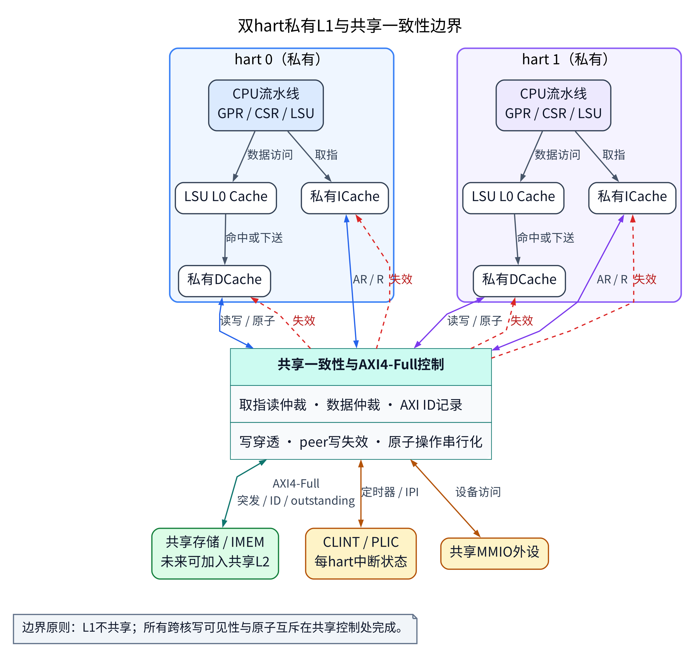
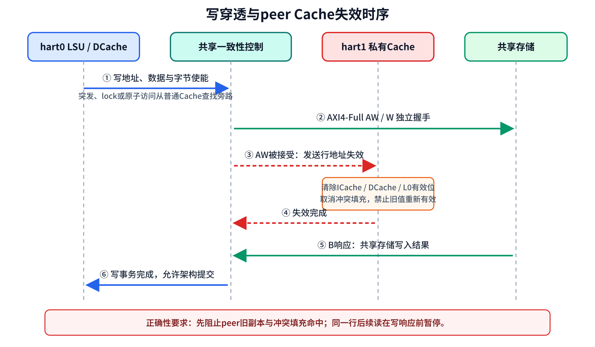
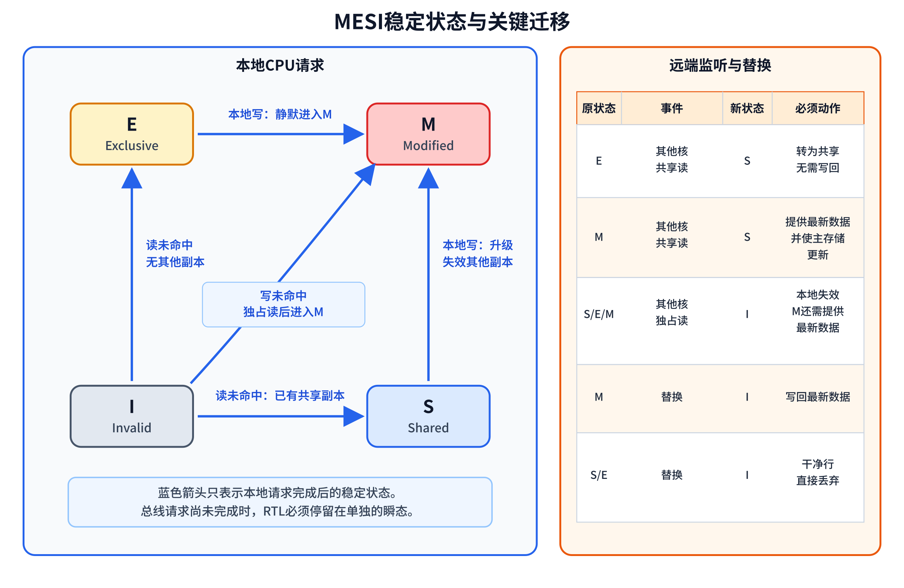
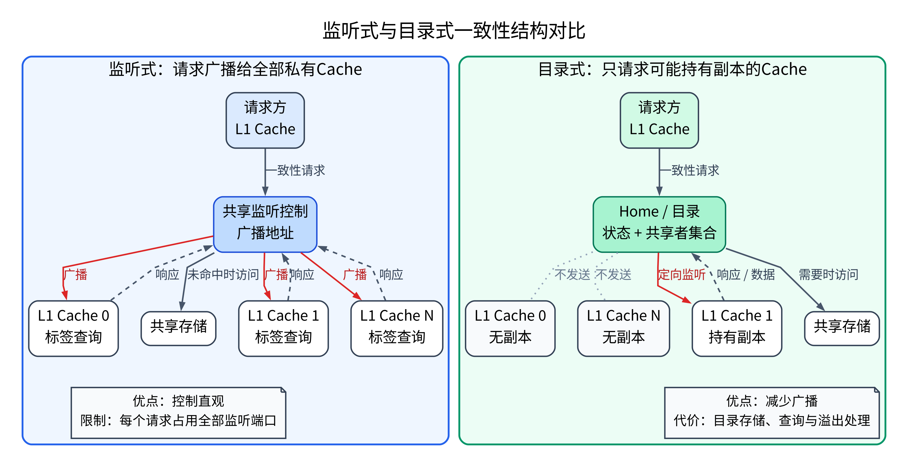
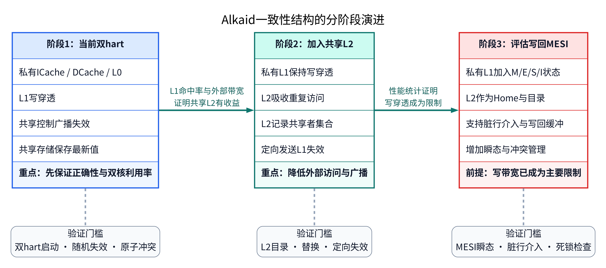

# 多核CPU设计和一致性处理

## 1. 文档定位

本文面向从单核CPU向多核SoC（片上系统）扩展的设计者，说明核间共享存储、私有Cache、原子操作、中断和软件启动的配合方法。内容同时覆盖SMP（对称多处理）与AMP（非对称多处理），并给出有原子指令和无原子指令两类系统的同步方案。

> [!NOTE]
> 多核设计不是单纯复制CPU。共享存储的可见性、访问顺序、中断分发、每个hart的启动上下文以及软件同步必须作为一个完整系统设计。

## 2. 基本概念

### 2.1 hart与处理器核

RISC-V使用hart表示独立的硬件线程。一个hart具有独立的PC（程序计数器）、GPR（通用寄存器）、CSR（控制与状态寄存器）和异常处理状态。一个物理核可以包含一个或多个hart；在简洁的双核实现中，通常每个物理核包含一个hart。

`mhartid`为每个hart提供稳定编号。启动程序、中断控制和操作系统调度器都依据该编号选择局部栈、定时器比较寄存器和运行队列。

### 2.2 SMP

SMP中的所有hart运行同一操作系统内核，共享物理地址空间、设备和大部分内核对象。调度器可以将线程安排到任意hart，因此必须提供核间中断、自旋锁、原子计数和按hart独立的中断上下文。

SMP的优势是应用开发模型统一，并行任务可由调度器自动分配。代价是共享数据较多，Cache一致性和锁竞争对性能的影响更明显。

### 2.3 AMP

AMP中的各hart可以运行不同的软件映像或不同职责的程序。主hart完成全局初始化，从hart在独立栈上等待启动参数，收到软件中断后进入指定函数。AMP适合实时控制、功能隔离和异构处理，也可作为多核硬件启动的最小软件验证模式。

### 2.4 一致性与存储顺序

Cache一致性解决多个私有Cache中同一内存位置副本的值是否一致。存储顺序解决一个hart的读写何时被另一个hart观察到。两者不可互相替代：即使Cache中的数据最终一致，软件仍需通过`fence`、带`aq`/`rl`位的原子指令或语言原子API（应用程序接口）表达先后关系。

## 3. 从单核到多核

### 3.1 处理器复制与参数化

单核设计应首先把核编号、hart数量、私有Cache容量和中断索引参数化。每个CPU保留独立的取指、译码、HDU（数据冒险检查单元）、执行、写回、GPR和CSR。核间仅共享存储器、总线、CLINT（核心本地中断控制器）寄存器组和PLIC（平台级中断控制器）等系统资源。

实现时要避免将寄存器地址、核编号或栈顶写成仅适用于hart0的常数。参数合法性应在硬件展开时检查，使不支持的hart数量在仿真和综合前明确失败。



*图1 双hart各自保留私有L1，共享控制负责仲裁、失效、原子操作和外部访问。*

### 3.2 共享总线

多核共享存储需要仲裁器。为保留AXI4-Full（完整AXI4协议）的并发能力，仲裁器不应在发出一笔读请求后一直等到读数据返回。更合理的方法是为已接受请求分配空闲ID（标识号），记录请求来源和原始ID，然后在返回时恢复原始ID并送回对应hart。

```systemverilog
always_comb begin
    request_valid = |s_arvalid;
    unique case (s_arvalid)
        2'b01: request_hart = 1'b0;
        2'b10: request_hart = 1'b1;
        2'b11: request_hart = ~last_grant;
        default: request_hart = 1'b0;
    endcase
end

assign m_arid    = free_id;
assign m_araddr  = s_araddr[request_hart];
assign m_arvalid = request_valid && free_id_valid;
```

该结构使两个hart可以使用相同的本地ID，总线仍能区分每笔未完成事务。仲裁策略可以采用轮换优先级，以免某一hart长时间无法发出请求。

> [!NOTE]
> AXI4-Full的AW（写地址）、W（写数据）、B（写响应）、AR（读地址）和R（读响应）通道相互独立。写控制必须能够记住AW和W哪一个已完成握手，不能假设两个通道同拍握手。

### 3.3 关键总线信号

| 信号 | 方向 | 位宽 | 功能 | 有效条件 | 暂停、错误与复位行为 |
| --- | --- | ---: | --- | --- | --- |
| `AWID` | 主设备输出 | 参数化 | 标识写事务 | `AWVALID=1` | `AWREADY=0`时保持不变；复位后不得遗留有效写请求 |
| `AWADDR` | 主设备输出 | 地址宽度 | 给出写起始地址 | `AWVALID=1` | `AWREADY=0`时保持；越界由从设备通过`BRESP`报告 |
| `AWLEN` | 主设备输出 | 8位 | 给出突发拍数减一 | `AWVALID=1` | 暂停时保持；从设备必须检查`WLAST` |
| `AWLOCK` | 主设备输出 | 1位 | 标记排他访问 | `AWVALID=1` | 暂停时保持；不支持时必须返回明确错误或在系统边界处处理 |
| `WVALID` | 主设备输出 | 1位 | 指示写数据有效 | 高电平有效 | `WREADY=0`时`WDATA`、`WSTRB`和`WLAST`保持；复位后清除 |
| `BRESP` | 主设备输入 | 2位 | 返回写结果 | `BVALID=1` | `BREADY=0`时从设备保持；`SLVERR`或`DECERR`不得被改成成功 |
| `ARID` | 主设备输出 | 参数化 | 标识读事务 | `ARVALID=1` | `ARREADY=0`时保持；复位后不得遗留有效读请求 |
| `ARLEN` | 主设备输出 | 8位 | 给出读突发拍数减一 | `ARVALID=1` | 暂停时保持；返回拍数必须与`RLAST`一致 |
| `ARLOCK` | 主设备输出 | 1位 | 标记排他读访问 | `ARVALID=1` | 暂停时保持；该属性必须穿过仲裁和Cache旁路 |
| `RID` | 主设备输入 | 参数化 | 指示读响应对应的事务 | `RVALID=1` | `RREADY=0`时保持；未知ID不得送入CPU |
| `RRESP` | 主设备输入 | 2位 | 返回读结果 | `RVALID=1` | 错误响应必须抑制错误数据进入架构状态 |
| `RLAST` | 主设备输入 | 1位 | 标记读突发最后一拍 | `RVALID=1` | 仅在`RVALID && RREADY && RLAST`时释放该读事务记录 |

### 3.4 中断与定时器

每个hart需要独立的软件中断位和定时器比较值，而自由运行的时间计数可以共享。CLINT常见寄存器如下：

| 寄存器 | 每个hart的步长 | 作用 |
| --- | ---: | --- |
| `MSIP` | 4字节 | 置位后产生对应hart的软件中断，适合IPI（核间中断） |
| `MTIMECMP` | 8字节 | 与共享`MTIME`比较，为对应hart产生定时器中断 |
| `MTIME` | 共享 | 提供64位单调递增时间值 |

RV32（32位RISC-V）写入64位`MTIMECMP`时，应先把高32位写成全1，再写低32位，最后写真实高32位，以免中间值提前触发中断。

### 3.5 复位与启动

多核启动中，主hart负责初始化全局数据区、平台设备和共享状态。从hart不得重复清零全局未初始化数据区，否则可能清除主hart已经写入的状态。每个hart必须先建立独立且按ABI（应用二进制接口）对齐的栈。

一个稳妥的启动次序是：

1. 所有hart读取`mhartid`并选择自己的栈。
2. 主hart清零全局未初始化数据区，设置异常入口并初始化设备。
3. 主hart写入启动标志，然后执行`fence rw, rw`。
4. 从hart观察到标志后执行`fence r, rw`，设置自己的异常入口和定时器。
5. SMP调用从hart调度器入口；AMP进入等待区，直到主hart写入函数地址并发送IPI。

## 4. Cache一致性

### 4.1 私有Cache的基本风险

假设hart0和hart1的DCache都保存地址`A`的副本。hart0将新值写入`A`后，如果系统只更新主存储而没有处理hart1的副本，hart1仍可能读到旧值。指令侧也有类似问题：当软件修改IMEM中的指令内容时，各私有ICache必须在后续取指前失效相关副本。

### 4.2 写穿透与监听失效

小型FPGA SoC适合使用私有写穿透Cache和监听失效结构。每笔写操作都到达共享存储，同时向其他hart发出地址失效请求。接收方清除相应Cache项的有效位，并抑制同拍的旧值命中和未完成填充。

```systemverilog
assign invalidate_valid = m_awvalid && m_awready;
assign invalidate_hart  = selected_hart;
assign invalidate_addr  = m_awaddr;

always_ff @(posedge clk or negedge rst_n) begin
    if (!rst_n) begin
        cache_valid <= '0;
    end else if (peer_invalidate_valid && peer_tag_match) begin
        cache_valid[peer_index] <= 1'b0;
    end
end
```

该方法不需要为每个Cache行实现复杂状态，适合核数较少、共享写比例较低的系统。代价是所有写操作都占用共享总线，并且多个hart频繁写同一Cache行中的不同变量时会不断互相失效。

### 4.3 典型写操作次序

写穿透失效方案中，一笔写操作的关键次序如下：

1. 核内LSU形成地址、数据、字节使能和原子操作类型。
2. 私有DCache对普通单拍访问执行查找；突发、lock或原子操作直接从Cache旁路通过。
3. 一致性控制先排除与已接受读写事务的地址冲突，再发出共享总线请求。
4. AW握手成功时发出失效地址，其他hart清除对应的ICache、DCache或LSU L0 Cache状态。
5. B响应返回后，原始hart才把该写事务视为完成。



*图2 写穿透失效时序；同一Cache行的后续读还需等待写响应，不能只等待失效完成。*

### 4.4 AXI4-Lite Cache与乒乓缓存

AXI4-Lite Cache与乒乓缓存可以作为单拍访问的低延迟存储结构，但它们不能抹除AXI4-Full的ID、突发、`LAST`和lock属性。具备这些属性的请求应从Cache查找旁路通过，并完整保留它们的握手与错误响应。

## 5. 主流Cache一致性协议教程

### 5.1 先区分三个层次

多核存储系统通常同时讨论三个不同层次的问题：

- Cache一致性规定同一物理地址的多个Cache副本如何保持一致，重点是单个Cache行的读写权限与最新数据位置。
- 存储顺序规定不同地址的读写可以按什么次序被其他hart观察。RISC-V使用RVWMO规则，并由`fence`、LR/SC、AMO及`aq`、`rl`位补充软件要求的次序。
- 互连协议负责传送读写、监听、数据响应和完成响应。AXI4-Full本身不是Cache一致性协议；ACE在AXI4基础上加入监听通道，CHI则使用分组事务、信用控制和目录结构支持更大规模系统。

因此，“总线支持AXI4-Full”和“系统具备硬件Cache一致性”是两个独立结论。一个系统可以使用AXI4-Full并由自定义逻辑完成写穿透失效，也可以使用ACE或CHI承载更完整的写回一致性协议。

### 5.2 状态名称与权限

主流协议都把每个Cache行放入有限状态机。稳定状态的核心含义如下：

| 状态 | 英文名称 | 本地可读 | 本地可直接写 | 其他Cache可有副本 | 主存储是否为最新值 |
| --- | --- | --- | --- | --- | --- |
| I | Invalid | 否 | 否 | 可以 | 不确定 |
| S | Shared | 是 | 否，需先取得独占写权限 | 可以 | 是 |
| E | Exclusive | 是 | 是，可静默进入M | 不可以 | 是 |
| M | Modified | 是 | 是 | 不可以 | 否 |
| O | Owned | 是 | 否，需先清除其他共享副本 | 可以 | 否 |
| F | Forward | 是 | 否，需先取得独占写权限 | 可以 | 是 |

I、S、M构成MSI；加入E得到MESI；加入O得到MOESI；在MESI基础上加入F得到MESIF。具体产品可能再增加内部稳定状态和瞬态状态，但软件看到的正确性要求不变。

### 5.3 MSI：最小写回协议

MSI只有M、S、I三个稳定状态，适合用来理解监听式一致性的基本动作：

1. 本地读命中M或S时直接返回数据。
2. 本地读在I状态下未命中时，发出共享读请求。如果其他Cache持有M副本，它必须提供最新数据，并通常降为S；请求方进入S。
3. 本地写命中S时，发出升级请求，使其他S副本进入I，本地进入M。
4. 本地写在I状态下未命中时，发出独占读请求，取得数据并使其他副本进入I，然后进入M。
5. M行被替换时必须写回，因为主存储仍是旧值。

MSI的主要性能缺点是：一个Cache独自读取某行时仍只能进入S，随后第一次写还要发出升级请求。MESI增加E状态正是为了去掉这笔多余事务。

### 5.4 MESI：加入干净独占状态

MESI包含M、E、S、I四种状态，是通用多核CPU中最常见的教学模型。读未命中时，如果系统确认没有其他Cache保存该行，请求方进入E；如果已有共享副本，请求方进入S。

E状态中的数据与主存储一致，并且只有当前Cache保存副本。因此本地写可以不发送总线请求，直接从E进入M。这个静默迁移减少了私有数据和栈数据第一次写入时的总线通信。

典型迁移可以简化为：

```text
I --共享读且无其他副本--> E
I --共享读且已有副本----> S
I --独占读--------------> M
S --升级并清除其他副本--> M
E --本地写--------------> M
M --其他核共享读--------> S，并提供最新数据
任意有效状态 --其他核独占读--> I
```

实现MESI时，系统必须可靠判断“是否存在其他副本”。小规模监听总线可收集各Cache的共享响应；目录系统则查询共享者集合。如果这个判断不可靠，就不能安全授予E状态。



*图3 MESI本地请求的稳定状态变化，以及远端监听和替换所需的动作。总线请求进行期间还需要独立瞬态。*

### 5.5 MOESI：允许脏数据继续共享

MOESI在MESI上增加O（Owned，脏共享）状态。当一个M行收到其他hart的共享读时，原Cache可以从M进入O，请求方进入S，而不必立即把数据写回主存储。O行负责在后续请求中提供最新数据，主存储允许暂时保留旧值。

这一状态减少了“另一个核读取脏行”所引起的写回流量，适合核间频繁读取某个已修改数据的系统。代价是控制逻辑必须区分干净共享与脏共享，并保证任意时刻至多有一个O或M副本：

```text
M --其他核共享读--> O + S
O --其他核共享读--> O + S + S
O --本地重新取得独占写权限--> M，其他S副本进入I
O --替换--> 写回最新数据
```

AMD64文档长期使用MOESI描述Cache行状态；较新的系统文档还扩展出MOESDIF。对通用教程而言，O状态仍是理解“脏数据可由一个Cache负责，同时允许其他Cache只读共享”的关键。

### 5.6 MESIF：指定共享数据响应方

MESIF在MESI上增加F（Forward，转发）状态。多个Cache都可以持有干净共享副本，但仅有一个F副本优先响应其他核的共享读请求，其余副本保持S。这样可以减少多个S副本同时响应的问题，并降低从较远主存储取数的概率。

F与O的区别是：F行是干净的，主存储仍是最新值；O行是脏的，最新值位于Cache中。典型动作如下：

```text
E --其他核共享读--> F + S
F --其他核共享读--> F + S + S
F --替换或失效--> 后续共享读可选择一个S副本成为新的F，或从主存储读取
F/S --任一核取得独占写权限--> 其他副本进入I，请求方进入M
```

### 5.7 四种协议的取舍

| 协议 | 稳定状态 | 主要收益 | 主要代价 | 适用起点 |
| --- | --- | --- | --- | --- |
| MSI | M、S、I | 状态少，易于理解 | 独占私有行首次写仍需升级 | 教学模型与最小写回验证 |
| MESI | M、E、S、I | E到M可静默迁移 | 需要判断是否有其他副本 | 常规多核CPU |
| MOESI | M、O、E、S、I | 脏行可直接共享，减少立即写回 | O状态与脏数据来源控制更复杂 | 核间共享脏数据较多的系统 |
| MESIF | M、E、S、I、F | 指定干净共享数据响应方 | 需要维护F副本选择 | 核数较多、点到点互连系统 |

协议名称并不能单独决定性能。Cache容量、行大小、替换策略、监听延迟、目录查询延迟、共享写比例以及伪共享，往往比多一个稳定状态更直接地影响应用表现。

### 5.8 按事务理解状态变化

#### 5.8.1 读未命中

请求方先查询本地Cache。若未命中，则向一致性控制发出共享读。系统需要确定三件事：其他Cache是否有副本、是否有M或O脏副本、数据由主存储还是其他Cache返回。数据与权限确认后，请求方才能把行标成S、E或其他协议允许的状态。

#### 5.8.2 写未命中

请求方发出独占读或读后升级请求。其他Cache中的S、E、F、O或M副本必须进入I；若存在脏副本，最新数据还要先送给请求方或写回。只有在失效确认全部返回后，请求方才能进入M并允许本地写完成。

#### 5.8.3 共享命中后的升级

S或F行已包含正确数据，写入前不必重新取数，但必须清除其他共享副本。常见协议使用升级事务，只传递权限请求与失效确认。升级期间该Cache行应处于瞬态，不能把它误当成已经获得M权限。

#### 5.8.4 脏行介入

如果另一个Cache持有M或O，主存储不是最新数据。这个Cache必须介入请求，直接提供数据或先写回。目录或监听控制必须等待这一步完成，不能提前使用主存储返回的旧值。

#### 5.8.5 替换

S、E、F等干净行通常可以直接丢弃；M或O行必须先写回或把最新数据交给系统指定位置。目录结构还应同步清除该Cache在共享者集合中的记录，避免以后向一个已经没有副本的Cache发送监听。

### 5.9 监听式与目录式系统

监听式系统把一致性请求广播给所有私有Cache。每个Cache并行检查标签并返回命中、共享、脏数据或失效确认。它的优点是控制直观、请求延迟固定，适合双核或少量核心；缺点是每笔请求都会占用全部Cache的监听端口，核数增加后广播流量迅速上升。

目录式系统为每个Cache行维护状态和共享者集合，只向可能持有副本的Cache发送请求。全目录可以为每个核保留一位共享标记；核数很大时，可采用受限共享者记录、稀疏目录或分层目录。目录节省广播流量，但增加了目录存储、查询步骤和溢出处理。

对双核FPGA系统，监听失效通常更省资源。增加共享L2时，可以让L2同时保存目录状态：L1未命中先访问L2，跨核写请求由L2查询共享者并发送失效。这样私有L1结构保持不变，一致性控制逐步从共享总线转到L2目录。



*图4 监听式向全部私有Cache广播请求；目录式根据共享者集合发送定向监听。*

### 5.10 ACE与CHI如何承载一致性

ACE扩展AXI4，保留常见读写通道并增加监听地址、监听响应和监听数据通道。发起方可表达共享读、独占读、清理和失效等操作；互连向相关Cache发出监听，再汇总响应。ACE使用五状态Cache模型，并允许脏数据由Cache提供，因此不能把ACE简化为“带几个额外属性的AXI4”。

ACE-Lite面向DMA等没有完整私有Cache状态机的I/O发起方。它可以发出一致性访问，使CPU Cache中的脏数据得到检查或失效，但自身不接受完整双向监听。系统设计必须区分CPU全一致性端口和I/O单向一致性端口。

CHI面向更多核心和分布式互连，采用请求、监听、响应和数据分组，配合信用控制支持非阻塞通信。Home Node负责某段地址的一致性次序与目录查询，Request Node发出访问，Subordinate Node连接存储。监听过滤器或目录只向可能命中的节点发送监听，从而减少广播。

### 5.11 瞬态、并发与死锁

稳定状态表只描述事务完成后的结果，真正的RTL还需要瞬态。例如S行发出升级后、失效确认尚未收齐时，可以处于`S_to_M`；I行请求共享读、数据尚未返回时，可以处于`I_to_S`。瞬态至少要记录：

- 当前请求类型与目标稳定状态。
- 尚未返回的失效确认数。
- 数据是否已经返回以及来源。
- 是否存在本地等待访问。
- 是否收到与当前请求冲突的远端监听。

支持多笔未完成事务后，不同地址可以并行，同一Cache行的冲突事务仍需串行化。常见做法是每个Miss Status Holding Register保存一笔未完成Cache行请求，并在行地址匹配时合并读请求或暂停冲突写。AXI ID只能区分总线事务，不能替代Cache行级冲突管理。

一致性控制还要预先规定通道依赖。例如请求不能永久等待一个因响应队列已满而无法发出的监听响应；数据缓冲也不能被一个尚待本请求释放的资源完全占满。验证环境应随机暂停各通道，并设置有限周期的进展检查，暴露循环等待。

### 5.12 Alkaid当前方案与演进路径

当前双核采用私有L1、共享存储、写穿透和监听失效，不需要为每个DCache行实现MESI状态。它可以视为一种简化的I/S结构：有效行可读，任何本地写都到达共享存储并使另一核对应行失效。因为不保留脏行，所以没有M、O状态，也不需要Cache到Cache的数据响应。

这一方案适合当前双核规模，关键正确性条件是：

- 写请求被系统接受后，其他hart不能再以旧副本命中。
- 与失效地址冲突的未完成填充不能在失效之后重新把旧数据置为有效。
- 原子操作期间，读改写与失效必须由同一一致性控制串行处理。
- 突发、lock和原子请求完整保留AXI4-Full属性，不能被单拍Cache结构拆坏。
- `fence`与`aq`、`rl`仍由CPU和存储系统共同保证，Cache失效本身不建立不同地址间的访问次序。

未来增加共享L2时，建议分两步演进。第一步保持L1写穿透，让L2吸收重复访问并保存共享者集合；第二步再评估L1写回及MESI。只有在写带宽或外部存储延迟确实成为主要限制时，才引入M状态、脏行介入、写回缓冲和更多瞬态。这样每一步都能通过现有双hart测试与TVIP-AXI VIP回归独立验证。



*图5 从当前写穿透监听失效，到共享L2目录，再到按性能结果评估写回MESI。*

## 6. 原子指令

### 6.1 原子操作的作用

普通的“读取、修改、写回”需要多条指令。如果两个hart同时更新计数器，它们可能读到相同旧值，最后只保留一次加法结果。原子指令保证这个更新序列对其他hart表现为不可分割的操作。

RISC-V A原子指令扩展提供两类机制：LR/SC（保留读/条件写）和AMO（原子存储器操作）。

### 6.2 LR/SC

`lr.w` 读取字并为当前hart建立保留状态。任何hart对相同保留范围的写操作都会清除该状态。`sc.w` 仅在保留仍然有效时执行写操作；成功时向目的寄存器写0，失败时写非0。软件必须在失败后重新执行`lr.w`，不得只重试`sc.w`。

```asm
lock:
    li       t1, 1
1:  lr.w.aq  t0, (a0)
    bnez     t0, 1b
    sc.w     t0, t1, (a0)
    bnez     t0, 1b
    ret

unlock:
    fence    rw, w
    sw       zero, 0(a0)
    ret
```

`aq`使锁成功之后的访问不会被观察为发生在取锁之前；释放前的`fence rw, w`保证临界区写操作在清锁之前对其他hart可见。也可以使用带`rl`位的原子写完成释放。

### 6.3 AMO

AMO指令在一条指令中完成读取旧值、计算新值和写回。常用指令包括`amoswap`、`amoadd`、`amoxor`、`amoand`、`amoor`、`amomin`、`amomax`、`amominu`和`amomaxu`。

```c
static inline unsigned atomic_add(volatile unsigned *ptr, unsigned value)
{
    unsigned old;
    __asm__ volatile (
        "amoadd.w.aqrl %0, %1, (%2)"
        : "=r"(old)
        : "r"(value), "r"(ptr)
        : "memory");
    return old;
}
```

对编译器和操作系统而言，优先使用C11原子操作或内核提供的原子API。内联汇编适合BSP（板级支持包）和最底层端口，但必须正确声明`memory`破坏项并使用合适的顺序属性。

### 6.4 硬件保留状态

每个hart需要独立的保留有效位和保留地址。任意hart的成功写地址与保留范围重叠时，相应保留必须清除。`sc`不论成功还是失败，都应清除当前hart的保留。

```systemverilog
sc_success = reservation_valid[hart] &&
             reservation_addr[hart] == write_addr[ADDR_WIDTH-1:3];

if (write_fire) begin
    for (int h = 0; h < HART_COUNT; h++) begin
        if (reservation_valid[h] &&
            reservation_addr[h] == write_addr[ADDR_WIDTH-1:3]) begin
            reservation_valid[h] <= 1'b0;
        end
    end
end
```

> [!WARNING]
> `AWLOCK`或`ARLOCK`不能自动实现RISC-V的LR/SC。系统仍需保留监视、SC成功与失败响应、冲突写清除以及Cache失效处理。

## 7. 无原子指令的设计

### 7.1 中断屏蔽的边界

关闭当前hart的中断只能防止该hart被本地中断打断，不能阻止另一个hart访问共享数据。因此，单核系统中常用的“关中断”不是多核互斥方案。

### 7.2 硬件信号量

可以在MMIO地址空间提供硬件信号量。每次读操作由硬件不可分割地返回并占用一个信号量，写操作释放它。该方案不依赖CPU原子指令，但信号量设备必须只接受单拍访问，并明确处理复位、超时和错误恢复。

### 7.3 中央仲裁区

也可以使共享资源的所有访问都通过一个硬件仲裁区。请求携带hart编号和操作类型，仲裁区一次只处理一个共享状态更新。该方案适合邮箱、队列指针和小型控制寄存器，不适合大量通用内存更新。

### 7.4 消息传递与AMP分区

当硬件不支持原子指令时，最容易验证的软件结构是避免多个hart直接更新同一变量。可以将存储区按hart划分，每个区域仅由一个hart写入，其他hart通过邮箱和IPI提交请求。稳定的单写者规则可以大幅减少一致性冲突。

### 7.5 纯软件互斥

两个hart可使用Peterson算法，多个hart可使用Lamport面包店算法。这些算法需要可靠的单字读写、Cache可见性和明确的存储顺序。如果平台无法提供这些基础条件，应选择硬件信号量或AMP消息传递，而不是依赖纯软件互斥。

## 8. 软件模式

### 8.1 SMP启动

SMP内核启动通常由主hart完成内核数据结构和设备初始化，再通过AMP形式的最小启动服务拉起从hart。从hart完成本地中断、定时器和调度状态初始化后，进入调度器。

SMP端口至少需要实现：

- 读取当前hart编号。
- 初始化从hart本地设备。
- 向指定hart发送IPI。
- 实现自旋锁的获取与释放。
- 为每个hart提供独立中断栈和线程运行状态。
- 在空闲时执行WFI（等待中断）。

### 8.2 AMP调度

AMP引导服务应定义明确的hart状态，例如离线、等待、运行和完成。主hart先写入函数地址和参数，执行发布栅栏，再写启动状态并发送IPI。从hart在读取函数地址和参数前执行获取栅栏。完成后，从hart先写结果，再发布完成状态。

## 9. 验证方法

### 9.1 模块级验证

总线仲裁与一致性模块需要覆盖以下情形：

- 两个hart使用相同本地ID发出请求，返回次序与发出次序不同。
- 读、写各有多笔未完成事务，并包含不同突发长度。
- AW和W分别先到，B和R通道施加暂停。
- lock值0和1均在真实握手中出现。
- LR后无冲突写时SC成功，LR后发生冲突写时SC失败。
- AMO返回旧值并正确写入新值。
- 复位清除所有未完成事务记录、保留状态和有效响应。

TVIP-AXI VIP（验证IP）可以在UVM（通用验证方法学）环境中生成AXI4-Full突发和多笔未完成事务。计分器应独立统计AW、W、B、AR、R和`LAST`握手，不只依赖激励组件内部状态。

### 9.2 软件验证

硬件模块测试之后，应先运行AMP双hart启动测试，检查独立栈、从hart函数调用、IPI、LR/SC和AMO。该测试通过后，再运行SMP调度器和多线程应用，这样可以把硬件启动问题与操作系统问题分开定位。

### 9.3 性能验证

单核和双核性能比较必须使用相同ISA（指令集架构）、相同编译参数、相同源码和相同迭代配置。应同时记录总分、周期数、每个hart的执行覆盖和同步等待时间。如果双核提升明显低于两倍，应检查共享总线冲突、Cache失效、锁竞争、线程绑定和主hart是否在等待期间占用了从hart。

## 10. 设计检查表

- 每个hart是否有独立PC、GPR、CSR、栈和中断上下文。
- 主hart是否是唯一的全局初始化执行者。
- 从hart是否在读取启动参数前执行获取栅栏。
- 仲裁器是否在两个hart同时请求时保证长期公平。
- AXI ID是否可以区分多笔未完成事务并恢复原始ID。
- 是否分别处理AW、W、B、AR和R通道的暂停。
- 私有ICache、DCache和LSU L0 Cache是否在其他hart写入时及时失效。
- 突发、lock和原子请求是否从普通Cache查找旁路通过。
- 每个hart的LR保留是否独立，冲突写是否清除保留。
- SC失败是否不向存储器发出写操作。
- 每个hart是否有独立`MSIP`和`MTIMECMP`，且共享`MTIME`。
- 中断是否避免在原子序列中间进入。
- SMP软件是否使用原子API和IPI，而不是仅关闭本地中断。
- 覆盖率统计是否包含仲裁、暂停、错误、复位、lock、LR/SC、AMO和Cache失效。

## 11. 参考资料

- [RISC-V非特权ISA规范](https://docs.riscv.org/reference/isa/v20191213/_attachments/riscv-unprivileged.pdf)：RVWMO、`fence`、LR/SC、AMO与`aq`、`rl`规则。
- [RISC-V RVWMO说明材料](https://docs.riscv.org/reference/isa/unpriv/mm-eplan.html)：说明存储顺序与Cache一致性相互独立，ISA不限定具体Cache层次或一致性协议。
- [Arm AMBA AXI与ACE协议规范](https://developer.arm.com/-/media/Arm%20Developer%20Community/PDF/IHI0022H_amba_axi_protocol_spec.pdf)：ACE五状态模型、监听通道、共享与脏数据处理。
- [Arm AMBA 5 CHI简介](https://developer.arm.com/support/training/-/media/B51E4B89029847979F879CFFEB07EEC9.ashx)：CHI节点、分组通道、信用控制、目录和监听过滤器。
- [Intel核间通信与MESI说明](https://www.intel.com/content/www/us/en/developer/articles/technical/fast-core-to-core-communications.html)：MESI状态与共享数据传递示例。
- [Intel DDIO与MESIF说明](https://www.intel.com/content/www/us/en/developer/articles/technical/ddio-analysis-performance-monitoring.html)：MESIF系统中的监听与独占写权限处理。
- [AMD64架构编程手册](https://docs.amd.com/v/u/en-US/40332_4.09_APM_PUB)：AMD64 Cache一致性协议及MOESI、MOESDIF相关说明。

## 12. 结语

将单核CPU扩展为多核CPU的核心是建立明确的共享规则。硬件需要提供可并发的AXI4-Full访问、私有Cache失效、LR/SC保留、AMO互斥、逐hart中断和可靠启动；软件需要使用栅栏、原子API、IPI和明确的任务分工。在没有原子指令时，应用硬件信号量、中央仲裁或AMP单写者结构代替不可靠的共享变量更新。
