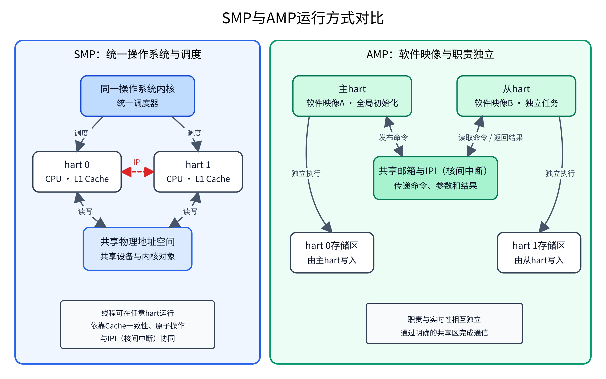
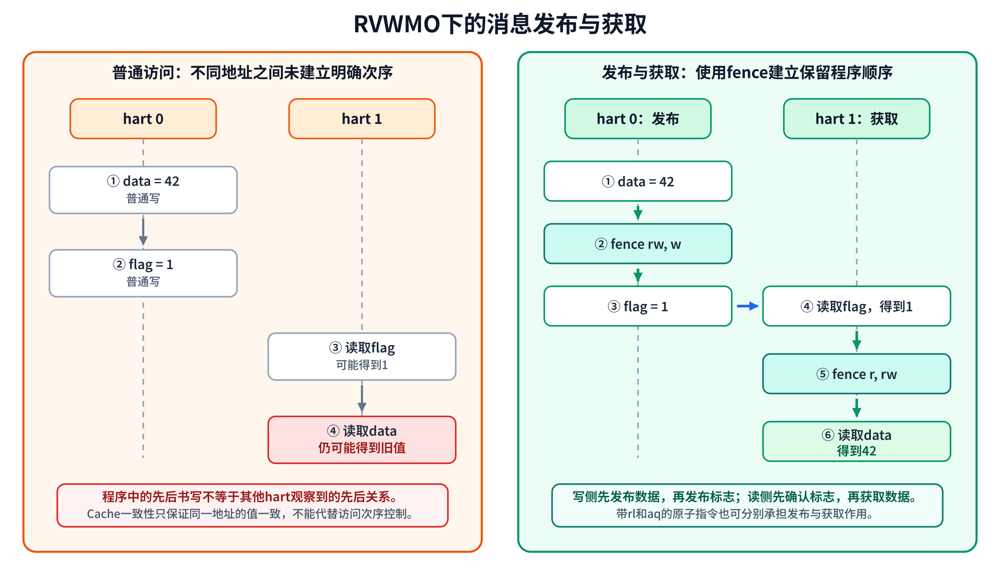
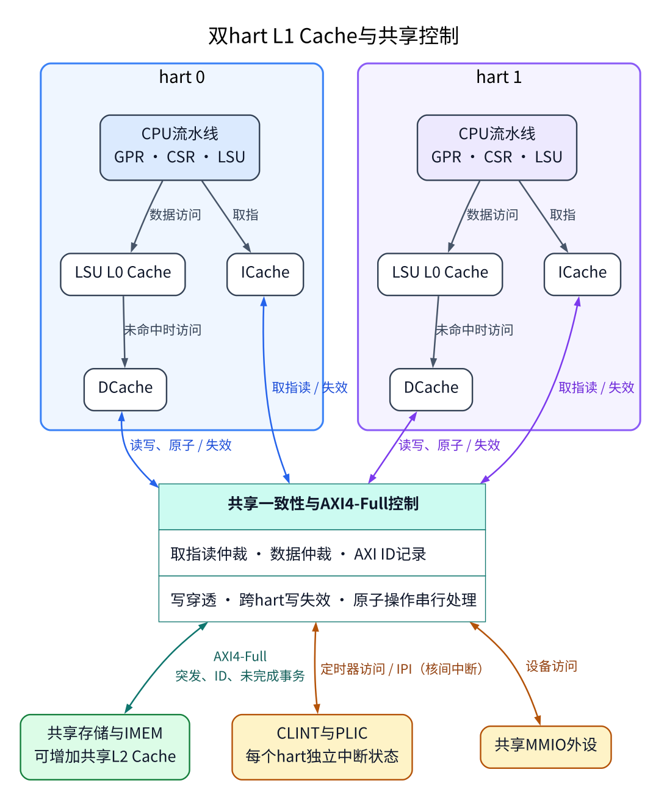
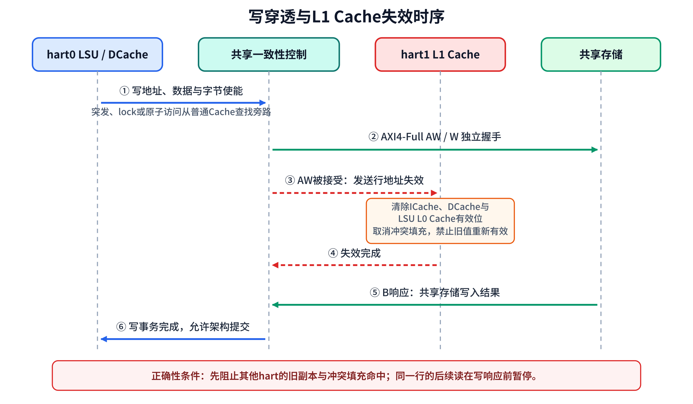
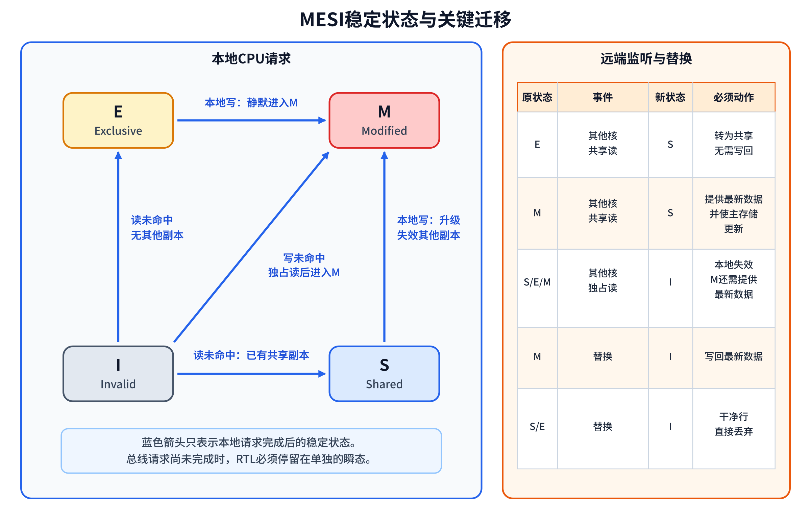
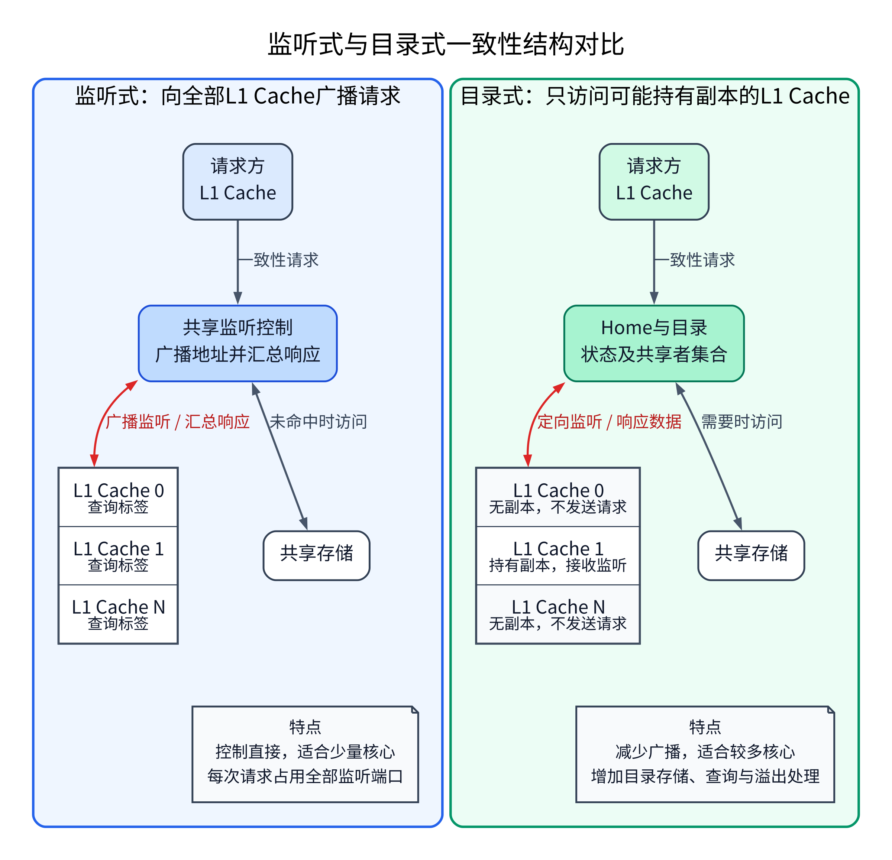
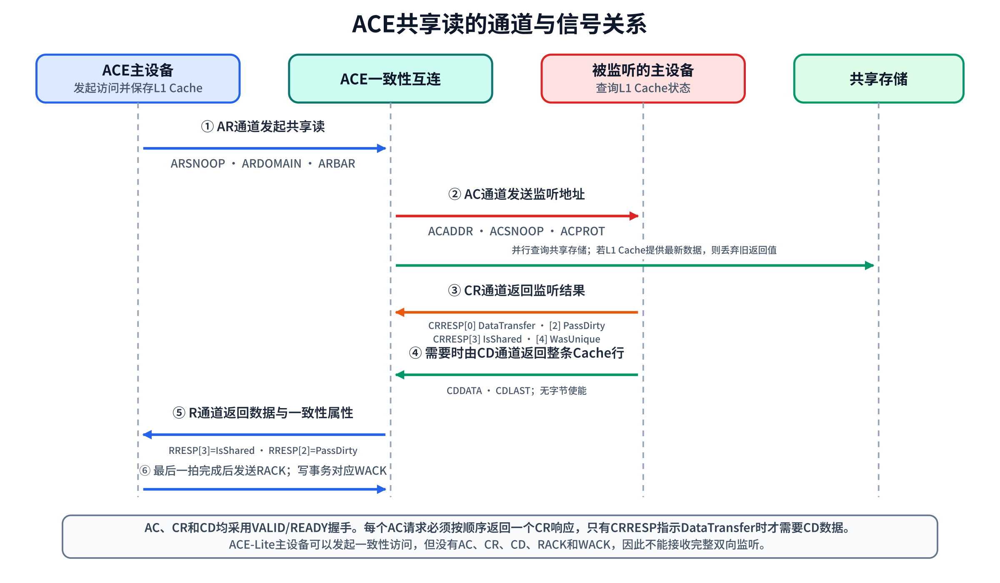
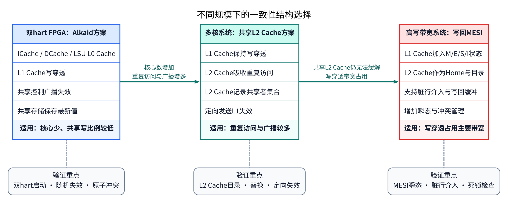

# 多核CPU设计和一致性处理

## 1. 文档定位

本文面向从单核CPU向多核SoC（System on Chip，片上系统）扩展的设计者，说明核间共享存储、L1 Cache（Level 1 Cache，一级Cache）、原子操作、中断和软件启动的配合方法。内容同时覆盖SMP（Symmetric Multiprocessing，对称多处理）与AMP（Asymmetric Multiprocessing，非对称多处理），并给出有原子指令和无原子指令两类系统的同步方案。

> [!NOTE]
> 多核设计不是单纯复制CPU。共享存储的可见性、访问顺序、中断分发、每个hart的启动上下文以及软件同步必须作为一个完整系统设计。

## 2. 基本概念

### 2.1 hart与处理器核

RISC-V使用hart表示独立的硬件线程。一个hart具有独立的PC（Program Counter，程序计数器）、GPR（General-Purpose Register，通用寄存器）、CSR（Control and Status Register，控制状态寄存器）和异常处理状态。一个物理核可以包含一个或多个hart；在简洁的双核实现中，通常每个物理核包含一个hart。

`mhartid`为每个hart提供稳定编号。启动程序、中断控制和操作系统调度器都依据该编号选择局部栈、定时器比较寄存器和运行队列。

### 2.2 锁与互斥

#### 2.2.1 锁和临界区

多个hart能够同时访问共享数据时，某些操作必须作为一个整体执行。例如，向共享就绪队列插入线程通常包含读取队尾、修改指针和更新计数等多个步骤；若两个hart交错执行这些步骤，队列结构可能损坏。访问这类共享数据且不允许冲突访问同时进行的程序片段称为临界区。

锁是控制临界区进入权限的同步机制。锁通常使用一个共享状态表示“可获取”或“已占用”。hart进入临界区前执行获取锁操作，以原子方式检查并更新该状态；只有获取成功的hart可以进入临界区。临界区执行完毕后，该hart执行释放锁操作，使其他等待者能够继续。锁状态只是进入权限的记录，真正受保护的是与该锁关联的共享数据。

多核锁不能由普通的加载和存储可靠实现。若两个hart先后读取到“可获取”，再分别写入“已占用”，两者都可能误判为获取成功。锁变量的检查与更新因此必须使用原子指令或专用硬件机构完成。关闭本地中断也不能代替多核锁，因为它只能阻止当前hart的中断处理程序，不能阻止其他hart访问共享数据。

#### 2.2.2 常见锁类型

锁可以按允许进入临界区的执行者数量和等待方式分类。常见类型如下：

| 类型    | 进入规则                               | 等待方式                      | 适用情况                             | 主要注意事项                            |
| ----- | ---------------------------------- | ------------------------- | -------------------------------- | --------------------------------- |
| 自旋锁   | 任一时刻只允许一个hart或线程进入                 | 获取失败者持续检查锁状态，不主动让出CPU     | 临界区很短、等待时间可控，或者中断处理程序需要与线程共同保护数据 | 等待期间持续占用CPU；持锁期间不执行可能阻塞或耗时较长的操作   |
| 互斥锁   | 任一时刻只允许一个线程进入                      | 获取失败的线程进入阻塞状态，由调度器在锁可用时唤醒 | 临界区较长，或者持锁线程可能等待其他事件             | 依赖调度器，阻塞和唤醒有额外开销，不能由普通中断处理程序使用    |
| 读写锁   | 无写入者时允许多个读取者同时进入；写入者进入时排除其他读取者和写入者 | 可以采用自旋等待或调度阻塞，取决于具体实现     | 读取明显多于写入，且读取操作之间没有冲突             | 需规定读取者与写入者的优先关系，避免某一方长期得不到执行机会    |
| 排队自旋锁 | 任一时刻只允许一个执行者进入，等待者按申请次序依次取得锁       | 每个等待者主要检查与自身相关的等待状态       | hart较多且同一把锁竞争明显                  | 比简单自旋锁需要更多状态和交接操作，但可减少对同一锁变量的反复访问 |

这些名称描述的是软件进入规则和等待方式，不是具体的原子指令名称。原子读改写以及加载保留与条件存储是实现锁变量更新的硬件基础，自旋锁、互斥锁和读写锁则在此基础上规定等待与唤醒行为。计数信号量也属于同步机制，但它可以允许多个执行者同时取得资源，通常不归入互斥锁。

#### 2.2.3 获取与释放

正确的锁操作同时保证互斥和访问次序。获取锁成功后，临界区内的读取与写入不能被其他hart观察为发生在获取操作之前；释放锁时，临界区内已经完成的共享数据更新不能被其他hart观察为发生在释放操作之后。后文所述原子指令次序控制位和`fence`用于建立这些先后关系，Cache一致性则保证各hart不会继续使用已经失效的共享数据副本。

每一把锁都对应明确的受保护数据，所有访问这些数据的hart遵守相同的加锁规则。一个执行者需要同时取得多把锁时，各执行路径采用统一的取锁次序，以免形成相互等待。自旋锁还需限制临界区长度；若本hart的中断处理程序可能申请同一把锁，线程应在取锁前关闭本地中断，并在释放锁后恢复原中断状态。

### 2.3 SMP（对称多处理）

#### 2.3.1 定义与运行模型

SMP中的所有hart运行同一操作系统内核，共享物理地址空间、设备和大部分内核对象。处于就绪状态的线程原则上可以在任意在线hart上运行，调度器负责选择执行位置并在必要时迁移线程。线程亲和性可以限制某个线程允许使用的hart集合，常用于实时任务、局部设备中断处理或减少线程迁移引起的L1 Cache重新填充。

“对称”表示操作系统在正常运行阶段以统一方式管理各hart，不表示复位后的启动职责完全相同。系统通常先由一个启动hart完成只能执行一次的全局初始化，再启动其余hart；当其余hart完成局部初始化并进入调度器后，各在线hart才具有对称的线程执行能力。

SMP的优势是应用开发模型统一，并行任务可由调度器自动分配。代价是共享状态较多，操作系统必须同时处理Cache一致性、访问次序、锁竞争、线程迁移和跨hart调度通知。

#### 2.3.2 启动过程

SMP启动分为全局初始化和hart局部初始化。全局数据区、共享内存分配器、全局调度状态、中断控制器公共寄存器及共享设备只初始化一次；每个hart的栈、异常入口、中断嵌套状态、定时器和当前线程记录则分别初始化。典型过程如下：

1. 复位后的hart读取`mhartid`并选择独立栈。启动hart继续执行，其余hart保持停止状态或进入等待状态。
2. 启动hart初始化全局数据区、共享存储、全局中断控制和系统设备，建立每个hart所需的中断栈、空闲线程与调度记录。
3. 启动hart写入从hart的入口地址、栈地址和启动参数，执行释放操作所需的`fence`，然后通过平台启动机构解除从hart复位或请求下层固件启动指定hart。
4. 从hart设置自己的异常入口、局部中断、定时器和调度状态，读取共享启动信息前执行获取操作所需的`fence`，随后写入就绪状态。
5. 启动hart确认从hart就绪，将其标记为在线。在线表示该hart已经能够接收设备中断并执行调度器分配的线程。
6. 各hart进入调度器；没有可运行线程时执行WFI（Wait for Interrupt，等待中断），由定时器中断、设备中断或IPI（Inter-Processor Interrupt，处理器间中断）唤醒。

采用SBI（Supervisor Binary Interface，监督态二进制接口）的RISC-V系统可以使用HSM（Hart State Management，硬件线程状态管理）扩展控制hart的启动、停止、状态查询和挂起。`sbi_hart_start`指定目标hart、入口地址和一个启动参数；目标hart从停止状态进入启动中状态，完成局部初始化后进入已启动状态。SMP启动与运行期IPI不是同一操作：前者使停止的hart取得执行入口并开始运行，后者只通知已经能够处理中断的hart。

#### 2.3.3 调度状态

SMP调度器管理统一的线程集合，但以下状态仍按hart分别保存：

| 内容 | 保存方式 | 作用 |
| --- | --- | --- |
| 线程与内核对象 | 系统共享 | 使任意符合亲和性设置的在线hart都能执行就绪线程 |
| 就绪队列 | 全局共享或按hart分别保存 | 记录等待执行的线程；按hart保存时还需在线程迁移时协调多个队列 |
| 当前线程 | 每个hart独立 | 标明该hart当前执行的线程及其上下文 |
| 中断栈与中断嵌套状态 | 每个hart独立 | 保证多个hart可以同时进入中断处理程序 |
| 定时器状态 | 每个hart独立 | 支持调度计时、超时处理和本地时钟事件 |
| 空闲状态 | 每个hart独立 | 记录hart是否正在等待中断，并为唤醒操作提供依据 |

新线程进入就绪状态、线程亲和性发生变化或高优先级线程需要抢占另一hart时，调度器向相关hart发送IPI，请求其重新执行调度选择。IPI的发送次序本身不代替共享调度状态的同步；调度器必须先在锁保护下更新队列和状态，再发出通知。

#### 2.3.4 IPI与同步

IPI是一个hart请求另一个hart进入中断处理程序的通知机制，常用于唤醒等待中的hart、请求重新调度、停止指定线程或执行跨hart的Cache维护。采用SBI时，`sbi_send_ipi`通过hart集合选择接收方，接收方观察到监督态软件中断。具体平台也可以通过CLINT（Core-Local Interruptor，核心本地中断控制器）的`MSIP`（Machine Software Interrupt Pending，机器态软件中断待处理）位或等效的软件中断寄存器实现IPI。

IPI只表示事件已经到达，不直接携带命令参数。发送方先把命令和参数写入共享邮箱，执行覆盖相关内存与MMIO访问的`fence`，再设置目标hart的软件中断待处理位。接收方进入中断处理程序后清除待处理位，完成与发送方配对的访问次序控制，然后读取共享邮箱。共享邮箱保存实际数据，IPI负责促使接收方及时处理。

关闭当前hart的中断只能阻止本hart的中断处理程序访问共享数据，不能阻止其他hart并发访问。SMP内核因此使用原子操作和自旋锁保护共享队列、状态位和引用计数。执行自旋锁临界区时还需依据所保护数据的访问位置决定是否关闭本地中断，以免本hart的中断处理程序再次申请同一把锁。

### 2.4 AMP（非对称多处理）

#### 2.4.1 定义与运行模型

AMP中的各hart运行彼此独立的软件环境，可以是不同操作系统、RTOS（Real-Time Operating System，实时操作系统）、裸机程序，也可以是采用不同配置的同类软件。各软件环境具有自己的启动入口、栈、异常处理、调度器和应用任务，并按预先确定的职责使用存储区域、设备和中断源。AMP既可用于同构hart，也可用于通用CPU、实时CPU、DSP（Digital Signal Processor，数字信号处理器）或FPGA软核组成的异构系统。

“非对称”表示软件职责和控制关系不相同，不表示某个hart的硬件能力一定较弱。通常由主控软件环境完成系统级初始化、启动其他软件环境并监视其状态；远端软件环境承担实时控制、信号处理、设备管理或其他专用任务。各环境没有统一调度器，任务不会由操作系统自动迁移到另一个软件环境。

#### 2.4.2 资源分配

AMP在启动前确定各软件环境能够访问的资源。没有虚拟机管理程序监督的AMP系统尤其依赖各软件环境遵守分配结果，避免一个环境的初始化操作破坏另一个已经运行的环境。

| 资源 | 分配方式 | 设计说明 |
| --- | --- | --- |
| 程序与数据存储区 | 各环境使用互不重叠的区域，另设共享通信区 | 启动程序只装入和清零本环境使用的区域，不得清除其他hart已经写入的数据 |
| MMIO设备 | 默认由一个软件环境初始化和控制 | 多方访问同一设备时必须增加硬件仲裁或统一的请求服务 |
| 中断源 | 每个中断源分配给明确的软件环境 | 远端软件只设置分配给自己的中断，不得整体复位或清除共享中断控制器 |
| 定时器 | 每个软件环境使用独立比较寄存器或独立定时器 | 避免一个环境修改时钟事件后影响另一个环境的调度 |
| 复位与时钟控制 | 系统级操作由主控软件环境执行 | 远端软件通过消息请求系统级操作，防止运行中的设备被意外复位 |
| L1 Cache与共享存储 | 明确采用硬件一致性、不可缓存共享区或软件Cache维护中的一种方式 | 通信双方必须按所选方式处理数据可见性和访问次序 |

#### 2.4.3 启动与任务派发

AMP引导服务保存停止、启动中、等待、运行、完成和错误等hart状态。系统上电后的启动过程如下：

1. 主hart完成系统级初始化，并把远端软件映像装入预定存储区域。
2. 主hart建立远端hart的栈、入口地址、启动参数和共享邮箱，先写内容，再执行释放操作所需的`fence`。
3. 主hart通过平台复位控制或HSM启动远端hart。远端hart建立自己的异常入口、局部中断和定时器，只初始化分配给本环境的设备。
4. 远端hart执行获取操作所需的`fence`后读取启动参数，完成局部初始化，并写入等待状态或就绪状态。
5. 主hart确认远端软件已经就绪后，开始通过IPC（Inter-Processor Communication，处理器间通信）派发任务。

远端hart一旦处于等待或运行状态，普通任务派发不再重复执行hart启动。主hart把函数编号、参数地址和任务序号写入共享邮箱，写入任务状态后发送IPI；远端hart在中断处理程序中确认事件，再由任务处理程序读取命令。任务完成时，远端hart先写结果，再写入完成状态，并按需要向主hart发送IPI。函数编号比直接传递函数地址更容易检查，也能避免不同软件映像采用不同地址安排时调用错误位置。

#### 2.4.4 共享内存通信

最小AMP通信结构由共享邮箱和IPI组成。邮箱适合传递少量固定字段；连续数据或多笔未完成请求通常使用共享环形队列。环形队列至少包含描述符、数据缓冲、写入位置、读取位置和状态字段。发送方先写描述符与数据，再以释放次序更新写入位置并发送通知；接收方以获取次序读取写入位置，然后才读取描述符与数据。回复方向采用相同规则。

具备硬件Cache一致性的系统仍需使用原子操作和`fence`规定访问次序。没有硬件Cache一致性时，共享通信区可以配置为不可缓存，也可以由发送方在通知前写回相关Cache行、接收方在读取前使相关Cache行失效。仅发送IPI而不处理Cache和访问次序，接收方仍可能读到旧的描述符或数据。

OpenAMP提供远端软件生命周期管理和标准消息通信。其中RPMsg（Remote Processor Messaging，远程处理器消息）使用共享缓冲区、发送端点、接收端点、消息长度和通知中断组织双向消息。端点相当于软件服务地址，使多个服务能够共用一组共享内存通信设施。小型裸机系统可以直接实现邮箱协议；需要Linux、RTOS与裸机程序互通时，可以采用OpenAMP和RPMsg减少各环境分别定义消息格式的工作。

#### 2.4.5 适用场景

AMP适合以下系统：需要把实时控制与通用操作系统分开运行；需要让专用处理器执行固定算法；需要限制软件故障影响范围；或者已有多个软件环境需要共同运行。它能够提供明确的任务分工和较稳定的响应时间，但设备分配、共享内存通信、远端软件启动和故障恢复都要由系统软件明确处理。

### 2.5 SMP与AMP的选择

| 比较内容 | SMP | AMP |
| --- | --- | --- |
| 软件环境 | 所有hart运行同一操作系统内核 | 各hart或hart组运行独立软件环境 |
| 调度方式 | 统一调度器可在在线hart之间安排和迁移线程 | 各环境独立调度，任务通过消息明确派发 |
| 地址空间 | 共享物理地址空间和大部分内核对象 | 各环境使用独立程序与数据区域，另设共享通信区 |
| 设备管理 | 同一内核统一管理设备和中断 | 设备和中断源按软件环境分配 |
| 核间通信 | 共享内存、锁、原子操作和IPI | 邮箱、共享队列、IPI或RPMsg |
| 启动方式 | 一个启动hart完成全局初始化，再使其他hart进入同一调度器 | 主控软件装入并启动远端软件，各环境进入各自运行入口 |
| 实时性 | 可通过优先级和线程亲和性增强，但会受到共享调度活动影响 | 专用hart和独立调度器便于保持固定响应时间 |
| 主要代价 | Cache一致性、锁竞争和调度器并发控制较复杂 | 资源分配、消息接口和多软件环境维护较复杂 |

实际SoC可以组合两种模式。例如，多个通用CPU组成SMP组并运行通用操作系统，实时CPU或FPGA软核运行独立程序并以AMP方式与SMP组通信。此时，SMP组内部由统一调度器分配线程，组与远端软件之间使用共享内存和IPI或RPMsg交换任务。



*图1 SMP由同一操作系统统一调度各hart，AMP由各hart执行独立软件映像并通过共享邮箱与IPI通信。*

### 2.6 一致性与访问次序

Cache一致性解决多个L1 Cache中同一内存位置副本的值是否一致。访问次序解决一个hart的读写何时被另一个hart观察到。两者不可互相替代：即使Cache中的数据最终一致，软件仍需通过`fence`、带`aq`（acquire，获取）位或`rl`（release，释放）位的原子指令以及语言原子API（Application Programming Interface，应用程序接口）表达必要的先后关系。

### 2.7 RVWMO（RISC-V Weak Memory Ordering，RISC-V弱内存序）

#### 2.7.1 定义

RVWMO是RISC-V默认的内存一致性模型。它描述多个hart和外部访问设备能够观察到哪些读写结果，不规定CPU必须采用何种流水线、写缓冲或Cache结构。一次程序执行只有在能够构造出符合RVWMO规则的全局内存顺序时才是合法执行。该顺序覆盖所有hart产生的基本读写操作，并且是一个全序（total order）：任意两次基本读写都能确定谁在前、谁在后，不存在先后关系未定的操作对。这是RVWMO用于判断执行是否合法的抽象观察顺序，不表示CPU的流水线、Cache或总线必须逐笔串行完成。

程序顺序是单个hart动态执行流中的指令先后关系。全局内存顺序不必保留全部程序顺序，只需保留PPO（Preserved Program Order，保留程序顺序）规定的部分。因此，弱顺序并不表示读写可以任意交换；同一地址访问、显式同步和依赖关系仍会形成必须遵守的先后关系。

RVWMO与Cache一致性处在不同层次。Cache一致性保证同一地址的写入具有统一次序，并保证读操作取得该次序允许的值；RVWMO进一步规定不同地址之间哪些程序顺序必须对其他hart可见。没有硬件Cache一致性时，平台也可以通过软件维护或只允许单个访问设备写入来满足一致性，但普通共享内存通常采用硬件一致性结构。

#### 2.7.2 保留程序顺序

PPO只选择程序顺序中必须进入全局内存顺序的关系。初步设计可按以下四组理解：

- 重叠地址关系：较早的读或写不能越过对重叠地址的较晚写；两个读取同一字节且返回不同写入值时，也受对应规则限制；由AMO（Atomic Memory Operation，原子内存操作）或成功的SC（Store-Conditional，条件存储）产生的写与读取该值的后续读保持先后关系。
- 显式同步：`fence`按前驱集合和后续集合建立次序；`aq`约束原子操作之后的访问，`rl`约束原子操作之前的访问；配对的LR（Load-Reserved，加载保留）与SC保持先后关系。
- 指令依赖：读取结果形成后续访问地址或写数据时，地址依赖与数据依赖必须保留；读取结果控制后续写是否执行时，控制依赖必须保留。
- 流水线依赖：后续读从中间写取得数据，或者后续写的地址由较早读取间接决定时，硬件不能在依赖尚未确定时把操作提前到不合法的位置。

PPO不等于“CPU必须按顺序发出所有请求”。CPU可以提前执行读取、合并写入或让不同地址的访问并行，只要最终对其他hart呈现的结果仍满足PPO以及加载值、原子性和进展约束。

#### 2.7.3 RVWMO基本约束

一次执行只有同时满足PPO以及以下加载值、原子性和进展约束，才符合RVWMO。

| 约束 | 内容 | 对硬件的直接含义 |
| ----- | --------------------------------------------------------------------------------------- | ------------------------------------------------------ |
| 加载值约束 | 对每次加载的每个字节，从以下两类写入中选择全局内存顺序里最晚的一项作为取值来源：写入该字节且在全局内存顺序中早于本次加载的写入，以及写入该字节且在程序顺序中早于本次加载的写入 | 第二类写入允许本hart从写缓冲取得尚未被其他hart观察到的数据；除此之外，加载不能返回来源条件不成立的值 |
| 原子性约束 | 对同一hart中对齐且配对的LR与成功SC，若LR读取的某个字节来自一项写入，则该项写入在全局内存顺序中早于成功SC产生的写入，并且两者之间不存在其他hart对该字节的写入  | 预留监视、冲突写检测和SC成功条件共同保证LR/SC条件更新的不可分割性 |
| 进展约束 | 在全局内存顺序中，任一内存操作之前只能存在有限项其他内存操作 | 已被系统接受的内存操作不能因其他hart持续访问而永久停留；仲裁和缓冲控制需要保证操作能够继续推进 |

AMO和LR/SC的原子性不自动建立其他地址的访问次序。没有`aq`、`rl`或`fence`时，原子读改写虽然不可分割，其前后的普通读写仍可按RVWMO允许的方式被观察。

#### 2.7.4 fence与aq、rl

`fence`用于规定普通读写的访问次序，形式为`fence pred, succ`。`pred`是栅栏之前需要参与排序的访问集合，`succ`是栅栏之后需要参与排序的访问集合。若前一项访问属于`pred`且后一项访问属于`succ`，前一项必须先于后一项进入全局内存顺序。`fence`不把CPU的全部读写逐笔串行化，也不使普通读写变为原子操作；它只对指定的两组访问建立先后关系。

集合中的`R`表示内存读取，`W`表示内存写入，`I`表示I/O（输入/输出）读取，`O`表示I/O写入。内存读写通常指普通可缓存存储器访问，I/O读写通常指MMIO访问。选择集合时，`pred`写入栅栏之前已经发生的访问类型，`succ`写入栅栏之后即将发生的访问类型。集合越大，受约束的访问越多，硬件需要等待或阻止的情况也越多；因此应按实际数据流选择最小的充分集合，而不是一律使用最宽的组合。

| 指令 | 建立的主要次序 | 适用的设计场景 |
| --- | --- | --- |
| `fence rw, w` | 之前的内存读写先于之后的内存写 | 写入数据：先写数据，再写就绪标志 |
| `fence r, rw` | 之前的内存读先于之后的内存读写 | 获取数据：确认就绪标志后，再读取数据 |
| `fence rw, rw` | 之前的内存读写先于之后的内存读写 | 需要完整规定两段内存访问次序的控制路径 |
| `fence w, o` | 之前的内存写先于之后的I/O写 | 写好DMA（Direct Memory Access，直接存储器访问）描述符后，写MMIO启动寄存器 |
| `fence iorw, iorw` | 之前的I/O读写和内存读写先于之后的I/O读写和内存读写 | 同时涉及内存与MMIO、且确实需要完整双向排序的控制路径 |

写入数据与读取数据是`fence`最常见的配对方式。以下示例只有一个发送hart和一个接收hart，`data`保存传递的数据，`ready`保存就绪标志，初始值为0：

```asm
# 发送hart：先写数据，后设置就绪标志
sw          a1, 0(a0)       # data = a1
fence       rw, w
li          t0, 1
sw          t0, 0(a2)       # ready = 1

# 接收hart：先确认就绪标志，再读取数据
wait_ready:
lw          t0, 0(a2)       # 读取ready
beqz        t0, wait_ready
fence       r, rw
lw          a1, 0(a0)       # 读取data
```

可以把`data`理解为交接内容，把`ready=1`理解为“内容已经放好”的标志。发送hart的`fence rw, w`保证交接内容先于标志写入；接收hart在读到`ready=1`后执行`fence r, rw`，保证这次读标志先于后面的读数据。因此，接收hart确认标志后读取数据时，不会把标志的新值与数据的旧值组合在一起。若没有这对栅栏，RVWMO允许不同地址的读写以不同于源程序书写顺序的方式被观察，接收hart可能已经读到`ready=1`，却仍读到旧的`data`。这套方法只建立访问次序；若存在多个发送hart同时修改`ready`，仍需原子操作或锁保证标志更新本身的互斥。

`aq`是获取位，`rl`是释放位。它们位于LR、SC和AMO指令中，不改变原子指令对目标位置的读写结果，而是在原子操作两侧建立访问次序。可将原子操作看作一扇门：`rl`确保hart离开临界区前已经把临界区中的修改放在门内侧；`aq`确保hart进入临界区后，临界区中的访问不会跑到开门动作之前。实际改变锁变量的是LR/SC或AMO，`aq`和`rl`只规定相关访问的先后关系。

| 位设置 | 汇编后缀 | 建立的次序 | 不建立的次序 |
| --- | --- | --- | --- |
| `aq=0, rl=0` | 无后缀 | 只保证目标位置的原子性 | 不规定原子操作前后普通访问的次序 |
| `aq=1, rl=0` | `.aq` | 原子操作先于本hart之后的同一访问域访问 | 不规定本hart此前访问先于原子操作 |
| `aq=0, rl=1` | `.rl` | 本hart此前的同一访问域访问先于原子操作 | 不规定原子操作先于本hart之后的访问 |
| `aq=1, rl=1` | `.aqrl` | 同时具备上述两个方向的次序 | 不自动规定另一访问域的次序 |

以下自旋锁示例说明两者如何配对。锁变量初始为0，`a0`保存锁变量地址，`a3`保存临界区数据地址。hart0修改数据后释放锁；hart1随后取得同一把锁并读取数据：

```asm
# hart0：临界区结束，写入已修改的数据并释放锁
sw              a1, 0(a3)       # 临界区数据 = a1
amoswap.w.rl    x0, x0, (a0)     # 原子写入0，释放锁

# hart1：取得锁后读取临界区数据
li              t1, 1
lock_retry:
amoswap.w.aq    t0, t1, (a0)     # 原子写入1，t0取得旧锁值
bnez            t0, lock_retry
lw              a1, 0(a3)       # 仅在成功取得锁后执行
```

`amoswap.w.rl`中的`rl`使hart0对临界区数据的写入先于锁变量被写为0。hart1的`amoswap.w.aq`只有返回旧值0时才表示成功将锁变量从0改为1；该指令中的`aq`使后面的`lw`不能被观察为早于成功取锁。于是，hart1成功取得锁后读取的数据包含hart0释放锁前完成的修改。若去掉`rl`，锁变量可能先被观察为0；若去掉`aq`，临界区数据读取可能被观察为早于成功取锁。两种情况都会破坏锁对临界区数据的保护。

LR/SC序列采用相同原则：获取次序放在LR上，释放次序放在SC上。

| 所需次序 | LR | SC |
| --- | --- | --- |
| 获取 | `lr.w.aq` | `sc.w` |
| 释放 | `lr.w` | `sc.w.rl` |
| 获取与释放 | `lr.w.aq` | `sc.w.rl` |

不单独使用`lr.w.rl`或`sc.w.aq`。RISC-V规范不保证这两种单独设置比无后缀指令具有更强的访问次序，且可能降低性能。

`aq`与`rl`只作用于原子指令实际访问的地址域。访问内存域的带`aq`或`rl`原子指令不自动规定MMIO访问的次序；访问I/O域的带`aq`或`rl`原子指令也不自动规定内存访问的次序。例如，向DMA描述符写入内容后再写MMIO启动寄存器时，应使用`fence w, o`，不能以内存锁变量上的`.rl`代替。普通共享消息适合使用`fence rw, w`与`fence r, rw`建立数据和就绪标志的次序；锁、引用计数和条件更新适合使用带`aq`或`rl`的原子指令；同时跨越内存与MMIO时，应按实际访问类型选择包含`I`或`O`的`fence`。

`fence.i`由Zifencei（指令获取屏障扩展）提供，用于使当前hart后续取指看到此前已对该hart可见的IMEM写入。它不是通用数据访问栅栏，也不会使其他hart自动更新取指状态。一个hart修改共享IMEM后，应先使指令内容对其他hart可见，再发送IPI；每个接收hart都要在继续执行被修改代码前自行执行`fence.i`。



*图2 普通访问不能保证不同地址按程序书写次序被其他hart观察；发送侧与接收侧分别使用`fence`后，读取到`flag=1`的hart才能依照规定取得此前写入的数据。*

#### 2.7.5 硬件实现与验证

顺序执行CPU可以采用保守实现：在执行`fence`时等待相关读写请求、写缓冲和Cache维护操作完成，再允许后续访问进入共享控制。支持提前读取或多笔未完成事务的CPU需要为请求记录访问类型，并确保恢复、异常和暂停不会绕过PPO约束。Cache失效只处理同一Cache行的副本，不能代替`fence`对不同地址建立次序。

验证环境除检查单笔总线握手外，还应运行小型多hart测试。典型测试包括写缓冲测试、消息传递测试、同一地址读写测试、LR/SC冲突测试和AMO释放与获取测试。每项测试应明确允许结果与禁止结果，并分别覆盖无栅栏、使用`fence`以及使用`aq`或`rl`的情况。

### 2.8 RISC-V A扩展（Atomic Instructions，原子指令扩展）

#### 2.8.1 作用与适用范围

RISC-V A扩展为共享地址空间中的多hart同步提供原子读取、运算和写回能力。普通的“加载、计算、存储”由多条指令组成，其他hart可能在加载和存储之间修改同一位置。原子指令使这一更新对其他hart表现为不可分割，常用于自旋锁、引用计数、条件更新和无锁数据结构。

以初值为7的共享计数器为例，两个hart若都执行普通加载、加一和存储，就可能都读到7并先后写入8，导致一次更新丢失。改用`amoadd.w`后，两次操作分别取得旧值7和8，并依次写回8和9，最终结果为9。

原子性、Cache一致性和访问次序分别解决不同问题。原子性保证目标位置的读取与更新不可分割；Cache一致性保证其他L1 Cache不会继续使用该位置的旧副本；`aq`、`rl`和`fence`规定原子操作与其他地址访问的先后关系。未设置`aq`和`rl`的AMO仍然是原子操作，但不会为周围的普通读写增加访问次序限制。

#### 2.8.2 扩展组成

A扩展由Zalrsc（Load-Reserved/Store-Conditional Instructions，加载保留与条件存储扩展）和Zaamo（Atomic Memory Operations，原子内存操作扩展）组成。Zalrsc使用LR和SC组成软件定义的条件更新；Zaamo使用AMO完成交换、加法、位运算或最值更新。字母`A`是该扩展在ISA（Instruction Set Architecture，指令集架构）标识中的标准名称，例如`RV32IA`表示RV32I基础指令集包含A扩展。

| 组成 | RV32（RISC-V 32-bit，32位RISC-V） | RV64（RISC-V 64-bit，64位RISC-V） | 主要用途 |
| --- | --- | --- | --- |
| Zalrsc | `lr.w`、`sc.w` | `lr.w`、`sc.w`、`lr.d`、`sc.d` | 条件更新、自旋锁和无锁数据结构 |
| Zaamo | 各类`.w` AMO | 各类`.w`与`.d` AMO | 交换、加法、位运算以及有符号或无符号最值更新 |

#### 2.8.3 数据行为

三类指令的数据行为如下：

| 指令类型 | 地址与输入 | 存储器操作 | `rd`结果 |
| --- | --- | --- | --- |
| `lr.w rd, (rs1)`或`lr.d rd, (rs1)` | `rs1`给出地址 | 读取目标值并为当前hart建立预留 | 返回读取值；`.d`仅用于RV64 |
| `sc.w rd, rs2, (rs1)`或`sc.d rd, rs2, (rs1)` | `rs1`给出地址，`rs2`给出待写值 | 预留有效且满足成功条件时写入，否则不改变目标存储位置 | 成功返回0，失败返回非0；`.d`仅用于RV64 |
| `amo<op>.w rd, rs2, (rs1)`或`amo<op>.d rd, rs2, (rs1)` | `rs1`给出地址，`rs2`给出运算输入 | 读取旧值，计算新值并写回原地址，三步整体不可分割 | 返回写入前的旧值；`.d`仅用于RV64 |

`.w`形式访问32位字，`.d`形式访问64位双字。RV64执行`lr.w`或`.w`形式AMO时，对写入`rd`的32位旧值进行符号扩展；`.w`形式AMO只使用`rs2`的低32位。

#### 2.8.4 地址对齐

Zalrsc规定LR/SC地址必须按操作数宽度自然对齐，即字地址按4字节对齐，双字地址按8字节对齐。地址不满足该条件时产生地址未对齐异常或访问故障异常。

Zaamo同样以自然对齐为基本规则。平台只有提供非对齐原子粒度PMA（Physical Memory Attributes，物理内存属性），并且一次AMO访问的全部字节都位于同一受支持粒度内，才可以执行特定的非对齐AMO；该可选属性不适用于LR/SC。Alkaid按自然对齐方式处理原子对象。

#### 2.8.5 LR与SC的执行过程

LR读取目标值，同时为当前hart登记一个预留集。预留集是实现记录的一段字节范围，至少包含LR实际读取的全部字节，也可以大于该字或双字。它不是阻止其他hart写入的锁；其他hart仍可正常写入，只是相关写操作会使后续SC失败。

SC只能与当前hart在程序顺序中的最近一次LR配对。SC检查目标地址是否位于该LR建立的预留集中，以及预留是否仍然有效。检查通过时，SC把`rs2`写入目标位置并向`rd`写0；检查不通过时，SC不写目标位置并向`rd`写非0。规范把失败值1定义为未指定原因的失败值，其他非零值留作后续定义，因此可移植软件只能区分0与非0，不能依赖具体失败值。

下列情况会使SC失败：

- SC地址不在当前hart最近一次LR的预留集中。
- 从LR到SC之间，其他hart对该预留集的写已经可以被观察到。
- 从LR到SC之间，其他设备写入了LR实际读取的字节。
- 从LR到SC之间，当前hart又执行了另一条SC，无论该SC访问哪个地址。

SC还允许因实现原因偶尔失败，即使软件没有观察到上述冲突。因此，软件必须在SC失败后回到LR重新读取并重新建立预留，不能只重试SC。每次执行SC都会撤销当前hart持有的预留，与SC成功或失败无关；新的LR也会取代该hart原有的预留。

便携的LR/SC代码使用相同的有效地址和相同的数据宽度。采用地址转换时，即使两个不同虚拟地址指向同一物理位置，SC也允许成功或失败，软件不能依赖不同虚拟地址之间的配对。SC即使最终因预留无效而不写目标位置，也需要完成相应的存储权限检查。

下面的CAS（Compare-and-Swap，比较并交换）示例先检查旧值是否等于期望值，再尝试写入新值：

```asm
# a0：目标地址；a1：期望值；a2：新值
# 返回a0=0表示更新成功，返回a0=1表示期望值不匹配
cas:
    lr.w     t0, (a0)
    bne      t0, a1, cas_mismatch
    sc.w     t0, a2, (a0)
    bnez     t0, cas
    li       a0, 0
    ret
cas_mismatch:
    li       a0, 1
    ret
```

`bne`发现值不匹配时直接返回；`sc.w`返回非0时表示本次条件存储没有完成，代码回到`lr.w`重新读取。LR/SC通过监视期间发生的写操作判断是否仍可更新，而不是只比较当前数值，因此能够避免目标值先由A变为B、随后又恢复为A时被误认为从未修改的问题。

#### 2.8.6 受约束的LR/SC循环

Zalrsc定义受约束的LR/SC循环，使执行环境能够提供明确的最终进展保证。该循环满足以下条件：

- 循环只包含一段LR/SC序列和SC失败后的重试代码，总长度不超过16条依次放置在存储器中的指令。
- LR与SC之间只执行基础整数指令，不包含其他加载、存储、向后跳转、实际跳转的向后条件分支、`jalr`、`fence`和系统指令。Zca（Compressed Instructions，压缩指令扩展）与Zcb（Additional Basic Compressed Instructions，附加基础压缩指令扩展）中符合这些限制的指令形式可以使用。
- SC失败后的重试部分可以使用向后跳转或向后分支返回LR，其他指令仍遵守上一项限制。
- LR与SC访问具有LR/SC最终进展属性的存储区域，执行环境负责说明哪些区域具有该属性。
- SC与当前hart最近一次LR使用相同的有效地址和数据宽度。

当hart进入这样的循环后，执行环境保证下列情况最终至少发生一个：该hart或其他hart对相应预留集执行成功的SC；其他hart执行覆盖该预留集的普通存储或AMO，或者其他设备写该预留集；当前hart通过分支或跳转退出循环；当前hart发生异常。若没有其他hart或设备持续写该预留集，则所有参与竞争的hart中至少有一个最终离开重试循环，但规范不保证每个hart都在固定次数内成功。

不满足上述形式的序列属于不受约束的LR/SC序列。它可以在某些实现上成功，也可能在另一些实现上持续失败。可移植软件使用此类序列时必须检测反复失败，并转用不依赖该序列的处理方法。

#### 2.8.7 AMO指令

AMO在一条指令中完成读取旧值、计算新值和写回，并把旧值返回`rd`。各操作的写回值如下：

| 指令 | 写回目标位置的新值 | 典型用途 |
| --- | --- | --- |
| `amoswap` | `rs2` | 设置或清除锁变量，替换共享值 |
| `amoadd` | 旧值加`rs2` | 计数器和索引递增 |
| `amoxor` | 旧值与`rs2`按位异或 | 翻转状态位 |
| `amoand` | 旧值与`rs2`按位与 | 清除状态位 |
| `amoor` | 旧值与`rs2`按位或 | 设置状态位 |
| `amomin`、`amomax` | 旧值与`rs2`的有符号最小值或最大值 | 有符号范围更新 |
| `amominu`、`amomaxu` | 旧值与`rs2`的无符号最小值或最大值 | 无符号范围更新 |

当`rd=x0`时，CPU丢弃旧值，但原子更新仍然执行。这种形式适合只关心写回结果的操作。AMO的目标地址必须位于平台声明支持相应原子操作的区域；普通内存和MMIO设备的能力分别规定，不能因为内存支持AMO就假定所有MMIO寄存器也支持AMO。

##### 多hart统计计数器

多个hart可以用`amoadd.w`更新共享任务完成计数器，而不会丢失并发更新。设`a0`保存`complete_count`的地址，计数器当前值为7；一个hart完成任务后执行：

```asm
# a0：complete_count地址；t1：本次增加量1
li          t1, 1
amoadd.w    t0, t1, (a0)
```

该指令先原子地读取`complete_count`的旧值7，将旧值写入`t0`，再把7加1后的8写回`complete_count`。若另一hart同时执行同一指令，两个hart取得的旧值分别为7和8，最终计数值为9；执行先后可以不同，但不会出现两个hart都读到7、最终只得到8的普通读改写丢失问题。需要为每项工作分配唯一序号时，可直接把`t0`作为本次操作取得的序号。

若软件不需要旧值，可将目的寄存器写为`x0`：`amoadd.w x0, t1, (a0)`。这仍执行原子加法，只是不保存旧值。未带`.aq`或`.rl`后缀的例子只保证计数器更新不可分割；若计数值同时表示此前任务结果已经写好，写方还要采用`.rl`，读方采用相应的获取操作或`fence`，以建立结果数据与计数值之间的访问次序。

软件通常使用C11原子操作或操作系统提供的原子API，由编译器选择正确的指令和次序控制位。必须编写内联汇编时，可以采用以下形式：

```c
static inline unsigned atomic_add(unsigned *ptr, unsigned value)
{
    unsigned old;
    __asm__ volatile (
        "amoadd.w.aqrl %0, %1, (%2)"
        : "=r"(old)
        : "r"(value), "r"(ptr)
        : "memory");
    return old;
}
```

`memory`通知编译器该汇编会访问存储器，防止编译器把周围的普通读写移动到错误位置；指令中的`aqrl`则约束CPU和存储系统观察到的访问次序，两者作用不同。

#### 2.8.8 aq与rl次序控制位

每条LR、SC和AMO指令都包含`aq`位与`rl`位。两位分别位于32位指令字的第26位和第25位，所有A扩展原子指令使用相同的位置：

```text
31        27 26 25 24        20 19        15 14   12 11        7 6      0
+------------+--+--+------------+------------+-------+------------+--------+
| funct5     |aq|rl| rs2        | rs1        |funct3 | rd         | opcode |
+------------+--+--+------------+------------+-------+------------+--------+
```

`funct5[31:27]`选择`amoadd`、`amoswap`、LR或SC等操作；`rs2[24:20]`提供AMO与SC的写入数据，LR要求该字段为0；`rs1[19:15]`保存目标地址；`funct3[14:12]`选择数据宽度，`.w`为`010`，`.d`为`011`；`rd[11:7]`接收读取到的旧值或SC状态；`opcode[6:0]`固定为`0101111`。汇编后缀`.aq`使`aq[26]=1`、`rl[25]=0`，`.rl`使`aq[26]=0`、`rl[25]=1`，`.aqrl`将两位均置1；无后缀时两位均为0。

`aq`与`rl`不改变原子指令对目标位置执行的运算，只增加该原子指令与本hart其他访问之间的先后关系。理解这两个位时，应把原子指令放在“先前访问”和“随后访问”之间：

| 位设置 | 汇编后缀 | 保证的先后关系 | 不提供的保证 |
| --- | --- | --- | --- |
| `aq=0, rl=0` | 无后缀 | 仅保证目标位置的原子性 | 不增加周围普通访问的次序 |
| `aq=1, rl=0` | `.aq` | 当前原子操作先于本hart随后的相关访问，随后的访问不能被其他hart观察为发生在原子操作之前 | 不保证先前访问一定先于该原子操作 |
| `aq=0, rl=1` | `.rl` | 本hart先前的相关访问先于当前原子操作，原子操作不能被其他hart观察为发生在先前访问之前 | 不保证该原子操作一定先于随后访问 |
| `aq=1, rl=1` | `.aqrl` | 先前的相关访问先于当前原子操作，当前原子操作又先于随后的相关访问；在同一访问域中形成顺序一致的原子操作 | 不自动控制另一访问域 |

地址空间由执行环境划分为内存域和I/O（Input/Output，输入/输出）域。`aq`与`rl`只约束原子指令实际访问的那个域：访问内存域的原子指令不自动规定MMIO访问的次序，访问MMIO的原子指令也不自动规定内存访问的次序。需要同时控制两个域时，使用包含`I`、`O`、`R`和`W`中相应集合的`fence`。

LR/SC序列通常把获取次序放在LR上，把释放次序放在SC上。用于获取锁时采用`lr.w.aq`，使临界区访问不能越过成功获取锁的操作；用于释放操作时采用`sc.w.rl`，使此前普通访问先于成功的SC。软件不单独使用`lr.w.rl`，除非同时设置`aq`；也不单独使用`sc.w.aq`，除非同时设置`rl`，因为规范不保证单独的`LR.rl`或`SC.aq`比无后缀形式提供更强次序，反而可能降低性能。

在满足语言原子操作其他转换规则的前提下，LR使用`aq`且SC使用`rl`可以组成顺序一致的LR/SC操作。它不等同于跨越整个序列的通用`fence rw, rw`，不能据此省略控制内存与MMIO次序所需的`fence`。

#### 2.8.9 自旋锁示例

下面的锁变量约定0表示未占用，1表示已经被某个hart占用。获取锁的具体动作是原子地读取锁变量旧值并写入1：旧值为0表示当前hart成功把锁变量从0改为1，旧值非0表示锁已被占用，当前hart需要重试。释放锁是在临界区访问完成后把锁变量写回0。

```asm
# a0保存锁变量地址，0表示未占用，1表示已经占用
    li           t0, 1
lock_retry:
    lw           t1, 0(a0)
    bnez         t1, lock_retry
    amoswap.w.aq t1, t0, (a0)
    bnez         t1, lock_retry

    # 临界区

    amoswap.w.rl x0, x0, (a0)
```

循环中的普通`lw`先检查锁变量，可减少锁被长期占用时反复发出AMO造成的共享总线竞争。`amoswap.w.aq`把1写入锁变量并返回旧值；只有旧值为0的hart成功进入临界区。释放时，`amoswap.w.rl`先保证临界区内此前的内存访问完成规定的释放次序，再原子地写入0。只关闭本地中断不能代替这个过程，因为其他hart仍可同时访问锁变量和临界区数据。

#### 2.8.10 硬件处理

Alkaid采用轻度乱序单发射、有限乱序完成。原子操作进入LSU（Load-Store Unit，访存单元）前先等待本hart已有的普通访存完成；原子操作执行期间，后续访存保持暂停。该保守处理使无后缀、`.aq`、`.rl`和`.aqrl`形式都满足规范规定的最低次序，其中部分形式实际得到的次序强于指令最低需求。

LSU在接受原子操作时保存地址、`rs2`数据、写掩码、目的寄存器、操作类型和commit id。LR完成读取后返回旧值并建立预留；SC检查预留后决定发出写请求还是直接返回失败；Zaamo指令依次读取旧值、计算新值、写回并等待写响应，最后按保存的commit id返回旧值。原子操作从普通Cache查找旁路通过，整个读取和写回期间由共享控制阻止其他hart对相同8字节单元插入冲突访问。

共享控制为每个hart分别保存预留有效状态和8字节对齐的预留地址。LR成功完成后设置对应预留；SC只有在本hart预留有效且地址匹配时才写入，失败时不向存储器发出写操作并返回非0。任一SC都会清除发起hart的预留；任何覆盖预留单元的成功写都会清除受影响hart的预留。复位清除全部预留状态。抢占式上下文切换时，系统软件可以对专用临时存储字执行一条SC，强制清除当前hart可能遗留的预留，避免切换后的线程继承该状态。

`ARLOCK`和`AWLOCK`只携带AXI4-Full（Advanced eXtensible Interface 4，完整AXI4协议）的排他访问属性，本身不能完成RISC-V的LR/SC。系统仍需实现按hart保存的预留监视、SC成功与失败响应、冲突写引起的预留清除以及L1 Cache失效。这里的AXI4-Full lock属性也不等同于软件锁变量已经被某个hart占用。

## 3. 从单核到多核

### 3.1 处理器复制与参数化

单核设计应首先把核编号、hart数量、L1 Cache容量和中断索引参数化。每个CPU保留独立的取指、译码、HDU（Hazard Detection Unit，数据冒险检查单元）、执行、写回、GPR和CSR。核间仅共享存储器、总线、CLINT寄存器组和PLIC（Platform-Level Interrupt Controller，平台级中断控制器）等系统资源。

实现时要避免将寄存器地址、核编号或栈顶写成仅适用于hart0的常数。参数合法性应在硬件展开时检查，使不支持的hart数量在仿真和综合前明确失败。



*图3 每个hart独立保存ICache、DCache和LSU L0 Cache状态，共享控制负责仲裁、失效、原子操作和外部访问。*

> [!NOTE]
> 每个hart独立保存L1 Cache状态；跨hart写的可见性与原子互斥由共享控制处理。

### 3.2 共享总线

多核共享存储需要仲裁器。为保留AXI4-Full的并发能力，仲裁器不应在发出一笔读请求后一直等到读数据返回。更合理的方法是为已接受请求分配空闲ID（Identifier，标识符），记录请求来源和原始ID，然后在返回时恢复原始ID并送回对应hart。

```systemverilog
always_comb begin
    request_valid = |s_arvalid;
    unique case (s_arvalid)
        2'b01: request_hart = 1'b0;
        2'b10: request_hart = 1'b1;
        2'b11: request_hart = ~last_grant;
        default: request_hart = 1'b0;
    endcase
end

assign m_arid    = free_id;
assign m_araddr  = s_araddr[request_hart];
assign m_arvalid = request_valid && free_id_valid;
```

该结构使两个hart可以使用相同的本地ID，总线仍能区分每笔未完成事务。仲裁策略可以采用轮换优先级，以免某一hart长时间无法发出请求。

> [!NOTE]
> AXI4-Full的AW（Write Address，写地址）、W（Write Data，写数据）、B（Write Response，写响应）、AR（Read Address，读地址）和R（Read Data，读数据）通道相互独立。写控制必须能够记住AW和W哪一个已完成握手，不能假设两个通道同拍握手。

### 3.3 关键总线信号

| 信号 | 方向 | 位宽 | 功能 | 有效条件 | 暂停、错误与复位行为 |
| --- | --- | ---: | --- | --- | --- |
| `AWID` | 主设备输出 | 参数化 | 标识写事务 | `AWVALID=1` | `AWREADY=0`时保持不变；复位后不得遗留有效写请求 |
| `AWADDR` | 主设备输出 | 地址宽度 | 给出写起始地址 | `AWVALID=1` | `AWREADY=0`时保持；越界由从设备通过`BRESP`报告 |
| `AWLEN` | 主设备输出 | 8位 | 给出突发拍数减一 | `AWVALID=1` | 暂停时保持；从设备必须检查`WLAST` |
| `AWLOCK` | 主设备输出 | 1位 | 标记排他访问 | `AWVALID=1` | 暂停时保持；不支持时必须返回明确错误或由平台接口统一处理 |
| `WVALID` | 主设备输出 | 1位 | 指示写数据有效 | 高电平有效 | `WREADY=0`时`WDATA`、`WSTRB`和`WLAST`保持；复位后清除 |
| `BRESP` | 主设备输入 | 2位 | 返回写结果 | `BVALID=1` | `BREADY=0`时从设备保持；`SLVERR`或`DECERR`不得被改成成功 |
| `ARID` | 主设备输出 | 参数化 | 标识读事务 | `ARVALID=1` | `ARREADY=0`时保持；复位后不得遗留有效读请求 |
| `ARLEN` | 主设备输出 | 8位 | 给出读突发拍数减一 | `ARVALID=1` | 暂停时保持；返回拍数必须与`RLAST`一致 |
| `ARLOCK` | 主设备输出 | 1位 | 标记排他读访问 | `ARVALID=1` | 暂停时保持；该属性必须穿过仲裁和Cache旁路 |
| `RID` | 主设备输入 | 参数化 | 指示读响应对应的事务 | `RVALID=1` | `RREADY=0`时保持；未知ID不得送入CPU |
| `RRESP` | 主设备输入 | 2位 | 返回读结果 | `RVALID=1` | 错误响应必须抑制错误数据进入架构状态 |
| `RLAST` | 主设备输入 | 1位 | 标记读突发最后一拍 | `RVALID=1` | 仅在`RVALID && RREADY && RLAST`时释放该读事务记录 |

### 3.4 中断与定时器

每个hart需要独立的软件中断位和定时器比较值，而自由运行的时间计数可以共享。CLINT常见寄存器如下：

| 寄存器 | 每个hart的步长 | 作用 |
| --- | ---: | --- |
| `MSIP` | 4字节 | 置位后产生对应hart的软件中断，适合IPI |
| `MTIMECMP` | 8字节 | 与共享`MTIME`比较，为对应hart产生定时器中断 |
| `MTIME` | 共享 | 提供64位单调递增时间值 |

RV32写入64位`MTIMECMP`时，应先把高32位写成全1，再写低32位，最后写真实高32位，以免中间值提前触发中断。

### 3.5 复位与启动

多核启动中，主hart负责初始化全局数据区、平台设备和共享状态。从hart不得重复清零全局未初始化数据区，否则可能清除主hart已经写入的状态。每个hart必须先建立独立且按ABI（Application Binary Interface，应用二进制接口）对齐的栈。

一个稳妥的启动次序是：

1. 所有hart读取`mhartid`并选择自己的栈。
2. 主hart清零全局未初始化数据区，设置异常入口并初始化设备。
3. 主hart写入启动标志，然后执行`fence rw, rw`。
4. 从hart观察到标志后执行`fence r, rw`，设置自己的异常入口和定时器。
5. SMP调用从hart调度器入口；AMP进入等待区，直到主hart写入函数地址并发送IPI。

## 4. Cache一致性

### 4.1 L1 Cache的一致性风险

假设hart0和hart1的DCache都保存地址`A`的副本。hart0将新值写入`A`后，如果系统只更新主存储而没有处理hart1的副本，hart1仍可能读到旧值。指令侧也有类似问题：当软件修改IMEM中的指令内容时，各hart的ICache必须在后续取指前失效相关副本。

### 4.2 写穿透与监听失效

小型FPGA SoC适合使用写穿透DCache和监听失效结构。每笔写操作都到达共享存储，同时向其他hart发出地址失效请求。接收方清除相应ICache、DCache或LSU L0 Cache项的有效位，并抑制同拍的旧值命中和未完成填充。

```systemverilog
assign invalidate_valid = m_awvalid && m_awready;
assign invalidate_hart  = selected_hart;
assign invalidate_addr  = m_awaddr;

always_ff @(posedge clk or negedge rst_n) begin
    if (!rst_n) begin
        cache_valid <= '0;
    end else if (other_hart_invalidate_valid && other_hart_tag_match) begin
        cache_valid[other_hart_index] <= 1'b0;
    end
end
```

该方法不需要为每个Cache行实现复杂状态，适合核数较少、共享写比例较低的系统。代价是所有写操作都占用共享总线，并且多个hart频繁写同一Cache行中的不同变量时会不断互相失效。

### 4.3 典型写操作次序

写穿透失效方案中，一笔写操作的关键次序如下：

1. 核内LSU形成地址、数据、字节使能和原子操作类型。
2. DCache对普通单拍访问执行查找；突发、lock或原子操作直接从Cache旁路通过。
3. 一致性控制先排除与已接受读写事务的地址冲突，再发出共享总线请求。
4. AW握手成功时发出失效地址，其他hart清除对应的ICache、DCache或LSU L0 Cache状态。
5. B响应返回后，原始hart才把该写事务视为完成。



*图4 写穿透失效时序；同一Cache行的后续读还需等待写响应，不能只等待失效完成。*

### 4.4 AXI4-Lite Cache与乒乓缓存

AXI4-Lite Cache与乒乓缓存可以作为单拍访问的低延迟存储结构，但它们不能抹除AXI4-Full的ID、突发、`LAST`和lock属性。具备这些属性的请求应从Cache查找旁路通过，并完整保留它们的握手与错误响应。

## 5. 主流Cache一致性协议教程

### 5.1 先区分三个层次

多核存储系统通常同时讨论三个不同层次的问题：

- Cache一致性规定同一物理地址的多个Cache副本如何保持一致，重点是单个Cache行的读写权限与最新数据位置。
- 存储顺序规定不同地址的读写可以按什么次序被其他hart观察。RISC-V使用RVWMO规则，并由`fence`、LR/SC、AMO及`aq`、`rl`位补充软件指定的次序。
- 互连协议负责传送读写、监听、数据响应和完成响应。AXI4-Full本身不是Cache一致性协议；ACE（AXI Coherency Extensions，AXI一致性扩展）在AXI4基础上加入监听通道，CHI（Coherent Hub Interface，一致性集线器接口）则使用分组事务、信用控制和目录结构支持更大规模系统。

因此，“总线支持AXI4-Full”和“系统具备硬件Cache一致性”是两个独立结论。一个系统可以使用AXI4-Full并由自定义逻辑完成写穿透失效，也可以使用ACE或CHI承载更完整的写回一致性协议。

### 5.2 状态名称与权限

主流协议都把每个Cache行放入有限状态机。稳定状态的核心含义如下：

| 状态 | 本地可读 | 本地可直接写 | 其他Cache可有副本 | 主存储是否为最新值 |
| --- | --- | --- | --- | --- |
| I（Invalid，无效） | 否 | 否 | 可以 | 不确定 |
| S（Shared，共享） | 是 | 否，需先取得独占写权限 | 可以 | 是 |
| E（Exclusive，独占） | 是 | 是，可静默进入M | 不可以 | 是 |
| M（Modified，已修改） | 是 | 是 | 不可以 | 否 |
| O（Owned，脏共享） | 是 | 否，需先清除其他共享副本 | 可以 | 否 |
| F（Forward，转发） | 是 | 否，需先取得独占写权限 | 可以 | 是 |

I、S、M构成MSI（Modified-Shared-Invalid，修改、共享、无效三状态一致性协议）；加入E得到MESI（Modified-Exclusive-Shared-Invalid，修改、独占、共享、无效四状态一致性协议）；加入O得到MOESI（Modified-Owned-Exclusive-Shared-Invalid，带脏共享状态的一致性协议）；在MESI基础上加入F得到MESIF（Modified-Exclusive-Shared-Invalid-Forward，带转发状态的一致性协议）。具体产品可能再增加内部稳定状态和瞬态，但软件可见的正确性条件不变。

### 5.3 MSI：最小写回协议

MSI只有M、S、I三个稳定状态，适合用来理解监听式一致性的基本动作：

1. 本地读命中M或S时直接返回数据。
2. 本地读在I状态下未命中时，发出共享读请求。如果其他Cache持有M副本，它必须提供最新数据，并通常降为S；请求方进入S。
3. 本地写命中S时，发出升级请求，使其他S副本进入I，本地进入M。
4. 本地写在I状态下未命中时，发出独占读请求，取得数据并使其他副本进入I，然后进入M。
5. M行被替换时必须写回，因为主存储仍是旧值。

MSI的主要性能缺点是：一个Cache独自读取某行时仍只能进入S，随后第一次写还要发出升级请求。MESI增加E状态正是为了去掉这笔多余事务。

### 5.4 MESI：加入干净独占状态

MESI包含M、E、S、I四种状态，是通用多核CPU中最常见的教学模型。读未命中时，如果系统确认没有其他Cache保存该行，请求方进入E；如果已有共享副本，请求方进入S。

E状态中的数据与主存储一致，并且只有当前Cache保存副本。因此本地写可以不发送总线请求，直接从E进入M。这个静默迁移减少了私有数据和栈数据第一次写入时的总线通信。

典型迁移可以简化为：

```text
I --共享读且无其他副本--> E
I --共享读且已有副本----> S
I --独占读--------------> M
S --升级并清除其他副本--> M
E --本地写--------------> M
M --其他核共享读--------> S，并提供最新数据
任意有效状态 --其他核独占读--> I
```

实现MESI时，系统必须可靠判断“是否存在其他副本”。小规模监听总线可收集各Cache的共享响应；目录系统则查询共享者集合。如果这个判断不可靠，就不能安全授予E状态。



*图5 MESI本地请求的稳定状态变化，以及远端监听和替换所需的动作。总线请求进行期间还需要独立瞬态。*

### 5.5 MOESI：允许脏数据继续共享

MOESI在MESI上增加O（Owned，脏共享）状态。当一个M行收到其他hart的共享读时，原Cache可以从M进入O，请求方进入S，而不必立即把数据写回主存储。O行负责在后续请求中提供最新数据，主存储允许暂时保留旧值。

这一状态减少了“另一个核读取脏行”所引起的写回流量，适合核间频繁读取某个已修改数据的系统。代价是控制逻辑必须区分干净共享与脏共享，并保证任意时刻至多有一个O或M副本：

```text
M --其他核共享读--> O + S
O --其他核共享读--> O + S + S
O --本地重新取得独占写权限--> M，其他S副本进入I
O --替换--> 写回最新数据
```

AMD64架构使用MOESI描述Cache行状态。对通用教程而言，O状态是理解“脏数据可由一个Cache负责，同时允许其他Cache只读共享”的关键。

### 5.6 MESIF：指定共享数据响应方

MESIF在MESI上增加F（Forward，转发）状态。多个Cache都可以持有干净共享副本，但仅有一个F副本优先响应其他核的共享读请求，其余副本保持S。这样可以减少多个S副本同时响应的问题，并降低从较远主存储取数的概率。

F与O的区别是：F行是干净的，主存储仍是最新值；O行是脏的，最新值位于Cache中。典型动作如下：

```text
E --其他核共享读--> F + S
F --其他核共享读--> F + S + S
F --替换或失效--> 后续共享读可选择一个S副本成为新的F，或从主存储读取
F/S --任一核取得独占写权限--> 其他副本进入I，请求方进入M
```

### 5.7 四种协议的取舍

| 协议 | 稳定状态 | 主要收益 | 主要代价 | 适用起点 |
| --- | --- | --- | --- | --- |
| MSI | M、S、I | 状态少，易于理解 | 独占行首次写仍需升级 | 教学模型与最小写回验证 |
| MESI | M、E、S、I | E到M可静默迁移 | 需要判断是否有其他副本 | 常规多核CPU |
| MOESI | M、O、E、S、I | 脏行可直接共享，减少立即写回 | O状态与脏数据来源控制更复杂 | 核间共享脏数据较多的系统 |
| MESIF | M、E、S、I、F | 指定干净共享数据响应方 | 需要维护F副本选择 | 核数较多、点到点互连系统 |

协议名称并不能单独决定性能。Cache容量、行大小、替换策略、监听延迟、目录查询延迟、共享写比例以及伪共享，往往比多一个稳定状态更直接地影响应用表现。

### 5.8 按事务理解状态变化

#### 5.8.1 读未命中

请求方先查询本地Cache。若未命中，则向一致性控制发出共享读。系统需要确定三件事：其他Cache是否有副本、是否有M或O脏副本、数据由主存储还是其他Cache返回。数据与权限确认后，请求方才能把行标成S、E或其他协议允许的状态。

#### 5.8.2 写未命中

请求方发出独占读或读后升级请求。其他Cache中的S、E、F、O或M副本必须进入I；若存在脏副本，最新数据还要先送给请求方或写回。只有在失效确认全部返回后，请求方才能进入M并允许本地写完成。

#### 5.8.3 共享命中后的升级

S或F行已包含正确数据，写入前不必重新取数，但必须清除其他共享副本。常见协议使用升级事务，只传递权限请求与失效确认。升级期间该Cache行应处于瞬态，不能把它误当成已经获得M权限。

#### 5.8.4 脏行介入

如果另一个Cache持有M或O，主存储不是最新数据。这个Cache必须介入请求，直接提供数据或先写回。目录或监听控制必须等待这一步完成，不能提前使用主存储返回的旧值。

#### 5.8.5 替换

S、E、F等干净行通常可以直接丢弃；M或O行必须先写回或把最新数据交给系统指定位置。目录结构还应同步清除该Cache在共享者集合中的记录，避免以后向一个已经没有副本的Cache发送监听。

### 5.9 监听式与目录式系统

监听式系统把一致性请求广播给所有L1 Cache。每个L1 Cache并行检查标签并返回命中、共享、脏数据或失效确认。它的优点是控制直观、请求延迟固定，适合双核或少量核心；缺点是每笔请求都会占用全部L1 Cache的监听端口，核数增加后广播流量迅速上升。

目录式系统为每个Cache行维护状态和共享者集合，只向可能持有副本的Cache发送请求。其中，Home（一致性归属节点）负责指定地址范围的一致性次序、目录查询和共享者记录更新。全目录可以为每个核保留一位共享标记；核数很大时，可采用受限共享者记录、稀疏目录或分层目录。目录节省广播流量，但增加了目录存储、查询步骤和溢出处理。

对双核FPGA系统，监听失效通常更省资源。增加共享L2 Cache（Level 2 Cache，二级Cache）时，可以让L2 Cache同时保存目录状态：L1 Cache未命中先访问L2 Cache，跨核写请求由L2 Cache查询共享者并发送失效。这样L1 Cache结构保持不变，一致性控制由共享总线或L2 Cache目录完成。



*图6 监听式向全部L1 Cache广播请求；目录式根据共享者集合发送定向监听。*

### 5.10 ACE协议族

#### 5.10.1 版本与适用范围

ACE属于AMBA（Advanced Microcontroller Bus Architecture，高级微控制器总线架构）协议族。AMBA 4定义ACE和ACE-Lite，AMBA 5从Issue F开始定义ACE5、ACE5-Lite、支持DVM（Distributed Virtual Memory，分布式虚拟内存）的ACE5-LiteDVM，以及基于ACP（Accelerator Coherency Port，加速器一致性端口）的ACE5-LiteACP。ACE5在ACE基础上增加由接口属性声明的能力，但仍沿用ACE的五状态Cache模型、AXI4基本通道以及监听机制。

ACE在AXI4的AR、R、AW、W和B通道上增加一致性事务属性，并增加AC（Snoop Address Channel，监听地址通道）、CR（Snoop Response Channel，监听响应通道）和CD（Snoop Data Channel，监听数据通道）。普通地址、读写数据和AXI响应仍在原AXI4通道传送，新增信号说明事务的共享范围、一致性操作和Cache状态结果。因此，ACE是AXI4的一致性扩展，不是一套与AXI4无关的数据总线。

一个具备完整ACE功能的系统包含带硬件一致性Cache的主设备、一致性互连和主存储。主设备发起读写并接收监听；互连按共享范围选择需要检查的Cache，汇总监听响应并确定读数据来源；主存储接收必要的数据更新。主存储不必始终保存最新值，但当最后一份Cache副本被丢弃时，已修改数据必须先得到保存。

#### 5.10.2 五状态Cache模型

ACE使用Valid或Invalid、Unique或Shared、Clean或Dirty三组属性描述Cache行。Unique表示该Cache行只存在于一个Cache中；Shared表示它可能存在于多个Cache中，但不保证实际上一定有其他副本。Clean表示当前Cache不承担更新主存储的责任，并不等于主存储一定保存最新数据；Dirty表示Cache行已相对主存储发生修改，当前Cache必须保证这些修改最终送到主存储。

| 状态 | 简称 | 准确含义 | 本地写入前的处理 |
| --- | --- | --- | --- |
| Invalid | I | 当前Cache不保存该Cache行 | 必须先获取数据或完整Cache行的写入权限 |
| UniqueClean | UC | 只存在这一份Cache副本，且数据未相对主存储修改 | 可直接写入，无需通知其他Cache，写入后转为UD |
| UniqueDirty | UD | 只存在这一份Cache副本，数据已修改，且当前Cache承担更新主存储的责任 | 可继续写入，无需通知其他Cache |
| SharedClean | SC | 可能有其他Cache副本；当前Cache不承担更新主存储的责任，主存储却仍可能不是最新值 | 必须先通知其他Cache并取得Unique权限 |
| SharedDirty | SD | 可能有其他Cache副本，当前Cache承担更新主存储的责任 | 必须先通知其他Cache并取得Unique权限 |

五状态模型还有三条重要规则。第一，Unique行只能存在于一个Cache中，同一Cache行存在多份副本时，每份副本都必须是Shared。第二，Cache丢弃副本时不必通知仍保留副本的Cache，所以Shared行最后可能只剩一份。第三，若Cache行已相对主存储修改，只能有一个Cache以Dirty状态保存该行并承担后续更新责任。

#### 5.10.3 通道组织

ACE信号分为三类：

- 现有AXI4通道的附加信号。AR通道增加`ARDOMAIN[1:0]`、`ARSNOOP[3:0]`和AMBA 4屏障使用的`ARBAR[1:0]`；AW通道增加`AWDOMAIN[1:0]`、`AWSNOOP[2:0]`、`AWBAR[1:0]`和WriteEvict使用的可选`AWUNIQUE`；R通道把`RRESP`扩展为4位。ACE不在W和B通道增加一致性信号。
- ACE专用监听通道。互连通过AC通道向带一致性Cache的主设备发送监听地址和操作类型，被监听主设备通过CR通道返回状态，必要时再通过CD通道返回整条Cache行。
- 主设备完成确认信号。`RACK`（Read Acknowledge，读完成确认）和`WACK`（Write Acknowledge，写完成确认）告知互连，先前的读或写事务已经在主设备端完成。互连依此避免在先前的同地址事务完成前向该主设备发出监听。

AC、CR和CD使用VALID/READY握手。AC不携带事务ID、突发类型、突发长度和事务尺寸，所有监听事务按顺序完成：每个已接受的AC请求都必须在CR通道上得到一个响应，CR响应顺序必须与AC请求接受顺序相同。当`CRRESP[0]=1`时，该监听还必须在CD通道上返回完整Cache行。

复位期间，主设备必须把`RACK`、`WACK`、`CRVALID`和`CDVALID`置0，互连必须把`ACVALID`置0。`ARESETn`释放后，互连最早可在下一个上升沿开始置高`ACVALID`。

#### 5.10.4 信号说明

下表以带硬件一致性Cache的ACE或ACE5主设备为基准。`ARBAR`和`AWBAR`只属于支持屏障事务的AMBA 4 ACE接口；`AWSNOOP`在ACE和ACE5中为3位，AMBA 5 Lite系列的位宽差异在5.10.8说明。`ACADDR`和`CDDATA`宽度由接口配置确定。

| 信号 | 方向 | 位宽 | 功能 | 有效条件 | 暂停、错误与复位行为 |
| --- | --- | ---: | --- | --- | --- |
| `ARSNOOP` | 输出 | 4位 | 指定ReadShared、ReadUnique或Cache维护等读侧事务类型 | `ARVALID=1` | `ARREADY=0`时保持；复位后只有在`ARVALID=1`时才解释其取值 |
| `ARDOMAIN` | 输出 | 2位 | 指定读事务的共享范围 | `ARVALID=1` | `ARREADY=0`时保持；必须与`ARCACHE`和目标存储属性相符 |
| `ARBAR` | 输出 | 2位 | 标记AMBA 4 ACE读屏障事务 | `ARVALID=1` | `ARREADY=0`时保持；ACE5接口不提供该信号 |
| `AWSNOOP` | 输出 | 3位 | 指定WriteUnique、WriteBack、WriteClean、Evict或WriteEvict等写侧事务类型 | `AWVALID=1` | `AWREADY=0`时保持；复位后只有在`AWVALID=1`时才解释其取值 |
| `AWDOMAIN` | 输出 | 2位 | 指定写事务的共享范围 | `AWVALID=1` | `AWREADY=0`时保持；必须与`AWCACHE`和目标存储属性相符 |
| `AWBAR` | 输出 | 2位 | 标记AMBA 4 ACE写屏障事务 | `AWVALID=1` | `AWREADY=0`时保持；ACE5接口不提供该信号 |
| `AWUNIQUE` | 输出 | 1位 | 表示本次写入数据可在下级Cache中以Unique状态保存 | `AWVALID=1`且事务类型允许使用；WriteEvict必须为1 | `AWREADY=0`时保持；未实现时固定为0，且主设备不得发出WriteEvict |
| `RRESP[3:2]` | 输入 | 2位 | `RRESP[3]`为IsShared，`RRESP[2]`为PassDirty，用于确定请求方取得的Cache状态 | `RVALID=1` | `RREADY=0`时保持，整个突发期间保持一致；读错误仍由`RRESP[1:0]`报告 |
| `ACVALID` | 输入 | 1位 | 指示AC地址和控制信息有效 | 高电平有效 | `ACREADY=0`时互连保持其余AC信号；复位期间必须为0 |
| `ACREADY` | 输出 | 1位 | 指示主设备可以接收监听请求 | `ACVALID && ACREADY` | 可提前置1；置0只暂停新请求，已接受请求仍必须返回CR |
| `ACADDR` | 输入 | 实现规定的地址宽度 | 给出监听事务的首地址，并按CD通道每拍字节数对齐 | `ACVALID=1` | `ACREADY=0`时保持；AC通道不单独报告地址错误 |
| `ACSNOOP` | 输入 | 4位 | 指定ReadShared、ReadUnique、CleanInvalid或MakeInvalid等监听类型 | `ACVALID=1` | `ACREADY=0`时保持；不得执行保留编码 |
| `ACPROT` | 输入 | 3位 | 给出监听访问的保护属性，`ACPROT[1]`区分Secure与Non-secure地址空间 | `ACVALID=1` | `ACREADY=0`时保持；硬件一致性不跨越两个安全属性空间 |
| `CRVALID` | 输出 | 1位 | 指示监听响应有效 | 高电平有效 | `CRREADY=0`时保持`CRRESP`；复位期间必须为0 |
| `CRREADY` | 输入 | 1位 | 指示互连可以接收监听响应 | `CRVALID && CRREADY` | 可提前置1；置0不会取消已接受的AC请求 |
| `CRRESP` | 输出 | 5位 | 返回数据传送、Cache行错误、Dirty责任、副本保留和监听前Unique属性 | `CRVALID=1` | `CRREADY=0`时保持；响应位组合必须符合监听类型和Cache状态 |
| `CDVALID` | 输出 | 1位 | 指示监听数据有效 | 对应的`CRRESP[0]=1` | `CDREADY=0`时保持`CDDATA`和`CDLAST`；复位期间必须为0 |
| `CDREADY` | 输入 | 1位 | 指示互连可以接收一拍监听数据 | `CDVALID && CDREADY` | 可提前置1；置0时发送方保持数据 |
| `CDDATA` | 输出 | 实现规定的数据宽度 | 返回被监听Cache中的Cache行数据 | `CDVALID=1` | 没有字节使能，每个字节均有效；数据错误由`CRRESP[1]`报告 |
| `CDLAST` | 输出 | 1位 | 标记监听数据的最后一拍 | `CDVALID=1` | 仅当`CDVALID && CDREADY && CDLAST`时结束本次CD传送 |
| `RACK` | 输出 | 1位 | 表示主设备已完成读事务 | 最后一拍`RVALID && RREADY && RLAST`握手后的下一拍或更晚 | 单周期脉冲，没有READY；复位期间必须为0，不得为等待其他事务而延后 |
| `WACK` | 输出 | 1位 | 表示主设备已完成写事务 | `BVALID && BREADY`握手后的下一拍或更晚 | 单周期脉冲，没有READY；复位期间必须为0，不得为等待其他事务而延后 |

`RACK`和`WACK`对全部ACE读写事务都要发送，不只用于Shareable事务。它们不携带ID，也没有反压信号；互连必须在主设备置高确认的当个周期接收。

#### 5.10.5 监听响应

`CRRESP`不是单纯的成功或失败编码，每一位都描述监听完成后的数据传送和Cache状态：

| 位 | 名称 | 为1时的含义 | 设计说明 |
| --- | --- | --- | --- |
| `CRRESP[0]` | DataTransfer | 本次监听在CD通道返回完整Cache行 | PassDirty为1时，DataTransfer必须为1 |
| `CRRESP[1]` | Error | 被监听Cache行存在错误，常见原因是ECC（Error-Correcting Code，错误校正码）检查发现数据损坏 | Error不改变其他响应位的含义，系统还要按既定错误处理方案记录和处理该错误 |
| `CRRESP[2]` | PassDirty | 监听前Cache行为Dirty，且更新主存储的责任正转交给请求主设备或互连 | 接收数据的一方必须继续承担该责任，不得把这份数据当作Clean数据丢弃 |
| `CRRESP[3]` | IsShared | 被监听主设备在监听完成后仍保留该Cache行副本 | ReadUnique、CleanInvalid和MakeInvalid的响应不得置1 |
| `CRRESP[4]` | WasUnique | 监听前该Cache行为Unique，可确认其他Cache不存在副本 | 只有确定监听前为Unique时才能置1；主设备始终返回0也符合协议，但可能增加以后的监听数量 |

`RRESP[3:2]`是互连返回给请求主设备的状态信息。`RRESP[3]`为IsShared，表示请求主设备取得的Cache行应按Shared处理；`RRESP[2]`为PassDirty，表示请求主设备接管更新主存储的责任。它们与`CRRESP`中的同名属性作用位置不同：`CRRESP`由被监听主设备送往互连，`RRESP`由互连送往请求主设备。

#### 5.10.6 共享范围与事务类型

`ARDOMAIN`和`AWDOMAIN`指定互连在处理事务时需要考虑的主设备集合：

| `AxDOMAIN[1:0]` | 范围 | 含义 | 使用说明 |
| --- | --- | --- | --- |
| `0b00` | Non-shareable | 范围内只有发起主设备 | 适用于不需要其他Cache参与的访问 |
| `0b01` | Inner Shareable | 范围可以包含其他主设备 | ACE5、ACE5-Lite、ACE5-LiteDVM和ACE5-LiteACP从Issue F起不再推荐该取值，新设计使用`0b10` |
| `0b10` | Outer Shareable | 包含所属Inner Shareable范围内的全部主设备，并可以包含更多主设备 | AMBA 5新设计的共享可缓存数据通常使用该取值 |
| `0b11` | System | 范围包含系统内全部主设备 | Device类型事务必须使用该取值；正常可缓存事务不使用该取值访问一致性Cache |

`AxSNOOP`必须与`AxDOMAIN`一起解释。例如，`ARSNOOP=0b0000`与Non-shareable或System组合时表示ReadNoSnoop，与Inner Shareable或Outer Shareable组合时表示ReadOnce；`AWSNOOP=0b000`也会分别表示WriteNoSnoop或WriteUnique。AMBA 5规范附录允许用WriteUniquePtl和WriteUniqueFull分别强调部分Cache行与完整Cache行写入；下表同时保留传统名称，便于与ACE事务说明对照。

| 字段 | 编码 | 事务类型 | 主要动作 |
| --- | --- | --- | --- |
| `ARSNOOP` | `0b0001` | ReadShared | 读取可共享数据，允许请求方取得UC、UD、SC或SD状态 |
| `ARSNOOP` | `0b0010` | ReadClean | 读取Cache行，但不把更新主存储的责任交给请求方 |
| `ARSNOOP` | `0b0011` | ReadNotSharedDirty | 允许请求方取得Dirty责任，但不以SD作为期望结果 |
| `ARSNOOP` | `0b0111` | ReadUnique | 取得Cache行并使其他副本失效，请求方取得Unique权限 |
| `ARSNOOP` | `0b1000` | CleanShared | 使其他Cache中的Dirty副本变为Clean，允许保留Shared副本 |
| `ARSNOOP` | `0b1001` | CleanInvalid | 保存其他Cache中的Dirty数据，然后使这些副本失效 |
| `ARSNOOP` | `0b1101` | MakeInvalid | 使其他Cache副本失效，允许丢弃被覆写前的Dirty数据 |
| `AWSNOOP` | `0b000` | WriteUnique（WriteUniquePtl） | 在部分或整条Cache行写入前清除其他副本，并在写入前把其他Cache中的Dirty数据送到主存储 |
| `AWSNOOP` | `0b001` | WriteLineUnique（WriteUniqueFull） | 写入完整Cache行并使其他副本失效，所有写数据字节使能都必须有效 |
| `AWSNOOP` | `0b010` | WriteClean | 把Dirty数据送到主存储，发起主设备可以保留Clean副本 |
| `AWSNOOP` | `0b011` | WriteBack | 把Dirty数据送到主存储，发起主设备不再保留副本 |
| `AWSNOOP` | `0b100` | Evict | 通知互连发起主设备已丢弃Clean副本，不传送数据 |
| `AWSNOOP` | `0b101` | WriteEvict（WriteEvictFull） | 把UC行写入下级Cache并在发起主设备中使该行失效；不保证主存储同时更新，且`AWUNIQUE`必须为1 |

`ACSNOOP`使用与相应读取或Cache维护操作相同的4位编码。ReadShared为`0b0001`，ReadUnique为`0b0111`，CleanInvalid为`0b1001`，MakeInvalid为`0b1101`。未定义编码为保留值，主设备不得因保留编码改变Cache状态。

#### 5.10.7 ReadShared处理过程

以ReadShared为例，一次共享读按以下次序完成：

1. 请求主设备在AR通道给出地址，设置`ARSNOOP=ReadShared`和适当的`ARDOMAIN`。只有`ARVALID && ARREADY`时，互连才接受该请求。
2. 一致性互连根据共享范围、目录信息或监听过滤结果选择需要检查的Cache，并通过AC通道发送Cache行对齐地址和`ACSNOOP=ReadShared`。主存储读取可以同时开始，但在监听结果确定前，互连不得把可能已经过时的主存储数据交给请求主设备。
3. 每个接收AC请求的主设备查询本地Cache标签和状态，再按AC接受顺序在CR通道返回一个响应。需要提供数据时，主设备置高`CRRESP[0]`并在CD通道发送完整Cache行；需要转交Dirty责任时，同时置高`CRRESP[2]`。
4. 互连等待必要的CR响应，在被监听Cache与主存储之间选择有效数据，然后通过R通道返回请求主设备。`RRESP[3]`说明请求方是否按Shared状态保存该行，`RRESP[2]`说明请求方是否接管Dirty责任。若被监听Cache交出Dirty数据，但请求方没有接管Dirty责任，互连必须把该数据送到主存储。
5. 请求主设备根据读数据和`RRESP[3:2]`安装新Cache行。最后一拍读数据完成握手后，主设备在下一拍或更晚发送单周期`RACK`，互连由此确认该主设备已完成这笔读事务。



*图7 ACE共享读同时使用AXI4读通道和AC、CR、CD监听通道；数据可能来自主存储，也可能由保存有效Cache行的被监听Cache提供。*

#### 5.10.8 ACE5与Lite系列差异

不同ACE接口的端口和能力如下。设计时必须同时确认接口类型、规范Issue和已声明的接口属性，不能只依据“ACE”或“ACE5”名称确定端口集合。

| 接口 | Cache能力 | 接收监听 | 屏障事务 | 主要用途与差异 |
| --- | --- | --- | --- | --- |
| ACE | 可以保存硬件一致性Cache行 | 使用AC、CR和可选CD | 支持`ARBAR`和`AWBAR` | AMBA 4的完整一致性接口 |
| ACE5 | 可以保存硬件一致性Cache行 | 使用AC、CR和可选CD | 不支持，不提供`AxBAR` | 扩展ACE能力，新增能力由接口属性声明 |
| ACE-Lite | 不保存需要被数据监听的Cache行 | 没有AC、CR和CD | 支持`ARBAR`和`AWBAR` | 可发起一致性读写，使互连检查或失效其他ACE主设备的Cache |
| ACE5-Lite | 不保存需要被数据监听的Cache行 | 没有AC、CR和CD | 不支持，不提供`AxBAR` | 扩展ACE-Lite能力，适合DMA控制器和硬件加速器 |
| ACE5-LiteDVM | 不保存需要被数据监听的Cache行 | 使用AC和CR接收DVM消息，不使用CD返回Cache数据 | 不支持，不提供`AxBAR` | DVM消息通过AC到达，DVM同步操作的DVM Complete通过AR返回 |
| ACE5-LiteACP | 不保存需要被数据监听的Cache行 | 没有数据Cache监听通道 | 不支持，不提供`AxBAR` | ACE5-Lite的ACP子集，面向与处理器集群紧密连接的加速器，并取代AMBA 4 ACP |

ACE-Lite、ACE5-Lite、ACE5-LiteDVM和ACE5-LiteACP都不使用完整ACE接口的`RACK`、`WACK`和`RRESP[3:2]`。ACE5-LiteDVM的AC和CR只用于DVM通信，不表示该主设备接受数据Cache监听。

从Issue F起，ACE5与全部ACE5-Lite变体不支持屏障事务。需要特定访问次序或可观察次序的主设备，必须等待较早事务完成后再发出依赖请求。为了与AMBA 4 ACE组件兼容，规范使用`Barrier_Transactions`属性说明是否存在`AxBAR`及屏障事务支持。

从Issue G起，ACE5-Lite、ACE5-LiteDVM和ACE5-LiteACP的`AWSNOOP`扩展为4位，以容纳这些接口允许的附加操作。3位输出连接4位输入时，`AWSNOOP[3]`接0；4位输出连接3位输入时，主设备不得发出使用`AWSNOOP[3]`的事务。ACE5的完整一致性接口仍使用3位`AWSNOOP`。

### 5.11 CHI

CHI面向更多核心和分布式互连，采用请求、监听、响应和数据分组，配合信用控制支持多笔未完成通信。Home Node负责某段地址的一致性次序与目录查询，Request Node发出访问，Subordinate Node连接存储。监听过滤器或目录只向可能命中的节点发送监听，从而减少广播。CHI与ACE承担相近的系统职责，但接口组织方式不同，不能直接连接，必须通过协议桥接模块转换事务、响应和流量控制信息。

### 5.12 瞬态、并发与死锁

稳定状态表只描述事务完成后的结果，真正的RTL还需要瞬态。例如S行发出升级后、失效确认尚未收齐时，可以处于`S_to_M`；I行请求共享读、数据尚未返回时，可以处于`I_to_S`。瞬态至少要记录：

- 当前请求类型与目标稳定状态。
- 尚未返回的失效确认数。
- 数据是否已经返回以及来源。
- 是否存在本地等待访问。
- 是否收到与当前请求冲突的远端监听。

支持多笔未完成事务后，不同地址可以并行，同一Cache行的冲突事务仍需串行化。常见做法是为每笔未完成Cache行请求保存状态，并在行地址匹配时合并读请求或暂停冲突写。AXI ID只能区分总线事务，不能替代Cache行级冲突管理。

一致性控制还要预先规定通道依赖。例如请求不能永久等待一个因响应队列已满而无法发出的监听响应；数据缓冲也不能被一个尚待本请求释放的资源完全占满。验证环境应随机暂停各通道，并设置有限周期的进展检查，暴露循环等待。

### 5.13 Alkaid一致性方案

Alkaid双核采用独立L1 Cache、共享存储、写穿透和监听失效，不为每个DCache行保存MESI状态。该结构可视为简化的I/S结构：有效行可读，任何本地写都到达共享存储并使另一hart对应Cache行失效。DCache不保留脏行，因此不需要M、O状态，也不需要Cache到Cache的数据响应。

该方案使用AXI4-Full传送读写事务，并使用设计专用信号通知其他hart使Cache行失效，不属于ACE或ACE5接口。它不提供`AxSNOOP`、`AxDOMAIN`、AC、CR、CD、`RACK`和`WACK`，也不实现ACE五状态Cache模型。设计文档应把这些专用信号与标准AXI4-Full端口分开说明，避免把写穿透监听失效误解为标准ACE功能。

该定型方案的正确性条件是：

- 写请求被系统接受后，其他hart不能再以旧副本命中。
- 与失效地址冲突的未完成填充不能在失效之后重新把旧数据置为有效。
- 原子操作期间，读改写与失效必须由同一一致性控制串行处理。
- 突发、lock和原子请求完整保留AXI4-Full属性，不能被单拍Cache结构拆坏。
- `fence`与`aq`、`rl`仍由CPU和存储系统共同保证，Cache失效本身不建立不同地址间的访问次序。

共享L2 Cache目录和写回MESI是面向其他系统规模的结构选择，不属于Alkaid双核的组成部分。核心数增加且广播访问明显增多时，共享L2 Cache可以吸收重复访问并保存共享者集合；写穿透长期占用主要存储带宽时，写回MESI可以减少外部写入，但会增加M状态、脏行介入、写回缓冲和瞬态控制。选择这些结构时，应分别验证L2 Cache目录、定向失效、脏行替换和死锁处理。



*图8 双hart FPGA、多核共享L2 Cache和高写带宽系统采用不同的一致性结构，Alkaid使用写穿透监听失效方案。*

## 6. 无原子指令的设计

### 6.1 中断屏蔽的适用范围

关闭当前hart的中断只能防止该hart被本地中断打断，不能阻止另一个hart访问共享数据。因此，单核系统中常用的“关中断”不是多核互斥方案。

### 6.2 硬件信号量

可以在MMIO地址空间提供硬件信号量。每次读操作由硬件不可分割地返回并占用一个信号量，写操作释放它。该方案不依赖CPU原子指令，但信号量设备必须只接受单拍访问，并明确处理复位、超时和错误恢复。

### 6.3 中央仲裁区

也可以使共享资源的所有访问都通过一个硬件仲裁区。请求携带hart编号和操作类型，仲裁区一次只处理一个共享状态更新。该方案适合邮箱、队列指针和小型控制寄存器，不适合大量通用内存更新。

### 6.4 消息传递与AMP分区

当硬件不支持原子指令时，最容易验证的软件结构是避免多个hart直接更新同一变量。可以将存储区按hart划分，每个区域仅由一个hart写入，其他hart通过邮箱和IPI提交请求。稳定的单写者规则可以大幅减少一致性冲突。

### 6.5 纯软件互斥

两个hart可使用Peterson算法，多个hart可使用Lamport面包店算法。这些算法需要可靠的单字读写、Cache可见性和明确的存储顺序。如果平台无法提供这些基础条件，应选择硬件信号量或AMP消息传递，而不是依赖纯软件互斥。

## 7. 验证方法

### 7.1 模块级验证

总线仲裁与一致性模块需要覆盖以下情形：

- 两个hart使用相同本地ID发出请求，返回次序与发出次序不同。
- 读、写各有多笔未完成事务，并包含不同突发长度。
- AW和W分别先到，B和R通道施加暂停。
- lock值0和1均在真实握手中出现。
- LR后无冲突写时SC成功，LR后发生冲突写时SC失败。
- AMO返回旧值并正确写入新值。
- 复位清除所有未完成事务记录、预留状态和有效响应。

TVIP-AXI VIP可以在UVM环境中生成AXI4-Full突发和多笔未完成事务。计分器应独立统计AW、W、B、AR、R和`LAST`握手，不只依赖激励组件内部状态。

### 7.2 软件验证

硬件模块测试之后，应先运行AMP双hart启动测试，检查独立栈、从hart函数调用、IPI、LR/SC和AMO。该测试通过后，再运行SMP调度器和多线程应用，这样可以把硬件启动问题与操作系统问题分开定位。

### 7.3 性能验证

单核和双核性能比较必须使用相同ISA、相同编译参数、相同源码和相同迭代配置。应同时记录总分、周期数、每个hart的执行覆盖和同步等待时间。如果双核提升明显低于两倍，应检查共享总线冲突、Cache失效、锁竞争、线程绑定和主hart是否在等待期间占用了从hart。

## 8. 设计检查表

- 每个hart是否有独立PC、GPR、CSR、栈和中断上下文。
- 主hart是否是唯一的全局初始化执行者。
- 从hart是否在读取启动参数前执行获取栅栏。
- 仲裁器是否在两个hart同时请求时保证长期公平。
- AXI ID是否可以区分多笔未完成事务并恢复原始ID。
- 是否分别处理AW、W、B、AR和R通道的暂停。
- ICache、DCache和LSU L0 Cache是否在其他hart写入时及时失效。
- 突发、lock和原子请求是否从普通Cache查找旁路通过。
- 每个hart的LR预留是否独立，冲突写是否清除预留。
- SC失败是否不向存储器发出写操作。
- 每个hart是否有独立`MSIP`和`MTIMECMP`，且共享`MTIME`。
- 中断是否避免在原子序列中间进入。
- SMP软件是否使用原子API和IPI，而不是仅关闭本地中断。
- 覆盖率统计是否包含仲裁、暂停、错误、复位、lock、LR/SC、AMO和Cache失效。

## 9. 参考资料

- [RISC-V非特权ISA规范](https://docs.riscv.org/reference/isa/_attachments/riscv-unprivileged.pdf)：RVWMO的全局内存顺序、PPO、加载值、原子性和进展约束、`fence`、LR/SC、AMO与`aq`、`rl`规则。
- [RISC-V A扩展规范](https://docs.riscv.org/reference/isa/unpriv/a-st-ext.html)：A扩展、Zalrsc、Zaamo、自然对齐、LR/SC最终进展保证、AMO指令行为以及`aq`、`rl`规则。
- [RISC-V指令集手册中文正式版本](https://gitee.com/riscv-ei/riscv-isa-manual)：由RISC-V工作委员会组织编译并审议通过；本文采用其“控制状态寄存器”“获取”“释放”“预留集”等术语，具体指令规则以RISC-V官方英文规范为准。
- [RISC-V RVWMO说明材料](https://docs.riscv.org/reference/isa/unpriv/mm-eplan.html)：使用实例说明PPO、加载值约束、原子性约束、进展约束、I/O访问次序以及Cache一致性与内存一致性模型的关系。
- [Arm AMBA AXI与ACE协议规范（IHI 0022H.c）](https://developer.arm.com/-/media/Arm%20Developer%20Community/PDF/IHI0022H_amba_axi_protocol_spec.pdf)：ACE五状态Cache模型、`AxSNOOP`与`AxDOMAIN`、AC/CR/CD通道、`CRRESP`响应位、`RACK`与`WACK`，以及ACE5与ACE5-Lite系列的版本差异。
- [Arm AMBA 5 CHI简介](https://developer.arm.com/support/training/-/media/B51E4B89029847979F879CFFEB07EEC9.ashx)：CHI节点、分组通道、信用控制、目录和监听过滤器。
- [Intel核间通信与MESI说明](https://www.intel.com/content/www/us/en/developer/articles/technical/fast-core-to-core-communications.html)：MESI状态与共享数据传递示例。
- [Intel DDIO与MESIF说明](https://www.intel.com/content/www/us/en/developer/articles/technical/ddio-analysis-performance-monitoring.html)：MESIF系统中的监听与独占写权限处理。
- [AMD64架构编程手册](https://docs.amd.com/v/u/en-US/40332_4.09_APM_PUB)：AMD64 Cache一致性协议及MOESI相关说明。
- [RISC-V SBI规范](https://docs.riscv.org/reference/sbi/v3.0/_attachments/riscv-sbi.pdf)：SBI调用约定、IPI扩展以及HSM扩展中的hart启动、停止、状态查询和挂起操作。
- [Zephyr SMP文档](https://docs.zephyrproject.org/latest/kernel/services/smp/smp.html)：SMP调度、线程亲和性、自旋锁、IPI和从CPU启动过程。
- [OpenAMP概述](https://openamp.readthedocs.io/en/latest/openamp/overview.html)：AMP系统中的远端软件生命周期管理、共享内存与RPMsg通信。
- [OpenAMP系统设计说明](https://openamp.readthedocs.io/en/latest/protocol_details/system_considerations.html)：AMP系统的处理器组织、存储区域、MMIO设备、中断和定时器分配方法。
- [Linux RPMsg文档](https://docs.kernel.org/staging/rpmsg.html)：RPMsg通道、端点、地址和消息收发接口。
- [IBM并行处理环境](https://www.ibm.com/docs/zh/iis/11.5?topic=jobs-parallel-processing-environments)：SMP的中文名称、共享内存和单一操作系统运行方式。
- [工业互联网产业联盟术语表](https://www.aii-alliance.org/uploads/1/20250325/3ea8cea3655a7bb36bdb9b340e8c7a2c.pdf)：SMP与AMP的中英文全称。

## 10. 结语

将单核CPU扩展为多核CPU的核心是建立明确的共享规则。硬件需要提供可并发的AXI4-Full访问、L1 Cache失效、LR/SC预留、AMO互斥、逐hart中断和可靠启动；软件需要使用栅栏、原子API、IPI和明确的任务分工。在没有原子指令时，应用硬件信号量、中央仲裁或AMP单写者结构代替不可靠的共享变量更新。
